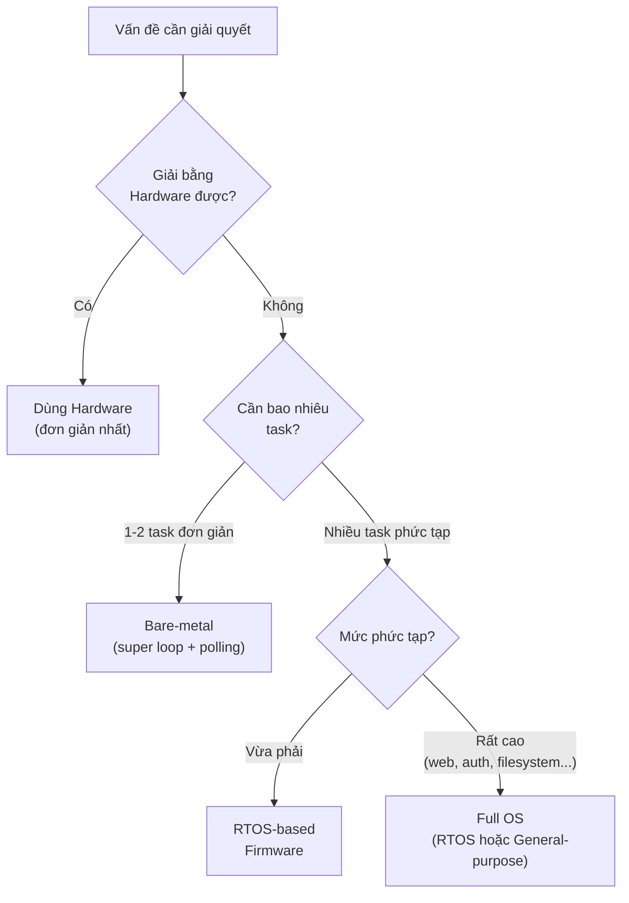
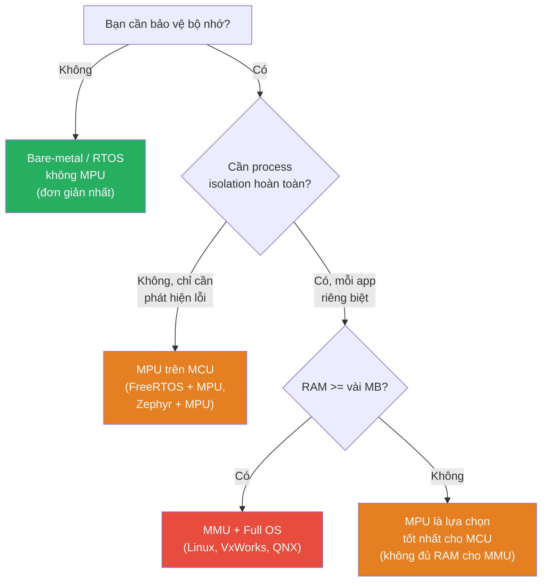
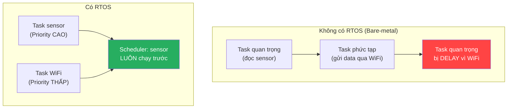
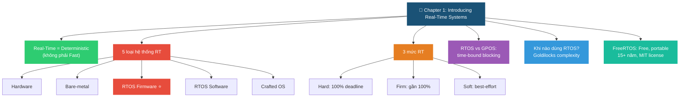

# <span style="color:#f1c40f">📘 Chapter 1: Introducing Real-Time Systems</span>
## <span style="color:#e67e22">Ghi chép kiến thức đầy đủ — Hands-On RTOS with Microcontrollers</span>

---

## <span style="color:#e67e22">📑 Mục lục</span>

> 💡 Dùng **Ctrl+F** và tìm `## 1.` hoặc `## 5.` để nhảy nhanh đến từng mục.

```
 1.  "Real-Time" là gì?              — Định nghĩa, deterministic response
 2.  Phạm vi yêu cầu thời gian      — 3 ví dụ ADC, hậu quả trễ deadline
 3.  Cách đảm bảo hành vi RT         — Nguyên tắc đơn giản hóa, flowchart
 4.  Năm loại hệ thống Real-Time     — Hardware → Bare-metal → RTOS Firmware → RTOS Software → Crafted OS
     ├─ 4.1 Hardware                  — FPGA, ASIC, discrete logic
     ├─ 4.2 Bare-metal Firmware       — Super loop, ISR, code mẫu
     ├─ 4.3 RTOS-based Firmware ⭐    — FreeRTOS + STM32, Zephyr, scheduler
     ├─ 4.4 RTOS-based Software       — VxWorks, QNX, MMU, process isolation
     ├─ 4.5 Carefully Crafted OS      — Embedded Linux, PREEMPT_RT
     ├─ Bảng tổng hợp 5 loại         — So sánh 7 tiêu chí
     ├─ So sánh MMU vs MPU            — 14 tiêu chí, code MPU STM32, flowchart
     └─ Phân loại nhanh 12 hệ thống  — FreeRTOS, Zephyr, Linux, Arduino...
 5.  Định nghĩa RTOS                 — Time-bound blocking, API timeout, firmware stack
 6.  Phân loại mức độ Real-Time      — Hard 🔴 / Firm 🟠 / Soft 🟢
 7.  Phạm vi RTOSes — Free vs Paid   — Safety cert, middleware, support
 8.  Tại sao sách chọn FreeRTOS?     — 15+ năm, MIT license, portable
 9.  Khi nào nên dùng RTOS?          — Bảng quyết định "Goldilocks"
 10.  Điểm khác biệt RTOS vs GPOS    — Code so sánh mutex timeout
 11.  Kiến thức bổ sung (FreeRTOS)   — Tính năng, License, Cấu trúc, Coding Style
 12.  Câu hỏi ôn tập                  — 6 câu hỏi + đáp án
  📌  Tóm tắt chương                  — Mindmap tổng kết
```

---

## <span style="color:#e67e22">1. "Real-Time" là gì?</span>

> **Định nghĩa**: Bất kỳ hệ thống nào có **phản hồi xác định (deterministic response)** đối với một sự kiện đều được coi là "real-time". Nếu hệ thống **bị coi là thất bại** khi không đáp ứng yêu cầu về thời gian → đó là hệ thống real-time.

### <span style="color:#1abc9c">🔑 Hai yếu tố quan trọng:</span>
1. **Tốc độ** của yêu cầu thời gian (nhanh hay chậm)
2. **Mức độ nghiêm trọng** nếu trễ deadline (hậu quả nặng hay nhẹ)

> [!IMPORTANT]
> Real-time ≠ Nhanh. Một hệ thống chạy ở 5 Hz vẫn có thể là real-time nếu nó **bắt buộc** phải đáp ứng trong thời gian quy định.

---

## <span style="color:#e67e22">2. Phạm vi yêu cầu thời gian (Timing Requirements)</span>

Sách minh họa bằng 3 ví dụ đọc ADC ở các tốc độ khác nhau:

### <span style="color:#1abc9c">Ví dụ 1: Hệ thống điều khiển nhiệt độ mỏ hàn (Soldering Iron)</span>

```
┌───────────┐    ADC     ┌────────────┐    Heater    ┌──────────┐
│ Temp      │───────────▶│    MCU     │─────────────▶│ Soldering│
│ Sensor    │            │            │              │ Iron Tip │
└───────────┘            └────────────┘              └──────────┘
```

| Tham số | Giá trị |
|---------|---------|
| Tốc độ đọc ADC | **50 Hz** (50 mẫu/giây) |
| Thời hạn đọc mỗi mẫu | **20 ms** |
| Tốc độ chạy control algorithm | **5 Hz** (200 ms/lần) |

→ Không quá nhanh, nhưng **vẫn là real-time** vì phải đảm bảo deadline.

### <span style="color:#1abc9c">Ví dụ 2: Oscilloscope / Network Analyzer</span>
- Đọc ADC ở tốc độ **hàng chục GHz**
- Chuyển đổi sang miền tần số, hiển thị đồ họa hàng chục lần/giây
- Yêu cầu thời gian **cực kỳ khắt khe**

### <span style="color:#1abc9c">Ví dụ 3: Motion Controller (ở giữa phổ)</span>
- PID control loop chạy từ **hàng trăm Hz** đến **hàng chục kHz**
- Cần ổn định trong hệ thống chuyển động nhanh

### <span style="color:#1abc9c">Hậu quả khi trễ deadline:</span>

| Hệ thống | Hậu quả |
|-----------|---------|
| Mỏ hàn | Kiểm soát nhiệt kém → hư linh kiện |
| Thiết bị đo | Đọc sai số liệu → mất uy tín, giảm doanh số |
| UAV / Flight Control | **Rơi máy bay** → nguy hiểm tính mạng |
| CNC milling | Hỏng sản phẩm gia công |

---

## <span style="color:#e67e22">3. Cách đảm bảo hành vi Real-Time</span>

### <span style="color:#1abc9c">Nguyên tắc vàng:</span>

> [!TIP]
> **Giữ hệ thống đơn giản nhất có thể** mà vẫn đáp ứng yêu cầu. Đừng thêm phức tạp không cần thiết!

### <span style="color:#1abc9c">Thứ tự ưu tiên giải pháp:</span>



**Ví dụ minh họa từ sách:**
- **Cửa kính ô tô** → Chỉ cần vài công tắc cơ và diode, **không cần MCU**
- **Máy nướng bánh** → Chỉ cần bật tắt heating element, **không cần code**
- **Nếu chỉ poll sensor** → Dùng `while` loop đơn giản, **không cần ISR**
- **Nếu chức năng đơn** → **Không cần RTOS**, nó chỉ gây phức tạp thêm

---

## <span style="color:#e67e22">4. Năm loại hệ thống Real-Time (Chi tiết)</span>

Sách phân loại theo **phương thức triển khai** (implementation), từ hardware thuần → software phức tạp. Mỗi loại có đặc trưng riêng về determinism, độ phức tạp, và use case.


| Hướng ← | Determinism cao, đơn giản | ... | Determinism thấp, phức tạp | Hướng → |
|----------|---------------------------|-----|----------------------------|---------|

---

### <span style="color:#1abc9c">4.1 Hardware (Phần cứng thuần) 🔧</span>

**Định nghĩa:** Hệ thống real-time được triển khai hoàn toàn bằng phần cứng, **không có code/firmware**.

#### <span style="color:#3498db">Các dạng hardware:</span>

| Dạng | Giải thích | Ví dụ cụ thể |
|------|-----------|---------------|
| **Discrete Logic** (logic rời) | Dùng các IC logic cơ bản (AND, OR, NOT, flip-flop) nối dây cứng | Mạch debounce nút nhấn, mạch chốt (latch) |
| **Analog Components** | Linh kiện analog: op-amp, comparator, transistor | Bộ lọc analog (low-pass filter), mạch khuếch đại sensor |
| **PLD / CPLD** | Programmable Logic Device — logic lập trình được, nhỏ gọn | State machine đơn giản, giao tiếp protocol cơ bản |
| **FPGA** | Field-Programmable Gate Array — hàng nghìn/triệu logic block lập trình được | Video codec, xử lý tín hiệu radar, bộ điều khiển motor tốc độ cao |
| **ASIC** | Application-Specific IC — chip thiết kế riêng cho 1 mục đích | Chip giải mã H.264 trong TV, chip mining Bitcoin |

#### <span style="color:#3498db">Tại sao hardware là "real-time nhất"?</span>

```
Hardware:  Input ──→ Output     (song song, gần tức thời, ns-level)
MCU:      Input ──→ ISR ──→ Process ──→ Output    (tuần tự, µs-ms level)
```

- Hardware xử lý **song song thực sự** — nhiều tín hiệu cùng lúc
- Không có "context switch", không có "scheduling delay"
- Thời gian phản hồi ở mức **nanosecond**

#### <span style="color:#3498db">Ví dụ thực tế:</span>
- **Cửa kính ô tô**: Chỉ cần vài công tắc cơ + diode → motor quay lên/xuống. Không cần MCU!
- **Bộ lọc tín hiệu ECG**: Dùng op-amp filter analog để loại nhiễu 50Hz trước khi ADC đọc
- **FPGA trong oscilloscope**: Đọc ADC hàng GHz, chuyển đổi FFT song song

#### <span style="color:#3498db">Nhược điểm:</span>
- ❌ **Không linh hoạt** (discrete logic không thay đổi được)
- ❌ **Cần chuyên gia FPGA/ASIC** — ít phổ biến hơn firmware developer
- ❌ **Chi phí cao** — FPGA lớn giá hàng trăm USD, custom ASIC giá triệu USD
- ❌ **Không phù hợp** cho logic phức tạp thay đổi thường xuyên

---

### <span style="color:#1abc9c">4.2 Bare-metal Firmware ⚡</span>

**Định nghĩa:** Firmware chạy trực tiếp trên MCU, **KHÔNG** có kernel/scheduler bên dưới. Code của bạn là "chủ nhân" duy nhất của CPU.

#### <span style="color:#3498db">Cấu trúc hoạt động:</span>

```c
// Đây là bare-metal điển hình
int main(void) {
    HAL_Init();
    SystemClock_Config();
    
    while (1) {                    // ← Super loop (vòng lặp chính)
        read_temperature();        // Task 1
        update_display();          // Task 2
        check_buttons();           // Task 3
        // Tất cả chạy TUẦN TỰ trong 1 vòng lặp
    }
}

// ISR — cách duy nhất để "ngắt" main loop
void TIM2_IRQHandler(void) {
    // Xử lý ngắt timer
    // Khi xong → quay lại main loop đúng chỗ bị ngắt
}
```

#### <span style="color:#3498db">Quy tắc vận hành:</span>

```
┌─────────────────────────────────────────────────┐
│ Main Loop chạy liên tục                         │
│   ↓                                              │
│ CHỈ bị gián đoạn bởi ISR (Interrupt)            │
│   ↓                                              │
│ ISR CHỈ bị gián đoạn bởi ISR priority CAO hơn   │
│   ↓                                              │
│ Khi ISR xong → quay lại Main Loop               │
└─────────────────────────────────────────────────┘
```

#### <span style="color:#3498db">Ví dụ thực tế:</span>
- **Đèn LED nhấp nháy trên STM32**: Chỉ cần toggle GPIO trong while loop
- **Đọc cảm biến nhiệt độ + hiển thị LCD**: 2 task đơn giản, super loop đủ
- **Arduino sketch đơn giản**: `setup()` + `loop()` chính là bare-metal
- **Bootloader STM32**: Code khởi động, không cần RTOS

#### <span style="color:#3498db">Khi nào bare-metal bắt đầu "đuối"?</span>

```
Bare-metal OK:          Bare-metal GẶP KHÓ:
┌──────────┐            ┌──────────┐
│ Task A   │            │ Task A (urgent, 1ms)     │
│ Task B   │ tuần tự    │ Task B (medium, 10ms)    │ → cần priority
│          │            │ Task C (slow, 100ms)     │ → cần preemption
└──────────┘            │ Task D (background)      │ → cần scheduling
                        │ + shared data protection │ → cần mutex
                        └──────────────────────────┘
```

> [!WARNING]
> Khi bare-metal phức tạp lên → bạn sẽ tự viết lại các cơ chế mà RTOS đã cung cấp sẵn (scheduler, mutex, queue...). Lúc đó hãy **dùng RTOS** — nó đã được test kỹ hàng chục năm.

---

### <span style="color:#1abc9c">4.3 RTOS-based Firmware ⭐ (Trọng tâm sách)</span>

**Định nghĩa:** Firmware chạy **scheduling kernel** (hạt nhân lập lịch) trên MCU. Kernel quản lý nhiều task, mỗi task "tưởng" mình có CPU riêng.

#### <span style="color:#3498db">Cấu trúc hoạt động:</span>

```c
// Task 1: Đọc sensor (priority CAO)
void SensorTask(void *pvParameters) {
    while (1) {
        read_adc();
        run_pid_control();
        vTaskDelay(pdMS_TO_TICKS(10));  // Chờ 10ms, nhường CPU
    }
}

// Task 2: Giao tiếp UART (priority THẤP)
void CommTask(void *pvParameters) {
    while (1) {
        send_telemetry();
        vTaskDelay(pdMS_TO_TICKS(100)); // Chờ 100ms
    }
}

int main(void) {
    HAL_Init();
    xTaskCreate(SensorTask, "Sensor", 128, NULL, 3, NULL);  // Priority 3
    xTaskCreate(CommTask,   "Comm",   128, NULL, 1, NULL);   // Priority 1
    vTaskStartScheduler();  // ← RTOS bắt đầu quản lý CPU
    // Code sau dòng này KHÔNG BAO GIỜ chạy tới
}
```

#### <span style="color:#3498db">Cơ chế hoạt động:</span>

```
Thời gian ──────────────────────────────────────────→

SensorTask:  ████░░░░░░████░░░░░░████░░░░░░████
CommTask:    ░░░░████░░░░░░████░░░░░░████░░░░░░
IdleTask:    ░░░░░░░░██░░░░░░░░██░░░░░░░░██░░░░

████ = đang chạy    ░░░░ = đang blocked/ready

→ Scheduler tự chuyển đổi giữa các task
→ SensorTask (priority cao) luôn được ưu tiên chạy trước
→ CommTask chỉ chạy khi SensorTask đang blocked (chờ delay)
```

#### <span style="color:#3498db">ISR Pattern trong RTOS:</span>

```
ISR fires → Xử lý NHANH nhất có thể → Signal task → Return
                (clear flag, đọc data)   (semaphore,    (task xử lý
                                          queue send)    phần nặng)
```

> [!IMPORTANT]
> Trong RTOS firmware, ISR **không nên xử lý nặng**. Nguyên tắc: ISR chỉ "đánh thức" task bằng semaphore/queue, rồi task sẽ làm phần xử lý phức tạp.

#### <span style="color:#3498db">🎯 FreeRTOS trên STM32 thuộc loại này!</span>

| Đặc điểm | FreeRTOS + STM32 |
|-----------|------------------|
| **Loại** | **RTOS-based Firmware** |
| **Processor** | ARM Cortex-M (MCU, không phải application processor) |
| **RAM** | Vài chục KB đến vài trăm KB (không có GB như Linux) |
| **Không có MMU** | Không có memory protection giữa các task (trừ MPU) |
| **Kernel** | FreeRTOS kernel (~9KB ROM) — rất nhỏ gọn |
| **Boot** | Khởi động trực tiếp vào firmware, không qua bootloader OS |
| **Filesystem** | Không có sẵn (phải thêm FatFS nếu cần) |
| **Networking** | Không có sẵn (phải thêm lwIP nếu cần) |

#### <span style="color:#3498db">🎯 Zephyr RTOS trên STM32 cũng thuộc loại này!</span>

| Đặc điểm | Zephyr + STM32 |
|-----------|----------------|
| **Loại** | **RTOS-based Firmware** |
| **Khác FreeRTOS** | Zephyr đầy đủ hơn — tích hợp sẵn networking (BLE, Thread, WiFi), filesystem, USB stack, logging, shell |
| **Kiến trúc** | Monolithic kernel, nhưng vẫn chạy trên MCU **không có MMU** |
| **Devicetree** | Mượn khái niệm từ Linux (`.dts` files) để mô tả hardware |
| **Build system** | Dùng CMake + West (phức tạp hơn FreeRTOS) |
| **Vẫn là firmware** | Dù "giống Linux" về phong cách, Zephyr vẫn là firmware chạy bare trên MCU |

```
So sánh FreeRTOS vs Zephyr (cùng loại RTOS-based Firmware):

FreeRTOS:   [Kernel nhỏ] + [bạn tự thêm middleware]
Zephyr:     [Kernel + Networking + BLE + USB + Logging + Shell + ...]
                    ↑ tích hợp sẵn, "batteries included"

Cả hai đều:
  ✅ Chạy trên MCU (STM32, nRF52, ESP32...)
  ✅ Không có MMU
  ✅ Là firmware, không phải OS đầy đủ
  ✅ Deterministic scheduling
```

#### <span style="color:#3498db">Ưu điểm RTOS-based Firmware:</span>
- ✅ Mỗi task **độc lập**, dễ viết/debug từng task riêng
- ✅ Hệ thống **responsive** — task ưu tiên cao luôn được chạy trước
- ✅ Tách biệt **thời gian** — control loop chạy đúng tần số mong muốn
- ✅ Kernel đã được **test kỹ** hàng triệu lần bởi cộng đồng

#### <span style="color:#3498db">Nhược điểm:</span>
- ❌ Thêm **complexity** — phải hiểu scheduling, synchronization
- ❌ Chia sẻ data giữa task → cần mutex/semaphore → **nếu sai → deadlock, priority inversion**
- ❌ Nếu thiết kế ISR sai → **timing jitter**, mất determinism
- ❌ Tiêu tốn thêm RAM/ROM cho kernel (tuy rất nhỏ)

---

### <span style="color:#1abc9c">4.4 RTOS-based Software 🖥️</span>

**Định nghĩa:** Software chạy trên **full OS** với **MMU (Memory Management Unit)** và **CPU** (application processor). Đây là OS thực sự, không phải firmware.

#### <span style="color:#3498db">Khác biệt cốt lõi so với RTOS Firmware:</span>

```
RTOS Firmware (FreeRTOS/Zephyr trên STM32):
  ┌────────────────────────────┐
  │ Task A │ Task B │ Task C   │  ← Tất cả chia sẻ CÙNG không gian bộ nhớ
  ├────────────────────────────┤     Không có MMU bảo vệ
  │     RTOS Kernel            │
  ├────────────────────────────┤
  │     MCU Hardware           │  ← RAM: KB ~ MB
  └────────────────────────────┘

RTOS Software (VxWorks trên PowerPC):
  ┌──────┐ ┌──────┐ ┌──────┐
  │App A │ │App B │ │App C │    ← Mỗi app có không gian bộ nhớ RIÊNG
  └──┬───┘ └──┬───┘ └──┬───┘     MMU bảo vệ, app crash không ảnh hưởng OS
     │        │        │
  ┌──┴────────┴────────┴───┐
  │    RTOS Kernel + MMU   │
  ├────────────────────────┤
  │  Application Processor │    ← RAM: MB ~ GB
  └────────────────────────┘
```

#### <span style="color:#3498db">Ví dụ thực tế:</span>

| Hệ thống | RTOS Software được dùng | Use case |
|-----------|------------------------|----------|
| **Máy bay Boeing 787** | VxWorks | Flight management, avionics display |
| **Mars Rover (Curiosity)** | VxWorks | Điều khiển robot trên sao Hỏa |
| **Thiết bị y tế MRI** | Green Hills Integrity | Điều khiển quét từ trường, xử lý ảnh |
| **Router Cisco cao cấp** | VxWorks / QNX | Routing packets với latency thấp |
| **Hệ thống vũ khí quân sự** | Green Hills Integrity | Tracking, radar processing |

#### <span style="color:#3498db">Đặc điểm:</span>
- ✅ Nhiều CPU core, clock GHz, RAM hàng GB
- ✅ **MMU** → process isolation (app crash không sập OS)
- ✅ Middleware phong phú: TCP/IP stack, GUI, filesystem, database
- ✅ Kernel đảm bảo task quan trọng **không bị block vô thời hạn**
- ✅ Có **safety certifications** (DO-178B cho hàng không, IEC 61508)
- ❌ Chi phí license rất cao (>$10,000 USD)
- ❌ Cần hardware mạnh (application processor, không phải MCU)

---

### <span style="color:#1abc9c">4.5 Carefully Crafted OS Software 🐧</span>

**Định nghĩa:** Dùng OS **đa dụng** (general-purpose) nhưng được **tinh chỉnh cẩn thận** để đạt hiệu năng gần real-time. Không phải RTOS thực sự, chỉ là "best-effort".

#### <span style="color:#3498db">🎯 Embedded Linux thuộc loại này!</span>

```
Linux thông thường:
  App gọi syscall → Kernel xử lý → Có thể bị delay bởi:
    - Kernel lock
    - Page fault (swap từ disk)
    - IRQ balancing
    - Scheduling policy không ưu tiên RT
    → KHÔNG deterministic

Linux + PREEMPT_RT patch:
  App gọi syscall → Kernel xử lý → Hầu hết delay được giảm:
    - Spinlock → mutex (preemptible)
    - Threaded IRQ (interrupt chạy như thread)
    - Priority inheritance
    → GẦN deterministic, nhưng KHÔNG đảm bảo 100%
```

#### <span style="color:#3498db">So sánh chi tiết Embedded Linux vs RTOS:</span>

| Đặc điểm | Embedded Linux | FreeRTOS/Zephyr (RTOS Firmware) |
|-----------|---------------|----------------------------------|
| **Loại** | **Carefully Crafted OS** | **RTOS-based Firmware** |
| **Processor** | Application processor (Cortex-A, RISC-V 64-bit) | MCU (Cortex-M, RISC-V 32-bit) |
| **RAM tối thiểu** | ~8 MB (thường 64MB-GB) | ~2 KB (thường 32-256 KB) |
| **ROM tối thiểu** | ~2 MB (kernel) | ~6-10 KB (kernel) |
| **MMU** | ✅ Bắt buộc | ❌ Không cần (có thể dùng MPU) |
| **Boot time** | Vài giây → vài chục giây | < 1ms → vài ms |
| **Determinism** | ❌ Không đảm bảo (best-effort) | ✅ Deterministic |
| **Worst-case latency** | ~50µs–1ms (PREEMPT_RT) | ~1µs–10µs |
| **Filesystem** | ✅ ext4, UBIFS, SquashFS... | ❌ Phải thêm (FatFS, LittleFS) |
| **Networking** | ✅ Full TCP/IP, WiFi, BLE, HTTP... | ⚠️ Có nhưng hạn chế |
| **GUI** | ✅ Qt, GTK, LVGL... | ⚠️ LVGL (đơn giản) |
| **Safety cert** | ❌ Rất khó certify | ✅ SafeRTOS, Zephyr (đang tiến tới) |
| **Ví dụ hardware** | Raspberry Pi, BeagleBone, i.MX6 | STM32, nRF52, ESP32 |

#### <span style="color:#3498db">Ví dụ thực tế Embedded Linux:</span>

| Hệ thống | Chi tiết |
|-----------|----------|
| **Raspberry Pi chạy robot** | Linux điều khiển camera + AI + motor — không phải hard real-time |
| **Smart TV** | Android TV (base Linux) — hiển thị video, app store |
| **Router WiFi** | OpenWrt (Linux) — routing, firewall, DHCP |
| **Máy in công nghiệp** | Linux xử lý file, giao diện — STM32 RTOS điều khiển đầu in |
| **Drone (phần AI)** | Linux xử lý computer vision — RTOS riêng cho flight control |

> [!WARNING]
> Embedded Linux **KHÔNG phù hợp** cho hard real-time hoặc safety-critical. Nếu cần cả hai: dùng **kiến trúc hybrid** (Linux + RTOS trên 2 core riêng biệt).

---

### <span style="color:#1abc9c">📊 Bảng tổng hợp 5 loại — So sánh toàn diện</span>

| Tiêu chí | Hardware | Bare-metal | RTOS Firmware | RTOS Software | Crafted OS |
|-----------|----------|------------|---------------|---------------|------------|
| **Determinism** | ⭐⭐⭐⭐⭐ | ⭐⭐⭐⭐ | ⭐⭐⭐ | ⭐⭐⭐ | ⭐⭐ |
| **Linh hoạt** | ⭐ | ⭐⭐ | ⭐⭐⭐ | ⭐⭐⭐⭐ | ⭐⭐⭐⭐⭐ |
| **Phức tạp** | Thấp-Cao | Thấp | Trung bình | Cao | Cao |
| **Latency** | ns | µs | µs | µs-ms | ms |
| **Safety cert** | Có | Có | Có (SafeRTOS) | Có (VxWorks) | Rất khó |
| **Chi phí dev** | Cao | Thấp | Thấp-TB | Cao | Trung bình |
| **Ví dụ** | FPGA | STM32 GPIO toggle | FreeRTOS, Zephyr | VxWorks | Embedded Linux |
---

### <span style="color:#1abc9c">🔐 Phụ lục: So sánh MMU vs MPU (Memory Management Unit vs Memory Protection Unit)</span>

Trong 5 loại hệ thống trên, **MMU** và **MPU** là hai khái niệm quan trọng giúp phân biệt "RTOS Firmware" và "RTOS Software". Cả hai đều liên quan đến **quản lý và bảo vệ bộ nhớ**, nhưng hoạt động ở mức độ rất khác nhau.

#### <span style="color:#3498db">Bản chất khác biệt:</span>

```
MMU (Memory Management Unit):                MPU (Memory Protection Unit):
┌─────────────────────────┐                   ┌─────────────────────────┐
│ App A thấy: 0x0000_0000 │ ← Virtual         │ Task A: truy cập       │
│ App B thấy: 0x0000_0000 │   Address          │   Region 0: R/W ✅     │
│ App C thấy: 0x0000_0000 │   (giống nhau!)    │   Region 1: R   ✅     │
│                         │                    │   Region 2: ---  ❌     │
│ Nhưng thực tế chúng ở   │                    │                         │
│ các vị trí RAM KHÁC     │                    │ Task B: truy cập       │
│ NHAU trong physical      │                    │   Region 0: R   ✅     │
│ memory                  │                    │   Region 1: R/W ✅     │
│                         │                    │   Region 2: ---  ❌     │
│ MMU dịch: Virtual →     │                    │                         │
│           Physical      │                    │ MPU CHỈ kiểm tra quyền │
│ + Page table            │                    │ KHÔNG dịch địa chỉ     │
│ + Swap to disk          │                    │ Tất cả dùng CÙNG       │
│ + Process isolation     │                    │ physical address        │
└─────────────────────────┘                   └─────────────────────────┘
```

#### <span style="color:#3498db">Bảng so sánh chi tiết:</span>

| Tiêu chí | MMU | MPU |
|-----------|-----|-----|
| **Tên đầy đủ** | Memory Management Unit | Memory Protection Unit |
| **Chức năng chính** | **Dịch địa chỉ** (virtual → physical) + bảo vệ bộ nhớ | **Chỉ bảo vệ** bộ nhớ (phân quyền truy cập) |
| **Virtual Memory** | ✅ Có — mỗi process thấy không gian địa chỉ riêng | ❌ Không — tất cả dùng chung physical address |
| **Dịch địa chỉ** | ✅ Virtual → Physical thông qua Page Table | ❌ Không dịch, địa chỉ là trực tiếp |
| **Page/Swap** | ✅ Có thể swap RAM ↔ disk (virtual memory mở rộng) | ❌ Không có, RAM là bao nhiêu dùng bấy nhiêu |
| **Process Isolation** | ✅ Hoàn toàn — app crash không ảnh hưởng app khác | ⚠️ Hạn chế — chỉ ngăn truy cập sai vùng, không tách biệt hoàn toàn |
| **Số vùng bảo vệ** | Hàng nghìn page (4KB/page) | **8–16 region** (ARMv7-M: 8, ARMv8-M: 16) |
| **Độ linh hoạt vùng** | Rất cao — page granularity 4KB | Hạn chế — vùng phải là power-of-2, aligned |
| **Phức tạp hardware** | Cao — cần TLB, page table walker | Thấp — chỉ cần comparator đơn giản |
| **Tiêu thụ điện** | Cao hơn (TLB lookup mỗi memory access) | Thấp hơn |
| **Có trên** | **Application Processor** (Cortex-A, x86, RISC-V 64-bit) | **MCU** (Cortex-M3/M4/M7/M33, một số RISC-V) |
| **OS điển hình** | Linux, VxWorks, QNX, Windows | FreeRTOS, Zephyr, bare-metal |
| **RAM thường dùng** | MB → GB | KB → MB |
| **Chi phí silicon** | Đắt hơn | Rẻ hơn nhiều |

#### <span style="color:#3498db">MMU hoạt động như thế nào?</span>

```
App A ghi vào 0x1000:          App B ghi vào 0x1000:
        │                              │
        ▼                              ▼
┌──────────────┐               ┌──────────────┐
│   Page Table │               │   Page Table │
│   của App A  │               │   của App B  │
│ 0x1000 → RAM│               │ 0x1000 → RAM│
│ tại 0x2_0000│               │ tại 0x5_0000│
└──────┬───────┘               └──────┬───────┘
       ▼                              ▼
  Physical RAM                  Physical RAM
  0x2_0000: data A              0x5_0000: data B
  
→ Cùng viết vào "0x1000" nhưng dữ liệu ở 2 nơi KHÁC NHAU
→ App A không thể đọc data của App B → ISOLATION
→ Nếu App A crash → kernel kill process A, App B vẫn chạy bình thường
```

#### <span style="color:#3498db">MPU hoạt động như thế nào?</span>

```
┌─────────────────── Physical RAM ────────────────────┐
│                                                      │
│  Region 0: 0x2000_0000 - 0x2000_3FFF  (16KB)       │
│  → FreeRTOS Kernel: R/W cho kernel, R cho task      │
│                                                      │
│  Region 1: 0x2000_4000 - 0x2000_5FFF  (8KB)        │
│  → Task A stack + data: R/W CHỈ cho Task A          │
│                                                      │
│  Region 2: 0x2000_6000 - 0x2000_7FFF  (8KB)        │
│  → Task B stack + data: R/W CHỈ cho Task B          │
│                                                      │
│  Region 3: 0x4000_0000 - 0x4000_FFFF  (Peripheral) │
│  → GPIO, UART...: R/W cho kernel, NO ACCESS cho task│
│                                                      │
└──────────────────────────────────────────────────────┘

Khi Task A cố truy cập Region 2 (data Task B):
  → MPU phát hiện vi phạm
  → Trigger MemManage Fault (exception)
  → Kernel xử lý: kill task hoặc báo lỗi
  
⚠️ NHƯNG: Task A và Task B vẫn thấy CÙNG physical address
   Không có virtual memory, không có isolation hoàn toàn
```

#### <span style="color:#3498db">Ví dụ cấu hình MPU trên STM32 (Cortex-M):</span>

```c
// Cấu hình MPU cho FreeRTOS trên STM32F4
void MPU_Config(void) {
    HAL_MPU_Disable();
    
    MPU_Region_InitTypeDef MPU_InitStruct;
    
    // Region 0: Flash (code) — Read-Only, Executable
    MPU_InitStruct.Enable           = MPU_REGION_ENABLE;
    MPU_InitStruct.Number           = MPU_REGION_NUMBER0;
    MPU_InitStruct.BaseAddress      = 0x08000000;           // Flash start
    MPU_InitStruct.Size             = MPU_REGION_SIZE_512KB;
    MPU_InitStruct.AccessPermission = MPU_REGION_PRIV_RO_URO; // Read-only
    MPU_InitStruct.IsShareable      = MPU_ACCESS_NOT_SHAREABLE;
    MPU_InitStruct.TypeExtField     = MPU_TEX_LEVEL0;
    MPU_InitStruct.SubRegionDisable = 0x00;
    MPU_InitStruct.DisableExec      = MPU_INSTRUCTION_ACCESS_ENABLE;
    HAL_MPU_ConfigRegion(&MPU_InitStruct);
    
    // Region 1: SRAM — Read/Write, No Execute (chống code injection)
    MPU_InitStruct.Number           = MPU_REGION_NUMBER1;
    MPU_InitStruct.BaseAddress      = 0x20000000;           // SRAM start
    MPU_InitStruct.Size             = MPU_REGION_SIZE_128KB;
    MPU_InitStruct.AccessPermission = MPU_REGION_FULL_ACCESS;
    MPU_InitStruct.DisableExec      = MPU_INSTRUCTION_ACCESS_DISABLE; // ← XN bit
    HAL_MPU_ConfigRegion(&MPU_InitStruct);
    
    // Region 2: Peripheral — chỉ Privileged mode mới truy cập được
    MPU_InitStruct.Number           = MPU_REGION_NUMBER2;
    MPU_InitStruct.BaseAddress      = 0x40000000;           // Peripheral start
    MPU_InitStruct.Size             = MPU_REGION_SIZE_512MB;
    MPU_InitStruct.AccessPermission = MPU_REGION_PRIV_RW;   // Chỉ kernel
    MPU_InitStruct.DisableExec      = MPU_INSTRUCTION_ACCESS_DISABLE;
    HAL_MPU_ConfigRegion(&MPU_InitStruct);
    
    HAL_MPU_Enable(MPU_PRIVILEGED_DEFAULT); // Enable MPU
}
```

#### <span style="color:#3498db">MPU bảo vệ được gì trên MCU?</span>

| Mối nguy | Không có MPU | Có MPU |
|----------|-------------|--------|
| Task A ghi đè stack Task B | ❌ Xảy ra âm thầm, khó debug | ✅ **MemManage Fault** → phát hiện ngay |
| Stack overflow | ❌ Ghi đè vùng nhớ khác, crash ngẫu nhiên | ✅ Fault ngay khi tràn stack |
| Task ghi vào Flash | ❌ Có thể corrupt firmware | ✅ Bị chặn → Read-Only |
| Code injection (chạy code từ RAM) | ❌ Có thể bị khai thác | ✅ **XN bit** — cấm execute từ RAM |
| Task truy cập peripheral trực tiếp | ❌ Bất kỳ task nào cũng ghi được GPIO | ✅ Chỉ kernel mode mới truy cập |

#### <span style="color:#3498db">Khi nào cần MMU vs MPU?</span>



> [!NOTE]
> **FreeRTOS hỗ trợ MPU** trên Cortex-M3/M4/M7/M33 thông qua `xTaskCreateRestricted()`. Zephyr cũng hỗ trợ MPU và thậm chí có **userspace** (tách kernel mode vs user mode) trên MCU có MPU.

> [!TIP]
> **Thực tế**: Phần lớn dự án RTOS trên STM32 **không bật MPU** vì thêm phức tạp và tốn RAM cho stack riêng. MPU thường chỉ bật trong dự án **safety-critical** hoặc khi cần chống stack overflow trong production.

---


### <span style="color:#1abc9c">🎯 Phân loại nhanh — Những hệ thống thực tế thuộc loại nào?</span>

| Hệ thống / RTOS | Thuộc loại | Giải thích |
|------------------|-----------|------------|
| **FreeRTOS trên STM32** | 🔴 **RTOS Firmware** | Kernel nhỏ chạy trên MCU, không MMU, deterministic |
| **Zephyr trên STM32/nRF52** | 🔴 **RTOS Firmware** | Tương tự FreeRTOS nhưng nhiều middleware hơn, vẫn là firmware trên MCU |
| **Zephyr trên board có MMU** | 🟠 **Ranh giới Firmware↔Software** | Zephyr hỗ trợ MMU nhưng vẫn thiết kế cho MCU, chưa phải full OS |
| **Embedded Linux (Yocto, Buildroot)** | 🟢 **Carefully Crafted OS** | General-purpose OS tinh chỉnh cho embedded, best-effort RT |
| **Linux + PREEMPT_RT** | 🟢 **Carefully Crafted OS** | Cải thiện latency nhưng vẫn không phải true RTOS |
| **Android Things / Android TV** | 🟢 **Carefully Crafted OS** | Base Linux, không real-time |
| **VxWorks** | 🟠 **RTOS Software** | Full RTOS cho application processor, có MMU, safety certified |
| **QNX (trong xe hơi)** | 🟠 **RTOS Software** | Microkernel RTOS, dùng trong automotive, medical |
| **Arduino sketch** | 🟣 **Bare-metal** | Không có scheduler, chỉ `setup()` + `loop()` |
| **STM32 HAL polling** | 🟣 **Bare-metal** | While loop + HAL, không RTOS |
| **FPGA điều khiển motor** | 🔵 **Hardware** | Logic cứng, không firmware |
| **STM32MP1 (Cortex-A + Cortex-M)** | 🔴+🟢 **Hybrid** | Cortex-A chạy Linux + Cortex-M chạy FreeRTOS |

> [!TIP]
> **Kiến trúc Hybrid** (ví dụ STM32MP1, i.MX8) ngày càng phổ biến: dùng core mạnh (Cortex-A) chạy Linux cho UI/networking, core nhỏ (Cortex-M) chạy RTOS cho real-time control. Kết hợp ưu điểm cả hai loại!

---

## <span style="color:#e67e22">5. Định nghĩa RTOS (Defining RTOS)</span>

### <span style="color:#1abc9c">RTOS là gì?</span>

OS thông thường (Windows, Linux, macOS) được tạo ra để:
- **Trừu tượng hóa hardware** → lập trình viên không cần quan tâm phần cứng cụ thể
- Cung cấp các **primitive** (nguyên thủy) như thread, mutex, semaphore để xây dựng chương trình phức tạp

```
┌──────────────────────────────────┐
│     Ứng dụng (Application)      │
│  ┌─────────┐    ┌────────────┐  │
│  │ Thread 1 │    │ Thread 2   │  │
│  │          │    │            │  │
│  │ lock(M)  │    │ lock(M)   │  │
│  │ write()  │    │ read()    │  │
│  │ unlock(M)│    │ unlock(M) │  │
│  └─────────┘    └────────────┘  │
│         ↕ Mutex M ↕              │
│      ┌──────────────┐           │
│      │ Shared Data   │           │
│      └──────────────┘           │
├──────────────────────────────────┤
│    OS Kernel (cung cấp thread,   │
│    mutex, scheduler...)          │
├──────────────────────────────────┤
│    Hardware                      │
└──────────────────────────────────┘
```

**Ưu điểm** của việc OS cung cấp primitive:
- ✅ Code ứng dụng **ít phức tạp hơn** (không cần tự viết thread/mutex)
- ✅ **Dễ hiểu** — cùng primitive được dùng bởi mọi lập trình viên
- ✅ **Portable** — code chạy trên bất kỳ hardware nào OS hỗ trợ

### <span style="color:#1abc9c">🔑 Điểm khác biệt CỐT LÕI: RTOS vs General-Purpose OS</span>

> [!IMPORTANT]
> **Một câu tóm gọn**: Trong RTOS, mọi blocking call đều có **timeout** (time-bound). Trong general-purpose OS, blocking call có thể chờ **vô thời hạn**.

#### <span style="color:#3498db">Ví dụ với Mutex:</span>

```c
/* ═══════════ General-Purpose OS (Linux, Windows) ═══════════ */
pthread_mutex_lock(&mutex);      // Chờ MÃI MÃI cho đến khi lấy được
// Thread bị block vô thời hạn
// Nếu thread khác giữ mutex và bị treo → DEADLOCK vĩnh viễn
access_shared_data();
pthread_mutex_unlock(&mutex);


/* ═══════════════════ RTOS (FreeRTOS) ═══════════════════════ */
if (xSemaphoreTake(mutex, pdMS_TO_TICKS(100)) == pdTRUE) {
    // ✅ Lấy được mutex TRONG 100ms
    access_shared_data();
    xSemaphoreGive(mutex);
} else {
    // ⚠️ TIMEOUT — không lấy được mutex sau 100ms
    // → Hệ thống BIẾT có vấn đề, có thể xử lý
    handle_error();
}
```

#### <span style="color:#3498db">Timeline so sánh:</span>

```
General-Purpose OS:
Thread 1:  ──[lock mutex]──────────────────────────────→ chờ mãi mãi...
Thread 2:  ════[đang giữ mutex, bị treo]════════════════════════════→
→ DEADLOCK: Thread 1 chờ vĩnh viễn, không ai biết

RTOS:
Task 1:    ──[take mutex, timeout=100ms]──┐
                                          │ 100ms
                                          ▼
           ──[TIMEOUT! → handle_error()]──→ tiếp tục chạy
Task 2:    ════[đang giữ mutex, bị treo]══════════════════→
→ PHÁT HIỆN: Task 1 biết mutex không available → xử lý kịp thời
```

#### <span style="color:#3498db">Áp dụng cho TẤT CẢ blocking API trong FreeRTOS:</span>

| API | Timeout parameter | Ý nghĩa |
|-----|-------------------|---------|
| `xSemaphoreTake(sem, timeout)` | `timeout` | Chờ semaphore tối đa N tick |
| `xQueueReceive(queue, &data, timeout)` | `timeout` | Chờ nhận data từ queue tối đa N tick |
| `xQueueSend(queue, &data, timeout)` | `timeout` | Chờ gửi data vào queue tối đa N tick |
| `ulTaskNotifyTake(clear, timeout)` | `timeout` | Chờ notification tối đa N tick |
| `xEventGroupWaitBits(..., timeout)` | `timeout` | Chờ event flags tối đa N tick |

Giá trị timeout đặc biệt:
- `0` — **không chờ**, trả về ngay lập tức (polling)
- `portMAX_DELAY` — chờ **vô thời hạn** (giống general-purpose OS, dùng khi chắc chắn sẽ nhận được)

> [!NOTE]
> Chính **timeout này** tạo nên tính **deterministic** — hệ thống luôn biết trước thời gian tối đa một task có thể bị block, từ đó tính toán được worst-case response time.

### <span style="color:#1abc9c">Định nghĩa chính thức từ sách:</span>

> *"Any OS that provides a **deterministic way of executing** a given piece of code can be considered a real-time OS."*
>
> — Bất kỳ OS nào cung cấp cách thực thi code **có tính xác định** (deterministic) đều được coi là RTOS.

### <span style="color:#1abc9c">FreeRTOS trong ARM Firmware Stack:</span>

```
┌─────────────────────────────────────────────────────┐
│              User Application Code                  │ ← Code của bạn
│  (Task A, Task B, Task C...)                        │
├─────────────────────────────────────────────────────┤
│         FreeRTOS API (standardized)                 │ ← Giao diện THỐNG NHẤT
│  xTaskCreate, xSemaphoreTake, xQueueSend...         │   cho mọi hardware
├─────────────────────────────────────────────────────┤
│     FreeRTOS Kernel                                 │
│  + Scheduler   + Memory management                  │
│  + Port layer  (code riêng cho từng MCU)            │
├──────────┬──────────────────────────────────────────┤
│ CMSIS    │   Vendor HAL / Drivers (STM32 HAL)       │
│ (ARM     │   hoặc truy cập Register trực tiếp       │
│ standard)│                                           │
├──────────┴──────────────────────────────────────────┤
│              Hardware (STM32 MCU)                    │
│  GPIO, UART, SPI, I2C, ADC, Timer, DMA...           │
└─────────────────────────────────────────────────────┘
```

**Điểm quan trọng:**
- User code dùng **cùng FreeRTOS API** bất kể MCU bên dưới (STM32F4, STM32H7, nRF52...)
- FreeRTOS **không ngăn cản** truy cập trực tiếp vendor driver, CMSIS, hoặc hardware register
- → Code portable **khi dùng FreeRTOS API**, nhưng vẫn có thể viết code hiệu suất cao **khi truy cập trực tiếp hardware** (đánh đổi portability)

### <span style="color:#1abc9c">Tại sao RTOS quan trọng cho Embedded?</span>



| Vấn đề | Bare-metal | RTOS |
|--------|-----------|------|
| Task sensor bị delay bởi WiFi | ❌ Có thể xảy ra | ✅ Scheduler đảm bảo sensor chạy trước |
| Thêm task mới | 😰 Phải sửa toàn bộ super loop | 😊 Chỉ cần `xTaskCreate()` |
| Timing chính xác | 😰 Phụ thuộc vào thời gian chạy các task khác | ✅ `vTaskDelayUntil()` đảm bảo chu kỳ chính xác |
| Debug timing | 😰 Oscilloscope + logic analyzer | ✅ SEGGER SystemView hiển thị timeline task |

---

## <span style="color:#e67e22">6. Phân loại mức độ Real-Time</span>


### <span style="color:#1abc9c">6.1 Hard Real-Time 🔴</span>

| Tiêu chí | Chi tiết |
|-----------|----------|
| **Yêu cầu** | Phải đáp ứng deadline **100% thời gian** |
| **Trễ 1 lần** | = **Thất bại hệ thống** |
| **Ví dụ** | Máy tạo nhịp tim (pacemaker) → trễ = bệnh nhân tử vong; CNC milling → hỏng sản phẩm |

> [!CAUTION]
> Hard real-time **không nhất thiết** liên quan đến an toàn tính mạng (safety-critical). CNC hỏng sản phẩm cũng là hard real-time failure.

### <span style="color:#1abc9c">6.2 Firm Real-Time 🟠</span>

| Tiêu chí | Chi tiết |
|-----------|----------|
| **Yêu cầu** | Phải đáp ứng deadline **gần như mọi lúc** |
| **Trễ vài lần** | Chấp nhận được, nhưng trễ nhiều/thường xuyên → hỏng |
| **Ví dụ** | Video/Audio mất đồng bộ tạm thời → OK; Mỏ hàn mất vài mẫu ADC → OK, nhưng mất nhiều → mất kiểm soát nhiệt |

### <span style="color:#1abc9c">6.3 Soft Real-Time 🟢</span>

| Tiêu chí | Chi tiết |
|-----------|----------|
| **Yêu cầu** | **Best-effort** — cố gắng đáp ứng deadline |
| **Trễ** | Được chấp nhận thường xuyên hơn |
| **Ví dụ** | Cruise control xe hơi → người lái chỉ kỳ vọng tốc độ "gần đúng", không cần chính xác tuyệt đối |

> [!NOTE]
> Sách nhấn mạnh: **Đừng quá bận tâm** phân biệt firm vs soft. Ngay cả trong ngành cũng không có định nghĩa thống nhất. Điều quan trọng là **biết rõ yêu cầu hệ thống** và thiết kế giải pháp phù hợp!

---

## <span style="color:#e67e22">7. Phạm vi RTOSes — Free vs Paid</span>

### <span style="color:#1abc9c">RTOSes cho MCU nhỏ (8–32 bit):</span>
- **FreeRTOS**, Keil RTX, Micrium µC, ThreadX
- Cung cấp compact real-time kernel

### <span style="color:#1abc9c">RTOSes cho Application Processors (32–64 bit):</span>
- Wind River **VxWorks**, Wind River Linux
- Green Hills **Integrity OS**
- Linux + **PREEMPT_RT**

### <span style="color:#1abc9c">Tại sao phải trả tiền khi có free?</span>

| Yếu tố | Free RTOS | Paid RTOS |
|---------|-----------|-----------|
| **Safety Approvals** | Không có (trừ SafeRTOS) | DO-178B/C (hàng không), IEC 61508 SIL 3, ISO 26262 ASILD |
| **Middleware** | Có một số open source | Suite đầy đủ: filesystem, networking, GUI, industrial protocols |
| **Customer Support** | Community | Hỗ trợ trực tiếp từ vendor (email, phone) |
| **Chi phí** | Free | Có thể > **$10,000 USD** |

> [!TIP]
> **WITTENSTEIN SafeRTOS** là phiên bản phái sinh từ FreeRTOS đã có chứng nhận cho industrial, medical, và automotive.

---

## <span style="color:#e67e22">8. Tại sao sách chọn FreeRTOS?</span>

| Lý do | Chi tiết |
|-------|----------|
| **Phổ biến** | Một trong những RTOS phổ biến nhất cho MCU, đã tồn tại **hơn 15 năm** |
| **Portable** | Đã port sang **hàng chục platform** |
| **Chuyển đổi dễ** | Kiến thức FreeRTOS → dễ migrate sang RTOS khác hoặc hardware khác |
| **Miễn phí** | Phân phối theo **MIT license** |
| **Đại diện** | Hầu hết embedded engineer đều biết/đã dùng FreeRTOS |

### <span style="color:#1abc9c">FreeRTOS trong ARM Firmware Stack:</span>

```
┌─────────────────────────────────────────────┐
│              User Application Code          │ ← Code của bạn
├─────────────────────────────────────────────┤
│         FreeRTOS API (standardized)         │ ← Giao diện thống nhất
├─────────────────────────────────────────────┤
│     FreeRTOS Kernel + Hardware Port         │
├──────────┬──────────────────────────────────┤
│ CMSIS    │   Vendor HAL / Drivers           │ ← STM32 HAL
├──────────┴──────────────────────────────────┤
│              Hardware (MCU)                 │ ← STM32
└─────────────────────────────────────────────┘
```

**Điểm quan trọng:**
- User code dùng **cùng FreeRTOS API** bất kể hardware bên dưới
- FreeRTOS **không ngăn cản** user code truy cập trực tiếp vendor driver, CMSIS, hoặc hardware register
- API chuẩn hóa → code **dễ migrate** giữa các hardware target

---

## <span style="color:#e67e22">9. Khi nào nên dùng RTOS?</span>

### <span style="color:#1abc9c">Bảng quyết định:</span>

| Mức độ phức tạp | Giải pháp phù hợp | Ví dụ |
|------------------|--------------------|-------|
| **Cực đơn giản** | Hardware (AND gate, relay...) | Monitor 2 trạng thái → trigger alert |
| **Đơn giản** (1-2 task) | Bare-metal firmware | Motor control + encoder tracking |
| **Vừa phải** ⭐ | **RTOS firmware** | Nhiều actuator + sensor + local storage + networking (CAN, Ethernet) |
| **Rất phức tạp** | Full OS (RTOS hoặc general-purpose) | Web server + user auth + file sharing + multiple protocols |
| **Hybrid** | Multi-core (1 core RTOS + 1 core general OS) | Kết hợp real-time control + complex networking |

### <span style="color:#1abc9c">RTOS phát huy tốt nhất khi:</span>
- ✅ **Nhiều task** cần chạy **bất đồng bộ** với nhau
- ✅ Cần đảm bảo task **ưu tiên thấp** (networking, filesystem) **không can thiệp** task ưu tiên cao (sensor, actuator)
- ✅ Control system cần chạy ở **khoảng thời gian xác định**
- ✅ Độ phức tạp ở mức **"Goldilocks"** — không quá đơn giản, không quá phức tạp

### <span style="color:#1abc9c">RTOS KHÔNG cần thiết khi:</span>
- ❌ Vấn đề giải quyết được bằng **hardware đơn giản**
- ❌ Chỉ có **1-2 task đơn giản** (bare-metal đủ tốt)
- ❌ MCU bị **giới hạn nghiêm trọng** về ROM/RAM

---

## <span style="color:#e67e22">10. Điểm khác biệt cốt lõi: RTOS vs General-Purpose OS</span>

| Đặc điểm | General-Purpose OS | RTOS |
|-----------|-------------------|------|
| **Blocking call** | Chờ **vô thời hạn** | Chờ có **timeout** (time-bound) |
| **Ví dụ Mutex** | Thread chờ mutex mãi mãi | Thread chờ mutex tối đa N ms → nhận thông báo nếu timeout |
| **Mục tiêu** | Throughput, user experience | **Deterministic execution** |

```
// General-purpose OS:
mutex_lock(mutex);          // Chờ mãi mãi

// RTOS:
mutex_lock(mutex, 100ms);   // Chờ tối đa 100ms
                             // → Trả về TIMEOUT nếu không lấy được
```

> [!IMPORTANT]
> **Đây là đặc điểm cốt lõi nhất của RTOS**: Mọi blocking system call đều có **giới hạn thời gian** (time-bound), tạo nên tính **deterministic** cho hệ thống.

---

## <span style="color:#e67e22">11. Kiến thức bổ sung (Mastering the FreeRTOS Kernel)</span>

> 📗 **Bổ sung từ:** Mastering the FreeRTOS Kernel - Richard Barry (Preface + Chapter 1)

### <span style="color:#1abc9c">11.1 Các tính năng chính của FreeRTOS</span>

FreeRTOS cung cấp một tập hợp các tính năng phong phú, đáp ứng nhu cầu của hầu hết các ứng dụng nhúng:

- Hoạt động ưu tiên ngắt (Pre-emptive) hoặc hợp tác (co-operative).
- Gán mức ưu tiên task rất linh hoạt (Very flexible task priority assignment).
- Cơ chế thông báo task (task notification) linh hoạt, nhanh và nhẹ.
- Hỗ trợ Queues, Binary semaphores, Counting semaphores, Mutexes, và Recursive Mutexes.
- Có Software timers và Event groups.
- Hỗ trợ các hàm callback (Tick hook functions, Idle hook callback function).
- Tính năng kiểm tra tràn stack (Stack overflow checking).
- Ghi nhận dấu vết (Trace recording) và thu thập thống kê thời gian chạy task.
- Mô hình lồng ngắt hoàn chỉnh (Full interrupt nesting model) trên một số kiến trúc.
- Tính năng Tick-less cho các ứng dụng yêu cầu tiêu thụ điện năng cực thấp (extreme low power).
- Quản lý stack ngắt bằng phần mềm khi cần (để tiết kiệm RAM).
- Tuỳ chọn cấp phép thương mại và hỗ trợ chuyên nghiệp (thông qua OpenRTOS).
- Cung cấp công cụ mô phỏng/phát triển miễn phí và đầy đủ tính năng trên Windows (FreeRTOS simulator).

### <span style="color:#1abc9c">11.2 Hệ sinh thái cấp phép FreeRTOS (Licensing Ecosystem)</span>

| Phiên bản | Đặc điểm cấp phép |
|-----------|-------------------|
| **FreeRTOS** | - Miễn phí, mã nguồn mở (MIT license).<br>- Phù hợp cho cả thương mại và sở thích cá nhân.<br>- Không có bảo hành hay hỗ trợ từ Real Time Engineers Ltd. |
| **OpenRTOS** | - Cấp phép thương mại từ WITTENSTEIN.<br>- Chung mã nguồn với FreeRTOS.<br>- Loại bỏ yêu cầu ghi nhận nguồn gốc của GPL/MIT.<br>- Bao gồm hỗ trợ chuyên nghiệp và bảo hành.<br>- Dành cho các công ty cần bảo đảm pháp lý. |
| **SafeRTOS** | - Dựa trên FreeRTOS nhưng được phát triển độc lập.<br>- Chứng nhận IEC 61508 SIL 3 (pre-certified).<br>- Dành cho các ứng dụng yêu cầu an toàn tính mạng nghiêm ngặt (safety-critical).<br>- Phát triển bằng phương pháp hình thức (formal methods).<br>- API bị khóa (không thay đổi cấu hình động).<br>- Được tích hợp sẵn trong ROM của một số MCU (ví dụ: TI Stellaris). |

### <span style="color:#1abc9c">11.3 Cấu trúc phân phối FreeRTOS</span>

> [!TIP]
> Cấu trúc thư mục của FreeRTOS được thiết kế rất tối giản để dễ dàng tích hợp vào project.

Chỉ có hai thư mục cấp cao nhất:
1. `FreeRTOS/` - Chứa mã nguồn kernel và các ứng dụng demo.
2. `FreeRTOS-Plus/` - Chứa các thành phần mở rộng trong hệ sinh thái và demo tương ứng.

#### <span style="color:#3498db">Các file mã nguồn cốt lõi (Core source files):</span>
Nằm trong `FreeRTOS/Source/`:
- `tasks.c` (Luôn luôn cần thiết)
- `queue.c` (Luôn luôn cần thiết)
- `list.c` (Luôn luôn cần thiết)
- `timers.c` (Chỉ cần nếu sử dụng software timers)
- `event_groups.c` (Chỉ cần nếu sử dụng event groups)
- `croutine.c` (Đã deprecated, không còn được khuyến nghị sử dụng)

#### <span style="color:#3498db">Lớp giao tiếp phần cứng (Portable layer):</span>
Nằm trong `FreeRTOS/Source/portable/[compiler]/[architecture]/`:
- `port.c` - Chứa mã scheduler đặc thù cho từng kiến trúc.
- `portmacro.h` - Định nghĩa các kiểu dữ liệu đặc thù của kiến trúc.
- `MemMang/` - Chứa 5 phương pháp cấp phát bộ nhớ heap (`heap_1.c` đến `heap_5.c`).

#### <span style="color:#3498db">Sơ đồ yêu cầu build tối thiểu:</span>
```text
Project includes:
├── FreeRTOS/Source/tasks.c
├── FreeRTOS/Source/queue.c
├── FreeRTOS/Source/list.c
├── FreeRTOS/Source/portable/[compiler]/[arch]/port.c
├── FreeRTOS/Source/portable/MemMang/heap_x.c
└── FreeRTOSConfig.h (project-specific)
```

### <span style="color:#1abc9c">11.4 Quy ước đặt tên và Coding Style của FreeRTOS</span>

> [!IMPORTANT]
> Nắm vững quy ước đặt tên này là **chìa khóa** để đọc hiểu mã nguồn FreeRTOS.

#### <span style="color:#3498db">Tiền tố tên biến (Variable Naming Prefixes):</span>
| Tiền tố | Kiểu dữ liệu | Ví dụ |
|---|---|---|
| `c` | `char` | `cCharacter` |
| `s` | `int16_t` (short) | `sShortValue` |
| `l` | `int32_t` (long) | `lLongValue` |
| `x` | `BaseType_t`, `TickType_t`, hoặc các kiểu cấu trúc không chuẩn | `xStatus`, `xTickCount` |
| `u` | `unsigned` (thường kết hợp) | `ucByte` (unsigned char) |
| `p` | pointer (con trỏ) | `pcString` (pointer to char) |

#### <span style="color:#3498db">Quy ước đặt tên hàm (Function Naming Convention):</span>
Cú pháp: `[tiền_tố_kiểu_trả_về][tên_file_nguồn]_[TênHàm]`

Ví dụ:
- `vTaskPrioritySet()` → Trả về `void` (`v`), định nghĩa trong `tasks.c` (`Task`).
- `xQueueReceive()` → Trả về `BaseType_t` (`x`), định nghĩa trong `queue.c` (`Queue`).
- `pvTimerGetTimerID()` → Trả về pointer to void (`pv`), định nghĩa trong `timers.c` (`Timer`).

> [!NOTE]
> Các hàm cục bộ trong file (private functions) sẽ có tiền tố `prv` (ví dụ: `prvIdleTask`).

#### <span style="color:#3498db">Quy ước đặt tên Macro:</span>
- Viết in hoa toàn bộ, được tiền tố bởi module định nghĩa nó.
- `portMAX_DELAY` → Định nghĩa trong portable layer.
- `taskENTER_CRITICAL` → Định nghĩa trong `task.h`.
- `pdTRUE`, `pdFALSE`, `pdPASS`, `pdFAIL` → Định nghĩa trong `projdefs.h`.
- `configUSE_PREEMPTION` → Định nghĩa trong `FreeRTOSConfig.h`.
- `errQUEUE_FULL` → Định nghĩa trong `projdefs.h`.

#### <span style="color:#3498db">Các định nghĩa kiểu dữ liệu phổ biến:</span>
- `TickType_t`: Là `uint16_t` hoặc `uint32_t` (tùy thuộc vào `configUSE_16_BIT_TICKS`).
- `BaseType_t`: Kiểu dữ liệu hiệu quả nhất cho kiến trúc (ví dụ: 32-bit trên ARM là `int32_t`).
- `portTickType`: Tên cũ của `TickType_t` (vẫn còn xuất hiện trong các codebase cũ).

### <span style="color:#1abc9c">11.5 Vai trò của FreeRTOSConfig.h</span>

- **BẮT BUỘC:** Mỗi ứng dụng sử dụng FreeRTOS đều phải có file `FreeRTOSConfig.h` riêng.
- Chứa các hằng số cấu hình cụ thể cho ứng dụng để điều chỉnh hành vi của kernel.
- File này phải nằm trong include path của compiler.

**Các danh mục cấu hình chính:**
1. **Scheduling (Lập lịch):** `configUSE_PREEMPTION`, `configUSE_TIME_SLICING`
2. **Timing (Thời gian):** `configTICK_RATE_HZ`, `configCPU_CLOCK_HZ`
3. **Memory (Bộ nhớ):** `configTOTAL_HEAP_SIZE`, `configMINIMAL_STACK_SIZE`
4. **Features (Tính năng):** `configUSE_MUTEXES`, `configUSE_COUNTING_SEMAPHORES`, `configUSE_TIMERS`
5. **Debug (Kiểm lỗi):** `configCHECK_FOR_STACK_OVERFLOW`, `configUSE_TRACE_FACILITY`
6. **API Inclusion (Bật/tắt API):** `INCLUDE_vTaskDelete`, `INCLUDE_vTaskDelay`, v.v.

---

## <span style="color:#e67e22">12. Câu hỏi ôn tập (từ sách)</span>

1. Hệ thống real-time có **luôn cần phải cực nhanh** không?
   > → **Không.** Real-time = deterministic, không phải fast. Ví dụ mỏ hàn chỉ cần 5 Hz.

2. RTOS có **luôn cần thiết** cho hệ thống real-time không?
   > → **Không.** Hardware thuần hoặc bare-metal firmware cũng đảm bảo real-time.

3. Firmware có phải **cách duy nhất** đáp ứng yêu cầu real-time?
   > → **Không.** Hardware (FPGA, ASIC), RTOS software, crafted OS cũng là các lựa chọn.

4. Hệ thống real-time là gì?
   > → Hệ thống có **phản hồi xác định** với sự kiện; bị coi là thất bại nếu trễ deadline.

5. Kể 3-4 loại hệ thống real-time?
   > → Hardware, Bare-metal firmware, RTOS firmware, RTOS software, Carefully crafted OS.

6. Khi nào nên dùng RTOS?
   > → Khi có **nhiều task bất đồng bộ**, độ phức tạp vừa phải ("Goldilocks"), cần đảm bảo task ưu tiên cao không bị block bởi task ưu tiên thấp.

---

## <span style="color:#e67e22">📌 Tóm tắt chương (Key Takeaways)</span>



