# <span style="color:#f1c40f">📘 Chapter 2: Understanding RTOS Tasks</span>
```
 1.  Super Loop là gì?                — Định nghĩa, đặc điểm, code mẫu
 2.  Super Loop trong hệ thống RT     — Jitter, polling, giới hạn của super loop
 3.  Song song hóa với Super Loop     — Interrupt, DMA, ISR pattern
     ├─ 3.1 Interrupts & NVIC        — ISR, nested interrupt, tail-chaining
     ├─ 3.2 ISR + Super Loop         — Flag pattern, buffer pattern
     ├─ 3.3 DMA                      — Cơ chế, so sánh CPU vs DMA, ưu/nhược
     └─ 3.4 Scaling a Super Loop     — Giới hạn khi hệ thống phức tạp
 4.  RTOS Task là gì?                 — So sánh task vs super loop, private stack, priority
 5.  Mô hình lập trình Task          — Pseudo-code, mỗi task = 1 while loop riêng
 6.  Round-Robin Scheduling           — Time slice, fair share, context switch
 7.  Preemptive Scheduling            — Priority-based, task starvation, preemption example
 8.  Quản lý Task Cơ bản (Task Management API) — Tạo, xóa, delay, priority
 9.  Scheduling Algorithms Nâng cao   — 4 Modes, priority selection
 10. Context Switch & Safety          — Cơ chế 7 bước ARM, Stack Overflow Detection
 11. So sánh: Super Loop vs RTOS Task — Bảng ưu/nhược điểm toàn diện
 12. Câu hỏi ôn tập                  — 7 câu hỏi + đáp án
 📌  Tóm tắt chương                  — Diagram tổng kết
```

---

## <span style="color:#e67e22">1. Super Loop là gì?</span>

### <span style="color:#1abc9c">Định nghĩa</span>

**Super loop** = một vòng lặp `while(1)` vô hạn trong `main()`, tuần tự gọi các function. Đây là mô hình lập trình **đầu tiên** mà mọi embedded engineer gặp.

### <span style="color:#1abc9c">Đặc điểm cốt lõi của Embedded:</span>

> [!IMPORTANT]
> Embedded code **không có exit point** — `main()` **không bao giờ return**. MCU bắt đầu khi cấp nguồn và kết thúc đột ngột khi mất nguồn. Không có shutdown task, không free memory.

### <span style="color:#1abc9c">Code mẫu Super Loop:</span>

```c
void main(void)
{
    // Khởi tạo phần cứng
    HAL_Init();
    SystemClock_Config();
    GPIO_Init();
    UART_Init();
    
    while(1)  // ← SUPER LOOP — không bao giờ thoát
    {
        func1();   // Đọc sensor
        func2();   // Xử lý dữ liệu
        func3();   // Gửi kết quả qua UART
        // Lặp lại mãi mãi...
    }
}
```

### <span style="color:#1abc9c">Execution Flow:</span>

```
        ┌──────────────────────────────────────┐
        │              main()                  │
        │                                      │
        │   ┌──────┐  ┌──────┐  ┌──────┐      │
    ───►│   │func1 │─►│func2 │─►│func3 │──┐   │
        │   └──────┘  └──────┘  └──────┘  │   │
        │   ▲                              │   │
        │   └──────────────────────────────┘   │
        │          while(1) — lặp lại          │
        └──────────────────────────────────────┘
```

**Đặc điểm:**
- ✅ **Cực kỳ đơn giản** — dễ viết, dễ hiểu
- ✅ Phù hợp cho hệ thống **ít task, không phức tạp**
- ❌ Mỗi function **phải chạy xong** trước khi function tiếp theo được gọi
- ❌ Các function **phụ thuộc lẫn nhau** về thời gian

---

## <span style="color:#e67e22">2. Super Loop trong hệ thống Real-Time</span>

### <span style="color:#1abc9c">Vấn đề: Delay truyền tải (Propagation Delay)</span>

Khi một function bị chậm, **tất cả** function phía sau đều bị ảnh hưởng:

```
Lần 1 (bình thường):
┌──────────┐┌──────────┐┌──────────┐
│  func1   ││  func2   ││  func3   │  ← Tổng: 30µs
│  10µs    ││  10µs    ││  10µs    │
└──────────┘└──────────┘└──────────┘

Lần 2 (func1 bị chậm):
┌─────────────────────────────────────┐┌──────────┐┌──────────┐
│             func1                   ││  func2   ││  func3   │  ← Tổng: 120µs!
│             100ms !!!               ││  10µs    ││  10µs    │
└─────────────────────────────────────┘└──────────┘└──────────┘

→ func2 và func3 bị delay 90ms so với bình thường
→ Nếu func3 cần phản hồi event → TRỄ DEADLINE!
```

### <span style="color:#1abc9c">Khái niệm Jitter:</span>

**Jitter** = sự **chênh lệch** về thời gian phản hồi giữa các lần lặp khác nhau.

```
Sự kiện bên ngoài (rising edge):
  Event 1        Event 2            Event 3
    ↓               ↓                  ↓
────┤───────────────┤──────────────────┤──────────── thời gian
    │               │                  │
    │◄─ 5µs ──►│    │◄── 50µs ───►│   │◄─ 8µs ─►│
               ↓                  ↓              ↓
            func3              func3          func3
            phát hiện          phát hiện      phát hiện

Latency:    5µs              50µs            8µs
Jitter:     |◄────── 45µs ──────►|
            (chênh lệch giữa min và max latency)
```

> [!NOTE]
> Nếu hệ thống có **jitter tối đa đã biết** (known worst-case jitter) → hệ thống được coi là **deterministic**. Đây là yêu cầu cốt lõi của real-time system.

### <span style="color:#1abc9c">Polling — Giới hạn:</span>

| Đặc điểm | Chi tiết |
|-----------|----------|
| **Cơ chế** | Loop liên tục kiểm tra flag/register |
| **Ưu điểm** | Đơn giản, dễ hiểu |
| **Nhược điểm** | Lãng phí CPU cycle, không responsive nếu loop dài |
| **Khi nào OK** | Chỉ khi hệ thống có **một event duy nhất** cần theo dõi |
| **Thực tế** | Hầu hết hệ thống real-world **không phù hợp** chỉ dùng polling |

---

## <span style="color:#e67e22">3. Song song hóa với Super Loop</span>

MCU đơn core **không thể chạy song song thực sự**, nhưng có 3 cơ chế hardware giúp **gần song song**:

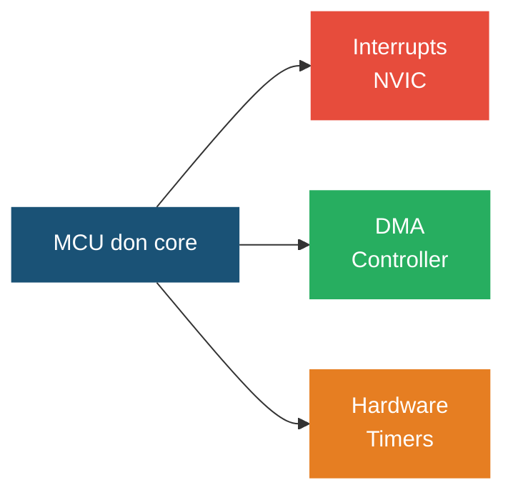

### <span style="color:#1abc9c">3.1 Interrupts & NVIC</span>

**Interrupt** = tín hiệu phần cứng yêu cầu CPU **nhảy ngay** vào ISR (Interrupt Service Routine) khi sự kiện xảy ra.

#### <span style="color:#3498db">NVIC là gì?</span>

**NVIC** = **Nested Vectored Interrupt Controller** — bộ điều khiển ngắt chuẩn của ARM Cortex-M, tích hợp sẵn **bên trong CPU core** (không phải peripheral bên ngoài).

```
┌──────────────────────────────────────────────────────────┐
│                    ARM Cortex-M Core                     │
│                                                          │
│  ┌──────────┐    ┌──────────────────────┐   ┌────────┐  │
│  │          │    │        NVIC          │   │        │  │
│  │   CPU    │◄───│  • Priority logic    │◄──│ GPIO   │  │
│  │ (ALU,    │    │  • Pending register  │◄──│ UART   │  │
│  │  Regs,   │    │  • Enable register   │◄──│ SPI    │  │
│  │  PSR)    │    │  • Vector table ptr  │◄──│ Timer  │  │
│  │          │    │                      │◄──│ ADC    │  │
│  │          │    │  Nằm TRONG core      │◄──│ DMA    │  │
│  └──────────┘    └──────────────────────┘   └────────┘  │
│                          ▲                      ▲        │
│                    Internal bus            Peripheral bus │
└──────────────────────────────────────────────────────────┘
```

#### <span style="color:#3498db">3 chữ cái trong NVIC nghĩa là gì?</span>

**N — Nested (Lồng nhau):**

ISR **đang chạy** có thể bị ngắt bởi ISR **priority CAO hơn**. Khi ISR cao hơn xong → quay lại ISR cũ.

```
Priority 0 (cao nhất):  UART_IRQ (khẩn cấp)
Priority 1:             Timer_IRQ
Priority 2 (thấp nhất): GPIO_IRQ

Timeline:
                         UART_IRQ xảy ra
                              ↓
GPIO_IRQ    Timer_IRQ    ┌────────────┐    Timer_IRQ     GPIO_IRQ
 đang       preempt     │ UART_IRQ   │    tiếp tục      tiếp tục
 chạy       GPIO        │ preempt    │    (dang dở)     (dang dở)
┌──────┐   ┌──────┐     │ Timer      │   ┌──────┐      ┌──────┐
│GPIO  │──►│Timer │────►│            │──►│Timer │─────►│GPIO  │
│ ISR  │   │ ISR  │     │            │   │ ISR  │      │ ISR  │
│      │   │ (nửa)│     └────────────┘   │(còn) │      │(còn) │
└──────┘   └──────┘                      └──────┘      └──────┘
──────────────────────────────────────────────────────────────────► t
     ↑          ↑              ↑              ↑             ↑
   Nest 0    Nest 1         Nest 2        Back to 1    Back to 0
```

**V — Vectored (Có vector table):**

Mỗi interrupt có **địa chỉ ISR riêng** trong bảng vector. CPU **nhảy thẳng** vào đúng ISR mà không cần kiểm tra từng nguồn ngắt.

```
┌──────────────────────────────────────────────────┐
│          Vector Table (đầu Flash 0x0800_0000)    │
│                                                  │
│  Offset  │  Nội dung            │  Handler       │
│──────────┼──────────────────────┼────────────────│
│  0x0000  │  Initial SP value    │  (stack ptr)   │
│  0x0004  │  Reset Handler       │  Reset_Handler │
│  0x0008  │  NMI Handler         │  NMI_Handler   │
│  0x000C  │  HardFault Handler   │  HardFault_H.  │
│  0x0010  │  MemManage Handler   │  MemManage_H.  │
│  0x0014  │  BusFault Handler    │  BusFault_H.   │
│  0x0018  │  UsageFault Handler  │  UsageFault_H. │
│  ...     │  ...                 │  ...           │
│  0x002C  │  SVCall Handler      │  SVC_Handler   │  ← FreeRTOS dùng
│  ...     │  ...                 │  ...           │
│  0x0038  │  PendSV Handler      │  PendSV_Handler│  ← FreeRTOS dùng
│  0x003C  │  SysTick Handler     │  SysTick_H.    │  ← FreeRTOS tick
│──────────┼──────────────────────┼────────────────│
│  0x0040  │  IRQ0  (WWDG)        │  WWDG_IRQH.    │
│  0x0044  │  IRQ1  (PVD)         │  PVD_IRQH.     │
│  ...     │  ...                 │  ...           │  ← Peripheral
│  0x00B0  │  IRQ28 (USART1)      │  USART1_IRQH.  │     IRQs
│  0x00E8  │  IRQ42 (TIM2)        │  TIM2_IRQHandler│
│  ...     │  ...                 │  ...           │
└──────────────────────────────────────────────────┘

Khi USART1 interrupt xảy ra:
  1. NVIC nhận tín hiệu từ USART1 peripheral
  2. CPU tự động đọc địa chỉ tại offset 0x00B0
  3. CPU nhảy THẲNG vào USART1_IRQHandler()
  → KHÔNG cần if/else kiểm tra nguồn ngắt
  → NHANH hơn nhiều so với non-vectored interrupt
```

**I — Interrupt Controller:**

NVIC quản lý **toàn bộ** interrupt: enable/disable, set priority, check pending, clear pending.

#### <span style="color:#3498db">Priority trên ARM Cortex-M — Chi tiết:</span>

> [!IMPORTANT]
> Trên ARM Cortex-M, **số nhỏ hơn = priority CAO hơn**. Priority 0 là **cao nhất**, priority 255 là thấp nhất. Ngược lại với FreeRTOS (số lớn = priority cao)!

**Số bit priority phụ thuộc vào MCU:**

| MCU | Số bit priority | Số mức priority | Giá trị hợp lệ |
|-----|----------------|-----------------|-----------------|
| STM32F0 (Cortex-M0) | 2 bit | 4 mức | 0, 64, 128, 192 |
| STM32F1 (Cortex-M3) | 4 bit | 16 mức | 0, 16, 32, ..., 240 |
| STM32F4 (Cortex-M4) | 4 bit | 16 mức | 0, 16, 32, ..., 240 |
| STM32H7 (Cortex-M7) | 4 bit | 16 mức | 0, 16, 32, ..., 240 |

> [!NOTE]
> ARM sử dụng **MSB-aligned** — nếu MCU có 4 bit priority thì dùng bit [7:4] của register 8-bit. Các bit thấp bị bỏ qua. Vì vậy giá trị priority hợp lệ là bội số 16 (0, 16, 32, ..., 240).

#### <span style="color:#3498db">Priority Grouping — Preemption vs Sub-priority:</span>

NVIC cho phép **chia priority thành 2 phần**:
- **Preemption priority** (Group priority): Quyết định ISR nào **preempt** (ngắt) ISR khác
- **Sub-priority**: Quyết định thứ tự thực thi khi **2 ISR cùng preemption priority** pending cùng lúc

```
STM32F4: 4 bit priority, chia thành Group + Sub

NVIC_PriorityGroupConfig()    Group bits   Sub bits   Kết quả
─────────────────────────────────────────────────────────────
NVIC_PriorityGroup_0           0 bit        4 bit     0 preempt level, 16 sub-level
NVIC_PriorityGroup_1           1 bit        3 bit     2 preempt level, 8 sub-level
NVIC_PriorityGroup_2           2 bit        2 bit     4 preempt level, 4 sub-level
NVIC_PriorityGroup_3           3 bit        1 bit     8 preempt level, 2 sub-level
NVIC_PriorityGroup_4  ★        4 bit        0 bit     16 preempt level, 0 sub-level
```

> [!WARNING]
> **FreeRTOS yêu cầu `PriorityGroup_4`** (tất cả bit dùng cho preemption, 0 bit sub-priority). Điều này được cấu hình trong `FreeRTOSConfig.h` qua macro `configPRIO_BITS`. Nếu sai → hành vi không xác định!

#### <span style="color:#3498db">Ví dụ: Preemption vs Sub-priority (Group_2: 2 bit group + 2 bit sub):</span>

```
ISR A: Group=1, Sub=0   → Priority tổng: (1,0)
ISR B: Group=1, Sub=1   → Priority tổng: (1,1)
ISR C: Group=0, Sub=3   → Priority tổng: (0,3)  ← Group 0 = cao nhất

Tình huống: ISR A đang chạy

  ISR B xảy ra → KHÔNG preempt (cùng group 1, sub thấp hơn)
                → Pending, chạy SAU khi ISR A xong

  ISR C xảy ra → PREEMPT! (group 0 < group 1 = priority cao hơn)
                → ISR A bị tạm dừng, ISR C chạy ngay

Nếu ISR A và ISR B cùng pending:
  → ISR A chạy trước (sub 0 < sub 1)
```

#### <span style="color:#3498db">Tail-Chaining — Tối ưu hóa latency:</span>

Khi ISR kết thúc mà có ISR khác đang pending, CPU **không restore context đầy đủ** rồi lại save context. Thay vào đó, **nhảy thẳng** sang ISR tiếp theo.

```
Bình thường (KHÔNG có tail-chaining):
┌────────┐ ┌──────────┐ ┌──────────┐ ┌────────┐ ┌──────────┐
│ ISR A  │ │ Restore  │ │  Save    │ │ ISR B  │ │ Restore  │
│ (chạy) │ │ context  │ │ context  │ │ (chạy) │ │ context  │
│        │ │ (12 cycle)│ │(12 cycle)│ │        │ │          │
└────────┘ └──────────┘ └──────────┘ └────────┘ └──────────┘
                ↑              ↑
                └──── 24 cycle lãng phí ────┘

Tail-chaining (có trên ARM Cortex-M):
┌────────┐ ┌──────────┐ ┌────────┐ ┌──────────┐
│ ISR A  │ │  6 cycle  │ │ ISR B  │ │ Restore  │
│ (chạy) │ │  (switch) │ │ (chạy) │ │ context  │
└────────┘ └──────────┘ └────────┘ └──────────┘
                ↑
           Chỉ 6 cycle! (tiết kiệm 18 cycle)
```

#### <span style="color:#3498db">Code cấu hình NVIC trên STM32:</span>

```c
// ═══ Cấu hình NVIC cho FreeRTOS trên STM32F4 ═══

// 1. Set Priority Grouping (BẮT BUỘC cho FreeRTOS)
HAL_NVIC_SetPriorityGrouping(NVIC_PRIORITYGROUP_4);
// → 4 bit preemption, 0 bit sub-priority
// → 16 mức priority: 0 (cao nhất) → 15 (thấp nhất)

// 2. Sensor interrupt — PRIORITY CAO (nhưng DƯỚI FreeRTOS threshold)
HAL_NVIC_SetPriority(EXTI0_IRQn, 6, 0);  // Group=6
HAL_NVIC_EnableIRQ(EXTI0_IRQn);

// 3. UART interrupt — PRIORITY TRUNG BÌNH  
HAL_NVIC_SetPriority(USART1_IRQn, 8, 0); // Group=8
HAL_NVIC_EnableIRQ(USART1_IRQn);

// 4. LED blink timer — PRIORITY THẤP
HAL_NVIC_SetPriority(TIM2_IRQn, 12, 0);  // Group=12
HAL_NVIC_EnableIRQ(TIM2_IRQn);
```

> [!CAUTION]
> **FreeRTOS và NVIC priority — quy tắc quan trọng:**
> - FreeRTOS sử dụng **PendSV** và **SysTick** interrupt ở priority **thấp nhất** (15 trên STM32F4)
> - ISR gọi FreeRTOS API (xSemaphoreGiveFromISR, xQueueSendFromISR...) phải có priority **≥ `configMAX_SYSCALL_INTERRUPT_PRIORITY`** (thường = 5)
> - ISR priority **< 5** (tức 0-4): KHÔNG được gọi FreeRTOS API, nhưng có latency cực thấp
>
> ```
> Priority 0-4:  ████ ISR CỰC NHANH — KHÔNG gọi FreeRTOS API
>                     (dành cho safety-critical, motor control)
> ──────────── configMAX_SYSCALL_INTERRUPT_PRIORITY (=5) ──────
> Priority 5-14: ████ ISR gọi được FreeRTOS API
>                     (sensor, UART, SPI...)
> Priority 15:   ████ PendSV + SysTick (FreeRTOS kernel)
>                     (scheduler, context switch)
> ```

#### <span style="color:#3498db">Bảng tổng hợp NVIC:</span>

| Tính năng | Chi tiết | Ý nghĩa thực tế |
|-----------|----------|------------------|
| **Vectored** | Mỗi ISR có địa chỉ riêng trong vector table | CPU nhảy thẳng vào ISR, không cần if/else |
| **Nested** | ISR priority cao preempt ISR priority thấp | Sensor quan trọng luôn được phục vụ ngay |
| **Configurable** | Gán priority **at runtime** | Thay đổi priority linh hoạt theo trạng thái |
| **Tail-chaining** | Chuyển ISR không cần restore+save đầy đủ | Giảm ~18 cycle mỗi lần chuyển ISR |
| **Late-arriving** | Nếu ISR cao hơn đến khi đang save context → chuyển ngay | Latency tối thiểu cho ISR khẩn cấp |
| **MSB-aligned** | Priority dùng bit cao của register | Portable giữa các MCU có số bit priority khác nhau |

#### <span style="color:#3498db">ISR Latency và Jitter:</span>

```
Rising edge (hardware event):
  ↓ ↓ ↓ ↓ ↓ ↓          ← 6 lần trigger
  │ │ │ │ │ │
  ├─┤ ├─┤ ├─┤ ├─┤ ├──┤ ├─┤   ← thời gian từ edge đến ISR thực thi
  ↓   ↓   ↓   ↓   ↓    ↓
 ISR ISR ISR ISR  ISR  ISR

  Minimum latency ──►│◄── khoảng thời gian nhỏ nhất
  Maximum latency ────────►│◄── khoảng thời gian lớn nhất
  Jitter = Max - Min
```

**Cách giảm latency/jitter cho ISR quan trọng:**
- Gán **priority cao nhất** cho ISR critical
- Giữ code trong ISR **ngắn nhất có thể**
- Đẩy xử lý nặng ra ngoài ISR (dùng flag/queue)
- Dùng **DMA** thay vì ISR cho data transfer liên tục

### <span style="color:#1abc9c">3.2 ISR + Super Loop Pattern</span>

#### <span style="color:#3498db">Tại sao ISR phải ngắn?</span>

Sách nhấn mạnh **3 lý do** ISR cần chạy nhanh nhất có thể:

| # | Lý do | Hậu quả nếu ISR dài |
|---|-------|---------------------|
| **1** | ISR có thể fire **nhanh hơn** thời gian ISR chạy | ISR chưa xong → ISR mới fire → **mất data** (UART, SPI mất byte) |
| **2** | ISR **chặn mọi code** không phải ISR (main, super loop) | Super loop bị "đóng băng" → các function khác không chạy |
| **3** | ISR priority thấp **bị chặn** bởi ISR priority cao | Nếu ISR cao chạy lâu → ISR thấp bị delay → tăng jitter toàn hệ thống |

> [!TIP]
> **Nguyên tắc vàng**: ISR chỉ làm **tối thiểu** → set flag hoặc đẩy data vào buffer → super loop xử lý phần còn lại.

#### <span style="color:#3498db">Ví dụ từ sách: External ADC</span>

Sách sử dụng ví dụ **ADC ngoại vi** kết nối MCU qua SPI/I2C, có chân "Conversion Ready" báo khi có dữ liệu mới:

```
┌──────────────┐          ┌──────────────┐
│  External    │          │     MCU      │
│  ADC         │          │  (STM32)     │
│              │  SPI/I2C │              │
│  Analog ──►  │◄────────►│  SPI/I2C     │
│  Input       │  (data)  │              │
│              │          │              │
│  Conv Ready ─┼─────────►│  GPIO (EXTI) │ ← Rising edge → ISR
│  (output pin)│          │              │
└──────────────┘          └──────────────┘

Quy trình:
  1. ADC tự động sample analog input theo chu kỳ
  2. Khi conversion xong → kéo chân "Conv Ready" lên HIGH
  3. MCU nhận rising edge trên GPIO → trigger EXTI interrupt
  4. ISR: đọc data từ ADC qua SPI/I2C → lưu vào RAM
  5. Super loop: xử lý data khi có thời gian
```

---

#### <span style="color:#3498db">Pattern 1: Flag Pattern (Đơn giản nhất)</span>

**Ý tưởng**: ISR chỉ **set flag** → super loop kiểm tra flag và xử lý.

```c
// ═══════ ISR — ngắn gọn ═══════
volatile bool adcReady = false;
volatile uint16_t adcValue = 0;

void EXTI0_IRQHandler(void) {
    // 1. Đọc giá trị từ ADC qua SPI (nhanh, vài µs)
    adcValue = SPI_Read_ADC();
    
    // 2. Set flag → báo cho super loop
    adcReady = true;
    
    // 3. Clear interrupt flag (BẮT BUỘC!)
    __HAL_GPIO_EXTI_CLEAR_IT(GPIO_PIN_0);
}

// ═══════ Super Loop — xử lý nặng ═══════
void main(void) {
    Init_All();
    
    while(1) {
        // Kiểm tra flag từ ISR
        if (adcReady) {
            adcReady = false;           // Clear flag TRƯỚC khi xử lý
            
            float voltage = adcValue * 3.3f / 4096.0f;  // Convert
            apply_filter(voltage);       // Lọc nhiễu (tính toán nặng)
            update_PID(voltage);         // PID control
            log_to_SD(voltage);          // Ghi SD card (rất chậm)
        }
        
        update_display();   // Cập nhật LCD
        check_buttons();    // Kiểm tra nút nhấn
    }
}
```

**Timeline khi ISR fire CHẬM hơn super loop:**

```
ISR fires (ADC ready):     ↓                              ↓
                           │                              │
Super Loop: ─[display]─[btn]─[ADC process]─[display]─[btn]─[ADC process]─
                             ↑                             ↑
                        Flag detected!                Flag detected!
                        → process ngay                → process ngay

✅ OK! Super loop đủ nhanh → xử lý kịp mỗi lần ISR fire
```

**Timeline khi ISR fire NHANH hơn super loop:**

```
ISR fires:    ↓      ↓      ↓                  ↓      ↓
              │      │      │                  │      │
              set    set    set                set    set
              flag   flag   flag               flag   flag
              │      │      │                  │      │
Super Loop: ──┤ display (rất chậm)  ├──[ADC]──┤ display...
              │                     │          │
              └─ ISR fire 3 lần ────┘          └─ ISR fire 2 lần
                 nhưng flag CHỈ ĐƯỢC              mất thêm data!
                 check 1 lần
                 → MẤT 2 GIÁ TRỊ ADC!

❌ PROBLEM! adcReady = true bị ghi đè nhiều lần
   Super loop chỉ thấy 1 lần → MẤT DATA
```

> [!WARNING]
> **Flag pattern CHỈ an toàn khi**: ISR fire **chậm hơn** tốc độ super loop check flag. Nếu ISR fire nhanh → dùng **Buffer pattern** bên dưới.

---

#### <span style="color:#3498db">Pattern 2: Buffer/Queue Pattern (Cho ISR tần số cao)</span>

**Ý tưởng**: ISR **đẩy data vào buffer (mảng)** mỗi lần fire. Super loop xử lý **cả block** khi buffer đầy.

```c
// ═══════ ISR — thu thập data vào buffer ═══════
#define BUF_SIZE 64
volatile uint16_t adcBuffer[BUF_SIZE];
volatile uint8_t  bufIndex = 0;
volatile bool     bufferFull = false;

void EXTI0_IRQHandler(void) {
    if (!bufferFull) {  // Chỉ ghi khi buffer chưa đầy
        adcBuffer[bufIndex] = SPI_Read_ADC();
        bufIndex++;
        
        if (bufIndex >= BUF_SIZE) {
            bufIndex = 0;
            bufferFull = true;  // Buffer đầy → thông báo super loop
        }
    }
    // else: buffer đầy mà super loop chưa xử lý → MẤT DATA!
    
    __HAL_GPIO_EXTI_CLEAR_IT(GPIO_PIN_0);
}

// ═══════ Super Loop — xử lý theo block ═══════
void main(void) {
    Init_All();
    
    while(1) {
        if (bufferFull) {
            // Xử lý cả 64 giá trị cùng lúc
            float avg = compute_average(adcBuffer, BUF_SIZE);
            float filtered = apply_FIR_filter(adcBuffer, BUF_SIZE);
            
            update_PID(filtered);
            log_block_to_SD(adcBuffer, BUF_SIZE);
            
            bufferFull = false;  // Mở khóa cho ISR ghi tiếp
        }
        
        update_display();
    }
}
```

**Timeline Buffer Pattern:**

```
ISR fires: ↓  ↓  ↓  ↓  ↓  ↓  ↓  ↓  ... ↓  ↓  ↓  ↓  (64 lần)
           │  │  │  │  │  │  │  │      │  │  │  │
Buffer:   [0][1][2][3][4][5][6][7] ... [61][62][63] ← FULL!
           │                                     │
           └──── ISR ghi data liên tục ──────────┘
                                                  ↓
Super Loop: ───── [display] ──── [buttons] ────── [PROCESS 64 VALUES]
                                                  ↑
                                            bufferFull = true
                                            → Xử lý cả block cùng lúc

✅ Không mất data (nếu super loop xử lý xong trước khi buffer đầy lần 2)
✅ Hiệu quả hơn: xử lý block (FIR filter, FFT) tốt hơn xử lý từng sample
```

**Ưu điểm buffer pattern:**
- ✅ ISR fire **nhiều lần** mà không mất data
- ✅ Xử lý theo block **hiệu quả hơn** (cache-friendly, batch processing)
- ✅ Super loop có **nhiều thời gian hơn** để làm việc khác

---

#### <span style="color:#3498db">Pattern 3: TX Queue Pattern (Truyền data)</span>

Sách cũng đề cập pattern **truyền dữ liệu** (TX): super loop đẩy data vào queue, ISR **lấy từng byte ra** gửi qua peripheral.

```c
// ═══════ TX Queue — gửi data qua UART ═══════
#define TX_BUF_SIZE 256
volatile uint8_t  txBuffer[TX_BUF_SIZE];
volatile uint16_t txHead = 0;   // Super loop ghi vào đây
volatile uint16_t txTail = 0;   // ISR đọc từ đây
volatile bool     txComplete = true;

// Super Loop: đẩy data vào buffer
void UART_SendString(const char *str) {
    while (*str) {
        txBuffer[txHead] = *str++;
        txHead = (txHead + 1) % TX_BUF_SIZE;  // Circular buffer
    }
    
    if (txComplete) {
        txComplete = false;
        // Kick-start: gửi byte đầu tiên, ISR sẽ gửi tiếp
        USART1->DR = txBuffer[txTail];
        txTail = (txTail + 1) % TX_BUF_SIZE;
        // Enable TX Empty interrupt
        USART1->CR1 |= USART_CR1_TXEIE;
    }
}

// ISR: tự động gửi từng byte
void USART1_IRQHandler(void) {
    if (USART1->SR & USART_SR_TXE) {       // TX register trống
        if (txTail != txHead) {              // Còn data trong buffer
            USART1->DR = txBuffer[txTail];
            txTail = (txTail + 1) % TX_BUF_SIZE;
        } else {
            // Hết data → tắt interrupt, báo hoàn thành
            USART1->CR1 &= ~USART_CR1_TXEIE;
            txComplete = true;
        }
    }
}
```

**Flow:**

```
Super Loop:          ISR (TXE):         UART TX pin:
                     
"Hello" → buffer     byte 'H' → DR      → H
                     byte 'e' → DR      → e
  (làm việc khác)    byte 'l' → DR      → l
                     byte 'l' → DR      → l
                     byte 'o' → DR      → o
                     buffer trống
                     → tắt interrupt
                     → txComplete = true

✅ Super loop GỬI CẢ CHUỖI mà không phải chờ
✅ ISR tự động truyền từng byte → CPU rảnh
```

---

#### <span style="color:#3498db">Pattern 4: Double Buffer (Nâng cao)</span>

Khi ISR fire **rất nhanh** và super loop xử lý **chậm**, có thể xảy ra: ISR cần ghi vào buffer đang bị super loop đọc → **xung đột**. Giải pháp: **2 buffer luân phiên**.

```c
#define BUF_SIZE 64
volatile uint16_t bufA[BUF_SIZE];
volatile uint16_t bufB[BUF_SIZE];
volatile uint16_t *writeBuffer = bufA;  // ISR ghi vào đây
volatile uint16_t *readBuffer  = bufB;  // Super loop đọc từ đây
volatile uint8_t  writeIndex = 0;
volatile bool     dataReady = false;

void ADC_IRQHandler(void) {
    writeBuffer[writeIndex++] = ADC->DR;
    
    if (writeIndex >= BUF_SIZE) {
        writeIndex = 0;
        
        // SWAP buffer: ISR chuyển sang buffer kia
        volatile uint16_t *temp = writeBuffer;
        writeBuffer = readBuffer;
        readBuffer = temp;
        
        dataReady = true;
    }
}

void main(void) {
    while(1) {
        if (dataReady) {
            // Xử lý readBuffer AN TOÀN
            // (ISR đang ghi vào writeBuffer — buffer KHÁC)
            process_block((uint16_t*)readBuffer, BUF_SIZE);
            dataReady = false;
        }
    }
}
```

**Diagram Double Buffer:**

```
Thời điểm 1:
  ISR ghi →  [Buffer A: ████████████████]  ← đang ghi
  Loop đọc → [Buffer B: ░░░░░░░░░░░░░░░░]  ← đang xử lý
              (KHÔNG xung đột!)

Thời điểm 2 (sau khi Buffer A đầy → SWAP):
  ISR ghi →  [Buffer B: ████░░░░░░░░░░░░]  ← chuyển sang ghi B
  Loop đọc → [Buffer A: ████████████████]  ← xử lý A (đã đầy)
              (VẪN KHÔNG xung đột!)
```

---

#### <span style="color:#3498db">Tổng hợp: Khi nào dùng pattern nào?</span>

| Pattern | ISR frequency | Xử lý | Độ phức tạp | Use case |
|---------|--------------|-------|------------|----------|
| **Flag** | Thấp (< loop speed) | Từng event | ⭐ Đơn giản | Nút nhấn, sensor chậm |
| **Buffer** | Trung bình-Cao | Theo block | ⭐⭐ TB | ADC sampling, data logging |
| **TX Queue** | N/A (truyền đi) | Từng byte | ⭐⭐ TB | UART TX, SPI TX |
| **Double Buffer** | Rất cao | Theo block | ⭐⭐⭐ Cao | Audio, ADC liên tục, sensor nhanh |

> [!CAUTION]
> **Race condition**: Khi ISR và super loop cùng truy cập **shared variable** (flag, buffer index), phải cẩn thận:
> - Dùng `volatile` cho **mọi biến** shared giữa ISR và main
> - **Disable interrupt** ngắn khi super loop đọc/ghi biến shared phức tạp (multi-byte)
> - Dùng **atomic operation** khi có thể (`__LDREX`/`__STREX` trên ARM)
>
> ```c
> // ❌ SAI — race condition
> if (bufferFull) {
>     // ISR có thể fire NGAY ĐÂY và thay đổi bufIndex!
>     process(adcBuffer, bufIndex);
>     bufferFull = false;
> }
>
> // ✅ ĐÚNG — disable interrupt khi đọc shared data
> __disable_irq();
> bool ready = bufferFull;
> uint8_t count = bufIndex;
> __enable_irq();
> 
> if (ready) {
>     process(adcBuffer, count);
>     bufferFull = false;
> }
> ```

### <span style="color:#1abc9c">3.3 DMA (Direct Memory Access)</span>

**DMA** = phần cứng chuyên trách **truyền data giữa peripheral ↔ RAM** mà **không cần CPU can thiệp**.

#### <span style="color:#3498db">So sánh: Không DMA vs Có DMA</span>

```
═══════ KHÔNG CÓ DMA (UART nhận 100 byte) ═══════

  Byte 1    Byte 2    Byte 3        Byte 100
    ↓          ↓         ↓              ↓
┌──────┐  ┌──────┐  ┌──────┐      ┌──────┐
│ ISR  │  │ ISR  │  │ ISR  │ ...  │ ISR  │
│ read │  │ read │  │ read │      │ read │  ← CPU bị ngắt 100 LẦN
│ store│  │ store│  │ store│      │ store│
└──────┘  └──────┘  └──────┘      └──────┘

CPU phải:
  1. Phát hiện mỗi byte (polling hoặc ISR)
  2. Đọc byte từ UART register
  3. Lưu vào RAM
  → Lặp lại 100 lần → CPU bận liên tục!


═══════ CÓ DMA (UART nhận 100 byte) ═══════

  Step 1                 Step 2                  Step 3
┌──────────┐    ┌─────────────────────┐    ┌──────────────┐
│CPU config│    │   DMA Controller    │    │  ISR (1 lần) │
│DMA: src, │───►│   tự động truyền    │───►│  "100 byte   │
│dst, size │    │   100 byte          │    │   đã nhận!"  │
│          │    │   UART → RAM        │    │              │
│ (1 lần)  │    │   KHÔNG cần CPU!    │    │  CPU xử lý   │
└──────────┘    └─────────────────────┘    └──────────────┘

CPU chỉ cần:
  1. Config DMA (1 lần)
  2. Làm việc khác trong khi DMA truyền
  3. Nhận interrupt khi xong → xử lý cả block
  → CPU gần như RẢNH trong quá trình truyền!
```

#### <span style="color:#3498db">Bảng so sánh:</span>

| Tiêu chí | Polling | ISR | DMA |
|-----------|---------|-----|-----|
| **CPU usage** | 100% cho task đó | Mỗi byte 1 ISR | Gần 0% (chỉ setup + done) |
| **Latency** | Phụ thuộc loop speed | Thấp (ISR nhanh) | Thấp (hardware transfer) |
| **Phức tạp code** | Thấp | Trung bình | Cao (config DMA) |
| **Phù hợp** | Data ít, chậm | Data vừa | **Data nhiều, nhanh** |
| **Nhược điểm** | Lãng phí CPU | Nhiều ISR → overhead | Setup phức tạp, bus bandwidth limit |

> [!NOTE]
> **Lưu ý về DMA trên STM32:**
> - Mỗi MCU có **số DMA channel hạn chế** — phải kiểm tra datasheet
> - Không phải mọi peripheral đều map được với mọi DMA channel
> - Nhiều peripheral dùng DMA cùng bus → **bus bandwidth** có thể bị nghẽn
> - Với transfer **rất nhỏ** (vài byte) → DMA setup overhead > ISR → dùng ISR tốt hơn

### <span style="color:#1abc9c">3.4 Scaling a Super Loop — Giới hạn</span>

Khi hệ thống phức tạp dần, super loop gặp **vấn đề nghiêm trọng**:

```
Hệ thống đơn giản:                    Hệ thống phức tạp:
┌──────────────────┐                   ┌──────────────────────────────┐
│ while(1) {       │                   │ while(1) {                   │
│   read_sensor(); │ ← nhanh           │   read_sensor();    ← nhanh  │
│   send_uart();   │ ← nhanh           │   run_PID();        ← nhanh  │
│ }                │                   │   update_UI();      ← CHẬM!  │
│                  │                   │   tcp_stack();      ← CHẬM!  │
│ Tổng: ~100µs/loop│                   │   run_animation();  ← CHẬM!  │
│ ✅ Responsive     │                   │   log_to_SD();      ← CHẬM!  │
└──────────────────┘                   │ }                            │
                                       │ Tổng: ~50ms/loop !!!        │
                                       │ ❌ Sensor bị delay 50ms     │
                                       └──────────────────────────────┘
```

#### <span style="color:#3498db">Câu chuyện thực tế từ sách:</span>

> *Có một hệ thống với UI đẹp mắt (animation trượt, alpha blending) + sensor quan trọng. UI chạy mượt mà, nhưng **đôi khi** sensor bị mất data. Lý do? Animation chiếm quá nhiều CPU time → super loop không kịp quay lại đọc sensor.*
>
> — Vấn đề: **không ai phát hiện** cho đến khi có người thấy data "hơi lạ"... đôi khi... khi đang thao tác UI.

**Đây chính là lý do cần RTOS:**

| Vấn đề | Super Loop | RTOS |
|--------|-----------|------|
| Sensor bị delay bởi UI | ❌ Xảy ra thường xuyên | ✅ Sensor = high priority, luôn chạy trước |
| UI chiếm CPU quá lâu | ❌ Không ai kiểm soát | ✅ Scheduler preempt UI khi sensor cần |
| Debug timing issue | 😰 Rất khó phát hiện | ✅ SEGGER SystemView thấy rõ |

---

## <span style="color:#e67e22">4. RTOS Task là gì?</span>

### <span style="color:#1abc9c">Định nghĩa đơn giản:</span>

> **Task = một main loop riêng biệt.** Hệ thống có thể có **nhiều task**, nhưng chỉ có **một super loop**.

### <span style="color:#1abc9c">Hai điểm khác biệt cốt lõi giữa Task và Super Loop:</span>

```
┌────────────────────────────────────────────────────────────────┐
│                    SUPER LOOP                                  │
│  ┌─────────────────────────────────────┐                       │
│  │ main() {                            │                       │
│  │   while(1) {                        │  ← CHỈ 1 while loop  │
│  │     func1(); func2(); func3();      │  ← Chia sẻ SYSTEM    │
│  │   }                                 │     STACK chung       │
│  │ }                                   │  ← KHÔNG có priority  │
│  └─────────────────────────────────────┘                       │
├────────────────────────────────────────────────────────────────┤
│                    RTOS TASKS                                  │
│  ┌──────────┐  ┌──────────┐  ┌──────────┐                     │
│  │ Task 1   │  │ Task 2   │  │ Task 3   │                     │
│  │ while(1) │  │ while(1) │  │ while(1) │ ← MỖI task có       │
│  │ { ... }  │  │ { ... }  │  │ { ... }  │   while loop RIÊNG  │
│  │          │  │          │  │          │                     │
│  │ Stack    │  │ Stack    │  │ Stack    │ ← MỖI task có       │
│  │ riêng    │  │ riêng    │  │ riêng    │   STACK RIÊNG       │
│  │          │  │          │  │          │                     │
│  │ Pri: 3   │  │ Pri: 2   │  │ Pri: 1   │ ← MỖI task có      │
│  │ (cao)    │  │ (TB)     │  │ (thấp)   │   PRIORITY RIÊNG   │
│  └──────────┘  └──────────┘  └──────────┘                     │
└────────────────────────────────────────────────────────────────┘
```

### <span style="color:#1abc9c">Bảng so sánh:</span>

| Đặc điểm | Super Loop | RTOS Task |
|-----------|-----------|-----------|
| **Số while loop** | 1 (trong main) | Mỗi task 1 while loop riêng |
| **Stack** | Chia sẻ system stack | **Private stack** cho mỗi task |
| **Priority** | Không có | Mỗi task có priority riêng |
| **Lập trình** | Phải lo thứ tự gọi function | Viết mỗi task **như thể nó là thứ duy nhất** CPU chạy |
| **Isolation** | Function phụ thuộc lẫn nhau | Task **độc lập** với nhau |

> [!TIP]
> **Tư duy khi viết RTOS task**: Hãy lập trình mỗi task **như thể nó có CPU riêng**. Bạn chỉ cần lo **chức năng** của task — scheduler sẽ lo **khi nào** task được chạy.

---

## <span style="color:#e67e22">5. Mô hình lập trình Task (Theoretical Model)</span>

### <span style="color:#1abc9c">So sánh code: Super Loop vs RTOS Tasks</span>

```c
/* ═══════════ SUPER LOOP ═══════════ */
void main(void) {
    while(1) {           // ← 1 while loop
        func1();         //    duy nhất
        func2();         //    chạy tuần tự
        func3();
    }
}


/* ═══════════ RTOS TASKS ═══════════ */
void Task1(void *param) {
    while(1) {           // ← while loop riêng
        func1();
    }
}

void Task2(void *param) {
    while(1) {           // ← while loop riêng
        func2();
    }
}

void Task3(void *param) {
    while(1) {           // ← while loop riêng
        func3();
    }
}

void main(void) {
    xTaskCreate(Task1, "Task1", 128, NULL, 3, NULL);
    xTaskCreate(Task2, "Task2", 256, NULL, 2, NULL);
    xTaskCreate(Task3, "Task3", 128, NULL, 1, NULL);
    vTaskStartScheduler();  // ← Bắt đầu scheduling
    // Không bao giờ chạy đến đây
}
```

### <span style="color:#1abc9c">Mô hình lý thuyết — Task chạy "song song":</span>

```
Super Loop (tuần tự):
──[func1]──[func2]────────────[func3]──[func1]──[func2]──...
            ↑                          ↑
            func2 chạy lâu →          func1 phải ĐỢI

RTOS Tasks (song song — trên lý thuyết):
Task 1: ──[f1]──[f1]──[f1]──[f1]──[f1]──[f1]──  ← loop nhanh
Task 2: ──[  func2     ]──[  func2     ]──       ← loop chậm
Task 3: ──[ func3 ]──[ func3 ]──[ func3 ]──      ← loop TB

→ Task 1 chạy NHANH HƠN bất kể Task 2 chậm cỡ nào!
→ Mỗi task KHÔNG ảnh hưởng nhau
```

> [!IMPORTANT]
> Trên thực tế, chỉ có **1 CPU** → các task **không thực sự chạy song song**. Scheduler **chuyển đổi giữa các task** rất nhanh, tạo **ảo giác** song song. Phần tiếp theo sẽ giải thích cách scheduler làm điều này.

---

## <span style="color:#e67e22">6. Round-Robin Scheduling</span>

### <span style="color:#1abc9c">Định nghĩa:</span>

**Round-robin** = scheduler chia CPU time thành các **time slice bằng nhau**, lần lượt cấp cho từng task. Mỗi task được chạy đúng 1 slice rồi bị **chuyển ra** (dù chưa xong) để task tiếp theo chạy.

### <span style="color:#1abc9c">So sánh trực quan: Super Loop vs Round-Robin</span>

```
═══════ SUPER LOOP (tuần tự, chờ xong mới tiếp) ═══════

Time: ───────────────────────────────────────────────────────────►
┌──────┐┌──────────────────────────┐┌────────────┐┌──────┐┌────...
│func1 ││        func2             ││   func3    ││func1 ││
│ 1ms  ││        10ms !!!          ││   3ms      ││ 1ms  ││
│ done ││        done              ││   done     ││ done ││
└──────┘└──────────────────────────┘└────────────┘└──────┘└────...
         ↑                                        ↑
    func2 chạy LÂU                           func1 phải ĐỢI 13ms
    → func3 bị delay 10ms                    mới được chạy lại!

═══════ ROUND-ROBIN (chia đều, xoay vòng) ═══════

Time: ───────────────────────────────────────────────────────────►
     1ms    1ms    1ms    1ms    1ms    1ms    1ms    1ms    1ms
  ┌──────┐┌──────┐┌──────┐┌──────┐┌──────┐┌──────┐┌──────┐┌──────┐┌──────┐
  │Task1 ││Task2 ││Task3 ││Task1 ││Task2 ││Task3 ││Task1 ││Task2 ││Task3 │
  │iter 0││iter 0││iter 0││iter 1││iter 0││iter 1││iter 2││iter 0││iter 2│
  │ DONE ││ 10%  ││ 33%  ││ DONE ││ 20%  ││ 67%  ││ DONE ││ 30%  ││ DONE│
  └──────┘└──────┘└──────┘└──────┘└──────┘└──────┘└──────┘└──────┘└──────┘
  ↑                        ↑
  Task1 chạy xong          Task1 chạy lại chỉ sau 2ms!
  trong 1 slice!           (không phải đợi 13ms như super loop)
```

### <span style="color:#1abc9c">Phân tích iteration count (từ sách):</span>

Sách cho ví dụ 3 task có loop speed khác nhau, cùng chạy round-robin:

```
Task 1: loop rất nhanh   (~0.2ms/iteration)
Task 2: loop rất chậm    (~5ms/iteration)
Task 3: loop trung bình  (~1ms/iteration)

Sau 9 time slices (9ms tổng cộng, mỗi task nhận 3ms):

Task 1:  ██░██░██░██░██░██  ← ~6 iterations (loop nhanh → nhiều iter)
         i0 i1 i2 i3 i4 i5

Task 2:  ██████████████████  ← ~0.6 iteration (loop chậm → chưa xong 1 iter)
         |─── iter 0 ───|

Task 3:  ██████░██████░████  ← ~3 iterations
         iter 0  iter 1  iter 2
```

> [!IMPORTANT]
> **Điểm khác biệt cốt lõi so với super loop:**
> Task 3 hoàn thành iteration 0 **TRƯỚC** Task 2.
> Trong super loop: func3 **không thể** bắt đầu cho đến khi func2 chạy xong.
> Trong round-robin: Task 3 chạy **song song** (chia time slice) → xong trước task chậm!

### <span style="color:#1abc9c">Context Switch — Chuyện gì xảy ra bên trong?</span>

Khi scheduler quyết định chuyển từ Task A sang Task B, CPU phải:

```
TASK A đang chạy                                    TASK B bắt đầu chạy
─────────────────                                    ─────────────────
      │                                                    ▲
      ▼                                                    │
┌─────────────────── Context Switch (7 bước ARM Cortex-M) ──────────┐
│ 📗 Bổ sung từ: Mastering the FreeRTOS Kernel - Richard Barry      │
│                                                                   │
│  1. Exception entry: HW tự động push R0-R3, R12, LR, PC, xPSR     │
│     lên stack của task hiện tại.                                  │
│     ↓                                                             │
│  2. SW (OS) push R4-R11 (+ FPU registers nếu có) lên stack.       │
│     ↓                                                             │
│  3. SP hiện tại được save vào pxCurrentTCB->pxTopOfStack.         │
│     ↓                                                             │
│  4. Scheduler (vTaskSwitchContext) chọn new pxCurrentTCB.         │
│     ↓                                                             │
│  5. New SP được load từ pxCurrentTCB->pxTopOfStack.               │
│     ↓                                                             │
│  6. SW (OS) pop R4-R11 từ stack mới.                              │
│     ↓                                                             │
│  7. Exception return (BX LR đặc biệt): HW tự động restore         │
│     các register còn lại (R0-R3, R12, LR, PC, xPSR) từ stack.     │
└───────────────────────────────────────────────────────────────────┘
```

> [!NOTE]
> **TCB (Task Control Block)** = cấu trúc dữ liệu FreeRTOS lưu trữ **toàn bộ thông tin** của mỗi task: stack pointer, priority, tên task, trạng thái... Mỗi task có 1 TCB riêng.

### <span style="color:#1abc9c">Các thanh ghi cần save/restore trên ARM Cortex-M:</span>

| Thanh ghi | Ai save? | Mục đích |
|-----------|----------|----------|
| R0-R3 | **Hardware** (tự động khi vào ISR) | Tham số function + return value |
| R12 | **Hardware** | Scratch register |
| LR (R14) | **Hardware** | Return address |
| PC (R15) | **Hardware** | Instruction tiếp theo sẽ chạy |
| xPSR | **Hardware** | Program Status Register (flags) |
| R4-R11 | **Software** (FreeRTOS code) | Callee-saved registers |
| SP (R13) | **Lưu vào TCB** | Stack pointer của task |

```
Tổng: 8 register (hardware) + 8 register (software) = 16 register × 4 byte = 64 byte mỗi lần switch
Thời gian: ~12 cycle (hardware) + ~20 cycle (software) ≈ 32 cycle
Ở 168MHz (STM32F4): 32 / 168,000,000 ≈ 0.19µs ← CỰC NHANH!
```

### <span style="color:#1abc9c">SysTick — Bộ đếm thời gian cho Scheduler:</span>

```
┌─────────────────────────────────────────────────────────────┐
│                    SysTick Timer                            │
│                                                             │
│  • Timer 24-bit đếm ngược, tích hợp trong Cortex-M core    │
│  • Mỗi khi đếm về 0 → fire SysTick interrupt → gọi        │
│    scheduler                                                │
│  • FreeRTOS default: fire mỗi 1ms (configTICK_RATE_HZ=1000)│
│                                                             │
│  Cấu hình trong FreeRTOSConfig.h:                           │
│    #define configTICK_RATE_HZ  1000  // 1ms per tick         │
│    #define configCPU_CLOCK_HZ 168000000  // 168MHz           │
│    → SysTick reload = 168000000/1000 = 168000 cycle          │
│    → Mỗi 168000 cycle → SysTick fire → scheduler chạy       │
│                                                             │
└─────────────────────────────────────────────────────────────┘

Timeline:
  tick 0    tick 1    tick 2    tick 3    tick 4    tick 5
    ↓         ↓         ↓         ↓         ↓         ↓
    │  1ms    │  1ms    │  1ms    │  1ms    │  1ms    │
  ┌─┤───────┌─┤───────┌─┤───────┌─┤───────┌─┤───────┌─┤
  │S│Task 1 │S│Task 2 │S│Task 3 │S│Task 1 │S│Task 2 │S│
  └─┘       └─┘       └─┘       └─┘       └─┘       └─┘
  ↑                                                    
  S = Scheduler (vài µs)
```

### <span style="color:#1abc9c">Overhead Analysis:</span>

```
Giả sử: tick rate = 1000 Hz (1ms), context switch = 0.2µs

Overhead mỗi tick:
  Scheduler + context switch ≈ 0.5µs
  Tỷ lệ overhead: 0.5µs / 1000µs = 0.05% ← GẦN NHƯ KHÔNG ĐÁNG KỂ

Khi nào overhead trở nên đáng kể?
  • Tick rate rất cao (10000 Hz = 100µs/tick):
    0.5µs / 100µs = 0.5% ← vẫn OK
  • Nhiều task (20+ task) → mỗi task chỉ nhận ~50µs
    → Context switch chiếm tỷ lệ lớn hơn
  • Hệ thống CỰC tight timing (mỗi µs đều quan trọng):
    → Cân nhắc bare-metal hoặc giảm tick rate
```

| Tick rate | Time slice | Overhead (%) | Phù hợp cho |
|-----------|-----------|-------------|-------------|
| 100 Hz | 10ms | ~0.005% | Hệ thống chậm, tiết kiệm pin |
| **1000 Hz** ★ | **1ms** | **~0.05%** | **Default FreeRTOS — phù hợp hầu hết** |
| 10000 Hz | 100µs | ~0.5% | Hệ thống cần responsive rất cao |

### <span style="color:#1abc9c">Khi nào FreeRTOS dùng Round-Robin?</span>

> [!IMPORTANT]
> FreeRTOS dùng round-robin **CHỈ** cho các task có **cùng priority**. Nếu 2+ task cùng priority và đều ready → scheduler xoay vòng giữa chúng mỗi tick.
>
> Task có priority **khác nhau** → dùng **Preemptive scheduling** (xem mục 7).
>
> ```
> Task A (Pri 2) ─┐
>                  ├─ Cùng priority → ROUND-ROBIN giữa A và B
> Task B (Pri 2) ─┘
> 
> Task C (Pri 3) ─── Priority cao hơn → PREEMPT A và B bất cứ lúc nào
> 
> Task D (Pri 1) ─── Priority thấp hơn → CHỈ chạy khi A, B, C đều nghỉ
> ```
>
> Bật/tắt trong FreeRTOSConfig.h:
> ```c
> #define configUSE_PREEMPTION      1  // Bật preemptive
> #define configUSE_TIME_SLICING    1  // Bật round-robin cho cùng priority
> ```

---

## <span style="color:#e67e22">7. Preemptive Scheduling</span>

### <span style="color:#1abc9c">Định nghĩa:</span>

**Preemptive** = "chiếm quyền trước". Scheduler luôn đảm bảo **task có priority cao nhất** đang sẵn sàng sẽ **được chạy ngay lập tức**, bất kể task nào đang chạy trước đó.

> Ngoại trừ **ISR** — ISR luôn có priority cao hơn mọi task, vì ISR xảy ra ở tầng hardware, bên dưới scheduler.

> [!IMPORTANT]
> *"The highest priority task that is READY to run will ALWAYS be the task that is RUNNING."*
>
> Task priority cao nhất mà **SẴN SÀNG chạy** sẽ **LUÔN LUÔN** là task đang chạy.

---

### <span style="color:#1abc9c">Scenario 1: Task Starvation (Lỗi thiết kế!)</span>

Sách đưa ví dụ: 3 task, mỗi task chỉ có 1 vòng `while(1)` tăng biến `volatile` — tức là **luôn busy, không bao giờ nghỉ**.

```c
// Cả 3 task đều có code giống nhau — LUÔN BUSY
void TaskX(void *param) {
    volatile uint32_t counter = 0;
    while(1) {
        counter++;  // Không bao giờ dừng, không wait, không delay
    }
}
```

**Scenario A: Task 1 = priority CAO NHẤT → chiếm hết CPU!**

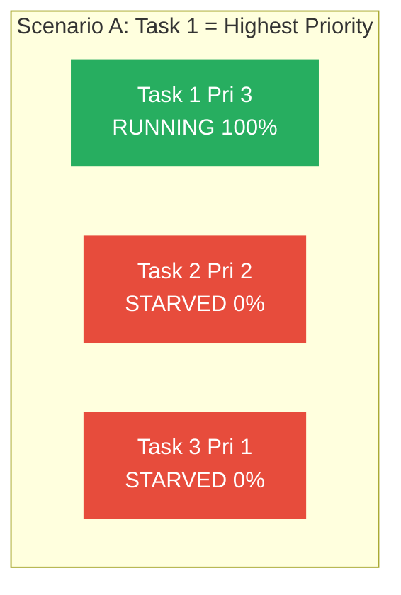

**Scenario B: Đổi Task 2 cao nhất → kết quả tương tự:**

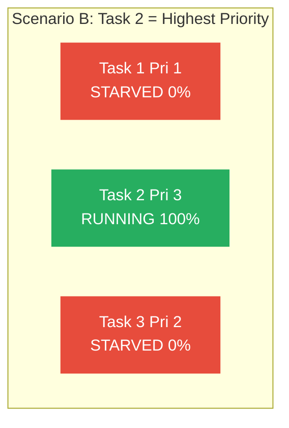

> [!CAUTION]
> **Task Starvation** = task priority thấp **không bao giờ được chạy** vì task priority cao **luôn busy**.
> 
> **Đây là lỗi thiết kế**, KHÔNG phải lỗi scheduler!
>
> **Cách tránh**: Task priority cao phải có lúc **nhường CPU**:
> - Gọi `vTaskDelay()` — delay N tick
> - Gọi `xSemaphoreTake()` — chờ semaphore
> - Gọi `xQueueReceive()` — chờ data từ queue
> - Gọi `ulTaskNotifyTake()` — chờ notification

---

### <span style="color:#1abc9c">Scenario 2: Realistic (Thiết kế đúng — từ sách)</span>

**Setup:**

| Task | Priority | Chức năng | Đặc điểm |
|------|---------|-----------|----------|
| Task 1 | 3 (CAO) | Đọc sensor | Chạy **rất nhanh**, xong thì nghỉ |
| Task 2 | 2 (TB) | Xử lý data | Chạy mỗi tick, thời gian trung bình |
| Task 3 | 1 (THẤP) | UI animation | Nhận CPU thừa |

**Timeline Gantt — Realistic Preemptive Scheduling:**

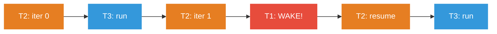

**Chú thích màu:**
- 🔴 **Đỏ** = Task 1 (Pri 3 - Sensor) — PREEMPT mọi thứ
- 🟠 **Cam** = Task 2 (Pri 2 - Process) — chạy khi T1 nghỉ
- 🔵 **Xanh** = Task 3 (Pri 1 - UI) — chỉ chạy khi T1 và T2 đều nghỉ
- Tại **4-5ms**: T1 wake up → **PREEMPT** T2 → T1 chạy xong → T2 **RESUME**

**Giải thích từng điểm quan trọng (theo sách):**

#### <span style="color:#3498db">📌 Điểm A (ms 0–2): Task 2 giữ context</span>

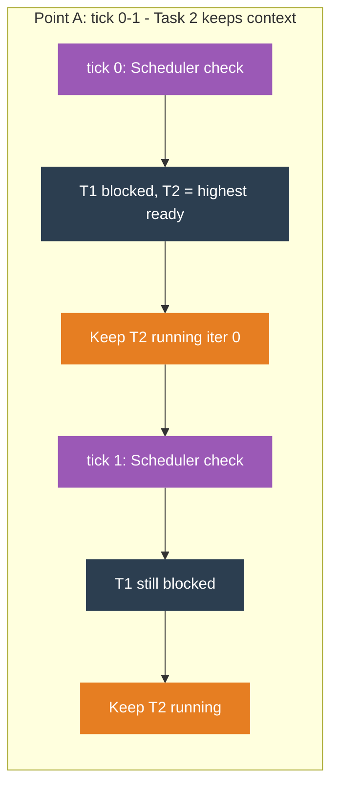

Task 2 đang chạy, bị scheduler **ngắt** mỗi tick để kiểm tra. Nhưng vì Task 1 đang nghỉ → Task 2 **vẫn là highest priority ready** → được trả lại CPU ngay.

#### <span style="color:#3498db">📌 Điểm B (ms 2): Task 2 xong → Task 3 được chạy</span>

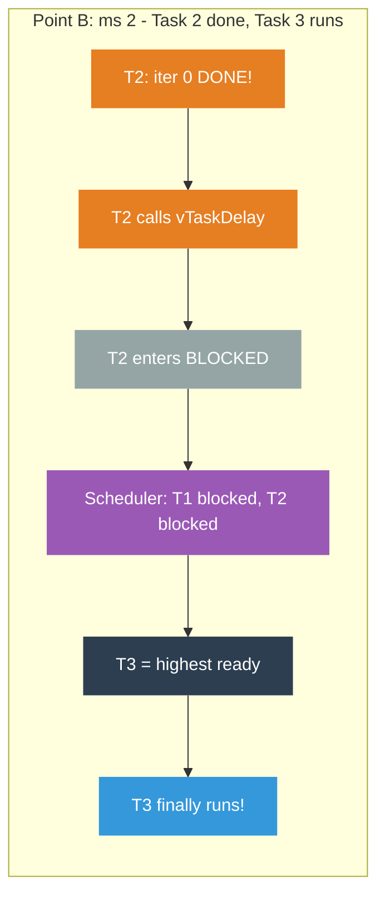

Task 2 hoàn thành iteration 0, gọi `vTaskDelay()` → **Blocked**. Scheduler thấy T1, T2 đều nghỉ → **Task 3** cuối cùng được chạy!

#### <span style="color:#3498db">📌 Điểm C (ms 4): PREEMPTION xảy ra!</span>

Đây là **điểm quan trọng nhất** — minh họa bản chất preemptive:

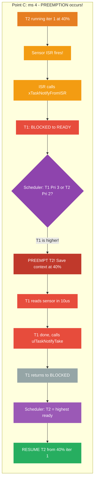

**Trình tự chi tiết:**

| Bước | Sự kiện | Task 1 | Task 2 |
|------|---------|--------|--------|
| 1 | T2 đang chạy iter 1 (40%) | Blocked | **Running** |
| 2 | ⚡ Sensor ISR gọi `xTaskNotifyFromISR()` | Blocked → **Ready** | Running |
| 3 | Scheduler: T1 (Pri 3) > T2 (Pri 2) → **PREEMPT!** | Ready → **Running** | Running → **Ready** |
| 4 | T1 đọc sensor, xong trong ~10µs | **Running** | Ready (đợi) |
| 5 | T1 gọi `ulTaskNotifyTake()` → nghỉ | Running → **Blocked** | Ready |
| 6 | Scheduler: T2 highest ready → **RESUME** | Blocked | Ready → **Running** |
| 7 | T2 tiếp tục **đúng chỗ bị dừng** (40% → 100%) | Blocked | **Running** |

> [!IMPORTANT]
> Task 2 **KHÔNG biết** mình đã bị preempt! Từ góc nhìn Task 2, nó chạy liên tục. Scheduler xử lý save/restore **hoàn toàn trong suốt** (transparent).

---

### <span style="color:#1abc9c">Trạng thái Task trong FreeRTOS (📗 Bổ sung từ: Mastering the FreeRTOS Kernel - Richard Barry):</span>

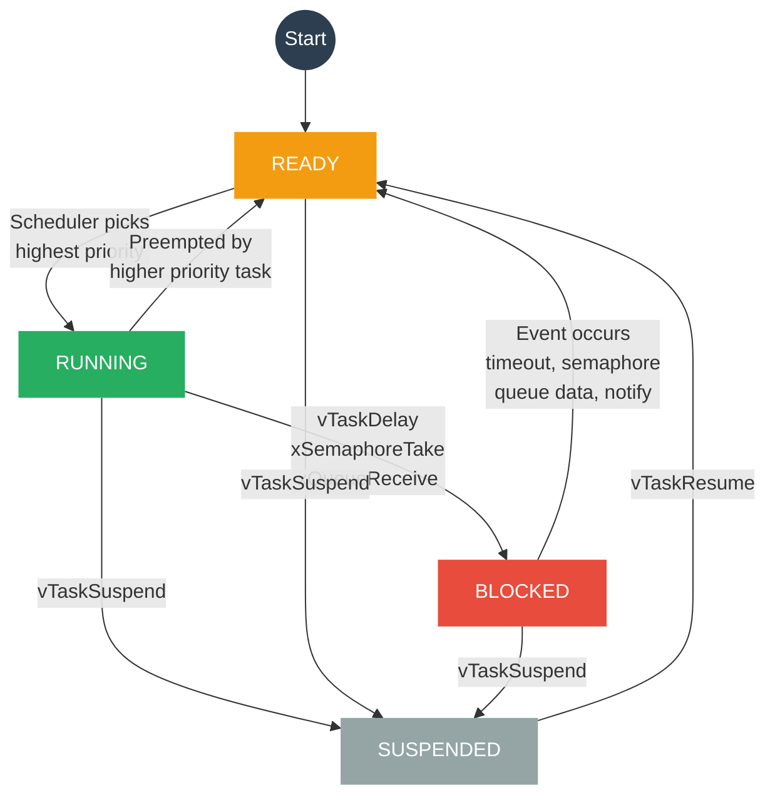

| Trạng thái | Ý nghĩa | Task đang... |
|------------|---------|-------------|
| **Running** | Đang chiếm CPU | Thực thi code |
| **Ready** | Sẵn sàng chạy, chờ scheduler | Có work nhưng task khác đang chiếm CPU |
| **Blocked** | Đang chờ event/timeout | `vTaskDelay()`, `xSemaphoreTake()`, `xQueueReceive()` |
| **Suspended** | Bị treo bởi `vTaskSuspend()` | Không chạy cho đến khi `vTaskResume()` |

> Chỉ có **1 task** ở trạng thái **Running** tại mọi thời điểm (vì chỉ có 1 CPU core).

---

### <span style="color:#1abc9c">Ví dụ code FreeRTOS (3 task với preemptive):</span>

```c
// ═══ Task 1: Sensor (Priority 3 — CAO NHẤT) ═══
void vSensorTask(void *param) {
    while(1) {
        // Chờ interrupt báo sensor ready (BLOCKED)
        ulTaskNotifyTake(pdTRUE, portMAX_DELAY);
        
        // Wake up! Đọc sensor (rất nhanh, vài µs)
        uint16_t reading = read_sensor();
        xQueueSend(xSensorQueue, &reading, 0);
        
        // Quay lại BLOCKED → nhường CPU cho task khác
    }
}

// ═══ Task 2: Data Processing (Priority 2 — TB) ═══
void vProcessTask(void *param) {
    uint16_t data;
    while(1) {
        // Chờ data từ sensor queue (BLOCKED nếu queue trống)
        xQueueReceive(xSensorQueue, &data, portMAX_DELAY);
        
        // Xử lý data (tốn thời gian)
        float result = heavy_computation(data);
        log_result(result);
        
        // Quay lại đầu loop → check queue → BLOCKED nếu trống
    }
}

// ═══ Task 3: UI Animation (Priority 1 — THẤP NHẤT) ═══
void vUITask(void *param) {
    while(1) {
        // Chạy animation — chỉ khi CPU rảnh
        update_animation_frame();
        render_display();
        
        vTaskDelay(pdMS_TO_TICKS(16));  // ~60 FPS, yield mỗi 16ms
    }
}

// ═══ main ═══
int main(void) {
    HAL_Init();
    SystemClock_Config();
    
    xSensorQueue = xQueueCreate(10, sizeof(uint16_t));
    
    xTaskCreate(vSensorTask,  "Sensor",  128, NULL, 3, NULL);
    xTaskCreate(vProcessTask, "Process", 256, NULL, 2, NULL);
    xTaskCreate(vUITask,      "UI",      512, NULL, 1, NULL);
    
    vTaskStartScheduler();
    while(1) {}
}
```

---

### <span style="color:#1abc9c">So sánh: Round-Robin vs Preemptive</span>

| Tiêu chí | Round-Robin | Preemptive |
|-----------|------------|------------|
| **Phân CPU** | Chia **đều** cho mọi task | Task priority cao nhất chiếm **tất cả** |
| **Priority** | Không quan tâm | **Quyết định ai chạy** |
| **Fair?** | ✅ Mọi task nhận fair share | ❌ Task cao ưu tiên tuyệt đối |
| **Responsive** | TB (đợi hết time slice) | ✅ Preempt ngay lập tức |
| **Starvation** | ✅ Không bao giờ | ⚠️ Có thể nếu thiết kế sai |
| **FreeRTOS** | Task **cùng priority** | Task **khác priority** |

**FreeRTOS kết hợp cả hai:**

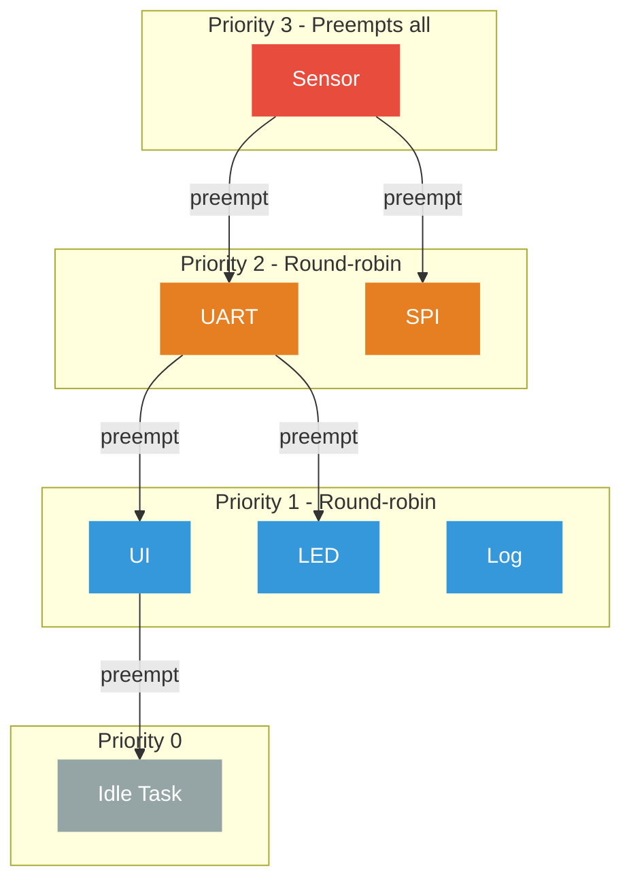

> [!TIP]
> - Task **khác priority** → **Preemptive** (task cao preempt task thấp)
> - Task **cùng priority** → **Round-Robin** (time slicing giữa chúng)
>
> ```c
> #define configUSE_PREEMPTION      1  // Bật preemptive
> #define configUSE_TIME_SLICING    1  // Bật round-robin cho cùng priority
> ```

### <span style="color:#1abc9c">FreeRTOS Tick-less Mode:</span>

> [!NOTE]
> **Tick-less scheduler mode** — dành cho thiết bị **ultra low power**.
>
> Bình thường: SysTick fire mỗi 1ms → CPU wake up 1000 lần/giây (tốn pin!)
>
> Tick-less: Nếu không có task nào ready → scheduler **tắt SysTick**, CPU vào **deep sleep**, chỉ wake up khi có interrupt hoặc task delay hết hạn.
>
> ```c
> #define configUSE_TICKLESS_IDLE    1
> ```


---

## <span style="color:#e67e22">8. Quản lý Task Cơ bản (Task Management API)</span>

> [!NOTE]
> 📗 Bổ sung từ: Mastering the FreeRTOS Kernel - Richard Barry

### <span style="color:#1abc9c">8.1 Phân tích chi tiết xTaskCreate()</span>

```c
BaseType_t xTaskCreate( TaskFunction_t pvTaskCode,
                        const char * const pcName,
                        configSTACK_DEPTH_TYPE usStackDepth,
                        void *pvParameters,
                        UBaseType_t uxPriority,
                        TaskHandle_t *pxCreatedTask );
```

| Parameter | Chi tiết |
|-----------|----------|
| `pvTaskCode` | Con trỏ hàm của task (hàm C thông thường, trả về `void`, nhận `void*`). |
| `pcName` | Chuỗi tên task, chỉ dùng để debug. Độ dài tối đa `configMAX_TASK_NAME_LEN`. |
| `usStackDepth`| Kích thước stack tính bằng **WORDS**, KHÔNG phải bytes! (VD: trên ARM 32-bit, 100 word = 400 bytes). |
| `pvParameters`| Con trỏ `void*` truyền tham số vào task. Cho phép tạo **nhiều instance** (nhiều task) từ cùng một hàm C. |
| `uxPriority`  | Priority từ 0 đến `(configMAX_PRIORITIES - 1)`. Vượt ngưỡng sẽ bị cap (giới hạn) âm thầm. |
| `pxCreatedTask`| Tuỳ chọn (có thể `NULL`). Lưu Task Handle để sau này thao tác (như xóa, đổi priority). |
| **Return**    | `pdPASS` nếu tạo thành công, `pdFAIL` (hoặc `errCOULD_NOT_ALLOCATE_REQUIRED_MEMORY`) nếu thiếu Heap. |

### <span style="color:#1abc9c">8.2 xTaskCreateStatic() (Tạo Task không cần Heap)</span>

Từ phiên bản FreeRTOS V9.0.0, bạn có thể tạo task **static memory** hoàn toàn không cần cấp phát động (Heap).

- Yêu cầu: `configSUPPORT_STATIC_ALLOCATION = 1`.
- Cần tự định nghĩa array stack buffer và struct TCB trước.

```c
// Array chứa stack (StackType_t)
StackType_t xTaskStack[ 100 ];

// Biến chứa TCB (StaticTask_t)
StaticTask_t xTaskBuffer;

TaskHandle_t xHandle = xTaskCreateStatic(
                          vTaskCode,
                          "TaskName",
                          100,            // usStackDepth
                          NULL,           // pvParameters
                          1,              // uxPriority
                          xTaskStack,     // puxStackBuffer
                          &xTaskBuffer ); // pxTaskBuffer
```

### <span style="color:#1abc9c">8.3 vTaskDelay() vs vTaskDelayUntil()</span>

| Tiêu chí | `vTaskDelay()` | `vTaskDelayUntil()` |
|-----------|----------------|---------------------|
| **Cơ chế** | Delay **RELATIVE** (tương đối) tính từ thời điểm hàm được gọi. | Delay **ABSOLUTE** (tuyệt đối) tính từ lần wake up trước. |
| **Drift** | Bị **cộng dồn sai số** do thời gian code thực thi và bị preempt. | **Không bị sai số** (hấp thụ thời gian xử lý của task). |
| **Next Wakeup** | `T_wakeup = T_call + xTicksToDelay` | `T_wakeup = T_last_wake + xTimeIncrement` |
| **Use Case** | Delay đơn giản, debounce, timeout. | Cần tần số/chu kỳ lặp **chính xác tuyệt đối** (VD: control loop, PID 100Hz). |

> [!WARNING]
> `vTaskDelayUntil()` cần bật `INCLUDE_vTaskDelayUntil = 1` và yêu cầu biến state `xLastWakeTime` được khởi tạo bằng `xTaskGetTickCount()` trước khi vào loop.

### <span style="color:#1abc9c">8.4 Cơ chế vTaskDelete()</span>

- Yêu cầu `INCLUDE_vTaskDelete = 1`.
- Gọi `vTaskDelete(NULL)` để xoá **chính task gọi nó**.
- **Quan trọng**: Nếu xoá task tạo bằng động (dynamic allocation), **Idle task** sẽ chịu trách nhiệm giải phóng TCB và Stack của task đó.
- ❌ Nếu application tự alloc memory (VD: `malloc()` trong task, hoặc lock mutex) thì application **phải tự free** trước khi xóa.
- ❌ Nếu **Idle Task bị starved** (do task priority cao chạy liên tục), bộ nhớ của các task bị xoá sẽ **không bao giờ được giải phóng** → Memory Leak!

### <span style="color:#1abc9c">8.5 Runtime Priority Changes</span>

- Hàm `vTaskPrioritySet(pxTask, uxNewPriority)` và `uxTaskPriorityGet(pxTask)`.
- Truyền `NULL` để chỉ định chính task gọi.
- Yêu cầu `INCLUDE_vTaskPrioritySet = 1`, `INCLUDE_uxTaskPriorityGet = 1`.
- Nếu priority được nâng lên cao hơn task đang chạy, quá trình **preemption diễn ra ngay lập tức** (context switch trước khi hàm return).

### <span style="color:#1abc9c">8.6 Idle Task Hook Rules</span>

Idle Task là task priority 0 luôn chạy khi mọi task khác đều bị blocked/suspended.
Bạn có thể chèn code vào nó bằng cách bật `configUSE_IDLE_HOOK = 1` và định nghĩa `void vApplicationIdleHook(void)`.

> [!IMPORTANT]
> **Quy tắc của Idle Hook:**
> 1. **KHÔNG BAO GIỜ BLOCK/SUSPEND**: Idle hook không được gọi delay hoặc chờ semaphore, nếu không hệ thống sẽ crash!
> 2. **Return promptly**: Phải return liên tục để Idle Task có thể dọn dẹp memory của task đã xoá (`vTaskDelete`).
> 3. **Ứng dụng chính**: Thường dùng để đưa CPU vào low-power mode, đo spare CPU capacity, hoặc background data clearing.

---

## <span style="color:#e67e22">9. Scheduling Algorithms Nâng cao</span>

> [!NOTE]
> 📗 Bổ sung từ: Mastering the FreeRTOS Kernel - Richard Barry

### <span style="color:#1abc9c">9.1 Bốn Modes Scheduling</span>

Điều khiển bởi 2 macro trong `FreeRTOSConfig.h`: `configUSE_PREEMPTION` và `configUSE_TIME_SLICING`.

| Mode | PREEMPTION | TIME_SLICING | Mô tả |
|---|---|---|---|
| **1 (Default)** | 1 | 1 | **Prioritized Pre-emptive with Time Slicing**<br>Preempt task thấp; Round-robin giữa task cùng priority. |
| **2** | 1 | 0 | **Prioritized Pre-emptive without Time Slicing**<br>Preempt task thấp; Task cùng priority chạy đến khi tự yield/block. |
| **3** | 0 | 1 | **Co-operative (Time slicing bị ignore)**<br>Không preemption, task chạy đến khi tự block. |
| **4** | 0 | 0 | **Co-operative**<br>Giống Mode 3, không tự động context switch ở tick. |

- Nếu dùng **Preemptive**, macro `configIDLE_SHOULD_YIELD = 1` giúp Idle task tự yield nếu có task priority 0 khác sẵn sàng.
- **Co-operative** (Mode 3, 4): dễ debug, không có race condition, nhưng responsiveness thấp. Mọi context switch do app chủ động.

### <span style="color:#1abc9c">9.2 Phương pháp Chọn Priority (Task Selection Methods)</span>

FreeRTOS tìm task highest-priority ready bằng 2 cách, được chọn qua `configUSE_PORT_OPTIMISED_TASK_SELECTION`:

- **Generic Method** ( = 0 ): Dùng code chuẩn C. Phải lặp tuyến tính (linear search), có độ phức tạp O(n). Không giới hạn `configMAX_PRIORITIES`.
- **Architecture Optimized Method** ( = 1 ): Dùng tập lệnh phần cứng (Ví dụ: `CLZ` - Count Leading Zeros trên ARM). Độ phức tạp là O(1) (cực nhanh), nhưng priority bị giới hạn ở 32 (do dùng biến 32-bit bitmask).

---

## <span style="color:#e67e22">10. Stack Overflow Detection</span>

> [!NOTE]
> 📗 Bổ sung từ: Mastering the FreeRTOS Kernel - Richard Barry

Trong RTOS, lỗi vỡ Stack (Stack Overflow) rất dễ xảy ra và làm hỏng TCB/OS variables. FreeRTOS hỗ trợ 2 cơ chế (chọn bằng `configCHECK_FOR_STACK_OVERFLOW`):

- **Method 1 (= 1)**: Tại mỗi lần context switch, OS kiểm tra xem SP có vượt quá giới hạn của stack hay không. Nhanh nhưng có thể sót nếu SP lấn rồi quay về trước lúc switch.
- **Method 2 (= 2)**: Khi khởi tạo, toàn bộ Stack được điền giá trị `0xA5`. Tại lúc switch, OS kiểm tra 20 byte cuối của Stack. Chậm hơn nhưng cực kỳ đáng tin cậy.

Khi phát hiện lỗi, hệ thống sẽ gọi hook function:
```c
void vApplicationStackOverflowHook( TaskHandle_t *pxTask, signed char *pcTaskName );
```

> [!TIP]
> Có thể dùng hàm `uxTaskGetStackHighWaterMark(xTask)` để xem số lượng byte stack *ít nhất* từng có (nếu = 0 là sắp vỡ stack).

\n\n## <span style="color:#e67e22">11. So sánh tổng hợp: Super Loop vs RTOS Task</span>

### <span style="color:#1abc9c">Bảng ưu/nhược điểm:</span>

| Tiêu chí | Super Loop | RTOS Tasks |
|-----------|-----------|------------|
| **Độ phức tạp** | ⭐ Rất đơn giản | ⭐⭐⭐ Phức tạp hơn |
| **ROM usage** | Thấp (không kernel) | Cao hơn (~6-10 KB cho kernel) |
| **RAM usage** | Thấp (1 stack) | Cao hơn (mỗi task cần stack riêng) |
| **Setup time** | Gần 0 | Cần config kernel, tạo task, set priority |
| **Responsiveness** | ✅ Tốt (nếu loop tight) → ❌ Xấu (nếu loop dài) | ✅ Luôn tốt (preemption) |
| **Determinism** | ❌ Giảm khi complexity tăng | ✅ Priority đảm bảo task quan trọng chạy |
| **Scalability** | ❌ Khó scale, inter-dependency tăng | ✅ Thêm task dễ dàng |
| **Debug** | 😰 Khó trace timing issue | ✅ SEGGER SystemView, tracealyzer |
| **Khi nào dùng** | Hệ thống đơn giản, ít task, timing loose | Hệ thống phức tạp, nhiều task, timing critical |

### <span style="color:#1abc9c">Flowchart quyết định:</span>

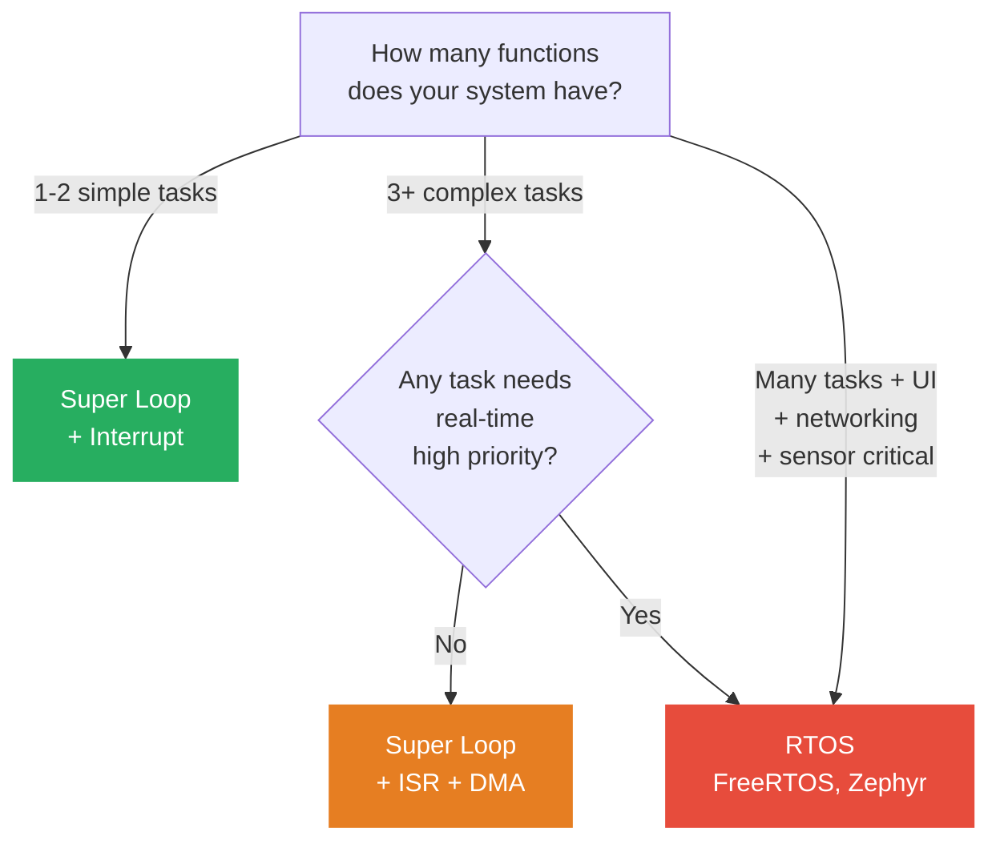

---

## <span style="color:#e67e22">12. Câu hỏi ôn tập (từ sách)</span>

1. **Super loop là gì?**
   > → **Cả hai**: (a) Một vòng lặp while vô hạn, VÀ (b) vòng lặp quản lý toàn bộ function call trong embedded system.

2. **RTOS task có nên LUÔN được ưu tiên hơn super loop không?**
   > → **Sai (False).** Nếu hệ thống đủ đơn giản → super loop là giải pháp tốt hơn (ít overhead, dễ hiểu).

3. **Kể nhược điểm của super loop phức tạp?**
   > → Khi thêm nhiều function, **polling rate giảm** → jitter tăng → khó đảm bảo responsiveness. Inter-dependency giữa các function ngày càng phức tạp.

4. **Làm sao cải thiện responsiveness của super loop?**
   > → Dùng **interrupts** (ISR) cho event quan trọng, **DMA** cho data transfer lớn, giữ mỗi function **ngắn nhất có thể**.

5. **Kể 2 điểm khác biệt giữa super loop và RTOS task?**
   > → (1) Mỗi task có **private stack** riêng (super loop chia sẻ system stack). (2) Mỗi task có **priority** (super loop không có priority, chạy tuần tự).

6. **RTOS task có tính năng gì giúp task quan trọng nhất được chạy trước?**
   > → **Prioritization** (phân quyền ưu tiên). Preemptive scheduler luôn cho task **priority cao nhất** chạy trước.

7. **Loại scheduler nào ưu tiên task quan trọng nhất?**
   > → **Preemptive scheduler** — luôn preempt (gián đoạn) task priority thấp khi task priority cao sẵn sàng.

---

## <span style="color:#e67e22">📌 Tóm tắt chương (Key Takeaways)</span>

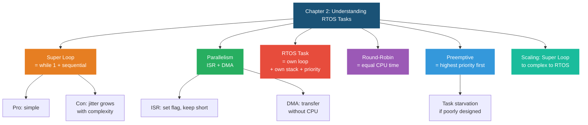
