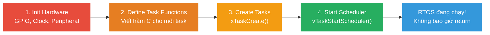
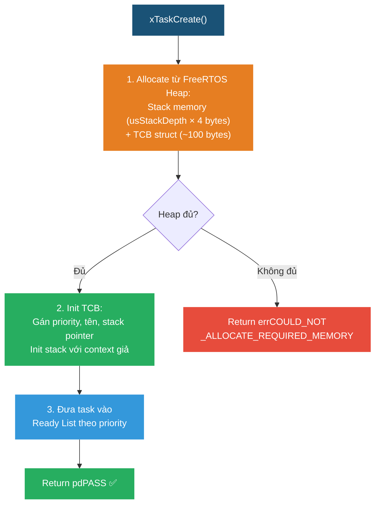
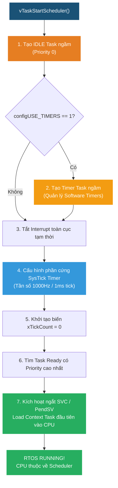
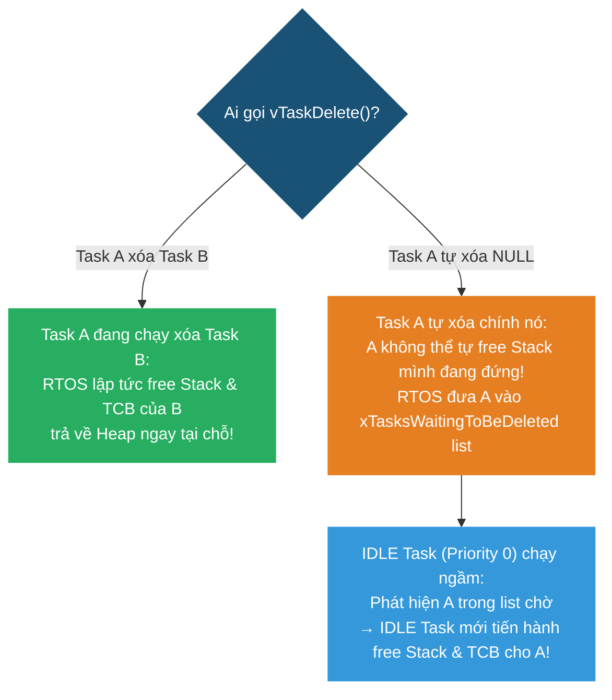
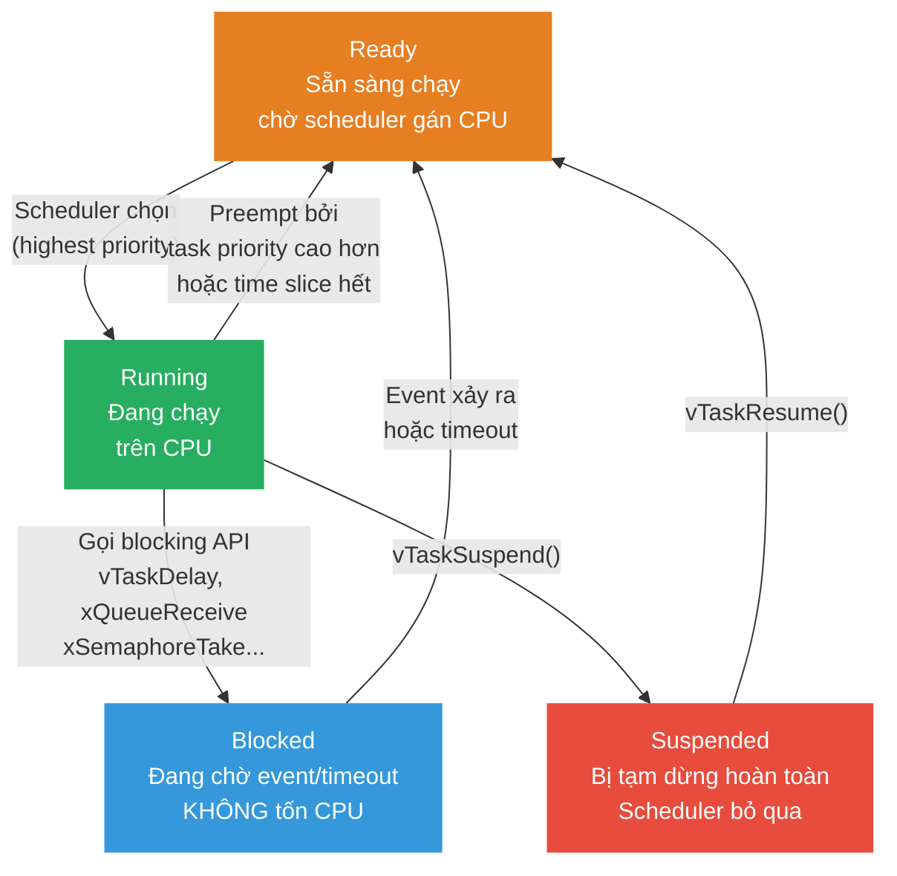
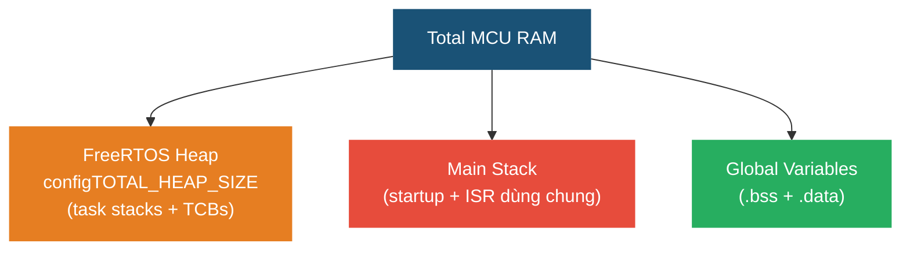
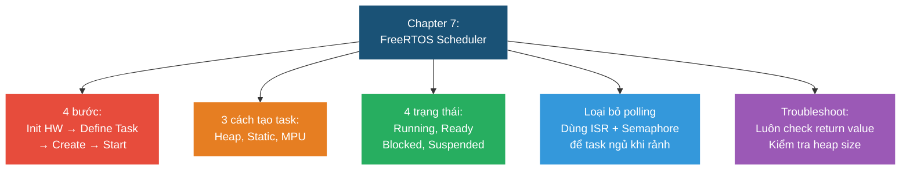

# <span style="color:#f1c40f">Chapter 7: The FreeRTOS Scheduler</span>

> **Mục tiêu chương**: Hiểu cách tạo task, khởi động scheduler, quản lý task state, và xử lý lỗi khởi động — bắt đầu viết code FreeRTOS thực tế.

> [!NOTE]
> Chương này là **thực hành** — áp dụng lý thuyết từ Chapter 1-3 vào code thật trên STM32F767 (Nucleo board).

---

## <span style="color:#e67e22">1. Bốn bước để chạy ứng dụng RTOS</span>

### <span style="color:#1abc9c">1.1 Quy trình tổng quan</span>



#### <span style="color:#3498db">Bước 1 — Init Hardware</span>

Cấu hình MCU **trước khi** RTOS chạy: system clock, GPIO, external RAM, peripheral (UART, SPI, ADC...), self-test nếu cần. Tất cả đều gọi trong `main()` trước khi tạo task.

Tại sao phải init trước? — Vì khi scheduler chạy, CPU do RTOS điều khiển. Nếu hardware chưa sẵn sàng mà task đã chạy → task truy cập peripheral chưa init → **crash** hoặc kết quả sai.

#### <span style="color:#3498db">Bước 2 — Define Task Functions</span>

Mỗi task là **1 hàm C bình thường** với signature: `void TaskName(void *argument)`.

Bên trong task thường có `while(1)` loop — task chạy mãi mãi, **không bao giờ return**. Nếu task cần kết thúc → gọi `vTaskDelete(NULL)` thay vì return (return từ task function → **undefined behavior**, crash).

Ở bước này chỉ **viết hàm** — task chưa được đăng ký với RTOS, chưa chạy.

#### <span style="color:#3498db">Bước 3 — Create Tasks</span>

Gọi `xTaskCreate()` hoặc `xTaskCreateStatic()` để **đăng ký** task với RTOS kernel. RTOS sẽ:

1. Cấp phát **stack memory** cho task (từ heap hoặc static array)
2. Tạo **TCB** (Task Control Block) — struct chứa: priority, stack pointer, tên task, trạng thái...
3. Đưa task vào **Ready list** — sẵn sàng chạy khi scheduler bắt đầu

Lúc này task **chưa chạy** — chỉ nằm trong Ready list, chờ scheduler.

**Luôn kiểm tra return value** — nếu heap hết RAM → `xTaskCreate` fail → task không được tạo → ứng dụng thiếu task → bug nghiêm trọng.

#### <span style="color:#3498db">Bước 4 — Start Scheduler</span>

Gọi `vTaskStartScheduler()` → đây là **điểm không quay lại**. Từ đây CPU hoàn toàn do RTOS điều khiển:

1. RTOS tự động tạo **IDLE task** (priority = 0, thấp nhất) — chạy khi không có task nào khác cần CPU
2. Cấu hình **SysTick timer** — tick interrupt mỗi 1ms để scheduler hoạt động
3. Tìm task Ready có **priority cao nhất** → context switch → task đó bắt đầu **Running**
4. `main()` **dừng lại** — code sau `vTaskStartScheduler()` không bao giờ chạy (trừ khi lỗi)

**Ví dụ `main()` hoàn chỉnh từ sách:**

```c
int main(void) {
    // Bước 1: Init hardware
    HWInit();

    // Bước 3: Tạo tasks (Bước 2 là viết hàm — đã viết ở trên)
    if (xTaskCreate(GreenTask, "GreenTask", STACK_SIZE, NULL, 
                    tskIDLE_PRIORITY + 2, NULL) != pdPASS) {
        while(1);  // Tạo fail → treo
    }

    assert_param(xTaskCreate(BlueTask, "BlueTask", STACK_SIZE, NULL,
                             tskIDLE_PRIORITY + 1, &blueTaskHandle) == pdPASS);

    xTaskCreateStatic(RedTask, "RedTask", STACK_SIZE, NULL,
                      tskIDLE_PRIORITY + 1, RedTaskStack, &RedTaskTCB);

    // Bước 4: Start scheduler — KHÔNG BAO GIỜ return
    vTaskStartScheduler();

    // Nếu tới đây = SCHEDULER FAIL (hết heap cho IDLE task)
    while(1) {}
}
```

**Trước và sau khi gọi `vTaskStartScheduler()`:**

| | Trước (bare-metal) | Sau (RTOS running) |
|---|---|---|
| **Ai điều khiển CPU?** | `main()` — chạy tuần tự từ trên xuống | **Scheduler** — chuyển đổi giữa các task |
| **Bao nhiêu "thread"?** | 1 (single-threaded) | Nhiều task chạy "song song" |
| **Khi gọi delay?** | `HAL_Delay()` → CPU **busy-wait**, không làm gì | `vTaskDelay()` → task ngủ, CPU chạy **task khác** |
| **Interrupt xảy ra?** | ISR chạy rồi quay lại `main()` | ISR chạy, có thể **đánh thức task** → context switch |

> [!IMPORTANT]
> Phải tạo **ít nhất 1 task** trước khi gọi `vTaskStartScheduler()`. Task cũng có thể được tạo thêm **sau khi** scheduler đã chạy (từ bên trong task khác).

---

## <span style="color:#e67e22">2. Tạo Task & Chiến lược Cấp phát Bộ nhớ (Task Memory Allocation)</span>

### <span style="color:#1abc9c">2.1 Task Memory Allocation — Mỗi task có stack riêng từ đâu?</span>

Trước khi học API tạo task, cần hiểu: mỗi task cần **stack riêng** — vậy stack này lấy từ đâu?

#### <span style="color:#3498db">Bare-metal (không RTOS) — chỉ có 1 stack</span>

Không có RTOS, MCU chỉ dùng **1 stack duy nhất** — Main Stack. Tất cả biến local, function call, ISR đều dùng chung:

```
 RAM (ví dụ 512 KB)
 ┌─────────────────────────┐ Địa chỉ cao
 │   Main Stack (MSP)      │ ← Stack duy nhất
 │   ↓ grows down          │    dùng cho main() + ISR
 │                         │
 │   (vùng trống)          │
 │                         │
 │   ↑ grows up            │
 │   Global Variables      │ ← .bss + .data
 └─────────────────────────┘ Địa chỉ thấp
```

#### <span style="color:#3498db">Có RTOS — RAM được chia thành 3 phần</span>

Khi dùng FreeRTOS, RAM của MCU được chia thành:

```
 RAM (512 KB)
 ┌─────────────────────────┐ Địa chỉ cao
 │   Main Stack (MSP)      │ ← Chỉ dùng cho startup code + ISR
 │   (nhỏ, ~1-2 KB)        │
 ├─────────────────────────┤
 │                         │
 │   FreeRTOS Heap         │ ← Mảng static uint8_t cực lớn
 │   (configTOTAL_HEAP_SIZE)    khai báo trong code RTOS
 │                         │
 │   ┌───────────────┐     │
 │   │ Task A Stack  │     │  ← xTaskCreate cắt ra từ heap
 │   │ (512 bytes)   │     │
 │   ├───────────────┤     │
 │   │ Task A TCB    │     │  ← ~100 bytes metadata
 │   ├───────────────┤     │
 │   │ Task B Stack  │     │  ← xTaskCreate cắt tiếp
 │   │ (1024 bytes)  │     │
 │   ├───────────────┤     │
 │   │ Task B TCB    │     │
 │   ├───────────────┤     │
 │   │ IDLE Stack    │     │  ← Scheduler tự tạo
 │   ├───────────────┤     │
 │   │ (còn trống)   │     │  ← Heap chưa dùng
 │   └───────────────┘     │
 │                         │
 ├─────────────────────────┤
 │   Global Variables      │ ← .bss + .data
 └─────────────────────────┘ Địa chỉ thấp
```

**FreeRTOS Heap thực chất là gì?** — Chỉ là **1 mảng static cực lớn** khai báo bên trong code FreeRTOS:

```c
// Bên trong FreeRTOS heap_4.c:
static uint8_t ucHeap[configTOTAL_HEAP_SIZE];
// Ví dụ: configTOTAL_HEAP_SIZE = 32768 → mảng 32 KB trong RAM
```

Khi gọi `xTaskCreate()` → RTOS gọi `pvPortMalloc()` (malloc riêng của RTOS) → **cắt 1 khối** từ mảng `ucHeap[]` → gán làm stack + TCB cho task.

#### <span style="color:#3498db">ARM Cortex-M có 2 Stack Pointer trong phần cứng</span>

| Stack Pointer | Tên đầy đủ | Ai dùng |
|--------------|-----------|--------|
| **MSP** | Main Stack Pointer | Startup code + **tất cả ISR** |
| **PSP** | Process Stack Pointer | **Từng task RTOS** (mỗi task có PSP riêng) |

Khi context switch, scheduler **đổi PSP** để trỏ vào stack của task mới:

```
 Task A đang chạy (PSP → Task A Stack)
     │
     │ ← Tick interrupt xảy ra
     ▼
 Scheduler lưu context Task A:
     CPU tự push R0-R3, R12, LR, PC, PSR vào Task A Stack (qua PSP)
     Scheduler push thêm R4-R11
     Lưu PSP hiện tại vào TCB của Task A
     │
     ▼
 Scheduler chuyển sang Task B:
     Lấy PSP đã lưu từ TCB của Task B
     Set PSP = Task B stack pointer
     Pop R4-R11 từ Task B Stack
     CPU tự pop R0-R3, R12, LR, PC, PSR
     │
     ▼
 Task B tiếp tục chạy (PSP → Task B Stack)
```

Mỗi task "nghĩ" mình có **CPU riêng** vì khi được chạy, PSP luôn trỏ vào đúng vùng memory của task đó — biến local, return address, context đều nguyên vẹn.

#### <span style="color:#3498db">Stack trong task dùng để lưu gì?</span>

| Nội dung trên stack | Khi nào |
|--------------------|---------|
| **Biến local** của hàm task | Khi task đang chạy |
| **Return address** khi gọi sub-function | Khi task gọi hàm con |
| **CPU context** (R0-R15, PSR) | Khi task bị preempt / context switch |
| **Tham số** truyền vào hàm con | Khi task gọi hàm con |

Task nào gọi nhiều hàm lồng nhau hoặc có biến local lớn (array, struct) → cần **stack lớn hơn**. Task đơn giản (blink LED) → stack nhỏ (~128 words) là đủ.

> [!IMPORTANT]
> **Tóm lại**: Stack của task **lấy từ FreeRTOS Heap** (mảng `ucHeap[]` trong RAM). Heap lấy từ **RAM của MCU**. RTOS dùng **PSP** (không phải MSP) cho task. MSP chỉ dành cho ISR.

---

### <span style="color:#1abc9c">2.2 Heap Allocated Tasks — xTaskCreate() (Dynamic Allocation)</span>

```c
BaseType_t xTaskCreate(
    TaskFunction_t    pvTaskCode,      // Con trỏ tới hàm task
    const char *      pcName,          // Tên task (cho debug)
    configSTACK_DEPTH_TYPE usStackDepth, // Stack size (đơn vị WORD, không phải byte!)
    void *            pvParameters,    // Tham số truyền vào task (NULL nếu không cần)
    UBaseType_t       uxPriority,      // Priority level
    TaskHandle_t *    pxCreatedTask    // Con trỏ lưu handle (NULL nếu không cần)
);
```

#### <span style="color:#3498db">Giải thích từng tham số</span>

**`pvTaskCode`** — Con trỏ tới hàm task. Truyền **tên hàm** (không có `()` và `&`).

```c
// Hàm task đã viết trước đó
void SensorTask(void *argument) { ... }

// Truyền tên hàm — compiler tự hiểu là con trỏ
xTaskCreate(SensorTask, ...);  // ✅
xTaskCreate(&SensorTask, ...); // ✅ cũng được nhưng không cần &
xTaskCreate(SensorTask(), ...); // ❌ SAI — đang gọi hàm, không phải truyền con trỏ
```

**`pcName`** — Chuỗi tên task, **chỉ dùng để debug** (hiển thị trên Ozone, SystemView, printf). RTOS không dùng tên này để quản lý task. Độ dài tối đa: `configMAX_TASK_NAME_LEN` (mặc định 16 ký tự).

**`usStackDepth`** — Kích thước stack, đơn vị **WORD** (không phải byte!).

```
 Trên ARM 32-bit: 1 WORD = 4 BYTES

 usStackDepth = 128 words → thực tế = 128 × 4 = 512 bytes RAM
 usStackDepth = 256 words → thực tế = 256 × 4 = 1024 bytes RAM
```

Stack dùng để lưu: biến local trong hàm task, context khi bị preempt (thanh ghi R0-R15), return address khi gọi sub-function. Task nào gọi nhiều hàm lồng nhau hoặc có biến local lớn → cần stack lớn hơn.

**`pvParameters`** — Tham số truyền vào hàm task qua `void *argument`. Dùng khi **cùng 1 hàm** tạo nhiều task instance khác nhau.

```c
// Cùng 1 hàm, tạo 3 task khác nhau bằng parameter
uint8_t led1 = 0, led2 = 1, led3 = 2;

xTaskCreate(LedTask, "LED0", 128, &led1, 1, NULL);  // Task điều khiển LED 0
xTaskCreate(LedTask, "LED1", 128, &led2, 1, NULL);  // Task điều khiển LED 1
xTaskCreate(LedTask, "LED2", 128, &led3, 1, NULL);  // Task điều khiển LED 2

void LedTask(void *argument) {
    uint8_t ledId = *(uint8_t *)argument;  // Cast lại để dùng
    while(1) {
        toggleLed(ledId);
        vTaskDelay(500 / portTICK_PERIOD_MS);
    }
}
```

**`uxPriority`** — Mức priority. Số **càng lớn = càng ưu tiên**. `tskIDLE_PRIORITY` = 0 (thấp nhất). Max = `configMAX_PRIORITIES - 1`.

```
 tskIDLE_PRIORITY + 0  →  Priority 0 (= IDLE, thấp nhất)
 tskIDLE_PRIORITY + 1  →  Priority 1
 tskIDLE_PRIORITY + 2  →  Priority 2 (cao hơn)
 ...
```

**`pxCreatedTask`** — Con trỏ lưu **handle** của task vừa tạo. Truyền `NULL` nếu không cần thao tác với task sau này.

**Handle là gì?** — `TaskHandle_t` thực chất là **con trỏ tới TCB** (Task Control Block) của task. TCB là struct bên trong RTOS chứa mọi thông tin về task (priority, stack pointer, trạng thái, tên...). Khi bạn có handle = bạn có "địa chỉ" của task trong RTOS → có thể điều khiển task đó.

```
 TaskHandle_t blueHandle;
                │
                ▼
 ┌──────────────────────────┐
 │  TCB — BlueTask          │
 │  ├─ priority: 1          │
 │  ├─ state: Ready         │
 │  ├─ stack pointer: 0x... │
 │  ├─ name: "Blue"         │
 │  └─ ...                  │
 └──────────────────────────┘
```

**Khi nào truyền NULL, khi nào lưu handle?**

| Trường hợp | Truyền gì | Lý do |
|-----------|----------|-------|
| Task chạy mãi, không ai cần điều khiển | `NULL` | Không cần handle |
| Task cần bị xóa bởi task khác | `&handle` | `vTaskDelete(handle)` cần handle |
| Task cần bị suspend/resume | `&handle` | `vTaskSuspend(handle)` cần handle |
| Task cần đổi priority runtime | `&handle` | `vTaskPrioritySet(handle, newPri)` cần handle |
| Task nhận notification từ task khác | `&handle` | `xTaskNotifyGive(handle)` cần handle |

**Ví dụ — lưu handle:**

```c
TaskHandle_t blueHandle;  // Biến global hoặc ở scope rộng
xTaskCreate(BlueTask, "Blue", 128, NULL, 1, &blueHandle);

// Task khác có thể dùng handle để điều khiển BlueTask:
vTaskDelete(blueHandle);          // Xóa task
vTaskSuspend(blueHandle);         // Tạm dừng — task ngừng hoàn toàn
vTaskResume(blueHandle);          // Tiếp tục — task chạy lại
vTaskPrioritySet(blueHandle, 3);  // Đổi priority lên 3
xTaskNotifyGive(blueHandle);      // Gửi notification cho task
```

**Ví dụ — không cần handle:**

```c
// Task này chạy mãi, không ai xóa/suspend nó → không cần handle
xTaskCreate(SensorTask, "Sensor", 256, NULL, 2, NULL);
```

**Ví dụ thực tế — Supervisor quản lý Worker tasks:**

```c
TaskHandle_t worker1, worker2, worker3;

void SupervisorTask(void *p) {
    // Tạo 3 worker tasks
    xTaskCreate(WorkerTask, "W1", 128, NULL, 1, &worker1);
    xTaskCreate(WorkerTask, "W2", 128, NULL, 1, &worker2);
    xTaskCreate(WorkerTask, "W3", 128, NULL, 1, &worker3);

    while(1) {
        if (systemOverloaded()) {
            vTaskSuspend(worker3);     // Tạm dừng worker ít quan trọng
            vTaskPrioritySet(worker1, 3); // Tăng priority worker quan trọng
        }
        if (shutdownRequested()) {
            vTaskDelete(worker1);      // Xóa hết workers
            vTaskDelete(worker2);
            vTaskDelete(worker3);
        }
        vTaskDelay(1000 / portTICK_PERIOD_MS);
    }
}
```

> [!CAUTION]
> **Không dùng handle sau khi task đã bị xóa!** Task bị `vTaskDelete()` → TCB bị free → handle trỏ vào **vùng memory đã giải phóng** → gọi `vTaskSuspend(handle)` lúc này = **crash** (dangling pointer). Nên set `handle = NULL` sau khi delete để tránh dùng nhầm.

#### <span style="color:#3498db">Bên trong RTOS làm gì khi gọi xTaskCreate()?</span>



**"Init stack với context giả"** nghĩa là: RTOS đặt sẵn giá trị vào stack giống như task đang bị interrupt — khi scheduler chọn task lần đầu, nó "restore context" từ stack này → task bắt đầu chạy từ dòng đầu tiên của hàm.

**Giá trị trả về:**

| Return | Ý nghĩa |
|--------|---------|
| `pdPASS` | ✅ Tạo task thành công, heap đủ |
| `errCOULD_NOT_ALLOCATE_REQUIRED_MEMORY` | ❌ Heap không đủ RAM |

> [!WARNING]
> **Bẫy đơn vị thường gặp**: Stack size trong `xTaskCreate` tính bằng **WORD**. Nhưng `configTOTAL_HEAP_SIZE` trong `FreeRTOSConfig.h` tính bằng **BYTES**! Nhiều người nhầm → set stack quá lớn → hết heap.
>
> Ví dụ: `configTOTAL_HEAP_SIZE = 32768` (32 KB). Tạo task với `usStackDepth = 8192` → thực tế dùng 8192 × 4 = **32 KB** → chiếm hết heap → task tiếp theo fail!

### <span style="color:#1abc9c">2.3 Luôn kiểm tra return value của xTaskCreate()!</span>

#### <span style="color:#3498db">Tại sao kiểm tra return value lại CỰC KỲ QUAN TRỌNG?</span>

Trong C thông thường, nếu một hàm fail, ứng dụng có thể bỏ qua hoặc xử lý sau. Nhưng với RTOS, `xTaskCreate()` thất bại là một **lỗi thảm họa (fatal error)**:

1. **Silent Failure (Lỗi im lặng)**: Nếu không check return value, khi RTOS hết heap memory, task **không hề được tạo**. Nhưng chương trình vẫn tiếp tục gọi `vTaskStartScheduler()`. Kết quả: Hệ thống chạy nhưng **thiếu mất tính năng** của task đó (ví dụ: task đo nhiệt độ không chạy → hệ thống không bao giờ ngắt nhiệt → cháy nổ) mà **không có bất kỳ thông báo lỗi nào**!
2. **Crash do Dangling/NULL Handle**: Nếu bạn dự định lấy handle để dùng sau này, nhưng `xTaskCreate()` fail → handle vẫn mang giá trị rác hoặc `NULL` → Task khác gọi `vTaskSuspend(handle)` hay `xTaskNotify(handle)` → **HardFault Crash** lập tức.

#### <span style="color:#3498db">Ý nghĩa các giá trị trả về</span>

`xTaskCreate()` trả về kiểu `BaseType_t`:

- **`pdPASS` (1)**: Cấp phát Stack và TCB từ Heap thành công. Task đã nằm trong Ready List.
- **`errCOULD_NOT_ALLOCATE_REQUIRED_MEMORY` (-1)**: **Hết RAM Heap!** RTOS không tìm đủ vùng nhớ liên tục trong `ucHeap[]` để cấp cho Stack + TCB của task.

---

#### <span style="color:#3498db">3 Kỹ thuật xử lý lỗi khi tạo Task</span>

##### Kỹ thuật 1 — `if check` + Vòng lặp vô hạn (Dành cho Debug cơ bản)

Cách đơn giản nhất khi mới viết code. Nếu tạo task fail, chương trình sẽ treo ngay tại `while(1)`. Khi cắm Debugger vào, bạn chỉ cần bấm Pause là biết ngay dòng code nào bị treo.

```c
if (xTaskCreate(GreenTask, "GreenTask", 128, NULL, tskIDLE_PRIORITY + 2, NULL) != pdPASS) {
    // Thất bại! Hết heap RAM. 
    // Treo ở đây để cắm debugger vào kiểm tra.
    while(1); 
}
```

##### Kỹ thuật 2 — Sử dụng Assertion Macro (Chuẩn STM32 & FreeRTOS)

Sử dụng `assert_param()` (STM32 HAL) hoặc `configASSERT()` (FreeRTOS). Nếu điều kiện bên trong là `false`, hệ thống sẽ tự động bắt file và dòng code (line number) bị lỗi.

**Ví dụ dùng `assert_param` (Code từ sách):**

```c
BaseType_t retVal;

retVal = xTaskCreate(BlueTask, "BlueTask", STACK_SIZE, NULL, 
                     tskIDLE_PRIORITY + 1, &blueTaskHandle);

// Nếu retVal != pdPASS, macro này sẽ gọi hàm assert_failed()
assert_param(retVal == pdPASS); 
```

**Hàm xử lý `assert_failed()` trong STM32:**

```c
void assert_failed(uint8_t *file, uint32_t line) {
    // In ra file C và dòng code bị lỗi qua SystemView / ITM / UART
    SEGGER_SYSVIEW_PrintfHost("Assertion Failed: file %s on line %d\r\n", file, line);
    
    // Treo hệ thống hoặc chớp LED báo lỗi
    while(1) {
        // Toggle Red LED nhanh để báo hiệu cứng
    }
}
```

**Cấu hình `configASSERT` trong `FreeRTOSConfig.h`:**

```c
// Nếu xTaskCreate fail -> configASSERT sẽ dừng chương trình và disable interrupt
#define configASSERT( x ) if( ( x ) == 0 ) { taskDISABLE_INTERRUPTS(); for( ;; ); }
```

##### Kỹ thuật 3 — Error Handler cho sản phẩm thương mại (Production)

Trong sản phẩm thực tế (không cắm debugger), nếu tạo task fail, ta không thể để MCU treo `while(1)` vô ích. Hệ thống cần ghi log và khởi động lại (Reset).

```c
if (xTaskCreate(SensorTask, "Sensor", 512, NULL, 2, NULL) != pdPASS) {
    logErrorToFlash(ERR_TASK_CREATE_FAILED); // Ghi lỗi vào Flash/EEPROM
    triggerSystemReset();                    // Khởi động lại MCU (Watchdog hoặc NVIC_SystemReset)
}
```

> [!TIP]
> **Lời khuyên từ sách**: Trong giai đoạn phát triển (Development), **LUÔN LUÔN** bọc mọi lệnh `xTaskCreate()` bằng `assert_param()` hoặc `if check`. Hơn 80% lỗi hệ thống không chạy lúc mới bắt đầu RTOS là do `xTaskCreate()` âm thầm thất bại vì hết Heap!

### <span style="color:#1abc9c">2.4 Statically Allocated Tasks — xTaskCreateStatic() (Cấp phát tĩnh)</span>

#### <span style="color:#3498db">Bản chất của Static Allocation là gì?</span>

Khi dùng `xTaskCreate()`, RTOS tự động gọi `pvPortMalloc()` để xẻ mảng `ucHeap[]` lấy RAM cấp cho Task. 

Ngược lại, với `xTaskCreateStatic()`, **lập trình viên tự tay khai báo sẵn bộ nhớ** (Stack array và TCB struct) dưới dạng **biến `static`** hoặc **biến toàn cục (global)** ngay từ lúc biên dịch (Compile time).

```
 Bộ nhớ RAM MCU (Toàn bộ nằm trong vùng .bss / .data lúc Compile)
 ┌────────────────────────────────────────┐
 │ static StaticTask_t RedTaskTCB;         │ ← Dùng làm TCB (~100 bytes)
 ├────────────────────────────────────────┤
 │ static StackType_t  RedTaskStack[128]; │ ← Dùng làm Stack (128 × 4 = 512 bytes)
 └────────────────────────────────────────┘
```

#### <span style="color:#3498db">API Signature & Giải thích tham số</span>

```c
TaskHandle_t xTaskCreateStatic(
    TaskFunction_t       pxTaskCode,       // Con trỏ hàm task
    const char * const   pcName,           // Tên task (debug)
    const uint32_t       ulStackDepth,     // Stack size (đơn vị WORD)
    void * const         pvParameters,     // Tham số truyền vào
    UBaseType_t          uxPriority,       // Priority
    StackType_t * const  puxStackBuffer,   // Con trỏ tới mảng Stack do dev khai báo
    StaticTask_t * const pxTaskBuffer      // Con trỏ tới struct TCB do dev khai báo
);
```

- **`puxStackBuffer`**: Truyền mảng `StackType_t RedTaskStack[STACK_SIZE]` vào.
- **`pxTaskBuffer`**: Truyền địa chỉ struct `&RedTaskTCB` vào.
- **Giá trị trả về**: Trả về `TaskHandle_t` (chính là địa chỉ của `pxTaskBuffer`). **Không bao giờ trả về NULL** vì bộ nhớ đã được gán sẵn lúc biên dịch.

#### <span style="color:#3498db">Ví dụ Code hoàn chỉnh</span>

```c
#define STACK_SIZE 128

// 1. Khai báo bộ nhớ tĩnh (toàn cục hoặc static)
static StackType_t  RedTaskStack[STACK_SIZE];
static StaticTask_t RedTaskTCB;
TaskHandle_t        redTaskHandle;

void RedTask(void *pvParameters) {
    while(1) {
        // Task code...
        vTaskDelay(500 / portTICK_PERIOD_MS);
    }
}

int main(void) {
    // 2. Tạo task tĩnh - Không bao giờ lo bị hết Heap RAM!
    redTaskHandle = xTaskCreateStatic(
        RedTask,
        "RedTask",
        STACK_SIZE,
        NULL,
        tskIDLE_PRIORITY + 1,
        RedTaskStack,
        &RedTaskTCB
    );

    vTaskStartScheduler();
}
```

#### <span style="color:#3498db">Callback bắt buộc: vApplicationGetIdleTaskMemory()</span>

Khi bật `#define configSUPPORT_STATIC_ALLOCATION 1` trong `FreeRTOSConfig.h`, RTOS sẽ yêu cầu bạn phải cung cấp bộ nhớ tĩnh cho **IDLE Task** (Task chạy ngầm của hệ thống). Bạn phải viết hàm callback này trong code:

```c
// Hàm này được RTOS tự động gọi để lấy RAM cấp cho IDLE Task
void vApplicationGetIdleTaskMemory( StaticTask_t **ppxIdleTaskTCBBuffer,
                                    StackType_t **ppxIdleTaskStackBuffer,
                                    uint32_t *pulIdleTaskStackSize ) 
{
    static StaticTask_t xIdleTaskTCB;
    static StackType_t  uxIdleTaskStack[configMINIMAL_STACK_SIZE];

    *ppxIdleTaskTCBBuffer = &xIdleTaskTCB;
    *ppxIdleTaskStackBuffer = uxIdleTaskStack;
    *pulIdleTaskStackSize = configMINIMAL_STACK_SIZE;
}
```

#### <span style="color:#3498db">Ưu và Nhược điểm của Static Allocation</span>

- **Ưu điểm**:
  - **100% Deterministic (Dự đoán được)**: Tuyệt đối không bao giờ bị lỗi hết RAM (`errCOULD_NOT_ALLOCATE...`) lúc đang chạy.
  - **Minh bạch dung lượng RAM**: Ngay sau khi biên dịch (Build), Toolchain sẽ hiển thị chính xác dung lượng RAM bị chiếm dụng trong vùng `.bss`.
  - **Đáp ứng tiêu chuẩn an toàn (Safety Standards)**: Bắt buộc trong các ngành Hàng không (DO-178C), Ô tô (ISO 26262), Y tế (IEC 62304) — những nơi cấm dùng Dynamic Heap Allocation.
- **Nhược điểm**:
  - RAM bị chiếm dụng **vĩnh viễn**. Ngay cả khi bạn gọi `vTaskDelete()`, vùng RAM của mảng `RedTaskStack` vẫn bị giữ lại, không thể tự động thu hồi cho task khác xài trừ khi bạn tự viết code quản lý lại.

---

### <span style="color:#1abc9c">2.5 Memory Protected Task Creation — xTaskCreateRestricted() (MPU Allocation)</span>

#### <span style="color:#3498db">MPU Task là gì?</span>

Trên các dòng MCU ARM Cortex-M có bộ phần cứng **MPU (Memory Protection Unit)** như Cortex-M4/M7/M33 (ví dụ STM32F767 trên dev board của sách), FreeRTOS hỗ trợ API `xTaskCreateRestricted()`.

Bình thường, mọi Task trong RTOS đều có quyền truy cập toàn bộ RAM/Peripheral của MCU (**Privileged mode**). Nếu Task A bị tràn mảng hoặc dính bug con trỏ rác, nó có thể ghi đè lên Stack của Task B hoặc làm hỏng phần cứng.

`xTaskCreateRestricted()` tạo ra một **Unprivileged Task (Task bị tước quyền)**: Task này bị phần cứng MPU giới hạn không gian bộ nhớ.

```
 Bộ nhớ MCU (Giám sát bởi phần cứng MPU)
 ┌────────────────────────────────────────┐
 │ Code Flash & Global Data               │ ← READ-ONLY
 ├────────────────────────────────────────┤
 │ Task Stack riêng của nó                │ ← READ / WRITE
 ├────────────────────────────────────────┤
 │ MPU Memory Region 1 (ví dụ: RAM Buffer) │ ← READ / WRITE (Được cấp phép)
 ├────────────────────────────────────────┤
 │ MPU Memory Region 2 (ví dụ: UART Reg)  │ ← READ / WRITE (Được cấp phép)
 ├────────────────────────────────────────┤
 │ Vùng nhớ của Task khác / Kernel Data    │ ❌ NO ACCESS! 
 └────────────────────────────────────────┘ (Chạm vào = HardFault ngắt lập tức!)
```

#### <span style="color:#3498db">Cách hoạt động qua Struct TaskParameters_t</span>

Thay vì truyền 6 tham số rời rạc như `xTaskCreate()`, bạn gom tất cả cấu hình vào một struct `TaskParameters_t` chứa cả quy định vùng nhớ MPU:

```c
// Cấu hình vùng nhớ MPU cho Task
static const MemoryRegion_t xAltRegions[ portNUM_CONFIGURABLE_REGIONS ] =
{
    // { Địa chỉ bắt đầu, Độ lớn vùng nhớ, Quyền truy cập }
    { ucSharedMemory, 512, portMPU_REGION_READ_WRITE },
    { (void *)0x40000000, 1024, portMPU_REGION_READ_WRITE }, // Cho phép truy cập Peripheral
    { NULL, 0, 0 }
};

// Gom tất cả tham số tạo Task
static const TaskParameters_t xTaskDefinition =
{
    vUnprivilegedTaskCode,  // Hàm Task
    "RestrictedTask",       // Tên
    STACK_SIZE,             // Stack size
    NULL,                   // Parameter
    1 | portPRIVILEGE_BIT,  // Priority + Bật chế độ Unprivileged Task
    xStackBuffer,           // Mảng Stack
    xAltRegions             // Mảng cấu hình vùng nhớ MPU!
};

// Tạo Task bị giới hạn MPU
TaskHandle_t xTaskHandle;
xTaskCreateRestricted( &xTaskDefinition, &xTaskHandle );
```

#### <span style="color:#3498db">Khi nào sử dụng?</span>

1. **Cybersecurity / IoT Security**: Khi chạy các thư viện mã nguồn mở của bên thứ 3 (ví dụ: cJSON parser, thư viện nén, Bluetooth stack). Nếu thư viện bị lỗi bẫy mã độc (buffer overflow), MPU sẽ chặn đứng không cho hacker ghi đè bộ nhớ Kernel hay đọc private key.
2. **Safety-Critical Systems**: Đảm bảo các task phụ (ví dụ: hiển thị màn hình LCD) có bị crash thì không bao giờ ảnh hưởng tới task chính (ví dụ: điều khiển động cơ / phanh ABS).

---

### <span style="color:#1abc9c">2.6 Task Creation Roundup — So sánh 3 phương pháp tạo task</span>

| Đặc tính | Heap (`xTaskCreate`) | Static (`xTaskCreateStatic`) | MPU (`xTaskCreateRestricted`) |
|----------|---------------------|----------------------------|------------------------------|
| **Dễ dùng** | ⇑ Tốt nhất | ⇔ Trung bình | ⇓ Phức tạp nhất |
| **Linh hoạt** | ⇑ Tạo/xóa runtime | ⇔ Cố định bộ nhớ | ⇓ Phải cấu hình MPU Region |
| **An toàn RAM** | ⇓ Có thể hết Heap | ⇑ Biết chính xác RAM lúc compile | ⇑ Khóa RAM tĩnh |
| **An toàn hệ thống** | ⇓ Task chạm được RAM toàn hệ thống | ⇓ Task chạm được RAM toàn hệ thống | ⇑ **Cách ly bộ nhớ bằng MPU** |
| **Regulatory / Safety** | ⇓ Khó chứng minh | ⇑ Đáp ứng chuẩn ISO 26262 | ⇑ Dùng cho Safety & Security cao nhất |

> [!TIP]
> **Từ sách**: Prototype → dùng `xTaskCreate` (nhanh, dễ). Production / safety-critical → chuyển sang `xTaskCreateStatic` (biết chính xác RAM usage lúc link time). Nếu ứng dụng đòi hỏi bảo mật cao / cách ly module → dùng `xTaskCreateRestricted`.

---

## <span style="color:#e67e22">3. Viết hàm Task — Ví dụ Blinky từ sách</span>

### <span style="color:#1abc9c">3.1 Task tự xóa mình — GreenTask</span>

```c
void GreenTask(void *argument) {
    GreenLed.On();
    vTaskDelay(1500 / portTICK_PERIOD_MS);  // Ngủ 1.5 giây
    GreenLed.Off();

    vTaskDelete(NULL);  // Tự xóa — task biến mất hoàn toàn

    // Code dưới đây KHÔNG BAO GIỜ chạy
    GreenLed.On();
}
```

**Khi nào dùng**: Task chạy 1 lần rồi kết thúc — ví dụ: init WiFi, calibration sensor, self-test khi khởi động.

### <span style="color:#1abc9c">3.2 Task chạy vĩnh viễn — BlueTask</span>

```c
void BlueTask(void *argument) {
    while(1) {
        BlueLed.On();
        vTaskDelay(200 / portTICK_PERIOD_MS);  // Bật 200ms
        BlueLed.Off();
        vTaskDelay(200 / portTICK_PERIOD_MS);  // Tắt 200ms
    }
    // Không bao giờ thoát while(1) → task chạy mãi
}
```

**Pattern phổ biến nhất**: Task với `while(1)` loop — đọc sensor, xử lý data, điều khiển output liên tục.

### <span style="color:#1abc9c">3.3 Task xóa task khác — RedTask</span>

```c
void RedTask(void *argument) {
    uint8_t firstRun = 1;
    while(1) {
        RedLed.On();
        vTaskDelay(500 / portTICK_PERIOD_MS);
        RedLed.Off();
        vTaskDelay(500 / portTICK_PERIOD_MS);

        if (firstRun == 1) {
            vTaskDelete(blueTaskHandle);  // Xóa BlueTask bằng handle
            firstRun = 0;
        }
    }
}
```

---

### <span style="color:#1abc9c">3.4 Hands-On Execution & SystemView Trace Analysis (Phân tích luồng thực thi)</span>

#### Mã nguồn C hoàn chỉnh (`main_taskCreation.c`):

```c
#include "main.h"
#include "FreeRTOS.h"
#include "task.h"
#include "SEGGER_SYSVIEW.h"

#define STACK_SIZE 128

// 1. Biến Handle dùng để điều khiển BlueTask từ bên ngoài
TaskHandle_t blueTaskHandle = NULL;

// 2. Bộ nhớ tĩnh cho RedTask (Static Allocation)
static StackType_t  RedTaskStack[STACK_SIZE];
static StaticTask_t RedTaskTCB;

// Task 1: GreenTask — Tự xóa chính mình sau 1.5s
void GreenTask(void *argument) {
    SEGGER_SYSVIEW_PrintfHost("Task1 running while Green LED is on\n");
    GreenLed.On();
    vTaskDelay(1500 / portTICK_PERIOD_MS); // Chờ 1.5 giây
    GreenLed.Off();

    vTaskDelete(NULL); // Tự xóa chính mình — Task biến mất vĩnh viễn khỏi Scheduler

    // ❌ Dòng này không bao giờ được thực thi
    GreenLed.On();
}

// Task 2: BlueTask — Chớp tắt LED và bị RedTask xóa từ bên ngoài
void BlueTask(void *argument) {
    while(1) {
        SEGGER_SYSVIEW_PrintfHost("BlueTaskRunning\n");
        BlueLed.On();
        vTaskDelay(200 / portTICK_PERIOD_MS);
        BlueLed.Off();
        vTaskDelay(200 / portTICK_PERIOD_MS);
    }
}

// Task 3: RedTask — Chớp tắt LED và xóa BlueTask ở lần chạy đầu tiên
void RedTask(void *argument) {
    uint8_t firstRun = 1;
    while(1) {
        lookBusy();
        SEGGER_SYSVIEW_PrintfHost("RedTaskRunning\n");
        RedLed.On();
        vTaskDelay(500 / portTICK_PERIOD_MS);
        RedLed.Off();
        vTaskDelay(500 / portTICK_PERIOD_MS);

        if (firstRun == 1) {
            vTaskDelete(blueTaskHandle); // Xóa BlueTask qua Handle!
            firstRun = 0;
        }
    }
}

int main(void) {
    // Cấu hình phần cứng MCU
    HWInit();

    // 1. Tạo GreenTask (Heap Dynamic, Priority 2 - Cao nhất)
    if (xTaskCreate(GreenTask, "GreenTask", STACK_SIZE, NULL, 
                    tskIDLE_PRIORITY + 2, NULL) != pdPASS) {
        while(1); // Lỗi hết heap
    }

    // 2. Tạo BlueTask (Heap Dynamic, Priority 1, lưu Handle để RedTask xóa)
    assert_param(xTaskCreate(BlueTask, "BlueTask", STACK_SIZE, NULL, 
                             tskIDLE_PRIORITY + 1, &blueTaskHandle) == pdPASS);

    // 3. Tạo RedTask (Static Allocation, Priority 1)
    xTaskCreateStatic(RedTask, "RedTask", STACK_SIZE, NULL, 
                      tskIDLE_PRIORITY + 1, RedTaskStack, &RedTaskTCB);

    // 4. Bắt đầu RTOS Scheduler — Chuyển giao quyền cho đa nhiệm
    vTaskStartScheduler();

    // ❌ Không bao giờ chạy tới đây ngoại trừ bị lỗi hết Heap
    while(1) {}
}
```

#### Phân tích luồng thực thi trên SystemView / Ozone Timeline:

Khi nạp code trên vào dev board NUCLEO-F767ZI và mở phần mềm theo dõi thời gian thực **SEGGER SystemView / Ozone**, luồng thực thi của 3 Task diễn ra theo mốc thời gian (Timeline) như sau:

```
 Mốc thời gian (Timeline):
 0ms             200ms       500ms           1000ms          1500ms
 ┼───────────────┼───────────┼───────────────┼───────────────┼───────────────►
 │
 ├─ GreenTask (Pri 2 - Cao nhất): 
 │   └─► Chạy trước tiên! Bật LED Xanh → vTaskDelay(1500ms) → Blocked (ngủ)
 │
 ├─ RedTask (Pri 1): 
 │   └─► Chạy tiếp → Bật LED Đỏ → vTaskDelay(500ms) → Blocked (ngủ)
 │
 ├─ BlueTask (Pri 1): 
 │   └─► Chạy → Bật LED Xanh Dương → vTaskDelay(200ms) → Blocked (ngủ)
 │
 ├─ [t ≈ 1000ms]: RedTask thức dậy vòng 1 → Gọi vTaskDelete(blueTaskHandle)!
 │   └─► BlueTask bị XÓA VĨNH VIỄN! (Biến mất khỏi SystemView trace line).
 │       (Thao tác vTaskDelete tốn ~7.4us execution overhead).
 │
 └─ [t ≈ 1500ms]: GreenTask thức dậy → Tắt LED Xanh → Gọi vTaskDelete(NULL)!
     └─► GreenTask TỰ XÓA VĨNH VIỄN! (Biến mất khỏi SystemView trace line).

 [Từ t > 1500ms trở đi]: Chỉ còn duy nhất RedTask chớp tắt LED Đỏ và IDLE Task chạy ngầm!
```

> [!NOTE]
> **Phân tích trực quan trên SystemView:**
> 1. Task có Priority cao nhất (`GreenTask` pri 2) luôn được Scheduler ưu tiên cho chạy trước.
> 2. `vTaskDelete(handle)` lập tức xóa Task chỉ định (`BlueTask`) khỏi hệ thống.
> 3. `vTaskDelete(NULL)` tự xóa chính mình (`GreenTask`) ngay sau khi xong nhiệm vụ 1.5s.

---

## <span style="color:#e67e22">4. Khởi động Scheduler — Starting the Scheduler</span>

### <span style="color:#1abc9c">4.1 Hàm vTaskStartScheduler()</span>

Sau khi khởi tạo phần cứng và tạo các Task thành công, bước cuối cùng trong `main()` là gọi hàm khởi động hệ điều hành:

```c
void vTaskStartScheduler( void );
```

- **Tiền tố `v`**: Trả về `void` (không có tham số truyền vào và không trả về giá trị).
- **Vai trò**: Đây là điểm chuyển giao quyền lực từ code chạy tuần tự đơn luồng (**single-threaded**) sang hệ điều hành đa nhiệm (**multi-tasking context switching**).

```c
int main(void) {
    // 1. Cấu hình phần cứng MCU
    HWInit();

    // 2. Tạo các Task
    xTaskCreate(GreenTask, "GreenTask", STACK_SIZE, NULL, tskIDLE_PRIORITY + 2, NULL);
    xTaskCreate(BlueTask, "BlueTask", STACK_SIZE, NULL, tskIDLE_PRIORITY + 1, &blueTaskHandle);
    xTaskCreateStatic(RedTask, "RedTask", STACK_SIZE, NULL, tskIDLE_PRIORITY + 1, RedTaskStack, &RedTaskTCB);

    // 3. Bắt đầu Scheduler — BƯỚC CHUYỂN GIAO KHÔNG QUAY LẠI
    vTaskStartScheduler();

    // ❌ KHÔNG BAO GIỜ CHẠY TỚI ĐÂY (trừ khi bị lỗi Hết Heap)
    while(1) {
        // Fallback error loop
    }
}
```

---

### <span style="color:#1abc9c">4.2 Diễn biến 7 bước bên trong vTaskStartScheduler()</span>

Khi hàm `vTaskStartScheduler()` được gọi, FreeRTOS kernel sẽ thực hiện chuỗi 7 bước ngầm bên trong trước khi trao CPU cho Task đầu tiên:



#### Chi tiết các bước xử lý:

1. **Tự động tạo IDLE Task (`tskIDLE_PRIORITY = 0`)**: 
   - RTOS tự cấp phát 1 task có priority thấp nhất. Nhằm đảm bảo CPU **luôn luôn có việc để làm** (khi tất cả các task khác đều bị `Blocked` hoặc `Suspended`).
   - IDLE task cũng chịu trách nhiệm thu hồi memory (Stack/TCB) của các task bị xóa bởi `vTaskDelete()`.
2. **Tự động tạo Software Timer Task (Nếu được bật)**:
   - Nếu trong `FreeRTOSConfig.h` có `#define configUSE_TIMERS 1`, RTOS sẽ tự tạo thêm **Daemon/Timer Task** để quản lý các phần timer bằng phần mềm.
3. **Vào Critical Section (Tắt ngắt)**:
   - Tắt ngắt tạm thời để cấu hình phần cứng an toàn, không bị gián đoạn.
4. **Cấu hình phần cứng SysTick Timer & ngắt PendSV**:
   - Thiết lập bộ đếm thời gian hệ thống SysTick (thường là 1ms/tick dựa trên `configTICK_RATE_HZ`).
   - Cấu hình mức ưu tiên cho các vector ngắt của RTOS trên ARM Cortex-M (`SysTick_IRQn` và `PendSV_IRQn`) ở mức **thấp nhất** để không làm ảnh hưởng tới các ngắt phần cứng cần thời gian thực khắt khe (Real-time ISRs).
5. **Khởi tạo biến đếm nhịp `xTickCount = 0`**:
   - Đặt lại bộ đếm tick của RTOS.
6. **Xác định Task đầu tiên chạy**:
   - Tìm trong danh sách `Ready Tasks` xem task nào đang có `uxPriority` **cao nhất**.
7. **Bật ngắt & Nhảy vào Task đầu tiên (First Context Switch)**:
   - Kích hoạt lệnh assembly (thường là lệnh `svc 0` hoặc `prvPortStartFirstTask` trong FreeRTOS Cortex-M port).
   - CPU chuyển từ stack `MSP` (Main Stack Pointer) sang stack `PSP` (Process Stack Pointer) của task được chọn.
   - Nạp các thanh ghi R0-R15, xPSR từ stack của task đó vào CPU hardware → Task đầu tiên bắt đầu thực thi!

---

### <span style="color:#1abc9c">4.3 Tại sao vTaskStartScheduler() KHÔNG BAO GIỜ Return?</span>

Khi scheduler đã chạy thành công:
- Con trỏ lệnh `PC` (Program Counter) của CPU đã nhảy vào vĩnh viễn bên trong các vòng lặp `while(1)` của các Task.
- Luồng thi hành tuyến tính của hàm `main()` đã bị chấm dứt.

> [!WARNING]
> **Trường hợp duy nhất `vTaskStartScheduler()` quay trở lại (Return):**
> 
> Là khi **Heap RAM không đủ** để RTOS tự động cấp phát bộ nhớ cho **IDLE Task** (hoặc Timer Task).
> Khi đó `vTaskStartScheduler()` sẽ tự kết thúc và trả quyền điều khiển về ngay dòng code phía sau nó trong `main()`.
> 
> **Cách khắc phục:**
> 1. Tăng `configTOTAL_HEAP_SIZE` trong file `FreeRTOSConfig.h`.
> 2. Giảm bớt dung lượng stack `usStackDepth` của các task bạn đã tạo trước đó.
> 3. Hoặc chuyển sang dùng `xTaskCreateStatic()` và cung cấp hàm `vApplicationGetIdleTaskMemory()`.

---

## <span style="color:#e67e22">5. Xóa Task — vTaskDelete()</span>

### <span style="color:#1abc9c">5.1 Cú pháp API và Cách sử dụng</span>

Hàm `vTaskDelete()` được dùng để loại bỏ hoàn toàn một Task khỏi sự quản lý của FreeRTOS Scheduler:

```c
void vTaskDelete( TaskHandle_t xTaskToDelete );
```

- **Tham số `xTaskToDelete`**:
  - `NULL`: Task tự xóa **chính mình**.
  - `TaskHandle_t`: Xóa **Task khác** dựa trên con trỏ handle thu được lúc gọi `xTaskCreate()`.

#### Ví dụ 1 — Self-Deletion (Tự xóa chính mình):
```c
void StartupCalibrationTask(void *pvParameters) {
    // 1. Thực hiện cân chỉnh phần cứng 1 lần duy nhất khi bật nguồn
    calibrateSensors();
    
    // 2. Tự xóa chính mình để giải phóng RAM cho hệ thống
    vTaskDelete(NULL); 
    
    // ❌ Code dưới đây KHÔNG BAO GIỜ được thực thi
    LED_On();
}
```

#### Ví dụ 2 — Deleting Another Task (Task khác xóa):
```c
TaskHandle_t xWorkerHandle = NULL;

void SupervisorTask(void *pvParameters) {
    // Tạo Worker Task
    xTaskCreate(WorkerTask, "Worker", 256, NULL, 1, &xWorkerHandle);
    
    vTaskDelay(5000 / portTICK_PERIOD_MS); // Cho Worker chạy 5 giây
    
    if (xWorkerHandle != NULL) {
        vTaskDelete(xWorkerHandle); // Xóa Worker Task từ bên ngoài
        xWorkerHandle = NULL;       // Đặt lại NULL để tránh dangling handle
    }
}
```

---

### <span style="color:#1abc9c">5.2 Cơ chế thu hồi bộ nhớ (Memory Cleanup Mechanism)</span>

Khi một Task bị xóa, vùng nhớ RAM của nó bao gồm **Stack** và **TCB** sẽ được xử lý khác nhau tùy thuộc vào **ai là người gọi ngắt lệnh xóa**:



#### Trường hợp 1 — Task A xóa Task B (External Deletion):
Vì Task A đang chạy trên CPU và đang dùng Stack của Task A, RTOS có thể an toàn **giải phóng ngay lập tức (Free immediately)** toàn bộ Stack và TCB của Task B về lại cho Heap.

#### Trường hợp 2 — Task A tự xóa chính mình (`vTaskDelete(NULL)`):
Task A đang thực thi dòng lệnh `vTaskDelete(NULL)` bằng chính Stack của nó. Nó **không thể tự xóa cái nhà mình đang ở**. Do đó:
1. RTOS lập tức rút Task A ra khỏi danh sách Ready/Blocked list (Task A dừng chạy ngay lập tức).
2. RTOS đẩy TCB của Task A vào danh sách **`xTasksWaitingToBeDeleted`**.
3. **IDLE Task** (Task hệ thống có Priority 0) khi được CPU cho phép chạy sẽ quét danh sách này và **thực hiện việc free RAM (Stack + TCB) cho Task A**.

> [!CAUTION]
> **CẢNH BÁO BẪY RÒ RỈ BỘ NHỚ (Memory Leak Danger):**
> 
> Nếu hệ thống của bạn có các Task có Priority > 0 chạy liên tục 100% thời gian (không bao giờ đi vào trạng thái `Blocked` hay `vTaskDelay`), thì **IDLE Task sẽ KHÔNG BAO GIỜ được chạy**!
> 
> Hậu quả: Bộ nhớ RAM của các Task tự xóa (`vTaskDelete(NULL)`) sẽ nằm chờ vĩnh viễn trong danh sách xóa và **KHÔNG BAO GIỜ được thu hồi** → Gây rò rỉ RAM rải rác dẫn đến sập hệ thống!

---

### <span style="color:#1abc9c">5.3 4 Cạm bẫy & Rủi ro nguy hiểm cần tránh</span>

#### 1. Rò rỉ Tài nguyên Tự tạo (Resource Leak)
RTOS chỉ tự động thu hồi **Stack RAM** và **TCB RAM** do chính RTOS quản lý. Nếu bên trong Task bạn có tự xin cấp phát bộ nhớ động bằng `malloc()` / `pvPortMalloc()` hoặc mở file/socket:
```c
void BadTask(void *p) {
    char *buf = (char *)pvPortMalloc(1024); // Tự xin 1KB RAM
    // ...
    vTaskDelete(NULL); 
    // ❌ LỖI: 1KB RAM trong `buf` bị mất vĩnh viễn vì RTOS không tự free dùm bạn!
}
```
**Khắc phục**: Phải tự gọi `vPortFree(buf)` trước khi gọi `vTaskDelete(NULL)`.

#### 2. Kẹt Mutex / Khóa tài nguyên (Deadlock / Locked Peripheral)
Nếu Task bị xóa **trong lúc đang giữ Mutex** hoặc đang chiếm quyền truy cập phần cứng (I2C/SPI bus):
- Mutex đó sẽ bị **kẹt ở trạng thái locked vĩnh viễn**.
- Tất cả các Task khác trong hệ thống chờ Mutex đó cũng sẽ bị **Blocked vĩnh viễn**!

#### 3. Con trỏ rác (Dangling Task Handle)
Nếu Task A xóa Task B qua `xWorkerHandle`, nhưng sau đó Task A lại tiếp tục gọi `vTaskSuspend(xWorkerHandle)`:
- Vì TCB của Task B đã bị giải phóng, `xWorkerHandle` giờ đây là con trỏ rác trỏ vào vùng RAM trống → **HardFault Crash**.
- **Khắc phục**: Gán `xWorkerHandle = NULL;` ngay sau khi gọi `vTaskDelete(xWorkerHandle)`.

#### 4. Phân mảnh Bộ nhớ (Heap Fragmentation)
Việc tạo và xóa Task liên tục lúc runtime với các kích thước Stack khác nhau sẽ xé nhỏ mảng Heap RAM thành hàng ngàn mảnh nhỏ không liên tục. Dù tổng RAM khả dụng còn 10KB, bạn vẫn không thể tạo một Task mới cần 2KB RAM liên tục.

---

### <span style="color:#1abc9c">5.4 Cấu hình bắt buộc & Best Practice</span>

#### Cấu hình trong `FreeRTOSConfig.h`:
Để sử dụng được hàm xóa task, bạn phải bật macro này trong cấu hình:
```c
#define INCLUDE_vTaskDelete    1
```
Đồng thời, loại Heap bạn chọn phải là **Heap 2, Heap 4, hoặc Heap 5** (Vì **Heap 1** là loại cấp phát 1 chiều, không hỗ trợ hàm `vPortFree()`).

#### Lời khuyên từ Senior Engineers (Best Practices):
- **Tránh tạo/xóa Task liên tục lúc runtime**: Hãy khởi tạo tất cả các Task 1 lần duy nhất trong `main()`.
- **Dùng Suspend/Resume thay thế**: Nếu muốn tạm ngừng một chức năng, hãy dùng `vTaskSuspend()` và `vTaskResume()` thay vì xóa Task rồi tạo lại.
- **Chỉ dùng `vTaskDelete` cho One-Shot Tasks**: Ví dụ task kiểm tra phần cứng lúc khởi động (Self-test), task đọc file config từ SD Card 1 lần khi cắm nguồn.

---

## <span style="color:#e67e22">6. Understanding FreeRTOS Task States — Các trạng thái của Task</span>

### <span style="color:#1abc9c">6.1 Sơ đồ 4 trạng thái</span>



### <span style="color:#1abc9c">6.2 Giải thích từng trạng thái</span>

#### <span style="color:#3498db">Running — Đang chạy</span>

Chỉ có **DUY NHẤT 1 task** ở trạng thái Running tại mỗi thời điểm (vì MCU 1 core). Task đang được CPU thực thi instruction.

Task rời Running khi:
- Gọi blocking API (`vTaskDelay`, `xQueueReceive`...) → chuyển sang **Blocked**
- Bị preempt bởi task priority cao hơn → chuyển sang **Ready**
- Time slice hết (round-robin) → chuyển sang **Ready**

#### <span style="color:#3498db">Ready — Sẵn sàng</span>

Task **muốn chạy** nhưng CPU đang bận (task khác đang Running). Scheduler sẽ chọn task Ready có **priority cao nhất** để cho Running.

Nếu nhiều task Ready có **cùng priority** → chia CPU bằng **Round-Robin Time Slicing** (mỗi task chạy 1 tick period rồi chuyển).

#### <span style="color:#3498db">Blocked — Đang chờ</span>

Task đang chờ **event** (data từ queue, semaphore, notification) hoặc **thời gian** (`vTaskDelay`).

Đặc điểm quan trọng:
- **KHÔNG tốn CPU** — task ngủ hoàn toàn, scheduler bỏ qua
- Mọi blocking API đều có **timeout** — không bao giờ chờ vĩnh viễn (trừ khi dùng `portMAX_DELAY`)
- Khi event xảy ra hoặc timeout → chuyển sang **Ready**

#### <span style="color:#3498db">Suspended — Tạm dừng</span>

Task bị **đình chỉ hoàn toàn** bằng `vTaskSuspend()`. Scheduler bỏ qua, không tốn CPU. Chỉ quay lại khi task khác gọi `vTaskResume()`.

Khác Blocked: Suspended **không có timeout** — nằm đó cho đến khi có ai resume.

---

### <span style="color:#1abc9c">6.3 Phân tích Chi tiết: Trường hợp Nhập, Điều kiện Thoát và Trạng thái Sau khi Thoát</span>

#### Bảng tổng hợp Ma trận Chuyển đổi Trạng thái (Task State Transition Matrix):

| Trạng thái Hiện tại | Trường hợp / Điều kiện Nhập vào | Điều kiện Thoát ra khỏi Trạng thái | Trạng thái Chuyển sang NGAY SAU KHỎI THOÁT |
| :--- | :--- | :--- | :--- |
| **🏃‍♂️ RUNNING**<br/>(Đang chiếm CPU) | Được Scheduler chọn từ danh sách `READY` vì là Task có Priority cao nhất tại thời điểm kiểm tra. | 1. Bị Preempt bởi Task có Priority cao hơn vừa thức dậy.<br/>2. Hết suất thời gian (Time Slice expired) khi cùng Priority.<br/>3. Chủ động nhường CPU bằng hàm `taskYIELD()`. | ➔ **READY** |
| | | 1. Gọi `vTaskDelay()` hoặc `vTaskDelayUntil()`.<br/>2. Gọi API chờ tài nguyên/sự kiện (`xSemaphoreTake`, `xQueueReceive`, `ulTaskNotifyTake`...) với `xTicksToWait > 0` mà tài nguyên chưa sẵn sàng. | ➔ **BLOCKED** |
| | | 1. Tự gọi `vTaskSuspend(NULL)` hoặc bị Task khác gọi `vTaskSuspend(xHandle)`. | ➔ **SUSPENDED** |
| | | 1. Tự gọi `vTaskDelete(NULL)` hoặc bị Task khác gọi `vTaskDelete(xHandle)`. | ➔ **DELETED** |
| **🟡 READY**<br/>(Sẵn sàng chạy) | 1. Mới khởi tạo thành công bằng `xTaskCreate()`.<br/>2. Từ `RUNNING` rớt xuống do bị Preempt / Hết Time slice / Gọi `taskYIELD()`.<br/>3. Từ `BLOCKED` thức dậy do Sự kiện xảy ra hoặc hết giờ Timeout.<br/>4. Từ `SUSPENDED` quay lại do được `vTaskResume()`. | Được Scheduler quét và chọn là Task có Priority cao nhất trong Ready List tại thời điểm Context Switch. | ➔ **RUNNING** |
| | | Bị Task khác gọi `vTaskSuspend(xTaskHandle)`. | ➔ **SUSPENDED** |
| | | Bị Task khác gọi `vTaskDelete(xTaskHandle)`. | ➔ **DELETED** |
| **💤 BLOCKED**<br/>(Đi ngủ chờ event) | Duy nhất từ `RUNNING` khi gọi các Blocking APIs với `xTicksToWait > 0` (Thời gian trễ hoặc Chờ Semaphore, Queue, Notification...). | 1. **Sự kiện xảy ra**: Semaphore được Give, Queue có dữ liệu, Task Notify tới, Bit cờ Event được set.<br/>2. **Hết giờ Timeout**: Hết số ticks `xTicksToWait` mà sự kiện vẫn chưa xảy ra. | ➔ **READY**<br/>*(⚠️ Luôn chuyển sang READY trước. Nếu Priority cao hơn Task đang RUNNING, Scheduler sẽ Preempt để đưa lên RUNNING ngay!)* |
| | | Bị Task khác gọi `vTaskSuspend(xTaskHandle)`. | ➔ **SUSPENDED** |
| | | Bị Task khác gọi `vTaskDelete(xTaskHandle)`. | ➔ **DELETED** |
| **⏸️ SUSPENDED**<br/>(Đóng băng vĩnh viễn) | Bị tạm dừng bằng `vTaskSuspend()` từ `RUNNING` (tự dừng), hoặc từ `READY` / `BLOCKED` (do Task khác dừng). | Một Task khác gọi `vTaskResume(xTaskHandle)` hoặc Ngắt phần cứng gọi `xTaskResumeFromISR()`. | ➔ **READY** |
| | | Bị Task khác gọi `vTaskDelete(xTaskHandle)`. | ➔ **DELETED** |

#### Quy trình Chuyển tiếp Chi tiết cho từng Trạng thái:

1. **Trạng thái `RUNNING` (Đang chạy)**:
   - **Vào RUNNING**: Khi Scheduler thực thi thuật toán chọn Task và thấy Task này có Priority cao nhất trong danh sách `READY`.
   - **Thoát khỏi RUNNING**:
     - Chuyển sang **`READY`**: Khi bị Task ưu tiên cao hơn Preempt, hoặc hết suất thời gian (Time Slice), hoặc gọi `taskYIELD()`.
     - Chuyển sang **`BLOCKED`**: Khi gọi `vTaskDelay()` hoặc chờ Queue/Semaphore với `xTicksToWait > 0`.
     - Chuyển sang **`SUSPENDED`**: Khi gọi `vTaskSuspend()`.
     - Chuyển sang **`DELETED`**: Khi gọi `vTaskDelete()`.

2. **Trạng thái `READY` (Sẵn sàng)**:
   - **Vào READY**: Từ lúc tạo mới `xTaskCreate`, hoặc rớt xuống từ `RUNNING`, hoặc từ `BLOCKED` thức dậy, hoặc từ `SUSPENDED` được phục hồi.
   - **Thoát khỏi READY**:
     - Chuyển sang **`RUNNING`**: Khi Scheduler trao quyền điều khiển CPU.
     - Chuyển sang **`SUSPENDED` / `DELETED`**: Do Task khác can thiệp bằng `vTaskSuspend` / `vTaskDelete`.

3. **Trạng thái `BLOCKED` (Đang chờ - Ngủ 💤)**:
   - **Vào BLOCKED**: Chỉ có 1 đường duy nhất từ `RUNNING` khi Task gọi các hàm chờ có thời hạn (`xTicksToWait > 0`).
   - **Thoát khỏi BLOCKED**:
     - Chuyển sang **`READY`**: Khi **Sự kiện xảy ra** (Semaphore Given, Queue Data) hoặc **Hết giờ Timeout**.
     - 💡 *Lưu ý*: Ngay khi chuyển sang `READY`, nếu Task này có Priority **cao hơn** Task đang `RUNNING` hiện tại, Scheduler sẽ lập tức Preempt Task đang `RUNNING` đó để đưa Task vừa thức dậy này lên **`RUNNING` ngay tức thì**!

4. **Trạng thái `SUSPENDED` (Đóng băng ⏸️)**:
   - **Vào SUSPENDED**: Nhận lệnh `vTaskSuspend()` từ bất kỳ trạng thái nào (`RUNNING`, `READY`, `BLOCKED`).
   - **Thoát khỏi SUSPENDED**:
     - Chuyển sang **`READY`**: Khi có Task khác hoặc ngắt ISR gọi `vTaskResume()` / `xTaskResumeFromISR()`. Nó **không bao giờ tự thức dậy** vì không có bộ đếm Timeout.

---

## <span style="color:#e67e22">7. Optimizing Task States — Tối ưu hóa trạng thái Task</span>

### <span style="color:#1abc9c">7.1 Optimizing to Reduce CPU Time — Loại bỏ Polling Loop</span>

**❌ Sai — Polling Loop (Lock Task ở trạng thái Running):**

```c
void SensorTask(void *p) {
    while(1) {
        if (checkAdc()) {         // Kiểm tra liên tục → tốn 100% CPU!
            processData();
        }
    }
}
```

Task **luôn ở Running** → chiếm hết CPU chu kỳ, gây lãng phí điện năng và làm các task có priority thấp hơn bị trễ (starvation).

**✅ Đúng — Đưa Task vào trạng thái Blocked:**

```c
void ADC_IRQHandler(void) {
    xSemaphoreGiveFromISR(adcSem, &woken);  // Chỉ báo hiệu
    portYIELD_FROM_ISR(woken);
}

void SensorTask(void *p) {
    while(1) {
        xSemaphoreTake(adcSem, portMAX_DELAY);  // Chuyển sang Blocked → 0% CPU!
        processData();                            // Chỉ chạy khi phần cứng đã có data
    }
}
```

Task nằm yên ở trạng thái **Blocked** → CPU hoàn toàn rảnh rỗi cho các task khác hoặc đi ngủ.

---

### <span style="color:#1abc9c">7.2 Optimizing to Increase Performance & Determinism — Tăng hiệu năng & Tính thời gian thực</span>

- **Sử dụng ISR & DMA phía dưới RTOS layer**: Để đạt tính thời gian thực (Real-time determinism) và bù đắp latency do context switch, hãy đẩy các tác vụ lấy mẫu tốc độ cao (High-frequency sampling) cho phần cứng **DMA** và **Interrupt (ISR)** xử lý.
- **Xử lý bất đồng bộ (Asynchronous processing)**: ISR gom đủ packet/buffer rồi mới gửi Signal/Event đánh thức Task lên xử lý. Task không bao giờ phải ngồi đợi phần cứng chạy xong.

---

### <span style="color:#1abc9c">7.3 Optimizing to Minimize Power Consumption — Tickless Idle Mode</span>

**Bình thường**: Tick interrupt đánh thức CPU mỗi **1ms** (1 KHz) để RTOS cập nhật tick count và kiểm tra task — ngay cả khi tất cả Task đều đang ngủ và không có việc gì làm → gây tốn pin hệ thống.

**Tickless Idle Mode (`configUSE_TICKLESS_IDLE = 1`)**:
- Khi Scheduler phát hiện chỉ còn **IDLE Task** đang chạy và các task khác đều đang Blocked trong một khoảng thời gian dài:
- RTOS sẽ **tắt ngắt SysTick định kỳ**.
- Cấu hình một Low-Power Timer (LPTIM) để hẹn giờ đánh thức CPU đúng lúc task tiếp theo cần chạy.
- CPU đi vào chế độ ngủ sâu (Deep Sleep / STOP mode) tiết kiệm điện năng tối đa cho các thiết bị IoT / Pin.

| Tiêu chí | Tick bình thường (Standard Tick) | Tickless Idle Mode |
|---|---|---|
| **Tần suất đánh thức CPU** | Liên tục mỗi 1ms (1 KHz) | Chỉ đánh thức khi đến hạn task mới |
| **Dòng điện tiêu thụ** | Cao (CPU luôn duy trì RUN mode) | Siêu thấp (µA trong STOP mode) |
| **Ứng dụng phù hợp** | Thiết bị cắm điện lưới liên tục | Thiết bị chạy Pin, Cảm biến IoT |

---

## <span style="color:#e67e22">8. Troubleshooting — Xử lý lỗi khởi động</span>

### <span style="color:#1abc9c">8.1 Lỗi 1: "Không task nào chạy!"</span>

**Triệu chứng**: Ứng dụng treo trong `main()`, không bao giờ tới `vTaskStartScheduler()`.

**Nguyên nhân**: `xTaskCreate()` trả về `errCOULD_NOT_ALLOCATE_REQUIRED_MEMORY` — **heap hết RAM**.

**Ví dụ từ sách**: Yêu cầu stack 50 KB (`STACK_SIZE * 100`) cho BlueTask → heap chỉ có 32 KB → fail.

**Cách debug:**

1. Step qua từng `xTaskCreate()` trong debugger
2. Kiểm tra return value → tìm dòng nào fail
3. Tăng `configTOTAL_HEAP_SIZE` trong `FreeRTOSConfig.h`
4. Hoặc giảm stack size của task

### <span style="color:#1abc9c">8.2 Lỗi 2: `vTaskStartScheduler()` return!</span>

**Triệu chứng**: Code chạy qua `vTaskStartScheduler()` → rơi vào `while(1)` phía dưới.

**Nguyên nhân**: Heap không đủ để tạo **IDLE task** (cần `configMINIMAL_STACK_SIZE` words + TCB).

**Giải pháp**: Tăng `configTOTAL_HEAP_SIZE` hoặc giảm stack size của các task khác.

### <span style="color:#1abc9c">8.3 Lưu ý quan trọng về RAM</span>



- Tăng `configTOTAL_HEAP_SIZE` → giảm RAM cho Main Stack + Global
- ISR dùng **Main Stack** (không phải task stack) → Main Stack phải đủ lớn
- Init functions nặng (USB stack init...) chạy trước scheduler → tốn Main Stack

> [!TIP]
> **Từ sách**: Nếu init function tốn nhiều stack → chuyển vào **RTOS task** với stack riêng. Init task chạy xong → `vTaskDelete(NULL)` → trả memory. Giúp giảm Main Stack size.

---

## <span style="color:#e67e22">9. FreeRTOS Scheduling Algorithms & Internals (Thuật toán lập lịch & Hoạt động nội tại)</span>

> [!NOTE]
> 📗 Bổ sung từ: Mastering the FreeRTOS Kernel - Richard Barry

### <span style="color:#1abc9c">9.1 Bốn chế độ thuật toán lập lịch (The 4 FreeRTOS Scheduling Algorithm Modes)</span>

Hành vi lập lịch của FreeRTOS được điều khiển bởi HAI hằng số cấu hình trong `FreeRTOSConfig.h`:
- `configUSE_PREEMPTION`
- `configUSE_TIME_SLICING` (mặc định là 1 nếu không được định nghĩa)

#### <span style="color:#3498db">Mode 1: Prioritized Pre-emptive with Time Slicing (Mặc định)</span>
- `configUSE_PREEMPTION = 1`, `configUSE_TIME_SLICING = 1`
- Task có priority cao hơn **LUÔN LUÔN** chiếm quyền ưu tiên (preempt) từ task priority thấp hơn ngay lập tức.
- Các task có cùng priority chia sẻ thời gian CPU theo thuật toán Round-Robin (mỗi task chạy 1 tick).
- Context switch (Chuyển ngữ cảnh) xảy ra khi: 
  (a) Một task priority cao hơn chuyển sang trạng thái Ready.
  (b) Tại mỗi nhịp tick interrupt cho các task cùng priority.
- Đây là cấu hình phổ biến nhất, cung cấp thời gian phản hồi tốt nhất.

#### <span style="color:#3498db">Mode 2: Prioritized Pre-emptive WITHOUT Time Slicing (Không có Time Slicing)</span>
- `configUSE_PREEMPTION = 1`, `configUSE_TIME_SLICING = 0`
- Task priority cao hơn vẫn preempt task priority thấp hơn. 
- **NHƯNG**: Các task có cùng priority KHÔNG chia sẻ thời gian. Task đang chạy sẽ tiếp tục chiếm dụng CPU cho đến khi nó:
  (a) Chuyển sang trạng thái Blocked.
  (b) Chuyển sang trạng thái Suspended.
  (c) Bị preempt bởi một task có priority cao hơn.
  (d) Chủ động gọi `taskYIELD()`.
- **Ứng dụng**: Khi cần tính toán thời gian thực chính xác (deterministic timing) hơn là sự công bằng (fairness).

#### <span style="color:#3498db">Mode 3 & 4: Co-operative Scheduling (Lập lịch Hợp tác)</span>
- `configUSE_PREEMPTION = 0` (`configUSE_TIME_SLICING` bị bỏ qua).
- Context switch **CHỈ** xảy ra khi:
  (a) Task đang chạy gọi `taskYIELD()`.
  (b) Task đang chạy đi vào trạng thái Blocked.
- Task priority cao hơn đi vào Ready list **KHÔNG** làm preempt task đang chạy!
- **Ưu điểm**: Đơn giản, không có race conditions từ preemption.
- **Nhược điểm**: Thời gian phản hồi có thể rất tệ, các task phải tự giác hợp tác với nhau.

#### Bảng Cấu hình Lập lịch:
| Mode | `configUSE_PREEMPTION` | `configUSE_TIME_SLICING` | Context Switch Trigger (Kích hoạt Chuyển ngữ cảnh) |
|---|---|---|---|
| 1 (Mặc định) | 1 | 1 | Tick interrupt (Time Slicing) + Task ưu tiên cao hơn (Preempt) |
| 2 | 1 | 0 | Chỉ khi Task ưu tiên cao hơn (Preempt) hoặc Block/Yield |
| 3 | 0 | x | Chỉ khi chủ động Yield hoặc Block |

---

### <span style="color:#1abc9c">9.2 configIDLE_SHOULD_YIELD</span>

Cấu hình này chỉ có ý nghĩa trong **Mode 1** (Preemptive + Time Slicing). Nó điều khiển cách Idle task (Priority 0) chia sẻ thời gian với các task ứng dụng cùng mức Priority 0.

- **Khi `configIDLE_SHOULD_YIELD = 1`**: 
  Idle task sẽ chủ động nhường (yield) CPU ngay lập tức nếu có task Priority 0 khác đang ở trạng thái Ready.
  - Tăng thời gian thực thi cho các task ứng dụng Priority 0.
  - **Nhược điểm**: Các task Priority 0 khác có thể nhận được khoảng thời gian thực thi không đồng đều.

- **Khi `configIDLE_SHOULD_YIELD = 0`**: 
  Idle task sử dụng trọn vẹn suất thời gian (time slice) của nó giống như bất kỳ task nào khác.
  - Tất cả task Priority 0 nhận được thời gian bằng nhau.
  - **Nhược điểm**: Idle task tiêu tốn trọn 1 tick ngay cả khi các task khác đang chờ CPU.

#### Sơ đồ thời gian (Timing Diagrams):

```text
Trường hợp 1: configIDLE_SHOULD_YIELD = 1
Idle task nhường CPU ngay lập tức. Task A và B (Priority 0) chạy.

Tick       1         2         3         4         5
|----|----|----|----|----|----|----|----|----|----|
 Idle A    B         Idle A    B         Idle A    B  
 (Idle bị cắt ngắn)
```

```text
Trường hợp 2: configIDLE_SHOULD_YIELD = 0
Idle task chạy trọn vẹn 1 tick.

Tick       1         2         3         4         5
|---------|---------|---------|---------|---------|
 Idle      A         B         Idle      A         B
 (Idle chiếm trọn 1 tick time slice)
```

---

### <span style="color:#1abc9c">9.3 Task Priority Selection Methods (Phương pháp chọn Priority)</span>

Có 2 phương pháp để Scheduler tìm ra task có priority cao nhất trong Ready List:

#### <span style="color:#3498db">1. Generic Method (Phương pháp chung)</span>
- `configUSE_PORT_OPTIMISED_TASK_SELECTION = 0`
- Viết hoàn toàn bằng ngôn ngữ C, tương thích mọi vi điều khiển (Portability).
- Không giới hạn số lượng `configMAX_PRIORITIES`.
- Sử dụng vòng lặp tìm kiếm tuần tự qua các Ready Lists → Thời gian tìm kiếm **O(n)**.

#### <span style="color:#3498db">2. Architecture-Optimized Method (Tối ưu theo kiến trúc)</span>
- `configUSE_PORT_OPTIMISED_TASK_SELECTION = 1`
- Sử dụng chỉ thị Assembly đặc biệt của phần cứng (VD: lệnh `CLZ` - Count Leading Zeros trên ARM).
- Giới hạn tối đa 32 priorities.
- Thời gian tìm kiếm siêu tốc, luôn cố định ở **O(1)** không phụ thuộc vào số lượng task.
- Có sẵn trên ARM Cortex-M, x86...

---

### <span style="color:#1abc9c">9.4 Context Switch Internal Mechanics on ARM Cortex-M (Cơ chế Chuyển Ngữ Cảnh)</span>

Chuyển ngữ cảnh là quá trình lưu trạng thái của task cũ và tải trạng thái của task mới lên CPU. Quá trình 7 bước trên ARM Cortex-M:

1. Task đang chạy bị ngắt bởi SysTick (Tick Interrupt) hoặc PendSV.
2. **Phần cứng tự động lưu**: Các thanh ghi `R0-R3`, `R12`, `LR`, `PC`, `xPSR` vào Stack hiện tại (PSP - Process Stack Pointer).
3. **Phần mềm Kernel lưu**: Các thanh ghi còn lại `R4-R11` (và `S16-S31` nếu có FPU) vào Stack hiện tại.
4. Giá trị PSP hiện tại được lưu vào `pxCurrentTCB->pxTopOfStack`.
5. Scheduler chạy: Thuật toán chọn Task Ready có priority cao nhất và cập nhật biến `pxCurrentTCB` trỏ sang task mới.
6. PSP mới được nạp từ `pxCurrentTCB->pxTopOfStack` của task mới.
7. **Phần mềm Kernel phục hồi** `R4-R11`, sau đó **Phần cứng tự động phục hồi** `R0-R3`, `R12`, `LR`, `PC`, `xPSR` từ Stack mới và CPU nhảy vào task mới.

#### Sơ đồ Frame thanh ghi trên Stack (ASCII):
```text
      Task Cũ Stack                       Task Mới Stack
   |-----------------|                 |-----------------|
   |       ...       |                 |       ...       |
   | xPSR            | (Hardware save) | xPSR            | (Hardware restore)
   | PC (R15)        |                 | PC (R15)        | 
   | LR (R14)        |                 | LR (R14)        |
   | R12, R3-R0      |                 | R12, R3-R0      |
   |-----------------|                 |-----------------|
   | R11 - R4        | (Software save) | R11 - R4        | (Software restore)
   |-----------------|                 |-----------------|
<- PSP cũ lưu vào TCB               <- Nạp PSP mới từ TCB
```

---

### <span style="color:#1abc9c">9.5 SysTick Timer Deep Dive (Phân tích chuyên sâu SysTick)</span>

SysTick là "trái tim" đập nhịp của RTOS.
- Là một bộ đếm đếm ngược (countdown timer) 24-bit độc lập nằm bên trong nhân ARM Cortex-M.
- Được RTOS khởi tạo trong bước `vTaskStartScheduler()` với tần số ngắt định kỳ (thường `configTICK_RATE_HZ = 1000` → mỗi 1ms).
- Hàm ngắt phần cứng `SysTick_Handler()` sẽ gọi `xPortSysTickHandler()` thực hiện 3 việc:
  1. Tăng biến đếm toàn cục `xTickCount`.
  2. Kiểm tra xem có task nào đang Blocked vừa hết hạn timeout không (chuyển sang Ready).
  3. Kích hoạt cờ ngắt **PendSV** nếu cần chuyển ngữ cảnh.

> [!IMPORTANT]
> **PendSV vs SysTick**: Việc chuyển ngữ cảnh (Context Switch) KHÔNG diễn ra trực tiếp bên trong ngắt SysTick. SysTick chỉ "kích hoạt" ngắt PendSV (ngắt mềm có ưu tiên thấp nhất). PendSV sẽ đợi các ngắt phần cứng khác (như UART, ADC) thực thi xong rồi mới thực hiện việc đổi Task. Điều này đảm bảo RTOS không bao giờ làm trễ các ngắt thời gian thực khắt khe.

---

## <span style="color:#e67e22">📌 Tóm tắt chương (Key Takeaways)</span>



---

## <span style="color:#e67e22">❓ Câu hỏi ôn tập</span>

1. **Có bao nhiêu cách tạo task trong FreeRTOS?**
   > → 3 cách: `xTaskCreate` (heap), `xTaskCreateStatic` (static), `xTaskCreateRestricted` (MPU).

2. **Có cần kiểm tra return value của `xTaskCreate()`?**
   > → **Có** — phải verify `pdPASS`, nếu không sẽ không biết task tạo fail.

3. **`vTaskStartScheduler()` có thể return không?**
   > → **Có** — nếu heap không đủ cho IDLE task. Nếu return = lỗi nghiêm trọng.

4. **FreeRTOS heap rất lớn vì RTOS là middleware nặng: Đúng/Sai?**
   > → **Sai** — FreeRTOS rất nhẹ, stack size được customize cho từng task.

5. **Task đã tạo thì không thể xóa: Đúng/Sai?**
   > → **Sai** — có thể tự xóa (`vTaskDelete(NULL)`) hoặc bị task khác xóa.
