# <span style="color:#f1c40f">📘 Chapter 3: Task Signaling and Communication Mechanisms</span>
```
 1.  RTOS Queue                        — Circular buffer, FIFO, thread-safe
     ├─ 1.1 Simple Send & Receive      — Gửi/nhận khi queue có chỗ hoặc có data
     ├─ 1.2 Full Queue Send            — Timeout khi queue đầy
     ├─ 1.3 Empty Queue Receive        — Timeout khi queue rỗng
     └─ 1.4 Inter-Task Communication   — Truyền data giữa task, nhiều producer
 2.  RTOS Semaphore                    — Signaling & Synchronization
     ├─ 2.1 Counting Semaphore         — Giới hạn truy cập tài nguyên chia sẻ
     └─ 2.2 Binary Semaphore           — Đồng bộ task, chờ tín hiệu
 3.  RTOS Mutex                        — Mutual Exclusion
     ├─ 3.1 Priority Inversion         — Vấn đề khi dùng binary semaphore
     └─ 3.2 Priority Inheritance       — Mutex giải quyết inversion
 4.  So sánh tổng hợp                  — Queue vs Semaphore vs Mutex
 5.  Software Timer Management         — Quản lý timer phần mềm
 6.  Event Groups                      — Nhóm sự kiện, đồng bộ nhiều task
 7.  Câu hỏi ôn tập                   — 7 câu hỏi + đáp án
 📌  Tóm tắt chương                   — Diagram tổng kết
```

---

## <span style="color:#e67e22">1. RTOS Queue</span>

### <span style="color:#1abc9c">Khái niệm</span>

**Queue** = hàng đợi — nơi task này **gửi data** vào, task khác **lấy data** ra.

Bản chất bên trong: Queue được xây trên **circular buffer** (bộ đệm vòng).

#### <span style="color:#3498db">Circular Buffer là gì?</span>

**Buffer thường** (linear): khi ghi đến cuối mảng → phải copy data về đầu → **tốn thời gian**.

**Circular buffer**: dùng 2 con trỏ **HEAD** (đọc) và **TAIL** (ghi) chạy **vòng tròn** trên cùng 1 mảng → khi chạm cuối thì **quay lại đầu** → **KHÔNG cần copy data**.

```
     Linear Buffer:                  Circular Buffer:
     ┌─┬─┬─┬─┐                        ┌─┬─┬─┬─┐
     │A│B│C│D│ ← đầy!              ╭→ │ │ │C│D│ ──╮
     └─┴─┴─┴─┘                     │  └─┴─┴─┴─┘   │
     Phải copy về đầu ⟵ chậm!      ╰────── vòng ──╯
                                    HEAD=2  TAIL=0
                                    Ghi tiếp slot 0, đọc từ slot 2
```

#### <span style="color:#3498db">Ví dụ: Circular Buffer 4 slot — từng bước</span>

```
 Bước 1: Buffer rỗng
 ┌────┬────┬────┬────┐
 │    │    │    │    │   HEAD=0, TAIL=0
 └────┴────┴────┴────┘   count=0
   H,T

 Bước 2: Send "A", Send "B", Send "C"
 ┌────┬────┬────┬────┐
 │ A  │ B  │ C  │    │   HEAD=0, TAIL=3
 └────┴────┴────┴────┘   count=3
  H              T

 Bước 3: Receive → lấy "A" (FIFO — cũ nhất)
 ┌────┬────┬────┬────┐
 │    │ B  │ C  │    │   HEAD=1, TAIL=3
 └────┴────┴────┴────┘   count=2
       H         T

 Bước 4: Send "D", Send "E"
 ┌────┬────┬────┬────┐
 │ E  │ B  │ C  │ D  │   HEAD=1, TAIL=1 ← TAIL quay vòng!
 └────┴────┴────┴────┘   count=4 (FULL!)
  T    H
  ↑ TAIL chạm cuối → quay lại slot 0 → ghi "E" vào slot 0

 Bước 5: Receive → lấy "B" (cũ nhất hiện tại)
 ┌────┬────┬────┬────┐
 │ E  │    │ C  │ D  │   HEAD=2, TAIL=1
 └────┴────┴────┴────┘   count=3
  T         H
```

> [!NOTE]
> **Tại sao dùng circular?** Vì trong embedded, mảng cố định (không malloc). Circular buffer tận dụng **100% bộ nhớ** mà không cần dịch chuyển data — chỉ di chuyển con trỏ → **O(1)**, rất nhanh.

#### <span style="color:#3498db">RTOS Queue = Circular Buffer + Tính năng đặc biệt</span>

RTOS queue **KHÔNG CHỈ** là circular buffer thông thường. Nó có thêm:

| Tính năng | Circular Buffer thường | RTOS Queue |
|-----------|----------------------|------------|
| **Thread-safe** | ❌ Phải tự lock | ✅ Nhiều task send/receive cùng lúc, RTOS xử lý đồng bộ |
| **Data type** | Cố định (byte) | ✅ Bất kỳ kiểu nào (`int`, `struct`, pointer...) |
| **FIFO** | ✅ | ✅ First In First Out |
| **Task wakeup** | ❌ | ✅ Tự **đánh thức** task đang chờ khi có item mới |
| **Timeout** | ❌ | ✅ Task chờ **có thời hạn** — không bị treo vĩnh viễn |
| **ISR support** | ❌ | ✅ API riêng cho ISR (`xQueueSendFromISR`) |

**Thread-safe** — Circular buffer thường: nếu 2 task cùng ghi vào buffer một lúc → data bị **ghi đè lẫn nhau** (race condition). Phải tự thêm mutex/disable interrupt. RTOS queue xử lý hết bên trong — nhiều task send/receive cùng lúc mà **không cần thêm bất kỳ lock nào**.

**Khi 2 task gửi "cùng lúc" — thực tế xảy ra thế nào?**

MCU chỉ có **1 CPU core** → tại bất kỳ thời điểm nào chỉ có **1 task chạy**. "Cùng lúc" thực chất là 2 task gọi `xQueueSend()` trong khoảng thời gian rất gần nhau. Bên trong `xQueueSend()`, RTOS **tắt interrupt tạm thời** (critical section) → đảm bảo toàn bộ thao tác copy data + cập nhật TAIL + cập nhật count hoàn thành **nguyên vẹn** trước khi task khác can thiệp.

Ví dụ: Task A gửi `"AAA"`, Task B gửi `"BBB"` gần như cùng lúc:

```
 Với circular buffer thường (KHÔNG thread-safe):
 Task A đang ghi "AAA" → ghi được "AA" → bị preempt
 Task B chen vào ghi "BBB" → ghi đè vị trí → buffer = "ABBB..."
 → Data CORRUPT! ❌

 Với RTOS queue (thread-safe):
 Task A gọi xQueueSend("AAA")
   → RTOS vào critical section (tắt interrupt)
   → Copy "AAA" vào slot 0, TAIL++, count++
   → Thoát critical section
 Task B gọi xQueueSend("BBB")
   → RTOS vào critical section
   → Copy "BBB" vào slot 1, TAIL++, count++
   → Thoát critical section
 → Queue = ["AAA", "BBB"] — cả 2 nguyên vẹn ✅
```

Ai gửi trước thì nằm trước trong queue (FIFO). Data **không bao giờ** bị trộn lẫn hay corrupt.

**Flexible data type** — Circular buffer thường chỉ chứa byte hoặc 1 kiểu cố định. RTOS queue cho phép set **item size** khi tạo → có thể chứa `int`, `float`, `struct SensorData`, hoặc pointer. Ví dụ: `xQueueCreate(5, sizeof(SensorData))` — queue chứa tối đa 5 struct.

**Task wakeup** — Đây là tính năng **quan trọng nhất**. Với circular buffer thường, task phải **polling liên tục** (hỏi "có data chưa?" mỗi vài ms) → **lãng phí CPU**. RTOS queue tự động đánh thức task đang ngủ ngay khi có item mới → task chỉ chạy khi **thực sự có việc**, còn lại thì **ngủ tiết kiệm điện**.

**Timeout** — Task gọi `xQueueReceive(queue, &data, pdMS_TO_TICKS(100))`: nếu 100ms mà không có data → trả về **fail** thay vì treo mãi. Dùng để **phát hiện lỗi** (sensor chết, kết nối mất...).

**ISR support** — Trong interrupt không được gọi API bình thường (có thể gây context switch không mong muốn). RTOS cung cấp API riêng: `xQueueSendFromISR()`, `xQueueReceiveFromISR()` — an toàn trong ISR, không block.

> [!IMPORTANT]
> Queue là primitive **phổ biến nhất** trong RTOS — dùng để truyền data giữa các task. Hầu hết communication pattern đều xây trên queue.

---

### <span style="color:#1abc9c">1.1 Simple Send & Receive</span>

#### <span style="color:#3498db">Simple Send — Queue có chỗ trống</span>

Khi task gọi `xQueueSend()` và queue **còn chỗ** → item được thêm **ngay lập tức**, task **không bị block**.

```
 TRƯỚC Send:                           SAU Send:
 Queue (size=4, count=1)               Queue (size=4, count=2)
 ┌──────┬──────┬──────┬──────┐         ┌──────┬──────┬──────┬──────┐
 │  42  │      │      │      │   ──→   │  42  │  99  │      │      │
 └──────┴──────┴──────┴──────┘         └──────┴──────┴──────┴──────┘
  HEAD    TAIL                          HEAD          TAIL
                                                 ↑ item mới = 99
```

**Bên trong RTOS xảy ra gì khi Send?**

```
 1. Task A gọi xQueueSend(queue, &data, timeout)
 2. RTOS kiểm tra: queue có chỗ? → CÓ (count < size)
 3. Copy data vào vị trí TAIL
 4. TAIL++, count++
 5. Kiểm tra: có task nào đang BLOCKED chờ nhận từ queue này?
    ├── CÓ → đánh thức task đó (chuyển từ Blocked → Ready)
    │         Nếu task đó priority CAO hơn → PREEMPT ngay!
    └── KHÔNG → Task A tiếp tục chạy bình thường
```

> [!NOTE]
> **Từ sách**: Queue không chỉ tương tác giữa task với task. Có **API riêng** cho ISR:
> - Task dùng: `xQueueSend()`, `xQueueReceive()`
> - ISR dùng: `xQueueSendFromISR()`, `xQueueReceiveFromISR()`
> 
> Trong chương này chỉ nói về task↔task. ISR sẽ được chi tiết ở **Chapter 10**.

#### <span style="color:#3498db">Simple Receive — Queue có data</span>

Khi task gọi `xQueueReceive()` và queue **có ít nhất 1 item** → lấy item **cũ nhất** (FIFO), task **không bị block**.

```
 TRƯỚC Receive:                        SAU Receive:
 Queue (count=3)                       Queue (count=2)
 ┌──────┬──────┬──────┬──────┐         ┌──────┬──────┬──────┬──────┐
 │  42  │  99  │  7   │      │   ──→   │      │  99  │  7   │      │
 └──────┴──────┴──────┴──────┘         └──────┴──────┴──────┴──────┘
  HEAD                TAIL                     HEAD          TAIL
  ↑ lấy 42 (cũ nhất)                          ↑ HEAD dịch lên
```

**Bên trong RTOS khi Receive:**

```
 1. Task B gọi xQueueReceive(queue, &buffer, timeout)
 2. RTOS kiểm tra: queue có data? → CÓ (count > 0)
 3. Copy data từ vị trí HEAD vào buffer của task B
 4. HEAD++, count--
 5. Kiểm tra: có task nào đang BLOCKED chờ gửi vào queue này?
    ├── CÓ → đánh thức task đó (queue vừa có chỗ trống)
    │         Nếu task đó priority CAO hơn → PREEMPT ngay!
    └── KHÔNG → Task B tiếp tục chạy bình thường
```

#### <span style="color:#3498db">Ví dụ thực tế: Sensor Task gửi data cho Processing Task</span>

```c
// Tạo queue chứa tối đa 5 giá trị nhiệt độ (float)
QueueHandle_t tempQueue = xQueueCreate(5, sizeof(float));

// === Task 1: Đọc sensor (Producer) ===
void SensorTask(void *param) {
    float temperature;
    while(1) {
        temperature = readTempSensor();  // Đọc cảm biến

        // Gửi vào queue, chờ tối đa 10ms nếu queue đầy
        if (xQueueSend(tempQueue, &temperature, pdMS_TO_TICKS(10)) == pdPASS) {
            // Gửi thành công
        } else {
            // Queue đầy quá 10ms → xử lý lỗi
        }

        vTaskDelay(pdMS_TO_TICKS(100));  // Đọc mỗi 100ms (10Hz)
    }
}

// === Task 2: Xử lý data (Consumer) ===
void ProcessTask(void *param) {
    float received;
    while(1) {
        // Chờ nhận data, chờ tối đa 200ms
        if (xQueueReceive(tempQueue, &received, pdMS_TO_TICKS(200)) == pdPASS) {
            // Có data → xử lý
            processTemperature(received);
        } else {
            // 200ms không có data → sensor có thể lỗi!
            handleSensorError();
        }
    }
}
```

**Quy trình hoạt động:**

Ban đầu queue rỗng. ProcessTask gọi `xQueueReceive()` → queue rỗng → **BLOCKED** (ngủ, không chiếm CPU).

**t = 0ms** — SensorTask đọc sensor được **42.5°**, gửi vào queue. Queue có item mới → RTOS tự động **đánh thức** ProcessTask. ProcessTask nhận 42.5° từ queue → xử lý → xong → gọi `xQueueReceive()` lại → queue rỗng → **BLOCKED** (ngủ tiếp).

**t = 100ms** — SensorTask đọc tiếp được **43.1°**, gửi vào queue. ProcessTask thức dậy → nhận 43.1° → xử lý → xong → ngủ.

**t = 200ms, 300ms...** — Chu kỳ lặp lại. Mỗi 100ms: sensor gửi 1 giá trị → task xử lý nhận → xử lý xong → ngủ chờ giá trị tiếp.

**Điểm mấu chốt:** ProcessTask **không polling** (không hỏi liên tục "có data chưa?"). Nó **ngủ hoàn toàn** giữa 2 lần nhận data → CPU rảnh cho task khác hoặc vào low-power mode.

> [!TIP]
> **Điểm quan trọng từ sách:**
> - Send vào queue có chỗ → **tức thì**, task chạy tiếp
> - Receive từ queue có data → **tức thì**, task chạy tiếp
> - Chỉ **block** khi queue đầy (send) hoặc rỗng (receive)
> - Task bị block sẽ được **tự động đánh thức** khi điều kiện thỏa mãn — không cần polling!

---

### <span style="color:#1abc9c">1.2 Full Queue Send — Queue đầy</span>

Khi task gọi `xQueueSend()` nhưng queue **đã đầy** (tất cả slot đều có data) → **không thể gửi ngay**. Lúc này RTOS sẽ **BLOCK** task đó — cho task ngủ, chờ đến khi có chỗ trống hoặc hết timeout.

**Có 2 kết quả xảy ra:**

1. **Trước khi hết timeout**, task khác gọi `xQueueReceive()` lấy 1 item ra → có chỗ trống → RTOS **đánh thức** task đang chờ → send thành công → trả về `pdPASS`.

2. **Hết timeout** mà vẫn không có chỗ → send **thất bại** → trả về `errQUEUE_FULL`. Data **KHÔNG bị mất** — RTOS không tự ý ghi đè. Task phải tự quyết định xử lý thế nào.

**Timeout do lập trình viên quyết định:**

| Timeout | Ý nghĩa | Khi nào dùng |
|---------|---------|-------------|
| `0` | Không chờ, fail ngay | Data không quan trọng, có thể bỏ |
| `pdMS_TO_TICKS(10)` | Chờ tối đa 10ms | Bình thường — đủ thời gian consumer xử lý |
| `portMAX_DELAY` | Chờ mãi mãi | ⚠️ Cẩn thận — mất tính real-time! |

**Khi send fail, xử lý thế nào?** Tùy vào mức độ nghiêm trọng:

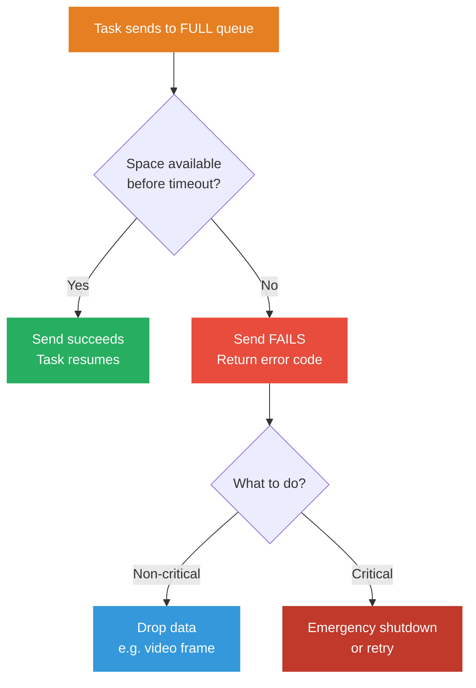

Ví dụ từ sách: video call bị drop 1 frame → người dùng **không nhận ra** → bỏ qua OK. Nhưng nếu sensor an toàn gửi fail → có thể phải **emergency shutdown**.

> [!WARNING]
> **Từ sách**: Code nên được thiết kế sao cho **send không bao giờ timeout** trong điều kiện bình thường. Timeout chỉ là **lưới an toàn** cho trường hợp bất thường — không phải flow chính.

---

### <span style="color:#1abc9c">1.3 Empty Queue Receive — Queue rỗng</span>

Khi task gọi `xQueueReceive()` nhưng queue **rỗng** (không có item nào) → **không thể nhận ngay**. RTOS sẽ **BLOCK** task đó — cho task ngủ, chờ đến khi có item hoặc hết timeout.

Hoạt động **đối xứng** với Full Queue Send:

| | Full Queue **Send** | Empty Queue **Receive** |
|---|---|---|
| **Điều kiện block** | Queue đầy, không có chỗ | Queue rỗng, không có data |
| **Thức khi nào?** | Task khác Receive → có chỗ | Task khác Send → có data |
| **Fail khi nào?** | Hết timeout, vẫn đầy | Hết timeout, vẫn rỗng |

**2 use case phổ biến từ sách:**

**1. Chờ input từ user — timeout vô hạn (OK)**

Task nhận lệnh qua serial port. User có thể không gửi gì trong **vài giờ** — hoàn toàn bình thường. Dùng `portMAX_DELAY` (chờ mãi mãi). Task ngủ yên, không tốn CPU, chỉ thức khi user thực sự gửi data.

**2. Chờ sensor data — timeout = cơ chế phát hiện lỗi**

Sensor 10Hz gửi data mỗi 100ms. Set timeout = **110ms** (hơi lớn hơn chu kỳ):

- Nhận data **trước 110ms** → ✅ sensor bình thường, xử lý data
- **Hết 110ms** mà không có data → ❌ sensor có vấn đề! → trigger corrective action (ghi log, cảnh báo, hoặc chuyển sang sensor backup)

> [!TIP]
> **Từ sách**: Timeout receive không chỉ để "tránh treo" — nó là công cụ **giám sát hệ thống**. Bằng cách đặt timeout hợp lý, bạn biến mỗi `xQueueReceive()` thành một **bộ kiểm tra sức khỏe** cho nguồn data phía trước.

---

### <span style="color:#1abc9c">1.4 Inter-Task Communication</span>

Đây là use case **phổ biến nhất** của queue — 1 task gửi data, task khác nhận data từ **cùng 1 queue**.

#### <span style="color:#3498db">Pattern 1: Một Producer, Một Consumer</span>

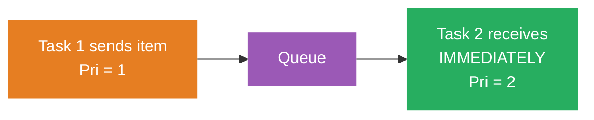

Task 1 (producer, priority thấp) gửi data vào queue. Task 2 (consumer, priority **cao hơn**) đang BLOCKED chờ nhận.

Khi Task 1 gửi item → RTOS phát hiện Task 2 đang chờ queue này → **đánh thức Task 2**. Vì Task 2 priority cao hơn → **preempt Task 1 ngay lập tức** → Task 2 nhận item và xử lý → xong → gọi Receive lại → BLOCKED → Task 1 tiếp tục chạy.

**Kết quả**: Consumer nhận data **gần như ngay lập tức** sau khi producer gửi — độ trễ chỉ vài µs (thời gian context switch).

#### <span style="color:#3498db">Pattern 2: Producer nhanh hơn Consumer (từ sách)</span>

Ngược lại: Task 1 (producer) có priority **cao hơn** Task 2 (consumer). Producer gửi liên tục, consumer không kịp đọc.

**Diễn biến từng bước (từ sách):**

1. **Task 2** (consumer) gọi Receive → queue rỗng → **BLOCKED**

2. **Task 1** (producer, priority cao) chạy, gửi item liên tục vào queue cho đến khi queue **đầy** (vì T1 priority cao hơn nên không bị preempt)

3. Queue đầy → Task 1 gọi Send → **BLOCKED** (chờ chỗ trống)

4. Scheduler thấy Task 1 blocked → chuyển sang **Task 2** (highest ready task). Task 2 nhận 1 item từ queue

5. Queue có chỗ trống → RTOS **đánh thức Task 1** ngay (vì T1 priority cao hơn T2). Task 1 gửi thêm 1 item → queue đầy lại → **BLOCKED**

6. Task 2 lại được chạy → nhận 1 item → Task 1 thức → gửi 1 → đầy → BLOCKED → ... **Cứ thế luân phiên**: T1 gửi 1 → T2 nhận 1 → T1 gửi 1...

> [!NOTE]
> Queue hoạt động như **bộ đệm giảm tốc** — producer nhanh nhưng queue giữ lại data cho consumer chậm xử lý dần. Sách phân tích scenario này chi tiết hơn ở **Chapter 9** với SystemView.

#### <span style="color:#3498db">Pattern 3: Nhiều Producer, Một Consumer</span>

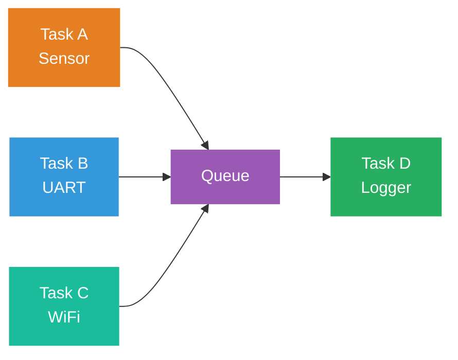

Nhiều task cùng gửi vào **1 queue**, 1 task chuyên trách nhận và xử lý.

**Ví dụ thực tế**: Hệ thống có 3 task — Sensor task, UART task, WiFi task — tất cả đều cần **ghi log**. Thay vì mỗi task tự gọi UART (gây conflict), tất cả gửi log message vào **1 queue chung**. Logger task nhận từ queue và gửi ra debug serial port.

**Queue có phân biệt data từ task nào không?** — **KHÔNG**. Queue chỉ là FIFO, lấy item theo thứ tự, không biết ai gửi. Nếu consumer cần biết nguồn → lập trình viên **tự đóng gói** thông tin vào struct:

```c
// Định nghĩa struct chứa cả DATA + NGUỒN GỬI
typedef enum { SRC_SENSOR, SRC_UART, SRC_WIFI } LogSource;

typedef struct {
    LogSource source;    // Ai gửi?
    char message[64];    // Nội dung
} LogMessage;

// Queue chứa struct LogMessage
QueueHandle_t logQueue = xQueueCreate(10, sizeof(LogMessage));

// Task A gửi — tự gắn source
LogMessage msg = { .source = SRC_SENSOR, .message = "Temp=42.5" };
xQueueSend(logQueue, &msg, portMAX_DELAY);

// Consumer nhận — biết data từ đâu nhờ field source
LogMessage received;
xQueueReceive(logQueue, &received, portMAX_DELAY);
switch (received.source) {
    case SRC_SENSOR: printf("[SENSOR] %s\n", received.message); break;
    case SRC_UART:   printf("[UART] %s\n", received.message);   break;
    case SRC_WIFI:   printf("[WIFI] %s\n", received.message);   break;
}
```

Ưu điểm:
- **Thread-safe**: nhiều task gửi cùng lúc mà **không cần thêm lock** — RTOS xử lý đồng bộ bên trong
- **Không conflict**: chỉ 1 task truy cập UART → không bị xung đột bus
- **Decoupling**: các task không cần biết nhau, chỉ cần biết queue

> [!NOTE]
> Sách trình bày pattern này chi tiết hơn ở **Chapter 13 — Loose Coupling with Queues**: dùng queue làm interface giữa các module, **command queue pattern** (gửi struct chứa command + data).

---

## <span style="color:#e67e22">2. RTOS Semaphore</span>

### <span style="color:#1abc9c">Khái niệm</span>

**Semaphore** = "sign-bearer" (người mang tín hiệu) — từ gốc Hy Lạp.

Semaphore dùng để **báo hiệu** (signaling) rằng một sự kiện đã xảy ra, **KHÔNG** dùng để truyền data.

**Hình dung đơn giản:** Queue = gửi **bưu kiện** (có nội dung bên trong). Semaphore = bấm **chuông cửa** (chỉ báo "có người đến", không mang theo gì).

| So sánh | Queue | Semaphore |
|---------|-------|-----------|
| **Mục đích** | Truyền **data** | Báo **tín hiệu** |
| **Nội dung** | Chứa item (struct, int...) | Chỉ có **count** (số đếm) |
| **Thao tác** | Send / Receive | Give / Take |
| **Bộ nhớ** | Tốn nhiều (mỗi item = N bytes) | Rất ít (chỉ 1 biến count) |

**Tại sao không dùng queue để báo hiệu luôn?** — Được, nhưng **lãng phí**. Nếu chỉ cần báo "có sự kiện xảy ra" mà không cần truyền data → semaphore **nhẹ hơn, nhanh hơn** queue (không copy data, không cần buffer).

**Give và Take hoạt động thế nào?**
- **Give** = "tín hiệu đã xảy ra" → count tăng (hoặc giữ nguyên nếu đã max)
- **Take** = "tôi nhận tín hiệu" → count giảm. Nếu count = 0 (chưa có tín hiệu) → task bị **BLOCKED** chờ đến khi có ai Give

**3 use case chính:**

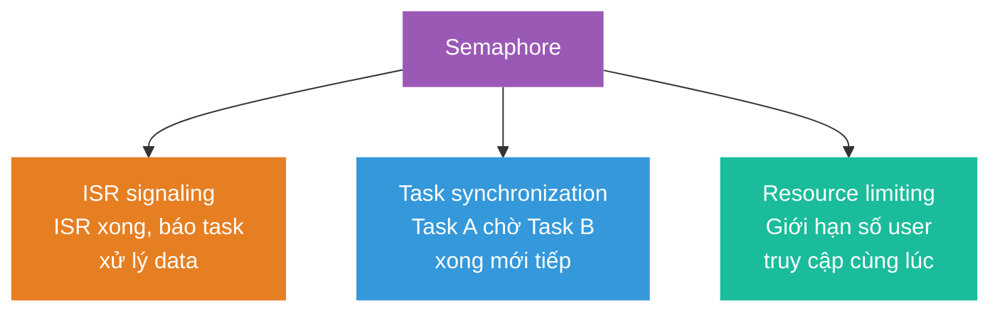

**Use case 1 — ISR signaling** (dùng **binary** semaphore)

Phổ biến nhất trong embedded. Khi hardware interrupt xảy ra (ADC xong, UART nhận byte, timer tick...), ISR **không được** xử lý nặng — chỉ Give semaphore rồi return. Task đang BLOCKED chờ Take sẽ **thức dậy** và xử lý data. ISR chỉ tốn ~2µs, task có thể xử lý 10ms+ thoải mái.

Ví dụ: Cảm biến gia tốc phát interrupt mỗi 1ms → ISR đọc register, Give sem → Task tính góc nghiêng, lọc Kalman, gửi UART.

**Use case 2 — Task synchronization** (dùng **binary** semaphore)

Task A cần **chờ** Task B hoàn thành một bước trước khi tiếp tục. Task A gọi Take → BLOCKED. Task B xong việc → Give → Task A thức dậy, tiếp tục.

Ví dụ: Task Init cấu hình WiFi module (mất 2-3 giây). Task HTTP phải chờ WiFi sẵn sàng mới được gửi request. Task Init xong → Give sem → Task HTTP Take thành công → bắt đầu gửi request.

**Use case 3 — Resource limiting** (dùng **counting** semaphore)

Giới hạn số task truy cập **cùng lúc** vào tài nguyên có số lượng hữu hạn. Counting semaphore với ceiling = số tài nguyên. Mỗi task muốn dùng → Take (count++). Dùng xong → Give (count--). Khi count = ceiling → task tiếp theo phải **chờ**.

Ví dụ: MCU có 3 DMA channel. Ceiling = 3. Ba task đầu tiên Take thành công (mỗi task chiếm 1 channel). Task thứ 4 muốn dùng DMA → Take → count = ceiling → BLOCKED → chờ đến khi 1 trong 3 task kia Give (trả channel).

---

### <span style="color:#1abc9c">2.1 Counting Semaphore</span>

#### <span style="color:#3498db">Định nghĩa</span>

**Counting semaphore** = semaphore có **giá trị tối đa (ceiling)** lớn hơn 1.

Dùng để **giới hạn số lượng** task truy cập đồng thời vào tài nguyên chia sẻ.

#### <span style="color:#3498db">Hình dung đơn giản: Bãi đỗ xe</span>

Tưởng tượng **bãi đỗ xe có 3 chỗ** (ceiling = 3):

```
 Bãi đỗ xe (3 chỗ)             Counting Semaphore (ceiling=3)
 ┌─────┬─────┬─────┐
 │ 🚗  │ 🚗  │     │           count = 2 (đã có 2 xe)
 └─────┴─────┴─────┘           ceiling = 3
   Xe vào = Take (count++)     Còn chỗ? count < ceiling → VÀO ĐƯỢC
   Xe ra  = Give (count--)     Hết chỗ? count = ceiling → CHỜ!
```

- **Take** = xin 1 chỗ. Nếu còn chỗ (count < ceiling) → vào ngay. Hết chỗ → **chờ**.
- **Give** = trả 1 chỗ. count giảm → xe khác có thể vào.
- **ceiling** = số chỗ tối đa (set khi tạo, không đổi).
- **count** = số chỗ đang bị chiếm (0 → ceiling).

#### <span style="color:#3498db">Bên trong RTOS: Take và Give hoạt động thế nào?</span>

```
 xSemaphoreTake(sem, timeout):
 ┌─────────────────────────────────────────┐
 │ 1. Kiểm tra: count < ceiling?           │
 │    ├── CÓ → count++, return pdPASS      │
 │    └── KHÔNG → task BLOCKED              │
 │         Chờ tối đa [timeout]             │
 │         Nếu có task Give trước timeout   │
 │         → count++, return pdPASS         │
 │         Nếu hết timeout → return pdFAIL  │
 └─────────────────────────────────────────┘

 xSemaphoreGive(sem):
 ┌─────────────────────────────────────────┐
 │ 1. Kiểm tra: count > 0?                 │
 │    ├── CÓ → count--                     │
 │    │   Có task đang chờ Take?            │
 │    │   → Đánh thức task đó               │
 │    └── count = 0 → không hiệu ứng       │
 └─────────────────────────────────────────┘
```

> [!NOTE]
> **Counting semaphore KHÔNG có ownership** — bất kỳ task nào cũng có thể Give, bất kỳ task nào cũng có thể Take. Khác với Mutex (chỉ task đang giữ mới được trả).

#### <span style="color:#3498db">Ví dụ từ sách: Socket Connection Pool</span>

Hệ thống có **3 task** cần kết nối mạng, nhưng chỉ đủ memory cho **2 socket** đồng thời:

```
 Counting Semaphore: ceiling = 2, initial count = 0

 ┌────────┐   ┌────────┐   ┌────────┐
 │ Task A │   │ Task B │   │ Task C │
 │ (WiFi) │   │ (HTTP) │   │ (MQTT) │
 └───┬────┘   └───┬────┘   └───┬────┘
     │            │            │
     └────────────┼────────────┘
                  ↓
         ┌────────────────┐
         │   Semaphore    │
         │  count: 0 / 2  │
         └────────┬───────┘
                  ↓
         ┌────────────────┐
         │  Network HW    │
         │  (max 2 socket)│
         └────────────────┘
```

#### <span style="color:#3498db">Timeline chi tiết (từ sách)</span>

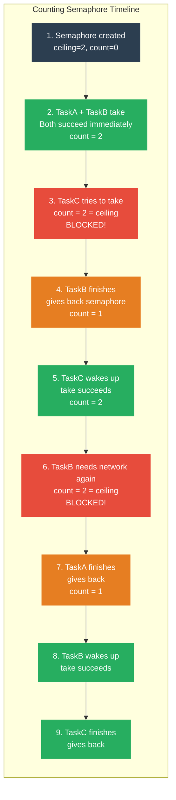

**Quy tắc Take/Give:**

| Thao tác | Điều kiện | Kết quả |
|----------|-----------|---------|
| **Take** | count < ceiling | ✅ Thành công, count++ |
| **Take** | count = ceiling | ❌ BLOCKED, chờ timeout |
| **Give** | count > 0 | ✅ Thành công, count-- |
| **Give** | count = 0 | Giữ nguyên count = 0 (không có hiệu ứng) |

> [!WARNING]
> **Timeout trong RTOS khác với semaphore thông thường!** 
>
> RTOS semaphore có **timeout** — nếu task không lấy được semaphore trong thời gian quy định → trả về **fail** → task **PHẢI** xử lý trường hợp này (không được truy cập resource).
>
> Hành động khi fail: từ **emergency shutdown** (nghiêm trọng) đến **ghi log** (nhẹ).

#### <span style="color:#3498db">Khi nào dùng Counting Semaphore?</span>

Dùng khi hệ thống có **tài nguyên giới hạn số lượng** — nhiều task cần dùng nhưng không thể tất cả cùng lúc:

| Tình huống | Ceiling | Giải thích |
|-----------|---------|------------|
| **Socket pool** | 2-5 | MCU có RAM cho tối đa N kết nối TCP cùng lúc |
| **DMA channel** | 2-3 | STM32 thường có 7-8 DMA channel, nhưng chỉ muốn dành 2-3 cho application |
| **SPI bus** | 1-2 | Nhiều sensor dùng chung SPI, giới hạn số transaction song song |
| **Memory pool** | N | Cấp phát block từ pool cố định — mỗi Take = lấy 1 block, Give = trả block |
| **Event counting** | N | Đếm số event xảy ra (ISR give mỗi lần event) — task take để xử lý từng event |

#### <span style="color:#3498db">Use case phổ biến: DMA Channel Pool</span>

STM32 có nhiều DMA channel nhưng application chỉ được dùng **2 channel** (các channel còn lại dành cho hệ thống). 3 task cần truyền data qua DMA.

#### <span style="color:#3498db">Quy trình chi tiết từng bước</span>

**Bối cảnh**: Counting semaphore ceiling = 2, initial count = 0. Ba task (ADC, UART, SPI) đều cần DMA.

**Bước 1 — Khởi tạo**

Tạo counting semaphore: `sem = xSemaphoreCreateCounting(2, 0)`. Ceiling = 2 (tối đa 2 task dùng DMA cùng lúc). Count ban đầu = 0 (chưa ai dùng).

**Bước 2 — Task ADC và Task UART cần DMA**

Task ADC gọi `Take(sem)` → count = 0 < ceiling (2) → **thành công**, count = 1. Task ADC chiếm 1 DMA channel, bắt đầu truyền data.

Task UART gọi `Take(sem)` → count = 1 < ceiling (2) → **thành công**, count = 2. Task UART chiếm DMA channel thứ 2.

**Bước 3 — Task SPI cần DMA — nhưng hết channel!**

Task SPI gọi `Take(sem)` → count = 2 = ceiling → **BLOCKED**. Task SPI ngủ, chờ đến khi có channel trống.

**Bước 4 — Task UART truyền xong, trả DMA**

Task UART hoàn thành DMA transfer → gọi `Give(sem)` → count = 1. RTOS phát hiện Task SPI đang BLOCKED chờ sem này → **đánh thức Task SPI**.

**Bước 5 — Task SPI thức dậy, dùng DMA**

Task SPI Take thành công → count = 2. Bắt đầu DMA transfer. Lúc này: Task ADC và Task SPI đang dùng 2 channel.

**Bước 6 — Chu kỳ tiếp tục**

Task nào xong → Give → count giảm → task đang chờ được đánh thức → Take → dùng DMA. Cứ thế luân phiên, **tối đa 2 task** dùng DMA cùng lúc.

**Code ví dụ:**

```c
// Tạo counting semaphore: max 2, ban đầu chưa ai dùng
SemaphoreHandle_t dmaSem = xSemaphoreCreateCounting(2, 0);

void TaskADC(void *param) {
    while(1) {
        // Xin 1 DMA channel — chờ tối đa 50ms
        if (xSemaphoreTake(dmaSem, pdMS_TO_TICKS(50)) == pdPASS) {
            startDMA_ADC();          // Dùng DMA
            waitDMA_Complete();      // Chờ transfer xong
            xSemaphoreGive(dmaSem);  // Trả channel
        } else {
            // 50ms không có channel → xử lý lỗi
        }
        vTaskDelay(pdMS_TO_TICKS(10));
    }
}
// Task UART, Task SPI — tương tự: Take → dùng → Give
```

**Tóm tắt quy trình:**

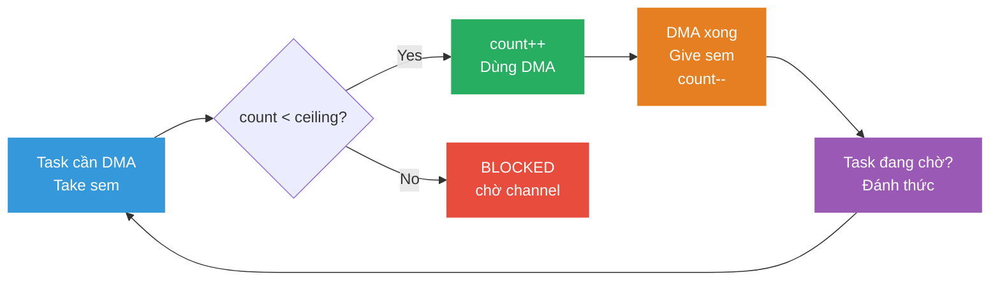

**Khi nào KHÔNG dùng Counting Semaphore?**

- Nếu chỉ cần báo hiệu **có/không** (1 tín hiệu) → dùng **binary semaphore** (nhẹ hơn)
- Nếu cần **bảo vệ 1 tài nguyên duy nhất** và cần tránh priority inversion → dùng **mutex** (có priority inheritance)
- Nếu cần **truyền data** kèm tín hiệu → dùng **queue**

---

### <span style="color:#1abc9c">2.2 Binary Semaphore</span>

#### <span style="color:#3498db">Định nghĩa</span>

**Binary semaphore** = counting semaphore với **ceiling = 1**. Chỉ có 2 trạng thái: **0** (trống) hoặc **1** (có tín hiệu).

Dùng chủ yếu cho **synchronization** (đồng bộ) — 1 task/ISR **give**, 1 task khác **take**.

#### <span style="color:#3498db">Hình dung đơn giản: Đèn giao thông 1 chiều</span>

```
 Đèn giao thông                Binary Semaphore
 ┌─────────┐
 │  🔴 ĐỎ  │ = 0 (trống)      Task B gọi Take → BLOCKED (chờ đèn xanh)
 │         │
 │ 🟢 XANH │ = 1 (có tín hiệu) Task B gọi Take → PASS (đi ngay)
 └─────────┘

 Task A (hoặc ISR) bật đèn xanh = Give (0 → 1)
 Task B thấy đèn xanh, đi qua  = Take (1 → 0, đèn tắt)
 Task B muốn đi tiếp            = Take → BLOCKED (đèn đã đỏ, chờ A bật lại)
```

**Khác counting:** Counting cho **nhiều xe qua cùng lúc** (ceiling > 1). Binary chỉ cho **đúng 1 tín hiệu** rồi phải chờ tín hiệu tiếp.

#### <span style="color:#3498db">So sánh Counting vs Binary</span>

| Tiêu chí | Counting Semaphore | Binary Semaphore |
|----------|-------------------|------------------|
| **Ceiling** | > 1 (tùy chọn) | = 1 (cố định) |
| **Trạng thái** | 0, 1, 2, ... N | Chỉ 0 hoặc 1 |
| **Mục đích chính** | Giới hạn số user | Signaling / Sync |
| **Ai Give?** | User xong resource | ISR hoặc Task A |
| **Ai Take?** | User cần resource | Task B chờ tín hiệu |
| **Give nhiều lần?** | count giảm mỗi lần | Nếu đã = 1 → giữ nguyên 1 |
| **Ví dụ** | 3 socket, 2 DMA channel | ISR báo data ready |

#### <span style="color:#3498db">Use case phổ biến nhất: ISR → Task</span>

Đây là pattern **quan trọng nhất** của binary semaphore trong embedded:

```
 ┌──────────────┐                              ┌──────────────┐
 │  Sensor ISR  │                              │  Task B      │
 │  (rất ngắn!) │                              │  (xử lý)     │
 │              │      Binary Semaphore        │              │
 │ 1. Đọc data  │      ┌───────────┐           │ 1. Take()    │
 │ 2. Lưu vào   │      │           │           │    → BLOCKED │
 │    buffer    │      │   0 → 1   │           │    (ngủ)     │
 │ 3. Give() ───┼────→ │           │ ────────→ │ 2. WAKE UP!  │
 │ 4. Return    │      └───────────┘           │ 3. Xử lý    │
 └──────────────┘                              │    buffer    │
   ~1µs                                        │ 4. Take()    │
   (ISR phải ngắn!)                            │    → BLOCKED │
                                               └──────────────┘
                                                 ~10ms
                                                 (xử lý nặng OK)
```

#### <span style="color:#3498db">Quy trình chi tiết từng bước</span>

**Bối cảnh**: Sensor ADC cứ mỗi 10ms phát 1 interrupt. ISR đọc data, Task xử lý data.

**Bước 1 — Khởi tạo**

Tạo binary semaphore bằng `xSemaphoreCreateBinary()`. Trạng thái ban đầu: **sem = 0** (trống, chưa có tín hiệu). ProcessTask bắt đầu chạy, gọi `Take(sem)` → sem = 0 → không có tín hiệu → task bị **BLOCKED** (ngủ). CPU rảnh → chạy Idle task hoặc task khác.

**Bước 2 — Hardware Interrupt xảy ra**

ADC chuyển đổi xong → kéo **interrupt line** lên mức active. NVIC phát hiện interrupt → **dừng ngay** task đang chạy (hoặc Idle task). CPU tự động lưu context (thanh ghi R0-R3, LR, PC, PSR) lên stack → nhảy vào **ISR handler**.

**Bước 3 — ISR chạy (CỰC NGẮN — vài µs)**

```c
void ADC_IRQHandler(void) {
    // 1. Đọc data từ hardware register (~1 instruction)
    adcBuffer = ADC1->DR;

    // 2. Give semaphore — BÁO cho task biết có data mới
    xSemaphoreGiveFromISR(sem, &xHigherPriorityTaskWoken);
    //  sem: 0 → 1

    // 3. Yêu cầu context switch nếu task vừa được đánh thức
    //    có priority cao hơn task đang bị interrupt
    portYIELD_FROM_ISR(xHigherPriorityTaskWoken);
}
// ISR XONG — return, tổng cộng ~1-5µs
```

ISR chỉ làm **3 việc**: đọc data, give semaphore, yêu cầu yield. Toàn bộ chỉ tốn **vài µs**.

**Bước 4 — Scheduler kiểm tra sau khi ISR return**

`portYIELD_FROM_ISR()` đã set flag báo scheduler cần kiểm tra. Scheduler thấy ProcessTask đang **BLOCKED** chờ `sem`, mà `sem` vừa được Give (= 1) → chuyển ProcessTask từ **Blocked → Ready**. Nếu ProcessTask là task priority cao nhất → thực hiện **context switch** → ProcessTask **RUN**.

**Bước 5 — ProcessTask thức dậy, xử lý data**

```c
void ProcessTask(void *param) {
    while(1) {
        // Take: đã chờ từ Bước 1, giờ sem = 1 → return pdPASS
        xSemaphoreTake(sem, portMAX_DELAY);  // sem: 1 → 0

        // Xử lý data — có thể tốn 5-10ms, HOÀN TOÀN OK vì đang ở task
        float voltage = adcBuffer * 3.3f / 4096.0f;
        applyFilter(voltage);
        updateDisplay(voltage);
        logToSD(voltage);

        // Xong → vòng lặp quay lại Take, sem = 0 → BLOCKED (ngủ lại)
    }
}
```

Take thành công → sem về 0. Task xử lý nặng thoải mái (filter, display, log SD card...). Xong hết → vòng `while(1)` quay lại `Take()` → sem đang = 0 → **BLOCKED** (ngủ tiếp, chờ ISR tiếp theo).

**Bước 6 — Chu kỳ lặp lại**

10ms sau → ADC interrupt lại → ISR chạy → `Give(sem)` → sem = 1 → ProcessTask thức → xử lý → `Take()` → BLOCKED → ... Cứ thế lặp mãi theo nhịp ADC.

**Tóm tắt quy trình:**

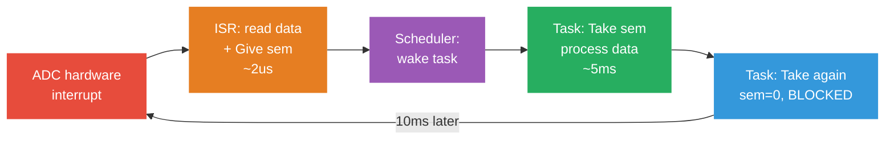

> [!IMPORTANT]
> **Tại sao cần pattern này?**
> - ISR **phải ngắn** (< vài µs) — không được xử lý nặng trong ISR (block interrupt khác!)
> - Task **có thể chạy lâu** — xử lý data, gọi API, ghi log, gửi UART...
> - Binary semaphore là **cầu nối**: ISR chỉ Give (nhanh), Task làm việc nặng
> - Task **ngủ** khi không có data → **tiết kiệm CPU** — không phải polling liên tục

> [!WARNING]
> **Trong ISR phải dùng API riêng!**
> - ✅ `xSemaphoreGiveFromISR()` — an toàn trong ISR
> - ❌ `xSemaphoreGive()` — **KHÔNG ĐƯỢC** dùng trong ISR (sẽ crash!)
>
> Lý do: API thường có thể gây context switch, sleep, hoặc truy cập scheduler — các thao tác **cấm** trong ISR.

#### <span style="color:#3498db">Ví dụ: ISR báo hiệu Task xử lý</span>

```
 ┌──────────────┐         Binary          ┌──────────────┐
 │   Task A     │       Semaphore         │   Task B     │
 │ (hoặc ISR)   │                         │ (Worker)     │
 │              │      ┌───────┐          │              │
 │  give() ─────┼────→ │ 0 / 1 │ ────────→│  take()      │
 │              │      └───────┘          │              │
 └──────────────┘                         └──────────────┘
   Chỉ GIVE                                Chỉ TAKE
   (không take)                             (không give lại!)
```

#### <span style="color:#3498db">Timeline chi tiết (từ sách)</span>

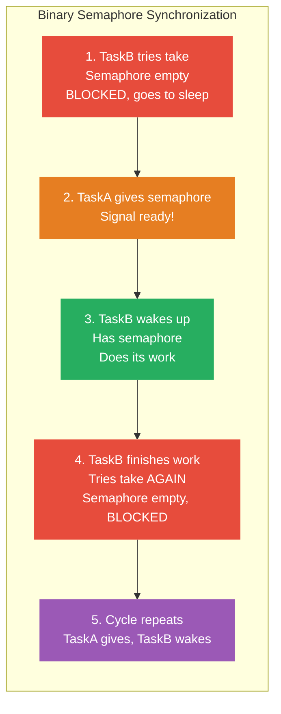

> [!CAUTION]
> **TaskB KHÔNG ĐƯỢC give lại** binary semaphore sau khi dùng xong!
>
> Nếu give lại → semaphore = 1 → TaskB sẽ **take thành công ngay lập tức** → chạy lặp **full speed** thay vì chờ tín hiệu từ TaskA → **sai logic hoàn toàn!**
>
> ```
> ❌ SAI:
> while(1) {
>     xSemaphoreTake(sem, portMAX_DELAY);
>     doWork();
>     xSemaphoreGive(sem);    // BUG! Sẽ tự take lại ngay!
> }
> 
> ✅ ĐÚNG:
> while(1) {
>     xSemaphoreTake(sem, portMAX_DELAY);  // Chờ tín hiệu
>     doWork();
>     // KHÔNG give lại — chờ nguồn khác give
> }
> ```

---

## <span style="color:#e67e22">3. RTOS Mutex</span>

### <span style="color:#1abc9c">Khái niệm</span>

**Mutex** = **Mut**ual **Ex**clusion (loại trừ lẫn nhau).

Nếu 1 task **đang dùng** tài nguyên chia sẻ → **không task nào khác** được phép dùng → phải chờ.

**Hình dung đơn giản:** Mutex = **chìa khóa phòng tắm**. Ai cầm chìa khóa thì vào được. Người khác muốn vào → chờ ngoài cửa. Dùng xong → **trả chìa khóa** → người tiếp theo vào. Chỉ người **đang cầm chìa khóa** mới được trả — không ai khác trả thay được.

> Nghe giống binary semaphore? **Đúng!** Nhưng mutex có thêm 2 tính năng quan trọng: **Ownership** và **Priority Inheritance**.

**Ownership — Điểm khác biệt quan trọng nhất:**

Binary semaphore: bất kỳ task nào cũng có thể Give, bất kỳ task nào cũng có thể Take — **không có chủ sở hữu**.

Mutex: chỉ task **đã Take (lock)** mới được phép **Give (unlock)**. Nếu task khác cố Give → **lỗi**. Điều này ngăn chặn bug "trả nhầm khóa".

| So sánh | Binary Semaphore | Mutex |
|---------|-----------------|-------|
| **Mục đích chính** | Signaling / Sync | Bảo vệ shared resource |
| **Ownership** | ❌ Ai cũng Give/Take | ✅ Chỉ task đang giữ mới được Give |
| **Priority Inheritance** | ❌ Không có | ✅ Có — giải quyết priority inversion |
| **Dùng trong ISR?** | ✅ Có (`FromISR`) | ❌ **Không bao giờ** (ISR không có ownership) |
| **Pattern** | ISR give → Task take | Task lock → dùng resource → unlock |

**Khi nào dùng Mutex?**

Dùng khi **nhiều task truy cập cùng 1 tài nguyên** mà không được phép truy cập đồng thời:

- **Ghi/đọc biến global** — 2 task cùng sửa 1 struct → data bị corrupt
- **Truy cập I2C/SPI bus** — 2 task cùng gửi command trên bus → data trộn lẫn
- **Ghi file/log** — 2 task cùng ghi SD card → file hỏng
- **Đọc/ghi LCD** — 2 task cùng vẽ lên display → hiển thị sai

> [!IMPORTANT]
> **Quy tắc từ sách**: Nếu chỉ cần **báo hiệu** (signaling) → dùng **semaphore**. Nếu cần **bảo vệ tài nguyên** (mutual exclusion) → dùng **mutex**. Dùng sai loại sẽ gây bug rất khó debug (priority inversion, race condition).

---

### <span style="color:#1abc9c">3.1 Priority Inversion — Vấn đề khi dùng Binary Semaphore</span>

#### <span style="color:#3498db">Setup</span>

| Task | Priority | Vai trò |
|------|---------|---------|
| Task A | 3 (CAO) | Cần resource X |
| Task B | 2 (TB) | Không dùng resource X |
| Task C | 1 (THẤP) | Cần resource X (cùng với A) |

**Binary semaphore** bảo vệ resource X.

#### <span style="color:#3498db">Timeline — Priority Inversion xảy ra</span>

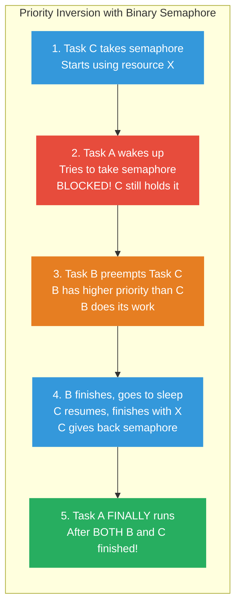

#### <span style="color:#3498db">Giải thích quy trình từng bước</span>

**Bước 1 — Task C (priority thấp nhất) chiếm resource X**

Task C đang chạy (vì A và B đang ngủ). C gọi `Take(semaphore)` → thành công → bắt đầu dùng resource X (ví dụ: ghi data lên I2C bus). C vẫn đang dùng X, chưa Give.

**Bước 2 — Task A (priority cao nhất) thức dậy, cần resource X**

Một interrupt hoặc timer đánh thức Task A. Vì A priority cao nhất (3) → **preempt C ngay** → A chạy. A cũng cần resource X → gọi `Take(semaphore)` → nhưng C **vẫn đang giữ** semaphore → A bị **BLOCKED**.

Lúc này A đang chờ C trả semaphore. Scheduler chuyển lại cho C chạy (vì C đang giữ resource, cần hoàn thành).

**Bước 3 — Task B (priority trung bình) thức dậy — VẤN ĐỀ BẮT ĐẦU!**

Task B thức dậy (do timer hoặc event). B priority = 2, **cao hơn C** (priority 1). B không cần resource X, chỉ cần CPU. Scheduler thấy B priority > C → **preempt C** → B chạy.

**Đây là lúc priority inversion xảy ra:** Task C bị B chiếm CPU → C **không thể hoàn thành** việc dùng resource X → C **không thể Give** semaphore → Task A **tiếp tục bị block** — mặc dù A priority CAO HƠN B!

**Bước 4 — Task B xong việc, C tiếp tục**

B hoàn thành công việc → ngủ. Scheduler chuyển lại cho C (highest ready task). C tiếp tục dùng resource X → xong → `Give(semaphore)`.

**Bước 5 — Task A CUỐI CÙNG mới được chạy**

Semaphore được Give → RTOS đánh thức A → A Take thành công → dùng resource X. Nhưng A đã phải chờ **cả B lẫn C** xong — mặc dù B **không liên quan gì** đến resource X!

#### <span style="color:#3498db">Vấn đề</span>

**Thứ tự mong muốn** (theo priority): A → B → C

**Thứ tự thực tế** (do inversion): C (giữ sem) → B (preempt C) → C (tiếp tục) → **A (chờ cuối cùng!)** ❌

> [!CAUTION]
> **Priority Inversion** = task priority **cao** (A) phải chờ trong khi task priority **thấp hơn** (B) đang chạy — priorities bị **đảo ngược**!
>
> Task B **không liên quan** đến resource X nhưng lại **chặn** Task A — đây là điều **không thể chấp nhận** trong hệ thống real-time!
>
> **Ví dụ thực tế nổi tiếng:** NASA Mars Pathfinder (1997) gặp priority inversion → hệ thống bị reset liên tục trên sao Hỏa. NASA phải upload patch từ Trái Đất để bật priority inheritance!

---

### <span style="color:#1abc9c">3.2 Priority Inheritance — Mutex giải quyết Inversion</span>

#### <span style="color:#3498db">Cơ chế</span>

**Mutex = Binary Semaphore + Priority Inheritance**

Khi scheduler phát hiện task priority **cao** đang chờ mutex mà task priority **thấp** đang giữ:

→ **Tạm nâng** priority của task thấp lên **bằng** task cao

→ Task thấp **chạy xong nhanh** (không bị preempt bởi task trung gian)

→ Trả mutex → **hạ priority** về cũ

#### <span style="color:#3498db">Timeline — Mutex với Priority Inheritance</span>

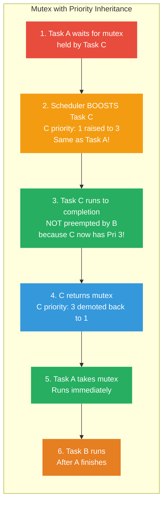

#### <span style="color:#3498db">Giải thích quy trình từng bước</span>

**Cùng setup**: Task A (pri 3), Task B (pri 2), Task C (pri 1). Nhưng lần này dùng **mutex** thay vì binary semaphore.

**Bước 1 — Task C giữ mutex, Task A thức dậy và cần mutex**

Giống hệt scenario priority inversion: Task C đang giữ mutex (dùng resource X). Task A thức dậy, gọi `Take(mutex)` → C vẫn giữ → A bị **BLOCKED**.

**Bước 2 — Scheduler BOOST priority của Task C** ⭐

Đây là điểm **khác biệt duy nhất** so với binary semaphore. Scheduler phát hiện: "Task A (pri 3) đang blocked chờ mutex mà Task C (pri 1) đang giữ". Vì dùng **mutex** (có priority inheritance) → Scheduler **tạm nâng** priority của C từ **1 lên 3** (bằng A).

Task C giờ có priority = 3, **cao nhất hệ thống**.

**Bước 3 — Task B thức dậy — NHƯNG KHÔNG preempt được C!**

Task B (pri 2) thức dậy, muốn chạy. Scheduler so sánh: B priority = 2, C priority = **3** (đã được boost). B < C → **B không preempt được** → B phải chờ.

Task C chạy **không bị gián đoạn**, hoàn thành việc dùng resource X nhanh nhất có thể.

**Bước 4 — Task C trả mutex, priority hạ về cũ**

C dùng xong resource X → gọi `Give(mutex)`. RTOS tự động **hạ priority C về 1** (giá trị gốc). Mutex được trả → RTOS đánh thức Task A.

**Bước 5 — Task A chạy ngay lập tức**

A Take mutex thành công → dùng resource X. A priority = 3 — cao nhất → chạy ngay, không ai chen được.

**Bước 6 — Task B cuối cùng mới chạy**

A hoàn thành → Give mutex → ngủ. Scheduler thấy B (pri 2) là highest ready → B chạy.

**Thứ tự cuối cùng:** C (giữ mutex, được boost) → **A** (priority cao nhất) → B → đúng priority! ✅

#### <span style="color:#3498db">So sánh: Binary Semaphore vs Mutex</span>

| Giai đoạn | Binary Semaphore | Mutex |
|-----------|-----------------|-------|
| **1.** C giữ lock, A chờ | A blocked | A blocked |
| **2.** B preempt? | ✅ B preempt C (B > C) | ❌ B **KHÔNG** preempt C (C được nâng = A) |
| **3.** Thứ tự chạy | C → **B** → A ❌ | C → **A** → B ✅ |
| **Thời gian A chờ** | Chờ cả B lẫn C | Chỉ chờ C (ngắn hơn!) |

> [!IMPORTANT]
> **Quy tắc vàng**: Khi bảo vệ resource chia sẻ giữa các task, **LUÔN dùng Mutex**, không dùng Binary Semaphore!
>
> Binary Semaphore chỉ dùng cho **signaling** (một chiều: give → take), KHÔNG dùng cho **mutual exclusion**.

> [!TIP]
> Dù mutex giải quyết priority inversion, Task A **vẫn phải chờ** Task C xong. Nên:
> - **Giảm thiểu thời gian giữ mutex** — vào critical section, làm nhanh, trả mutex
> - Dùng **timeout** khi take mutex — nếu timeout → xử lý lỗi thay vì chờ mãi
> - **Timing analysis** để đảm bảo Task A vẫn meet deadline dù phải chờ

---

## <span style="color:#e67e22">4. So sánh tổng hợp: Queue vs Semaphore vs Mutex</span>

### <span style="color:#1abc9c">Bảng so sánh chi tiết</span>

| Tiêu chí | Queue | Counting Semaphore | Binary Semaphore | Mutex |
|----------|-------|--------------------|------------------|-------|
| **Mục đích** | Truyền **data** | Giới hạn **số user** | **Signaling** | **Mutual exclusion** |
| **Nội dung** | Data (any type) | Count (0..ceiling) | Count (0 or 1) | Lock (0 or 1) |
| **Send/Give** | Gửi data vào | Trả lại resource | Phát tín hiệu | Trả lại lock |
| **Receive/Take** | Nhận data ra | Xin truy cập | Chờ tín hiệu | Xin lock |
| **Ai Give?** | Producer | User xong resource | ISR hoặc Task A | **Chỉ task đang giữ** |
| **Ai Take?** | Consumer | User cần resource | Task B chờ signal | Task cần resource |
| **Priority Inheritance** | ❌ | ❌ | ❌ | ✅ |
| **Timeout** | ✅ | ✅ | ✅ | ✅ |
| **ISR safe?** | ✅ (API riêng) | ✅ (API riêng) | ✅ (API riêng) | ❌ (không dùng trong ISR) |

### <span style="color:#1abc9c">Khi nào dùng cái nào?</span>

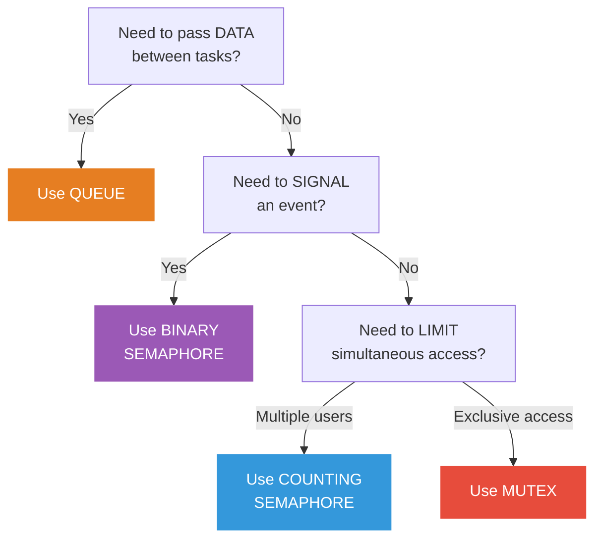

---

## <span style="color:#e67e22">5. Câu hỏi ôn tập (từ sách)</span>

1. **Primitive nào dùng phổ biến nhất để gửi/nhận data giữa các task?**
   > → **Queue**. Thread-safe, FIFO, hỗ trợ timeout, tự đánh thức task đang chờ.

2. **Queue có thể tương tác với nhiều hơn 2 task không?**
   > → **Có**. Nhiều task có thể send vào cùng 1 queue (multiple producers), 1 task receive (single consumer). Hoặc ngược lại.

3. **Primitive nào dùng cho signaling và synchronization?**
   > → **Semaphore** (binary hoặc counting).

4. **Ví dụ khi nào dùng counting semaphore?**
   > → Khi cần **giới hạn số lượng** truy cập đồng thời. Ví dụ: hệ thống chỉ hỗ trợ **2 socket** cùng lúc → counting semaphore ceiling = 2.

5. **1 khác biệt lớn giữa binary semaphore và mutex?**
   > → Mutex có **priority inheritance** — tự động nâng priority task thấp đang giữ mutex khi task cao đang chờ. Binary semaphore **KHÔNG** có tính năng này → gây **priority inversion**.

6. **Bảo vệ resource chia sẻ giữa các task: dùng binary semaphore hay mutex?**
   > → **Mutex**. Vì mutex có priority inheritance, tránh priority inversion.

7. **Priority inversion là gì và tại sao nguy hiểm?**
   > → Priority inversion = task priority **cao bị chờ** trong khi task priority **thấp hơn** (không liên quan) lại đang chạy. Nguy hiểm vì **phá vỡ tính deterministic** — task quan trọng nhất không được chạy đúng lúc → **miss deadline** → hệ thống real-time fail.

---

## <span style="color:#e67e22">📌 Tóm tắt chương (Key Takeaways)</span>

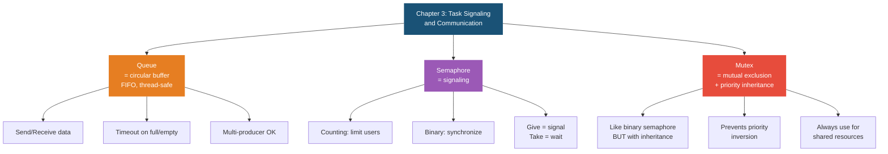

## <span style="color:#f1c40f">4. Hướng dẫn lựa chọn Queue / Semaphore / Mutex</span>

### <span style="color:#1abc9c">Cây quyết định nhanh</span>

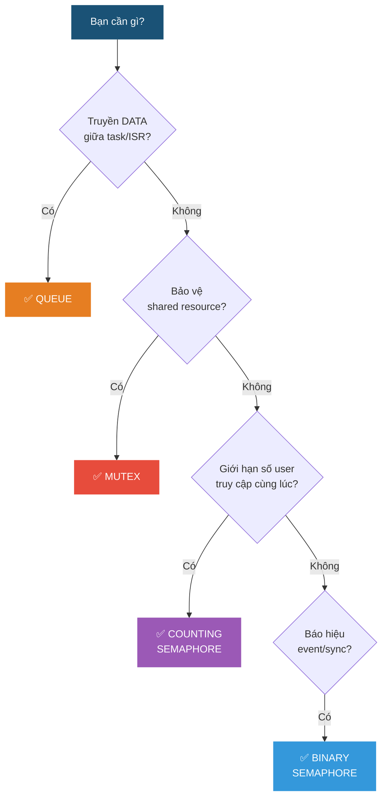

**Quy tắc 3 giây**: Nếu bạn phải suy nghĩ quá 3 giây — hỏi 2 câu:
1. Có cần **truyền data** không? → Có = **Queue**
2. Có cần **bảo vệ resource** không? → Có = **Mutex**, Không = **Semaphore**

### <span style="color:#1abc9c">Bảng tra cứu theo tình huống</span>

| Tình huống | Lựa chọn | Lý do |
|-----------|---------|-------|
| ISR đọc sensor → báo task xử lý | **Binary Semaphore** | Chỉ cần "báo có data", không cần truyền data qua sem (data lưu ở buffer global) |
| ISR đọc sensor → gửi data cho task | **Queue** | Cần truyền **giá trị** sensor, không chỉ tín hiệu |
| Task A chờ Task B xong init mới tiếp | **Binary Semaphore** | Sync 1 lần, không cần data |
| 2 task cùng ghi lên I2C bus | **Mutex** | Bảo vệ shared resource + priority inheritance |
| 2 task cùng đọc/ghi biến global | **Mutex** | Tránh race condition + priority inheritance |
| 3 task cần DMA, chỉ có 2 channel | **Counting Semaphore** | Giới hạn số lượng, không phải bảo vệ 1 resource |
| Nhiều task gửi log → 1 task print | **Queue** | Multi-producer pattern, cần truyền nội dung log |
| ISR phát event liên tục, task xử lý từng cái | **Counting Semaphore** hoặc **Queue** | Counting nếu chỉ đếm event, Queue nếu mỗi event mang data khác nhau |

### <span style="color:#1abc9c">Combo Pattern — Senior Engineers dùng nhiều nhất</span>

Trong thực tế, senior engineers **kết hợp** nhiều primitive cùng lúc:

#### <span style="color:#3498db">Pattern 1: ISR + Binary Sem + Queue (phổ biến nhất)</span>

ISR báo hiệu bằng semaphore, task thức dậy rồi đọc data từ queue hoặc buffer.

```c
// ISR: cực ngắn
void UART_IRQHandler(void) {
    rxBuffer[idx++] = UART->DR;
    if (idx == PACKET_SIZE) {
        xSemaphoreGiveFromISR(rxSem, &woken);  // Báo hiệu: packet đã đủ
        portYIELD_FROM_ISR(woken);
    }
}

// Task: xử lý nặng
void ProcessTask(void *p) {
    while(1) {
        xSemaphoreTake(rxSem, portMAX_DELAY);  // Chờ packet
        parsePacket(rxBuffer);                  // Xử lý
        xQueueSend(cmdQueue, &command, 10);     // Gửi kết quả cho task khác
    }
}
```

**Tại sao không chỉ dùng queue?** — ISR cần **cực nhanh**. Gửi từng byte vào queue tốn thời gian hơn so với ghi vào buffer + give sem 1 lần khi đủ packet.

#### <span style="color:#3498db">Pattern 2: Mutex + Queue (Command Pattern)</span>

Mutex bảo vệ hardware, queue truyền lệnh.

```c
// Task gửi lệnh vào queue
DisplayCmd cmd = { .type = DRAW_TEXT, .x = 10, .y = 20, .text = "Hello" };
xQueueSend(displayQueue, &cmd, portMAX_DELAY);

// Display task: nhận lệnh, dùng mutex khi truy cập LCD
void DisplayTask(void *p) {
    DisplayCmd cmd;
    while(1) {
        xQueueReceive(displayQueue, &cmd, portMAX_DELAY);
        xSemaphoreTake(lcdMutex, portMAX_DELAY);  // Lock LCD
        LCD_Execute(&cmd);                          // Ghi LCD
        xSemaphoreGive(lcdMutex);                   // Unlock
    }
}
```

**Tại sao kết hợp?** — Queue để nhiều task gửi lệnh an toàn. Mutex để chỉ 1 task truy cập LCD hardware tại 1 thời điểm (có priority inheritance).

#### <span style="color:#3498db">Pattern 3: Counting Sem + Mutex (Resource Pool)</span>

Counting sem giới hạn số lượng, mutex bảo vệ khi cấp phát.

```c
// Counting sem: giới hạn 3 buffer cùng lúc
// Mutex: bảo vệ pool array khi allocate/free

Buffer* allocBuffer(void) {
    xSemaphoreTake(poolCountSem, portMAX_DELAY);  // Chờ có buffer trống
    xSemaphoreTake(poolMutex, portMAX_DELAY);     // Lock pool
    Buffer* buf = findFreeSlot(pool);              // Tìm slot trống
    xSemaphoreGive(poolMutex);                     // Unlock pool
    return buf;
}

void freeBuffer(Buffer* buf) {
    xSemaphoreTake(poolMutex, portMAX_DELAY);     // Lock pool
    markFree(buf);                                 // Trả slot
    xSemaphoreGive(poolMutex);                     // Unlock pool
    xSemaphoreGive(poolCountSem);                  // Tăng số buffer trống
}
```

#### <span style="color:#3498db">Pattern 4: Queue làm Mailbox (1 slot, overwrite)</span>

Queue size = 1, dùng `xQueueOverwrite()` — luôn giữ **giá trị mới nhất**. Không cần đọc hết, chỉ cần giá trị hiện tại.

```c
// Queue 1 slot — "mailbox"
QueueHandle_t tempMailbox = xQueueCreate(1, sizeof(float));

// Producer: luôn ghi đè giá trị mới nhất
float temp = readSensor();
xQueueOverwrite(tempMailbox, &temp);  // Không bao giờ block

// Consumer: đọc giá trị mới nhất khi cần (không xóa khỏi queue)
float current;
xQueuePeek(tempMailbox, &current, 0);  // Peek = đọc mà không xóa
```

**Dùng khi**: Display task cần hiện nhiệt độ **hiện tại**, không cần lịch sử.

### <span style="color:#1abc9c">Anti-patterns — SAI LẦM cần tránh</span>

| ❌ Sai | ✅ Đúng | Lý do |
|--------|---------|-------|
| Dùng **binary sem** bảo vệ shared resource | Dùng **mutex** | Binary sem không có priority inheritance → priority inversion |
| Dùng **mutex** trong ISR | Dùng **binary sem** `FromISR` | ISR không có ownership, mutex sẽ crash |
| Dùng **queue** chỉ để báo hiệu (gửi dummy data) | Dùng **binary sem** | Lãng phí RAM, chậm hơn sem |
| Take mutex rồi **không Give** (quên unlock) | Luôn Give trong mọi code path | Deadlock — task khác chờ mãi mãi |
| Giữ mutex **quá lâu** (xử lý nặng trong lock) | Lock → copy data ra → unlock → xử lý | Giữ lâu = block task khác lâu, giảm real-time |

> [!IMPORTANT]
> **Tóm tắt lựa chọn:**
> - Truyền data → **Queue**
> - Báo hiệu / sync → **Binary Semaphore**
> - Giới hạn số lượng → **Counting Semaphore**
> - Bảo vệ resource → **Mutex**
> - Thực tế → thường **kết hợp 2-3 loại** trong cùng 1 hệ thống

---

## <span style="color:#e67e22">5. Software Timer Management (Quản Lý Timer Phần Mềm)</span>

📗 Nguồn: Mastering the FreeRTOS Real Time Kernel - Richard Barry

### <span style="color:#1abc9c">Core Concepts</span>

- Timer phần mềm thực thi callback function tại một thời điểm được cài đặt trước, **KHÔNG cần timer phần cứng** (ngoại trừ SysTick dùng cho RTOS tick).
- **One-shot timer** (chạy 1 lần) vs **Auto-reload timer** (tự động lặp lại).
- Timer có 2 trạng thái: **Dormant** (Không hoạt động) và **Running** (Đang hoạt động).
- Chu kỳ (Period) được định nghĩa bằng ticks, thường dùng macro `pdMS_TO_TICKS()` để chuyển đổi từ mili-giây.

#### <span style="color:#3498db">State Machine Diagram (Trạng Thái Timer)</span>

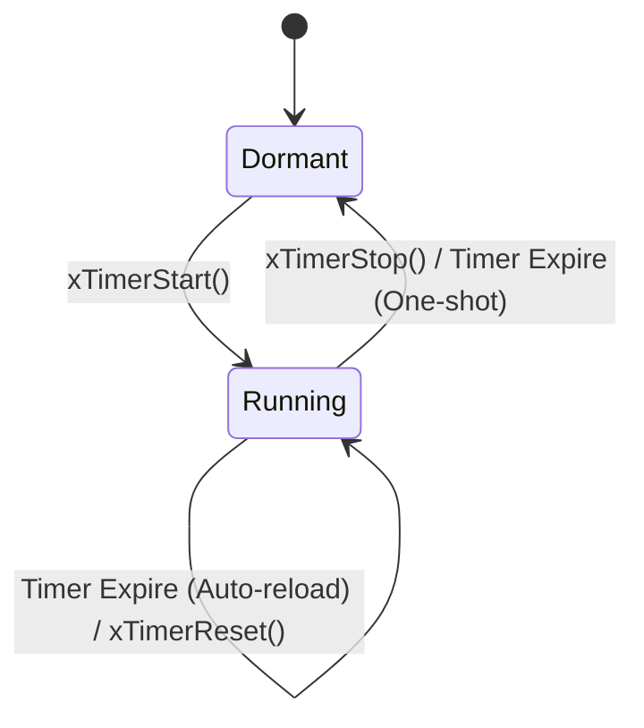

### <span style="color:#1abc9c">The RTOS Daemon Task</span>

- Tất cả timer callback đều được thực thi trong context của **cùng một daemon task duy nhất** (trước đây gọi là timer task).
- Cấu hình trong `FreeRTOSConfig.h`: `configUSE_TIMERS`, `configTIMER_TASK_PRIORITY`, `configTIMER_TASK_STACK_DEPTH`, `configTIMER_QUEUE_LENGTH`.
- Cơ chế **Timer Command Queue**: Các API của timer thực chất là ghi command (Lệnh) vào một queue. Daemon task đọc queue này và xử lý command.
- Command chứa **time stamps** (dấu thời gian) khi command được gửi, giúp ngăn ngừa sai lệch thời gian (latency drift).
- Hai kịch bản scheduling:
  - Task ưu tiên cao hơn Daemon: Daemon task bị preempt, chạy sau khi task xong.
  - Daemon ưu tiên cao hơn Task: Daemon chạy ngay, preempt task hiện tại.

### <span style="color:#1abc9c">Timer Callback Rules (Quy Tắc CRITICAL Cho Callback)</span>

> [!CAUTION]
> - **Tuyệt đối KHÔNG bao giờ block** (không dùng `vTaskDelay`, không đọc queue với timeout > 0).
> - Phải giữ hàm callback **cực kỳ ngắn gọn**.
> - Tham số `xTicksToWait` phải luôn là `0` cho mọi API RTOS gọi bên trong callback.
> - Tuyệt đối không gọi các hàm `FromISR` từ trong callback (vì đây là task context, KHÔNG phải ngắt ISR).

### <span style="color:#1abc9c">Complete API Reference</span>

| API | Chức năng |
|-----|-----------|
| `xTimerCreate()` | Tạo timer động (5 tham số: Tên, Chu kỳ, Auto-reload, ID, Callback). |
| `xTimerCreateStatic()` | Có từ V9.0.0+, dùng bộ nhớ tĩnh (`StaticTimer_t`). |
| `xTimerStart()` | Gửi lệnh Start vào command queue. |
| `xTimerStop()` | Chuyển timer sang trạng thái Dormant. |
| `xTimerReset()` | Tính toán lại thời gian hết hạn (từ thời điểm gọi hàm). |
| `xTimerChangePeriod()` | Thay đổi chu kỳ (cũng có thể khởi động timer đang Dormant). |
| `xTimerDelete()` | Xóa timer, giải phóng tài nguyên. |
| `vTimerSetTimerID()` / `pvTimerGetTimerID()` | Truy cập Timer ID trực tiếp (không qua queue). |
| `xTimerIsTimerActive()` | Kiểm tra xem timer có đang Running không. |
| `xTimerPendFunctionCall()` | Chuyển giao công việc (deferred processing) cho daemon task. |

*Lưu ý: Tất cả API điều khiển timer đều có phiên bản `FromISR` (vd: `xTimerStartFromISR()`) dùng trong ngắt.*

#### <span style="color:#3498db">Callback Function Prototype</span>

```c
void ATimerCallback( TimerHandle_t xTimer );
```

### <span style="color:#1abc9c">Practical Examples</span>

#### <span style="color:#3498db">Example 13: One-shot & Auto-reload timers</span>

```c
TimerHandle_t xAutoReloadTimer, xOneShotTimer;

// Callback cho cả 2 timer
void prvTimerCallback(TimerHandle_t xTimer) {
    TickType_t xTimeNow = xTaskGetTickCount();
    
    // Kiểm tra xem timer nào vừa gọi callback
    if (xTimer == xOneShotTimer) {
        printf("One-shot timer expried at %d\n", xTimeNow);
    } else {
        printf("Auto-reload timer expired at %d\n", xTimeNow);
    }
}

// Khởi tạo timer
xOneShotTimer = xTimerCreate("OneShot", pdMS_TO_TICKS(3333), pdFALSE, 0, prvTimerCallback);
xAutoReloadTimer = xTimerCreate("Reload", pdMS_TO_TICKS(500), pdTRUE, 0, prvTimerCallback);
```

#### <span style="color:#3498db">Example 14: Shared callback & ID làm bộ đếm</span>

```c
void prvSharedCallback(TimerHandle_t xTimer) {
    uint32_t ulCount;
    // Lấy giá trị đếm từ Timer ID
    ulCount = (uint32_t) pvTimerGetTimerID(xTimer);
    ulCount++;
    
    // Cập nhật lại ID
    vTimerSetTimerID(xTimer, (void*)ulCount);
    
    // Dừng timer nếu đã chạy 5 lần
    if (ulCount >= 5) {
        xTimerStop(xTimer, 0);
    }
}
```

#### <span style="color:#3498db">Example 15: Mô phỏng đèn nền điện thoại (xTimerReset)</span>

Mỗi khi người dùng ấn phím, timer được reset lại từ đầu (ví dụ: đèn sáng thêm 5s).

```c
// Bấm phím (giả lập ngắt) -> bật đèn và reset timer
void vKeyPressCallback() {
    TurnBacklightOn();
    // Reset timer, đèn sẽ tắt sau 5s nếu không có phím nào được bấm
    xTimerReset(xBacklightTimer, 0); 
}
```

#### <span style="color:#3498db">Health Check Timer</span>
Dùng `xTimerChangePeriod()` để chuyển từ chu kỳ 3s (bình thường) sang 200ms (lỗi).

---

## <span style="color:#e67e22">6. Event Groups (Nhóm Sự Kiện)</span>

📗 Nguồn: Mastering the FreeRTOS Real Time Kernel - Richard Barry

### <span style="color:#1abc9c">Core Concepts</span>

- **Event flags** là các bit (boolean) bên trong một biến kiểu `EventBits_t`.
- Khi cấu hình `configUSE_16_BIT_TICKS=1` -> có **8 bit** sử dụng được, `=0` -> có **24 bit** sử dụng được (8 bit cao dành cho kernel).
- Cơ chế giao tiếp **Many-to-many publish-subscribe**: nhiều task có thể set bit, nhiều task có thể chờ bit.
- File source: phải include `event_groups.c` trong project.

### <span style="color:#1abc9c">Key Differences from Queues/Semaphores</span>

> [!TIP]
> - **Wait on COMBINATION (Chờ sự kết hợp):** Có thể chờ nhiều bit cùng lúc với logic AND (đợi tất cả) hoặc OR (đợi 1 trong các bit).
> - **BROADCAST (Phát sóng):** Khi set 1 bit, **TẤT CẢ** các task đang chờ bit đó đều được unblock (khác với queue/semaphore chỉ unblock task ưu tiên cao nhất).
> - **Non-cumulative (Không cộng dồn):** Set một bit đã được set sẵn thì không có tác dụng phụ.
> - **Cực kỳ tiết kiệm RAM:** 1 Event Group có thể thay thế tới 24 Binary Semaphores.

### <span style="color:#1abc9c">Complete API Reference</span>

| API | Chức năng |
|-----|-----------|
| `xEventGroupCreate()` / `xEventGroupCreateStatic()` | Tạo Event Group động / tĩnh. |
| `xEventGroupSetBits()` | Task dùng để set bit (KHÔNG dùng trong ngắt). |
| `xEventGroupSetBitsFromISR()` | Dùng trong ISR. Lệnh thực ra được đẩy vào Timer Command Queue cho daemon task chạy (Non-deterministic). Cần `configUSE_TIMERS=1`, `INCLUDE_xTimerPendFunctionCall=1`. |
| `xEventGroupWaitBits()` | Chờ các bit được set (5 tham số: group, bits chờ, clearOnExit, waitForAllBits, timeout). |
| `xEventGroupClearBits()` / `xEventGroupClearBitsFromISR()` | Xóa các bit thủ công / từ ngắt. |
| `xEventGroupGetBits()` / `xEventGroupGetBitsFromISR()` | Đọc trạng thái các bit hiện tại. |
| `xEventGroupSync()` | Dùng cho điểm hẹn (Rendezvous), vừa set bit báo hiệu vừa chờ các bit khác. |

#### <span style="color:#3498db">Unblock Condition Matrix</span>

| Các bit đang set | Bit cần chờ (`uxBitsToWaitFor`) | `xWaitForAllBits` | Kết quả |
|------------------|--------------------------------|-------------------|---------|
| `0b00000001`     | `0b00000101` (Bit 0 và 2)      | `pdFALSE` (OR)    | **UNBLOCK** (Vì bit 0 đã set) |
| `0b00000001`     | `0b00000101` (Bit 0 và 2)      | `pdTRUE` (AND)    | **BLOCK** (Chưa đủ bit 2) |
| `0b00000101`     | `0b00000101` (Bit 0 và 2)      | `pdTRUE` (AND)    | **UNBLOCK** (Đã đủ 2 bit) |
| `0b00000100`     | `0b00000101` (Bit 0 và 2)      | `pdFALSE` (OR)    | **UNBLOCK** (Vì bit 2 đã set) |

*Lưu ý:* Khi gọi `xEventGroupWaitBits` với `xClearOnExit=pdTRUE`, các bit chờ sẽ được tự động xóa (atomic clearing) để ngăn ngừa race condition.

### <span style="color:#1abc9c">The Rendezvous Pattern (Điểm Hẹn Đồng Bộ)</span>

- **Vấn đề Race Condition:** Nếu task gọi `SetBits()` rồi sau đó gọi `WaitBits()`, có thể một task khác ưu tiên cao nhất đã đọc được bit và làm sạch nó (clear) trước khi task đầu tiên kịp bắt đầu chờ.
- **Giải pháp:** Dùng `xEventGroupSync()` thực hiện atomic (nguyên tử) cả thao tác Set và Wait (kèm Clear).
- **Ví dụ đóng socket TCP:**
  - `SocketTxTask` và `SocketRxTask` cùng phải kết thúc thì mới đóng được kết nối.
  - Mỗi task dùng 1 bit báo hiệu xong, và dùng `Sync` để đợi task kia hoàn thành.

### <span style="color:#1abc9c">Practical Examples</span>

#### <span style="color:#3498db">Example 22: OR mode vs AND mode</span>

```c
// Ví dụ chờ 1 trong 2 sự kiện (OR)
xEventGroupWaitBits(
    xEventGroup,
    (BIT_0 | BIT_1), // Chờ bit 0 hoặc bit 1
    pdTRUE,          // Tự động clear bit sau khi thoát
    pdFALSE,         // Chờ OR (không cần đợi tất cả)
    portMAX_DELAY
);
```

#### <span style="color:#3498db">Example 23: 3-task synchronization barrier using xEventGroupSync()</span>

```c
#define TASK_A_BIT (1 << 0)
#define TASK_B_BIT (1 << 1)
#define TASK_C_BIT (1 << 2)
#define ALL_SYNC_BITS (TASK_A_BIT | TASK_B_BIT | TASK_C_BIT)

void vTaskA(void *pvParameters) {
    while(1) {
        // Thực hiện công việc A...
        
        // Báo hiệu xong việc (Set TASK_A_BIT) và đợi B, C xong việc
        xEventGroupSync(
            xEventGroup,
            TASK_A_BIT,     // Bit của mình
            ALL_SYNC_BITS,  // Đợi tất cả
            portMAX_DELAY
        );
        // Khi chạy đến đây, cả 3 task đều đã hoàn thành 1 vòng lặp.
    }
}
```

### <span style="color:#1abc9c">Best Practices</span>

> [!IMPORTANT]
> - Sử dụng event groups làm **barrier (rào cản) khởi tạo hệ thống**, bắt các task phải đợi tất cả các module init xong mới chạy tiếp.
> - Ưu tiên để **tiết kiệm RAM** so với việc tạo hàng loạt semaphores (1 event group thay 24 semaphores).
> - Rất phù hợp làm **tín hiệu Abort khẩn cấp (Emergency Abort)** nhờ khả năng Broadcast (báo cho nhiều task cùng lúc).
> - Luôn cấu hình daemon task phù hợp khi cần ISR thao tác trên event group.
