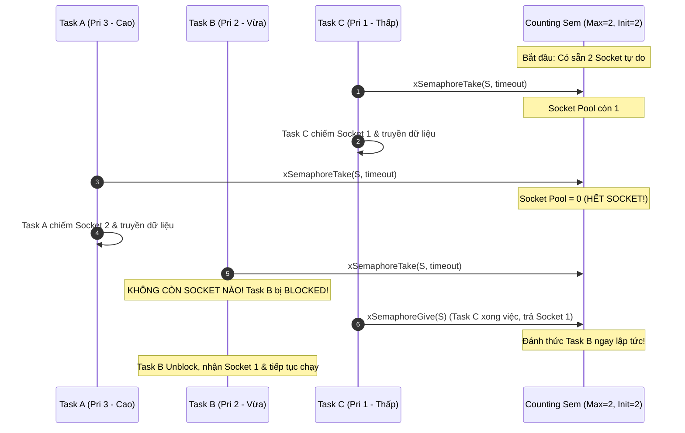
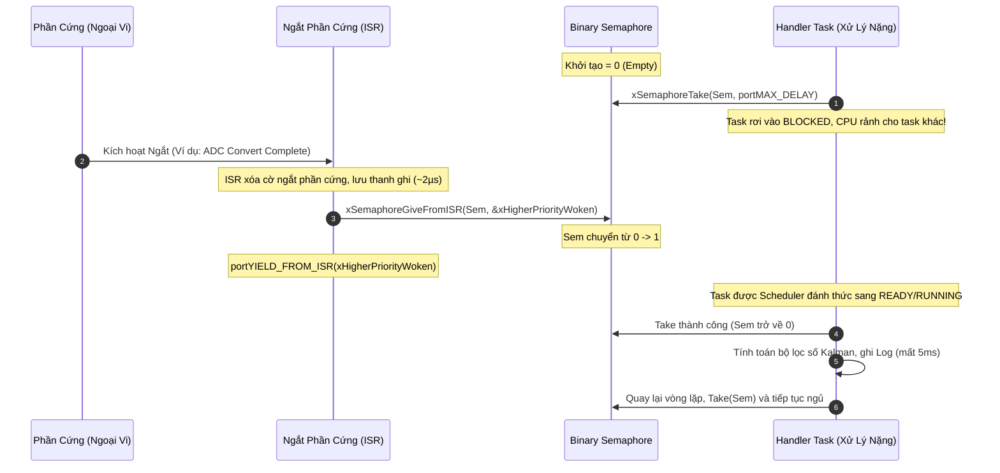
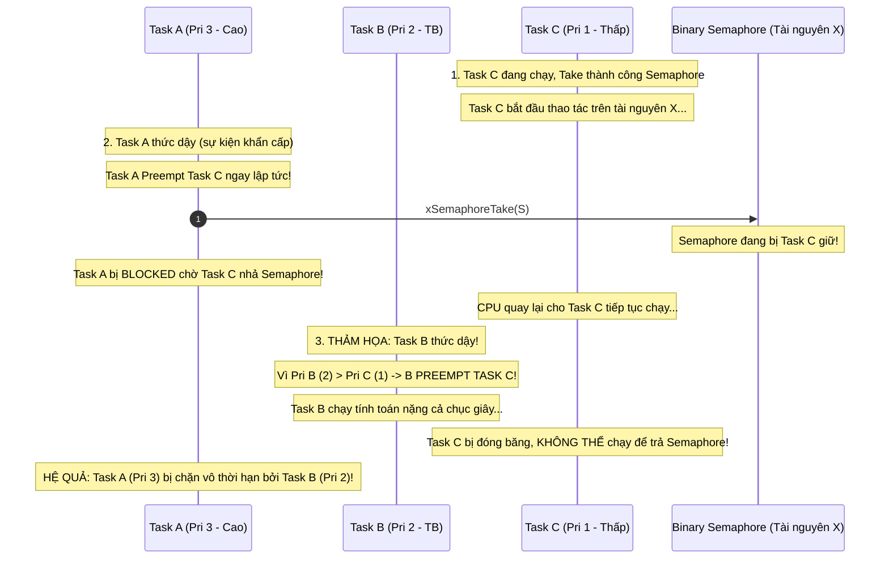
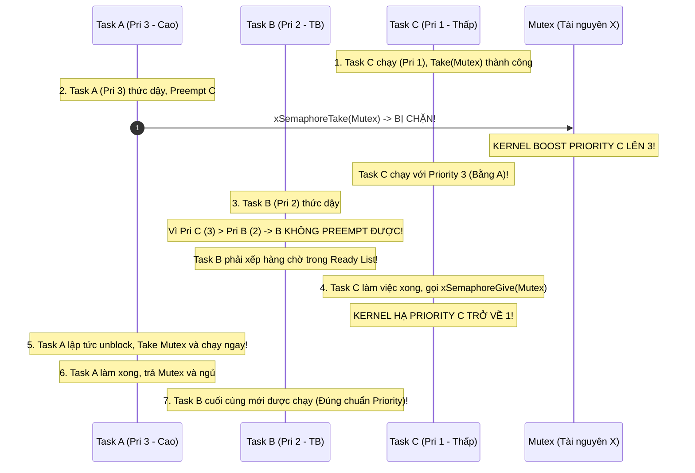
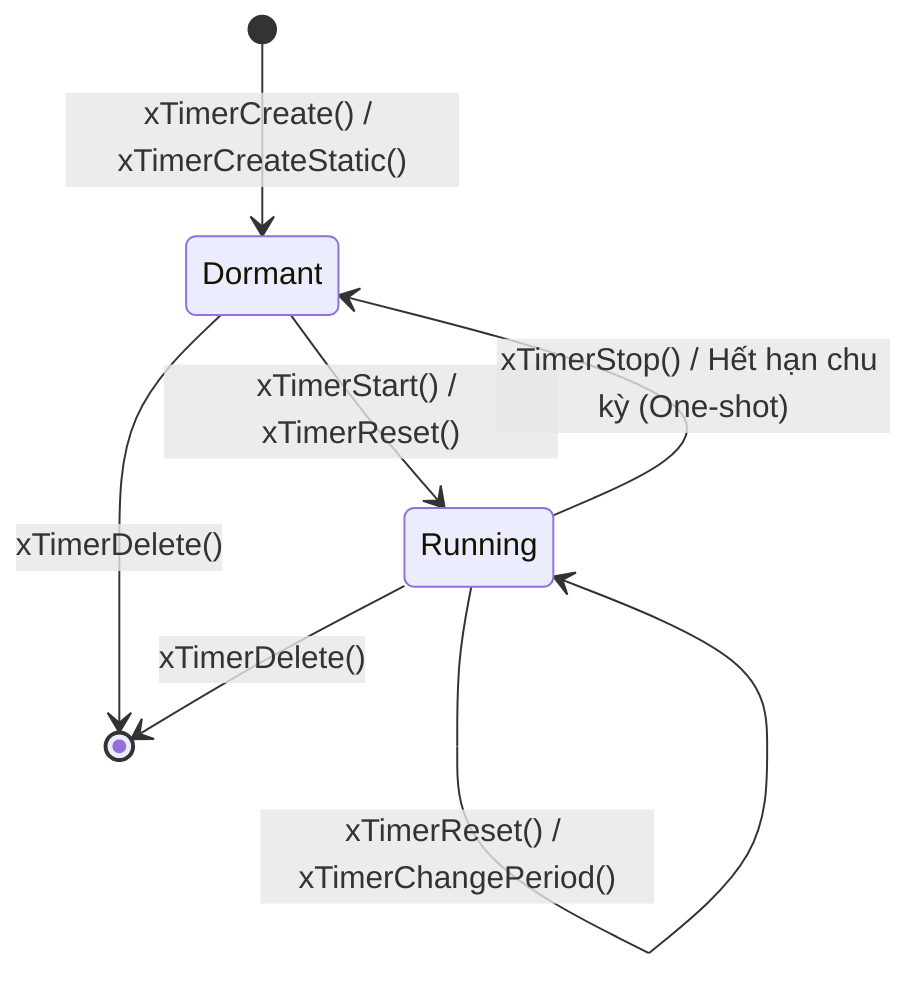

# <span style="color:#f1c40f">📘 Chương 5: Cơ Chế Báo Hiệu Và Truyền Thông Task (Signaling & Inter-Task Communication)</span>

*Tài liệu học tập tích hợp chuyên sâu: "Hands-On RTOS with Microcontrollers" (Brian Amos - Chapter 3) & "Mastering the FreeRTOS Real Time Kernel" (Richard Barry - Chapters 4, 5, 8)*

---

```
========================================================================================================
                                     MỤC LỤC TỔNG QUAN CHƯƠNG 5
========================================================================================================
 1. RTOS Queue (Hàng Đợi Truyền Dữ Liệu)
    ├─ 1.1 Khái niệm Circular Buffer & Tính năng đặc biệt của RTOS Queue
    ├─ 1.2 Simple Send & Receive (Cơ chế hoạt động khi Queue có chỗ hoặc có dữ liệu)
    ├─ 1.3 Full Queue Send (Cơ chế Block và Timeout khi Queue đầy)
    ├─ 1.4 Empty Queue Receive (Cơ chế Block và Timeout khi Queue rỗng)
    ├─ 1.5 Các Mô Hình Giao Tiếp Inter-Task Communication (1-1, 1-Nhiều, Nhiều-1)
    ├─ 1.6 Queue Sets — Đồng bộ nhóm Queue & Semaphore (xQueueCreateSet)
    ├─ 1.7 Mẫu Thiết Kế Discriminated Union (Tagged Union Đa Kiểu Thông Điệp)
    ├─ 1.8 Copy-by-Value vs Copy-by-Reference (Truyền Con Trỏ & Quản Lý Vùng Nhớ)
    ├─ 1.9 Đọc Không Hủy Dữ Liệu: xQueuePeek()
    ├─ 1.10 Mẫu Thiết Kế Mailbox (xQueueOverwrite & xQueueOverwriteFromISR)
    ├─ 1.11 Thực Nghiệm FreeRTOS Cốt Lõi (Richard Barry: Example 10 & Example 11)
    └─ 1.12 Bảng Tra Cứu API Toàn Diện Cho Queue
 2. RTOS Semaphore (Báo Hiệu & Đồng Bộ)
    ├─ 2.1 Khái niệm Semaphore & So sánh với Queue
    ├─ 2.2 Counting Semaphore (Bãi đỗ xe, Socket Pool, DMA Channel Pool)
    ├─ 2.3 Binary Semaphore (Đồng bộ ISR → Task, Task → Task)
    ├─ 2.4 Bản Chất Kiến Trúc Kernel: Semaphore Thực Chất Là Gì?
    ├─ 2.5 Hai Mô Hình Counting Semaphore: Event Latching vs Resource Pool
    └─ 2.6 Bảng Tra Cứu API Toàn Diện Cho Semaphore
 3. RTOS Mutex & Bảo Vệ Tài Nguyên (Mutual Exclusion)
    ├─ 3.1 Khái niệm Mutex, Quyền Sở Hữu (Ownership) & So sánh với Binary Semaphore
    ├─ 3.2 Vấn Đề Đảo Ngược Mức Ưu Tiên (Priority Inversion)
    ├─ 3.3 Kế Thừa Mức Ưu Tiên (Priority Inheritance) Giải Quyết Inversion
    ├─ 3.4 Case Study Lịch Sử: Sự Cố NASA Mars Pathfinder (1997)
    ├─ 3.5 Giới Hạn Của Kế Thừa Mức Ưu Tiên & Lưu Ý Trong Phân Tích Thời Gian
    ├─ 3.6 Recursive Mutex (Mutex Đệ Quy — Tránh Deadlock Nội Bộ)
    └─ 3.7 Hiện Tượng Bỏ Đói Task Cùng Mức Ưu Tiên & Giải Pháp taskYIELD()
 4. Software Timer Management (Quản Lý Timer Phần Mềm)
    ├─ 4.1 Khái niệm Core: One-shot Timer vs Auto-reload Timer & Trạng Thái Timer
    ├─ 4.2 RTOS Daemon Task (Timer Service Task) & Timer Command Queue
    ├─ 4.3 Dấu Thời Gian (Timestamps) & Phân Tích 2 Kịch Bản Điều Phối Daemon
    ├─ 4.4 Quy Tắc Sống Còn Cho Timer Callback (Timer Callback Rules)
    ├─ 4.5 Centralised Deferred Interrupt Processing (xTimerPendFunctionCall)
    ├─ 4.6 Thực Nghiệm FreeRTOS Cốt Lõi (Richard Barry: Example 13, 14, 15)
    └─ 4.7 Bảng Tra Cứu API Toàn Diện Cho Software Timer
 5. Event Groups (Nhóm Cờ Sự Kiện)
    ├─ 5.1 Khái niệm Event Bits, Event Flags & Phân Bổ Bit trong EventBits_t
    ├─ 5.2 Khác Biệt Cốt Lõi: Chờ Tổ Hợp (AND/OR) & Cơ Chế Broadcast Unblock
    ├─ 5.3 Tại Sao xEventGroupSetBitsFromISR() Phải Chuyển Giao Cho Daemon Task?
    ├─ 5.4 Phân Tích Tham Số & Giá Trị Trả Về Của xEventGroupWaitBits()
    ├─ 5.5 Điểm Hẹn Đồng Bộ Nhiều Task (The Rendezvous Pattern — xEventGroupSync)
    ├─ 5.6 Thực Nghiệm FreeRTOS Cốt Lõi (Richard Barry: Example 22 & Example 23)
    └─ 5.7 Bảng Tra Cứu API Toàn Diện Cho Event Groups
 6. So Sánh Tổng Hợp & Hướng Dẫn Lựa Chọn Primitive
    ├─ 6.1 Bảng Ma Trận So Sánh Toàn Bộ 8 Primitive Giao Tiếp RTOS
    ├─ 6.2 Cây Quyết Định Kiến Trúc (Architecture Decision Tree)
    ├─ 6.3 Các Combo Pattern Thực Tế Của Senior Embedded Engineers
    └─ 6.4 Danh Sách Anti-Patterns & Lỗi Nguy Hiểm Thường Gặp
 7. Câu Hỏi Ôn Tập Chuyên Sâu (Brian Amos & Richard Barry)
 8. 📌 Tóm Tắt Khắc Cốt Ghi Tâm (Key Takeaways)
========================================================================================================
```

---


## <span style="color:#e67e22">1. RTOS Queue (Hàng Đợi Truyền Dữ Liệu)</span>

📘 *Nguồn tham chiếu: Brian Amos (Chapter 3) & Richard Barry (Chapter 4)*

### <span style="color:#1abc9c">1.1 Khái Niệm Circular Buffer & Tính Năng Đặc Biệt Của RTOS Queue</span>

**Queue (Hàng đợi)** là kênh giao tiếp liên tác vụ (Inter-Task Communication - IPC) cơ bản và quan trọng nhất trong FreeRTOS. Nó cho phép các task và ngắt ISR trao đổi dữ liệu có cấu trúc một cách an toàn, có thứ tự (FIFO - First In First Out) và hoàn toàn thread-safe.

Bản chất bên trong: RTOS Queue được xây dựng trên nền tảng của một **Circular Buffer (Bộ đệm vòng)** kết hợp với cơ chế quản lý trạng thái Block/Wakeup của scheduler.

#### <span style="color:#3498db">Circular Buffer là gì?</span>

* **Linear Buffer (Buffer tuyến tính thông thường):** Khi ghi dữ liệu chạm đến cuối mảng bộ nhớ, để tiếp tục ghi, hệ thống bắt buộc phải dịch chuyển (copy/`memmove`) toàn bộ dữ liệu còn lại về đầu mảng. Thao tác này tiêu tốn thời gian $O(N)$ CPU clock và gây biến thiên thời gian thực thi (non-deterministic).
* **Circular Buffer (Buffer vòng tròn):** Sử dụng 2 con trỏ chỉ số: **HEAD** (vị trí đọc) và **TAIL** (vị trí ghi) di chuyển tuần hoàn trên một mảng cố định. Khi con trỏ chạm đến cuối mảng, nó tự động quay vòng (wrap around) về chỉ số 0 thông qua phép chia lấy dư modulo hoặc so sánh con trỏ. **Tuyệt đối không cần di chuyển dữ liệu trong RAM**, thời gian đọc/ghi luôn là hằng số $O(1)$.

```
     Linear Buffer (Chậm, phải copy data):            Circular Buffer (Nhanh O(1), con trỏ quay vòng):
     ┌─┬─┬─┬─┐                                        ┌─┬─┬─┬─┐
     │A│B│C│D│ ← Đầy! Phải dịch chuyển sang trái!  ╭→ │ │ │C│D│ ──╮
     └─┴─┴─┴─┘                                     │  └─┴─┴─┴─┘   │
     Phải memmove() về đầu ⟵ Lãng phí CPU!          ╰────── vòng ──╯
                                                    HEAD=2 (đọc C), TAIL=0 (ghi tiếp vào slot 0)
```

#### <span style="color:#3498db">Ví dụ Minh Họa Vận Hành Circular Buffer 4 Slot Từng Bước:</span>

```
 Bước 1: Khởi tạo Buffer Rỗng
 ┌────┬────┬────┬────┐
 │    │    │    │    │   HEAD=0, TAIL=0, uxMessagesWaiting=0
 └────┴────┴────┴────┘
   H,T

 Bước 2: Send "A", Send "B", Send "C"
 ┌────┬────┬────┬────┐
 │ A  │ B  │ C  │    │   HEAD=0, TAIL=3, uxMessagesWaiting=3
 └────┴────┴────┴────┘
   H              T

 Bước 3: Receive "A" (Lấy phần tử cũ nhất theo FIFO)
 ┌────┬────┬────┬────┐
 │    │ B  │ C  │    │   HEAD=1, TAIL=3, uxMessagesWaiting=2
 └────┴────┴────┴────┘
        H         T

 Bước 4: Send "D", Send "E" (TAIL chạm đáy mảng và quay vòng về index 0)
 ┌────┬────┬────┬────┐
 │ E  │ B  │ C  │ D  │   HEAD=1, TAIL=1, uxMessagesWaiting=4 (QUEUE FULL!)
 └────┴────┴────┴────┘
   T    H
   ↑ TAIL quay vòng về index 0 ghi "E"

 Bước 5: Receive "B" (Giải phóng 1 slot tại index 1)
 ┌────┬────┬────┬────┐
 │ E  │    │ C  │ D  │   HEAD=2, TAIL=1, uxMessagesWaiting=3
 └────┴────┴────┴────┘
   T         H
```

#### <span style="color:#3498db">RTOS Queue = Circular Buffer + Các Tính Năng Hệ Điều Hành Cấp Cao</span>

Circular buffer trong lập trình C thông thường không thể sử dụng trực tiếp trong môi trường đa nhiệm. FreeRTOS đã bao bọc circular buffer với các cơ chế điều phối mạnh mẽ:

| Tiêu Chí So Sánh | Circular Buffer Tự Viết | FreeRTOS Queue Chuẩn |
|------------------|-------------------------|----------------------|
| **Thread-Safety (Đồng bộ)** | ❌ Phải tự viết Mutex/Disable Interrupt | ✅ Tích hợp sẵn Critical Section & Event List |
| **Định Kiểu Dữ Liệu** | Thường cố định là mảng `uint8_t` | ✅ Bất kỳ kiểu dữ liệu nào (`int`, `struct`, pointer...) |
| **Quy Tắc Lưu Trữ** | Sao chép mảng | ✅ Copy-by-Value (mặc định) hoặc Copy-by-Reference |
| **Quản Lý Task Chờ** | ❌ Phải Polling liên tục (lãng phí 100% CPU) | ✅ Tự động đưa Task vào **Blocked State** và đánh thức khi có dữ liệu |
| **Hỗ Trợ Timeout** | ❌ Không có | ✅ Chỉ định chính xác số tick chờ (`xTicksToWait`) |
| **Hỗ Trợ Ngắt ISR** | ❌ Dễ gây Deadlock / HardFault | ✅ Cung cấp bộ API chuyên dụng `*FromISR` an toàn tuyệt đối |

---

### <span style="color:#1abc9c">1.2 Simple Send & Receive (Gửi & Nhận Khi Queue Sẵn Sàng)</span>

#### <span style="color:#3498db">Simple Send — Khi Queue Còn Chỗ Trống</span>

Khi một tác vụ gọi hàm `xQueueSend()` (hoặc `xQueueSendToBack()`) và dung lượng Queue chưa đầy (`uxMessagesWaiting < uxLength`):
1. Kernel bước vào Critical Section cục bộ.
2. Dữ liệu từ con trỏ của task gửi được copy bằng hàm nội bộ `prvCopyDataToQueue()` vào vị trí `pcWriteTo` (con trỏ TAIL).
3. Con trỏ ghi `pcWriteTo` dịch chuyển đến slot kế tiếp; nếu vượt quá cuối buffer thì quay về đầu mảng.
4. Biến đếm số thông điệp chờ `uxMessagesWaiting` tăng lên 1.
5. Kernel kiểm tra danh sách chờ đọc `xTasksWaitingToReceive`:
   * Nếu có task đang bị **Blocked** chờ dữ liệu từ Queue này $
ightarrow$ Chuyển task đó sang trạng thái **Ready**.
   * Nếu task vừa được đánh thức có mức ưu tiên **cao hơn** task hiện tại $
ightarrow$ Scheduler thực hiện **Preemption (chuyển ngữ cảnh ngay lập tức)**.
6. Thoát khỏi Critical Section và trả về `pdPASS`.

#### <span style="color:#3498db">Simple Receive — Khi Queue Đã Có Dữ Liệu</span>

Khi tác vụ gọi `xQueueReceive()` và Queue có ít nhất 1 phần tử (`uxMessagesWaiting > 0`):
1. Kernel kiểm tra Queue trong vùng bảo vệ ngắt.
2. Dữ liệu tại vị trí `pcReadFrom` (con trỏ HEAD) được copy trực tiếp vào buffer mà task nhận cung cấp.
3. Con trỏ đọc `pcReadFrom` dịch chuyển lên slot kế tiếp (với kiểm tra wrap-around).
4. Biến đếm `uxMessagesWaiting` giảm đi 1.
5. Kernel kiểm tra danh sách chờ gửi `xTasksWaitingToSend`:
   * Nếu có task từng bị **Blocked** do Queue bị đầy trước đó $
ightarrow$ Đánh thức task đó dậy vì hiện tại Queue đã có chỗ trống.
   * Kích hoạt chuyển ngữ cảnh nếu task gửi vừa được đánh thức có mức ưu tiên cao hơn.
6. Trả về `pdPASS`.

#### <span style="color:#3498db">Ví Dụ Thực Tế: Sensor Task Gửi Dữ Liệu Cho Processing Task</span>

```c
#include "FreeRTOS.h"
#include "queue.h"
#include "task.h"

typedef struct {
    uint32_t ulTimestamp;
    int16_t  sTemperature;
    uint16_t usHumidity;
} SensorData_t;

static QueueHandle_t xSensorQueue = NULL;

void vSensorTask(void *pvParameters)
{
    SensorData_t xSample;
    TickType_t xLastWakeTime = xTaskGetTickCount();

    for( ;; )
    {
        // Thu thập mẫu cảm biến định kỳ mỗi 50ms
        vTaskDelayUntil(&xLastWakeTime, pdMS_TO_TICKS(50));
        
        xSample.ulTimestamp = xTaskGetTickCount();
        xSample.sTemperature = ReadTemperatureSensor();
        xSample.usHumidity    = ReadHumiditySensor();

        // Gửi vào Queue, timeout = 0 (không chờ nếu queue đầy)
        if(xQueueSend(xSensorQueue, &xSample, 0) != pdPASS)
        {
            // Xử lý khi Queue đầy: cảnh báo hoặc tăng biến đếm drop rate
            vHandleBufferOverflowLog();
        }
    }
}

void vProcessingTask(void *pvParameters)
{
    SensorData_t xReceivedData;

    for( ;; )
    {
        // Chờ vô hạn cho đến khi có dữ liệu mới (tiết kiệm 100% CPU khi rảnh)
        if(xQueueReceive(xSensorQueue, &xReceivedData, portMAX_DELAY) == pdPASS)
        {
            vProcessTelemetry(&xReceivedData);
        }
    }
}
```

---

### <span style="color:#1abc9c">1.3 Full Queue Send (Cơ Chế Block & Timeout Khi Queue Đầy)</span>

Khi một tác vụ gửi dữ liệu vào một Queue đã đầy (`uxMessagesWaiting == uxLength`):
1. Nếu tham số `xTicksToWait == 0`: Hàm lập tức trả về `errQUEUE_FULL` mà không làm trễ tác vụ.
2. Nếu `xTicksToWait > 0`:
   * Tác vụ tự đưa TCB của chính nó vào danh sách chờ gửi `xTasksWaitingToSend` của Queue (danh sách này được sắp xếp theo thứ tự Task Priority).
   * Đồng thời, tác vụ được đưa vào danh sách `xDelayedTaskList` của Scheduler với thời hạn timeout đã chỉ định.
   * Trạng thái tác vụ chuyển từ **Running** sang **Blocked**. Scheduler kích hoạt ngữ cảnh thực thi cho tác vụ Ready có mức ưu tiên cao nhất tiếp theo.
3. Kịch bản đánh thức tác vụ gửi:
   * **Trường hợp A (Có chỗ trống trước khi timeout):** Một task khác hoặc ISR gọi `xQueueReceive()` $
ightarrow$ Queue có 1 chỗ trống $
ightarrow$ Task gửi đang có priority cao nhất trong danh sách chờ sẽ được đánh thức sang **Ready**, ghi dữ liệu vào slot vừa trống và hàm `xQueueSend()` trả về `pdPASS`.
   * **Trường hợp B (Timeout hết hạn):** SysTick interrupt phát hiện thời gian timeout đã cạn mà Queue vẫn chưa có ai đọc $
ightarrow$ Gỡ task khỏi `xTasksWaitingToSend`, đưa về **Ready** $
ightarrow$ Hàm `xQueueSend()` trả về `errQUEUE_FULL`.

---

### <span style="color:#1abc9c">1.4 Empty Queue Receive (Cơ Chế Block & Timeout Khi Queue Rỗng)</span>

Khi một tác vụ muốn lấy dữ liệu từ một Queue đang hoàn toàn rỗng (`uxMessagesWaiting == 0`):
1. Nếu `xTicksToWait == 0`: Trả về ngay `errQUEUE_EMPTY` (hoặc `pdFALSE`).
2. Nếu `xTicksToWait > 0`:
   * Tác vụ bị chuyển sang trạng thái **Blocked** và lưu vào danh sách chờ nhận `xTasksWaitingToReceive` của Queue.
   * Nếu có nhiều task cùng chờ trên Queue rỗng, FreeRTOS **luôn ưu tiên task có mức Priority cao nhất**. Nếu các task có cùng priority, task nào chờ trước (thời gian dài nhất) sẽ được phục vụ trước.
3. Kịch bản đánh thức:
   * **Trường hợp A (Có dữ liệu được gửi vào):** Một task khác hoặc ngắt ISR thực hiện `xQueueSend()` $
ightarrow$ Task nhận lập tức được đánh thức, chuyển sang **Ready** (hoặc **Running** nếu priority của nó cao hơn task đang chạy) và nhận dữ liệu an toàn.
   * **Trường hợp B (Timeout):** Hết thời gian chờ, hàm trả về `pdFALSE`.

---

### <span style="color:#1abc9c">1.5 Các Mô Hình Giao Tiếp Inter-Task Communication</span>

#### Pattern 1: Một Producer — Một Consumer (1-to-1)
* Mô hình đường ống dữ liệu (Pipeline): Sensor Task $
ightarrow$ Queue $
ightarrow$ Filter/Processing Task.
* Tốc độ Producer thường cố định theo chu kỳ phần cứng; Consumer xử lý theo từng frame.

#### Pattern 2: Producer Nhanh Hơn Consumer (Xử Lý Quá Tải Hàng Đợi)
* **Vấn đề từ sách (Brian Amos):** Nếu một tác vụ tạo ra 100 tin nhắn/giây nhưng tác vụ tiêu thụ chỉ có năng lực xử lý 80 tin nhắn/giây, hàng đợi chắc chắn sẽ bị đầy dần và tràn.
* **Chiến lược khắc phục:**
  1. **Tăng kích thước Queue:** Chỉ giải quyết được các đợt bùng nổ dữ liệu nhất thời (Burst traffic).
  2. **Thả rơi dữ liệu cũ (Drop oldest):** Nhận 1 phần tử cũ bỏ đi rồi ghi phần tử mới vào.
  3. **Thả rơi dữ liệu mới (Drop incoming):** Bỏ qua mẫu đo hiện tại nếu queue đầy.
  4. **Nâng mức ưu tiên (Priority Escalation):** Cho phép Consumer chạy với priority cao hơn Producer để kịp tiêu thụ dữ liệu.

#### Pattern 3: Nhiều Producer — Một Consumer (Many-to-1)
* Rất phổ biến cho các tác vụ dịch vụ hệ thống như: Logger Task, Display Manager Task, Command Dispatcher.
* Hàng chục task khác nhau trong hệ thống đều có thể giữ handle của cùng 1 Queue và gửi thông điệp vào mà không sợ xảy ra xung đột bộ nhớ.

---

### <span style="color:#1abc9c">1.6 Queue Sets — Nhóm Hàng Đợi và Semaphore (xQueueCreateSet)</span>

📗 *Nguồn: Mastering the FreeRTOS Real Time Kernel — Richard Barry (Chapter 4, Section 4.6)*

#### Đặt Vấn Đề & Kiến Trúc Giải Quyết
Trong các hệ thống nhúng phức tạp, một tác vụ trung tâm thường phải tiếp nhận sự kiện từ nhiều nguồn không đồng bộ khác nhau: ký tự nhận từ UART Queue, gói tin nhận từ CAN Queue, và sự kiện ngắt từ nút bấm thông qua Binary Semaphore.
Nếu không có Queue Set, tác vụ buộc phải chọn: hoặc block trên từng Queue với timeout ngắn rồi luân phiên polling (lãng phí CPU và tăng độ trễ phản hồi), hoặc tạo một cấu trúc phần mềm rất phức tạp.

**Queue Set (Tập hợp hàng đợi)** cho phép một tác vụ **Block trên nhiều Queue và Semaphore cùng một lúc**. Khi bất kỳ thành viên nào trong Set nhận được dữ liệu, tác vụ sẽ được đánh thức ngay lập tức!

#### Bảng API Quản Lý Queue Set:

| API | Tham Số Cốt Lõi | Mô Tả Chức Năng |
|-----|-----------------|-----------------|
| `xQueueCreateSet()` | `const UBaseType_t uxEventQueueLength` | Khởi tạo Queue Set với tổng độ dài sự kiện cho phép. |
| `xQueueAddToSet()` | `QueueSetMemberHandle_t xQueueOrSemaphore, QueueSetHandle_t xQueueSet` | Thêm Queue hoặc Semaphore vào Set. **Bắt buộc thành viên phải RỖNG khi thêm!** |
| `xQueueRemoveFromSet()` | `QueueSetMemberHandle_t xQueueOrSemaphore, QueueSetHandle_t xQueueSet` | Loại bỏ thành viên khỏi Set. |
| `xQueueSelectFromSet()` | `QueueSetHandle_t xQueueSet, TickType_t xTicksToWait` | Block tác vụ cho đến khi một thành viên có dữ liệu. Trả về handle của thành viên đó. |

> [!WARNING]
> **Quy Tắc Vàng Tính Kích Thước Queue Set (Queue Set Sizing Rule):**
> Tham số `uxEventQueueLength` khi tạo Set **BẮT BUỘC PHẢI $\ge$ TỔNG ĐỘ DÀI CỦA TẤT CẢ CÁC QUEUE VÀ SỐ ĐẾM CỰC ĐẠI CỦA CÁC SEMAPHORE THÀNH VIÊN!**
> $$	ext{uxEventQueueLength} \ge \sum 	ext{Queue\_Length} + \sum 	ext{Semaphore\_MaxCount}$$
> *Ví dụ:* Nếu Set gồm 1 UART Queue (10 phần tử) + 1 CAN Queue (5 phần tử) + 1 Binary Semaphore (max 1), thì:
> $$	ext{uxEventQueueLength} = 10 + 5 + 1 = 16$$
> Nếu khai báo nhỏ hơn, hàng đợi sự kiện bên trong Queue Set sẽ bị tràn (`Queue Set Full`) dẫn đến sự kiện bị mất vĩnh viễn!

#### Code Mẫu Chuẩn Queue Set Phối Hợp Nhiều Giao Thức:

```c
#include "FreeRTOS.h"
#include "queue.h"
#include "semphr.h"

#define UART_QUEUE_LEN      10
#define CAN_QUEUE_LEN       5
#define COMBINED_SET_LEN    (UART_QUEUE_LEN + CAN_QUEUE_LEN + 1) // +1 cho Button Semaphore

static QueueHandle_t xUartQueue;
static QueueHandle_t xCanQueue;
static SemaphoreHandle_t xButtonSem;
static QueueSetHandle_t xMasterQueueSet;

void vSystemInitQueueSet(void)
{
    // 1. Tạo các thành viên độc lập
    xUartQueue  = xQueueCreate(UART_QUEUE_LEN, sizeof(uint8_t));
    xCanQueue   = xQueueCreate(CAN_QUEUE_LEN, sizeof(CanMessage_t));
    xButtonSem  = xSemaphoreCreateBinary();

    // 2. Tạo Queue Set với dung lượng tổng chính xác
    xMasterQueueSet = xQueueCreateSet(COMBINED_SET_LEN);

    // 3. Thêm các thành viên vào Set (LƯU Ý: Phải thêm khi chúng đang RỖNG)
    xQueueAddToSet(xUartQueue, xMasterQueueSet);
    xQueueAddToSet(xCanQueue, xMasterQueueSet);
    xQueueAddToSet(xButtonSem, xMasterQueueSet);
}

void vMasterManagerTask(void *pvParameters)
{
    QueueSetMemberHandle_t xActivatedMember;
    uint8_t ucUartChar;
    CanMessage_t xCanMsg;

    for( ;; )
    {
        // Block chờ BẤT KỲ thành viên nào trong Set có dữ liệu
        xActivatedMember = xQueueSelectFromSet(xMasterQueueSet, portMAX_DELAY);

        if(xActivatedMember == (QueueSetMemberHandle_t)xUartQueue)
        {
            // Đọc ngay với timeout = 0 vì chắc chắn Queue đã có sẵn item
            xQueueReceive(xUartQueue, &ucUartChar, 0);
            vProcessUartData(ucUartChar);
        }
        else if(xActivatedMember == (QueueSetMemberHandle_t)xCanQueue)
        {
            xQueueReceive(xCanQueue, &xCanMsg, 0);
            vProcessCanFrame(&xCanMsg);
        }
        else if(xActivatedMember == (QueueSetMemberHandle_t)xButtonSem)
        {
            xSemaphoreTake(xButtonSem, 0);
            vHandleEmergencyStop();
        }
    }
}
```

---

### <span style="color:#1abc9c">1.7 Mẫu Thiết Kế Discriminated Union Trên Queue (Tagged Union)</span>

📗 *Nguồn: Mastering the FreeRTOS Real Time Kernel — Richard Barry (Chapter 4, Section 4.4)*

#### Đặt Vấn Đề
Khi nhiều tác vụ khác nhau cần gửi các loại dữ liệu có cấu trúc hoàn toàn khác nhau về một tác vụ xử lý trung tâm (Central Controller), việc mở quá nhiều Queue riêng biệt sẽ gây cạn kiệt RAM (mỗi Queue tốn TCB hàng đợi) và phân mảnh code điều phối.

**Giải pháp:** Áp dụng mẫu thiết kế **Discriminated Union (Tagged Union)**. Mỗi thông điệp đóng gói gồm 1 biến `enum` chỉ định kiểu dữ liệu (Tag/Discriminator) đi kèm một `union` chứa payload dữ liệu thực tế.

```c
// 1. Enum định danh kiểu sự kiện/nguồn dữ liệu
typedef enum {
    eMsgTemperatureSensor,
    eMsgPressureSensor,
    eMsgUserButtonEvent,
    eMsgNetworkStatusChange
} MessageType_t;

// 2. Các struct dữ liệu chuyên biệt
typedef struct {
    float fTemperatureCelsius;
    uint32_t ulSensorId;
} TempData_t;

typedef struct {
    uint32_t ulPressureHPa;
    uint8_t  ucStatusFlags;
} PressureData_t;

typedef struct {
    uint8_t  ucButtonPin;
    uint32_t ulPressDurationMs;
} ButtonEvent_t;

// 3. Cấu trúc thông điệp hợp nhất (Discriminated Union Struct)
typedef struct {
    MessageType_t eType; // Trường phân loại thông điệp (bắt buộc)
    union {
        TempData_t     xTemp;
        PressureData_t xPressure;
        ButtonEvent_t  xButton;
        uint32_t       ulNetworkStatusCode;
    } uData; // Vùng nhớ dùng chung, kích thước bằng thành viên lớn nhất
} SystemMessage_t;
```

#### Dispatcher Task Xử Lý Đa Dạng Thông Điệp:

```c
void vSystemDispatcherTask(void *pvParameters)
{
    SystemMessage_t xReceivedMsg;

    for( ;; )
    {
        if(xQueueReceive(xSystemQueue, &xReceivedMsg, portMAX_DELAY) == pdPASS)
        {
            switch(xReceivedMsg.eType)
            {
                case eMsgTemperatureSensor:
                    vLogTemperature(xReceivedMsg.uData.xTemp.fTemperatureCelsius);
                    break;
                case eMsgPressureSensor:
                    vControlPump(xReceivedMsg.uData.xPressure.ulPressureHPa);
                    break;
                case eMsgUserButtonEvent:
                    vHandleButton(xReceivedMsg.uData.xButton.ucButtonPin);
                    break;
                case eMsgNetworkStatusChange:
                    vUpdateLedState(xReceivedMsg.uData.ulNetworkStatusCode);
                    break;
                default:
                    configASSERT(pdFALSE); // Bẫy lỗi loại tin nhắn không hợp lệ
                    break;
            }
        }
    }
}
```

---

### <span style="color:#1abc9c">1.8 Copy-by-Value vs Copy-by-Reference (Truyền Con Trỏ & Quản Lý Vùng Nhớ)</span>

📗 *Nguồn: Mastering the FreeRTOS Real Time Kernel — Richard Barry (Chapter 4, Section 4.5)*

FreeRTOS Queue mặc định hoạt động theo cơ chế **Copy-by-Value (Sao chép theo giá trị)** bằng hàm `memcpy()`.
* **Ưu điểm của Copy-by-Value:** An toàn tuyệt đối. Biến nguồn sau khi gửi có thể được tác vụ gửi ghi đè hoặc hủy mà không làm ảnh hưởng đến dữ liệu đang nằm trong Queue. Các tác vụ hoàn toàn độc lập về vòng đời vùng nhớ.
* **Nhược điểm:** Khi dữ liệu có kích thước lớn (ví dụ: chuỗi ký tự 256 bytes, frame ảnh màn hình 1024 bytes, frame mạng Ethernet), việc copy từng byte qua RAM làm tiêu tốn chu kỳ CPU và dung lượng RAM của Queue phình to.

#### Giải Pháp: Queuing Pointers (Truyền Con Trỏ Qua Queue)

Thay vì sao chép toàn bộ khối dữ liệu khổng lồ, ta tạo Queue chứa **địa chỉ con trỏ (`sizeof(void*) = 4 bytes` trên ARM Cortex-M)** trỏ tới khối dữ liệu đó!

```
 Copy-by-Value (Chậm với dữ liệu lớn):
 Task Gửi: [Buffer 512 bytes] ──memcpy()──> Queue Storage [512B] ──memcpy()──> Task Nhận [512B]
 Tiêu tốn: 1024 bytes copy CPU time + 512 bytes * QueueLength RAM!

 Copy-by-Reference (Nhanh O(1), chỉ 4 bytes):
 Task Gửi: Ghi vào Heap/Static Buffer ──> Gửi Pointer (4B) vào Queue ──> Task Nhận: Đọc Pointer
 Tiêu tốn: Chỉ copy đúng 4 bytes con trỏ!
```

#### 3 Quy Tắc Sống Còn Khi Truyền Con Trỏ Qua Queue:

> [!CAUTION]
> **Quy Tắc 1 — Quyền Sở Hữu Vùng Nhớ (Transfer of Ownership):**
> Tác vụ gửi phải **từ bỏ hoàn toàn quyền truy cập** vào vùng đệm ngay sau khi gửi con trỏ vào Queue. Tác vụ nhận trở thành chủ sở hữu duy nhất và có trách nhiệm giải phóng vùng đệm (nếu cấp phát động) sau khi xử lý xong!
>
> **Quy Tắc 2 — TUYỆT ĐỐI KHÔNG truyền con trỏ tới biến cục bộ trên Stack (Stack Local Variable):**
> Nếu tác vụ gửi truyền địa chỉ của một biến local trên stack:
> ```c
> void vBadSender(void) {
>     char cBuffer[100]; // Biến nằm trên STACK của hàm vBadSender!
>     char *pc = cBuffer;
>     xQueueSend(xQueue, &pc, portMAX_DELAY);
> } // Khi hàm này thoát, cBuffer trên stack bị phá hủy! Task nhận đọc phải vùng nhớ rác (Dangling Pointer / HardFault)!
> ```
> Vùng nhớ được trỏ tới **BẮT BUỘC** phải là biến toàn cục/static (`static char buffer[]`) hoặc được cấp phát động từ Heap (`pvPortMalloc()`).
>
> **Quy Tắc 3 — Nguy cơ Race Condition:**
> Không bao giờ được phép sửa đổi nội dung vùng đệm khi nó đang nằm chờ trong Queue hoặc đang được tác vụ nhận đọc!

#### Code Mẫu Chuẩn Truyền Con Trỏ Kèm Quản Lý Bộ Nhớ Động:

```c
#define STRING_QUEUE_LENGTH 5
static QueueHandle_t xStringQueue = NULL;

void vSenderTask(void *pvParameters)
{
    char *pcStringToPrint;

    for( ;; )
    {
        // 1. Cấp phát động bộ nhớ cho chuỗi
        pcStringToPrint = (char *) pvPortMalloc(128 * sizeof(char));
        configASSERT(pcStringToPrint != NULL);

        // 2. Ghi nội dung vào vùng nhớ vừa cấp phát
        snprintf(pcStringToPrint, 128, "Báo cáo telemetry tại tick count: %lu", (unsigned long)xTaskGetTickCount());

        // 3. Gửi CON TRỎ (địa chỉ biến pcStringToPrint) vào Queue
        // Lưu ý: Item size của Queue là sizeof(char*) chứ không phải 128!
        if(xQueueSend(xStringQueue, &pcStringToPrint, pdMS_TO_TICKS(100)) != pdPASS)
        {
            // Nếu gửi thất bại, tác vụ gửi PHẢI tự giải phóng để tránh Memory Leak
            vPortFree(pcStringToPrint);
        }
        
        vTaskDelay(pdMS_TO_TICKS(1000));
    }
}

void vReceiverTask(void *pvParameters)
{
    char *pcReceivedString;

    for( ;; )
    {
        // Chờ nhận con trỏ từ Queue
        if(xQueueReceive(xStringQueue, &pcReceivedString, portMAX_DELAY) == pdPASS)
        {
            // 4. Sử dụng dữ liệu an toàn
            vPrintToUart(pcReceivedString);

            // 5. GIẢI PHÓNG BỘ NHỚ: Trách nhiệm thuộc về Consumer!
            vPortFree(pcReceivedString);
        }
    }
}
```

---

### <span style="color:#1abc9c">1.9 Đọc Không Hủy Dữ Liệu: xQueuePeek()</span>

📗 *Nguồn: Mastering the FreeRTOS Real Time Kernel — Richard Barry (Chapter 4, Section 4.3)*

`xQueueReceive()` sao chép dữ liệu ra và **xóa/loại bỏ** phần tử đó khỏi Queue (HEAD dịch chuyển, biến đếm giảm).
Tuy nhiên, trong nhiều kịch bản giám sát hệ thống hoặc kiểm tra trạng thái, một tác vụ chỉ muốn **đọc xem phần tử ở đầu hàng đợi là gì mà KHÔNG muốn xóa nó**.

Hàm `xQueuePeek()` đáp ứng chính xác nhu cầu này:
* Sao chép phần tử ở đầu Queue vào buffer cung cấp.
* **Giữ nguyên con trỏ HEAD và giữ nguyên số lượng phần tử `uxMessagesWaiting`**.
* Nếu Queue đang rỗng, task gọi `xQueuePeek()` vẫn có thể chỉ định thời gian Block `xTicksToWait` để chờ cho tới khi có dữ liệu xuất hiện.
* **Lưu ý quan trọng:** Do `xQueuePeek()` không giải phóng chỗ trống trong Queue, nó **KHÔNG** làm tác vụ đang bị Block do Queue đầy (`xTasksWaitingToSend`) được đánh thức!

```c
BaseType_t xStatus;
uint32_t ulData;

// Đọc trộm phần tử đầu hàng đợi, timeout = 10 ticks
xStatus = xQueuePeek(xSystemQueue, &ulData, pdMS_TO_TICKS(10));
if(xStatus == pdPASS)
{
    // Đọc thành công nhưng phần tử vẫn còn nằm nguyên trong Queue!
    // Lần gọi xQueueReceive() tiếp theo vẫn sẽ đọc lại chính giá trị này.
}
```

---

### <span style="color:#1abc9c">1.10 Mẫu Thiết Kế Mailbox (xQueueOverwrite & xQueueOverwriteFromISR)</span>

📗 *Nguồn: Mastering the FreeRTOS Real Time Kernel — Richard Barry (Chapter 4, Section 4.7)*

Trong cộng đồng lập trình nhúng, thuật ngữ **Mailbox (Hộp thư)** được định nghĩa là một cấu trúc dữ liệu lưu trữ giá trị trạng thái mới nhất:
1. Độ dài hàng đợi luôn luôn cố định bằng **1 phần tử** (`uxQueueLength = 1`).
2. Ghi đè vô điều kiện: Khi có giá trị mới, dữ liệu mới sẽ **ghi đè trực tiếp** lên dữ liệu cũ bất kể dữ liệu cũ đã được đọc hay chưa. Tác vụ ghi **không bao giờ bị Block**.
3. Đọc không hủy dữ liệu: Tác vụ đọc sử dụng `xQueuePeek()` để lấy giá trị trạng thái hiện tại bất kỳ lúc nào mà không làm trống hộp thư, cho phép nhiều tác vụ đọc cùng nhận một giá trị.

FreeRTOS cung cấp riêng 2 macro tối ưu cho Mailbox:
* `xQueueOverwrite(xQueue, pvItemToQueue)`
* `xQueueOverwriteFromISR(xQueue, pvItemToQueue, pxHigherPriorityTaskWoken)`

```c
static QueueHandle_t xStatusMailbox = NULL;

void vSystemInitMailbox(void)
{
    // Tạo Queue độ dài đúng 1 phần tử
    xStatusMailbox = xQueueCreate(1, sizeof(SystemStatus_t));
}

// Tác vụ cập nhật trạng thái hệ thống:
void vStatusPublisherTask(void *pvParameters)
{
    SystemStatus_t xNewStatus;
    for( ;; )
    {
        xNewStatus = xReadSystemStatus();
        // Luôn luôn ghi đè, không bao giờ block, luôn thành công pdPASS!
        xQueueOverwrite(xStatusMailbox, &xNewStatus);
        vTaskDelay(pdMS_TO_TICKS(100));
    }
}

// Bất kỳ tác vụ nào muốn xem trạng thái hiện tại:
void vDisplayTask(void *pvParameters)
{
    SystemStatus_t xCurrentStatus;
    for( ;; )
    {
        // Dùng xQueuePeek để đọc mà không làm rỗng Mailbox
        if(xQueuePeek(xStatusMailbox, &xCurrentStatus, portMAX_DELAY) == pdPASS)
        {
            vUpdateLcdDisplay(&xCurrentStatus);
        }
        vTaskDelay(pdMS_TO_TICKS(200));
    }
}
```

---

### <span style="color:#1abc9c">1.11 Thực Nghiệm FreeRTOS Cốt Lõi (Richard Barry)</span>

#### Thực Nghiệm 10: Blocking Khi Nhận Dữ Liệu Từ Queue (Example 10)
* **Thiết lập:**
  * 1 Queue chứa dữ liệu kiểu `int32_t`, độ dài = 5.
  * 2 Tác vụ gửi (`vSenderTask`, Priority 1) liên tục gửi số 100 và 200, tham số `xTicksToWait = 0` (không block).
  * 1 Tác vụ nhận (`vReceiverTask`, Priority 2) với `xTicksToWait = portMAX_DELAY`.
* **Phân tích điều phối:**
  * Do `vReceiverTask` có Priority cao hơn (2 > 1), nên ngay khi `vSenderTask` vừa đưa 1 phần tử vào Queue, Receiver lập tức unblock và **Preempt (chiếm quyền)** Sender ngay trong lệnh `xQueueSend()`.
  * Receiver đọc phần tử ra, in ra console, và quay lại gọi `xQueueReceive()`. Queue lúc này lại rỗng nên Receiver lại rơi vào trạng thái Blocked.
  * **Hệ quả thực tế:** Queue **không bao giờ chứa quá 1 phần tử** vì dữ liệu vừa tới là bị lấy đi ngay lập tức!

```c
/* Khai báo nguyên mẫu hàm */
static void vSenderTask(void *pvParameters);
static void vReceiverTask(void *pvParameters);

QueueHandle_t xQueue10;

int main(void)
{
    xQueue10 = xQueueCreate(5, sizeof(int32_t));
    if(xQueue10 != NULL)
    {
        // 2 Sender ở priority 1
        xTaskCreate(vSenderTask, "Sender1", 1000, (void*)100, 1, NULL);
        xTaskCreate(vSenderTask, "Sender2", 1000, (void*)200, 1, NULL);

        // 1 Receiver ở priority 2 (Cao hơn Sender)
        xTaskCreate(vReceiverTask, "Receiver", 1000, NULL, 2, NULL);

        vTaskStartScheduler();
    }
    for( ;; );
}

static void vSenderTask(void *pvParameters)
{
    int32_t lValueToSend = (int32_t)pvParameters;
    BaseType_t xStatus;

    for( ;; )
    {
        // Gửi không chờ timeout
        xStatus = xQueueSendToBack(xQueue10, &lValueToSend, 0);
        if(xStatus != pdPASS)
        {
            printf("Không thể gửi vào queue.\r\n");
        }
    }
}

static void vReceiverTask(void *pvParameters)
{
    int32_t lReceivedValue;
    BaseType_t xStatus;

    for( ;; )
    {
        xStatus = xQueueReceive(xQueue10, &lReceivedValue, portMAX_DELAY);
        if(xStatus == pdPASS)
        {
            printf("Received = %d\r\n", lReceivedValue);
        }
    }
}
```

*Output Console Quan Sát Được:*
```
Received = 100
Received = 200
Received = 100
Received = 200
... (Luân phiên đều đặn giữa 2 sender ở cùng mức priority)
```

---

#### Thực Nghiệm 11: Blocking Khi Gửi Dữ Liệu & Truyền Cấu Trúc Qua Queue (Example 11)
* **Thiết lập đảo ngược:**
  * Đảo ngược priority: Các tác vụ gửi ở **Priority 2** (Cao hơn), tác vụ nhận ở **Priority 1** (Thấp hơn).
  * Tác vụ nhận được bổ sung `vTaskDelay(pdMS_TO_TICKS(100))` để cố tình không đọc dữ liệu ngay.
  * Dữ liệu truyền là một cấu trúc `Data_t` gồm giá trị đo và enum định danh nguồn.
  * Queue có kích thước = 3 phần tử.
* **Phân tích điều phối:**
  1. Hai tác vụ gửi chạy trước vì có priority cao hơn. Chúng nhanh chóng ghi đầy 3 slot của Queue.
  2. Khi gửi phần tử thứ 4, Queue đã đầy. Tác vụ gửi có chỉ định timeout `xTicksToWait = pdMS_TO_TICKS(100)` nên bị chuyển sang trạng thái **Blocked chờ Queue có chỗ trống**.
  3. Khi cả 2 tác vụ gửi đều bị Blocked, tác vụ nhận (Priority 1) cuối cùng cũng được trao quyền thực thi.
  4. Tác vụ nhận lấy 1 phần tử ra $
ightarrow$ Queue lập tức có 1 chỗ trống $
ightarrow$ Tác vụ gửi có priority cao hơn lập tức unblock, preempt tác vụ nhận, và ghi phần tử mới vào!

```c
typedef enum {
    eSender1,
    eSender2
} DataSource_t;

typedef struct {
    uint8_t ucValue;
    DataSource_t eDataSource;
} Data_t;

static const Data_t xStructsToSend[2] = {
    { 100, eSender1 },
    { 200, eSender2 }
};

static void vSenderTask11(void *pvParameters)
{
    BaseType_t xStatus;
    const TickType_t xTicksToWait = pdMS_TO_TICKS(100);

    for( ;; )
    {
        xStatus = xQueueSendToBack(xQueue11, pvParameters, xTicksToWait);
        if(xStatus != pdPASS)
        {
            printf("Send timed out! Queue đầy.\r\n");
        }
    }
}

static void vReceiverTask11(void *pvParameters)
{
    Data_t xReceivedStructure;
    BaseType_t xStatus;

    for( ;; )
    {
        // Kiểm tra số phần tử đang chờ trong queue
        if(uxQueueMessagesWaiting(xQueue11) != 3)
        {
            printf("Queue đáng lẽ phải đầy 3 phần tử!\r\n");
        }

        xStatus = xQueueReceive(xQueue11, &xReceivedStructure, 0);
        if(xStatus == pdPASS)
        {
            if(xReceivedStructure.eDataSource == eSender1)
            {
                printf("Từ Sender 1 = %d\r\n", xReceivedStructure.ucValue);
            }
            else
            {
                printf("Từ Sender 2 = %d\r\n", xReceivedStructure.ucValue);
            }
        }

        // Delay 100ms để nhường CPU cho các sender lấp đầy queue
        vTaskDelay(pdMS_TO_TICKS(100));
    }
}
```

---

### <span style="color:#1abc9c">1.12 Bảng Tra Cứu Toàn Diện API Quản Lý Queue</span>

| Tên Hàm API | Ngữ Cảnh Gọi | Giá Trị Trả Về | Mô Tả Tác Vụ Cốt Lõi |
|-------------|--------------|----------------|----------------------|
| `xQueueCreate()` | Task | `QueueHandle_t` | Cấp phát động bộ nhớ từ FreeRTOS Heap để tạo Queue. |
| `xQueueCreateStatic()` | Task | `QueueHandle_t` | Tạo Queue từ bộ nhớ đệm tĩnh do ứng dụng tự cung cấp (V9.0.0+). |
| `xQueueSend()` / `xQueueSendToBack()` | Task | `pdPASS` / `errQUEUE_FULL` | Ghi dữ liệu vào cuối Queue (FIFO). Có hỗ trợ timeout block. |
| `xQueueSendToFront()` | Task | `pdPASS` / `errQUEUE_FULL` | Ghi dữ liệu ưu tiên vào đầu Queue (LIFO / Urgent Message). |
| `xQueueReceive()` | Task | `pdPASS` / `pdFALSE` | Đọc và loại bỏ phần tử ở đầu Queue. |
| `xQueuePeek()` | Task | `pdPASS` / `pdFALSE` | Đọc phần tử ở đầu Queue nhưng KHÔNG loại bỏ. |
| `xQueueOverwrite()` | Task | `pdPASS` | Ghi đè vào Queue độ dài 1 (Mailbox Pattern). Không bao giờ block. |
| `uxQueueMessagesWaiting()` | Task / ISR | `UBaseType_t` | Trả về số lượng phần tử hiện có trong Queue. |
| `uxQueueSpacesAvailable()` | Task | `UBaseType_t` | Trả về số chỗ trống còn lại trong Queue. |
| `xQueueReset()` | Task | `pdPASS` | Đặt lại trạng thái ban đầu của Queue (rỗng). |
| `vQueueDelete()` | Task | `void` | Xóa Queue và giải phóng toàn bộ RAM liên quan. |
| `xQueueSendFromISR()` | ISR | `pdPASS` / `errQUEUE_FULL` | Ghi vào Queue từ ngắt phần cứng, kèm cờ `pxHigherPriorityTaskWoken`. |
| `xQueueReceiveFromISR()` | ISR | `pdPASS` / `pdFALSE` | Đọc từ Queue trong ngữ cảnh ngắt phần cứng. |
| `xQueueOverwriteFromISR()` | ISR | `pdPASS` | Ghi đè Mailbox từ ngữ cảnh ngắt. |

---


## <span style="color:#e67e22">2. RTOS Semaphore (Báo Hiệu & Đồng Bộ)</span>

📘 *Nguồn tham chiếu: Brian Amos (Chapter 3) & Richard Barry (Chapter 6, 7)*

### <span style="color:#1abc9c">2.1 Khái Niệm Semaphore & So Sánh Với Queue</span>

Thuật ngữ **Semaphore** bắt nguồn từ tiếng Hy Lạp cổ (*sema* = dấu hiệu, *phoros* = mang theo), vốn là hệ thống cờ hiệu quang học dùng trong quân sự và đường sắt.
Trong hệ điều hành thời gian thực, Semaphore đóng vai trò là một **cơ chế báo hiệu (signaling)** hoặc **đồng bộ hóa (synchronization)** giữa các tác vụ hoặc từ ngắt phần cứng (ISR) tới tác vụ, **hoàn toàn KHÔNG mang theo dữ liệu (No Data Payload)**.

```
       Queue: Gửi BƯU KIỆN (Có hàng hóa/dữ liệu bên trong)
       [Task A] ───(Data: struct SensorSample)───> [Queue] ───> [Task B]

       Semaphore: Bấm CHUÔNG CỬA (Chỉ báo "Có sự kiện!", không mang gì theo)
       [ISR / Task A] ───(Tín hiệu: Ring! Ding-dong!)───> [Semaphore] ───> [Task B]
```

| Tiêu Chí Kỹ Thuật | RTOS Queue | RTOS Semaphore |
|-------------------|------------|----------------|
| **Mục đích thiết kế** | Truyền tải dữ liệu an toàn giữa các task | Báo hiệu sự kiện / Đồng bộ / Quản lý tài nguyên |
| **Nội dung lưu trữ** | Chứa mảng dữ liệu (`struct`, `int`, con trỏ...) | Chỉ lưu một **biến đếm Token** (`UBaseType_t`) |
| **Thao tác API** | `Send` / `Receive` / `Peek` | `Give` (Tăng token) / `Take` (Tiêu thụ token) |
| **Chi phí RAM** | Tốn RAM = Header + `(uxLength * uxItemSize)` | Siêu nhẹ = Chỉ tốn Header điều khiển (`Queue_t`) |
| **Tốc độ thực thi** | Chậm hơn (phải chạy `memcpy` dữ liệu) | Tối ưu cực đại (chỉ thao tác số nguyên và list chuyển trạng thái) |

---

### <span style="color:#1abc9c">2.2 Counting Semaphore (Semaphore Đếm)</span>

#### <span style="color:#3498db">Định Nghĩa & Bản Chất Hoạt Động</span>

**Counting Semaphore (Semaphore đếm)** là một semaphore có giá trị đếm cực đại (`uxMaxCount`) lớn hơn 1.
Nó được sử dụng cho hai mục đích kiến trúc chính:
1. **Quản lý nhóm tài nguyên (Resource Pool Management):** Giới hạn số lượng tác vụ được phép truy cập đồng thời vào một nhóm tài nguyên hữu hạn (ví dụ: bãi đỗ xe, socket mạng, kênh DMA).
2. **Đếm và chốt sự kiện (Event Counting / Event Latching):** Ghi nhận chính xác số lần ngắt xảy ra liên tiếp mà không làm mất sự kiện.

#### <span style="color:#3498db">Phép Phép Ẩn Dụ: Bãi Đỗ Xe Tự Động (Parking Lot Analogy)</span>

Tưởng tượng một bãi đỗ xe có sức chứa tối đa là 3 xe (`uxMaxCount = 3`):
* Xe muốn vào bãi $
ightarrow$ Phải lấy vé tại barie $
ightarrow$ Thao tác **Take**. Nếu còn chỗ (còn vé), xe vào đỗ. Nếu hết chỗ, xe phải dừng chờ trước cổng ở trạng thái **Blocked**.
* Xe ra khỏi bãi $
ightarrow$ Trả vé tại lối ra $
ightarrow$ Thao tác **Give**. Barie mở cho xe tiếp theo đang chờ ngoài cổng vào bãi.

```
 Bãi đỗ xe (Sức chứa 3 slot)              Mô Hình Token FreeRTOS:
 ┌─────┬─────┬─────┐
 │ 🚗  │ 🚗  │     │                      uxMaxCount = 3
 └─────┴─────┴─────┘                      uxMessagesWaiting = 1 (Còn 1 token vé khả dụng)
   Xe vào = Take (Số vé khả dụng giảm)    Nếu xe Take thành công: uxMessagesWaiting = 0
   Xe ra  = Give (Số vé khả dụng tăng)    Xe tiếp theo muốn Take: Phải Blocked chờ!
```

#### <span style="color:#3498db">Ví Dụ Của Brian Amos: Socket Connection Pool</span>

Giả sử một chip vi điều khiển kết nối mạng chỉ hỗ trợ đồng thời tối đa **2 socket TCP** do giới hạn RAM của chip WiFi, nhưng hệ thống có tới 3 tác vụ độc lập (Task A, Task B, Task C) cần truyền dữ liệu lên Server.


```mermaid
sequenceDiagram
    autonumber
    participant A as Task A (Pri 3 - Cao)
    participant B as Task B (Pri 2 - Vừa)
    participant C as Task C (Pri 1 - Thấp)
    participant S as Counting Sem (Max=2, Init=2)

    Note over S: Bắt đầu: Có sẵn 2 Socket tự do
    C->>S: xSemaphoreTake(S, timeout)
    Note over S: Socket Pool còn 1
    C->>C: Task C chiếm Socket 1 & truyền dữ liệu
    
    A->>S: xSemaphoreTake(S, timeout)
    Note over S: Socket Pool = 0 (HẾT SOCKET!)
    A->>A: Task A chiếm Socket 2 & truyền dữ liệu

    B->>S: xSemaphoreTake(S, timeout)
    Note over B: KHÔNG CÒN SOCKET NÀO! Task B bị BLOCKED!

    C->>S: xSemaphoreGive(S) (Task C xong việc, trả Socket 1)
    Note over S: Đánh thức Task B ngay lập tức!
    Note over B: Task B Unblock, nhận Socket 1 & tiếp tục chạy
```

#### <span style="color:#3498db">Use Case Kinh Điển: Quản Lý Nhóm Kênh DMA (DMA Channel Pool)</span>

Hầu hết các MCU STM32 dòng F4/F7/H7 có một số lượng kênh DMA cố định (ví dụ: 8 Stream). Nếu nhiều tác vụ ngoại vi (SPI, I2C, UART) đều muốn cấu hình DMA truyền dữ liệu nền:
1. Khởi tạo Counting Semaphore: `xSemaphoreCreateCounting(8, 8)`.
2. Trước khi cấu hình ngoại vi, task gọi `xSemaphoreTake(xDmaPoolSem, pdMS_TO_TICKS(50))`.
3. Nếu thành công, task độc quyền lấy một Stream DMA rảnh để cấu hình.
4. Khi DMA hoàn tất truyền qua ngắt TCIF (Transfer Complete Interrupt Flag), ISR hoặc Task gọi `xSemaphoreGive(xDmaPoolSem)` để hoàn trả kênh DMA vào Pool cho các ngoại vi khác sử dụng.

---

### <span style="color:#1abc9c">2.3 Binary Semaphore (Semaphore Nhị Phân)</span>

#### <span style="color:#3498db">Định Nghĩa & Sự Khác Biệt Với Counting Semaphore</span>

**Binary Semaphore (Semaphore nhị phân)** là một dạng đặc biệt của semaphore chỉ có giá trị đếm bằng **0 hoặc 1** (`uxMaxCount = 1`).
Nó hoạt động tương tự như một chiếc công tắc bật/tắt hoặc một lệnh mở cổng:
* Ban đầu khởi tạo thường ở trạng thái **Rỗng (0)** bằng hàm `xSemaphoreCreateBinary()`.
* **Thao tác Give:** Chuyển trạng thái từ 0 lên 1 (mở cổng/báo hiệu). Nếu đã ở mức 1, gọi Give không có thêm tác dụng (không cộng dồn lên 2).
* **Thao tác Take:** Chuyển trạng thái từ 1 về 0 (đóng cổng). Nếu đang ở mức 0, task gọi Take sẽ bị chuyển sang trạng thái **Blocked** cho đến khi có bên khác Give.

#### <span style="color:#3498db">Use Case Phổ Biến Nhất: Đồng Bộ ISR $
ightarrow$ Handler Task (Deferred Interrupt Processing)</span>

Trong hệ thống nhúng real-time, **Interrupt Service Routine (ISR) phải chạy càng nhanh càng tốt** để không chiếm đoạt bus CPU và không chặn các ngắt có mức ưu tiên thấp hơn.
Mọi tác vụ tính toán nặng, parse dữ liệu, hoặc tương tác ngoại vi đều phải được **trì hoãn (deferred)** ra một Task thông thường thông qua Binary Semaphore!


```mermaid
sequenceDiagram
    autonumber
    participant HW as Phần Cứng (Ngoại Vi)
    participant ISR as Ngắt Phần Cứng (ISR)
    participant Sem as Binary Semaphore
    participant Task as Handler Task (Xử Lý Nặng)

    Note over Sem: Khởi tạo = 0 (Empty)
    Task->>Sem: xSemaphoreTake(Sem, portMAX_DELAY)
    Note over Task: Task rơi vào BLOCKED, CPU rảnh cho task khác!

    HW->>ISR: Kích hoạt Ngắt (Ví dụ: ADC Convert Complete)
    Note over ISR: ISR xóa cờ ngắt phần cứng, lưu thanh ghi (~2µs)
    ISR->>Sem: xSemaphoreGiveFromISR(Sem, &xHigherPriorityWoken)
    Note over Sem: Sem chuyển từ 0 -> 1
    Note over ISR: portYIELD_FROM_ISR(xHigherPriorityWoken)

    Note over Task: Task được Scheduler đánh thức sang READY/RUNNING
    Task->>Sem: Take thành công (Sem trở về 0)
    Task->>Task: Tính toán bộ lọc số Kalman, ghi Log (mất 5ms)
    Task->>Sem: Quay lại vòng lặp, Take(Sem) và tiếp tục ngủ
```

#### Code Mẫu Chuẩn Đồng Bộ ISR $
ightarrow$ Task Trong STM32:

```c
#include "FreeRTOS.h"
#include "semphr.h"

static SemaphoreHandle_t xAdcConversionSem = NULL;

void vSystemInitAdcSync(void)
{
    // Tạo binary semaphore, mặc định rỗng (count = 0)
    xAdcConversionSem = xSemaphoreCreateBinary();
    configASSERT(xAdcConversionSem != NULL);
}

// Hàm ngắt xử lý phần cứng ADC
void ADC_IRQHandler(void)
{
    BaseType_t xHigherPriorityTaskWoken = pdFALSE;

    // Kiểm tra cờ End of Conversion
    if(ADC1->SR & ADC_SR_EOC)
    {
        // Xóa cờ ngắt
        ADC1->SR &= ~ADC_SR_EOC;

        // Báo hiệu cho Handler Task thông qua Semaphore
        xSemaphoreGiveFromISR(xAdcConversionSem, &xHigherPriorityTaskWoken);

        // Chuyển ngữ cảnh ngay lập tức nếu Handler Task có priority cao hơn task bị ngắt
        portYIELD_FROM_ISR(xHigherPriorityTaskWoken);
    }
}

// Tác vụ chuyên xử lý tính toán số liệu ADC
void vAdcProcessingTask(void *pvParameters)
{
    for( ;; )
    {
        // Chờ vô hạn cho đến khi có tín hiệu ngắt từ ISR
        if(xSemaphoreTake(xAdcConversionSem, portMAX_DELAY) == pdPASS)
        {
            // Thực hiện tính toán phức tạp (không làm nghẽn ISR)
            vComputeDigitalSignalProcessing();
            vPublishAdcResults();
        }
    }
}
```

---

### <span style="color:#1abc9c">2.4 Bản Chất Kiến Trúc Kernel: Semaphore Thực Chất Là Gì?</span>

📗 *Nguồn: Mastering the FreeRTOS Real Time Kernel — Richard Barry (Chapter 6, Section 6.3)*

Dưới góc nhìn của một kỹ sư RTOS Senior, bạn phải hiểu rõ: **FreeRTOS không hề có một cấu trúc dữ liệu riêng biệt nào mang tên `Semaphore_t`!**
Trong mã nguồn kernel FreeRTOS (`semphr.h` và `queue.c`), Semaphore được hiện thực hóa hoàn toàn thông qua kiểu dữ liệu **`QueueDefinition` (tức là cấu trúc Queue)** với kích thước phần tử bằng 0:

$$	ext{uxItemSize} = 0$$

Khi `uxItemSize = 0`:
1. Kernel hoàn toàn **không cấp phát bất kỳ byte nào** cho mảng đệm lưu trữ dữ liệu (`pcStorageBuffer = NULL`).
2. Biến đếm số thông điệp chờ trong Queue `uxMessagesWaiting` được tái sử dụng để làm **biến đếm Token khả dụng của Semaphore**!
3. Độ dài Queue `uxLength` chính là **giá trị đếm cực đại (`uxMaxCount`)** của Semaphore!

#### Mô Hình Token Trong Kernel (The Token Counter Model):

* Khi gọi `xSemaphoreTake(xSem, timeout)`:
  Kernel thực chất gọi hàm `xQueueGenericReceive((QueueHandle_t)xSem, NULL, timeout, pdFALSE)`.
  * Nếu `uxMessagesWaiting > 0` $
ightarrow$ Trừ `uxMessagesWaiting` đi 1 và trả về `pdPASS`.
  * Nếu `uxMessagesWaiting == 0` $
ightarrow$ Đưa task vào danh sách Blocked chờ Token.
* Khi gọi `xSemaphoreGive(xSem)`:
  Kernel thực chất gọi hàm `xQueueGenericSend((QueueHandle_t)xSem, NULL, 0, queueSEND_TO_BACK)`.
  * Nếu `uxMessagesWaiting < uxLength` $
ightarrow$ Cộng `uxMessagesWaiting` thêm 1 và đánh thức task đang chờ.
  * Nếu `uxMessagesWaiting == uxLength` $
ightarrow$ Thất bại (trả về `errQUEUE_FULL`).

> [!NOTE]
> **Giải Mã Sự Khác Biệt Giữa Mô Hình Tư Duy (Mental Model) Và Kernel Model:**
> * Trong đời sống (Mental Model): "Lấy chỗ trong bãi xe" làm ta nghĩ rằng số xe đang đỗ tăng lên ($1 
ightarrow 2 
ightarrow 3$).
> * Nhưng trong FreeRTOS Kernel: Semaphore lưu trữ **SỐ TOKEN CÒN LẠI ĐANG RẢNH**. Khi task Take, số token giảm ($3 
ightarrow 2 
ightarrow 1 
ightarrow 0$). Khi task Give, số token tăng lên! Hàm `uxSemaphoreGetCount()` luôn trả về số token đang có sẵn trong kho.

---

### <span style="color:#1abc9c">2.5 Hai Mô Hình Counting Semaphore: Event Latching vs Resource Pool</span>

Việc lựa chọn tham số khởi tạo trong hàm `xSemaphoreCreateCounting(uxMaxCount, uxInitialCount)` quyết định hoàn toàn bản chất hoạt động của hệ thống:

```c
SemaphoreHandle_t xSemaphoreCreateCounting( UBaseType_t uxMaxCount, UBaseType_t uxInitialCount );
```

#### Mô Hình 1: Event Counting & Latching (`uxInitialCount = 0`)
* **Mục đích:** Đồng bộ ngắt khi có nguy cơ xảy ra bùng nổ ngắt liên tiếp (Burst of Interrupts).
* **Vấn đề của Binary Semaphore:** Nếu phần cứng kích hoạt 3 lần ngắt liên tiếp trước khi Handler Task kịp chạy, lần Give thứ 1 thành công (chuyển 0 lên 1), nhưng lần Give thứ 2 và thứ 3 sẽ bị **lờ đi (bị bỏ rơi)** vì giá trị đã là 1! Khi Handler Task chạy, nó chỉ xử lý 1 lần $
ightarrow$ **Mất mát 2 sự kiện ngắt!**
* **Giải pháp Counting Semaphore:**
  * Khởi tạo: `xSemaphoreCreateCounting(10, 0)` (Max đếm được 10 sự kiện, ban đầu rỗng 0).
  * 3 ngắt liên tiếp xảy ra $
ightarrow$ Biến đếm Token tăng tuần tự: $0 
ightarrow 1 
ightarrow 2 
ightarrow 3$. Sự kiện được **chốt (latched)** an toàn!
  * Handler Task được đánh thức, chạy vòng lặp Take non-blocking (`timeout = 0`) cho tới khi đếm hết cả 3 sự kiện mới quay lại trạng thái ngủ.

```c
// Code Handler Task cho Event Latching:
void vBurstInterruptHandlerTask(void *pvParameters)
{
    for( ;; )
    {
        // 1. Block chờ sự kiện ngắt đầu tiên xuất hiện
        xSemaphoreTake(xEventCountingSem, portMAX_DELAY);

        // 2. Xử lý sự kiện vừa nhận
        vProcessSingleInterruptEvent();

        // 3. Vòng lặp quét sạch toàn bộ các sự kiện ngắt đã được chốt (latch) dồn dập
        while(xSemaphoreTake(xEventCountingSem, 0) == pdPASS)
        {
            vProcessSingleInterruptEvent();
        }
    }
}
```

#### Mô Hình 2: Quản Lý Nhóm Tài Nguyên Khả Dụng (`uxInitialCount = uxMaxCount`)
* **Mục đích:** Quản lý kho tài nguyên hữu hạn (Resource Pool).
* **Cài đặt:** Khởi tạo với số lượng token cực đại `uxInitialCount = uxMaxCount` (ví dụ: có 5 buffer bộ nhớ khả dụng $
ightarrow$ `xSemaphoreCreateCounting(5, 5)`).
* Mỗi tác vụ cần tài nguyên sẽ gọi `xSemaphoreTake()` (tiêu hao 1 token). Khi đủ 5 tác vụ chiếm giữ, token về 0 $
ightarrow$ Tác vụ thứ 6 gọi Take sẽ bị Blocked cho đến khi có tác vụ hoàn trả tài nguyên bằng `xSemaphoreGive()`.

---

### <span style="color:#1abc9c">2.6 Bảng Tra Cứu Toàn Diện API Cho Semaphore</span>

| API Macro | Ngữ Cảnh Gọi | Giá Trị Trả Về | Ý Nghĩa Kỹ Thuật |
|-----------|--------------|----------------|------------------|
| `xSemaphoreCreateBinary()` | Task | `SemaphoreHandle_t` | Tạo Binary Semaphore động (mặc định khởi tạo ở trạng thái rỗng 0). |
| `xSemaphoreCreateBinaryStatic()` | Task | `SemaphoreHandle_t` | Tạo Binary Semaphore từ bộ nhớ tĩnh `StaticSemaphore_t`. |
| `xSemaphoreCreateCounting()` | Task | `SemaphoreHandle_t` | Tạo Counting Semaphore với `uxMaxCount` và `uxInitialCount`. |
| `xSemaphoreCreateCountingStatic()`| Task | `SemaphoreHandle_t` | Tạo Counting Semaphore từ bộ nhớ tĩnh. |
| `xSemaphoreTake()` | Task | `pdPASS` / `pdFALSE` | Tiêu hao token. Block task nếu token = 0 theo thời hạn `xTicksToWait`. |
| `xSemaphoreGive()` | Task | `pdPASS` / `pdFALSE` | Hoàn trả token. Đánh thức task chờ. Thất bại nếu đã chạm `uxMaxCount`. |
| `xSemaphoreTakeFromISR()` | ISR | `pdPASS` / `pdFALSE` | Tiêu hao token từ ISR (hiếm dùng, không bao giờ block). |
| `xSemaphoreGiveFromISR()` | ISR | `pdPASS` / `pdFALSE` | Nhả token từ ISR, kèm cờ `pxHigherPriorityTaskWoken`. |
| `uxSemaphoreGetCount()` | Task / ISR | `UBaseType_t` | Trả về số lượng token khả dụng hiện tại trong Semaphore. |
| `vSemaphoreDelete()` | Task | `void` | Xóa Semaphore và giải phóng cấu trúc Queue liên quan. |

---


## <span style="color:#e67e22">3. RTOS Mutex & Bảo Vệ Tài Nguyên (Mutual Exclusion)</span>

📘 *Nguồn tham chiếu: Brian Amos (Chapter 3) & Richard Barry (Chapter 7)*

### <span style="color:#1abc9c">3.1 Khái Niệm Mutex, Quyền Sở Hữu (Ownership) & So Sánh Với Binary Semaphore</span>

**Mutex** là viết tắt của **Mutual Exclusion (Loại trừ lẫn nhau)**. Đây là một cơ chế đồng bộ hóa chuyên dụng được thiết kế nhằm bảo vệ các tài nguyên dùng chung (Shared Resources) không bị truy cập đồng thời bởi nhiều tác vụ, tránh gây xung đột dữ liệu (Race Condition).

#### Phép Ẩn Dụ: Chìa Khóa Phòng Tắm Duy Nhất
* Phòng tắm dùng chung có đúng 1 chiếc chìa khóa duy nhất treo ở cửa.
* Người muốn vào $
ightarrow$ Lấy chìa khóa (Take/Lock), khóa cửa lại và sử dụng bên trong.
* Bất kỳ ai khác muốn vào $
ightarrow$ Thấy mất chìa khóa $
ightarrow$ Buộc phải đứng chờ bên ngoài (Blocked).
* Sử dụng xong $
ightarrow$ Mở cửa và **chính người đó phải tự treo trả lại chìa khóa (Give/Unlock)** cho người kế tiếp.

```
 Mutex: CÓ QUYỀN SỞ HỮU (Ownership)
 Task A Take Mutex ──> Kernel ghi nhận: Task A là CHỦ SỞ HỮU (Owner)
 Task B cố Give Mutex của A ──> ❌ LỖI NGHIÊM TRỌNG! Kernel từ chối hoặc configASSERT fail!
 Chỉ có DUY NHẤT Task A mới có quyền gọi Give để giải phóng Mutex!
```

| Tiêu Chí So Sánh | Binary Semaphore | RTOS Mutex |
|------------------|------------------|------------|
| **Mục đích thiết kế chính** | Báo hiệu sự kiện / Đồng bộ tác vụ (Signaling) | Bảo vệ tài nguyên dùng chung (Mutual Exclusion) |
| **Quyền sở hữu (Ownership)**| ❌ **Không có** (Bất kỳ Task hoặc ISR nào cũng Give/Take được) | ✅ **Bắt buộc có** (Chỉ Task giữ Mutex mới được phép Give) |
| **Kế thừa ưu tiên (Priority Inheritance)** | ❌ **Không có** (Dễ gây Priority Inversion) | ✅ **Tích hợp sẵn** (Giải quyết triệt để Priority Inversion) |
| **Sử dụng trong ngắt (ISR)**| ✅ **Được phép** (Dùng các hàm `*FromISR`) | ❌ **CẤM TUYỆT ĐỐI** (ISR không thể sở hữu Mutex) |
| **Mô hình luồng chuẩn** | Bên A Give (ISR/Task) $
ightarrow$ Bên B Take (Task) | Task A Take $
ightarrow$ Truy cập tài nguyên $
ightarrow$ Task A Give |

---

### <span style="color:#1abc9c">3.2 Vấn Đề Đảo Ngược Mức Ưu Tiên (Priority Inversion)</span>

**Priority Inversion (Đảo ngược mức ưu tiên)** là một trong những thảm họa kinh điển nhất trong kỹ thuật phần mềm nhúng thời gian thực.
Hiện tượng này xảy ra khi một tác vụ có mức ưu tiên **CAO** bị chặn và buộc phải chờ đợi một tác vụ có mức ưu tiên **THẤP HƠN NÓ** chạy xong, làm phá vỡ hoàn toàn cam kết về tính tiền định thời gian (Determinism) của hệ thống.

#### Kịch Bản 3 Tác Vụ Gây Ra Priority Inversion Khi Dùng Binary Semaphore:

* **Task A (Priority 3 - Cao nhất):** Tác vụ khẩn cấp, cần truy cập tài nguyên phần cứng X (được bảo vệ bởi Binary Semaphore).
* **Task B (Priority 2 - Trung bình):** Tác vụ tính toán dài hạn, hoàn toàn **không cần** tài nguyên X.
* **Task C (Priority 1 - Thấp nhất):** Tác vụ nền định kỳ, cũng sử dụng tài nguyên X.


```mermaid
sequenceDiagram
    autonumber
    participant A as Task A (Pri 3 - Cao)
    participant B as Task B (Pri 2 - TB)
    participant C as Task C (Pri 1 - Thấp)
    participant S as Binary Semaphore (Tài nguyên X)

    Note over C: 1. Task C đang chạy, Take thành công Semaphore
    Note over C: Task C bắt đầu thao tác trên tài nguyên X...

    Note over A: 2. Task A thức dậy (sự kiện khẩn cấp)
    Note over A: Task A Preempt Task C ngay lập tức!
    A->>S: xSemaphoreTake(S)
    Note over S: Semaphore đang bị Task C giữ!
    Note over A: Task A bị BLOCKED chờ Task C nhả Semaphore!
    Note over C: CPU quay lại cho Task C tiếp tục chạy...

    Note over B: 3. THẢM HỌA: Task B thức dậy!
    Note over B: Vì Pri B (2) > Pri C (1) -> B PREEMPT TASK C!
    Note over B: Task B chạy tính toán nặng cả chục giây...
    Note over C: Task C bị đóng băng, KHÔNG THỂ chạy để trả Semaphore!
    Note over A: HỆ QUẢ: Task A (Pri 3) bị chặn vô thời hạn bởi Task B (Pri 2)!
```

> [!CAUTION]
> **Nghịch Lý Đảo Ngược Mức Ưu Tiên:**
> Thứ tự ưu tiên thiết kế là: **Task A > Task B > Task C**.
> Nhưng thực tế xảy ra trong hệ thống: **Task B chạy trước $
ightarrow$ Task C chạy $
ightarrow$ Task A chạy cuối cùng!**
> Task B không hề liên quan gì đến tài nguyên X, nhưng lại gián tiếp "bỏ đói" tác vụ khẩn cấp nhất hệ thống (Task A). Nếu Task A là tác vụ điều khiển phanh ABS hoặc ngắt giám sát nhịp tim, hậu quả sẽ là tử vong hoặc tai nạn thảm khốc!

---

### <span style="color:#1abc9c">3.3 Kế Thừa Mức Ưu Tiên (Priority Inheritance) Giải Quyết Inversion</span>

Để giải quyết triệt để vấn đề trên, FreeRTOS trang bị cơ chế **Priority Inheritance (Kế thừa mức ưu tiên)** bên trong đối tượng Mutex.

#### Cơ Chế Vận Hành Từng Bước:
1. Khi Task A (Priority cao) yêu cầu Mutex đang bị Task C (Priority thấp) chiếm giữ $
ightarrow$ Task A bị chuyển sang trạng thái Blocked.
2. Scheduler lập tức phát hiện nguy cơ Inversion và **TẠM THỜI NÂNG (BOOST)** mức ưu tiên của Task C lên **bằng đúng mức ưu tiên của Task A (Priority 3)**!
3. Lúc này, Task C đang mang mức ưu tiên 3. Khi Task B (Priority 2) thức dậy, Scheduler so sánh mức ưu tiên:
   $$	ext{Priority của C (đã boost = 3)} > 	ext{Priority của B (2)}$$
   $
ightarrow$ **Task B KHÔNG THỂ Preempt Task C!**
4. Task C tiếp tục chạy không bị gián đoạn, nhanh chóng hoàn tất vùng găng và gọi `xSemaphoreGive(xMutex)`.
5. Ngay khi nhả Mutex, Kernel **TỰ ĐỘNG HẠ (DEMOTE)** mức ưu tiên của Task C trở về giá trị gốc ban đầu (Priority 1).
6. Mutex đã rảnh $
ightarrow$ Task A lập tức Unblock, chiếm Mutex và thực thi ngay lập tức!


```mermaid
sequenceDiagram
    autonumber
    participant A as Task A (Pri 3 - Cao)
    participant B as Task B (Pri 2 - TB)
    participant C as Task C (Pri 1 - Thấp)
    participant M as Mutex (Tài nguyên X)

    Note over C: 1. Task C chạy (Pri 1), Take(Mutex) thành công
    Note over A: 2. Task A (Pri 3) thức dậy, Preempt C
    A->>M: xSemaphoreTake(Mutex) -> BỊ CHẶN!
    Note over M: KERNEL BOOST PRIORITY C LÊN 3!
    Note over C: Task C chạy với Priority 3 (Bằng A)!

    Note over B: 3. Task B (Pri 2) thức dậy
    Note over B: Vì Pri C (3) > Pri B (2) -> B KHÔNG PREEMPT ĐƯỢC!
    Note over B: Task B phải xếp hàng chờ trong Ready List!

    Note over C: 4. Task C làm việc xong, gọi xSemaphoreGive(Mutex)
    Note over C: KERNEL HẠ PRIORITY C TRỞ VỀ 1!
    Note over A: 5. Task A lập tức unblock, Take Mutex và chạy ngay!
    Note over A: 6. Task A làm xong, trả Mutex và ngủ
    Note over B: 7. Task B cuối cùng mới được chạy (Đúng chuẩn Priority)!
```

---

### <span style="color:#1abc9c">3.4 Case Study Lịch Sử: Sự Cố NASA Mars Pathfinder (1997)</span>

📗 *Nguồn: Báo cáo kỹ thuật NASA JPL & Brian Amos (Chapter 3, Page 78-80)*

Sự kiện tàu thăm dò sao Hỏa **Mars Pathfinder** hạ cánh xuống bề mặt hành tinh đỏ ngày 4 tháng 7 năm 1997 là một trong những minh chứng lịch sử nổi tiếng nhất về lỗi Priority Inversion trong kỹ thuật nhúng.

```
       ┌─────────────────────────────────────────────────────────────┐
       │              SỰ CỐ MARS PATHFINDER (JULY 1997)              │
       │                                                             │
       │   Phần cứng: Radiation-hardened IBM RAD6000 MCU             │
       │   Hệ điều hành: Wind River VxWorks RTOS                     │
       │   Hiện tượng: Tàu tự động khởi động lại (Reboot) liên tục   │
       │               trên bề mặt Sao Hỏa sau vài ngày hạ cánh      │
       └─────────────────────────────────────────────────────────────┘
```

#### Kiến Trúc Phần Mềm Của Tàu Đổ Bộ:
Hệ thống điều khiển trung tâm bao gồm 3 tác vụ quan trọng chạy trên VxWorks RTOS:
1. **`bc_dist` (Bus Controller Distribution Task) — Priority THẤP:** Tác vụ phụ trách thu thập các gói tin đo đạc từ các cảm biến khí tượng và camera, sau đó ghi vào một bus bộ nhớ dùng chung được đồng bộ bởi một Semaphore/Mutex thông thường.
2. **`bc_sched` (Bus Scheduler Task) — Priority CAO:** Tác vụ kiểm soát chuyển động và tư thế tàu. Tác vụ này chạy chu kỳ cực kỳ ngặt nghèo **125ms (8 Hz)**. Nó cần truy cập bus bộ nhớ chia sẻ để đọc các lệnh điều khiển khẩn cấp.
3. **`ASI/MET` (Atmospheric Structure / Meteorology Task) — Priority TRUNG BÌNH:** Tác vụ phân tích cấu trúc khí quyển Sao Hỏa. Tác vụ này thực hiện các thuật toán xử lý dữ liệu rất nặng và kéo dài liên tục trên CPU.

#### Diễn Biến Sự Cố Trên Sao Hỏa:
1. Tác vụ `bc_dist` (Low) đang chiếm khóa bảo vệ vùng nhớ bus chia sẻ để ghi dữ liệu đo.
2. Chu kỳ 125ms tới, tác vụ `bc_sched` (High) thức dậy. Nó chiếm quyền CPU và cố gắng lấy khóa truy cập bus. Do `bc_dist` đang giữ khóa, `bc_sched` bị đưa vào trạng thái chờ (Blocked).
3. Đúng lúc này, tác vụ khí quyển `ASI/MET` (Medium) có dữ liệu và thức dậy. Vì mức ưu tiên của `ASI/MET` cao hơn `bc_dist`, nó lập tức chiếm lấy CPU.
4. Tác vụ `ASI/MET` chạy một thuật toán tính toán toán học kéo dài hàng trăm mili-giây mà không hề nhường CPU. Hậu quả là `bc_dist` bị "bỏ đói", không có cơ hội chạy tiếp để hoàn thành việc ghi và trả khóa bus.
5. Do khóa bus không bao giờ được trả lại, tác vụ tối quan trọng `bc_sched` (High) bị treo cứng và **bỏ lỡ deadline 125ms**!
6. Một mạch định thời phần cứng độc lập — **Hardware Watchdog Timer** — được thiết kế để đếm lùi. Nếu `bc_sched` không reset watchdog sau mỗi chu kỳ quy định, watchdog kết luận rằng hệ thống đã bị treo toàn diện $
ightarrow$ **Kích hoạt ngắt Reset cưỡng bức toàn bộ máy tính của tàu trên Sao Hỏa!**
7. Tàu Pathfinder liên tục bị khởi động lại giữa chừng, làm gián đoạn việc truyền dữ liệu khoa học về Trái Đất và đe dọa sự sống còn của toàn bộ nhiệm vụ.

#### Cuộc Giải Cứu Từ Trái Đất Cách Hàng Trăm Triệu Km:
* Tại phòng thí nghiệm Jet Propulsion Laboratory (JPL) của NASA ở Pasadena, California, các kỹ sư phần mềm đã chạy các bản sao mô phỏng chính xác phần cứng tàu trên Trái Đất suốt nhiều ngày đêm.
* Bằng cách kích hoạt công cụ ghi vết sự kiện (Event Trace Analyzer tương tự FreeRTOS Tracealyzer), họ đã tái hiện được đúng kịch bản Priority Inversion giữa `bc_dist`, `ASI/MET` và `bc_sched`.
* Nguyên nhân gốc rễ: Khóa đồng bộ vùng nhớ bus được khởi tạo với cờ kế thừa mức ưu tiên bị tắt (`MUTEX_PRIORITY_INHERITANCE = FALSE`) để tiết kiệm một vài chu kỳ CPU!
* **Cách khắc phục:** VxWorks có tích hợp sẵn một trình thông dịch mã C thông qua cổng giao tiếp. Nhóm kỹ sư NASA đã soạn thảo một đoạn mã script ngắn, truyền qua ăng-ten Deep Space Network vượt hàng triệu km không gian lên Sao Hỏa, thay đổi biến cấu hình toàn cục sang bật chế độ Priority Inheritance.
* Ngay sau khi bản vá được kích hoạt, hiện tượng reset biến mất hoàn toàn. Tàu Pathfinder tiếp tục hoạt động vượt gấp 3 lần tuổi thọ thiết kế và xe tự hành Sojourner đã gửi về hàng ngàn bức ảnh lịch sử quý giá!

---

### <span style="color:#1abc9c">3.5 Giới Hạn Của Kế Thừa Mức Ưu Tiên & Lưu Ý Trong Phân Tích Thời Gian Thực</span>

> [!WARNING]
> **Priority Inheritance KHÔNG Phải Là Phép Màu Triệt Tiêu Inversion!**
> 1. **Nó chỉ GIỚI HẠN (Bound) thời gian chờ:** Task A vẫn phải chờ Task C chạy xong vùng găng của nó. Vì vậy, vùng găng bảo vệ bởi Mutex **bắt buộc phải cực kỳ ngắn gọn**!
> 2. **Phức tạp hóa phân tích WCET (Worst-Case Execution Time):** Sự biến thiên mức ưu tiên động khiến việc chứng minh hệ thống đạt chuẩn Hard Real-Time theo giải thuật Rate Monotonic Scheduling (RMS) trở nên khó khăn hơn rất nhiều.
> 3. **Không áp dụng được cho Binary Semaphore:** Do Semaphore không có khái niệm Task nào là chủ sở hữu, Scheduler không thể biết cần phải "boost" mức ưu tiên của Task nào khi có người chờ!

---

### <span style="color:#1abc9c">3.6 Recursive Mutex (Mutex Đệ Quy — Tránh Deadlock Nội Bộ)</span>

📗 *Nguồn: Mastering the FreeRTOS Real Time Kernel — Richard Barry (Chapter 7, Section 7.5)*

#### Vấn Đề Tự Gây Deadlock (Self-Deadlock) Với Standard Mutex:
Trong các kiến trúc phần mềm hướng module, các hàm driver tầng trên thường xuyên gọi các hàm driver tầng dưới. Nếu cả 2 hàm đều dùng chung một Standard Mutex để bảo vệ tài nguyên:

```c
void vLowLevelWrite(uint8_t data) {
    xSemaphoreTake(xStandardMutex, portMAX_DELAY); // Lần Take thứ 2: BỊ TREO VĨNH VIỄN!
    // Ghi dữ liệu vào thanh ghi ngoại vi...
    xSemaphoreGive(xStandardMutex);
}

void vHighLevelPacketSend(uint8_t *packet, size_t len) {
    xSemaphoreTake(xStandardMutex, portMAX_DELAY); // Lần Take thứ 1: Thành công!
    for(size_t i = 0; i < len; i++) {
        vLowLevelWrite(packet[i]); // Gọi hàm con -> Tự Deadlock chính mình!
    }
    xSemaphoreGive(xStandardMutex);
}
```
Khi `vHighLevelPacketSend()` gọi `vLowLevelWrite()`, tác vụ cố gắng Take lại chính chiếc Mutex mà nó đang nắm giữ. Với Standard Mutex, Kernel thấy Mutex đã bị khóa $
ightarrow$ Đưa tác vụ vào trạng thái Blocked $
ightarrow$ **Tác vụ tự khóa chính mình và không bao giờ thoát ra được (Self-Deadlock)!**

#### Giải Pháp: Recursive Mutex (Mutex Đệ Quy)
FreeRTOS cung cấp đối tượng **Recursive Mutex**. Cơ chế bên trong:
* Kernel ghi nhớ con trỏ TCB của tác vụ đang giữ Mutex (`xMutexHolder`).
* Kernel duy trì một biến đếm số lần gọi đệ quy `uxRecursiveCallCount`.
* Nếu chính tác vụ đang giữ Mutex gọi lại hàm Take đệ quy $
ightarrow$ **Thành công ngay lập tức mà không bị Block**, biến đếm tăng thêm 1 (`uxRecursiveCallCount++`).
* **Quy tắc giải phóng:** Mutex chỉ thực sự được mở khóa cho các tác vụ khác khi số lần gọi `xSemaphoreGiveRecursive()` bằng chính xác số lần gọi `xSemaphoreTakeRecursive()` (biến đếm giảm về 0).

```c
static SemaphoreHandle_t xRecursiveMutex = NULL;

void vInitSystem(void) {
    // Tạo Recursive Mutex chuyên dụng
    xRecursiveMutex = xSemaphoreCreateRecursiveMutex();
}

void vRecursiveAccessExample(void) {
    // Lần 1: uxRecursiveCallCount = 1
    xSemaphoreTakeRecursive(xRecursiveMutex, portMAX_DELAY);
    {
        // Lần 2 (trong hàm con): uxRecursiveCallCount = 2 (Thành công an toàn!)
        xSemaphoreTakeRecursive(xRecursiveMutex, portMAX_DELAY);
        {
            // Thao tác phần cứng an toàn tuyệt đối...
        }
        xSemaphoreGiveRecursive(xRecursiveMutex); // uxRecursiveCallCount giảm về 1
    }
    xSemaphoreGiveRecursive(xRecursiveMutex); // uxRecursiveCallCount giảm về 0 -> Giải phóng Mutex hoàn toàn!
}
```

---

### <span style="color:#1abc9c">3.7 Hiện Tượng Bỏ Đói Task Cùng Mức Ưu Tiên & Giải Pháp taskYIELD()</span>

📗 *Nguồn: Mastering the FreeRTOS Real Time Kernel — Richard Barry (Chapter 7, Section 7.4)*

Một lỗi thiết kế rất tinh vi thường gặp khi **hai tác vụ có cùng mức ưu tiên** cùng cạnh tranh một Mutex bên trong một vòng lặp liên tục (Tight Loop):

```c
void vTask1(void *pvParameters) {
    for( ;; ) {
        xSemaphoreTake(xMutex, portMAX_DELAY);
        vAccessSharedResource();
        xSemaphoreGive(xMutex);
        // Ngay lập tức quay lại đầu vòng lặp và gọi Take(xMutex) lại!
    }
}

void vTask2(void *pvParameters) {
    for( ;; ) {
        xSemaphoreTake(xMutex, portMAX_DELAY);
        vAccessSharedResource();
        xSemaphoreGive(xMutex);
    }
}
```

#### Phân Tích Hiện Tượng Bỏ Đói (Starvation):
1. Giả sử Task 1 đang nắm Mutex, Task 2 gọi Take và bị chuyển sang trạng thái Blocked.
2. Khi Task 1 làm xong và gọi `xSemaphoreGive(xMutex)`:
   * Kernel chuyển Task 2 từ **Blocked** sang **Ready**.
   * **TUY NHIÊN:** Vì Task 2 có mức ưu tiên **BẰNG** với Task 1, Scheduler **KHÔNG kích hoạt chuyển ngữ cảnh (Preemption)**! Task 1 vẫn tiếp tục chạy hết Time Slice hiện tại của nó!
3. Do nằm trong vòng lặp kín, lệnh tiếp theo của Task 1 ngay sau hàm Give lại là hàm `xSemaphoreTake(xMutex)`!
4. Task 1 lập tức chiếm lại Mutex vừa nhả trước khi Task 2 kịp có cơ hội chạy! Task 2 tiếp tục bị đẩy ngược lại vào trạng thái Blocked!
5. Kết quả: Task 1 chiếm đoạt tài nguyên 100% thời gian, Task 2 bị bỏ đói hoàn toàn mặc dù hai task có mức ưu tiên ngang nhau.

#### Giải Pháp Chuẩn Mực Của Richard Barry:
Chỉ định chuyển ngữ cảnh chủ động (`taskYIELD()`) nếu phát hiện tác vụ đã giữ Mutex qua một ranh giới Tick Clock:

```c
void vFairMutexTask(void *pvParameters)
{
    TickType_t xTimeAtWhichMutexWasTaken;

    for( ;; )
    {
        xSemaphoreTake(xMutex, portMAX_DELAY);

        // Ghi lại thời điểm bắt đầu chiếm Mutex
        xTimeAtWhichMutexWasTaken = xTaskGetTickCount();
        vAccessSharedResource();

        xSemaphoreGive(xMutex);

        // Nếu việc xử lý tài nguyên đã tiêu tốn ít nhất 1 Tick Clock,
        // chủ động nhường CPU cho tác vụ ngang hàng được thực thi!
        if(xTaskGetTickCount() != xTimeAtWhichMutexWasTaken)
        {
            taskYIELD();
        }
    }
}
```

---


## <span style="color:#e67e22">4. Software Timer Management (Quản Lý Timer Phần Mềm)</span>

📗 *Nguồn tham chiếu: Mastering the FreeRTOS Real Time Kernel — Richard Barry (Chapter 5)*

### <span style="color:#1abc9c">4.1 Khái Niệm Core: One-shot Timer vs Auto-reload Timer & Trạng Thái Timer</span>

**Software Timer (Bộ định thời phần mềm)** cho phép lập lịch thực thi một hàm C (gọi là Timer Callback Function) tại một thời điểm xác định trong tương lai, hoặc lặp đi lặp lại theo chu kỳ cố định.
Điểm ưu việt là các Software Timer **HOÀN TOÀN KHÔNG CẦN BỘ ĐỊNH THỜI PHẦN CỨNG RIÊNG BIỆT** (ngoại trừ bộ ngắt SysTick sẵn có của FreeRTOS kernel). Một hệ thống có thể tạo hàng chục hoặc hàng trăm timer phần mềm cùng lúc mà không làm cạn kiệt tài nguyên timer phần cứng (như TIM1-TIM14 trên STM32).

#### Phân Loại Hai Dạng Timer Cốt Lõi:
1. **One-shot Timer (Timer chạy một lần):**
   * Sau khi được khởi động (`xTimerStart()`), timer đếm xuôi theo chu kỳ (Period).
   * Khi hết thời gian chu kỳ (Expire), hàm Callback được gọi đúng **MỘT LẦN DUY NHẤT**.
   * Sau đó, timer tự động chuyển sang trạng thái **Dormant (Ngủ đông)** và không bao giờ tự chạy lại trừ khi có lệnh gọi khởi động mới.
   * *Ứng dụng:* Tự động tắt đèn nền sau 5 giây không bấm phím; Bật còi báo động sau 10 giây nếu cửa không đóng; Timeout chờ phản hồi kết nối mạng.
2. **Auto-reload Timer (Timer tự động nạp lại / Lặp lại tuần hoàn):**
   * Mỗi khi hết chu kỳ (Expire), hàm Callback được thực thi và timer **TỰ ĐỘNG KHỞI ĐỘNG LẠI CHU KỲ MỚI** ngay tại thời điểm đó.
   * Timer tiếp tục lặp lại vô hạn cho đến khi có tác vụ chủ động gọi lệnh dừng (`xTimerStop()`) hoặc xóa (`xTimerDelete()`).
   * *Ứng dụng:* Nhấp nháy đèn LED trạng thái (Heartbeat LED); Quét bàn phím ma trận mỗi 20ms; Gửi bản tin giữ kết nối (Keep-Alive Ping) mỗi 30 giây.

#### Sơ Đồ Chuyển Đổi Trạng Thái Timer (State Machine):


```mermaid
stateDiagram-v2
    [*] --> Dormant : xTimerCreate() / xTimerCreateStatic()
    Dormant --> Running : xTimerStart() / xTimerReset()
    Running --> Dormant : xTimerStop() / Hết hạn chu kỳ (One-shot)
    Running --> Running : Hết hạn chu kỳ (Auto-reload tự động nạp lại)
    Running --> Running : xTimerReset() / xTimerChangePeriod()
    Dormant --> [*] : xTimerDelete()
    Running --> [*] : xTimerDelete()
```

* Chu kỳ timer được định nghĩa bằng số lượng Tick Clock:
  $$	ext{PeriodInTicks} = 	ext{pdMS\_TO\_TICKS}(	ext{TimeInMilliseconds})$$

---

### <span style="color:#1abc9c">4.2 RTOS Daemon Task (Timer Service Task) & Timer Command Queue</span>

Một trong những thắc mắc phổ biến nhất của các kỹ sư mới tiếp cận RTOS là: *"Các hàm Callback của timer chạy trong ngữ cảnh (Context) nào? Có phải chạy trong ngắt không?"*

> [!IMPORTANT]
> **Nguyên Lý Nền Tảng Của FreeRTOS Software Timer:**
> Toàn bộ các hàm Callback của TẤT CẢ các Software Timer trong hệ thống **ĐỀU ĐƯỢC THỰC THI TRONG NGỮ CẢNH CỦA MỘT TÁC VỤ DUY NHẤT** mang tên **RTOS Daemon Task** (hoặc Timer Service Task)!
> Hàm Callback **KHÔNG CHẠY TRONG NGẮT (ISR)** mà chạy trong Task Context bình thường!

#### Cấu Hình Trong `FreeRTOSConfig.h`:
Để sử dụng tính năng Software Timer, bạn bắt buộc phải cấu hình 4 macro sau:

```c
#define configUSE_TIMERS                1   // Bắt buộc bật = 1 (kèm file timers.c trong build)
#define configTIMER_TASK_PRIORITY       ( configMAX_PRIORITIES - 1 ) // Ưu tiên rất cao
#define configTIMER_TASK_STACK_DEPTH    256 // Độ sâu stack của Daemon Task (tính bằng Words)
#define configTIMER_QUEUE_LENGTH        10  // Độ dài của hàng đợi lệnh Timer Command Queue
```

#### Cơ Chế Timer Command Queue (Hàng Đợi Lệnh Điều Khiển):
* Các hàm API như `xTimerStart()`, `xTimerStop()`, `xTimerChangePeriod()`, `xTimerReset()`... **TUYỆT ĐỐI KHÔNG can thiệp trực tiếp** vào danh sách quản lý timer của kernel.
* Thay vào đó, chúng đóng gói yêu cầu thành một cấu trúc thông điệp mang tên `DaemonTaskMessage_t` và gửi vào một hàng đợi nội bộ đặc biệt gọi là **Timer Command Queue (`xTimerQueue`)**.
* Tác vụ RTOS Daemon Task liên tục đọc từ hàng đợi này:
  * Nếu hàng đợi có lệnh $
ightarrow$ Đọc lệnh, cập nhật danh sách timer (Active Timer List).
  * Nếu hàng đợi rỗng $
ightarrow$ Daemon Task rơi vào trạng thái **Blocked** cho đến khi có lệnh mới HOẶC đến thời điểm có một Timer hết hạn!

---

### <span style="color:#1abc9c">4.3 Dấu Thời Gian (Timestamps) & Phân Tích 2 Kịch Bản Điều Phối Daemon</span>

#### Tại Sao Cần Dấu Thời Gian (Timestamps) Trong Thông Điệp Điều Khiển?
Giả sử Task A gọi hàm `xTimerStart(xTimer, 0)` tại thời điểm $	ext{Tick} = 100$, với chu kỳ timer là 50 ticks. Thời điểm hết hạn mong muốn chính xác phải là:
$$	ext{Expiry Time} = 100 + 50 = 150$$
Nếu Daemon Task có mức ưu tiên thấp hơn Task A, Daemon Task có thể bị trì hoãn chưa chạy ngay, mãi đến $	ext{Tick} = 120$ mới đọc được lệnh từ Command Queue.
Nhờ việc FreeRTOS **tự động đóng dấu thời gian (Timestamp = 100)** vào thông điệp gửi tại thời điểm gọi hàm, Daemon Task vẫn tính toán chính xác thời điểm hết hạn là $100 + 50 = 150$, hoàn toàn **không bị trôi sai số (Zero Latency Drift)**!

#### Phân Tích 2 Kịch Bản Điều Phối (Scheduling Scenarios):

```
 Kịch bản 1: configTIMER_TASK_PRIORITY > Application Task Priority (Khuyên dùng)
 ─────────────────────────────────────────────────────────────────────────────
 Task App (Pri 1)  ── Gọi xTimerStart() ──┐
                                          ▼ (Preemption ngay lập tức!)
 Daemon Task (Pri 3)                       └── Đọc Queue ──> Bật Timer ──┐
                                                                         ▼ (Hết lệnh)
 Task App (Pri 1)   <────────────────────────────────────────────────────┘ (Tiếp tục chạy)
 Ưu điểm: Lệnh Timer được xử lý tức thời, độ trễ tiệm cận 0.

 Kịch bản 2: Application Task Priority > configTIMER_TASK_PRIORITY
 ─────────────────────────────────────────────────────────────────────────────
 Task App (Pri 3)  ── Gọi xTimerStart() ──> Lệnh nằm chờ trong Command Queue...
 Task App (Pri 3)  ── Tiếp tục tính toán nặng suốt 20 ticks...
 Task App (Pri 3)  ── Đi ngủ (Blocked) ──┐
                                          ▼
 Daemon Task (Pri 1)                       └── Lúc này mới đọc lệnh xử lý!
 Nhược điểm: Lệnh bị tồn đọng trong Queue, nếu Queue đầy có thể gây mất lệnh!
```

---

### <span style="color:#1abc9c">4.4 Quy Tắc Sống Còn Cho Timer Callback (Timer Callback Rules)</span>

> [!CAUTION]
> **4 NGUYÊN TẮC BẤT DI BẤT DỊCH KHI VIẾT HÀM CALLBACK CHO SOFTWARE TIMER:**
>
> 1. **TUYỆT ĐỐI KHÔNG BAO GIỜ GỌI CÁC HÀM GÂY BLOCKING:**
>    * Cấm dùng `vTaskDelay()` hoặc `vTaskDelayUntil()`.
>    * Cấm gọi `xQueueReceive()`, `xSemaphoreTake()` với thời gian chờ `xTicksToWait > 0`.
>    * *Lý do:* Nếu hàm callback bị Blocked, **Daemon Task sẽ bị treo cứng** $
ightarrow$ Toàn bộ các Software Timer khác trong hệ thống sẽ bị đóng băng và không bao giờ được phục vụ!
> 
> 2. **HÀM CALLBACK PHẢI CỰC KỲ NGẮN GỌN (LEAN & FAST):**
>    * Không thực hiện các thuật toán tính toán nặng hoặc vòng lặp dài.
>    * Mọi timer đều xếp hàng chờ Daemon Task phục vụ. Nếu một callback chạy mất 5ms, tất cả các timer khác đến hạn trong 5ms đó sẽ bị chậm trễ tương ứng!
> 
> 3. **THAM SỐ `xTicksToWait` PHẢI LUÔN BẰNG 0:**
>    * Mọi hàm API FreeRTOS gọi bên trong callback (như gửi queue, give semaphore) bắt buộc phải truyền `xTicksToWait = 0`.
> 
> 4. **TUYỆT ĐỐI KHÔNG GỌI CÁC HÀM `*FromISR`:**
>    * Callback chạy trong **Task Context** của Daemon Task, hoàn toàn KHÔNG phải chạy trong ngắt phần cứng! Gọi hàm `FromISR` sẽ gây sai lệch trạng thái con trỏ và kích hoạt `configASSERT` sập hệ thống!

---

### <span style="color:#1abc9c">4.5 Centralised Deferred Interrupt Processing (xTimerPendFunctionCall)</span>

📗 *Nguồn: Mastering the FreeRTOS Real Time Kernel — Richard Barry (Chapter 6, Section 6.5)*

Trong kỹ thuật xử lý ngắt trì hoãn (Deferred Interrupt Processing), thông thường ta phải tạo một Worker Task riêng biệt kèm theo Binary Semaphore. Nếu hệ thống có 10 loại ngắt ngoại vi nhỏ, việc tạo 10 Worker Task sẽ tiêu tốn hàng kilobyte RAM quý giá của vi điều khiển cho Stack của từng task.

**Giải Pháp:** Tận dụng chính RTOS Daemon Task để thực thi các hàm trì hoãn thông qua API:
* `xTimerPendFunctionCall()` (gọi từ Task)
* `xTimerPendFunctionCallFromISR()` (gọi từ ngắt phần cứng ISR)

#### Nguyên Mẫu Hàm Được Trì Hoãn (Pended Function Prototype):
```c
void vPendedFunction( void *pvParameter1, uint32_t ulParameter2 );
```

#### Code Mẫu Chuẩn:
```c
// Hàm xử lý logic nặng chạy trong Daemon Task context:
void vDeferredButtonProcessing(void *pvParameter1, uint32_t ulParameter2)
{
    uint32_t ulButtonPin = (uint32_t)pvParameter1;
    vSendNetworkPacketOverEthernet(ulButtonPin, ulParameter2);
}

// Ngắt phần cứng EXTI:
void EXTI0_IRQHandler(void)
{
    BaseType_t xHigherPriorityTaskWoken = pdFALSE;

    // Đẩy yêu cầu thực thi hàm vDeferredButtonProcessing vào Timer Command Queue!
    xTimerPendFunctionCallFromISR(
        vDeferredButtonProcessing,      // Con trỏ tới hàm cần chạy
        (void*)GPIO_PIN_0,              // Tham số 1 (con trỏ void*)
        (uint32_t)xTaskGetTickCountFromISR(), // Tham số 2 (số nguyên 32-bit)
        &xHigherPriorityTaskWoken
    );

    portYIELD_FROM_ISR(xHigherPriorityTaskWoken);
}
```

---

### <span style="color:#1abc9c">4.6 Thực Nghiệm FreeRTOS Cốt Lõi (Richard Barry)</span>

#### Thực Nghiệm 13: Tạo One-shot & Auto-reload Timers (Example 13)
* **Thiết lập:**
  * One-shot Timer: Chu kỳ 3.333 giây (`pdMS_TO_TICKS(3333)`).
  * Auto-reload Timer: Chu kỳ 0.5 giây (`pdMS_TO_TICKS(500)`).
* **Mục tiêu quan sát:**
  * Auto-reload Timer gọi callback liên tục mỗi 500ms.
  * One-shot Timer chỉ gọi đúng một lần duy nhất tại tick thứ 3333 rồi dừng hẳn.

```c
#define mainONE_SHOT_TIMER_PERIOD       pdMS_TO_TICKS(3333)
#define mainAUTO_RELOAD_TIMER_PERIOD    pdMS_TO_TICKS(500)

static void prvOneShotTimerCallback(TimerHandle_t xTimer);
static void prvAutoReloadTimerCallback(TimerHandle_t xTimer);

int main(void)
{
    TimerHandle_t xOneShotTimer, xAutoReloadTimer;
    BaseType_t xTimer1Started, xTimer2Started;

    // 1. Tạo One-shot timer
    xOneShotTimer = xTimerCreate("OneShot", mainONE_SHOT_TIMER_PERIOD, pdFALSE, 0, prvOneShotTimerCallback);

    // 2. Tạo Auto-reload timer
    xAutoReloadTimer = xTimerCreate("AutoReload", mainAUTO_RELOAD_TIMER_PERIOD, pdTRUE, 0, prvAutoReloadTimerCallback);

    if((xOneShotTimer != NULL) && (xAutoReloadTimer != NULL))
    {
        // Khởi động cả 2 timer với block time = 0
        xTimer1Started = xTimerStart(xOneShotTimer, 0);
        xTimer2Started = xTimerStart(xAutoReloadTimer, 0);

        if((xTimer1Started == pdPASS) && (xTimer2Started == pdPASS))
        {
            vTaskStartScheduler();
        }
    }
    for( ;; );
}

static void prvOneShotTimerCallback(TimerHandle_t xTimer)
{
    TickType_t xTimeNow = xTaskGetTickCount();
    printf("One-shot timer callback executing tại tick: %lu\r\n", (unsigned long)xTimeNow);
}

static void prvAutoReloadTimerCallback(TimerHandle_t xTimer)
{
    TickType_t xTimeNow = xTaskGetTickCount();
    printf("Auto-reload timer callback executing tại tick: %lu\r\n", (unsigned long)xTimeNow);
}
```

*Output Console Quan Sát Được:*
```
Auto-reload timer callback executing tại tick: 500
Auto-reload timer callback executing tại tick: 1000
Auto-reload timer callback executing tại tick: 1500
Auto-reload timer callback executing tại tick: 2000
Auto-reload timer callback executing tại tick: 2500
Auto-reload timer callback executing tại tick: 3000
One-shot timer callback executing tại tick: 3333   <-- Chạy đúng 1 lần duy nhất!
Auto-reload timer callback executing tại tick: 3500
Auto-reload timer callback executing tại tick: 4000
... (Auto-reload tiếp tục lặp lại vô hạn, One-shot không bao giờ xuất hiện lại)
```

---

#### Thực Nghiệm 14: Sử Dụng Callback Dùng Chung & Timer ID Làm Bộ Đếm (Example 14)
* **Kỹ thuật thiết kế:** Thay vì viết 10 hàm callback riêng lẻ, ta gán **cùng 1 hàm callback duy nhất** cho nhiều timer.
* Bên trong hàm callback:
  * Sử dụng tham số `xTimer` để phân biệt timer nào vừa hết hạn.
  * Sử dụng **Timer ID** thông qua `pvTimerGetTimerID()` và `vTimerSetTimerID()` làm **biến đếm số lần thực thi** cục bộ cho timer đó.
  * Tự động dừng (`xTimerStop()`) timer sau khi chạy đủ 5 lần!

```c
static void prvTimerCallback(TimerHandle_t xTimer)
{
    TickType_t xTimeNow;
    uint32_t ulExecutionCount;

    // Đọc giá trị ID của timer hiện tại (ép kiểu con trỏ void* sang uint32_t)
    ulExecutionCount = (uint32_t) pvTimerGetTimerID(xTimer);
    ulExecutionCount++;
    vTimerSetTimerID(xTimer, (void *) ulExecutionCount);

    xTimeNow = xTaskGetTickCount();

    if(xTimer == xOneShotTimer)
    {
        printf("One-shot timer expired tại tick %lu\r\n", (unsigned long)xTimeNow);
    }
    else
    {
        printf("Auto-reload timer expired (Lần %lu) tại tick %lu\r\n", 
               (unsigned long)ulExecutionCount, (unsigned long)xTimeNow);

        // Sau 5 lần thực thi, tự động dừng Auto-reload timer
        if(ulExecutionCount == 5)
        {
            xTimerStop(xTimer, 0);
            printf("Auto-reload timer đã đạt 5 lần và tự động dừng!\r\n");
        }
    }
}
```

---

#### Thực Nghiệm 15: Reset Timer Mô Phỏng Đèn Nền Điện Thoại (Example 15)
* **Yêu cầu thực tế:**
  1. Khi người dùng bấm phím bất kỳ $
ightarrow$ Đèn nền màn hình bật sáng.
  2. Nếu người dùng tiếp tục bấm các phím khác trong vòng 5 giây $
ightarrow$ Đèn nền tiếp tục sáng (thời gian đếm lùi 5 giây được đặt lại từ đầu).
  3. Nếu không có phím nào được bấm trong suốt 5 giây liên tục $
ightarrow$ Đèn nền tự động tắt để tiết kiệm pin.
* **Giải pháp:** Sử dụng một **One-shot Timer** có chu kỳ 5 giây kết hợp hàm `xTimerReset()`!

```c
#define BACKLIGHT_TIMEOUT pdMS_TO_TICKS(5000)

static TimerHandle_t xBacklightTimer = NULL;

static void prvBacklightTimerCallback(TimerHandle_t xTimer)
{
    // Đã trôi qua 5000ms mà không có phím nào được bấm thêm -> TẮT ĐÈN!
    vTurnOffBacklightHardware();
    printf("Không có phím nào được bấm trong 5s. Đèn nền đã TẮT.\r\n");
}

void vKeyHitInterruptOrTask(void)
{
    // 1. Luôn đảm bảo đèn nền được bật
    vTurnOnBacklightHardware();

    // 2. Reset lại timer: Thời gian đếm 5 giây bắt đầu lại từ THỜI ĐIỂM HIỆN TẠI!
    // Nếu timer đang Dormant -> Tự động chuyển sang Running.
    // Nếu timer đang Running -> Hủy chu kỳ cũ, tính lại 5000ms từ bây giờ!
    xTimerReset(xBacklightTimer, 0);
    printf("Phát hiện bấm phím! Reset đếm lùi 5 giây cho đèn nền.\r\n");
}
```

---

#### Health Check Pattern: Thay Đổi Chu Kỳ Động (xTimerChangePeriod)
Hàm `xTimerChangePeriod()` cho phép thay đổi tần suất kiểm tra sức khỏe của hệ thống:
* Ở trạng thái bình thường (Normal Mode): Timer chạy chu kỳ **3000ms** để tiết kiệm điện.
* Khi phát hiện cảnh báo lỗi phần cứng (Warning/Degraded Mode): Lập tức gọi `xTimerChangePeriod(xHealthTimer, pdMS_TO_TICKS(200), 0)` để tăng tần suất lấy mẫu lên **200ms** phục vụ chẩn đoán chi tiết!

---

### <span style="color:#1abc9c">4.7 Bảng Tra Cứu Toàn Diện API Cho Software Timer</span>

| API Macro / Function | Ngữ Cảnh | Giá Trị Trả Về | Chức Năng Chi Tiết |
|----------------------|----------|----------------|--------------------|
| `xTimerCreate()` | Task | `TimerHandle_t` | Cấp phát động Software Timer từ Heap. |
| `xTimerCreateStatic()` | Task | `TimerHandle_t` | Tạo Software Timer từ bộ nhớ đệm tĩnh `StaticTimer_t`. |
| `xTimerStart()` | Task | `pdPASS` / `pdFAIL` | Bật timer (chuyển sang Running). Gửi lệnh vào Command Queue. |
| `xTimerStop()` | Task | `pdPASS` / `pdFAIL` | Tắt timer (chuyển sang Dormant). |
| `xTimerReset()` | Task | `pdPASS` / `pdFAIL` | Đặt lại mốc thời gian đếm lùi chu kỳ từ thời điểm gọi. |
| `xTimerChangePeriod()` | Task | `pdPASS` / `pdFAIL` | Đổi chu kỳ hoạt động mới. Tự khởi động nếu đang Dormant. |
| `xTimerDelete()` | Task | `pdPASS` / `pdFAIL` | Xóa timer và giải phóng bộ nhớ. |
| `pvTimerGetTimerID()` | Task / CB | `void*` | Đọc trực tiếp giá trị định danh/con trỏ ID của timer. |
| `vTimerSetTimerID()` | Task / CB | `void` | Ghi trực tiếp giá trị ID mới (không thông qua Command Queue). |
| `xTimerIsTimerActive()` | Task / CB | `BaseType_t` | Kiểm tra xem timer có đang ở trạng thái Running hay không. |
| `pcTimerGetName()` | Task / CB | `const char*` | Lấy chuỗi ký tự tên debug của timer. |
| `xTimerGetPeriod()` | Task / CB | `TickType_t` | Lấy giá trị chu kỳ hiện tại (tính bằng tick). |
| `xTimerGetExpiryTime()` | Task / CB | `TickType_t` | Lấy mốc tick clock mà timer sẽ hết hạn tiếp theo. |
| `xTimerPendFunctionCall()` | Task | `pdPASS` / `pdFAIL` | Yêu cầu Daemon Task thực thi hàm callback được chỉ định. |
| `xTimerStartFromISR()` | ISR | `pdPASS` / `pdFAIL` | Khởi động timer an toàn từ ngắt phần cứng. |
| `xTimerStopFromISR()` | ISR | `pdPASS` / `pdFAIL` | Tắt timer an toàn từ ngắt phần cứng. |
| `xTimerResetFromISR()` | ISR | `pdPASS` / `pdFAIL` | Reset timer an toàn từ ngắt phần cứng. |
| `xTimerChangePeriodFromISR()` | ISR | `pdPASS` / `pdFAIL` | Đổi chu kỳ an toàn từ ngắt phần cứng. |
| `xTimerPendFunctionCallFromISR()` | ISR | `pdPASS` / `pdFAIL` | Chuyển giao hàm xử lý từ ISR cho Daemon Task chạy nền. |

---


## <span style="color:#e67e22">5. Event Groups (Nhóm Cờ Sự Kiện)</span>

📗 *Nguồn tham chiếu: Mastering the FreeRTOS Real Time Kernel — Richard Barry (Chapter 8)*

### <span style="color:#1abc9c">5.1 Khái Niệm Event Bits, Event Flags & Phân Bổ Bit Trong EventBits_t</span>

Trong các hệ thống nhúng thực tế, một tác vụ thường xuyên phải đồng bộ hóa với **tổ hợp nhiều sự kiện khác nhau** trước khi có thể bắt đầu chu trình xử lý.
*Ví dụ:* Một tác vụ kết nối Cloud phải đợi cả 3 điều kiện: (1) Đã kết nối WiFi thành công, (2) Đã nhận được địa chỉ IP qua DHCP, và (3) Đã đồng bộ đồng hồ hệ thống qua giao thức NTP.

Nếu sử dụng Semaphore, tác vụ sẽ phải lần lượt Take 3 Semaphore khác nhau, gây lãng phí bộ nhớ và khó xử lý timeout.
**Event Group (Nhóm sự kiện)** cho phép biểu diễn các sự kiện dưới dạng các **bit cờ nhị phân (Event Flags)** được nhóm lại bên trong một biến số nguyên duy nhất có kiểu dữ liệu là `EventBits_t`.
* Giá trị bit = `1`: Sự kiện ĐÃ XẢY RA.
* Giá trị bit = `0`: Sự kiện CHƯA XẢY RA.

#### Cấu Trúc Phân Bổ Bit Của `EventBits_t`:
Số lượng bit sự kiện thực tế có thể sử dụng phụ thuộc vào macro cấu hình `configUSE_16_BIT_TICKS` trong `FreeRTOSConfig.h`:

```
 Trường hợp 1: configUSE_16_BIT_TICKS == 1 (Kiểu uint16_t, 16 bits)
 ┌──────────┬──────────┬────────────────────────────────────────────────────────┐
 │ Bit 15-8 │  Bit 7   │  Bit 6  │  Bit 5  │  Bit 4  │  Bit 3  │  Bit 2  │  Bit 1  │ Bit 0 │
 ├──────────┴──────────┴────────────────────────────────────────────────────────┤
 │ DÀNH RIÊNG CHO KERNEL│           8 BIT SỰ KIỆN KHẢ DỤNG CHO ỨNG DỤNG           │
 └─────────────────────┴────────────────────────────────────────────────────────┘

 Trường hợp 2: configUSE_16_BIT_TICKS == 0 (Kiểu uint32_t, 32 bits - Mặc định trên ARM Cortex-M)
 ┌──────────┬──────────┬────────────────────────────────────────────────────────┐
 │ Bit 31-24│  Bit 23  │  ...    │  Bit 5  │  Bit 4  │  Bit 3  │  Bit 2  │  Bit 1  │ Bit 0 │
 ├──────────┴──────────┴────────────────────────────────────────────────────────┤
 │ DÀNH RIÊNG CHO KERNEL│          24 BIT SỰ KIỆN KHẢ DỤNG CHO ỨNG DỤNG          │
 └─────────────────────┴────────────────────────────────────────────────────────┘
```

> [!NOTE]
> **Tại Sao 8 Bit Cao Bị Kernel Chiếm Giữ?**
> Trong file mã nguồn `event_groups.c`, 8 bit có trọng số lớn nhất (Upper 8 bits) được FreeRTOS kernel sử dụng cho các cờ điều khiển nội bộ:
> * `eventWAIT_FOR_ALL_BITS` (bit kiểm tra logic AND/OR).
> * `eventCLEAR_EVENTS_ON_EXIT_BIT` (cờ xóa bit sau khi thoát).
> * `eventUNBLOCKED_DUE_TO_BIT_SET` (cờ đánh dấu tác vụ thức dậy do sự kiện hay do timeout).
> Vì vậy, trên vi điều khiển 32-bit (STM32), bạn có thể sử dụng tối đa **24 bit sự kiện độc lập (từ Bit 0 đến Bit 23)** trong một Event Group!

---

### <span style="color:#1abc9c">5.2 Khác Biệt Cốt Lõi So Với Queue & Semaphore</span>

| Đặc Tính Kỹ Thuật | Queue / Semaphore | Event Group |
|-------------------|-------------------|-------------|
| **Chờ đợi tổ hợp (Combination Wait)** | ❌ Chỉ chờ được 1 đối tượng đơn lẻ | ✅ Chờ được tổ hợp nhiều bit theo logic **AND** (tất cả) hoặc **OR** (bất kỳ) |
| **Cơ chế đánh thức (Unblock Mechanism)**| Chỉ đánh thức **DUY NHẤT 1 tác vụ** có mức ưu tiên cao nhất | ✅ **BROADCAST (Phát sóng):** Đánh thức **TẤT CẢ** các tác vụ đang chờ nếu điều kiện bit được thỏa mãn! |
| **Tính cộng dồn (Cumulative)** | ✅ Có (Queue chứa nhiều item, Counting Sem tăng số count) | ❌ Không (Set một bit đã ở mức 1 thì bit đó vẫn là 1, không tăng thêm) |
| **Tiêu tốn bộ nhớ RAM** | Mỗi Semaphore tốn 1 Queue Control Block (~70-80 bytes) | ✅ **1 Event Group thay thế được tới 24 Binary Semaphores**, tiết kiệm hàng trăm byte RAM! |

---

### <span style="color:#1abc9c">5.3 Tại Sao xEventGroupSetBitsFromISR() Phải Chuyển Giao Cho Daemon Task?</span>

Trong các đối tượng khác, hàm `*FromISR` (như `xQueueSendFromISR`) được thực thi trực tiếp ngay bên trong ngắt phần cứng một cách tiền định ($O(1)$).
Tuy nhiên, với Event Group:

> [!WARNING]
> **Vấn Đề Phi Tiền Định (Non-Deterministic) Trong Ngắt Của Event Group:**
> Khi một bit sự kiện được Set, nó có thể thỏa mãn điều kiện chờ của **hàng chục tác vụ khác nhau cùng một lúc** (Broadcast).
> Nếu giải quyết việc đánh thức hàng loạt tác vụ, kiểm tra cờ ClearOnExit, và tính toán lại thứ tự ưu tiên ngay bên trong ISR $
ightarrow$ Thời gian thực thi của ISR sẽ bị kéo dài không thể đoán trước (Non-deterministic), vi phạm nguyên tắc thiết kế hệ thống thời gian thực!

#### Giải Pháp Của FreeRTOS:
Hàm `xEventGroupSetBitsFromISR()` **KHÔNG trực tiếp Set bit**!
Thay vào đó, nó đẩy yêu cầu Set bit vào **Timer Command Queue** để chuyển giao cho **RTOS Daemon Task** thực hiện trong Task Context:
* Do đó, để sử dụng được hàm `xEventGroupSetBitsFromISR()`, trong `FreeRTOSConfig.h` **BẮT BUỘC** phải có:
  ```c
  #define configUSE_TIMERS                1
  #define INCLUDE_xTimerPendFunctionCall  1
  ```
* File `event_groups.c` và `timers.c` phải được include trong dự án.

---

### <span style="color:#1abc9c">5.4 Phân Tích Tham Số & Giá Trị Trả Về Của xEventGroupWaitBits()</span>

Hàm `xEventGroupWaitBits()` là API quyền lực nhất để block tác vụ chờ sự kiện:

```c
EventBits_t xEventGroupWaitBits(
    EventGroupHandle_t xEventGroup,        // 1. Handle của Event Group
    const EventBits_t uxBitsToWaitFor,     // 2. Mặt nạ bit cần chờ (Bitmask)
    const BaseType_t xClearOnExit,         // 3. Tự động xóa bit sau khi thoát? (pdTRUE / pdFALSE)
    const BaseType_t xWaitForAllBits,      // 4. Logic chờ: pdTRUE = AND (tất cả), pdFALSE = OR (bất kỳ)
    TickType_t xTicksToWait                // 5. Thời gian chờ tối đa (Block Time)
);
```

#### Ma Trận Điều Kiện Đánh Thức (Unblock Condition Matrix):
Giả sử ta cần chờ Bit 0 (`0x01`) và Bit 2 (`0x04`) $
ightarrow$ `uxBitsToWaitFor = 0x05`:

| Trạng Thái Bit Hiện Có | `uxBitsToWaitFor` | `xWaitForAllBits` | Kết Quả Đánh Thức | Giải Thích |
|------------------------|-------------------|-------------------|-------------------|------------|
| `0b00000001` (Chỉ Bit 0) | `0b00000101` (0 và 2) | `pdFALSE` (OR) | **UNBLOCK** | Thỏa mãn vì ít nhất 1 trong 2 bit (Bit 0) đã được set! |
| `0b00000001` (Chỉ Bit 0) | `0b00000101` (0 và 2) | `pdTRUE` (AND) | **TIẾP TỤC BLOCK**| Chưa đủ điều kiện (còn thiếu Bit 2). |
| `0b00000101` (Cả 0 và 2) | `0b00000101` (0 và 2) | `pdTRUE` (AND) | **UNBLOCK** | Thỏa mãn hoàn toàn cả 2 bit! |
| `0b00000110` (Bit 1 và 2) | `0b00000101` (0 và 2) | `pdFALSE` (OR) | **UNBLOCK** | Bit 2 đã set, đủ điều kiện OR. |

#### Ý Nghĩa Của `xClearOnExit = pdTRUE` (Atomic Clearing):
Nếu đặt `xClearOnExit = pdTRUE`, kernel sẽ **tự động xóa (Clear)** các bit nằm trong `uxBitsToWaitFor` về mức 0 ngay trước khi hàm trả về.
Thao tác này được thực hiện bên trong Critical Section của kernel, đảm bảo tính **nguyên tử (Atomic)**, ngăn ngừa hoàn toàn nguy cơ Race Condition khi nhiều tác vụ cùng đọc một bit sự kiện.

#### Phân Tích Giá Trị Trả Về (Return Value):
Hàm trả về giá trị của toàn bộ các bit trong Event Group tại thời điểm tác vụ được unblock (hoặc tại thời điểm hết hạn timeout).
* Để kiểm tra xem tác vụ unblock do sự kiện xảy ra hay do timeout:
```c
EventBits_t uxReturnedBits;
const EventBits_t uxBitsToWaitFor = (BIT_0 | BIT_2);

uxReturnedBits = xEventGroupWaitBits(xGroup, uxBitsToWaitFor, pdTRUE, pdTRUE, pdMS_TO_TICKS(1000));

if((uxReturnedBits & uxBitsToWaitFor) == uxBitsToWaitFor)
{
    // Cả BIT_0 và BIT_2 đều đã được set -> Xử lý sự kiện thành công!
}
else
{
    // Bị Timeout 1000ms mà sự kiện chưa hoàn tất!
}
```

---

### <span style="color:#1abc9c">5.5 Điểm Hẹn Đồng Bộ Nhiều Task (The Rendezvous Pattern — xEventGroupSync)</span>

📗 *Nguồn: Mastering the FreeRTOS Real Time Kernel — Richard Barry (Chapter 8, Section 8.4)*

#### Bài Toán Điểm Hẹn (Rendezvous / Barrier Synchronization):
Giả sử một hệ thống xử lý song song phân tán gồm 3 tác vụ độc lập:
* Task A: Thu thập dữ liệu từ cảm biến áp suất.
* Task B: Thu thập dữ liệu từ camera.
* Task C: Đọc thông tin định vị GPS.
Sau khi thu thập xong dữ liệu của mình, **cả 3 tác vụ phải cùng đợi nhau tại một điểm hẹn chung (Barrier)**. Khi và chỉ khi cả 3 tác vụ đều đã có mặt tại điểm hẹn, chúng mới đồng thời bước vào giai đoạn tiếp theo (Tổng hợp và truyền gói tin lên vệ tinh).

```
 Task A: [Thu thập Áp suất] ──┐
 Task B: [Xử lý Camera]    ──┼──> [ RÀO CẢN ĐIỂM HẸN (BARRIER) ] ──> [ĐỒNG THỜI BƯỚC TIẾP]
 Task C: [Đọc Tọa độ GPS]  ──┘
```

#### Tại Sao Dùng `xEventGroupSetBits()` + `xEventGroupWaitBits()` Lại Gây Ra Lỗi Race Condition?
Nếu lập trình viên ngây thơ viết:
```c
// Code sai lầm (Buggy):
xEventGroupSetBits(xGroup, TASK_A_BIT); // Bước 1: Task A báo mình xong
xEventGroupWaitBits(xGroup, ALL_BITS, pdTRUE, pdTRUE, portMAX_DELAY); // Bước 2: Chờ các task khác
```
* **Kịch bản lỗi:** Task A vừa Set bit xong thì bị hết Time Slice hoặc bị Preempt bởi Task B. Task B chạy xong, Set bit của nó và gọi `WaitBits()`. Lúc này tất cả các bit đã đủ! Task B unblock, **tự động xóa sạch toàn bộ các bit (ClearOnExit)** và chạy tiếp vòng lặp mới.
* Khi Task A được trao lại quyền chạy để thực hiện Bước 2 (`WaitBits`), nó thấy các bit đã bị Task B xóa mất từ trước! Task A sẽ bị **Blocked vĩnh viễn** tại điểm hẹn!

#### Giải Pháp Hoàn Hảo: `xEventGroupSync()`
FreeRTOS cung cấp hàm `xEventGroupSync()` để thực hiện **đồng thời Set bit của mình và Block chờ các bit khác trong MỘT THAO TÁC NGUYÊN TỬ DUY NHẤT (Atomic)**:

```c
EventBits_t xEventGroupSync(
    EventGroupHandle_t xEventGroup,        // Handle Event Group
    const EventBits_t uxBitsToSet,         // Bit của chính task này (báo hoàn thành)
    const EventBits_t uxBitsToWaitFor,     // Tất cả các bit cần đợi trước khi vượt rào cản
    TickType_t xTicksToWait                // Thời gian chờ tối đa
);
```
Khi task cuối cùng gọi `xEventGroupSync()` và điều kiện `uxBitsToWaitFor` được thỏa mãn:
1. Kernel tự động xóa toàn bộ các bit trong `uxBitsToWaitFor` về 0.
2. TẤT CẢ các tác vụ đang chờ tại điểm hẹn đều được Unblock cùng lúc để tiếp tục vòng đời mới!

---

### <span style="color:#1abc9c">5.6 Thực Nghiệm FreeRTOS Cốt Lõi (Richard Barry)</span>

#### Thực Nghiệm 22: Thử Nghiệm Chế Độ Chờ OR vs AND (Example 22)
* **Thiết lập:**
  * 1 Event Group toàn cục: `xEventGroup`.
  * Định nghĩa 3 bit: `BIT_0 = (1<<0)`, `BIT_1 = (1<<1)`, `BIT_2 = (1<<2)`.
  * Một task định kỳ Set `BIT_0` (mỗi 200ms) và `BIT_1` (mỗi 500ms).
  * Một ngắt ngẫu nhiên ISR Set `BIT_2` thông qua `xEventGroupSetBitsFromISR()`.
  * Một tác vụ đọc gọi `xEventGroupWaitBits()`.
* **So sánh kết quả thực thi:**
  * **Trường hợp A (`xWaitForAllBits = pdFALSE` - Chế độ OR):** Bất cứ khi nào có 1 bit đơn lẻ xuất hiện, tác vụ đọc lập tức unblock và in ra bit đó. Tác vụ đọc phản hồi rất thường xuyên.
  * **Trường hợp B (`xWaitForAllBits = pdTRUE` - Chế độ AND):** Tác vụ đọc kiên nhẫn block suốt nhiều chu kỳ cho tới khi cả 3 bit đều đồng thời ở mức 1 mới unblock!

```c
#define BIT_0 ( 1 << 0 )
#define BIT_1 ( 1 << 1 )
#define BIT_2 ( 1 << 2 )

static EventGroupHandle_t xEventGroup;

// Task tạo sự kiện
static void vEventBitSettingTask(void *pvParameters)
{
    for( ;; )
    {
        vTaskDelay(pdMS_TO_TICKS(200));
        printf("Task: Đang set Bit 0...\r\n");
        xEventGroupSetBits(xEventGroup, BIT_0);

        vTaskDelay(pdMS_TO_TICKS(300));
        printf("Task: Đang set Bit 1...\r\n");
        xEventGroupSetBits(xEventGroup, BIT_1);
    }
}

// Task đọc và chờ sự kiện
static void vEventBitReadingTask(void *pvParameters)
{
    EventBits_t xEventGroupValue;
    const EventBits_t xBitsToWaitFor = (BIT_0 | BIT_1);

    for( ;; )
    {
        // Thử nghiệm với xWaitForAllBits = pdTRUE (Chế độ AND)
        xEventGroupValue = xEventGroupWaitBits(
            xEventGroup,
            xBitsToWaitFor,
            pdTRUE,          // Tự động clear các bit khi thoát
            pdTRUE,          // Chờ TẤT CẢ các bit (AND)
            portMAX_DELAY
        );

        printf("Reader: Đã nhận ĐỦ CẢ HAI BIT! Giá trị: 0x%lx\r\n", (unsigned long)xEventGroupValue);
    }
}
```

---

#### Thực Nghiệm 23: Đồng Bộ Điểm Hẹn 3 Tác Vụ Bằng xEventGroupSync() (Example 23)
* **Thiết lập:**
  * Tạo 3 thể hiện (Instance) của cùng một hàm task `vSyncingTask`.
  * Tham số truyền vào mỗi task chính là bit đại diện cho task đó:
    * Task 0: `TASK_0_BIT = (1 << 0)`
    * Task 1: `TASK_1_BIT = (1 << 1)`
    * Task 2: `TASK_2_BIT = (1 << 2)`
  * `ALL_SYNC_BITS = (TASK_0_BIT | TASK_1_BIT | TASK_2_BIT)`.
  * Mỗi task tạo ra một độ trễ ngẫu nhiên (Pseudo-random delay) trước khi tới điểm hẹn để mô phỏng thời gian tính toán khác nhau.

```c
#define TASK_0_BIT      ( 1 << 0 )
#define TASK_1_BIT      ( 1 << 1 )
#define TASK_2_BIT      ( 1 << 2 )
#define ALL_SYNC_BITS   ( TASK_0_BIT | TASK_1_BIT | TASK_2_BIT )

static EventGroupHandle_t xBarrierGroup;

static void vSyncingTask(void *pvParameters)
{
    const EventBits_t uxThisTaskSyncBit = (EventBits_t) pvParameters;
    TickType_t xDelayTime;

    for( ;; )
    {
        // Tạo độ trễ ngẫu nhiên từ 100ms đến 500ms
        xDelayTime = pdMS_TO_TICKS(100 + (rand() % 400));
        vTaskDelay(xDelayTime);

        // In thông điệp trước khi tới điểm hẹn
        printf("Task (Bit 0x%02lx) ĐÃ TỚI điểm hẹn tại tick %lu\r\n", 
               (unsigned long)uxThisTaskSyncBit, (unsigned long)xTaskGetTickCount());

        // ĐỒNG BỘ ĐIỂM HẸN: Set bit của mình và chờ tất cả các task khác
        xEventGroupSync(xBarrierGroup, uxThisTaskSyncBit, ALL_SYNC_BITS, portMAX_DELAY);

        // In thông điệp sau khi vượt qua điểm hẹn
        printf("Task (Bit 0x%02lx) ĐÃ VƯỢT RÀO CẢN tại tick %lu!\r\n", 
               (unsigned long)uxThisTaskSyncBit, (unsigned long)xTaskGetTickCount());
    }
}

int main(void)
{
    xBarrierGroup = xEventGroupCreate();
    if(xBarrierGroup != NULL)
    {
        xTaskCreate(vSyncingTask, "Task0", 1000, (void*)TASK_0_BIT, 1, NULL);
        xTaskCreate(vSyncingTask, "Task1", 1000, (void*)TASK_1_BIT, 1, NULL);
        xTaskCreate(vSyncingTask, "Task2", 1000, (void*)TASK_2_BIT, 1, NULL);

        vTaskStartScheduler();
    }
    for( ;; );
}
```

*Output Console Quan Sát Được (Minh chứng thời gian vượt rào cản hoàn toàn trùng khớp):*
```
Task (Bit 0x01) ĐÃ TỚI điểm hẹn tại tick 180
Task (Bit 0x04) ĐÃ TỚI điểm hẹn tại tick 290
Task (Bit 0x02) ĐÃ TỚI điểm hẹn tại tick 420  <-- Task cuối cùng tới rào cản!
Task (Bit 0x01) ĐÃ VƯỢT RÀO CẢN tại tick 420!
Task (Bit 0x04) ĐÃ VƯỢT RÀO CẢN tại tick 420!
Task (Bit 0x02) ĐÃ VƯỢT RÀO CẢN tại tick 420!
```
> [!TIP]
> Quan sát cột thời gian: Cả 3 task đến rào cản tại các thời điểm hoàn toàn khác nhau (180, 290, 420 ticks), nhưng **thời điểm vượt rào cản của cả 3 task đều chính xác là tick 420**!

---

### <span style="color:#1abc9c">5.7 Bảng Tra Cứu Toàn Diện API Cho Event Groups</span>

| API Macro / Function | Ngữ Cảnh | Giá Trị Trả Về | Mô Tả Kỹ Thuật |
|----------------------|----------|----------------|----------------|
| `xEventGroupCreate()` | Task | `EventGroupHandle_t` | Cấp phát động Event Group từ FreeRTOS Heap. |
| `xEventGroupCreateStatic()` | Task | `EventGroupHandle_t` | Tạo Event Group từ bộ nhớ tĩnh `StaticEventGroup_t`. |
| `xEventGroupWaitBits()` | Task | `EventBits_t` | Chờ tổ hợp các bit (AND/OR). Hỗ trợ timeout và tự động Clear. |
| `xEventGroupSetBits()` | Task | `EventBits_t` | Set một hoặc nhiều bit sự kiện từ Task context (Deterministic). |
| `xEventGroupSetBitsFromISR()` | ISR | `BaseType_t` | Chuyển giao việc Set bit cho Daemon Task thông qua Command Queue. |
| `xEventGroupClearBits()` | Task | `EventBits_t` | Xóa các bit được chỉ định về mức 0 từ Task context. |
| `xEventGroupClearBitsFromISR()` | ISR | `BaseType_t` | Xóa trực tiếp bit sự kiện từ ngắt phần cứng. |
| `xEventGroupGetBits()` | Task | `EventBits_t` | Đọc giá trị hiện tại của toàn bộ các bit sự kiện. |
| `xEventGroupGetBitsFromISR()` | ISR | `EventBits_t` | Đọc an toàn giá trị các bit từ ngắt phần cứng. |
| `xEventGroupSync()` | Task | `EventBits_t` | Set bit của mình và chờ các task khác tại điểm hẹn (Rendezvous). |
| `vEventGroupDelete()` | Task | `void` | Xóa Event Group và giải phóng vùng nhớ. |

---


## <span style="color:#e67e22">6. So Sánh Tổng Hợp & Hướng Dẫn Lựa Chọn Primitive</span>

### <span style="color:#1abc9c">6.1 Bảng Ma Trận So Sánh Toàn Bộ 8 Primitive Giao Tiếp RTOS</span>

| Primitive RTOS | Truyền Dữ Liệu? | Sức Chứa (Capacity) | Quyền Sở Hữu (Owner) | Kế Thừa Ưu Tiên? | An Toàn Trong ISR? | Broadcast Đánh Thức? | Chi Phí RAM Ước Tính | Tình Huống Tối Ưu Nhất |
|---|---|---|---|---|---|---|---|---|
| **Queue** | ✅ Có (Copy value / con trỏ) | $N$ phần tử tuỳ ý | ❌ Không | ❌ Không | ✅ Có (`*FromISR`) | ❌ Không (1 task nhận) | Cao nhất (~80B + $N 	imes 	ext{Size}$) | Truyền data có cấu trúc giữa các task / ISR |
| **Binary Semaphore** | ❌ Không (Chỉ có cờ) | 1 sự kiện (0 hoặc 1) | ❌ Không | ❌ Không | ✅ Có (`*FromISR`) | ❌ Không (1 task nhận) | Trung bình (~76 bytes) | Đồng bộ 1-1 từ ngắt ISR sang Handler Task |
| **Counting Semaphore** | ❌ Không | $N$ token (`uxMaxCount`) | ❌ Không | ❌ Không | ✅ Có (`*FromISR`) | ❌ Không (1 task nhận) | Trung bình (~76 bytes) | Đếm chốt sự kiện ngắt dồn dập / Quản lý kho tài nguyên |
| **Standard Mutex** | ❌ Không | 1 khóa | ✅ Có (Chỉ owner nhả) | ✅ **CÓ** | ❌ **CẤM GỌI** | ❌ Không | Trung bình (~80 bytes) | Bảo vệ vùng nhớ dùng chung, I2C/SPI bus |
| **Recursive Mutex** | ❌ Không | Đệ quy nhiều lần | ✅ Có | ✅ **CÓ** | ❌ **CẤM GỌI** | ❌ Không | Trung bình (~80 bytes) | Bảo vệ tài nguyên trong driver phân tầng, hàm lồng nhau |
| **Event Group** | ❌ Không (Chỉ cờ bit) | 24 bits (hoặc 8 bits) | ❌ Không | ❌ Không | ✅ Có (Ủy thác Daemon) | ✅ **CÓ (TẤT CẢ)** | Rất thấp (~32 bytes) | Chờ tổ hợp nhiều sự kiện (AND/OR), Điểm hẹn (Barrier) |
| **Software Timer** | ❌ Không | 1 thời điểm hết hạn | ❌ Không | ❌ Không | ✅ Có (`*FromISR`) | ❌ Không (Daemon chạy) | Thấp (~44 bytes) | Chạy định kỳ, Watchdog mềm, tự tắt màn hình |
| **Task Notification** | ✅ Có (32-bit integer) | 1 giá trị / cờ bit | ❌ Không | ❌ Không | ✅ Có (`*FromISR`) | ❌ Không (Gửi tới 1 task) | **0 BYTES (Tích hợp trong TCB)** | Thay thế Queue/Semaphore/EventGroup 1-1 khi cần tốc độ tối đa |

---

### <span style="color:#1abc9c">6.2 Cây Quyết Định Kiến Trúc (Architecture Decision Tree)</span>

```
                             BẠN CẦN GIẢI QUYẾT BÀI TOÁN GÌ?
                                           │
         ┌─────────────────────────────────┼─────────────────────────────────┐
         ▼                                 ▼                                 ▼
   [ TRUYỀN DỮ LIỆU ]              [ BẢO VỆ TÀI NGUYÊN ]             [ BÁO HIỆU & ĐỒNG BỘ ]
         │                                 │                                 │
   Dữ liệu lớn hay nhỏ?           Có gọi hàm lồng nhau?             Báo 1 sự kiện hay nhiều?
   ├── Nhỏ (<= 4B, 1-1)           ├── Có: RECURSIVE MUTEX           ├── 1 sự kiện từ ISR:
   │   └── TASK NOTIFICATION      └── Không: STANDARD MUTEX         │   ├── Nguy cơ mất ngắt: COUNTING SEM
   ├── Trạng thái mới nhất (1 slot)                                 │   └── 1 ngắt đơn lẻ: BINARY SEM
   │   └── MAILBOX (Overwrite)                                      ├── Báo cho TẤT CẢ các task:
   ├── Khối struct / Mảng bytes:                                    │   └── EVENT GROUP (Broadcast)
   │   └── RTOS QUEUE                                               ├── Chờ tổ hợp nhiều cờ (AND/OR):
   └── Rất lớn (> 100 bytes):                                       │   └── EVENT GROUP
       └── QUEUE CON TRỎ (Heap/Static)                              └── Chờ định kỳ / Timeout:
                                                                        └── SOFTWARE TIMER
```

---

### <span style="color:#1abc9c">6.3 Các Combo Pattern Thực Tế Của Senior Embedded Engineers</span>

#### Combo Pattern 1: ISR + Counting Semaphore (Event Latching) + Queue + Worker Task
* **Tình huống:** Giao tiếp UART nhận luồng ký tự tốc độ cao (Baud 115200 hoặc 921600).
* **Kiến trúc:**
  1. Ngắt UART RXNE nhận từng byte, đưa byte vào Circular Queue bằng `xQueueSendToBackFromISR()`.
  2. Đồng thời, ISR tăng Counting Semaphore để chốt số frame hoặc số byte nhận được.
  3. Worker Task thức dậy, rút toàn bộ dữ liệu từ Queue ra xử lý theo lô (batch processing), giảm tải số lần chuyển ngữ cảnh context switch.

#### Combo Pattern 2: Mutex + Queue (Thread-Safe Command Dispatcher Pattern)
* **Tình huống:** Nhiều task cùng muốn in dữ liệu ra cổng Debug Console (UART).
* **Kiến trúc:** Thay vì bắt các task cùng tranh chấp Mutex trên phần cứng UART (dễ gây tắc nghẽn CPU), tất cả các task gửi yêu cầu in vào một `xLogQueue`. Một task duy nhất mang tên `vLoggerTask` đọc từ Queue và độc quyền ghi ra UART. Hoàn toàn loại bỏ nhu cầu dùng Mutex, không sợ Priority Inversion!

#### Combo Pattern 3: Counting Semaphore + Mutex (Resource Pool An Toàn)
* **Tình huống:** Quản lý 3 cổng Modbus RS485 vật lý giống nhau.
* **Kiến trúc:**
  1. Counting Semaphore (`Max=3, Init=3`) quản lý số lượng cổng đang rảnh.
  2. Mỗi cổng RS485 có một Mutex riêng để bảo vệ thanh ghi của cổng đó.
  3. Task gọi `Take(xCountingSem)` để giành quyền lấy 1 cổng bất kỳ $
ightarrow$ Sau đó `Take(xPortMutex[i])` để độc quyền truyền thông trên cổng đó.

#### Combo Pattern 4: Mailbox (`xQueueOverwrite`) + Periodic Reader (`xQueuePeek`)
* **Tình huống:** Hệ thống bảng đồng hồ xe điện (Instrument Cluster).
* **Kiến trúc:**
  1. Task đo tốc độ bánh xe tính toán và gọi `xQueueOverwrite(xSpeedMailbox, &speed)` mỗi 10ms.
  2. Task vẽ LCD đọc tốc độ bằng `xQueuePeek()` mỗi 33ms (30 FPS).
  3. Task ghi nhật ký thẻ nhớ SD đọc tốc độ bằng `xQueuePeek()` mỗi 1000ms.
  * Cả hai Consumer đều đọc được tốc độ mới nhất mà không hề làm mất dữ liệu của nhau!

#### Combo Pattern 5: Centralized Deferred Processing (`xTimerPendFunctionCallFromISR`)
* **Tình huống:** Xử lý ngắt các nút bấm cơ khí (Debounce & Click Detection).
* **Kiến trúc:** Ngắt EXTI của nút bấm không tạo thêm task mới, mà gọi `xTimerPendFunctionCallFromISR()` để ủy thác việc lọc nhiễu phím cho RTOS Daemon Task chạy nền sau 20ms!

#### Combo Pattern 6: Điểm Hẹn Đa Hệ Thống Phân Tán (`xEventGroupSync`)
* **Tình huống:** Khởi động hệ thống (System Boot Barrier).
* **Kiến trúc:** Tác vụ Khởi tạo Mạng, Tác vụ Khởi tạo Cảm Biến, Tác vụ Tự Kiểm Tra Bộ Nhớ Flash (BIST) cùng chạy song song khi khởi động. Tất cả gọi `xEventGroupSync(xBootGroup, MY_INIT_DONE_BIT, ALL_INIT_DONE_BITS, portMAX_DELAY)`. Khi toàn bộ các module phần cứng sẵn sàng, hệ thống mới chính thức chuyển sang chế độ vận hành (Operational Mode).

---

### <span style="color:#1abc9c">6.4 Danh Sách Anti-Patterns & Lỗi Nguy Hiểm Thường Gặp</span>

> [!CAUTION]
> 1. **Dùng Binary Semaphore Để Bảo Vệ Biến Dùng Chung:**
>    * Hậu quả: Dễ gây ra thảm họa Priority Inversion như tàu Mars Pathfinder do không có cơ chế kế thừa ưu tiên.
>    * Sửa: Luôn luôn dùng Mutex cho vùng nhớ dùng chung!
>
> 2. **Gọi Hàm Blocking Bên Trong Timer Callback:**
>    * Hậu quả: Treo cứng RTOS Daemon Task, làm tê liệt toàn bộ các Software Timer khác trong hệ thống.
>    * Sửa: Giữ callback cực ngắn, `xTicksToWait` luôn bằng 0.
>
> 3. **Truyền Con Trỏ Tới Biến Local Trên Stack Qua Queue:**
>    * Hậu quả: Dangling Pointer, ô nhớ bị hàm khác ghi đè dẫn đến sai số ngẫu nhiên hoặc HardFault crash chip.
>    * Sửa: Chỉ truyền con trỏ tới biến `static` hoặc vùng nhớ Heap đã cấp phát `pvPortMalloc()`.
>
> 4. **Tạo Queue Set Với Kích Thước Nhỏ Hơn Tổng Kích Thước Các Thành Viên:**
>    * Hậu quả: Tràn hàng đợi sự kiện bên trong Set, các sự kiện đánh thức bị nuốt chửng mà không báo lỗi.
>    * Sửa: Luôn áp dụng công thức: $	ext{Length} \ge \sum 	ext{QueueLen} + \sum 	ext{SemMax}$.
>
> 5. **Quên Khởi Tạo `xHigherPriorityTaskWoken = pdFALSE` Trong Ngắt:**
>    * Hậu quả: Biến rác trên stack có thể mang giá trị khác 0, kích hoạt chuyển ngữ cảnh sai lệch trong ISR.
>    * Sửa: Luôn gán `= pdFALSE` trước khi gọi bất kỳ hàm `*FromISR` nào.

---

## <span style="color:#e67e22">7. Câu Hỏi Ôn Tập Chuyên Sâu (Brian Amos & Richard Barry)</span>

### Nhóm 1: Câu Hỏi Từ Sách Brian Amos (Chapter 3)

**Câu 1: Điểm khác biệt mấu chốt giữa Queue và Semaphore là gì?**
* *Trả lời:* Queue được thiết kế chuyên dụng để **truyền tải dữ liệu (Data Storage & Transfer)** có kích thước cố định giữa các task. Semaphore chỉ lưu giữ một **biến đếm tín hiệu (Token)** và được dùng để **báo hiệu sự kiện (Signaling)** hoặc đồng bộ hóa, hoàn toàn không chứa mảng đệm dữ liệu.

**Câu 2: Tại sao Circular Buffer lại vượt trội hơn Linear Buffer trong lập trình nhúng?**
* *Trả lời:* Linear Buffer đòi hỏi phải dịch chuyển dữ liệu (`memmove`) về đầu mảng khi ghi đến cuối, làm tiêu tốn thời gian $O(N)$ CPU và gây biến thiên thời gian thực thi. Circular Buffer sử dụng con trỏ chỉ số quay vòng, cho phép đọc và ghi liên tục với thời gian hằng số $O(1)$ mà không cần dịch chuyển dữ liệu trong RAM.

**Câu 3: Hiện tượng Priority Inversion xảy ra như thế nào?**
* *Trả lời:* Xảy ra khi một tác vụ ưu tiên thấp (Task C) chiếm tài nguyên dùng chung. Tác vụ ưu tiên cao (Task A) cần tài nguyên đó nên bị Blocked chờ Task C. Đúng lúc này, một tác vụ ưu tiên trung bình (Task B - không dùng tài nguyên) thức dậy và Preempt Task C vì có priority cao hơn C. Hậu quả là Task B gián tiếp chặn Task A, làm đảo ngược trật tự ưu tiên của hệ thống.

**Câu 4: Mutex giải quyết Priority Inversion bằng cơ chế nào?**
* *Trả lời:* Bằng cơ chế **Priority Inheritance (Kế thừa mức ưu tiên)**. Khi Task A (ưu tiên cao) bị chặn bởi Mutex mà Task C (ưu tiên thấp) đang giữ, Scheduler tạm thời nâng mức ưu tiên của Task C lên bằng Task A. Nhờ đó, Task B (ưu tiên trung bình) không thể chiếm quyền của Task C. Task C chạy xong nhanh chóng, trả Mutex và mức ưu tiên được hạ về cũ để Task A thực thi ngay.

**Câu 5: Tại sao không thể sử dụng Mutex bên trong ngắt phần cứng (ISR)?**
* *Trả lời:* Vì Mutex bắt buộc phải có **Quyền sở hữu (Ownership)** — task nào Take Mutex thì chỉ có task đó mới được Give. Ngắt phần cứng ISR không phải là một Task, không có cấu trúc TCB và không thể bị đưa vào trạng thái Blocked để chờ khóa.

**Câu 6: Counting Semaphore được ứng dụng trong những kịch bản nào?**
* *Trả lời:* Có 2 kịch bản chính: (1) Quản lý kho tài nguyên hữu hạn (Resource Pool) như socket mạng, kênh DMA; (2) Chốt và đếm sự kiện ngắt liên tiếp (Event Latching) để không bị mất sự kiện khi ngắt xảy ra dồn dập.

**Câu 7: Sự cố của tàu Mars Pathfinder (1997) được khắc phục như thế nào?**
* *Trả lời:* Các kỹ sư NASA đã tải lên một đoạn script từ Trái Đất thông qua mạng không gian sâu để bật cờ kế thừa mức ưu tiên (`MUTEX_PRIORITY_INHERITANCE = TRUE`) cho chiếc Mutex bảo vệ bus bộ nhớ chia sẻ, chấm dứt hoàn toàn tình trạng watchdog timer reset tàu.

---

### Nhóm 2: Câu Hỏi Từ Sách Richard Barry (Chapters 4, 5, 8)

**Câu 8: Hàm `xQueuePeek()` khác gì so với `xQueueReceive()`?**
* *Trả lời:* `xQueuePeek()` sao chép dữ liệu từ đầu hàng đợi vào buffer của người gọi nhưng **KHÔNG xóa dữ liệu ra khỏi Queue** (con trỏ đọc không đổi, số lượng phần tử không giảm). Ngược lại, `xQueueReceive()` sẽ lấy dữ liệu và xóa phần tử đó khỏi Queue.

**Câu 9: Mailbox Pattern trong FreeRTOS được hiện thực hóa như thế nào?**
* *Trả lời:* Bằng một Queue có **độ dài đúng 1 phần tử**. Bên ghi sử dụng hàm `xQueueOverwrite()` để luôn ghi đè dữ liệu mới nhất mà không bao giờ bị block. Bên đọc sử dụng `xQueuePeek()` để đọc dữ liệu trạng thái bất kỳ lúc nào mà không làm trống hộp thư.

**Câu 10: Tại sao tất cả các Software Timer Callback lại thực thi trong cùng một Daemon Task?**
* *Trả lời:* Nhằm tối ưu hóa triệt để bộ nhớ RAM. Nếu mỗi timer cần một task riêng, hệ thống sẽ tốn hàng kilobyte RAM cho stack của từng task. Bằng cách gộp tất cả các callback chạy tuần tự trong 1 Daemon Task duy nhất, toàn bộ hệ thống Software Timer chỉ tiêu tốn đúng một vùng stack chung.

**Câu 11: Tại sao `xEventGroupSetBitsFromISR()` lại không trực tiếp Set bit trong ngắt?**
* *Trả lời:* Vì việc Set bit có thể kích hoạt cơ chế Broadcast đánh thức nhiều task cùng lúc với các thiết lập ClearOnExit phức tạp. Việc xử lý đánh thức đa tác vụ ngay trong ISR là hành vi phi tiền định (Non-deterministic) làm kéo dài thời gian ngắt. Do đó, FreeRTOS chuyển giao việc Set bit cho Daemon Task thông qua Timer Command Queue.

**Câu 12: Tại sao hàm `xEventGroupSync()` lại giải quyết được Race Condition mà `SetBits()` + `WaitBits()` gặp phải?**
* *Trả lời:* Vì `xEventGroupSync()` thực hiện thao tác Set bit của chính task và đưa task vào trạng thái Blocked chờ các bit khác trong một **thao tác nguyên tử duy nhất (Atomic operation)** được bảo vệ bởi Critical Section của kernel, ngăn chặn nguy cơ một task khác chạy chen giữa và xóa mất cờ sự kiện trước khi task kịp chờ.

---

## <span style="color:#e67e22">📌 Tóm Tắt Khắc Cốt Ghi Tâm (Key Takeaways)</span>

```
========================================================================================================
                          TỔNG KẾT BẢO KIẾM GIAO TIẾP & ĐỒNG BỘ FREERTOS
========================================================================================================

 1. QUEUE = ĐƯỜNG ỐNG DỮ LIỆU THỜI GIAN THỰC (FIFO)
    ├── Bản chất là Circular Buffer thread-safe với tính năng Block/Wakeup tự động.
    ├── Copy-by-Value cho struct nhỏ an toàn; Queuing Pointer cho khối dữ liệu lớn.
    ├── Mailbox = Queue dài 1 phần tử + xQueueOverwrite() + xQueuePeek().
    └── Queue Set cho phép 1 task chờ trên tổ hợp nhiều Queue & Semaphore.

 2. SEMAPHORE = TÍN HIỆU ĐIỀU KHIỂN & ĐỒNG BỘ (KHÔNG CHỨA DỮ LIỆU)
    ├── Thực chất là Queue có ItemSize = 0, token lưu trong uxMessagesWaiting.
    ├── Binary Semaphore: Dùng cho đồng bộ 1 chiều từ ISR sang Handler Task.
    └── Counting Semaphore: Dùng đếm sự kiện dồn dập (Latching) và quản lý kho tài nguyên.

 3. MUTEX = BẢO VỆ TÀI NGUYÊN DÙNG CHUNG CÓ QUYỀN SỞ HỮU (OWNERSHIP)
    ├── Luôn dùng Mutex cho vùng nhớ/ngoại vi dùng chung; CẤM dùng Binary Semaphore!
    ├── Priority Inheritance tự động nâng mức ưu tiên để chặn đứng thảm họa Priority Inversion.
    ├── Recursive Mutex giải quyết bài toán tự khóa chính mình trong các hàm gọi lồng nhau.
    └── taskYIELD() sau khi trả Mutex giúp tránh bỏ đói các task có cùng mức ưu tiên.

 4. SOFTWARE TIMER = ĐỊNH THỜI PHẦN MỀM TIẾT KIỆM PHẦN CỨNG
    ├── Tất cả callback chạy trong cùng 1 ngữ cảnh của RTOS Daemon Task.
    ├── Lệnh điều khiển chuyển qua Timer Command Queue với dấu thời gian Timestamp chống trôi.
    └── CẤM TUYỆT ĐỐI các hàm blocking trong Callback; Callback phải cực kỳ ngắn gọn!

 5. EVENT GROUP = CHỜ TỔ HỢP ĐA SỰ KIỆN & BROADCAST PHÁT SÓNG
    ├── Lưu trữ 24 bits sự kiện (hoặc 8 bits) trong 1 biến EventBits_t, cực kỳ tiết kiệm RAM.
    ├── Hỗ trợ logic chờ tổ hợp AND (tất cả) hoặc OR (bất kỳ) với tính năng tự động Clear.
    ├── Đánh thức TẤT CẢ các task đang chờ khi bit thỏa mãn (Broadcast).
    └── xEventGroupSync() là vũ khí tối thượng cho bài toán Điểm Hẹn Đồng Bộ (Barrier Synchronization).
========================================================================================================
```
