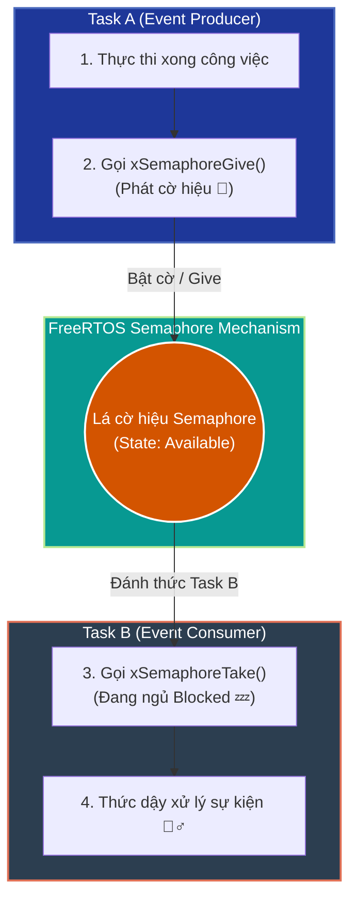
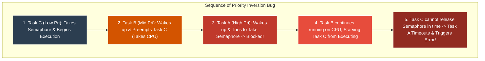
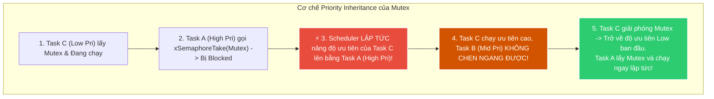
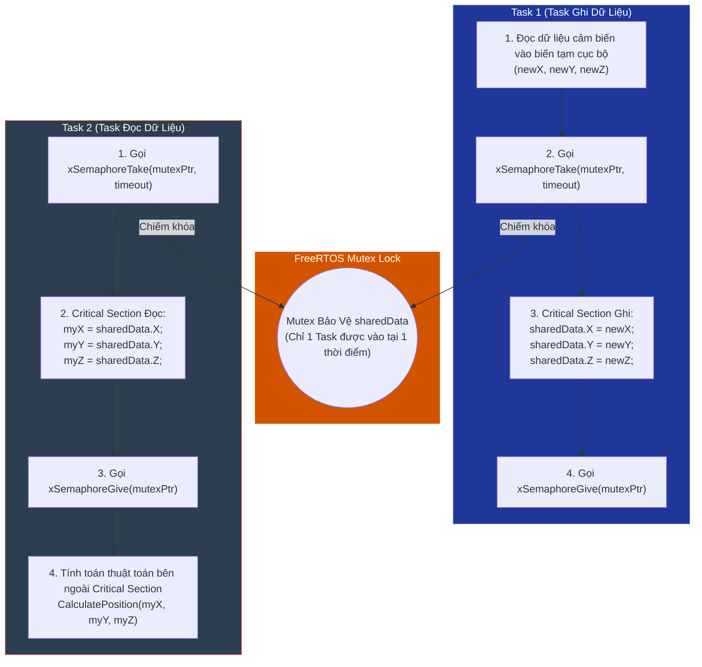
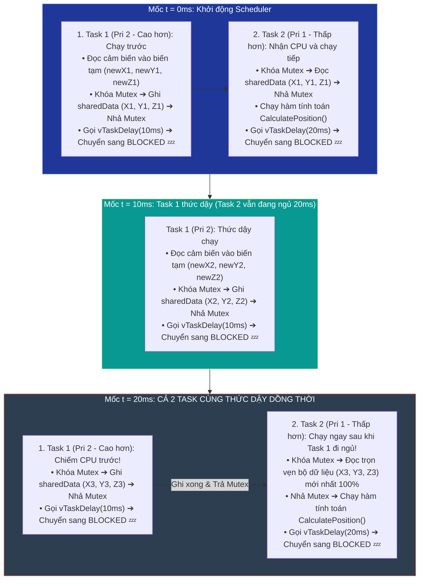
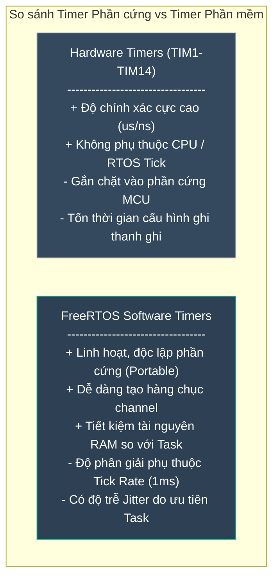

# <span style="color:#f1c40f">Chương 8: Bảo vệ Dữ liệu và Đồng bộ hóa Task (Protecting Data and Synchronizing Tasks)</span>

---

## <span style="color:#e67e22">1. Đồng bộ hóa bằng Semaphore — Using Semaphores for Synchronization</span>

### <span style="color:#1abc9c">1.1 Tổng quan về Đồng bộ hóa bằng Semaphore (Synchronization via semaphores)</span>

Bình thường các Task trong RTOS chạy độc lập và không biết Task kia đang làm gì. **Semaphore** (nghĩa là *Lá cờ hiệu*) là cơ chế giúp các Task **thông báo sự kiện cho nhau** để phối hợp thực thi đúng thời điểm.

#### Bản chất Semaphore cực kỳ đơn giản:
1. **`xSemaphoreGive()` (Phát tín hiệu)**: Task A (hoặc ngắt ISR) sau khi xong việc sẽ **bật lá cờ lên** để báo: *"Có dữ liệu/sự kiện mới rồi!"*.
2. **`xSemaphoreTake()` (Chờ tín hiệu)**: Task B muốn làm việc thì phải **đợi cờ bật**. 
   - Khi cờ chưa bật: Task B rơi vào trạng thái **Blocked (ngủ 💤)** — **tiêu thụ 0% CPU**.
   - Ngay khi Task A bật cờ: Task B lập tức **thức dậy 🏃‍♂️** và thực thi nhiệm vụ.



- **Tác dụng lớn nhất**: Giúp đồng bộ công việc giữa các Task mà **KHÔNG tốn CPU** (khác hoàn toàn với việc dùng vòng lặp `while(!flag)` bắt CPU chạy liên tục để kiểm tra cờ).

---

### <span style="color:#1abc9c">1.2 Thực hành ví dụ mã nguồn (mainSemExample.c)</span>

Để triển khai đồng bộ hóa Semaphore trong mã nguồn, ta thực hiện các bước sau:

#### 1. Tạo biến Con trỏ Semaphore (Semaphore Handle)
Khai báo biến toàn cục để tất cả các Task liên quan đều có thể truy cập được.

> [!WARNING]
> Không bao giờ khai báo `semPtr` làm biến cục bộ bên trong một hàm (ví dụ: trong `main()` hoặc một hàm khởi tạo), vì nó sẽ bị mất phạm vi (out of scope) khi hàm đó kết thúc.

```c
#include "FreeRTOS.h"
#include "semphr.h"

// Khai báo con trỏ Semaphore toàn cục
SemaphoreHandle_t semPtr = NULL;

int main(void)
{
    // Khởi tạo phần cứng...
    
    // Tạo Binary Semaphore bằng bộ nhớ FreeRTOS Heap
    semPtr = xSemaphoreCreateBinary();
    
    // Đảm bảo Semaphore được tạo thành công
    assert_param(semPtr != NULL);
    
    // Tạo Task và khởi động Scheduler...
}
```

#### 2. Mã nguồn Task A (GreenTaskA) — Phát Semaphore
`GreenTaskA` sẽ chớp tắt LED Xanh lá. Cứ mỗi 5 lần chớp tắt, nó sẽ gửi Semaphore 1 lần:

```c
void GreenTaskA( void* argument )
{
    uint_fast8_t count = 0;
    while(1)
    {
        // Mỗi 5 chu kỳ loop, phát tín hiệu Semaphore
        if(++count >= 5)
        {
            count = 0;
            SEGGER_SYSVIEW_PrintfHost("Task A (green LED) gives semPtr");
            xSemaphoreGive(semPtr); // Phát tín hiệu cho Task B
        }
        
        GreenLed.On();
        vTaskDelay(100 / portTICK_PERIOD_MS);
        GreenLed.Off();
        vTaskDelay(100 / portTICK_PERIOD_MS);
    }
}
```

#### 3. Mã nguồn Task B (BlueTaskB) — Nhận Semaphore
`BlueTaskB` chờ Semaphore. Ngay khi nhận được, nó sẽ chớp tắt LED Xanh dương nhanh 3 lần rồi tiếp tục đi ngủ:

```c
void BlueTaskB( void* argument )
{
    while(1)
    {
        // Chờ Semaphore vô thời hạn (portMAX_DELAY)
        if(xSemaphoreTake(semPtr, portMAX_DELAY) == pdPASS)
        {
            // Nhận thành công Semaphore -> Nháy LED Xanh dương 3 lần
            for(uint_fast8_t i = 0; i < 3; i++)
            {
                BlueLed.On();
                vTaskDelay(50 / portTICK_PERIOD_MS);
                BlueLed.Off();
                vTaskDelay(50 / portTICK_PERIOD_MS);
            }
        }
        else
        {
            // Xử lý khi bị Timeout (Nếu không dùng portMAX_DELAY)
        }
    }
}
```

> [!NOTE]
> **Cơ chế `portMAX_DELAY` và `INCLUDE_vTaskSuspend`:**
> Trong FreeRTOS, tham số `portMAX_DELAY` cho phép Task chờ vô thời hạn. 
> - Nếu file `FreeRTOSConfig.h` cấu hình `#define INCLUDE_vTaskSuspend 1`, Task gọi `xSemaphoreTake(semPtr, portMAX_DELAY)` sẽ bị chuyển sang trạng thái **Suspended/Blocked vĩnh viễn** cho đến khi Semaphore được Give. Giá trị trả về chắc chắn là `pdPASS`.
> - Nếu `INCLUDE_vTaskSuspend` là `0`, `portMAX_DELAY` sẽ tương đương với thời gian chờ tối đa 0xFFFFFFFF ticks (~49.7 ngày ở tick 1ms), chứ không phải vô hạn.

#### Phân tích hiệu năng trên SEGGER SystemView:
Khi quan sát vết thực thi (trace) trên SystemView:
1. **CPU Load của Task B gần như bằng 0%** (chỉ tốn khoảng **0.01% CPU**) khi đang chờ Semaphore.
2. Một Task bị Blocked do chờ Semaphore sẽ **không tiêu tốn bất kỳ chu kỳ CPU nào**, ngay cả khi nó có độ ưu tiên cao nhất trong hệ thống và không có Task nào khác ở trạng thái READY.

---

### <span style="color:#1abc9c">1.3 Lãng phí chu kỳ CPU: Đồng bộ bằng Polling (Wasting cycles – synchronization by polling)</span>

Để thấy rõ sự vượt trội của Semaphore, hãy xem xét cách làm sai lầm: Đồng bộ hóa bằng biến cờ (Polling Flag).

#### Mã nguồn ví dụ Polling (`mainPolledExample.c`):
Thay vì dùng Semaphore, `GreenTaskA` chỉ cần gán biến toàn cục `flag = 1`:

```c
// GreenTaskA (Polling version)
void GreenTaskA( void* argument )
{
    uint_fast8_t count = 0;
    while(1)
    {
        if(++count >= 5)
        {
            count = 0;
            SEGGER_SYSVIEW_PrintfHost("Task A sets flag");
            flag = 1; // Bật cờ hiệu
        }
        GreenLed.On();
        vTaskDelay(100 / portTICK_PERIOD_MS);
        GreenLed.Off();
        vTaskDelay(100 / portTICK_PERIOD_MS);
    }
}

// BlueTaskB (Polling version)
void BlueTaskB( void* argument )
{
    while(1)
    {
        // Liên tục kiểm tra biến cờ (Busy Waiting)
        while(!flag); 
        
        flag = 0; // Reset cờ
        SEGGER_SYSVIEW_PrintfHost("Task B received flag");
        // Nháy LED...
    }
}
```

#### Phân tích hậu quả trên SystemView:

```
Vòng lặp Polling: while(!flag); 
└──► Task B chiếm 100% CPU Execution Time chỉ để liên tục đọc biến flag!
```

> [!NOTE]
> **Giải thích bản chất: "Task B chiếm 100% CPU Execution Time" nghĩa là gì?**
> - **KHÔNG PHẢI đóng băng MCU**: Các Task có **Độ ưu tiên cao hơn** hoặc **Ngắt ISR phần cứng** VẪN nhảy vào ngắt ngang và chạy bình thường.
> - **BẢN CHẤT LÀ**: Trong toàn bộ thời gian CPU rảnh có sẵn, Task B "vắt cạn" 100% chu kỳ CPU chỉ để chạy vòng lặp vô bổ `while(!flag);` (luôn ở trạng thái `RUNNING`).
> - **HẬU QUẢ**: Các Task có **Độ ưu tiên bằng hoặc thấp hơn Task B** sẽ bị **đóng băng hoàn toàn (chết đói CPU - CPU Starvation)** vì Task B không bao giờ tự nguyện đi ngủ để nhường CPU. MCU cũng không thể đi vào Sleep Mode dẫn đến tốn pin tối đa.

| Tiêu chí | Đồng bộ bằng Semaphore | Đồng bộ bằng Polling (`while(!flag)`) |
| :--- | :--- | :--- |
| **Trạng thái Task chờ** | **Blocked** 💤 (Nhường CPU hoàn toàn) | **Running** 🏃‍♂️ (Vòng lặp Busy Wait) |
| **Mức tiêu thụ CPU** | **~0.01%** (Rất tiết kiệm năng lượng) | **100%** (Lãng phí CPU, nóng chip, tốn pin) |
| **Tác động đến Task khác** | Cho phép các Task ưu tiên thấp hơn chạy | Đóng băng tất cả Task có độ ưu tiên thấp hơn |
| **Giải pháp tạm thời** | Không cần | Thêm `vTaskDelay(1)` (Giảm CPU xuống ~5%, nhưng gây trễ 1ms) |

> [!TIP]
> **So sánh mở rộng: Polling trong Bare-Metal vs RTOS khác nhau thế nào?**
> - **Bare-Metal (Super Loop `while(1)`)**: Chỉ có 1 luồng chạy duy nhất. Mức tiêu thụ CPU mặc định luôn là **100%** (trừ khi thủ công gọi `__WFI()`). Nếu bị kẹt `while(!flag);`, **TOÀN BỘ HỆ THỐNG BỊ ĐÓNG BĂNG** (trừ ngắt ISR).
> - **RTOS**: Đa nhiệm với nhiều Task có độ ưu tiên khác nhau. Nếu 1 Task kẹt `while(!flag);`, nó chiếm 100% CPU rảnh và làm đóng băng các Task ưu tiên thấp hơn, nhưng **Task ưu tiên cao hơn và ngắt ISR VẪN CHẠY BÌNH THƯỜNG**.

---

### <span style="color:#1abc9c">1.4 Semaphore có thời hạn (Time-bound semaphores)</span>

Một trong những ưu điểm cốt lõi của RTOS là khả năng giới hạn thời gian (time-bound) của một thao tác, đảm bảo Task không bị kẹt vô thời hạn nếu một sự kiện không xảy ra.

#### Cú pháp hàm:
```c
BaseType_t xSemaphoreTake( SemaphoreHandle_t xSemaphore, TickType_t xTicksToWait );
```
- `xSemaphore`: Con trỏ Semaphore cần lấy.
- `xTicksToWait`: Thời gian chờ tối đa tính bằng tick (ví dụ: `500 / portTICK_PERIOD_MS`).
- **Giá trị trả về**:
  - `pdPASS`: Lấy Semaphore thành công trong khoảng thời gian cho phép.
  - `pdFALSE` (`errQUEUE_EMPTY`): Không lấy được Semaphore do bị Timeout hoặc con trỏ không hợp lệ.

> [!IMPORTANT]
> **LUÔN LUÔN KIỂM TRA MÃ TRẢ VỀ (`pdPASS` / `pdFALSE`)!**
> Việc không kiểm tra mã trả về khi dùng `xSemaphoreTake` với thời gian chờ giới hạn có thể dẫn đến việc Task tự ý thực thi logic mà chưa hề có tài nguyên/tín hiệu, gây ra lỗi hệ thống nghiêm trọng.

#### Ví dụ thực tế (`semaphoreTimeBound`):
- `GreenTaskA`: Nháy LED Xanh lá và phát Semaphore tại thời điểm ngẫu nhiên (`StmRand(3, 7)`).
- `TaskB`: Chờ Semaphore với Timeout cố định là **500ms**.
  - Nếu nhận được trong vòng 500ms -> Tắt LED Đỏ, nháy LED Xanh dương 3 lần.
  - Nếu quá 500ms không nhận được (Timeout) -> Bật LED Đỏ cảnh báo!

```c
void TaskB( void* argument )
{
    while(1)
    {
        // Thử lấy Semaphore với Timeout 500ms
        if(xSemaphoreTake(semPtr, 500 / portTICK_PERIOD_MS) == pdPASS)
        {
            // Nhận thành công đúng hạn
            RedLed.Off();
            blueTripleBlink();
        }
        else
        {
            // Bị Timeout (quá 500ms mà TaskA chưa Give)
            RedLed.On(); // Bật LED Đỏ cảnh báo trễ deadline
        }
    }
}
```

#### Phân tích SystemView Trace:
- **Marker 1 (Timeout)**: Khoảng cách giữa 2 lần phát Semaphore của TaskA quá 500ms -> `TaskB` hết giờ chờ, `xSemaphoreTake` trả về `pdFALSE` -> LED Đỏ sáng lên và `TaskB` lập tức quay lại chờ lần tiếp theo.
- **Marker 2 (Success)**: Semaphore xuất hiện sau ~200ms (< 500ms) -> LED Đỏ tắt, LED Xanh dương nháy 3 lần.

---

### <span style="color:#1abc9c">1.5 Counting Semaphores (Semaphore Đếm)</span>

Trong khi **Binary Semaphore** chỉ có 2 giá trị (`0` hoặc `1`), **Counting Semaphore** có thể quản lý giá trị đếm lớn hơn 1.

#### Use Case tiêu biểu: Quản lý Hồ chứa Tài nguyên (Resource Pool)
Giả sử hệ thống có một TCP/IP Stack hỗ trợ nhiều kết nối đồng thời, nhưng RAM của vi điều khiển STM32 chỉ đủ chứa tối đa **3 phiên làm việc TCP (TCP Sessions)** cùng lúc.

```c
SemaphoreHandle_t tcpSemPtr = NULL;

// Tạo Counting Semaphore: Max count = 3, Initial count = 3 (Đang trống 3 slot)
tcpSemPtr = xSemaphoreCreateCounting(3, 3);

// 1. Khi một Client yêu cầu mở TCP Session:
if(xSemaphoreTake(tcpSemPtr, 100 / portTICK_PERIOD_MS) == pdPASS)
{
    // Đã lấy được 1 slot (Giá trị semaphore giảm từ 3 xuống 2)
    Open_TCP_Session();
}
else
{
    // Timeout: Tất cả 3 TCP Sessions đều đang bị chiếm dụng! Từ chối kết nối.
}

// 2. Khi một Client đóng TCP Session:
Close_TCP_Session();
xSemaphoreGive(tcpSemPtr); // Trả lại 1 slot (Giá trị semaphore tăng lên lại)
```

---

## <span style="color:#e67e22">2. Mutex và Giải quyết Nghịch đảo Độ ưu tiên — Using Mutexes & Fixing Priority Inversion</span>

### <span style="color:#1abc9c">2.1 Hiện tượng Nghịch đảo Độ ưu tiên (Priority Inversion — How NOT to use semaphores)</span>

Một sai lầm rất phổ biến của lập trình viên nhúng là **sử dụng Semaphore để bảo vệ dữ liệu dùng chung (Shared Data / Shared Resource)** giữa các Task.

Semaphore **không hề có khái niệm về Độ ưu tiên của Task (Task Priority)**. Điều này dẫn đến sự cố kinh điển: **Priority Inversion (Nghịch đảo độ ưu tiên)**.

#### Kịch bản diễn biến sự cố với 3 Task:
1. **Task C (Priority 1 - Thấp nhất)**: Lấy Binary Semaphore để truy cập tài nguyên dùng chung (ví dụ: hàm `blinkTwice()`).
2. **Task B (Priority 2 - Trung bình)**: Thức dậy và chiếm quyền CPU (đẩy Task C vào trạng thái Ready).
3. **Task A (Priority 3 - Cao nhất)**: Thức dậy, muốn truy cập tài nguyên dùng chung nên gọi `xSemaphoreTake()`. Tuy nhiên, Semaphore đang bị giữ bởi Task C -> Task A bị **Blocked**!
4. **Hậu quả kịch tính**: Task A (ưu tiên cao nhất) bị dừng chạy. Task B (ưu tiên trung bình) KHÔNG dùng Semaphore nhưng vẫn chớp thời cơ chiếm CPU và chạy liên tục. Task C (đang giữ Semaphore) không có CPU để chạy và trả Semaphore -> **Task A bị Timeout (Sáng LED Đỏ cảnh báo failure)**.



📗 Bổ sung từ: Mastering the FreeRTOS Kernel - Richard Barry

#### ASCII Timeline mô tả Nghịch đảo Độ ưu tiên:
```text
Priority
 High |               (Block)                     (Timeout!)
 (A)  |..................|---------------------------X
      |                  |
 Mid  |             +----+===========================+
 (B)  |             | Preempts C (Runs infinitely)
      |             |
 Low  |===+=========+
 (C)  |   | Takes Sem
      +--------------------------------------------------> Time
```

#### Tại sao Binary Semaphore KHÔNG CÓ Kế thừa Độ ưu tiên?
Binary Semaphore vốn được thiết kế để **đồng bộ hóa sự kiện**, thường là giữa một ISR (ngắt) phát tín hiệu và một Task chờ tín hiệu. Vì ISR không phải là Task, nó **không có Độ ưu tiên Task (Task Priority)**, do đó khái niệm "Kế thừa độ ưu tiên" là hoàn toàn vô nghĩa và không thể triển khai trên Binary Semaphore. Nếu dùng nó để bảo vệ dữ liệu, lỗi Priority Inversion chắc chắn xảy ra.

> [!CAUTION]
> Trong vết SystemView thực tế (`mainSemPriorityInversion.c`), Task A là Task quan trọng nhất hệ thống nhưng lại **bị thất bại (FAIL)** chỉ vì một Task trung bình (Task B) chen ngang làm trễ quá trình giải phóng Semaphore của Task C.

#### Mã nguồn C khi BỊ LỖI (Dùng Binary Semaphore — `mainSemPriorityInversion.c`):

```c
#include "main.h"
#include "FreeRTOS.h"
#include "semphr.h"
#include "task.h"
#include "SEGGER_SYSVIEW.h"

#define STACK_SIZE 128

// Khai báo con trỏ Binary Semaphore toàn cục
SemaphoreHandle_t semPtr = NULL;

// 1. Task A (Priority 3 - Cao nhất): Nháy LED Xanh lá
void TaskA(void *argument)
{
    while(1)
    {
        SEGGER_SYSVIEW_PrintfHost("Task A attempt to take semPtr");
        
        // Thử lấy Binary Semaphore với Timeout 200ms
        if(xSemaphoreTake(semPtr, 200 / portTICK_PERIOD_MS) == pdPASS)
        {
            RedLed.Off();
            SEGGER_SYSVIEW_PrintfHost("Task A received semPtr");
            
            // Nháy LED Xanh lá 2 lần
            blinkTwice(&GreenLed);
            
            xSemaphoreGive(semPtr); // Giải phóng Semaphore
        }
        else
        {
            // Bị Timeout do Task C không kịp trả Semaphore (vì bị Task B chiếm CPU)
            SEGGER_SYSVIEW_PrintfHost("Task A FAILED to receive semphr in time");
            RedLed.On(); // ❌ Bật LED Đỏ cảnh báo LỖI CỰC NGHỆM TRỌNG!
        }
        
        vTaskDelay(StmRand(10, 30));
    }
}

// 2. Task B (Priority 2 - Trung bình): Tiêu tốn CPU, KHÔNG dùng Semaphore
void TaskB(void *argument)
{
    uint32_t counter = 0;
    while(1)
    {
        SEGGER_SYSVIEW_PrintfHost("Task B starting iteration %ui", counter++);
        vTaskDelay(StmRand(75, 150));
        
        // Chiếm CPU chạy busy loop
        lookBusy(StmRand(250000, 750000));
    }
}

// 3. Task C (Priority 1 - Thấp nhất): Nháy LED Xanh dương
void TaskC(void *argument)
{
    while(1)
    {
        SEGGER_SYSVIEW_PrintfHost("Task C attempt to take semPtr");
        
        if(xSemaphoreTake(semPtr, 200 / portTICK_PERIOD_MS) == pdPASS)
        {
            RedLed.Off();
            SEGGER_SYSVIEW_PrintfHost("Task C received semPtr");
            
            // ⚡ Trong lúc đang nháy LED, Task B thức dậy chen ngang chiếm CPU!
            // Do Binary Semaphore KHÔNG CÓ Kế thừa độ ưu tiên, Task C bị Task B treo giò!
            blinkTwice(&BlueLed);
            
            xSemaphoreGive(semPtr);
        }
        else
        {
            SEGGER_SYSVIEW_PrintfHost("Task C FAILED to receive semphr in time");
            RedLed.On();
        }
    }
}

int main(void)
{
    HWInit();

    // 1. Tạo Binary Semaphore (Tạo xong mặc định ở trạng thái Empty = 0)
    semPtr = xSemaphoreCreateBinary();
    assert_param(semPtr != NULL);

    // 2. Bắt buộc phải Give 1 lần đầu tiên để cờ ở trạng thái sẵn sàng (Count = 1)
    xSemaphoreGive(semPtr);

    // 3. Tạo 3 Task với 3 mức độ ưu tiên khác nhau
    xTaskCreate(TaskA, "Task A", STACK_SIZE, NULL, tskIDLE_PRIORITY + 3, NULL); // Pri 3 (High)
    xTaskCreate(TaskB, "Task B", STACK_SIZE, NULL, tskIDLE_PRIORITY + 2, NULL); // Pri 2 (Mid)
    xTaskCreate(TaskC, "Task C", STACK_SIZE, NULL, tskIDLE_PRIORITY + 1, NULL); // Pri 1 (Low)

    // 4. Khởi động FreeRTOS Scheduler
    vTaskStartScheduler();

    while(1) {}
}
```

---

### <span style="color:#1abc9c">2.2 Mutex (Mutual Exclusion) và Kế thừa Độ ưu tiên (Priority Inheritance)</span>

To solve the Priority Inversion problem, FreeRTOS provides **Mutex (Mutual Exclusion)**.

#### 1. Bản chất cốt lõi của Mutex:
**Mutex** (viết tắt của *Mutual Exclusion - Loại trừ lẫn nhau*) giống như một **"Ổ khóa chiếc chìa đơn"** được thiết kế riêng để bảo vệ các tài nguyên dùng chung (Shared Resources / Shared Data / Peripherals).

* **Quy tắc Quyền sở hữu (Ownership Rule)**: Khi một Task lấy thành công Mutex (`xSemaphoreTake`), nó trở thành **Chủ sở hữu (Owner)** của Mutex đó. **Chỉ chính Task này mới có quyền giải phóng Mutex (`xSemaphoreGive`)**. *(Khác với Semaphore: một Task có thể Give cho một Task khác Take)*.
* **Không dùng trong ISR**: Vì Mutex gắn liền với khái niệm Quyền sở hữu và Kế thừa độ ưu tiên của Task, **Mutex KHÔNG ĐƯỢC PHÉP sử dụng bên trong các hàm ngắt ISR**!
* **Khởi tạo sẵn sàng**: Khi gọi `xSemaphoreCreateMutex()`, Mutex tự động ở trạng thái **Sẵn sàng (Available / Count = 1)**, không cần gọi `xSemaphoreGive()` ban đầu.

#### 2. Cơ chế Kế thừa Độ ưu tiên (Priority Inheritance) hoạt động thế nào?

Khi **Task A (Priority 3 - High)** muốn lấy Mutex nhưng Mutex đang bị **Task C (Priority 1 - Low)** giữ:

1. Task A bị **Blocked** đi ngủ chờ Mutex.
2. ⚡ **Scheduler LẬP TỨC can thiệp**: Tạm thời **nâng độ ưu tiên của Task C từ Priority 1 lên Priority 3 (ngang bằng Task A)**!
3. **Kết quả**: **Task B (Priority 2 - Mid)** thức dậy sẽ **KHÔNG THỂ chiếm CPU của Task C** nữa! Task C được ưu tiên CPU cao nhất để chạy nhanh hoàn thành Critical Section.
4. Khi Task C gọi `xSemaphoreGive(mutexPtr)`:
   - Task C nhả Mutex ra.
   - Scheduler lập tức **trả độ ưu tiên của Task C về lại mức Low (Priority 1) ban đầu**.
   - Task A nhận được Mutex và nhảy lên **RUNNING ngay lập tức**!



#### 3. Bảng so sánh Cốt lõi giữa Mutex vs Binary Semaphore:

| Tiêu chí | Mutex (Mutual Exclusion) | Binary Semaphore |
| :--- | :--- | :--- |
| **Mục đích chính** | **Bảo vệ tài nguyên dùng chung** (Resource Protection) | **Đồng bộ hóa sự kiện** (Event Synchronization) |
| **Priority Inheritance** | **CÓ** (Giải quyết triệt để Priority Inversion) | **KHÔNG** (Dễ bị lỗi Priority Inversion) |
| **Quyền sở hữu (Ownership)** | **CÓ** (Task nào Take thì chính Task đó phải Give) | **KHÔNG** (Task A Give, Task B Take thoải mái) |
| **Sử dụng trong ISR** | ❌ **KHÔNG** (Tuyệt đối không dùng trong ngắt ISR) | ✅ **CÓ** (Rất phổ biến để ISR báo sự kiện cho Task) |
| **Trạng thái khởi tạo** | Sẵn sàng ngay khi tạo (`Available / Count = 1`) | Trống (`Empty / Count = 0`), cần Give mới dùng được |

📗 Bổ sung từ: Mastering the FreeRTOS Kernel - Richard Barry

#### 4. Những hạn chế cốt lõi của Kế thừa Độ ưu tiên (Key Limitations of Priority Inheritance):
- **Không thực sự SỬA LỖI (Fix) Nghịch đảo ưu tiên**: Priority Inheritance chỉ làm **giảm thiểu (Bounds)** thời gian bị nghịch đảo, chứ không ngăn chặn nó xảy ra. Task A vẫn bị trễ một khoảng thời gian bằng thời gian Task C thực thi trong Critical Section.
- **Làm phức tạp hóa Phân tích Thời gian (Timing Analysis)**: Trong hệ thống Real-Time, việc ưu tiên của Task bị thay đổi liên tục gây khó khăn cho việc tính toán Worst-Case Execution Time (WCET).
- **Không phải liều thuốc vạn năng**: Đừng bao giờ dựa dẫm vào Kế thừa Độ ưu tiên như một cách để bào chữa cho thiết kế tồi. Thiết kế hệ thống tốt nên hạn chế tối đa việc dùng chung tài nguyên hoặc sử dụng Gatekeeper Task.

#### Mã nguồn C hoàn chỉnh (`mainMutexExample.c`):

```c
#include "main.h"
#include "FreeRTOS.h"
#include "semphr.h"
#include "task.h"
#include "SEGGER_SYSVIEW.h"

#define STACK_SIZE 128

// Khai báo con trỏ Mutex toàn cục
SemaphoreHandle_t mutexPtr = NULL;

// 1. Task A (Priority 3 - Cao nhất): Nháy LED Xanh lá
void TaskA(void *argument)
{
    while(1)
    {
        SEGGER_SYSVIEW_PrintfHost("Task A attempt to take mutexPtr");
        
        // Thử lấy Mutex với Timeout 200ms
        if(xSemaphoreTake(mutexPtr, 200 / portTICK_PERIOD_MS) == pdPASS)
        {
            RedLed.Off();
            SEGGER_SYSVIEW_PrintfHost("Task A received mutexPtr");
            
            // Critical Section: Nháy LED Xanh lá 2 lần
            blinkTwice(&GreenLed);
            
            xSemaphoreGive(mutexPtr); // Trả lại Mutex
        }
        else
        {
            // Bị Timeout không lấy được Mutex
            SEGGER_SYSVIEW_PrintfHost("Task A FAILED to receive mutex in time");
            RedLed.On(); // Bật LED Đỏ cảnh báo lỗi
        }
        
        // Ngủ ngẫu nhiên 10-30ms để nhường CPU cho Task khác
        vTaskDelay(StmRand(10, 30));
    }
}

// 2. Task B (Priority 2 - Trung bình): Tiêu tốn CPU mà KHÔNG dùng Mutex
void TaskB(void *argument)
{
    uint32_t counter = 0;
    while(1)
    {
        SEGGER_SYSVIEW_PrintfHost("Task B starting iteration %ui", counter++);
        vTaskDelay(StmRand(75, 150));
        
        // Tạo tải giả lập chiếm CPU
        lookBusy(StmRand(250000, 750000));
    }
}

// 3. Task C (Priority 1 - Thấp nhất): Nháy LED Xanh dương
void TaskC(void *argument)
{
    while(1)
    {
        SEGGER_SYSVIEW_PrintfHost("Task C attempt to take mutexPtr");
        
        // Thử lấy Mutex với Timeout 200ms
        if(xSemaphoreTake(mutexPtr, 200 / portTICK_PERIOD_MS) == pdPASS)
        {
            RedLed.Off();
            SEGGER_SYSVIEW_PrintfHost("Task C received mutexPtr");
            
            // Critical Section: Nháy LED Xanh dương 2 lần
            // (Khi Task A nhảy vào chờ, Task C sẽ được NÂNG ĐỘ ƯU TIÊN lên bằng Task A!)
            blinkTwice(&BlueLed);
            
            xSemaphoreGive(mutexPtr); // Trả Mutex -> Độ ưu tiên hạ về Low ban đầu
        }
        else
        {
            SEGGER_SYSVIEW_PrintfHost("Task C FAILED to receive mutex in time");
            RedLed.On();
        }
    }
}

int main(void)
{
    // Khởi tạo phần cứng MCU
    HWInit();

    // 1. Tạo Mutex (Tự động khởi tạo ở trạng thái Sẵn sàng / Count = 1)
    mutexPtr = xSemaphoreCreateMutex();
    assert_param(mutexPtr != NULL);

    // 2. Tạo 3 Task với các mức độ ưu tiên khác nhau
    xTaskCreate(TaskA, "Task A", STACK_SIZE, NULL, tskIDLE_PRIORITY + 3, NULL); // Pri 3 (Cao nhất)
    xTaskCreate(TaskB, "Task B", STACK_SIZE, NULL, tskIDLE_PRIORITY + 2, NULL); // Pri 2 (Trung bình)
    xTaskCreate(TaskC, "Task C", STACK_SIZE, NULL, tskIDLE_PRIORITY + 1, NULL); // Pri 1 (Thấp nhất)

    // 3. Khởi động FreeRTOS Scheduler
    vTaskStartScheduler();

    // Loop vô tận phòng trường hợp hết Heap
    while(1) {}
}
```

> [!NOTE]
> Khác với Binary Semaphore (tạo xong phải Give mới dùng được), `xSemaphoreCreateMutex()` khi khởi tạo thành công sẽ **tự động ở trạng thái sẵn sàng (Available / Count = 1)**, không cần gọi `xSemaphoreGive()` ban đầu.

---

### <span style="color:#1abc9c">2.3 Kỹ thuật Tránh lỗi chiếm dụng Mutex quá lâu (Critical Section Optimization)</span>

Vùng mã nằm giữa `xSemaphoreTake()` và `xSemaphoreGive()` được gọi là **Critical Section (Vùng tranh chấp)**:

```c
if(xSemaphoreTake(mutexPtr, timeout) == pdPASS)
{
    // ---------------- CRITICAL SECTION START ----------------
    // CHỈ NÊN THỰC THI CÁC THAO TÁC CỰC KỲ NGẮN TẠI ĐÂY!
    // ---------------- CRITICAL SECTION END ------------------
    xSemaphoreGive(mutexPtr);
}
```

#### 3 Tác hại khi giữ Mutex quá lâu:
1. **Làm giảm khả năng đáp ứng của hệ thống**: Các Task khác phải chờ đợi lâu hơn.
2. **Gây ra Jitter (Độ gián đoạn thời gian)**: Task ưu tiên cao bị biến động thời gian phản hồi sự kiện.
3. **Kéo dài thời gian Kế thừa Độ ưu tiên**: Task ưu tiên thấp chạy ở mức ưu tiên cao quá lâu sẽ làm rối loạn thứ tự ưu tiên của các Task khác.

#### Kỹ thuật Tối ưu hóa Critical Section:

❌ **Cách làm XẤU (Giữ Mutex trong cả quá trình tính toán lâu):**
```c
if(xSemaphoreTake(mutexPtr, 200 / portTICK_PERIOD_MS) == pdPASS)
{
    // Critical Section kéo dài lãng phí do thực hiện tính toán nặng
    uint32_t aVar = PerformComplexCalculation(); 
    uint32_t retVal = CallSlowFunction(aVar);
    
    protectedData = retVal; // Thực chất chỉ có dòng này mới cần bảo vệ!
    xSemaphoreGive(mutexPtr);
}
```

✅ **Cách làm TỐT (Tính toán trước, chỉ lấy Mutex đúng thời điểm ghi dữ liệu):**
```c
// Thực hiện các tính toán nặng TRƯỚC KHI lấy Mutex
uint32_t aVar = PerformComplexCalculation(); 
uint32_t retVal = CallSlowFunction(aVar);

// Bây giờ mới vào Critical Section
if(xSemaphoreTake(mutexPtr, 200 / portTICK_PERIOD_MS) == pdPASS)
{
    protectedData = retVal; // Thời gian giữ Mutex chỉ mất vài chu kỳ xung clock!
    xSemaphoreGive(mutexPtr);
}
```

---

## <span style="color:#e67e22">3. Tránh hiện tượng Race Condition — Avoiding Race Conditions</span>

### <span style="color:#1abc9c">3.1 Vấn đề truy cập Dữ liệu không Atomic (Failed Shared Resource Example)</span>

**Race Condition (Điều kiện tranh giành)** xảy ra khi nhiều Task cùng truy cập và thay đổi một vùng nhớ chung mà không có sự kiểm soát, dẫn đến dữ liệu bị sai lệch hoặc không nhất quán.

Hãy xét ví dụ đọc cảm biến gia tốc 3 trục (X, Y, Z):

```c
struct AccelReadings
{
    uint16_t X;
    uint16_t Y;
    uint16_t Z;
};

struct AccelReadings sharedData; // Biến toàn cục dùng chung
```

#### Kịch bản xung đột dữ liệu:
- **Task 1 (Cập nhật gia tốc)** đang ghi dữ liệu:
  - `sharedData.X = 100;` (Xong X)
  - `sharedData.Y = 200;` (Xong Y)
  - ⚡ *Đang chuẩn bị ghi Z thì bị Context Switch sang Task 2!*
- **Task 2 (Đọc gia tốc để tính toán)** thức dậy và đọc:
  - `myX = sharedData.X;` (Lấy 100 - Mới)
  - `myY = sharedData.Y;` (Lấy 200 - Mới)
  - `myZ = sharedData.Z;` (Lấy 0 - **CŨ TỪ CHU KỲ TRƯỚC!**)

=> Kết quả: Task 2 tính toán với bộ dữ liệu bị xáo trộn giữa cũ và mới, dẫn đến thuật toán cân bằng bị sai lệch hoàn toàn!

---

### <span style="color:#1abc9c">3.2 Giải pháp Bảo vệ Dữ liệu bằng Mutex</span>

Để giải quyết triệt để Race Condition, **TẤT CẢ các thao tác ĐỌC và GHI** lên biến dùng chung đều phải được bọc trong Mutex Critical Section.

#### Quy trình 5 bước Bảo vệ Dữ liệu Chuẩn hóa:



#### Phân tích chi tiết từng bước thực thi:

1. **Bước 1 — Khai báo Mutex chung**: Tạo một con trỏ `mutexPtr = xSemaphoreCreateMutex()` dùng chung cho tất cả các Task có quyền truy cập vào biến `sharedData`.
2. **Bước 2 — Chuẩn bị dữ liệu BÊN NGOÀI Critical Section**:
   - Task Ghi (Task 1) tiến hành đọc phần cứng hoặc tính toán sẵn các giá trị mới vào các biến tạm cục bộ (`newX`, `newY`, `newZ`). **Không lấy Mutex trong lúc đang chờ phần cứng đọc dữ liệu!**
3. **Bước 3 — Thao tác GHI Atomic (Task 1 Critical Section)**:
   - Task 1 gọi `xSemaphoreTake(mutexPtr, timeout)`.
   - Ngay khi có Mutex, Task 1 ghi liên tục tất cả các trường dữ liệu.
   - Ghi xong, Task 1 gọi `xSemaphoreGive(mutexPtr)` ngay lập tức để giải phóng khóa.
4. **Bước 4 — Thao tác ĐỌC Atomic (Task 2 Critical Section)**:
   - Task 2 muốn sử dụng dữ liệu phải gọi `xSemaphoreTake(mutexPtr, timeout)`.
   - Nếu Task 1 đang ghi, Task 2 sẽ bị **Blocked** đi ngủ chờ Task 1 ghi xong.
   - Ngay khi lấy được Mutex, Task 2 sao chép nguyên khối toàn bộ các trường từ `sharedData` sang biến tạm cục bộ (`myX`, `myY`, `myZ`).
   - Sao chép xong, Task 2 gọi `xSemaphoreGive(mutexPtr)` nhả khóa ngay!
5. **Bước 5 — Tính toán BÊN NGOÀI Critical Section**:
   - Task 2 mang bộ giá trị đã chụp lại an toàn (`myX, myY, myZ`) ra ngoài để xử lý thuật toán `CalculatePosition()`.

#### Mã nguồn C hoàn chỉnh (`mainSharedDataMutex.c`):

```c
#include "main.h"
#include "FreeRTOS.h"
#include "semphr.h"
#include "task.h"
#include "SEGGER_SYSVIEW.h"

#define STACK_SIZE 128

// Cấu trúc dữ liệu cảm biến gia tốc 3 trục
typedef struct {
    uint16_t X;
    uint16_t Y;
    uint16_t Z;
} AccelReadings_t;

// Biến toàn cục dùng chung chứa dữ liệu cảm biến
static AccelReadings_t sharedData = {0, 0, 0};

// Con trỏ Mutex toàn cục dùng để bảo vệ sharedData
SemaphoreHandle_t mutexPtr = NULL;

// Các hàm giả lập đọc cảm biến và tính toán
uint16_t ReadSensorX(void) { return StmRand(100, 200); }
uint16_t ReadSensorY(void) { return StmRand(200, 300); }
uint16_t ReadSensorZ(void) { return StmRand(300, 400); }
void CalculatePosition(uint16_t x, uint16_t y, uint16_t z) {
    SEGGER_SYSVIEW_PrintfHost("Calculated Pos: X=%d, Y=%d, Z=%d", x, y, z);
}

// 1. Task 1 (Priority 2 - Ghi dữ liệu): Cập nhật cảm biến mỗi 10ms
void Task1_SensorUpdate(void *args)
{
    while(1)
    {
        // 🚀 Bước 1: Đọc cảm biến vào biến tạm cục bộ BÊN NGOÀI Mutex
        uint16_t newX = ReadSensorX();
        uint16_t newY = ReadSensorY();
        uint16_t newZ = ReadSensorZ();

        // 🚀 Bước 2 & 3: Thao tác GHI an toàn trong Critical Section cực ngắn
        if(xSemaphoreTake(mutexPtr, 100 / portTICK_PERIOD_MS) == pdPASS)
        {
            sharedData.X = newX; // Critical Section Start
            sharedData.Y = newY;
            sharedData.Z = newZ; // Critical Section End
            
            xSemaphoreGive(mutexPtr); // Trả Mutex ngay lập tức!
            SEGGER_SYSVIEW_PrintfHost("Task 1 Updated Shared Data successfully");
        }
        else
        {
            SEGGER_SYSVIEW_PrintfHost("Task 1 Timeout waiting for Mutex!");
        }
        
        // Ngủ 10ms nhường CPU
        vTaskDelay(10 / portTICK_PERIOD_MS);
    }
}

// 2. Task 2 (Priority 1 - Đọc dữ liệu): Đọc và tính toán mỗi 20ms
void Task2_DataProcessing(void *args)
{
    uint16_t myX, myY, myZ;
    while(1)
    {
        // 🚀 Bước 4: Thao tác ĐỌC an toàn trong Critical Section cực ngắn
        if(xSemaphoreTake(mutexPtr, 100 / portTICK_PERIOD_MS) == pdPASS)
        {
            myX = sharedData.X; // Critical Section Start
            myY = sharedData.Y;
            myZ = sharedData.Z; // Critical Section End
            
            xSemaphoreGive(mutexPtr); // Trả Mutex ngay lập tức!
            
            // 🚀 Bước 5: Thực hiện tính toán BÊN NGOÀI Critical Section
            CalculatePosition(myX, myY, myZ); 
        }
        else
        {
            SEGGER_SYSVIEW_PrintfHost("Task 2 Timeout waiting for Mutex!");
        }
        
        // Ngủ 20ms nhường CPU
        vTaskDelay(20 / portTICK_PERIOD_MS);
    }
}

int main(void)
{
    HWInit();

    // 1. Tạo Mutex (Khởi tạo ở trạng thái Sẵn sàng / Count = 1)
    mutexPtr = xSemaphoreCreateMutex();
    assert_param(mutexPtr != NULL);

    // 2. Tạo 2 Task với mức độ ưu tiên khác nhau
    xTaskCreate(Task1_SensorUpdate, "Task1_Ghi", STACK_SIZE, NULL, tskIDLE_PRIORITY + 2, NULL); // Pri 2
    xTaskCreate(Task2_DataProcessing, "Task2_Doc", STACK_SIZE, NULL, tskIDLE_PRIORITY + 1, NULL); // Pri 1

    // 3. Bắt đầu Scheduler
    vTaskStartScheduler();

    while(1) {}
}
```

#### Phân tích Chi tiết Luồng Thực thi theo Mốc Thời gian (Execution Schedule & Timeline Trace):

Giả sử `Task 1` có **Priority 2** (mỗi 10ms chạy 1 lần) và `Task 2` có **Priority 1** (mỗi 20ms chạy 1 lần):



> [!NOTE]
> **Điểm ưu việt khi có Mutex bảo vệ:**
> 1. Tại mốc **t = 20ms**, dù cả 2 Task cùng thức dậy nhưng nhờ Mutex, `Task 2` chắc chắn đọc được trọn vẹn bộ dữ liệu hoàn chỉnh `(X3, Y3, Z3)` do `Task 1` vừa ghi xong.
> 2. `Task 2` **KHÔNG BAO GIỜ** bị đọc dở chừng (như X3, Y2, Z1) vì Mutex ép quá trình ghi và đọc phải diễn ra nguyên khối (Atomic)!

---

## <span style="color:#e67e22">4. Các Kỹ thuật Quản lý Tài nguyên Nâng cao — Advanced Resource Management</span>

📗 Bổ sung từ: Mastering the FreeRTOS Kernel - Richard Barry

### <span style="color:#1abc9c">6.1 Vùng Tới hạn (Critical Sections) và Biến thể ISR</span>

Critical Sections cung cấp một cách thô sơ nhưng hiệu quả để bảo vệ đoạn mã cực ngắn bằng cách **Vô hiệu hóa Ngắt (Disable Interrupts)**.

- **Dành cho Task**: Sử dụng `taskENTER_CRITICAL()` và `taskEXIT_CRITICAL()`.
- **Dành cho ISR**: Phải sử dụng biến thể an toàn cho ngắt `taskENTER_CRITICAL_FROM_ISR()` và `taskEXIT_CRITICAL_FROM_ISR()`.

> [!IMPORTANT]
> Biến thể ISR trả về một trạng thái ngắt (`UBaseType_t`), giá trị này **bắt buộc phải được lưu lại** và truyền vào hàm EXIT. Tính năng này chỉ khả dụng trên các kiến trúc vi điều khiển hỗ trợ Ngắt lồng nhau (Interrupt Nesting).

```c
void vAnInterruptServiceRoutine( void )
{
    UBaseType_t uxSavedInterruptStatus;
    
    // Lưu trạng thái ngắt hiện tại và vô hiệu hóa ngắt
    uxSavedInterruptStatus = taskENTER_CRITICAL_FROM_ISR();
    
    // --- CRITICAL SECTION BẮT ĐẦU ---
    // (Thực thi cực kỳ nhanh)
    // --- CRITICAL SECTION KẾT THÚC ---
    
    // Khôi phục lại trạng thái ngắt ban đầu
    taskEXIT_CRITICAL_FROM_ISR( uxSavedInterruptStatus );
}
```

### <span style="color:#1abc9c">6.2 Tạm dừng Bộ lập lịch (Scheduler Suspension)</span>

Thay vì vô hiệu hóa ngắt, ta có thể tạm dừng việc chuyển đổi ngữ cảnh bằng cách **Tạm dừng Bộ lập lịch (Suspend the Scheduler)**.

- **Cú pháp**: Gọi `vTaskSuspendAll()` để tạm dừng, và `xTaskResumeAll()` để tiếp tục.
- **Đặc điểm**: Khi Scheduler bị treo, **Ngắt vẫn được KÍCH HOẠT (Enabled)** và xử lý bình thường. Tuy nhiên, nếu một ngắt đánh thức một Task có ưu tiên cao hơn, Context Switch sẽ **không diễn ra ngay lập tức**, mà bị hoãn lại cho đến khi `xTaskResumeAll()` được gọi.
- **Có thể gọi lồng nhau (Nested)**: FreeRTOS kernel có theo dõi độ sâu lồng nhau, nên số lần gọi Suspend phải bằng số lần gọi Resume.
- **Giá trị trả về của `xTaskResumeAll()`**: Sẽ trả về `pdTRUE` nếu có một Context Switch bị hoãn đã được thực thi ngay khi Scheduler hoạt động lại.

> [!WARNING]
> Tuyệt đối **KHÔNG ĐƯỢC** gọi các hàm API của FreeRTOS khi Scheduler đang bị tạm dừng.

### <span style="color:#1abc9c">5.3 Deadlock (Bế tắc) và Mutex Đệ quy (Recursive Mutexes)</span>

#### Deadlock (Bế tắc)
Deadlock là cơn ác mộng của hệ thống đồng thời, xảy ra khi các Task chờ đợi lẫn nhau vĩnh viễn.

- **Vòng lặp phụ thuộc (Circular Dependency)**: Task A giữ Mutex X và chờ Mutex Y. Trong khi đó, Task B giữ Mutex Y và chờ Mutex X. Cả hai khóa nhau mãi mãi.
- **Tự Deadlock (Self-deadlock)**: Một Task cố gắng `xSemaphoreTake()` trên một Standard Mutex mà chính nó đang giữ.

**Các kỹ thuật phòng ngừa Deadlock:**
1. **Thứ tự cấp phát đồng nhất (Uniform Acquisition Order)**: Mọi Task phải luôn lấy Mutex X trước Mutex Y.
2. **Loại bỏ tài nguyên dùng chung (Eliminate Shared Resources)**.
3. **Sử dụng Timeout giới hạn (Bounded Timeouts)**: Không bao giờ dùng `portMAX_DELAY` trong production.
4. **Sử dụng Mutex Đệ quy cho các đoạn mã gọi lồng nhau**.

#### Mutex Đệ quy (Recursive Mutexes)
Mutex Đệ quy cho phép một Task **lấy cùng một Mutex nhiều lần** mà không bị Self-deadlock. 

- **Cú pháp**: Khởi tạo bằng `xSemaphoreCreateRecursiveMutex()`. Sử dụng `xSemaphoreTakeRecursive()` và `xSemaphoreGiveRecursive()`.
- **Cơ chế đếm**: FreeRTOS theo dõi chủ sở hữu và **số lần khóa (Recursive Call Count)**. Mutex chỉ thực sự được giải phóng khi Task gọi `Give` bằng đúng số lần đã `Take` (Count trở về 0).

| Tính năng | Standard Mutex | Recursive Mutex |
| :--- | :--- | :--- |
| **Self-Deadlock nếu lấy 2 lần?** | Có (Bị Blocked mãi mãi) | Không (Cho phép lấy nhiều lần) |
| **API Khởi tạo** | `xSemaphoreCreateMutex()` | `xSemaphoreCreateRecursiveMutex()` |
| **API Take/Give** | `xSemaphoreTake` / `xSemaphoreGive` | `xSemaphoreTakeRecursive` / `xSemaphoreGiveRecursive` |

### <span style="color:#1abc9c">5.4 Lập lịch Mutex với các Task cùng Độ ưu tiên</span>

Khi Task 2 giải phóng Mutex, Task 1 (đang chờ Mutex và có cùng độ ưu tiên) sẽ được chuyển từ trạng thái Blocked sang Ready. **Tuy nhiên, nó KHÔNG Preempt (chiếm quyền) Task 2** vì hai Task ngang mức ưu tiên. Task 1 phải chờ đến lượt Time-slice tiếp theo.

**Vấn đề Starvation do Tight Loop**: Nếu Task 2 ngay lập tức `Take` lại Mutex trong vòng lặp vô tận, Task 1 có thể không bao giờ lấy được Mutex.

**Giải pháp**: Sử dụng `taskYIELD()` nếu phát hiện một Tick hệ thống đã trôi qua trong lúc giữ Mutex:
```c
xTimeAtWhichMutexWasTaken = xTaskGetTickCount();
vCopyTextToFrameBuffer( cTextBuffer ); // Thao tác dài
xSemaphoreGive( xMutex );

// Nếu đã sang Tick mới, hãy nhường CPU để Task khác cùng ưu tiên có cơ hội chạy
if( xTaskGetTickCount() != xTimeAtWhichMutexWasTaken )
{
    taskYIELD();
}
```

### <span style="color:#1abc9c">5.5 Mẫu Thiết kế Gatekeeper Task (Gatekeeper Task Pattern)</span>

**Gatekeeper Task** cung cấp một giải pháp sạch sẽ và triệt để để loại bỏ cả Deadlock và Priority Inversion. Thay vì nhiều Task tranh giành một Mutex để truy cập ngoại vi (ví dụ: màn hình LCD hoặc I2C), **chỉ có duy nhất một Task (Gatekeeper)** được quyền sở hữu ngoại vi đó.

- Các Task khác hoặc ISR muốn ghi ra ngoại vi phải gửi dữ liệu thông qua **Queue (Hàng đợi)** đến Gatekeeper.
- Gatekeeper sẽ lần lượt xử lý các yêu cầu trong Queue một cách tuần tự.

> [!TIP]
> Gatekeeper Pattern rất thân thiện với ISR. Bạn có thể dùng `xQueueSendFromISR()` hoặc Tick Hook để dễ dàng đẩy thông điệp từ ngắt ra ngoại vi thông qua Gatekeeper. 
> - Đặt Gatekeeper ở **Độ ưu tiên thấp** nếu ngoại vi xử lý chậm (như in log ra Serial).
> - Đặt Gatekeeper ở **Độ ưu tiên cao** nếu cần xử lý dữ liệu ngay lập tức.

---

## <span style="color:#e67e22">5. Sử dụng Bộ định thời Phần mềm — Using Software Timers</span>

### <span style="color:#1abc9c">6.1 So sánh Software Timers vs Hardware Peripheral Timers</span>

Các vi điều khiển như STM32F7 có sẵn rất nhiều bộ Timer phần cứng (TIM1 - TIM14). Tuy nhiên, FreeRTOS cung cấp thêm cơ chế **Software Timers** với những ưu/nhược điểm rõ rệt:



#### Cấu hình trong file `FreeRTOSConfig.h`:
Để bật tính năng Software Timers, ta phải cấu hình các thông số sau:

```c
/* Software timer definitions. */
#define configUSE_TIMERS             1  // 1: Bật Software Timers, 0: Tắt
#define configTIMER_TASK_PRIORITY    ( 2 ) // Độ ưu tiên của Daemon Task (TmrSvc)
#define configTIMER_QUEUE_LENGTH     10 // Độ dài hàng đợi lệnh Timer Command Queue
#define configTIMER_TASK_STACK_DEPTH 256// Kích thước Stack cho TmrSvc Task (Words)
```

---

### <span style="color:#1abc9c">6.2 Cảnh báo Cốt lõi về Callback Function</span>

Khi bật Software Timers, FreeRTOS sẽ tự động tạo ra một Task hệ thống ngầm tên là **`TmrSvc` (Timer Service Task)**.

> [!CAUTION]
> **2 NGUYÊN TẮC VÀNG KHI VIẾT HÀM CALLBACK CHO SOFTWARE TIMER:**
> 1. **Chạy chung Stack với `TmrSvc`**: Tất cả các hàm Callback của Software Timer đều được thực thi bên trong ngữ cảnh (Context) và Stack của Task `TmrSvc`. Do đó, các biến cục bộ trong Callback sẽ tiêu tốn Stack của `TmrSvc` (`configTIMER_TASK_STACK_DEPTH`).
> 2. **TUYỆT ĐỐI KHÔNG BLOCK HOẶC DELAY**: Callback phải được xử lý nhanh như một hàm ngắt ISR. **KHÔNG ĐƯỢC GỌI** `vTaskDelay()`, `xSemaphoreTake()` có thời gian chờ, hay các hàm lặp vô tận. Nếu một Callback bị kẹt, **TẤT CẢ các Software Timer khác trong hệ thống sẽ bị đóng băng theo!**

---

### <span style="color:#1abc9c">5.3 Oneshot Timers (Bộ định thời chạy 1 lần)</span>

**Oneshot Timer** là bộ định thời chỉ kích hoạt hàm Callback đúng **một lần duy nhất** sau khoảng thời gian đếm lùi chỉ định, sau đó tự dừng lại.

#### Tạo Oneshot Timer (`uxAutoReload = pdFALSE`):

```c
// 1. Khai báo prototype hàm Callback
void oneShotCallBack( TimerHandle_t xTimer );

// 2. Tạo Timer trong main()
TimerHandle_t oneShotHandle = xTimerCreate(
    "myOneShotTimer",           // Tên gợi nhớ của Timer
    2200 / portTICK_PERIOD_MS,  // Chu kỳ định thời: 2.2 giây (2200ms)
    pdFALSE,                    // uxAutoReload = pdFALSE (Chạy 1 lần)
    NULL,                       // Timer ID (Dùng khi 1 callback cho nhiều timer)
    oneShotCallBack             // Con trỏ hàm Callback
);

assert_param(oneShotHandle != NULL);

// 3. Khởi động Timer
xTimerStart(oneShotHandle, 0);

// 4. Định nghĩa hàm Callback
void oneShotCallBack( TimerHandle_t xTimer )
{
    // Tắt LED Xanh dương sau 2.2 giây
    BlueLed.Off();
}
```

---

### <span style="color:#1abc9c">5.4 Repeat Timers (Bộ định thời lặp lại)</span>

**Repeat Timer (Auto-reload Timer)** sẽ tự động nạp lại chu kỳ và gọi hàm Callback **lặp đi lặp lại định kỳ** sau mỗi `xTimerPeriod` ticks.

#### Tạo Repeat Timer (`uxAutoReload = pdTRUE`):

```c
// 1. Tạo Repeat Timer trong main()
TimerHandle_t repeatHandle = xTimerCreate(
    "myRepeatTimer",           // Tên Timer
    500 / portTICK_PERIOD_MS,  // Chu kỳ: 500ms
    pdTRUE,                    // uxAutoReload = pdTRUE (Lặp lại vô hạn)
    NULL,                      // ID
    repeatCallBack             // Callback
);

assert_param(repeatHandle != NULL);
xTimerStart(repeatHandle, 0);

// 2. Định nghĩa hàm Callback
void repeatCallBack( TimerHandle_t xTimer )
{
    static uint32_t counter = 0;
    
    // Tốc độ chớp tắt LED Xanh lá mỗi 500ms
    if(counter++ % 2)
    {
        GreenLed.On();
    }
    else
    {
        GreenLed.Off();
    }
}
```

---

### <span style="color:#1abc9c">5.5 Hướng dẫn & Giới hạn của Software Timers</span>

#### Khi nào nên dùng Software Timers?
1. **Định kỳ thực hiện công việc nhẹ (Auto-reload)**: Ví dụ phát Semaphore cho một Reporting Task định kỳ gửi dữ liệu Telemetry.
2. **Trì hoãn hành động trong tương lai (Oneshot)**: Ví dụ tự động tắt màn hình backlight sau 10 giây không có thao tác phím mà **không làm nghẽn Task gọi (non-blocking)**.

#### Giới hạn cần chú ý (Limitations):

| Giới hạn | Chi tiết |
| :--- | :--- |
| **Jitter (Độ lệch thời gian)** | Do Callback chạy trong `TmrSvc` Task, nếu hệ thống có ngắt ISR hoặc Task có ưu tiên cao hơn `configTIMER_TASK_PRIORITY` đang chạy, Callback sẽ bị trễ. |
| **Đồng độ ưu tiên (Single Priority)** | Tất cả Callback của mọi Software Timer đều chạy chung trong 1 Task (`TmrSvc`), do đó chúng có cùng độ ưu tiên. |
| **Độ phân giải (Resolution)** | Chỉ chính xác đến đơn vị **RTOS Tick** (thường là 1ms). Không thể dùng cho các ứng dụng đo thời gian cỡ microsecond (µs). |

---

## <span style="color:#e67e22">6. Tổng kết & Câu hỏi Ôn tập — Summary & Review Questions</span>

### <span style="color:#1abc9c">6.1 Bảng so sánh tổng hợp Primitives trong Chương 8</span>

| Đồng bộ / Bảo vệ | Cơ chế cốt lõi | Khi nào nên dùng? | Lưu ý quan trọng |
| :--- | :--- | :--- | :--- |
| **Binary Semaphore** | Signal/Wait (0 hoặc 1) | Đồng bộ sự kiện giữa ISR -> Task hoặc Task -> Task | **KHÔNG** dùng để bảo vệ dữ liệu dùng chung (Gây Priority Inversion). |
| **Counting Semaphore** | Resource Count (> 1) | Quản lý bộ chứa tài nguyên hữu hạn (TCP pool, buffer pool) | Phải khởi tạo đúng max count và initial count. |
| **Mutex** | Mutual Exclusion + Priority Inheritance | Bảo vệ Dữ liệu dùng chung (Shared Data / Peripherals) giữa các Task | Giữ Critical Section cực ngắn. Không gọi trong ISR. |
| **Software Timer** | `TmrSvc` Task Daemon | Định kỳ thực thi tác vụ nhẹ hoặc hẹn giờ không nghẽn | Callback tuyệt đối **KHÔNG BLOCK** hay chứa `vTaskDelay`. |

---

### <span style="color:#1abc9c">6.2 Đáp án Câu hỏi Ôn tập từ Sách (Review Questions & Answers)</span>

#### Câu 1: Semaphore hữu ích nhất cho mục đích gì?
> **Đáp án:** Semaphore hữu ích nhất cho việc **đồng bộ hóa giữa các Task** (Task synchronization) hoặc **đồng bộ giữa ngắt ISR và Task** (thông báo sự kiện đã xảy ra).

#### Câu 2: Tại sao việc sử dụng Semaphore để bảo vệ dữ liệu lại nguy hiểm?
> **Đáp án:** Vì Semaphore **không có cơ chế Kế thừa Độ ưu tiên (Priority Inheritance)**. Nếu Task ưu tiên thấp giữ Semaphore và bị Task ưu tiên trung bình chiếm CPU, Task ưu tiên cao nhất chờ Semaphore sẽ bị nghẽn vô thời hạn (**sự cố Priority Inversion**).

#### Câu 3: Mutex là viết tắt của từ gì?
> **Đáp án:** Mutex là viết tắt của **Mutual Exclusion** (Loại trừ lẫn nhau).

#### Câu 4: Tại sao Mutex lại tốt hơn trong việc bảo vệ dữ liệu dùng chung?
> **Đáp án:** Vì Mutex được tích hợp cơ chế **Priority Inheritance**. Khi một Task ưu tiên cao bị kẹt do Mutex đang bị giữ bởi Task ưu tiên thấp, RTOS sẽ tạm thời nâng độ ưu tiên của Task giữ Mutex lên bằng Task ưu tiên cao, giúp nó giải phóng Mutex nhanh nhất có thể.

#### Câu 5: Với một RTOS, không cần bất kỳ loại Timer nào khác vì đã có sẵn các instance của Software Timers. Đúng hay Sai?
> **Đáp án:** **FALSE (Sai)**. Software Timers bị giới hạn bởi độ phân giải RTOS tick (thường là 1ms) và có độ lệch Jitter do phụ thuộc vào ưu tiên Task. Các ứng dụng yêu cầu độ chính xác cỡ microsecond (µs), PWM, hoặc đếm xung tần số cao vẫn bắt buộc phải sử dụng **Hardware Peripheral Timers**.

### <span style="color:#1abc9c">6.3 Bảng so sánh Toàn diện Kỹ thuật Quản lý Tài nguyên (Resource Management Techniques)</span>

📗 Bổ sung từ: Mastering the FreeRTOS Kernel - Richard Barry

| Technique | Disables IRQ? | Suspends Scheduler? | Protects vs Tasks? | Protects vs ISR? | Can use in ISR? | Priority Inversion? | Deadlock? | Best Use |
| :--- | :--- | :--- | :--- | :--- | :--- | :--- | :--- | :--- |
| **Critical Section** | Có | Không | Có | Có | Không | Không | Không | Đoạn mã cực ngắn, tính toán lướt |
| **ISR Critical Section** | Có | Không | Có | Có | Có | Không | Không | Bảo vệ thanh ghi/dữ liệu trong ISR |
| **Suspend Scheduler** | Không | Có | Có | Không | Không | Không | Không | Khối lệnh dài, không liên quan ngắt |
| **Standard Mutex** | Không | Không | Có | Không | Không | **Giảm thiểu (Bounds)** | **Có rủi ro** | Chia sẻ tài nguyên giữa các Task |
| **Recursive Mutex** | Không | Không | Có | Không | Không | **Giảm thiểu (Bounds)** | **Không Self-deadlock** | Hàm lồng nhau cần lấy khóa nhiều lần |
| **Gatekeeper Task** | Không | Không | Có | Không | Gửi Queue từ ISR | **KHÔNG CÓ** | **KHÔNG CÓ** | API phần cứng (LCD, I2C, Serial) |
