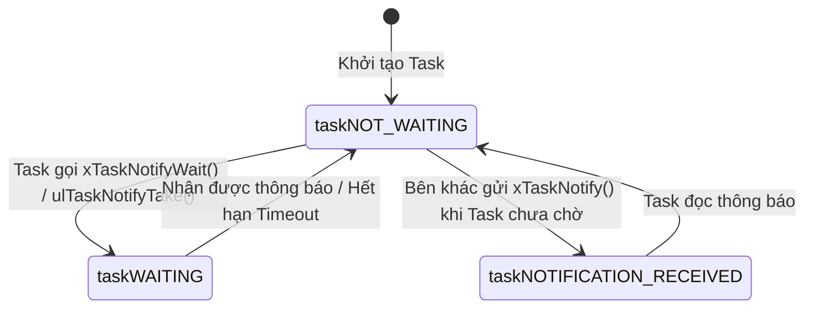

# <span style="color:#f1c40f">📘 Chương 7: Truyền Thông Liên Tác Vụ & Task Notifications (Intertask Communication & Direct Task Notifications)</span>

*Tài liệu học tập tích hợp chuyên sâu: "Hands-On RTOS with Microcontrollers" (Brian Amos - Chapter 9) & "Mastering the FreeRTOS Real Time Kernel" (Richard Barry - Chapter 9)*

---

```
========================================================================================================
                                     MỤC LỤC TỔNG QUAN CHƯƠNG 7
========================================================================================================
 1. Truyền Dữ Liệu Qua Queue Bằng Giá Trị (Passing Data Through Queues by Value)
    ├─ 1.1 Khái niệm & Cơ chế Copy-by-Value trên vi xử lý ARM Cortex-M
    ├─ 1.2 Thực nghiệm STM32: Truyền 1 Byte Enum điều khiển LED (mainQueueExample.c)
    ├─ 1.3 Thực nghiệm STM32: Truyền Cấu trúc Phức hợp sử dụng Bit-field (mainQueueStruct.c)
    └─ 1.4 Phân tích tác động của Queue tới Thứ tự Thực thi & Độ ưu tiên trên SEGGER SystemView
 2. Truyền Dữ Liệu Qua Queue Bằng Tham Chiếu (Passing Data Through Queues by Reference)
    ├─ 2.1 Khi nào nên truyền bằng Tham chiếu? (Ngưỡng kích thước dữ liệu & Chi phí memcpy)
    ├─ 2.2 Bảng so sánh chi tiết: Truyền bằng Giá trị vs Truyền bằng Con trỏ
    ├─ 2.3 Thực nghiệm STM32: Truyền con trỏ tới Struct 264 Bytes (mainQueuePointer.c)
    ├─ 2.4 Mô hình chuyển giao quyền sở hữu vùng nhớ (Transfer of Memory Ownership)
    └─ 2.5 Cạm bẫy sống còn: Tránh Dangling Pointer khi trỏ vào Stack biến cục bộ
 3. Thông Báo Trực Tiếp Đến Task (Direct Task Notifications In-Depth)
    ├─ 3.1 Bản chất kiến trúc Kernel: 2 trường ulNotifiedValue & ucNotifyState trong TCB
    ├─ 3.2 Máy trạng thái thông báo Task (Task Notification State Machine)
    ├─ 3.3 Lợi ích hiệu suất vượt trội (Nhanh hơn 45%, Tiết kiệm 100% RAM phụ trợ)
    ├─ 3.4 5 Giới hạn cốt lõi của Task Notification (Bắt buộc phải nắm vững)
    ├─ 3.5 Bảng tra cứu toàn diện các hàm API Task Notification
    ├─ 3.6 Bộ API Give/Take cơ bản (Lightweight Binary & Counting Semaphore)
    ├─ 3.7 Thực nghiệm FreeRTOS cốt lõi (Richard Barry: Example 24 & Example 25)
    ├─ 3.8 Bộ API đầy đủ tính năng: xTaskNotify, xTaskNotifyWait & 5 chế độ eNotifyAction
    └─ 3.9 Thực nghiệm STM32: Điều khiển 3 LED bằng Task Notifications (mainTaskNotifications.c)
 4. Các Mẫu Thiết Kế Driver Thực Tế (Real-World Driver Patterns)
    ├─ 4.1 Driver truyền thông UART TX không đồng bộ (Listing 155 Pattern)
    ├─ 4.2 Driver nhận UART RX kèm cơ chế kiểm tra Timeout liên tục (Listing 156 Pattern)
    ├─ 4.3 Driver chuyển đổi ADC chuyển kết quả trực tiếp từ ngắt (Listing 157 Pattern)
    └─ 4.4 Mô hình giao tiếp Client-Server hai chiều: Request qua Queue, Response qua Notification
 5. Bảng So Sánh Toàn Diện Giữa 4 Primitive Giao Tiếp FreeRTOS
 6. Câu Hỏi Ôn Tập Chuyên Sâu Có Đáp Án Chi Tiết (Brian Amos & Richard Barry)
 7. 📌 Tóm Tắt Khắc Cốt Ghi Tâm (Key Takeaways)
========================================================================================================
```

---


## <span style="color:#e67e22">1. Truyền Dữ Liệu Qua Queue Bằng Giá Trị (Passing Data Through Queues by Value)</span>

📘 *Nguồn tham chiếu: Brian Amos (Chapter 9, Pages 219-230)*

### <span style="color:#1abc9c">1.1 Khái Niệm & Cơ Chế Copy-by-Value Trên Vi Xử Lý ARM Cortex-M</span>

Trong FreeRTOS, cơ chế truyền dữ liệu mặc định của Hàng đợi (Queue) là **Copy-by-Value (Sao chép theo giá trị)**.
Khi tác vụ gửi gọi hàm `xQueueSend()`, kernel sẽ sử dụng hàm nội bộ `prvCopyDataToQueue()` để sao chép nguyên vẹn từng byte dữ liệu từ con trỏ nguồn do người dùng cung cấp vào vùng đệm lưu trữ (Storage Buffer) nằm bên trong cấu trúc Queue.

```
 Cơ Chế Sao Chép Bằng Giá Trị (Copy-by-Value):
 Tác Vụ Gửi (Sender Stack):         Vùng Nhớ Queue (Kernel Storage):        Tác Vụ Nhận (Receiver Stack):
 ┌──────────────────────┐           ┌─────────────────────────────┐        ┌──────────────────────┐
 │ Biến: nextCmd = 0x02 │ ──memcpy──> │ Slot 0: [ 0x02 ] (Bản sao) │ ──memcpy─> │ Biến: rxCmd = 0x02   │
 └──────────────────────┘           └─────────────────────────────┘        └──────────────────────┘
 (Sender có thể thoải mái ghi đè                                            (Dữ liệu hoàn toàn độc lập,
  hoặc hủy nextCmd mà không sợ                                               vòng đời bộ nhớ tách rời)
  ảnh hưởng tới Queue)
```

#### Ưu Điểm Tuyệt Đối Của Copy-by-Value:
1. **An toàn bộ nhớ (Memory Safety):** Tác vụ gửi không cần bận tâm về việc biến nguồn có bị sửa đổi hay bị hủy hay không sau khi hàm `xQueueSend()` trả về.
2. **Loại bỏ xung đột (Zero Race Conditions):** Tác vụ gửi và tác vụ nhận không chia sẻ bất kỳ con trỏ vùng nhớ nào, dữ liệu được cô lập hoàn toàn giữa các không gian Stack của từng tác vụ.

---

### <span style="color:#1abc9c">1.2 Thực Nghiệm STM32: Truyền 1 Byte Enum Điều Khiển LED (mainQueueExample.c)</span>

* **Mục tiêu thực nghiệm:** Trên board STM32F767ZI Nucleo-144, tác vụ `sendingTask` gửi tuần tự các mã lệnh dạng `enum` (chiếm đúng 1 byte) vào Queue; tác vụ `recvTask` lấy mã lệnh từ Queue ra và điều khiển bật/tắt 3 đèn LED (Xanh lá, Xanh dương, Đỏ).

```c
#include "FreeRTOS.h"
#include "queue.h"
#include "task.h"
#include "main.h"
#include "SEGGER_SYSVIEW.h"

#define STACK_SIZE 128

// 1. Định nghĩa kiểu Enum cho trạng thái LED (kích thước ép về 1 byte uint8_t)
typedef enum {
    eLedOff = 0,
    eLedGreen,
    eLedBlue,
    eLedRed,
    eLedAll,
    eLedMax
} LedState_t;

// Khai báo Handle cho Queue toàn cục
static QueueHandle_t ledCmdQueue = NULL;

// TÁC VỤ NHẬN DỮ LIỆU VÀ ĐIỀU KHIỂN LED
static void recvTask(void* args)
{
    uint8_t rxCmd = 0;

    while(1)
    {
        // Block chờ vô hạn (portMAX_DELAY) cho tới khi có lệnh trong Queue
        if(xQueueReceive(ledCmdQueue, &rxCmd, portMAX_DELAY) == pdPASS)
        {
            // Tắt toàn bộ LED trước khi cập nhật trạng thái mới
            HAL_GPIO_WritePin(LED1_GPIO_Port, LED1_Pin, GPIO_PIN_RESET);
            HAL_GPIO_WritePin(LED2_GPIO_Port, LED2_Pin, GPIO_PIN_RESET);
            HAL_GPIO_WritePin(LED3_GPIO_Port, LED3_Pin, GPIO_PIN_RESET);

            switch((LedState_t)rxCmd)
            {
                case eLedGreen:
                    HAL_GPIO_WritePin(LED1_GPIO_Port, LED1_Pin, GPIO_PIN_SET);
                    SEGGER_SYSVIEW_Print("recvTask: Bật LED Xanh lá");
                    break;
                case eLedBlue:
                    HAL_GPIO_WritePin(LED2_GPIO_Port, LED2_Pin, GPIO_PIN_SET);
                    SEGGER_SYSVIEW_Print("recvTask: Bật LED Xanh dương");
                    break;
                case eLedRed:
                    HAL_GPIO_WritePin(LED3_GPIO_Port, LED3_Pin, GPIO_PIN_SET);
                    SEGGER_SYSVIEW_Print("recvTask: Bật LED Đỏ");
                    break;
                case eLedAll:
                    HAL_GPIO_WritePin(LED1_GPIO_Port, LED1_Pin, GPIO_PIN_SET);
                    HAL_GPIO_WritePin(LED2_GPIO_Port, LED2_Pin, GPIO_PIN_SET);
                    HAL_GPIO_WritePin(LED3_GPIO_Port, LED3_Pin, GPIO_PIN_SET);
                    SEGGER_SYSVIEW_Print("recvTask: Bật TẤT CẢ LED");
                    break;
                case eLedOff:
                default:
                    SEGGER_SYSVIEW_Print("recvTask: Tắt toàn bộ LED");
                    break;
            }
        }
    }
}

// TÁC VỤ GỬI DỮ LIỆU
static void sendingTask(void* args)
{
    uint8_t nextCmd = (uint8_t)eLedGreen;

    while(1)
    {
        // Gửi mã lệnh vào Queue, timeout chờ tối đa 100ms
        if(xQueueSend(ledCmdQueue, &nextCmd, pdMS_TO_TICKS(100)) == pdPASS)
        {
            SEGGER_SYSVIEW_Print("sendingTask: Gửi thành công mã lệnh vào Queue");
        }
        else
        {
            SEGGER_SYSVIEW_Warn("sendingTask: Queue đã ĐẦY, không gửi được!");
        }

        // Chuyển sang trạng thái kế tiếp theo chu kỳ
        nextCmd++;
        if(nextCmd >= (uint8_t)eLedMax)
        {
            nextCmd = (uint8_t)eLedOff;
        }

        // Delay 200ms giữa mỗi lần gửi để mắt người quan sát được LED đổi màu
        vTaskDelay(pdMS_TO_TICKS(200));
    }
}

int main(void)
{
    HAL_Init();
    SystemClock_Config();
    MX_GPIO_Init();

    SEGGER_SYSVIEW_Conf();
    SEGGER_SYSVIEW_Start();

    // 2. Tạo Queue có sức chứa 2 phần tử, mỗi phần tử kích thước 1 byte (sizeof(uint8_t))
    ledCmdQueue = xQueueCreate(2, sizeof(uint8_t));
    configASSERT(ledCmdQueue != NULL);

    // Tạo 2 task với cùng mức ưu tiên (Priority 1)
    xTaskCreate(recvTask,    "recvTask",    STACK_SIZE, NULL, 1, NULL);
    xTaskCreate(sendingTask, "sendingTask", STACK_SIZE, NULL, 1, NULL);

    vTaskStartScheduler();
    while(1);
}
```

---

### <span style="color:#1abc9c">1.3 Thực Nghiệm STM32: Truyền Cấu Trúc Phức Hợp Sử Dụng Bit-field (mainQueueStruct.c)</span>

Trong ví dụ trước, ta chỉ điều khiển được từng trạng thái đơn lẻ. Nếu hệ thống yêu cầu điều khiển **tổ hợp đồng thời trạng thái bật/tắt của cả 3 LED**, ta sử dụng một Cấu trúc phức hợp (Composite Struct) ứng dụng kỹ thuật **Bit-field** để tiết kiệm RAM tối đa:

```c
// Định nghĩa cấu trúc Bit-field mô tả trạng thái của cả 3 LED trong đúng 1 Byte:
typedef struct {
    uint8_t greenLed : 1; // 1 bit: 0 = Tắt, 1 = Bật
    uint8_t blueLed  : 1; // 1 bit: 0 = Tắt, 1 = Bật
    uint8_t redLed   : 1; // 1 bit: 0 = Tắt, 1 = Bật
    uint8_t reserved : 5; // 5 bit dự phòng (để tròn 8 bits = 1 byte)
} LedStates_t;
```

#### Khởi Tạo Queue Chứa Struct:
```c
// Kích thước mỗi phần tử của Queue là sizeof(LedStates_t) = 1 byte
ledCmdQueue = xQueueCreate(2, sizeof(LedStates_t));
```

#### Task Nhận Giải Mã Struct:
```c
static void recvTask_Struct(void* args)
{
    LedStates_t rxStates;

    while(1)
    {
        if(xQueueReceive(ledCmdQueue, &rxStates, portMAX_DELAY) == pdPASS)
        {
            // Cập nhật đồng thời cả 3 chân GPIO theo từng trường bit-field:
            HAL_GPIO_WritePin(LED1_GPIO_Port, LED1_Pin, rxStates.greenLed ? GPIO_PIN_SET : GPIO_PIN_RESET);
            HAL_GPIO_WritePin(LED2_GPIO_Port, LED2_Pin, rxStates.blueLed  ? GPIO_PIN_SET : GPIO_PIN_RESET);
            HAL_GPIO_WritePin(LED3_GPIO_Port, LED3_Pin, rxStates.redLed   ? GPIO_PIN_SET : GPIO_PIN_RESET);
        }
    }
}
```

---

### <span style="color:#1abc9c">1.4 Phân Tích Tác Động Của Queue Tới Thứ Tự Thực Thi & Mức Ưu Tiên</span>

Brian Amos đã thực hiện thí nghiệm thay đổi mức ưu tiên giữa `sendingTask` và `recvTask` để quan sát dòng thực thi trên SEGGER SystemView:

#### Kịch Bản A: `recvTask` (Priority 2) > `sendingTask` (Priority 1)
1. `sendingTask` (Pri 1) thức dậy và gọi `xQueueSend()`.
2. Dữ liệu vừa được chép vào Queue $
ightarrow$ Kernel nhận thấy `recvTask` đang bị Blocked có mức ưu tiên cao hơn (2 > 1).
3. **Preemption diễn ra tức thì:** `recvTask` lập tức chiếm quyền CPU, đọc dữ liệu ra khỏi Queue, cập nhật LED, và quay lại gọi `xQueueReceive()`.
4. Vì Queue rỗng trở lại, `recvTask` chuyển sang trạng thái Blocked. `sendingTask` được tiếp tục chạy để hoàn thành lệnh send và đi ngủ (`vTaskDelay`).
5. **Hệ quả quan sát được:** Hàng đợi **không bao giờ chứa quá 1 phần tử** vì dữ liệu được tiêu thụ ngay tại micro-giây nó xuất hiện!

#### Kịch Bản B: `sendingTask` (Priority 2) > `recvTask` (Priority 1)
1. `sendingTask` (Pri 2) có mức ưu tiên cao hơn nên chạy trước. Nó nhanh chóng ghi đầy cả 2 slot của Queue (`ledCmdQueue`).
2. Đến lần gửi thứ 3, Queue đã đầy. Do có tham số `xTicksToWait = pdMS_TO_TICKS(100)`, `sendingTask` bị chuyển sang trạng thái **Blocked chờ Queue có chỗ trống**.
3. Lúc này, `recvTask` (Pri 1) mới có cơ hội được thực thi. Nó rút 1 phần tử ra $
ightarrow$ Queue có 1 slot rảnh $
ightarrow$ `sendingTask` lập tức Unblock, Preempt `recvTask` và ghi phần tử mới vào!
4. **Hệ quả quan sát được:** Queue luôn luôn ở trạng thái **Đầy (Full)**.

---


## <span style="color:#e67e22">2. Truyền Dữ Liệu Qua Queue Bằng Tham Chiếu (Passing Data Through Queues by Reference)</span>

📘 *Nguồn tham chiếu: Brian Amos (Chapter 9, Pages 231-235)*

### <span style="color:#1abc9c">2.1 Khi Nào Nên Truyền Bằng Tham Chiếu? (Ngưỡng Kích Thước Dữ Liệu & Chi Phí memcpy)</span>

Mặc dù cơ chế Copy-by-Value của FreeRTOS rất an toàn, nhưng khi kích thước của khối dữ liệu tăng lên, nó sẽ bộc lộ hai nhược điểm chí mạng:
1. **Lãng phí RAM của Hàng đợi:** Queue phải cấp phát mảng đệm lưu trữ với kích thước bằng $	ext{uxLength} 	imes 	ext{uxItemSize}$.
2. **Tiêu hao chu kỳ CPU:** Mỗi lần gọi `xQueueSend()` và `xQueueReceive()`, CPU phải thực thi lệnh `memcpy()` sao chép từng byte trong RAM, làm tăng độ trễ chuyển ngữ cảnh.

#### Ví Dụ Thực Tế Từ Brian Amos: Cấu Trúc Bản Tin Lớn (264 Bytes)
Giả sử hệ thống cần truyền một bản tin chẩn đoán bao gồm dấu thời gian, ID và chuỗi ký tự text:

```c
#define MAX_MSG_LEN 256

typedef struct {
    uint32_t ulTimestamp;
    uint32_t ulMsgId;
    char     cMessage[MAX_MSG_LEN];
} DiagnosticMsg_t; // Tổng kích thước: 4 + 4 + 256 = 264 Bytes!
```

* **Nếu truyền bằng Giá trị (Pass by Value):**
  * Khởi tạo Queue có sức chứa 8 phần tử:
    $$	ext{RAM Tiêu Tốn} = 8 	imes 264 	ext{ bytes} = \mathbf{2.112	ext{ Bytes (~2.1 KB RAM!)}}$$
  * Với các vi điều khiển chỉ có 20KB hoặc 32KB RAM, một hàng đợi đơn lẻ này đã ngốn mất gần 10% toàn bộ bộ nhớ của chip!
* **Nếu truyền bằng Con trỏ (Pass by Reference):**
  * Hàng đợi chỉ lưu trữ địa chỉ con trỏ 32-bit (`sizeof(DiagnosticMsg_t*) = 4 bytes`):
    $$	ext{RAM Tiêu Tốn} = 8 	imes 4 	ext{ bytes} = \mathbf{32	ext{ Bytes!}}$$
  * **Tiết kiệm tới 98.5% dung lượng RAM của hàng đợi!**
  * Tốc độ sao chép chỉ tốn đúng 1 chu kỳ máy (copy 4 bytes con trỏ thay vì chạy vòng lặp 264 bytes)!

---

### <span style="color:#1abc9c">2.2 Bảng So Sánh Chi Tiết: Truyền Bằng Giá Trị vs Truyền Bằng Con Trỏ</span>

| Tiêu Chí So Sánh | Truyền Bằng Giá Trị (Copy-by-Value) | Truyền Bằng Con Trỏ (Pass by Pointer) |
|---|---|---|
| **Dung lượng RAM Queue** | Rất lớn: $	ext{QueueLen} 	imes 	ext{StructSize}$ | Siêu nhỏ: $	ext{QueueLen} 	imes 4	ext{ bytes}$ (Cố định trên 32-bit) |
| **Thời gian thực thi CPU** | Chậm, phụ thuộc tuyến tính vào kích thước dữ liệu ($O(N)$) | Cực nhanh, thời gian hằng số ($O(1)$) |
| **Vòng đời vùng nhớ (Lifetime)**| Độc lập hoàn toàn, an toàn tuyệt đối | Phụ thuộc chặt, bên gửi phải giữ vùng nhớ tồn tại |
| **Nguy cơ Race Condition** | ❌ Không có | ⚠️ Rất cao nếu tác vụ gửi tiếp tục sửa dữ liệu |
| **Nguy cơ Dangling Pointer** | ❌ Không có | ⚠️ Rất cao nếu trỏ vào biến cục bộ trên Stack |
| **Kịch bản tối ưu** | Dữ liệu nhỏ ($\le 16	ext{ bytes}$): `int`, `float`, enum, struct nhỏ | Dữ liệu lớn ($> 32	ext{ bytes}$): mảng ký tự, frame mạng, frame ảnh |

---

### <span style="color:#1abc9c">2.3 Thực Nghiệm STM32: Truyền Con Trỏ Tới Struct 264 Bytes (mainQueuePointer.c)</span>

Mã nguồn thực tế từ Brian Amos trên vi điều khiển STM32F767ZI:

```c
#include "FreeRTOS.h"
#include "queue.h"
#include "task.h"
#include "main.h"
#include "SEGGER_SYSVIEW.h"

#define MAX_MSG_LEN 256
#define STACK_SIZE 128

typedef struct {
    uint32_t ulTimestamp;
    uint32_t ulMsgId;
    char     cMessage[MAX_MSG_LEN];
} DiagnosticMsg_t;

// Khai báo 2 bộ đệm tĩnh toàn cục (Static Memory Buffers)
static DiagnosticMsg_t msgBuffer1;
static DiagnosticMsg_t msgBuffer2;

// Handle Queue lưu trữ CON TRỎ
static QueueHandle_t ptrQueue = NULL;

static void sendingTask_Ptr(void* args)
{
    uint32_t counter = 0;

    while(1)
    {
        counter++;
        // Luân phiên chuẩn bị dữ liệu trên 2 bộ đệm tĩnh
        DiagnosticMsg_t *pCurrentBuffer = (counter % 2 == 0) ? &msgBuffer1 : &msgBuffer2;

        pCurrentBuffer->ulTimestamp = xTaskGetTickCount();
        pCurrentBuffer->ulMsgId     = counter;
        snprintf(pCurrentBuffer->cMessage, MAX_MSG_LEN, "Bản tin chẩn đoán số #%lu từ STM32F7", (unsigned long)counter);

        SEGGER_SYSVIEW_Print("sendingTask: Đang gửi CON TRỎ bản tin vào Queue...");

        // CÚ PHÁP CỐT LÕI: Truyền ĐỊA CHỈ CỦA CON TRỎ (&pCurrentBuffer)
        // Vì Queue lưu con trỏ, nên tham số truyền vào hàm là con trỏ cấp 2!
        if(xQueueSend(ptrQueue, &pCurrentBuffer, pdMS_TO_TICKS(100)) == pdPASS)
        {
            SEGGER_SYSVIEW_Print("sendingTask: Gửi con trỏ thành công!");
        }
        else
        {
            SEGGER_SYSVIEW_Warn("sendingTask: Queue con trỏ bị ĐẦY!");
        }

        vTaskDelay(pdMS_TO_TICKS(500));
    }
}

static void recvTask_Ptr(void* args)
{
    DiagnosticMsg_t *pReceivedMsg = NULL;

    while(1)
    {
        // Nhận CON TRỎ từ Queue vào biến con trỏ cục bộ pReceivedMsg
        if(xQueueReceive(ptrQueue, &pReceivedMsg, portMAX_DELAY) == pdPASS)
        {
            configASSERT(pReceivedMsg != NULL);

            // Truy cập dữ liệu cực nhanh thông qua toán tử trỏ ->
            SEGGER_SYSVIEW_Print(pReceivedMsg->cMessage);

            // Bật LED xanh báo nhận dữ liệu thành công
            HAL_GPIO_TogglePin(LED2_GPIO_Port, LED2_Pin);
        }
    }
}

int main(void)
{
    HAL_Init();
    SystemClock_Config();
    MX_GPIO_Init();

    SEGGER_SYSVIEW_Conf();
    SEGGER_SYSVIEW_Start();

    // KHỞI TẠO QUEUE LƯU CON TRỎ:
    // Sức chứa 8 phần tử, mỗi phần tử có kích thước bằng sizeof(DiagnosticMsg_t*) = 4 bytes!
    ptrQueue = xQueueCreate(8, sizeof(DiagnosticMsg_t*));
    configASSERT(ptrQueue != NULL);

    xTaskCreate(recvTask_Ptr,    "recvTask",    STACK_SIZE, NULL, 1, NULL);
    xTaskCreate(sendingTask_Ptr, "sendingTask", STACK_SIZE, NULL, 1, NULL);

    vTaskStartScheduler();
    while(1);
}
```

---

### <span style="color:#1abc9c">2.4 Mô Hình Chuyển Giao Quyền Sở Hữu Vùng Nhớ (Transfer of Memory Ownership)</span>

Khi lập trình truyền dữ liệu bằng con trỏ, kỹ sư phần mềm bắt buộc phải tuân thủ nghiêm ngặt **Mô hình Chuyển giao quyền sở hữu (Ownership Transfer Protocol)**:

```
 [TÁC VỤ GỬI]                             [HÀNG ĐỢI QUEUE]                         [TÁC VỤ NHẬN]
 ┌──────────────────────┐                 ┌────────────────┐                       ┌──────────────────────┐
 │ Cấp phát bộ đệm      │                 │                │                       │                      │
 │ Ghi dữ liệu vào đệm  │                 │                │                       │                      │
 │ CHUYỂN GIAO SỞ HỮU   │ ──Gửi Pointer──> │ [ Địa chỉ RAM] │ ──Nhận Pointer──>    │ TIẾP NHẬN SỞ HỮU     │
 │ (CẤM CHẠM VÀO ĐỆM!)  │                 │                │                       │ Đọc & xử lý dữ liệu  │
 │                      │                 │                │                       │ GIẢI PHÓNG BỘ ĐỆM!   │
 └──────────────────────┘                 └────────────────┘                       └──────────────────────┘
```

1. **Giai đoạn 1 (Sở hữu bởi Bên gửi):** Tác vụ gửi có quyền ghi chép dữ liệu vào vùng đệm.
2. **Giai đoạn 2 (Chuyển giao):** Ngay sau khi lệnh `xQueueSend()` thành công, **TÁC VỤ GỬI PHẢI TỪ BỎ HOÀN TOÀN MỌI QUYỀN TRUY CẬP** vào vùng đệm đó. Tuyệt đối không được đọc hay sửa đổi nội dung vùng đệm khi nó đang nằm trong Queue.
3. **Giai đoạn 3 (Sở hữu bởi Bên nhận):** Tác vụ nhận sau khi gọi `xQueueReceive()` trở thành chủ sở hữu độc quyền duy nhất.
4. **Giai đoạn 4 (Thu hồi):** Tác vụ nhận có trách nhiệm giải phóng bộ đệm (nếu dùng Heap `vPortFree()`) hoặc trả về Pool tái sử dụng.

---

### <span style="color:#1abc9c">2.5 Cạm Bẫy Sống Còn: Tránh Dangling Pointer Khi Trỏ Vào Stack Biến Cục Bộ</span>

> [!CAUTION]
> **THẢM HỌA LẬP TRÌNH NHÚNG: TRUYỀN CON TRỎ TỚI BIẾN CỤC BỘ TRÊN STACK (LOCAL STACK VARIABLE)**
>
> Đoạn mã sau đây chứa một lỗi chết người mà mọi kỹ sư nhúng phải khắc cốt ghi tâm:
> ```c
> void vCatastrophicSender(void)
> {
>     DiagnosticMsg_t localMsg; // BIẾN NẰM TRÊN STACK CỦA HÀM NÀY!
>     localMsg.ulMsgId = 42;
>     snprintf(localMsg.cMessage, MAX_MSG_LEN, "Dữ liệu nguy hiểm");
>
>     DiagnosticMsg_t *p = &localMsg;
>     xQueueSend(ptrQueue, &p, portMAX_DELAY);
> } // <-- KHI HÀM NÀY THOÁT, CON TRỎ STACK (SP) BỊ THU HỒI!
> ```
> * **Hậu quả:** Vùng nhớ của `localMsg` trên Stack bị đánh dấu là tự do. Khi tác vụ gọi hàm khác, Stack frame của hàm mới sẽ **ghi đè dữ liệu rác lên chính ô nhớ của `localMsg`**!
> * Khi tác vụ nhận đọc con trỏ `p`, nó sẽ đọc phải vùng nhớ rác (Dangling Pointer) hoặc nếu ô nhớ nằm ngoài phạm vi cho phép của MPU sẽ kích hoạt lỗi phần cứng **HardFault Crash Chip ngay lập tức**!
>
> **QUY TẮC BẤT DI BẤT DỊCH:**
> Vùng nhớ được truyền qua con trỏ **BẮT BUỘC PHẢI LÀ**:
> 1. Biến toàn cục / Biến tĩnh (`static DiagnosticMsg_t buffer;`).
> 2. Vùng nhớ cấp phát động từ FreeRTOS Heap (`pvPortMalloc()`).
> 3. Tuyệt đối **KHÔNG BAO GIỜ** lấy địa chỉ của biến cục bộ không có từ khóa `static` để gửi vào Queue!

---


## <span style="color:#e67e22">3. Thông Báo Trực Tiếp Đến Task (Direct Task Notifications In-Depth)</span>

📘 *Nguồn tham chiếu: Brian Amos (Chapter 9, Pages 236-239) & Richard Barry (Chapter 9, Pages 323-356)*

### <span style="color:#1abc9c">3.1 Bản Chất Kiến Trúc Kernel: 2 Trường Trong TCB</span>

Kể từ FreeRTOS V8.2.0, một cơ chế truyền thông trực tiếp mang tên **Task Notifications (Thông báo trực tiếp đến tác vụ)** được giới thiệu và nhanh chóng trở thành phương thức giao tiếp được ưu tiên hàng đầu trong các thiết kế nhúng hiện đại.

Trong mô hình Queue, Semaphore hoặc Event Group truyền thống:
* Bạn bắt buộc phải gọi hàm tạo đối tượng (ví dụ: `xQueueCreate()`, `xSemaphoreCreateBinary()`).
* Kernel phải cấp phát bộ nhớ RAM cho một cấu trúc điều khiển hàng đợi (`QueueDefinition` tốn ~76 đến 80 bytes RAM).
* Các tác vụ gửi và nhận phải gián tiếp tương tác thông qua Handle của đối tượng trung gian này.

**Với Task Notifications:**
Kernel nhúng trực tiếp 2 trường dữ liệu vào ngay bên trong khối điều khiển tác vụ **TCB (Task Control Block)** của TẤT CẢ các tác vụ (khi cấu hình `configUSE_TASK_NOTIFICATIONS == 1`):

```c
/* Trích xuất từ cấu trúc tskTaskControlBlock trong FreeRTOS/Source/tasks.c */
typedef struct tskTaskControlBlock
{
    /* ... Các trường con trỏ Stack, Tên task, Priority ... */

    #if( configUSE_TASK_NOTIFICATIONS == 1 )
        volatile uint32_t ulNotifiedValue; // Giá trị thông báo 32-bit (Payload / Bitmask / Counter)
        volatile uint8_t  ucNotifyState;   // Trạng thái thông báo của tác vụ (State Machine)
    #endif

} tskTCB;
```

```
 Giao Tiếp Cũ Qua Đối Tượng Trung Gian:
 [Task Gửi / ISR] ──> [ Đối Tượng Queue / Semaphore (~80 Bytes RAM) ] ──> [Task Nhận]

 Giao Tiếp Mới Trực Tiếp Đến TCB (Direct to Task):
 [Task Gửi / ISR] ────────────────(Ghi Thẳng Vào TCB)─────────────────> [TCB Task Nhận (0 Byte Phụ Trợ!)]
```

---

### <span style="color:#1abc9c">3.2 Máy Trạng Thái Thông Báo Task (Task Notification State Machine)</span>

Biến `ucNotifyState` bên trong TCB hoạt động theo một máy trạng thái 3 cấp độ:



1. **`taskNOT_WAITING_NOTIFICATION` (0):** Tác vụ đang thực thi bình thường hoặc đang bị Blocked bởi các sự kiện khác (`vTaskDelay`, Queue khác), không chờ thông báo.
2. **`taskWAITING_NOTIFICATION` (1):** Tác vụ đã chủ động gọi `ulTaskNotifyTake()` hoặc `xTaskNotifyWait()` với thời gian chờ `xTicksToWait > 0` và đang rơi vào trạng thái Blocked để kiên nhẫn đợi thông báo tới.
3. **`taskNOTIFICATION_RECEIVED` (2):** Đã có một tác vụ khác hoặc ngắt ISR gửi thông báo tới TCB của tác vụ này trong khi tác vụ này chưa kịp đọc (đóng vai trò là cờ Pending Latch).

---

### <span style="color:#1abc9c">3.3 Lợi Ích Hiệu Suất Vượt Trội (Nhanh Hơn 45%, Tiết Kiệm 100% RAM Phụ Trợ)</span>

Các phép đo lường thực tế trên lõi ARM Cortex-M được công bố bởi Richard Barry và Brian Amos đã chứng minh:
* **Tốc độ thực thi nhanh hơn ~45%:** Thao tác gửi và nhận Task Notification chỉ tốn khoảng **20 đến 30 chu kỳ CPU clock**, trong khi Queue hoặc Semaphore mất tới **70 đến 100 chu kỳ**. Lý do: Kernel ghi chép trực tiếp vào thanh ghi của TCB mục tiêu mà không cần phải thực hiện các thuật toán duyệt danh sách sự kiện phức tạp (`Event List Traversal`).
* **Tiết kiệm 100% dung lượng RAM phụ trợ:** Không cần cấp phát bộ nhớ đệm hay TCB hàng đợi. Toàn bộ 8 byte quản lý đã nằm sẵn trong TCB từ khi tạo task!

---

### <span style="color:#1abc9c">3.4 5 Giới Hạn Cốt Lõi Của Task Notification</span>

Mặc dù cực kỳ mạnh mẽ, Task Notifications không thể thay thế hoàn toàn Queue hay Event Group vì 5 giới hạn vật lý bắt buộc phải ghi nhớ:

> [!CAUTION]
> **5 GIỚI HẠN BẮT BUỘC PHẢI BIẾT CỦA TASK NOTIFICATIONS:**
>
> 1. **CHỈ CÓ DUY NHẤT 1 TÁC VỤ NHẬN:**
>    Mỗi thông báo được gửi trực tiếp tới một TCB cụ thể. Không thể có nhiều tác vụ cùng chờ trên một thông báo, và không thể Broadcast phát sóng đồng loạt như Event Group.
> 
> 2. **BÊN NHẬN BẮT BUỘC PHẢI LÀ MỘT TASK:**
>    Ngắt phần cứng (ISR) không có cấu trúc TCB, do đó **ISR KHÔNG THỂ NHẬN TASK NOTIFICATION** (ISR chỉ có thể là bên gửi).
> 
> 3. **KHÔNG THỂ ĐỆM NHIỀU PHẦN TỬ DỮ LIỆU (KHÔNG CÓ FIFO BUFFER):**
>    TCB chỉ lưu đúng một giá trị số nguyên 32-bit (`ulNotifiedValue`). Không thể dùng để lưu trữ mảng hay chuỗi nhiều byte liên tiếp như Queue.
> 
> 4. **KHÔNG THỂ GỬI TỚI NHIỀU TASK TRONG MỘT LỆNH:**
>    Muốn báo cho $N$ task, bên gửi phải chạy vòng lặp gọi $N$ lần hàm API gửi.
> 
> 5. **BÊN GỬI KHÔNG THỂ BỊ BLOCKED CHỜ BÊN NHẬN:**
>    Các hàm gửi `xTaskNotify()` và `xTaskNotifyGive()` luôn hoàn thành tức thời và trả về ngay. Bên gửi không thể chỉ định `xTicksToWait` để chờ bên nhận đọc xong.

---

### <span style="color:#1abc9c">3.5 Bảng Tra Cứu Toàn Diện Các Hàm API Task Notification</span>

| Nhóm API | Tên Hàm API | Ngữ Cảnh Gọi | Chức Năng Cốt Lõi |
|---|---|---|---|
| **Cơ Bản (Give/Take)** | `xTaskNotifyGive()` | Task | Tăng `ulNotifiedValue` thêm 1 (Giống Give Semaphore). Luôn trả về `pdPASS`. |
| | `vTaskNotifyGiveFromISR()` | ISR | Biến thể an toàn trong ngắt, kèm cờ `pxHigherPriorityTaskWoken`. |
| | `ulTaskNotifyTake()` | Task | Chờ nhận thông báo. Cho phép reset về 0 (Binary Sem) hoặc giảm 1 (Counting Sem). |
| **Đầy Đủ Tính Năng** | `xTaskNotify()` | Task | Gửi thông báo kèm giá trị 32-bit và tùy chọn 1 trong 5 chế độ `eNotifyAction`. |
| | `xTaskNotifyFromISR()` | ISR | Biến thể gửi đầy đủ tính năng từ ngắt phần cứng. |
| | `xTaskNotifyWait()` | Task | Chờ thông báo đa năng: hỗ trợ lọc bitmask, xóa bit khi vào/ra, đọc giá trị 32-bit. |
| | `xTaskNotifyStateClear()` | Task | Xóa cờ trạng thái Pending về `taskNOT_WAITING` mà không làm đổi giá trị 32-bit. |

---

### <span style="color:#1abc9c">3.6 Bộ API Give/Take Cơ Bản (Lightweight Binary & Counting Semaphore)</span>

Hàm `ulTaskNotifyTake()` là sự thay thế hoàn hảo cho `xSemaphoreTake()`:

```c
uint32_t ulTaskNotifyTake( BaseType_t xClearCountOnExit, TickType_t xTicksToWait );
```

#### Phân Tích Tham Số & Hành Vi Kỹ Thuật:
* **Tham số `xClearCountOnExit`:**
  * **Nếu đặt `= pdTRUE` (Chế độ Binary Semaphore):**
    Ngay trước khi hàm trả về, giá trị `ulNotifiedValue` trong TCB sẽ bị **xóa sạch về 0**. Lần gọi tiếp theo chắc chắn sẽ bị Block cho đến khi có bên khác Give.
  * **Nếu đặt `= pdFALSE` (Chế độ Counting Semaphore):**
    Trước khi hàm trả về, giá trị `ulNotifiedValue` chỉ bị **giảm đi 1 đơn vị (`ulNotifiedValue--`)**. Nếu trước đó có nhiều lần Give, các lần Take tiếp theo sẽ chạy qua ngay lập tức mà không bị Block!
* **Giá trị trả về:**
  Trả về giá trị của `ulNotifiedValue` **TẠI THỜI ĐIỂM TRƯỚC KHI** nó bị xóa về 0 hoặc giảm đi 1! Nhờ đó, task có thể biết chính xác đã có bao nhiêu sự kiện đang tồn đọng.

---

### <span style="color:#1abc9c">3.7 Thực Nghiệm FreeRTOS Cốt Lõi (Richard Barry)</span>

#### Thực Nghiệm 24: Thay Thế Binary Semaphore Bằng Task Notification (Example 24)
* **Kịch bản:** Ngắt phần cứng ISR giải phóng công việc trì hoãn (Deferred Processing) cho Handler Task. Thay vì tạo một Binary Semaphore tốn 80 bytes RAM, ta dùng trực tiếp Task Notification:

```c
static TaskHandle_t xHandlerTask = NULL;

/* HÀM NGẮT PHẦN CỨNG ISR */
void vExampleInterruptHandler( void )
{
    BaseType_t xHigherPriorityTaskWoken = pdFALSE;

    // Gửi thông báo trực tiếp tới TCB của Handler Task!
    // Tương đương xSemaphoreGiveFromISR nhưng nhanh hơn 45% và 0 byte RAM phụ trợ!
    vTaskNotifyGiveFromISR( xHandlerTask, &xHigherPriorityTaskWoken );

    portYIELD_FROM_ISR( xHigherPriorityTaskWoken );
}

/* TÁC VỤ XỬ LÝ (HANDLER TASK) */
static void vHandlerTask( void *pvParameters )
{
    for( ;; )
    {
        // xClearCountOnExit = pdTRUE -> Hoạt động như Binary Semaphore!
        // Chờ vô hạn cho đến khi có ngắt báo
        ulTaskNotifyTake( pdTRUE, portMAX_DELAY );

        // Thực hiện xử lý sự kiện ngắt...
        vProcessPeriodicEvent();
    }
}

int main( void )
{
    // Tạo Handler Task và lưu lại Handle xHandlerTask
    xTaskCreate( vHandlerTask, "Handler", 1000, NULL, 3, &xHandlerTask );

    vTaskStartScheduler();
    for( ;; );
}
```

---

#### Thực Nghiệm 25: Thay Thế Counting Semaphore Chốt Sự Kiện Dồn Dập (Example 25)
* **Vấn đề đặt ra:** Nếu các ngắt phần cứng xuất hiện dồn dập (Burst Interrupts) trong khi Handler Task đang bận xử lý, Binary Semaphore sẽ làm mất các sự kiện đến sau.
* **Giải pháp trong Example 25:** Chỉ cần thay đổi duy nhất tham số `xClearCountOnExit = pdFALSE`!

```c
static void vCountingHandlerTask( void *pvParameters )
{
    uint32_t ulEventsToProcess;

    for( ;; )
    {
        // xClearCountOnExit = pdFALSE -> Hoạt động như Counting Semaphore!
        // Giá trị trả về cho biết số lượng sự kiện đang tồn đọng chưa xử lý!
        ulEventsToProcess = ulTaskNotifyTake( pdFALSE, portMAX_DELAY );

        if( ulEventsToProcess > 0 )
        {
            printf("Đang xử lý sự kiện! Số sự kiện còn tồn đọng: %lu\r\n", (unsigned long)ulEventsToProcess);
            vProcessSingleEvent();
        }
    }
}
```

---

### <span style="color:#1abc9c">3.8 Bộ API Đầy Đủ Tính Năng: xTaskNotify & xTaskNotifyWait</span>

```c
BaseType_t xTaskNotify(
    TaskHandle_t  xTaskToNotify, // Handle của task nhận
    uint32_t      ulValue,       // Giá trị 32-bit gửi đi
    eNotifyAction eAction        // 1 trong 5 chế độ hành động
);
```

#### Ma Trận 5 Chế Độ Hành Động Của `eNotifyAction`:

| Chế Độ `eNotifyAction` | Hành Vi Trên `ulNotifiedValue` Của Task Nhận | Ứng Dụng Thay Thế Tương Đương |
|---|---|---|
| `eNoAction` | Giữ nguyên giá trị, chỉ chuyển trạng thái sang Pending. | **Binary Semaphore** (Chỉ cần tín hiệu). |
| `eSetBits` | Thực hiện phép toán bitwise OR: `ulNotifiedValue |= ulValue`. | **Event Group** (Cờ bit sự kiện 32-bit). |
| `eIncrement` | Tăng biến đếm: `ulNotifiedValue++`. Bỏ qua tham số `ulValue`. | **Counting Semaphore** (Chốt sự kiện). |
| `eSetValueWithOverwrite` | Ghi đè vô điều kiện: `ulNotifiedValue = ulValue`. | **Mailbox** (Luôn cập nhật giá trị mới nhất). |
| `eSetValueWithoutOverwrite` | Ghi giá trị NẾU giá trị trước đã được đọc; nếu chưa đọc thì thất bại và trả về `pdFAIL`. | **Hàng đợi 1 phần tử không ghi đè**. |

#### Phân Tích Hàm Nhận Đa Năng `xTaskNotifyWait()`:

```c
BaseType_t xTaskNotifyWait(
    uint32_t ulBitsToClearOnEntry, // Mặt nạ các bit cần xóa trước khi vào Blocked
    uint32_t ulBitsToClearOnExit,  // Mặt nạ các bit cần xóa sau khi nhận được thông báo
    uint32_t *pulNotificationValue,// Con trỏ nhận giá trị 32-bit trước khi bị ClearOnExit
    TickType_t xTicksToWait        // Thời gian chờ tối đa
);
```

---

### <span style="color:#1abc9c">3.9 Thực Nghiệm STM32: Điều Khiển 3 LED Bằng Task Notifications (mainTaskNotifications.c)</span>

Mã nguồn thực tế từ Brian Amos trên vi điều khiển STM32F767ZI:

```c
#include "FreeRTOS.h"
#include "task.h"
#include "main.h"
#include "SEGGER_SYSVIEW.h"

#define GREEN_LED   ( 1UL << 0 )
#define BLUE_LED    ( 1UL << 1 )
#define RED_LED     ( 1UL << 2 )

static TaskHandle_t recvTaskHandle = NULL;

static void recvTask_Notification(void* args)
{
    uint32_t notifyVal = 0;

    while(1)
    {
        // 1. Chờ thông báo:
        // ulBitsToClearOnEntry = 0 (không xóa gì trước khi chờ)
        // ulBitsToClearOnExit = 0xFFFFFFFF (xóa sạch toàn bộ các bit sau khi đọc xong)
        if(xTaskNotifyWait(0, 0xFFFFFFFF, &notifyVal, portMAX_DELAY) == pdPASS)
        {
            // 2. Kiểm tra từng bit sự kiện nhận được:
            if(notifyVal & GREEN_LED)
            {
                HAL_GPIO_TogglePin(LED1_GPIO_Port, LED1_Pin);
                SEGGER_SYSVIEW_Print("recvTask: Đảo trạng thái LED Xanh lá qua Notification Bit!");
            }
            if(notifyVal & BLUE_LED)
            {
                HAL_GPIO_TogglePin(LED2_GPIO_Port, LED2_Pin);
                SEGGER_SYSVIEW_Print("recvTask: Đảo trạng thái LED Xanh dương qua Notification Bit!");
            }
            if(notifyVal & RED_LED)
            {
                HAL_GPIO_TogglePin(LED3_GPIO_Port, LED3_Pin);
                SEGGER_SYSVIEW_Print("recvTask: Đảo trạng thái LED Đỏ qua Notification Bit!");
            }
        }
    }
}

static void sendingTask_Notification(void* args)
{
    while(1)
    {
        // Báo bật LED Xanh lá
        xTaskNotify(recvTaskHandle, GREEN_LED, eSetBits);
        vTaskDelay(pdMS_TO_TICKS(200));

        // Báo bật LED Xanh dương
        xTaskNotify(recvTaskHandle, BLUE_LED, eSetBits);
        vTaskDelay(pdMS_TO_TICKS(200));

        // Báo bật LED Đỏ
        xTaskNotify(recvTaskHandle, RED_LED, eSetBits);
        vTaskDelay(pdMS_TO_TICKS(200));
    }
}

int main(void)
{
    HAL_Init();
    SystemClock_Config();
    MX_GPIO_Init();

    SEGGER_SYSVIEW_Conf();
    SEGGER_SYSVIEW_Start();

    // Tạo recvTask trước để lấy Handle
    xTaskCreate(recvTask_Notification,    "recvTask", 128, NULL, 1, &recvTaskHandle);
    xTaskCreate(sendingTask_Notification, "sendTask", 128, NULL, 1, NULL);

    vTaskStartScheduler();
    while(1);
}
```

---


## <span style="color:#e67e22">4. Các Mẫu Thiết Kế Driver Thực Tế (Real-World Driver Patterns)</span>

📗 *Nguồn tham chiếu: Mastering the FreeRTOS Real Time Kernel — Richard Barry (Chapter 9, Pages 340-354)*

### <span style="color:#1abc9c">4.1 Driver Truyền Thông UART TX Không Đồng Bộ (Listing 155 Pattern)</span>

Trong các driver giao tiếp truyền dữ liệu (UART, SPI, I2C), tác vụ khởi tạo việc truyền mảng ký tự và phải đợi cho đến khi phần cứng truyền xong byte cuối cùng. Thay vì polling cờ phần cứng `USART_SR_TC`, ta sử dụng Task Notification để ngủ tiết kiệm 100% CPU:

```c
static TaskHandle_t xTaskToNotifyOnTxComplete = NULL;

BaseType_t xUART_Send( UART_t *xUART, const uint8_t *pucBuffer, size_t xBufferLength, TickType_t xMaxBlockTime )
{
    BaseType_t xReturn = pdPASS;

    // 1. Lưu lại Handle của chính tác vụ đang gọi hàm truyền
    xTaskToNotifyOnTxComplete = xTaskGetCurrentTaskHandle();

    // 2. Xóa sạch mọi thông báo tồn đọng trước đó (nếu có)
    ulTaskNotifyTake( pdTRUE, 0 );

    // 3. Khởi động phần cứng truyền UART (bằng DMA hoặc kích hoạt ngắt TXE)
    vStartHardwareTransmission( xUART, pucBuffer, xBufferLength );

    // 4. Block tác vụ chờ ngắt phần cứng báo truyền xong
    if( ulTaskNotifyTake( pdTRUE, xMaxBlockTime ) == 0 )
    {
        // Quá hạn xMaxBlockTime mà ngắt TX Complete chưa báo -> Lỗi ngoại vi!
        xReturn = pdFAIL;
    }

    // 5. Thu hồi con trỏ bảo vệ
    xTaskToNotifyOnTxComplete = NULL;

    return xReturn;
}

// HÀM NGẮT PHẦN CỨNG UART TX COMPLETE
void USART1_TX_IRQHandler( void )
{
    BaseType_t xHigherPriorityTaskWoken = pdFALSE;

    if( USART1->SR & USART_SR_TC )
    {
        // Xóa cờ ngắt phần cứng
        USART1->SR &= ~USART_SR_TC;

        // Đánh thức trực tiếp tác vụ đang đợi truyền xong!
        if( xTaskToNotifyOnTxComplete != NULL )
        {
            vTaskNotifyGiveFromISR( xTaskToNotifyOnTxComplete, &xHigherPriorityTaskWoken );
        }

        portYIELD_FROM_ISR( xHigherPriorityTaskWoken );
    }
}
```

---

### <span style="color:#1abc9c">4.2 Driver Nhận UART RX Kèm Cơ Chế Kiểm Tra Timeout Liên Tục (Listing 156 Pattern)</span>

Khi nhận một gói tin gồm nhiều byte từ UART, khoảng cách giữa các byte có thể bị trễ. Nếu sử dụng `ulTaskNotifyTake()` thông thường với thời gian chờ cố định trong vòng lặp `while(bytesRead < totalBytes)`, thời gian timeout sẽ bị **reset lại từ đầu sau mỗi byte nhận được**, khiến tổng thời gian chờ có thể kéo dài vô tận nếu luồng dữ liệu bị chậm!

FreeRTOS cung cấp cấu trúc `TimeOut_t` kết hợp hai hàm `vTaskSetTimeOutState()` và `xTaskCheckForTimeOut()` để quản lý **thời gian chờ tổng thể (Overall Bounded Timeout)**:

```c
static TaskHandle_t xTaskToNotifyOnRxByte = NULL;

size_t xUART_Receive( uint8_t *pucBuffer, size_t uxBytesToRead, TickType_t xTicksToWait )
{
    size_t uxBytesReceived = 0;
    TimeOut_t xTimeOut;

    xTaskToNotifyOnRxByte = xTaskGetCurrentTaskHandle();
    ulTaskNotifyTake( pdTRUE, 0 ); // Xóa thông báo cũ

    // 1. Ghi lại trạng thái thời gian bắt đầu
    vTaskSetTimeOutState( &xTimeOut );

    while( ( uxBytesReceived < uxBytesToRead ) && 
           ( xTaskCheckForTimeOut( &xTimeOut, &xTicksToWait ) == pdFALSE ) )
    {
        // 2. Chờ ngắt RXNE báo có byte mới (xTicksToWait tự động bị giảm trừ thời gian đã trôi qua)
        if( ulTaskNotifyTake( pdTRUE, xTicksToWait ) != 0 )
        {
            pucBuffer[ uxBytesReceived ] = ucReadHardwareRxRegister();
            uxBytesReceived++;
        }
    }

    xTaskToNotifyOnRxByte = NULL;
    return uxBytesReceived;
}
```

---

### <span style="color:#1abc9c">4.3 Driver Chuyển Đổi ADC Chuyển Kết Quả Trực Tiếp Từ Ngắt (Listing 157 Pattern)</span>

Trong hệ thống thu thập tín hiệu, ngắt chuyển đổi ADC (End of Conversion) cần gửi giá trị đo được (12-bit hoặc 16-bit) cho Processing Task.
Thay vì tạo một Queue 1 phần tử tốn RAM:
* ISR sử dụng `xTaskNotifyFromISR()` với chế độ **`eSetValueWithoutOverwrite`**.
* Dữ liệu ADC được ghi thẳng vào trường `ulNotifiedValue` của Processing Task!

```c
static TaskHandle_t xAdcProcessingTask = NULL;

// HÀM NGẮT CHUYỂN ĐỔI ADC HOÀN TẤT
void ADC1_IRQHandler( void )
{
    BaseType_t xHigherPriorityTaskWoken = pdFALSE;
    uint32_t ulAdcValue;

    if( ADC1->SR & ADC_SR_EOC )
    {
        ulAdcValue = ADC1->DR; // Đọc giá trị chuyển đổi từ thanh ghi phần cứng

        // Ghi thẳng giá trị ADC vào TCB của Processing Task!
        xTaskNotifyFromISR(
            xAdcProcessingTask,
            ulAdcValue,
            eSetValueWithoutOverwrite, // Không ghi đè nếu mẫu trước chưa đọc
            &xHigherPriorityTaskWoken
        );

        portYIELD_FROM_ISR( xHigherPriorityTaskWoken );
    }
}

// TÁC VỤ XỬ LÝ SỐ LIỆU ADC
void vAdcTask( void *pvParameters )
{
    uint32_t ulConvertedValue;

    for( ;; )
    {
        // ulBitsToClearOnEntry = 0, ulBitsToClearOnExit = 0
        // Đọc nguyên vẹn giá trị 32-bit vào biến ulConvertedValue
        if( xTaskNotifyWait( 0, 0, &ulConvertedValue, portMAX_DELAY ) == pdPASS )
        {
            vProcessDspFilter( ulConvertedValue );
        }
    }
}
```

---

### <span style="color:#1abc9c">4.4 Mô Hình Client-Server Hai Chiều: Request Qua Queue, Response Qua Notification</span>

📗 *Nguồn: Richard Barry (Listing 158 - 162)*

Trong các hệ thống phân tán phức tạp (như tác vụ Quản lý Kết nối Cloud / Server Task phục vụ hàng chục tác vụ Client):
* **Chiều đi (Client $
ightarrow$ Server):** Nhiều Client gửi yêu cầu vào một Queue dùng chung của Server.
* **Chiều về (Server $
ightarrow$ Client):** Nếu mỗi Client tạo một Queue riêng để đợi phản hồi từ Server $
ightarrow$ Hệ thống sẽ tốn hàng chục Queue, lãng phí hàng kilobyte RAM!

#### Giải Pháp Kiến Trúc Tối Ưu:
Client đính kèm **Task Handle của chính nó (`xTaskGetCurrentTaskHandle()`)** vào gói tin yêu cầu. Server sau khi xử lý xong sẽ gửi kết quả phản hồi **TRỰC TIẾP VÀO TCB CỦA CLIENT ĐÓ** qua Task Notification!

```c
// Cấu trúc yêu cầu gửi lên Server:
typedef struct {
    TaskHandle_t xClientTask; // Handle của tác vụ Client để Server biết gửi trả cho ai
    uint32_t     ulRequestData;
} ServerRequest_t;

// PHÍA CLIENT: Gửi yêu cầu và ngủ chờ phản hồi
uint32_t ulSendRequestToServer( uint32_t ulData )
{
    ServerRequest_t xReq;
    uint32_t ulResponseResult = 0;

    xReq.xClientTask   = xTaskGetCurrentTaskHandle(); // Đính kèm Handle của mình
    xReq.ulRequestData = ulData;

    // Gửi yêu cầu vào Queue dùng chung của Server
    xQueueSend( xServerQueue, &xReq, portMAX_DELAY );

    // Ngủ chờ Server phản hồi trực tiếp vào TCB của mình!
    xTaskNotifyWait( 0, 0xFFFFFFFF, &ulResponseResult, portMAX_DELAY );

    return ulResponseResult;
}

// PHÍA SERVER: Xử lý và gửi trả trực tiếp
void vServerTask( void *pvParameters )
{
    ServerRequest_t xReceivedReq;
    uint32_t ulComputedResult;

    for( ;; )
    {
        // Nhận yêu cầu từ bất kỳ Client nào
        xQueueReceive( xServerQueue, &xReceivedReq, portMAX_DELAY );

        // Xử lý dịch vụ...
        ulComputedResult = prvProcessCloudTransaction( xReceivedReq.ulRequestData );

        // BẮN KẾT QUẢ THẲNG VÀO TCB CỦA CLIENT GỌI YÊU CẦU!
        xTaskNotify( xReceivedReq.xClientTask, ulComputedResult, eSetValueWithOverwrite );
    }
}
```

> [!TIP]
> **Ưu Điểm Kiến Trúc:**
> Toàn bộ hệ thống Client-Server chỉ tiêu tốn duy nhất **1 Queue** (chiều đi) và **0 Queue cho chiều về**. Tiết kiệm bộ nhớ tối đa và tốc độ phản hồi cực kỳ nhanh!

---


## <span style="color:#e67e22">5. Bảng So Sánh Toàn Diện Giữa 4 Primitive Giao Tiếp FreeRTOS</span>

| Tiêu Chí Kỹ Thuật | Task Notification | RTOS Queue | Semaphore (Binary / Counting) | Event Group |
|---|---|---|---|---|
| **Tốc độ thực thi** | 🚀 **Nhanh nhất (Nhanh hơn ~45%)** | Tiêu chuẩn | Rất nhanh | Nhanh |
| **Chi phí RAM phụ trợ**| 🌟 **0 BYTES (Tích hợp trong TCB)** | Cao (~76-80B + Storage Buffer) | Trung bình (~76-80B cho Queue Header) | Rất thấp (~32 bytes) |
| **Số lượng bên gửi** | Không giới hạn (Nhiều Task / ISR) | Không giới hạn | Không giới hạn | Không giới hạn |
| **Số lượng bên nhận** | ❌ **Chỉ DUY NHẤT 1 Task** | Nhiều Task (Cạnh tranh FIFO) | Nhiều Task (Cạnh tranh) | ✅ **Nhiều Task cùng lúc (Broadcast)** |
| **Khả năng Broadcast** | ❌ Không | ❌ Không | ❌ Không | ✅ **CÓ (Đánh thức tất cả task)** |
| **Đệm nhiều phần tử**| ❌ Không (Chỉ 1 giá trị 32-bit) | ✅ **CÓ (Mảng đệm FIFO)** | ❌ Không (Chỉ có biến đếm) | ❌ Không |
| **Dữ liệu truyền tải** | Giá trị số 32-bit hoặc Bitmask | Bất kỳ struct, mảng, pointer nào | Không có dữ liệu (Chỉ có Token) | Cờ bit nhị phân (24 bits) |
| **ISR gửi được không?**| ✅ Có (`*FromISR`) | ✅ Có (`*FromISR`) | ✅ Có (`*FromISR`) | ✅ Có (Chuyển giao Daemon) |
| **ISR nhận được không?**| ❌ **CẤM (ISR không có TCB)** | ✅ Có (`xQueueReceiveFromISR`) | ❌ Không (ISR không bao giờ block) | ❌ Không |
| **Bên gửi có thể Block?**| ❌ Không (Gửi luôn thoát ngay) | ✅ **CÓ (Block nếu Queue đầy)** | ❌ Không | ❌ Không |

---

## <span style="color:#e67e22">6. Câu Hỏi Ôn Tập Chuyên Sâu Có Đáp Án Chi Tiết</span>

### Nhóm 1: Câu Hỏi Thực Nghiệm Từ Sách Brian Amos (Chapter 9)

**Câu 1: Các kiểu dữ liệu nào có thể được truyền vào Queue?**
* *Trả lời:* **Bất kỳ kiểu dữ liệu nào trong ngôn ngữ C!** Từ các kiểu số nguyên cơ bản (`uint8_t`, `int32_t`, `float`), enum, cấu trúc dữ liệu (`struct`), mảng tĩnh, cho đến các con trỏ trỏ tới các khối dữ liệu khổng lồ trong bộ nhớ. Kích thước phần tử được định nghĩa thông qua tham số `uxItemSize` khi gọi `xQueueCreate()`.

**Câu 2: Chuyện gì xảy ra với Task khi nó cố thao tác trên Queue trong lúc chờ đợi?**
* *Trả lời:* Khi tác vụ gọi `xQueueReceive()` trên Queue rỗng hoặc `xQueueSend()` trên Queue đầy với thời gian chờ `xTicksToWait > 0`, nó sẽ được Scheduler chuyển ngay sang trạng thái **Blocked**. Tác vụ hoàn toàn rút khỏi CPU và không tiêu tốn chu kỳ thực thi nào cho đến khi điều kiện hàng đợi được đáp ứng hoặc hết thời hạn timeout.

**Câu 3: Nêu một lưu ý quan trọng cần cân nhắc khi truyền dữ liệu qua Queue bằng Tham chiếu (Pass by Reference)?**
* *Trả lời:* Dữ liệu bên dưới được trỏ tới **BẮT BUỘC PHẢI DUY TRÌ SỰ TỒN TẠI HỢP LỆ TRONG BỘ NHỚ** (phải là biến toàn cục/static hoặc cấp phát động từ Heap). Tuyệt đối **không được trỏ vào biến cục bộ trên Stack**, vì khi hàm gửi thoát ra, vùng nhớ Stack sẽ bị thu hồi và ghi đè bởi hàm khác, dẫn đến lỗi con trỏ treo (Dangling Pointer) và gây sập chip (HardFault)! Ngoài ra, bên gửi phải từ bỏ quyền sửa đổi dữ liệu sau khi gửi.

**Câu 4: "Direct Task Notifications có thể thay thế hoàn toàn Queues trong mọi thiết kế." Nhận định này Đúng hay Sai? Tại sao?**
* *Trả lời:* **SAI HOÀN TOÀN!** Task Notifications chỉ có thể gửi trực tiếp tới một tác vụ duy nhất và không thể đệm một luồng nhiều phần tử liên tiếp (không có bộ đệm FIFO). Nếu cần truyền dữ liệu giữa nhiều Producer tới một Consumer có lưu trữ đệm, hoặc cần truyền khối dữ liệu lớn, hàng đợi Queue vẫn là công cụ bắt buộc.

**Câu 5: "Direct Task Notifications có thể gửi dữ liệu thuộc bất kỳ kiểu nào." Nhận định này Đúng hay Sai? Tại sao?**
* *Trả lời:* **SAI!** Trường thông báo `ulNotifiedValue` bên trong TCB được cố định cứng là kiểu số nguyên không dấu 32-bit (`uint32_t`). Nó chỉ có thể chứa trực tiếp số nguyên 32-bit, mặt nạ cờ bit (Bitmask) hoặc một con trỏ 32-bit. Nó không thể trực tiếp chứa một cấu trúc `struct` lớn hay chuỗi ký tự mà không dùng con trỏ.

**Câu 6: Những ưu điểm cốt lõi của Direct Task Notifications so với Queue là gì?**
* *Trả lời:* Có 2 ưu điểm vượt trội:
  1. **Tốc độ thực thi vượt trội:** Nhanh hơn khoảng 45% (chỉ mất ~20-30 chu kỳ CPU so với 70-100 chu kỳ của Queue).
  2. **Tiết kiệm RAM tuyệt đối:** Tiêu tốn 0 byte RAM phụ trợ vì 2 trường dữ liệu đã được nhúng sẵn bên trong cấu trúc TCB của tác vụ từ khi khởi tạo.

---

### Nhóm 2: Câu Hỏi Kiến Trúc Chuyên Sâu Từ Sách Richard Barry (Chapter 9)

**Câu 7: Tại sao Task Notifications lại có tốc độ thực thi nhanh hơn khoảng 45% so với Queue hay Semaphore?**
* *Trả lời:* Vì Queue và Semaphore hoạt động dựa trên cấu trúc danh sách sự kiện hai chiều (`xTasksWaitingToSend` và `xTasksWaitingToReceive`). Mỗi khi gửi hoặc nhận, kernel phải thực hiện các thuật toán tìm kiếm, duyệt danh sách, khóa Critical Section và chép dữ liệu qua mảng đệm nội bộ. Ngược lại, Task Notification can thiệp trực tiếp vào các trường nằm ngay trong TCB của tác vụ đích đã biết trước Handle, loại bỏ hoàn toàn các bước duyệt danh sách trung gian.

**Câu 8: Giải thích sự khác biệt giữa hai chế độ `xClearCountOnExit = pdTRUE` và `pdFALSE` trong hàm `ulTaskNotifyTake()`.**
* *Trả lời:*
  * Khi đặt `= pdTRUE`: Giá trị `ulNotifiedValue` bị xóa sạch về 0 ngay khi hàm trả về. Cơ chế này mô phỏng chính xác hành vi của **Binary Semaphore**.
  * Khi đặt `= pdFALSE`: Giá trị `ulNotifiedValue` chỉ bị trừ đi 1 đơn vị (`ulNotifiedValue--`). Cơ chế này mô phỏng hoàn hảo hành vi của **Counting Semaphore**, cho phép chốt và lưu giữ chính xác số lượng sự kiện ngắt dồn dập (Burst Events) mà không bị mất mát.

**Câu 9: Làm thế nào để Task Notification mô phỏng hoàn hảo một Event Group 32-bit?**
* *Trả lời:* Bên gửi sử dụng hàm `xTaskNotify(xTask, ulBitMask, eSetBits)`. Lệnh này thực hiện phép toán bitwise OR (`ulNotifiedValue |= ulBitMask`). Bên nhận sử dụng hàm `xTaskNotifyWait(ulBitsToClearOnEntry, ulBitsToClearOnExit, &pulValue, timeout)` để lọc và đọc các bit cờ sự kiện, hoàn toàn thay thế được Event Group mà không tốn thêm byte RAM nào!

**Câu 10: Phân tích ưu điểm của mô hình Client-Server kết hợp Queue (chiều đi) và Task Notification (chiều phản hồi).**
* *Trả lời:* Mô hình này giải quyết triệt để vấn đề cạn kiệt RAM:
  * Nhiều Client có thể thoải mái gửi yêu cầu vào một Queue dùng chung của Server (Many-to-One).
  * Trong gói yêu cầu, Client đính kèm Handle của chính nó (`xTaskGetCurrentTaskHandle()`).
  * Server sau khi xử lý xong sẽ gửi kết quả phản hồi thẳng vào TCB của Client đó qua `xTaskNotify()`.
  * Nhờ vậy, hệ thống hoàn toàn **không cần tạo các Queue phản hồi riêng lẻ cho từng Client (Zero Return Queues)**, tiết kiệm hàng kilobyte RAM quý giá của vi điều khiển!

---

## <span style="color:#e67e22">7. 📌 Tóm Tắt Khắc Cốt Ghi Tâm (Key Takeaways)</span>

```
========================================================================================================
                          BẢN ĐỒ CHIẾN LƯỢC TRUYỀN THÔNG LIÊN TÁC VỤ
========================================================================================================

 1. QUY TẮC CHỌN CƠ CHẾ TRUYỀN THÔNG (IPC SELECTION HIERARCHY):
    ├── ƯU TIÊN SỐ 1 (MẶC ĐỊNH): Luôn cân nhắc TASK NOTIFICATIONS trước tiên!
    │   └── Nhanh hơn 45%, 0 byte RAM phụ trợ, thay thế hoàn hảo Binary Sem, Counting Sem, Event Group 1-1.
    ├── DÙNG QUEUE KHI:
    │   ├── Cần đệm dữ liệu (FIFO Buffer nhiều phần tử).
    │   ├── Dữ liệu là struct hoặc mảng bytes.
    │   └── Có nhiều bên nhận (Multiple Consumers tranh chấp).
    └── DÙNG EVENT GROUP KHI:
        └── Cần BROADCAST phát sóng đánh thức đồng thời nhiều task.

 2. COPY-BY-VALUE vs QUEUING POINTERS:
    ├── Dữ liệu nhỏ (<= 16 bytes): Copy-by-Value (An toàn bộ nhớ, zero race conditions).
    ├── Dữ liệu lớn (> 32 bytes): Queuing Pointers (Tiết kiệm 98% RAM queue, tốc độ O(1)).
    └── BẮT BUỘC: Tuân thủ mô hình Ownership Transfer và KHÔNG TRỎ VÀO LOCAL STACK!

 3. 5 GIỚI HẠN VÀNG CỦA TASK NOTIFICATIONS:
    ├── Chỉ có 1 task nhận.
    ├── ISR không thể là bên nhận.
    ├── Chỉ chứa 1 giá trị 32-bit (không FIFO).
    ├── Không thể gửi hàng loạt trong 1 lệnh.
    └── Bên gửi không thể bị Blocked.

 4. 5 CHẾ ĐỘ eNotifyAction ĐA NĂNG:
    ├── eNoAction: Báo cờ tín hiệu (Binary Semaphore).
    ├── eSetBits: Bật cờ sự kiện bitwise OR (Event Group).
    ├── eIncrement: Tăng biến đếm chốt sự kiện (Counting Semaphore).
    ├── eSetValueWithOverwrite: Ghi đè trạng thái mới nhất (Mailbox).
    └── eSetValueWithoutOverwrite: Hàng đợi 1 phần tử an toàn (Fail nếu chưa đọc).
========================================================================================================
```
