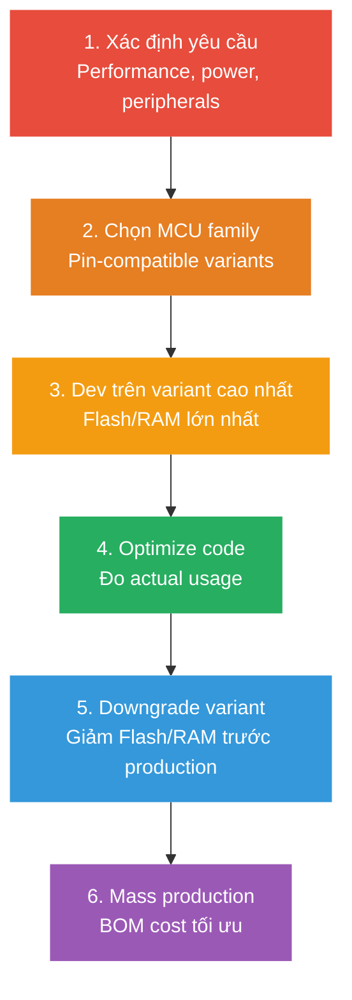
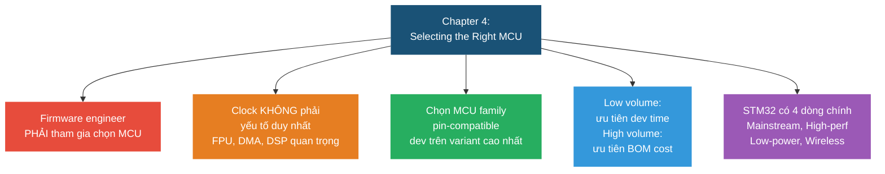

# Chapter 4: Selecting the Right MCU

> **Mục tiêu chương**: Cung cấp kiến thức cần thiết để firmware engineer tham gia vào quá trình chọn MCU — tránh redesign phần cứng và delay dự án.

> [!NOTE]
> Chương này tập trung vào **ARM Cortex-M** (cụ thể là **STM32**) — nhưng phần lớn kiến thức áp dụng được cho mọi MCU.

---

## 1. Tại sao firmware engineer cần biết chọn MCU?

### 1.1 Firmware ≠ Software thông thường

Firmware chạy trên hệ thống **resource-constrained** — khác hoàn toàn với software trên PC:

| | Software (PC) | Firmware (MCU) |
|---|---|---|
| **RAM** | GB+ (gần như vô hạn) | KB → vài MB |
| **Flash** | TB | KB → vài MB |
| **CPU** | GHz, multi-core | MHz, thường 1 core |
| **OS** | Linux/Windows (full OS) | RTOS hoặc bare-metal |
| **Gần hardware** | Rất xa (qua nhiều abstraction layer) | Rất gần (trực tiếp đọc/ghi register) |

Firmware engineer phải hiểu hardware để đưa ra quyết định **sớm** trong quá trình thiết kế — không thể chờ hardware team "ném" board qua rồi mới bắt đầu.

### 1.2 Anti-pattern: "Throw over the wall"

Khi hardware team thiết kế xong board rồi mới đưa cho firmware team → phát hiện MCU **thiếu peripheral**, **thiếu RAM**, hoặc **pin mapping sai** → 2 lựa chọn tệ:

1. **Redesign board** → tốn tiền + delay vài tháng
2. **"Fix it in code"** → workaround bằng software → code xấu, khó maintain, performance kém

> [!WARNING]
> **Từ sách**: Firmware engineer PHẢI được tham gia chọn MCU từ đầu. Dù chỉ ở mức "Hey Ted, nghĩ sao về con micro này?" — vẫn cần đủ kiến thức để đưa ra ý kiến có giá trị.

---

## 2. Các yếu tố khi chọn MCU

### 2.1 Kích thước vật lý & IC Packaging

| Package | Hình dạng | Hàn tay được? | Khi nào dùng |
|---------|-----------|--------------|-------------|
| **QFP** (Quad Flat Pack) | Chân gull-wing nhô ra 4 cạnh | ✅ Dễ nhất | Prototype, sản phẩm thông thường |
| **QFN** (Quad Flat No-lead) | Pad bên dưới, không chân nhô | ✅ Được (cần kỹ thuật) | Kích thước nhỏ hơn QFP |
| **BGA** (Ball Grid Array) | Bi hàn dưới chip | ❌ Cần máy | Mật độ cao, sản xuất lớn |
| **COB** (Chip-on-Board) | Die trần, wire bonding | ❌ Nhà máy | Wearable, thiết bị siêu nhỏ |

> [!TIP]
> Prototype → chọn **QFP**. Sản xuất số lượng lớn, cần nhỏ → chuyển sang **QFN** hoặc **BGA**.

### 2.2 Flash (ROM) — Bộ nhớ chương trình

Flash chứa code firmware. Giá MCU **tỷ lệ thuận** với dung lượng Flash.

**Chiến lược khi chưa biết cần bao nhiêu Flash (từ sách):**

1. Chọn MCU family có nhiều variant **pin-compatible** với Flash khác nhau
2. Phát triển trên variant **Flash lớn nhất** → thoải mái code
3. Khi code xong, biết chính xác size → chuyển sang variant **Flash nhỏ hơn** trước khi sản xuất → giảm BOM cost

**Lưu ý quan trọng:**

- Để dư Flash cho **OTA update** (firmware update qua mạng) — cần đủ chỗ cho cả firmware cũ + mới
- **Pin-compatible ≠ firmware-compatible** — cùng footprint nhưng peripheral mapping có thể khác
- Code 32-bit **lớn hơn** code 8-bit cho cùng logic
- Third-party library (TCP/IP stack, USB stack, RTOS...) tốn **rất nhiều** Flash

### 2.3 RAM — Bộ nhớ dữ liệu

RAM cần nhiều khi:

| Tình huống | RAM cần |
|-----------|---------|
| TCP/IP network stack | 10-50 KB+ |
| GUI frame buffer (LCD 320x240 RGB565) | ~150 KB |
| Audio processing buffer | 10-20 KB |
| MicroPython / Lua interpreter | 50-100 KB+ |
| Mỗi FreeRTOS task stack | Tối thiểu **~512 bytes** (ARM Cortex-M) |

**Internal RAM vs External RAM:**

| | Internal RAM | External RAM (SDRAM) |
|---|---|---|
| **Tốc độ** | Nhanh nhất (0 wait state) | Chậm hơn (bus latency) |
| **Kích thước** | Giới hạn (vài KB → 1MB) | Lớn (MB → GB) |
| **PCB** | Không cần thêm chip | Cần thêm chip + routing phức tạp |
| **Chi phí** | Bao gồm trong MCU | Tăng BOM + PCB cost |
| **Vấn đề** | Không | EMI, cache coherency, linker script phức tạp |

> [!NOTE]
> **Từ sách**: External RAM chỉ dùng khi thật sự cần — GUI frame buffer lớn, DSP processing, full firmware image caching cho OTA.

### 2.4 CPU Clock Rate

Clock cao hơn → code chạy nhanh hơn. Nhưng **clock không phải tất cả**:

- **FPU** (Floating Point Unit) tăng tốc phép tính float **hàng chục lần** so với software emulation
- **DSP instructions** tăng tốc xử lý tín hiệu
- **DMA** truyền data mà **không cần CPU**
- **Cache** (L1 trên Cortex-M7) giảm latency truy cập Flash

**Lưu ý**: Clock tối đa không phải lúc nào cũng dùng được. Ví dụ: USB cần **chính xác 48 MHz** — nếu clock tree không chia được 48 MHz từ max clock → phải giảm core clock.

### 2.5 Interrupt Processing

ARM Cortex-M sử dụng **NVIC** (Nested Vectored Interrupt Controller):

- Vector table có thể relocate (đặt ở RAM hoặc Flash)
- Priority có thể cấu hình cho từng interrupt
- **EXTI** (External Interrupt Controller) — map GPIO pin vào interrupt line

Sự khác biệt giữa các MCU: số lượng interrupt line, peripheral nào map vào NVIC, multiplexing scheme trên EXTI.

### 2.6 Giá vs Số lượng sản xuất

| Sản lượng | Ưu tiên | Lý do |
|-----------|---------|-------|
| **Cao** (>10K units) | **BOM cost** thấp nhất | Tiết kiệm $0.50/unit × 100K = $50K |
| **Thấp** (<1K units) | **Thời gian phát triển** ngắn nhất | Tiết kiệm 2 tháng dev time > tiết kiệm $5/unit |

> [!IMPORTANT]
> **Từ sách**: Sản lượng thấp → đừng tiết kiệm vài đô trên BOM mà tốn thêm vài tháng engineering. Chọn MCU mạnh hơn, dev nhanh hơn, ra thị trường sớm hơn → ROI tốt hơn.

### 2.7 Availability & Lifecycle

| Loại sản phẩm | Lifecycle | Yêu cầu |
|---------------|----------|---------|
| **Consumer** (điện thoại, đồ chơi) | 1-2 năm | Availability ngắn hạn OK |
| **Industrial / Telecom** | 5-10+ năm | Vendor phải **cam kết** supply dài hạn |
| **Aerospace / Medical** | 10-20+ năm | Cần audit vendor, có backup plan |

---

## 3. Hardware Peripherals quan trọng

### 3.1 Tổng quan Peripherals

### 3.2 Các Peripheral chi tiết

#### MPU (Memory Protection Unit)

```mermaid
graph TD
    MCU["MCU Peripherals"] --> COMM["Communication"]
    MCU --> SECURITY["Security"]
    MCU --> ANALOG["Analog"]
    MCU --> TIMING["Timing"]
    MCU --> MEMORY["Memory"]
    MCU --> DISPLAY["Display"]
    MCU --> SPECIAL["Special"]

    COMM --> C1["I2C, SPI, UART"]
    COMM --> C2["CAN, LIN"]
    COMM --> C3["Ethernet, USB"]
    COMM --> C4["WiFi, BLE"]

    SECURITY --> S1["Hardware Crypto<br/>AES/RSA/Hash"]
    SECURITY --> S2["MPU"]
    SECURITY --> S3["TrustZone"]

    ANALOG --> A1["ADC, DAC"]
    ANALOG --> A2["Comparator"]
    ANALOG --> A3["Op-Amp (PSoC)"]

    TIMING --> T1["Input Capture"]
    TIMING --> T2["Output Compare"]
    TIMING --> T3["PWM"]
    TIMING --> T4["QEI"]

    style MCU fill:#1a5276,color:#fff,stroke:none
    style COMM fill:#e67e22,color:#fff,stroke:none
    style SECURITY fill:#e74c3c,color:#fff,stroke:none
    style ANALOG fill:#27ae60,color:#fff,stroke:none
    style TIMING fill:#9b59b6,color:#fff,stroke:none
    style MEMORY fill:#3498db,color:#fff,stroke:none
    style DISPLAY fill:#1abc9c,color:#fff,stroke:none
    style SPECIAL fill:#f39c12,color:#fff,stroke:none
```

Giới hạn vùng memory mà từng task được phép truy cập. Nếu task vi phạm → **HardFault** → RTOS có thể kill task mà không crash cả hệ thống. FreeRTOS hỗ trợ trực tiếp MPU.

#### FPU (Floating Point Unit)

| Core | FPU |
|------|-----|
| Cortex-M0/M0+ | ❌ Không có |
| Cortex-M3 | ❌ Không có |
| Cortex-M4 | ✅ Single-precision (32-bit) — tùy variant |
| Cortex-M7 | ✅ Double-precision (64-bit) — tùy variant |

Không có FPU → phép tính float phải **software emulation** → chậm 10-50x.

#### DSP (Digital Signal Processing)

Cortex-M4 và M7 có hardware DSP instructions: MAC (Multiply-Accumulate), SIMD. Tăng tốc lọc tín hiệu, FFT, audio processing.

#### DMA (Direct Memory Access)

Truyền data giữa RAM ↔ peripheral **không cần CPU**. CPU setup 1 lần → DMA tự chạy → interrupt khi xong. Giảm tải CPU, giảm context switch.

> [!WARNING]
> Không phải mọi DMA channel đều map được tới mọi peripheral. Cần check DMA request mapping table trong datasheet.

#### Communication Interfaces

| Interface | Tốc độ | Dây | Use case |
|-----------|--------|-----|----------|
| **I2C** | ~400 KHz (Fast) | 2 (SDA, SCL) | Sensor, EEPROM |
| **SPI** | ~50 MHz | 4 (MOSI, MISO, SCK, CS) | Flash, LCD, ADC tốc độ cao |
| **UART** | ~115.2 Kbps thường | 2 (TX, RX) | Debug, GPS, modem |
| **CAN** | 1 Mbps | 2 (CANH, CANL) | Automotive, industrial |
| **USB** | 12 Mbps (FS) / 480 Mbps (HS) | 2 (D+, D-) | PC connection, mass storage |

#### Timer Hardware

| Chức năng | Giải thích | Ví dụ |
|-----------|-----------|-------|
| **Input Capture** | Đo thời gian giữa 2 edge bằng hardware counter | Đo tần số tín hiệu, đo pulse width |
| **Output Compare** | Xuất tín hiệu tại thời điểm chính xác | Tạo waveform, timing event |
| **PWM** | Điều khiển duty cycle | Motor speed, LED dimming, power control |
| **QEI** | Đọc encoder quay motor | Đo vị trí, tốc độ motor — zero CPU overhead |

#### RTC (Real-Time Clock)

Hardware calendar chạy bằng thạch anh **32.768 KHz** + pin backup (CR2032). Giữ thời gian khi MCU tắt. Có battery-backed RAM nhỏ để lưu data quan trọng.

---

## 4. Power Consumption & Energy Efficiency

### 4.1 Kỹ thuật giảm power

- **Clock-gating**: Tắt clock peripheral không dùng → tiết kiệm đáng kể
- **Disable unused clocks**: Không bật clock cho module không cần
- **Tránh floating CMOS pin**: Pin CMOS không kết nối → dao động → tốn dòng. Phải pull-up/pull-down hoặc set output low

**Metric**: **µA/MHz** — dòng tiêu thụ trên mỗi MHz clock. Càng thấp càng tốt.

### 4.2 Sleep Modes

| Yếu tố | Sleep nông | Sleep sâu |
|--------|-----------|----------|
| **Dòng tiêu thụ** | Cao hơn | Cực thấp (µA) |
| **Giữ RAM** | ✅ Toàn bộ | Một phần hoặc mất |
| **Peripheral active** | Một số | Rất ít |
| **Wake-up source** | Nhiều | Giới hạn |
| **Wake-up time** | Nhanh (µs) | Chậm (ms) |

> [!TIP]
> **Từ sách**: MCU có sleep current cực thấp nhưng wake-up time lâu → nếu wake-up thường xuyên → tổng năng lượng có thể **cao hơn** MCU có sleep current hơi cao nhưng wake-up nhanh.

### 4.3 Supply Voltage & Frequency

- Voltage thấp hơn → dòng thấp hơn → tiết kiệm năng lượng
- Nhưng: voltage thấp → **max clock giảm** (không chạy được tần số cao nhất)
- Trade-off: giảm voltage để tiết kiệm pin vs giảm performance

---

## 5. STM32 Product Line

### 5.1 Tổng quan các dòng STM32

### 5.2 Chi tiết từng dòng

#### Mainstream — Chi phí thấp, đa dụng

```mermaid
graph TD
    STM32["STM32 Portfolio"] --> MS["Mainstream<br/>Chi phí thấp, đa dụng"]
    STM32 --> HP["High Performance<br/>Xử lý nặng, tốc độ cao"]
    STM32 --> LP["Low Power<br/>Tiết kiệm năng lượng"]
    STM32 --> WL["Wireless<br/>BLE, WiFi tích hợp"]
    STM32 --> MP["Microprocessor<br/>Linux + RTOS"]

    MS --> F0["F0/G0: Cortex-M0/M0+<br/>Entry-level"]
    MS --> F1["F1: Cortex-M3<br/>Legacy mainstream"]
    MS --> F3["F3: Cortex-M4<br/>Rich analog"]
    MS --> G4["G4: Cortex-M4+<br/>Best analog"]

    HP --> F2["F2: Cortex-M3<br/>Cost vs perf"]
    HP --> F4["F4: Cortex-M4<br/>180MHz, FPU, DSP"]
    HP --> F7["F7: Cortex-M7<br/>216MHz, 64-bit FPU"]
    HP --> H7["H7: Cortex-M7<br/>480MHz, Dual-core"]

    LP --> L0["L0: Cortex-M0+<br/>Ultra-low power"]
    LP --> L4["L4/L4+: Cortex-M4<br/>Performance + low power"]
    LP --> L5["L5: Cortex-M33<br/>TrustZone security"]

    WL --> WB["WB: M4 + M0+<br/>BLE stack on M0+"]

    MP --> MP1["MP1: Dual A7 + M4<br/>Linux + RTOS"]

    style STM32 fill:#1a5276,color:#fff,stroke:none
    style MS fill:#e67e22,color:#fff,stroke:none
    style HP fill:#e74c3c,color:#fff,stroke:none
    style LP fill:#27ae60,color:#fff,stroke:none
    style WL fill:#3498db,color:#fff,stroke:none
    style MP fill:#9b59b6,color:#fff,stroke:none
```

| Dòng | Core | Đặc điểm nổi bật |
|------|------|------------------|
| **F0 / G0** | Cortex-M0/M0+ | Entry-level, giá rẻ nhất, tính năng cơ bản |
| **F1** | Cortex-M3 | Dòng đầu tiên (2007), cân bằng cost/performance, đang cũ dần |
| **F3** | Cortex-M4 | Tích hợp analog mạnh: 16-bit Sigma-Delta ADC (~14-bit ENOB) |
| **G4** | Cortex-M4+ | Analog tốt nhất: PGA op-amp, DAC, fast ADC, comparator |

#### High Performance — Xử lý nặng

| Dòng | Core | Clock | FPU | Đặc điểm |
|------|------|-------|-----|----------|
| **F2** | Cortex-M3 | 120 MHz | ❌ | Camera interface, USB OTG |
| **F4** | Cortex-M4 | 180 MHz | 32-bit | DSP, Chrom-ART graphics, FMC |
| **F7** | Cortex-M7 | 216 MHz | 64-bit | L1 cache, extended DSP |
| **H7** | Cortex-M7 (+M4) | 480 MHz | 64-bit | Dual-core option, hiệu năng cao nhất |

#### Low Power — Tiết kiệm năng lượng

| Dòng | Core | Đặc điểm |
|------|------|----------|
| **L0** | Cortex-M0+ | Ultra-low power, ít RAM/Flash nhất |
| **L1** | Cortex-M3 | ROM lớn hơn L0, power hơi cao hơn |
| **L4/L4+** | Cortex-M4 | Hiệu năng cao + low power. L4+ nhanh hơn, Flash lớn hơn |
| **L5** | Cortex-M33 | ARMv8, tích hợp **TrustZone** security |

#### Wireless & Microprocessor

- **STM32WB**: Dual-core (M4 chạy app + M0+ chạy BLE stack). Có hardware crypto, touch, RNG. Cần chứng nhận FCC
- **STM32MP1**: Dual Cortex-A7 (650 MHz, chạy **Linux**) + Cortex-M4 (209 MHz, chạy **RTOS**). Cần external DDR RAM, PCB phức tạp

---

## 6. Development Board — Chọn board phát triển

### 6.1 Chức năng của Dev Board

1. **Power regulation** — cấp nguồn ổn định cho MCU
2. **Debugger** — giao tiếp debug/program (ST-Link, J-Link)
3. **Breakout headers** — đưa pin MCU ra ngoài để kết nối
4. **On-board peripherals** — LED, button, sensor, memory

### 6.2 So sánh 3 loại board

| Loại | Ưu điểm | Nhược điểm | Giá | Ví dụ |
|------|---------|-----------|-----|-------|
| **Platform** (Arduino, mBed) | Rapid prototype, software abstraction cao | Giấu hardware capabilities, overhead | Thấp-TB | Arduino Uno, mBed |
| **Eval Kit** (Full board) | Showcase 100% tính năng MCU, example code phong phú | Đắt, footprint không chuẩn | $100-500+ | STM32 Eval Board |
| **Low-cost Demo** (Nucleo, Freedom) | Rẻ, đủ dùng, header chuẩn Arduino | Ít peripheral on-board | < $50 | ST Nucleo, NXP Freedom |

### 6.3 Sách chọn board nào?

**NUCLEO-F767ZI** — lý do:

| Tiêu chí | NUCLEO-F767ZI |
|----------|---------------|
| **Core** | Cortex-M7 (hiệu năng cao) |
| **MPU** | ✅ Có (cần cho Chapter 15) |
| **User LED** | 3 LEDs (đủ hiển thị trạng thái) |
| **Ethernet** | ✅ On-board (cho networked RTOS project) |
| **Debugger** | ST-Link (có thể flash thành J-Link) |
| **Giá** | < $50 ✅ |
| **Header** | Arduino Uno v3 compatible |

> [!NOTE]
> Board multi-core (STM32H7 Discovery, MP1 Discovery) bị loại vì giá ~$80 — vượt budget $50.

### 6.4 So sánh các Nucleo board

| Board | Form Factor | Core | LEDs | USB | Ethernet | J-Link |
|-------|------------|------|------|-----|----------|--------|
| NUCLEO-L432KC | Nucleo32 | M4 | 1 | User USB | ❌ | ❌ |
| NUCLEO-F401RE | Nucleo64 | M4 | 1 | Via re-enum | ❌ | ✅ |
| NUCLEO-L4R5ZI | Nucleo144 | M4 | 3 | USB OTG | ❌ | ✅ |
| **NUCLEO-F767ZI** | **Nucleo144** | **M7** | **3** | **USB** | **✅** | **✅** |

---

## 7. Chiến lược chọn MCU thực tế

### 7.1 Quy trình chọn MCU

### 7.2 Công cụ tìm MCU

Dùng **Parametric Search** trên website nhà phân phối (DigiKey, Mouser):

- ✅ So sánh đa vendor, kiểm tra tồn kho real-time, giá unit nhỏ
- ❌ Giới hạn bởi stock của distributor, có thể sai catalog data

### 7.3 Checklist chọn MCU

**Must-have (bắt buộc):**

- [ ] Đủ Flash cho firmware + OTA headroom
- [ ] Đủ RAM cho tất cả task stack + data buffer
- [ ] Peripheral cần thiết (UART, SPI, I2C, ADC, Timer, DMA...)
- [ ] Tốc độ CPU đủ cho real-time requirement
- [ ] Package có thể hàn/prototype được
- [ ] Vendor supply đảm bảo cho lifecycle sản phẩm

**Nice-to-have (tốt nếu có):**

- [ ] FPU (nếu dùng float)
- [ ] MPU (bảo vệ memory cho RTOS)
- [ ] DMA (giảm tải CPU)
- [ ] Hardware crypto (nếu cần security)
- [ ] Pin-compatible với variant khác (scale up/down)
- [ ] Dev board giá rẻ có sẵn

---

## 📌 Tóm tắt chương (Key Takeaways)

---

## ❓ Câu hỏi ôn tập

1. **Tại sao firmware engineer cần hiểu về MCU?**
   > → Để đưa ra trade-off sớm, tránh hardware design lỗi, không phải "fix it in code".

2. **Clock speed là yếu tố duy nhất quyết định performance: Đúng/Sai?**
   > → **Sai** — FPU, DSP, DMA, cache đều ảnh hưởng lớn đến performance.

3. **Hardware pieces bên trong MCU gọi chung là gì?**
   > → **Hardware Peripherals**.

4. **Khi thiết kế low-power, 2 yếu tố quan trọng nhất là gì?**
   > → Sleep current (µA) và **wake-up time** (thời gian từ sleep → active).

5. **Tại sao sách chọn board giá rẻ?**
   > → Để nhiều người có thể tiếp cận, không cần thiết bị đắt tiền để học.
