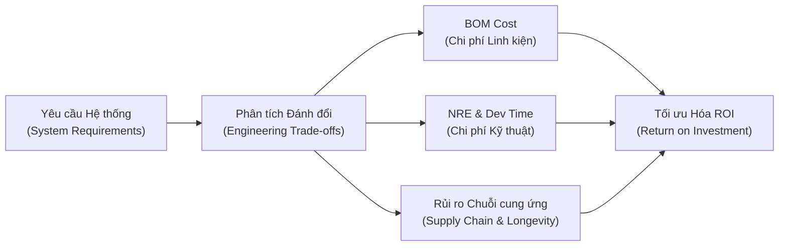
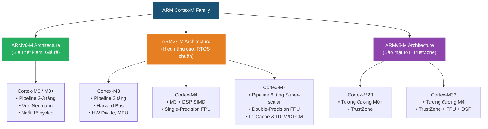
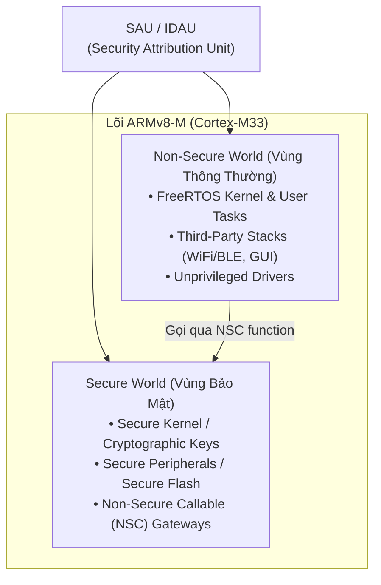
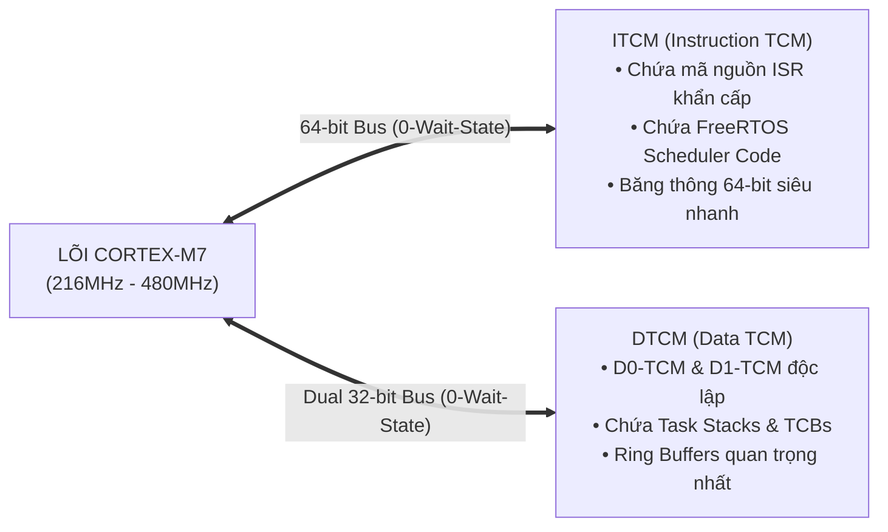
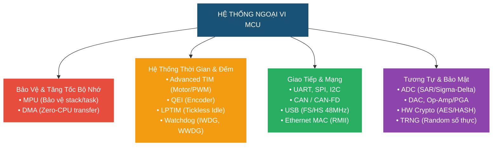
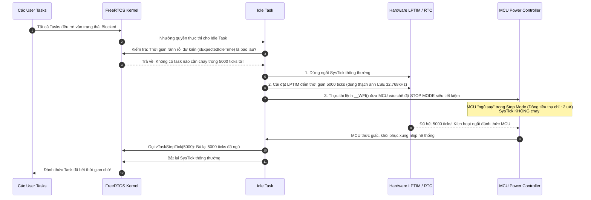
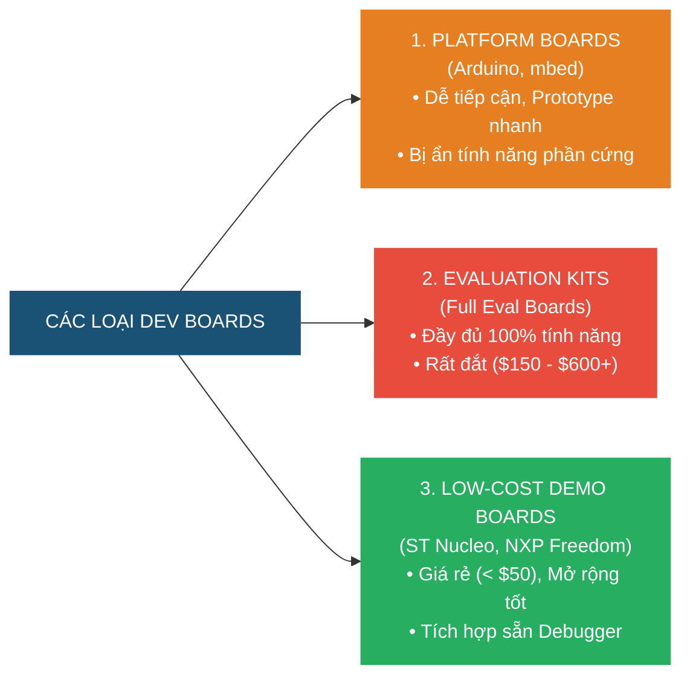
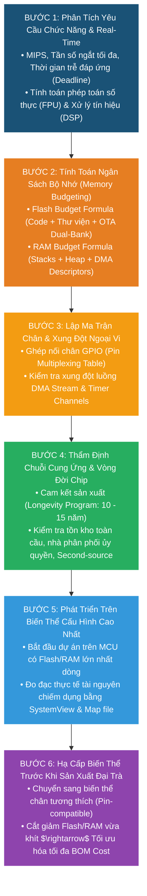

# <span style="color:#f1c40f">Chương 08: Lựa Chọn Vi Điều Khiển Phù Hợp Cho Hệ Thống RTOS (Selecting the Right MCU)</span>

> **Tài liệu tham khảo chuyên sâu kết hợp:**
> - 📘 *Hands-On RTOS with Microcontrollers* – Brian Amos (Chapter 4: *Selecting the Right MCU*, tr. 83–114; ST AN4839 L1 Cache Architecture).
> - 📗 *Mastering the FreeRTOS Real Time Kernel* – Richard Barry (Hardware Architecture Considerations, MPU Isolation, Context Switching Overhead, Tickless Idle Support).
> - 📙 *STMicroelectronics Architecture Manuals & Application Notes* (PM0253 STM32F7/H7 Cortex-M7 Programming Manual, AN4839 Level 1 Cache on STM32F7, AN4031 Using STM32 DMA Controllers).

---

## <span style="color:#e67e22">1. Tầm Quan Trọng Của Việc Lựa Chọn MCU Đối Với Firmware Engineer</span>

### <span style="color:#1abc9c">1.1 Bản Chất Khác Biệt: Firmware Engineering vs Desktop/Cloud Software</span>

Trong lĩnh vực phát triển phần mềm thông thường (Desktop, Web, Cloud), lập trình viên làm việc trên các hệ thống gần như vô hạn tài nguyên. Nếu ứng dụng chạy chậm hoặc tiêu tốn bộ nhớ, giải pháp thông thường là tăng cấu hình máy chủ, nâng cấp RAM hoặc gắn thêm CPU core. 

Ngược lại, **Firmware chạy trên các hệ thống nhúng bị giới hạn tài nguyên khắt khe (Resource-Constrained Systems)**. Mọi quyết định thiết kế phần cứng đều tạo ra ranh giới cứng (hard boundaries) mà mã nguồn không thể vượt qua:

| Tiêu Chí So Sánh | Ứng Dụng Desktop / Server | Firmware Vi Điều Khiển (MCU) | Tác Động Lên Kiến Trúc RTOS |
|---|---|---|---|
| **Dung lượng RAM** | Hàng chục GB đến Terabytes | Vài KB đến vài MB (thường 20KB – 512KB) | Phải tính toán chính xác kích thước stack cho từng task; chống phân mảnh heap. |
| **Bộ nhớ Flash (ROM)** | Vài trăm GB đến TB (SSD/NVMe) | Vài chục KB đến vài MB (thường 64KB – 2MB) | Kích thước code bị giới hạn; việc tích hợp thư viện bên thứ 3 (TCP/IP, GUI) phải cân nhắc kỹ. |
| **Tần số CPU** | 2.5 GHz – 5.0 GHz (Multi-core) | 16 MHz – 480 MHz (Đa phần Single-core) | Chu kỳ lệnh quý giá; context switch và xử lý ngắt phải tối ưu ở mức microsecond. |
| **Hệ Điều Hành** | Windows / Linux (Full Virtual Memory, MMU) | RTOS (FreeRTOS, Zephyr) hoặc Bare-metal | Không có bộ nhớ ảo; con trỏ truy cập trực tiếp địa chỉ vật lý; lỗi bộ nhớ gây sập toàn hệ thống. |
| **Khoảng cách Hardware** | Rất xa (trừu tượng hóa qua Kernel, Driver, POSIX) | Rất gần (đọc/ghi trực tiếp thanh ghi ngoại vi - Peripheral Registers) | Lập trình viên phải hiểu chi tiết clock tree, DMA bus matrix, và điện áp hoạt động. |
| **Tính thời gian thực** | Soft Real-time hoặc Best-effort | Hard Real-time hoặc Strict Determinism | Deadline bị trễ đồng nghĩa với lỗi hệ thống, hỏng hóc cơ khí hoặc nguy hiểm tính mạng. |

Senior Firmware Engineer không thể đóng vai trò là người lập trình thuần túy ("pure coder") đứng ngoài quyết định phần cứng. Bạn phải có khả năng đánh giá tác động của phần cứng lên hiệu năng phần mềm ngay từ giai đoạn ý tưởng (concept phase).

---

### <span style="color:#1abc9c">1.2 Cạm Bẫy Thiết Kế: Anti-Pattern "Throw It Over The Wall"</span>

Một trong những sai lầm phổ biến nhất trong các công ty kỹ thuật thiếu quy trình phối hợp là quy trình tách biệt: **Hardware Engineering Team thiết kế và sản xuất board mạch xong xuôi, rồi "ném qua bức tường" (throw over the wall) cho Firmware Team lập trình**.

```
[ Hardware Team ]  -- (Thiết kế schematic, chọn MCU, layout PCB) --> [ BỨC TƯỜNG ]
                                                                             │
                                                                             ▼ (Ném board qua)
[ Firmware Team ]  <-- (Nhận board, phát hiện lỗi kiến trúc phần cứng) <────┘
        │
        ├── Kịch bản 1: Redesign Phần Cứng (Tốn hàng chục ngàn USD, delay 3-6 tháng)
        └── Kịch bản 2: "Fix It In Software" (Code chắp vá, quá tải CPU, sản phẩm lỗi)
```

Khi nhận board mạch đã hoàn thiện phần cứng, Firmware Team thường phát hiện ra các vấn đề nghiêm trọng:
1. **Thiếu DMA Stream hoặc Xung Đột Kênh DMA**: Ví dụ cả SPI Flash và UART Debug cùng yêu cầu DMA1 Stream 3 Channel 0 $\rightarrow$ không thể chạy DMA đồng thời.
2. **Xung đột Clock Tree**: MCU chỉ có 1 PLL chính, không thể chia clock đồng thời ra 48 MHz chuẩn cho USB FS và xung nhịp tối đa cho CPU/Timer.
3. **Tràn dung lượng RAM**: RAM nội quá nhỏ, không đủ cấp phát stack cho 10 FreeRTOS tasks và bộ đệm TCP/IP frame buffer.
4. **Xung đột chân ngoại vi (Pin Multiplexing)**: Chân EXTI của nút bấm khẩn cấp bị trùng ngắt với chân ngắt của cảm biến IMU.

Khi đối mặt với thực trạng này, dự án chỉ còn hai lựa chọn cực kỳ tồi tệ:

> [!CAUTION]
> **Hai Hậu Quả Tai Hại Khi Firmware Team Không Tham Gia Chọn MCU:**
> 1. **Board Redesign (Làm lại phần cứng)**: Thiết kế lại schematic, chạy lại layout, đặt mạch in (PCB), hàn linh kiện mẫu và đo kiểm lại từ đầu. Quá trình này tiêu tốn từ vài ngàn đến hàng chục ngàn USD, đồng thời làm trễ hạn giao hàng (Time-to-Market) từ 8 đến 24 tuần.
> 2. **"Fix It In Software" (Vá lỗi bằng phần mềm)**: Ép firmware engineer phải "gánh" sai sót phần cứng: dùng software bit-banging thay cho phần cứng chuyên dụng, dùng polling thay cho DMA, viết các vòng lặp delay phức tạp. Hậu quả là mã nguồn trở nên rối rắm (spaghetti code), tải CPU chạm ngưỡng 100%, tiêu tốn pin khủng khiếp, và phát sinh hàng loạt lỗi ngẫu nhiên trong môi trường công nghiệp.

---

### <span style="color:#1abc9c">1.3 Tiếng Nói Của Senior Firmware Engineer Trong Ban Dự Án</span>

Để bảo vệ dự án khỏi các rủi ro chết người nêu trên, một Senior Embedded RTOS Engineer phải nắm vững ngôn ngữ và tư duy kinh tế kỹ thuật:


```mermaid
graph LR
    REQ["Yêu cầu Hệ thống<br/>(System Requirements)"] --> ENG["Phân tích Đánh đổi<br/>(Engineering Trade-offs)"]
    ENG --> BOM["BOM Cost<br/>(Chi phí Linh kiện)"]
    ENG --> NRE["NRE & Dev Time<br/>(Chi phí Kỹ thuật)"]
    ENG --> RISK["Rủi ro Chuỗi cung ứng<br/>(Supply Chain & Longevity)"]
    BOM --> ROI["Tối ưu Hóa ROI<br/>(Return on Investment)"]
    NRE --> ROI
    RISK --> ROI
```

- **BOM Cost (Bill of Materials Cost)**: Giá linh kiện sản xuất mỗi đơn vị sản phẩm.
- **NRE (Non-Recurring Engineering Cost)**: Chi phí nghiên cứu phát triển một lần (lương kỹ sư, công cụ debug, license phần mềm, đo kiểm EMC/FCC).
- **Time-to-Market**: Thời gian từ khi bắt đầu dự án đến khi sản phẩm có mặt trên thị trường để đem lại doanh thu.
- **Quy tắc vàng về Sản Lượng (Amos Rule of Volume)**:
  - *Sản lượng thấp (< 1.000 sản phẩm/năm)*: Tiết kiệm $3–$5 trên mỗi chip MCU không bù đắp được việc phải mất thêm 3 tháng công sức kỹ sư để tối ưu bộ nhớ. Hãy chọn MCU cấu hình dư dả (RAM/Flash lớn, xung cao, debug thuận tiện) để đưa sản phẩm ra thị trường nhanh nhất.
  - *Sản lượng lớn (> 100.000 sản phẩm/năm)*: Tiết kiệm $0.50 trên mỗi MCU giúp doanh nghiệp tiết kiệm $50.000 lợi nhuận thuần. Lúc này, việc dành 2 tháng để tối ưu hóa code và ép vừa vào vi điều khiển giá rẻ là hoàn toàn xứng đáng.

---

## <span style="color:#e67e22">2. Khảo Sát Kiến Trúc Lõi Xử Lý (Processor Core Deep Dive: ARM Cortex-M)</span>

### <span style="color:#1abc9c">2.1 Phân Tích So Sánh Các Kiến Trúc Lõi ARM Cortex-M</span>

Dòng vi điều khiển hiện đại chiếm lĩnh thị trường hệ thống nhúng và RTOS là dòng ARM Cortex-M. Mỗi biến thể lõi (core) được thiết kế cho một mục đích chuyên biệt về hiệu năng, giá thành và điện năng:


```mermaid
graph TD
    CM["ARM Cortex-M Family"] --> V6["ARMv6-M Architecture<br/>(Siêu tiết kiệm, Giá rẻ)"]
    CM --> V7["ARMv7-M Architecture<br/>(Hiệu năng cao, RTOS chuẩn)"]
    CM --> V8["ARMv8-M Architecture<br/>(Bảo mật IoT, TrustZone)"]

    V6 --> M0["Cortex-M0 / M0+<br/>• Pipeline 2-3 tầng<br/>• Von Neumann<br/>• Ngắt 15 cycles"]
    
    V7 --> M3["Cortex-M3<br/>• Pipeline 3 tầng<br/>• Harvard Bus<br/>• HW Divide, MPU"]
    V7 --> M4["Cortex-M4<br/>• M3 + DSP SIMD<br/>• Single-Precision FPU"]
    V7 --> M7["Cortex-M7<br/>• Pipeline 6 tầng Super-scalar<br/>• Double-Precision FPU<br/>• L1 Cache & ITCM/DTCM"]

    V8 --> M23["Cortex-M23<br/>• Tương đương M0+<br/>• TrustZone"]
    V8 --> M33["Cortex-M33<br/>• Tương đương M4<br/>• TrustZone + FPU + DSP"]

    style CM fill:#1a5276,color:#fff,stroke:none
    style V6 fill:#27ae60,color:#fff,stroke:none
    style V7 fill:#e67e22,color:#fff,stroke:none
    style V8 fill:#8e44ad,color:#fff,stroke:none
```

#### Bảng Ma Trận Kỹ Thuật So Sánh Chi Tiết Các Lõi ARM Cortex-M:

| Đặc Tính Kỹ Thuật | Cortex-M0 / M0+ | Cortex-M3 | Cortex-M4 | Cortex-M7 | Cortex-M33 |
|---|---|---|---|---|---|
| **Kiến trúc ISA** | ARMv6-M | ARMv7-M | ARMv7E-M | ARMv7E-M | ARMv8-M Mainline |
| **Pipeline Stages** | M0: 3 tầng; M0+: 2 tầng | 3 tầng (Branch speculation) | 3 tầng (Branch speculation) | 6 tầng (Dual-issue superscalar, Dynamic branch) | 3 tầng (Pipeline tối ưu hóa) |
| **Cấu trúc Bus** | Von Neumann (Unified bus 32-bit) | Harvard (I-Code, D-Code, System Bus riêng) | Harvard (I, D, S Bus riêng biệt) | AXI 64-bit Matrix + TCM Bus | Harvard + AHB5 Bus Matrix |
| **Tập lệnh hỗ trợ** | Thumb / Thumb-2 (56 lệnh cơ bản) | Toàn bộ Thumb-2 (16-bit & 32-bit) | Thumb-2 + DSP SIMD instructions | Thumb-2 + DSP SIMD nâng cao | Toàn bộ Thumb-2 + DSP + Security |
| **Phép chia phần cứng (HW Divide)** | ❌ Không có (Phần mềm) | ✅ Có (UDIV, SDIV: 2–12 chu kỳ) | ✅ Có (UDIV, SDIV: 2–12 chu kỳ) | ✅ Có (UDIV, SDIV: 2–12 chu kỳ) | ✅ Có (UDIV, SDIV) |
| **Bộ xử lý dấu phẩy động (FPU)** | ❌ Không có | ❌ Không có | ✅ Tùy chọn: Single Precision (FPv4-SP) | ✅ Tùy chọn: Single & Double Precision (FPv5-DP) | ✅ Tùy chọn: Single Precision (FPv5) |
| **Tập lệnh DSP & SIMD** | ❌ Không có | ❌ Không có | ✅ Có (Single-cycle MAC, SIMD 8/16-bit) | ✅ Có (Dual MAC, SIMD kép) | ✅ Có (DSP & SIMD) |
| **Độ trễ ngắt tối thiểu (Latency)** | M0: 16 chu kỳ; M0+: 15 chu kỳ | 12 chu kỳ CPU | 12 chu kỳ CPU | 12 chu kỳ CPU | 12 chu kỳ CPU |
| **Tính năng ngắt nâng cao** | Cơ bản | Tail-chaining, Late-arriving, Pop-preemption | Tail-chaining, Late-arriving, Pop-preemption | Tail-chaining, Late-arriving, Pop-preemption | Tail-chaining, Late-arriving, Pop-preemption |
| **Bộ bảo vệ bộ nhớ (MPU)** | M0: Không; M0+: Tùy chọn 8 vùng | Có (Tối đa 8 vùng, lũy thừa 2) | Có (Tối đa 8 vùng, lũy thừa 2) | Có (Tối đa 16 vùng, lũy thừa 2) | Có (Tùy chọn 4, 8, 16 vùng, Limit Address) |
| **Bộ đệm L1 Cache** | ❌ Không có | ❌ Không có | ❌ Không có | ✅ Có (I-Cache & D-Cache lên tới 64KB) | ❌ Thường không có |
| **Bộ nhớ TCM (Tightly Coupled)** | ❌ Không có | ❌ Không có | ❌ Không có | ✅ Có (ITCM 64-bit, DTCM 2x32-bit) | ✅ Tùy chọn |
| **Bảo mật phần cứng TrustZone** | ❌ Không có | ❌ Không có | ❌ Không có | ❌ Không có | ✅ Có (Phân chia Secure / Non-Secure) |
| **Hiệu năng CoreMark/MHz** | 2.33 CoreMark/MHz | 3.32 CoreMark/MHz | 3.40 CoreMark/MHz | 5.01 CoreMark/MHz | 4.09 CoreMark/MHz |

---

### <span style="color:#1abc9c">2.2 Bộ Xử Lý Dấu Phẩy Động (FPU - Floating Point Unit) & Tác Động RTOS</span>

Trong nhiều dự án nhúng (như xử lý cảm biến IMU, bộ điều khiển PID trong Robot, xử lý âm thanh kỹ thuật số, lọc Kalman), các phép toán số thực (`float`, `double`) xuất hiện thường xuyên. 

#### Sự Khác Biệt Giữa Software Emulation vs Hardware FPU:
1. **Software Emulation (Cortex-M0/M3 hoặc Cortex-M4 không bật FPU)**: Trình biên dịch (GCC/IAR/Keil) phải sinh ra hàng chục đến hàng trăm chỉ lệnh máy gọi vào thư viện phần mềm (như `__aeabi_fadd`, `__aeabi_fmul`, `__aeabi_fdiv`). Một phép chia số thực có thể ngốn từ **80 đến 250 chu kỳ CPU**.
2. **Hardware FPU (Cortex-M4/M7/M33)**: CPU sở hữu phần cứng ALU số thực riêng biệt và tập 32 thanh ghi 32-bit chuyên dụng (`s0` – `s31`, có thể ghép thành 16 thanh ghi 64-bit `d0` – `d15` trên Cortex-M7). Các lệnh như `VADD.F32`, `VMUL.F32` hoàn thành chỉ trong **1 chu kỳ máy**; lệnh `VDIV.F32` hoàn thành trong **14 chu kỳ**.

```
Hiệu năng tính toán toán học:
┌──────────────────────────────────────────────────────────────┐
│ Software Emulation (Cortex-M3):   ■■■■■■■■■■■■■■■■■■■■ 100% (Thời gian)
│ Hardware Single FPU (Cortex-M4): ■■ 5% - 10% (Nhanh hơn 10x - 20x)
└──────────────────────────────────────────────────────────────┘
```

#### Tác Động Của FPU Đến RTOS Context Switch (Cơ Chế Lazy Stacking):
Khi một task sử dụng FPU, ngoài 16 thanh ghi số nguyên chuẩn (Core Registers: `r0-r15, xPSR`), RTOS còn phải lưu thêm **16 hoặc 32 thanh ghi FPU cùng thanh ghi trạng thái FPSCR** (thêm ít nhất 72 đến 136 bytes vào stack của task!).

Nếu mọi lần chuyển đổi ngữ cảnh (Context Switch) đều phải lưu/khôi phục toàn bộ thanh ghi FPU, độ trễ RTOS sẽ tăng vọt:
- ARM Cortex-M tích hợp cơ chế phần cứng thông minh gọi là **Lazy Stacking (Lưu stack lười)**:
  - Khi ngắt xảy ra, phần cứng NVIC tự động cấp phát không gian trên stack cho các thanh ghi FPU (`s0-s15, FPSCR`) nhưng **chưa thực sự ghi giá trị vào bộ nhớ**, chỉ bật cờ `LSPACT` trong thanh ghi `FPCCR`.
  - Nếu ngắt ISR hoặc task mới **không thực thi bất kỳ lệnh FPU nào**, CPU hoàn toàn không tốn chu kỳ bus để lưu các thanh ghi này.
  - Chỉ khi có một lệnh FPU đầu tiên được kích hoạt trong ngữ cảnh mới, phần cứng mới thực sự xả (flush) các giá trị FPU cũ vào stack.

> [!IMPORTANT]
> **Quy Tắc Stack Kích Thước Cho Task Khi Bật FPU Trong FreeRTOS:**
> Khi cấu hình `configUSE_TASK_FPU_SUPPORT = 1` hoặc `2`, bất kỳ task nào thực hiện dù chỉ một phép tính số thực đơn giản, kích thước stack tối thiểu của task đó (`usStackDepth`) phải được tăng thêm ít nhất **34 words (136 bytes)** để chứa FPU Context. Nếu quên điều này, hiện tượng tràn stack (Stack Overflow) sẽ xuất hiện ngẫu nhiên khi context switch xảy ra!

---

### <span style="color:#1abc9c">2.3 Lệnh Xử Lý Tín Hiệu Số (DSP Instructions) và SIMD</span>

Trên các dòng Cortex-M4 và Cortex-M7, ARM trang bị phần mở rộng tập lệnh DSP chuyên dụng:
- **Lệnh SIMD (Single Instruction Multiple Data)**: Thực thi đồng thời 2 phép toán 16-bit hoặc 4 phép toán 8-bit trong một chu kỳ xung nhịp 32-bit đơn lẻ (ví dụ: cộng đồng thời 2 mẫu âm thanh 16-bit bằng lệnh `SADD16`).
- **Phép Nhân Cộng Tích Lũy (MAC - Multiply-Accumulate)**: Lệnh `SMLAD` thực hiện hai phép nhân số nguyên có dấu 16-bit và cộng dồn vào thanh ghi 32-bit chỉ trong **1 chu kỳ máy**. Đây là nền tảng cốt lõi của các thuật toán tích chập (Convolution), biến đổi Fourier nhanh (FFT), và bộ lọc FIR/IIR.
- **Toán Học Bão Hòa (Saturating Arithmetic)**: Lệnh `__QADD` và `__QSUB` tự động khóa giá trị ở ngưỡng cực đại hoặc cực tiểu (clamping) khi xảy ra tràn số (overflow), thay vì bị hiện tượng lật dấu (wrap-around) gây tiếng nổ (glitch) trong xử lý tín hiệu âm thanh hoặc làm mất ổn định hệ thống điều khiển phản hồi vòng kín.

---

### <span style="color:#1abc9c">2.4 Cơ Chế Bảo Mật Phần Cứng: ARMv8-M TrustZone (Cortex-M23/M33)</span>

Đối với các thiết bị IoT kết nối Internet yêu cầu bảo mật cao (Smart Home, Y tế, Công tơ điện thông minh), lõi Cortex-M23 và Cortex-M33 giới thiệu công nghệ **ARMv8-M TrustZone**:


```mermaid
graph TB
    subgraph CPU["Lõi ARMv8-M (Cortex-M33)"]
        direction TB
        SEC["Secure World (Vùng Bảo Mật)<br/>• Secure Kernel / Cryptographic Keys<br/>• Secure Peripherals / Secure Flash<br/>• Non-Secure Callable (NSC) Gateways"]
        NONSEC["Non-Secure World (Vùng Thông Thường)<br/>• FreeRTOS Kernel & User Tasks<br/>• Third-Party Stacks (WiFi/BLE, GUI)<br/>• Unprivileged Drivers"]
    end
    SAU["SAU / IDAU<br/>(Security Attribution Unit)"] --> SEC
    SAU --> NONSEC
    NONSEC -- "Gọi qua NSC function" --> SEC
```

1. **Phân tách phần cứng Secure và Non-Secure**: Hệ thống được chia đôi về mặt vật lý. Bộ nhớ Flash, RAM, ngắt và ngoại vi được gán nhãn Secure hoặc Non-Secure thông qua SAU (Security Attribution Unit).
2. **Cô lập mã nguồn rủi ro**: FreeRTOS và toàn bộ ứng dụng người dùng, giao tiếp mạng (TCP/IP stack, BLE stack vốn tiềm ẩn nhiều lỗ hổng bảo mật) chạy trong **Non-Secure World**.
3. **Bảo vệ tài sản tối mật**: Khóa mã hóa (private keys), chứng chỉ bảo mật (certificates), và thuật toán mã hóa (Crypto engine) được bảo vệ tuyệt đối trong **Secure World**. Kể cả khi hacker chiếm quyền điều khiển FreeRTOS ở Non-Secure World, họ cũng không thể truy cập trực tiếp vào vùng nhớ Secure.

---

## <span style="color:#e67e22">3. Phân Cấp Bộ Nhớ & Tính Quyết Định Của RTOS (Memory Hierarchy & Determinism)</span>

Trong một hệ thống thời gian thực (Real-Time System), **tính tất định (Determinism)** là yếu tố sống còn: một tác vụ phải hoàn thành trong khoảng thời gian có thể dự đoán được một cách chính xác. Tuy nhiên, kiến trúc bộ nhớ là rào cản lớn nhất đối với tính tất định nếu kỹ sư không hiểu rõ phân cấp bộ nhớ bên trong vi điều khiển.

```
                  ┌─────────────────────────────────────┐
                  │          LÕI CPU CORTEX-M           │
                  └───────┬──────────────┬──────────────┘
                          │              │
        ┌─────────────────┴─┐          ┌─┴─────────────────┐
        │  ITCM (64-bit)    │          │  DTCM (2x 32-bit) │  <-- 0 Wait States (Cực nhanh,
        │  (Instruction)    │          │  (Data / Stacks)  │      100% tất định, KHÔNG DMA)
        └───────────────────┘          └───────────────────┘
                          │              │
                  ┌───────┴──────────────┴──────────────┐
                  │         L1 CACHE (I & D)            │  <-- Nhanh nhưng không tất định
                  └───────────────┬─────────────────────┘      (Cache Miss, Coherency Hazard)
                                  │
      ════════════════════════════╪═════════════════════════════  AXI / AHB Multi-Layer Bus Matrix
                                  │
        ┌─────────────────────────┼─────────────────────────┐
        │                         │                         │
 ┌──────┴──────┐           ┌──────┴──────┐           ┌──────┴──────┐
 │ Flash ROM   │           │ SRAM1/2/3   │           │ FMC / QSPI  │
 │ (Wait State)│           │ (Bus Matrix)│           │ External RAM│
 └─────────────┘           └─────────────┘           └─────────────┘
```

---

### <span style="color:#1abc9c">3.1 Bộ Nhớ Chương Trình (Flash Memory) & Hiện Tượng Flash Wait States</span>

Bộ nhớ Flash chế tạo bằng công nghệ bán dẫn có tốc độ truy xuất vật lý giới hạn, thường nằm trong khoảng **20ns đến 35ns**. 
- Nếu CPU hoạt động ở tần số thấp ($\le 30 \text{ MHz}$), Flash có thể đáp ứng dữ liệu ngay trong 1 chu kỳ xung nhịp (**0 Wait State**).
- Nhưng khi xung nhịp CPU được đẩy lên cao ($168 \text{ MHz}$, $216 \text{ MHz}$ hay $480 \text{ MHz}$), chu kỳ xung nhịp CPU chỉ còn **2ns đến 5ns** $\rightarrow$ Flash **không thể theo kịp tốc độ của CPU**.

Để CPU không đọc phải dữ liệu rác, bộ điều khiển Flash (Flash Memory Controller) buộc phải chèn thêm các chu kỳ chờ (**Flash Latency / Wait States - WS**).

#### Bảng Tra Cứu Flash Wait States Theo Tần Số Trên STM32F7 (Điện áp $2.7\text{V} - 3.6\text{V}$):

| Tần Số Xung Nhịp CPU ($f_{HCLK}$) | Số Chu Kỳ Chờ (Flash Latency) | Số Chu Kỳ Để CPU Đọc 1 Lệnh | Tác Động Lên Thực Thi Lệnh |
|---|---|---|---|
| **$0 < f_{HCLK} \le 30 \text{ MHz}$** | **0 WS** (`FLASH_LATENCY_0`) | 1 chu kỳ | Tối ưu 100%, không bị trễ bus |
| **$30 < f_{HCLK} \le 60 \text{ MHz}$** | **1 WS** (`FLASH_LATENCY_1`) | 2 chu kỳ | CPU phải chờ 1 chu kỳ |
| **$60 < f_{HCLK} \le 90 \text{ MHz}$** | **2 WS** (`FLASH_LATENCY_2`) | 3 chu kỳ | CPU phải chờ 2 chu kỳ |
| **$90 < f_{HCLK} \le 120 \text{ MHz}$** | **3 WS** (`FLASH_LATENCY_3`) | 4 chu kỳ | CPU phải chờ 3 chu kỳ |
| **$120 < f_{HCLK} \le 150 \text{ MHz}$** | **4 WS** (`FLASH_LATENCY_4`) | 5 chu kỳ | CPU phải chờ 4 chu kỳ |
| **$150 < f_{HCLK} \le 180 \text{ MHz}$** | **5 WS** (`FLASH_LATENCY_5`) | 6 chu kỳ | CPU phải chờ 5 chu kỳ |
| **$180 < f_{HCLK} \le 210 \text{ MHz}$** | **6 WS** (`FLASH_LATENCY_6`) | 7 chu kỳ | CPU phải chờ 6 chu kỳ |
| **$210 < f_{HCLK} \le 216 \text{ MHz}$** | **7 WS** (`FLASH_LATENCY_7`) | 8 chu kỳ | CPU bị nghẽn nghiêm trọng nếu không có Cache |

> [!WARNING]
> **Nghịch Lý Xung Nhịp (The Clock Frequency Paradox):**
> Nếu bạn tăng xung nhịp CPU từ 30 MHz lên 216 MHz (gấp 7.2 lần) mà không có cơ chế tăng tốc phần cứng, tốc độ thực thi code thực tế chỉ tăng khoảng 2 đến 3 lần vì CPU dành phần lớn thời gian để **chờ Flash nạp lệnh (Stall Cycles)**!

#### Giải Pháp Của Nhà Sản Xuất: Bộ Tăng Tốc Phần Cứng ART Accelerator™
Để giải quyết nghịch lý này, STMicroelectronics phát minh ra **ART Accelerator™ (Adaptive Real-Time Accelerator)**:
1. **Bộ đệm tìm nạp trước (Instruction Prefetch Buffer)**: Bus kết nối giữa ART Accelerator và Flash có độ rộng lên đến **128 bits**. Trong một lần truy cập Flash duy nhất (tốn 7 WS), ART nạp đồng thời 4 lệnh 32-bit (hoặc 8 lệnh Thumb 16-bit). Khi CPU thực thi tuần tự, các lệnh tiếp theo đã sẵn sàng trong buffer, giúp triệt tiêu hoàn toàn chu kỳ chờ.
2. **Bộ nhớ đệm lệnh và rẽ nhánh (Instruction & Branch Cache)**: Gồm 64 dòng cache 128-bit lưu trữ các vòng lặp (loops) và các điểm rẽ nhánh hàm. Khi CPU thực hiện vòng lặp `for` hoặc gọi hàm định kỳ trong FreeRTOS task, các lệnh được nạp trực tiếp từ SRAM cache của ART với **0 Wait State**, đưa hiệu năng tương đương thực thi 0 wait state ở bất kỳ tần số nào!

#### Tính Năng Dual-Bank Flash & Nâng Cấp Firmware Qua Mạng (OTA):
Khi xây dựng hệ thống IoT chuyên nghiệp, tính năng nạp firmware từ xa (OTA - Over-The-Air Update) là bắt buộc.
- **Single-Bank Flash**: Khi CPU thực hiện lệnh xóa sector (`Flash Erase`) hoặc ghi sector (`Flash Program`), toàn bộ khối Flash bị khóa bus. CPU bị treo (stall) hoàn toàn trong suốt quá trình ghi (có thể mất từ 100ms đến 2 giây!). Mọi tác vụ RTOS và ngắt thời gian thực đều bị tê liệt $\rightarrow$ Vi phạm nghiêm trọng yêu cầu Hard Real-Time.
- **Dual-Bank Flash (Ngân hàng Flash kép)**: Flash được chia làm 2 Bank độc lập (Bank 1 và Bank 2) với cơ chế **RWW (Read-While-Write)**. CPU có thể vừa thực thi mã nguồn FreeRTOS bình thường ở Bank 1, trong khi tiến trình nền (Background Task) ghi dữ liệu firmware mới tải về vào Bank 2 mà **không làm trễ bất kỳ ngắt nào**. Sau khi nạp xong, chỉ cần tráo đổi địa chỉ khởi động (`Bank Swap`).

---

### <span style="color:#1abc9c">3.2 Phân Vùng Và Kiến Trúc SRAM Nội (Internal SRAM Architecture)</span>

Trong các dòng MCU hiện đại, SRAM không phải là một khối đồng nhất (Monolithic Block) mà được phân chia thành nhiều vùng vật lý riêng biệt kết nối qua **Ma Trận Bus Đa Tầng (Multi-Layer AHB/AXI Bus Matrix)**:
- **SRAM1 (Main System RAM)**: Dành cho biến toàn cục, heap, buffer dữ liệu chung.
- **SRAM2**: Dành cho bộ đệm của các ngoại vi mạng (Ethernet DMA descriptors, USB descriptors).
- **Core-Coupled Memory (CCM RAM trên STM32F3/F4)**:
  - Dung lượng thường từ 16KB đến 64KB, được nối **trực tiếp** vào bus I-code và D-code của CPU Cortex-M4, hoàn toàn tách biệt khỏi ma trận bus AHB chính.
  - **Ưu điểm**: Truy cập với tốc độ tối đa **0 wait state**, tuyệt đối không bao giờ bị tranh chấp đường truyền (zero bus contention) bởi DMA hay GPU.
  - **Ứng dụng RTOS**: Nơi lý tưởng nhất để đặt **Stack của các tác vụ thời gian thực khắt khe nhất (Critical Task Stacks)** và **Vector Table (Bảng vector ngắt)**.
  - **Giới hạn chí mạng**: **DMA hoàn toàn không thể truy cập vào CCM RAM**. Nếu bạn cấu hình DMA truyền dữ liệu vào một biến nằm trong vùng CCM, hệ thống sẽ gặp lỗi `BusFault` hoặc DMA truyền ra toàn byte 0!

---

### <span style="color:#1abc9c">3.3 Bộ Nhớ Kết Nối Chặt Chẽ TCM (Tightly Coupled Memory trên Cortex-M7)</span>

Trên kiến trúc siêu mạnh ARM Cortex-M7 (như STM32F767, STM32H7), ARM loại bỏ CCM và nâng cấp thành kiến trúc **TCM (Tightly Coupled Memory)** với băng thông cực lớn:


```mermaid
graph LR
    CPU["LÕI CORTEX-M7<br/>(216MHz - 480MHz)"] <== "64-bit Bus (0-Wait-State)" ==> ITCM["ITCM (Instruction TCM)<br/>• Chứa mã nguồn ISR khẩn cấp<br/>• Chứa FreeRTOS Scheduler Code<br/>• Băng thông 64-bit siêu nhanh"]
    CPU <== "Dual 32-bit Bus (0-Wait-State)" ==> DTCM["DTCM (Data TCM)<br/>• D0-TCM & D1-TCM độc lập<br/>• Chứa Task Stacks & TCBs<br/>• Ring Buffers quan trọng nhất"]
```

1. **ITCM (Instruction TCM - 64-bit)**:
   - Gắn trực tiếp vào pipeline lệnh của lõi Cortex-M7 qua đường truyền 64-bit chuyên dụng.
   - **Tác vụ RTOS**: Nơi biên dịch và định vị mã nguồn của **Scheduler (bộ định thời FreeRTOS: `tasks.c`, `port.c`)** và các hàm xử lý ngắt nhạy cảm thời gian (**ISR**). Đảm bảo mọi chu kỳ context switch đều diễn ra với tốc độ tuyệt đối, không phụ thuộc vào tình trạng cache miss.
2. **DTCM (Data TCM - 2x 32-bit)**:
   - Gồm hai khối 32-bit D0-TCM và D1-TCM cho phép đọc và ghi dữ liệu đồng thời trong cùng một chu kỳ máy mà không xảy ra xung đột cổng.
   - **Tác vụ RTOS**: Nơi bố trí mảng **Stack của toàn bộ các Task** và khối điều khiển tác vụ **TCB (Task Control Block)**.

> [!TIP]
> **Quy Tắc Đặt Bộ Nhớ Cho RTOS Trên Cortex-M7 Của Brian Amos:**
> - Mã nguồn RTOS Scheduler & Critical ISRs $\rightarrow$ Đặt vào **ITCM** (qua file Linker Script: `.itcm_text`).
> - Task Stacks & Queues $\rightarrow$ Đặt vào **DTCM** (qua file Linker Script: `.dtcm_data`, `.dtcm_bss`).
> - DMA Buffers (Ethernet, SD Card, UART DMA) $\rightarrow$ Đặt vào **AXI SRAM** thông thường (và cấu hình MPU Non-Cacheable).

---

### <span style="color:#1abc9c">3.4 Bộ Đệm L1 Cache Trên Cortex-M7 & Hiểm Họa Bất Đồng Bộ Dữ Liệu Với DMA</span>

Để đạt xung nhịp cực cao ($216 \text{ MHz} - 480 \text{ MHz}$), Cortex-M7 tích hợp **Level 1 (L1) Cache** phần cứng:
- **I-Cache (Instruction Cache)**: 4KB đến 64KB (STM32F767 có 16KB).
- **D-Cache (Data Cache)**: 4KB đến 64KB (STM32F767 có 16KB), hỗ trợ chính sách **Write-Through** và **Write-Back**.

Tuy nhiên, việc bật D-Cache là nguyên nhân số một gây ra **các lỗi phần mềm bí hiểm, ngẫu nhiên và khó debug nhất trong giới lập trình nhúng** khi sử dụng DMA:

#### Cạm Bẫy Bất Đồng Bộ Dữ Liệu (The Infamous DMA Cache Coherency Hazard):
DMA là một bộ xử lý truyền nhận dữ liệu độc lập, nó kết nối thẳng vào bus bộ nhớ vật lý (SRAM) mà **hoàn toàn không thông qua L1 Cache của CPU**:

```
[ KỊCH BẢN 1: DMA NHẬN DỮ LIỆU (RX HAZARD) ]
1. DMA ghi 100 bytes dữ liệu mới từ UART/Ethernet vào SRAM vật lý.
2. CPU muốn đọc gói tin này. Nhưng trước đó, địa chỉ SRAM này đã được nạp vào D-Cache.
3. CPU đọc dữ liệu từ D-Cache --> Thu được DỮ LIỆU CŨ (STALE DATA)!
4. Kết quả: Ứng dụng đọc sai toàn bộ payload gói tin!

[ KỊCH BẢN 2: DMA TRUYỀN DỮ LIỆU (TX HAZARD) ]
1. CPU chuẩn bị 100 bytes gói tin trong bộ nhớ (D-Cache hoạt động ở chế độ Write-Back).
2. CPU ghi dữ liệu, nhưng giá trị mới chỉ nằm trên D-Cache, CHƯA ĐƯỢC XẢ XUỐNG SRAM vật lý.
3. CPU kích hoạt DMA truyền dữ liệu ra ngoài.
4. DMA đọc trực tiếp từ SRAM vật lý --> Truyền đi DỮ LIỆU RÁC CŨ!
```

#### Giải Pháp Xử Lý Triệt Để Từ ST Application Note AN4839:

##### Cách 1: Quản Lý Cache Bằng Hàm CMSIS Trước và Sau Khi DMA Truyền Nhận:
```c
/* =========================================================================
 * GIẢI PHÁP 1: DUY TRÌ BẰNG PHẦN MỀM (SOFTWARE CACHE MAINTENANCE)
 * Cần gọi đúng hàm trước và sau khi kích hoạt DMA
 * ========================================================================= */

uint8_t tx_buffer[256] __attribute__((aligned(32))); // Bắt buộc căn chỉnh 32-byte (Cache Line)
uint8_t rx_buffer[256] __attribute__((aligned(32)));

void UART_DMA_Transmit(uint8_t *pData, uint16_t size)
{
    /* Bước 1: Clean D-Cache (Flush toàn bộ dữ liệu mới từ Cache xuống SRAM vật lý) */
    SCB_CleanDCache_by_Addr((uint32_t *)pData, size);
    
    /* Bước 2: Bắt đầu kích hoạt DMA truyền dữ liệu */
    HAL_UART_Transmit_DMA(&huart1, pData, size);
}

void UART_DMA_RxCpltCallback(UART_HandleTypeDef *huart)
{
    /* Sau khi DMA nhận xong: Xóa bỏ dữ liệu trong Cache để buộc CPU nạp lại từ SRAM */
    SCB_InvalidateDCache_by_Addr((uint32_t *)rx_buffer, sizeof(rx_buffer));
    
    /* Lúc này CPU mới được phép đọc rx_buffer một cách an toàn */
    Process_Incoming_Data(rx_buffer);
}
```

##### Cách 2 (Khuyến Nghị Cao Nhất): Dùng MPU Đặt Vùng Nhớ DMA Thành Non-Cacheable:
Thay vì phải nhớ gọi hàm Clean/Invalidate ở khắp nơi trong driver (rất dễ quên và gây bug ngầm), hãy dùng **MPU (Memory Protection Unit)** để cô lập riêng vùng nhớ chứa toàn bộ DMA buffer thành vùng **Non-Cacheable / Shared**:

```c
/* =========================================================================
 * GIẢI PHÁP 2: CẤU HÌNH MPU CÔ LẬP VÙNG NHỚ DMA (NON-CACHEABLE)
 * Khuyến nghị bởi Brian Amos và ST AN4839
 * ========================================================================= */
void MPU_Config_DMA_Buffer_NonCacheable(void)
{
    MPU_Region_InitTypeDef MPU_InitStruct = {0};

    /* 1. Tắt MPU trước khi cấu hình */
    HAL_MPU_Disable();

    /* 2. Cấu hình Region 0: Vùng nhớ dành riêng cho DMA Buffers (ví dụ 32KB tại SRAM2) */
    MPU_InitStruct.Enable           = MPU_REGION_ENABLE;
    MPU_InitStruct.Number           = MPU_REGION_NUMBER0;
    MPU_InitStruct.BaseAddress      = 0x2004C000;           // Địa chỉ bắt đầu SRAM2
    MPU_InitStruct.Size             = MPU_REGION_SIZE_32KB; // Kích thước lũy thừa 2
    MPU_InitStruct.SubRegionDisable = 0x00;
    MPU_InitStruct.TypeExtField     = MPU_TEX_LEVEL1;
    MPU_InitStruct.AccessPermission = MPU_REGION_FULL_ACCESS;
    MPU_InitStruct.DisableExec      = MPU_INSTRUCTION_ACCESS_DISABLE; // Cấm thực thi code
    MPU_InitStruct.IsShareable      = MPU_ACCESS_SHAREABLE;
    MPU_InitStruct.IsCacheable      = MPU_ACCESS_NOT_CACHEABLE;       // VÔ HIỆU HÓA CACHE TẠI ĐÂY!
    MPU_InitStruct.IsBufferable     = MPU_ACCESS_NOT_BUFFERABLE;

    HAL_MPU_ConfigRegion(&MPU_InitStruct);

    /* 3. Bật lại MPU với cờ PRIVILEGED_DEFAULT */
    HAL_MPU_Enable(MPU_PRIVILEGED_DEFAULT);
}
```

---

### <span style="color:#1abc9c">3.5 Bộ Nhớ Ngoài (External Memory: SDRAM, PSRAM, QSPI Flash Qua FMC)</span>

Khi các ứng dụng RTOS đòi hỏi dung lượng bộ nhớ vượt quá giới hạn chip (ví dụ: giao diện đồ họa GUI màu 800x480 RGB565 cần frame buffer $\approx 768 \text{ KB}$; lưu trữ bản cập nhật firmware 4MB), giải pháp là gắn thêm bộ nhớ ngoài thông qua bộ điều khiển **FMC (Flexible Memory Controller)** hoặc giao tiếp **Quad-SPI / Octo-SPI**:

| Tiêu Chí Kỹ Thuật | Bộ Nhớ Nội Chip (Internal SRAM) | Bộ Nhớ Ngoài (External SDRAM / PSRAM) |
|---|---|---|
| **Băng thông & Tốc độ** | Cực nhanh (1 chu kỳ, lên tới 480 MHz) | Chậm hơn nhiều (bị giới hạn bởi bus FMC thường $\le 100 \text{ MHz}$) |
| **Độ trễ (Latency)** | 0 Wait State (hoặc 1 WS) | Tốn chu kỳ setup bus, precharge, CAS latency |
| **Số chân vi điều khiển** | 0 chân (tích hợp trên silicon) | Tốn từ 30 đến 60 chân GPIO (Address, Data, Control lines) |
| **Độ phức tạp PCB** | Cực thấp | Rất cao: Yêu cầu đi dây song song, cân bằng chiều dài (Length Matching), kiểm soát trở kháng (Impedance Matching) |
| **Phát xạ nhiễu (EMI)** | Không phát xạ ra ngoài board mạch | Dễ phát xạ sóng hài tần số cao từ bus địa chỉ/dữ liệu song song |
| **Tiêu hao năng lượng** | Tối thiểu (chỉ vài mA) | Lớn (chip RAM ngoài liên tục tiêu thụ dòng refresh) |
| **Linker Script** | Tự động hoàn toàn | Phải phân chia section thủ công (`.sdram_section`, `EXTMEM`) |

> [!NOTE]
> **Lời Khuyên Của Brian Amos:** Trừ phi ứng dụng của bạn bắt buộc phải có Frame buffer lớn cho màn hình cảm ứng hoặc bộ đệm dữ liệu âm thanh/hình ảnh khổng lồ, **hãy luôn tìm mọi cách tránh sử dụng External Parallel RAM**. Việc sử dụng chip MCU có internal RAM lớn hơn (như STM32H7 với 1MB SRAM) luôn có tổng chi phí (BOM + PCB + R&D) rẻ hơn nhiều so với việc thiết kế thêm chip SDRAM rời!

---

## <span style="color:#e67e22">4. Khảo Sát Ngoại Vi Phần Cứng (Hardware Peripherals) Tối Ưu Cho RTOS</span>

Trong khi ở thế giới máy tính PC, CPU là tâm điểm duy nhất; thì trong hệ thống nhúng, **MCU là một tập hợp các Ngoại Vi Phần Cứng (Hardware Peripherals) xoay quanh lõi CPU**. Việc lựa chọn đúng ngoại vi giúp giải phóng đến 90% tải cho CPU.


```mermaid
graph TD
    PERIPH["HỆ THỐNG NGOẠI VI MCU"] --> MEM_PROT["Bảo Vệ & Tăng Tốc Bộ Nhớ<br/>• MPU (Bảo vệ stack/task)<br/>• DMA (Zero-CPU transfer)"]
    PERIPH --> TIM_SYS["Hệ Thống Thời Gian & Đếm<br/>• Advanced TIM (Motor/PWM)<br/>• QEI (Encoder)<br/>• LPTIM (Tickless Idle)<br/>• Watchdog (IWDG, WWDG)"]
    PERIPH --> COMM_SYS["Giao Tiếp & Mạng<br/>• UART, SPI, I2C<br/>• CAN / CAN-FD<br/>• USB (FS/HS 48MHz)<br/>• Ethernet MAC (RMII)"]
    PERIPH --> ANALOG_SEC["Tương Tự & Bảo Mật<br/>• ADC (SAR/Sigma-Delta)<br/>• DAC, Op-Amp/PGA<br/>• HW Crypto (AES/HASH)<br/>• TRNG (Random số thực)"]

    style PERIPH fill:#1a5276,color:#fff,stroke:none
    style MEM_PROT fill:#e74c3c,color:#fff,stroke:none
    style TIM_SYS fill:#f39c12,color:#fff,stroke:none
    style COMM_SYS fill:#27ae60,color:#fff,stroke:none
    style ANALOG_SEC fill:#8e44ad,color:#fff,stroke:none
```

---

### <span style="color:#1abc9c">4.1 Đơn Vị Bảo Vệ Bộ Nhớ (MPU - Memory Protection Unit)</span>

Một trong những hạn chế lớn nhất của vi điều khiển thông thường là việc thiếu MMU (Memory Management Unit) $\rightarrow$ tất cả các task đều chia sẻ chung một không gian địa chỉ vật lý phẳng (Flat Memory Map). Nếu một task bị lỗi tràn mảng (Array Out-of-Bounds) hoặc con trỏ rác (Dangling Pointer), nó có thể ghi đè vào TCB của task khác hoặc ghi đè vào kernel FreeRTOS, dẫn đến sập toàn bộ hệ thống mà không thể truy cứu nguyên nhân.

**MPU giải quyết vấn đề này ở tầng phần cứng:**
- MPU trên ARM Cortex-M cho phép định nghĩa từ **8 đến 16 vùng nhớ (Memory Regions)**.
- Với mỗi vùng, MPU kiểm soát quyền truy cập: **Đọc/Ghi/Thực thi (Read/Write/Execute)** và quyền đặc quyền (**Privileged vs Unprivileged**).
- **Phối hợp với FreeRTOS MPU Port (`xTaskCreateRestricted`)**:
  - Kernel FreeRTOS chạy ở chế độ Privileged.
  - Các tác vụ người dùng (User Tasks) chạy ở chế độ Unprivileged.
  - MPU tự động tái cấu hình các vùng nhớ tại mỗi thời điểm Context Switch: Mỗi task chỉ được quyền truy cập vào đúng vùng Stack của chính nó và các bộ đệm dữ liệu được cấp quyền tường minh.
  - Nếu task cố tình đọc/ghi trái phép ra ngoài stack của mình $\rightarrow$ Phần cứng MPU kích hoạt ngay lập tức ngắt **MemManage Fault** $\rightarrow$ RTOS bắt lỗi, lập tức xóa bỏ task lỗi (quarantine) mà **không làm dừng các task an toàn khác**!

---

### <span style="color:#1abc9c">4.2 Bộ Điều Khiển Truy Cập Bộ Nhớ Trực Tiếp (DMA Controller)</span>

Nếu không có DMA, mỗi byte dữ liệu nhận từ UART hoặc SPI đều phát sinh 1 ngắt CPU. Nếu UART nhận ở tốc độ $1 \text{ Mbps}$, CPU sẽ bị ngắt **100.000 lần mỗi giây** $\rightarrow$ Hệ thống nghẽn hoàn toàn do chi phí context switch và lưu thanh ghi ngắt.

**Lợi thế vượt bậc khi có DMA:**
1. **Zero CPU Overhead**: CPU chỉ cần cấu hình địa chỉ nguồn, địa chỉ đích và số byte cần truyền. DMA tự động điều khiển bus để chuyển toàn bộ dữ liệu vào RAM trong nền.
2. **Circular Mode & Double-Buffering (Ping-Pong Buffer)**: DMA tự động quay vòng nạp dữ liệu. Kết hợp ngắt Half-Transfer (HT) và Transfer-Complete (TC), task RTOS có thể xử lý nửa đầu buffer trong khi DMA đang nạp tiếp vào nửa sau buffer $\rightarrow$ Dữ liệu âm thanh/mạng truyền liên tục mượt mà.
3. **Phân biệt các loại DMA trong dòng STM32**:
   - **General-Purpose DMA (DMA1, DMA2)**: Phục vụ truyền nhận giữa Peripheral $\leftrightarrow$ Memory hoặc Memory $\leftrightarrow$ Memory.
   - **DMA2D (Chrom-ART Accelerator)**: DMA chuyên dụng cho đồ họa, tự động thực hiện phép hòa trộn màu (Alpha Blending), chuyển đổi không gian màu (Pixel format conversion) mà không tốn chu kỳ CPU.
   - **MDMA (Master DMA trên STM32H7)**: DMA trung tâm băng thông cực lớn, có thể kích hoạt theo chuỗi (Linked-List descriptors) và truyền nhận trực tiếp giữa các vùng nhớ khác nhau.

> [!WARNING]
> **Cạm Bẫy Lựa Chọn MCU: Xung Đột Luồng DMA (DMA Request Mapping Conflicts):**
> Trong các dòng vi điều khiển tầm trung (như STM32F4/F7), các kênh DMA được đấu nối cứng với các ngoại vi qua một ma trận cố định (Stream & Channel Mapping). Khi chọn MCU, bạn **bắt buộc phải kiểm tra bảng DMA Request Mapping trong Reference Manual** để đảm bảo các ngoại vi chạy song song (ví dụ: SPI1_RX, USART2_TX, ADC1) không bị tranh chấp cùng một DMA Stream!

---

### <span style="color:#1abc9c">4.3 Hệ Thống Timer Phần Cứng & Bộ Tạo Xung Nhịp (Timers & Clock Tree)</span>

1. **Advanced-Control Timers (TIM1 / TIM8)**:
   - Bộ tạo xung PWM 16-bit/32-bit với các cặp ngõ ra vi sai đảo (Complementary Outputs).
   - Tích hợp tính năng **Chèn thời gian chết (Dead-Time Insertion)**: Ngăn chặn hiện tượng ngắn mạch xuyên thấu (Shoot-Through) khi điều khiển cầu H trong biến tần hoặc điều khiển động cơ BLDC.
   - Chân ngắt khẩn cấp **Break Input**: Tự động ngắt phần cứng các ngõ ra PWM về mức an toàn khi phát hiện quá dòng, không cần chờ firmware can thiệp.
2. **Quadrature Encoder Interface (QEI)**:
   - Timer phần cứng tự động đếm các xung lệch pha $90^\circ$ (kênh A và kênh B) từ Rotary Encoder của động cơ, tự động cộng hoặc trừ biến đếm theo chiều quay.
   - **Tác động RTOS**: Đọc vị trí góc và tốc độ động cơ chính xác 100% với **0% tải CPU**, thay vì phải xử lý hàng nghìn ngắt EXTI bằng phần mềm.
3. **Low-Power Timer (LPTIM)**:
   - Timer sử dụng nguồn xung thạch anh thấp tần LSE ($32.768 \text{ kHz}$), tiếp tục hoạt động kể cả khi toàn bộ vi điều khiển bước vào chế độ Stop Mode siêu tiết kiệm năng lượng. Là trái tim để xây dựng tính năng **FreeRTOS Tickless Idle**.
4. **Hệ Thống Giám Sát Watchdog Độc Lập (IWDG & WWDG)**:
   - **IWDG (Independent Watchdog)**: Chạy bằng dao động RC nội riêng biệt ($32 \text{ kHz}$ LSI), không phụ thuộc vào xung nhịp chính của CPU. Giữ an toàn tuyệt đối khi crystal chính bị hỏng hoặc CPU bị kẹt trong vòng lặp vô tận.
   - **WWDG (Window Watchdog)**: Đòi hỏi firmware phải reset watchdog trong một "cửa sổ thời gian" chính xác (không được reset quá sớm và không được reset quá muộn), bảo vệ chống lại việc task bị chạy sai thứ tự thời gian.

---

### <span style="color:#1abc9c">4.4 Giao Tiếp Truyền Thông & Kết Nối Mạng (Connectivity)</span>

1. **Giao thức UART / USART**: Yêu cầu hỗ trợ Hardware Flow Control (RTS/CTS) cho đường truyền tốc độ cao (như giao tiếp modem 4G LTE/GPS) để tránh mất gói tin do task RTOS chưa kịp giải phóng buffer.
2. **Giao thức CAN 2.0B và CAN-FD (Flexible Data-rate)**: Chuẩn giao tiếp công nghiệp và ô tô. CAN-FD nâng tốc độ payload từ $1 \text{ Mbps}$ lên đến $5 - 8 \text{ Mbps}$ với gói tin mở rộng từ 8 bytes lên 64 bytes.
3. **USB (Universal Serial Bus) & Ràng Buộc Khắt Khe Về Clock 48 MHz**:
   - **USB Full-Speed (12 Mbps)**: Tích hợp sẵn PHY trên chip.
   - **USB High-Speed (480 Mbps)**: Thường chỉ tích hợp bộ điều khiển MAC, bắt buộc phải nối thêm chip PHY ngoài qua bus ULPI (tốn thêm 12 chân GPIO và diện tích mạch).
   - **Ràng Buộc Xung Nhịp**: Chuẩn USB yêu cầu nguồn xung nhịp chính xác tuyệt đối **$48 \text{ MHz} \pm 0.25\%$**. Rất nhiều MCU giá rẻ khi chạy ở tần số tối đa (ví dụ 100 MHz hay 160 MHz) sẽ không có hệ số chia nguyên để tạo ra đúng 48 MHz $\rightarrow$ Buộc phải hạ xung nhịp CPU chính hoặc chip phải có một bộ PLL thứ hai riêng biệt cho USB.
4. **Ethernet MAC Tích Hợp (MII / RMII)**:
   - Vi điều khiển tích hợp sẵn Ethernet MAC Controller. Giao tiếp với chip PHY ngoài (như LAN8720A, DP83848) qua chuẩn **RMII (Reduced MII)** chỉ tốn 7 đến 9 chân GPIO (thay vì 16 chân của MII chuẩn).
   - **Ước lượng RAM cho TCP/IP Stack**: Khi chạy lwIP hoặc FreeRTOS+TCP, mỗi khung Ethernet Frame tiêu tốn 1.5 KB RAM. Để đạt throughput tốt, stack yêu cầu tối thiểu **20KB đến 64KB RAM** chỉ riêng cho các hàng đợi gói tin mạng!

---

### <span style="color:#1abc9c">4.5 Ngoại Vi Tương Tự (Analog) & Bảo Mật Phần Cứng (Security)</span>

1. **Bộ Chuyển Đổi Tương Tự - Số (ADC)**:
   - **SAR ADC (Successive Approximation)**: Tốc độ lấy mẫu nhanh (1 MSPS – 5 MSPS), độ phân giải 12-bit đến 16-bit. Phù hợp cho điều khiển động cơ, quét nhiều kênh cảm biến.
   - **Sigma-Delta ADC**: Tốc độ lấy mẫu chậm hơn nhưng độ phân giải cực cao (16-bit đến 24-bit), độ méo hài thấp. Tích hợp trên các dòng chuyên dụng (như STM32F373) để đo lường công tơ điện, cầu cảm biến biến dạng (Strain Gauge).
   - **Chỉ số ENOB (Effective Number of Bits)**: Một ADC 12-bit trên thực tế thường chỉ đạt khoảng $10.5$ đến $11.0$ bit ENOB do nhiễu nguồn và layout. Cần tính toán kỹ khi yêu cầu độ chính xác cao.
2. **Bộ Tăng Tốc Mã Hóa Phần Cứng (Hardware Cryptographic Accelerator)**:
   - Động cơ mã hóa đối xứng phần cứng: AES-128, AES-192, AES-256 (các mode ECB, CBC, CTR, GCM).
   - Hàm băm phần cứng: SHA-1, SHA-224, SHA-256, MD5, HMAC.
   - Khi thiết bị IoT chạy giao thức bảo mật TLS/HTTPS (mbedTLS), việc tính toán mã hóa bằng CPU tốn hàng triệu chu kỳ và gây sụt giảm FPS của hệ thống. Bộ giải mã phần cứng giúp tăng tốc kết nối TLS gấp **20 đến 50 lần**.
3. **Bộ Tạo Số Ngẫu Nhiên Thực (TRNG - True Random Number Generator)**:
   - Tạo ra các chuỗi entropy ngẫu nhiên dựa trên hiện tượng nhiễu nhiệt vật lý bên trong chất bán dẫn. Là yêu cầu bắt buộc để tạo khóa bảo mật phiên và chống tấn công Replay Attack.

---

## <span style="color:#e67e22">5. Quản Lý Năng Lượng & Tích Hợp Chế Độ Tiết Kiệm Điện (Power Consumption & Low-Power RTOS)</span>

Trong làn sóng thiết bị thông minh không dây (IoT, Wearable, Thiết bị y tế cá nhân, Cảm biến công nghiệp), việc kéo dài tuổi thọ pin từ **vài tuần lên đến hàng năm** là tiêu chí cạnh tranh sống còn. Vi điều khiển hiện đại không chỉ chạy nhanh mà còn phải biết "ngủ" đúng cách.

---

### <span style="color:#1abc9c">5.1 Các Chỉ Số Tiêu Thụ Năng Lượng Cốt Lõi & Tầm Quan Trọng Của Wake-up Time</span>

Khi đọc Datasheet để đánh giá mức tiêu thụ điện của MCU, kỹ sư cần phân tích các thông số then chốt sau:
1. **Dòng điện khi hoạt động (Active Current)**: Đo bằng đơn vị **$\mu\text{A}/\text{MHz}$**. Cho biết hiệu suất tiêu thụ năng lượng khi CPU đang tính toán. Con số này càng nhỏ chứng tỏ tiến trình sản xuất silicon (ví dụ 40nm vs 90nm) càng hiện đại.
2. **Dòng điện chế độ ngủ tĩnh (Static Sleep / Stop Current)**: Dòng rò rỉ khi dừng các khối xung nhịp, tính bằng **$\mu\text{A}$** hoặc **$\text{nA}$**.
3. **Tổng Năng Lượng Tiêu Thụ Của Hệ Thống (Energy Equation)**:
   $$E_{\text{total}} = \int_{0}^{T} V_{DD} \cdot I(t) \, dt$$
   Năng lượng tiêu hao trong một chu kỳ làm việc bao gồm: **Năng lượng lúc ngủ + Năng lượng thức dậy (Wakeup) + Năng lượng xử lý tác vụ (Active) + Năng lượng chuyển về trạng thái ngủ**.

```
Dòng điện I(t)
 ▲
 │         ┌─────────────────┐
 │         │  Active Mode    │
 │         │  (Xử lý RTOS)   │
 │    ┌────┘                 └────┐
 │    │ Wakeup                    │ Quá trình
 │    │ Transient                 │ vào lại Sleep
 ├────┘                           └──────────────────  Sleep / Stop Mode (Dòng rò rỉ rất nhỏ)
 └─────────────────────────────────────────────────────► Thời gian (t)
      │◄──►│                 │◄──►│
      t_wake                 t_sleep
```

> [!IMPORTANT]
> **Cạm Bẫy Wake-up Time (Bài Toán So Sánh Giữa Hai Vi Điều Khiển):**
> Nhiều kỹ sư mới vào nghề thường bị đánh lừa bởi thông số "Deep Sleep Current" siêu thấp trong bảng quảng cáo mà bỏ qua thông số **Wake-up Time (Thời gian thức giấc)**:
> 
> - **MCU A**: Dòng Sleep cực nhỏ $0.1 \mu\text{A}$ ($100\text{ nA}$), nhưng thời gian thức dậy từ Deep Sleep mất **$10\text{ ms}$** (do cần thời gian ổn định bộ ổn áp nội và chờ thạch anh khởi động), dòng tiêu thụ trong giai đoạn thức dậy lên tới $15\text{ mA}$.
> - **MCU B**: Dòng Sleep cao gấp 10 lần là $1.0 \mu\text{A}$, nhưng thời gian thức dậy chỉ mất **$5 \mu\text{s}$** (dùng bộ dao động nội siêu tốc HSI), dòng thức dậy chỉ $15\text{ mA}$.
> 
> **Kịch bản thực tế:** Cảm biến rung động trong nhà máy cần thức dậy mỗi **$100\text{ ms}$** để đo mẫu và gửi cảnh báo:
> - **Với MCU A**: Hệ thống dành $10\text{ ms}$ (chiếm $10\%$ toàn bộ thời gian!) chỉ để thức dậy với dòng điện $15\text{ mA}$. Dòng điện trung bình kéo lên tới hơn **$1.5\text{ mA}$** $\rightarrow$ Hết pin trong vòng 1 tháng!
> - **Với MCU B**: Thời gian thức dậy chỉ mất $5 \mu\text{s}$ ($0.005\%$ thời gian chu kỳ). Dòng điện trung bình chỉ nhỉnh hơn $1.5 \mu\text{A}$ $\rightarrow$ Thiết bị chạy ổn định trong hơn 5 năm!

---

### <span style="color:#1abc9c">5.2 Phân Cấp Các Chế Độ Low-Power Trên STM32</span>

Dòng vi điều khiển STM32 (đặc biệt là các dòng STM32L và STM32U) chia nhỏ các mức tiết kiệm năng lượng thành nhiều tầng để cân bằng linh hoạt giữa dòng rò và khả năng phản hồi:

| Chế Độ (Mode) | Xung Nhịp CPU & Peripherals | Trạng Thái Dữ Liệu RAM | Nguồn Đánh Thức (Wakeup Sources) | Thời Gian Thức (Wakeup Time) | Mức Dòng Điện Điển Hình |
|---|---|---|---|---|---|
| **Run Mode** | Tất cả xung nhịp đều chạy | Giữ nguyên | Không áp dụng (Đang chạy) | 0 | $100 - 300 \, \mu\text{A}/\text{MHz}$ |
| **Low-Power Run** | Hạ tần số xung nhịp ($\le 2\text{ MHz}$) | Giữ nguyên | Không áp dụng | 0 | Giảm đáng kể dòng hoạt động |
| **Sleep Mode** | CPU tắt (`__WFI`), Peripherals vẫn chạy | Giữ nguyên 100% | Bất kỳ ngắt (Interrupt) hoặc sự kiện nào | **Ngay lập tức** (vài chu kỳ CPU) | Giảm khoảng 50% so với Run Mode |
| **Stop 0 / 1 / 2** | Tất cả PLL, HSI, HSE đều tắt. Bộ ổn áp (Regulator) ở chế độ Low-power | Giữ nguyên toàn bộ nội dung SRAM và thanh ghi | Ngắt ngoài EXTI, LPTIM, RTC Alarm, UART nhận ký tự địa chỉ | **$1.5 \, \mu\text{s} - 10 \, \mu\text{s}$** | **$1 \, \mu\text{A} - 5 \, \mu\text{A}$** |
| **Standby Mode** | Tắt toàn bộ mạch xung nhịp. Tắt bộ ổn áp chính VCORE | Mất toàn bộ RAM (Trừ Backup SRAM tùy chọn) | Chân nạp ngoài WKUP, RTC Alarm, Reset pin, Watchdog IWDG | **$30 \, \mu\text{s} - 50 \, \mu\text{s}$** (Hệ thống khởi động lại từ đầu) | **$\approx 300\text{ nA}$** |
| **Shutdown Mode** | Ngắt điện hoàn toàn các khối logic, chỉ giữ mạch RTC và Backup registers | Mất toàn bộ RAM | Chân WKUP, RTC Tamper, chân Reset | Khởi động lại hệ thống từ đầu (Power-on Reset) | **$\approx 30\text{ nA}$** |

---

### <span style="color:#1abc9c">5.3 Tích Hợp FreeRTOS Tickless Idle (`configUSE_TICKLESS_IDLE`)</span>

Trong thiết kế RTOS thông thường, bộ định thời **SysTick Interrupt** liên tục phát xung định kỳ (thường là $1\text{ ms}$ một lần, tương ứng $1000\text{ Hz}$) để tăng biến đếm `xTickCount` và kiểm tra thời gian trễ của các task.

#### Điểm Yếu Chết Người Của SysTick Truyền Thống Trong Thiết Bị Chạy Pin:
Ngay cả khi **tất cả các tác vụ trong hệ thống đều đang ở trạng thái Blocked** (ví dụ: đang chờ người dùng bấm nút hoặc chờ cảm biến gửi dữ liệu sau 10 giây nữa), CPU vẫn bị đánh thức dậy **1.000 lần mỗi giây** chỉ để phục vụ ngắt SysTick, kiểm tra danh sách rồi lại đi ngủ! Quá trình chuyển đổi trạng thái liên tục này đốt sạch dung lượng pin của thiết bị.

#### Cơ Chế Vận Hành Của FreeRTOS Tickless Idle:
Khi cấu hình `#define configUSE_TICKLESS_IDLE 1` hoặc `2` trong `FreeRTOSConfig.h`, nhân FreeRTOS kích hoạt chế độ **Tickless Idle thông minh**:


```mermaid
sequenceDiagram
    autonumber
    participant App as Các User Tasks
    participant Kernel as FreeRTOS Kernel
    participant Idle as Idle Task
    participant LPTIM as Hardware LPTIM / RTC
    participant MCU as MCU Power Controller

    App->>Kernel: Tất cả Tasks đều rơi vào trạng thái Blocked
    Kernel->>Idle: Nhường quyền thực thi cho Idle Task
    Idle->>Kernel: Kiểm tra: Thời gian rảnh rỗi dự kiến (xExpectedIdleTime) là bao lâu?
    Kernel-->>Idle: Trả về: Không có task nào cần chạy trong 5000 ticks tới!
    Idle->>LPTIM: 1. Dừng ngắt SysTick thông thường
    Idle->>LPTIM: 2. Cài đặt LPTIM đếm thời gian 5000 ticks (dùng thạch anh LSE 32.768kHz)
    Idle->>MCU: 3. Thực thi lệnh __WFI() đưa MCU vào chế độ STOP MODE siêu tiết kiệm
    Note over MCU: MCU "ngủ say" trong Stop Mode (Dòng tiêu thụ chỉ ~2 uA)<br/>SysTick KHÔNG chạy!
    LPTIM-->>MCU: Đã hết 5000 ticks! Kích hoạt ngắt đánh thức MCU
    MCU->>Idle: MCU thức giấc, khôi phục xung nhịp hệ thống
    Idle->>Kernel: Gọi vTaskStepTick(5000): Bù lại 5000 ticks đã ngủ
    Idle->>Kernel: Bật lại SysTick thông thường
    Kernel->>App: Đánh thức Task đã hết thời gian chờ!
```

#### Mẫu Code Tích Hợp Chuyên Sâu Tickless Idle Với LPTIM Trên STM32:
```c
/* =========================================================================
 * TRIỂN KHAI TICKLESS IDLE HOOK CHUYÊN DỤNG CHO STM32 (LPTIM)
 * configUSE_TICKLESS_IDLE = 2 (Custom Implementation)
 * ========================================================================= */
void vPortSuppressTicksAndSleep(TickType_t xExpectedIdleTime)
{
    uint32_t ulReloadValue;
    TickType_t xModifiableIdleTime;

    /* 1. Đảm bảo thời gian ngủ đủ lớn để bù đắp chi phí vào/ra chế độ Low-power */
    if (xExpectedIdleTime > 0xFFFE) {
        xExpectedIdleTime = 0xFFFE;
    }

    /* 2. Dừng Timer đếm SysTick để không phát sinh ngắt ngoài ý muốn */
    SysTick->CTRL &= ~SysTick_CTRL_ENABLE_Msk;

    /* 3. Cấu hình Low-Power Timer (LPTIM) đếm đúng số tick cần ngủ */
    ulReloadValue = (uint32_t)xExpectedIdleTime;
    HAL_LPTIM_TimeOut_Start_IT(&hlptim1, 0xFFFF, ulReloadValue);

    /* 4. Tắt ngắt trước khi vào chế độ ngủ để tránh race condition */
    __disable_irq();
    __DSB();
    __ISB();

    /* 5. Xác nhận lại xem có Task nào được unblock trong lúc cấu hình hay không */
    if (eTaskConfirmSleepModeStatus() == eAbortSleep) {
        /* Có sự kiện khẩn cấp: Hủy ngủ, bật lại SysTick ngay lập tức */
        HAL_LPTIM_TimeOut_Stop_IT(&hlptim1);
        SysTick->CTRL |= SysTick_CTRL_ENABLE_Msk;
        __enable_irq();
    } else {
        /* An toàn để ngủ: Đưa vi điều khiển vào STOP Mode */
        HAL_PWR_EnterSTOPMode(PWR_LOWPOWERREGULATOR_ON, PWR_STOPENTRY_WFI);

        /* =================== ĐÃ ĐƯỢC ĐÁNH THỨC DẬY TẠI ĐÂY =================== */
        /* Cấu hình lại xung nhịp hệ thống nếu cần */
        SystemClock_Config_After_Stop();

        /* Đọc giá trị thực tế LPTIM đã đếm được (phòng trường hợp thức dậy sớm do ngắt ngoài) */
        uint32_t ulActualTicksSlept = HAL_LPTIM_ReadCounter(&hlptim1);
        HAL_LPTIM_TimeOut_Stop_IT(&hlptim1);

        /* 6. Bù lại số tick thời gian thực vào đồng hồ của Kernel */
        vTaskStepTick(ulActualTicksSlept);

        /* 7. Khôi phục lại SysTick thông thường */
        SysTick->CTRL |= SysTick_CTRL_ENABLE_Msk;
        __enable_irq();
    }
}
```

---

### <span style="color:#1abc9c">5.4 Quy Tắc Thiết Kế Phần Cứng & Firmware Cho Chế Độ Tiêu Thụ Thấp</span>

Để đạt được mức dòng điện vài micro-ampere trong sản phẩm thực tế, kỹ sư phải tuân thủ nghiêm ngặt các quy tắc vàng từ Brian Amos:
1. **Triệt Tiêu Hoàn Toàn Chân GPIO Thả Nổi (Floating CMOS Inputs)**:
   - Một cổng logic CMOS khi để hở chân (floating input) sẽ bị điện áp cảm ứng trôi dạt lơ lửng quanh ngưỡng điện áp chuyển mạch ($V_{DD}/2$). Lúc này cả transistor kênh P và kênh N bên trong cổng đệm đều dẫn điện nhẹ, tạo thành một đường dẫn ngắn mạch rò dòng trực tiếp từ $V_{DD}$ xuống GND!
   - **Quy tắc Firmware**: Trước khi vào chế độ Stop/Sleep, toàn bộ các chân GPIO không sử dụng hoặc không có điện trở kéo ngoài **phải được cấu hình sang chế độ `GPIO_MODE_ANALOG`** (vô hiệu hóa hoàn toàn bộ đệm Schmitt Trigger ngõ vào) hoặc cấu hình `GPIO_PULLDOWN`.
2. **Clock-Gating Tuyệt Đối Cho Ngoại Vi**:
   - Tắt nguồn xung nhịp của tất cả các ngoại vi (UART, SPI, I2C, ADC, DMA) thông qua các macro `__HAL_RCC_..._CLK_DISABLE()` ngay khi ngoại vi hoàn thành nhiệm vụ. Ngoại vi có clock chạy liên tục sẽ tiêu hao năng lượng tương đương với việc CPU đang hoạt động.
3. **Phân Cấp Điện Áp Động (Dynamic Voltage Scaling - DVS)**:
   - Trên các dòng chip cao cấp (STM32L4+, STM32H7), bộ ổn áp nội hỗ trợ các mức Scale khác nhau (Scale 1: Hiệu năng tối đa; Scale 2, Scale 3: Tiết kiệm năng lượng). Khi hệ thống chỉ cần xử lý các tác vụ nhẹ ở xung nhịp thấp, việc hạ mức điện áp lõi (Internal Core Voltage) giúp giảm dòng tiêu thụ theo hàm bậc hai của điện áp ($P = C \cdot V^2 \cdot f$).

---

## <span style="color:#e67e22">6. Bản Đồ Dòng Sản Phẩm STM32 & Chiến Lược Di Trú (STM32 Ecosystem & Migration Strategy)</span>

### <span style="color:#1abc9c">6.1 Phân Nhóm Toàn Diện Các Dòng Vi Điều Khiển STM32</span>

STMicroelectronics là một trong những nhà sản xuất vi điều khiển dẫn đầu thế giới với hệ sinh thái STM32 cực kỳ rộng lớn (hơn 1.000 mã part number khác nhau). Để dễ dàng điều hướng và chọn đúng vi điều khiển cho dự án, danh mục sản phẩm được phân chia thành 5 nhóm chiến lược:


```mermaid
graph TD
    STM["DANH MỤC SẢN PHẨM STM32"] --> MS["1. MAINSTREAM (Phổ Thông)<br/>Giá rẻ, đa năng, cân bằng chi phí"]
    STM --> HP["2. HIGH PERFORMANCE (Hiệu Năng Cao)<br/>Tốc độ xử lý khủng, DSP, Đồ họa"]
    STM --> LP["3. ULTRA-LOW-POWER (Siêu Tiết Kiệm)<br/>Chạy pin nhiều năm, tối ưu uA/MHz"]
    STM --> WL["4. WIRELESS (Không Dây Tích Hợp)<br/>Dual-core, BLE 5, Zigbee, LoRa"]
    STM --> MP["5. MICROPROCESSOR (Bộ Vi Xử Lý)<br/>Heterogeneous: Linux + FreeRTOS"]

    MS --> G0["G0 (Cortex-M0+): Giá rẻ thay thế 8/16-bit"]
    MS --> F1["F1 (Cortex-M3): Dòng cổ điển phổ biến nhất"]
    MS --> G4["G4 (Cortex-M4): Đỉnh cao Analog & Motor"]

    HP --> F4["F4 (Cortex-M4): Ngựa thồ công nghiệp 180MHz"]
    HP --> F7["F7 (Cortex-M7): L1 Cache, DSP, Ethernet 216MHz"]
    HP --> H7["H7 (Cortex-M7+M4): Đỉnh cao hiệu năng 480MHz"]

    LP --> L0["L0 (Cortex-M0+): Thiết bị đo pin đơn giản"]
    LP --> L4["L4/L4+ (Cortex-M4): Tiết kiệm pin + DSP"]
    LP --> U5["U5 (Cortex-M33): TrustZone + Siêu tiết kiệm"]

    WL --> WB["WB (M4 + M0+): Bluetooth 5.0 / Mesh"]
    WL --> WLE["WL (M4 + Radio): LoRa Sub-GHz"]

    MP --> MP1["MP1 (Dual A7 + M4): Linux & Real-time RTOS"]

    style STM fill:#1a5276,color:#fff,stroke:none
    style MS fill:#e67e22,color:#fff,stroke:none
    style HP fill:#e74c3c,color:#fff,stroke:none
    style LP fill:#27ae60,color:#fff,stroke:none
    style WL fill:#3498db,color:#fff,stroke:none
    style MP fill:#8e44ad,color:#fff,stroke:none
```

#### Bảng Ma Trận Phân Tích Thông Số Chi Tiết Từng Phân Nhóm STM32:

| Nhóm Phân Loại | Dòng MCU Đại Diện | Lõi Vi Xử Lý (Core) | Xung Nhịp Tối Đa | Bộ Nhớ Flash / RAM | FPU & Gia Tốc Phần Cứng | Điểm Nhấn Kiến Trúc & Ứng Dụng RTOS Điển Hình |
|---|---|---|---|---|---|---|
| **Mainstream** | **STM32G0** | Cortex-M0+ | 64 MHz | Tới 512KB / 144KB | Không có | Chân pin chịu áp 5V, tối giản tụ lọc ngoài, giá thành cực thấp thay thế hoàn toàn MCU 8-bit. |
| **Mainstream** | **STM32F1** | Cortex-M3 | 72 MHz | Tới 1MB / 96KB | Không có | Dòng chip ra mắt 2007 mở đầu kỷ nguyên STM32. Hiện nay không khuyến nghị cho thiết kế mới. |
| **Mainstream** | **STM32G4** | Cortex-M4 | 170 MHz | Tới 512KB / 128KB | Single-Precision + DSP | Tích hợp mạch Analog đỉnh cao: 3 PGA nội, 7 bộ so sánh, 4 ADC 4MSPS siêu tốc, High-Resolution Timer (HRTIM 184ps). Chuyên trị Biến tần, Nguồn số tử (Digital Power). |
| **High Performance**| **STM32F4** | Cortex-M4 | 84–180 MHz | Tới 2MB / 384KB | Single-Precision + DSP | "Ngựa thồ" công nghiệp (Workhorse): USB OTG, Ethernet, Camera interface, FSMC, Graphic Chrom-ART. Vô cùng phổ biến trong tự động hóa. |
| **High Performance**| **STM32F7** | Cortex-M7 | 216 MHz | Tới 2MB / 512KB | Single & Double Precision | 6-stage pipeline, L1 Cache (16KB I/D), bộ nhớ ITCM/DTCM 0-wait-state. Phù hợp xử lý âm thanh, Gateway công nghiệp chạy FreeRTOS. |
| **High Performance**| **STM32H7** | Cortex-M7 (hoặc M7 + M4) | 480–550 MHz | Tới 2MB / 1.4MB | Double Precision + DSP | Dòng vi điều khiển mạnh nhất thế giới: Dual-core, ma trận AXI bus, Master DMA (MDMA), bộ tăng tốc đồ họa Chrom-GRC, Neural Network inference. |
| **Ultra-Low-Power** | **STM32L0** | Cortex-M0+ | 32 MHz | Tới 192KB / 20KB | Không có | Dòng tiêu thụ tĩnh ở chế độ Standby chỉ $230\text{ nA}$. Dành cho cảm biến theo dõi môi trường, remote điều khiển. |
| **Ultra-Low-Power** | **STM32L4 / L4+**| Cortex-M4 | 80–120 MHz | Tới 2MB / 640KB | Single-Precision + DSP | Đạt điểm số EEMBC ULPBench kỷ lục. Hỗ trợ đầy đủ tính năng RTOS, DSP và bộ nhớ lớn trong khi vẫn duy trì dòng Sleep cực nhỏ. |
| **Ultra-Low-Power** | **STM32U5** | Cortex-M33 | 160 MHz | Tới 4MB / 2.5MB | Single-Precision + DSP | Thế hệ siêu tiết kiệm mới nhất: Công nghệ 40nm, ARMv8-M TrustZone, tích hợp bộ nhớ Cache tiết kiệm điện LPBAM (Direct data transfer in Stop mode). |
| **Wireless** | **STM32WB** | Dual-core: Cortex-M4 + Cortex-M0+ | 64 MHz (M4) 32 MHz (M0+) | Tới 1MB / 256KB | Single-Precision (trên lõi M4) | Lõi M0+ chạy độc quyền giao thức RF (Bluetooth 5.0, Mesh, Zigbee 3.0, OpenThread); Lõi M4 chạy ứng dụng FreeRTOS của người dùng. Tách biệt hoàn toàn phần cứng. |
| **Microprocessor** | **STM32MP1** | Dual Cortex-A7 + Cortex-M4 | 650–800 MHz (A7) 209 MHz (M4) | Dùng DDR3/4 ngoài + 708KB SRAM nội | NEON FPU (trên A7) Single FPU (trên M4) | Bộ vi xử lý không đồng nhất (Heterogeneous): Lõi A7 chạy hệ điều hành Embedded Linux; Lõi M4 chạy FreeRTOS xử lý các tác vụ thời gian thực điều khiển động cơ/cảm biến. |

---

### <span style="color:#1abc9c">6.2 Khái Niệm MCU Family & Khả Năng Tương Thích Chân (Pin Compatibility)</span>

Một trong những ưu điểm chiến lược lớn nhất của STMicroelectronics là **Khái niệm dòng sản phẩm tương thích (Device Family Architecture)**:
1. **Khả năng tương thích chân (Pin-to-Pin Compatibility)**:
   - Các chip trong cùng một package (ví dụ: LQFP64 hoặc LQFP144) được thiết kế có sơ đồ chân gần như đồng nhất giữa các phân họ khác nhau (từ STM32F4, STM32F7 cho đến STM32L4). Chân nguồn, chân thạch anh, chân nạp debug và các cụm chân ngoại vi chính nằm ở cùng một vị trí vật lý.
2. **Tái sử dụng ngoại vi (Peripheral IP Reuse)**:
   - ST không thiết kế lại thanh ghi ngoại vi từ đầu cho mỗi dòng chip mới. Ngoại vi I2C, SPI, USART, Timer giữa dòng F4, F7, L4 chia sẻ chung sơ đồ thanh ghi (Register Map) và cơ chế ngắt. Điều này đồng nghĩa với việc các tầng driver phần cứng tầng thấp (HAL / LL Driver) có thể tái sử dụng gần như $90\%$ khi chuyển đổi vi điều khiển.
3. **Chiến Lược Thiết Kế Phần Cứng Di Trú (Hardware Migration Strategy)**:
   - Khi thiết kế schematic cho các dự án có tính rủi ro hoặc chưa chốt toàn bộ tính năng, các kỹ sư phần cứng giàu kinh nghiệm luôn thiết kế một layout footprint chuẩn (ví dụ LQFP100) có các điện trở jumper ($0\ \Omega$) để có thể hàn thay thế linh hoạt giữa chip cấu hình thấp (giá rẻ) và chip cấu hình cao mà không cần làm lại board mạch!

---

## <span style="color:#e67e22">7. Tiêu Chí Lựa Chọn Board Phát Triển (Development Board Selection)</span>

Để bắt đầu phát triển firmware cho một dự án mới, việc mua một con chip vi điều khiển trần (raw silicon) đặt trên bàn làm việc là hoàn toàn vô dụng. Kỹ sư cần một **Development Board (Bo mạch phát triển)** cung cấp sẵn nguồn điện ổn định, mạch nạp/debug, các linh kiện thụ động và các cổng mở rộng tín hiệu ra ngoài.

---

### <span style="color:#1abc9c">7.1 Ba Phân Khúc Bo Mạch Phát Triển Trên Thị Trường</span>

Brian Amos phân loại các loại dev board trên thị trường thành 3 nhóm rõ rệt:


```mermaid
graph LR
    BOARDS["CÁC LOẠI DEV BOARDS"] --> P["1. PLATFORM BOARDS<br/>(Arduino, mbed)<br/>• Dễ tiếp cận, Prototype nhanh<br/>• Bị ẩn tính năng phần cứng"]
    BOARDS --> E["2. EVALUATION KITS<br/>(Full Eval Boards)<br/>• Đầy đủ 100% tính năng<br/>• Rất đắt ($150 - $600+)"]
    BOARDS --> D["3. LOW-COST DEMO BOARDS<br/>(ST Nucleo, NXP Freedom)<br/>• Giá rẻ (< $50), Mở rộng tốt<br/>• Tích hợp sẵn Debugger"]

    style BOARDS fill:#1a5276,color:#fff,stroke:none
    style P fill:#e67e22,color:#fff,stroke:none
    style E fill:#e74c3c,color:#fff,stroke:none
    style D fill:#27ae60,color:#fff,stroke:none
```

| Tiêu Chí Đánh Giá | Bo Mạch Platform (Arduino, mbed) | Bo Mạch Đánh Giá Toàn Diện (Evaluation Kits) | Bo Mạch Trình Diễn Giá Rẻ (Low-Cost Demo: ST Nucleo) |
|---|---|---|---|
| **Mục tiêu thiết kế** | Làm quen nhanh, làm mẫu thử nghiệm (Rapid Prototype) chỉ trong vài giờ. | Trưng bày toàn bộ 100% tính năng của con chip (Flagship Showcase). | Cung cấp phần cứng cơ bản với chi phí tối thiểu cho kỹ sư chuyên nghiệp. |
| **Mức độ trừu tượng hóa phần mềm** | Rất cao: Che giấu toàn bộ thanh ghi phần cứng qua các API chung (như `digitalWrite`). | Cung cấp vô số ví dụ mẫu (Firmware Examples) khai thác từng thanh ghi. | Hỗ trợ cả thư viện chuẩn (HAL/LL) lẫn khả năng tương thích Arduino/mbed. |
| **Ngoại vi tích hợp trên board** | Thường rất ít (chỉ có 1 LED nguồn, 1 LED pin 13). | Rất phong phú: Màn hình cảm ứng LCD, SDRAM ngoài, Audio Codec, Ethernet, Camera. | Vừa đủ: 1–3 LED người dùng, 1 nút nhấn User, đầu cắm mở rộng ra ngoài. |
| **Giá thành phần cứng** | Thấp ($10 – $30). | **Rất đắt ($100 – $600+)**. | **Dưới $50 (thường $15 – $35)**. |
| **Mạch nạp & Debugger** | Thường chỉ có Bootloader qua cổng Serial/UART (Không hỗ trợ debug breakpoint sâu). | Tích hợp mạch nạp chuẩn công nghiệp (J-Link / ST-Link cao cấp kèm Trace port). | Tích hợp sẵn debugger trên board (ST-Link / J-Link OB có hỗ trợ Virtual COM). |
| **Khả năng ứng dụng cho RTOS chuyên sâu** | ❌ Kém: Thư viện bị bloat, khó đo kiểm chu kỳ ngắt và phân tích timing. | ✅ Rất tốt: Nhưng chi phí quá cao để trang bị đại trà cho toàn bộ thành viên dự án. | ✅ **Lý tưởng nhất**: Đầy đủ tính năng phần cứng, chi phí thấp, hỗ trợ công cụ RTOS trace. |

---

### <span style="color:#1abc9c">7.2 Case Study: Tại Sao Tác Giả Brian Amos Chọn NUCLEO-F767ZI?</span>

Trong cuốn sách *Hands-On RTOS with Microcontrollers*, tác giả Brian Amos đã xây dựng một ma trận lựa chọn khắt khe để tìm ra bo mạch chuẩn cho toàn bộ các bài thực hành chuyên sâu (từ cơ chế Scheduler, Semaphore, MPU cho đến Ethernet mạng):

#### Yêu Cầu Bắt Buộc (Must-Haves) & Yêu Cầu Mong Muốn (Desirements):
- **Yêu cầu bắt buộc (Must-Haves)**:
  1. Vi điều khiển thuộc dòng **STM32 ARM Cortex-M** (phổ biến nhất, tài liệu chuẩn mực).
  2. Bắt buộc phải có **Bộ bảo vệ bộ nhớ (MPU)** để thực hành bảo vệ tác vụ trong Chương 15.
  3. Phải có **Hệ thống hiển thị trực quan (Multiple User LEDs)** để theo dõi trạng thái RTOS task mà không cần phụ thuộc vào máy hiện sóng (Oscilloscope) hay Logic Analyzer đắt tiền.
  4. Chi phí bo mạch phải **dưới $50 USD** để bất kỳ kỹ sư nào cũng có thể tự mua và thực hành trên phần cứng thực tế.
- **Yêu cầu mong muốn (Desirements)**:
  1. Có cổng nạp Debugger tích hợp có khả năng **nạp lại firmware thành SEGGER J-Link** để sử dụng bộ công cụ phân tích thời gian thực hàng đầu thế giới **SEGGER SystemView**.
  2. Tích hợp sẵn cổng mạng **Ethernet** để xây dựng các ứng dụng IoT kết nối mạng.
  3. Có khả năng mở rộng với các module phần cứng chuẩn (Arduino Uno v3 / ST Morpho).

#### Bảng So Sánh Chi Tiết Các Ứng Viên Dòng Nucleo:

| Mã Bo Mạch (MPN) | Kích Thước (Form Factor) | Lõi Xử Lý (Core) | Bộ Nhớ Flash / RAM | Số Đèn LED Người Dùng | Cổng USB / Ethernet | Tương Thích SEGGER J-Link OB | Kết Luận Lựa Chọn |
|---|---|---|---|---|---|---|---|
| **NUCLEO-L432KC** | Nucleo-32 (Nhỏ gọn) | Cortex-M4 | 256KB / 64KB | 1 LED xanh | Cổng nạp ST-Link | ❌ Không hỗ trợ re-flash J-Link | **Loại**: Chỉ có 1 LED, thiếu cổng Ethernet, không dùng được SystemView. |
| **NUCLEO-F401RE** | Nucleo-64 (Tiêu chuẩn) | Cortex-M4 | 512KB / 96KB | 1 LED xanh | Cổng nạp ST-Link | ✅ Hỗ trợ re-flash J-Link | **Loại**: Chỉ có 1 LED đơn độc, không có cổng Ethernet on-board. |
| **NUCLEO-L4R5ZI** | Nucleo-144 (Mở rộng) | Cortex-M4+ | 2MB / 640KB | 3 LEDs (Xanh, Cam, Đỏ) | USB OTG riêng biệt | ✅ Hỗ trợ re-flash J-Link | **Cân nhắc**: Cấu hình rất mạnh nhưng thiếu cổng vật lý Ethernet. |
| **NUCLEO-F767ZI** | **Nucleo-144 (Mở rộng)** | **Cortex-M7 (216MHz)** | **2MB / 512KB** | **3 LEDs (Xanh, Cam, Đỏ)** | **USB + Ethernet RJ45 on-board** | **✅ Hỗ trợ 100% re-flash J-Link** | **LỰA CHỌN CHIẾN THẮNG TUYỆT ĐỐI!** |

```
                ┌────────────────────────────────────────────────────────┐
                │          BO MẠCH LỰA CHỌN: NUCLEO-F767ZI               │
                ├────────────────────────────────────────────────────────┤
                │ • Lõi: ARM Cortex-M7 @ 216 MHz (Super-scalar, L1 Cache)│
                │ • Bộ nhớ: 2 MB Dual-Bank Flash, 512 KB SRAM + DTCM/ITCM│
                │ • Bảo vệ: Hardware MPU (16 regions)                   │
                │ • Hiển thị: 3 User LEDs (LD1 Green, LD2 Blue, LD3 Red) │
                │ • Mạng: Ethernet 10/100 Mbps (LAN8742A PHY tích hợp)   │
                │ • Debug: ST-Link/V2-1 (Re-flash thành SEGGER J-Link)   │
                │ • Chi phí: < $35 USD (Hoàn toàn nằm trong ngân sách)   │
                └────────────────────────────────────────────────────────┘
```

---

## <span style="color:#e67e22">8. Khung Quyết Định Lựa Chọn MCU & Checklist Thực Chiến (Engineering Decision Framework & Checklist)</span>

### <span style="color:#1abc9c">8.1 Quy Trình 6 Bước Lựa Chọn MCU Cho Dự Án Thương Mại</span>

Một Senior Embedded Systems Architect không bao giờ chọn MCU theo cảm tính hay thói quen. Hãy áp dụng quy trình chuẩn hóa 6 bước kỹ thuật sau:


```mermaid
graph TD
    S1["BƯỚC 1: Phân Tích Yêu Cầu Chức Năng & Real-Time<br/>• MIPS, Tần số ngắt tối đa, Thời gian trễ đáp ứng (Deadline)<br/>• Tính toán phép toán số thực (FPU) & Xử lý tín hiệu (DSP)"] --> S2
    S2["BƯỚC 2: Tính Toán Ngân Sách Bộ Nhớ (Memory Budgeting)<br/>• Flash Budget Formula (Code + Thư viện + OTA Dual-Bank)<br/>• RAM Budget Formula (Stacks + Heap + DMA Descriptors)"] --> S3
    S3["BƯỚC 3: Lập Ma Trận Chân & Xung Đột Ngoại Vi<br/>• Ghép nối chân GPIO (Pin Multiplexing Table)<br/>• Kiểm tra xung đột luồng DMA Stream & Timer Channels"] --> S4
    S4["BƯỚC 4: Thẩm Định Chuỗi Cung Ứng & Vòng Đời Chip<br/>• Cam kết sản xuất (Longevity Program: 10 - 15 năm)<br/>• Kiểm tra tồn kho toàn cầu, nhà phân phối ủy quyền, Second-source"] --> S5
    S5["BƯỚC 5: Phát Triển Trên Biến Thể Cấu Hình Cao Nhất<br/>• Bắt đầu dự án trên MCU có Flash/RAM lớn nhất dòng<br/>• Đo đạc thực tế tài nguyên chiếm dụng bằng SystemView & Map file"] --> S6
    S6["BƯỚC 6: Hạ Cấp Biến Thể Trước Khi Sản Xuất Đại Trà<br/>• Chuyển sang biến thể chân tương thích (Pin-compatible)<br/>• Cắt giảm Flash/RAM vừa khít $\rightarrow$ Tối ưu hóa tối đa BOM Cost"]

    style S1 fill:#1a5276,color:#fff,stroke:none
    style S2 fill:#e67e22,color:#fff,stroke:none
    style S3 fill:#f39c12,color:#fff,stroke:none
    style S4 fill:#27ae60,color:#fff,stroke:none
    style S5 fill:#3498db,color:#fff,stroke:none
    style S6 fill:#8e44ad,color:#fff,stroke:none
```

#### Công Thức Tính Ngân Sách Bộ Nhớ Chuẩn Kỹ Thuật (Memory Budget Formulas):

1. **Công thức ước tính Flash:**
   $$\text{Flash}_{\text{Req}} = \left( \text{Flash}_{\text{AppCode}} + \text{Flash}_{\text{RTOS}} + \text{Flash}_{\text{Stacks (TCP/BLE/GUI)}} \right) \times 1.30 \times K_{\text{OTA}}$$
   - Hệ số dự phòng $1.30$ ($30\%$ Headroom) để đảm bảo có thể thêm tính năng trong tương lai mà không bị tràn bộ nhớ.
   - Hệ số $K_{\text{OTA}} = 2$ nếu hệ thống sử dụng cơ chế nạp firmware kép Dual-Bank OTA; $K_{\text{OTA}} = 1$ nếu không dùng.

2. **Công thức ước tính RAM:**
   $$\text{RAM}_{\text{Req}} = \left[ \sum_{i=1}^{N} \left( \text{StackSize}_i + \text{TCB} \right) + \text{Heap}_{\text{RTOS}} + \text{Buffers}_{\text{DMA}} + \text{Static/BSS Data} \right] \times 1.25$$
   - Với mỗi FreeRTOS Task trên ARM Cortex-M: Stack tối thiểu thông thường từ $512\text{ bytes}$ đến $2\text{ KB}$; TCB tốn $\approx 84\text{ bytes}$.
   - Hệ số an toàn $1.25$ ($25\%$ RAM dự phòng) để ngăn ngừa hiện tượng phân mảnh bộ nhớ (Memory Fragmentation).

---

### <span style="color:#1abc9c">8.2 Bảng Checklist Thẩm Định MCU Dành Cho Senior Embedded Engineer</span>

Trước khi ký duyệt lựa chọn mã vi điều khiển chính thức vào bản thiết kế phần cứng (Schematic Sign-off), hãy rà soát từng tiêu chí trong bảng kiểm chuẩn 20 điểm sau:

| STT | Hạng Mục Kiểm Tra | Phân Loại | Câu Hỏi Thẩm Định Kỹ Thuật | Đạt / Không Đạt |
|---|---|---|---|---|
| **1** | **Xử lý số thực** | Bắt buộc | Hệ thống có thuật toán PID, lọc Kalman, hay xử lý tọa độ không? Nếu có, chip bắt buộc phải có Hardware FPU không? | [ ] |
| **2** | **Bộ bảo vệ MPU** | Bắt buộc | Ứng dụng có yêu cầu cách ly task người dùng khỏi kernel RTOS để đạt chuẩn an toàn chức năng (Functional Safety) không? | [ ] |
| **3** | **Tài nguyên RAM cho Task** | Bắt buộc | Tổng dung lượng RAM có lớn hơn công thức ngân sách tối thiểu (kèm $25\%$ dự phòng) không? | [ ] |
| **4** | **OTA Headroom** | Bắt buộc | Dung lượng Flash có đủ chứa đồng thời 2 bản firmware (Dual-Bank RWW) để update an toàn không? | [ ] |
| **5** | **Xung nhịp USB 48MHz** | Bắt buộc | Clock Tree của MCU có thể tạo ra xung nhịp chính xác $48\text{ MHz} \pm 0.25\%$ mà không làm suy giảm xung nhịp chính của CPU không? | [ ] |
| **6** | **Xung đột luồng DMA** | Bắt buộc | Các ngoại vi truyền dữ liệu liên tục (UART, SPI, ADC) có bị trùng chung một DMA Stream không? | [ ] |
| **7** | **DMA Cache Coherency** | Bắt buộc | Nếu chọn Cortex-M7 bật D-Cache, bạn đã có giải pháp cấu hình MPU Non-Cacheable cho DMA buffer chưa? | [ ] |
| **8** | **Ngắt đánh thức Low-Power** | Ưu tiên | Các chân cảm biến báo thức có thể kết nối đúng vào các đường EXTI / WKUP hoạt động được trong chế độ Stop không? | [ ] |
| **9** | **Wakeup Latency** | Ưu tiên | Thời gian thức dậy từ chế độ Stop có đáp ứng được chu kỳ đo kiểm định kỳ của ứng dụng chạy pin không? | [ ] |
| **10**| **Hardware QEI** | Ưu tiên | Nếu điều khiển động cơ, chip có Timer hỗ trợ đọc Quadrature Encoder giải phóng 100% CPU không? | [ ] |
| **11**| **Dead-Time Insertion** | Ưu tiên | Timer PWM có hỗ trợ Complementary Outputs và chèn dead-time bảo vệ mạch cầu MOSFET không? | [ ] |
| **12**| **Bộ gia tốc Crypto** | Ưu tiên | Nếu là thiết bị IoT nối mbedTLS/MQTT, MCU có phần cứng AES/SHA để tăng tốc độ kết nối không? | [ ] |
| **13**| **Chu kỳ lưu trữ Flash** | Ưu tiên | Flash của MCU có hỗ trợ tối thiểu 10.000 đến 100.000 chu kỳ ghi/xóa để giả lập EEPROM lưu cấu hình không? | [ ] |
| **14**| **Phần cứng tương thích chân** | Khuyến khích | Có chip cùng họ với Flash/RAM lớn hơn (hoặc nhỏ hơn) có cùng sơ đồ chân (Pin-compatible) để scale up/down không? | [ ] |
| **15**| **Hỗ trợ công cụ Trace** | Khuyến khích | MCU có chân SWO (Serial Wire Output) hoặc ETM Trace Port để xuất dữ liệu profiler thời gian thực không? | [ ] |
| **16**| **Hệ sinh thái Dev Board** | Khuyến khích | Có sẵn bo mạch phát triển giá rẻ (< $50) để nhóm firmware bắt đầu viết code ngay lập tức không? | [ ] |
| **17**| **Cam kết vòng đời (Longevity)**| Rủi ro | Hãng sản xuất (ST, NXP, TI) có văn bản cam kết cung ứng vi điều khiển trong tối thiểu 10 năm tới không? | [ ] |
| **18**| **Tồn kho nhà phân phối** | Rủi ro | Kiểm tra trên DigiKey, Mouser, Avnet xem có tối thiểu 2–3 nhà phân phối có sẵn hàng tồn kho lớn không? | [ ] |
| **19**| **Nhiệt độ hoạt động** | Rủi ro | Dải nhiệt độ của mã chip có phù hợp môi trường: Consumer ($0^\circ\text{C} \text{ đến } 70^\circ\text{C}$), Industrial ($-40^\circ\text{C} \text{ đến } 85^\circ\text{C}/105^\circ\text{C}$), hay Automotive ($-40^\circ\text{C} \text{ đến } 125^\circ\text{C}$)? | [ ] |
| **20**| **Errata Sheet** | Rủi ro | Bạn đã đọc kỹ tài liệu Errata Sheet của dòng chip để kiểm tra xem các ngoại vi dự kiến sử dụng có bị lỗi silicon đã biết (Known Silicon Bugs) không? | [ ] |

---

## <span style="color:#e67e22">9. Câu Hỏi Ôn Tập Chuyên Sâu & Lời Giải Chi Tiết (Brian Amos Chapter 4 Assessments)</span>

Dưới đây là toàn bộ 7 câu hỏi ôn tập chuyên sâu từ tác giả Brian Amos kèm theo lời giải và phân tích cặn kẽ dưới góc nhìn của kỹ sư phát triển hệ thống RTOS:

### Câu Hỏi 1:
**Tại sao firmware engineer bắt buộc phải am hiểu sâu sắc về vi điều khiển mà họ đang lập trình?**
> **Lời giải chi tiết:**
> Khác biệt hoàn toàn với môi trường máy tính thông thường (nơi các tầng phần mềm được trừu tượng hóa qua hệ điều hành và phần cứng gần như vô hạn), lập trình firmware cho vi điều khiển là lập trình mức cực thấp (extremely low-level) và tiếp xúc trực tiếp với phần cứng. Vi điều khiển sở hữu nhiều tính năng phần cứng chuyên biệt (như MPU, FPU, L1 Cache, DMA, Bus Matrix, ART Accelerator, Timer Dead-time). Firmware engineer phải nắm rõ các cơ chế này để khai thác tối đa hiệu năng, kiểm soát độ trễ thời gian thực (determinism), tính toán kích thước stack/heap, và ngăn ngừa các lỗi sụp đổ hệ thống (như Cache Coherency Hazard hay ngắt đột ngột). Quan trọng hơn, sự am hiểu này cho phép firmware engineer tham gia cùng hardware team đưa ra các quyết định đánh đổi phần cứng đúng đắn ngay từ đầu, tránh việc phải thiết kế lại board mạch gây trễ hạn dự án.

### Câu Hỏi 2:
**Khi lựa chọn vi điều khiển xét về mặt hiệu năng, tần số xung nhịp (Clock Speed) là yếu tố duy nhất quyết định: Đúng hay Sai?**
> **Lời giải chi tiết:**
> **SAI (False)**. Tần số xung nhịp chỉ là một trong nhiều yếu tố cấu thành hiệu năng tổng thể. Một vi điều khiển có xung nhịp cao hơn chưa chắc đã thực thi tác vụ nhanh hơn nếu:
> 1. Bộ nhớ Flash yêu cầu nhiều chu kỳ chờ (Wait States) mà chip không có bộ đệm tăng tốc (như ART Accelerator hay Cache).
> 2. Phép tính số thực phải mô phỏng bằng phần mềm (Software Emulation) thay vì có bộ xử lý dấu phẩy động phần cứng (**Hardware FPU** nhanh gấp 10–20 lần).
> 3. Thiếu các tập lệnh xử lý tín hiệu (**DSP/SIMD**), khiến các thuật toán lọc số tốn nhiều chu kỳ máy.
> 4. Thiếu bộ điều khiển truy cập bộ nhớ trực tiếp (**DMA**), buộc CPU phải can thiệp từng byte truyền nhận qua ngắt.
> 5. Kiến trúc bus bị nghẽn (Bus Contention) khi nhiều ngoại vi cùng tranh chấp một đường truyền chung.

### Câu Hỏi 3:
**Các vi điều khiển hiện đại chứa rất nhiều khối chức năng phần cứng chuyên biệt bên cạnh bộ vi xử lý trung tâm (CPU). Tên gọi chung của các khối phần cứng này là gì?**
> **Lời giải chi tiết:**
> **Hardware Peripherals (Ngoại vi phần cứng)**. Bao gồm các bộ truyền thông (UART, SPI, I2C, CAN, USB, Ethernet), các bộ đếm thời gian (Advanced Timers, General-Purpose Timers, LPTIM, RTC), các khối xử lý tín hiệu tương tự (ADC, DAC, Op-Amp), các khối bảo vệ và tăng tốc (MPU, DMA, Hardware Crypto Engine, TRNG).

### Câu Hỏi 4:
**Hãy nêu một ưu điểm nổi bật của việc sử dụng hướng tiếp cận Bo Mạch Nền Tảng (Platform Board như Arduino, ARM mbed) trong giai đoạn đầu phát triển.**
> **Lời giải chi tiết:**
> **Khả năng tạo mẫu thử nghiệm siêu tốc (Rapid Prototyping)** nhờ việc tận dụng hệ sinh thái phần cứng có sẵn, cộng đồng hỗ trợ khổng lồ, và tập hợp các API cấp cao thống nhất cho phép tái sử dụng code ngay lập tức giữa nhiều vi điều khiển khác nhau mà không cần cấu hình thanh ghi phức tạp.

### Câu Hỏi 5:
**Hãy nêu một ưu điểm vượt trội của việc sử dụng Bo Mạch Đánh Giá Toàn Diện (Fully Featured Evaluation Board) cho dự án.**
> **Lời giải chi tiết:**
> Bo mạch đánh giá toàn diện được nhà sản xuất chip thiết kế để **trưng bày và khai thác trọn vẹn 100% tính năng vượt trội của vi điều khiển** (Flagship Showcase). Bo mạch đưa toàn bộ các chân ra ngoài kết hợp với vô số ngoại vi phức tạp có sẵn trên board (màn hình cảm ứng LCD, SDRAM ngoài, Ethernet, Audio Codec, Camera) kèm theo kho mã nguồn mẫu chuẩn mực từ chính hãng, giúp đội ngũ kỹ sư kiểm tra đánh giá giới hạn công nghệ mà không gặp bất kỳ rào cản phần cứng nào.

### Câu Hỏi 6:
**Hãy nêu hai đặc tính phần cứng then chốt cần đặc biệt lưu ý khi thiết kế các ứng dụng tiêu thụ năng lượng thấp (Low-Power Applications).**
> **Lời giải chi tiết:**
> Hai đặc tính có tính chất quyết định nhất là:
> 1. **Mức dòng điện tiêu thụ ở các chế độ ngủ (Sleep / Stop Current)** và hiệu suất năng lượng hoạt động tính bằng **$\mu\text{A}/\text{MHz}$**.
> 2. **Thời gian đánh thức (Wake-up Time)**: Khoảng thời gian và lượng điện năng tiêu hao để đưa vi điều khiển từ trạng thái ngủ sâu trở lại trạng thái sẵn sàng thực thi lệnh. Nếu vi điều khiển cần thức dậy định kỳ thường xuyên, một chip có thời gian thức dậy siêu nhanh ($5\mu\text{s}$) sẽ tiết kiệm năng lượng vượt bậc so với một chip có dòng sleep cực thấp nhưng mất tới $10\text{ms}$ để khởi động lại.

### Câu Hỏi 7:
**Tại sao tác giả Brian Amos lại lựa chọn một bo mạch phát triển giá rẻ (< $50 USD) cho cuốn sách thay vì một bo mạch đa nhân đắt tiền?**
> **Lời giải chi tiết:**
> Để **tối đa hóa khả năng tiếp cận cho đông đảo độc giả và kỹ sư (Accessibility)**. Việc lựa chọn bo mạch NUCLEO-F767ZI (giá dưới $35 USD) đảm bảo rằng bất kỳ ai đọc sách cũng có thể tự mua phần cứng thực tế để trải nghiệm trực tiếp các bài thực hành chuyên sâu (bao gồm cả cơ chế MPU, SystemView profiling và kết nối Ethernet) mà không bị rào cản tài chính từ các bộ kit đánh giá đắt đỏ hàng trăm USD cản trở.

---

## <span style="color:#e67e22">10. Bảng Tổng Hợp Kiến Thức Cốt Lõi (Key Takeaways)</span>

| Chủ Đề / Khái Niệm | Nguyên Lý Cốt Lõi | Bài Học Thực Chiến Dành Cho Senior Engineer |
|---|---|---|
| **Vai Trò Của Firmware Engineer** | Firmware bị ràng buộc khắt khe bởi giới hạn vật lý của chip. | Tuyệt đối không chấp nhận văn hóa "Throw over the wall". Tham gia chọn MCU ngay từ ngày đầu tiên để tránh thảm họa board redesign. |
| **Quy Tắc Đánh Đổi Sản Lượng** | Đánh đổi giữa BOM Cost và Chi phí Kỹ thuật (NRE) + Time-to-Market. | Sản lượng thấp (<1K): Ưu tiên MCU mạnh, Flash/RAM dư dả để ra thị trường sớm. Sản lượng cao (>100K): Đầu tư tối ưu code để hạ BOM cost. |
| **Lựa Chọn Lõi Cortex-M** | Mỗi lõi có thế mạnh riêng: M0+ (giá/pin), M3 (chuẩn), M4 (FPU/DSP), M7 (Cache/Hiệu năng), M33 (TrustZone). | Nếu ứng dụng có phép tính số thực hoặc lọc tín hiệu, bắt buộc phải chọn chip có Hardware FPU và lệnh SIMD/DSP để giảm 90% tải CPU. |
| **Hiện Tượng Flash Wait States** | Flash vật lý không theo kịp CPU tần số cao $\rightarrow$ Chèn thêm chu kỳ chờ (WS). | Kiểm tra xem MCU có bộ tăng tốc Flash (**ART Accelerator**) hoặc L1 Cache không. Nếu không, tăng xung nhịp CPU sẽ không tăng hiệu năng tương xứng. |
| **Bộ Nhớ TCM trên Cortex-M7** | ITCM (64-bit) và DTCM (2x 32-bit) kết nối trực tiếp lõi với 0 wait state. | Đặt mã nguồn FreeRTOS Scheduler và ISR vào **ITCM**; đặt Task Stacks và TCB vào **DTCM** để đạt tính tất định thời gian thực 100%. |
| **Hiểm Họa L1 Cache & DMA** | DMA truyền nhận dữ liệu trực tiếp với SRAM mà không thông qua D-Cache của CPU. | Phải quản lý Cache trước/sau khi truyền DMA (`SCB_CleanDCache`, `SCB_InvalidateDCache`), hoặc dùng MPU cấu hình vùng DMA Buffer thành **Non-Cacheable**. |
| **Cơ Chế FreeRTOS MPU** | Ngăn chặn việc một task bị lỗi tràn stack ghi đè phá hủy toàn bộ hệ thống. | Sử dụng cổng `xTaskCreateRestricted` trên MCU có MPU. Lỗi truy cập bộ nhớ lập tức kích hoạt `MemManage Fault` để cô lập riêng task đó. |
| **Xung Nhịp Khắt Khe Cho USB** | Chuẩn USB FS bắt buộc nguồn xung nhịp $48\text{ MHz} \pm 0.25\%$. | Phải kiểm tra cấu hình PLL của Clock Tree để đảm bảo vừa cung cấp đúng 48 MHz cho USB vừa chạy được xung nhịp mong muốn cho CPU. |
| **Bản Chất Của Năng Lượng Thấp** | Tổng năng lượng tiêu hao phụ thuộc chặt chẽ vào **Wake-up Time**. | Trong các ứng dụng đánh thức định kỳ thường xuyên, hãy chọn MCU có thời gian thức dậy bằng microsecond thay vì chỉ nhìn vào thông số dòng ngủ tĩnh. |
| **FreeRTOS Tickless Idle** | Ngừng ngắt SysTick định kỳ khi hệ thống rảnh rỗi để MCU ngủ sâu trong Stop mode. | Cấu hình `configUSE_TICKLESS_IDLE` kết hợp cùng **Low-Power Timer (LPTIM)** chạy bằng thạch anh 32.768kHz để tiết kiệm tối đa pin. |
| **Chiến Lược Chọn MCU Thực Tế** | Chọn dòng MCU có tính tương thích chân (Pin-compatible). | Phát triển phiên bản đầu tiên trên vi điều khiển có dung lượng Flash/RAM lớn nhất; sau khi đo đạc thực tế mới hạ cấp sang chip nhỏ hơn trước khi sản xuất hàng loạt. |
| **Lựa Chọn Bo Mạch Phát Triển** | Bo mạch Nucleo-144 (NUCLEO-F767ZI) cân bằng hoàn hảo giữa tính năng và chi phí. | Tích hợp Cortex-M7, MPU, 3 LEDs, cổng Ethernet, và mạch nạp ST-Link có thể chuyển đổi thành SEGGER J-Link để phân tích hệ thống bằng SystemView. |
