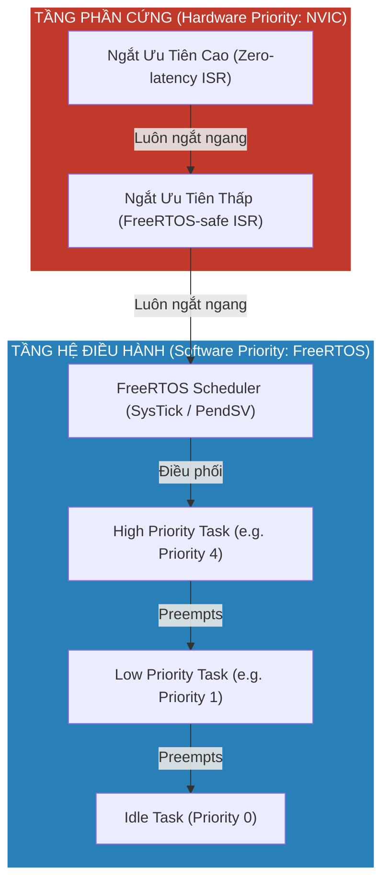
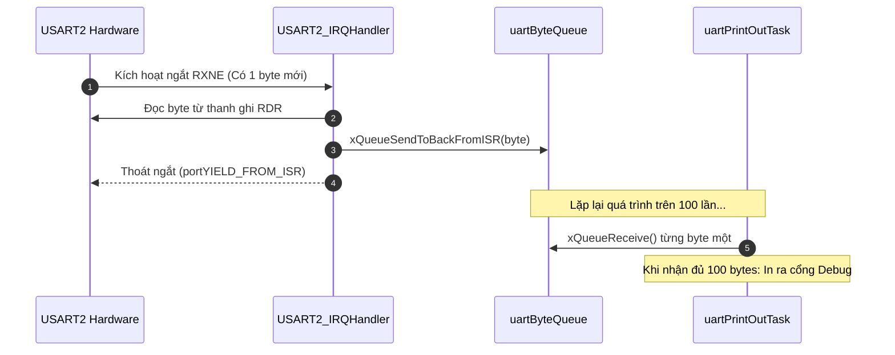
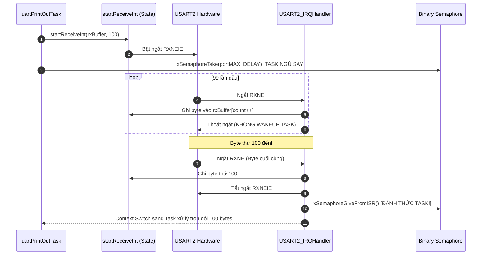
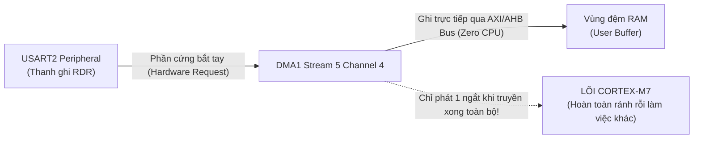
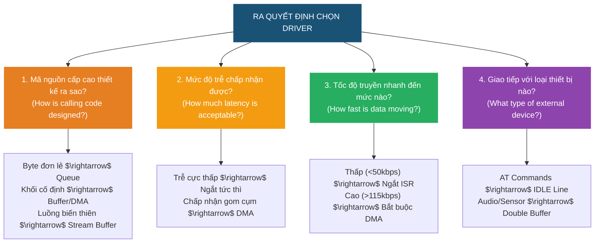
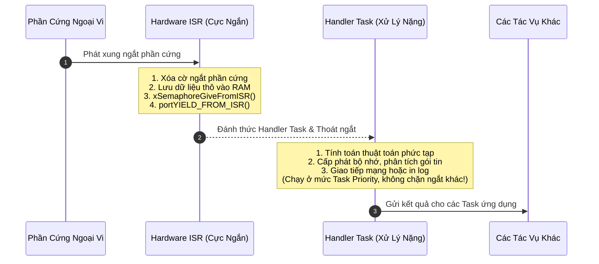
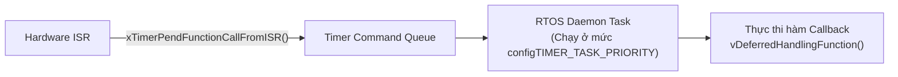

# <span style="color:#f1c40f">Chương 09: Trình Điều Khiển Ngoại Vi & Xử Lý Ngắt Trong RTOS (Drivers and ISRs)</span>

> **Tài liệu tham khảo chuyên sâu kết hợp:**
> - 📘 *Hands-On RTOS with Microcontrollers* – Brian Amos (Chapter 10: *Drivers and ISRs*, tr. 226–279).
> - 📗 *Mastering the FreeRTOS Real Time Kernel* – Richard Barry (Chapter 6: *Interrupt Management*, tr. 191–242).
> - 📙 *STMicroelectronics Architecture Manuals & Application Notes* (RM0410 STM32F76xxx Reference Manual, AN4031 Using STM32 DMA Controller, AN4839 L1 Cache Architecture).

---

```text
MỤC LỤC CHUYÊN SÂU (TABLE OF CONTENTS)
├── 1. Giới thiệu về UART & Cấu hình Phần cứng (Introducing UART & Hardware Setup)
│   ├── 1.1 Khái niệm UART/USART & Cấu trúc Khung truyền (Frame Structure)
│   ├── 1.2 Thiết lập Mạch Loopback trên STM32 Nucleo-F767ZI
│   └── 1.3 Quy trình 10 Bước Chuẩn hóa Cấu hình Ngoại vi STM32 (10-Step Setup Workflow)
├── 2. Driver UART bằng phương pháp Vòng Lặp Chờ (Polled UART Driver)
│   ├── 2.1 Mã nguồn C Hoàn chỉnh: Task Polling & Task In Dữ liệu
│   ├── 2.2 Phân tích Toán học & Giới hạn Hiệu năng (Math & CPU Burn Limits)
│   └── 2.3 Phân tích Vết Thực thi SystemView & Trường hợp Cho phép Dùng Polling
├── 3. Phân biệt Task vs Trình Xử Lý Ngắt (Tasks vs ISRs Deep Dive)
│   ├── 3.1 Bảng So sánh Toàn diện 7 Tiêu chí: Task vs Hardware ISR
│   ├── 3.2 Quy tắc Gọi API FreeRTOS từ Ngắt (*FromISR Variants)
│   └── 3.3 Cơ chế Dịch Bit Độ Ưu tiên NVIC trên ARM Cortex-M
├── 4. Xây dựng Driver UART Dựa Trên Ngắt (ISR-Based Drivers)
│   ├── 4.1 Queue-Based Driver (Nhận từng Byte nạp Queue)
│   │   ├── Kiến trúc & Mã nguồn C Hoàn chỉnh (startReceiveInt, USART2_IRQHandler, uartPrintOutTask)
│   │   └── Phân tích Hiệu năng trên SystemView (Tải CPU 5.75% ở 115200 Baud)
│   └── 4.2 Buffer-Based Driver (Gom Dữ liệu vào Mảng RAM + Binary Semaphore)
│       ├── Kiến trúc & Mã nguồn C Hoàn chỉnh (Kiểm tra cờ ORE, NE, FE, Semaphore Synchronization)
│       └── Phân tích Hiệu năng trên SystemView (Tải CPU giảm xuống 2.37%)
├── 5. Driver Dựa Trên Bộ Truy Cập Bộ Nhớ Trực Tiếp (DMA-Based Drivers)
│   ├── 5.1 Cấu trúc DMA trên STM32F7 & Cấu hình DMA1 Stream 5 Channel 4
│   ├── 5.2 Trình Xử lý Ngắt DMA (DMA Interrupt Handler & Semaphore Give)
│   └── 5.3 Phân tích Hiệu năng ở Tốc độ Cực cao (256,000 Baud: Tải CPU chỉ 5.1%)
├── 6. FreeRTOS Stream Buffers & Kỹ Thuật DMA Double-Buffering (FreeRTOS 10+)
│   ├── 6.1 Khái niệm Stream Buffer: Cấu trúc FIFO Lockless Single-Reader Single-Writer
│   ├── 6.2 Cú pháp API Stream Buffer & Mã nguồn Task Tiêu thụ
│   ├── 6.3 Cấu hình Phần cứng DMA Double-Buffering (CR_DBM, M0AR, M1AR, NDTR)
│   ├── 6.4 Nạp Dữ liệu vào Stream Buffer trong Ngắt (Đọc cờ CT & xStreamBufferSendFromISR)
│   └── 6.5 Phân tích Hiệu năng So sánh Stream Buffer vs Queue
├── 7. Khung Lựa Chọn Driver & Đánh Giá Thư Viện Nhà Sản Xuất (Driver Selection Framework)
│   ├── 7.1 4 Câu hỏi Cốt lõi Lựa chọn Kiến trúc Driver (Calling Code, Latency, Speed, Device Type)
│   ├── 7.2 Tiêu chí Lựa chọn: Queue vs Raw Buffer vs Stream Buffer vs DMA IDLE Line
│   └── 7.3 Đánh giá Thư viện STM32 HAL vs Bare-Metal Register Driver & Nguyên lý Loose Coupling
├── 8. Tổng Hợp 6 Phương Pháp Thiết Kế Driver UART Trong RTOS & Senior Best Practices
│   ├── 8.1 Chi tiết 6 Phương pháp Thiết kế Driver UART
│   └── 8.2 Bảng Ma trận So sánh 6 Phương pháp & Lời khuyên Kỹ sư Cấp cao
├── 9. Quản Lý Ngắt Chuyên Sâu Theo Chuẩn FreeRTOS (Mastering FreeRTOS Interrupt Management)
│   ├── 9.1 Mẫu Thiết kế Xử lý Ngắt Trì hoãn (Deferred Interrupt Processing Pattern)
│   ├── 9.2 Đồng bộ ISR-Task bằng Binary Semaphore (Richard Barry Example 16 & Listing 96)
│   ├── 9.3 Đồng bộ ISR-Task bằng Counting Semaphore (Richard Barry Example 17 - Event Latching)
│   ├── 9.4 Xử lý Ngắt Trì hoãn Tập trung (Centralized Deferred Processing - Example 18)
│   ├── 9.5 Sử dụng Queue trong Ngắt (Sending/Receiving Queue in ISR - Example 19)
│   ├── 9.6 Cơ chế pxHigherPriorityTaskWoken & 5 Lý do Bắt buộc Yield Thủ công
│   └── 9.7 Cấu hình Lồng Ngắt NVIC trên Cortex-M & Các Cạm bẫy Chết người (Priority Inversion, Default 0)
├── 10. Câu Hỏi Ôn Tập Chuyên Sâu & Lời Giải Chi Tiết (Amos Ch10 & Barry Ch6 Assessments)
└── 11. Bảng Tổng Hợp Kiến Thức Cốt Lõi (Key Takeaways)
```

---

## <span style="color:#e67e22">1. Giới thiệu về UART & Cấu hình Phần cứng (Introducing UART & Hardware Setup)</span>

Tương tác với các ngoại vi vi điều khiển (MCU Peripherals) là một trong những nhiệm vụ cốt lõi nhất của lập trình viên nhúng. Ngoại vi truyền thông nối tiếp **UART (Universal Asynchronous Receiver/Transmitter)** là giao tiếp xuất hiện trên hầu hết mọi hệ thống, từ việc in log gỡ lỗi (printf debug), kết nối module định vị GPS, module truyền thông WiFi/BLE/Cellular, cho đến giao tiếp cảm biến công nghiệp.

### <span style="color:#1abc9c">1.1 Khái Niệm UART/USART & Cấu Trúc Khung Truyền (Frame Structure)</span>

- **UART (Universal Asynchronous Receiver/Transmitter)**: Bộ truyền nhận nối tiếp bất đồng bộ. Dữ liệu được truyền tuần tự từng bit trên một dây duy nhất theo một tốc độ xác định trước gọi là **Baud Rate** (số bit truyền trong 1 giây).
- **Tính chất "Bất đồng bộ" (Asynchronous)**: Hai thiết bị **không chia sẻ đường xung clock chung**. Bên nhận (RX) sử dụng một bộ đếm nội (thường lấy mẫu gấp 16 lần hoặc 8 lần tốc độ baud - *16x or 8x Oversampling*) để đồng bộ với cạnh xuống của **Start Bit** và chốt giá trị các bit dữ liệu tiếp theo ở giữa chu kỳ bit.
- **Cấu trúc Khung truyền (UART Frame)**:
  - **Idle Line**: Đường truyền luôn ở mức logic CAO (High/Mark state - 3.3V).
  - **Start Bit**: Kéo đường truyền xuống mức THẤP (Low/Space state - 0V) trong đúng 1 chu kỳ bit để báo hiệu bắt đầu truyền.
  - **Data Bits**: Thường là 8 bits (hoặc 7 bits, 9 bits), truyền từ bit có trọng số thấp nhất (**LSB**) đến bit có trọng số cao nhất (**MSB**).
  - **Parity Bit** *(Tùy chọn)*: Bit kiểm tra chẵn (Even) hoặc lẻ (Odd) để phát hiện lỗi đường truyền 1-bit.
  - **Stop Bit(s)**: Kéo đường truyền trở lại mức CAO trong 1, 1.5, hoặc 2 chu kỳ bit để kết thúc khung và phục hồi trạng thái Idle.

```
Đường truyền UART (3.3V)
  Idle       Start       D0       D1       D2      ...       D7      Parity    Stop      Idle
───────┐    ┌────────┬────────┬────────┬────────┬───────┬────────┬────────┬────────┐    ┌───────
       │    │  (LSB) │        │        │        │       │  (MSB) │  (Opt) │        │    │
       └────┘        └────────┴────────┴────────┴───────┴────────┴────────┘        └────┘
       │<──>│<──────>│<──────>│<──────>│<──────>│<─────>│<──────>│<──────>│<──────>│
       1 bit  1 bit    1 bit    1 bit    1 bit           1 bit    1 bit   1-2 bit
```

- **USART vs UART**: USART (*Universal Synchronous/Asynchronous Receiver/Transmitter*) là dạng tổng quát hóa của UART, tích hợp thêm chân phát xung nhịp đồng bộ (**SCLK**) cho phép hoạt động như một bus SPI Master hoặc giao tiếp với các thiết bị thông minh (Smartcards).

---

### <span style="color:#1abc9c">1.2 Thiết Lập Mạch Loopback Trên STM32 Nucleo-F767ZI</span>

Để nghiên cứu và đo lường khách quan hiệu năng của từng kiến trúc driver mà không cần thiết bị ngoại vi rời bên ngoài, Brian Amos sử dụng kỹ thuật **Hardware Loopback Test (Kiểm tra vòng lặp phần cứng)** giữa 2 ngoại vi UART độc lập trên bo mạch **NUCLEO-F767ZI**:
- **UART4 (Traffic Generator)**: Đóng vai trò là nguồn phát dữ liệu nền liên tục (Background Traffic Transmitter) ở tốc độ **115,200 Baud** (hoặc $256,000 \text{ Baud}$ ở bài test tốc độ cao).
- **USART2 (Device Under Test - DUT)**: Đóng vai trò là thiết bị nhận dữ liệu cần xây dựng driver (Receiver).

```
   STM32F767ZI Vi Điều Khiển
┌────────────────────────────────────────────────────────┐
│                                                        │
│  [ UART4 Transmitter ]        [ USART2 Receiver ]      │
│     Chân PC10 (TX)               Chân PD6 (RX)         │
│          │                            ▲                │
└──────────┼────────────────────────────┼────────────────┘
           │                            │
           └────── Dây Nối Vật Lý ──────┘
             (Jumper Wire trên CN7 Header)
```

#### Sơ Đồ Đấu Dây Vật Lý Trên Header CN7 (ST Morpho):
1. Dùng 1 sợi dây cắm (Male-to-Male Jumper):
   - Nối chân **PC10 (UART4_TX)** tại **CN7 - Pin 1**.
   - Nối sang chân **PD6 (USART2_RX)** tại **CN7 - Pin 17**.
2. Kết nối cáp micro-USB từ bo mạch NUCLEO-F767ZI vào máy tính (cổng ST-Link) để nạp code và ghi log SEGGER SystemView.

---

### <span style="color:#1abc9c">1.3 Quy Trình 10 Bước Chuẩn Hóa Cấu Hình Ngoại Vi STM32 (10-Step Setup Workflow)</span>

Khi khởi tạo bất kỳ ngoại vi nào trên dòng ARM Cortex-M (đặc biệt là STM32), việc bỏ quên một bước cấu hình clock hoặc chân thay thế (Alternate Function) sẽ khiến ngoại vi không thể hoạt động. Dưới đây là quy trình 10 bước chuẩn kỹ sư chuyên nghiệp:

1. **Bước 1: Bật Xung Nhịp Cho Cổng GPIO (Enable GPIO Port Clock)**:
   - Các cổng GPIO trên STM32 mặc định bị tắt clock để tiết kiệm điện.
   - Gọi: `__HAL_RCC_GPIOC_CLK_ENABLE()` và `__HAL_RCC_GPIOD_CLK_ENABLE()`.
2. **Bước 2: Cấu Hình Chân GPIO Sang Chế Độ Alternate Function (AF)**:
   - Thiết lập `GPIO_InitStruct.Mode = GPIO_MODE_AF_PP` (Chân TX) hoặc `GPIO_MODE_AF_OD / GPIO_MODE_INPUT` (Chân RX).
   - Chọn tốc độ ngõ ra cao: `GPIO_InitStruct.Speed = GPIO_SPEED_FREQ_VERY_HIGH`.
3. **Bước 3: Gán Đúng Mã Alternate Function Cho Từng Chân (Pin Multiplexing)**:
   - Tra cứu Datasheet (bảng Alternate Function Mapping): PC10 tương ứng `GPIO_AF8_UART4`; PD6 tương ứng `GPIO_AF7_USART2`.
4. **Bước 4: Bật Xung Nhịp Cho Khối Ngoại Vi (Enable Peripheral Clock)**:
   - Gọi: `__HAL_RCC_UART4_CLK_ENABLE()` (nằm trên bus APB1) và `__HAL_RCC_USART2_CLK_ENABLE()` (trên bus APB1).
5. **Bước 5: Khởi Tạo Cấu Trúc Tham Số UART (Baud Rate, Word Length, Stop Bits)**:
   - Cài đặt `BaudRate = 115200`, `WordLength = UART_WORDLENGTH_8B`, `StopBits = UART_STOPBITS_1`, `Parity = UART_PARITY_NONE`, `Mode = UART_MODE_TX_RX`.
6. **Bước 6: Ghi Cấu Hình Xuống Các Thanh Ghi Phần Cứng (HAL_UART_Init)**:
   - Thực thi hàm `HAL_UART_Init()` để tính toán giá trị nạp vào thanh ghi Baud Rate Register (`USART_BRR`).
7. **Bước 7: Cấu Hình Bộ Điều Khiển Ngắt NVIC (Nếu Dùng Ngắt)**:
   - Thiết lập độ ưu tiên ngắt: `NVIC_SetPriority(USART2_IRQn, 6)`.
   - **Quy tắc vàng**: Mức ưu tiên ngắt NVIC phải $\ge$ `configLIBRARY_MAX_SYSCALL_INTERRUPT_PRIORITY` (số càng lớn thì ưu tiên càng thấp) nếu ISR có gọi API của FreeRTOS!
8. **Bước 8: Bật Kênh Ngắt Trên NVIC (NVIC_EnableIRQ)**:
   - Gọi: `NVIC_EnableIRQ(USART2_IRQn)`.
9. **Bước 9: Bật Cờ Ngắt Cụ Thể Trên Thanh Ghi Ngoại Vi (Enable Peripheral Specific Interrupt)**:
   - Ghi vào thanh ghi điều khiển CR1: `USART2->CR1 |= USART_CR1_RXNEIE` (Bật ngắt khi nhận đủ 1 byte vào Receive Data Register).
10. **Bước 10: Kích Hoạt Ngoại Vi Bắt Đầu Hoạt Động (Enable Peripheral)**:
    - Bật bit UART Enable: `USART2->CR1 |= USART_CR1_UE` và bộ thu `USART_CR1_RE`.

---

## <span style="color:#e67e22">2. Driver UART bằng phương pháp Vòng Lặp Chờ (Polled UART Driver)</span>

Phương pháp cổ điển và trực quan nhất khi mới học lập trình vi điều khiển là **Polling (Vòng lặp chờ cờ trạng thái)**.

### <span style="color:#1abc9c">2.1 Mã Nguồn C Hoàn Chỉnh: Task Polling & Task In Dữ Liệu</span>

Trong mô hình này, một FreeRTOS task nhận (`polledUartReceive`) liên tục thực thi vòng lặp `while` đọc trực tiếp thanh ghi trạng thái `ISR` của USART2 để kiểm tra cờ `USART_ISR_RXNE` (Read data register not empty):

```c
/* =========================================================================
 * DRIVER UART THEO PHƯƠNG PHÁP POLLING (Brian Amos - Listing 10.1)
 * ========================================================================= */

#define NUM_BYTES 100
static uint8_t rxData[NUM_BYTES];
static QueueHandle_t uartDataQueue;

// Task 1: Liên tục kiểm tra thanh ghi để gom đủ NUM_BYTES
static void polledUartReceive(void *pvParameters)
{
    uint8_t rxIndex = 0;
    while(1)
    {
        // 1. Vòng lặp chờ bận (Busy-wait) kiểm tra cờ RXNE
        // CPU bị kẹt cứng tại đây cho đến khi có byte bay vào!
        while ((USART2->ISR & USART_ISR_RXNE) == 0)
        {
            // Không làm gì cả - Đốt chu kỳ CPU vô ích!
        }

        // 2. Đọc byte nhận được từ thanh ghi RDR
        rxData[rxIndex] = (uint8_t)(USART2->RDR & 0xFF);
        rxIndex++;

        // 3. Khi gom đủ 100 bytes, gửi con trỏ mảng sang Queue cho Task in
        if (rxIndex >= NUM_BYTES)
        {
            uint8_t *pData = rxData;
            xQueueSend(uartDataQueue, &pData, portMAX_DELAY);
            rxIndex = 0;
        }
    }
}

// Task 2: Nhận thông báo từ Queue và in ra màn hình
static void uartPrintOutTask(void *pvParameters)
{
    uint8_t *pReceivedData;
    while(1)
    {
        // Task ngủ (Blocked) chờ có dữ liệu từ Queue
        if (xQueueReceive(uartDataQueue, &pReceivedData, portMAX_DELAY) == pdPASS)
        {
            // In nội dung 100 bytes ra cổng Debug Terminal
            printBytes(pReceivedData, NUM_BYTES);
        }
    }
}
```

---

### <span style="color:#1abc9c">2.2 Phân Tích Toán Học & Giới Hạn Hiệu Năng (Math & CPU Burn Limits)</span>

Hãy tính toán thời gian vật lý của tín hiệu để thấy rõ sự lãng phí khủng khiếp của phương pháp Polling:

1. **Thời gian truyền 1 byte UART ở 115,200 Baud**:
   - Mỗi byte gồm: 1 Start bit + 8 Data bits + 1 Stop bit = **10 bits**.
   - Thời gian truyền 1 bit:
     $$T_{\text{bit}} = \frac{1}{115200} \approx 8.68 \, \mu\text{s}$$
   - Thời gian truyền trọn vẹn 1 byte:
     $$T_{\text{byte}} = 10 \times 8.68 \, \mu\text{s} \approx 86.8 \, \mu\text{s}$$
2. **Thời gian nhận gói tin 100 bytes**:
   $$T_{\text{packet}} = 100 \times 86.8 \, \mu\text{s} = 8.68 \, \text{ms}$$
3. **Số chu kỳ CPU bị "đốt cháy" vô nghĩa trên Cortex-M7 (216 MHz)**:
   Trong khoảng thời gian $8.68\text{ ms}$ chờ đợi đó, lõi CPU chạy ở xung nhịp $216\text{ MHz}$ có thể thực thi:
   $$\text{Số chu kỳ CPU} = 216.000.000 \times 0.00868 = \mathbf{1.874.880 \text{ chu kỳ máy!}}$$

> [!CAUTION]
> **Thảm Họa Hiệu Năng Của Polled Driver:**
> Lõi vi điều khiển phải tiêu tốn gần **1.9 triệu chu kỳ lệnh** chỉ để quay vòng lặp `while((USART2->ISR & USART_ISR_RXNE) == 0)`! Trong suốt thời gian này:
> - Nếu task `polledUartReceive` có priority cao hơn các task khác, nó sẽ **chiếm đoạt 100% CPU**, bỏ đói (starve) toàn bộ các task có priority thấp hơn.
> - Nếu task này có priority ngang bằng các task khác, khi hết time-slice (1ms), nó bị ngắt ngang. Nếu trong lúc nó bị dừng mà có 2 bytes truyền đến liên tiếp, phần cứng USART sẽ gặp lỗi **Overrun Error (ORE)** và byte dữ liệu sẽ bị mất vĩnh viễn!
> - Điện năng tiêu thụ liên tục ở mức đỉnh (Peak Current) khiến pin cạn kiệt nhanh chóng.

---

### <span style="color:#1abc9c">2.3 Phân Tích Vết Thực Thi SystemView & Trường Hợp Cho Phép Dùng Polling</span>

Khi quan sát đồ thị thực thi trên **SEGGER SystemView**, tác giả Brian Amos ghi nhận:
- Task `polledUartReceive` chiếm trọn vẹn dải thời gian thực thi (màu đỏ liên tục chiếm gần **$99\% - 100\%$ CPU**).
- Scheduler liên tục phải thực hiện context switch cưỡng bức ở mỗi ngắt SysTick (1ms) vì task không bao giờ chủ động nhường quyền (Yield).

#### Khi Nào Được Phép Sử Dụng Polling Driver Trong Thực Tế?
Dù là một giải pháp tồi trong RTOS, Polling vẫn có chỗ đứng trong 3 tình huống kỹ thuật cụ thể:
1. **Giai đoạn Khởi động sớm (Early Bootloader)**: Trước khi RTOS Scheduler được kích hoạt (`vTaskStartScheduler`), hệ thống chưa có đa nhiệm, chưa có ngắt. Polling UART là cách duy nhất để in log bootloader ra cổng console.
2. **Trình xử lý Lỗi Khẩn Cấp (Crash / HardFault Handler / Kernel Panic)**: Khi hệ thống gặp lỗi nghiêm trọng (HardFault, MemManage Fault, Assert Failed), toàn bộ ngắt bị vô hiệu hóa (`__disable_irq()`), Scheduler bị đóng băng. Để dump thông tin thanh ghi ra UART, kỹ sư bắt buộc phải dùng Polled UART Driver.
3. **Giao tiếp Độ trễ Siêu ngắn (Micro-delays $< 5\mu\text{s}$)**: Nếu thời gian chờ ngoại vi nhỏ hơn thời gian cần thiết để thực hiện một lần Context Switch (thường tốn $2 - 5\mu\text{s}$ trên Cortex-M), việc chờ bằng vòng lặp ngắn vài chu kỳ sẽ có hiệu năng tốt hơn việc đưa task vào trạng thái Blocked.

---

## <span style="color:#e67e22">3. Phân biệt Task vs Trình Xử Lý Ngắt (Tasks vs ISRs Deep Dive)</span>

Trước khi xây dựng các driver hiện đại, kỹ sư phải hiểu tường tận sự phân chia ranh giới giữa hai thực thể thực thi độc lập trong vi điều khiển: **FreeRTOS Task** và **Hardware ISR (Interrupt Service Routine)**.



---

### <span style="color:#1abc9c">3.1 Bảng So Sánh Toàn Diện 7 Tiêu Chí: Task vs Hardware ISR</span>

| Tiêu Chí So Sánh | FreeRTOS Task (Tác Vụ Phần Mềm) | Hardware ISR (Trình Xử Lý Ngắt Phần Cứng) |
|---|---|---|
| **Cơ chế kích hoạt** | Được điều phối bởi thuật toán Scheduler dựa trên Priority và State (Ready/Blocked). | Kích hoạt trực tiếp bởi phần cứng (cạnh xung GPIO, bộ đếm Timer, cờ nhận UART, DMA complete). |
| **Hệ thống phân cấp ưu tiên** | Do phần mềm quản lý (`uxPriority`: từ `0` đến `configMAX_PRIORITIES - 1`). Số LỚN hơn có ưu tiên CAO hơn. | Do phần cứng **NVIC** quản lý. Số NHỎ hơn có ưu tiên CAO hơn (Inverted Priority). **Mọi ngắt NVIC đều đứng TRÊN tất cả các Task!** |
| **Không gian Stack sử dụng** | Mỗi Task có một vùng Stack riêng biệt (nằm trên RAM, được trỏ bởi con trỏ stack tiến trình **PSP - Process Stack Pointer**). | Mọi ISR chia sẻ chung một vùng **Interrupt Stack** duy nhất (được trỏ bởi con trỏ stack chính **MSP - Main Stack Pointer**). |
| **Hành vi chặn (Blocking)** | **Được phép Block**: Có thể gọi `vTaskDelay()`, chờ Semaphore, chờ Queue với timeout `xTicksToWait`. | **TUYỆT ĐỐI CẤM BLOCK**: ISR không được phép chờ đợi. Không có khái niệm timeout; mọi lệnh phải hoàn thành tức thì. |
| **Tập hàm API được phép gọi** | Toàn bộ các API tiêu chuẩn của FreeRTOS (`xQueueSend`, `xSemaphoreTake`, `vTaskDelay`, ...). | **CHỈ ĐƯỢC GỌI các API có hậu tố `*FromISR`** (`xQueueSendFromISR`, `xSemaphoreGiveFromISR`, ...). |
| **Cơ chế chuyển ngữ cảnh** | Tự động diễn ra khi Task bị preempt hoặc tự nhượng quyền qua `taskYIELD()`. | Bắt buộc phải thông qua cơ chế thủ công: kiểm tra biến `pxHigherPriorityTaskWoken` và gọi `portYIELD_FROM_ISR()`. |
| **Thời gian thực thi tối ưu** | Có thể chạy lâu, lặp vô tận `while(1)`. | Phải **cực ngắn (vài microsecond)**; làm nhiệm vụ dọn dẹp cờ phần cứng rồi chuyển việc nặng cho Task (Deferred Processing). |

---

### <span style="color:#1abc9c">3.2 Quy Tắc Gọi API FreeRTOS Từ Ngắt (*FromISR Variants)</span>

Tại sao FreeRTOS không dùng chung một hàm API cho cả Task và ISR mà bắt buộc phải tách riêng phiên bản `*FromISR`?

1. **Loại Bỏ Tham Số Chờ Đợi (`xTicksToWait`)**:
   - Trong Task: `xQueueSend(xQueue, &data, 100)` $\rightarrow$ nếu Queue đầy, Task sẽ tự treo vào Blocked list trong 100 ticks.
   - Trong ISR: Nếu Queue đầy, ISR **không thể ngủ**! Nếu ISR bị dừng lại chờ, toàn bộ vi điều khiển bị tê liệt, không một ngắt nào khác (kể cả SysTick) được phục vụ. Do đó hàm `xQueueSendFromISR()` hoàn toàn không có tham số `xTicksToWait`. Nếu Queue đầy, hàm trả về ngay lập tức `errQUEUE_FULL`.
2. **Cơ Chế Trì Hoãn Chuyển Ngữ Cảnh (`pxHigherPriorityTaskWoken`)**:
   - Tất cả các hàm `*FromISR` đều nhận vào một con trỏ kiểu `BaseType_t *pxHigherPriorityTaskWoken`.
   - Nếu hành động trong ISR (ví dụ Give Semaphore hoặc nạp Queue) làm **giải phóng một Task có độ ưu tiên cao hơn Task đang bị ngắt**, kernel sẽ gán `*pxHigherPriorityTaskWoken = pdTRUE`.
   - Lập trình viên kiểm tra biến này ở cuối hàm ngắt để gọi macro `portYIELD_FROM_ISR()`, kích hoạt ngắt mềm **PendSV** để thực hiện chuyển ngữ cảnh ngay khi ISR thoát ra.

```c
/* MẪU CẨN THẬN CHUẨN MỰC KHI GỌI FREERTOS API TRONG ISR */
void EXTI15_10_IRQHandler(void)
{
    // 1. Luôn khởi tạo cờ báo thức bằng pdFALSE
    BaseType_t xHigherPriorityTaskWoken = pdFALSE;

    // 2. Xóa cờ ngắt phần cứng EXTI
    if (__HAL_GPIO_EXTI_GET_IT(GPIO_PIN_13) != RESET) {
        __HAL_GPIO_EXTI_CLEAR_IT(GPIO_PIN_13);

        // 3. Đánh thức task xử lý qua Semaphore FromISR
        xSemaphoreGiveFromISR(xButtonSemaphore, &xHigherPriorityTaskWoken);
    }

    // 4. Thực hiện chuyển ngữ cảnh ngay lập tức nếu Task unblock có ưu tiên cao hơn
    portYIELD_FROM_ISR(xHigherPriorityTaskWoken);
}
```

---

### <span style="color:#1abc9c">3.3 Cơ Chế Dịch Bit Độ Ưu Tiên NVIC Trên ARM Cortex-M</span>

Một trong những nguồn gốc gây sập hệ thống (Crash / HardFault) phổ biến nhất cho kỹ sư RTOS trên nền ARM Cortex-M là **sự hiểu lầm về cơ chế định dạng thanh ghi độ ưu tiên của bộ điều khiển ngắt NVIC**:

1. **Quy Chuẩn Phần Cứng ARM Cortex-M**:
   - Thanh ghi ưu tiên ngắt NVIC (`IPRx`) có độ rộng 8-bit cho mỗi kênh ngắt.
   - Tuy nhiên, các nhà sản xuất chip (ST, NXP, TI) không triển khai toàn bộ 8 bit vật lý mà **chỉ triển khai các bit có trọng số cao nhất (MSB bits)**.
   - Trên **STM32F7 / STM32F4**, ST triển khai **4 bits** (`__NVIC_PRIO_BITS = 4`). Nghĩa là chỉ có 4 bit cao (Bit [7:4]) có tác dụng, 4 bit thấp (Bit [3:0]) luôn đọc về 0!

```
Thanh ghi 8-bit NVIC Interrupt Priority Register (IPRx) trên STM32:
┌────────┬────────┬────────┬────────┬────────┬────────┬────────┬────────┐
│ Bit 7  │ Bit 6  │ Bit 5  │ Bit 4  │ Bit 3  │ Bit 2  │ Bit 1  │ Bit 0  │
├────────┴────────┴────────┴────────┼────────┴────────┴────────┴────────┤
│    4 BITS ĐỘ ƯU TIÊN VẬT LÝ       │   4 BITS KHÔNG TRIỂN KHAI (LUÔN 0)│
└───────────────────────────────────┴───────────────────────────────────┘
```

2. **Hệ Quả Dịch Bit (Bit-Shifting Gotcha)**:
   - Các mức ưu tiên thực tế có thể chọn từ 0 đến 15 ($2^4 = 16$ mức).
   - Hàm CMSIS: `NVIC_SetPriority(IRQn, 5)` nhận giá trị logical (0 đến 15) và tự động dịch trái 4 bit: `(5 << 4) = 0x50` (80 thập phân).
   - Macro FreeRTOS:
     - `configLIBRARY_MAX_SYSCALL_INTERRUPT_PRIORITY`: Định nghĩa mức logic chưa dịch bit (ví dụ: `5`).
     - `configMAX_SYSCALL_INTERRUPT_PRIORITY`: Định nghĩa giá trị thô đã dịch bit nạp trực tiếp vào thanh ghi che ngắt `BASEPRI`: `(5 << (8 - 4)) = 0x50`.

> [!WARNING]
> **Cạm Bẫy Priority 0 Của NVIC (The Fatal Default Priority Trap):**
> Trong vi điều khiển ARM Cortex-M, sau khi Reset, **toàn bộ các ngắt ngoại vi mặc định có mức ưu tiên phần cứng là 0 (Mức ưu tiên TUYỆT ĐỐI CAO NHẤT)**!
> Nếu bạn bật một ngắt ngoại vi (bằng `NVIC_EnableIRQ`) mà **quên gọi hàm `NVIC_SetPriority()`**, ngắt đó sẽ chạy ở Priority 0.
> Priority 0 nằm TRÊN ngưỡng `configMAX_SYSCALL_INTERRUPT_PRIORITY` (5). Khi ngắt này thực thi và gọi bất kỳ hàm FreeRTOS `*FromISR` nào, kernel sẽ bị phá vỡ tính toàn vẹn cấu trúc danh sách, dẫn đến hàm `configASSERT()` bẫy lỗi hoặc hệ thống bị sụp đổ hoàn toàn vào `HardFault_Handler`!

---

## <span style="color:#e67e22">4. Xây dựng Driver UART Dựa Trên Ngắt (ISR-Based Drivers)</span>

Để giải phóng CPU khỏi vòng lặp chờ bận (busy-wait polling), giải pháp tự nhiên đầu tiên là chuyển sang mô hình **Event-Driven (Hướng sự kiện)** sử dụng ngắt phần cứng (Hardware Interrupts). Khi nào có byte dữ liệu truyền đến, phần cứng USART tự động tạo ngắt để CPU vào phục vụ, thời gian còn lại CPU hoàn toàn rảnh rỗi để thực thi các tác vụ khác.

Có hai trường phái thiết kế Driver dùng ngắt:
1. **Queue-Based Driver**: Mỗi ngắt nhận được 1 byte $\rightarrow$ nạp ngay 1 byte vào FreeRTOS Queue.
2. **Buffer-Based Driver**: Mỗi ngắt nhận được 1 byte $\rightarrow$ ghi trực tiếp vào mảng bộ đệm RAM của người dùng $\rightarrow$ khi gom đủ $N$ bytes mới phát 1 Semaphore đánh thức Task.

---

### <span style="color:#1abc9c">4.1 Driver Dựa Trên Ngắt Dùng Queue (Queue-Based Driver)</span>



#### Mã Nguồn C Triển Khai Toàn Diện:

```c
/* =========================================================================
 * DRIVER UART NGẮT DÙNG QUEUE TỪNG BYTE (Brian Amos - Listing 10.2)
 * ========================================================================= */

#define QUEUE_LEN    128
static QueueHandle_t uartByteQueue = NULL;

// 1. Hàm khởi tạo và kích hoạt ngắt nhận
int startReceiveIntQueue(void)
{
    // Tạo Queue chứa từng byte (kích thước phần tử = 1 byte)
    uartByteQueue = xQueueCreate(QUEUE_LEN, sizeof(uint8_t));
    if (uartByteQueue == NULL) {
        return -1; // Không đủ Heap
    }

    // Cấu hình độ ưu tiên ngắt NVIC: Mức 6 (Hợp lệ với FreeRTOS)
    NVIC_SetPriority(USART2_IRQn, 6);
    NVIC_EnableIRQ(USART2_IRQn);

    // Bật ngắt RXNE (Receive Data Register Not Empty) và bật UART
    USART2->CR1 |= (USART_CR1_UE | USART_CR1_RE | USART_CR1_RXNEIE);
    return 0;
}

// 2. Trình xử lý ngắt phần cứng USART2
void USART2_IRQHandler(void)
{
    BaseType_t xHigherPriorityTaskWoken = pdFALSE;

    // Kiểm tra cờ RXNE (Có dữ liệu trong thanh ghi RDR)
    if ((USART2->ISR & USART_ISR_RXNE) != 0)
    {
        // Đọc byte nhận được (Tự động xóa cờ RXNE trên STM32F7)
        uint8_t rxByte = (uint8_t)(USART2->RDR & 0xFF);

        // Nạp byte vào Queue an toàn từ ISR
        xQueueSendToBackFromISR(uartByteQueue, &rxByte, &xHigherPriorityTaskWoken);
    }

    // Xử lý lỗi Overrun Error (ORE) nếu Task đọc không kịp
    if ((USART2->ISR & USART_ISR_ORE) != 0)
    {
        USART2->ICR |= USART_ICR_ORECF; // Xóa cờ lỗi ORE
    }

    // Kích hoạt chuyển ngữ cảnh nếu có task ưu tiên cao hơn thức giấc
    portYIELD_FROM_ISR(xHigherPriorityTaskWoken);
}

// 3. Task người dùng: Đọc từng byte từ Queue và in ra khi đủ 100 bytes
static void uartPrintOutTask(void *pvParameters)
{
    #define NUM_BYTES 100
    uint8_t rxBuffer[NUM_BYTES];
    uint8_t count = 0;
    uint8_t receivedByte;

    while(1)
    {
        // Chờ nhận từng byte từ Queue (Task ngủ khi không có byte)
        if (xQueueReceive(uartByteQueue, &receivedByte, portMAX_DELAY) == pdPASS)
        {
            rxBuffer[count++] = receivedByte;
            if (count >= NUM_BYTES)
            {
                printBytes(rxBuffer, NUM_BYTES);
                count = 0;
            }
        }
    }
}
```

#### Phân Tích Hiệu Năng Vết Thực Thi Trên SEGGER SystemView:
Khi chạy bài test gửi 100 bytes ở tốc độ **115,200 Baud**, SystemView ghi nhận:
- **Tải CPU tổng thể**: **$5.75\%$** (Giảm ngoạn mục từ ngưỡng $100\%$ của Polling xuống $5.75\%$).
- **Số lần kích hoạt ngắt**: Đúng **100 lần ngắt** cho 100 bytes.
- **Vấn đề tiềm ẩn**: Mặc dù tải CPU là $5.75\%$, nhưng cứ mỗi $86.8\mu\text{s}$, CPU lại bị ngắt 1 lần, nạp dữ liệu vào Queue, rồi đánh thức `uartPrintOutTask`. Mỗi lần gửi/nhận Queue đều phải khóa/mở critical section nội bộ của FreeRTOS $\rightarrow$ Khi đẩy tốc độ lên cao (như $1 \text{ Mbps}$ hoặc $256,000 \text{ Baud}$), chi phí overhead của Queue sẽ làm nghẽn CPU!

---

### <span style="color:#1abc9c">4.2 Driver UART Dùng Bộ Đệm Buffer (Buffer-Based Driver)</span>

Nhận thấy sự lãng phí khi phải gọi hàm Queue cho từng byte đơn lẻ, kiến trúc **Buffer-Based Driver** ra đời: 
Task cung cấp một con trỏ tới vùng đệm RAM và số byte mục tiêu (`targetBytes`). Ngắt ISR chỉ làm nhiệm vụ ghi thẳng byte vào mảng RAM. **Chỉ khi nào gom đủ toàn bộ gói dữ liệu, ISR mới phát DUY NHẤT 1 Semaphore** để đánh thức Task.



#### Mã Nguồn C Triển Khai Toàn Diện:

```c
/* =========================================================================
 * DRIVER UART NGẮT DÙNG BỘ ĐỆM BUFFER (Brian Amos - Listing 10.3)
 * ========================================================================= */

typedef struct {
    uint8_t          *pBuffer;       // Con trỏ tới vùng đệm người dùng
    uint16_t          targetBytes;   // Số byte cần gom
    uint16_t          rxCount;       // Số byte thực tế đã nhận
    SemaphoreHandle_t xSem;          // Semaphore báo hiệu nhận hoàn tất
} UartBufferDriver_t;

static UartBufferDriver_t driverState;

// 1. Hàm kích hoạt nhận dữ liệu vào Buffer
int startReceiveInt(uint8_t *pDestBuffer, uint16_t numBytes)
{
    if (pDestBuffer == NULL || numBytes == 0) return -1;

    driverState.pBuffer     = pDestBuffer;
    driverState.targetBytes = numBytes;
    driverState.rxCount     = 0;

    if (driverState.xSem == NULL) {
        driverState.xSem = xSemaphoreCreateBinary();
    }

    NVIC_SetPriority(USART2_IRQn, 6);
    NVIC_EnableIRQ(USART2_IRQn);

    // Xóa toàn bộ cờ lỗi trước khi nhận
    USART2->ICR = 0xFFFFFFFF;

    // Bật ngắt nhận dữ liệu RXNE và các ngắt lỗi (PE, FE, NE, ORE)
    USART2->CR1 |= (USART_CR1_UE | USART_CR1_RE | USART_CR1_RXNEIE | USART_CR1_PEIE);
    USART2->CR3 |= USART_CR3_EIE; // Error Interrupt Enable

    return 0;
}

// 2. Trình xử lý ngắt USART2
void USART2_IRQHandler(void)
{
    BaseType_t xHigherPriorityTaskWoken = pdFALSE;
    uint32_t isrFlags = USART2->ISR;

    // Kiểm tra và xử lý các cờ lỗi phần cứng
    if (isrFlags & (USART_ISR_ORE | USART_ISR_NE | USART_ISR_FE | USART_ISR_PE))
    {
        // Xóa cờ lỗi
        USART2->ICR = (USART_ICR_ORECF | USART_ICR_NCF | USART_ICR_FECF | USART_ICR_PECF);
    }

    // Kiểm tra cờ có dữ liệu nhận
    if ((isrFlags & USART_ISR_RXNE) != 0)
    {
        uint8_t byte = (uint8_t)(USART2->RDR & 0xFF);

        // Ghi trực tiếp vào bộ đệm của Task (Zero-copy trong kernel)
        if (driverState.rxCount < driverState.targetBytes)
        {
            driverState.pBuffer[driverState.rxCount++] = byte;

            // Nếu đã gom đủ số byte mục tiêu!
            if (driverState.rxCount >= driverState.targetBytes)
            {
                // Tắt ngắt để tránh nhận thêm
                USART2->CR1 &= ~USART_CR1_RXNEIE;

                // Phát tín hiệu Semaphore đánh thức Task (Chỉ làm 1 LẦN DUY NHẤT)
                xSemaphoreGiveFromISR(driverState.xSem, &xHigherPriorityTaskWoken);
            }
        }
    }

    portYIELD_FROM_ISR(xHigherPriorityTaskWoken);
}

// 3. Task người dùng: Khởi tạo nhận và chờ hoàn tất
static void uartPrintOutTask(void *pvParameters)
{
    #define NUM_BYTES 100
    uint8_t rxData[NUM_BYTES];

    while(1)
    {
        // Đăng ký nhận 100 bytes vào mảng rxData
        startReceiveInt(rxData, NUM_BYTES);

        // Task ngủ (Blocked) chờ Semaphore từ ISR
        if (xSemaphoreTake(driverState.xSem, portMAX_DELAY) == pdPASS)
        {
            // Đã nhận trọn vẹn 100 bytes! In ngay lập tức
            printBytes(rxData, NUM_BYTES);
        }
    }
}
```

#### Phân Tích Hiệu Năng So Sánh Trên SystemView:
- **Tải CPU tổng thể**: Giảm sâu từ $5.75\%$ xuống chỉ còn **$2.37\%$**!
- **Lý do giảm tải**: 
  - Trong 99 bytes đầu tiên, ISR chỉ thực hiện vài phép gán bộ nhớ đơn giản (`driverState.pBuffer[i] = byte`) rồi thoát ngay, hoàn toàn không gọi FreeRTOS API, không làm đổi trạng thái task, không phát sinh Context Switch!
  - Chỉ ở byte thứ 100, Semaphore mới được kích hoạt, Task mới chuyển từ Blocked sang Ready và chạy 1 lần duy nhất để xử lý cả khối dữ liệu.

---

## <span style="color:#e67e22">5. Driver dựa trên Bộ truy cập Bộ nhớ Trực tiếp (DMA-Based Drivers)</span>

Mặc dù Buffer-Based Driver đã tối ưu hóa vượt bậc, nhưng với mỗi byte dữ liệu bay đến, **lõi CPU vẫn phải dừng công việc hiện tại để nhảy vào thực thi hàm ISR** (tốn chi phí lưu/khôi phục 8 thanh ghi phần cứng và độ trễ ngắt 12 chu kỳ máy).

Nếu tốc độ truyền thông được đẩy lên **$256,000 \text{ Baud}$** hay hàng **Megabaud**, hàng trăm nghìn ngắt mỗi giây vẫn sẽ bóp nghẹt CPU. Đây là lúc giải pháp tối thượng xuất hiện: **DMA (Direct Memory Access)**.

---

### <span style="color:#1abc9c">5.1 Cấu Trúc DMA Trên STM32F7 & Cấu Hình DMA1 Stream 5 (`USART2_RX`)</span>

Bộ điều khiển DMA là một vi xử lý chuyên trách việc sao chép dữ liệu giữa Ngoại vi $\leftrightarrow$ Bộ nhớ hoặc Bộ nhớ $\leftrightarrow$ Bộ nhớ hoàn toàn độc lập với lõi CPU:
- Trên STM32F7, vi điều khiển có 2 bộ điều khiển DMA (DMA1 và DMA2), mỗi bộ có **8 Streams**, mỗi Stream có thể chọn 1 trong **8 Channels** thông qua bộ ghép kênh (Multiplexer).
- Tra cứu bảng DMA Request Mapping trong Reference Manual: **`USART2_RX` được định tuyến cố định vào DMA1 - Stream 5 - Channel 4**.



#### Mã Nguồn C Cấu Hình Phần Cứng DMA1 Stream 5:

```c
/* =========================================================================
 * KHỞI TẠO BỘ ĐIỀU KHIỂN DMA1 STREAM 5 CHO USART2_RX
 * ========================================================================= */
static DMA_HandleTypeDef usart2DmaRx;

int initUsart2Dma(void)
{
    // 1. Bật xung nhịp cho bộ điều khiển DMA1
    __HAL_RCC_DMA1_CLK_ENABLE();

    // 2. Cấu hình các tham số hoạt động của DMA Stream
    usart2DmaRx.Instance                 = DMA1_Stream5;
    usart2DmaRx.Init.Channel             = DMA_CHANNEL_4;               // USART2_RX tương ứng Channel 4
    usart2DmaRx.Init.Direction           = DMA_PERIPH_TO_MEMORY;        // Chiều: Ngoại vi -> RAM
    usart2DmaRx.Init.PeriphInc           = DMA_PINC_DISABLE;            // Địa chỉ thanh ghi UART cố định
    usart2DmaRx.Init.MemInc              = DMA_MINC_ENABLE;             // Địa chỉ RAM tăng dần từng byte
    usart2DmaRx.Init.PeriphDataAlignment = DMA_PDATAALIGN_BYTE;         // Độ rộng dữ liệu ngoại vi: 1 byte
    usart2DmaRx.Init.MemDataAlignment    = DMA_MDATAALIGN_BYTE;         // Độ rộng dữ liệu RAM: 1 byte
    usart2DmaRx.Init.Mode                = DMA_NORMAL;                  // Chế độ đơn (không lặp vòng)
    usart2DmaRx.Init.Priority            = DMA_PRIORITY_HIGH;
    usart2DmaRx.Init.FIFOMode            = DMA_FIFOMODE_DISABLE;        // Chế độ Direct Mode (Không dùng FIFO)

    if (HAL_DMA_Init(&usart2DmaRx) != HAL_OK) {
        return -1;
    }

    // 3. Cấu hình ngắt NVIC cho DMA Stream (Priority 6)
    NVIC_SetPriority(DMA1_Stream5_IRQn, 6);
    NVIC_EnableIRQ(DMA1_Stream5_IRQn);

    return 0;
}

// Hàm kích hoạt nhận DMA
int startReceiveDma(uint8_t *pDestBuffer, uint16_t numBytes)
{
    // Bật cờ cho phép DMA nhận dữ liệu trên thanh ghi USART2_CR3
    USART2->CR3 |= USART_CR3_DMAR;

    // Bắt đầu truyền nhận DMA và bật ngắt Transfer Complete Interrupt (TCIE)
    return HAL_DMA_Start_IT(&usart2DmaRx, (uint32_t)&(USART2->RDR), (uint32_t)pDestBuffer, numBytes);
}
```

---

### <span style="color:#1abc9c">5.2 Trình Xử Lý Ngắt DMA (DMA Interrupt Handler)</span>

Khi sử dụng DMA, **không có bất kỳ ngắt USART nào được kích hoạt trong suốt quá trình nhận từng byte dữ liệu**.
Chỉ khi byte cuối cùng (byte thứ 100) được phần cứng DMA chuyển thành công từ `USART2->RDR` vào RAM, cờ ngắt **Transfer Complete (TCIF5)** trên bộ điều khiển DMA mới bật lên:

```c
/* TRÌNH XỬ LÝ NGẮT DMA1 STREAM 5 */
void DMA1_Stream5_IRQHandler(void)
{
    BaseType_t xHigherPriorityTaskWoken = pdFALSE;

    // Kiểm tra cờ ngắt hoàn thành truyền (Transfer Complete Interrupt Flag)
    if ((DMA1->HISR & DMA_HISR_TCIF5) != 0)
    {
        // 1. Xóa cờ ngắt phần cứng trên thanh ghi HIFCR
        DMA1->HIFCR = DMA_HIFCR_CTCIF5;

        // 2. Tắt chế độ DMA Request trên UART
        USART2->CR3 &= ~USART_CR3_DMAR;

        // 3. Đánh thức Task xử lý qua Semaphore
        xSemaphoreGiveFromISR(driverState.xSem, &xHigherPriorityTaskWoken);
    }

    portYIELD_FROM_ISR(xHigherPriorityTaskWoken);
}
```

---

### <span style="color:#1abc9c">5.3 Phân Tích Hiệu Năng Ở Tốc Độ Cực Cao (256,000 Baud)</span>

Để kiểm tra sức mạnh thực sự của DMA, tác giả Brian Amos đẩy tốc độ truyền lên **$256,000 \text{ Baud}$** (gấp 2.2 lần tốc độ chuẩn 115,200 Baud):
- **Với Queue-Based Driver**: Hệ thống bị sập do số lượng ngắt vượt quá khả năng xử lý của CPU (nghẽn ngắt hoàn toàn).
- **Với DMA-Based Driver**:
  - Tải CPU của hàm ngắt DMA: **Chỉ $2.29\%$**.
  - Tải CPU của Task in dữ liệu: **$2.81\%$**.
  - **Tổng tải CPU của cả hệ thống**: Chỉ vỏn vẹn **$5.1\%$**!
  - Suốt thời gian nhận 100 bytes, CPU hoàn toàn không bị ngắt quãng, có thể ngủ để tiết kiệm năng lượng hoặc thực hiện các thuật toán tính toán nặng.

---

## <span style="color:#e67e22">6. FreeRTOS Stream Buffers & Kỹ Thuật DMA Double-Buffering (FreeRTOS 10+)</span>

Mặc dù DMA Single-Buffer rất nhanh, nó có một hạn chế lớn: **Task phải biết trước chính xác số byte cần nhận (`targetBytes`)**. 
Nếu dữ liệu truyền đến liên tục không ngừng nghỉ (Continuous Data Stream) hoặc có độ dài không cố định, DMA Single-Buffer sẽ gặp nguy cơ: trong lúc Task đang đọc xử lý Buffer vừa nhận xong, nếu DMA không được nạp lại ngay lập tức $\rightarrow$ dữ liệu mới bay đến sẽ bị mất!

Từ phiên bản FreeRTOS 10, kernel bổ sung cấu trúc dữ liệu đỉnh cao: **Stream Buffer**.

---

### <span style="color:#1abc9c">6.1 Khái Niệm Stream Buffer & Kỹ Thuật DMA Double-Buffering</span>

1. **FreeRTOS Stream Buffer**:
   - Là một cấu trúc mảng vòng (Circular FIFO Buffer) tối ưu hóa riêng biệt cho mô hình **Một bên Ghi - Một bên Đọc (Single-Reader Single-Writer)**.
   - **Cực kỳ nhẹ và nhanh (Lockless FIFO)**: Hoàn toàn không sử dụng Mutex, Semaphore hay Critical Section phức tạp như Queue truyền thống.
   - Cho phép truyền các chuỗi byte có độ dài biến thiên liên tục từ ISR sang Task với chi phí overhead tối thiểu.
2. **Kỹ Thuật Phần Cứng DMA Double-Buffering (Bộ Đệm Kép)**:
   - Bộ điều khiển DMA trên STM32F7 hỗ trợ chế độ **Double-Buffer Mode (`DMA_SxCR_DBM`)**.
   - Cung cấp sẵn hai con trỏ địa chỉ bộ nhớ phần cứng: **Memory 0 Address (`DMA_SxM0AR`)** và **Memory 1 Address (`DMA_SxM1AR`)**.
   - Khi Buffer 0 đầy $\rightarrow$ Phần cứng DMA **tự động chuyển hướng ngay lập tức** sang ghi tiếp vào Buffer 1 mà không cần CPU can thiệp dù chỉ 1 chu kỳ clock!

```
                    ┌─────────────────────────┐
                    │    USART2 Receiver      │
                    └────────────┬────────────┘
                                 │
                 Phần cứng DMA tự động hoán đổi mục tiêu
                                 │
                ┌────────────────┴────────────────┐
                ▼                                 ▼
       ┌─────────────────┐               ┌─────────────────┐
       │ DMA Buffer 0    │               │ DMA Buffer 1    │
       │ (e.g. 50 bytes) │               │ (e.g. 50 bytes) │
       └────────┬────────┘               └────────┬────────┘
                │                                 │
                └───────────────┬─────────────────┘
                                │
                 DMA ISR: xStreamBufferSendFromISR()
                                │
                                ▼
            ┌─────────────────────────────────────────┐
            │       FreeRTOS Stream Buffer            │
            │   (Lockless FIFO Buffer dung lượng lớn) │
            └───────────────────┬─────────────────────┘
                                │
                Task: xStreamBufferReceive()
                                │
                                ▼
            ┌─────────────────────────────────────────┐
            │        Ứng Dụng / Giao Thức Mạng        │
            └─────────────────────────────────────────┘
```

---

### <span style="color:#1abc9c">6.2 Cấu Hình Phần Cứng DMA Double-Buffering Trên STM32F7</span>

Vì thư viện chuẩn STM32 HAL không hỗ trợ trực tiếp hàm Double-Buffering cho UART, Brian Amos hướng dẫn cách cấu hình trực tiếp xuống thanh ghi phần cứng của DMA:

```c
/* CẤU HÌNH DMA DOUBLE-BUFFERING KẾT HỢP STREAM BUFFER */

#define RX_BUFF_LEN 50
static uint8_t dmaRxBuf0[RX_BUFF_LEN];
static uint8_t dmaRxBuf1[RX_BUFF_LEN];

#define STREAM_BUFF_SIZE 512
#define TRIGGER_LEVEL    1
static StreamBufferHandle_t rxStreamBuffer = NULL;

int setupDmaDoubleBuffer(void)
{
    // Tạo FreeRTOS Stream Buffer
    rxStreamBuffer = xStreamBufferCreate(STREAM_BUFF_SIZE, TRIGGER_LEVEL);
    if (rxStreamBuffer == NULL) return -1;

    __HAL_RCC_DMA1_CLK_ENABLE();

    // Tắt Stream trước khi cấu hình
    DMA1_Stream5->CR &= ~DMA_SxCR_EN;
    while((DMA1_Stream5->CR & DMA_SxCR_EN) != 0);

    // Gán địa chỉ nguồn ngoại vi (Thanh ghi RDR của USART2)
    DMA1_Stream5->PAR = (uint32_t)&(USART2->RDR);

    // Gán 2 địa chỉ RAM cho Buffer 0 và Buffer 1
    DMA1_Stream5->M0AR = (uint32_t)dmaRxBuf0;
    DMA1_Stream5->M1AR = (uint32_t)dmaRxBuf1;

    // Cài đặt số lượng phần tử cần truyền cho mỗi buffer
    DMA1_Stream5->NDTR = RX_BUFF_LEN;

    // Cấu hình thanh ghi điều khiển CR:
    // - Channel 4: CHSEL = 4 (Bits [27:25] = 0b100)
    // - DBM = 1: Bật Double Buffer Mode (Bit 18)
    // - MINC = 1: Tăng địa chỉ bộ nhớ (Bit 10)
    // - TCIE = 1: Bật ngắt Transfer Complete (Bit 4)
    DMA1_Stream5->CR = (4 << DMA_SxCR_CHSEL_Pos) |
                       DMA_SxCR_DBM              |
                       DMA_SxCR_MINC             |
                       DMA_SxCR_TCIE;

    // Cấu hình ngắt NVIC
    NVIC_SetPriority(DMA1_Stream5_IRQn, 6);
    NVIC_EnableIRQ(DMA1_Stream5_IRQn);

    // Kích hoạt UART DMA RX và bật Stream
    USART2->CR3 |= USART_CR3_DMAR;
    DMA1_Stream5->CR |= DMA_SxCR_EN;

    return 0;
}
```

---

### <span style="color:#1abc9c">6.3 Nạp Dữ Liệu Vào Stream Buffer Trong Ngắt DMA</span>

Khi một trong hai bộ đệm đầy, ngắt DMA phát sinh. Trong hàm ngắt, phần cứng đã tự động chuyển sang nạp vào buffer còn lại. ISR chỉ việc kiểm tra cờ **Current Target (`DMA_SxCR_CT`)** để biết buffer nào vừa được nạp xong và đẩy toàn bộ dữ liệu vào Stream Buffer:

```c
/* TRÌNH XỬ LÝ NGẮT DMA DOUBLE-BUFFERING */
void DMA1_Stream5_IRQHandler(void)
{
    BaseType_t xHigherPriorityTaskWoken = pdFALSE;

    // Kiểm tra cờ ngắt Transfer Complete của Stream 5
    if ((DMA1->HISR & DMA_HISR_TCIF5) != 0)
    {
        // 1. Xóa cờ ngắt phần cứng
        DMA1->HIFCR = DMA_HIFCR_CTCIF5;

        // 2. Kiểm tra cờ CT (Current Target) trong thanh ghi CR
        // - Nếu CT = 1: Phần cứng HIỆN TẠI đang ghi vào Buffer 1 -> Buffer 0 VỪA HOÀN THÀNH!
        // - Nếu CT = 0: Phần cứng HIỆN TẠI đang ghi vào Buffer 0 -> Buffer 1 VỪA HOÀN THÀNH!
        uint8_t *pCompletedBuffer;
        if ((DMA1_Stream5->CR & DMA_SxCR_CT) != 0) {
            pCompletedBuffer = dmaRxBuf0;
        } else {
            pCompletedBuffer = dmaRxBuf1;
        }

        // 3. Đẩy toàn bộ khối dữ liệu vừa nhận vào Stream Buffer
        size_t bytesSent = xStreamBufferSendFromISR(
            rxStreamBuffer,
            pCompletedBuffer,
            RX_BUFF_LEN,
            &xHigherPriorityTaskWoken
        );

        (void)bytesSent; // Tránh warning biến không dùng
    }

    portYIELD_FROM_ISR(xHigherPriorityTaskWoken);
}

// Task tiêu thụ dữ liệu liên tục từ Stream Buffer
static void uartPrintOutTask(void *pvParameters)
{
    uint8_t rxData[128];
    while(1)
    {
        // Đọc dữ liệu ra khỏi Stream Buffer (Task ngủ nếu Stream Buffer rỗng)
        size_t bytesReceived = xStreamBufferReceive(
            rxStreamBuffer,
            rxData,
            sizeof(rxData),
            portMAX_DELAY
        );

        if (bytesReceived > 0)
        {
            printBytes(rxData, bytesReceived);
        }
    }
}
```

---

### <span style="color:#1abc9c">6.4 Phân Tích So Sánh Hiệu Năng: Stream Buffer vs Queue</span>

| Tiêu Chí Kỹ Thuật | FreeRTOS Queue Truyền Thống | FreeRTOS Stream Buffer |
|---|---|---|
| **Cấu trúc lưu trữ** | Circular FIFO lưu các phần tử kích thước cố định. | Circular FIFO lưu mảng luồng byte liên tục (Stream of bytes). |
| **Cơ chế đồng bộ** | Dùng Mutex / Critical Section nội bộ, hỗ trợ Multiple-Writer / Multiple-Reader. | **Lockless Algorithm**: Tối ưu hóa tuyệt đối cho **Single-Writer / Single-Reader**. |
| **Bộ nhớ chiếm dụng** | Khá lớn: Queue Header ($\approx 76 \text{ bytes}$) + Mảng phần tử. | Nhỏ hơn: StreamBuffer Structure ($\approx 32 \text{ bytes}$) + Mảng dữ liệu. |
| **Chi phí gọi hàm ISR** | Tốn nhiều chu kỳ máy (kiểm tra hàng đợi, unblock task, copy value). | **Cực kỳ nhanh (gấp 2–3 lần Queue)**, sao chép khối byte thẳng bằng `memcpy`. |
| **Tính linh hoạt dữ liệu** | Phải định trước kích thước phần tử (`itemSize`). | Đọc/ghi kích thước tùy biến (từ 1 byte đến hàng trăm bytes). |
| **Nguy cơ lỗi thời gian thực** | Dễ nghẽn nếu nạp từng byte ở tốc độ cao. | **Hoàn hảo cho DMA Double-Buffering và xử lý luồng dữ liệu mạng.** |

---

## <span style="color:#e67e22">7. Khung Lựa Chọn Driver & Đánh Giá Thư Viện Nhà Sản Xuất (Driver Selection Framework)</span>

Không có một kiến trúc driver nào là "tốt nhất" cho mọi trường hợp. Một Senior Embedded Systems Architect phải biết đặt ra những câu hỏi đúng để đưa ra quyết định đánh đổi (trade-offs) chính xác giữa **độ phức tạp mã nguồn, dung lượng RAM/Flash, tải CPU và độ trễ thời gian thực**.

---

### <span style="color:#1abc9c">7.1 4 Câu Hỏi Cốt Lõi Lựa Chọn Kiến Trúc Driver (Key Decision Factors)</span>



#### 1. Mã Nguồn Cấp Cao Được Thiết Kế Như Thế Nào? (How is Calling Code Designed?)
- Nếu ứng dụng cấp cao phân tích dữ liệu theo dạng **Máy Trạng Thái Từng Ký Tự (Byte-by-Byte State Machine / Parser)**: Ví dụ phân tích chuỗi NMEA từ GPS từng ký tự một để tìm dấu `$`, `,`, `*` $\rightarrow$ Một Driver dùng **Queue** hoặc **Stream Buffer** cho phép đọc từng byte một cách tự nhiên.
- Nếu ứng dụng làm việc theo dạng **Gói Tin Nhị Phân Đã Biết Kích Thước (Fixed-Length Packets)**: Ví dụ đọc gói tin cảm biến Modbus RTU 16 bytes hoặc frame CAN 8 bytes $\rightarrow$ **Buffer-Based Driver** hoặc **DMA Single-Buffer** là lựa chọn hoàn hảo nhất vì không tốn công gom mảng.
- Nếu ứng dụng sử dụng các thư viện serialize hiện đại (**Protocol Buffers, JSON, FlatBuffers**): Các thư viện này yêu cầu toàn bộ mảng dữ liệu phải nằm sẵn trên RAM phẳng $\rightarrow$ Bắt buộc dùng Buffer-based hoặc DMA.

#### 2. Mức Độ Trễ (Latency) Chấp Nhận Được Là Bao Nhiêu?
- Nếu hệ thống là **Hard Real-Time** đòi hỏi phản ứng ngay khi có 1 byte tín hiệu khẩn cấp (như nút dừng khẩn hoặc ký tự Break) $\rightarrow$ Không thể dùng DMA chờ gom 100 bytes! Bắt buộc phải dùng **Ngắt ngoại vi trực tiếp**.
- Nếu hệ thống chỉ cần hiển thị dữ liệu lên màn hình hoặc lưu vào thẻ nhớ SD $\rightarrow$ Việc trễ vài chục millisecond để gom cả khối dữ liệu lớn qua DMA là hoàn toàn chấp nhận được.

#### 3. Tốc Độ Di Chuyển Dữ Liệu Nhanh Đến Mức Nào?
- **Dưới 50,000 Baud (Tốc độ thấp)**: Khoảng cách giữa các byte là $> 200 \mu\text{s}$. Số lượng ngắt ít $\rightarrow$ Queue-Based Driver hoặc Buffer-Based Driver hoàn toàn đáp ứng tốt mà không tốn nhiều công sức lập trình.
- **115,200 Baud đến 1+ Mbps (Tốc độ cao)**: Khoảng cách giữa các byte rơi vào khoảng $1 - 8 \mu\text{s}$. **Bắt buộc phải dùng DMA**! Mọi nỗ lực xử lý ngắt từng byte ở dải tốc độ này đều dẫn đến hiện tượng nghẽn ngắt (Interrupt Starvation) hoặc mất dữ liệu do Overrun Error.

#### 4. Bạn Đang Giao Tiếp Với Loại Thiết Bị Ngoại Vi Nào?
- **Module SIM 4G LTE / WiFi (Giao thức tập lệnh AT Command)**: Chiều dài các dòng phản hồi (`OK\r\n`, `+CMGR: ...`) hoàn toàn không cố định $\rightarrow$ Cần kỹ thuật **DMA kết hợp Ngắt Đường truyền Rảnh (IDLE Line Detection)**.
- **Bộ mã hóa âm thanh (Audio Codec I2S) / Lấy mẫu ADC liên tục**: Dữ liệu đến đều đặn với tốc độ hàng trăm Kilobytes/giây không bao giờ dừng $\rightarrow$ Bắt buộc phải dùng **DMA Double-Buffering kết hợp Stream Buffer**.

---

### <span style="color:#1abc9c">7.2 Đánh Giá Thư Viện Bên Thứ 3 (STM32 HAL) & Nguyên Lý Loose Coupling</span>

#### 1. Mặt Trái Của Thư Viện Hãng (Vendor Libraries: STM32 HAL):
Các hãng bán dẫn thường cung cấp thư viện trừu tượng hóa phần cứng (như STM32 HAL Driver). HAL giúp việc khởi tạo phần cứng ban đầu diễn ra rất nhanh, nhưng trong môi trường RTOS chuyên nghiệp, HAL bộc lộ nhiều điểm yếu chí mạng:
- **Ẩn giấu các vòng lặp chờ bận (Hidden Polling Loops)**: Rất nhiều hàm HAL (như `HAL_UART_Transmit` hoặc các hàm nạp lại cờ) chứa các vòng lặp `while` chờ cờ với timeout. Nếu gọi trong RTOS, chúng sẽ khóa chặt CPU và làm hỏng tính chất thời gian thực!
- **Chi phí bộ nhớ và hàm gián tiếp (Overhead)**: Cấu trúc `UART_HandleTypeDef` ngốn hàng trăm bytes RAM và chứa hàng tá con trỏ hàm Callback, gây lãng phí bộ nhớ trên các MCU nhỏ.
- **Thiếu tính năng phần cứng nâng cao**: Như đã thấy ở Phần 6, HAL của ST hoàn toàn không hỗ trợ hàm API chuẩn cho chế độ **DMA Double-Buffering (`CR_DBM`)** trên UART.

#### 2. Khi Nào Nên Tự Viết Driver Chốt Thanh Ghi Trực Tiếp (Bare-Metal Driver)?
- Kỹ sư RTOS cấp cao thường **kết hợp cả hai**: Dùng STM32 HAL để khởi tạo cấu hình chân GPIO và Clock Tree (cho tiện và tránh sai sót); nhưng **viết trực tiếp xuống thanh ghi phần cứng (`USART2->RDR`, `DMA1_Stream5->CR`)** cho các hàm truyền nhận trong ISR và các tác vụ quan trọng để đạt hiệu năng tối đa (Zero Overhead).

#### 3. Nguyên Lý Kiến Trúc Liên Kết Lỏng (Loose Coupling Architecture):
Trong một hệ thống RTOS được thiết kế bài bản, **Tầng Logic Ứng Dụng (Application Layer) tuyệt đối không bao giờ được gọi trực tiếp các thanh ghi hay hàm HAL của phần cứng**:
- Tầng Driver phần cứng (Hardware Driver) giao tiếp với Tầng Ứng dụng độc quyền thông qua các cơ chế trung gian của FreeRTOS: **Queue, Semaphore, Task Notification, hoặc Stream Buffer**.
- Nếu ngày mai bo mạch thay đổi từ UART sang USB CDC hoặc đổi sang chip của hãng khác (NXP, ESP32), toàn bộ mã nguồn ứng dụng xử lý dữ liệu cấp cao vẫn giữ nguyên $100\%$, chỉ cần viết lại tầng Driver bên dưới!

---

## <span style="color:#e67e22">8. Tổng Hợp 6 Phương Pháp Thiết Kế Driver UART Trong RTOS & Senior Best Practices</span>

### <span style="color:#1abc9c">8.1 Chi Tiết 6 Phương Pháp Thiết Kế Driver UART</span>

Trong toàn bộ cuốn sách và thực tế công nghiệp, có **6 trường phái thiết kế Driver UART** được sử dụng phổ biến:

1. **Polled UART Driver (Vòng lặp chờ Polling)**:
   - *Cơ chế*: Dùng vòng lặp `while` kiểm tra cờ `RXNE` liên tục.
   - *Đánh giá*: Ngốn 100% CPU. Chỉ dùng cho Early Bootloader hoặc Crash Handler.
2. **Interrupt-Driven Queue Driver (Ngắt từng byte nạp Queue)**:
   - *Cơ chế*: Ngắt `RXNE` gọi `xQueueSendToBackFromISR()` cho từng ký tự. Task đọc từng ký tự qua `xQueueReceive()`.
   - *Đánh giá*: Đơn giản, linh hoạt nhưng tải CPU cao ở baudrate lớn do quá nhiều ngắt và context switch.
3. **Interrupt-Driven Buffer Driver (Ngắt nạp mảng RAM + Binary Semaphore)**:
   - *Cơ chế*: Ngắt `RXNE` ghi thẳng vào mảng RAM của Task. Khi gom đủ $N$ bytes mới gọi `xSemaphoreGiveFromISR()`.
   - *Đánh giá*: Hiệu năng vượt trội (tải CPU giảm hơn 50% so với Queue). Bắt buộc phải biết trước số byte.
4. **DMA Single-Buffer Driver (DMA đơn + Binary Semaphore)**:
   - *Cơ chế*: Cấu hình DMA chuyển $N$ bytes thẳng vào RAM. Khi xong, ngắt DMA Transfer Complete mới phát Semaphore.
   - *Đánh giá*: Tải CPU cực thấp (chỉ ~2-5% ở 256k Baud). Bắt buộc phải biết trước độ dài gói tin.
5. **DMA Double-Buffering + FreeRTOS Stream Buffer**:
   - *Cơ chế*: Phần cứng DMA tự động hoán đổi giữa 2 buffer. Ngắt DMA nạp khối dữ liệu vào Lockless Stream Buffer.
   - *Đánh giá*: Đỉnh cao hiệu năng cho luồng dữ liệu liên tục không ngắt quãng (Continuous Streaming).
6. **DMA / ISR + Idle Line Detection (Ngắt Đường Truyền Rảnh - Chuyên Trị Gói Tin Độ Dài Biến Thiên)**:
   - *Vấn đề thực tế*: Gói tin truyền đến có độ dài ngẫu nhiên (ví dụ 10 bytes, lúc khác 45 bytes). Nếu cấu hình DMA 100 bytes, DMA sẽ chờ mãi không phát ngắt!
   - *Giải pháp*: Bật cờ ngắt **IDLEIE (Idle Line Interrupt Enable)** trên UART. Khi đường truyền ngừng truyền trong đúng 1 khung dữ liệu (Idle state), phần cứng USART phát ngắt IDLE. Trong hàm ngắt, firmware đọc số byte thực tế đã nhận bằng cách lấy:
     $$\text{Số byte nhận được} = \text{Dung lượng Buffer} - \text{DMA\_SxNDTR}$$
     Sau đó phát Semaphore hoặc nạp vào Stream Buffer để đánh thức Task xử lý ngay lập tức!

```c
/* MẪU MÃ NGUỒN C XỬ LÝ NGẮT IDLE LINE KẾT HỢP DMA */
void USART2_IRQHandler(void)
{
    BaseType_t xHigherPriorityTaskWoken = pdFALSE;

    // Kiểm tra cờ phát hiện đường truyền rảnh (IDLE Line Detected)
    if ((USART2->ISR & USART_ISR_IDLE) != 0)
    {
        // 1. Xóa cờ IDLE trên STM32F7
        USART2->ICR = USART_ICR_IDLECF;

        // 2. Tạm dừng DMA để đọc số lượng byte đã nhận
        DMA1_Stream5->CR &= ~DMA_SxCR_EN;

        // 3. Tính toán số byte thực tế nhận được trong gói tin này
        uint16_t bytesReceived = RX_BUFF_SIZE - (uint16_t)(DMA1_Stream5->NDTR);

        if (bytesReceived > 0)
        {
            // 4. Đẩy khối byte có độ dài biến thiên vào Stream Buffer
            xStreamBufferSendFromISR(rxStreamBuffer, rxDmaBuffer, bytesReceived, &xHigherPriorityTaskWoken);
        }

        // 5. Cài đặt lại NDTR và khởi động lại DMA đón gói tin tiếp theo
        DMA1_Stream5->NDTR = RX_BUFF_SIZE;
        DMA1_Stream5->CR |= DMA_SxCR_EN;
    }

    portYIELD_FROM_ISR(xHigherPriorityTaskWoken);
}
```

---

### <span style="color:#1abc9c">8.2 Bảng Ma Trận So Sánh 6 Phương Pháp & Lời Khuyên Kỹ Sư Cấp Cao</span>

| Phương Pháp Thiết Kế | Tải CPU (CPU Load) | Tốc Độ Tối Đa Khuyến Nghị | Độ Phức Tạp Lập Trình | Xử Lý Gói Độ Dài Biến Thiên? | Bộ Nhớ RAM Yêu Cầu | Đánh Giá & Ứng Dụng Thực Chiến Điển Hình |
|---|---|---|---|---|---|---|
| **1. Polled Driver** | **Cực cao (~100%)** | $\le 9600 \text{ Baud}$ | Rất dễ | Có (với timeout) | Tối thiểu (chỉ vài byte) | ❌ Tồi trong RTOS. Chỉ dùng cho Early Bootloader & Crash Panic Handler. |
| **2. ISR Queue-Based** | **Trung bình - Cao** ($5-15\%$) | $\le 115,200 \text{ Baud}$ | Dễ | Rất tốt (đọc từng ký tự) | Trung bình (Queue Header + RAM) | ⚠️ Tốt cho giao tiếp Console gõ phím Terminal, chuỗi NMEA GPS tốc độ thấp. |
| **3. ISR Buffer-Based** | **Thấp** ($2-5\%$) | $\le 115,200 \text{ Baud}$ | Vừa phải | Kém (phải biết trước size) | Nhỏ (chỉ 1 Semaphore + mảng) | ✅ Tốt cho các gói tin nhị phân cảm biến cố định kích thước, tải CPU rất thấp. |
| **4. DMA Single-Buffer** | **Rất thấp** ($1-3\%$) | Cực cao ($> 1 \text{ Mbps}$) | Trung bình | Kém (phải biết trước size) | Nhỏ (1 Semaphore + mảng) | ✅ Rất tốt cho truyền nhận khối dữ liệu lớn đã định sẵn kích thước (Modbus, CAN). |
| **5. DMA Double-Buffering** | **Siêu thấp** ($< 2\%$) | Cực đại ($> 5 \text{ Mbps}$) | Khá phức tạp | Rất tốt (qua StreamBuffer) | Lớn (2 DMA Buffers + StreamBuffer) | 🏆 **Đỉnh cao cho luồng dữ liệu streaming liên tục**: Âm thanh, Camera, Cảm biến IMU. |
| **6. DMA + IDLE Line** | **Rất thấp** ($1-3\%$) | Cực cao ($> 1 \text{ Mbps}$) | Phức tạp vừa | **HOÀN HẢO TUYỆT ĐỐI** | Vừa phải (Buffer lớn + Semaphore) | 🏆 **Chuẩn công nghiệp vàng cho Modem 4G LTE, WiFi ESP32, Modbus RTU.** |

---

## <span style="color:#e67e22">9. Quản Lý Ngắt Chuyên Sâu Theo Chuẩn FreeRTOS (Mastering FreeRTOS Interrupt Management)</span>

> [!NOTE]
> 📗 **Phần này tổng hợp và nâng cấp toàn diện từ Chương 6: Interrupt Management trong cuốn giáo trình kinh điển *Mastering the FreeRTOS Real Time Kernel* của Richard Barry (tác giả sáng lập FreeRTOS).**

---

### <span style="color:#1abc9c">9.1 Mẫu Thiết Kế Xử Lý Ngắt Trì Hoãn (Deferred Interrupt Processing Pattern)</span>

Trong lập trình vi điều khiển bare-metal, người ta thường có thói quen viết các hàm ngắt (ISR) rất dài: đọc cảm biến, tính toán thuật toán, thậm chí gọi các hàm delay hoặc gửi dữ liệu ra ngoài. Trong hệ điều hành thời gian thực (RTOS), **đây là điều tối kỵ!**



- **Mục tiêu**: Giữ cho thời gian thực thi của ISR **ngắn nhất có thể (tính bằng microsecond)**.
- **Ranh giới công việc**:
  - **Việc của ISR**: Chỉ làm những việc tối thiểu không thể trì hoãn: đọc thanh ghi dữ liệu phần cứng, xóa cờ ngắt ngoại vi, lưu dữ liệu vào buffer, phát tín hiệu đồng bộ hóa (`xSemaphoreGiveFromISR` hoặc `vTaskNotifyGiveFromISR`) và yêu cầu chuyển ngữ cảnh (`portYIELD_FROM_ISR`).
  - **Việc của Handler Task**: Toàn bộ các công việc tính toán nặng nhọc, phân tích cú pháp (parsing), cấp phát bộ nhớ, gọi hàm in log ra console sẽ được **"trì hoãn" (deferred)** và giao lại cho một Task riêng biệt (Handler Task). Task này chạy ở tầng phần mềm với độ ưu tiên phù hợp, cho phép các ngắt phần cứng khác tiếp tục được phục vụ.

---

### <span style="color:#1abc9c">9.2 Đồng Bộ ISR-Task Bằng Binary Semaphore (Richard Barry Example 16)</span>

Ví dụ 16 trong sách của Richard Barry minh họa cách sử dụng **Binary Semaphore** để đồng bộ hóa một tác vụ với một trình xử lý ngắt:

```c
/* =========================================================================
 * VÍ DỤ 16: ĐỒNG BỘ HÓA TASK VỚI NGẮT BẰNG BINARY SEMAPHORE (Richard Barry)
 * ========================================================================= */

// Khai báo biến toàn cục Semaphore
static SemaphoreHandle_t xBinarySemaphore;

// 1. Task định kỳ: Phát sinh ngắt mềm mỗi 500ms để mô phỏng sự kiện phần cứng
static void vPeriodicTask(void *pvParameters)
{
    const TickType_t xDelay500ms = pdMS_TO_TICKS(500);

    for( ;; )
    {
        // Chờ 500ms
        vTaskDelay(xDelay500ms);

        vPrintString("Periodic task - Kich hoat ngat phan mem...\r\n");

        // Kích hoạt ngắt mềm (Software Interrupt) trên phần cứng
        vTriggerSoftwareInterrupt();
    }
}

// 2. Trình xử lý ngắt phần cứng: Rất ngắn gọn!
uint32_t ulExampleSoftwareInterruptHandler(void)
{
    BaseType_t xHigherPriorityTaskWoken = pdFALSE;

    // 'Give' Semaphore để giải phóng Handler Task
    xSemaphoreGiveFromISR(xBinarySemaphore, &xHigherPriorityTaskWoken);

    // Xóa cờ ngắt phần mềm
    prvClearSoftwareInterrupt();

    // Chuyển ngữ cảnh ngay lập tức sang Handler Task nếu nó có ưu tiên cao hơn
    portYIELD_FROM_ISR(xHigherPriorityTaskWoken);

    return 0;
}

// 3. Handler Task: Nơi thực hiện xử lý ngắt trì hoãn
static void vHandlerTask(void *pvParameters)
{
    for( ;; )
    {
        // Task ngủ (Blocked) chờ Semaphore từ ISR vô thời hạn
        xSemaphoreTake(xBinarySemaphore, portMAX_DELAY);

        // ĐÃ ĐƯỢC ĐÁNH THỨC! Thực hiện xử lý sự kiện tại đây
        vPrintString("Handler task - Dang xu ly su kien ngat!\r\n");
    }
}

// 4. Hàm main khởi tạo
int main(void)
{
    // Tạo Binary Semaphore trước khi bật ngắt
    xBinarySemaphore = xSemaphoreCreateBinary();

    if (xBinarySemaphore != NULL)
    {
        // Tạo Handler Task với độ ưu tiên CAO (Priority 3) để đáp ứng nhanh
        xTaskCreate(vHandlerTask, "Handler", 1000, NULL, 3, NULL);

        // Tạo Periodic Task với độ ưu tiên THẤP (Priority 1)
        xTaskCreate(vPeriodicTask, "Periodic", 1000, NULL, 1, NULL);

        // Cài đặt và bật ngắt phần mềm trên NVIC
        vInstallSoftwareInterruptHandler();

        // Bắt đầu khởi động Scheduler
        vTaskStartScheduler();
    }

    for( ;; );
}
```

```
Dòng Thời Gian Thực Thi (Figure 51 - Richard Barry):
T1: vPeriodicTask (Prio 1) chạy, kích hoạt ngắt mềm.
T2: Ngắt xảy ra! CPU dừng vPeriodicTask, nhảy vào thực thi ulExampleSoftwareInterruptHandler.
T3: ISR gọi xSemaphoreGiveFromISR() -> vHandlerTask (Prio 3) chuyển từ Blocked sang Ready!
T4: ISR gọi portYIELD_FROM_ISR(pdTRUE) -> Scheduler chọn vHandlerTask chạy NGAY LẬP TỨC.
T5: vHandlerTask xử lý xong, quay lại xSemaphoreTake(portMAX_DELAY) -> Rơi vào Blocked.
T6: CPU quay lại thực thi tiếp vPeriodicTask tại điểm bị ngắt trước đó.
```

#### Cấu Trúc Khuyến Nghị Chuẩn Mực Cho Handler Task (Listing 96 - Richard Barry):
Nếu các ngắt xảy ra dồn dập (Burst Interrupts), việc chỉ gọi `xSemaphoreTake(portMAX_DELAY)` một lần có thể làm sót sự kiện. Richard Barry khuyến nghị cấu trúc vòng lặp `while` kiểm tra cạn kiệt sự kiện:

```c
/* CẤU TRÚC CHUẨN MỰC CỦA DEFERRED HANDLER TASK (Listing 96) */
static void vRecommendedHandlerTask(void *pvParameters)
{
    for( ;; )
    {
        // 1. Chờ sự kiện ngắt đầu tiên đến (Ngủ vô hạn)
        xSemaphoreTake(xBinarySemaphore, portMAX_DELAY);

        // 2. Vòng lặp xử lý TẤT CẢ các sự kiện đang dồn ứ (Timeout = 0)
        // Đảm bảo không bỏ sót bất kỳ sự kiện nào xảy ra trong lúc Task đang xử lý!
        do {
            vProcessEvent();
        } while (xSemaphoreTake(xBinarySemaphore, 0) == pdPASS);
    }
}
```

---

### <span style="color:#1abc9c">9.3 Đồng Bộ ISR-Task Bằng Counting Semaphore (Richard Barry Example 17)</span>

#### Rủi Ro Mất Sự Kiện Của Binary Semaphore:
Binary Semaphore chỉ có thể lưu tối đa **1 token** (giá trị nhị phân 0 hoặc 1). Nếu ngắt phần cứng phát sinh liên tiếp 3 lần trong lúc Handler Task chưa kịp chạy:
- Lần Give 1: Giá trị Semaphore từ 0 lên 1 $\rightarrow$ Thành công.
- Lần Give 2: Semaphore đã là 1 $\rightarrow$ Không thể tăng thêm $\rightarrow$ **Sự kiện thứ 2 bị mất!**
- Lần Give 3: Tiếp tục bị bỏ qua $\rightarrow$ **Sự kiện thứ 3 bị mất!**

#### Giải Pháp Latch Sự Kiện Bằng Counting Semaphore:
Counting Semaphore lưu trữ số lần xuất hiện của sự kiện thông qua biến đếm nguyên (Counter). Mỗi lần ISR phát ngắt, biến đếm tăng 1. Handler Task sẽ lần lượt "Take" và xử lý đủ số lần tương ứng:

```c
/* =========================================================================
 * VÍ DỤ 17: CHỐNG MẤT SỰ KIỆN BẰNG COUNTING SEMAPHORE (Richard Barry)
 * ========================================================================= */

static SemaphoreHandle_t xCountingSemaphore;

// Khởi tạo Counting Semaphore: Tối đa 10 sự kiện, giá trị ban đầu là 0
void initCountingSemaphoreExample(void)
{
    xCountingSemaphore = xSemaphoreCreateCounting(10, 0);
}

// Trình xử lý ngắt: Give mỗi khi có sự kiện (Lưu vết tối đa 10 sự kiện)
uint32_t ulSoftwareInterruptHandler_Ex17(void)
{
    BaseType_t xHigherPriorityTaskWoken = pdFALSE;

    // Giả sử có một chuỗi ngắt dồn dập kích hoạt 3 lần liên tiếp:
    xSemaphoreGiveFromISR(xCountingSemaphore, &xHigherPriorityTaskWoken);
    xSemaphoreGiveFromISR(xCountingSemaphore, &xHigherPriorityTaskWoken);
    xSemaphoreGiveFromISR(xCountingSemaphore, &xHigherPriorityTaskWoken);

    prvClearSoftwareInterrupt();
    portYIELD_FROM_ISR(xHigherPriorityTaskWoken);
    return 0;
}

// Handler Task: Xử lý lần lượt từng sự kiện đã được chốt (Latched Events)
static void vCountingHandlerTask(void *pvParameters)
{
    for( ;; )
    {
        // Chờ sự kiện (Task ngủ)
        xSemaphoreTake(xCountingSemaphore, portMAX_DELAY);

        // Mỗi lần Take thành công tương ứng với đúng 1 ngắt đã phát sinh!
        vPrintString("Handler Task: Dang xu ly 1 su kien duoc luu vet...\r\n");
    }
}
```

---

### <span style="color:#1abc9c">9.4 Xử Lý Ngắt Trì Hoãn Tập Trung (Centralized Deferred Processing - Example 18)</span>

#### Vấn Đề Lãng Phí Bộ Nhớ:
Nếu hệ thống có 10 ngoại vi khác nhau (UART, SPI, I2C, ADC, 4 nút bấm, CAN, Ethernet) và mỗi ngoại vi đều tạo riêng một Handler Task $\rightarrow$ Hệ thống phải tiêu tốn **10 vùng nhớ Stack riêng biệt (ngốn từ $5\text{KB}$ đến $10\text{KB}$ RAM)** chỉ để nằm ngủ chờ ngắt!

#### Giải Pháp Của FreeRTOS: RTOS Daemon Task & `xTimerPendFunctionCallFromISR()`
FreeRTOS cho phép tận dụng tác vụ hệ thống có sẵn là **Timer Daemon Task** (được bật khi cấu hình `configUSE_TIMERS = 1`) để xử lý tập trung mọi ngắt trì hoãn:



```c
/* =========================================================================
 * VÍ DỤ 18: XỬ LÝ NGẮT TẬP TRUNG QUA DAEMON TASK (Richard Barry)
 * Yêu cầu: configUSE_TIMERS = 1, INCLUDE_xTimerPendFunctionCall = 1
 * ========================================================================= */

// 1. Hàm Callback thực thi việc trì hoãn (Sẽ chạy trong ngữ cảnh Daemon Task)
static void vDeferredHandlingFunction(void *pvParameter1, uint32_t ulParameter2)
{
    uint32_t ulParameter = (uint32_t)pvParameter1;
    vPrintStringAndNumber("Daemon Task dang xu ly ngat voi tham so: ", ulParameter);
}

// 2. Trình xử lý ngắt: Hoàn toàn không cần Semaphore hay Handler Task riêng!
uint32_t ulSoftwareInterruptHandler_Ex18(void)
{
    BaseType_t xHigherPriorityTaskWoken = pdFALSE;
    static uint32_t ulInterruptCount = 0;

    ulInterruptCount++;

    // Đẩy yêu cầu thực thi hàm Callback vào hàng đợi Timer Command Queue
    xTimerPendFunctionCallFromISR(
        vDeferredHandlingFunction,              // Con trỏ hàm cần thực thi
        (void *)ulInterruptCount,               // Tham số 1 (pvParameter1)
        0,                                      // Tham số 2 (ulParameter2)
        &xHigherPriorityTaskWoken               // Cờ báo thức
    );

    prvClearSoftwareInterrupt();
    portYIELD_FROM_ISR(xHigherPriorityTaskWoken);
    return 0;
}
```

> [!TIP]
> **Đánh Đổi Kỹ Thuật (Trade-Offs Của Centralized Deferred Processing):**
> - **Ưu điểm**: Tiết kiệm RAM vượt bậc! Không cần tạo thêm bất kỳ task nào, không cần cấp phát stack mới.
> - **Nhược điểm**: Hàm callback sẽ chạy ở mức ưu tiên của Daemon Task (`configTIMER_TASK_PRIORITY`). Nếu có một ngắt cực kỳ khẩn cấp cần ưu tiên tối cao, việc xếp hàng chung với các Timer phần mềm có thể gây trễ thời gian thực.

---

### <span style="color:#1abc9c">9.5 Sử Dụng Hàng Đợi Queue Trong Ngắt (Richard Barry Example 19)</span>

Semaphore chỉ có thể báo hiệu *Sự kiện đã xảy ra* nhưng **không mang theo dữ liệu (Payload)**. Khi cần chuyển cả gói dữ liệu từ ISR sang Task, **Queue** là công cụ tiêu chuẩn.

Ví dụ 19 trong sách Richard Barry trình diễn kỹ thuật truyền dữ liệu hai chiều giữa Task và ISR qua Queue:

```c
/* =========================================================================
 * VÍ DỤ 19: TRUYỀN NHẬN DỮ LIỆU QUA QUEUE TRONG NGẮT (Richard Barry)
 * ========================================================================= */

static QueueHandle_t xIntegerQueue; // Queue gửi số nguyên từ Task sang ISR
static QueueHandle_t xStringQueue;  // Queue gửi chuỗi kết quả từ ISR sang Task in

// 1. Task phát sinh số nguyên
static void vIntegerGenerator(void *pvParameters)
{
    TickType_t xLastExecutionTime = xTaskGetTickCount();
    uint32_t ulValueToSend = 0;

    for( ;; )
    {
        vTaskDelayUntil(&xLastExecutionTime, pdMS_TO_TICKS(200));

        // Gửi liên tiếp 5 giá trị vào Queue
        for (int i = 0; i < 5; i++)
        {
            xQueueSend(xIntegerQueue, &ulValueToSend, 0);
            ulValueToSend++;
        }

        // Kích hoạt ngắt mềm
        vTriggerSoftwareInterrupt();
    }
}

// 2. Trình xử lý ngắt: Vừa nhận từ Queue 1, vừa gửi sang Queue 2
uint32_t ulSoftwareInterruptHandler_Ex19(void)
{
    BaseType_t xHigherPriorityTaskWoken = pdFALSE;
    uint32_t ulReceivedValue;
    static const char *pcStrings[] = {
        "Chuoi 0\r\n", "Chuoi 1\r\n", "Chuoi 2\r\n", "Chuoi 3\r\n"
    };

    // Đọc toàn bộ các giá trị đang có trong xIntegerQueue
    while (xQueueReceiveFromISR(xIntegerQueue, &ulReceivedValue, &xHigherPriorityTaskWoken) != errQUEUE_EMPTY)
    {
        ulReceivedValue &= 0x03; // Lấy 2 bit cuối (0 đến 3)

        // Gửi con trỏ chuỗi tương ứng sang xStringQueue
        xQueueSendToBackFromISR(xStringQueue, &pcStrings[ulReceivedValue], &xHigherPriorityTaskWoken);
    }

    prvClearSoftwareInterrupt();
    portYIELD_FROM_ISR(xHigherPriorityTaskWoken);
    return 0;
}

// 3. Task in chuỗi: Chờ nhận con trỏ chuỗi từ xStringQueue và in ra màn hình
static void vStringPrinter(void *pvParameters)
{
    char *pcString;
    for( ;; )
    {
        // Chờ nhận con trỏ chuỗi
        xQueueReceive(xStringQueue, &pcString, portMAX_DELAY);
        vPrintString(pcString);
    }
}
```

---

### <span style="color:#1abc9c">9.6 Cơ Chế `pxHigherPriorityTaskWoken` & 5 Lý Do Bắt Buộc Yield Thủ Công</span>

Tại sao FreeRTOS không tự động chuyển ngữ cảnh ngay khi một hàm `*FromISR` unblock một task có ưu tiên cao hơn, mà lại bắt kỹ sư phải tự quản lý biến `pxHigherPriorityTaskWoken` và gọi `portYIELD_FROM_ISR()`?

1. **Tránh Chuyển Ngữ Cảnh Dư Thừa & Lãng Phí (Avoid Thrashing Overhead)**:
   Nếu một hàm ngắt gọi 10 lần API `FromISR` liên tiếp (ví dụ nạp 10 bytes vào Queue như trong Ví dụ 19), nếu hệ thống tự động đổi ngữ cảnh ngay lập tức, CPU sẽ bị ép thực hiện **10 lần Context Switch liên tiếp** chỉ trong 1 lần ngắt! Bằng cách dùng cờ thủ công, biến `pxHigherPriorityTaskWoken` chỉ được gán `pdTRUE` và toàn bộ 10 phần tử được nạp xong xuôi, CPU chỉ chuyển ngữ cảnh **đúng 1 lần duy nhất ở cuối hàm ngắt**.
2. **Bảo Đảm Tính Tất Định (Deterministic Execution Inside ISR)**:
   Mã nguồn của ISR luôn được bảo đảm thực thi trọn vẹn từ dòng đầu tiên đến dòng cuối cùng mà không bao giờ bị task khác cướp quyền giữa chừng.
3. **Tính Di Động Phần Cứng (Cross-Architecture Portability)**:
   Nhiều kiến trúc vi điều khiển (như 8051, PIC24, AVR) không có cơ chế ngắt mềm cấp phần cứng như PendSV của ARM Cortex-M để yêu cầu context switch trực tiếp từ bên trong ngắt.
4. **An Toàn Khi Dọn Dẹp Cờ Phần Cứng (Hardware Acknowledgment Safety)**:
   Lập trình viên cần đảm bảo các cờ ngắt phần cứng (như `ICR`, thanh ghi xóa ngắt) đã được ghi và hoàn tất chu kỳ bus trước khi nhường quyền cho Task.
5. **Tối Ưu Hóa Bộ Lập Lịch**:
   Việc gom chuyển ngữ cảnh về cuối ISR giúp bộ định thời FreeRTOS thực hiện giải thuật chọn task tối ưu nhất một cách tập trung.

---

### <span style="color:#1abc9c">9.7 Cấu Hình Lồng Ngắt NVIC Trên Cortex-M & Các Cạm Bẫy Chết Người</span>

#### 1. Cơ Chế Lồng Ngắt (Interrupt Nesting) Trong FreeRTOS:
FreeRTOS hỗ trợ mô hình lồng ngắt đầy đủ trên kiến trúc ARM Cortex-M thông qua 2 macro cấu hình cốt lõi trong `FreeRTOSConfig.h`:

- **`configKERNEL_INTERRUPT_PRIORITY`**:
  - Độ ưu tiên của ngắt hệ thống RTOS: **SysTick** và **PendSV**.
  - **BẮT BUỘC PHẢI ĐẶT Ở MỨC ƯU TIÊN THẤP NHẤT CỦA PHẦN CỨNG** (Giá trị số lớn nhất, ví dụ mức 15 trên STM32).
  - *Lý do*: Đảm bảo rằng việc điều phối phần mềm của RTOS không bao giờ làm trễ các ngắt ngoại vi thời gian thực của phần cứng.
- **`configMAX_SYSCALL_INTERRUPT_PRIORITY`**:
  - Ngưỡng ranh giới ưu tiên ngắt được phép gọi API của FreeRTOS.
  - Các hàm Critical Section của FreeRTOS (`taskENTER_CRITICAL()`) sẽ che ngắt bằng cách ghi giá trị này vào thanh ghi **`BASEPRI`** của Cortex-M.

#### 2. Bản Đồ Phân Cấp Ngắt NVIC Chuẩn Trên ARM Cortex-M:

```text
       ĐỘ ƯU TIÊN PHẦN CỨNG NVIC (SỐ NHỎ = ƯU TIÊN CAO)
       ═════════════════════════════════════════════════════
Priority 0 (Cao nhất) ─── ❌ CẤM GỌI API FreeRTOS (Ngắt Zero-Latency!)
Priority 1            ─── ❌ CẤM GỌI API FreeRTOS (Không bao giờ bị trễ)
Priority 2            ─── ❌ CẤM GỌI API FreeRTOS (Điều khiển khẩn cấp)
...
─── configMAX_SYSCALL_INTERRUPT_PRIORITY (Ví dụ: Mức 5) ─────────────
Priority 5            ─── ✅ ĐƯỢC PHÉP gọi API FreeRTOS (*FromISR)
Priority 6            ─── ✅ ĐƯỢC PHÉP gọi API FreeRTOS (USART Driver)
...                    
Priority 14           ─── ✅ ĐƯỢC PHÉP gọi API FreeRTOS
Priority 15 (Thấp nhất)── configKERNEL_INTERRUPT_PRIORITY (SysTick & PendSV)
```

> [!CAUTION]
> **Nhóm 3 Cạm Bẫy Chết Người Khi Cấu Hình NVIC Cho FreeRTOS:**
> 1. **Cạm bẫy "Priority Inversion" giữa Số và Mức**: Trong NVIC, số 0 là ưu tiên cao nhất, số 15 là thấp nhất (ngược với FreeRTOS Task: Priority 0 là thấp nhất, Priority 4 là cao hơn).
> 2. **Cạm bẫy Sub-Priority (Priority Grouping)**: Phần cứng NVIC cho phép chia 4 bit ưu tiên thành Preemption Priority và Sub-Priority. **FreeRTOS yêu cầu TẤT CẢ các bit ưu tiên phải được gán cho Preemption Priority (Sub-priority = 0)**. Trước khi gọi bất kỳ hàm FreeRTOS nào, bắt buộc phải gọi:
>    ```c
>    HAL_NVIC_SetPriorityGrouping(NVIC_PRIORITYGROUP_4);
>    ```
> 3. **Cạm bẫy Default Priority 0**: Nếu khởi tạo ngắt bằng HAL mà không đặt Priority, ngắt sẽ chạy ở Priority 0. Khi ngắt này gọi `xQueueSendFromISR()`, hệ thống sẽ HardFault ngay lập tức! Bật `#define configASSERT(x)` trong `FreeRTOSConfig.h` để bẫy lỗi này trong lúc phát triển.

---

## <span style="color:#e67e22">10. Câu Hỏi Ôn Tập Chuyên Sâu & Lời Giải Chi Tiết (Amos Ch10 & Barry Ch6 Assessments)</span>

### Câu Hỏi 1 (Brian Amos Ch10):
**Loại driver nào phức tạp hơn khi viết và sử dụng (Polled Driver hay Interrupt-Driven Driver)? Tại sao?**
> **Lời giải chi tiết:**
> **Interrupt-Driven Driver (Driver dựa trên Ngắt)** phức tạp hơn rất nhiều. Với Polled Driver, luồng thực thi diễn ra hoàn toàn tuần tự (Serial execution): khởi tạo $\rightarrow$ chờ cờ $\rightarrow$ đọc dữ liệu $\rightarrow$ xử lý. Ngược lại, Interrupt-Driven Driver chia nhỏ mã nguồn thành ít nhất 3 thành phần chạy bất đồng bộ độc lập: (1) Mã nguồn khởi tạo và bật ngắt ngoại vi, (2) Hàm xử lý ngắt phần cứng ISR chạy ngắt quãng trong ngữ cảnh phần cứng, và (3) Mã nguồn Task ứng dụng hoặc hàm Callback chạy ở tầng phần mềm. Lập trình viên phải xử lý các vấn đề đồng bộ hóa (Semaphore/Queue), quản lý biến chia sẻ (volatile / Critical Section), kiểm soát độ ưu tiên NVIC, và phòng chống lỗi mất dữ liệu (Overrun Error).

### Câu Hỏi 2 (Brian Amos Ch10):
**Trong FreeRTOS, lập trình viên có thể gọi BẤT KỲ hàm API nào từ bên trong một hàm xử lý ngắt (ISR): Đúng hay Sai?**
> **Lời giải chi tiết:**
> **SAI (False)**. Tuyệt đối không được gọi các hàm API thông thường từ bên trong một ISR. Kỹ sư **chỉ được phép gọi các hàm API dành riêng cho ngắt có hậu tố `*FromISR`** (ví dụ `xQueueSendFromISR`, `xSemaphoreGiveFromISR`). Ngoài ra, ngắt đó phải được cấu hình mức ưu tiên phần cứng NVIC nằm ở mức bằng hoặc thấp hơn (số lớn hơn hoặc bằng) ngưỡng `configMAX_SYSCALL_INTERRUPT_PRIORITY`.

### Câu Hỏi 3 (Brian Amos Ch10):
**Khi sử dụng một hệ điều hành thời gian thực (RTOS), các ngắt phần cứng luôn liên tục tranh chấp thời gian thực thi CPU với Bộ định thời (Scheduler): Đúng hay Sai?**
> **Lời giải chi tiết:**
> **SAI (False)**. Không có sự tranh chấp công bằng nào ở đây. **Các ngắt phần cứng (Hardware Interrupts) luôn có mức độ ưu tiên vượt trội tuyệt đối so với Bộ định thời của RTOS**. Bộ định thời (Scheduler) chạy từ ngắt có mức ưu tiên thấp nhất của hệ thống (`configKERNEL_INTERRUPT_PRIORITY` = 15). Bất cứ khi nào một sự kiện phần cứng kích hoạt ngắt, CPU sẽ lập tức đình chỉ Scheduler và các Task phần mềm để phục vụ ngắt ngay trong vòng 12 chu kỳ máy.

### Câu Hỏi 4 (Brian Amos Ch10):
**Kỹ thuật thiết kế driver nào tiêu tốn ÍT tài nguyên CPU nhất khi truyền nhận các khối dữ liệu lớn ở tốc độ cao?**
> **Lời giải chi tiết:**
> **DMA (Direct Memory Access - Bộ truy cập bộ nhớ trực tiếp)**. DMA sử dụng một bộ điều khiển phần cứng chuyên trách độc lập để truyền nhận dữ liệu trực tiếp giữa thanh ghi ngoại vi và bộ nhớ RAM thông qua hệ thống bus nội, giải phóng hoàn toàn lõi CPU khỏi việc xử lý từng byte dữ liệu.

### Câu Hỏi 5 (Brian Amos Ch10):
**DMA là viết tắt của cụm từ tiếng Anh nào?**
> **Lời giải chi tiết:**
> **Direct Memory Access (Truy cập Bộ nhớ Trực tiếp)**.

### Câu Hỏi 6 (Brian Amos Ch10):
**Hãy nêu một trường hợp thực tế mà việc sử dụng Raw Buffer-Based Driver (Driver dựa trên mảng đệm thô) KHÔNG phải là một ý tưởng tốt?**
> **Lời giải chi tiết:**
> Khi dữ liệu truyền đến có **độ dài không cố định, ngẫu nhiên hoặc không thể dự đoán trước được (Variable or Unknown Length Data)**, hoặc khi luồng dữ liệu truyền đến bất đồng bộ từng khoảng thời gian rời rạc. Với Raw Buffer Driver, hệ thống phải biết trước chính xác số byte cần nhận (`targetBytes`) để phát ngắt/semaphore hoàn thành. Nếu thiết bị gửi ít hơn số byte dự kiến và ngừng truyền, Raw Buffer Driver và DMA sẽ đứng chờ vô thời hạn, khiến Task bị kẹt cứng (hung/blocked) và không thể xử lý dữ liệu đang nằm dở dang trong RAM.

---

## <span style="color:#e67e22">11. Bảng Tổng Hợp Kiến Thức Cốt Lõi (Key Takeaways)</span>

| Chủ Đề / Khái Niệm | Nguyên Lý Cốt Lõi | Bài Học Thực Chiến Dành Cho Senior Engineer |
|---|---|---|
| **Polled Driver** | Vòng lặp `while` kiểm tra cờ thanh ghi. | Ngốn gần 100% CPU. Tuyệt đối không dùng trong ứng dụng RTOS chính thức; chỉ dùng cho Early Bootloader và Crash Panic Handler. |
| **Ranh Giới Task vs ISR** | Task chạy ở tầng phần mềm (PSP), ISR chạy ở tầng phần cứng (MSP). | Ngắt phần cứng luôn đứng trên Task. ISR tuyệt đối không được Block, không được gọi hàm không có đuôi `*FromISR`. |
| **Queue-Based Driver** | Ngắt nạp từng byte vào FreeRTOS Queue. | Phù hợp cho tốc độ thấp ($\le 115,200 \text{ Baud}$), gõ phím Terminal. Không dùng cho tốc độ cao vì chi phí ngắt và context switch làm nghẽn CPU. |
| **Buffer-Based Driver** | Ngắt ghi thẳng mảng RAM, gom đủ $N$ bytes mới phát 1 Semaphore. | Giảm tải CPU hơn 50% so với Queue (tải chỉ $\approx 2.37\%$). Bắt buộc phải biết trước kích thước gói tin. |
| **DMA Single-Buffer** | Phần cứng tự sao chép dữ liệu giữa UART và RAM không qua CPU. | Lựa chọn vàng cho gói tin lớn, tốc độ cao ($> 256\text{k Baud}$). Tải CPU chỉ còn $\approx 5.1\%$. |
| **FreeRTOS Stream Buffer** | Mảng vòng Lockless FIFO tối ưu cho Single-Reader Single-Writer. | Cực nhanh và nhẹ hơn Queue rất nhiều. Phối hợp hoàn hảo với kỹ thuật **DMA Double-Buffering** cho luồng dữ liệu liên tục. |
| **DMA + IDLE Line Detection** | Bắt ngắt đường truyền rảnh khi UART ngừng truyền 1 frame. | **Chuẩn công nghiệp vàng** cho gói tin có chiều dài thay đổi ngẫu nhiên (Modem 4G LTE, lệnh AT, Modbus RTU). |
| **Deferred Interrupt Pattern** | ISR làm việc tối thiểu, đẩy việc nặng cho Handler Task. | Giữ ISR cực ngắn (vài $\mu\text{s}$). Giúp hệ thống duy trì khả năng đáp ứng thời gian thực tốt nhất cho các ngắt khác. |
| **Counting Semaphore trong Ngắt** | Đóng vai trò chốt sự kiện (Event Latching). | Sử dụng khi ngắt phát sinh dồn dập (Burst Events) để ngăn chặn hiện tượng mất sự kiện xảy ra trên Binary Semaphore. |
| **Centralized Deferred Processing** | Dùng chung RTOS Daemon Task qua `xTimerPendFunctionCallFromISR`. | Tiết kiệm hàng Kilobytes RAM do không cần tạo riêng Task Stack cho từng ngắt ngoại vi. |
| **pxHigherPriorityTaskWoken** | Báo hiệu có Task ưu tiên cao hơn vừa được giải phóng khỏi Blocked list. | Luôn khởi tạo `pdFALSE`, truyền vào các hàm `*FromISR`, và gọi `portYIELD_FROM_ISR()` DUY NHẤT 1 LẦN ở cuối hàm ngắt. |
| **Cạm Bẫy NVIC trên Cortex-M** | Số nhỏ = Ưu tiên cao; Dịch 4 bit cao; Mặc định là Priority 0. | Bắt buộc gọi `NVIC_SetPriority()` với mức $\ge$ `configMAX_SYSCALL_INTERRUPT_PRIORITY` trước khi bật ngắt ngoại vi để tránh crash hệ thống! |
