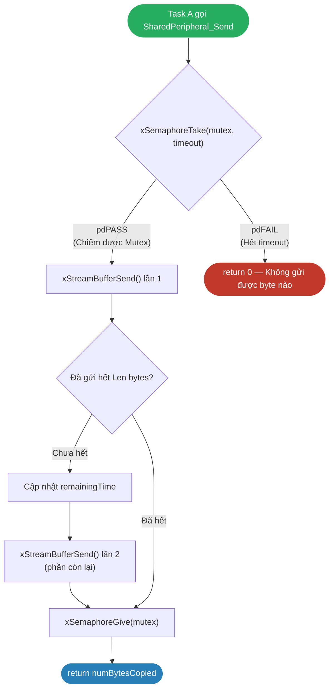
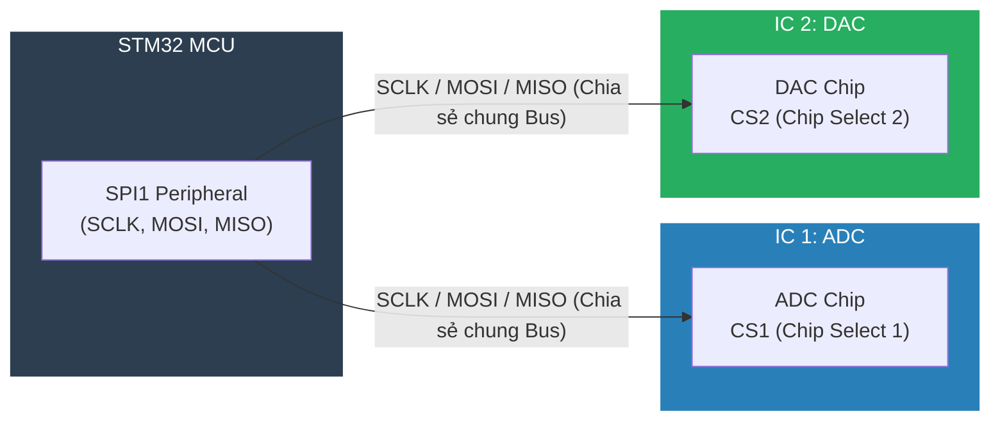
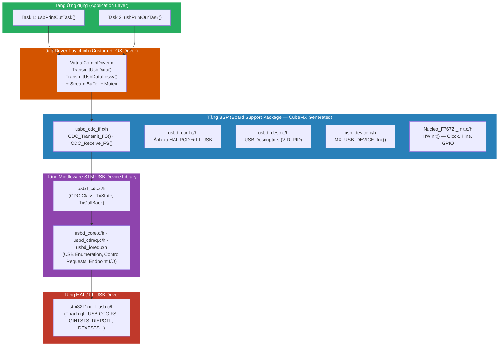
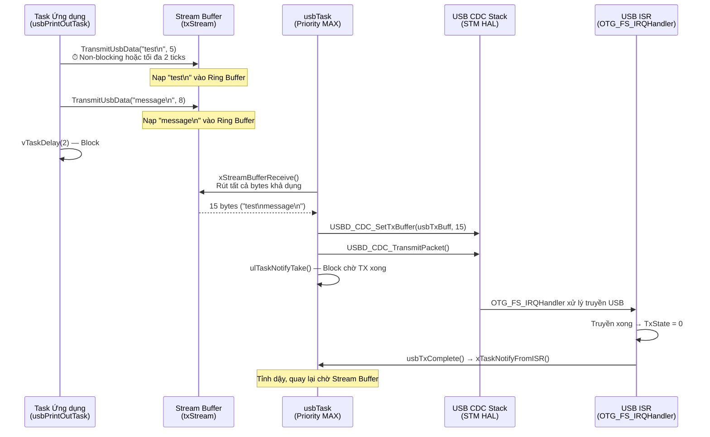

# <span style="color:#f1c40f">📘 Chương 11: Chia sẻ Ngoại vi Phần cứng Giữa Nhiều Task — Sharing Hardware Peripherals across Tasks</span>

> **Sách**: Hands-On RTOS with Microcontrollers (Brian Amos – Packt, 2020)
> **Nền tảng phần cứng**: STM32 Nucleo-F767ZI (ARM Cortex-M7)
> **RTOS**: FreeRTOS v10+

---

## <span style="color:#e67e22">📑 Mục lục</span>

> [!TIP]
> Dùng **Ctrl+F** và tìm `## 1.` hoặc `## B1.` để nhảy nhanh đến từng mục.

```
PHẦN A — KỸ THUẬT CHIA SẺ NGOẠI VI GIỮA NHIỀU TASK (Tổng quát)
 1. Hiểu Bài toán Ngoại vi Chia sẻ  — Ví dụ UART/I2C/SPI, khi nào KHÔNG nên chia sẻ
 2. Sử dụng Mutex bảo vệ Đa Task    — API Stream Buffer, cơ chế phối hợp, code mẫu
    ├─ 2.1 Vấn đề 1-Writer          — Lockless FIFO, tại sao lỗi, so sánh Queue
    ├─ 2.2 Mẫu Code Tổng quát       — SharedPeripheral_Send với timeout tracking
    ├─ 2.3 Khắc phục Vấn đề Mutex   — Priority Inversion, Deadlocks, Recursive, Gatekeeper
    ├─ 2.4 Cơ chế Nhận Đa Task      — Phân phối (Dispatcher Task), Đăng ký (Pub-Sub)
    └─ 2.5 Cơ chế Gửi Đa Task       — Tuần tự hóa Mutex, Hộ vệ (Gatekeeper Task)
 3. Đảm bảo Giao dịch Nguyên tử     — SPI Bus 1 ADC + 1 DAC, cs control, race condition
 4. Đánh đổi Thiết kế               — Latency vs CPU Efficiency, RAM Usage
 5. Tổng kết & Bài học Kiến trúc    — Key Takeaways
 6. Câu hỏi Ôn tập                  — 5 câu hỏi & đáp án chi tiết
 7. Bảng Tổng hợp API               — Danh sách 11 API FreeRTOS/STM32

PHẦN B — PHỤ LỤC: VÍ DỤ THỰC HÀNH USB CDC VIRTUAL COM PORT (Tham khảo)
 B1. Yêu cầu & USB CDC Stack        — USB Enumeration, kiến trúc 5 tầng phần mềm
 B2. Bài toán Mất Dữ liệu CDC       — Naive code, lỗi USBD_BUSY, 3 phương án giải quyết
 B3. Triển khai Driver USB VCP       — Thay đổi middleware, TxCallBack, usbTask, tối ưu 94% CPU
 B4. Mở rộng Multi-Task với Mutex   — vcom_mutexPtr, 2 task ghi song song
```

---

# <span style="color:#f1c40f">PHẦN A — KỸ THUẬT CHIA SẺ NGOẠI VI GIỮA NHIỀU TASK (Tổng quát)</span>

---

## <span style="color:#e67e22">1. Hiểu Bài toán Ngoại vi Chia sẻ — Understanding Shared Peripherals</span>

### <span style="color:#1abc9c">1.1 Bối cảnh & Mục tiêu Chương (Context & Objectives)</span>

Ở [Chương 10](file:///D:/COURSE/STM32/RTOS/Hands-On-RTOS-Book-Notes/Chapter_10_Drivers_and_ISRs.md), chúng ta đã phát triển các Driver ngoại vi (UART Queue, Buffer+Semaphore, DMA+Stream Buffer), nhưng **mỗi Driver chỉ được sử dụng bởi DUY NHẤT 1 Task**. Trong thực tế hệ thống RTOS đa nhiệm, **nhiều Task cùng cần truy cập một ngoại vi phần cứng duy nhất** (ví dụ: SPI, I2C, USB, UART).

> [!IMPORTANT]
> Khi chia sẻ 1 ngoại vi phần cứng cho nhiều Task, cần thêm cơ chế phân xử (Arbitration) để đảm bảo truy cập tuần tự, an toàn và không bị xung đột dữ liệu (Race Condition).

Chương này tập trung vào việc **xây dựng mã nguồn Thread-safe phía trên (on top of) một Driver Stack sẵn có** của nhà sản xuất, thay vì viết Driver từ thanh ghi cấp thấp.

### <span style="color:#1abc9c">1.2 Khái niệm Cốt lõi (Core Concepts)</span>

#### <span style="color:#3498db">1. Ngoại vi Chia sẻ là gì?</span>
Ngoại vi phần cứng (SPI, I2C, UART, USB, Ethernet...) là **tài nguyên dùng chung (Shared Resource)** giống như biến toàn cục hay vùng nhớ RAM chung. Khi nhiều Task muốn truy cập cùng một ngoại vi, cần phải có **cơ chế phân xử (Arbitration Mechanism)** để đảm bảo:
- Tại mỗi thời điểm, chỉ **duy nhất 1 Task** được quyền sử dụng ngoại vi.
- Dữ liệu không bị xen kẽ (Interleaved) hoặc ghi đè (Overwritten) giữa các Task.

**Ví dụ thực tế trong Embedded:**
* **Nhiều Task in Log qua 1 UART**: `Task_Sensor`, `Task_Motor`, `Task_Network` cùng gọi `printf()` qua UART2 ➔ Nếu không có Mutex, Terminal nhận chuỗi lộn xộn xen kẽ giữa các Task.
* **Nhiều Task gửi AT Command qua 1 UART nối Module SIM**: `Task_SMS` và `Task_HTTP` cùng gửi lệnh AT qua UART3 ➔ Cần Mutex bao trọn toàn bộ giao dịch (Gửi → Chờ phản hồi → Xử lý), nếu Task khác xen vào giữa chừng thì Module SIM nhận lệnh sai.
* **3 cảm biến dùng chung 1 bus I2C**: BME280, MPU6050, AT24C32 cùng nối I2C1 ➔ Nếu Task đọc ADC bị Task khác giành bus giữa chừng, cả 2 giao dịch đều hỏng.

> [!TIP]
> **Nguyên tắc**: Ngoại vi bị chia sẻ khi **số phần cứng vật lý < số Task cần dùng** — rất phổ biến vì MCU có số ngoại vi hạn chế và mỗi ngoại vi bổ sung tốn thêm chân GPIO, PCB, chi phí BOM.

#### <span style="color:#3498db">2. Cảnh báo Quan trọng về Thời gian Thực</span>

> [!WARNING]
> **Chia sẻ một ngoại vi đơn lẻ cho nhiều Task sẽ tạo ra Trễ (Delay) và Bất định Thời gian (Timing Uncertainty)!**

Các lời gọi blocking của RTOS (`xSemaphoreTake`, `xQueueReceive`...) có thể đặt **giới hạn thời gian chờ (Timeout)**, giúp dễ dàng phát hiện khi việc truy cập ngoại vi chia sẻ gây ra vi phạm deadline.

### <span style="color:#1abc9c">1.3 Khi nào KHÔNG nên Chia sẻ Ngoại vi? (When NOT to Share Peripherals)</span>

#### <span style="color:#3498db">Trường hợp 1: Yêu cầu Thời gian Thực Nghiêm ngặt (Hard Real-Time)</span>
Khi timing cực kỳ quan trọng (ví dụ: điều khiển motor, sampling ADC tốc độ cao), **tốt nhất là dùng phần cứng ngoại vi riêng biệt (Dedicated Peripheral)** cho mỗi Task thay vì chia sẻ. Đây là lý do MCU có nhiều bộ SPI, USART, I2C — mặc dù 1 bus hoàn toàn có khả năng phục vụ nhiều thiết bị, nhưng **dùng bus riêng sẽ loại bỏ hoàn toàn Blocking Delay do Arbitration**.

#### <span style="color:#3498db">Trường hợp 2: Ngoại vi Băng thông Cao (High-Bandwidth Peripherals)</span>
Các ngoại vi như ADC sampling hàng ngàn hoặc hàng chục ngàn điểm dữ liệu mỗi giây nên được dành riêng cho 1 Task và kết hợp **DMA** để truyền dữ liệu trực tiếp từ bus giao tiếp (SPI) vào RAM mà không tốn CPU.

---

## <span style="color:#e67e22">2. Sử dụng Mutex bảo vệ Truy cập Đa Task — Using Mutexes for Access Control</span>

### <span style="color:#1abc9c">2.1 Vấn đề: Stream Buffer chỉ hỗ trợ 1 Writer</span>

#### <span style="color:#3498db">1. FreeRTOS Stream Buffer là gì?</span>

**Stream Buffer** (có từ FreeRTOS v10+) là một **bộ đệm vòng (Ring Buffer / Circular Buffer)** được FreeRTOS quản lý, cho phép truyền một **dòng byte liên tục** từ 1 bên gửi (Producer) sang 1 bên nhận (Consumer) — giống như ống nước (pipe).

```
Producer (Task/ISR)                           Consumer (Task)
      │                                            ▲
      │  xStreamBufferSend(buf, len)               │  xStreamBufferReceive(buf, len)
      ▼                                            │
┌─────────────────────────────────────────────────────┐
│  [B][y][t][e][0][1][2][3][...][...][...][...]      │ ← Ring Buffer (RAM)
│   ▲ Write Pointer                Read Pointer ▲    │
└─────────────────────────────────────────────────────┘
            Trigger Level = N bytes
            (đánh thức Consumer khi đủ N bytes)
```

**Các API chính:**

#### <span style="color:#3498db">🔹 xStreamBufferCreate()</span>
```c
StreamBufferHandle_t xStreamBufferCreate( 
                        size_t xBufferSizeBytes, 
                        size_t xTriggerLevelBytes );
```
* **Mục đích**: Khởi tạo động một Stream Buffer và trả về handle quản lý.
* **Tham số**:
  * `xBufferSizeBytes`: Tổng số byte của vùng đệm (Ring Buffer).
  * `xTriggerLevelBytes`: Ngưỡng kích hoạt (số byte tối thiểu phải có sẵn trong Stream Buffer trước khi Task gọi `xStreamBufferReceive()` được đánh thức).

#### <span style="color:#3498db">🔹 xStreamBufferSend()</span>
```c
size_t xStreamBufferSend( 
                        StreamBufferHandle_t xStreamBuffer,
                        const void *pvTxData,
                        size_t xDataLengthBytes,
                        TickType_t xTicksToWait );
```
* **Mục đích**: Ghi dữ liệu từ Task vào Stream Buffer.
* **Tham số**:
  * `xStreamBuffer`: Handle của buffer cần ghi.
  * `pvTxData`: Con trỏ trỏ tới dữ liệu cần truyền đi.
  * `xDataLengthBytes`: Số lượng byte cần ghi vào buffer.
  * `xTicksToWait`: Thời gian block tối đa (đơn vị ticks) để chờ nếu buffer đang bị đầy.

#### <span style="color:#3498db">🔹 xStreamBufferReceive()</span>
```c
size_t xStreamBufferReceive( 
                        StreamBufferHandle_t xStreamBuffer,
                        void *pvRxData,
                        size_t xBufferLengthBytes,
                        TickType_t xTicksToWait );
```
* **Mục đích**: Đọc dữ liệu từ Stream Buffer ra Task nhận.
* **Tham số**:
  * `xStreamBuffer`: Handle của buffer cần đọc.
  * `pvRxData`: Con trỏ trỏ tới vùng nhớ nhận dữ liệu.
  * `xBufferLengthBytes`: Số byte tối đa muốn đọc.
  * `xTicksToWait`: Thời gian block tối đa (đơn vị ticks) để chờ nếu lượng dữ liệu trong buffer chưa đạt ngưỡng `xTriggerLevelBytes`.

#### <span style="color:#3498db">🔹 xStreamBufferSendFromISR() / xStreamBufferReceiveFromISR()</span>
```c
size_t xStreamBufferSendFromISR( 
                        StreamBufferHandle_t xStreamBuffer,
                        const void *pvTxData,
                        size_t xDataLengthBytes,
                        BaseType_t *pxHigherPriorityTaskWoken );

size_t xStreamBufferReceiveFromISR( 
                        StreamBufferHandle_t xStreamBuffer,
                        void *pvRxData,
                        size_t xBufferLengthBytes,
                        BaseType_t *pxHigherPriorityTaskWoken );
```
* **Mục đích**: Ghi/Nhận dữ liệu từ bên trong ngắt (Interrupt Service Routine - ISR).
* **Tham số**:
  * `pxHigherPriorityTaskWoken`: Con trỏ kiểm tra xem có Task ưu tiên cao hơn bị đánh thức hay không để gọi `portYIELD_FROM_ISR()`. Không có tham số timeout vì ISR không bao giờ được phép block.


#### <span style="color:#3498db">2. Tại sao Stream Buffer chỉ cho phép 1 Writer và 1 Reader?</span>

Stream Buffer được thiết kế theo thuật toán **Lockless FIFO (Single-Pointer)** — chỉ dùng **1 con trỏ Write** và **1 con trỏ Read** mà KHÔNG có cơ chế khóa (Critical Section / Mutex) bên trong. Điều này mang lại **tốc độ cực nhanh** (không overhead khóa/mở khóa), nhưng đổi lại:

> [!CAUTION]
> **Nếu 2 Task cùng gọi `xStreamBufferSend()` đồng thời, cả 2 sẽ đọc cùng 1 giá trị Write Pointer → ghi đè lên cùng vùng nhớ → Data Corruption!**

**Ví dụ lỗi khi vi phạm:**
```
Task A: xStreamBufferSend("AAAA", 4)  ──┐  Cả 2 đọc Write Pointer = 100
Task B: xStreamBufferSend("BBBB", 4)  ──┘  Cả 2 ghi vào vị trí 100-103
                                            ↓
Ring Buffer tại [100-103]: "BBBB"  ← "AAAA" bị ghi đè hoàn toàn!
Write Pointer bị cập nhật sai → Buffer hỏng vĩnh viễn
```

#### <span style="color:#3498db">3. Cơ chế Phối hợp: Mutex + Stream Buffer Bảo vệ Đa Task</span>

Để giải quyết triệt để vấn đề chia sẻ ngoại vi, chúng ta kết hợp **Mutex** (lớp bảo vệ phân xử) và **Stream Buffer** (ống dẫn dữ liệu) theo mô hình kiến trúc dưới đây:

```
[Task Ghi A] ──┐
[Task Ghi B] ──┼──► [ 🔒 MUTEX ] ──► [ 🌊 STREAM BUFFER ] ──► [ Task Đọc / Driver ] ──► [ Ngoại vi ]
[Task Ghi C] ──┘   (Phân xử ghi)    (Đệm dữ liệu lockless)     (Consumer duy nhất)        (UART/USB...)
```

Cơ chế phối hợp hoạt động cụ thể qua 4 bước:

##### Bước 1: Phân xử Ghi (Serialization) bằng Mutex
Khi nhiều Task (`Task A`, `Task B`...) muốn gửi dữ liệu ra ngoại vi cùng lúc, chúng bắt buộc phải tranh chấp một Mutex dùng chung (`peripheralMutex`). 
* Tại một thời điểm, chỉ **duy nhất 1 Task** (ví dụ `Task A`) chiếm được Mutex này.
* Lớp Mutex này đã biến mô hình **Nhiều Task ghi (Multi-Writer)** phức tạp thành mô hình **1 Task ghi duy nhất (Single-Writer)** ảo tại thời điểm chạy. Điều này bảo vệ an toàn cho con trỏ Write Pointer của Stream Buffer không bị xung đột.

##### Bước 2: Bảo vệ tính toàn vẹn của Gói dữ liệu (No Interleaving)
Nếu không có Mutex, các ký tự của Task A và Task B sẽ bị xen kẽ lộn xộn trong buffer. Nhờ Mutex bao bọc trọn vẹn toàn bộ quá trình gọi `xStreamBufferSend()`, `Task A` sẽ ghi **hoàn chỉnh toàn bộ chuỗi dữ liệu** của nó vào Stream Buffer rồi mới nhả Mutex cho `Task B` vào ghi tiếp. Dữ liệu đầu ra ngoại vi sẽ liền mạch và dễ đọc.

##### Bước 3: Đệm dữ liệu Lockless bằng Stream Buffer
Sau khi qua cửa ải Mutex, dữ liệu được ghi vào Stream Buffer. Do phía trong Stream Buffer là thuật toán Lockless Ring Buffer cực kỳ tối ưu, việc copy dữ liệu vào buffer diễn ra với tốc độ tối đa của RAM mà không bị ảnh hưởng bởi các cơ chế ngắt hay lock phức tạp.

##### Bước 4: Đọc dữ liệu Đơn luồng (Single Reader)
Ở đầu ra của Stream Buffer, chỉ có **duy nhất 1 Task Đọc** (thường là Task chạy ngầm của Driver) gọi `xStreamBufferReceive()` để rút dữ liệu ra và đẩy trực tiếp vào thanh ghi ngoại vi phần cứng (hoặc qua DMA). Vì chỉ có 1 Reader và 1 Writer ảo (đã lọc qua Mutex), hoạt động đọc/ghi hoàn toàn song song, không bao giờ xảy ra Race Condition trên con trỏ Read/Write.

```
Task A: [xSemaphoreTake] ──► [xStreamBufferSend("AAAA")] ──► [xSemaphoreGive]
                                                                   │ (Giải phóng Mutex)
Task B:          [Chờ đợi Mutex...] ───────────────────────────────┴──► [xSemaphoreTake] ──► [xStreamBufferSend("BBBB")] ...
```

#### <span style="color:#3498db">4. So sánh: Stream Buffer vs. Queue khi dùng Đa Task</span>

| Tiêu chí | Stream Buffer | Queue |
|:---|:---|:---|
| **Cấu trúc nội bộ** | Ring Buffer thô (byte array) | Mảng các slot có kích thước cố định |
| **Đa Writer** | ❌ Không hỗ trợ — cần Mutex ngoài | ✅ Hỗ trợ sẵn (có Critical Section nội bộ) |
| **Tốc độ** | Cực nhanh (memcpy trực tiếp) | Chậm hơn (copy từng phần tử + lock/unlock) |
| **RAM** | Tiết kiệm (chỉ lưu byte thô) | Tốn hơn (header metadata mỗi phần tử) |
| **Dùng khi** | 1 Producer, 1 Consumer, tốc độ cao | Nhiều Producer/Consumer, an toàn sẵn |

> [!TIP]
> **Tóm lại**: Nếu chỉ có 1 Task ghi → dùng **Stream Buffer** (nhanh nhất). Nếu nhiều Task ghi → dùng **Stream Buffer + Mutex** (nhanh + an toàn) hoặc **Queue** (an toàn sẵn nhưng chậm hơn).

### <span style="color:#1abc9c">2.2 Mẫu Code Tổng quát: Hàm Ghi Ngoại vi bọc Mutex với Timeout Tracking</span>

**Mục đích**: Cho phép nhiều Task gọi hàm ghi ngoại vi đồng thời một cách an toàn. Thời gian chờ tối đa (`DelayMs`) được theo dõi chính xác bằng `xTaskGetTickCount()` để tổng thời gian block không vượt quá giới hạn cho phép.

```c
int32_t SharedPeripheral_Send(uint8_t const* Buff, uint16_t Len, int32_t DelayMs)
{
    int32_t numBytesCopied = 0;
    const uint32_t delayTicks = DelayMs / portTICK_PERIOD_MS;
    const uint32_t startingTime = xTaskGetTickCount();
    uint32_t endingTime = startingTime + delayTicks;
    
    // 1. Chiếm Mutex — nếu Task khác đang giữ, block tối đa delayTicks
    if(xSemaphoreTake(peripheralMutex, delayTicks ) == pdPASS)
    {
        // 2. Tính thời gian còn lại sau khi chờ Mutex
        uint32_t remainingTime = endingTime - xTaskGetTickCount();
        
        // 3. Lần gửi thứ 1
        numBytesCopied = xStreamBufferSend( txStream, Buff, Len, remainingTime);
        if(numBytesCopied != Len)
        {
            // 4. Cập nhật lại thời gian còn lại
            remainingTime = endingTime - xTaskGetTickCount();
            // 5. Lần gửi thứ 2 — gửi phần còn lại
            numBytesCopied += xStreamBufferSend( txStream,
                                                 Buff + numBytesCopied,
                                                 Len - numBytesCopied,
                                                 remainingTime);
        }
        // 6. Giải phóng Mutex
        xSemaphoreGive(peripheralMutex);
    }
    return numBytesCopied;
}
```



#### <span style="color:#3498db">Điểm mấu chốt trong Pattern này:</span>
* **Theo dõi thời gian elapsed**: Sau mỗi lần gọi FreeRTOS API blocking (`xSemaphoreTake`, `xStreamBufferSend`), tính lại `remainingTime` để tổng thời gian block không vượt quá `DelayMs`.
* **Tách thành 2 lần gửi**: Nếu lần 1 chỉ gửi được một phần (buffer đầy), chờ thêm `remainingTime` để consumer Task rút bớt dữ liệu rồi gửi tiếp phần còn lại.
* **Quy ước đặt tên C**: Vì C không có namespace, tất cả biến toàn cục nên thêm tiền tố module (ví dụ `vcom_`, `spi_`, `uart_`) để tránh xung đột tên.

### <span style="color:#1abc9c">2.3 Khắc phục các Vấn đề Phát sinh khi dùng Mutex chia sẻ Ngoại vi</span>

Sử dụng Mutex là giải pháp phổ biến nhất để phân xử (Arbitration) truy cập ngoại vi, nhưng nó tự bản thân gây ra các vấn đề nghiêm trọng về mặt thời gian thực và an toàn hệ thống. Dưới đây là các vấn đề và cách khắc phục:

#### <span style="color:#3498db">1. Giải quyết Nghịch đảo Mức ưu tiên (Priority Inversion)</span>
* **Vấn đề**: Task ưu tiên thấp (Low-priority) chiếm Mutex ngoại vi UART để in debug. Task ưu tiên cao (High-priority) cần UART nên bị block chờ Mutex. Một Task ưu tiên trung bình (Medium-priority) xuất hiện, chiếm CPU của Task thấp → Gián tiếp làm nghẽn Task cao vô thời hạn.
* **Cách khắc phục**:
  * **Cơ chế Kế thừa Mức ưu tiên (Priority Inheritance)**: FreeRTOS Mutex hỗ trợ sẵn cơ chế này. Khi Task cao bị block bởi Mutex, FreeRTOS tạm thời nâng mức ưu tiên của Task thấp lên bằng mức ưu tiên của Task cao để nó hoàn thành việc ghi ngoại vi nhanh nhất có thể, giải phóng Mutex, sau đó trả lại mức ưu tiên ban đầu.
  * **Cảnh báo**: Kế thừa mức ưu tiên chỉ giảm thiểu (mitigate) chứ không triệt tiêu hoàn toàn timing jitter. Do đó, với các deadline cực kỳ nghiêm ngặt, vẫn khuyến nghị dùng ngoại vi phần cứng độc lập.

#### <span style="color:#3498db">2. Tránh Bế tắc (Deadlocks)</span>
* **Vấn đề**: Task A chiếm Mutex ngoại vi SPI rồi bị Preempt. Task B chạy, chiếm Mutex bộ nhớ Flash bên ngoài (giao tiếp qua SPI), sau đó yêu cầu Mutex SPI → Task B bị block. Task A chạy tiếp, cần đọc ghi Flash nên yêu cầu Mutex Flash → Cả hai Task block lẫn nhau vô thời hạn.
* **Cách khắc phục**:
  * **Khóa theo thứ tự nghiêm ngặt (Strict Locking Order)**: Quy định tất cả các Task khi cần cả 2 tài nguyên phải lấy theo đúng thứ tự (ví dụ: luôn lấy Mutex SPI trước, rồi mới lấy Mutex Flash).
  * **Tránh block vô hạn**: Không dùng `portMAX_DELAY` khi `xSemaphoreTake()`. Thay vào đó, đặt một timeout hợp lý. Nếu hết timeout không lấy được Mutex, giải phóng mọi Mutex đang giữ và báo lỗi để khôi phục hệ thống.

#### <span style="color:#3498db">3. Hỗ trợ Lời gọi Đệ quy (Nested/Recursive Calls)</span>
* **Vấn đề**: Một hàm Driver UART lấy Mutex để ghi dữ liệu. Trong quá trình chạy, nó gọi một hàm con trong thư viện Driver, hàm con này lại cố gắng lấy chính Mutex UART đó một lần nữa → Task tự block chính mình (Deadlock nội bộ).
* **Cách khắc phục**:
  * Sử dụng **Recursive Mutex** thông qua API `xSemaphoreCreateRecursiveMutex()`.
  * Khi đó, Task giữ khóa có thể lấy khóa nhiều lần một cách an toàn. Giải phóng khóa bằng cách gọi `xSemaphoreGiveRecursive()` đúng bằng số lần đã lấy khóa.

#### <span style="color:#3498db">4. Phương án Thay thế: Kiến trúc Gatekeeper Task (Lock-Free Alternative)</span>
Nếu việc quản lý Mutex quá phức tạp hoặc có nguy cơ cao xảy ra Deadlock, kỹ sư nhúng thường chuyển sang sử dụng **Gatekeeper Task (Task Hộ vệ)**:
* **Nguyên lý**: Chỉ duy nhất 1 Task (Gatekeeper) được phép truy cập và điều khiển ngoại vi phần cứng đó.
* **Tương tác**: Tất cả các Task khác muốn gửi/nhận dữ liệu qua ngoại vi sẽ không lấy khóa phần cứng trực tiếp, mà gửi tin nhắn chứa dữ liệu vào một **FreeRTOS Queue** chung của Gatekeeper Task. Gatekeeper Task sẽ lần lượt rút tin nhắn ra và ghi vào ngoại vi.
* **Ưu điểm**:
  * Loại bỏ hoàn toàn việc dùng Mutex, không lo Priority Inversion hay Deadlock.
  * Đơn giản hóa kiến trúc Driver.

### <span style="color:#1abc9c">2.4 Cơ chế Nhận dữ liệu từ Ngoại vi về Đa Task (Shared Receiver Design Patterns)</span>

Trong khi việc **gửi** dữ liệu (Transmit) tập trung vào việc **xếp hàng (Serialization)** nhiều Task ghi vào 1 ngoại vi, việc **nhận** dữ liệu (Receive) từ ngoại vi chia sẻ về nhiều Task lại đối mặt với bài toán hoàn toàn khác: **Định tuyến (Routing) và Tránh Phân mảnh Dữ liệu (Data Fragmentation)**.

#### <span style="color:#3498db">1. Vấn đề khi nhiều Task cùng đọc chung 1 Buffer nhận (Data Splitting)</span>
Nếu ta cho phép nhiều Task (`Task A`, `Task B`) cùng gọi `xStreamBufferReceive()` hoặc `xQueueReceive()` trên cùng một Buffer RX của ngoại vi:

```
[ Luồng dữ liệu tới: "HELLOWORLD" ] ──► [ 🌊 Buffer RX Chung ]
                                               │
                                               ├─► Task A gọi Receive() ➔ Nhận được: "HEL"
                                               └─► Task B gọi Receive() ➔ Nhận được: "LOWORLD"
```

> [!CAUTION]
> **Phân mảnh dữ liệu**: Scheduler sẽ đánh thức bất kỳ Task nào đang block trước. Kết quả là chuỗi dữ liệu nhận được bị xé lẻ ngẫu nhiên giữa các Task, làm hỏng hoàn toàn gói tin (Packet Corruption).

Để giải quyết vấn đề này, các kỹ sư nhúng sử dụng 2 mô hình thiết kế chuẩn dưới đây:

#### <span style="color:#3498db">2. Mô hình Task Phân phối (Dispatcher / Router Task Pattern)</span>

Đây là mô hình phổ biến nhất khi các Task cần nhận các gói dữ liệu khác nhau từ cùng một cổng ngoại vi (ví dụ: Module SIM nhận phản hồi AT Cmd cho Task HTTP và SMS, hoặc nhận dữ liệu CAN Bus cho các node cảm biến khác nhau).

##### Nguyên lý hoạt động:
1. **ISR ngoại vi** chỉ làm nhiệm vụ duy nhất: đọc thanh ghi phần cứng và đẩy byte vào **1 Buffer RX nội bộ duy nhất** (Private RX Stream Buffer).
2. Tạo ra **1 Task Hộ vệ/Phân phối (Dispatcher Task)** duy nhất làm nhiệm vụ đọc dữ liệu từ Buffer RX nội bộ này. Điều này đảm bảo đúng nguyên tắc **Single-Reader** của Stream Buffer.
3. Dispatcher Task sẽ đóng vai trò **Bộ phân tích cú pháp (Parser)**:
   * Đọc dữ liệu ra và ghép thành gói tin hoàn chỉnh.
   * Phân tích Header của gói tin (ví dụ: Kiểm tra ID cảm biến, kiểm tra mã AT Command, hoặc địa chỉ đích).
   * Dựa vào thông tin định tuyến, Dispatcher Task sẽ đẩy **trọn vẹn gói tin** vào Queue riêng của Task đích tương ứng (`Queue A` cho `Task A`, `Queue B` cho `Task B`).

##### Sơ đồ hoạt động:
```
[ Ngoại vi ] ──► [ Ngắt ISR ] ──► [ 🌊 Private RX Buffer ] ──► [ 🧑‍✈️ Dispatcher Task ]
                                                                       │ (Phân tích Header & ID)
                                                                       ├─► [ Queue A ] ──► [ Task A ]
                                                                       └─► [ Queue B ] ──► [ Task B ]
```

##### Ưu điểm:
* Đảm bảo tính toàn vẹn dữ liệu: Không Task nào bị nhận thiếu/trộn dữ liệu.
* Tách biệt hoàn toàn tầng logic ứng dụng khỏi tầng Driver phần cứng.

#### <span style="color:#3498db">3. Mô hình Đăng ký/Nhận tin (Publish-Subscribe Broker Pattern)</span>

Mô hình này áp dụng khi dữ liệu nhận được từ ngoại vi là **dữ liệu quảng bá (Broadcast)** mà **tất cả hoặc nhiều Task đều cần bản sao** (ví dụ: dữ liệu tọa độ từ Module GPS, dữ liệu thời gian đồng bộ, hoặc các trạng thái khẩn cấp của hệ thống).

##### Nguyên lý hoạt động:
1. Dispatcher Task (lúc này đóng vai trò là **Broker**) đọc gói dữ liệu từ Buffer RX.
2. Thay vì gửi cho 1 Task duy nhất, Broker sẽ duyệt qua danh sách các Task đã đăng ký nhận tin (Subscribers).
3. Broker sẽ **sao chép gói tin (Duplicate)** và gửi bản sao vào Queue của từng Task đang đăng ký.

```
[ Dữ liệu GPS ] ──► [ 🧑‍✈️ Broker Task ]
                            │ (Sao chép dữ liệu)
                            ├─► [ GPS Queue 1 ] ──► [ Task Lưu thẻ SD ]
                            ├─► [ GPS Queue 2 ] ──► [ Task Gửi Server ]
                            └─► [ GPS Queue 3 ] ──► [ Task Hiển thị LCD ]
```

### <span style="color:#1abc9c">2.5 Cơ chế Gửi dữ liệu ra Ngoại vi từ Đa Task (Shared Transmitter Design Patterns)</span>

Đối với chiều **gửi** dữ liệu (Transmit) từ nhiều Task ra một ngoại vi dùng chung, mục tiêu cốt lõi là **ngăn chặn sự xen kẽ (Interleaving) dữ liệu** và **tránh xung đột phần cứng** khi nhiều Task ghi đồng thời. Có 2 mô hình thiết kế chuẩn được áp dụng:

#### <span style="color:#3498db">1. Mô hình Phân xử bằng Mutex (Mutex-based Serialization)</span>

Đây là mô hình chúng ta đã triển khai chi tiết ở mục 2.1 và 2.2.

##### Nguyên lý hoạt động:
* Các Task gọi trực tiếp hàm API gửi dữ liệu.
* Hàm API này sử dụng một Mutex chung (`peripheralMutex`) để bảo vệ tài nguyên. Task muốn ghi phải chiếm được Mutex.
* Khi Task giữ Mutex, nó có đặc quyền ghi dữ liệu (ví dụ ghi vào Stream Buffer hoặc ghi thẳng ra thanh ghi UART). Các Task khác cố gắng ghi sẽ bị block ở lớp Mutex.

##### Sơ đồ hoạt động:
```
[ Task A ] ──┐
[ Task B ] ──┼──► [ 🔒 MUTEX ] ──► [ 🌊 Buffer / Ngoại vi ]
[ Task C ] ──┘   (Phân xử ghi)
```

##### Đánh giá:
* **Ưu điểm**:
  * **Độ trễ thấp (Low Latency)**: Dữ liệu được ghi trực tiếp vào buffer/ngoại vi ngay khi có Mutex, không qua trung gian.
  * **Tiết kiệm RAM**: Không cần thêm Queue đệm trung gian cho mỗi Task.
* **Nhược điểm**: Có nguy cơ xảy ra Nghịch đảo ưu tiên (Priority Inversion) hoặc Bế tắc (Deadlocks) nếu thiết kế timeout không tốt.

#### <span style="color:#3498db">2. Mô hình Task Hộ vệ (Gatekeeper Task Pattern)</span>

Mô hình này là giải pháp thay thế an toàn (Lock-Free) giúp loại bỏ hoàn toàn các vấn đề liên quan đến việc dùng Mutex.

##### Nguyên lý hoạt động:
1. Chỉ duy nhất **1 Task chuyên dụng (Gatekeeper Task)** được phép ghi dữ liệu trực tiếp vào ngoại vi phần cứng.
2. Các Task ứng dụng (`Task A`, `Task B`) muốn gửi dữ liệu sẽ không chiếm khóa phần cứng, thay vào đó chúng đóng gói dữ liệu và gửi vào một **FreeRTOS Queue chung (TX Queue)**.
3. Gatekeeper Task chạy ở chế độ nền, liên tục đọc (block) trên TX Queue. Khi có tin nhắn tới, nó lấy dữ liệu ra và ghi tuần tự vào ngoại vi phần cứng.

##### Sơ đồ hoạt động:
```
[ Task A ] ──┐
[ Task B ] ──┼──► [ 📦 TX Queue ] ──► [ 🧑‍✈️ Gatekeeper Task ] ──► [ Ngoại vi ]
[ Task C ] ──┘   (Hàng đợi gửi)        (Consumer duy nhất)
```

##### Đánh giá:
* **Ưu điểm (Thân thiện thời gian thực)**:
  * **Lock-Free**: Các Task ứng dụng không bao giờ block chờ Mutex ngoại vi, giúp tránh hoàn toàn Deadlock và Priority Inversion.
  * Thiết kế hệ thống rõ ràng, phân rã trách nhiệm (Decoupling) tốt.
* **Nhược điểm**: 
  * Tốn thêm tài nguyên RAM để khởi tạo TX Queue.
  * Tăng trễ (Latency) do dữ liệu phải đi qua Queue trung gian và tốn thêm CPU context switch cho Gatekeeper Task.

---

## <span style="color:#e67e22">3. Đảm bảo Giao dịch Nguyên tử trên Ngoại vi Chia sẻ — Guaranteeing Atomic Transactions</span>

### <span style="color:#1abc9c">3.1 Khái niệm Giao dịch Nguyên tử (Atomic Transaction) là gì?</span>

Trong hệ điều hành, **tính nguyên tử (Atomicity)** nghĩa là một chuỗi các thao tác liên tiếp phải được thực hiện trọn vẹn như một khối duy nhất: **hoặc là tất cả cùng thành công, hoặc là không có thao tác nào được thực hiện**, và tuyệt đối **không được phép bị ngắt quãng** hay bị xen kẽ bởi các Task khác.

Đối với ngoại vi phần cứng dùng chung (như bus SPI hoặc I2C), **Giao dịch Nguyên tử (Atomic Transaction)** yêu cầu toàn bộ phiên truyền thông với một thiết bị (từ lúc bắt đầu giao tiếp đến lúc kết thúc) phải diễn ra liên tục, độc quyền trên bus.

---

### <span style="color:#1abc9c">3.2 Bẫy thiết kế: "Hàm Thread-Safe nhưng Giao dịch Thread-Unsafe"</span>

> [!CAUTION]
> **Sai lầm phổ biến của lập trình viên**: Nghĩ rằng chỉ cần bọc Mutex bên trong hàm ghi/đọc cấp thấp (ví dụ: bọc trong `HAL_SPI_Transmit()`) là hệ thống đã thread-safe. 
> 
> Thực tế: Một giao dịch phần cứng hoàn chỉnh thường gồm **nhiều công đoạn liên tiếp (Multi-Stage)**. Nếu chỉ bảo vệ riêng lẻ từng hàm con, Task khác có thể xen vào **ở giữa các công đoạn**, gây hỏng toàn bộ giao dịch.

#### 1. Bài toán thực tế: 1 Bus SPI phục vụ 2 cảm biến (ADC & DAC)



* **Dây Bus chung**: SCLK (Clock), MOSI (Master Out Slave In), MISO (Master In Slave Out).
* **Dây chọn chip riêng (Chip Select)**: CS1 nối với ADC, CS2 nối với DAC.
* **Quy luật vật lý**: Thiết bị SPI chỉ lắng nghe bus khi chân CS của nó bị kéo xuống mức thấp (**LOW**).

#### 2. Kịch bản xung đột dữ liệu (Race Condition) khi thiếu tính Nguyên tử

Giao dịch đọc ADC gồm 3 công đoạn:
1. Kéo chân CS1 xuống **LOW** (Kích hoạt ADC).
2. Gọi `HAL_SPI_Transmit()` gửi mã lệnh yêu cầu đọc.
3. Gọi `HAL_SPI_Receive()` để nhận dữ liệu kết quả về.
4. Kéo chân CS1 lên **HIGH** (Giải phóng ADC).

Nếu ta chỉ dùng Mutex bảo vệ riêng lẻ bên trong các hàm `HAL_SPI_Transmit` và `HAL_SPI_Receive`:

```
Thời gian ──►

Task ADC (Ưu tiên THẤP)      Task DAC (Ưu tiên CAO)
┌────────────────────────┐  
│ 1. Kéo CS1 xuống LOW    │  
│ 2. HAL_SPI_Transmit()  │  
└────────────────────────┘  
      💥 BỊ PREEMPT (Bị cướp CPU giữa chừng do hết tick hoặc Task DAC thức dậy)
                            ┌────────────────────────┐
                            │ 1. Kéo CS2 xuống LOW    │ (Lúc này cả CS1 và CS2 đều LOW!)
                            │ 2. HAL_SPI_Transmit()  │ 
                            │ 3. Kéo CS2 lên HIGH    │
                            └────────────────────────┘
                            ┌────────────────────────┐
│ 3. HAL_SPI_Receive()   │◄─┼─ 💥 NHẬN SAI DỮ LIỆU! (Bus SPI bị nhiễu do DAC phản hồi)
│ 4. Kéo CS1 lên HIGH    │  │
└────────────────────────┘  └────────────────────────┘
```

> [!CAUTION]
> **Hậu quả**: Vì chân CS1 vẫn đang ở mức **LOW** khi Task DAC kéo CS2 xuống **LOW**, cả 2 thiết bị ADC và DAC đều cùng lắng nghe và phản hồi lên đường MOSI/MISO đồng thời ➔ Xung đột điện áp, dữ liệu nhận được bị lỗi hoàn toàn, thiết bị có thể bị treo.

---

### <span style="color:#1abc9c">3.3 Giải pháp: Mutex bao trọn toàn bộ Giao dịch Đa bước (Multi-Stage Transaction Mutex)</span>

Để đảm bảo giao dịch nguyên tử, Mutex bắt buộc phải được chiếm giữ **TRƯỚC khi kéo CS xuống LOW** và chỉ được giải phóng **SAU khi đã kéo CS lên HIGH**:

```c
// Hàm đọc ADC an toàn, nguyên tử
int32_t Read_Shared_SPI_ADC(uint8_t* rxData, uint16_t len, uint32_t timeout)
{
    int32_t status = -1;
    
    // 1. Chiếm quyền độc quyền sử dụng Bus SPI1
    if (xSemaphoreTake(spi1BusMutex, timeout) == pdPASS)
    {
        // 2. Bắt đầu giao dịch nguyên tử
        GPIO_SetCS1_LOW(); // Kích hoạt ADC
        
        // 3. Thực hiện truyền nhận dữ liệu (nhiều bước liên tiếp)
        HAL_SPI_Transmit(&hspi1, &cmdByte, 1, 10);
        HAL_SPI_Receive(&hspi1, rxData, len, 10);
        
        // 4. Kết thúc giao dịch nguyên tử
        GPIO_SetCS1_HIGH(); // Hủy kích hoạt ADC
        
        // 5. Giải phóng quyền sử dụng Bus SPI1 cho các Task khác
        xSemaphoreGive(spi1BusMutex);
        status = 0;
    }
    return status;
}
```

#### So sánh luồng chạy khi có Mutex bao trọn giao dịch:
1. `Task ADC` chiếm `spi1BusMutex` ➔ Kéo CS1 xuống **LOW** ➔ Truyền lệnh.
2. `Task DAC` (ưu tiên cao) thức dậy, muốn ghi dữ liệu ➔ Gọi `xSemaphoreTake(spi1BusMutex)` nhưng bị **BLOCK** vì `Task ADC` đang giữ khóa.
3. `Task DAC` chuyển sang trạng thái Blocked, nhường CPU lại cho `Task ADC` chạy tiếp.
4. `Task ADC` nhận dữ liệu ➔ Kéo CS1 lên **HIGH** ➔ Giải phóng Mutex.
5. `Task DAC` lập tức tỉnh dậy (do chiếm được Mutex) ➔ Kéo CS2 xuống **LOW** ➔ Truyền dữ liệu an toàn.

---

### <span style="color:#1abc9c">3.4 Ví dụ tương tự trên Bus I2C</span>

Đối với bus I2C, một giao dịch đọc thanh ghi của cảm biến (ví dụ đọc nhiệt độ từ cảm biến I2C) cũng gồm nhiều bước:
1. Send **START** condition + Gửi địa chỉ Write của cảm biến.
2. Gửi địa chỉ thanh ghi muốn đọc.
3. Send **REPEATED START** condition + Gửi địa chỉ Read của cảm biến.
4. Nhận byte dữ liệu.
5. Send **STOP** condition.

> [!IMPORTANT]
> Mutex bảo vệ bus I2C phải được giữ liên tục từ **Bước 1 (START)** cho đến khi hoàn tất **Bước 5 (STOP)**. Nếu nhả Mutex giữa chừng, Task khác ghi đè lên bus làm hỏng chuỗi xung clock I2C.

---

### <span style="color:#1abc9c">3.5 Điều kiện để phương pháp này đạt hiệu quả</span>

Phương pháp dùng Mutex bao trọn giao dịch hoạt động tốt và không làm tê liệt hệ thống thời gian thực khi thỏa mãn **3 điều kiện**:

1. **Giao dịch phần cứng phải nhanh**: Tốc độ bus (SPI/I2C) phải đủ cao (hàng MHz) để mỗi giao dịch chỉ diễn ra trong vài micro giây ($\mu s$) đến tối đa vài mili giây ($ms$).
2. **Không có Task nào giữ Mutex quá lâu**: Tránh việc tính toán toán học phức tạp hoặc delay (`vTaskDelay`) trong khi đang giữ Mutex ngoại vi.
3. **Chấp nhận Timing Jitter nhẹ**: Các Task ứng dụng chấp nhận việc bị trễ vài mili giây để chờ bus rảnh. Nếu yêu cầu Hard Real-Time tuyệt đối không được trễ 1 micro giây nào ➔ bắt buộc dùng ngoại vi phần cứng riêng biệt.

---

## <span style="color:#e67e22">4. Đánh đổi Thiết kế Khi Chia sẻ Ngoại vi — Design Trade-offs</span>

### <span style="color:#1abc9c">4.1 Các Yếu tố Cần Cân nhắc</span>

#### <span style="color:#3498db">1. Latency (Trễ) vs. CPU Efficiency (Hiệu suất CPU)</span>
* **Stream Buffer Trigger Level = 1 byte**: Dữ liệu được truyền ngay lập tức khi có ➔ Trễ thấp nhất, nhưng CPU context-switch liên tục.
* **Stream Buffer Trigger Level = 500 bytes** + Timeout 100 ticks: Gom dữ liệu thành khối lớn rồi mới truyền ➔ **Giảm CPU lên tới 94%**, nhưng trễ tăng lên 100 ms.

#### <span style="color:#3498db">2. RAM Usage (Tiêu thụ RAM)</span>
Sử dụng Stream Buffer / Queue tạo ra **2 lớp buffer**: Buffer RTOS + Buffer phần cứng ngoại vi ➔ Dữ liệu bị sao chép 2 lần (Double Copy). Cần cân bằng giữa kích thước buffer và khả năng chịu tải.

#### <span style="color:#3498db">3. Stream Buffer vs. Queue cho Ngoại vi Chia sẻ</span>

| Tiêu chí | Stream Buffer + Mutex | Queue |
|:---|:---|:---|
| **Multi-Task Write** | Cần Mutex bọc ngoài | Hỗ trợ sẵn, không cần Mutex |
| **Tốc độ** | Cực nhanh (truyền khối byte liên tục) | Chậm hơn (overhead metadata mỗi byte) |
| **RAM** | Tiết kiệm (lưu byte thô) | Tốn hơn (header mỗi phần tử) |
| **Khi nào dùng?** | Ngoại vi tốc độ cao, 1 consumer Task | Ngoại vi tốc độ thấp/trung bình, nhiều consumer |

---

## <span style="color:#e67e22">5. Tổng kết & Bài học Kiến trúc — Summary & Architecture Lessons</span>

### <span style="color:#1abc9c">5.1 Các Điểm Chốt Quan trọng (Key Takeaways)</span>

* **Stream Buffer + Task Notification + Mutex** tạo thành bộ ba công cụ mạnh mẽ để xây dựng Driver ngoại vi chia sẻ hiệu suất cao, event-driven, thread-safe.
* **Đánh đổi cốt lõi**: Latency ↔ CPU Efficiency ↔ RAM Usage ↔ Độ phức tạp Code. Không có giải pháp hoàn hảo cho mọi trường hợp — kỹ sư phải đánh giá từng yếu tố dựa trên yêu cầu cụ thể.
* **Mutex bao trọn giao dịch** là Pattern tiêu chuẩn công nghiệp để chia sẻ Bus SPI/I2C giữa nhiều IC qua nhiều Task.
* **Tránh đưa Business Logic vào ISR** — chỉ nên gửi Notification/Semaphore/xStreamBufferSendFromISR rồi trả CPU cho RTOS xử lý trong Task.

### <span style="color:#1abc9c">5.2 Chuyển tiếp sang Chương 12</span>

Chương tiếp theo sẽ tập trung vào **Kiến trúc Phần mềm Firmware Linh hoạt (Well-Abstracted Architecture)** — tránh bẫy "Copy-Paste-Modify" khi bắt đầu dự án mới, thay vào đó xây dựng hệ thống module hóa có thể tái sử dụng Driver đã kiểm chứng giữa các dự án.

---

## <span style="color:#e67e22">6. Câu hỏi Ôn tập — Review Questions</span>

#### <span style="color:#3498db">Câu 1: Luôn luôn tốt nhất là giảm thiểu số lượng ngoại vi phần cứng được sử dụng?</span>
- ✅ **FALSE** (Sai) — Khi timing cực kỳ quan trọng hoặc băng thông cao, nên dùng ngoại vi riêng biệt (Dedicated) thay vì chia sẻ. Chia sẻ ngoại vi gây ra trễ và bất định thời gian.

#### <span style="color:#3498db">Câu 2: Khi chia sẻ ngoại vi phần cứng giữa nhiều Task, mối quan tâm duy nhất là tạo mã thread-safe đảm bảo chỉ 1 Task truy cập tại một thời điểm?</span>
- ✅ **FALSE** (Sai) — Ngoài thread-safety, còn phải cân nhắc: Timing uncertainty, Latency, Bandwidth, Priority Inversion, Buffer sizing, và liệu việc chia sẻ có vi phạm deadline real-time hay không.

#### <span style="color:#3498db">Câu 3: Stream Buffer cho phép ta đánh đổi những yếu tố nào khi tạo?</span>
- ✅ **All of the above** (Tất cả): **Latency** (Trigger Level), **CPU Efficiency** (Trigger Level + Timeout), **Required RAM Size** (Buffer Size).

#### <span style="color:#3498db">Câu 4: Stream Buffer có thể được nhiều Task sử dụng trực tiếp?</span>
- ✅ **FALSE** (Sai) — Stream Buffer chỉ hỗ trợ 1 Writer và 1 Reader. Nếu cần nhiều Writer, phải bọc Mutex xung quanh các lời gọi ghi.

#### <span style="color:#3498db">Câu 5: Cơ chế nào có thể được dùng để tạo truy cập Atomic thread-safe cho ngoại vi trong suốt giao dịch đa bước?</span>
- ✅ **Mutex** — Giữ Mutex trong suốt toàn bộ chuỗi thao tác (Assert CS → TX/RX → De-assert CS) để đảm bảo không có Task nào xen vào giữa giao dịch.

---

## <span style="color:#e67e22">7. Bảng Tổng hợp API & Kỹ thuật trong Chương 11</span>

| Hàm / Kỹ thuật | Nguồn | Mục đích |
| :--- | :--- | :--- |
| `xStreamBufferCreate()` | `stream_buffer.h` | Tạo Stream Buffer với Trigger Level. |
| `xStreamBufferSend()` | `stream_buffer.h` | Ghi dữ liệu vào Stream Buffer (block). |
| `xStreamBufferSendFromISR()` | `stream_buffer.h` | Ghi dữ liệu vào Stream Buffer (non-block, ISR-safe). |
| `xStreamBufferReceive()` | `stream_buffer.h` | Đọc dữ liệu từ Stream Buffer (block). |
| `xSemaphoreCreateMutex()` | `semphr.h` | Tạo Mutex bảo vệ tài nguyên chia sẻ. |
| `xSemaphoreTake()` | `semphr.h` | Chiếm Mutex (block tới timeout). |
| `xSemaphoreGive()` | `semphr.h` | Giải phóng Mutex. |
| `xTaskNotify()` / `xTaskNotifyFromISR()` | `task.h` | Gửi Task Notification (event-driven). |
| `ulTaskNotifyTake()` | `task.h` | Nhận Task Notification (block/clear). |
| `portYIELD_FROM_ISR()` | `portmacro.h` | Ép Context Switch ngay sau ISR. |
| `xTaskGetTickCount()` | `task.h` | Lấy thời gian hệ thống để theo dõi timeout. |

---

---

# <span style="color:#f1c40f">PHẦN B — PHỤ LỤC: VÍ DỤ THỰC HÀNH USB CDC VIRTUAL COM PORT (Tham khảo)</span>

> [!IMPORTANT]
> Phần này là ví dụ thực hành cụ thể trong sách, sử dụng USB CDC (Virtual COM Port) trên STM32 để minh họa các kỹ thuật chia sẻ ngoại vi ở Phần A. Có thể bỏ qua nếu không làm việc với USB.

---

## <span style="color:#e67e22">B1. Yêu cầu Thiết kế & Giới thiệu USB CDC Driver Stack của STM32</span>

### <span style="color:#1abc9c">B1.1 USB CDC là gì?</span>

**USB CDC (Communication Device Class)** là chuẩn giao thức USB cho phép MCU **giả lập thành Cổng COM Ảo (Virtual COM Port / VCP)**. Máy tính nhận diện board Nucleo như cổng Serial RS-232 (COM3, COM4...) mà **không cần mạch chuyển đổi USB-to-UART** (CP2102, CH340, FTDI).

**Quá trình USB Enumeration (Nhận diện thiết bị)**:
1. Cắm cáp micro-USB vào cổng CN1 (USB OTG FS) của Nucleo.
2. PC (USB Host) gửi tín hiệu hỏi *"Bạn là thiết bị gì?"*.
3. MCU (USB Device) trả lời bằng các **USB Descriptors** (VID, PID, Class = CDC, SubClass = ACM) được định nghĩa trong `usbd_desc.c`.
4. PC tải driver CDC (tích hợp sẵn trên Windows/Linux/macOS) và tạo ra cổng COM ảo.
5. Từ đây, Task trên MCU có thể gửi/nhận dữ liệu qua USB giống hệt giao tiếp UART.

### <span style="color:#1abc9c">B1.2 Yêu cầu Thiết kế cho USB Virtual COM Port Driver</span>

#### <span style="color:#3498db">Các tính năng mong muốn:</span>
1. **Nhiều Task có thể ghi dữ liệu** vào USB Virtual COM Port cùng lúc.
2. **Thực thi hướng sự kiện (Event-driven)** — tránh polling lãng phí CPU.
3. **Dữ liệu được gửi ngay lập tức** qua USB (tránh trễ không cần thiết).
4. **Lời gọi Non-blocking** — Task nạp dữ liệu vào hàng đợi mà không cần chờ quá trình truyền vật lý hoàn tất.
5. **Timeout có thể cấu hình** — Task quyết định chờ bao lâu trước khi hủy dữ liệu (Drop).

#### <span style="color:#3498db">Các đánh đổi kỹ thuật (Engineering Trade-offs):</span>
- **Bất định thời gian truyền (Transmit Timing Uncertainty)**: Dữ liệu được xếp hàng bất đồng bộ, thời điểm truyền chính xác không được đảm bảo.
- **Kích thước Buffer vs. Latency**: Buffer lớn hơn ➔ ít mất dữ liệu hơn nhưng tăng trễ. Buffer nhỏ hơn ➔ trễ thấp nhưng dễ tràn.
- **Tiêu thụ RAM**: Hàng đợi RTOS cần RAM bổ sung ngoài các buffer USB nội bộ.
- **Hiệu suất (Double Copy)**: Dữ liệu bị sao chép 2 lần — lần 1 vào Stream Buffer, lần 2 từ Stream Buffer vào USB TX Buffer.

### <span style="color:#1abc9c">B1.3 Kiến trúc 5 Tầng Phần mềm USB CDC</span>



#### <span style="color:#3498db">Giải thích Chi tiết Từng Tầng (Từ dưới lên trên)</span>

**🔴 Tầng 1 — HAL / LL USB Driver** (`stm32f7xx_ll_usb.c/h`):
- Đây là tầng **thấp nhất**, truy cập **trực tiếp các thanh ghi phần cứng** của ngoại vi USB OTG FS trên STM32F767.
- Chịu trách nhiệm: Cấu hình tốc độ USB (Full-Speed 12 Mbps), quản lý Endpoint IN/OUT, điều khiển FIFO TX/RX, xử lý ngắt USB (`OTG_FS_IRQHandler`).
- **Lập trình viên ứng dụng KHÔNG BAO GIỜ gọi trực tiếp tầng này** — nó được gọi tự động bởi tầng Middleware phía trên.

**🟣 Tầng 2 — STM USB Device Middleware** (`usbd_cdc.c/h`, `usbd_core.c/h`, `usbd_ctlreq.c/h`, `usbd_ioreq.c/h`):
- Do STMicroelectronics cung cấp dưới dạng thư viện Middleware.
- `usbd_core.c`: Xử lý **USB Enumeration** (quá trình PC nhận diện thiết bị), quản lý vòng đời USB Device (Reset, Suspend, Resume, SOF).
- `usbd_ctlreq.c`: Xử lý **USB Control Requests** tiêu chuẩn (GET_DESCRIPTOR, SET_CONFIGURATION, SET_INTERFACE...).
- `usbd_ioreq.c`: Quản lý truyền nhận dữ liệu qua USB Endpoint IN/OUT.
- `usbd_cdc.c`: **Triển khai giao thức CDC Class** — quản lý biến trạng thái `TxState` (đang truyền hay rảnh), `RxState`, và con trỏ hàm callback `TxCallBack` (được ta thêm vào để tránh polling).

**🔵 Tầng 3 — BSP (Board Support Package)** — Do STM32CubeMX tự động sinh:
- `Nucleo_F767ZI_Init.c/h`: Khởi tạo phần cứng MCU — cấu hình Clock Tree (HSE → PLL → 216 MHz), GPIO Pin Mux cho chân USB (PA11 = USB_DM, PA12 = USB_DP), cấp nguồn VBUS.
- `usb_device.c/h`: Chứa hàm `MX_USB_DEVICE_Init()` — **điểm vào duy nhất** để khởi tạo toàn bộ USB stack. Phải được gọi SAU khi `HWInit()` hoàn tất.
- `usbd_desc.c/h`: Định nghĩa **USB Device Descriptors** — VID (Vendor ID), PID (Product ID), chuỗi Manufacturer, chuỗi Product Name. Đây chính là thông tin PC dùng để nhận diện thiết bị khi cắm cáp USB.
- `usbd_conf.c/h`: Ánh xạ (mapping) các callback từ tầng HAL PCD (Peripheral Controller Driver) xuống tầng LL USB.
- `usbd_cdc_if.c/h`: **Giao diện CDC mà lập trình viên tương tác trực tiếp** — chứa 2 hàm quan trọng:
  - `CDC_Transmit_FS(Buf, Len)`: Gửi `Len` bytes từ MCU lên PC qua USB.
  - `CDC_Receive_FS(Buf, Len)`: Nhận dữ liệu từ PC gửi xuống MCU.

**🟠 Tầng 4 — Custom RTOS Driver** (`VirtualCommDriver.c`) — **Do chúng ta viết**:
- Bọc thêm **Stream Buffer + Task Notification + Mutex** lên trên tầng BSP CDC Interface.
- Cung cấp API đơn giản, thread-safe, non-blocking cho các Task ứng dụng.
- Tạo 1 Task nền (`usbTask`) chịu trách nhiệm rút dữ liệu từ Stream Buffer và đẩy vào USB stack.

**🟢 Tầng 5 — Application Layer** — Task ứng dụng của người dùng:
- Chỉ cần gọi `TransmitUsbData("Hello", 5, 100)` — không cần biết bên dưới là USB, UART hay Ethernet.

#### <span style="color:#3498db">Luồng Dữ liệu: Từ Task → Ra dây USB (Data Flow)</span>

```
Task gọi TransmitUsbData("Hello", 5)
    │
    ▼
xStreamBufferSend() ──► [Stream Buffer txStream (2048 bytes)]
    │
    ▼
usbTask: xStreamBufferReceive() rút bytes
    │
    ▼
USBD_CDC_SetTxBuffer() ──► Gán buffer cho USB stack
USBD_CDC_TransmitPacket() ──► Khởi chạy truyền
    │
    ▼
USB OTG FS Hardware ──► Endpoint IN FIFO ──► Dây USB ──► PC
    │
    ▼ (Truyền xong)
OTG_FS_IRQHandler ──► TxCallBack() ──► xTaskNotifyFromISR()
    │
    ▼
usbTask tỉnh dậy, lặp lại chu trình
```

---

## <span style="color:#e67e22">B2. Sử dụng CDC Driver Gốc — Bài toán Mất Dữ liệu (Data Loss Problem)</span>

### <span style="color:#1abc9c">B2.1 Mã nguồn Task Gửi Dữ liệu Đơn giản (Naive Approach)</span>

**Mục đích**: Task gửi 2 chuỗi `"test"` và `"message"` liên tiếp qua USB CDC mỗi 100 ticks.

```c
int main(void)
{
    HWInit();
    MX_USB_DEVICE_Init();
    // ... xTaskCreate(usbPrintOutTask, ...)
}

void usbPrintOutTask( void* NotUsed)
{
    while(1)
    {
        SEGGER_SYSVIEW_PrintfHost("print test over USB");
        CDC_Transmit_FS((uint8_t*)"test\n", 5);
        SEGGER_SYSVIEW_PrintfHost("print message over USB");
        CDC_Transmit_FS((uint8_t*)"message\n", 8);
        vTaskDelay(100);
    }
}
```

### <span style="color:#1abc9c">B2.2 Hiện tượng Quan sát trên Terminal</span>
Kết quả mong đợi: Luân phiên `test` rồi `message`. Kết quả thực tế: **Nhiều dòng `test` liên tiếp mà không có `message` xen kẽ!** SystemView xác nhận mã nguồn chạy đúng thứ tự — vấn đề nằm ở tầng USB driver.

### <span style="color:#1abc9c">B2.3 Nguyên nhân Gốc rễ (Root Cause Analysis)</span>

Hàm `CDC_Transmit_FS()` do STM32 CubeMX tự sinh có đoạn kiểm tra sau:

```c
uint8_t result = USBD_OK;
USBD_CDC_HandleTypeDef *hcdc = (USBD_CDC_HandleTypeDef*)hUsbDeviceFS.pClassData;
if (hcdc->TxState != 0){
    return USBD_BUSY;  // ← Trả về BUSY nếu đang truyền trước đó chưa xong!
}
USBD_CDC_SetTxBuffer(&hUsbDeviceFS, Buf, Len);
result = USBD_CDC_TransmitPacket(&hUsbDeviceFS);
return result;
```

> [!CAUTION]
> **Vấn đề**: Khi `"test\n"` đang được USB hardware truyền đi (TxState ≠ 0), lời gọi `CDC_Transmit_FS("message\n", 8)` ngay sau đó sẽ bị trả về `USBD_BUSY` ➔ **Dữ liệu `"message"` bị HỦY BỎ HOÀN TOÀN mà không có bất kỳ thông báo nào!**

### <span style="color:#1abc9c">B2.4 Ba Phương án Giải quyết (Proposed Solutions)</span>

#### <span style="color:#3498db">Phương án 1: Polling Retry Loop (❌ Không khuyến nghị)</span>

```c
int count = 10;
while(count > 0){
    count--;
    if(CDC_Transmit_FS((uint8_t*)"test\n", 5) == USBD_OK)
        break;
    else
        vTaskDelay(2);
}
```

**Nhược điểm**:
- **Chậm**: Mỗi lần retry mất thêm 2 ticks delay.
- **Lãng phí CPU**: Nếu bỏ delay, CPU sẽ busy-loop 100% polling `TxState`.
- **Phức tạp hóa mã nguồn tầng ứng dụng**: Bắt tầng ứng dụng phải lo xử lý logic USB cấp thấp.

#### <span style="color:#3498db">Phương án 2: FreeRTOS Stream Buffer Wrapper (✅ Lựa chọn trong chương này)</span>

Viết wrapper `VirtualCommDriver.c` sử dụng **Stream Buffer** để đệm dữ liệu trước khi đẩy vào USB stack.

**Ưu điểm**: Non-blocking, Event-driven, hiệu suất cao.
**Hạn chế**: Stream Buffer chỉ cho phép 1 Writer ➔ cần **Mutex** khi dùng đa Task. RAM tốn thêm do double-buffering.

#### <span style="color:#3498db">Phương án 3: FreeRTOS Queue Wrapper</span>

Dùng Queue thay vì Stream Buffer. Queue hỗ trợ sẵn đa Task ghi mà không cần Mutex.

**Nhược điểm**: Hiệu suất kém hơn Stream Buffer do truyền từng byte một.

> [!TIP]
> **FreeRTOS Message Buffer** cũng có thể dùng thay Stream Buffer để linh hoạt kích thước gói hơn — mỗi lần gọi `xMessageBufferReceive()` sẽ trả về đúng 1 message hoàn chỉnh, không cần Trigger Level cố định.

---

## <span style="color:#e67e22">B3. Phát triển Driver USB VCP dựa trên Stream Buffer — VirtualCommDriver.c</span>

### <span style="color:#1abc9c">B3.1 Sửa đổi STM CDC Middleware — Thêm Callback Truyền Xong (TxCallBack)</span>

Để tránh polling biến `TxState`, ta thêm **con trỏ hàm callback** vào struct CDC. Callback này sẽ được gọi tự động bởi USB ISR khi truyền hoàn tất.

#### <span style="color:#3498db">1. Sửa struct `USBD_CDC_HandleTypeDef` trong `usbd_cdc.h`</span>

```c
typedef struct
{
    uint32_t data[CDC_DATA_HS_MAX_PACKET_SIZE / 4U]; /* Force 32bits alignment */
    uint8_t  CmdOpCode;
    uint8_t  CmdLength;
    uint8_t  *RxBuffer;
    uint8_t  *TxBuffer;
    uint32_t RxLength;
    uint32_t TxLength;
    // ✅ THÊM MỚI: Con trỏ hàm callback khi truyền xong
    void (*TxCallBack)( void );
    __IO uint32_t TxState;
    __IO uint32_t RxState;
} USBD_CDC_HandleTypeDef;
```

#### <span style="color:#3498db">2. Sửa hàm xử lý hoàn tất truyền trong `usbd_cdc.c`</span>

```c
    }
    else
    {
        hcdc->TxState = 0U;
        // ✅ THÊM MỚI: Gọi callback nếu đã đăng ký
        if(hcdc->TxCallBack != NULL)
        {
            hcdc->TxCallBack();
        }
    }
    return USBD_OK;
```

> [!WARNING]
> **Lưu ý**: Sửa đổi file thư viện của STM sẽ gây khó khăn khi nâng cấp phiên bản HAL. Các phiên bản mới hơn của STM32CubeIDE / HAL đã tích hợp sẵn `TxCallBack`, nên sửa đổi này không cần thiết nếu dùng bản mới nhất.

### <span style="color:#1abc9c">B3.2 Các Hàm Public của VirtualCommDriver.c</span>

#### <span style="color:#3498db">1. `TransmitUsbDataLossy()` — Gửi Non-blocking, Chấp nhận Mất dữ liệu</span>

**Mục đích**: Nạp dữ liệu vào Stream Buffer từ bất kỳ ngữ cảnh nào (Task hoặc ISR). Không block, có thể mất dữ liệu nếu buffer đầy.

```c
int32_t TransmitUsbDataLossy(uint8_t const* Buff, uint16_t Len)
{
    // Dùng variant ISR-safe, đảm bảo không bao giờ block
    int32_t numBytesCopied = xStreamBufferSendFromISR( txStream, Buff, Len, NULL);
    return numBytesCopied; // Trả về số byte đã copy thực tế
}
```

#### <span style="color:#3498db">2. `TransmitUsbData()` — Gửi với Retry ngắn, Giảm thiểu Mất dữ liệu</span>

**Mục đích**: Cố gắng gửi hết toàn bộ dữ liệu, cho phép block tối đa 2 ticks. Chia thành 2 lần gọi: nếu lần 1 chưa gửi hết, chờ 1 tick rồi thử gửi phần còn lại.

```c
int32_t TransmitUsbData(uint8_t const* Buff, uint16_t Len)
{
    // Lần gửi thứ 1: Block tối đa 1 tick
    int32_t numBytesCopied = xStreamBufferSend( txStream, Buff, Len, 1);
    if(numBytesCopied != Len)
    {
        // Lần gửi thứ 2: Gửi phần còn lại, block thêm 1 tick nữa
        numBytesCopied += xStreamBufferSend( txStream, Buff+numBytesCopied,
                                                    Len-numBytesCopied, 1);
    }
    return numBytesCopied;
}
```

#### <span style="color:#3498db">3. `VirtualCommInit()` — Khởi tạo toàn bộ Driver</span>

**Mục đích**: Khởi tạo USB stack, tạo Stream Buffer, và tạo Task `usbTask` ưu tiên tối đa.

```c
void VirtualCommInit( void )
{
    BaseType_t retVal;
    MX_USB_DEVICE_Init();
    // Tạo Stream Buffer: Sức chứa txBuffLen bytes, Trigger Level = 1 byte (trễ tối thiểu)
    txStream = xStreamBufferCreate( txBuffLen, 1);
    assert_param( txStream != NULL);
    // Tạo Task usbTask ở mức ưu tiên cao nhất
    retVal = xTaskCreate(usbTask, "usbTask", 1024, NULL,
                 configMAX_PRIORITIES, &usbTaskHandle);
    assert_param(retVal == pdPASS);
}
```

### <span style="color:#1abc9c">B3.3 Hàm Private: Task Nền USB (`usbTask`) & Callback ISR (`usbTxComplete`)</span>

#### <span style="color:#3498db">1. Giai đoạn Khởi tạo của `usbTask` (Pre-Loop Initialization)</span>

Trước khi vào vòng lặp chính, `usbTask` thực hiện 3 bước thiết lập quan trọng:

**Bước 1 — Chờ USB Stack sẵn sàng**: Polling cho đến khi con trỏ `pClassData` hợp lệ:
```c
USBD_CDC_HandleTypeDef *hcdc = NULL;
while(hcdc == NULL)
{
    hcdc = (USBD_CDC_HandleTypeDef*)hUsbDeviceFS.pClassData;
    vTaskDelay(10);
}
```

**Bước 2 — Đồng bộ Trạng thái Task Notification**: Nếu USB đang rảnh, tự gửi rồi Take Notification để đưa Task vào trạng thái cơ sở:
```c
if (hcdc->TxState == 0)
{
    xTaskNotify( usbTaskHandle, 1, eSetValueWithOverwrite);
}
ulTaskNotifyTake( pdTRUE, portMAX_DELAY );
```

**Bước 3 — Đăng ký Callback Truyền Xong**:
```c
hcdc->TxCallBack = usbTxComplete;
```

#### <span style="color:#3498db">2. Hàm Callback ISR: `usbTxComplete()`</span>

**Mục đích**: Được gọi bên trong USB ISR khi gói truyền hoàn tất. Gửi Task Notification và ép Context Switch ngay.

```c
void usbTxComplete( void )
{
    portBASE_TYPE xHigherPriorityTaskWoken = pdFALSE;
    // Gửi Notification từ ISR (dùng variant ISR-safe)
    xTaskNotifyFromISR( usbTaskHandle, 1, eSetValueWithOverwrite,
                                    &xHigherPriorityTaskWoken);
    portYIELD_FROM_ISR(xHigherPriorityTaskWoken);
}
```

> [!IMPORTANT]
> **Quan trọng**: `usbTxComplete()` chạy TRONG ngắt USB ISR — phải cực kỳ ngắn gọn, chỉ gọi hàm FreeRTOS `FromISR`, ưu tiên ngắt phải đúng `configLIBRARY_MAX_SYSCALL_INTERRUPT_PRIORITY`.

#### <span style="color:#3498db">3. Vòng lặp Chính của `usbTask` (Infinite Processing Loop)</span>

**Mục đích**: Chờ dữ liệu từ Stream Buffer ➔ Nạp vào USB TX Buffer ➔ Khởi chạy truyền USB ➔ Chờ Callback báo xong ➔ Lặp lại.

```c
while(1)
{
    SEGGER_SYSVIEW_PrintfHost("waiting for txStream");
    // 1. Chờ nhận dữ liệu từ Stream Buffer (block vô hạn nếu chưa có)
    uint8_t numBytes = xStreamBufferReceive( txStream, usbTxBuff,
                                       txBuffLen, portMAX_DELAY);
    if(numBytes > 0)
    {
        SEGGER_SYSVIEW_PrintfHost("pulled %d bytes from txStream", numBytes);
        // 2. Nạp buffer vào USB stack
        USBD_CDC_SetTxBuffer(&hUsbDeviceFS, usbTxBuff, numBytes);
        // 3. Khởi chạy truyền USB
        USBD_CDC_TransmitPacket(&hUsbDeviceFS);
        // 4. Block chờ Callback ISR báo truyền xong
        ulTaskNotifyTake( pdTRUE, portMAX_DELAY );
        SEGGER_SYSVIEW_PrintfHost("tx complete");
    }
}
```

### <span style="color:#1abc9c">B3.4 Sơ đồ Trình tự Hoạt động Tổng thể (Sequence Diagram)</span>



#### <span style="color:#3498db">Các Điểm Đáng Chú ý từ SystemView Timeline:</span>
1. `"test\n"` được nạp vào buffer ➔ `usbTask` chuyển sang trạng thái Ready (thanh xanh).
2. `"message\n"` được nạp ➔ `usbPrintOutTask` block ➔ Scheduler đưa `usbTask` vào context.
3. `usbTask` rút toàn bộ 15 bytes, gán vào USB stack qua `USBD_CDC_SetTxBuffer` + `USBD_CDC_TransmitPacket`. USB ISR xử lý cho đến khi xong rồi gọi `usbTxComplete`.
4. `usbTask` nhận Task Notification và tiếp tục vòng lặp.
5. `usbTask` block chờ dữ liệu mới từ `txStream`.

Chu kỳ lặp lại mỗi 2 ms ≈ **~1,000 dòng/giây**. Tổng CPU ≈ **10%** (phần lớn dành cho `usbTask` và `usbPrint`).

### <span style="color:#1abc9c">B3.5 Ứng dụng Mẫu (`mainUsbStreamBuffer.c`)</span>

```c
int main(void)
{
    HWInit();
    VirtualCommInit();  // 1 dòng duy nhất khởi tạo toàn bộ USB driver
    // ... xTaskCreate(usbPrintOutTask, ...)
}

void usbPrintOutTask( void* NotUsed)
{
    const uint8_t testString[] = "test\n";
    const uint8_t messageString[] = "message\n";
    while(1)
    {
        SEGGER_SYSVIEW_PrintfHost("add \"test\" to txStream");
        TransmitUsbDataLossy(testString, sizeof(testString));
        SEGGER_SYSVIEW_PrintfHost("add \"message\" to txStream");
        TransmitUsbDataLossy(messageString, sizeof(messageString));
        vTaskDelay(2);
    }
}
```

**Kết quả Terminal**: `test` và `message` luân phiên **ĐÚNG THỨ TỰ** — nhờ Stream Buffer đệm dữ liệu trước khi đẩy vào USB.

### <span style="color:#1abc9c">B3.6 Tối ưu CPU: Đánh đổi Latency vs. Hiệu suất</span>

#### <span style="color:#3498db">Cấu hình 1: Trễ Thấp (Low Latency) — Mặc định</span>
- Stream Buffer Trigger Level = **1 byte**
- `xStreamBufferReceive()` timeout = `portMAX_DELAY` (vô hạn)
- **Kết quả**: ~1000 dòng/giây, Tổng CPU ≈ **10%**

#### <span style="color:#3498db">Cấu hình 2: Tiết kiệm CPU Tối đa (High Efficiency)</span>

Thay đổi 2 tham số:
```c
// 1. Tăng Trigger Level từ 1 lên 500 bytes — tích trữ dữ liệu trước khi truyền
txStream = xStreamBufferCreate( txBuffLen, 500);

// 2. Giảm Timeout từ vô hạn xuống 100 ticks (100 ms) — đảm bảo stream được xả
uint8_t numBytes = xStreamBufferReceive( txStream, usbTxBuff, txBuffLen, 100);
```

- **Kết quả**: CPU của `usbTask` **GIẢM 94%** so với cấu hình ban đầu! 🚀
- **Đánh đổi**: Trễ tăng lên tối đa 100 ms (10 Hz) — hoàn toàn chấp nhận được cho mục đích hiển thị log trên Terminal.

---

## <span style="color:#e67e22">B4. Mở rộng Multi-Task với Mutex — VirtualCommDriverMultiTask.c</span>

### <span style="color:#1abc9c">B4.1 Khai báo Biến Toàn cục & Tạo Mutex</span>

```c
#define txBuffLen 2048
uint8_t             vcom_usbTxBuff[txBuffLen];
StreamBufferHandle_t vcom_txStream = NULL;
TaskHandle_t        vcom_usbTaskHandle = NULL;
SemaphoreHandle_t   vcom_mutexPtr = NULL;     // ✅ Mutex bảo vệ Stream Buffer
```

> [!NOTE]
> **Quy ước đặt tên C**: Vì C không có namespace, tất cả biến toàn cục được thêm tiền tố `vcom_` để tránh xung đột tên (Naming Collision) với các module khác.

Khởi tạo Mutex trong `VirtualCommInit()`:
```c
vcom_mutexPtr = xSemaphoreCreateMutex();
assert_param(vcom_mutexPtr != NULL);
```

### <span style="color:#1abc9c">B4.2 Hàm `TransmitUsbData()` bọc Mutex — Phiên bản Multi-Task</span>

**Mục đích**: Cho phép nhiều Task gọi hàm này đồng thời một cách an toàn. Thời gian chờ tối đa (`DelayMs`) được theo dõi chính xác bằng `xTaskGetTickCount()`.

```c
int32_t TransmitUsbData(uint8_t const* Buff, uint16_t Len, int32_t DelayMs)
{
    int32_t numBytesCopied = 0;
    const uint32_t delayTicks = DelayMs / portTICK_PERIOD_MS;
    const uint32_t startingTime = xTaskGetTickCount();
    uint32_t endingTime = startingTime + delayTicks;
    
    // 1. Chiếm Mutex — nếu Task khác đang giữ, block tối đa delayTicks
    if(xSemaphoreTake(vcom_mutexPtr, delayTicks ) == pdPASS)
    {
        // 2. Tính thời gian còn lại sau khi chờ Mutex
        uint32_t remainingTime = endingTime - xTaskGetTickCount();
        
        // 3. Lần gửi thứ 1
        numBytesCopied = xStreamBufferSend( vcom_txStream, Buff, Len,
                                                      remainingTime);
        if(numBytesCopied != Len)
        {
            // 4. Cập nhật lại thời gian còn lại
            remainingTime = endingTime - xTaskGetTickCount();
            // 5. Lần gửi thứ 2 — gửi phần còn lại
            numBytesCopied += xStreamBufferSend(  vcom_txStream,
                                                  Buff+numBytesCopied,
                                                  Len-numBytesCopied,
                                                  remainingTime);
        }
        // 6. Giải phóng Mutex
        xSemaphoreGive(vcom_mutexPtr);
    }
    return numBytesCopied;
}
```

### <span style="color:#1abc9c">B4.3 Ứng dụng Mẫu: 2 Task Ghi Đồng thời (`mainUsbStreamBufferMultiTask.c`)</span>

#### <span style="color:#3498db">1. Hàm Task — Mỗi instance in số hiệu Task của mình</span>

```c
void usbPrintOutTask( void* Number)
{
    #define TESTSIZE 10
    char testString[TESTSIZE];
    memset(testString, 0, TESTSIZE);
    snprintf(testString, TESTSIZE, "task %i\n", (int) Number);
    while(1)
    {
        TransmitUsbData((uint8_t*)testString, sizeof(testString), 100);
        vTaskDelay(2);
    }
}
```

#### <span style="color:#3498db">2. Tạo 2 Task Instance cạnh tranh ghi vào cùng 1 USB VCP</span>

```c
// Task 1: In "task 1\n"
retVal = xTaskCreate( usbPrintOutTask, "usbprint1",
                      STACK_SIZE, (void*)1, tskIDLE_PRIORITY + 2, NULL);
assert_param( retVal == pdPASS);

// Task 2: In "task 2\n"
retVal = xTaskCreate( usbPrintOutTask, "usbprint2",
                      STACK_SIZE, (void*)2, tskIDLE_PRIORITY + 2, NULL);
assert_param( retVal == pdPASS);
```

**Kết quả trên Terminal**: Dòng `task 1` và `task 2` luân phiên xuất hiện một cách **KHÔNG BỊ XEN KẼ** (nhờ Mutex bảo vệ toàn bộ giao dịch ghi vào Stream Buffer).
