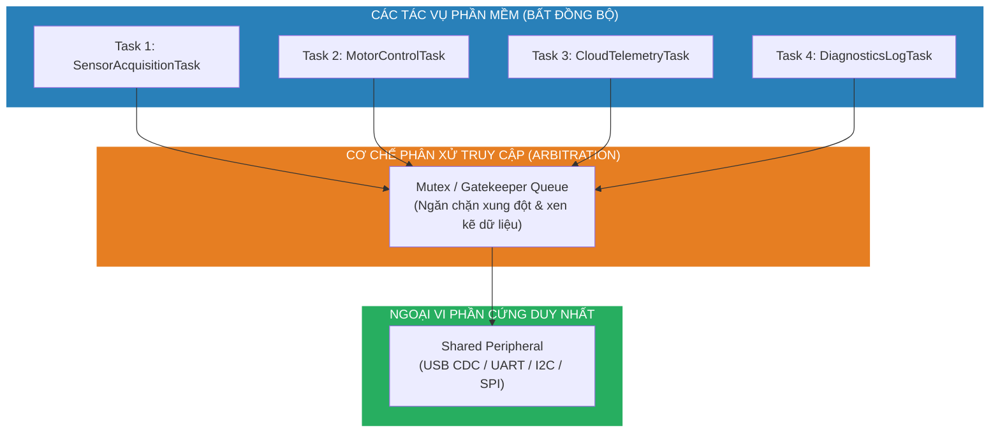
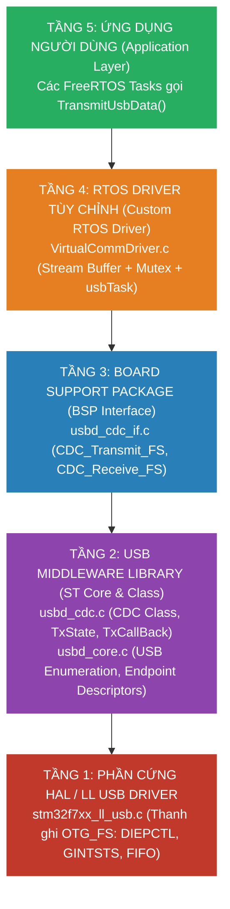
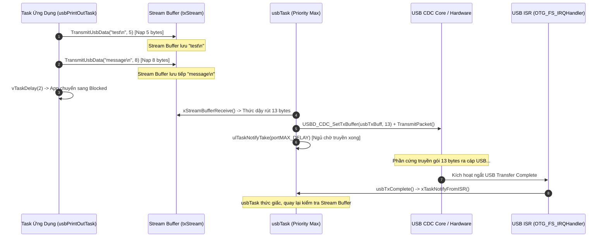
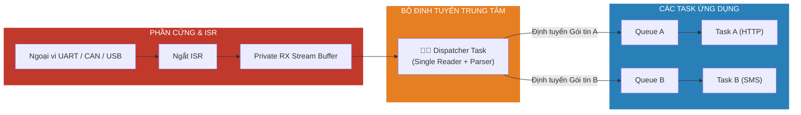
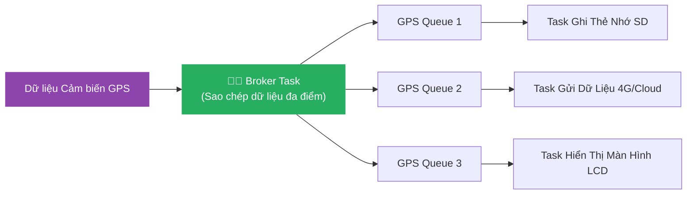
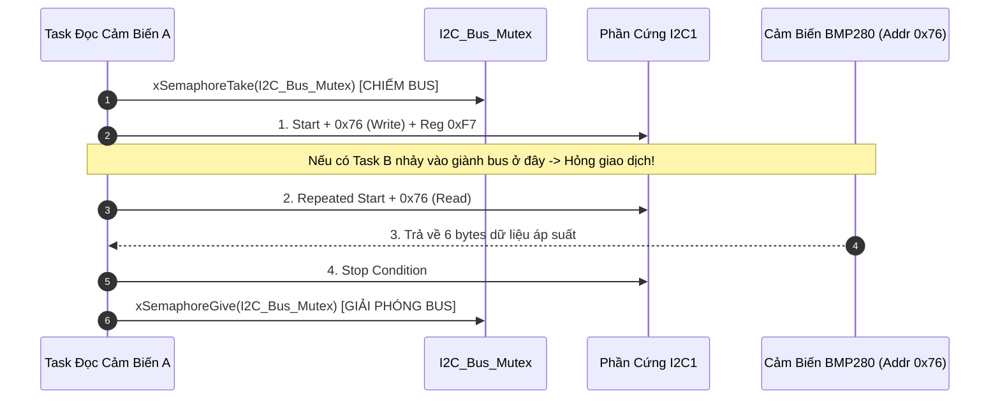
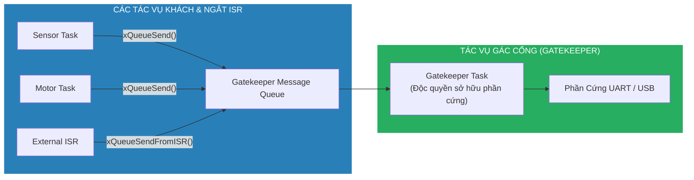
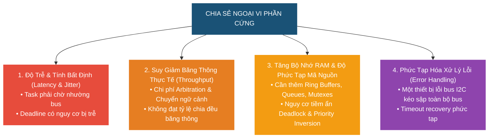

# <span style="color:#f1c40f">Chương 10: Chia Sẻ Ngoại Vi Phần Cứng Giữa Các Tác Vụ (Sharing Hardware Peripherals across Tasks)</span>

> **Tài liệu tham khảo chuyên sâu kết hợp:**
> - 📘 *Hands-On RTOS with Microcontrollers* – Brian Amos (Chapter 11: *Sharing Hardware Peripherals across Tasks*, tr. 280–304).
> - 📗 *Mastering the FreeRTOS Real Time Kernel* – Richard Barry (Chapter 7: *Resource Management* – Mutexes, Gatekeeper Tasks, Priority Inversion).
> - 📙 *STMicroelectronics Architecture Manuals & Application Notes* (UM1021 STM32 USB Device Library, RM0410 STM32F76xxx Reference Manual).

---

```text
MỤC LỤC CHUYÊN SÂU (TABLE OF CONTENTS)
├── 1. Hiểu Bài Toán Ngoại Vi Chia Sẻ (Understanding Shared Peripherals)
│   ├── 1.1 Khái niệm & Tại sao phải Chia sẻ Ngoại vi Phần cứng?
│   ├── 1.2 Những Hiểm họa Khi Nhiều Task Cùng Truy Cập Ngoại vi Không Kiểm Soát
│   └── 1.3 Khi Nào KHÔNG Được Phép Chia Sẻ Ngoại vi? (When NOT to Share Peripherals)
├── 2. Case Study Thực Chiến: Driver USB CDC Virtual COM Port & Cạm Bẫy USBD_BUSY
│   ├── 2.1 Giới thiệu Giao thức USB CDC & Thiết lập Phần cứng trên Nucleo-F767ZI
│   ├── 2.2 Kiến trúc 5 Tầng Phần Mềm USB Device Stack của STMicroelectronics
│   ├── 2.3 Cạm bẫy Mất Dữ Liệu Khi Sử Dụng Hàm Gốc CDC_Transmit_FS() (USBD_BUSY Bug)
│   └── 2.4 Sửa đổi Thư viện STM32 USB CDC Middleware: Bổ sung Con trỏ TxCallBack
├── 3. Xây Dựng Driver USB VCP Dựa Trên FreeRTOS Stream Buffer
│   ├── 3.1 Cấu trúc Dữ liệu Stream Buffer & Thuật toán Lockless Ring Buffer
│   ├── 3.2 Tác Vụ Nền usbTask & Cơ chế Bắt tay Callback usbTxComplete trong Ngắt ISR
│   ├── 3.3 Các Hàm Public của VirtualCommDriver.c (TransmitUsbData & TransmitUsbDataLossy)
│   ├── 3.4 Sơ Đồ Trình Tự & Phân Tích Thực Nghiệm Trên SEGGER SystemView
│   └── 3.5 Kỹ Thuật Tối Ưu Trigger Level (Giảm 94% Tải CPU & Trade-off Latency)
├── 4. Mở Rộng Hỗ Trợ Đa Tác Vụ Bằng Mutex (Multi-Task VirtualCommDriver)
│   ├── 4.1 Rào cản Cốt lõi: Stream Buffer CHỈ Hỗ Trợ Single-Writer / Single-Reader!
│   ├── 4.2 Kỹ thuật Phối hợp: Mutex + Stream Buffer Bảo vệ Đa Task
│   ├── 4.3 So Sánh Toàn Diện: Stream Buffer vs Queue Khi Dùng Đa Task
│   ├── 4.4 Thuật Toán Trừ Lùi Thời Gian Chờ Chuẩn Xác (remainingTime Tracking)
│   ├── 4.5 Thiết kế Hai Nhóm API: Truyền Tin Cậy vs Truyền Cho Phép Mất Gói
│   └── 4.6 Ứng dụng Mẫu Kiểm Chứng: mainUsbStreamBufferMultiTask.c (2 Task Ghi Đồng Thời)
├── 5. Kiến Trúc Bộ Đệm Nhận Dữ Liệu Đa Task (Shared Receiver Design Patterns)
│   ├── 5.1 Hiểm họa Khi Nhiều Task Cùng Đọc Chung 1 Buffer (Data Splitting)
│   ├── 5.2 Mô Hình Tác Vụ Phân Phối (Dispatcher / Router Task Pattern)
│   └── 5.3 Mô Hình Đăng Ký / Nhận Tin (Publish-Subscribe Broker Pattern)
├── 6. Đảm Bảo Giao Dịch Nguyên Tử Trên Ngoại Vi Chia Sẻ (Atomic Multi-Stage Transactions)
│   ├── 6.1 Cạm bẫy Thiết kế: "Hàm Thread-Safe nhưng Giao dịch Thread-Unsafe"
│   ├── 6.2 Hiện tượng Xung đột Thông điệp Xen kẽ (Message Interleaving Bug) & Kịch bản SPI ADC/DAC
│   ├── 6.3 Giải pháp Khóa Cổng Giao Dịch: LockUsbPort() & UnlockUsbPort() với TransmitUsbDataLocked()
│   └── 6.4 Mẫu Code Task Sử Dụng Giao Dịch Nguyên Tử Chuẩn Mực
├── 7. Mở Rộng Sang Các Ngoại Vi Phần Cứng Khác (I2C, SPI, ADC)
│   ├── 7.1 Chia sẻ Bus I2C: Giao dịch 2 Pha & Thủ Tục Giải Cứu Bus Treo (9-Clock Recovery)
│   ├── 7.2 Chia sẻ Bus SPI: Quản lý Nhiều Chân CS, Chuyển Đổi Mode CPOL/CPHA & Tốc Độ Động
│   └── 7.3 Chia sẻ Bộ Chuyển Đổi Tương Tự - Số (ADC Multiplexed Conversions)
├── 8. Mô Hình Kiến Trúc Thay Thế: Gatekeeper Task Pattern (Actor Model)
│   ├── 8.1 Nguyên lý Hoạt động của Gatekeeper Task (Richard Barry Ch7)
│   ├── 8.2 Mã Nguồn C Chuẩn Mực Triển Khai Gatekeeper Task Trong FreeRTOS
│   ├── 8.3 So Sánh Toàn Diện: Mutex-Based Access vs Gatekeeper Task (7 Tiêu chí)
│   └── 8.4 Hỗ Trợ Ghi Dữ liệu Ngoại vi từ Cả Ngắt ISR và Task
├── 9. Đánh Đổi Thiết Kế Khi Chia Sẻ Ngoại Vi (Design Trade-offs Matrix)
│   ├── 9.1 Sơ Đồ Cây & Phân Tích 5 Yếu Tố Kỹ Thuật (Latency, Jitter, Throughput, RAM, Fault Isolation)
│   └── 9.2 Bảng Ma Trận Phân Tích Đánh Đổi Kỹ Thuật (Trade-offs Analysis Table)
├── 10. Câu Hỏi Ôn Tập Chuyên Sâu & Lời Giải Chi Tiết (Brian Amos Chapter 11 Assessments)
│   ├── Câu 1: Tối thiểu hóa số lượng ngoại vi phần cứng là luôn tốt?
│   ├── Câu 2: Mối quan tâm duy nhất khi chia sẻ ngoại vi là an toàn đa luồng?
│   ├── Câu 3: Stream Buffer cho phép ta đánh đổi những yếu tố nào khi tạo?
│   ├── Câu 4: Stream Buffer có thể được nhiều Task cùng ghi trực tiếp?
│   └── Câu 5: Cơ chế nào tạo truy cập Atomic cho ngoại vi trong giao dịch đa bước?
└── 11. Bảng Tổng Hợp Kiến Thức Cốt Lõi (Key Takeaways Summary Matrix)
```

---

## <span style="color:#e67e22">1. Hiểu Bài Toán Ngoại Vi Chia Sẻ (Understanding Shared Peripherals)</span>

Trong hệ điều hành thời gian thực (RTOS), một ứng dụng thường được phân rã thành hàng chục tác vụ (tasks) hoạt động song song và bất đồng bộ. Trong khi đó, **số lượng ngoại vi phần cứng vật lý trên chip vi điều khiển luôn bị giới hạn**:
- Một vi điều khiển thường chỉ có 1 cổng USB, 1 hoặc 2 cổng Ethernet, 3 đến 8 bộ UART, 2 đến 4 bus I2C và SPI.
- Nếu hệ thống có 5 task độc lập cần in log gỡ lỗi (debug output), hoặc 4 task cần giao tiếp với các cảm biến khác nhau trên cùng một bus I2C $\rightarrow$ **Ngoại vi phần cứng đó bắt buộc phải trở thành một Tài Nguyên Chia Sẻ (Shared Resource)**.


```mermaid
graph TD
    subgraph TASKS ["CÁC TÁC VỤ PHẦN MỀM (BẤT ĐỒNG BỘ)"]
        T1["Task 1: SensorAcquisitionTask"]
        T2["Task 2: MotorControlTask"]
        T3["Task 3: CloudTelemetryTask"]
        T4["Task 4: DiagnosticsLogTask"]
    end

    subgraph ARB ["CƠ CHẾ PHÂN XỬ TRUY CẬP (ARBITRATION)"]
        LOCK["Mutex / Gatekeeper Queue<br/>(Ngăn chặn xung đột & xen kẽ dữ liệu)"]
    end

    subgraph HW ["NGOẠI VI PHẦN CỨNG DUY NHẤT"]
        DEV["Shared Peripheral<br/>(USB CDC / UART / I2C / SPI)"]
    end

    T1 --> LOCK
    T2 --> LOCK
    T3 --> LOCK
    T4 --> LOCK
    LOCK --> DEV

    style TASKS fill:#2980b9,color:#fff,stroke:none
    style ARB fill:#e67e22,color:#fff,stroke:none
    style HW fill:#27ae60,color:#fff,stroke:none
```

---

### <span style="color:#1abc9c">1.1 Khái Niệm & Tại Sao Phải Chia Sẻ Ngoại Vi Phần Cứng?</span>

Ngoại vi phần cứng (SPI, I2C, UART, USB, Ethernet, ADC...) là **tài nguyên dùng chung (Shared Resource)** giống hệt như một biến toàn cục hay một vùng nhớ RAM chung. Khi nhiều Task muốn truy cập cùng một ngoại vi, cần phải có **cơ chế phân xử (Arbitration Mechanism)** để đảm bảo:
- Tại mỗi thời điểm, chỉ **duy nhất 1 Task** được quyền chiếm dụng và điều khiển ngoại vi.
- Dữ liệu không bị xen kẽ (Interleaved), ghi đè (Overwritten), hoặc mất mát (Dropped) giữa các Task.

#### Các Lý Do Kinh Tế Kỹ Thuật Bắt Buộc Phải Chia Sẻ Ngoại Vi:
1. **Tiết kiệm Chân Vi Điều Khiển (Pin Count & Package Size)**: Mỗi ngoại vi bổ sung đòi hỏi thêm từ 2 đến hàng chục chân GPIO. Việc dùng chung bus (như I2C nối 5 cảm biến trên 2 chân SDA/SCL) giúp thu nhỏ kích thước package của MCU (ví dụ từ LQFP144 xuống LQFP64).
2. **Giảm Diện Tích Mạch In (PCB Real Estate) & Chi Phí Linh Kiện (BOM Cost)**: Giảm bớt số lượng đường dây tín hiệu song song giúp giảm số lớp mạch in (PCB Layers), giảm phát xạ nhiễu điện từ (EMI) và hạ giá thành sản phẩm.
3. **Tập Trung Hóa Điểm Giao Tiếp**: Một cổng USB ảo (Virtual COM Port) hoặc một cổng Ethernet có thể phục vụ đồng thời cho việc cập nhật firmware, truyền telemetry, xuất dữ liệu đo kiểm và cấu hình hệ thống.

---

### <span style="color:#1abc9c">1.2 Những Hiểm Họa Khi Nhiều Task Cùng Truy Cập Ngoại Vi Không Kiểm Soát</span>

Nếu lập trình viên cho phép nhiều Task gọi trực tiếp các hàm điều khiển ngoại vi mà không có cơ chế điều phối đồng bộ, hệ thống sẽ gặp các thảm họa sau:
1. **Xung đột phần cứng (Hardware Race Conditions)**: Task A đang ghi dở byte vào thanh ghi truyền `USART_TDR`, Task B bất ngờ chen ngang ghi đè byte khác $\rightarrow$ Khung truyền bị hỏng (Framing Error), dữ liệu truyền ra bị méo mó.
2. **Lỗi xen kẽ dữ liệu (Data Interleaving)**: Task A gửi thông điệp `"MOTOR: RUNNING"`, Task B gửi thông điệp `"TEMP: 45C"`. Trên màn hình máy tính nhận được chuỗi: `"MOTEMPOTERR: : 4RUN5CNING"` $\rightarrow$ Không một phần mềm nào có thể phân tích cú pháp (parse) được gói tin rác này!
3. **Mất dữ liệu do trạng thái bận (State Collision / Data Loss)**: Rất nhiều driver của hãng sản xuất (như STM32 USB CDC) sử dụng biến trạng thái (`TxState`). Khi Task A đang truyền, `TxState = 1`. Nếu Task B gọi truyền tiếp, hàm sẽ trả về mã lỗi bận (`USBD_BUSY`) và **âm thầm vứt bỏ toàn bộ gói tin của Task B**!

---

### <span style="color:#1abc9c">1.3 Khi Nào KHÔNG Được Phép Chia Sẻ Ngoại Vi? (When NOT to Share Peripherals)</span>

Mặc dù chia sẻ ngoại vi là phổ biến, Brian Amos nhấn mạnh rằng **có những tình huống kỹ thuật bắt buộc PHẢI DÙNG NGOẠI VI RIÊNG BIỆT (Dedicated Peripheral)**:

> [!CAUTION]
> **3 Trường Hợp Tuyệt Đối Không Nên Chia Sẻ Ngoại Vi:**
> 1. **Tác vụ Thời Gian Thực Nghiêm Ngặt (Hard Real-Time Latency Sensitive)**:
>    - Các tác vụ điều khiển vòng kín tốc độ cao (như phát xung PWM điều khiển góc quay động cơ, ngắt dừng khẩn cấp E-Stop, xử lý tín hiệu bảo vệ quá áp).
>    - *Lý do*: Bất kỳ cơ chế chia sẻ nào (Mutex hay Queue) đều làm phát sinh **Blocking Delay (Thời gian chờ nhường tài nguyên)**. Nếu Task điều khiển động cơ cần gửi lệnh tức thì nhưng phải chờ một Task in log giải phóng cổng UART trong 5ms $\rightarrow$ Động cơ mất bước, thiết bị cơ khí có thể bị phá hủy!
> 2. **Luồng Truyền Dữ Liệu Băng Thông Cực Cao (High-Bandwidth Continuous Streaming)**:
>    - Các ngoại vi như bộ thu âm thanh I2S, truyền dữ liệu cảm biến ảnh Camera, đọc ADC liên tục tốc độ cao kết hợp DMA.
>    - *Lý do*: Luồng dữ liệu chiếm dụng gần $100\%$ băng thông đường truyền. Việc cho phép task khác chen vào sẽ làm đứt gãy luồng DMA, gây tràn bộ đệm (Buffer Overrun) và rớt khung hình/âm thanh.
> 3. **Ngoại Vi Băng Thông Thấp Bị Bão Hòa (Low-Bandwidth Saturation)**:
>    - Đường truyền I2C ở tốc độ chuẩn 100 kHz hoặc UART 9600 Baud.
>    - *Lý do*: Tốc độ truyền vật lý quá chậm. Việc dồn nhiều task vào một bus chậm chạp sẽ khiến hàng đợi phình to, RAM cạn kiệt và thời gian trễ của các task tăng theo cấp số nhân.

---

## <span style="color:#e67e22">2. Case Study Thực Chiến: Driver USB CDC Virtual COM Port & Cạm Bẫy USBD_BUSY</span>

Để nghiên cứu chuyên sâu bài toán chia sẻ ngoại vi, tác giả Brian Amos sử dụng ngoại vi phức tạp hàng đầu trên vi điều khiển: **Cổng USB OTG FS (Full-Speed 12 Mbps) chạy lớp thiết bị CDC (Communication Device Class)** trên bo mạch STM32 Nucleo-F767ZI.

---

### <span style="color:#1abc9c">2.1 Giới Thiệu Giao Thức USB CDC & Thiết Lập Phần Cứng Trên Nucleo-F767ZI</span>

- **USB CDC (Virtual COM Port / VCP)**: Lớp thiết bị USB giả lập cổng nối tiếp RS-232 tiêu chuẩn. Khi cắm vào máy tính, hệ điều hành (Windows/Linux/macOS) tự động nhận diện thiết bị như một cổng Serial COM (ví dụ `COM3` hoặc `/dev/ttyACM0`). Lập trình viên có thể mở các phần mềm Terminal (như TeraTerm, PuTTY) để giao tiếp hai chiều với MCU ở tốc độ lên tới **12 Mbps** mà không cần bất kỳ chip chuyển đổi USB-to-UART rời nào.
- **Kết nối vật lý**:
  - Cắm cáp micro-USB vào cổng **USB USER (cổng CN13)** trên bo mạch NUCLEO-F767ZI nối vào máy tính (Cổng này nối trực tiếp vào các chân `PA11/PA12` của vi điều khiển STM32F767ZI, khác với cổng ST-Link CN1).

---

### <span style="color:#1abc9c">2.2 Kiến Trúc 5 Tầng Phần Mềm USB Device Stack Của STMicroelectronics</span>

Kiến trúc phần mềm USB của ST là một hệ thống phân tầng (Layered Architecture) phức tạp gồm 5 lớp:


```mermaid
graph TD
    L5["TẦNG 5: ỨNG DỤNG NGƯỜI DÙNG (Application Layer)<br/>Các FreeRTOS Tasks gọi TransmitUsbData()"] --> L4
    L4["TẦNG 4: RTOS DRIVER TÙY CHỈNH (Custom RTOS Driver)<br/>VirtualCommDriver.c (Stream Buffer + Mutex + usbTask)"] --> L3
    L3["TẦNG 3: BOARD SUPPORT PACKAGE (BSP Interface)<br/>usbd_cdc_if.c (CDC_Transmit_FS, CDC_Receive_FS)"] --> L2
    L2["TẦNG 2: USB MIDDLEWARE LIBRARY (ST Core & Class)<br/>usbd_cdc.c (CDC Class, TxState, TxCallBack)<br/>usbd_core.c (USB Enumeration, Endpoint Descriptors)"] --> L1
    L1["TẦNG 1: PHẦN CỨNG HAL / LL USB DRIVER<br/>stm32f7xx_ll_usb.c (Thanh ghi OTG_FS: DIEPCTL, GINTSTS, FIFO)"]

    style L5 fill:#27ae60,color:#fff,stroke:none
    style L4 fill:#e67e22,color:#fff,stroke:none
    style L3 fill:#2980b9,color:#fff,stroke:none
    style L2 fill:#8e44ad,color:#fff,stroke:none
    style L1 fill:#c0392b,color:#fff,stroke:none
```

1. **Tầng 1 - Low-Level USB Driver (`stm32f7xx_ll_usb.c/h`)**: Tầng thấp nhất, thao tác trực tiếp với các thanh ghi phần cứng của bộ điều khiển USB OTG FS, quản lý FIFO phần cứng và các ngắt Endpoint.
2. **Tầng 2 - USB Middleware Core & Class (`usbd_core.c`, `usbd_cdc.c`)**: Thư viện Middleware của ST chịu trách nhiệm xử lý quá trình nhận diện USB (Enumeration), quản lý máy trạng thái CDC và biến trạng thái truyền `hcdc->TxState`.
3. **Tầng 3 - User Interface Adapter (`usbd_cdc_interface.c`)**: Tệp tin cầu nối do STM32CubeMX sinh ra, cung cấp hàm giao tiếp cơ bản: `CDC_Transmit_FS()`.
4. **Tầng 4 - Custom RTOS Driver (`VirtualCommDriver.c`)**: Tầng driver do chúng ta xây dựng để bọc tính năng an toàn đa tác vụ (Thread-Safety), quản lý bộ đệm FreeRTOS và cơ chế đồng bộ.
5. **Tầng 5 - Tác vụ Ứng dụng (Application Tasks)**: Các task người dùng trong hệ thống FreeRTOS.

---

### <span style="color:#1abc9c">2.3 Cạm Bẫy Mất Dữ Liệu Khi Sử Dụng Hàm Gốc `CDC_Transmit_FS()` (USBD_BUSY Bug)</span>

Hầu hết các lập trình viên mới làm quen với STM32 USB thường nghĩ rằng chỉ cần gọi hàm sinh sẵn `CDC_Transmit_FS()` là có thể gửi dữ liệu ra máy tính. Đây chính là **nguồn gốc của lỗi mất dữ liệu hàng loạt**:

```c
/* HÀM GỐC DO ST CUNG CẤP TRONG usbd_cdc_interface.c */
uint8_t CDC_Transmit_FS(uint8_t* Buf, uint16_t Len)
{
    uint8_t result = USBD_OK;
    USBD_CDC_HandleTypeDef *hcdc = (USBD_CDC_HandleTypeDef*)hUsbDeviceFS.pClassData;
    
    // 1. Kiểm tra xem quá trình truyền trước đó đã hoàn tất hay chưa
    if (hcdc->TxState != 0) {
        return USBD_BUSY; // NGOẠI VI ĐANG BẬN! TRẢ VỀ LỖI NGAY LẬP TỨC
    }
    
    // 2. Nếu rảnh: Khóa ngoại vi và bắt đầu truyền gói tin mới
    USBD_CDC_SetTxBuffer(&hUsbDeviceFS, Buf, Len);
    result = USBD_CDC_TransmitPacket(&hUsbDeviceFS);
    return result;
}
```

#### Thực Nghiệm Chứng Minh Lỗi Của Brian Amos:
Giả sử một task người dùng muốn in ra 2 dòng chữ liên tiếp:
```c
CDC_Transmit_FS((uint8_t*)"Dong 1: Khoi tao he thong\r\n", 28);
CDC_Transmit_FS((uint8_t*)"Dong 2: San sang hoat dong\r\n", 28);
```

```
DÒNG THỜI GIAN GẶP LỖI USBD_BUSY:
1. Lệnh 1 gọi CDC_Transmit_FS() -> TxState = 0 -> Thiết lập truyền Dòng 1 -> TxState đổi thành 1 (BUSY).
2. Vi điều khiển chuẩn bị gói tin USB (Tốn vài microsecond đến vài millisecond tùy thuộc vào USB Polling Interval của PC).
3. Lệnh 2 gọi CDC_Transmit_FS() NGAY LẬP TỨC ở dòng code tiếp theo!
4. Hàm kiểm tra thấy TxState == 1 -> Trả về mã lỗi USBD_BUSY!
5. KẾT QUẢ THỰC TẾ: Trên màn hình PC CHỈ XUẤT HIỆN DUY NHẤT "Dong 1". 
   Toàn bộ nội dung "Dong 2" BỊ VỨT BỎ HOÀN TOÀN KHÔNG MỘT DẤU VẾT!
```

> [!WARNING]
> **Bản Chất Của Ngoại Vi Bất Đồng Bộ:**
> Hàm `CDC_Transmit_FS()` là một hàm **Non-blocking nguyên thủy**. Nó không có hàng đợi (No Queuing/Buffering). Nếu bạn gọi hàm khi phần cứng đang bận, dữ liệu sẽ bị hủy bỏ. Để nhiều Task có thể gửi dữ liệu an toàn mà không bị mất gói, bắt buộc phải xây dựng một **Tầng Đệm Hướng Sự Kiện (Event-Driven Buffering Layer)** phía trên!

---

### <span style="color:#1abc9c">2.4 Sửa Đổi Thư Viện STM32 USB CDC Middleware: Bổ Sung Con Trỏ `TxCallBack`</span>

Để loại bỏ hoàn toàn việc polling vòng lặp kiểm tra cờ `TxState` (gây lãng phí CPU khủng khiếp), Brian Amos bổ sung một **con trỏ hàm Callback (`TxCallBack`)** trực tiếp vào USB CDC Middleware của ST. Khi phần cứng USB ISR gửi xong gói tin ra cáp, nó sẽ tự động kích hoạt callback này để đánh thức task điều khiển của RTOS.

#### 1. Bổ sung trường `TxCallBack` vào struct `USBD_CDC_HandleTypeDef` trong `usbd_cdc.h`:
```c
typedef struct
{
    uint32_t data[CDC_DATA_HS_MAX_PACKET_SIZE / 4U]; /* Force 32bits alignment */
    uint8_t  CmdOpCode;
    uint8_t  CmdLength;
    uint8_t  *RxBuffer;
    uint8_t  *TxBuffer;
    uint32_t RxLength;
    uint32_t TxLength;

    /* ==================================================================== */
    /* ✅ THÊM MỚI: Con trỏ hàm callback được gọi khi truyền gói tin hoàn tất */
    /* ==================================================================== */
    void (*TxCallBack)( void );

    __IO uint32_t TxState;
    __IO uint32_t RxState;
} USBD_CDC_HandleTypeDef;
```

#### 2. Kích hoạt Callback bên trong hàm ngắt truyền xong `USBD_CDC_DataIn()` trong `usbd_cdc.c`:
```c
static uint8_t USBD_CDC_DataIn(USBD_HandleTypeDef *pdev, uint8_t epnum)
{
    USBD_CDC_HandleTypeDef *hcdc = (USBD_CDC_HandleTypeDef*)pdev->pClassData;

    if (pdev->pClassData != NULL)
    {
        hcdc->TxState = 0U; /* Giải phóng trạng thái bận của USB */

        /* ================================================================ */
        /* ✅ THÊM MỚI: Gọi callback nếu driver RTOS phía trên đã đăng ký   */
        /* ================================================================ */
        if (hcdc->TxCallBack != NULL)
        {
            hcdc->TxCallBack();
        }
        return USBD_OK;
    }
    else
    {
        return USBD_FAIL;
    }
}
```

---

## <span style="color:#e67e22">3. Xây Dựng Driver USB VCP Dựa Trên FreeRTOS Stream Buffer</span>

Để khắc phục triệt để lỗi `USBD_BUSY` và cho phép ứng dụng gửi dữ liệu bất đồng bộ với tốc độ cao, Brian Amos thiết kế driver **`VirtualCommDriver.c`** sử dụng cấu trúc **FreeRTOS Stream Buffer** kết hợp cùng một tác vụ nền chuyên trách (**`usbTask`**).

---

### <span style="color:#1abc9c">3.1 Cấu Trúc Dữ Liệu Stream Buffer & Thuật Toán Lockless Ring Buffer</span>

- **Stream Buffer** (được giới thiệu từ FreeRTOS v10+) là một **bộ đệm vòng (Ring Buffer / Circular Buffer)** được tối ưu hóa ở mức tối đa:
  - Cho phép truyền một dòng byte liên tục (Stream of bytes) từ một bên sản xuất (Producer) sang một bên tiêu thụ (Consumer) giống như một đường ống dữ liệu (pipe).
  - Thuật toán bên trong là **Lockless FIFO**: Sử dụng một con trỏ ghi (`xHead`) và một con trỏ đọc (`xTail`). Quá trình đọc/ghi không đòi hỏi phải khóa ngắt (No Interrupt Disabling) hay dùng Mutex, giúp đạt tốc độ truyền dữ liệu bộ nhớ (Memory Copy) cực nhanh.

```
Producer (Task / ISR)                         Consumer (usbTask)
       │                                              ▲
       │  xStreamBufferSend(buf, len)                 │  xStreamBufferReceive(buf, len)
       ▼                                              │
┌────────────────────────────────────────────────────────┐
│  [B][y][t][e][0][1][2][3][...][...][...][...]         │ ← Ring Buffer (RAM)
│   ▲ Write Pointer (xHead)       Read Pointer (xTail) ▲│
└────────────────────────────────────────────────────────┘
              Trigger Level = N bytes
              (Đánh thức Consumer khi buffer tích lũy đủ N bytes)
```

---

### <span style="color:#1abc9c">3.2 Tác Vụ Nền usbTask & Cơ Chế Bắt Tay Callback usbTxComplete Trong Ngắt ISR</span>

Dưới đây là kiến trúc và mã nguồn chi tiết của tác vụ nền `usbTask` cùng hàm ngắt bắt tay `usbTxComplete` trong `VirtualCommDriver.c`:

```c
/* =========================================================================
 * VIRTUAL COMM DRIVER DỰA TRÊN STREAM BUFFER (Brian Amos - Listing 11.1)
 * ========================================================================= */

#define txBuffLen           2048
#define STREAM_BUFFER_SIZE  2048

static uint8_t              usbTxBuff[txBuffLen];
static StreamBufferHandle_t txStream = NULL;
static TaskHandle_t         usbTaskHandle = NULL;

// 1. Hàm Callback được gọi từ BÊN TRONG HÀM NGẮT USB (USB ISR)
// Khi phần cứng gửi xong gói tin qua dây cáp vật lý, hàm này tự động được gọi
void usbTxComplete(void)
{
    portBASE_TYPE xHigherPriorityTaskWoken = pdFALSE;

    // Đánh thức usbTask tiếp tục nạp gói mới từ Stream Buffer
    xTaskNotifyFromISR(usbTaskHandle, 1, eSetValueWithOverwrite, &xHigherPriorityTaskWoken);

    portYIELD_FROM_ISR(xHigherPriorityTaskWoken);
}

// 2. Tác vụ nền điều khiển truyền USB (usbTask)
static void usbTask(void *pvParameters)
{
    // --- GIAI ĐOẠN KHỞI TẠO (PRE-LOOP INITIALIZATION) ---
    // Bước 1: Polling chờ USB Stack của ST sẵn sàng (con trỏ pClassData hợp lệ)
    USBD_CDC_HandleTypeDef *hcdc = NULL;
    while(hcdc == NULL)
    {
        hcdc = (USBD_CDC_HandleTypeDef*)hUsbDeviceFS.pClassData;
        vTaskDelay(10);
    }

    // Bước 2: Đồng bộ trạng thái Task Notification ban đầu
    if (hcdc->TxState == 0)
    {
        xTaskNotify(usbTaskHandle, 1, eSetValueWithOverwrite);
    }
    ulTaskNotifyTake(pdTRUE, portMAX_DELAY);

    // Bước 3: Đăng ký hàm callback vào USB Middleware của ST
    hcdc->TxCallBack = usbTxComplete;

    // --- VÒNG LẶP XỬ LÝ CHÍNH (INFINITE PROCESSING LOOP) ---
    while(1)
    {
        // 1. Chờ dữ liệu xuất hiện trong Stream Buffer (Task ngủ say nếu buffer rỗng)
        uint8_t numBytes = xStreamBufferReceive(
            txStream,
            usbTxBuff,
            txBuffLen,
            portMAX_DELAY
        );

        if (numBytes > 0)
        {
            // 2. Nạp dữ liệu vào bộ đệm USB của ST
            USBD_CDC_SetTxBuffer(&hUsbDeviceFS, usbTxBuff, numBytes);

            // 3. Kích hoạt truyền gói tin USB
            USBD_CDC_TransmitPacket(&hUsbDeviceFS);

            // 4. Ngủ (Blocked) chờ tín hiệu thông báo từ usbTxComplete() trong hàm ngắt
            // Tuyệt đối không dùng polling cờ trạng thái!
            ulTaskNotifyTake(pdTRUE, portMAX_DELAY);
        }
    }
}
```

---

### <span style="color:#1abc9c">3.3 Các Hàm Public Của VirtualCommDriver.c</span>

Driver cung cấp 3 hàm giao tiếp đối ngoại (Public API) cho các thành phần phần mềm khác trong hệ thống:

```c
// 1. Khởi tạo toàn bộ Driver USB VCP
void VirtualCommInit(void)
{
    BaseType_t retVal;
    MX_USB_DEVICE_Init();

    // Tạo Stream Buffer với kích thước 2048 bytes, Trigger Level ban đầu = 1 byte
    txStream = xStreamBufferCreate(txBuffLen, 1);
    assert_param(txStream != NULL);

    // Tạo Task usbTask ở mức ưu tiên CAO NHẤT để phản hồi nhanh nhất khi USB rảnh
    retVal = xTaskCreate(usbTask, "usbTask", 1024, NULL,
                         configMAX_PRIORITIES - 1, &usbTaskHandle);
    assert_param(retVal == pdPASS);
}

// 2. Hàm gửi dữ liệu Non-blocking, chấp nhận mất gói (Lossy Transmit)
// Dùng được trong cả Task lẫn ngắt ISR
int32_t TransmitUsbDataLossy(uint8_t const* Buff, uint16_t Len)
{
    // Dùng biến thể FromISR với pxHigherPriorityTaskWoken = NULL để không bao giờ block
    return xStreamBufferSendFromISR(txStream, Buff, Len, NULL);
}

// 3. Hàm gửi dữ liệu có thử lại ngắn, giảm thiểu tối đa mất gói
int32_t TransmitUsbData(uint8_t const* Buff, uint16_t Len)
{
    // Lần gửi 1: Chờ tối đa 1 tick
    int32_t numBytesCopied = xStreamBufferSend(txStream, Buff, Len, 1);

    if (numBytesCopied != Len)
    {
        // Lần gửi 2: Nếu buffer chưa có đủ chỗ, chờ thêm 1 tick để gửi nốt phần còn lại
        numBytesCopied += xStreamBufferSend(
            txStream,
            Buff + numBytesCopied,
            Len - numBytesCopied,
            1
        );
    }
    return numBytesCopied;
}
```

---

### <span style="color:#1abc9c">3.4 Sơ Đồ Trình Tự & Phân Tích Thực Nghiệm Trên SEGGER SystemView</span>


```mermaid
sequenceDiagram
    autonumber
    participant App as Task Ứng Dụng (usbPrintOutTask)
    participant SB as Stream Buffer (txStream)
    participant UT as usbTask (Priority Max)
    participant USB as USB CDC Core / Hardware
    participant ISR as USB ISR (OTG_FS_IRQHandler)

    App->>SB: TransmitUsbData("test\n", 5) [Nạp 5 bytes]
    Note over SB: Stream Buffer lưu "test\n"
    App->>SB: TransmitUsbData("message\n", 8) [Nạp 8 bytes]
    Note over SB: Stream Buffer lưu tiếp "message\n"
    App->>App: vTaskDelay(2) -> App chuyển sang Blocked
    
    UT->>SB: xStreamBufferReceive() -> Thức dậy rút 13 bytes
    UT->>USB: USBD_CDC_SetTxBuffer(usbTxBuff, 13) + TransmitPacket()
    UT->>UT: ulTaskNotifyTake(portMAX_DELAY) [Ngủ chờ truyền xong]
    
    Note over USB: Phần cứng truyền gói 13 bytes ra cáp USB...
    USB->>ISR: Kích hoạt ngắt USB Transfer Complete
    ISR->>UT: usbTxComplete() -> xTaskNotifyFromISR()
    Note over UT: usbTask thức giấc, quay lại kiểm tra Stream Buffer
```

#### Kết Quả Đo Đạc Thực Tế Trên SEGGER SystemView (Brian Amos tr. 312–315):
- Ứng dụng in ra 2 dòng liên tiếp mỗi $2\text{ ms}$ (tương đương $\approx 1,000 \text{ dòng/giây}$).
- Trên Terminal của PC: Các dòng `"test\n"` và `"message\n"` xuất hiện liên tục, **hoàn hảo không mất bất kỳ một ký tự nào**!
- Tổng tải CPU lúc này chiếm khoảng **$10\%$** (chủ yếu do `usbTask` liên tục chuyển ngữ cảnh cứ mỗi khi có 1 dòng mới vào buffer).

---

### <span style="color:#1abc9c">3.5 Kỹ Thuật Tối Ưu Trigger Level (Giảm 94% Tải CPU & Trade-off Latency)</span>

Trong cấu hình mặc định ở mục 3.3:
- Ngưỡng kích hoạt: `TriggerLevel = 1 byte`.
- Thời gian chờ: `portMAX_DELAY`.

#### Vấn Đề Gặp Phải Khi Tải Cao:
Cứ mỗi khi ứng dụng gửi 1 vài bytes, `usbTask` lại bị đánh thức, thực hiện context switch, gửi gói nhỏ qua USB, rồi lại đi ngủ. Số lượng context switch lên tới hàng ngàn lần mỗi giây, làm lãng phí chu kỳ xử lý của CPU.

#### Kỹ Thuật Tối Ưu Hóa Tuyệt Vời Của Brian Amos:
Brian Amos áp dụng kỹ thuật gom dữ liệu theo khối (Batching / Bulk Accumulation) bằng cách điều chỉnh 2 thông số:
1. **Tăng `TriggerLevel` từ $1\text{ byte}$ lên $500\text{ bytes}$**:
   ```c
   txStream = xStreamBufferCreate(txBuffLen, 500);
   ```
   Chỉ khi nào bộ đệm đã tích lũy được tối thiểu 500 bytes dữ liệu, `usbTask` mới bị đánh thức để gửi đi một gói USB Bulk lớn duy nhất.
2. **Giới hạn thời gian chờ tối đa là $100\text{ ticks}$ ($100\text{ ms}$)** thay vì `portMAX_DELAY`:
   ```c
   uint8_t numBytes = xStreamBufferReceive(txStream, usbTxBuff, txBuffLen, 100);
   ```
   Nếu ứng dụng chỉ gửi một dòng ngắn 20 bytes rồi không gửi nữa, sau tối đa $100\text{ ms}$, hàm `xStreamBufferReceive` sẽ hết hạn (timeout) và tự động xả sạch (flush) 20 bytes này ra máy tính. Dữ liệu không bao giờ bị "ngâm" vô hạn trong bộ đệm!

> [!TIP]
> **Đo Lường SEGGER SystemView:**
> Thay đổi này giúp **giảm tải CPU của `usbTask` tới 94%** (từ ~10% CPU xuống còn chưa đầy 0.6% CPU)!
> 
> **Đánh đổi kỹ thuật (Trade-off)**: Độ trễ (Latency) hiển thị ký tự lên màn hình tăng lên tối đa $100\text{ ms}$. Đối với giao diện hiển thị cho người đọc trên máy tính, độ trễ 100ms là hoàn toàn không nhận thấy được, nhưng đổi lại hệ thống có thêm 9.4% năng lực tính toán cho các tác vụ quan trọng khác!

---

## <span style="color:#e67e22">4. Mở Rộng Hỗ Trợ Đa Tác Vụ Bằng Mutex (Multi-Task VirtualCommDriver)</span>

Driver `VirtualCommDriver.c` ở Chương 3 hoạt động xuất sắc nếu chỉ có **duy nhất 1 Task** gọi hàm `TransmitUsbData()`. Nhưng mục tiêu cốt lõi của chương này là: **Cho phép hàng chục Task cùng chia sẻ cổng USB Virtual COM Port một cách an toàn!**

---

### <span style="color:#1abc9c">4.1 Rào Cản Cốt Lõi: Stream Buffer CHỈ Hỗ Trợ Single-Writer / Single-Reader!</span>

Rất nhiều kỹ sư mắc sai lầm nghiêm trọng khi cho nhiều task cùng gọi hàm `xStreamBufferSend()` vào chung một `txStream`.

#### Bản Chất Thiết Kế Khóa Không Cần Tranh Chấp (Lockless Design) Của Stream Buffer:
- FreeRTOS Stream Buffer được thiết kế với tiêu chí tối thượng là **Tốc độ (Speed)** và **Cực nhẹ (Lightweight)**.
- Thuật toán vòng đệm (Circular Ring Buffer) bên trong kernel hoạt động dựa trên cơ chế Lockless: **Chỉ có 1 con trỏ Ghi (`xHead`) và 1 con trỏ Đọc (`xTail`)**, không sử dụng Mutex, không khóa ngắt và không có Critical Section bảo vệ con trỏ ghi!
- **Hệ quả khi nhiều Task cùng ghi**: Nếu Task 1 đang cập nhật dở con trỏ `xHead`, Task 2 có độ ưu tiên cao hơn nhảy vào thực thi và cập nhật tiếp `xHead` $\rightarrow$ Con trỏ ghi bị hỏng (corrupted write pointers), dữ liệu ghi đè lên nhau, và kernel bị HardFault ngay lập tức!

> [!IMPORTANT]
> **Nguyên Tắc Bất Di Bất Dịch Của FreeRTOS Stream Buffer:**
> Stream Buffer **chỉ hỗ trợ DUY NHẤT một bên Ghi (Single-Writer) và một bên Đọc (Single-Reader)**. Nếu muốn nhiều Task cùng ghi vào Stream Buffer, lập trình viên **BẮT BUỘC PHẢI BỌC QUYỀN TRUY CẬP BẰNG MỘT MUTEX!**

---

### <span style="color:#1abc9c">4.2 Kỹ Thuật Phối Hợp: Mutex + Stream Buffer Bảo Vệ Đa Task</span>

Để phối hợp hoàn hảo giữa tính an toàn của Mutex và tốc độ cao của Stream Buffer, chúng ta áp dụng mô hình 4 bước:

```
[Task Ghi A] ──┐
[Task Ghi B] ──┼──► [ 🔒 MUTEX ] ──► [ 🌊 STREAM BUFFER ] ──► [ usbTask ] ──► [ Phần Cứng USB ]
[Task Ghi C] ──┘   (Phân xử ghi)    (Đệm dữ liệu lockless)     (Consumer duy nhất)
```

1. **Bước 1: Phân xử Ghi (Serialization) bằng Mutex**: Mutex biến mô hình Multi-Writer thành Single-Writer ảo. Tại mỗi thời điểm chỉ có 1 task duy nhất được phép ghi vào `txStream`.
2. **Bước 2: Bảo vệ tính toàn vẹn của Gói dữ liệu (No Interleaving)**: Task A ghi xong toàn bộ chuỗi ký tự của mình vào buffer rồi mới nhả Mutex, ngăn chặn hoàn toàn việc Task B chen ngang làm vỡ gói tin.
3. **Bước 3: Đệm dữ liệu Lockless bằng Stream Buffer**: Khi đã giữ Mutex, việc copy dữ liệu vào buffer diễn ra với tốc độ RAM tối đa.
4. **Bước 4: Đọc dữ liệu Đơn luồng (Single Reader)**: Ở đầu ra, duy nhất `usbTask` rút dữ liệu ra ngoài và đẩy vào USB.

---

### <span style="color:#1abc9c">4.3 So Sánh Toàn Diện: Stream Buffer vs Queue Khi Dùng Đa Task</span>

| Tiêu Chí Đánh Giá | Stream Buffer (Kết hợp Mutex) | FreeRTOS Queue Chuẩn |
|:---|:---|:---|
| **Cấu trúc lưu trữ nội bộ** | Mảng byte liên tục (Raw byte stream) | Mảng các ô nhớ (Slot) có kích thước cố định |
| **Khả năng hỗ trợ Đa Writer** | ❌ Cần bọc Mutex bên ngoài | ✅ Hỗ trợ sẵn (Tích hợp sẵn Critical Section) |
| **Tốc độ truyền dữ liệu** | ⚡ **Rất nhanh** (sao chép trực tiếp qua memcpy) | ⏱ Chậm hơn (phải xử lý metadata và lock/unlock từng item) |
| **Tiêu hao bộ nhớ RAM** | 💾 **Rất tiết kiệm** (chỉ lưu đúng số bytes dữ liệu) | 📈 Tốn RAM hơn (mỗi item đều có overhead header quản lý) |
| **Phù hợp nhất cho** | Truyền dòng dữ liệu lớn, in log chuỗi ký tự dài | Truyền các biến, struct sự kiện nhỏ có kích thước đồng nhất |

---

### <span style="color:#1abc9c">4.4 Thuật Toán Trừ Lùi Thời Gian Chờ Chuẩn Xác (remainingTime Tracking)</span>

Một vấn đề hóc búa phát sinh khi bọc Mutex: **Thuật toán tính toán Timeout còn lại (`remainingTime`)**.

Giả sử Task yêu cầu gửi dữ liệu với thời gian chờ tối đa là `delayTicks = 50 ticks`:
1. Task phải chờ để lấy Mutex mất `20 ticks`.
2. Sau khi đã lấy được Mutex, Task gọi tiếp `xStreamBufferSend()` để ghi vào buffer. Nếu lúc này lập trình viên truyền nguyên tham số ban đầu `delayTicks = 50 ticks` vào hàm `xStreamBufferSend` $\rightarrow$ Tổng thời gian task bị chặn có thể lên tới **$20 + 50 = 70 \text{ ticks}$**, vi phạm nghiêm trọng cam kết thời gian thực!

#### Thuật Toán Trừ Lùi Thời Gian Chờ Chuẩn Mực Trong `VirtualCommDriverMultiTask.c`:

```c
/* =========================================================================
 * VIRTUAL COMM DRIVER MULTI-TASK AN TOÀN (Brian Amos - Listing 11.2)
 * ========================================================================= */

#define txBuffLen 2048
uint8_t              vcom_usbTxBuff[txBuffLen];
StreamBufferHandle_t vcom_txStream = NULL;
TaskHandle_t         vcom_usbTaskHandle = NULL;
SemaphoreHandle_t    vcom_mutexPtr = NULL; // Mutex bảo vệ quyền ghi vào txStream

// Khởi tạo Driver Đa Tác Vụ
void VirtualCommInitMultiTask(void)
{
    // Tạo Stream Buffer với kích thước 2048 bytes, trigger level 500 bytes
    vcom_txStream = xStreamBufferCreate(txBuffLen, 500);
    assert_param(vcom_txStream != NULL);

    // Tạo Mutex bảo vệ Stream Buffer
    vcom_mutexPtr = xSemaphoreCreateMutex();
    assert_param(vcom_mutexPtr != NULL);

    // Tạo usbTask
    xTaskCreate(usbTask, "usbTask", 1024, NULL,
                configMAX_PRIORITIES - 1, &vcom_usbTaskHandle);
}

// Hàm gửi dữ liệu ĐA TÁC VỤ với cơ chế trừ lùi Timeout chuẩn xác
int32_t TransmitUsbDataMultiTask(uint8_t const* Buff, uint16_t Len, int32_t DelayMs)
{
    int32_t numBytesCopied = 0;
    const uint32_t delayTicks = DelayMs / portTICK_PERIOD_MS;
    const uint32_t startingTime = xTaskGetTickCount();
    uint32_t endingTime = startingTime + delayTicks;

    // Bước 1: Chiếm quyền giữ Mutex (chờ tối đa delayTicks)
    if (xSemaphoreTake(vcom_mutexPtr, delayTicks) == pdPASS)
    {
        // Tính toán lượng thời gian timeout THỰC TẾ CÒN LẠI sau khi đã lấy Mutex
        uint32_t remainingTime = 0;
        uint32_t currentTime = xTaskGetTickCount();
        if (currentTime < endingTime)
        {
            remainingTime = endingTime - currentTime;
        }

        // Bước 2: Nạp dữ liệu vào Stream Buffer lần 1
        numBytesCopied = xStreamBufferSend(vcom_txStream, Buff, Len, remainingTime);

        // Nếu buffer bị đầy và chỉ nạp được một phần: thử nạp nốt phần còn lại
        if (numBytesCopied != Len)
        {
            currentTime = xTaskGetTickCount();
            if (currentTime < endingTime)
            {
                remainingTime = endingTime - currentTime;
                numBytesCopied += xStreamBufferSend(
                    vcom_txStream,
                    Buff + numBytesCopied,
                    Len - numBytesCopied,
                    remainingTime
                );
            }
        }

        // Bước 3: Luôn luôn nhả Mutex cho các task khác
        xSemaphoreGive(vcom_mutexPtr);
    }

    return numBytesCopied;
}
```

---

### <span style="color:#1abc9c">4.5 Thiết Kế Hai Nhóm API: Truyền Tin Cậy vs Truyền Cho Phép Mất Gói</span>

```c
// 1. Nhóm API Truyền Tin Cậy (Reliable / Blocking):
// Chờ lấy Mutex và chờ Buffer có chỗ trống, phù hợp cho tin nhắn quan trọng
int32_t TransmitUsbDataMultiTask(uint8_t const* Buff, uint16_t Len, int32_t DelayMs);

// 2. Nhóm API Truyền Cho Phép Mất Gói (Lossy / Non-blocking):
// Dành cho luồng Log tần số cao, telemetry đồ thị cảm biến
// Nếu Mutex bận hoặc Buffer đầy -> Drop packet ngay lập tức (Timeout = 0)
int32_t TransmitUsbDataLossyMultiTask(uint8_t const* Buff, uint16_t Len)
{
    return TransmitUsbDataMultiTask(Buff, Len, 0);
}
```

---

### <span style="color:#1abc9c">4.6 Ứng Dụng Mẫu Kiểm Chứng: mainUsbStreamBufferMultiTask.c (2 Task Ghi Đồng Thời)</span>

```c
/* =========================================================================
 * ỨNG DỤNG MẪU: 2 TASK GHI ĐỒNG THỜI VÀO CÙNG 1 USB VIRTUAL COM PORT
 * ========================================================================= */

void usbPrintOutTask(void *pvParameters)
{
    int taskNumber = (int)pvParameters;
    char testString[32];

    snprintf(testString, sizeof(testString), "Task %d is active\r\n", taskNumber);

    while(1)
    {
        // Gửi thông điệp với timeout 100ms
        TransmitUsbDataMultiTask((uint8_t*)testString, strlen(testString), 100);

        vTaskDelay(pdMS_TO_TICKS(5));
    }
}

int main(void)
{
    HWInit();
    VirtualCommInitMultiTask(); // Khởi tạo Driver Multi-Task

    // Tạo Task 1: Truyền dữ liệu số hiệu 1
    xTaskCreate(usbPrintOutTask, "PrintTask1", 512, (void*)1,
                tskIDLE_PRIORITY + 2, NULL);

    // Tạo Task 2: Truyền dữ liệu số hiệu 2
    xTaskCreate(usbPrintOutTask, "PrintTask2", 512, (void*)2,
                tskIDLE_PRIORITY + 2, NULL);

    vTaskStartScheduler();
    while(1);
}
```

**Kết quả quan sát trên Terminal máy tính**:
Dòng chữ `"Task 1 is active"` và `"Task 2 is active"` xuất hiện luân phiên, **hoàn toàn ngay ngắn, không hề bị xen kẽ bất kỳ ký tự nào**!

---

## <span style="color:#e67e22">5. Kiến Trúc Bộ Đệm Nhận Dữ Liệu Đa Task (Shared Receiver Design Patterns)</span>

Trong khi việc truyền dữ liệu (Transmit) từ nhiều Task ra một ngoại vi có thể được giải quyết bằng Mutex, thì chiều **nhận dữ liệu (Receive)** từ một ngoại vi dùng chung về cho nhiều Task lại đối mặt với một vấn đề hoàn toàn khác.

---

### <span style="color:#1abc9c">5.1 Hiểm Họa Khi Nhiều Task Cùng Đọc Chung 1 Buffer (Data Splitting)</span>

Nếu cho phép nhiều Task (`Task A`, `Task B`) cùng gọi `xStreamBufferReceive()` hoặc `xQueueReceive()` trên cùng một Buffer RX của ngoại vi:

```
[ Luồng dữ liệu tới: "HELLOWORLD" ] ──► [ 🌊 Buffer RX Chung ]
                                               │
                                               ├─► Task A gọi Receive() ➔ Nhận được: "HEL"
                                               └─► Task B gọi Receive() ➔ Nhận được: "LOWORLD"
```

> [!CAUTION]
> **Hiện Tượng Phân Mảnh Dữ Liệu (Data Splitting):**
> Scheduler sẽ đánh thức bất kỳ Task nào đang bị Block trước. Kết quả là chuỗi dữ liệu nhận được bị xé lẻ ngẫu nhiên giữa các Task, làm hỏng hoàn toàn gói tin (Packet Corruption). Không một Task nào nhận được một bức điện hoàn chỉnh!

Để giải quyết vấn đề này, các kỹ sư nhúng sử dụng 2 mô hình thiết kế chuẩn dưới đây:

---

### <span style="color:#1abc9c">5.2 Mô Hình Tác Vụ Phân Phối (Dispatcher / Router Task Pattern)</span>

Đây là mô hình phổ biến nhất khi các Task cần nhận các gói dữ liệu khác nhau từ cùng một cổng ngoại vi (ví dụ: Module SIM nhận phản hồi AT Command cho Task HTTP và Task SMS, hoặc nhận dữ liệu CAN Bus cho các node cảm biến khác nhau).

#### Nguyên Lý Hoạt Động:
1. **ISR ngoại vi** chỉ làm nhiệm vụ duy nhất: đọc thanh ghi phần cứng và đẩy byte vào **1 Buffer RX nội bộ duy nhất** (Private RX Stream Buffer).
2. Tạo ra **1 Task Phân phối duy nhất (Dispatcher Task)** làm nhiệm vụ đọc dữ liệu từ Buffer RX nội bộ này. Điều này đảm bảo đúng nguyên tắc **Single-Reader** của Stream Buffer.
3. Dispatcher Task đóng vai trò là **Bộ phân tích cú pháp (Parser)**:
   - Đọc dữ liệu ra và ghép thành gói tin hoàn chỉnh.
   - Phân tích Header của gói tin (ví dụ: Kiểm tra ID cảm biến, kiểm tra mã AT Command, hoặc địa chỉ đích).
   - Dựa vào thông tin định tuyến, Dispatcher Task sẽ đẩy **trọn vẹn gói tin** vào Queue riêng của Task đích tương ứng (`Queue A` cho `Task A`, `Queue B` cho `Task B`).


```mermaid
graph LR
    subgraph HW ["PHẦN CỨNG & ISR"]
        DEV["Ngoại vi UART / CAN / USB"] --> ISR["Ngắt ISR"]
        ISR --> RX["Private RX Stream Buffer"]
    end

    subgraph DISPATCH ["BỘ ĐỊNH TUYẾN TRUNG TÂM"]
        RX --> DT["🧑‍✈️ Dispatcher Task<br/>(Single Reader + Parser)"]
    end

    subgraph CLIENTS ["CÁC TASK ỨNG DỤNG"]
        DT -- "Định tuyến Gói tin A" --> QA["Queue A"] --> TA["Task A (HTTP)"]
        DT -- "Định tuyến Gói tin B" --> QB["Queue B"] --> TB["Task B (SMS)"]
    end

    style HW fill:#c0392b,color:#fff,stroke:none
    style DISPATCH fill:#e67e22,color:#fff,stroke:none
    style CLIENTS fill:#2980b9,color:#fff,stroke:none
```

---

### <span style="color:#1abc9c">5.3 Mô Hình Đăng Ký / Nhận Tin (Publish-Subscribe Broker Pattern)</span>

Mô hình này áp dụng khi dữ liệu nhận được từ ngoại vi là **dữ liệu quảng bá (Broadcast)** mà **tất cả hoặc nhiều Task đều cần một bản sao** (ví dụ: dữ liệu tọa độ từ Module GPS, dữ liệu thời gian đồng bộ, hoặc các trạng thái khẩn cấp của hệ thống).

#### Nguyên Lý Hoạt Động:
1. Dispatcher Task (lúc này đóng vai trò là **Broker**) đọc gói dữ liệu từ Buffer RX.
2. Thay vì gửi cho 1 Task duy nhất, Broker sẽ duyệt qua danh sách các Task đã đăng ký nhận tin (Subscribers).
3. Broker sẽ **sao chép gói tin (Duplicate)** và gửi bản sao vào Queue của từng Task đang đăng ký.


```mermaid
graph LR
    GPS["Dữ liệu Cảm biến GPS"] --> BROKER["🧑‍✈️ Broker Task<br/>(Sao chép dữ liệu đa điểm)"]
    BROKER --> Q1["GPS Queue 1"] --> T1["Task Ghi Thẻ Nhớ SD"]
    BROKER --> Q2["GPS Queue 2"] --> T2["Task Gửi Dữ Liệu 4G/Cloud"]
    BROKER --> Q3["GPS Queue 3"] --> T3["Task Hiển Thị Màn Hình LCD"]

    style GPS fill:#8e44ad,color:#fff,stroke:none
    style BROKER fill:#27ae60,color:#fff,stroke:none
```

---

## <span style="color:#e67e22">6. Đảm Bảo Giao Dịch Nguyên Tử Trên Ngoại Vi Chia Sẻ (Atomic Multi-Stage Transactions)</span>

Sau khi đã giải quyết bài toán chống xung đột bộ đệm bằng Mutex trong `VirtualCommDriverMultiTask.c`, nhiều kỹ sư cho rằng hệ thống đã hoàn toàn an toàn. Tuy nhiên, một cạm bẫy thiết kế còn nguy hiểm hơn đang rình rập ở cấp độ logic: **Sự khác biệt giữa "Hàm Thread-Safe" và "Giao Dịch Thread-Safe"**!

---

### <span style="color:#1abc9c">6.1 Cạm Bẫy Thiết Kế: "Hàm Thread-Safe Nhưng Giao Dịch Thread-Unsafe"</span>

Trong hệ điều hành, **tính nguyên tử (Atomicity)** nghĩa là một chuỗi các thao tác liên tiếp phải được thực hiện trọn vẹn như một khối duy nhất: **hoặc là tất cả cùng thành công, hoặc là không có thao tác nào được thực hiện**, và tuyệt đối **không được phép bị ngắt quãng** hay bị xen kẽ bởi các Task khác.

Hãy xem xét kịch bản thực tế sau:
Một hệ thống có 2 tác vụ cùng sử dụng cổng USB:
- **Task A (Priority 2 - Tác vụ đo cảm biến)**: Định kỳ in thông số nhiệt độ ra màn hình qua 2 lần gọi hàm riêng biệt:
  ```c
  TransmitUsbDataMultiTask("Nhiet do phong: ", 16, portMAX_DELAY);
  // (Giả sử Task A bị ngắt ngang tại đây bởi Task B có ưu tiên cao hơn)
  TransmitUsbDataMultiTask("28.5 C\r\n", 8, portMAX_DELAY);
  ```
- **Task B (Priority 3 - Tác vụ giám sát an toàn)**: Phát hiện sự cố khẩn cấp và in cảnh báo:
  ```c
  TransmitUsbDataMultiTask("CANH BAO: QUA DONG NGUON!\r\n", 27, portMAX_DELAY);
  ```

```
DÒNG THỜI GIAN XẢY RA LỖI XEN KẼ DỮ LIỆU (MESSAGE INTERLEAVING):
T1: Task A chiếm Mutex -> Ghi "Nhiet do phong: " vào Stream Buffer -> Nhả Mutex.
T2: Task B (Priority 3 cao hơn) thức giấc -> Preempts Task A!
T3: Task B chiếm Mutex -> Ghi "CANH BAO: QUA DONG NGUON!\r\n" vào Stream Buffer -> Nhả Mutex.
T4: Task B ngủ -> CPU nhường quyền lại cho Task A chạy tiếp.
T5: Task A chiếm Mutex -> Ghi nốt chuỗi "28.5 C\r\n" vào Stream Buffer -> Nhả Mutex.

KẾT QUẢ HIỂN THỊ TRÊN MÀN HÌNH MÁY TÍNH:
"Nhiet do phong: CANH BAO: QUA DONG NGUON!
28.5 C"
```

> [!CAUTION]
> **Nghịch Lý Giao Dịch (The Transaction Atomicity Paradox):**
> Về mặt kỹ thuật, mỗi lần gọi hàm `TransmitUsbDataMultiTask()` là **hoàn toàn Thread-Safe** (không làm hỏng Stream Buffer, không gây sập kernel). Tuy nhiên, về mặt nghiệp vụ, **toàn bộ giao dịch gồm 2 câu lệnh của Task A đã bị phá vỡ hoàn toàn**!
> Nếu đây là một cổng giao tiếp truyền lệnh điều khiển Robot hoặc giao thức nhị phân với máy chủ, gói tin bị chắp vá này sẽ khiến toàn bộ hệ thống hiểu sai mệnh lệnh và hành động mất kiểm soát!

---

### <span style="color:#1abc9c">6.2 Kịch Bản Xung Đột SPI: 1 Bus Phục Vụ Cả ADC và DAC</span>

Xem xét kịch bản một bus SPI duy nhất phục vụ 2 thiết bị:
- **Thiết bị 1: Chip ADC đọc cảm biến áp suất** (cần kéo chân `CS_ADC` xuống thấp, gửi lệnh chuyển đổi, chờ 10us, đọc giá trị, kéo `CS_ADC` lên cao).
- **Thiết bị 2: Chip DAC phát điện áp điều khiển** (cần kéo chân `CS_DAC` xuống thấp, ghi giá trị điện áp, kéo `CS_DAC` lên cao).

Nếu lập trình viên chỉ bọc Mutex bên trong hàm `SPI_Write()` và `SPI_Read()` đơn lẻ:
1. Task ADC kéo `CS_ADC = LOW`, gửi lệnh chuyển đổi.
2. Task DAC có ưu tiên cao hơn nhảy vào: kéo `CS_DAC = LOW` và ghi dữ liệu ra bus SPI!
3. **Thảm họa phần cứng**: Lúc này **cả 2 chân `CS_ADC` và `CS_DAC` đều đang ở mức LOW**! Cả 2 con chip đều nghĩ rằng tín hiệu trên đường MOSI/MISO là dành cho mình. Chip ADC và chip DAC cùng lái bus MISO $\rightarrow$ Ngắn mạch tín hiệu (Bus Contention), méo dạng xung, dữ liệu đọc về hoàn toàn sai lệch!

---

### <span style="color:#1abc9c">6.3 Giải Pháp: Khóa Cổng Giao Dịch Bằng Mutex Cấp Cao (Transaction Mutex)</span>

Để đảm bảo một chuỗi nhiều câu lệnh truyền nhận được thực thi một cách **Nguyên tử (Atomic Transaction)** mà không một tác vụ nào khác có thể chen ngang vào giữa, Brian Amos đề xuất mở rộng Driver với 2 hàm điều khiển khóa cổng ở cấp độ giao dịch:

```c
/* =========================================================================
 * MỞ RỘNG KHÓA GIAO DỊCH NGUYÊN TỬ (Brian Amos - Listing 11.3)
 * ========================================================================= */

// Hàm 1: Khóa độc quyền cổng USB cho một giao dịch nhiều bước
bool LockUsbPort(TickType_t timeout)
{
    // Chiếm giữ Mutex và KHÔNG nhả ra cho đến khi gọi Unlock
    return (xSemaphoreTake(vcom_mutexPtr, timeout) == pdPASS);
}

// Hàm 2: Mở khóa giải phóng cổng USB sau khi giao dịch hoàn tất
void UnlockUsbPort(void)
{
    xSemaphoreGive(vcom_mutexPtr);
}

// Hàm gửi dữ liệu nội bộ (Giả định Task ĐÃ giữ Mutex)
size_t TransmitUsbDataLocked(const uint8_t *pData, size_t len, TickType_t timeout)
{
    // Ghi trực tiếp vào Stream Buffer mà không chiếm Mutex lần nữa
    return xStreamBufferSend(vcom_txStream, pData, len, timeout);
}
```

#### 6.4 Mẫu Code Task Sử Dụng Giao Dịch Nguyên Tử Chuẩn Mực:
```c
void printSensorReportAtomic(float temp, float humidity)
{
    char strBuffer[32];

    // 1. Chiếm quyền kiểm soát độc quyền toàn bộ cổng USB
    if (LockUsbPort(pdMS_TO_TICKS(100)))
    {
        // 2. Thực thi chuỗi truyền nhiều bước an toàn tuyệt đối!
        TransmitUsbDataLocked((uint8_t*)"[SENSOR REPORT]\r\n", 17, 10);

        snprintf(strBuffer, sizeof(strBuffer), "Nhiet do: %.1f C\r\n", temp);
        TransmitUsbDataLocked((uint8_t*)strBuffer, strlen(strBuffer), 10);

        snprintf(strBuffer, sizeof(strBuffer), "Do am:    %.1f %%\r\n", humidity);
        TransmitUsbDataLocked((uint8_t*)strBuffer, strlen(strBuffer), 10);

        TransmitUsbDataLocked((uint8_t*)"----------------\r\n", 18, 10);

        // 3. BẮT BUỘC NHẢ KHÓA sau khi gửi xong toàn bộ báo cáo
        UnlockUsbPort();
    }
}
```

---

## <span style="color:#e67e22">7. Mở Rộng Sang Các Ngoại Vi Phần Cứng Khác (I2C, SPI, ADC)</span>

Nguyên lý chia sẻ ngoại vi và bảo vệ giao dịch nguyên tử áp dụng hoàn hảo cho mọi bus truyền thông công nghiệp trong hệ thống nhúng.

---

### <span style="color:#1abc9c">7.1 Chia Sẻ Bus I2C: Đảm Bảo Giao Dịch 2 Pha & Giải Cứu Bus Treo (9-Clock Recovery)</span>

Giao thức I2C là giao thức chủ - tớ (Master-Slave) chia sẻ đường truyền cực kỳ phổ biến. Để đọc một thanh ghi từ một cảm biến I2C (ví dụ cảm biến áp suất BMP280), Master bắt buộc phải thực hiện một **Giao dịch 2 giai đoạn (Two-Stage Transaction)**:
1. **Giai đoạn Ghi (Write Phase)**: Gửi địa chỉ thiết bị (Device Address + W) $\rightarrow$ Gửi địa chỉ thanh ghi cần đọc (Register Pointer).
2. **Giai đoạn Đọc (Read Phase)**: Phát tín hiệu **Repeated Start (Khởi động lặp lại)** $\rightarrow$ Gửi địa chỉ thiết bị (Device Address + R) $\rightarrow$ Đọc $N$ bytes dữ liệu $\rightarrow$ Phát tín hiệu **Stop Condition**.


```mermaid
sequenceDiagram
    autonumber
    participant TaskA as Task Đọc Cảm Biến A
    participant Mutex as I2C_Bus_Mutex
    participant I2C as Phần Cứng I2C1
    participant DevA as Cảm Biến BMP280 (Addr 0x76)

    TaskA->>Mutex: xSemaphoreTake(I2C_Bus_Mutex) [CHIẾM BUS]
    TaskA->>I2C: 1. Start + 0x76 (Write) + Reg 0xF7
    Note over TaskA,DevA: Nếu có Task B nhảy vào giành bus ở đây -> Hỏng giao dịch!
    TaskA->>I2C: 2. Repeated Start + 0x76 (Read)
    DevA-->>TaskA: 3. Trả về 6 bytes dữ liệu áp suất
    TaskA->>I2C: 4. Stop Condition
    TaskA->>Mutex: xSemaphoreGive(I2C_Bus_Mutex) [GIẢI PHÓNG BUS]
```

#### Thủ Tục Giải Cứu Bus I2C Bị Treo (9-Clock Recovery Routine):
Khi một ngoại vi I2C bị reset bất ngờ giữa lúc đang kéo chân SDA xuống mức thấp (chờ xung clock từ Master), đường bus SDA sẽ bị kéo ghì xuống GND vĩnh viễn, khiến không thiết bị nào giao tiếp được. 

```c
/* THỦ TỤC GIẢI CỨU BUS I2C KHI PHÁT HIỆN TIMEOUT */
void I2C_Bus_Recovery(GPIO_TypeDef *sclPort, uint16_t sclPin,
                      GPIO_TypeDef *sdaPort, uint16_t sdaPin)
{
    // 1. Chuyển chân SCL sang chế độ GPIO Output Open-Drain
    GPIO_InitTypeDef GPIO_InitStruct = {0};
    GPIO_InitStruct.Pin = sclPin;
    GPIO_InitStruct.Mode = GPIO_MODE_OUTPUT_OD;
    GPIO_InitStruct.Pull = GPIO_PULLUP;
    GPIO_InitStruct.Speed = GPIO_SPEED_FREQ_VERY_HIGH;
    HAL_GPIO_Init(sclPort, &GPIO_InitStruct);

    // 2. Phát 9 xung clock thủ công trên chân SCL để Slave giải phóng SDA
    for (int i = 0; i < 9; i++)
    {
        HAL_GPIO_WritePin(sclPort, sclPin, GPIO_PIN_RESET);
        for(volatile int d = 0; d < 100; d++); // Delay nhỏ
        HAL_GPIO_WritePin(sclPort, sclPin, GPIO_PIN_SET);
        for(volatile int d = 0; d < 100; d++);
    }

    // 3. Tái cấu hình lại chân SCL và SDA về chế độ ngoại vi Alternate Function I2C
}
```

---

### <span style="color:#1abc9c">7.2 Chia Sẻ Bus SPI: Quản Lý Nhiều Chân CS, Đổi Mode & Tốc Độ Động</span>

Bus SPI có tốc độ rất cao (hàng chục MHz) và thường được dùng chung giữa nhiều IC khác nhau (ví dụ: Flash SPI W25Q128 chạy 50MHz Mode 0; Cảm biến ADXL345 chạy 5MHz Mode 3).

```c
/* MẪU CẤU TRÚC ĐIỀU PHỐI BUS SPI CHIA SẺ ĐA THIẾT BỊ */
typedef struct {
    SPI_HandleTypeDef *hspi;
    GPIO_TypeDef      *csPort;
    uint16_t           csPin;
    uint32_t           spiBaudRatePrescaler; // Tần số clock riêng
    uint32_t           spiMode;              // Mode 0, 1, 2 hoặc 3
} SpiDeviceConfig_t;

static SemaphoreHandle_t spiBusMutex = NULL;

// Hàm truyền nhận SPI an toàn đa tác vụ
bool SPI_TransmitReceive_Shared(const SpiDeviceConfig_t *pDev, 
                                uint8_t *pTxData, uint8_t *pRxData, 
                                uint16_t size, TickType_t timeout)
{
    bool success = false;

    // 1. Chiếm giữ độc quyền bus SPI
    if (xSemaphoreTake(spiBusMutex, timeout) == pdPASS)
    {
        // 2. Tái cấu hình thanh ghi phần cứng SPI theo đúng yêu cầu của thiết bị này
        pDev->hspi->Instance->CR1 &= ~(SPI_CR1_BR | SPI_CR1_CPOL | SPI_CR1_CPHA);
        pDev->hspi->Instance->CR1 |= (pDev->spiBaudRatePrescaler | pDev->spiMode);

        // 3. Kéo chân CS của thiết bị này xuống mức THẤP (Active)
        HAL_GPIO_WritePin(pDev->csPort, pDev->csPin, GPIO_PIN_RESET);

        // 4. Thực hiện truyền nhận dữ liệu qua DMA hoặc Polling
        if (HAL_SPI_TransmitReceive(pDev->hspi, pTxData, pRxData, size, timeout) == HAL_OK) {
            success = true;
        }

        // 5. Kéo chân CS trở lại mức CAO (Inactive)
        HAL_GPIO_WritePin(pDev->csPort, pDev->csPin, GPIO_PIN_SET);

        // 6. Nhả Mutex cho thiết bị khác sử dụng bus
        xSemaphoreGive(spiBusMutex);
    }

    return success;
}
```

---

### <span style="color:#1abc9c">7.3 Chia Sẻ Bộ Chuyển Đổi Tương Tự - Số (ADC Multiplexed Conversions)</span>

Bộ chuyển đổi ADC tích hợp trong MCU thường có 1 lõi phần cứng (ADC Core) kết nối với 16 kênh multiplexer (IN0 đến IN15):
- Nếu nhiều task độc lập cùng cần đo các kênh ADC khác nhau (Task nguồn đo điện áp pin kênh IN0; Task động cơ đo dòng pha kênh IN1; Task nhiệt độ đo cảm biến kênh IN16):
- **Cơ chế chia sẻ**: Mutex bảo vệ ADC $\rightarrow$ Đổi kênh `ADC_ChannelConfTypeDef` $\rightarrow$ Khởi chạy chuyển đổi (`HAL_ADC_Start`) $\rightarrow$ Chờ xong qua ngắt / Polling $\rightarrow$ Đọc thanh ghi `ADC_DR` $\rightarrow$ Nhả Mutex.

---

## <span style="color:#e67e22">8. Mô Hình Kiến Trúc Thay Thế: Gatekeeper Task Pattern (Actor Model)</span>

Ngoài phương pháp sử dụng Mutex trực tiếp giữa các Task, trong lý thuyết thiết kế hệ thống thời gian thực của Richard Barry (*Mastering the FreeRTOS Real Time Kernel* - Chapter 7: *Resource Management*), có một kiến trúc thay thế kinh điển: **Mô Hình Tác Vụ Gác Cổng (Gatekeeper Task Pattern)**.

---

### <span style="color:#1abc9c">8.1 Nguyên Lý Hoạt Động Của Gatekeeper Task</span>

Thay vì cho phép nhiều Task cùng trực tiếp chạm vào thanh ghi phần cứng ngoại vi và giành giật nhau chiếc Mutex:
1. **Quyền sở hữu duy nhất (Exclusive Ownership)**: Ngoại vi phần cứng (ví dụ UART Debug, USB VCP, hoặc Thẻ nhớ SD) được **giao quyền quản lý độc quyền cho DUY NHẤT một Task** gọi là **Gatekeeper Task (Tác vụ Gác cổng)**. Không một task nào khác trong hệ thống được phép gọi hàm của ngoại vi này.
2. **Giao tiếp qua Hàng Đợi (Queue)**: Bất kỳ task nào muốn in log hoặc truyền dữ liệu sẽ đóng gói thông điệp và gửi vào một FreeRTOS Queue chung (`xGatekeeperQueue`).
3. **Tuần tự hóa tự nhiên**: Gatekeeper Task ngủ chờ trên hàng đợi. Cứ có yêu cầu bay vào, nó lấy ra và tuần tự ghi ra ngoại vi.


```mermaid
graph LR
    subgraph CLIENTS ["CÁC TÁC VỤ KHÁCH & NGẮT ISR"]
        T1["Sensor Task"] -- "xQueueSend()" --> Q["Gatekeeper Message Queue"]
        T2["Motor Task"] -- "xQueueSend()" --> Q
        ISR["External ISR"] -- "xQueueSendFromISR()" --> Q
    end

    subgraph GATEKEEPER ["TÁC VỤ GÁC CỔNG (GATEKEEPER)"]
        Q --> GK["Gatekeeper Task<br/>(Độc quyền sở hữu phần cứng)"]
        GK --> HW["Phần Cứng UART / USB"]
    end

    style CLIENTS fill:#2980b9,color:#fff,stroke:none
    style GATEKEEPER fill:#27ae60,color:#fff,stroke:none
```

---

### <span style="color:#1abc9c">8.2 Mã Nguồn C Chuẩn Mực Triển Khai Gatekeeper Task Trong FreeRTOS</span>

```c
/* =========================================================================
 * MÔ HÌNH GATEKEEPER TASK (Richard Barry - Chapter 7 Resource Management)
 * ========================================================================= */

#define GATEKEEPER_QUEUE_LENGTH   10

static QueueHandle_t xPrintQueue = NULL;

// 1. Tác vụ gác cổng duy nhất có quyền in ra UART / USB
static void prvStdioGatekeeperTask(void *pvParameters)
{
    char *pcMessageToPrint;

    for( ;; )
    {
        // Ngủ vô hạn chờ có chuỗi ký tự được gửi vào Hàng đợi
        xQueueReceive(xPrintQueue, &pcMessageToPrint, portMAX_DELAY);

        // Độc quyền ghi dữ liệu ra ngoại vi mà không sợ bất kỳ task nào tranh chấp
        printf("%s", pcMessageToPrint);
        fflush(stdout);
    }
}

// 2. Hàm Public dành cho các Task ứng dụng muốn gửi log
void vPrintString(const char *pcString)
{
    // Đẩy con trỏ chuỗi vào Queue (chờ tối đa portMAX_DELAY nếu queue đầy)
    xQueueSendToBack(xPrintQueue, &pcString, portMAX_DELAY);
}

// 3. Hàm Public dành cho HÀM NGẮT (ISR) muốn gửi log (ƯU THẾ TUYỆT ĐỐI)
void vPrintStringFromISR(const char *pcString, BaseType_t *pxHigherPriorityTaskWoken)
{
    xQueueSendToBackFromISR(xPrintQueue, &pcString, pxHigherPriorityTaskWoken);
}

// 4. Khởi tạo Gatekeeper Subsystem
void StdioGatekeeperInit(void)
{
    xPrintQueue = xQueueCreate(GATEKEEPER_QUEUE_LENGTH, sizeof(char *));
    assert_param(xPrintQueue != NULL);

    // Gatekeeper Task chạy ở mức ưu tiên thấp hơn các task thời gian thực
    xTaskCreate(prvStdioGatekeeperTask, "Gatekeeper", 512, NULL,
                tskIDLE_PRIORITY + 1, NULL);
}
```

---

### <span style="color:#1abc9c">8.3 So Sánh Toàn Diện: Mutex-Based Access vs Gatekeeper Task</span>

| Tiêu Chí Đánh Giá | Phương Pháp Dùng Mutex (Mutex-Based) | Phương Pháp Tác Vụ Gác Cổng (Gatekeeper Task) |
|---|---|---|
| **Mô hình lập trình** | Phân tán (Distributed): Mỗi Task tự gọi hàm truyền và tự quản lý lấy/nhả Mutex. | Tập trung (Centralized): Áp dụng mẫu kiến trúc Actor / Server Pattern. |
| **Rủi ro Nghịch đảo Ưu tiên (Priority Inversion)** | Có thể xảy ra (phải dựa vào cơ chế Priority Inheritance của Mutex để giảm nhẹ). | **Hoàn toàn miễn nhiễm**: Không có khái niệm một task giữ tài nguyên ngăn cản task khác chạy. |
| **Rủi ro Bế tắc (Deadlock)** | **Có nguy cơ cao**: Nếu một task chiếm Mutex ngoại vi rồi chờ một Mutex khác (Deadly Embrace). | **Triệt tiêu hoàn toàn nguy cơ Deadlock**: Các task chỉ gửi tin nhắn vào hàng đợi một chiều. |
| **Khả năng hỗ trợ từ Hàm Ngắt (ISR)** | ❌ **KHÔNG THỂ**: Trình xử lý ngắt ISR tuyệt đối không được phép lấy Mutex (`xSemaphoreTake`). | ✅ **HOÀN HẢO**: Ngắt ISR có thể thoải mái gửi dữ liệu qua hàm `xQueueSendFromISR()`. |
| **Tiêu hao bộ nhớ RAM** | Rất nhỏ (chỉ tốn khoảng 80 bytes cho 1 Mutex structure). | **Lớn hơn**: Phải cấp phát thêm một vùng Stack riêng cho Gatekeeper Task (tối thiểu 512 bytes – 1 KB) + RAM cho Queue. |
| **Chi phí chuyển ngữ cảnh (Context Switching)** | Ít hơn nếu không có tranh chấp (Lock uncontested). | Luôn phát sinh ít nhất 2 lần Context Switch (Task gửi $\rightarrow$ Gatekeeper Task). |
| **Ứng dụng tối ưu nhất** | Giao dịch hai chiều yêu cầu phản hồi tức thì (I2C read, SPI read/write). | **In log hệ thống (printf debug), ghi file Log thẻ nhớ SD, gửi tin nhắn cảnh báo**. |

---

## <span style="color:#e67e22">9. Đánh Đổi Thiết Kế Khi Chia Sẻ Ngoại Vi (Design Trade-offs Matrix)</span>

Một Senior Embedded Systems Architect không bao giờ đưa ra quyết định chia sẻ ngoại vi chỉ dựa trên suy nghĩ đơn giản: *"Có Mutex rồi, chia sẻ thôi!"*. Mọi quyết định chia sẻ đều đi kèm các cái giá kỹ thuật phải trả:


```mermaid
graph TD
    ST["CHIA SẺ NGOẠI VI PHẦN CỨNG"] --> C1["1. Độ Trễ & Tính Bất Định (Latency & Jitter)<br/>• Task phải chờ nhường bus<br/>• Deadline có nguy cơ bị trễ"]
    ST --> C2["2. Suy Giảm Băng Thông Thực Tế (Throughput)<br/>• Chi phí Arbitration & Chuyển ngữ cảnh<br/>• Không đạt tỷ lệ chia đều băng thông"]
    ST --> C3["3. Tăng Bộ Nhớ RAM & Độ Phức Tạp Mã Nguồn<br/>• Cần thêm Ring Buffers, Queues, Mutexes<br/>• Nguy cơ tiềm ẩn Deadlock & Priority Inversion"]
    ST --> C4["4. Phức Tạp Hóa Xử Lý Lỗi (Error Handling)<br/>• Một thiết bị lỗi bus I2C kéo sập toàn bộ bus<br/>• Timeout recovery phức tạp"]

    style ST fill:#1a5276,color:#fff,stroke:none
    style C1 fill:#e74c3c,color:#fff,stroke:none
    style C2 fill:#e67e22,color:#fff,stroke:none
    style C3 fill:#f39c12,color:#fff,stroke:none
    style C4 fill:#8e44ad,color:#fff,stroke:none
```

### Bảng Ma Trận Phân Tích Đánh Đổi Kỹ Thuật (Trade-offs Analysis):

| Yếu Tố Kỹ Thuật | Tác Động Khi Chia Sẻ Ngoại Vi | Giải Pháp Thiết Kế Dành Cho Kỹ Sư |
|---|---|---|
| **Độ trễ phản hồi (Response Latency)** | **Tăng lên đáng kể**: Task có thể bị chặn chờ Mutex hoặc chờ hàng đợi giải phóng. | Luôn đặt giới hạn thời gian chờ (`timeout` có giá trị xác định, **tuyệt đối tránh dùng `portMAX_DELAY`** trong các tác vụ nhạy cảm thời gian). |
| **Tính tất định (Determinism & Jitter)** | **Bị suy giảm mạnh**: Thời điểm gói tin thực sự truyền ra dây cáp phụ thuộc vào hành vi của các task khác. | Đối với các tác vụ điều khiển động cơ hoặc an toàn, bắt buộc sử dụng **Ngoại vi riêng biệt (Dedicated Peripheral)**. |
| **Băng thông hữu ích (Effective Bandwidth)** | **Thấp hơn tổng băng thông lý thuyết**: Do thời gian chết khi chuyển đổi quyền truy cập giữa các Task và chi phí Context Switch. | Tăng kích thước bộ đệm và gom truyền theo khối lớn (Batching/Burst Transfers) thay vì gửi từng byte nhỏ lẻ. |
| **Tiêu hao bộ nhớ RAM** | **Tăng thêm từ 1KB đến vài KB**: Cần RAM cho Stream Buffer, Mutex, và các bộ đệm trung gian. | Tính toán kích thước buffer tối thiểu đủ đáp ứng lưu lượng đỉnh (Peak Burst) mà không lãng phí RAM. |
| **Cô lập lỗi (Fault Isolation)** | **Kém hơn**: Nếu một cảm biến I2C bị treo kéo chập đường SDA xuống GND, toàn bộ các task khác dùng chung bus I2C đều bị tê liệt! | Thiết kế cơ chế phục hồi bus (Bus Recovery Routine bằng cách phát 9 xung clock thủ công trên SCL) khi phát hiện Timeout. |

---

## <span style="color:#e67e22">10. Câu Hỏi Ôn Tập Chuyên Sâu & Lời Giải Chi Tiết (Brian Amos Chapter 11 Assessments)</span>

Dưới đây là toàn bộ 5 câu hỏi ôn tập chuyên sâu chính thức từ tác giả Brian Amos (trích xuất từ phần *Assessments* của sách) kèm theo phân tích và lời giải thích cặn kẽ dưới góc nhìn của kỹ sư phát triển hệ thống RTOS:

### Câu Hỏi 1 (Brian Amos Ch11):
**Việc luôn luôn tìm mọi cách để tối thiểu hóa số lượng ngoại vi phần cứng được sử dụng trong thiết kế là một phương pháp tối ưu: Đúng hay Sai?**
> **Lời giải chi tiết:**
> **SAI (False)**. Mặc dù việc giảm số lượng ngoại vi giúp tiết kiệm chân chip và chi phí BOM, nhưng việc lạm dụng chia sẻ một ngoại vi cho quá nhiều tác vụ sẽ làm phát sinh các chi phí kỹ thuật khổng lồ: tăng độ trễ (latency), phá vỡ tính tất định thời gian thực (jitter), giảm băng thông hữu ích và làm mã nguồn trở nên phức tạp do phải quản lý Mutex/Queue. Với các tác vụ có yêu cầu thời gian thực khắt khe (Hard Real-Time) hoặc truyền dữ liệu băng thông cao, việc sử dụng các ngoại vi phần cứng riêng biệt (Dedicated Peripherals) luôn là lựa chọn thiết kế vượt trội và an toàn hơn nhiều.

### Câu Hỏi 2 (Brian Amos Ch11):
**Khi chia sẻ một ngoại vi phần cứng giữa nhiều task, mối quan tâm duy nhất của kỹ sư chỉ là viết mã nguồn Thread-Safe để đảm bảo tại mỗi thời điểm chỉ có 1 task truy cập vào ngoại vi: Đúng hay Sai?**
> **Lời giải chi tiết:**
> **SAI (False)**. Tính an toàn đa luồng (Thread-Safety) chỉ là điều kiện cần nhưng chưa đủ. Kỹ sư bắt buộc phải tính toán và đánh giá các yếu tố đánh đổi hệ thống then chốt khác:
> 1. **Sự gia tăng độ trễ (Increased Latency)** và **suy giảm tính tất định (Lower Determinism)**.
> 2. **Sự suy giảm băng thông truyền thông thực tế (Reduced Communication Bandwidth)**.
> 3. **Tính nguyên tử của giao dịch (Transaction Atomicity)**: Đảm bảo các thông điệp gồm nhiều bước không bị xen kẽ làm hỏng ngữ nghĩa.
> 4. **Rủi ro bế tắc (Deadlock)** và **nghịch đảo độ ưu tiên (Priority Inversion)** khi sử dụng Mutex.

### Câu Hỏi 3 (Brian Amos Ch11):
**Khi tạo một FreeRTOS Stream Buffer, cấu trúc này cho phép chúng ta thực hiện những đánh đổi (Trade-offs) nào?**
- A. Độ trễ (Latency)
- B. Hiệu suất sử dụng CPU (CPU Efficiency)
- C. Kích thước bộ nhớ RAM yêu cầu (Required RAM Size)
- D. Tất cả các yếu tố trên (All of the above)
> **Lời giải chi tiết:**
> **ĐÁP ÁN: D (Tất cả các yếu tố trên - All of the above)**.
> Như thực nghiệm trong sách đã chứng minh:
> - Tăng `TriggerLevel` (ví dụ từ 1 byte lên 500 bytes) giúp gom dữ liệu thành các khối lớn, **giảm tới 94% tải CPU** của tác vụ điều khiển, nhưng đổi lại sẽ **làm tăng độ trễ (Latency)** hiển thị dữ liệu lên màn hình.
> - Kích thước bộ đệm lớn hơn giúp hệ thống chống rớt gói khi tải cao nhưng tiêu tốn nhiều **bộ nhớ RAM** của vi điều khiển hơn.

### Câu Hỏi 4 (Brian Amos Ch11):
**Các FreeRTOS Stream Buffer có thể được sử dụng trực tiếp bởi nhiều Task cùng ghi dữ liệu: Đúng hay Sai?**
> **Lời giải chi tiết:**
> **SAI (False)**. FreeRTOS Stream Buffer được thiết kế theo giải thuật Lockless tối ưu hóa tuyệt đối cho mô hình **Một bên Ghi duy nhất (Single-Writer) và Một bên Đọc duy nhất (Single-Reader)**. Con trỏ ghi và con trỏ đọc bên trong Stream Buffer không được bảo vệ bằng Critical Section. Nếu nhiều Task cùng gọi `xStreamBufferSend()` đồng thời, các con trỏ sẽ bị xung đột và làm hỏng toàn bộ cấu trúc dữ liệu. Để nhiều Task cùng ghi vào Stream Buffer, bắt buộc phải bọc lời gọi hàm bên trong một **Mutex**.

### Câu Hỏi 5 (Brian Amos Ch11):
**Nêu một trong những cơ chế kỹ thuật có thể được sử dụng để tạo ra quyền truy cập nguyên tử an toàn (Thread-Safe Atomic Access) tới một ngoại vi trong suốt toàn bộ thời gian của một thông điệp gồm nhiều giai đoạn (Multi-Stage Message)?**
> **Lời giải chi tiết:**
> **Sử dụng Mutex ở cấp độ giao dịch (Transaction Mutex / Lock-Unlock APIs) hoặc Mô hình Tác vụ Gác Cổng (Gatekeeper Task)**.
> Bằng cách cung cấp hàm `LockUsbPort(timeout)` và `UnlockUsbPort()`, một task có thể chiếm giữ độc quyền ngoại vi trong suốt chuỗi nhiều câu lệnh in dữ liệu liên tiếp, ngăn chặn hoàn toàn việc các task khác chen ngang làm xen kẽ dữ liệu (Message Interleaving).

---

## <span style="color:#e67e22">11. Bảng Tổng Hợp Kiến Thức Cốt Lõi (Key Takeaways Summary Matrix)</span>

| Chủ Đề / Khái Niệm | Nguyên Lý Cốt Lõi | Bài Học Thực Chiến Dành Cho Senior Engineer |
|---|---|---|
| **Bản Chất Ngoại Vi Chia Sẻ** | Ngoại vi là tài nguyên phần cứng dùng chung bị giới hạn. | Chia sẻ ngoại vi giúp giảm chân MCU và BOM cost, nhưng bắt buộc phải có cơ chế phân xử (Arbitration) và quản lý trễ. |
| **Khi Nào Không Chia Sẻ** | Ngoại vi cho tác vụ Hard Real-Time hoặc luồng Streaming liên tục. | Tuyệt đối không chia sẻ bus cho các tác vụ điều khiển động cơ hoặc ADC/I2S tốc độ cao; bắt buộc dùng **Dedicated Peripheral**. |
| **Cạm Bẫy USBD_BUSY** | Hàm gốc `CDC_Transmit_FS()` của ST âm thầm vứt bỏ gói tin nếu đang bận. | Bắt buộc phải xây dựng tầng đệm hướng sự kiện (**Event-Driven Buffering**) kết hợp Stream Buffer và background task để chống mất dữ liệu. |
| **Quy Tắc Stream Buffer** | Chỉ hỗ trợ duy nhất **Single-Writer / Single-Reader**. | Nếu có từ 2 Task trở lên cùng ghi vào Stream Buffer, bắt buộc phải bọc hàm `xStreamBufferSend()` bằng một **FreeRTOS Mutex**. |
| **Tối Ưu Hóa Trigger Level** | Đánh đổi giữa Độ trễ (Latency) và Hiệu suất CPU. | Tăng Trigger Level lên 500 bytes và giới hạn block time 100ms giúp **giảm tới 94% tải CPU** cho tác vụ USB. |
| **Tính Toán Remaining Timeout** | Tránh hiện tượng nhân đôi thời gian chờ vi phạm deadline. | Luôn trừ lùi thời gian: `remainingTime = endingTime - xTaskGetTickCount()` giữa các lời gọi hàm blocking liên tiếp trong driver. |
| **Kiến Trúc Nhận Đa Task** | Tránh chia cắt gói tin (Data Splitting) khi nhiều task cùng đọc 1 buffer. | Sử dụng **Dispatcher Task** (định tuyến qua Queue riêng) hoặc **Broker Task** (sao chép gói tin cho các Subscribers). |
| **Giao Dịch Nguyên Tử (Atomic)** | Hàm Thread-Safe KHÔNG đồng nghĩa với Giao dịch Thread-Safe. | Đối với thông điệp nhiều bước hoặc bus I2C/SPI, phải bọc Mutex bao trùm **toàn bộ giao dịch từ lúc bắt đầu đến khi kết thúc**. |
| **Chia Sẻ Bus I2C** | Giao dịch 2 pha (Ghi thanh ghi $\rightarrow$ Repeated Start $\rightarrow$ Đọc dữ liệu). | Mutex phải bao trọn cả chuỗi Start, Repeated Start và Stop. Khi timeout, áp dụng thủ tục phát 9 xung SCL để giải phóng bus bị kẹt. |
| **Chia Sẻ Bus SPI** | Nhiều chip có thể yêu cầu CS riêng, Baudrate và Mode khác nhau. | Driver phải lấy Mutex $\rightarrow$ Cấu hình lại thanh ghi SPI $\rightarrow$ Kéo chân CS $\rightarrow$ Truyền nhận $\rightarrow$ Nhả CS $\rightarrow$ Nhả Mutex. |
| **Mô Hình Gatekeeper Task** | Một task duy nhất sở hữu ngoại vi; các task khác gửi request qua Queue. | Giải pháp hoàn hảo thay thế Mutex: **Triệt tiêu hoàn toàn Deadlock, miễn nhiễm với Priority Inversion, và hỗ trợ gọi an toàn từ ngắt ISR**. |
