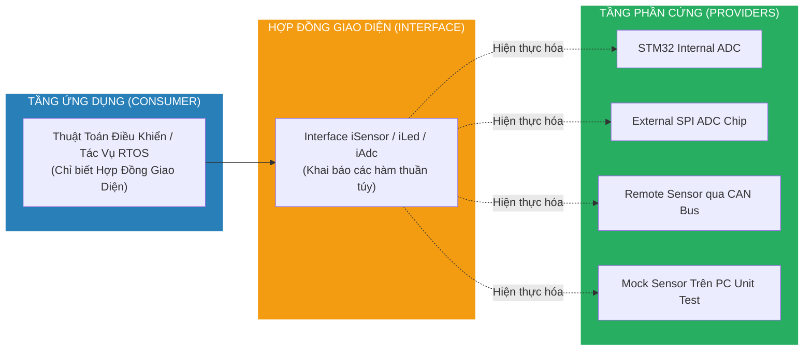
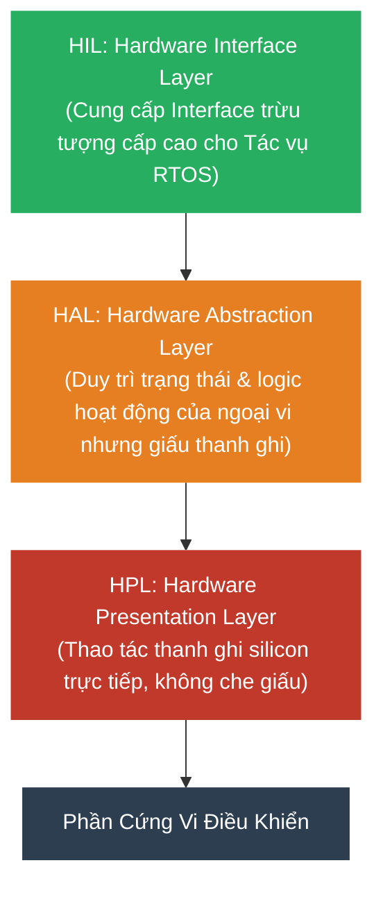
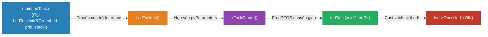

# <span style="color:#f1c40f">Chương 11: Kiến Trúc Phân Tầng Trừu Tượng Hóa Tốt (Designing a Well-Abstracted Architecture)</span>

> **Tài liệu tham khảo chuyên sâu kết hợp:**
> - 📘 *Hands-On RTOS with Microcontrollers* – Brian Amos (Chapter 12: *Tips for Creating a Well-Abstracted Architecture*, tr. 305–333).
> - 📙 *TinyOS Alliance TEP 101* – Hardware Presentation Layer (HPL), Hardware Abstraction Layer (HAL), Hardware Interface Layer (HIL).
> - 📗 *Mastering the FreeRTOS Real Time Kernel* – Richard Barry (Task parameterization via `pvParameters`, modular design, and Host-Based Testing with FreeRTOS Simulator).
> - 🛠️ *Embedded Artistry Architecture Design Patterns* & *Ceedling / Unity / CMock Test-Driven Development*.

---

```text
MỤC LỤC CHUYÊN SÂU (TABLE OF CONTENTS)
├── 1. Bản Chất Của Trừu Tượng Hóa & Giá Trị Kinh Tế Kỹ Thuật (Understanding Abstraction)
│   ├── 1.1 Khái Niệm: Hợp Đồng Giao Diện (Interface Contract) Trong Lập Trình Nhúng
│   ├── 1.2 So Sánh Thực Chiến: Hệ Thống Có vs Không Có Trừu Tượng Hóa (Ví dụ 3 Trục ADC X, Y, Z)
│   ├── 1.3 Mô Hình 5 Nguồn ADC Phía Sau 1 Interface Trung Lập
│   ├── 1.4 4 Lý Do Sống Còn Bắt Buộc Phải Áp Dụng Trừu Tượng Hóa
│   ├── 1.5 3 Dấu Hiệu Nhận Biết Cơ Hội Tái Sử Dụng Mã Nguồn
│   └── 1.6 Bẫy "Copy-Paste-Modify" (The Forking Anti-Pattern) & Kiến Trúc Nguồn Đơn (Single-Source)
├── 2. Lập Trình Hướng Đối Tượng Trong C (OOP in C / Polymorphism without C++)
│   ├── 2.1 Hiện Thực Hóa 3 Trụ Cột OOP Bằng C Thuần: Encapsulation, Inheritance, Polymorphism
│   ├── 2.2 Bảng Con Trỏ Hàm (Virtual Method Table - VTable) Trong C
│   ├── 2.3 Hai Trường Phái Thiết Kế: Static Singleton vs Multi-Instance (Con trỏ self)
│   └── 2.4 Lập Trình Phòng Thủ: Kiểm Tra NULL & Bảo Vệ VTable Trong Flash ROM bằng const
├── 3. Kiến Trúc Phân Tầng Driver Chuẩn Công Nghiệp (Layered Architecture & TinyOS TEP101)
│   ├── 3.1 Mô Hình Phân Tầng 5 Lớp Trong Sách Brian Amos
│   ├── 3.2 Đối Chiếu Chuẩn Công Nghiệp TinyOS TEP101: HPL -> HAL -> HIL
│   └── 3.3 Triển Khai Toàn Diện Hệ Thống ADC Đa Nguồn (iAdc.h, spiAdc, i2cAdc, mcuAdc)
├── 4. Case Study Thực Chiến: Xây Dựng Hệ Thống iLed Hoàn Chỉnh (Brian Amos Listings)
│   ├── 4.1 File 1: Định Nghĩa Giao Diện Trừu Tượng (Interfaces/iLed.h)
│   ├── 4.2 File 2: Khai Báo Biến Thể Phần Cứng (ledImplementation.h)
│   ├── 4.3 File 3: Ranh Giới Phần Cứng Duy Nhất (ledImplementation.c)
│   ├── 4.4 File 4 & 5: Driver Không Phụ Thuộc Phần Cứng (hardwareAgnosticLedDriver.c/h)
│   └── 4.5 File 6: Ứng Dụng Đa Hình Runtime (mainLedAbstraction.c)
├── 5. Đóng Gói Và Tái Sử Dụng Mã Nguồn Chứa RTOS Task (Reusable RTOS Tasks)
│   ├── 5.1 Rào Cản Khi Tái Sử Dụng Task: Phụ Thuộc Cứng Phần Cứng & Biến Toàn Cục
│   ├── 5.2 Mẫu Thiết Kế Tác Vụ Tự Chứa (Self-Contained Task Pattern)
│   ├── 5.3 Cơ Chế Truyền Phụ Thuộc Qua pvParameters Của FreeRTOS
│   ├── 5.4 Mã Nguồn Hoàn Chỉnh: ledTask.h, ledTask.c và mainLedTask.c
│   └── 5.5 Lưu Ý Sống Còn Về Cấu Hình Ngắt: NVIC_PRIORITYGROUP_4 Trên Cortex-M
├── 6. Chiến Lược Kiểm Thử Tự Động Trên Máy Tính (Host-Based Unit Testing & Mocking)
│   ├── 6.1 Tại Sao Kiểm Thử Nhúng Truyền Thống Lại Bế Tắc? (Hardware Dependency Hell)
│   ├── 6.2 Mô Hình Test Double (Mock Object & Stubs) Với Interface C
│   ├── 6.3 Quy Trình Kiểm Thử Logic Task Không Cần Phần Cứng (Ceedling / Unity Framework)
│   └── 6.4 Kỹ Thuật Mocking FreeRTOS Kernel API & FreeRTOS Simulator Port
├── 7. Phân Tích Đánh Đổi Kỹ Thuật & Chi Phí Hiệu Năng (Performance Overhead Analysis)
│   ├── 7.1 Chi Phí Lệnh Nhảy Gián Tiếp (Indirect Call BLX) Trên ARM Cortex-M7
│   ├── 7.2 Ảnh Hưởng Đến Pipeline Dual-Issue & Bộ Dự Đoán Rẽ Nhánh (Branch Predictor)
│   ├── 7.3 Tiêu Hao Bộ Nhớ RAM/ROM Giữa VTable Function Pointers vs Trực Tiếp
│   └── 7.4 Tối Ưu Hóa Biên Dịch: Link-Time Optimization (LTO) & Devirtualization
├── 8. Tổ Chức Mã Nguồn & Cấu Trúc Thư Mục Cho Dự Án Quy Mô Lớn (Project Organization & BSP)
│   ├── 8.1 Cấu Trúc Thư Mục Đa Dự Án Chuẩn Mực (Interfaces, Common, BSPs, Projects)
│   ├── 8.2 Nguyên Tắc Bất Di Bất Dịch: Không Include Chéo Giữa Các Projects (No Cross-Project Includes)
│   └── 8.3 Chiến Lược Quản Lý Thay Đổi: Compile-time Enforcement & Git Tagging
├── 9. Câu Hỏi Ôn Tập Chuyên Sâu & Lời Giải Chi Tiết (Brian Amos Chapter 12 Assessments)
│   ├── Câu 1: Trừu tượng hóa chỉ làm được trên OS desktop? (False)
│   ├── Câu 2: Chỉ code hướng đối tượng C++ mới hưởng lợi từ interface? (False)
│   ├── Câu 3: Nêu 1 trong 4 lý do tại sao trừu tượng hóa quan trọng?
│   ├── Câu 4: Copy-paste mã nguồn là cách tốt nhất để tái sử dụng? (False)
│   └── Câu 5: RTOS Tasks quá đặc thù, không thể tái sử dụng giữa các dự án? (False)
└── 10. Bảng Tổng Hợp Kiến Thức Cốt Lõi (Key Takeaways Summary Matrix)
```

---

## <span style="color:#e67e22">1. Bản Chất Của Trừu Tượng Hóa & Giá Trị Kinh Tế Kỹ Thuật (Understanding Abstraction)</span>

Trong ngành kỹ thuật phần mềm nhúng (Embedded Software Engineering), một trong những ranh giới rõ ràng nhất giữa một **Junior C Programmer** và một **Senior Embedded Systems Architect** nằm ở: **Khả năng thiết kế hệ thống với mức độ trừu tượng hóa (Abstraction) chuẩn mực**.

---

### <span style="color:#1abc9c">1.1 Khái Niệm: Hợp Đồng Giao Diện (Interface Contract) Trong Lập Trình Nhúng</span>

- **Định nghĩa cốt lõi**: Trừu tượng hóa (Abstraction) là quá trình biểu diễn một thực thể phần cứng hoặc phần mềm phức tạp, cụ thể bằng một **giao diện cấp cao, tổng quát và bất biến**.
- **Hợp đồng giao diện (Interface Contract)**: 
  - Giao diện (Interface) đóng vai trò như một bản cam kết rõ ràng: Nó quy định **LÀM CÁI GÌ (WHAT TO DO)** chứ tuyệt đối không quan tâm đến **LÀM NHƯ THẾ NÀO (HOW TO DO IT)**.
  - Phía tiêu thụ (Consumer / Application Layer) chỉ cần biết các quy tắc trong hợp đồng giao diện để thực thi logic nghiệp vụ.
  - Phía cung cấp (Provider / Hardware Driver Layer) có toàn quyền quyết định cách điều khiển thanh ghi silicon, sử dụng SPI, I2C, UART, hay DMA miễn sao đáp ứng đúng hợp đồng đã cam kết.



---

### <span style="color:#1abc9c">1.2 So Sánh Thực Chiến: Hệ Thống Có vs Không Có Trừu Tượng Hóa (Ví Dụ 3 Trục ADC X, Y, Z)</span>

Để chứng minh sức mạnh của trừu tượng hóa, tác giả Brian Amos đưa ra bài toán thực tế: Một hệ thống cần lấy mẫu dữ liệu từ 3 cảm biến đo lường gia tốc trên 3 trục không gian $X, Y, Z$.

#### Trường Hợp 1: Mã Nguồn KHÔNG CÓ Trừu Tượng Hóa (Tightly Coupled & Messy)
Lập trình viên gọi trực tiếp các hàm driver của nhà sản xuất (Vendor HAL) rải rác khắp logic ứng dụng:

```c
// Đoạn mã nghiệp vụ lấy mẫu cảm biến 3 trục
bufferX[i] = adc_avg(0, 1);                    // Kênh 0 là trục nào? Số 1 nghĩa là gì?
bufferY[i] = adc_avg(1, 1);                    // numSamp=1 có đủ lọc nhiễu không?
bufferZ[i] = HAL_ADC_GetValue(adc2_ch0_h);    // Tại sao trục Z lại dùng hàm khác hoàn toàn?
```

Kèm theo các khai báo hàm nguyên thủy:
```c
/**
 * Lấy giá trị trung bình từ kênh ADC
 * @param chNum   Kênh phần cứng của ADC  <-- Bắt buộc phải lật schematic ra tra cứu!
 * @param numSamp Số lượng mẫu lấy trung bình
 */
uint32_t adc_avg(uint8_t chNum, uint16_t numSamp);

/**
 * Hàm đọc giá trị thanh ghi từ thư viện HAL của ST
 * @param hadc    Con trỏ trỏ tới cấu trúc ADC_HandleTypeDef <-- Bị khóa chặt vào STM32!
 */
uint32_t HAL_ADC_GetValue(ADC_HandleTypeDef* hadc);
```

> [!CAUTION]
> **4 Hiểm Họa Nghiêm Trọng Của Mã Nguồn Không Trừu Tượng Hóa:**
> 1. **Khó đọc & Tăng gánh nặng nhận thức (High Cognitive Load)**: Người đọc code không thể hiểu trục $X, Y, Z$ được nối vào đâu nếu không có sơ đồ nguyên lý mạch (Schematic) bên cạnh.
> 2. **Cú pháp bất nhất (Inconsistent APIs)**: Cùng là hành vi "đọc giá trị điện áp", nhưng trục $X, Y$ gọi `adc_avg` còn trục $Z$ lại gọi `HAL_ADC_GetValue`.
> 3. **Khóa chặt phần cứng (Vendor Lock-in)**: Toàn bộ thuật toán ứng dụng bị trói chặt vào STM32 HAL. Nếu công ty muốn chuyển sang MCU NXP, TI, hoặc RISC-V do khủng hoảng thiếu chip $\rightarrow$ **Phải đập đi viết lại toàn bộ mã nguồn**!
> 4. **Bất khả thi khi Unit Test trên PC**: Không thể chạy đoạn code này trên máy tính phát triển vì thiếu thanh ghi phần cứng của STM32.

---

#### Trường Hợp 2: Mã Nguồn CÓ Trừu Tượng Hóa Chuẩn Mực (Clean & Hardware-Agnostic)

```c
// Đoạn mã nghiệp vụ sạch sẽ, tự giải thích ý định (Self-Documenting Code)
bufferX[i] = adcX->ReadAdcValue();
bufferY[i] = adcY->ReadAdcValue();
bufferZ[i] = adcZ->ReadAdcValue();
```

> [!NOTE]
> Đoạn code trên đọc mượt mà như văn xuôi tiếng Anh. Nó chỉ thể hiện duy nhất **Ý Định Nghiệp Vụ (Business Intent)**: *"Đọc giá trị từ cảm biến ADC trục X, Y và Z"*. 
> Developer đọc vào hiểu ngay chức năng mà không cần biết trục X đang dùng chip ADC ngoài qua SPI, trục Y dùng ADC nội qua DMA, hay trục Z nhận dữ liệu từ xa qua CAN Bus!

---

### <span style="color:#1abc9c">1.3 Mô Hình 5 Nguồn ADC Phía Sau 1 Interface Trung Lập</span>

Trừu tượng hóa cho phép một hàm duy nhất `int32_t ReadAdcValue(void)` che giấu đằng sau nó vô số công nghệ phần cứng khác nhau:

```
                    ┌─────────────────────────────────────────┐
                    │    int32_t ReadAdcValue( void )         │  <-- Interface bất biến duy nhất
                    └────────────────────┬────────────────────┘
                                         │
           ┌──────────────┬──────────────┼──────────────┬──────────────┐
           ▼              ▼              ▼              ▼              ▼
     Chip ADC I2C   Chip ADC SPI   Module ADC     ADC Nội Bộ     Cảm Biến Node Mạng
      (ADS1115)       (MCP3208)     Qua UART       STM32F7       Từ Xa Qua CAN/BLE
     Address 0x48   CS = GPIO_B5   AT+GET_ADC=1    Channel 0      CAN ID: 0x301
```

Nếu nhóm phần cứng thay đổi cảm biến từ ADC nội sang chip ADC giao tiếp SPI 16-bit vì cần độ chính xác cao hơn: **Tầng ứng dụng không cần sửa dù chỉ một dòng code!**

---

### <span style="color:#1abc9c">1.4 4 Lý Do Sống Còn Bắt Buộc Phải Áp Dụng Trừu Tượng Hóa</span>

Brian Amos chỉ ra 4 giá trị kinh tế - kỹ thuật cốt lõi giúp các công ty công nghệ tiết kiệm hàng trăm ngàn USD chi phí R&D:

1. **Tái Sử Dụng Xuyên Dự Án (Cross-Project Reuse)**:
   - Các thuật toán xử lý tín hiệu (bộ lọc Kalman, PID, tính toán RMS, giải thuật nén dữ liệu) được viết dựa trên Interface có thể đem dùng lại nguyên vẹn cho 10 dự án khác nhau mà không phải chỉnh sửa logic.
2. **Khả Năng Chuyển Đổi Phần Cứng Dễ Dàng (Hardware Portability)**:
   - Khi chuyển từ vi điều khiển giá rẻ STM32F1 sang chip hiệu năng cao STM32H7, hoặc từ ARM Cortex-M sang ESP32 / RISC-V, kỹ sư chỉ việc viết lại tầng Driver cấp thấp (Hardware Implementation). Tầng nghiệp vụ và ứng dụng được giữ nguyên $100\%$.
3. **Kiểm Thử Đơn Vị Tự Động (Host-Based Unit Testing & CI/CD)**:
   - Cho phép chạy toàn bộ test case trên PC (x86/x64) bằng cách tiêm (inject) các đối tượng giả lập (**Mock Objects**). Tốc độ chạy test nhanh gấp hàng trăm lần so với việc nạp chip qua ST-Link, phát hiện bug ngay trong quá trình commit code lên GitHub/GitLab CI.
4. **Phát Triển Song Song Trong Nhóm Lớn (Parallel Team Development)**:
   - Khi hợp đồng Interface được chốt trong tuần đầu tiên của dự án:
     - Kỹ sư Firmware 1: Lập trình tầng Driver phần cứng và đo đạc phần cứng thật.
     - Kỹ sư Firmware 2: Lập trình thuật toán ứng dụng trên PC bằng Mock Interface.
     - Cả hai làm việc độc lập, không ai phải ngồi chờ ai, triệt tiêu hoàn toàn hiện tượng nghẽn tiến độ (Bottleneck).

---

### <span style="color:#1abc9c">1.5 3 Dấu Hiệu Nhận Biết Cơ Hội Tái Sử Dụng Mã Nguồn</span>

Kỹ sư trưởng hệ thống cần nhạy bén nhận diện 3 dấu hiệu sau trong codebase để tiến hành đóng gói trừu tượng hóa:
1. **Dấu hiệu 1: Đoạn code xuất hiện ở hơn một dự án**:
   - Nếu bạn thấy cùng một thuật toán giải mã giao thức Modbus hoặc bộ lọc IIR xuất hiện ở 2 dự án khác nhau $\rightarrow$ Cần tách ngay thành thư viện dùng chung (Shared Library / Common Component).
2. **Dấu hiệu 2: Mã nguồn ứng dụng gọi trực tiếp Vendor HAL API**:
   - Xuất hiện các hàm `HAL_GPIO_WritePin`, `HAL_UART_Transmit`, `I2C_Master_Read` nằm xen lẫn trong logic điều khiển $\rightarrow$ Dấu hiệu của sự gắn kết chặt chẽ (Tight Coupling), cần tạo tầng bọc (Wrapper Layer).
3. **Dấu hiệu 3: Module nằm ở tầng giữa của ngăn xếp phần mềm**:
   - Một module vừa nhận lệnh từ tầng ứng dụng cấp cao, vừa ra lệnh cho tầng driver cấp thấp $\rightarrow$ Cần có Interface chuẩn ở cả hai đầu để tạo điểm ngắt sạch (Clean Seam) cho việc kiểm thử.

---

### <span style="color:#1abc9c">1.6 Bẫy "Copy-Paste-Modify" (The Forking Anti-Pattern) & Kiến Trúc Nguồn Đơn</span>

#### Hiểm Họa Của Bẫy Copy-Paste-Modify:
Khi bắt đầu một dự án mới, cách làm lười biếng phổ biến nhất là: Copy file `algorithm.c` từ Dự án A sang Dự án B, sửa một vài hàm để tương thích phần cứng mới. Sau 6 dự án, hệ thống biến thành một "mớ bòng bong":

```
Dự Án A (MCU1 + SPI ADC)   ──► algorithm_A.c (Fork 1)
Dự Án B (MCU1 + I2C ADC)   ──► algorithm_B.c (Fork 2)
Dự Án C (MCU2 + SPI ADC)   ──► algorithm_C.c (Fork 3)
Dự Án D (MCU2 + I2C ADC)   ──► algorithm_D.c (Fork 4)
Dự Án E (MCU1 + UART ADC)  ──► algorithm_E.c (Fork 5)
Dự Án F (MCU2 + UART ADC)  ──► algorithm_F.c (Fork 6)
```

```
HẬU QUẢ TÀI CHÍNH & KỸ THUẬT:
1. Chi Phí Vá Lỗi Nhân Lên Gấp 6 (Bug Patch Multiplied x6):
   - Phát hiện 1 lỗi chia cho 0 trong thuật toán -> Phải mở 6 file sửa bằng tay ở 6 repo khác nhau!
   - Chỉ cần sơ suất quên sửa ở 1 dự án -> Khách hàng của sản phẩm đó gặp lỗi và khiếu nại!
2. Chi Phí Kiểm Định Nhân Lên Gấp 6 (Validation Multiplied x6):
   - Mỗi lần sửa code phải mang cả 6 bo mạch phần cứng vật lý ra nạp lại để test.
3. Phân Kỳ Mã Nguồn (Code Drift):
   - Một lập trình viên tối ưu hiệu năng cho Dự án A nhưng không cập nhật cho các dự án còn lại.
   - Codebase của công ty bị xé lẻ, không ai dám nhận trách nhiệm bảo trì.
```

#### Giải Pháp: Kiến Trúc Nguồn Đơn (Single-Source Architecture) Kết Hợp Trừu Tượng Hóa:

```
               ┌─────────────────────────────────────────┐
               │            algorithm.c                  │  <-- DUY NHẤT 1 file nguồn
               │    (Thuần túy logic toán học,           │      Không nhân bản,
               │     hoàn toàn không biết MCU hay ADC)   │      Dùng chung cho cả 6 dự án!
               └────────────────────┬────────────────────┘
                                    │ Phụ thuộc duy nhất vào
               ┌────────────────────▼────────────────────┐
               │              iAdc.h                     │  <-- Interface Contract
               └────────────────────┬────────────────────┘
                                    │
         ┌─────────────────┬────────┴────────┬─────────────────┐
         ▼                 ▼                 ▼                 ▼
       BSP_A             BSP_B             BSP_C             BSP_D
   (MCU1 + SPI)      (MCU1 + I2C)      (MCU2 + SPI)      (MCU2 + I2C)
```

- Sửa 1 bug trong `algorithm.c` $\rightarrow$ Cả 6 sản phẩm đều tự động được sửa lỗi!
- Kiểm thử thuật toán: Chạy test duy nhất một lần trên PC với Mock ADC.
- Porting sang phần cứng mới: Chỉ cần viết thêm một file BSP mới đáp ứng Interface `iAdc.h`.

---

## <span style="color:#e67e22">2. Lập Trình Hướng Đối Tượng Trong C (OOP in C / Polymorphism without C++)</span>

Rất nhiều kỹ sư cho rằng muốn lập trình hướng đối tượng (OOP) hay sử dụng tính Đa hình (Polymorphism) thì bắt buộc phải dùng C++ hoặc Java. Brian Amos khẳng định: **Ngôn ngữ C thuần túy hoàn toàn có thể hiện thực hóa đầy đủ các tính chất của OOP với hiệu năng cao và độ kiểm soát bộ nhớ tuyệt đối**!

---

### <span style="color:#1abc9c">2.1 Hiện Thực Hóa 3 Trụ Cột OOP Bằng C Thuần</span>

1. **Đóng Gói (Encapsulation)**:
   - Sử dụng kỹ thuật **Opaque Pointer** (con trỏ không hoàn chỉnh): Định nghĩa `struct DeviceHandle;` trong header file `.h`, chi tiết các trường bên trong được giấu kín hoàn toàn trong file `.c`. Mã nguồn bên ngoài chỉ tương tác qua các hàm được cung cấp, không thể tự ý can thiệp vào biến nội bộ.
2. **Kế Thừa (Inheritance)**:
   - Sử dụng kỹ thuật **Struct Embedding** (lồng struct cha vào đầu struct con). Do chuẩn C quy định địa chỉ của trường đầu tiên trong struct luôn trùng với địa chỉ của chính struct đó, ta có thể dễ dàng ép kiểu con trỏ struct con về con trỏ struct cha (Upcasting).
3. **Đa Hình (Polymorphism)**:
   - Sử dụng **Struct of Function Pointers (Cấu trúc chứa các con trỏ hàm)** để mô phỏng bảng phương thức ảo (Virtual Method Table / VTable).

---

### <span style="color:#1abc9c">2.2 Bảng Con Trỏ Hàm (Virtual Method Table - VTable) Trong C</span>

Trong C++, khi khai báo một hàm `virtual`, compiler sẽ ngầm tạo ra một bảng VTable chứa địa chỉ các hàm tương ứng. Trong C, chúng ta làm điều đó một cách **tường minh và hoàn toàn kiểm soát được**:

```c
// 1. Định nghĩa kiểu con trỏ hàm chuẩn cho hành vi của LED
typedef void (*LedActionFunc_t)(void);

// 2. Struct Interface đóng vai trò là VTable
typedef struct {
    const LedActionFunc_t On;   // Con trỏ tới hàm Bật
    const LedActionFunc_t Off;  // Con trỏ tới hàm Tắt
} iLed;
```

---

### <span style="color:#1abc9c">2.3 Hai Trường Phái Thiết Kế: Static Singleton vs Multi-Instance (Con trỏ self)</span>

Brian Amos giới thiệu mô hình Static Singleton trong các ví dụ LED, nhưng một Senior Architect cần hiểu rõ sự phân hóa giữa 2 trường phái:

| Tiêu Chí | Trường Phái 1: Static Singleton (Brian Amos) | Trường Phái 2: Multi-Instance Context (C-OOP Chuẩn) |
|---|---|---|
| **Chữ ký hàm** | `void (*On)(void);` | `void (*On)(struct iLed* self);` |
| **Cách truyền dữ liệu** | Hàm con thao tác trực tiếp trên chân GPIO cố định (hardcoded trong file `.c`). | Nhận thêm tham số con trỏ `self` trỏ tới struct chứa cấu hình chân (Port, Pin). |
| **Khả năng mở rộng** | Mỗi LED cần 1 cặp hàm static riêng (`GreenOn`, `RedOn`). | Chỉ cần 1 hàm tổng quát duy nhất `GenericLedOn(iLed* self)`. Tạo 100 LED chỉ cần tạo 100 structs. |
| **Tiêu hao bộ nhớ** | Nhẹ hơn (không tốn thêm tham số trên thanh ghi R0). | Tốn thêm 1 tham số truyền qua thanh ghi R0 khi gọi hàm. |
| **Phù hợp nhất cho** | Thiết bị phần cứng duy nhất (1 cổng USB, 1 chip RTC). | Tập hợp nhiều thiết bị tương tự (16 Relay, 32 van solenoid, nhiều sensor). |

---

### <span style="color:#1abc9c">2.4 Lập Trình Phòng Thủ: Kiểm Tra NULL & Bảo Vệ VTable Trong Flash ROM</span>

Lập trình với con trỏ hàm tiềm ẩn hiểm họa lớn nhất: **Con trỏ trỏ tới NULL hoặc địa chỉ rác $\rightarrow$ Gây lỗi HardFault làm sập vi điều khiển ngay lập tức**!

#### Quy Tắc 1: Luôn Kiểm Tra Con Trỏ Hàm Trước Khi Thực Thi (Defensive Null Check)
```c
void doLedStuff(const iLed* LedPtr)
{
    // Lập trình phòng thủ 2 lớp:
    if (LedPtr != NULL)
    {
        if (LedPtr->On != NULL)
        {
            LedPtr->On(); // Chỉ gọi khi con trỏ hàm hợp lệ
        }
        if (LedPtr->Off != NULL)
        {
            LedPtr->Off();
        }
    }
}
```

#### Quy Tắc 2: Sử Dụng Từ Khóa `const` Để Đặt VTable Vào Flash ROM (Security & Safety)
```c
// KHAI BÁO CHUẨN MỰC TRONG HEADER:
typedef struct {
    void (* const On)(void);  // Con trỏ hàm là CONST: Không thể bị ghi đè lúc runtime!
    void (* const Off)(void);
} iLed;
```
> [!IMPORTANT]
> **Ý nghĩa sống còn trong Embedded Security:**
> Bằng cách khai báo `const`, trình biên dịch (GCC/IAR) sẽ đặt bảng con trỏ hàm vào **Bộ nhớ Flash (Vùng nhớ chỉ đọc - Read-Only)** thay vì RAM. Điều này ngăn chặn hoàn toàn các cuộc tấn công tràn bộ đệm (Buffer Overflow Attack) hoặc con trỏ hoang (Dangling Pointer) ghi đè địa chỉ hàm giả mạo vào VTable!

---

## <span style="color:#e67e22">3. Kiến Trúc Phân Tầng Driver Chuẩn Công Nghiệp (Layered Architecture & TinyOS TEP101)</span>

Một trong những sai lầm phổ biến nhất của các kỹ sư nhúng là nhầm lẫn giữa **Thư viện HAL của nhà sản xuất (như STM32 HAL)** và **Tầng Trừu Tượng Hóa Phần Cứng (Hardware Abstraction Layer - HAL)**.

> [!WARNING]
> **Nhận Định Cốt Lõi Của Brian Amos:**
> Thư viện STM32Cube HAL của ST **KHÔNG PHẢI** là một tầng trừu tượng hóa độc lập vi điều khiển. Nó chỉ là một **Peripheral Driver (Trình điều khiển ngoại vi)** được viết riêng cho vi điều khiển STM32. Nếu tầng ứng dụng gọi trực tiếp các hàm `HAL_GPIO_WritePin` hay `HAL_UART_Transmit`, toàn bộ mã nguồn vẫn bị gắn chặt vào hãng ST!

---

### <span style="color:#1abc9c">3.1 Mô Hình Phân Tầng 5 Lớp Trong Sách Brian Amos</span>

Brian Amos xây dựng kiến trúc phân tầng 5 lớp rõ ràng để đạt được sự phân tách hoàn toàn (Complete Decoupling):

```
┌────────────────────────────────────────────────────────┐
│        TẦNG 5: ỨNG DỤNG NGƯỜI DÙNG (Application)       │
│     algorithm.c  |  control_loop.c  |  gui_task.c      │
│        (Chỉ biết Interface, hoàn toàn không biết HW)   │
├────────────────────────────────────────────────────────┤
│       TẦNG 4: HỢP ĐỒNG GIAO DIỆN (Interface Layer)     │
│       iAdc.h  |  iLed.h  |  iUart.h  |  iMotor.h       │
│        (Các struct con trỏ hàm, không có mã thực thi)  │
├────────────────────────────────────────────────────────┤
│     TẦNG 3: TRÌNH ĐIỀU KHIỂN LINH KIỆN (IC Drivers)    │
│    ads1115Driver.c (ADC I2C) | w25q128Driver.c (Flash) │
│       (Biết về linh kiện IC rời, KHÔNG biết MCU nào)   │
├────────────────────────────────────────────────────────┤
│    TẦNG 2: NGOẠI VI MCU / BSP (Peripheral Drivers)     │
│        STM32 HAL / NXP SDK / TI DriverLib              │
│       (Cụ thể cho từng dòng vi điều khiển)             │
├────────────────────────────────────────────────────────┤
│         TẦNG 1: PHẦN CỨNG VẬT LÝ (Silicon Hardware)    │
│            Thanh ghi GPIO, Timer, ADC, SPI, I2C        │
└────────────────────────────────────────────────────────┘
```

- **Quy tắc bất di bất dịch**: Tầng trên chỉ được phép gọi tầng ngay bên dưới thông qua **Hợp đồng giao diện (Tầng 4)**. Tuyệt đối không có chuyện Tầng 5 "nhảy cóc" gọi thẳng xuống Tầng 2 hoặc Tầng 1!

---

### <span style="color:#1abc9c">3.2 Đối Chiếu Chuẩn Công Nghiệp TinyOS TEP101: HPL $\rightarrow$ HAL $\rightarrow$ HIL</span>

Chuẩn kiến trúc phần cứng nổi tiếng thế giới **TinyOS TEP 101 (Hardware Abstraction Architecture)** phân chia hệ thống nhúng thành 3 lớp tinh giản:



1. **HPL (Hardware Presentation Layer)**: Lớp thấp nhất, ánh xạ 1-1 với thanh ghi phần cứng (ví dụ: các định nghĩa macro thanh ghi trong `stm32f767xx.h` hoặc thư viện LL Low-Layer).
2. **HAL (Hardware Abstraction Layer)**: Lớp trung gian, quản lý máy trạng thái, bộ đệm truyền nhận, cấu hình xung clock của ngoại vi mà không phụ thuộc vào ứng dụng bên trên.
3. **HIL (Hardware Interface Layer)**: Lớp cao nhất, cung cấp các hàm API thân thiện, chuẩn hóa (`ReadAdc`, `TransmitData`) đáp ứng đúng hợp đồng của tầng ứng dụng.

---

### <span style="color:#1abc9c">3.3 Triển Khai Toàn Diện Hệ Thống ADC Đa Nguồn (iAdc.h, spiAdc, i2cAdc, mcuAdc)</span>

Dưới đây là mã nguồn C chuẩn mực triển khai kiến trúc trừu tượng cho hệ thống ADC đa nguồn:

#### 1. Định nghĩa Hợp đồng Giao diện ADC (`Interfaces/iAdc.h`):
```c
#ifndef I_ADC_H
#define I_ADC_H

#include <stdint.h>

// Định nghĩa kiểu con trỏ hàm đọc giá trị ADC (đơn vị: microvolt hoặc raw count)
typedef int32_t (*AdcReadFunc_t)(void);

// Bảng VTable trừu tượng cho ADC
typedef struct {
    const AdcReadFunc_t ReadMilliVolts; // Hàm đọc điện áp quy đổi (mV)
    const AdcReadFunc_t ReadRawCounts;  // Hàm đọc giá trị thanh ghi thô
} iAdc;

#endif // I_ADC_H
```

#### 2. Triển khai Driver ADC Nội Bộ STM32 (`BSPs/mcuInternalAdc.c`):
```c
#include "iAdc.h"
#include "stm32f7xx_hal.h"

extern ADC_HandleTypeDef hadc1;

static int32_t McuAdc_ReadRaw(void)
{
    HAL_ADC_Start(&hadc1);
    if (HAL_ADC_PollForConversion(&hadc1, 10) == HAL_OK)
    {
        return (int32_t)HAL_ADC_GetValue(&hadc1);
    }
    return -1; // Mã lỗi chuyển đổi thất bại
}

static int32_t McuAdc_ReadMilliVolts(void)
{
    int32_t raw = McuAdc_ReadRaw();
    if (raw < 0) return raw;
    // Chuyển đổi 12-bit (0-4095) ứng với Vref = 3300mV
    return (raw * 3300) / 4095;
}

// Khởi tạo instance VTable cho ADC nội bộ MCU
const iAdc InternalAdcChannel0 = {
    .ReadMilliVolts = McuAdc_ReadMilliVolts,
    .ReadRawCounts  = McuAdc_ReadRaw
};
```

#### 3. Triển khai Driver Chip ADC Rời Giao Tiếp SPI MCP3208 (`Common/spiAdcDriver.c`):
```c
#include "iAdc.h"
#include <stddef.h>

// Driver này hoàn toàn độc lập với STM32! Nó chỉ tương tác qua hàm SPI trừu tượng
extern int32_t MCP3208_ReadChannelRaw(uint8_t channel);

static int32_t SpiAdc_ReadRaw(void)
{
    return MCP3208_ReadChannelRaw(0); // Đọc kênh 0 của chip SPI
}

static int32_t SpiAdc_ReadMilliVolts(void)
{
    int32_t raw = SpiAdc_ReadRaw();
    if (raw < 0) return raw;
    // Chip MCP3208 12-bit dùng điện áp tham chiếu ngoài 5000mV
    return (raw * 5000) / 4095;
}

const iAdc ExternalSpiAdc = {
    .ReadMilliVolts = SpiAdc_ReadMilliVolts,
    .ReadRawCounts  = SpiAdc_ReadRaw
};
```

#### 4. Tầng Ứng Dụng Thuật Toán Lấy Mẫu Không Quan Tâm Phần Cứng:
```c
#include "iAdc.h"

// Thuật toán lấy mẫu trung bình 16 lần
int32_t CalculateAverageVoltage(const iAdc *adcSensor)
{
    if (adcSensor == NULL || adcSensor->ReadMilliVolts == NULL) {
        return 0;
    }

    int64_t sum = 0;
    for (int i = 0; i < 16; i++) {
        sum += adcSensor->ReadMilliVolts();
    }
    return (int32_t)(sum / 16);
}
```

---

## <span style="color:#e67e22">4. Case Study Thực Chiến: Xây Dựng Hệ Thống iLed Hoàn Chỉnh (Brian Amos Listings)</span>

Để minh họa trực quan phương pháp triển khai C Interface bằng **Struct of Function Pointers**, tác giả Brian Amos phát triển một hệ thống điều khiển LED đa hình hoàn chỉnh gồm 6 tệp tin mã nguồn.

---

### <span style="color:#1abc9c">4.1 File 1: Định Nghĩa Giao Diện Trừu Tượng (Interfaces/iLed.h)</span>

Tệp tin này hoàn toàn **không có bất kỳ câu lệnh `#include` liên quan đến phần cứng** nào!

```c
/* =========================================================================
 * Interfaces/iLed.h - GIAO DIỆN LED TRỪU TƯỢNG (Brian Amos - Page 312)
 * ========================================================================= */
#ifndef I_LED_H
#define I_LED_H

// Định nghĩa kiểu con trỏ hàm cho hành vi điều khiển LED
typedef void (*iLedFunc)(void);

// Cấu trúc Interface LED chứa các con trỏ hàm bất biến
typedef struct {
    const iLedFunc On;   // Bật LED (bất kể mạch phần cứng là Active-High hay Active-Low)
    const iLedFunc Off;  // Tắt LED
} iLed;

#endif // I_LED_H
```

---

### <span style="color:#1abc9c">4.2 File 2: Khai Báo Biến Thể Phần Cứng (ledImplementation.h)</span>

```c
/* =========================================================================
 * BSPs/ledImplementation.h - KHAI BÁO CÁC ĐỐI TƯỢNG LED CỦA BO MẠCH
 * ========================================================================= */
#ifndef LED_IMPLEMENTATION_H
#define LED_IMPLEMENTATION_H

#include "iLed.h"

// Khai báo extern để các module khác có thể sử dụng mà không tạo bản sao bộ nhớ
extern const iLed BlueLed;   // Đèn LED xanh dương trên bo Nucleo
extern const iLed GreenLed;  // Đèn LED xanh lá
extern const iLed RedLed;    // Đèn LED đỏ

#endif // LED_IMPLEMENTATION_H
```

---

### <span style="color:#1abc9c">4.3 File 3: Ranh Giới Phần Cứng Duy Nhất (ledImplementation.c)</span>

Đây là **tệp tin DUY NHẤT trong toàn bộ dự án biết về chi tiết phần cứng** (chân GPIO, Port, và thư viện STM32 HAL):

```c
/* =========================================================================
 * BSPs/ledImplementation.c - TRIỂN KHAI PHẦN CỨNG CỤ THỂ CHO NUCLEO-F767ZI
 * ========================================================================= */
#include "ledImplementation.h"
#include "stm32f7xx_hal.h" // CHỈ DUY NHẤT FILE NÀY ĐƯỢC PHÉP INCLUDE HAL VENDOR!

// Các hàm static riêng tư điều khiển chân GPIO thực tế
static void GreenOn(void)  { HAL_GPIO_WritePin(GPIOB, GPIO_PIN_0, GPIO_PIN_SET); }
static void GreenOff(void) { HAL_GPIO_WritePin(GPIOB, GPIO_PIN_0, GPIO_PIN_RESET); }

static void BlueOn(void)   { HAL_GPIO_WritePin(GPIOB, GPIO_PIN_7, GPIO_PIN_SET); }
static void BlueOff(void)  { HAL_GPIO_WritePin(GPIOB, GPIO_PIN_7, GPIO_PIN_RESET); }

static void RedOn(void)    { HAL_GPIO_WritePin(GPIOB, GPIO_PIN_14, GPIO_PIN_SET); }
static void RedOff(void)   { HAL_GPIO_WritePin(GPIOB, GPIO_PIN_14, GPIO_PIN_RESET); }

// Khởi tạo các bảng VTable với từ khóa const (lưu trong Flash ROM)
const iLed GreenLed = { .On = GreenOn, .Off = GreenOff };
const iLed BlueLed  = { .On = BlueOn,  .Off = BlueOff  };
const iLed RedLed   = { .On = RedOn,   .Off = RedOff   };
```

---

### <span style="color:#1abc9c">4.4 File 4 & 5: Driver Không Phụ Thuộc Phần Cứng (hardwareAgnosticLedDriver.c/h)</span>

Driver này có thể mang đi biên dịch trên bất kỳ hệ điều hành hay vi điều khiển nào:

```c
// hardwareAgnosticLedDriver.h
#ifndef HARDWARE_AGNOSTIC_LED_DRIVER_H
#define HARDWARE_AGNOSTIC_LED_DRIVER_H

#include "iLed.h"

// Hàm thực thi nhận con trỏ tới BẤT KỲ đối tượng iLed nào
void doLedStuff(const iLed *LedPtr);

#endif
```

```c
// hardwareAgnosticLedDriver.c
#include "hardwareAgnosticLedDriver.h"
#include <stddef.h>

void doLedStuff(const iLed *LedPtr)
{
    // Lập trình phòng thủ: Kiểm tra con trỏ struct và con trỏ hàm
    if (LedPtr != NULL)
    {
        if (LedPtr->On != NULL)
        {
            LedPtr->On();  // ĐA HÌNH RUNTIME: Hàm thực tế phụ thuộc đối tượng truyền vào
        }
        if (LedPtr->Off != NULL)
        {
            LedPtr->Off();
        }
    }
}
```

---

### <span style="color:#1abc9c">4.5 File 6: Ứng Dụng Đa Hình Runtime (mainLedAbstraction.c)</span>

```c
/* =========================================================================
 * mainLedAbstraction.c - ỨNG DỤNG ĐIỀU KHIỂN ĐA HÌNH
 * ========================================================================= */
#include "ledImplementation.h"
#include "hardwareAgnosticLedDriver.h"

int main(void)
{
    HWInit(); // Khởi tạo xung nhịp và GPIO phần cứng

    while(1)
    {
        // Cùng một hàm doLedStuff, nhưng hành vi thay đổi linh hoạt theo tham số
        doLedStuff(&GreenLed);
        doLedStuff(&BlueLed);
        doLedStuff(&RedLed);
    }
}
```

---

## <span style="color:#e67e22">5. Đóng Gói Và Tái Sử Dụng Mã Nguồn Chứa RTOS Task (Reusable RTOS Tasks)</span>

Một trong những niềm tin sai lầm phổ biến nhất trong giới lập trình nhúng là: *"RTOS Tasks quá đặc thù cho từng ứng dụng cụ thể, không bao giờ có thể mang đi tái sử dụng ở dự án khác!"*

Brian Amos chứng minh điều ngược lại: **Khi được thiết kế đúng chuẩn kiến trúc, một RTOS Task hoàn toàn có thể trở thành một module độc lập (Self-Contained Module), tái sử dụng $100\%$ giữa các dự án khác nhau!**

---

### <span style="color:#1abc9c">5.1 Rào Cản Khi Tái Sử Dụng Task Truyền Thống</span>

Tại sao đa số các RTOS Task hiện nay không thể tái sử dụng?
1. **Phụ thuộc cứng vào chân phần cứng (Hardcoded Hardware)**: Bên trong thân hàm task gọi trực tiếp `HAL_GPIO_TogglePin(GPIOB, GPIO_PIN_0)`. Mang sang board khác có chân khác $\rightarrow$ Gãy đổ!
2. **Phụ thuộc vào đối tượng RTOS toàn cục (Global Queue / Mutex Coupling)**: Bên trong task đọc dữ liệu từ một biến toàn cục `xQueueSensorData`. Mang sang dự án khác không có biến này $\rightarrow$ Lỗi biên dịch!
3. **Cố định cấu hình thời gian thực**: Mức ưu tiên (Priority) và dung lượng Stack bị fix cứng trong lời gọi `xTaskCreate()`.

---

### <span style="color:#1abc9c">5.2 Mẫu Thiết Kế Tác Vụ Tự Chứa (Self-Contained Task Pattern)</span>

Để bẻ gãy mọi sự phụ thuộc và giúp Task có thể tái sử dụng tối đa, Brian Amos đề xuất mẫu thiết kế **Tác Vụ Tự Chứa (Self-Contained Task)**:
- **Tham số hóa toàn bộ phụ thuộc phần cứng**: Task chỉ giao tiếp với thế giới bên ngoài thông qua con trỏ **Interface** (`iLed*`, `iSensor*`, `iComm*`).
- **Đóng gói hàm tạo Task**: Ẩn giấu hàm thực thi nội bộ `ledTask()` dưới dạng `static` (private) trong file `.c`. Bên ngoài chỉ nhìn thấy hàm khởi tạo `LedTaskInit()`.
- **Tham số hóa cấu hình RTOS**: Cho phép tầng ứng dụng tự do truyền vào Mức ưu tiên (`Priority`) và Kích thước Stack (`StackSize`) phù hợp với tài nguyên của từng dự án.

---

### <span style="color:#1abc9c">5.3 Cơ Chế Truyền Phụ Thuộc Qua pvParameters Của FreeRTOS</span>

FreeRTOS cung cấp một cơ chế tuyệt vời để hiện thực hóa việc Tiêm phụ thuộc (Dependency Injection): Tham số `pvParameters` của hàm `xTaskCreate()`:



---

### <span style="color:#1abc9c">5.4 Mã Nguồn Hoàn Chỉnh: ledTask.h, ledTask.c và mainLedTask.c</span>

#### 1. Header Khai Báo Task Độc Lập Phần Cứng (`ledTask.h`):
```c
/* =========================================================================
 * ledTask.h - TASK TỰ CHỨA ĐẦY ĐỦ (Brian Amos - Page 317)
 * ========================================================================= */
#ifndef LED_TASK_H
#define LED_TASK_H

#include "iLed.h"       // Chỉ phụ thuộc vào Interface - Hoàn toàn không phụ thuộc HW!
#include "FreeRTOS.h"
#include "task.h"

/**
 * Khởi tạo và kích hoạt một tác vụ điều khiển nhấp nháy LED
 * @param LedPtr    Con trỏ trỏ tới đối tượng thỏa mãn hợp đồng iLed
 * @param Priority  Mức ưu tiên của Task trong hệ thống RTOS
 * @param StackSize Độ sâu Stack (tính bằng số từ 32-bit Words)
 * @return TaskHandle_t Handle của Task để quản lý runtime
 */
TaskHandle_t LedTaskInit(const iLed *LedPtr, UBaseType_t Priority, configSTACK_DEPTH_TYPE StackSize);

#endif // LED_TASK_H
```

#### 2. Triển Khai Task Độc Lập Phần Cứng (`ledTask.c`):
```c
/* =========================================================================
 * ledTask.c - HIỆN THỰC HÓA TASK VỚI LẬP TRÌNH PHÒNG THỦ
 * ========================================================================= */
#include "ledTask.h"
#include <stddef.h>

// Hàm thực thi chính của Task (Private Static - Không lộ ra bên ngoài!)
static void ledTask(void *pvParameters)
{
    // Ép kiểu an toàn từ void* về con trỏ Interface iLed*
    const iLed *led = (const iLed*)pvParameters;

    while(1)
    {
        led->On();
        vTaskDelay(pdMS_TO_TICKS(100)); // Nhường CPU trong 100ms
        led->Off();
        vTaskDelay(pdMS_TO_TICKS(100));
    }
}

TaskHandle_t LedTaskInit(const iLed *LedPtr, UBaseType_t Priority, configSTACK_DEPTH_TYPE StackSize)
{
    TaskHandle_t ledTaskHandle = NULL;

    // Lập trình phòng thủ: Bắt buộc Interface không được NULL
    if (LedPtr == NULL)
    {
        while(1); // Treo debug để phát hiện lỗi lập trình ngay lập tức
    }

    // Tạo Task với các tham số được cấu hình linh hoạt từ bên ngoài
    BaseType_t result = xTaskCreate(
        ledTask,
        "ledTask",
        StackSize,
        (void*)LedPtr, // Truyền địa chỉ Interface qua con trỏ pvParameters
        Priority,
        &ledTaskHandle
    );

    if (result != pdPASS)
    {
        while(1); // Không đủ bộ nhớ Heap để cấp phát TCB hoặc Stack!
    }

    return ledTaskHandle;
}
```

#### 3. Điều Phối Đa Nhiệm Trong Ứng Dụng Chính (`mainLedTask.c`):
```c
/* =========================================================================
 * mainLedTask.c - TÁI SỬ DỤNG 1 ĐOẠN CODE TASK CHO 3 THỰC THỂ KHÁC NHAU
 * ========================================================================= */
#include "ledImplementation.h"
#include "ledTask.h"

int main(void)
{
    HWInit();
    SEGGER_SYSVIEW_Conf();

    // CẤU HÌNH BẮT BUỘC TRÊN ARM CORTEX-M CHO FREERTOS
    HAL_NVIC_SetPriorityGrouping(NVIC_PRIORITYGROUP_4);

    // TÁI SỬ DỤNG HOÀN TOÀN CÙNG 1 MÃ NGUỒN TASK CHO 3 ĐÈN LED KHÁC NHAU:
    // Instance 1: Điều khiển GreenLed ở Priority thấp (IDLE + 1)
    LedTaskInit(&GreenLed, tskIDLE_PRIORITY + 1, 128);

    // Instance 2: Điều khiển BlueLed ở Priority trung bình (IDLE + 2)
    LedTaskInit(&BlueLed,  tskIDLE_PRIORITY + 2, 128);

    // Instance 3: Điều khiển RedLed ở Priority cao (IDLE + 3)
    LedTaskInit(&RedLed,   tskIDLE_PRIORITY + 3, 128);

    // Bắt đầu bộ lập lịch FreeRTOS
    vTaskStartScheduler();

    while(1);
}
```

---

### <span style="color:#1abc9c">5.5 Lưu Ý Sống Còn Về Cấu Hình Ngắt: NVIC_PRIORITYGROUP_4 Trên Cortex-M</span>

Trong đoạn mã trên, lời gọi hàm sau đây là **yêu cầu tiên quyết không thể bỏ qua**:
```c
HAL_NVIC_SetPriorityGrouping(NVIC_PRIORITYGROUP_4);
```

> [!CAUTION]
> **Cảnh Báo Kiến Trúc ARM Cortex-M:**
> - Vi điều khiển ARM Cortex-M cho phép chia 4 bit ưu tiên ngắt thành **Preemption Priority** và **Sub-priority**.
> - Tuy nhiên, cơ chế bảo vệ Critical Section và quản lý ngắt của FreeRTOS (`configMAX_SYSCALL_INTERRUPT_PRIORITY`) **đòi hỏi toàn bộ 4 bit phải được cấu hình làm Preemption Priority (Sub-priority = 0)**.
> - Hàm `NVIC_PRIORITYGROUP_4` thiết lập toàn bộ 4 bit là Preemption Priority. Nếu quên gọi hàm này, hệ thống sẽ kích hoạt `configASSERT` bên trong `port.c` hoặc sập bất thường khi có ngắt lồng nhau!

---

## <span style="color:#e67e22">6. Chiến Lược Kiểm Thử Tự Động Trên Máy Tính (Host-Based Unit Testing & Mocking)</span>

Một trong những lợi ích lớn nhất và mang lại lợi tức đầu tư (ROI) cao nhất của kiến trúc trừu tượng hóa là: **Cho phép thực thi Unit Test tự động trên máy tính (Host PC) mà không cần chạm vào bất kỳ phần cứng vật lý nào!**

---

### <span style="color:#1abc9c">6.1 Tại Sao Kiểm Thử Nhúng Truyền Thống Lại Bế Tắc? (Hardware Dependency Hell)</span>

Trong quy trình phát triển firmware cổ điển:
1. Viết code $\rightarrow$ Cắm dây ST-Link $\rightarrow$ Nạp Flash $\rightarrow$ Bật nguồn $\rightarrow$ Ngồi nhìn đèn LED nhấp nháy hoặc dùng que đo Oscilloscope kẹp chân chip $\rightarrow$ Mất $2 - 5\text{ phút}$ cho mỗi lần sửa một dòng code!
2. **Khó tái tạo các trường hợp biên nguy hiểm (Edge Cases)**: Làm sao để kiểm thử hành vi của hệ thống khi: Cảm biến bị cháy đứt dây? Cảm biến trả về giá trị quá nhiệt $150^\circ\text{C}$? Hay điện áp pin sụt giảm dưới ngưỡng khẩn cấp? Trên phần cứng thật, bạn không thể dễ dàng "đốt cháy" cảm biến mỗi khi chạy test!

---

### <span style="color:#1abc9c">6.2 Mô Hình Test Double (Mock Object & Stubs) Với Interface C</span>

Nhờ có Interface `iLed`, chúng ta có thể tạo ra một đối tượng **Mock Interface** chạy trên PC (biên dịch bằng GCC / Clang x86_64) để kiểm tra logic mà không cần chip STM32:

```c
/* =========================================================================
 * test_mock_led.c - KIỂM THỬ ĐƠN VỊ TRÊN HOST PC KHÔNG CẦN MCU
 * ========================================================================= */
#include "iLed.h"
#include <assert.h>
#include <stdbool.h>
#include <stdio.h>

// Biến trạng thái mô phỏng (Test Double State)
static bool mockLedState = false;
static uint32_t onCallCount = 0;
static uint32_t offCallCount = 0;

static void MockLed_On(void)
{
    mockLedState = true;
    onCallCount++;
}

static void MockLed_Off(void)
{
    mockLedState = false;
    offCallCount++;
}

// Đối tượng Mock LED thỏa mãn hoàn hảo hợp đồng iLed
const iLed MockLed = {
    .On  = MockLed_On,
    .Off = MockLed_Off
};

// Hàm kiểm thử logic
void test_doLedStuff_should_turn_on_then_off(void)
{
    // Reset trạng thái trước khi test
    mockLedState = false;
    onCallCount = 0;
    offCallCount = 0;

    // Thực thi hàm cần kiểm thử với đối tượng Mock
    doLedStuff(&MockLed);

    // Kiểm tra tính đúng đắn của logic (Assertions)
    assert(onCallCount == 1);       // Hàm On phải được gọi đúng 1 lần
    assert(offCallCount == 1);      // Hàm Off phải được gọi đúng 1 lần
    assert(mockLedState == false);  // Trạng thái cuối cùng của LED phải là TẮT

    printf("--> TEST PASSED: doLedStuff hoat dong hoan hao tren PC!\n");
}

int main(void)
{
    test_doLedStuff_should_turn_on_then_off();
    return 0;
}
```

---

### <span style="color:#1abc9c">6.3 Khung Kiểm Thử Chuẩn Công Nghiệp: Ceedling / Unity / CMock</span>

Trong các dự án cấp độ Senior:
- **Unity**: Thư viện Assertion siêu nhẹ viết bằng C dành riêng cho vi điều khiển (`TEST_ASSERT_EQUAL_INT`, `TEST_ASSERT_NULL`).
- **CMock**: Công cụ tự động đọc tệp tin header (ví dụ `iAdc.h`) và tự động sinh ra toàn bộ mã nguồn Mocking với các hàm kiểm tra hành vi như: `ReadAdcValue_ExpectAndReturn(3300)`.
- **Ceedling**: Khung điều phối tự động (Build system dựa trên Ruby) giúp chạy hàng ngàn test case chỉ với một câu lệnh `ceedling test:all` trong vòng chưa đầy $3\text{ giây}$!

---

### <span style="color:#1abc9c">6.4 Kỹ Thuật Mocking FreeRTOS Kernel API & FreeRTOS Simulator Port</span>

Khi kiểm thử các hàm có chứa lời gọi RTOS API (như `vTaskDelay`, `xQueueSend`):
1. **Phương pháp 1 (FreeRTOS Simulator Port)**:
   - FreeRTOS cung cấp bản Port chính thức chạy trên môi trường **Windows (Visual Studio / MinGW)** và **Linux (POSIX Threads)**. Toàn bộ Scheduler, Tasks, Queues, Semaphores đều chạy thật trên luồng (thread) của PC. Bạn có thể debug Task và đo đạc logic mà không cần bo mạch.
2. **Phương pháp 2 (API Mocking)**:
   - Thay thế `vTaskDelay(ticks)` bằng một hàm giả lập ghi lại số ticks cần delay vào một mảng kiểm tra:
     ```c
     void vTaskDelay(const TickType_t xTicksToDelay) {
         mockRecordedDelayTicks += xTicksToDelay;
     }
     ```
   - Điều này giúp Unit Test chạy qua các đoạn delay hàng giờ chỉ trong vòng $1\text{ microsecond}$ mà không phải ngồi chờ thời gian thực trôi qua!

---

## <span style="color:#e67e22">7. Phân Tích Đánh Đổi Kỹ Thuật & Chi Phí Hiệu Năng (Performance Overhead Analysis)</span>

Một câu hỏi kinh điển mà các kỹ sư phần cứng và lập trình viên nhúng kỳ cựu thường đặt ra là: *"Gọi hàm thông qua con trỏ hàm (Function Pointers) có làm chậm hệ thống không? Chi phí hiệu năng thực tế là bao nhiêu?"*

Là một Senior Embedded Systems Architect, bạn phải trả lời câu hỏi này bằng **dữ liệu đo đạc chu kỳ lệnh (Clock Cycles) và kiến trúc vi xử lý (Microarchitecture)** chứ không dựa vào cảm tính.

---

### <span style="color:#1abc9c">7.1 Chi Phí Lệnh Nhảy Gián Tiếp (Indirect Call BLX) Trên ARM Cortex-M7</span>

Trên kiến trúc ARM Cortex-M (ví dụ Cortex-M4/M7 trên bo mạch STM32F767ZI):

1. **Lời gọi hàm trực tiếp (Direct Function Call)**:
   - Trình biên dịch sinh ra lệnh nhảy trực tiếp: `BL <function_address>`.
   - Địa chỉ đích được nhúng cứng vào mã máy (PC-relative offset).
   - Vi xử lý biết trước địa chỉ đích ngay trong giai đoạn nạp lệnh (Fetch Stage).
   - **Thời gian thực thi**: Thường tốn **$1 - 2\text{ clock cycles}$**.

2. **Lời gọi hàm gián tiếp qua con trỏ hàm (Indirect Function Call)**:
   - Trình biên dịch sinh ra chuỗi lệnh:
     ```assembly
     LDR  R3, [R0, #0]   ; Nạp địa chỉ hàm từ VTable trong struct vào thanh ghi R3 (1-2 cycles)
     BLX  R3             ; Nhảy gián tiếp tới địa chỉ chứa trong R3 (1-3 cycles)
     ```
   - **Thời gian thực thi**: Thường tốn **$2 - 4\text{ clock cycles}$** (nếu hit Cache).


> [!TIP]
> **Đánh Giá Định Lượng:**
> Chênh lệch giữa lời gọi hàm trực tiếp và lời gọi hàm qua con trỏ chỉ là **khoảng $2 - 3\text{ chu kỳ xung nhịp (clock cycles)}$**.
> Trên vi điều khiển STM32F767ZI chạy ở xung nhịp $216\text{ MHz}$ ($1\text{ cycle} \approx 4.6\text{ nanoseconds}$):
> $$\text{Chi phí trễ bổ sung} = 3 \times 4.6\text{ ns} \approx 13.8\text{ nanoseconds}!$$
> So sánh với thời gian bật tắt một chân GPIO qua bus AHB/APB (vài trăm nanoseconds) hay thời gian truyền 1 byte qua SPI/I2C/UART (từ vài microsecond đến hàng millisecond), con số **13.8 nanoseconds là HOÀN TOÀN KHÔNG ĐÁNG KỂ**! Sự đánh đổi này là cái giá quá rẻ để đổi lấy một kiến trúc phần mềm linh hoạt, dễ bảo trì và có thể Unit Test được.

---

### <span style="color:#1abc9c">7.2 Ảnh Hưởng Đến Pipeline Dual-Issue & Bộ Dự Đoán Rẽ Nhánh (Branch Predictor)</span>

Lõi ARM Cortex-M7 là một vi xử lý siêu vô hướng (Superscalar Dual-Issue Pipeline) với bộ dự đoán rẽ nhánh động (Branch Target Address Cache - BTAC):
- Với lệnh nhảy gián tiếp `BLX`, nếu địa chỉ hàm liên tục thay đổi trong vòng lặp kín (tight loop), bộ dự đoán rẽ nhánh có thể bị đoán sai (Branch Misprediction).
- Khi đoán sai, pipeline 6 tầng của Cortex-M7 sẽ bị xả sạch (Pipeline Flush), làm tiêu tốn khoảng **$6 - 9\text{ cycles}$**.
- **Giải pháp thiết kế**: Với các vòng lặp xử lý DSP cực nhanh (như bộ lọc FIR xử lý 1 triệu mẫu/giây), hãy truyền cả khối mảng dữ liệu (Buffer processing) qua Interface một lần, thay vì gọi hàm qua con trỏ từng phần tử một!

---

### <span style="color:#1abc9c">7.3 Tiêu Hao Bộ Nhớ RAM/ROM Giữa VTable Function Pointers vs Trực Tiếp</span>

- **Bộ nhớ Flash (ROM)**: Mỗi con trỏ hàm trong struct tiêu tốn **$4\text{ bytes}$** (địa chỉ 32-bit). Một struct `iLed` với 2 hàm (`On`, `Off`) tốn đúng **$8\text{ bytes}$ Flash**.
- **Bộ nhớ RAM**: Khi khai báo struct là `const iLed GreenLed = {...};`, đối tượng được lưu hoàn toàn trong Flash ROM, **tiêu tốn $0\text{ byte}$ RAM**!

---

### <span style="color:#1abc9c">7.4 Tối Ưu Hóa Trình Biên Dịch: Link-Time Optimization (LTO) & Devirtualization</span>

Khi bật cờ tối ưu hóa toàn cục **`-flto` (Link-Time Optimization)** trên GCC/Clang:
- Trình biên dịch có khả năng phân tích toàn bộ các tệp tin `.c` trong dự án tại thời điểm liên kết (Link-time).
- Nếu nó nhận thấy con trỏ `LedPtr` trong một hàm luôn trỏ tới `&GreenLed` cố định, trình biên dịch sẽ thực hiện kỹ thuật **Devirtualization**: Tự động chuyển lệnh nhảy gián tiếp `BLX` thành lệnh nhảy trực tiếp `BL`, hoặc thậm chí **Inline trực tiếp mã nguồn** vào nơi gọi!
- Kết quả: Bạn vừa có kiến trúc phần mềm trừu tượng sạch sẽ ở cấp mã nguồn, vừa đạt được hiệu năng tối đa bằng $100\%$ mã nguồn trực tiếp ở cấp mã máy!

---

## <span style="color:#e67e22">8. Tổ Chức Mã Nguồn & Cấu Trúc Thư Mục Cho Dự Án Quy Mô Lớn (Project Organization & BSP)</span>

Một kiến trúc tốt nếu không có một cấu trúc thư mục logic sẽ nhanh chóng suy thoái thành sự hỗn loạn khi dự án tăng trưởng từ 10 files lên 1000 files.

---

### <span style="color:#1abc9c">8.1 Cấu Trúc Thư Mục Đa Dự Án Chuẩn Mực</span>

Brian Amos khuyến nghị cấu trúc thư mục chuẩn mực áp dụng cho các doanh nghiệp phát triển nhiều dòng sản phẩm:

```text
workspace/
├── Interfaces/                     <-- ĐỊNH NGHĨA HỢP ĐỒNG GIAO DIỆN (CHỈ CÓ FILE .H)
│   ├── iLed.h                      <-- Tuyệt đối không #include bất kỳ file phần cứng nào!
│   ├── iAdc.h
│   ├── iUart.h
│   └── iMotor.h
│
├── Common/                         <-- MÃ NGUỒN DÙNG CHUNG XUYÊN SUỐT MỌI DỰ ÁN
│   ├── InHouse/                    <-- Mã nguồn do nội bộ công ty phát triển
│   │   ├── algorithms/             <-- Thuật toán PID, Kalman, bộ lọc số IIR/FIR
│   │   └── drivers/                <-- Driver IC rời (ADS1115, W25Q128, MCP2515)
│   │
│   └── ThirdParty/                 <-- Thư viện bên thứ ba
│       ├── FreeRTOS/               <-- Nhân hệ điều hành FreeRTOS
│       ├── SEGGER/                 <-- Thư viện SystemView, RTT
│       └── FatFs/                  <-- Hệ thống tệp tin
│
├── MCU_Specific/                   <-- MÃ NGUỒN GẮN CHẶT VỚI DÒNG VI ĐIỀU KHIỂN
│   ├── STM32F7/                    <-- STM32CubeF7 HAL, CMSIS core
│   └── STM32H7/
│
├── BSPs/                           <-- BOARD SUPPORT PACKAGES (HIỆN THỰC HÓA PHẦN CỨNG)
│   ├── Nucleo_F767ZI/              <-- Triển khai Interface cho bo mạch Nucleo
│   │   ├── ledImplementation.c     <-- Nơi duy nhất include stm32f7xx_hal.h
│   │   └── adcImplementation.c
│   └── CustomIndustrialBoard_V1/   <-- Triển khai cho bo mạch thương mại tự thiết kế
│       ├── ledImplementation.c
│       └── adcImplementation.c
│
└── Projects/                       <-- CÁC DỰ ÁN SẢN PHẨM CỤ THỂ
    ├── MedicalDevice_A/            <-- Sản phẩm Thiết bị Y tế A
    │   ├── main.c
    │   └── appTasks.c
    ├── MotorController_B/          <-- Sản phẩm Bộ Điều Khiển Động Cơ B
    └── IoTGateway_C/               <-- Sản phẩm Cổng Thu Thập Dữ Liệu C
```

---

### <span style="color:#1abc9c">8.2 Nguyên Tắc Bất Di Bất Dịch: Không Include Chéo Giữa Các Projects</span>

> [!CAUTION]
> **Quy Tắc Vàng Của Kiến Trúc Phần Mềm Nhúng:**
> Mã nguồn bên trong thư mục `Projects/MedicalDevice_A/` **TUYỆT ĐỐI KHÔNG BAO GIỜ ĐƯỢC PHÉP `#include` bất kỳ tệp tin nào từ `Projects/MotorController_B/`**!
> 
> Một Project chỉ được phép phụ thuộc vào:
> 1. `Interfaces/` (Hợp đồng giao diện).
> 2. `Common/` (Thư viện dùng chung).
> 3. `BSPs/` (Bo mạch phần cứng mà nó chạy trên đó).
> 4. `MCU_Specific/` (Hãng vi điều khiển được chọn).
> 
> Việc vi phạm quy tắc này sẽ tạo ra sự phụ thuộc vòng (Circular Dependencies), khiến codebase biến thành "mạng nhện" không thể tách rời khi cần nâng cấp!

---

### <span style="color:#1abc9c">8.3 Chiến Lược Quản Lý Thay Đổi: Compile-Time Enforcement & Git Tagging</span>

1. **Bắt Lỗi Ngay Tại Compile-Time Khi Thay Đổi Interface**:
   - Khi bạn thay đổi định nghĩa của Interface trong `iLed.h` (ví dụ: thêm tham số độ sáng `brightness` vào hàm `On`):
     ```c
     typedef void (*iLedFunc)(uint8_t brightness);
     ```
   - Trình biên dịch C sẽ ngay lập tức báo lỗi tại **TẤT CẢ** các tệp tin implementation và các nơi gọi hàm chưa được cập nhật. Lỗi thiết kế được phát hiện ngay trong vòng $1\text{ giây}$ tại thời điểm gõ phím, triệt tiêu hoàn toàn các lỗi âm thầm lúc runtime!
2. **Quy Trình Tái Cấu Trúc An Toàn Với Git Tagging**:
   - Trước khi thực hiện bất kỳ đợt tái cấu trúc thư mục (Refactoring) lớn nào, luôn tạo Git Tag đánh dấu phiên bản ổn định:
     ```bash
     git tag -a v1.2.0-pre-refactor -m "Trang thai on dinh truoc khi refactor thu muc"
     git push origin v1.2.0-pre-refactor
     ```
   - Điều này đảm bảo bạn luôn có điểm tựa an toàn để rollback ngay lập tức nếu quá trình refactor gặp sự cố build system.

---

## <span style="color:#e67e22">9. Câu Hỏi Ôn Tập Chuyên Sâu & Lời Giải Chi Tiết (Brian Amos Chapter 12 Assessments)</span>

Dưới đây là toàn bộ 5 câu hỏi ôn tập chuyên sâu chính thức từ tác giả Brian Amos (trích xuất từ phần *Assessments* của sách) kèm theo phân tích và lời giải thích cặn kẽ dưới góc nhìn của kỹ sư kiến trúc RTOS:

### Câu Hỏi 1 (Brian Amos Ch12):
**Tạo ra các tầng trừu tượng hóa (Creating abstractions) là điều chỉ có thể thực hiện được khi sử dụng một hệ điều hành desktop đầy đủ (Full Desktop OS): Đúng hay Sai?**
> **Lời giải chi tiết:**
> **SAI (False)**. Trừu tượng hóa là một kỹ thuật và tư duy thiết kế phần mềm độc lập với môi trường chạy. Kỹ thuật này hoàn toàn có thể áp dụng thành công và mang lại giá trị to lớn ngay cả trên các vi điều khiển nhỏ nhất (như Cortex-M0+, PIC, AVR) chạy bare-metal hoặc RTOS siêu nhẹ.

### Câu Hỏi 2 (Brian Amos Ch12):
**Chỉ có các ngôn ngữ lập trình hướng đối tượng như C++ mới được hưởng lợi từ các giao diện được định nghĩa rõ ràng (Well-defined interfaces): Đúng hay Sai?**
> **Lời giải chi tiết:**
> **SAI (False)**. Ngôn ngữ C thuần túy hoàn toàn có thể hiện thực hóa các giao diện trừu tượng và tính đa hình thông qua **Struct of Function Pointers**. Kỹ thuật này đã được chứng minh hiệu quả trong các dự án quy mô lớn nhất thế giới như nhân hệ điều hành Linux (VFS Virtual File System, Device Driver Model) và các framework nhúng hàng đầu.

### Câu Hỏi 3 (Brian Amos Ch12):
**Trong 4 lý do giải thích tại sao trừu tượng hóa quan trọng đã được trình bày trong chương, hãy nêu ít nhất một lý do?**
> **Lời giải chi tiết:**
> **Bất kỳ một trong 4 lý do sau đều là đáp án chính xác**:
> 1. **Tái sử dụng mã nguồn dùng chung giữa các dự án khác nhau (Common components will be reused in other projects)**: Giúp giảm thiểu lỗi, giảm thời gian phát triển và chi phí R&D.
> 2. **Khả năng chuyển đổi sang phần cứng khác (Portability to different hardware is desirable)**: Giúp doanh nghiệp không bị phụ thuộc vào một nhà cung cấp vi điều khiển cụ thể.
> 3. **Mã nguồn có thể được kiểm thử đơn vị tự động (Code will be unit tested)**: Kiểm thử logic trên Host PC thông qua Mock Objects mà không cần phần cứng thực tế.
> 4. **Các nhóm kỹ sư có thể làm việc song song (Teams will be working in parallel)**: Nhóm phần cứng và nhóm phần mềm ứng dụng phát triển độc lập dựa trên hợp đồng giao diện đã thống nhất.

### Câu Hỏi 4 (Brian Amos Ch12):
**Sao chép mã nguồn sang một dự án mới (Copying code into a new project) là cách tốt nhất để tái sử dụng mã nguồn: Đúng hay Sai?**
> **Lời giải chi tiết:**
> **SAI (False)**. Đây chính là "Bẫy Copy-Paste-Modify" (Anti-pattern). Việc nhân bản mã nguồn sang nhiều dự án sẽ làm tăng theo cấp số nhân chi phí bảo trì và sửa lỗi (mỗi bug phải sửa N lần ở N repo), tăng nguy cơ phân kỳ mã nguồn (code drift) và phá hủy tính nhất quán của hệ thống. Thay vào đó, kiến trúc nguồn đơn (Single-Source) sử dụng Interface và BSP là giải pháp vượt trội.

### Câu Hỏi 5 (Brian Amos Ch12):
**Các tác vụ RTOS (Tasks) có tính chất cực kỳ đặc thù cho từng ứng dụng, do đó chúng không bao giờ có thể được tái sử dụng giữa các dự án khác nhau: Đúng hay Sai?**
> **Lời giải chi tiết:**
> **SAI (False)**. Khi được thiết kế chuẩn mực theo mẫu **Tác Vụ Tự Chứa (Self-Contained Task)**: Task chỉ phụ thuộc vào con trỏ Interface trừu tượng được truyền qua tham số `pvParameters` của FreeRTOS, và cấu hình Priority/Stack được tham số hóa trong hàm khởi tạo, thì Task đó hoàn toàn có thể được tái sử dụng nguyên vẹn trong hàng chục dự án khác nhau.

---

## <span style="color:#e67e22">10. Bảng Tổng Hợp Kiến Thức Cốt Lõi (Key Takeaways Summary Matrix)</span>

| Khái Niệm / Kỹ Thuật | Nguyên Lý Cốt Lõi | Bài Học Thực Chiến Dành Cho Senior Architect |
|---|---|---|
| **Bản Chất Trừu Tượng Hóa** | Hợp đồng giao diện (Interface Contract): Tách rời ý định (WHAT) khỏi cơ chế thực hiện (HOW). | Không bao giờ để tầng ứng dụng phụ thuộc vào thanh ghi hay Vendor HAL; luôn tương tác qua Interface trung lập. |
| **Bẫy Copy-Paste-Modify** | Tạo ra $N$ fork độc lập làm tăng chi phí sửa lỗi và kiểm định gấp $N$ lần. | Áp dụng **Kiến trúc Nguồn Đơn (Single-Source)**: 1 file thuật toán duy nhất dùng cho mọi dự án, phần cứng riêng biệt nằm trong BSPs. |
| **Đa Hình Trong C (C-OOP)** | Hiện thực hóa VTable bằng **Struct of Function Pointers**. | Sử dụng từ khóa `const` để đặt VTable vào Flash ROM; luôn kiểm tra con trỏ `NULL` hai lớp trước khi thực thi để chống HardFault. |
| **Phân Tầng TinyOS TEP101** | Mô hình phân rã 3 lớp: HPL (Thanh ghi) $\rightarrow$ HAL (Quản lý ngoại vi) $\rightarrow$ HIL (Giao diện ứng dụng). | STM32 HAL chỉ là Peripheral Driver (tầng dưới); bắt buộc phải có tầng Interface nằm giữa HAL và Logic ứng dụng. |
| **Tái Sử Dụng RTOS Task** | Mẫu thiết kế **Self-Contained Task Pattern**. | Đóng gói hàm thực thi Task dưới dạng `static`; tiêm phụ thuộc Interface qua `pvParameters`; tham số hóa Priority và Stack. |
| **Cấu Hình NVIC Trên ARM** | FreeRTOS yêu cầu toàn bộ bit ngắt là Preemption Priority. | Luôn gọi `HAL_NVIC_SetPriorityGrouping(NVIC_PRIORITYGROUP_4)` trước khi khởi động bộ lập lịch `vTaskStartScheduler()`. |
| **Kiểm Thử Trên Host PC** | Sử dụng Test Doubles (Mock Objects) thay thế phần cứng thật. | Chạy toàn bộ Unit Test logic trên PC bằng Ceedling / Unity; sử dụng FreeRTOS Simulator Port để kiểm thử đa nhiệm trong CI/CD. |
| **Chi Phí Hiệu Năng VTable** | Gọi hàm qua con trỏ chỉ tốn thêm $\approx 2 - 3\text{ cycles}$ ($\approx 13.8\text{ ns}$ trên Cortex-M7). | Chi phí cực kỳ nhỏ bé so với độ trễ I/O; sử dụng Link-Time Optimization (`-flto`) để trình biên dịch tự động tối ưu hóa Devirtualization. |
| **Tổ Chức Thư Mục Chuẩn** | Phân chia rõ ràng: `Interfaces/`, `Common/`, `MCU_Specific/`, `BSPs/`, `Projects/`. | Quy tắc bất biến: **No Cross-Project Includes**; luôn tạo Git Tag trước khi thực hiện tái cấu trúc thư mục lớn. |
