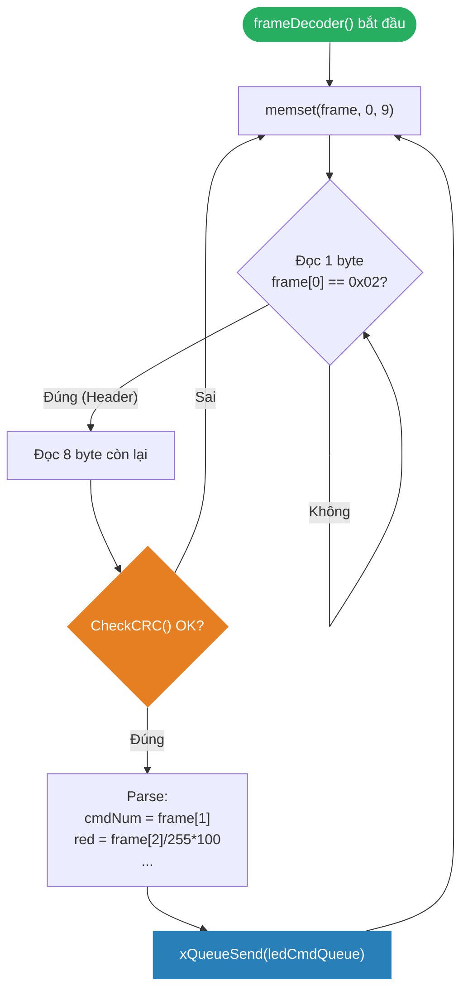

# <span style="color:#f1c40f">Chương 13: Tạo Liên kết Lỏng bằng Queue</span>
# <span style="color:#f1c40f">Creating Loose Coupling with Queues</span>

> [!TIP]
> Dùng **Ctrl+F** và tìm `## 1.`, `## 2.`, `## 3.` để nhảy nhanh đến từng mục.

```
 1. Hiểu Queue như một Interface    — Tại sao Queue là giao diện tự nhiên, tăng tính linh hoạt, dễ test
 2. Xây dựng Command Queue         — Ứng dụng điều khiển RGB LED qua USB
    ├─ 2.1 Thiết kế nội dung Queue  — LedCmd struct, enum, truyền theo giá trị vs tham chiếu
    ├─ 2.2 Kiến trúc hệ thống      — 3 khối bất đồng bộ: USB ISR → Decoder → Executor
    ├─ 2.3 Command Executor Task    — State machine, iPWM interface, blink timeout
    ├─ 2.4 Frame Decoder Task       — Đồng bộ header 0x02, CRC-32, scale byte → float
    └─ 2.5 USB CDC ISR Driver       — xStreamBufferSendFromISR, portYIELD_FROM_ISR
 3. Tái sử dụng Queue cho Mục tiêu Mới — Đa nguồn, đa giao thức, đa phần cứng
 4. Nguyên tắc Thiết kế & Anti-Pattern — 7 nguyên tắc, 5 bẫy cần tránh
 5. Tổng kết & Câu hỏi Ôn tập      — Key Takeaways, 5 câu hỏi
```

---

## <span style="color:#e67e22">1. Hiểu Queue như một Interface — Understanding Queues as Interfaces</span>

### <span style="color:#1abc9c">1.1 Tại sao Queue là Giao diện Tự nhiên Tuyệt vời?</span>

Ở [Chương 12](file:///D:/COURSE/STM32/RTOS/Hands-On-RTOS-Book-Notes/Chapter_12_Well_Abstracted_Architecture.md), chúng ta đã học cách dùng **struct of function pointers** để tạo interface trừu tượng. Chương này mở rộng thêm: **RTOS Queue chính là một interface tự nhiên, sẵn có** giúp tách biệt hoàn toàn 2 phía Sender và Receiver.

> [!NOTE]
> Mặc dù Stream Buffer và Message Buffer cũng áp dụng được nguyên lý tương tự, sách chọn **Queue** làm ví dụ chính vì đây là primitive phổ biến nhất trong FreeRTOS.

#### <span style="color:#3498db">3 Lý do Queue là Interface xuất sắc</span>

##### Lý do 1: Tạo ranh giới trừu tượng cứng (Hard Abstraction Line)
* Queue buộc cả 2 phía Sender và Receiver phải **thống nhất một "hợp đồng dữ liệu" (Data Contract)** — cụ thể là kiểu struct được truyền qua Queue.
* Khác với lời gọi hàm trực tiếp (function call), Queue **ép developer phải suy nghĩ kỹ** về chính xác thông tin nào cần truyền và định dạng ra sao. Điều này thường bị bỏ qua khi code gọi thẳng hàm.

##### Lý do 2: Tăng tính linh hoạt (Flexibility)
* **Tài nguyên chia sẻ tối thiểu**: Sender và Receiver chỉ chia sẻ **Queue API** và **kiểu struct dữ liệu** — không chia sẻ bất kỳ chi tiết implementation nào.
* **Refactor tự do**: Có thể viết lại hoàn toàn nội bộ (implementation) của một phía mà không ảnh hưởng phía kia, miễn là "hợp đồng dữ liệu" qua Queue không đổi.
* **Độc lập giao thức vật lý**: Queue tách rời logic ứng dụng khỏi lớp truyền tải vật lý (UART, SPI, USB, Ethernet, CAN, Bluetooth, IoT...).

```
┌─────────────────────────┐       ┌─────────────────────────┐
│     PHÍA GỬI (Sender)   │       │   PHÍA NHẬN (Receiver)  │
│                          │       │                          │
│  Có thể là:              │       │  Có thể là:              │
│  • USB Decoder           │       │  • LED Controller        │
│  • UART Parser           │  📦   │  • Motor Controller      │
│  • CAN Bus Handler       ├──────►│  • Display Driver        │
│  • Physical Button ISR   │ Queue │  • Data Logger           │
│  • IoT Cloud Client      │       │  • State Machine         │
│  • Unit Test Script      │       │  • Mock/Simulator        │
│                          │       │                          │
│  → Chỉ cần biết struct   │       │  → Chỉ cần biết struct   │
│    và xQueueSend()       │       │    và xQueueReceive()    │
└─────────────────────────┘       └─────────────────────────┘
```

##### Lý do 3: Dễ kiểm thử (Testability)
* Queue là **điểm chèn test tự nhiên (natural injection point)**: Trong unit test, thay vì cần toàn bộ hệ thống phần cứng, chỉ cần tạo Queue giả và đẩy test vector vào.
* **Stub/Simulation**: Nếu Task A gửi lệnh cho Task B qua Queue, ta có thể stub Task B để phản hồi ngay — không cần đợi phần cứng hoặc hệ thống con phức tạp được hoàn thiện.

---

## <span style="color:#e67e22">2. Xây dựng Command Queue — Creating a Command Queue</span>

### <span style="color:#1abc9c">2.1 Thiết kế Nội dung Queue (Deciding on Queue Contents)</span>

#### <span style="color:#3498db">Ứng dụng minh họa: Điều khiển RGB LED qua USB</span>

Hệ thống nhận lệnh từ PC qua USB Virtual COM Port để điều khiển 3 LED (Red, Green, Blue) bằng PWM. Bài toán này minh họa tính loose coupling giữa: Lớp truyền tải (USB) → Lớp giải mã giao thức → Lớp điều khiển phần cứng (PWM).

#### <span style="color:#3498db">Quy tắc Vàng: Tách Payload ra khỏi Wire Protocol</span>

> [!CAUTION]
> **Quy tắc thiết kế quan trọng nhất**: Queue phải chứa **Payload ứng dụng đã được phân tích cú pháp** — **TUYỆT ĐỐI KHÔNG** chứa các byte thuộc giao thức truyền tải (header, footer, delimiter, checksum, CRC).

| Tiêu chí | Domain Queue Message (`LedCmd`) | Wire Transport Frame |
|:---|:---|:---|
| **Nội dung** | Payload thuần túy (`cmdNum`, `red`, `green`, `blue`) | Header `0x02`, raw bytes, CRC-32 |
| **Tính linh hoạt** | Phổ quát — dùng được với USB, UART, SPI, GPIO, Bluetooth... | Cố định — gắn cứng với cấu trúc frame binary cụ thể |
| **Validation** | Đã được đảm bảo bởi Decoder trước khi đẩy vào Queue | CRC-32 phải được kiểm tra TRƯỚC khi enqueue |

Nếu đặt raw frame bytes vào Queue, bạn đã **gắn cứng (hard-bind)** ứng dụng vào một giao thức truyền tải cụ thể → phá vỡ hoàn toàn khả năng tái sử dụng khi đổi interface vật lý.

#### <span style="color:#3498db">Định nghĩa Command Enum và Struct</span>

```c
// Enum xác định loại lệnh — gán số rõ ràng để đồng bộ giữa PC host và MCU
typedef enum
{
    CMD_ALL_OFF       = 0,   // Tắt tất cả LED
    CMD_ALL_ON        = 1,   // Bật tất cả LED 100%
    CMD_SET_INTENSITY = 2,   // Đặt cường độ RGB cụ thể
    CMD_BLINK         = 3    // Nháy LED với cường độ cho trước
} LED_CMD_NUM;

// Struct dữ liệu truyền qua Queue — 13 bytes
typedef struct
{
    uint8_t cmdNum;    // ID lệnh (từ LED_CMD_NUM, giới hạn ≤ 255)
    float   red;       // Duty cycle LED đỏ    (0.0% – 100.0%)
    float   green;     // Duty cycle LED xanh lá (0.0% – 100.0%)
    float   blue;      // Duty cycle LED xanh dương (0.0% – 100.0%)
} LedCmd;
```

> [!NOTE]
> **Tại sao dùng `float` thay vì `uint8_t`?** Giá trị `float` phần trăm (0.0–100.0%) là **đơn vị trừu tượng, hardware-agnostic**. Code cấp cao không cần biết timer MCU có resolution 16-bit hay 32-bit. Trong production, `int32_t` thường được ưu tiên hơn vì serialize đơn giản hơn.

#### <span style="color:#3498db">Truyền theo Giá trị (By Value) vs. Tham chiếu (By Reference)</span>

| Tiêu chí | Truyền theo Giá trị | Truyền theo Tham chiếu (Pointer) |
|:---|:---|:---|
| **Ownership** | Rõ ràng — Queue tạo bản sao đầy đủ. Không cần theo dõi ai sở hữu | Phức tạp — Sender và Receiver phải phối hợp ai giải phóng bộ nhớ |
| **Lifetime** | An toàn — có thể truyền biến stack cục bộ | Nguy hiểm — dữ liệu phải ở heap hoặc static, không được ở stack |
| **Performance** | Tốn chút overhead copy (chấp nhận được với struct ≤ 32 bytes) | Nhanh — chỉ copy 4 byte địa chỉ pointer |
| **Rủi ro** | Không có | **Dangling pointer** nếu biến stack bị giải phóng trước khi Receiver đọc |

> [!WARNING]
> **Bẫy Dangling Stack Pointer**: Nếu truyền **pointer đến biến cục bộ (stack variable)** vào Queue, khi hàm return → biến bị hủy → Receiver đọc pointer trỏ vào vùng nhớ rác → crash hoặc dữ liệu sai âm thầm.

---

### <span style="color:#1abc9c">2.2 Kiến trúc Hệ thống (System Architecture)</span>

Hệ thống gồm **3 khối thực thi bất đồng bộ** giao tiếp qua Stream Buffer và Queue:

```
┌──────────────┐      ┌─────────────────┐      ┌──────────────────┐      ┌──────────────┐
│  USB Hardware │      │  usbd_cdc_if.c  │      │ mainColorSelector│      │ledCmdExecutor│
│  (PC gửi     │ ISR  │  CDC_Receive_FS │ Stream│   frameDecoder   │ Queue│LedCmdExecution│
│   binary     ├─────►│  (Ngắt USB)     ├──────►│   (Task giải mã  ├─────►│  (Task thực  │
│   frame)     │      │                 │Buffer │    giao thức)    │      │  thi lệnh)   │
└──────────────┘      └─────────────────┘      └──────────────────┘      └──────┬───────┘
                                                                                │ iPWM
                                                                                ▼
                                                                    ┌──────────────────┐
                                                                    │pwmImplementation.c│
                                                                    │  (STM32 TIM PWM)  │
                                                                    │  → RGB LED vật lý  │
                                                                    └──────────────────┘
```

> [!IMPORTANT]
> **Ranh giới tách biệt rõ ràng**:
> * **Stream Buffer** (`vcom_rxStream`): Tách ISR USB khỏi Task giải mã — byte stream thô.
> * **Queue** (`ledCmdQueue`): Tách logic giải mã giao thức khỏi logic điều khiển LED — payload đã parse.
> * **iPWM Interface**: Tách logic ứng dụng khỏi phần cứng PWM cụ thể.

---

### <span style="color:#1abc9c">2.3 Command Executor Task — Task Thực thi Lệnh</span>

#### <span style="color:#3498db">Interface iPWM — Trừu tượng hóa PWM</span>

Trước khi xem Executor, cần hiểu interface iPWM mà nó sử dụng:

```c
// iPWM.h — Interface PWM trừu tượng (Chương 12 pattern)
typedef void (*iPwmDutyCycleFunc)(float DutyCycle);

typedef struct
{
    const iPwmDutyCycleFunc SetDutyCycle;  // Đặt duty cycle 0.0–100.0%
} iPWM;
```

> [!NOTE]
> `const` function pointer đảm bảo pointer không thể bị ghi đè lúc runtime → loại bỏ nhu cầu kiểm tra `NULL` phòng thủ mỗi lần gọi. Struct wrapper cho phép thêm hàm mới trong tương lai mà không phá vỡ caller hiện tại.

#### <span style="color:#3498db">Struct Tham số Khởi tạo Task</span>

```c
// Gói tham số truyền vào Task qua pvParameters
typedef struct
{
    QueueHandle_t ledCmdQueue;    // Handle Queue nhận lệnh
    iPWM *        redPWM;         // Interface PWM LED đỏ
    iPWM *        bluePWM;        // Interface PWM LED xanh dương
    iPWM *        greenPWM;       // Interface PWM LED xanh lá
} CmdExecArgs;
```

> [!TIP]
> Truyền Queue handle và interface pointer qua **struct tham số** (thay vì biến global) cho phép tạo nhiều instance Executor Task độc lập — mỗi instance điều khiển bộ LED khác nhau mà không cần biến toàn cục.

#### <span style="color:#3498db">Code Task Executor đầy đủ</span>

```c
// ledCmdExecutor.c

// Hàm helper: đặt duty cycle cho cả 3 LED qua iPWM interface
static void setDutyCycles(const CmdExecArgs* Args,
                          float RedDuty, float GreenDuty, float BlueDuty)
{
    Args->redPWM->SetDutyCycle(RedDuty);
    Args->greenPWM->SetDutyCycle(GreenDuty);
    Args->bluePWM->SetDutyCycle(BlueDuty);
}

// Task chính — chạy vĩnh viễn trong while(1)
void LedCmdExecution(void* Args)
{
    LED_CMD_NUM currCmdNum = CMD_ALL_OFF;    // Trạng thái hiện tại
    bool blinkingLedsOn = false;              // Toggle flag cho chế độ nháy
    LedCmd nextLedCmd;                        // Buffer nhận lệnh từ Queue

    param_assert(Args == NULL);               // Kiểm tra NULL
    CmdExecArgs args = *(CmdExecArgs*)Args;   // Copy tham số vào biến cục bộ

    while (1)
    {
        //──────────────────────────────────────────────────
        // NHÁNH 1: Có lệnh mới trong Queue (block tối đa 250ms)
        //──────────────────────────────────────────────────
        if (xQueueReceive(args.ledCmdQueue, &nextLedCmd, 250) == pdTRUE)
        {
            switch (nextLedCmd.cmdNum)
            {
                case CMD_ALL_OFF:
                    currCmdNum = CMD_ALL_OFF;
                    setDutyCycles(&args, 0, 0, 0);
                    break;

                case CMD_ALL_ON:
                    currCmdNum = CMD_ALL_ON;
                    setDutyCycles(&args, 100, 100, 100);
                    break;

                case CMD_SET_INTENSITY:
                    currCmdNum = CMD_SET_INTENSITY;
                    setDutyCycles(&args, nextLedCmd.red,
                                        nextLedCmd.green,
                                        nextLedCmd.blue);
                    break;

                case CMD_BLINK:
                    currCmdNum = CMD_BLINK;
                    blinkingLedsOn = true;
                    setDutyCycles(&args, nextLedCmd.red,
                                        nextLedCmd.green,
                                        nextLedCmd.blue);
                    break;
            }
        }
        //──────────────────────────────────────────────────
        // NHÁNH 2: Timeout 250ms — không có lệnh mới
        // → Chỉ xử lý nếu đang ở chế độ BLINK (toggle LED)
        //──────────────────────────────────────────────────
        else if (currCmdNum == CMD_BLINK)
        {
            if (blinkingLedsOn)
            {
                blinkingLedsOn = false;
                setDutyCycles(&args, 0, 0, 0);              // Tắt LED
            }
            else
            {
                blinkingLedsOn = true;
                setDutyCycles(&args, nextLedCmd.red,         // Bật LED lại
                                    nextLedCmd.green,
                                    nextLedCmd.blue);
            }
        }
    }
}
```

> [!IMPORTANT]
> **Kỹ thuật Dual-Purpose Timeout**: `xQueueReceive()` với timeout 250ms phục vụ **2 mục đích đồng thời**:
> 1. **Nhận lệnh mới** từ Queue khi có (trả về `pdTRUE`).
> 2. **Tạo nhịp nháy 250ms** cho chế độ BLINK khi không có lệnh mới (trả về timeout → toggle LED).
>
> Đây là pattern cực kỳ tiết kiệm tài nguyên: không cần tạo thêm software timer hay task riêng cho việc nháy.

---

### <span style="color:#1abc9c">2.4 Frame Decoder Task — Task Giải mã Giao thức</span>

#### <span style="color:#3498db">Đặc tả Binary Frame (9 Bytes)</span>

```
  Byte 0      Byte 1      Byte 2      Byte 3      Byte 4     Bytes 5–8
┌──────────┬──────────┬──────────┬──────────┬──────────┬──────────────┐
│ Start    │ cmdNum   │   Red    │  Green   │   Blue   │   CRC-32     │
│  0x02    │ (0–3)    │ (0–255)  │ (0–255)  │ (0–255)  │ (4 bytes LE) │
│ Header   │ Command  │ Duty Raw │ Duty Raw │ Duty Raw │  Checksum    │
└──────────┴──────────┴──────────┴──────────┴──────────┴──────────────┘
```

* **Byte 0 (`0x02`)**: Start Delimiter — dùng để đồng bộ đầu frame trong stream byte liên tục.
* **Byte 1**: Command ID — tương ứng với `LED_CMD_NUM` enum.
* **Bytes 2–4**: Cường độ RGB dạng raw byte (0–255), sẽ được scale thành `float` phần trăm (0.0–100.0%).
* **Bytes 5–8**: CRC-32 Little-Endian — kiểm tra tính toàn vẹn toàn bộ frame.

#### <span style="color:#3498db">Code Frame Decoder đầy đủ</span>

```c
// mainColorSelector.c

// Hàm accessor: trả về con trỏ const đến handle Stream Buffer
// → ngăn caller sửa đổi handle gốc
StreamBufferHandle_t const * GetUsbRxStreamBuff(void)
{
    return &vcom_rxStream;
}

// Task giải mã frame binary từ USB
void frameDecoder(void* NotUsed)
{
    LedCmd incomingCmd;
    #define FRAME_LEN 9
    uint8_t frame[FRAME_LEN];

    while (1)
    {
        // ① Xóa buffer frame
        memset(frame, 0, FRAME_LEN);

        // ② Đồng bộ header: đọc từng byte cho đến khi gặp 0x02
        while (frame[0] != 0x02)
        {
            xStreamBufferReceive(*GetUsbRxStreamBuff(),
                                 frame,           // Ghi vào byte đầu tiên
                                 1,               // Đọc 1 byte
                                 portMAX_DELAY);   // Block vô hạn đến khi có data
        }

        // ③ Đọc 8 byte còn lại của frame
        xStreamBufferReceive(*GetUsbRxStreamBuff(),
                             &frame[1],           // Ghi từ byte thứ 2
                             FRAME_LEN - 1,       // Đọc 8 byte
                             portMAX_DELAY);

        // ④ Kiểm tra CRC-32
        if (CheckCRC(frame, FRAME_LEN))
        {
            // ⑤ Parse raw bytes → domain struct (LedCmd)
            incomingCmd.cmdNum = frame[1];
            incomingCmd.red    = frame[2] / 255.0 * 100;   // Scale 0–255 → 0.0–100.0%
            incomingCmd.green  = frame[3] / 255.0 * 100;
            incomingCmd.blue   = frame[4] / 255.0 * 100;

            // ⑥ Đẩy lệnh đã parse vào Queue (chờ tối đa 100 ticks nếu Queue đầy)
            xQueueSend(ledCmdQueue, &incomingCmd, 100);
        }
        // Nếu CRC sai → bỏ qua frame, quay lại đồng bộ header
    }
}
```



> [!NOTE]
> **Chiến lược đồng bộ header**: Đọc từng byte một cho đến khi gặp `0x02`. Phương pháp này đơn giản nhưng hiệu quả — tự động bỏ qua các byte rác do mất đồng bộ trước đó. Sau khi gặp header hợp lệ, đọc block 8 byte còn lại cùng lúc.

---

### <span style="color:#1abc9c">2.5 USB CDC ISR Driver — Tầng Ngắt USB</span>

```c
// usbd_cdc_if.c — Callback ISR khi USB nhận được dữ liệu từ PC

static int8_t CDC_Receive_FS(uint8_t* Buf, uint32_t *Len)
{
    portBASE_TYPE xHigherPriorityTaskWoken = pdFALSE;

    // ① Đặt lại buffer nhận cho USB middleware
    USBD_CDC_SetRxBuffer(&hUsbDeviceFS, &Buf[0]);

    // ② Đẩy raw bytes từ USB vào Stream Buffer (gọi từ ISR)
    xStreamBufferSendFromISR(*GetUsbRxStreamBuff(),
                              Buf,
                              *Len,
                              &xHigherPriorityTaskWoken);

    // ③ Chuẩn bị nhận gói USB tiếp theo
    USBD_CDC_ReceivePacket(&hUsbDeviceFS);

    // ④ Context switch nếu Task ưu tiên cao hơn được đánh thức
    portYIELD_FROM_ISR(xHigherPriorityTaskWoken);

    return (USBD_OK);
}
```

> [!NOTE]
> **Tại sao dùng Stream Buffer thay vì Queue ở tầng ISR?** Stream Buffer cho phép copy nhanh **khối byte liên tục, kích thước thay đổi** từ buffer phần cứng USB vào bộ nhớ RTOS. Queue yêu cầu kích thước phần tử cố định, không phù hợp cho byte stream tốc độ cao.

---

## <span style="color:#e67e22">3. Tái sử dụng Queue cho Mục tiêu Mới — Reusing Queue Definitions</span>

### <span style="color:#1abc9c">3.1 Sức mạnh của Loose Coupling: Đa nguồn, Đa giao thức</span>

Nhờ Queue chứa `LedCmd` (payload thuần túy, không gắn giao thức), **`LedCmdExecution` Task không cần thay đổi bất kỳ dòng code nào** khi thay đổi nguồn lệnh:

```
                         ┌──────────────────────────┐
  USB Binary Decoder ───►│                          │
  ASCII UART Parser  ───►│    ledCmdQueue (Queue)    │───► LedCmdExecution
  Physical Buttons   ───►│        (LedCmd)           │      (Không đổi!)
  CAN Bus Handler    ───►│                          │
  IoT Cloud Client   ───►│                          │
  Rotary Encoder ADC ───►└──────────────────────────┘
```

#### <span style="color:#3498db">Ví dụ: Đổi từ Binary Frame sang ASCII Text</span>

Thay vì frame binary 9 byte, hệ thống có thể nhận lệnh dạng ASCII qua UART:
```
BLINK, 20, 30, 100\n
```

Chỉ cần viết 1 **ASCII Parser Task** mới:
```c
void asciiDecoder(void* NotUsed)
{
    char line[64];
    LedCmd cmd;

    while (1)
    {
        // Đọc 1 dòng từ UART Stream Buffer
        readLine(uartRxStream, line, sizeof(line));

        // Parse ASCII → LedCmd struct
        if (parseAsciiCommand(line, &cmd) == SUCCESS)
        {
            xQueueSend(ledCmdQueue, &cmd, 100);  // Cùng Queue, cùng struct
        }
    }
}
```

`LedCmdExecution` Task nhận được cùng `LedCmd` struct → **Không cần sửa gì!**

### <span style="color:#1abc9c">3.2 Hai Tầng Interface Decoupled</span>

Hệ thống có **2 ranh giới tách biệt** rõ ràng:

| Ranh giới | Tách biệt gì? | Thay đổi bên này... | ...ảnh hưởng bên kia? |
|:---|:---|:---|:---|
| **Queue Interface** (`LedCmd`) | Producer ↔ Consumer | Viết lại Decoder hoặc đổi giao thức | ❌ Executor không đổi |
| **iPWM Interface** | Task logic ↔ Phần cứng PWM | Đổi TIM PWM sang WS2812B NeoPixel hay smart light qua mạng | ❌ Executor không đổi |

> [!TIP]
> **Tổng kết**: `LedCmdExecution` Task hoàn toàn không biết lệnh đến từ đâu (USB? UART? nút bấm? cloud?) và cũng không biết LED vật lý hoạt động ra sao (GPIO PWM? NeoPixel? network light?). Đây chính là **Loose Coupling** (Liên kết Lỏng) hoàn hảo.

---

## <span style="color:#e67e22">4. Nguyên tắc Thiết kế & Anti-Pattern</span>

### <span style="color:#1abc9c">4.1 Bảng 7 Nguyên tắc Thiết kế Cốt lõi</span>

| # | Nguyên tắc | Giải thích |
|:---|:---|:---|
| 1 | **Tách Payload khỏi Transport** | Queue chỉ chứa domain data đã parse — không chứa header, CRC, delimiter |
| 2 | **Immutable Function Pointers** | Dùng `const` cho function pointer trong interface struct → bảo vệ runtime |
| 3 | **Struct-Wrapped Interface** | Function pointer bọc trong struct → thêm hàm mới không phá vỡ caller |
| 4 | **Normalized Unit Model** | Dùng đơn vị trừu tượng (% float) thay vì giá trị HW cụ thể (timer count) |
| 5 | **Pass-by-Value cho Struct nhỏ** | Struct ≤ 32 bytes truyền theo giá trị qua Queue → loại bỏ ownership bug |
| 6 | **Task Instantiation via Param Struct** | Truyền config qua `void* Args` → nhiều instance cùng code, không cần global |
| 7 | **Read-Only Handle Expose** | Trả `Type const *` khi expose handle → ngăn caller sửa đổi handle gốc |

---

### <span style="color:#1abc9c">4.2 Bảng 5 Anti-Pattern (Bẫy cần tránh)</span>

#### <span style="color:#3498db">Anti-Pattern 1: Wire-Protocol Queue Coupling</span>
* **Lỗi**: Đặt raw frame bytes (header, CRC) trực tiếp vào Queue struct.
* **Hậu quả**: Gắn cứng ứng dụng vào 1 giao thức truyền tải → mất khả năng tái dùng khi đổi interface vật lý.

#### <span style="color:#3498db">Anti-Pattern 2: Queue quá sâu (Excessive Queue Depth)</span>
* **Lỗi**: Cấp phát Queue với nhiều slot (ví dụ: depth = 100) cho command queue.
* **Hậu quả**:
  * Tăng **latency** (trễ thực thi lệnh — lệnh cũ chất đống trong queue).
  * Hành vi **phi xác định** (non-deterministic) — lệnh stale nằm chờ thay vì bị reject.
  * **Lãng phí RAM** quý giá trên MCU.

> [!WARNING]
> **Command Queue nên có depth nhỏ** (1–5 slot). Nếu Queue đầy, producer nên nhận biết được (return timeout) thay vì âm thầm xếp hàng thêm.

#### <span style="color:#3498db">Anti-Pattern 3: Multi-Task truy cập Stream Buffer không bảo vệ</span>
* **Lỗi**: Cho nhiều Task đọc hoặc ghi cùng 1 Stream Buffer mà không có Mutex.
* **Hậu quả**: Stream Buffer là **single-reader/single-writer** primitive. Truy cập multi-task gây data corruption.

#### <span style="color:#3498db">Anti-Pattern 4: Dangling Stack Pointer trong Queue</span>
* **Lỗi**: Truyền **pointer đến biến cục bộ trên stack** vào Queue bằng cách truyền by reference.
* **Hậu quả**: Biến cục bộ bị hủy khi hàm return → Receiver đọc pointer trỏ vào rác → crash hoặc lỗi dữ liệu âm thầm.

#### <span style="color:#3498db">Anti-Pattern 5: Over-Engineering vượt giới hạn MCU</span>
* **Lỗi**: Thiết kế kiến trúc quá nhiều tầng abstraction lồng nhau.
* **Hậu quả**: Tăng Flash (ROM) footprint, RAM usage, và call stack overhead → vượt giới hạn phần cứng MCU.

> [!TIP]
> **Cân bằng**: Abstraction tốt ≠ abstraction nhiều. Trên MCU nhỏ (STM32F0, 16KB RAM), 2–3 tầng là đủ. Trên MCU lớn (STM32F7, 512KB RAM), có thể thêm tầng.

---

## <span style="color:#e67e22">5. Tổng kết & Câu hỏi Ôn tập</span>

### <span style="color:#1abc9c">5.1 Key Takeaways</span>

* **Queue = Interface tự nhiên**: Ép 2 phía thống nhất data contract, tách biệt implementation.
* **Tách Payload khỏi Transport**: Queue struct chỉ chứa domain data, không chứa wire protocol bytes.
* **Dual-Purpose Timeout**: `xQueueReceive()` timeout vừa nhận lệnh, vừa tạo nhịp cho state machine (blink).
* **iPWM + Queue = Double Decoupling**: Executor không biết lệnh từ đâu, cũng không biết LED hoạt động ra sao.
* **Pass-by-Value an toàn**: Với struct nhỏ (≤ 32 bytes), truyền by value qua Queue đơn giản và an toàn hơn by reference.

---

### <span style="color:#1abc9c">5.2 Câu hỏi Ôn tập Cuối Chương</span>

> [!NOTE]
> **5 câu hỏi đánh giá từ sách**:

#### **Câu 1**: "Queue giảm tính linh hoạt thiết kế vì tạo ra định nghĩa cứng nhắc về dữ liệu truyền"
* **Đáp án: FALSE ❌**
* Queue tạo ra interface rõ ràng, **tách biệt (decouple)** các thành phần khỏi nhau — đây là tăng linh hoạt, không phải giảm.

#### **Câu 2**: "Queue không hoạt động tốt với các kỹ thuật abstraction khác; chúng chỉ chứa được kiểu dữ liệu đơn giản"
* **Đáp án: FALSE ❌**
* **Bất kỳ kiểu dữ liệu nào** đều có thể đặt vào Queue — struct, enum, array, thậm chí struct chứa function pointer.

#### **Câu 3**: "Khi dùng Queue cho lệnh nhận từ cổng serial, Queue có nên chứa đúng format và thông tin giống hệt luồng dữ liệu serial không? Tại sao?"
* **Đáp án: KHÔNG**
* Bỏ qua formatting giao thức (header, CRC, delimiter) giúp **tăng tính linh hoạt cho phía Producer**. Nếu dữ liệu không gắn với format cụ thể, có thể đổi format mà không ảnh hưởng Queue hoặc Consumer.

#### **Câu 4**: "Nêu 1 lý do tại sao truyền dữ liệu by value vào Queue dễ hơn by reference"
* **Đáp án** (một trong các đáp án):
  * **Lifetime**: Không cần lo biến bị hủy — Queue tạo bản sao đầy đủ.
  * **Scope**: Có thể truyền biến stack cục bộ mà không sợ dangling pointer.
  * **Ownership**: Không cần quy ước ai sở hữu, ai giải phóng bộ nhớ.

#### **Câu 5**: "Nêu 1 lý do tại sao cần cân nhắc kỹ độ sâu (depth) của Queue trong hệ thống nhúng thời gian thực"
* **Đáp án** (một trong các đáp án):
  * **Latency**: Queue sâu gây trễ thực thi lệnh.
  * **Non-deterministic**: Lệnh stale nằm chờ thay vì được xử lý hoặc reject ngay.
  * **RAM**: Mỗi slot Queue chiếm bộ nhớ quý giá trên MCU.

---

## <span style="color:#e67e22">6. Bảng Tổng hợp API</span>

| API | Nguồn | Mục đích | Tham số chính |
|:---|:---|:---|:---|
| `xQueueSend()` | FreeRTOS | Gửi item vào Queue | `queue`, `&item`, `timeout` |
| `xQueueReceive()` | FreeRTOS | Nhận item từ Queue (block) | `queue`, `&buffer`, `timeout` |
| `xStreamBufferReceive()` | FreeRTOS | Đọc byte stream từ Stream Buffer | `handle`, `*dest`, `len`, `timeout` |
| `xStreamBufferSendFromISR()` | FreeRTOS | Ghi byte stream vào Stream Buffer (từ ISR) | `handle`, `*src`, `len`, `&woken` |
| `portYIELD_FROM_ISR()` | FreeRTOS | Context switch từ ISR nếu Task cao hơn thức | `xHigherPriorityTaskWoken` |
| `USBD_CDC_SetRxBuffer()` | STM32 USB | Đặt lại buffer nhận USB | `&hUsbDeviceFS`, `buffer` |
| `USBD_CDC_ReceivePacket()` | STM32 USB | Chuẩn bị nhận gói USB tiếp | `&hUsbDeviceFS` |

---

## <span style="color:#e67e22">7. Tài liệu Tham khảo</span>

* **Source Code Repository** (Chương 13):
  `https://github.com/PacktPublishing/Hands-On-RTOS-with-Microcontrollers/tree/master/Chapter_13`
