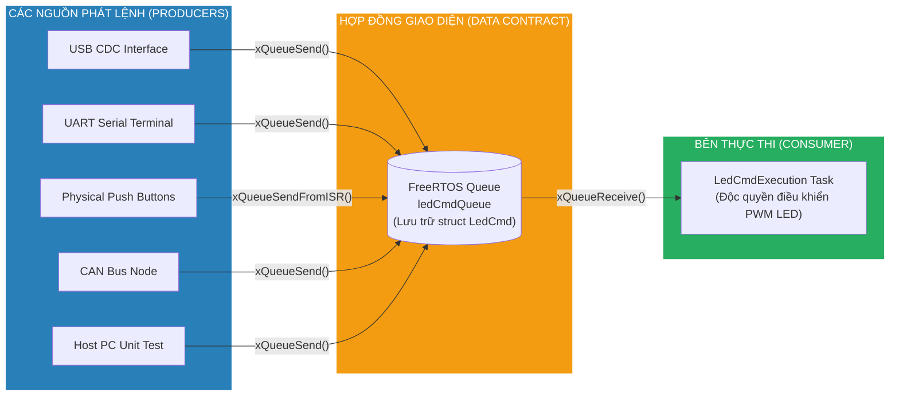
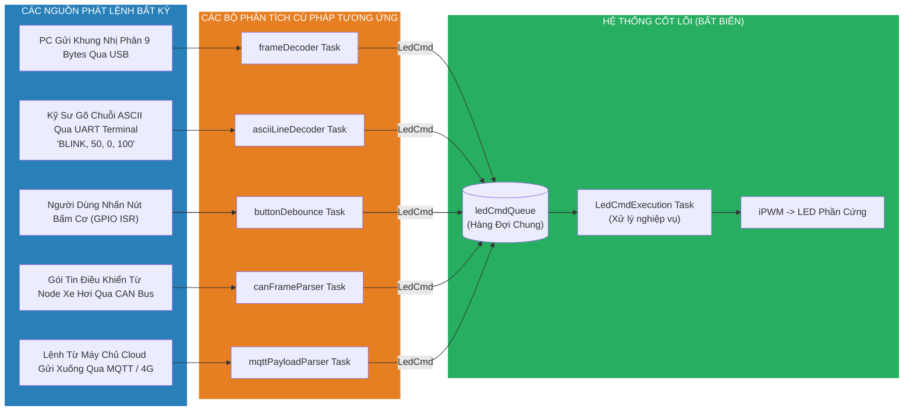
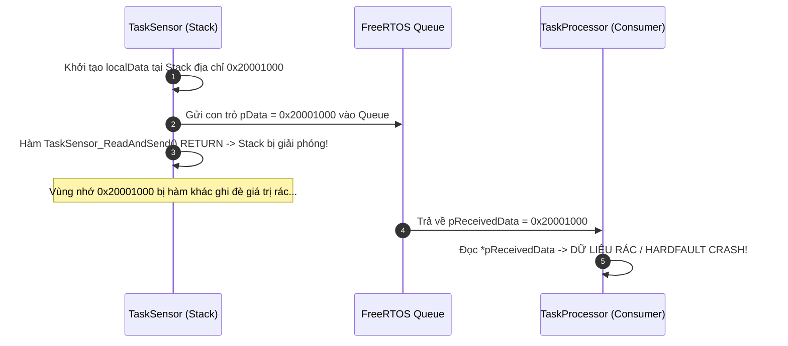
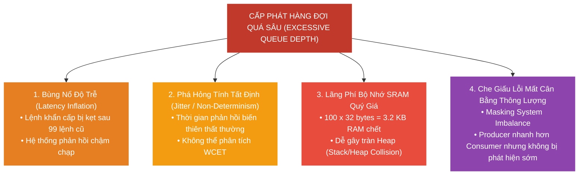

# <span style="color:#f1c40f">Chương 12: Kiến Trúc Liên Kết Lỏng Với Hàng Đợi (Creating a Loosely Coupled Architecture with Queues)</span>

> **Tài liệu tham khảo chuyên sâu kết hợp:**
> - 📘 *Hands-On RTOS with Microcontrollers* – Brian Amos (Chapter 13: *Creating a Loosely Coupled Architecture with Queues*, tr. 334–353).
> - 📗 *Mastering the FreeRTOS Real Time Kernel* – Richard Barry (Chapter 4: *Queue Management* – Queue Internals, Copy-by-Value Semantics, Mailbox Pattern & Queue Sets).
> - 📙 *STMicroelectronics Architecture Manuals* (STM32 USB CDC, Timers PWM Generation & DMA Integration).

---

```text
MỤC LỤC CHUYÊN SÂU (TABLE OF CONTENTS)
├── 1. Bản Chất Của Queue Dưới Góc Nhìn Kiến Trúc Giao Diện (Queues as Interfaces)
│   ├── 1.1 Khái Niệm: Tại Sao Queue Là Một Interface Tự Nhiên Xuất Sắc?
│   ├── 1.2 So Sánh Đối Đầu: Lời Gọi Hàm Trực Tiếp (Tight Coupling) vs Giao Tiếp Qua Queue (Loose Coupling)
│   ├── 1.3 Ranh Giới Trừu Tượng Cứng (Hard Abstraction Line) & Tính Linh Hoạt
│   └── 1.4 Lợi Ích Kiểm Thử Đơn Vị (Testability & Natural Injection Points)
├── 2. Thiết Kế Nội Dung Queue & Nguyên Tắc Tách Rời Payload (Deciding Queue Contents)
│   ├── 2.1 Quy Tắc Vàng: Tách Biệt Payload Ứng Dụng Khỏi Wire Transport Protocol
│   ├── 2.2 Đóng Gói Thông Điệp: Mô Hình Tagged Union / Discriminated Union (LedCmd)
│   ├── 2.3 Chuẩn Hóa Dữ Liệu (Normalized Unit Model): Giá Trị Tương Đối (%) vs Giá Trị Phần Cứng
│   └── 2.4 Truyền Theo Giá Trị (Copy-by-Value) vs Truyền Theo Tham Chiếu (Pass-by-Reference)
├── 3. Case Study Thực Chiến: Hệ Thống Điều Khiển RGB LED Bất Đồng Bộ 3 Tầng
│   ├── 3.1 Sơ Đồ Kiến Trúc Hệ Thống 3 Tầng Bất Đồng Bộ (USB ISR -> Decoder -> Executor)
│   ├── 3.2 Tầng 1: Trình Điều Khiển Ngắt USB CDC (usbd_cdc_if.c) & Stream Buffer
│   ├── 3.3 Tầng 2: Tác Vụ Giải Mã Khung Truyền Nhị Phân (frameDecoder & Đồng Bộ Header 0x02)
│   ├── 3.4 Tầng 3: Tác Vụ Thực Thi Lệnh (LedCmdExecution & iPWM Interface)
│   └── 3.5 Kỹ Thuật Điều Phối Kép: Dual-Purpose Timeout (Nhận Lệnh & Nhịp Nháy BLINK)
├── 4. Sức Mạnh Của Loose Coupling: Kiến Trúc Đa Nguồn & Đa Giao Thức (Reusing Queue Definitions)
│   ├── 4.1 Khả Năng Thu Nạp Đa Nguồn (Multi-Source Command Ingestion)
│   ├── 4.2 Thêm Nguồn Lệnh Mới Không Cần Sửa Executor: Bộ Giải Mã Ký Tự ASCII (UART)
│   └── 4.3 Kiến Trúc Hai Tầng Độc Lập Hoàn Hảo (Double Decoupling Architecture)
├── 5. Quản Lý Vòng Đời Dữ Liệu & Bộ Nhớ Trong Queue (Lifetime, Scope & Ownership)
│   ├── 5.1 Bẫy Con Trỏ Treo (Dangling Stack Pointer Trap) Khi Truyền Tham Chiếu
│   ├── 5.2 Mô Hình Chuyển Giao Quyền Sở Hữu (Ownership Handover Pattern)
│   └── 5.3 Mẫu Bộ Đệm Không Sao Chép (Zero-Copy Buffer Pool Pattern) Cho Dữ Liệu Lớn
├── 6. Cơ Chế Nội Tại Của FreeRTOS Queue (Kernel Internals & Richard Barry Integration)
│   ├── 6.1 Cấu Trúc Dữ Liệu QueueDefinition (Queue_t) & Quản Lý Con Trỏ Vòng
│   ├── 6.2 Cơ Chế Chặn (Blocking) & Danh Sách Chờ (Event Lists)
│   ├── 6.3 Chế Độ Ghi Đè (Queue Overwrite / Mailbox Pattern)
│   └── 6.4 Tập Hợp Hàng Đợi (Queue Sets): Chờ Dữ Liệu Từ Nhiều Queue Đồng Thời
├── 7. Hiểm Họa Hàng Đợi Quá Sâu & Tính Toán Kích Thước Queue Chuẩn Thời Gian Thực
│   ├── 7.1 4 Hiểm Họa Khi Cấp Phát Queue Quá Sâu (Excessive Queue Depth)
│   └── 7.2 Công Thức Toán Học Xác Định Độ Sâu Queue Tối Ưu Cho Hệ Thống Real-Time
├── 8. 7 Nguyên Tắc Thiết Kế Cốt Lõi & 5 Anti-Patterns Cần Tránh
│   ├── 8.1 7 Nguyên Tắc Vàng Khi Thiết Kế Hệ Thống Với Queue
│   └── 8.2 5 Anti-Patterns Phổ Biến & Biện Pháp Khắc Phục
├── 9. Câu Hỏi Ôn Tập Chuyên Sâu & Lời Giải Chi Tiết (Brian Amos Chapter 13 Assessments)
│   ├── Câu 1: Queue làm giảm tính linh hoạt thiết kế? (False)
│   ├── Câu 2: Queue chỉ chứa được kiểu dữ liệu đơn giản? (False)
│   ├── Câu 3: Queue có nên chứa thông tin format giống hệt luồng dữ liệu nối tiếp?
│   ├── Câu 4: Tại sao truyền dữ liệu by value vào queue dễ hơn by reference?
│   └── Câu 5: Tại sao cần cân nhắc kỹ độ sâu (depth) của queue trong hệ thống thời gian thực?
└── 10. Bảng Tổng Hợp Kiến Thức Cốt Lõi (Key Takeaways Summary Matrix)
```

---

## <span style="color:#e67e22">1. Bản Chất Của Queue Dưới Góc Nhìn Kiến Trúc Giao Diện (Queues as Interfaces)</span>

Ở [Chương 11](file:///D:/COURSE/STM32/RTOS/Hands-On-RTOS-Book-Notes/11_Well_Abstracted_Architecture.md), chúng ta đã làm chủ kỹ thuật trừu tượng hóa bằng **Struct of Function Pointers** để mô phỏng tính đa hình (Polymorphism) và tách rời logic nghiệp vụ khỏi phần cứng vi điều khiển. 

Tuy nhiên, trong một hệ thống RTOS đa tác vụ phức tạp, việc chỉ sử dụng lời gọi hàm gián tiếp vẫn tồn tại một sự ràng buộc ngầm: **Sự ràng buộc về mặt Thời Gian (Temporal Coupling) và Ngữ Cảnh Luồng (Context Coupling)**. Khi Task A gọi hàm của Task B, Task A phải đợi hàm đó thực thi xong và cả hai phải đồng bộ về thời điểm gọi.

Để giải phóng hoàn toàn các thành phần phần mềm khỏi sự phụ thuộc lẫn nhau, Brian Amos đưa ra một tư duy kiến trúc đột phá: **FreeRTOS Queue không chỉ là một cấu trúc dữ liệu IPC thông thường, mà bản thân nó chính là một HỢP ĐỒNG GIAO DIỆN (Interface Contract) tự nhiên và xuất sắc nhất!**

---

### <span style="color:#1abc9c">1.1 Khái Niệm: Tại Sao Queue Là Một Interface Tự Nhiên Xuất Sắc?</span>

Một giao diện phần mềm (Interface) được định nghĩa là một ranh giới trung gian nơi hai thành phần độc lập trao đổi thông tin với nhau mà không cần biết cấu trúc nội bộ của nhau.

Khi ta đặt một **FreeRTOS Queue** nằm giữa hai tác vụ:
1. **Phía Gửi (Producer / Sender)**: Chỉ cần biết địa chỉ Handle của Queue (`QueueHandle_t`) và kiểu dữ liệu của phần tử cần gửi (`xQueueSend`). Nó hoàn toàn không quan tâm ai sẽ đọc dữ liệu, khi nào đọc, hay đọc để làm gì.
2. **Phía Nhận (Consumer / Receiver)**: Chỉ cần biết địa chỉ Handle của Queue và lấy dữ liệu ra xử lý (`xQueueReceive`). Nó hoàn toàn không quan tâm dữ liệu này do ai gửi tới: do một ngắt ISR của cổng USB, một tác vụ phân tích gói tin mạng Ethernet, hay một kịch bản Unit Test tự động trên máy tính.


```mermaid
graph LR
    subgraph PRODUCERS ["CÁC NGUỒN PHÁT LỆNH (PRODUCERS)"]
        P1["USB CDC Interface"]
        P2["UART Serial Terminal"]
        P3["Physical Push Buttons"]
        P4["CAN Bus Node"]
        P5["Host PC Unit Test"]
    end

    subgraph INTERFACE ["HỢP ĐỒNG GIAO DIỆN (DATA CONTRACT)"]
        Q[("FreeRTOS Queue<br/>ledCmdQueue<br/>(Lưu trữ struct LedCmd)")]
    end

    subgraph CONSUMER ["BÊN THỰC THI (CONSUMER)"]
        C["LedCmdExecution Task<br/>(Độc quyền điều khiển PWM LED)"]
    end

    P1 -- "xQueueSend()" --> Q
    P2 -- "xQueueSend()" --> Q
    P3 -- "xQueueSendFromISR()" --> Q
    P4 -- "xQueueSend()" --> Q
    P5 -- "xQueueSend()" --> Q
    Q -- "xQueueReceive()" --> C

    style PRODUCERS fill:#2980b9,color:#fff,stroke:none
    style INTERFACE fill:#f39c12,color:#fff,stroke:none
    style CONSUMER fill:#27ae60,color:#fff,stroke:none
```

---

### <span style="color:#1abc9c">1.2 So Sánh Đối Đầu: Lời Gọi Hàm Trực Tiếp (Tight Coupling) vs Giao Tiếp Qua Queue (Loose Coupling)</span>

| Đặc Tính Thiết Kế | Khớp Nối Chặt Bằng Lời Gọi Hàm (Function Calls) | Khớp Nối Lỏng Bằng Hàng Đợi (RTOS Queues) |
|---|---|---|
| **Sự Phụ Thuộc Mã Nguồn (Code Dependency)** | Phía gọi bắt buộc phải `#include` tệp header của phía nhận. | Cả hai phía chỉ cùng `#include` một file định nghĩa dữ liệu chung (`LedCmd.h`). |
| **Đồng Bộ Thời Gian (Temporal Coupling)** | **Bị ràng buộc cứng**: Hàm được thực thi ngay trong ngữ cảnh (Context) và độ ưu tiên của Task gọi. | **Hoàn toàn bất đồng bộ**: Producer nạp lệnh vào Queue rồi tiếp tục làm việc khác; Consumer xử lý theo nhịp độ riêng. |
| **Bảo Vệ Đa Luồng (Thread Safety)** | Phải tự quản lý Mutex hoặc Critical Section để tránh xung đột tài nguyên. | **Tích hợp sẵn an toàn đa luồng**: FreeRTOS Queue tự động xử lý khóa và quản lý danh sách chờ an toàn tuyệt đối. |
| **Khả Năng Hỗ Trợ Hàm Ngắt (ISR Support)** | Khó gọi hàm phức tạp từ ISR (nguy cơ vi phạm thời gian thực hoặc Deadlock). | **Hoàn hảo**: ISR có thể đẩy dữ liệu vào Queue một cách nhẹ nhàng qua biến thể `xQueueSendFromISR()`. |
| **Khả Năng Kiểm Thử (Testability)** | Khó tạo Mock nếu các hàm gọi lồng nhau phức tạp. | **Cực kỳ dễ dàng**: Queue tạo ra điểm chèn kiểm thử tự nhiên (Natural Injection Point). |

---

### <span style="color:#1abc9c">1.3 Ranh Giới Trừu Tượng Cứng (Hard Abstraction Line) & Tính Linh Hoạt</span>

Brian Amos nhấn mạnh 2 đặc tính kiến trúc vượt trội mà Queue mang lại:

1. **Thiết Lập Ranh Giới Trừu Tượng Cứng (Hard Abstraction Line)**:
   - Khi giao tiếp qua lời gọi hàm, lập trình viên thường có xu hướng "tiện tay" truyền thêm các tham số phần cứng phụ thuộc (như địa chỉ thanh ghi, handle ngoại vi).
   - Với Queue, bạn bị ép buộc phải định nghĩa một **cấu trúc dữ liệu tự chứa (Self-Contained Struct)**. Ranh giới này ngăn chặn triệt để sự rò rỉ chi tiết tầng thấp (Leaky Abstraction) lên tầng ứng dụng.
2. **Tăng Tính Linh Hoạt Cho Việc Refactor**:
   - Bạn có thể đập đi viết lại toàn bộ thuật toán bên trong Task nhận (ví dụ: đổi từ điều khiển LED PWM thông thường sang điều khiển dải đèn thông minh WS2812B NeoPixel hoặc gửi gói tin qua mạng Zigbee). 
   - Miễn là định nghĩa struct trong Queue không đổi, **toàn bộ các Task gửi lệnh không cần sửa đổi hay biên dịch lại dù chỉ một dòng code!**

---

### <span style="color:#1abc9c">1.4 Lợi Ích Kiểm Thử Đơn Vị (Testability & Natural Injection Points)</span>

Trong quy trình phát triển phần mềm chuẩn mực (TDD / CI/CD):
- Để kiểm thử tác vụ điều khiển động cơ hoặc điều khiển LED (`LedCmdExecution`), bạn **không cần phải có cổng USB vật lý, không cần máy tính gửi lệnh thật qua cổng nối tiếp**.
- Kịch bản Unit Test trên máy tính chỉ cần tạo một `ledCmdQueue`, sau đó đẩy các gói tin giả lập vào:
  ```c
  // Chèn test vector kiểm tra hành vi khẩn cấp:
  LedCmd emergencyCmd = { .cmdNum = CMD_ALL_OFF, .red = 0, .green = 0, .blue = 0 };
  xQueueSend(testLedQueue, &emergencyCmd, 0);
  ```
- Task nhận sẽ thức dậy và xử lý chính xác như khi nhận dữ liệu từ phần cứng thật. Queue chính là một **điểm chèn kiểm thử tự nhiên (Natural Test Seam)**.

---

## <span style="color:#e67e22">2. Thiết Kế Nội Dung Queue & Nguyên Tắc Tách Rời Payload (Deciding Queue Contents)</span>

Nội dung được đặt vào bên trong Queue sẽ quyết định tính linh hoạt và tuổi thọ kiến trúc của toàn bộ dự án. Rất nhiều kỹ sư mắc phải sai lầm nghiêm trọng ở khâu này khiến hệ thống mất đi tính tái sử dụng.

---

### <span style="color:#1abc9c">2.1 Quy Tắc Vàng: Tách Biệt Payload Ứng Dụng Khỏi Wire Transport Protocol</span>

Hãy tưởng tượng một hệ thống nhận lệnh từ máy tính qua cổng USB nối tiếp. Gói tin truyền trên dây cáp (Wire Protocol Frame) có định dạng:
`[Byte 0: Header 0x02] [Byte 1: Command] [Byte 2-4: RGB] [Byte 5-8: CRC32]`

> [!CAUTION]
> **Sai Lầm Kiến Trúc Nghiêm Trọng Nhất (Anti-Pattern: Wire Protocol Coupling):**
> Nhét nguyên mảng byte thô của khung truyền (`uint8_t rawFrame[9]`) vào bên trong Queue và bắt Task nhận phải tự kiểm tra header `0x02` và tính toán CRC-32!
> 
> **Hậu quả**: Bạn đã vô tình **trói chặt Task nhận vào một giao thức truyền thông vật lý cụ thể**! Nếu ngày mai sản phẩm có thêm phiên bản nhận lệnh qua bàn phím cơ (không có CRC, không có header 0x02), Task nhận sẽ hoàn toàn bất lực và không thể tái sử dụng được!

```
┌────────────────────────────────────────────────────────────────────────────────────────┐
│ ❌ SAI LẦM: Nhét cả Wire Protocol vào Queue                                           │
│ [USB Frame: 0x02 | Cmd | Data | CRC32] ──► [ Queue ] ──► [ Consumer phải kiểm tra CRC ]│
└────────────────────────────────────────────────────────────────────────────────────────┘

┌────────────────────────────────────────────────────────────────────────────────────────┐
│ ✅ CHUẨN MỰC: Tách biệt Payload ứng dụng (Domain Model)                                 │
│ [USB Frame] ──► [ Decoder kiểm tra CRC ] ──► [ Queue: LedCmd ] ──► [ Consumer thực thi]│
└────────────────────────────────────────────────────────────────────────────────────────┘
```

> [!IMPORTANT]
> **Quy Tắc Vàng Của Brian Amos:**
> Hàng đợi Queue **CHỈ ĐƯỢC PHÉP CHỨA PAYLOAD ỨNG DỤNG ĐÃ ĐƯỢC GIẢI MÃ VÀ KIỂM TRA TÍNH TOÀN VẸN (Validated Domain Payload)**. Mọi chi tiết về giao thức truyền tải (Header, Delimiter, Footer, Checksum, CRC) phải được xử lý và loại bỏ hoàn toàn ở tầng Decoder trước khi đẩy dữ liệu vào Queue!

---

### <span style="color:#1abc9c">2.2 Đóng Gói Thông Điệp: Mô Hình Tagged Union / Discriminated Union (LedCmd)</span>

Để truyền tải các lệnh điều khiển khác nhau qua cùng một hàng đợi duy nhất, kỹ sư sử dụng mẫu thiết kế **Tagged Union** (hay còn gọi là Discriminated Union):

```c
/* =========================================================================
 * LedCmd.h - HỢP ĐỒNG DỮ LIỆU ĐỘC LẬP PHẦN CỨNG (Brian Amos - Page 338)
 * ========================================================================= */
#ifndef LED_CMD_H
#define LED_CMD_H

#include <stdint.h>

// 1. Mã định danh loại lệnh (Command Tag / Discriminator)
typedef enum {
    CMD_ALL_OFF       = 0, // Lệnh tắt toàn bộ LED
    CMD_ALL_ON        = 1, // Lệnh bật sáng toàn bộ LED 100%
    CMD_SET_INTENSITY = 2, // Lệnh đặt cường độ màu RGB cụ thể
    CMD_BLINK         = 3  // Lệnh nháy LED với cường độ cho trước
} LED_CMD_NUM;

// 2. Cấu trúc thông điệp truyền qua Queue (Payload thuần túy)
typedef struct {
    uint8_t cmdNum;  // Trường Tag xác định hành vi (từ enum LED_CMD_NUM)
    float   red;     // Cường độ kênh Đỏ    (Giá trị chuẩn hóa: 0.0% đến 100.0%)
    float   green;   // Cường độ kênh Xanh  (Giá trị chuẩn hóa: 0.0% đến 100.0%)
    float   blue;    // Cường độ kênh Lam   (Giá trị chuẩn hóa: 0.0% đến 100.0%)
} LedCmd;

#endif // LED_CMD_H
```

- Kích thước của struct `LedCmd`:
  - `cmdNum`: 1 byte (+ 3 bytes padding căn chỉnh 32-bit).
  - 3 biến `float`: $3 \times 4\text{ bytes} = 12\text{ bytes}$.
  - Tổng kích thước: **$16\text{ bytes}$** (Cực kỳ nhỏ gọn, hoàn hảo cho FreeRTOS Queue).

---

### <span style="color:#1abc9c">2.3 Chuẩn Hóa Dữ Liệu (Normalized Unit Model): Giá Trị Tương Đối (%) vs Giá Trị Phần Cứng</span>

Tại sao Brian Amos lại sử dụng kiểu `float` đại diện cho phần trăm ($0.0\% - 100.0\%$) thay vì sử dụng trực tiếp giá trị thanh ghi đếm xung (`CCR` của Timer PWM)?

- Nếu sử dụng giá trị đếm thanh ghi (ví dụ giá trị từ $0$ đến $1000$ của Timer 16-bit): Toàn bộ các bên gửi lệnh (USB, UART, PC) phải biết Timer của vi điều khiển được cấu hình với chu kỳ bao nhiêu (`ARR = 1000`). Nếu sau này ta đổi sang Timer 32-bit (`ARR = 1000000`) $\rightarrow$ Tất cả các bộ giải mã đều bị sai lệch!
- **Chuẩn hóa giá trị (Normalization)**: Bằng cách quy định đơn vị là $0.0\% - 100.0\%$, dữ liệu trở nên hoàn toàn độc lập với phần cứng. Tầng thực thi `LedCmdExecution` sẽ tự động nhân tỷ lệ phần trăm này với chu kỳ thực tế của phần cứng PWM.

---

### <span style="color:#1abc9c">2.4 Truyền Theo Giá Trị (Copy-by-Value) vs Truyền Theo Tham Chiếu (Pass-by-Reference)</span>

Khi làm việc với FreeRTOS Queue, lập trình viên có 2 phương thức đẩy dữ liệu:


```mermaid
graph TD
    subgraph VAL ["PHƯƠNG THỨC 1: TRUYỀN THEO GIÁ TRỊ (COPY-BY-VALUE)"]
        S1["Task Gửi (Biến Cục Bộ trên Stack)"] -- "memcpy 16 bytes" --> Q1["FreeRTOS Queue Storage<br/>(Bản sao độc lập trong RAM của Queue)"]
        Q1 -- "memcpy 16 bytes" --> R1["Task Nhận (Biến Cục Bộ)"]
    end

    subgraph REF ["PHƯƠNG THỨC 2: TRUYỀN THEO THAM CHIẾU (PASS-BY-REFERENCE)"]
        S2["Task Gửi (Cấp phát động trên Heap)"] -- "Ghi con trỏ 4 bytes" --> Q2["Queue (Chỉ chứa địa chỉ con trỏ)"]
        Q2 -- "Đọc con trỏ 4 bytes" --> R2["Task Nhận (Đọc qua con trỏ & Phải giải phóng)"]
    end

    style VAL fill:#27ae60,color:#fff,stroke:none
    style REF fill:#e67e22,color:#fff,stroke:none
```

#### Bảng So Sánh Đối Đầu Kỹ Thuật Giữa Hai Phương Thức:

| Tiêu Chí So Sánh | Truyền Theo Giá Trị (Copy-by-Value) | Truyền Theo Tham Chiếu (Pass-by-Reference) |
|---|---|---|
| **Cơ chế hoạt động** | `xQueueSend()` sao chép toàn bộ nội dung của biến vào mảng RAM nội bộ của Queue. | `xQueueSend()` chỉ sao chép địa chỉ con trỏ (4 bytes trên vi điều khiển 32-bit). |
| **Quyền sở hữu bộ nhớ (Ownership)** | **Rõ ràng tuyệt đối**: Sender và Receiver hoạt động trên 2 bản sao độc lập. Không ai phải lo việc giải phóng bộ nhớ. | **Rất phức tạp**: Phải quy ước chặt chẽ bên nào cấp phát (`pvPortMalloc`) và bên nào chịu trách nhiệm giải phóng (`vPortFree`). |
| **Vòng đời dữ liệu (Lifetime & Scope)** | **An toàn tuyệt đối**: Dữ liệu có thể là biến cục bộ trên Stack của hàm gửi. Khi hàm gửi thoát ra, bản sao trong Queue vẫn an toàn. | **Nguy cơ cao**: Dữ liệu bắt buộc phải nằm trên Heap hoặc mảng Static. Tuyệt đối không được dùng biến Stack cục bộ! |
| **Chi phí hiệu năng sao chép** | Tốn một lượng nhỏ chu kỳ CPU để `memcpy` (chấp nhận được với struct $\le 64\text{ bytes}$). | **Cực nhanh**: Luôn chỉ tốn 4 bytes sao chép con trỏ bất kể kích thước gói tin lớn đến mức nào. |
| **Nguy cơ lỗi tiềm ẩn** | Không có lỗi rò rỉ bộ nhớ. | **Nguy cơ rò rỉ bộ nhớ (Memory Leak)** nếu Task nhận bỏ quên không giải phóng; **Nguy cơ con trỏ hoang (Dangling Pointer)**. |
| **Khuyến nghị sử dụng** | **Mặc định sử dụng** cho mọi struct lệnh điều khiển, dữ liệu cảm biến nhỏ ($\le 32 - 64\text{ bytes}$). | Chỉ sử dụng cho các khối dữ liệu cực lớn (Frame mạng Ethernet $1500\text{ bytes}$, ảnh Camera, buffer âm thanh). |

---

## <span style="color:#e67e22">3. Case Study Thực Chiến: Hệ Thống Điều Khiển RGB LED Bất Đồng Bộ 3 Tầng</span>

Để minh chứng cho sức mạnh của kiến trúc liên kết lỏng (Loosely Coupled Architecture), tác giả Brian Amos xây dựng một dự án hoàn chỉnh trên vi điều khiển STM32F767ZI: **Hệ thống điều khiển màu sắc và độ sáng của LED RGB thông qua các lệnh nhị phân gửi từ máy tính qua cổng USB Virtual COM Port**.

---

### <span style="color:#1abc9c">3.1 Sơ Đồ Kiến Trúc Hệ Thống 3 Tầng Bất Đồng Bộ</span>

Hệ thống được phân rã thành **3 khối thực thi hoàn toàn bất đồng bộ (Asynchronous Execution Blocks)**, giao tiếp với nhau qua hai ranh giới trung gian: **Stream Buffer** và **Queue**:


```mermaid
graph LR
    subgraph STAGE1 ["TẦNG 1: THU NHẬN BYTE STREAM TỪ PHẦN CỨNG"]
        USB_HW["USB Physical Cable"] --> USB_ISR["CDC_Receive_FS()<br/>(USB Interrupt Handler)"]
        USB_ISR -->|xStreamBufferSendFromISR| SB[("Stream Buffer<br/>vcom_rxStream<br/>(Dòng byte thô không cấu trúc)")]
    end

    subgraph STAGE2 ["TẦNG 2: GIẢI MÃ GIAO THỨC TRUYỀN THÔNG"]
        SB -->|xStreamBufferReceive| DEC["frameDecoder Task<br/>• Đồng bộ Header 0x02<br/>• Xác thực CRC-32<br/>• Chuyển đổi Raw -> Domain"]
        DEC -->|xQueueSend| Q[("FreeRTOS Queue<br/>ledCmdQueue<br/>(Payload LedCmd chuẩn hóa)")]
    end

    subgraph STAGE3 ["TẦNG 3: THỰC THI NGHIỆP VỤ & ĐIỀU KHIỂN PHẦN CỨNG"]
        Q -->|xQueueReceive| EXEC["LedCmdExecution Task<br/>(State Machine + Dual Timeout)"]
        EXEC -->|iPWM Interface| PWM["pwmImplementation.c<br/>(STM32 TIM PWM Hardware)"]
        PWM --> LED["RGB LED Vật Lý"]
    end

    style STAGE1 fill:#c0392b,color:#fff,stroke:none
    style STAGE2 fill:#e67e22,color:#fff,stroke:none
    style STAGE3 fill:#27ae60,color:#fff,stroke:none
```

> [!NOTE]
> **Phân Tách Rạch Ròi Nhiệm Vụ Của 2 Cấu Trúc Bộ Đệm:**
> - **Stream Buffer (`vcom_rxStream`)**: Được dùng ở ranh giới giữa Ngắt ISR và Task giải mã. Vì dữ liệu USB đổ về dạng dòng byte liên tục với độ dài bất định, Stream Buffer là cấu trúc tối ưu nhất (Lockless Ring Buffer, cực nhanh, không tốn bộ nhớ quản lý slot).
> - **Queue (`ledCmdQueue`)**: Được dùng ở ranh giới giữa Task giải mã và Task thực thi lệnh. Dữ liệu lúc này đã là các thông điệp có cấu trúc cố định (`LedCmd` 16 bytes), có thứ tự hàng đợi và hỗ trợ thời gian thực.

---

### <span style="color:#1abc9c">3.2 Tầng 1: Trình Điều Khiển Ngắt USB CDC & Stream Buffer</span>

Khi máy tính gửi một gói tin USB, hàm ngắt nhận dữ liệu của ST Middleware được kích hoạt. Hàm ngắt thực hiện nhiệm vụ duy nhất: Đẩy nhanh các byte vào Stream Buffer và thoát ra ngay lập tức:

```c
/* =========================================================================
 * usbd_cdc_if.c - TRÌNH XỬ LÝ NGẮT USB NHẬN DỮ LIỆU TỪ PC
 * ========================================================================= */
static int8_t CDC_Receive_FS(uint8_t* Buf, uint32_t *Len)
{
    portBASE_TYPE xHigherPriorityTaskWoken = pdFALSE;

    // 1. Đặt lại buffer nhận cho phần cứng USB chuẩn bị nhận gói sau
    USBD_CDC_SetRxBuffer(&hUsbDeviceFS, &Buf[0]);

    // 2. Nạp dữ liệu thô vào Stream Buffer (Dùng biến thể an toàn cho ISR)
    xStreamBufferSendFromISR(
        *GetUsbRxStreamBuff(),
        Buf,
        *Len,
        &xHigherPriorityTaskWoken
    );

    // 3. Kích hoạt nhận gói tin tiếp theo từ phần cứng USB
    USBD_CDC_ReceivePacket(&hUsbDeviceFS);

    // 4. Ép chuyển ngữ cảnh ngay lập tức nếu Task giải mã có ưu tiên cao hơn
    portYIELD_FROM_ISR(xHigherPriorityTaskWoken);

    return (USBD_OK);
}
```

---

### <span style="color:#1abc9c">3.3 Tầng 2: Tác Vụ Giải Mã Khung Truyền Nhị Phân (frameDecoder)</span>

#### Đặc Tả Giao Thức Khung Truyền Nhị Phân Trên Cáp Nối (9 Bytes Wire Frame):
```
  Byte 0       Byte 1       Byte 2       Byte 3       Byte 4      Bytes 5–8
┌───────────┬───────────┬───────────┬───────────┬───────────┬───────────────┐
│  Header   │  Command  │ Red Raw   │ Green Raw │ Blue Raw  │    CRC-32     │
│   0x02    │  (0 - 3)  │ (0 - 255) │ (0 - 255) │ (0 - 255) │ (4 Bytes LE)  │
│ Start Byte│  cmdNum   │ Duty Byte │ Duty Byte │ Duty Byte │ Checksum Khung│
└───────────┴───────────┴───────────┴───────────┴───────────┴───────────────┘
```

#### Mã Nguồn Tác Vụ Giải Mã `frameDecoder`:
Tác vụ chạy vòng lặp vô hạn, thực hiện kỹ thuật **Đồng bộ Header (Header Hunting)**:

```c
/* =========================================================================
 * mainColorSelector.c - TÁC VỤ GIẢI MÃ KHUNG TRUYỀN GIAO THỨC
 * ========================================================================= */
#define FRAME_LEN 9

void frameDecoder(void *pvParameters)
{
    LedCmd incomingCmd;
    uint8_t frame[FRAME_LEN];

    while(1)
    {
        // Bước 1: Xóa trắng bộ đệm tạm
        memset(frame, 0, FRAME_LEN);

        // Bước 2: Đồng bộ Header - Đọc từng byte một cho đến khi bắt được 0x02
        while (frame[0] != 0x02)
        {
            xStreamBufferReceive(
                *GetUsbRxStreamBuff(),
                &frame[0],
                1,              // Đọc từng byte
                portMAX_DELAY   // Ngủ say cho tới khi có dữ liệu từ USB
            );
        }

        // Bước 3: Đã bắt được Header 0x02! Đọc nốt 8 bytes còn lại của khung truyền
        xStreamBufferReceive(
            *GetUsbRxStreamBuff(),
            &frame[1],
            FRAME_LEN - 1,      // Đọc tiếp 8 bytes
            portMAX_DELAY
        );

        // Bước 4: Kiểm tra tính toàn vẹn bằng giải thuật CRC-32
        if (CheckCRC(frame, FRAME_LEN) == true)
        {
            // Bước 5: Bóc tách Payload và chuẩn hóa dữ liệu sang đơn vị %
            incomingCmd.cmdNum = frame[1];
            incomingCmd.red    = (frame[2] / 255.0f) * 100.0f; // Scale 0-255 -> 0.0-100.0%
            incomingCmd.green  = (frame[3] / 255.0f) * 100.0f;
            incomingCmd.blue   = (frame[4] / 255.0f) * 100.0f;

            // Bước 6: Đẩy gói lệnh thuần túy vào Queue (chờ tối đa 100 ticks nếu đầy)
            xQueueSend(ledCmdQueue, &incomingCmd, 100);
        }
        // Nếu sai CRC -> Tự động vứt bỏ khung truyền lỗi và quay lại săn Header 0x02
    }
}
```

---

### <span style="color:#1abc9c">3.4 Tầng 3: Tác Vụ Thực Thi Lệnh (LedCmdExecution & iPWM Interface)</span>

Tác vụ thực thi lệnh sử dụng Interface `iPWM` (được xây dựng theo nguyên lý trừu tượng hóa ở Chương 11) để điều khiển các kênh PWM phần cứng mà không hề gắn chặt với thanh ghi vi điều khiển:

```c
// Interface PWM trừu tượng
typedef void (*iPwmDutyCycleFunc)(float DutyCycle);
typedef struct {
    const iPwmDutyCycleFunc SetDutyCycle; // Đặt Duty Cycle từ 0.0% đến 100.0%
} iPWM;

// Cấu trúc gói tham số truyền vào Task qua pvParameters
typedef struct {
    QueueHandle_t ledCmdQueue; // Handle của Queue nhận lệnh
    const iPWM    *redPWM;     // Interface điều khiển LED Đỏ
    const iPWM    *greenPWM;   // Interface điều khiển LED Xanh Lá
    const iPWM    *bluePWM;    // Interface điều khiển LED Xanh Lam
} CmdExecArgs;
```

---

### <span style="color:#1abc9c">3.5 Kỹ Thuật Điều Phối Kép: Dual-Purpose Timeout</span>

Một trong những kỹ thuật lập trình RTOS tinh tế nhất được Brian Amos trình diễn trong `LedCmdExecution` là **Kỹ Thuật Sử Dụng Timeout Hàng Đợi Đa Mục Đích (Dual-Purpose Queue Timeout)**.

Hãy quan sát lời gọi hàm:
```c
xQueueReceive(args.ledCmdQueue, &nextLedCmd, pdMS_TO_TICKS(250));
```

Thời gian chờ $250\text{ ms}$ phục vụ đồng thời **2 mục đích hoàn toàn khác nhau**:
1. **Mục đích 1 (Đón nhận lệnh mới)**: Nếu có lệnh mới bay vào Queue trong vòng 250ms, hàm trả về `pdPASS` ngay lập tức để cập nhật trạng thái LED.
2. **Mục đích 2 (Bộ định thời nháy đèn - Blink Heartbeat Generator)**: Nếu hệ thống đang ở chế độ `CMD_BLINK` và không có bất kỳ lệnh mới nào gửi tới trong suốt 250ms, hàm sẽ hết hạn (Timeout) và trả về `pdFALSE`. Lúc này, Task sẽ **tự động đảo trạng thái (Toggle) của các đèn LED**!

```c
/* =========================================================================
 * ledCmdExecutor.c - TÁC VỤ THỰC THI LỆNH ĐIỀU KHIỂN LED
 * ========================================================================= */
static void setDutyCycles(const CmdExecArgs *Args, float r, float g, float b)
{
    Args->redPWM->SetDutyCycle(r);
    Args->greenPWM->SetDutyCycle(g);
    Args->bluePWM->SetDutyCycle(b);
}

void LedCmdExecution(void *pvParameters)
{
    param_assert(pvParameters != NULL);
    CmdExecArgs args = *(CmdExecArgs*)pvParameters;

    LED_CMD_NUM currCmdNum = CMD_ALL_OFF;
    bool blinkingLedsOn = false;
    LedCmd nextLedCmd;

    while(1)
    {
        // -------------------------------------------------------------
        // NHÁNH 1: CÓ LỆNH MỚI XUẤT HIỆN TRONG QUEUE (Trước khi hết 250ms)
        // -------------------------------------------------------------
        if (xQueueReceive(args.ledCmdQueue, &nextLedCmd, pdMS_TO_TICKS(250)) == pdPASS)
        {
            currCmdNum = (LED_CMD_NUM)nextLedCmd.cmdNum;

            switch(currCmdNum)
            {
                case CMD_ALL_OFF:
                    setDutyCycles(&args, 0.0f, 0.0f, 0.0f);
                    break;

                case CMD_ALL_ON:
                    setDutyCycles(&args, 100.0f, 100.0f, 100.0f);
                    break;

                case CMD_SET_INTENSITY:
                    setDutyCycles(&args, nextLedCmd.red, nextLedCmd.green, nextLedCmd.blue);
                    break;

                case CMD_BLINK:
                    blinkingLedsOn = true;
                    setDutyCycles(&args, nextLedCmd.red, nextLedCmd.green, nextLedCmd.blue);
                    break;
            }
        }
        // -------------------------------------------------------------
        // NHÁNH 2: HẾT HẠN TIMEOUT 250ms (Không có lệnh mới)
        // -> Đóng vai trò là nhịp Timer 4 Hz để đảo trạng thái nháy đèn!
        // -------------------------------------------------------------
        else if (currCmdNum == CMD_BLINK)
        {
            if (blinkingLedsOn == true)
            {
                blinkingLedsOn = false;
                setDutyCycles(&args, 0.0f, 0.0f, 0.0f); // Tắt đèn trong nửa chu kỳ
            }
            else
            {
                blinkingLedsOn = true;
                setDutyCycles(&args, nextLedCmd.red, nextLedCmd.green, nextLedCmd.blue); // Bật đèn lại
            }
        }
    }
}
```

> [!TIP]
> **Lợi Ích Cực Lớn Của Dual-Purpose Timeout:**
> Bằng cách tận dụng tham số Timeout của `xQueueReceive()`, bạn **không cần phải khởi tạo thêm một Software Timer (tốn RAM Timer Service Task), không cần thêm một Hardware Timer (tốn ngoại vi và ngắt), và không cần tạo thêm một Task thứ hai**. Một tác vụ duy nhất xử lý trọn vẹn cả việc nhận lệnh bất đồng bộ lẫn nhịp nháy định kỳ!

---

## <span style="color:#e67e22">4. Sức Mạnh Của Loose Coupling: Kiến Trúc Đa Nguồn & Đa Giao Thức (Reusing Queue Definitions)</span>

Điểm sáng chói lọi nhất của kiến trúc này là: **Tác vụ `LedCmdExecution` hoàn toàn không biết lệnh điều khiển đến từ đâu!**

---

### <span style="color:#1abc9c">4.1 Khả Năng Thu Nạp Đa Nguồn (Multi-Source Command Ingestion)</span>

Do Queue chỉ yêu cầu duy nhất kiểu dữ liệu `LedCmd`, chúng ta có thể kết nối đồng thời hàng loạt các nguồn phát lệnh khác nhau vào chung một `ledCmdQueue`:


```mermaid
graph LR
    subgraph SOURCES ["CÁC NGUỒN PHÁT LỆNH BẤT KỲ"]
        S1["PC Gửi Khung Nhị Phân 9 Bytes Qua USB"]
        S2["Kỹ Sư Gõ Chuỗi ASCII Qua UART Terminal<br/>'BLINK, 50, 0, 100'"]
        S3["Người Dùng Nhấn Nút Bấm Cơ (GPIO ISR)"]
        S4["Gói Tin Điều Khiển Từ Node Xe Hơi Qua CAN Bus"]
        S5["Lệnh Từ Máy Chủ Cloud Gửi Xuống Qua MQTT / 4G"]
    end

    subgraph DECODERS ["CÁC BỘ PHÂN TÍCH CÚ PHÁP TƯƠNG ỨNG"]
        D1["frameDecoder Task"]
        D2["asciiLineDecoder Task"]
        D3["buttonDebounce Task"]
        D4["canFrameParser Task"]
        D5["mqttPayloadParser Task"]
    end

    subgraph CORE ["HỆ THỐNG CỐT LÕI (BẤT BIẾN)"]
        Q[("ledCmdQueue<br/>(Hàng Đợi Chung)")]
        EX["LedCmdExecution Task<br/>(Xử lý nghiệp vụ)"]
        HW["iPWM -> LED Phần Cứng"]
    end

    S1 --> D1 -->|LedCmd| Q
    S2 --> D2 -->|LedCmd| Q
    S3 --> D3 -->|LedCmd| Q
    S4 --> D4 -->|LedCmd| Q
    S5 --> D5 -->|LedCmd| Q
    Q --> EX --> HW

    style SOURCES fill:#2980b9,color:#fff,stroke:none
    style DECODERS fill:#e67e22,color:#fff,stroke:none
    style CORE fill:#27ae60,color:#fff,stroke:none
```

---

### <span style="color:#1abc9c">4.2 Thêm Nguồn Lệnh Mới Không Cần Sửa Executor: Bộ Giải Mã Ký Tự ASCII (UART)</span>

Giả sử khách hàng yêu cầu bổ sung tính năng: Người vận hành có thể cắm cổng COM UART và gõ trực tiếp lệnh dạng văn bản ASCII:
`BLINK, 20, 30, 100\r\n`

Lập trình viên chỉ cần viết thêm một Task giải mã chuỗi `asciiLineDecoder`:
```c
void asciiLineDecoder(void *pvParameters)
{
    char textLine[64];
    LedCmd parsedCmd;

    while(1)
    {
        // 1. Đọc một dòng ký tự từ cổng nối tiếp UART
        ReadLineFromUart(textLine, sizeof(textLine));

        // 2. Phân tích chuỗi văn bản (String Tokenization)
        if (strncmp(textLine, "BLINK", 5) == 0)
        {
            float r, g, b;
            sscanf(textLine, "BLINK, %f, %f, %f", &r, &g, &b);
            
            parsedCmd.cmdNum = CMD_BLINK;
            parsedCmd.red    = r;
            parsedCmd.green  = g;
            parsedCmd.blue   = b;

            // 3. Đẩy vào cùng một Queue chung!
            xQueueSend(ledCmdQueue, &parsedCmd, 100);
        }
    }
}
```

> [!IMPORTANT]
> **Kỳ Tích Kiến Trúc:**
> Toàn bộ tệp tin `ledCmdExecutor.c` và phần cứng điều khiển LED **không phải chỉnh sửa, không phải re-test, và không bị ảnh hưởng dù chỉ 1 bit**! Đây chính là định nghĩa hoàn hảo của nguyên lý **Open-Closed Principle (Mở để mở rộng, Đóng với sự sửa đổi)** trong kiến trúc phần mềm chuyên nghiệp.

---

### <span style="color:#1abc9c">4.3 Kiến Trúc Hai Tầng Độc Lập Hoàn Hảo (Double Decoupling Architecture)</span>

Hệ thống sở hữu hai bức tường ngăn cách tuyệt đối:

| Ranh Giới Tách Biệt | Thành Phần Được Phân Tách | Khi Thay Đổi Bên Này... | ...Bên Kia Có Bị Ảnh Hưởng? |
|---|---|---|---|
| **Ranh Giới 1: Queue Interface (`LedCmd`)** | Phía Phát Lệnh (Producers) $\longleftrightarrow$ Phía Thực Thi (Consumer) | Thay đổi giao thức từ USB sang CAN, thêm CRC mới, đổi định dạng dữ liệu | ❌ **KHÔNG**: Task `LedCmdExecution` giữ nguyên 100%. |
| **Ranh Giới 2: iPWM Interface** | Tác Vụ Nghiệp Vụ $\longleftrightarrow$ Phần Cứng Vật Lý Ngoại Vi | Đổi từ Timer PWM nội sang chip PWM rời qua I2C, đổi từ STM32 sang MCU NXP | ❌ **KHÔNG**: Toàn bộ logic Queue và Decoder giữ nguyên 100%. |

---

## <span style="color:#e67e22">5. Quản Lý Vòng Đời Dữ Liệu & Bộ Nhớ Trong Queue (Lifetime, Scope & Ownership)</span>

Một trong những nguyên nhân hàng đầu gây ra các lỗi sập hệ thống bí ẩn (Undefined Behavior, Memory Corruption, HardFault) trong các dự án RTOS là sự thiếu hiểu biết về **Vòng đời dữ liệu (Data Lifetime), Phạm vi biến (Scope)** và **Quyền sở hữu bộ nhớ (Memory Ownership)** khi sử dụng Queue.

---

### <span style="color:#1abc9c">5.1 Bẫy Con Trỏ Treo (Dangling Stack Pointer Trap) Khi Truyền Tham Chiếu</span>

Khi truyền dữ liệu bằng con trỏ (Pass-by-Reference) để tiết kiệm thời gian `memcpy`, các kỹ sư non kinh nghiệm thường mắc phải **Bẫy Con Trỏ Treo (Dangling Stack Pointer Trap)**:

```c
/* =========================================================================
 * ❌ MÃ NGUỒN CỰC KỲ NGUY HIỂM: TRUYỀN ĐỊA CHỈ BIẾN CỤC BỘ TRÊN STACK
 * ========================================================================= */
void TaskSensor_ReadAndSend(void)
{
    // Biến cục bộ nằm trên Stack của TaskSensor!
    SensorData_t localData; 
    localData.temperature = ReadHardwareSensor();
    localData.timestamp   = xTaskGetTickCount();

    // LỖI CHẾT NGƯỜI: Đẩy địa chỉ của biến Stack vào Queue!
    SensorData_t *pData = &localData;
    xQueueSend(xSensorQueue, &pData, portMAX_DELAY);

    // Khi hàm này kết thúc -> Frame Stack bị thu hồi (Deallocated)!
    // Vùng nhớ của localData có thể bị các hàm khác ghi đè bất kỳ lúc nào!
}

void TaskProcessor(void *pvParameters)
{
    SensorData_t *pReceivedData;
    while(1)
    {
        // Nhận được con trỏ
        xQueueReceive(xSensorQueue, &pReceivedData, portMAX_DELAY);

        // THẢM HỌA: Đọc dữ liệu từ một vùng nhớ Stack đã bị hủy!
        // Kết quả: Đọc phải dữ liệu rác, hoặc vi điều khiển sập HardFault!
        ProcessTemperature(pReceivedData->temperature);
    }
}
```


```mermaid
sequenceDiagram
    autonumber
    participant T1 as TaskSensor (Stack)
    participant Q as FreeRTOS Queue
    participant T2 as TaskProcessor (Consumer)

    T1->>T1: Khởi tạo localData tại Stack địa chỉ 0x20001000
    T1->>Q: Gửi con trỏ pData = 0x20001000 vào Queue
    T1->>T1: Hàm TaskSensor_ReadAndSend() RETURN -> Stack bị giải phóng!
    Note over T1: Vùng nhớ 0x20001000 bị hàm khác ghi đè giá trị rác...
    Q->>T2: Trả về pReceivedData = 0x20001000
    T2->>T2: Đọc *pReceivedData -> DỮ LIỆU RÁC / HARDFAULT CRASH!
```

> [!CAUTION]
> **Quy Tắc Sống Còn:**
> Khi sử dụng phương thức truyền theo con trỏ (Pass-by-Reference) qua Queue: **Vùng nhớ được trỏ tới BẮT BUỘC phải có vòng đời tồn tại lâu hơn thời gian Task nhận đọc nó**. 
> - TUYỆT ĐỐI KHÔNG BAO GIỜ truyền địa chỉ của biến cục bộ (Local Stack Variable).
> - Vùng nhớ bắt buộc phải nằm trên **Vùng nhớ Tĩnh (Static Storage / Global)** hoặc **Bộ nhớ Động trên Heap (`pvPortMalloc`)** hoặc **Bể Bộ Đệm Cố Định (Fixed Buffer Pool)**!

---

### <span style="color:#1abc9c">5.2 Mô Hình Chuyển Giao Quyền Sở Hữu (Ownership Handover Pattern)</span>

Khi bắt buộc phải truyền các khối dữ liệu kích thước lớn (như khung mạng Ethernet $1500\text{ bytes}$ hoặc chuỗi JSON dài) bằng bộ nhớ Heap động, hệ thống phải tuân thủ nghiêm ngặt **Mô Hình Chuyển Giao Quyền Sở Hữu (Ownership Handover Pattern)**:

1. **Bên Gửi (Producer)**:
   - Cấp phát bộ nhớ: `pBuffer = pvPortMalloc(size)`.
   - Ghi dữ liệu vào `pBuffer`.
   - Gửi con trỏ `pBuffer` vào Queue.
   - **TỪ BỎ QUYỀN SỞ HỮU**: Ngay sau khi hàm `xQueueSend()` trả về `pdPASS`, Producer **tuyệt đối không được phép đọc, ghi hay giải phóng `pBuffer` nữa**. Quyền sở hữu đã chuyển hoàn toàn cho Queue và Consumer.
   - **XỬ LÝ LỖI (BẮT BUỘC)**: Nếu `xQueueSend()` trả về `pdFAIL` (do Queue bị đầy hoặc hết timeout), **Producer BẮT BUỘC phải tự gọi `vPortFree(pBuffer)` ngay lập tức**! Nếu không, hệ thống sẽ bị rò rỉ bộ nhớ (Memory Leak) và cạn kiệt Heap sau vài phút hoạt động!
2. **Bên Nhận (Consumer)**:
   - Nhận con trỏ từ Queue: `xQueueReceive(xQueue, &pBuffer, timeout)`.
   - Đọc và xử lý dữ liệu từ `pBuffer`.
   - **GIẢI PHÓNG BỘ NHỚ**: Sau khi xử lý xong, Consumer có trách nhiệm duy nhất gọi `vPortFree(pBuffer)`.

```c
/* =========================================================================
 * MẪU THIẾT KẾ CHUYỂN GIAO QUYỀN SỞ HỮU CHUẨN MỰC
 * ========================================================================= */
void ProducerTask(void *pvParameters)
{
    while(1)
    {
        uint8_t *pPayload = pvPortMalloc(1024); // Cấp phát 1 KB
        if (pPayload != NULL)
        {
            FillLargeNetworkPacket(pPayload);

            // Gửi con trỏ vào Queue (chờ tối đa 50ms)
            if (xQueueSend(xLargeDataQueue, &pPayload, pdMS_TO_TICKS(50)) == pdPASS)
            {
                // Thành công: Quyền sở hữu ĐÃ CHUYỂN GIAO sang Consumer!
                // Producer KHÔNG ĐƯỢC chạm vào pPayload nữa!
            }
            else
            {
                // LỖI: Queue bị đầy -> Producer PHẢI tự thu hồi để chống Memory Leak!
                vPortFree(pPayload);
            }
        }
    }
}

void ConsumerTask(void *pvParameters)
{
    uint8_t *pReceivedPayload;
    while(1)
    {
        if (xQueueReceive(xLargeDataQueue, &pReceivedPayload, portMAX_DELAY) == pdPASS)
        {
            ProcessNetworkPacket(pReceivedPayload);

            // Xử lý xong: Consumer có nghĩa vụ giải phóng bộ nhớ!
            vPortFree(pReceivedPayload);
        }
    }
}
```

---

### <span style="color:#1abc9c">5.3 Mẫu Bộ Đệm Không Sao Chép (Zero-Copy Buffer Pool Pattern) Cho Dữ Liệu Lớn</span>

Việc liên tục gọi `pvPortMalloc()` và `vPortFree()` trong môi trường thời gian thực có thể gây ra hiện tượng **phân mảnh bộ nhớ (Heap Fragmentation)** và thời gian thực thi không tất định (Non-deterministic timing).

Giải pháp tối ưu cho Senior Embedded Engineer là sử dụng **Bể Bộ Đệm Cố Định (Fixed-Size Buffer Pool)** kết hợp với Queue:

```c
#define NUM_BUFFERS   8
#define BUFFER_SIZE   1024

static uint8_t gBufferPool[NUM_BUFFERS][BUFFER_SIZE];
static QueueHandle_t xFreeBufferQueue = NULL; // Hàng đợi chứa các con trỏ bộ đệm RẢNH

void BufferPool_Init(void)
{
    // Tạo Queue chứa đúng NUM_BUFFERS con trỏ
    xFreeBufferQueue = xQueueCreate(NUM_BUFFERS, sizeof(uint8_t*));

    // Nạp toàn bộ địa chỉ của các buffer rảnh vào Queue
    for (int i = 0; i < NUM_BUFFERS; i++)
    {
        uint8_t *pBuf = &gBufferPool[i][0];
        xQueueSend(xFreeBufferQueue, &pBuf, 0);
    }
}

// Producer mượn buffer rảnh -> Ghi dữ liệu -> Gửi sang WorkerQueue
// Consumer nhận từ WorkerQueue -> Xử lý -> Trả buffer rảnh về xFreeBufferQueue
```
- **Ưu điểm vượt trội**: 
  - Không bao giờ bị phân mảnh RAM.
  - Tốc độ cấp phát và thu hồi đạt thời gian hằng số $O(1)$ cực kỳ tất định.
  - Zero-Copy hoàn toàn: Không có thao tác `memcpy` khối dữ liệu 1KB nào diễn ra!

---

## <span style="color:#e67e22">6. Cơ Chế Nội Tại Của FreeRTOS Queue (Kernel Internals & Richard Barry Integration)</span>

Để thiết kế hệ thống vững chắc, lập trình viên cần hiểu sâu cấu trúc dữ liệu và giải thuật vận hành bên trong kernel của FreeRTOS (theo sách *Mastering the FreeRTOS Real Time Kernel* của Richard Barry - Chapter 4: *Queue Management*).

---

### <span style="color:#1abc9c">6.1 Cấu Trúc Dữ Liệu QueueDefinition (Queue_t) & Quản Lý Con Trỏ Vòng</span>

Bên trong tệp tin nguồn `queue.c` của nhân FreeRTOS, một Queue được biểu diễn bằng cấu trúc `QueueDefinition`:

```c
typedef struct QueueDefinition
{
    int8_t *pcHead;           // Con trỏ trỏ tới đầu vùng nhớ lưu trữ dữ liệu của Queue
    int8_t *pcTail;           // Con trỏ trỏ tới cuối vùng nhớ lưu trữ
    int8_t *pcWriteTo;        // Con trỏ trỏ tới vị trí ô nhớ tiếp theo sẽ được ghi vào
    
    union
    {
        int8_t *pcReadFrom;   // Con trỏ trỏ tới vị trí ô nhớ cuối cùng vừa được đọc ra
        UBaseType_t uxRecursiveCallCount; // Dùng khi struct này đóng vai trò là Recursive Mutex
    } u;

    List_t xTasksWaitingToSend;    // Danh sách các Task đang bị Block chờ ghi (khi Queue đầy)
    List_t xTasksWaitingToReceive; // Danh sách các Task đang bị Block chờ đọc (khi Queue rỗng)

    volatile UBaseType_t uxMessagesWaiting; // Số lượng phần tử hiện đang có sẵn trong Queue
    UBaseType_t uxLength;                  // Tổng số lượng phần tử tối đa mà Queue có thể chứa
    UBaseType_t uxItemSize;                // Kích thước của MỖI phần tử (bytes)

    #if (configUSE_QUEUE_SETS == 1)
        struct QueueDefinition *pxQueueSetContainer;
    #endif
} xQUEUE;
typedef xQUEUE Queue_t;
```

```
VÙNG NHỚ LƯU TRỮ CỦA QUEUE (ALLOCATED STORAGE):
┌──────────────┬──────────────┬──────────────┬──────────────┬──────────────┐
│  Item 0      │  Item 1      │  Item 2      │  ...         │  Item (N-1)  │
└──────────────┴──────────────┴──────────────┴──────────────┴──────────────┘
▲                             ▲                             ▲
│ pcHead                      │ pcWriteTo                   │ pcTail
(Đầu vùng đệm)                (Vị trí nạp tiếp theo)        (Cuối vùng đệm)
```

- Khi một Task gọi `xQueueSend()`, kernel thực hiện:
  $$\text{memcpy}(pxQueue\rightarrow pcWriteTo, pvItemToQueue, pxQueue\rightarrow uxItemSize)$$
  Sau đó, con trỏ `pcWriteTo` tịnh tiến lên một khoảng `uxItemSize`. Nếu vượt quá `pcTail`, nó tự động vòng quay lại `pcHead` (Circular Buffer).

---

### <span style="color:#1abc9c">6.2 Cơ Chế Chặn (Blocking) & Danh Sách Chờ (Event Lists)</span>

Một trong những tính năng mạnh mẽ nhất của FreeRTOS Queue là **Cơ chế Chặn Thời Gian Thực Không Tiêu Hao CPU**:

1. **Khi Task gọi `xQueueReceive()` trên một Queue đang rỗng**:
   - Kernel kiểm tra `uxMessagesWaiting == 0`.
   - Nếu `xTicksToWait > 0`, Task hiện tại sẽ bị **rút khỏi Ready List** (không được CPU phân bổ thời gian chạy nữa).
   - Task được chèn vào **2 danh sách**:
     1. Danh sách chờ sự kiện của Queue: `pxQueue->xTasksWaitingToReceive` (sắp xếp theo thứ tự mức ưu tiên Priority).
     2. Danh sách ngủ theo thời gian của Scheduler: `xDelayedTaskList` (sắp xếp theo thời điểm hết hạn timeout).
   - Kernel kích hoạt chuyển ngữ cảnh (`portYIELD()`) nhường quyền chạy cho Task khác.
2. **Khi một Producer đẩy dữ liệu vào Queue (`xQueueSend`)**:
   - Kernel copy dữ liệu vào slot trống.
   - Kernel kiểm tra `xTasksWaitingToReceive`: Nếu có Task đang chờ, Task có **độ ưu tiên cao nhất** sẽ được lập tức rút khỏi danh sách chờ và đưa trở lại `Ready List`.
   - Nếu mức ưu tiên của Task vừa được đánh thức cao hơn Task đang chạy $\rightarrow$ **Một cuộc chuyển ngữ cảnh tức thì (Preemption) diễn ra ngay trong lời gọi `xQueueSend`**!

---

### <span style="color:#1abc9c">6.3 Chế Độ Ghi Đè (Queue Overwrite / Mailbox Pattern)</span>

Trong rất nhiều bài toán hệ thống nhúng (ví dụ: đọc giá trị nhiệt độ môi trường, tốc độ xe, trạng thái pin), **chỉ có giá trị mới nhất là có ý nghĩa**. Dữ liệu cũ đo được từ 5 giây trước không còn giá trị.

FreeRTOS cung cấp hàm chuyên dụng:
```c
BaseType_t xQueueOverwrite(QueueHandle_t xQueue, const void *pvItemToQueue);
```

- **Điều kiện sử dụng**: Queue bắt buộc phải có độ dài đúng bằng **1 phần tử** (`uxQueueLength = 1`).
- **Hành vi**: Nếu Queue đang rỗng, dữ liệu được ghi vào. Nếu Queue **đã có sẵn dữ liệu, hàm sẽ tự động ghi đè lên dữ liệu cũ** mà không bao giờ bị Block!
- **Mẫu Thiết Kế Hộp Thư (Mailbox Pattern)**: Cho phép một bên liên tục cập nhật trạng thái mới nhất, trong khi một hoặc nhiều bên khác có thể đọc trạng thái đó bất kỳ lúc nào bằng hàm `xQueuePeek()` (đọc nhưng không xóa phần tử).

---

### <span style="color:#1abc9c">6.4 Tập Hợp Hàng Đợi (Queue Sets): Chờ Dữ Liệu Từ Nhiều Queue Đồng Thời</span>

Trong kiến trúc phức tạp, một tác vụ điều phối trung tâm có thể cần lắng nghe đồng thời từ:
1. `xUartQueue` (Nhận lệnh từ người dùng).
2. `xCanQueue` (Nhận gói tin mạng từ động cơ).
3. `xBinarySemaphore` (Tín hiệu báo sự cố khẩn cấp).

Nếu chỉ dùng `xQueueReceive`, Task chỉ có thể ngủ chờ trên **duy nhất 1 Queue**. Để giải quyết bài toán này, FreeRTOS cung cấp **Queue Sets**:

```c
/* =========================================================================
 * SỬ DỤNG QUEUE SETS ĐỂ LẮNG NGHE ĐA HÀNG ĐỢI (Richard Barry Chapter 4)
 * ========================================================================= */
#define COMBINED_LENGTH (QUEUE_LEN_1 + QUEUE_LEN_2)

QueueSetHandle_t xQueueSet = xQueueCreateSet(COMBINED_LENGTH);

// Thêm các Queue và Semaphore vào tập hợp
xQueueAddToSet(xUartQueue, xQueueSet);
xQueueAddToSet(xCanQueue,  xQueueSet);

void CoordinatorTask(void *pvParameters)
{
    QueueSetMemberHandle_t xActivatedMember;
    uint8_t buffer[32];

    while(1)
    {
        // 1. Ngủ chờ cho tới khi CÓ BẤT KỲ QUEUE NÀO trong Set có dữ liệu!
        xActivatedMember = xQueueSelectFromSet(xQueueSet, portMAX_DELAY);

        // 2. Kiểm tra xem Queue nào vừa nhận được tin nhắn
        if (xActivatedMember == xUartQueue)
        {
            xQueueReceive(xUartQueue, buffer, 0);
            ProcessUartCommand(buffer);
        }
        else if (xActivatedMember == xCanQueue)
        {
            xQueueReceive(xCanQueue, buffer, 0);
            ProcessCanMessage(buffer);
        }
    }
}
```

---

## <span style="color:#e67e22">7. Hiểm Họa Hàng Đợi Quá Sâu & Tính Toán Kích Thước Queue Chuẩn Thời Gian Thực</span>

Trong quá trình thiết kế hệ thống nhúng thời gian thực, rất nhiều lập trình viên có thói quen "phóng tay" khai báo kích thước hàng đợi:
```c
// Thói quen tai hại: Cứ cấp phát cho "chắc ăn"!
xQueueCreate(100, sizeof(Command_t)); 
```

Brian Amos nhấn mạnh: **Hàng đợi quá sâu (Deep Queues) là một trong những Anti-Pattern nguy hiểm nhất trong lập trình thời gian thực!**

---

### <span style="color:#1abc9c">7.1 4 Hiểm Họa Khi Cấp Phát Queue Quá Sâu (Excessive Queue Depth)</span>


```mermaid
graph TD
    DQ["CẤP PHÁT HÀNG ĐỢI QUÁ SÂU (EXCESSIVE QUEUE DEPTH)"] --> H1["1. Bùng Nổ Độ Trễ (Latency Inflation)<br/>• Lệnh khẩn cấp bị kẹt sau 99 lệnh cũ<br/>• Hệ thống phản hồi chậm chạp"]
    DQ --> H2["2. Phá Hỏng Tính Tất Định (Jitter / Non-Determinism)<br/>• Thời gian phản hồi biến thiên thất thường<br/>• Không thể phân tích WCET"]
    DQ --> H3["3. Lãng Phí Bộ Nhớ SRAM Quý Giá<br/>• 100 x 32 bytes = 3.2 KB RAM chết<br/>• Dễ gây tràn Heap (Stack/Heap Collision)"]
    DQ --> H4["4. Che Giấu Lỗi Mất Cân Bằng Thông Lượng<br/>• Masking System Imbalance<br/>• Producer nhanh hơn Consumer nhưng không bị phát hiện sớm"]

    style DQ fill:#c0392b,color:#fff,stroke:none
    style H1 fill:#e67e22,color:#fff,stroke:none
    style H2 fill:#f39c12,color:#fff,stroke:none
    style H3 fill:#e74c3c,color:#fff,stroke:none
    style H4 fill:#8e44ad,color:#fff,stroke:none
```

1. **Bùng Nổ Độ Trễ (Latency Inflation / Stale Commands)**:
   - Nếu mỗi lệnh mất $10\text{ ms}$ để thực thi, một hàng đợi chứa 50 lệnh đang chờ sẽ khiến lệnh thứ 51 bị trễ tới:
     $$\text{Latency} = 50 \times 10\text{ ms} = 500\text{ ms} = 0.5\text{ giây}!$$
   - Nếu người dùng nhấn nút "DỪNG KHẨN CẤP" hoặc gửi lệnh "TẮT ĐỘNG CƠ", lệnh này sẽ phải nằm xếp hàng chờ $0.5\text{ giây}$ mới được thực thi $\rightarrow$ Thiết bị cơ khí có thể đã bị gãy vỡ trước khi motor kịp dừng!
2. **Phá Hỏng Tính Tất Định Thời Gian Thực (Non-Deterministic Jitter)**:
   - Thời gian đáp ứng của hệ thống không còn cố định mà biến thiên liên tục phụ thuộc vào số lượng gói tin rác đang bị ngâm lại trong Queue. Bạn hoàn toàn không thể chứng minh hay tính toán được thời gian phản hồi xấu nhất (WCET - Worst-Case Execution Time).
3. **Lãng Phí Bộ Nhớ SRAM Khan Hiếm**:
   - Trên các chip vi điều khiển có 32KB hoặc 64KB RAM, việc một vài Queue chiếm dụng $2 - 5\text{ KB}$ RAM tĩnh chỉ để lưu các lệnh không bao giờ dùng tới là sự lãng phí tài nguyên nghiêm trọng.
4. **Che Giấu Lỗi Mất Cân Bằng Hệ Thống (Masking Throughput Imbalance)**:
   - Queue sâu hoạt động như một "tấm thảm giấu rác". Nó che giấu sự thật rằng: **Tác vụ Producer đang phát sinh dữ liệu nhanh hơn tốc độ xử lý của Consumer**. Sự cố này chỉ bùng phát khi hệ thống chạy liên tục nhiều giờ ngoài hiện trường và Queue cuối cùng cũng bị đầy $\rightarrow$ Sập hàng loạt!

---

### <span style="color:#1abc9c">7.2 Công Thức Toán Học Xác Định Độ Sâu Queue Tối Ưu Cho Hệ Thống Real-Time</span>

Một Senior Embedded Architect luôn định cỡ Queue dựa trên các tính toán kỹ thuật xác định:

#### 1. Đối Với Hàng Đợi Lệnh Điều Khiển (Command Queues):
- **Khuyến nghị chuẩn**: Độ sâu Queue chỉ nên từ **$1$ đến $5$ phần tử**!
- *Lý do*: Lệnh điều khiển cần được phản hồi tức thì. Nếu Consumer đang bận xử lý, Queue chỉ nên đệm tối đa 1 hoặc 2 lệnh tiếp theo. Nếu có quá nhiều lệnh dồn dập gửi tới, Producer cần nhận được thông báo lỗi ngay lập tức (`errQUEUE_FULL`) để kích hoạt cơ chế kiểm soát dòng chảy (Flow Control) hoặc báo bận cho máy chủ.

#### 2. Đối Với Hàng Đợi Dữ Liệu Cảm Biến / Truyền Thông (Data Streaming Queues):
Độ sâu Queue tối thiểu $D_{\text{min}}$ phải đủ để hấp thụ lượng dữ liệu phát sinh trong khoảng thời gian Consumer bị gián đoạn tối đa do các Task ưu tiên cao hơn chiếm dụng CPU:

$$D_{\text{min}} = \left\lceil \frac{T_{\text{max\_blocked}}}{T_{\text{sample}}} \right\rceil + S_{\text{margin}}$$

Trong đó:
- $T_{\text{max\_blocked}}$: Thời gian tối đa mà Consumer Task có thể bị chặn (Preempted) bởi các Task mức ưu tiên cao hơn hoặc các ngắt ISR kéo dài.
- $T_{\text{sample}}$: Chu kỳ phát sinh một mẫu dữ liệu mới của Producer ($T_{\text{sample}} = 1 / f_{\text{sample}}$).
- $S_{\text{margin}}$: Hệ số an toàn (Safety Margin, thường cộng thêm $1 - 2$ slot).

---

## <span style="color:#e67e22">8. 7 Nguyên Tắc Thiết Kế Cốt Lõi & 5 Anti-Patterns Cần Tránh</span>

---

### <span style="color:#1abc9c">8.1 7 Nguyên Tắc Vàng Khi Thiết Kế Hệ Thống Với Queue</span>

| # | Tên Nguyên Tắc | Nội Dung Chi Tiết Dành Cho Senior Engineer |
|---|---|---|
| **1** | **Tách Rời Payload Khỏi Transport** | Hàng đợi chỉ chứa dữ liệu nghiệp vụ (Domain Payload) đã được giải mã và kiểm tra tính toàn vẹn; tuyệt đối không chứa Header, CRC, hay Delimiter của tầng truyền tải. |
| **2** | **Bất Biến Bảng Con Trỏ Hàm (`const`)** | Khai báo các con trỏ hàm trong struct interface là `const` để đặt VTable vào Flash ROM; bảo vệ hệ thống trước lỗi ghi đè con trỏ lúc runtime. |
| **3** | **Bọc Interface Bằng Struct** | Luôn bọc con trỏ hàm bên trong một struct thay vì truyền con trỏ hàm đơn lẻ, cho phép mở rộng thêm các hàm mới trong tương lai mà không phá vỡ mã nguồn cũ. |
| **4** | **Mô Hình Đơn Vị Chuẩn Hóa** | Sử dụng các đơn vị trừu tượng (như phần trăm $0.0\% - 100.0\%$, độ C, millivolt) thay vì giá trị thanh ghi phần cứng (Timer CCR, ADC Raw Counts). |
| **5** | **Ưu Tiên Pass-by-Value Cho Struct Nhỏ** | Mặc định truyền theo giá trị cho các struct $\le 32 - 64\text{ bytes}$ để loại bỏ hoàn toàn các lỗi rò rỉ bộ nhớ, con trỏ treo và tranh chấp quyền sở hữu. |
| **6** | **Khởi Tạo Task Bằng Struct Tham Số** | Truyền các handle Queue và con trỏ Interface vào Task qua struct tham số trong `pvParameters`, loại bỏ hoàn toàn các biến toàn cục (Global Variables). |
| **7** | **Expose Handle Dưới Dạng Read-Only** | Khi một module cung cấp handle Queue/Stream Buffer cho bên ngoài, luôn trả về con trỏ `Type const *` để ngăn caller vô tình sửa đổi handle gốc. |

---

### <span style="color:#1abc9c">8.2 5 Anti-Patterns Phổ Biến & Biện Pháp Khắc Phục</span>

1. **Anti-Pattern 1: Wire-Protocol Queue Coupling (Gắn Chặt Khung Truyền Vào Queue)**
   - *Biểu hiện*: Struct trong Queue chứa mảng raw bytes `uint8_t buffer[64]`, `crc`, `header`.
   - *Hậu quả*: Task xử lý bị khóa chặt vào giao thức USB; không thể tái sử dụng cho UART hay bàn phím.
   - *Khắc phục*: Tạo tầng `Decoder Task` để bóc tách frame và chỉ đẩy struct domain vào Queue.
2. **Anti-Pattern 2: Excessive Queue Depth (Hàng Đợi Quá Sâu)**
   - *Biểu hiện*: Khai báo Queue có độ sâu 50 - 100 phần tử cho các lệnh điều khiển.
   - *Hậu quả*: Bùng nổ độ trễ (Latency Inflation), hành vi phi tất định, lãng phí RAM.
   - *Khắc phục*: Giảm độ sâu xuống $1 - 5$ phần tử; áp dụng cơ chế từ chối lệnh khi quá tải.
3. **Anti-Pattern 3: Multi-Task Stream Buffer Access (Đa Task Truy Cập Stream Buffer)**
   - *Biểu hiện*: Cho phép nhiều Task cùng gọi `xStreamBufferSend()` vào một Stream Buffer chung mà không có Mutex.
   - *Hậu quả*: Phá vỡ thuật toán Lockless Ring Buffer, làm hỏng con trỏ `xHead`, gây sập hệ thống.
   - *Khắc phục*: Stream Buffer chỉ dùng cho 1 Reader - 1 Writer. Nếu đa Task, bắt buộc phải dùng Queue hoặc bọc Mutex (như đã học ở Chương 10).
4. **Anti-Pattern 4: Dangling Stack Pointer (Con Trỏ Treo Vùng Nhớ Stack)**
   - *Biểu hiện*: Gọi `xQueueSend(q, &local_struct_ptr, timeout)` với biến nằm trên Stack của hàm gửi.
   - *Hậu quả*: Hàm gửi return, Stack bị ghi đè, bên nhận đọc phải dữ liệu rác hoặc sập HardFault.
   - *Khắc phục*: Dùng Pass-by-Value hoặc cấp phát bộ nhớ tĩnh / Heap động theo mô hình Ownership Handover.
5. **Anti-Pattern 5: Over-Engineering Vượt Quá Tài Nguyên Phần Cứng**
   - *Biểu hiện*: Tạo quá nhiều tầng Queue trung gian (Task A $\rightarrow$ Queue 1 $\rightarrow$ Task B $\rightarrow$ Queue 2 $\rightarrow$ Task C).
   - *Hậu quả*: Tiêu tốn RAM cho TCB, Stack của nhiều Task, tăng chi phí Context Switch làm nghẽn CPU.
   - *Khắc phục*: Đơn giản hóa kiến trúc; chỉ tách Task tại các ranh giới bất đồng bộ thực sự cần thiết.

---

## <span style="color:#e67e22">9. Câu Hỏi Ôn Tập Chuyên Sâu & Lời Giải Chi Tiết (Brian Amos Chapter 13 Assessments)</span>

Dưới đây là toàn bộ 5 câu hỏi ôn tập chuyên sâu chính thức từ tác giả Brian Amos (trích xuất từ phần *Assessments* của sách) kèm theo phân tích và lời giải thích cặn kẽ dưới góc nhìn của kỹ sư kiến trúc RTOS:

### Câu Hỏi 1 (Brian Amos Ch13):
**Hàng đợi (Queues) làm giảm tính linh hoạt trong thiết kế bởi vì chúng tạo ra một định nghĩa cứng nhắc về việc truyền dữ liệu mà bắt buộc các bên phải tuân thủ theo: Đúng hay Sai?**
> **Lời giải chi tiết:**
> **SAI (False)**. Hoàn toàn ngược lại, Queue tạo ra một hợp đồng giao diện dứt khoát và rõ ràng (Definitive Interface), giúp **phân tách (Decouple) hoàn toàn các thành phần phần mềm khỏi nhau**. Phía gửi và phía nhận chỉ phụ thuộc vào định nghĩa dữ liệu của Queue mà không cần biết bất kỳ chi tiết nội bộ nào của nhau. Nhờ đó, tính linh hoạt của hệ thống tăng lên vượt bậc: ta có thể tự do thay đổi, tái cấu trúc hoặc thay thế hoàn toàn một bên mà không gây bất kỳ ảnh hưởng nào đến bên còn lại.

### Câu Hỏi 2 (Brian Amos Ch13):
**Hàng đợi không hoạt động tốt với các kỹ thuật trừu tượng hóa khác; chúng chỉ có thể chứa được các kiểu dữ liệu đơn giản: Đúng hay Sai?**
> **Lời giải chi tiết:**
> **SAI (False)**. FreeRTOS Queue được thiết kế theo cơ chế copy bộ nhớ byte-by-byte phổ quát. Do đó, **BẤT KỲ kiểu dữ liệu nào trong ngôn ngữ C đều có thể được đặt vào Queue**: từ các biến số nguyên cơ bản (`uint8_t`, `uint32_t`), các cấu trúc phức tạp (`struct`), mảng (`array`), Tagged Unions, cho đến các con trỏ hàm hay thậm chí là các con trỏ trỏ tới bảng VTable Interface (`iPWM*`).

### Câu Hỏi 3 (Brian Amos Ch13):
**Khi sử dụng hàng đợi cho các lệnh nhận được từ cổng nối tiếp (Serial Port), hàng đợi đó có nên chứa chính xác thông tin và định dạng giống hệt như luồng dữ liệu tuần tự hóa trên đường truyền (Serialized Data Stream) hay không? Tại sao?**
> **Lời giải chi tiết:**
> **KHÔNG (No)**. Hàng đợi **tuyệt đối không nên chứa các thông tin định dạng của giao thức truyền thông vật lý** (như Header byte `0x02`, Footer, Delimiter, Checksum hay CRC).
> *Lý do*: Việc lược bỏ định dạng tầng truyền tải và chỉ giữ lại Payload nghiệp vụ thuần túy sẽ mang lại tính linh hoạt tối đa cho hệ thống. Dữ liệu trong Queue không bị trói buộc vào một giao thức nối tiếp cụ thể. Nhờ đó, nếu định dạng giao thức trên dây cáp thay đổi, hoặc nếu ta bổ sung thêm các nguồn phát lệnh hoàn toàn khác (như bàn phím bấm cơ, bus CAN, kết nối Bluetooth, hay test script trên máy tính), **chỉ có tầng giải mã (Decoder) cần thay đổi, còn Queue và tác vụ thực thi lệnh (Consumer) hoàn toàn không bị ảnh hưởng**.

### Câu Hỏi 4 (Brian Amos Ch13):
**Nêu ít nhất một lý do tại sao việc truyền dữ liệu theo giá trị (Pass-by-Value) vào hàng đợi lại dễ dàng và an toàn hơn việc truyền theo tham chiếu (Pass-by-Reference)?**
> **Lời giải chi tiết:**
> **Bất kỳ một trong 3 lý do kỹ thuật sau đều là đáp án chính xác**:
> 1. **Vòng đời dữ liệu (Lifetime)**: Không cần phải quan tâm đến vòng đời của biến gốc, bởi vì FreeRTOS Queue đã tạo ra một bản sao byte-by-byte hoàn toàn độc lập bên trong mảng RAM của nó.
> 2. **Phạm vi biến (Scope)**: Có thể an toàn sử dụng biến cục bộ nằm trên Stack của hàm gửi để nạp vào Queue mà không sợ bị lỗi con trỏ treo (Dangling Pointer) khi hàm gửi kết thúc.
> 3. **Quyền sở hữu bộ nhớ (Ownership)**: Không cần phải thiết lập các quy ước phức tạp về việc Task nào có trách nhiệm cấp phát (`pvPortMalloc`) và Task nào có nghĩa vụ giải phóng (`vPortFree`) vùng nhớ, loại bỏ hoàn toàn nguy cơ rò rỉ bộ nhớ (Memory Leak).

### Câu Hỏi 5 (Brian Amos Ch13):
**Nêu ít nhất một lý do tại sao kỹ sư bắt buộc phải cân nhắc và tính toán cẩn thận độ sâu (Depth) của hàng đợi trong một hệ thống nhúng thời gian thực?**
> **Lời giải chi tiết:**
> **Bất kỳ một trong 3 lý do kỹ thuật sau đều là đáp án chính xác**:
> 1. **Gia tăng độ trễ (Latency Inflation)**: Hàng đợi quá sâu sẽ khiến các yêu cầu hoặc lệnh khẩn cấp mới đến bị "ngâm" lại phía sau hàng chục lệnh cũ đang chờ xử lý, gây ra độ trễ thực thi nghiêm trọng và làm vi phạm Deadline thời gian thực.
> 2. **Hành vi phi tất định (Non-Deterministic Behavior)**: Các yêu cầu nằm tồn đọng trong hàng đợi thay vì được lập tức thực thi hoặc lập tức bị từ chối, khiến thời gian đáp ứng của hệ thống biến thiên thất thường (Jitter).
> 3. **Ràng buộc tài nguyên bộ nhớ (Memory Constraints)**: Mỗi slot trong hàng đợi đều tiêu tốn bộ nhớ SRAM quý giá của vi điều khiển, việc cấp phát Queue quá sâu dễ dẫn đến cạn kiệt bộ nhớ Heap hoặc gây xung đột Stack/Heap.

---

## <span style="color:#e67e22">10. Bảng Tổng Hợp Kiến Thức Cốt Lõi (Key Takeaways Summary Matrix)</span>

| Chủ Đề / Khái Niệm | Nguyên Lý Cốt Lõi | Bài Học Thực Chiến Dành Cho Senior Engineer |
|---|---|---|
| **Bản Chất Của Queue** | Queue là một Hợp Đồng Giao Diện (Data Contract) bất đồng bộ tự nhiên. | Sử dụng Queue để bẻ gãy sự ràng buộc về thời gian và ngữ cảnh giữa Producer và Consumer; tạo điểm chèn kiểm thử tự nhiên (Test Seam). |
| **Tách Payload Khỏi Wire Frame** | Queue chỉ chứa Domain Data đã parse; không chứa Header, Delimiter, CRC. | Luôn xử lý kiểm tra CRC và bóc tách Header ở tầng Decoder trước khi enqueue; giúp Consumer tái sử dụng được với mọi giao thức. |
| **Đóng Gói Tagged Union** | Sử dụng struct chứa `cmdNum` (enum) và các trường tham số. | Chuẩn hóa dữ liệu sang đơn vị vật lý hoặc phần trăm ($0.0\% - 100.0\%$) để độc lập hoàn toàn với độ phân giải thanh ghi phần cứng. |
| **Pass-by-Value vs Reference** | Pass-by-Value an toàn, không lo rò rỉ; Pass-by-Reference nhanh cho dữ liệu lớn. | Mặc định dùng Pass-by-Value cho struct $\le 64\text{ bytes}$; nếu dùng Reference, bắt buộc tuân thủ Ownership Handover và tránh xa biến Stack! |
| **Kỹ Thuật Dual-Purpose Timeout** | `xQueueReceive(q, buf, 250)` vừa chờ lệnh vừa làm nhịp Timer định kỳ. | Tiết kiệm tối đa tài nguyên vi điều khiển: không cần thêm Software Timer, không cần Hardware Timer, không cần thêm Task thứ hai. |
| **Kiến Trúc Hai Tầng Độc Lập** | Queue Interface ở đầu vào; Struct of Function Pointers (`iPWM`) ở đầu ra. | Đạt được Double Decoupling: Phía gửi có thể đổi từ USB sang CAN/UART; phía nhận có thể đổi từ TIM PWM sang NeoPixel mà core không đổi! |
| **Quản Lý Bể Bộ Đệm Cố Định** | Sử dụng Fixed Buffer Pool kết hợp Queue con trỏ để truyền dữ liệu lớn. | Triệt tiêu hoàn toàn hiện tượng phân mảnh Heap; đạt tốc độ Zero-Copy với thời gian cấp phát hằng số $O(1)$ siêu tất định. |
| **Cơ Chế Ghi Đè (Mailbox)** | `xQueueOverwrite()` trên Queue có độ dài bằng 1. | Tối ưu cho các bài toán cập nhật trạng thái liên tục (nhiệt độ, vận tốc): luôn đảm bảo Consumer đọc được giá trị mới nhất không trễ. |
| **Tập Hợp Hàng Đợi (Queue Sets)** | Cho phép một tác vụ ngủ chờ đồng thời trên nhiều Queue và Semaphore. | Đơn giản hóa kiến trúc điều phối trung tâm; không cần phải tạo nhiều Task thăm dò riêng lẻ. |
| **Định Cỡ Queue Chuẩn Real-Time** | Tránh xa Anti-pattern Deep Queues; Command Queue chỉ nên có depth $1 - 5$. | Queue quá sâu làm bùng nổ độ trễ và che giấu lỗi mất cân bằng thông lượng; luôn tính toán độ sâu dựa trên $T_{\text{max\_blocked}}$. |
