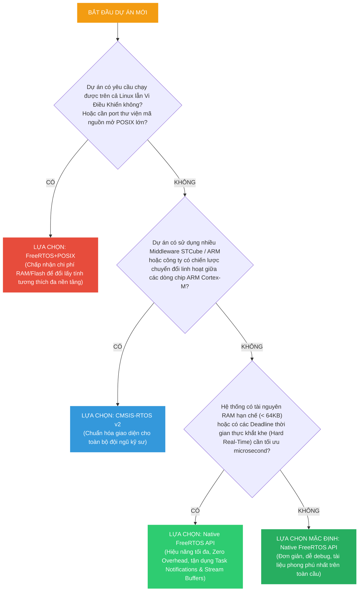
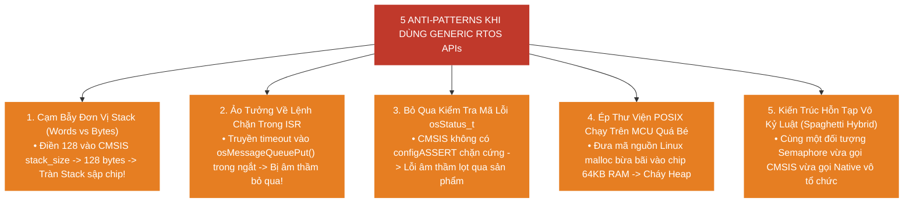

# <span style="color:#f1c40f">Chương 13: Lựa Chọn API Cho RTOS (Choosing an RTOS API)</span>

> **Tài liệu tham khảo chuyên sâu kết hợp:**
> - 📘 *Hands-On RTOS with Microcontrollers* – Brian Amos (Chapter 14: *Choosing an RTOS API*, tr. 354–379).
> - 📗 *ARM CMSIS-RTOS v2 Specification* – ARM Keil Documentation (API Def 2.1.3 & cmsis_os2.c wrapper mechanics).
> - 📙 *FreeRTOS+POSIX Architecture Manual* – FreeRTOS Labs (POSIX Subsystem IEEE Std 1003.1 Implementation).

---

```text
MỤC LỤC CHUYÊN SÂU (TABLE OF CONTENTS)
├── 1. Bản Chất & Kiến Trúc Của Generic RTOS API (Understanding Generic RTOS APIs)
│   ├── 1.1 Khủng Hoảng Phụ Thuộc Hệ Điều Hành: Vấn Đề Vendor Lock-In
│   ├── 1.2 Kiến Trúc Ngăn Xếp Firmware Chuẩn ARM (ARM Firmware Stack Architecture)
│   ├── 1.3 Nguyên Tắc Truy Cập Không Loại Trừ (Non-Exclusive Access Principle)
│   └── 1.4 Phân Tích Ưu & Nhược Điểm Khi Trừu Tượng Hóa API Hệ Điều Hành
├── 2. So Sánh Đối Đầu: FreeRTOS Native vs CMSIS-RTOS v2
│   ├── 2.1 Bản Chất Của CMSIS-RTOS: Đặc Tả Giao Diện (API Specification) vs Kernel Thật
│   ├── 2.2 Sự Phân Hóa Của STMicroelectronics: Biến Thể cmsis_os2.c Trong STM32Cube
│   └── 2.3 Bốn Khác Biệt Nền Tảng Sống Còn Giữa Native FreeRTOS & CMSIS-RTOS v2:
│       ├── 2.3.1 Đơn Vị Kích Thước Stack: Words vs Bytes
│       ├── 2.3.2 Cơ Chế Tự Động Nhận Diện Ngữ Cảnh Ngắt (Automatic ISR Detection)
│       ├── 2.3.3 Triết Lý Báo Lỗi: Mã Trả Về (Return Code) vs configASSERT() Chặn Cứng
│       └── 2.3.4 Hệ Thống Mức Ưu Tiên: 56 Mức Độ Ưu Tiên Chuẩn Hóa (osPriority_t)
├── 3. Bảng Ánh Xạ Toàn Diện FreeRTOS Native Sang CMSIS-RTOS v2 (1:1 Cross-Reference)
│   ├── 3.1 Nhóm Quản Lý Tác Vụ & Luồng Thực Thi (Threads & Task Control)
│   ├── 3.2 Nhóm Trễ & Nhịp Thời Gian (Delays & Time Management)
│   ├── 3.3 Nhóm Hàng Đợi Thông Điệp (Message Queues)
│   ├── 3.4 Nhóm Khóa Tương Hỗ (Mutexes & Recursive Mutexes)
│   ├── 3.5 Nhóm Đèn Báo (Binary & Counting Semaphores)
│   ├── 3.6 Nhóm Cờ Tác Vụ (Thread Flags vs Task Notifications)
│   ├── 3.7 Nhóm Nhóm Cờ Sự Kiện (Event Flags vs Event Groups)
│   ├── 3.8 Nhóm Định Thời Phần Mềm (Software Timers)
│   └── 3.9 Nhóm Điều Khiển Lõi Hệ Thống (Kernel Information & Control)
├── 4. Triển Khai Thực Chiến Ứng Dụng CMSIS-RTOS v2 Trên Vi Điều Khiển STM32
│   ├── 4.1 Cấu Trúc Khởi Tạo Kernel & Cấu Hình Thuộc Tính osThreadAttr_t
│   ├── 4.2 Triển Khai Tạo Task Cấp Phát Động (Dynamic Task Creation: GreenTask)
│   ├── 4.3 Triển Khai Tạo Task Cấp Phát Tĩnh & Độc Lập RTOS (Static Task: RedTask & RTOS_Dependencies.h)
│   └── 4.4 Thực Thi Vòng Lặp Điều Phối & Đánh Giá Tính Tương Thích
├── 5. FreeRTOS và Chuẩn POSIX (FreeRTOS+POSIX Ecosystem)
│   ├── 5.1 Động Lực: Tại Sao Lại Đưa Chuẩn Unix/Linux POSIX Vào Vi Điều Khiển?
│   ├── 5.2 11 File Header POSIX Được Hỗ Trợ Trong FreeRTOS Labs
│   ├── 5.3 Cấu Hình Cần Thiết Trong FreeRTOSConfig.h (POSIX Errno & Task Tag)
│   ├── 5.4 Mã Nguồn Ứng Dụng Mẫu Dùng pthread_create() & sleep()
│   └── 5.5 Phân Tích Cơ Hội & Cạm Bẫy Khi Port Thư Viện Linux Xuống Vi Điều Khiển
├── 6. Ma Trận Ra Quyết Định Kiến Trúc (Architectural Decision Matrix)
│   ├── 6.1 Bảng So Sánh 3 Chiều: Native FreeRTOS vs CMSIS-RTOS v2 vs FreeRTOS+POSIX
│   └── 6.2 Bốn Quy Tắc Chọn Lựa Dứt Khoát Dành Cho Tech Lead / System Architect
├── 7. Năm Anti-Patterns Thường Gặp Khi Sử Dụng Generic RTOS APIs
├── 8. Lời Giải Chi Tiết Toàn Bộ Câu Hỏi Đánh Giá Sách Brian Amos (Chapter 14 Assessments)
└── 9. Bảng Tổng Hợp Kiến Thức Cốt Lõi (Key Takeaways Summary Matrix)
```

---

## <span style="color:#e67e22">1. Bản Chất & Kiến Trúc Của Generic RTOS API (Understanding Generic RTOS APIs)</span>

Trong toàn bộ các chương trước của cuốn sách, chúng ta hoàn toàn lập trình bằng **Native FreeRTOS API** (`xTaskCreate`, `xQueueSend`, `vTaskDelay`, `xSemaphoreTake`,...). Cách tiếp cận này giúp khai thác 100% sức mạnh, tối ưu từng chu kỳ CPU và trực quan hóa luồng dữ liệu mà không bị bất kỳ tầng trung gian nào che khuất.

Tuy nhiên, trong môi trường phát triển phần mềm công nghiệp hiện đại, một dự án nhúng hiếm khi đứng độc lập. Mã nguồn của bạn có thể cần phải:
- Chuyển đổi giữa nhiều dòng vi điều khiển khác nhau (từ STM32 Cortex-M sang NXP, TI, Renesas hoặc Silicon Labs).
- Tích hợp các thư viện bên thứ 3 (Third-Party Middleware như GUI stacks, TCP/IP, USB Host, Crypto engine) vốn được viết sẵn cho một chuẩn giao diện chung.
- Dễ dàng thay thế nhân RTOS nền tảng (ví dụ: chuyển đổi từ **FreeRTOS** sang **Keil RTX5**, **Zephyr RTOS**, hoặc **Azure RTOS / ThreadX**) mà không phải đập đi xây lại toàn bộ logic ứng dụng nghiệp vụ.

Để giải quyết bài toán sống còn này, các kiến trúc sư phần mềm sử dụng **Generic RTOS API**.

---

### <span style="color:#1abc9c">1.1 Khủng Hoảng Phụ Thuộc Hệ Điều Hành: Vấn Đề Vendor Lock-In</span>

Khi lập trình viên nhúng gọi trực tiếp Native API của một RTOS cụ thể:

```c
/* =========================================================================
 * ❌ MÃ NGUỒN BỊ TRÓI CHẶT CỨNG (HARD-COUPLED) VỚI FREERTOS
 * ========================================================================= */
void MotorController_Init(void)
{
    // Sử dụng trực tiếp cấu trúc dữ liệu và API độc quyền của FreeRTOS
    motorQueue = xQueueCreate(10, sizeof(MotorCmd_t));
    xTaskCreate(vMotorTask, "Motor", 256, NULL, 3, &motorTaskHandle);
}
```

Nếu một ngày cấp quản lý quyết định chuyển toàn bộ sản phẩm sang dòng chip mới chỉ hỗ trợ Keil RTX hoặc ThreadX, đội ngũ kỹ sư sẽ rơi vào **khủng hoảng porting**:
1. Phải tìm và thay thế thủ công hàng nghìn lời gọi hàm trên khắp hàng trăm file source code.
2. Cú pháp truyền tham số, kiểu dữ liệu trả về và quy tắc quản lý bộ nhớ giữa các RTOS hoàn toàn khác nhau (ví dụ: FreeRTOS dùng Ticks, RTX dùng Milliseconds, ThreadX có cờ timeout riêng).
3. Nguy cơ phát sinh lỗi tiềm ẩn (Subtle Timing Bugs, Priority Mismatch) cực kỳ cao.

> [!IMPORTANT]
> **Vendor Lock-In (Trói buộc nhà cung cấp)** không chỉ xảy ra ở tầng phần cứng vi điều khiển (Silicon Vendor Lock-In), mà còn xảy ra nghiêm trọng ở **tầng phần mềm hệ điều hành (RTOS Vendor Lock-In)**. Generic RTOS API ra đời như một lớp bọc trừu tượng (Wrapper Layer) nhằm triệt tiêu sự phụ thuộc này.

---

### <span style="color:#1abc9c">1.2 Kiến Trúc Ngăn Xếp Firmware Chuẩn ARM (ARM Firmware Stack Architecture)</span>

Để thống nhất hệ sinh thái Cortex-M, tập đoàn ARM đã định nghĩa kiến trúc ngăn xếp firmware đa tầng, phân định ranh giới rõ ràng giữa phần cứng, driver, nhân RTOS và tầng ứng dụng:

```mermaid
graph TD
    subgraph APP ["TẦNG ỨNG DỤNG NGHIỆP VỤ (USER APPLICATION CODE)"]
        UserCode["Logic Ứng Dụng Nghiệp Vụ / User Tasks"]
        Middleware["Thư Viện Bên Thứ 3 (GUI, TCP/IP, File System, Crypto)"]
    end

    subgraph WRAPPER ["TẦNG TRỪU TƯỢNG HÓA API GENERIC (OPTIONAL WRAPPERS)"]
        CMSIS_OS["CMSIS-RTOS v2 API<br/>(Chuẩn hóa ARM cho Cortex-M)"]
        POSIX_API["POSIX API Layer<br/>(FreeRTOS+POSIX Labs / pthread)"]
    end

    subgraph KERNEL ["TẦNG NHÂN HỆ ĐIỀU HÀNH THỜI GIAN THỰC (RTOS KERNEL)"]
        NativeFreeRTOS["Native FreeRTOS Kernel Engine<br/>(tasks.c, queue.c, timers.c, event_groups.c)"]
    end

    subgraph HARDWARE_LAYER ["TẦNG PHẦN CỨNG & DRIVER NỀN TẢNG"]
        HAL_LL["CMSIS-Core / Hardware Abstraction Layer (HAL) & LL Drivers"]
        Silicon["Phần Cứng Vi Điều Khiển (ARM Cortex-M0+/M3/M4/M7/M33 MCU)"]
    end

    UserCode -->|Gọi Generic API| CMSIS_OS
    UserCode -->|Gọi Chuẩn POSIX| POSIX_API
    UserCode ==>|TRUY CẬP TRỰC TIẾP (Bypass Wrapper)| NativeFreeRTOS
    Middleware -->|Độc Lập RTOS| CMSIS_OS

    CMSIS_OS -->|Ánh Xạ Tầng Thấp| NativeFreeRTOS
    POSIX_API -->|Ánh Xạ Tầng Thấp| NativeFreeRTOS

    NativeFreeRTOS --> HAL_LL
    HAL_LL --> Silicon

    style APP fill:#2c3e50,stroke:#34495e,color:#ecf0f1
    style WRAPPER fill:#2980b9,stroke:#3498db,color:#fff
    style KERNEL fill:#27ae60,stroke:#2ecc71,color:#fff
    style HARDWARE_LAYER fill:#7f8c8d,stroke:#95a5a6,color:#fff
```

Nhìn vào sơ đồ trên, ta thấy rõ 3 con đường giao tiếp mà mã nguồn ứng dụng có thể lựa chọn:
1. **Đường 1 (Native Direct Access)**: Ứng dụng gọi thẳng Native FreeRTOS API. Đường này cho tốc độ tối đa, tận dụng 100% tính năng độc quyền, không tốn thêm bộ nhớ wrapper.
2. **Đường 2 (CMSIS-RTOS Wrapper)**: Ứng dụng gọi qua `cmsis_os2.h`. Lớp bọc này dịch các lời gọi hàm chuẩn ARM thành lời gọi hàm FreeRTOS tương ứng.
3. **Đường 3 (POSIX Wrapper)**: Ứng dụng gọi qua các hàm chuẩn Unix như `pthread_create()`, `sleep()`. Lớp bọc `FreeRTOS_POSIX` sẽ ánh xạ xuống nhân FreeRTOS.

---

### <span style="color:#1abc9c">1.3 Nguyên Tắc Truy Cập Không Loại Trừ (Non-Exclusive Access Principle)</span>

Một trong những hiểu lầm phổ biến nhất của các kỹ sư nhúng là: *"Nếu dự án đã bật CMSIS-RTOS v2, toàn bộ hệ thống bắt buộc phải dùng CMSIS-RTOS và không được phép gọi FreeRTOS native nữa"*.

Tác giả Brian Amos khẳng định: **Đây là quan niệm hoàn toàn sai lầm!**

> [!NOTE]
> **Nguyên tắc Truy cập Không Loại trừ (Non-Exclusive Access)**:
> Các tầng trừu tượng API trong kiến trúc ARM được thiết kế mở. Không có bất kỳ rào cản phần cứng hay phần mềm nào ngăn cấm mã nguồn ứng dụng truy cập trực tiếp xuống tầng bên dưới. 
> 
> Trong cùng một file nguồn hoặc cùng một dự án, bạn hoàn toàn có thể:
> - Sử dụng **CMSIS-RTOS v2** cho một thư viện GUI của bên thứ 3 (để đảm bảo tính khả chuyển của thư viện).
> - Đồng thời sử dụng **Native FreeRTOS API** cho các driver điều khiển động cơ hoặc xử lý ngắt DMA tốc độ cao (để tận dụng Direct Task Notification và Stream Buffer).
> 
> Cả hai phong cách lập trình hoạt động hài hòa và tương thích 100% với nhau trên cùng một nhân FreeRTOS đang chạy!

---

### <span style="color:#1abc9c">1.4 Phân Tích Ưu & Nhược Điểm Khi Trừu Tượng Hóa API Hệ Điều Hành</span>

Việc đưa thêm một lớp wrapper trung gian vào hệ thống thời gian thực luôn là một sự đánh đổi (Trade-off) kỹ thuật sâu sắc:

#### Ưu Điểm Lớn:
1. **Tính Khả Chuyển Vượt Trội (Maximum Portability)**: Mã nguồn ứng dụng viết theo chuẩn CMSIS-RTOS v2 có thể chạy mà không cần sửa đổi dù chỉ một dòng code trên bất kỳ hệ điều hành nào có CMSIS wrapper (Keil RTX5, FreeRTOS, ThreadX, Zephyr, Micrium µC/OS-III).
2. **Hệ Sinh Thái Middleware Phong Phú**: Các hãng cung cấp phần mềm thương mại (Segger emWin, TouchGFX, lwIP, mbedTLS) chỉ cần phát triển một bản driver duy nhất giao tiếp với CMSIS-RTOS thay vì phải bảo trì hàng chục bản port riêng cho từng RTOS.
3. **Chuẩn Hóa Kỹ Năng Đội Ngũ (Team Skill Standardization)**: Kỹ sư mới gia nhập dự án chỉ cần học duy nhất một bộ API CMSIS-RTOS chuẩn của ARM là có thể làm việc trên mọi dự án dùng các dòng chip Cortex-M khác nhau.

#### Nhược Điểm & Đánh Đổi Kỹ Thuật (Drawbacks & Hidden Costs):
1. **Bị Mất Các Tính Năng Độc Quyền (Loss of Unique Features)**: Vì là một giao diện tổng quát (One-size-fits-all), Generic API chỉ định nghĩa những tính năng mà "mọi RTOS đều có". Do đó, những vũ khí tối tân và hiệu năng cao nhất của riêng FreeRTOS bị loại bỏ hoàn toàn:
   - *Stream Buffers & Message Buffers*: Không có trong CMSIS-RTOS v2.
   - *Queue Sets*: Không thể chờ đồng thời trên nhiều Queue/Semaphore qua CMSIS-RTOS v2.
   - *Direct Task Notifications*: Mặc dù CMSIS-RTOS có `Thread Flags`, nhưng cơ chế này không hỗ trợ đầy đủ các chế độ nâng cao như `eSetValueWithOverwrite` (Mailbox) hay `eIncrement`.
   - *Co-routines*: Tính năng chia sẻ thời gian siêu tiết kiệm RAM của FreeRTOS không tồn tại trong CMSIS-RTOS.
2. **Tổn Hao Tài Nguyên (Overhead & Code Bloat)**:
   - *Flash ROM*: Mỗi hàm wrapper là một lớp gián tiếp, tiêu tốn thêm mã máy trong Flash.
   - *RAM*: Các cấu trúc quản lý wrapper thường cấp phát thêm các biến trung gian hoặc con trỏ để duy trì ánh xạ trạng thái.
   - *Thời gian thực thi (Latency)*: Việc đi qua thêm một con trỏ hàm hoặc lời gọi hàm wrapper làm tăng thêm số chu kỳ xung nhịp (Clock cycles), gây bất lợi cho các tác vụ đòi hỏi phản hồi cực nhanh (Sub-microsecond Deadlines).
3. **Hiện Tượng Trễ Phiên Bản (Release Lag)**: Đơn vị duy trì nhân RTOS (ví dụ: Amazon AWS cho FreeRTOS) và đơn vị viết lớp wrapper (ARM hoặc STMicroelectronics) là hai thực thể khác nhau. Khi FreeRTOS ra mắt tính năng bảo mật mới hoặc vá lỗi kernel trong phiên bản V10.x, có thể phải mất nhiều tháng bản wrapper CMSIS-RTOS trong STM32Cube mới được cập nhật đồng bộ.
4. **Khoảng Trống Hỗ Trợ Kỹ Thuật (Vendor Support Gap)**: Nếu hệ thống của bạn gặp lỗi Race Condition kỳ dị hoặc tràn bộ nhớ:
   - Kỹ sư FreeRTOS sẽ từ chối hỗ trợ nếu mã lỗi bắt nguồn từ các macro trong `cmsis_os2.c` do ST hoặc ARM viết.
   - Kỹ sư ARM hoặc ST sẽ khó tái hiện lỗi nếu hành vi bất thường nằm sâu bên trong cơ chế scheduler của FreeRTOS kernel.

---

## <span style="color:#e67e22">2. So Sánh Đối Đầu: FreeRTOS Native vs CMSIS-RTOS v2</span>

Để làm chủ việc lựa chọn và chuyển đổi giữa Native FreeRTOS và CMSIS-RTOS v2, người kỹ sư cần thấu hiểu bản chất kiến trúc và 4 khác biệt nền tảng sống còn.

---

### <span style="color:#1abc9c">2.1 Bản Chất Của CMSIS-RTOS: Đặc Tả Giao Diện vs Kernel Thật</span>

> [!CAUTION]
> **CMSIS-RTOS KHÔNG PHẢI LÀ MỘT HỆ ĐIỀU HÀNH!**
> CMSIS-RTOS chỉ là một tập hợp các **tệp tiêu đề (Header files: `cmsis_os2.h`) định nghĩa tên hàm, kiểu tham số và giá trị trả về**. Nó hoàn toàn không có scheduler, không có mã assembly context switch, không có danh sách Ready List hay Blocked List!
> 
> Ngoại lệ duy nhất là **Keil RTX5**, một RTOS do chính ARM phát triển từ đầu lấy CMSIS-RTOS v2 làm Native API. Đối với FreeRTOS, CMSIS-RTOS chỉ đóng vai trò là một **lớp keo dán (Glue Layer: `cmsis_os2.c`)** dịch các lời gọi hàm CMSIS thành lời gọi hàm FreeRTOS tương ứng.

---

### <span style="color:#1abc9c">2.2 Sự Phân Hóa Của STMicroelectronics: Biến Thể cmsis_os2.c Trong STM32Cube</span>

Khi bạn tạo dự án STM32CubeIDE và bật middleware FreeRTOS với giao diện CMSIS-RTOS v2, tệp nguồn `cmsis_os2.c` mà bạn nhận được **không phải là bản gốc 100% của ARM**, mà là một bản **Fork riêng do STMicroelectronics tùy biến**.

Những can thiệp sâu của STMicroelectronics trong bản fork này bao gồm:
1. **Gắn Chặt Với Xung Nhịp Hệ Thống (Clock Subsystem Coupling)**: Cách thức triển khai các hàm đọc thời gian như `osKernelGetSysTimerCount()` và `osKernelGetSysTimerFreq()` bị sửa đổi để đọc trực tiếp biến toàn cục `SystemCoreClock` của ST HAL.
2. **Triển Khai Tickless Low Power Mode**: ST tích hợp cơ chế ngủ sâu với bộ định thời công suất thấp LPTIM (Low-Power Timer) thông qua các macro riêng của STCube, khác với giải pháp generic của ARM.
3. **Hành Vi Hàm `osDelay()`**: Bản fork của ST xử lý tham số của `osDelay()` dựa trên giả định mặc định tần số SysTick là 1 kHz (1 tick = 1 ms). Nếu hệ thống cấu hình `configTICK_RATE_HZ` khác 1000 Hz, việc quy đổi giữa mili-giây và ticks có thể dẫn đến sai lệch thời gian nghiêm trọng nếu không kiểm tra kỹ mã nguồn `cmsis_os2.c`!

---

### <span style="color:#1abc9c">2.3 Bốn Khác Biệt Nền Tảng Sống Còn Giữa Native FreeRTOS & CMSIS-RTOS v2</span>

Dưới đây là 4 cạm bẫy kỹ thuật kinh điển mà các kỹ sư chuyển đổi từ FreeRTOS sang CMSIS-RTOS (hoặc ngược lại) thường xuyên vấp phải:

#### 2.3.1 Đơn Vị Kích Thước Stack: Words vs Bytes

Đây là nguyên nhân số một gây ra lỗi tràn bộ nhớ (Stack Overflow) hoặc lãng phí 75% RAM hệ thống:

```c
/* =========================================================================
 * ⚠️ SO SÁNH ĐƠN VỊ ĐO KÍCH THƯỚC STACK GIỮA HAI BỘ API
 * ========================================================================= */

// TRONG NATIVE FREERTOS: Đơn vị là WORDS (Số lượng phần tử StackType_t)
// Trên vi điều khiển ARM Cortex-M 32-bit: 1 Word = 4 Bytes
#define TASK_STACK_WORDS  128  // Tương đương: 128 * 4 = 512 Bytes bộ nhớ RAM!
xTaskCreate(vTaskCode, "Task1", TASK_STACK_WORDS, NULL, 2, NULL);

// TRONG CMSIS-RTOS v2: Đơn vị BẮT BUỘC là BYTES!
// Nếu lập trình viên điền số 128 vào đây:
osThreadAttr_t task_attr = {
    .name = "Task1",
    .stack_size = 128  // ❌ NGUY HIỂM: Kích thước ở đây CHỈ CÓ 128 BYTES!
};                     // Tương đương vỏn vẹn 32 Words -> CHẮC CHẮN TRÀN STACK!

// ✅ CẤU HÌNH ĐÚNG CHUẨN TRONG CMSIS-RTOS v2:
osThreadAttr_t task_attr_correct = {
    .name = "Task1",
    .stack_size = 128 * sizeof(uint32_t)  // 512 Bytes = 128 Words
};
osThreadNew(vTaskCode, NULL, &task_attr_correct);
```

> [!WARNING]
> **Quy Tắc Vàng Khi Port Code**:
> - Khi chuyển từ FreeRTOS sang CMSIS-RTOS: **Phải nhân kích thước Stack với 4** (hoặc `sizeof(StackType_t)`).
> - Khi chuyển từ CMSIS-RTOS sang FreeRTOS: **Phải chia kích thước Stack cho 4**.

---

#### 2.3.2 Cơ Chế Tự Động Nhận Diện Ngữ Cảnh Ngắt (Automatic ISR Detection)

Trong **Native FreeRTOS**, tính tất định và an toàn thời gian thực được bảo đảm bằng cách phân tách tuyệt đối:
- Lời gọi từ tác vụ: `xQueueSend()`, `xSemaphoreGive()`.
- Lời gọi từ ngắt: `xQueueSendFromISR()`, `xSemaphoreGiveFromISR()` kèm cờ `pxHigherPriorityTaskWoken` và macro `portYIELD_FROM_ISR()`.
- Nếu bạn gọi nhầm một hàm non-ISR từ bên trong một trình xử lý ngắt, FreeRTOS sẽ lập tức kích hoạt `configASSERT()` và dừng hệ thống ngay lập tức để cảnh báo lập trình viên.

Ngược lại, **CMSIS-RTOS v2 đơn giản hóa tối đa bằng cơ chế tự động nhận diện (Automatic ISR Routing)**:
- Người dùng chỉ gọi một hàm duy nhất cho cả tác vụ lẫn ISR: `osMessageQueuePut()`, `osSemaphoreRelease()`.
- Bên trong mã nguồn `cmsis_os2.c`, CMSIS kiểm tra thanh ghi trạng thái ngắt của ARM Cortex-M (thanh ghi `IPSR` - Interrupt Program Status Register thông qua macro `IS_IRQ()`):
  - Nếu `IS_IRQ() == 0` (đang ở Thread Mode): Gọi API FreeRTOS thông thường.
  - Nếu `IS_IRQ() != 0` (đang ở Handler Mode - ISR): Tự động chuyển hướng gọi API `*FromISR`, tự động tạo biến `xHigherPriorityTaskWoken`, và tự động gọi `portYIELD_FROM_ISR()` trước khi thoát!

```c
/* =========================================================================
 * TRÍCH ĐOẠN MÃ NGUỒN cmsis_os2.c: CƠ CHẾ TỰ ĐỘNG CHUYỂN HƯỚNG ISR
 * ========================================================================= */
osStatus_t osMessageQueuePut (osMessageQueueId_t mq_id, const void *msg_ptr, uint8_t msg_prio, uint32_t timeout)
{
    QueueHandle_t hQueue = (QueueHandle_t)mq_id;
    BaseType_t yield;
    
    // Kiểm tra xem CPU đang thực thi trong ngắt (Handler Mode) hay tác vụ (Thread Mode)
    if (IS_IRQ()) 
    {
        // 1. Tự động bỏ qua timeout (ép về 0 vì ISR không bao giờ được phép chặn!)
        (void)timeout; 
        
        // 2. Tự động gọi API FromISR
        if (xQueueSendToBackFromISR(hQueue, msg_ptr, &yield) != pdTRUE) {
            return osErrorResource; // Hàng đợi bị đầy
        }
        
        // 3. Tự động kích hoạt chuyển ngữ cảnh nếu có task ưu tiên cao hơn bị đánh thức
        portYIELD_FROM_ISR(yield);
    }
    else 
    {
        // Thực thi bình thường trong tác vụ với đầy đủ timeout blocking
        if (xQueueSendToBack(hQueue, msg_ptr, timeout) != pdTRUE) {
            return osErrorTimeout;
        }
    }
    return osOK;
}
```

> [!CAUTION]
> **Đánh Đổi Kỹ Thuật**: Mặc dù CMSIS-RTOS v2 rất tiện lợi và không làm sập chip, nhưng nếu bạn truyền tham số `timeout = 1000` (chờ 1 giây) vào một hàm CMSIS được gọi từ trong ISR, **lệnh chờ này sẽ bị âm thầm hủy bỏ (ignored silently)** và hàm trả về ngay lập tức nếu tài nguyên bận. Người lập trình chủ quan có thể không lường trước được hành vi trả về thất bại tức thì này!

---

#### 2.3.3 Triết Lý Báo Lỗi: Mã Trả Về (Return Code) vs configASSERT() Chặn Cứng

- **FreeRTOS Native Philosophy**: *"Lỗi cấu hình ngắt hoặc sai ngữ cảnh là lỗi lập trình chết người (Fatal Programming Bug)"*. Do đó, FreeRTOS chọn giải pháp dừng chip ngay tại chỗ bằng `configASSERT(x)` trong vòng lặp vô tận `for(;;)` để lập trình viên buộc phải cắm debugger vào sửa tận gốc trước khi sản phẩm xuất xưởng.
- **CMSIS-RTOS v2 Philosophy**: *"Hệ thống phải duy trì tính linh hoạt và tuân thủ chuẩn hàm C"*. CMSIS-RTOS hiếm khi ép sập chương trình. Thay vào đó, nó định nghĩa mã trả về dạng `osStatus_t`:
  - `osOK` (0): Thực thi thành công.
  - `osError`: Lỗi chung không xác định.
  - `osErrorTimeout`: Hết thời gian chờ.
  - `osErrorResource`: Tài nguyên không khả dụng (Queue đầy, Mutex đang bị chiếm).
  - `osErrorParameter`: Tham số không hợp lệ.
  - `osErrorISR`: Lệnh không được phép gọi trong ngữ cảnh ngắt (ví dụ: tạo Mutex hoặc chiếm giữ Mutex trong ISR!).

> [!TIP]
> Khi lập trình với CMSIS-RTOS v2, bạn **bắt buộc phải kiểm tra giá trị trả về của mọi hàm RTOS**. Nếu bỏ qua kiểm tra mã lỗi `assert(status == osOK)`, hệ thống có thể âm thầm bỏ qua các thao tác quan trọng mà bạn không hề hay biết!

---

#### 2.3.4 Hệ Thống Mức Ưu Tiên: 56 Mức Độ Ưu Tiên Chuẩn Hóa (osPriority_t)

Trong Native FreeRTOS, số lượng mức ưu tiên hoàn toàn do lập trình viên quyết định trong file cấu hình thông qua macro `configMAX_PRIORITIES` (thường đặt là 5 đến 7 để tiết kiệm RAM Ready List). Mức 0 là thấp nhất (Idle Task), số càng cao ưu tiên càng lớn.

Trong khi đó, đặc tả CMSIS-RTOS v2 định nghĩa sẵn một enum chuẩn hóa gồm **56 mức ưu tiên** (`osPriority_t`):
- `osPriorityNone` (0)
- `osPriorityIdle` (1)
- `osPriorityLow` (8) ... `osPriorityLow7` (15)
- `osPriorityNormal` (24) ... `osPriorityNormal7` (31)
- `osPriorityHigh` (40) ... `osPriorityHigh7` (47)
- `osPriorityRealtime` (48) ... `osPriorityRealtime7` (55)
- `osPriorityISR` (56)

```c
/* =========================================================================
 * ⚠️ RÀNG BUỘC CẤU HÌNH configMAX_PRIORITIES TRONG FreeRTOSConfig.h
 * ========================================================================= */
// Khi sử dụng lớp bọc CMSIS-RTOS v2 cho FreeRTOS:
// Bạn BẮT BUỘC phải đặt configMAX_PRIORITIES tối thiểu là 56!
#define configMAX_PRIORITIES  ( 56 )

// NẾU KHÔNG: Hàm osThreadNew() sẽ phải thực hiện phép chia tỷ lệ (Scaling)
// để nén 56 mức ưu tiên của CMSIS vào dải hẹp của FreeRTOS, dẫn đến việc
// các tác vụ có mức ưu tiên CMSIS khác nhau lại bị gán trùng một mức ưu tiên
// thực tế trong FreeRTOS kernel, làm méo mó đặc tính tiền định của hệ thống!
```

---

## <span style="color:#e67e22">3. Bảng Ánh Xạ Toàn Diện FreeRTOS Native Sang CMSIS-RTOS v2 (1:1 Cross-Reference)</span>

Khi tiến hành chuyển đổi (Porting) một codebase hiện có hoặc viết mã nguồn tương thích cả hai chuẩn, kỹ sư cần một bản tra cứu đối chiếu chính xác đến từng hàm, hiểu rõ mã nguồn bên dưới lớp keo `cmsis_os2.c` thực sự đang gọi API FreeRTOS nào và những điểm khác biệt tinh tế về hành vi thực thi.

---

### <span style="color:#1abc9c">3.1 Nhóm Quản Lý Tác Vụ & Luồng Thực Thi (Threads & Task Control)</span>

Trong CMSIS-RTOS v2, khái niệm **Task** của FreeRTOS được gọi là **Thread**. Điểm cải tiến lớn nhất là CMSIS-RTOS gom toàn bộ việc cấp phát động (Dynamic Allocation) và cấp phát tĩnh (Static Allocation) vào chung **một hàm duy nhất `osThreadNew()`** thông qua cấu trúc thuộc tính `osThreadAttr_t`.

| Hàm CMSIS-RTOS v2 | Hàm FreeRTOS Tương Ứng Được Gọi | Phân Tích Cơ Chế Tầng Dưới & Điểm Cần Lưu Ý |
|---|---|---|
| `osThreadNew` | `xTaskCreate` (nếu stack động)<br/>`xTaskCreateStatic` (nếu stack tĩnh) | Kiểm tra con trỏ `attr->stack_mem`. Nếu khác `NULL`, gọi bản `Static`; nếu `NULL`, gọi bản `Dynamic`. **Lưu ý: `stack_size` tính bằng Bytes, không phải Words!** |
| `osThreadExit` | `vTaskDelete(NULL)` | Kết thúc và hủy luồng hiện tại. **Cảnh báo cực hạn**: Nếu ứng dụng đang cấu hình `heap_1.c` (vốn không cho phép giải phóng bộ nhớ), hàm này sẽ biến thành một vòng lặp vô tận tiêu thụ 100% CPU! |
| `osThreadTerminate` | `vTaskDelete(pxTask)` | Hủy một luồng khác được chỉ định bởi Thread ID. Nếu dùng `heap_1.c`, hàm trả về mã lỗi `osError`. |
| `osThreadYield` | `taskYIELD()` | Nhường quyền thực thi cho các luồng khác có cùng mức ưu tiên trong danh sách Ready. |
| `osThreadSuspend` | `vTaskSuspend` | Đưa luồng vào trạng thái Suspended vô thời hạn. |
| `osThreadResume` | `vTaskResume` | Đưa luồng từ Suspended trở lại Ready List. Tự động gọi `xTaskResumeFromISR` nếu gọi trong ISR. |
| `osThreadGetId` | `xTaskGetCurrentTaskHandle` | Trả về định danh (Handle) của luồng đang chạy. |
| `osThreadGetName` | `pcTaskGetName` | Trả về chuỗi ký tự tên luồng đặt lúc khởi tạo. |
| `osThreadGetPriority` | `uxTaskPriorityGet` | Trả về mức ưu tiên (đã được quy đổi theo thang 56 mức của CMSIS-RTOS). |
| `osThreadSetPriority` | `vTaskPrioritySet` | Thay đổi mức ưu tiên của luồng trong thời gian thực. |
| `osThreadGetCount` | `uxTaskGetNumberOfTasks` | Trả về tổng số lượng luồng đang tồn tại trong hệ thống. |
| `osThreadGetStackSpace` | `uxTaskGetStackHighWaterMark` | Trả về lượng bộ nhớ Stack tối thiểu chưa từng dùng tới (tính theo Bytes). |
| `osThreadGetStackSize` | *(Không có hàm tương đương)* | **Luôn trả về 0** trong FreeRTOS port vì kernel FreeRTOS không lưu trữ kích thước Stack ban đầu trong TCB! |
| `osThreadEnumerate` | `uxTaskGetSystemState` | Tạm dừng Scheduler (`vTaskSuspendAll`), lấy danh sách toàn bộ luồng vào một mảng, sau đó bật lại Scheduler. |
| `osThreadGetState` | `eTaskGetState` | Ánh xạ trạng thái tác vụ giữa hai hệ thống (xem bảng ánh xạ trạng thái bên dưới). |

#### Bảng Ánh Xạ Trạng Thái Tác Vụ (Task State Mapping):

| Trạng Thái FreeRTOS Native | Trạng Thái CMSIS-RTOS v2 | Ý Nghĩa Kỹ Thuật |
|---|---|---|
| `eRunning` | `osThreadRunning` | Tác vụ đang trực tiếp chiếm giữ CPU và thực thi lệnh. |
| `eReady` | `osThreadReady` | Tác vụ sẵn sàng chạy, đang nằm trong hàng đợi Ready List. |
| `eBlocked` | `osThreadBlocked` | Tác vụ đang ngủ chờ sự kiện (Queue, Semaphore, Delay) hoặc timeout. |
| `eSuspended` | `osThreadBlocked` | **Khác biệt quan trọng**: CMSIS-RTOS v2 không có trạng thái Suspended riêng biệt, nó gộp chung Suspended vào `osThreadBlocked`! |
| `eDeleted` | `osThreadTerminated` | Tác vụ đã bị hủy, đang chờ Idle Task dọn dẹp bộ nhớ TCB/Stack. |
| `eInvalid` | `osThreadError` | Con trỏ hoặc Handle của tác vụ không hợp lệ. |

---

### <span style="color:#1abc9c">3.2 Nhóm Trễ & Nhịp Thời Gian (Delays & Time Management)</span>

| Hàm CMSIS-RTOS v2 | Hàm FreeRTOS Tương Ứng Được Gọi | Phân Tích Cơ Chế Tầng Dưới & Điểm Cần Lưu Ý |
|---|---|---|
| `osDelay` | `vTaskDelay` | Đưa tác vụ vào trạng thái Blocked trong một khoảng thời gian tương đối. |
| `osDelayUntil` | `vTaskDelayUntil`<br/>`xTaskGetTickCount` | Chặn tác vụ cho đến một thời điểm tuyệt đối trong tương lai. Giúp chu kỳ chạy không bị trôi lệch pha (Zero Cumulative Drift). |

> [!WARNING]
> **Cạm Bẫy Đơn Vị Đo Thời Gian Trong osDelay()**:
> Tài liệu chuẩn của ARM Keil quy định tham số của `osDelay(ticks)` nhận giá trị theo **Ticks** hoặc **Milliseconds** tùy thuộc vào cài đặt hệ thống.
> 
> Tuy nhiên, trong mã nguồn `cmsis_os2.c` đi kèm với **STM32Cube**:
> ```c
> osStatus_t osDelay (uint32_t ticks) {
>     // ST gọi thẳng vTaskDelay mà hoàn toàn KHÔNG thực hiện phép nhân/chia quy đổi ms -> ticks!
>     vTaskDelay(ticks);
>     return osOK;
> }
> ```
> Điều này có nghĩa: Nếu `configTICK_RATE_HZ` của bạn được cấu hình là 1000 Hz (1 tick = 1 ms) thì `osDelay(100)` sẽ trễ đúng 100 ms. Nhưng nếu bạn đặt `configTICK_RATE_HZ` là 100 Hz (1 tick = 10 ms), thì `osDelay(100)` sẽ trễ tới **1000 ms (1 giây)!** Luôn kiểm tra kỹ mã nguồn `cmsis_os2.c` trong dự án của bạn.

---

### <span style="color:#1abc9c">3.3 Nhóm Hàng Đợi Thông Điệp (Message Queues)</span>

Hàng đợi trong CMSIS-RTOS v2 được chuẩn hóa với cơ chế Copy-by-Value tương tự FreeRTOS:

| Hàm CMSIS-RTOS v2 | Hàm FreeRTOS Tương Ứng Được Gọi | Phân Tích Cơ Chế Tầng Dưới & Điểm Cần Lưu Ý |
|---|---|---|
| `osMessageQueueNew` | `xQueueCreate` (động)<br/>`xQueueCreateStatic` (tĩnh) | Tạo hàng đợi với sức chứa `msg_count` phần tử, mỗi phần tử có kích thước `msg_size` bytes. Tự động đăng ký tên Queue vào hệ thống Debug Registry (`vQueueAddToRegistry`). |
| `osMessageQueuePut` | `xQueueSendToBack`<br/>`xQueueSendToBackFromISR` | Đẩy dữ liệu vào đuôi hàng đợi. **Tự động nhận diện ISR**: Nếu gọi trong ngắt, tự động dùng `*FromISR`, ép timeout về 0 và gọi `portYIELD_FROM_ISR()`. |
| `osMessageQueueGet` | `xQueueReceive`<br/>`xQueueReceiveFromISR` | Lấy dữ liệu ra khỏi đầu hàng đợi (FIFO). Tự động nhận diện ngữ cảnh ISR. |
| `osMessageQueueGetCapacity` | `pxQueue->uxLength` | Trả về tổng sức chứa tối đa của Queue (số slot). |
| `osMessageQueueGetMsgSize` | `pxQueue->uxItemSize` | Trả về kích thước của một phần tử dữ liệu (tính bằng Bytes). |
| `osMessageQueueGetCount` | `uxQueueMessagesWaiting`<br/>`uxQueueMessagesWaitingFromISR` | Trả về số lượng thông điệp hiện đang nằm chờ trong Queue. |
| `osMessageQueueGetSpace` | `uxQueueSpacesAvailable` | Trả về số lượng slot trống còn lại trong Queue. Tự động dùng `taskENTER_CRITICAL_FROM_ISR` nếu gọi từ ngắt. |
| `osMessageQueueReset` | `xQueueReset` | Xóa sạch toàn bộ thông điệp trong Queue, đưa Queue về trạng thái rỗng ban đầu. |
| `osMessageQueueDelete` | `vQueueDelete`<br/>`vQueueUnregisterQueue` | Hủy hàng đợi, giải phóng bộ nhớ và xóa khỏi registry debug. |

> [!IMPORTANT]
> **Tính Năng Bị Mất So Với FreeRTOS**:
> CMSIS-RTOS v2 **hoàn toàn không hỗ trợ hàm tương đương với `xQueueSendToFront()`** (đẩy thông điệp khẩn cấp lên đầu hàng đợi để vượt cấp ưu tiên). Mọi thông điệp trong CMSIS-RTOS v2 đều bị bắt buộc xếp hàng ở cuối hàng đợi (`xQueueSendToBack`). Tham số độ ưu tiên thông điệp `msg_prio` trong hàm `osMessageQueuePut()` bị bản port FreeRTOS bỏ qua không xử lý.

---

### <span style="color:#1abc9c">3.4 Nhóm Khóa Tương Hỗ (Mutexes & Recursive Mutexes)</span>

FreeRTOS cung cấp các hàm riêng biệt cho Mutex tiêu chuẩn (`xSemaphoreCreateMutex`) và Mutex đệ quy (`xSemaphoreCreateRecursiveMutex`). CMSIS-RTOS v2 gom chung vào một cấu trúc thuộc tính `osMutexAttr_t`:

| Hàm CMSIS-RTOS v2 | Hàm FreeRTOS Tương Ứng Được Gọi | Phân Tích Cơ Chế Tầng Dưới & Điểm Cần Lưu Ý |
|---|---|---|
| `osMutexNew` | `xSemaphoreCreateMutex`<br/>`xSemaphoreCreateRecursiveMutex`<br/>`xSemaphoreCreate*Static` | Dựa vào cờ `attr->attr_bits`: Nếu có gắn cờ `osMutexRecursive`, hàm sẽ tự động khởi tạo Recursive Mutex của FreeRTOS. |
| `osMutexAcquire` | `xSemaphoreTake`<br/>`xSemaphoreTakeRecursive` | Tự động kiểm tra loại Mutex để gọi hàm Take thông thường hoặc Recursive Take. **Nếu gọi trong ISR, hàm lập tức trả về `osErrorISR`!** |
| `osMutexRelease` | `xSemaphoreGive`<br/>`xSemaphoreGiveRecursive` | Nhả quyền sở hữu Mutex. Bắt buộc phải được gọi bởi chính tác vụ đang giữ Mutex. **Nếu gọi trong ISR, lập tức trả về `osErrorISR`!** |
| `osMutexGetOwner` | `xSemaphoreGetMutexHolder` | Trả về Thread ID của tác vụ đang giữ khóa. Trả về `NULL` nếu Mutex đang tự do hoặc nếu bị gọi từ trong ISR. |
| `osMutexDelete` | `vSemaphoreDelete` | Hủy Mutex và thu hồi bộ nhớ. |

---

### <span style="color:#1abc9c">3.5 Nhóm Đèn Báo (Binary & Counting Semaphores)</span>

Trong CMSIS-RTOS v2, cả Binary Semaphore và Counting Semaphore đều được sinh ra từ hàm `osSemaphoreNew()`:

| Hàm CMSIS-RTOS v2 | Hàm FreeRTOS Tương Ứng Được Gọi | Phân Tích Cơ Chế Tầng Dưới & Điểm Cần Lưu Ý |
|---|---|---|
| `osSemaphoreNew` | `xSemaphoreCreateBinary`<br/>`xSemaphoreCreateCounting`<br/>`xSemaphoreCreate*Static` | Nếu tham số `max_count == 1`: Tạo Binary Semaphore.<br/>Nếu tham số `max_count > 1`: Tạo Counting Semaphore.<br/>**Đặc biệt**: Semaphore sẽ được tự động Give sẵn số lượng thẻ bằng `initial_count` ngay lúc tạo! |
| `osSemaphoreAcquire` | `xSemaphoreTake`<br/>`xSemaphoreTakeFromISR` | Xin một thẻ semaphore. Tự động nhận diện ISR và tự động gọi `portYIELD_FROM_ISR()`. |
| `osSemaphoreRelease` | `xSemaphoreGive`<br/>`xSemaphoreGiveFromISR` | Trả một thẻ semaphore. Tự động xử lý an toàn trong ngắt. |
| `osSemaphoreGetCount` | `uxQueueMessagesWaiting`<br/>`uxQueueMessagesWaitingFromISR` | Trả về số lượng thẻ semaphore hiện đang khả dụng (vốn là số message trong queue nội bộ của FreeRTOS). |
| `osSemaphoreDelete` | `vSemaphoreDelete` | Hủy Semaphore. |

---

### <span style="color:#1abc9c">3.6 Nhóm Cờ Tác Vụ (Thread Flags vs Task Notifications)</span>

CMSIS-RTOS v2 cung cấp cơ chế **Thread Flags** – đây chính là lớp bao bọc trực tiếp của tính năng **FreeRTOS Direct Task Notifications**:

| Hàm CMSIS-RTOS v2 | Hàm FreeRTOS Tương Ứng Được Gọi | Phân Tích Cơ Chế Tầng Dưới & Điểm Cần Lưu Ý |
|---|---|---|
| `osThreadFlagsSet` | `xTaskNotify(..., eSetBits)`<br/>`xTaskNotifyFromISR` | Bật các bit cờ tương ứng trên tác vụ đích. Tự động nhận diện ngữ cảnh ngắt. |
| `osThreadFlagsWait` | `xTaskNotifyWait` | Chờ một hoặc nhiều bit cờ được bật. Hỗ trợ logic chờ cờ kiểu AND (`osFlagsWaitAll`) hoặc OR (`osFlagsWaitAny`), và tùy chọn xóa cờ sau khi thoát (`osFlagsNoClear`). |
| `osThreadFlagsClear` | `xTaskNotifyAndQuery` | Tự xóa các bit cờ chỉ định trên chính tác vụ đang gọi. |
| `osThreadFlagsGet` | `xTaskNotifyAndQuery` | Đọc giá trị 32-bit cờ hiện tại mà không làm thay đổi trạng thái. |

> [!NOTE]
> Mặc dù `Thread Flags` chạy rất nhanh nhờ tận dụng 32-bit trường `ulNotifiedValue` trong TCB của FreeRTOS, nhưng nó **chỉ hỗ trợ duy nhất mô hình SetBits (tương đương Event Group thu nhỏ)**. Các tính năng cao cấp khác của FreeRTOS Task Notifications như dùng làm Mailbox ghi đè (`eSetValueWithOverwrite`) hoặc bộ đếm Lightweight Counting Semaphore (`eIncrement`) không thể biểu diễn trực tiếp qua giao diện CMSIS Thread Flags chuẩn!

---

### <span style="color:#1abc9c">3.7 Nhóm Nhóm Cờ Sự Kiện (Event Flags vs Event Groups)</span>

Khác với Thread Flags (chỉ gửi đích danh cho 1 tác vụ), **Event Flags** trong CMSIS-RTOS v2 tương ứng với **FreeRTOS Event Groups** (cho phép nhiều tác vụ cùng đăng ký lắng nghe và Broadcast sự kiện):

| Hàm CMSIS-RTOS v2 | Hàm FreeRTOS Tương Ứng Được Gọi | Phân Tích Cơ Chế Tầng Dưới & Điểm Cần Lưu Ý |
|---|---|---|
| `osEventFlagsNew` | `xEventGroupCreate`<br/>`xEventGroupCreateStatic` | Tạo nhóm cờ sự kiện. Trả về định danh `osEventFlagsId_t`. |
| `osEventFlagsSet` | `xEventGroupSetBits`<br/>`xEventGroupSetBitsFromISR` | Bật các bit sự kiện. Tất cả các tác vụ đang ngủ chờ thỏa mãn điều kiện bit sẽ cùng được đánh thức đồng thời (Broadcast). |
| `osEventFlagsWait` | `xEventGroupWaitBits` | Chặn tác vụ chờ tổ hợp các bit cờ theo logic AND/OR, tự động xóa cờ nếu không gắn cờ `osFlagsNoClear`. |
| `osEventFlagsClear` | `xEventGroupClearBits`<br/>`xEventGroupClearBitsFromISR` | Xóa thủ công một số bit sự kiện cụ thể. |
| `osEventFlagsGet` | `xEventGroupGetBits`<br/>`xEventGroupGetBitsFromISR` | Đọc trạng thái hiện thời của các bit sự kiện. |
| `osEventFlagsDelete` | `vEventGroupDelete` | Hủy nhóm cờ sự kiện và giải phóng bộ nhớ. |

---

### <span style="color:#1abc9c">3.8 Nhóm Định Thời Phần Mềm (Software Timers)</span>

| Hàm CMSIS-RTOS v2 | Hàm FreeRTOS Tương Ứng Được Gọi | Phân Tích Cơ Chế Tầng Dưới & Điểm Cần Lưu Ý |
|---|---|---|
| `osTimerNew` | `xTimerCreate`<br/>`xTimerCreateStatic` | Tạo Timer một lần (`osTimerOnce`) hoặc tự động lặp lại (`osTimerPeriodic`). CMSIS tự động cấp phát bộ đệm cho hàm callback. |
| `osTimerStart` | `xTimerChangePeriod` | Kích hoạt Timer chạy với chu kỳ được chỉ định. |
| `osTimerStop` | `xTimerStop` | Dừng Timer, chuyển Timer về trạng thái Dormant. |
| `osTimerIsRunning` | `xTimerIsTimerActive` | Kiểm tra xem Timer có đang đếm hay không. |
| `osTimerGetName` | `pcTimerGetName` | Đọc tên Timer. |
| `osTimerDelete` | `xTimerDelete` | Hủy Timer. **Cảnh báo**: Trả về `osError` nếu dùng `heap_1.c`. |

---

### <span style="color:#1abc9c">3.9 Nhóm Điều Khiển Lõi Hệ Thống (Kernel Information & Control)</span>

| Hàm CMSIS-RTOS v2 | Hàm FreeRTOS Tương Ứng Được Gọi | Phân Tích Cơ Chế Tầng Dưới & Điểm Cần Lưu Ý |
|---|---|---|
| `osKernelInitialize` | `vPortDefineHeapRegions` | Khởi tạo cấu trúc nhân. Chỉ gọi `vPortDefineHeapRegions` nếu đang dùng `heap_5.c`. |
| `osKernelStart` | `vTaskStartScheduler` | Bắt đầu kích hoạt Scheduler điều phối hệ thống. Không bao giờ quay trở lại nếu thành công. |
| `osKernelLock` | `vTaskSuspendAll` | Khóa Scheduler tạm thời (Interrupts vẫn chạy bình thường, chỉ cấm chuyển ngữ cảnh giữa các Task). |
| `osKernelUnlock` | `xTaskResumeAll` | Mở khóa Scheduler. Kích hoạt chuyển ngữ cảnh nếu có task ưu tiên cao hơn bị đánh thức trong lúc khóa. |
| `osKernelRestoreLock` | `xTaskResumeAll` / `vTaskSuspendAll` | Phục hồi lại trạng thái khóa trước đó (hỗ trợ gọi lồng nhau). |
| `osKernelGetState` | `xTaskGetSchedulerState` | Trả về trạng thái nhân (`osKernelInactive`, `osKernelReady`, `osKernelRunning`, `osKernelLocked`). |
| `osKernelGetTickCount` | `xTaskGetTickCount` | Trả về số tick của hệ thống kể từ khi khởi động. |
| `osKernelGetTickFreq` | `configTICK_RATE_HZ` | Trả về tần số đếm tick của RTOS (thường là 1000 Hz). |
| `osKernelGetSysTimerCount` | `xTaskGetTickCount() * (...)` | Tính toán số chu kỳ xung nhịp phần cứng dựa trên thanh ghi SystemCoreClock. |
| `osKernelGetSysTimerFreq` | `SystemCoreClock` (Global ST) | Trả về tần số xung nhịp chính của CPU (ví dụ: 216 MHz trên STM32F767ZI). |

---

## <span style="color:#e67e22">4. Triển Khai Thực Chiến Ứng Dụng CMSIS-RTOS v2 Trên Vi Điều Khiển STM32</span>

Để chứng minh tính độc lập và khả năng vận hành của CMSIS-RTOS v2, tác giả Brian Amos cung cấp mã nguồn triển khai thực tế trên board STM32F767ZI Nucleo-144. Hệ thống khởi tạo 2 tác vụ điều khiển LED:
1. **GreenTask**: Sử dụng cơ chế cấp phát động (Dynamic Memory Allocation).
2. **RedTask**: Sử dụng cơ chế cấp phát tĩnh (Static Memory Allocation) với kỹ thuật đóng gói cô lập mã nguồn hoàn toàn độc lập với FreeRTOS.

---

### <span style="color:#1abc9c">4.1 Cấu Trúc Khởi Tạo Kernel & Cấu Hình Thuộc Tính osThreadAttr_t</span>

Trong CMSIS-RTOS v2, mọi thông tin cấu hình của một tác vụ được đóng gói vào cấu trúc `osThreadAttr_t` (định nghĩa trong `cmsis_os2.h`):

```c
/* =========================================================================
 * ĐỊNH NGHĨA CẤU TRÚC THUỘC TÍNH LUỒNG (osThreadAttr_t) TRONG cmsis_os2.h
 * ========================================================================= */
typedef struct {
    const char                   *name;        ///< Tên đại diện của luồng (dùng cho debug)
    uint32_t                      attr_bits;   ///< Thuộc tính luồng (osThreadDetached hoặc osThreadJoinable)
    void                         *cb_mem;      ///< Con trỏ vùng nhớ TCB (dành cho cấp phát tĩnh)
    uint32_t                      cb_size;     ///< Kích thước vùng nhớ TCB (Bytes)
    void                         *stack_mem;   ///< Con trỏ mảng bộ nhớ Stack (dành cho cấp phát tĩnh)
    uint32_t                      stack_size;  ///< Kích thước Stack (BẮT BUỘC TÍNH BẰNG BYTES!)
    osPriority_t                  priority;    ///< Mức ưu tiên ban đầu (mặc định: osPriorityNormal)
    TZ_ModuleId_t                 tz_module;   ///< Định danh module ARM TrustZone (dành cho Cortex-M23/M33)
    uint32_t                      reserved;    ///< Trường dự phòng bắt buộc phải gán bằng 0
} osThreadAttr_t;
```

---

### <span style="color:#1abc9c">4.2 Triển Khai Tạo Task Cấp Phát Động (Dynamic Task Creation: GreenTask)</span>

Với các tác vụ cấp phát động, các trường con trỏ bộ nhớ `cb_mem` và `stack_mem` được gán bằng `NULL`, hệ thống sẽ tự động gọi `pvPortMalloc` bên dưới nhân FreeRTOS để cấp phát:

```c
/* =========================================================================
 * KHỞI TẠO TÁC VỤ CẤP PHÁT ĐỘNG (DYNAMIC ALLOCATION)
 * ========================================================================= */
#include "cmsis_os2.h"
#include <assert.h>

#define STACK_SIZE_BYTES  512   // 512 Bytes = 128 Words trên vi điều khiển 32-bit

// Định danh luồng (Thread Handle)
osThreadId_t greenTaskThreadID = NULL;

// Hàm thực thi của tác vụ GreenTask
void GreenTask(void *argument)
{
    (void)argument;
    while(1)
    {
        GreenLed_On();
        osDelay(200);   // Chặn 200 ms (tương đương 200 ticks nếu SysTick = 1kHz)
        GreenLed_Off();
        osDelay(200);
    }
}

void Start_Dynamic_Task(void)
{
    // Cấu hình thuộc tính cho GreenTask
    osThreadAttr_t greenThreadAttribs = {
        .name       = "GreenTask",
        .attr_bits  = osThreadDetached, // Luồng độc lập, tự giải phóng khi thoát
        .cb_mem     = NULL,             // NULL = Cấp phát TCB động từ Heap
        .cb_size    = 0,
        .stack_mem  = NULL,             // NULL = Cấp phát Stack động từ Heap
        .stack_size = STACK_SIZE_BYTES, // 512 Bytes
        .priority   = osPriorityNormal, // Mức ưu tiên bình thường (24/56)
        .tz_module  = 0,
        .reserved   = 0
    };

    // Tạo luồng thông qua API CMSIS-RTOS v2
    greenTaskThreadID = osThreadNew(GreenTask, NULL, &greenThreadAttribs);
    
    // Kiểm tra tính toàn vẹn: Handle không được phép là NULL
    assert(greenTaskThreadID != NULL);
}
```

---

### <span style="color:#1abc9c">4.3 Triển Khai Tạo Task Cấp Phát Tĩnh & Độc Lập RTOS (Static Task: RedTask & RTOS_Dependencies.h)</span>

Khi tạo một tác vụ cấp phát tĩnh trong CMSIS-RTOS, ta cần cung cấp sẵn hai mảng bộ nhớ:
1. Mảng chứa Stack của tác vụ.
2. Mảng chứa Task Control Block (TCB) của RTOS nền tảng.

Tuy nhiên, kích thước của struct `StaticTask_t` là hoàn toàn đặc thù của FreeRTOS. Nếu file ứng dụng `main.c` trực tiếp `#include "FreeRTOS.h"` để lấy `sizeof(StaticTask_t)`, mục tiêu độc lập hệ điều hành của CMSIS-RTOS sẽ bị phá vỡ!

Brian Amos giải quyết bài toán kiến trúc này bằng cách tạo ra một file header cô lập: **`RTOS_Dependencies.h`**:

```c
/* =========================================================================
 * FILE: RTOS_Dependencies.h (CÔ LẬP SỰ PHỤ THUỘC FREERTOS)
 * ========================================================================= */
#ifndef RTOS_DEPENDENCIES_H_
#define RTOS_DEPENDENCIES_H_

#include "FreeRTOS.h"

// Đóng gói kích thước TCB của FreeRTOS thành một macro trừu tượng
#define TCB_SIZE  (sizeof(StaticTask_t))

#endif /* RTOS_DEPENDENCIES_H_ */
```

Sau đó, trong file ứng dụng nghiệp vụ, ta triển khai tạo luồng tĩnh hoàn toàn qua chuẩn CMSIS:

```c
/* =========================================================================
 * KHỞI TẠO TÁC VỤ CẤP PHÁT TĨNH (STATIC ALLOCATION)
 * ========================================================================= */
#include "cmsis_os2.h"
#include "RTOS_Dependencies.h"
#include <assert.h>

#define RED_STACK_SIZE_BYTES  512

// Khai báo bộ nhớ tĩnh tại vùng dữ liệu toàn cục (BSS/Data Segment)
static uint8_t RedTask_Stack[RED_STACK_SIZE_BYTES];
static uint8_t RedTask_TCB[TCB_SIZE];

osThreadId_t redTaskThreadID = NULL;

void RedTask(void *argument)
{
    (void)argument;
    while(1)
    {
        RedLed_On();
        osDelay(500);
        RedLed_Off();
        osDelay(500);
    }
}

void Start_Static_Task(void)
{
    // Cấu hình thuộc tính luồng tĩnh với con trỏ RAM được cung cấp sẵn
    osThreadAttr_t redThreadAttribs = {
        .name       = "RedTask",
        .attr_bits  = osThreadDetached,
        .cb_mem     = RedTask_TCB,          // Cung cấp mảng bộ nhớ TCB
        .cb_size    = TCB_SIZE,             // Kích thước TCB
        .stack_mem  = RedTask_Stack,        // Cung cấp mảng bộ nhớ Stack
        .stack_size = RED_STACK_SIZE_BYTES, // Kích thước Stack (512 Bytes)
        .priority   = osPriorityNormal,
        .tz_module  = 0,
        .reserved   = 0
    };

    // Tạo luồng tĩnh: cmsis_os2.c sẽ tự động gọi xTaskCreateStatic()
    redTaskThreadID = osThreadNew(RedTask, NULL, &redThreadAttribs);
    assert(redTaskThreadID != NULL);
}
```

---

### <span style="color:#1abc9c">4.4 Thực Thi Vòng Lặp Điều Phối & Đánh Giá Tính Tương Thích</span>

Toàn bộ luồng khởi động hệ thống được gói gọn trong hàm `main()` hoàn toàn chuẩn hóa:

```c
/* =========================================================================
 * HÀM MAIN TIÊU CHUẨN SỬ DỤNG CMSIS-RTOS v2
 * ========================================================================= */
int main(void)
{
    // 1. Khởi tạo phần cứng vi điều khiển (Clock, Flash prefetch, Cache, GPIO)
    HAL_Init();
    SystemClock_Config();
    Hardware_LEDs_Init();

    // 2. Khởi tạo nhân hệ điều hành
    osStatus_t status = osKernelInitialize();
    assert(status == osOK);

    // 3. Khởi tạo các tác vụ nghiệp vụ
    Start_Dynamic_Task();
    Start_Static_Task();

    // 4. Bắt đầu kích hoạt bộ lập lịch điều phối (Scheduler)
    status = osKernelStart();
    
    // Nếu hệ thống chạy đúng, dòng lệnh này sẽ KHÔNG BAO GIỜ được chạm tới!
    assert(status == osOK);

    while(1)
    {
        // Vòng lặp phòng vệ trường hợp Scheduler khởi động thất bại
    }
}
```

---

## <span style="color:#e67e22">5. FreeRTOS và Chuẩn POSIX (FreeRTOS+POSIX Ecosystem)</span>

Bên cạnh CMSIS-RTOS v2 (chuẩn hóa cho ARM Cortex-M), có một giao diện chung khác thậm chí còn lâu đời và phổ quát hơn rất nhiều trong lịch sử khoa học máy tính: **Chuẩn POSIX (Portable Operating System Interface)** do IEEE định nghĩa.

---

### <span style="color:#1abc9c">5.1 Động Lực: Tại Sao Lại Đưa Chuẩn Unix/Linux POSIX Vào Vi Điều Khiển?</span>

Hàng triệu dòng mã nguồn mở C/C++ chất lượng cao trên thế giới (giao thức mạng, thuật toán mã hóa mật mã học, parser định dạng JSON/XML/Protobuf, AI inference engine) được viết cho môi trường Linux/Unix dựa trên chuẩn POSIX. 

Nếu không có tầng hỗ trợ POSIX trên vi điều khiển:
- Mỗi khi muốn đưa một thư viện mã nguồn mở vào dự án MCU, kỹ sư phải tốn hàng tháng trời để "nhúng hóa" và viết lại toàn bộ các lệnh quản lý luồng (`pthread`), khóa tương hỗ (`pthread_mutex`), và bộ đếm thời gian (`timer`).
- Với **FreeRTOS+POSIX**, FreeRTOS cung cấp một lớp bọc mỏng (Wrapper) giả lập môi trường POSIX ngay trên nhân FreeRTOS nhỏ gọn, cho phép biên dịch và chạy thẳng mã nguồn Linux trên MCU!

---

### <span style="color:#1abc9c">5.2 11 File Header POSIX Được Hỗ Trợ Trong FreeRTOS Labs</span>

Gói phần mềm **FreeRTOS_POSIX** (nằm trong FreeRTOS Labs) triển khai một tập hợp con quan trọng (Subset) của chuẩn IEEE Std 1003.1, bao gồm 11 file header tiêu chuẩn:

| Header POSIX | Chức Năng Cung Cấp Cho Lập Trình Viên | FreeRTOS Tương Ứng Bên Dưới |
|---|---|---|
| `<FreeRTOS_POSIX/pthread.h>` | Tạo, hủy và quản lý luồng (`pthread_create`, `pthread_join`, `pthread_exit`) | Ánh xạ sang `xTaskCreate`, `vTaskDelete`. |
| `<FreeRTOS_POSIX/sched.h>` | Cấu hình chính sách điều phối và mức ưu tiên (`sched_yield`) | Ánh xạ sang `taskYIELD()`. |
| `<FreeRTOS_POSIX/semaphore.h>` | Đèn báo POSIX (`sem_init`, `sem_wait`, `sem_post`, `sem_destroy`) | Ánh xạ sang Counting/Binary Semaphores của FreeRTOS. |
| `<FreeRTOS_POSIX/mqueue.h>` | Hàng đợi thông điệp POSIX (`mq_open`, `mq_send`, `mq_receive`) | Ánh xạ sang FreeRTOS Queue. |
| `<FreeRTOS_POSIX/time.h>` | Quản lý thời gian, Timer thực và nhịp đồng hồ (`clock_gettime`, `nanosleep`) | Ánh xạ sang Software Timers và FreeRTOS Tick. |
| `<FreeRTOS_POSIX/unistd.h>` | Các lệnh gọi tiêu chuẩn Unix: `sleep(seconds)`, `usleep(microseconds)` | Ánh xạ sang `vTaskDelay(pdMS_TO_TICKS(...))`. |
| `<FreeRTOS_POSIX/fcntl.h>` | Điều khiển cờ mô tả tệp (File control options). | Hỗ trợ cấu hình phi chặn (Non-blocking I/O). |
| `<FreeRTOS_POSIX/errno.h>` | Quản lý biến mã lỗi toàn cục thread-safe (`errno`). | Lưu trữ mã lỗi riêng biệt trong từng Task TCB. |
| `<FreeRTOS_POSIX/signal.h>` | Giả lập cơ chế tín hiệu bất đồng bộ (Signals). | Ánh xạ sang Event Groups / Task Notifications. |
| `<FreeRTOS_POSIX/sys/types.h>`| Định nghĩa các kiểu dữ liệu POSIX chuẩn: `pthread_t`, `pthread_attr_t`. | Ánh xạ sang con trỏ `TaskHandle_t`. |
| `<FreeRTOS_POSIX.h>` | File header gốc chứa cấu hình và ánh xạ chung của FreeRTOS+POSIX. | Bao bọc toàn bộ hệ sinh thái POSIX. |

---

### <span style="color:#1abc9c">5.3 Cấu Hình Cần Thiết Trong FreeRTOSConfig.h (POSIX Errno & Task Tag)</span>

Để kích hoạt lớp bọc POSIX, trong tệp `FreeRTOSConfig.h`, kỹ sư bắt buộc phải bổ sung 2 định nghĩa macro sau:

```c
/* =========================================================================
 * BẮT BUỘC ĐỊNH NGHĨA TRONG FreeRTOSConfig.h KHI DÙNG FreeRTOS+POSIX
 * ========================================================================= */

// 1. Cho phép mỗi Task có biến lưu mã lỗi errno độc lập (Thread-Safe Errno)
#define configUSE_POSIX_ERRNO               ( 1 )

// 2. Cho phép gắn thẻ đối tượng Application Task Tag vào TCB của FreeRTOS
// (Lớp bọc POSIX sử dụng trường pxTaskTag trong TCB để lưu cấu trúc pthread_internal_t)
#define configUSE_APPLICATION_TASK_TAG      ( 1 )
```

---

### <span style="color:#1abc9c">5.4 Mã Nguồn Ứng Dụng Mẫu Dùng pthread_create() & sleep()</span>

Dưới đây là một ứng dụng nhúng hoàn chỉnh trên STM32F767ZI được viết hoàn toàn bằng phong cách lập trình hệ thống Linux chuẩn POSIX:

```c
/* =========================================================================
 * ỨNG DỤNG BLINK LED VIẾT THEO CHUẨN POSIX (main_task_Creation_POSIX.c)
 * ========================================================================= */
#include <FreeRTOS_POSIX.h>
#include <FreeRTOS_POSIX/pthread.h>
#include <FreeRTOS_POSIX/unistd.h>
#include <assert.h>

// Định danh luồng chuẩn POSIX
pthread_t greenThreadId;
pthread_t redThreadId;

// Hàm thực thi luồng Xanh: Dùng hàm sleep() chuẩn Unix (đơn vị: Giây)
void* GreenTask(void *argument)
{
    (void)argument;
    while(1)
    {
        GreenLed_On();
        sleep(1);   // Chặn chính xác 1 giây bằng lệnh POSIX sleep()
        GreenLed_Off();
        sleep(1);
    }
    return NULL;
}

// Hàm thực thi luồng Đỏ
void* RedTask(void *argument)
{
    (void)argument;
    while(1)
    {
        RedLed_On();
        sleep(1);
        RedLed_Off();
        sleep(2);   // Tắt trong 2 giây
    }
    return NULL;
}

int main(void)
{
    int retVal;

    // Khởi tạo phần cứng
    HAL_Init();
    SystemClock_Config();
    Hardware_LEDs_Init();

    // Tạo luồng GreenTask bằng hàm chuẩn POSIX pthread_create()
    retVal = pthread_create(&greenThreadId, NULL, GreenTask, NULL);
    assert(retVal == 0); // POSIX trả về 0 nếu thành công

    // Tạo luồng RedTask
    retVal = pthread_create(&redThreadId, NULL, RedTask, NULL);
    assert(retVal == 0);

    // Khởi động Scheduler của FreeRTOS bên dưới
    vTaskStartScheduler();

    while(1);
}
```

---

### <span style="color:#1abc9c">5.5 Phân Tích Cơ Hội & Cạm Bẫy Khi Port Thư Viện Linux Xuống Vi Điều Khiển</span>

Mặc dù khả năng chạy mã nguồn POSIX trên vi điều khiển mở ra cơ hội tiếp cận kho tàng phần mềm mã nguồn mở khổng lồ, các kỹ sư nhúng cần tỉnh táo nhận diện các cạm bẫy thực tế:

#### 1. Thiếu Hệ Thống File Ảo (No Virtual File System - VFS):
Hầu hết các phần mềm Linux đều phụ thuộc vào mô hình Unix kinh điển: *"Mọi thứ đều là tệp tin (Everything is a file)"* (`open`, `read`, `write`, `close`, `/dev/urandom`, `/etc/config`). 

Bản thân FreeRTOS Kernel và gói `FreeRTOS_POSIX` **hoàn toàn không có File System đi kèm**. Nếu thư viện bạn muốn port đòi hỏi đọc/ghi file, bạn bắt buộc phải tích hợp thêm một middleware thứ ba như **FatFS** hoặc **LittleFS** và tự tay viết lớp ánh xạ VFS!

#### 2. Chiến Lược "Mẫu Số Chung Nhỏ Nhất" (Least Common Denominator Approach):
Chuẩn POSIX rất đồ sộ. Mỗi hệ điều hành (Linux, Android, Zephyr, NuttX, QNX, FreeRTOS+POSIX) chỉ hiện thực một tập con khác nhau của chuẩn. Khi viết mã nguồn đa nền tảng, bạn **chỉ được phép sử dụng giao phần hẹp nhất (giao điểm chung)** mà tất cả các hệ điều hành mục tiêu cùng hỗ trợ.

#### 3. Cạn Kiệt Bộ Nhớ Do Tư Duy Lập Trình PC (Desktop Mindset):
Mã nguồn viết cho máy tính cá nhân (PC/Server) thường giả định bộ nhớ RAM là vô tận:
- Tự do gọi `malloc` hàng trăm kilobyte.
- Đệ quy sâu không kiểm soát.
- Kích thước Stack mặc định của một `pthread` trên Linux là **2 MB** (hoặc 8 MB).

Khi ép mã nguồn này chạy trên vi điều khiển có vỏn vẹn $128\text{ KB} - 512\text{ KB}$ RAM, hệ thống sẽ **ngay lập tức bị sập do tràn Heap hoặc cạn kiệt Stack** nếu kỹ sư không cấu hình lại `pthread_attr_setstacksize` và rà soát triệt để chiến lược cấp phát bộ nhớ.

---

## <span style="color:#e67e22">6. Ma Trận Ra Quyết Định Kiến Trúc (Architectural Decision Matrix)</span>

Việc lựa chọn API nào cho dự án vi điều khiển không có một đáp án "đúng cho tất cả". Đó là bài toán cân bằng giữa **Hiệu năng thực thi (Performance)**, **Tài nguyên bộ nhớ (Footprint)**, **Tính linh hoạt bảo trì (Portability)** và **Năng suất của đội ngũ kỹ sư (Engineering Velocity)**.

---

### <span style="color:#1abc9c">6.1 Bảng So Sánh 3 Chiều: Native FreeRTOS vs CMSIS-RTOS v2 vs FreeRTOS+POSIX</span>

| Tiêu Chí Đánh Giá Kỹ Thuật | 1. Native FreeRTOS API | 2. CMSIS-RTOS v2 API | 3. FreeRTOS+POSIX API |
|---|---|---|---|
| **Độ bao phủ tính năng** | **100% đầy đủ**: Stream Buffer, Queue Set, Direct Task Notification, Co-routine. | **~75%**: Thiếu Stream Buffer, Queue Set, chỉ có Thread Flags đơn giản. | **~50%**: Chỉ có các đối tượng luồng, mutex, semaphore, timer cơ bản. |
| **Chi phí bộ nhớ Flash (ROM)** | **Thấp nhất**: Gọi trực tiếp hàm kernel, không có lớp trung gian. | **Trung bình**: Tốn thêm ~2 KB đến 6 KB Flash cho code `cmsis_os2.c`. | **Cao nhất**: Tốn thêm ~10 KB đến 25 KB Flash cho các lớp bọc POSIX. |
| **Chi phí bộ nhớ RAM** | **Tối ưu nhất**: Cấu trúc dữ liệu chỉ chứa đúng các trường kernel cần. | **Tương đối**: Tốn thêm một lượng nhỏ RAM cho các bảng ánh xạ và con trỏ handle. | **Tốn kém nhất**: Cấu trúc `pthread_t` và quản lý `errno` tiêu tốn đáng kể RAM. |
| **Độ trễ thực thi (Latency)** | **Cực thấp (Zero-Overhead)**: Không tốn thêm chu kỳ xung nhịp cho lời gọi hàm bọc. | **Nhỏ**: Thêm 1 cấp gọi hàm (`cmsis_os2` gọi tiếp hàm FreeRTOS). | **Trung bình**: Nhiều bước kiểm tra tham số và chuyển đổi kiểu dữ liệu POSIX. |
| **Khả năng chuyển đổi MCU** | **Giới hạn**: Phụ thuộc vào các chip có hỗ trợ port FreeRTOS. | **Rất cao trong thế giới ARM**: Chạy mượt trên mọi chip Cortex-M (STM32, NXP, TI, Renesas). | **Rất cao đa nền tảng**: Port được sang Linux, RT-Linux, QNX, Zephyr, NuttX. |
| **Khả năng đổi nhân RTOS** | **Rất khó**: Code bị trói cứng vào tên hàm và cấu trúc FreeRTOS. | **Rất dễ**: Đổi từ FreeRTOS sang Keil RTX5 hoặc ThreadX không cần sửa code ứng dụng! | **Rất dễ**: Đổi sang bất kỳ hệ điều hành nào hỗ trợ chuẩn POSIX. |
| **Tự động nhận diện ISR** | **Không**: Phân tách rõ ràng giữa API luồng và `*FromISR` + `portYIELD_FROM_ISR`. | **Có**: Tự động kiểm tra thanh ghi IPSR, tự chuyển hướng ngắt và tự động Yield. | **Không**: POSIX ban đầu không được thiết kế cho kiến trúc ISR vi điều khiển. |
| **Kiểm soát lỗi sai** | **Cực đoan**: `configASSERT()` chặn đứng hệ thống để bắt lập trình viên sửa ngay. | **Mềm dẻo**: Trả về mã lỗi `osStatus_t` (đòi hỏi lập trình viên phải chủ động check). | **Chuẩn C**: Trả về -1 và thiết lập biến mã lỗi cục bộ `errno`. |
| **Tính tương thích Middleware** | Thích hợp với các thư viện thuần FreeRTOS (FreeRTOS-Plus-TCP, FreeRTOS-Plus-FAT). | **Xuất sắc**: Chuẩn mực cho ST Cube Middleware, TouchGFX, Segger emWin. | **Xuất sắc**: Chuẩn mực cho các thư viện Unix mã nguồn mở đồ sộ. |
| **Độ tin cậy & Hỗ trợ lỗi** | **Tốt nhất**: Được cộng đồng AWS và diễn đàn FreeRTOS hỗ trợ chính thức. | **Phụ thuộc bên thứ 3**: Khó xác định lỗi do nhân FreeRTOS hay do bản fork `cmsis_os2.c`. | **Đang thử nghiệm**: Gói POSIX vẫn nằm trong FreeRTOS Labs (Beta). |

---

### <span style="color:#1abc9c">6.2 Bốn Quy Tắc Chọn Lựa Dứt Khoát Dành Cho Tech Lead / System Architect</span>

Để tránh việc tranh cãi không hồi kết trong đội ngũ phát triển, Tech Lead có thể áp dụng 4 quy tắc quyết định sau:



1. **Quy Tắc 1 (Tính Hiệu Năng & Tài Nguyên Tối Thiểu)**: Nếu vi điều khiển có bộ nhớ hạn chế (dưới 64 KB RAM) hoặc ứng dụng đòi hỏi tốc độ truyền thông DMA cực đại thông qua Stream Buffer $\rightarrow$ **Bắt buộc dùng Native FreeRTOS API**.
2. **Quy Tắc 2 (Khả Năng Thay Đổi Nhà Cung Cấp Chip)**: Nếu công ty sản xuất sản phẩm phần cứng hàng loạt và cần khả năng chuyển đổi linh hoạt vi điều khiển giữa STM32, NXP LPC, Renesas RA mà không phải sửa code tầng ứng dụng $\rightarrow$ **Chọn CMSIS-RTOS v2**.
3. **Quy Tắc 3 (Tái Sử Dụng Mã Nguồn Linux)**: Nếu cần mang một thuật toán phức tạp từ Linux xuống vi điều khiển $\rightarrow$ **Chọn FreeRTOS+POSIX**.
4. **Quy Tắc 4 (Kiến Trúc Lai Hybrid)**: Hãy nhớ nguyên tắc *Non-Exclusive Access*. Bạn hoàn toàn có thể để các thư viện Middleware bên thứ 3 chạy trên CMSIS-RTOS v2, trong khi các tác vụ điều khiển động cơ cốt lõi của bạn vẫn gọi trực tiếp Native FreeRTOS API!

---

## <span style="color:#e67e22">7. Năm Anti-Patterns Thường Gặp Khi Sử Dụng Generic RTOS APIs</span>

Trong quá trình bảo trì và kiểm toán mã nguồn tại các dự án nhúng, các chuyên gia RTOS thường phát hiện 5 sai lầm tai hại sau:



### Chi Tiết Từng Anti-Pattern & Giải Pháp Khắc Phục:

1. **Anti-Pattern 1: Lẫn lộn đơn vị kích thước Stack (Words vs Bytes)**
   - *Hậu quả*: Gọi `xTaskCreate(..., 128, ...)` là cấp 512 bytes (128 words). Nếu chuyển sang CMSIS-RTOS v2 mà vẫn viết `.stack_size = 128`, tác vụ chỉ có vỏn vẹn 128 bytes bộ nhớ stack, dẫn đến tràn stack tức thì khi gọi các hàm thư viện chuẩn.
   - *Khắc phục*: Luôn sử dụng biểu thức tính tường minh: `.stack_size = NUM_WORDS * sizeof(uint32_t)`.

2. **Anti-Pattern 2: Ảo tưởng về hàm chờ trong ngữ cảnh ngắt (ISR Blocking Illusion)**
   - *Hậu quả*: Viết `osMessageQueuePut(q, &data, 0, 100)` bên trong ISR với hy vọng nếu Queue đầy ngắt sẽ chờ 100 ms. Lớp `cmsis_os2.c` âm thầm triệt tiêu tham số timeout về 0 và trả về `osErrorResource` ngay lập tức. Dữ liệu ngắt bị rơi rớt mà kỹ sư không hiểu lý do.
   - *Khắc phục*: Không bao giờ truyền tham số timeout khác 0 khi biết hàm có khả năng được gọi từ ngắt. Luôn chuẩn bị phương án xử lý khi hàng đợi đầy trong ISR.

3. **Anti-Pattern 3: Bỏ qua kiểm tra giá trị trả về của CMSIS API**
   - *Hậu quả*: Không giống như FreeRTOS (nơi các lỗi lập trình nghiêm trọng sẽ kích hoạt `configASSERT`), CMSIS-RTOS chỉ trả về mã lỗi `osError`. Nếu người lập trình viết code theo kiểu "bắn và quên" (Fire-and-Forget) mà không kiểm tra `status == osOK`, hệ thống sẽ tiếp tục chạy trong trạng thái dữ liệu sai lệch.
   - *Khắc phục*: Luôn kẹp `assert(status == osOK)` hoặc khối lệnh xử lý lỗi chuyên dụng sau mỗi lời gọi hàm CMSIS-RTOS.

4. **Anti-Pattern 4: Mang tư duy lập trình Desktop POSIX lên Vi Điều Khiển**
   - *Hậu quả*: Copy nguyên si các file `.c` của thư viện Linux có sử dụng đệ quy, cấp phát động mảng lớn và các vòng lặp `while(!done)` không nhường CPU vào một vi điều khiển thời gian thực có $32\text{ KB} - 128\text{ KB}$ RAM.
   - *Khắc phục*: Đọc kỹ mã nguồn POSIX, thay thế toàn bộ các lời gọi `malloc` bằng mảng tĩnh hoặc bộ đệm cố định, và cấu hình lại kích thước stack tối thiểu của `pthread`.

5. **Anti-Pattern 5: Kiến trúc hỗn hợp vô kỷ luật (Uncontrolled Architectural Spaghetti)**
   - *Hậu quả*: Trong cùng một module chức năng, lúc thì dùng `osSemaphoreAcquire`, lúc lại ép kiểu handle để gọi `xSemaphoreGive`. Việc này gây khó hiểu tột độ cho người đọc code và làm hỏng tính toàn vẹn của các bảng theo dõi trạng thái nội bộ trong `cmsis_os2.c`.
   - *Khắc phục*: Phân định ranh giới kiến trúc rõ ràng: Tầng Driver phần cứng hoặc thư viện Middleware có thể dùng CMSIS-RTOS, nhưng một khi đã chọn giao diện nào cho một đối tượng đồng bộ cụ thể thì phải nhất quán từ đầu đến cuối đối tượng đó!

---

## <span style="color:#e67e22">8. Lời Giải Chi Tiết Toàn Bộ Câu Hỏi Đánh Giá Sách Brian Amos (Chapter 14 Assessments)</span>

Dưới đây là lời giải chi tiết và phân tích sâu cho toàn bộ 4 câu hỏi chính thức trong phần đánh giá kiến thức của Chương 14 (Hands-On RTOS with Microcontrollers, Brian Amos, tr. 379 & 449):

### Câu Hỏi 1 (Brian Amos Ch14):
**CMSIS-RTOS là gì, và nhà cung cấp nào chịu trách nhiệm cung cấp bản triển khai (Implementation) của nó?**
> **Lời giải chi tiết:**
> - **Định nghĩa**: CMSIS-RTOS là viết tắt của **Cortex Microcontroller Software Interface Standard - Real-Time Operating System**. Đây là một **đặc tả giao diện lập trình ứng dụng (API Specification)** chuẩn hóa, độc lập với nhà cung cấp phần cứng, được thiết kế chuyên biệt cho các dòng vi điều khiển kiến trúc ARM Cortex-M. Đặc tả này do chính tập đoàn **ARM** biên soạn và công bố.
> - **Đơn vị cung cấp bản triển khai (Implementation)**: Bản thân ARM chỉ định nghĩa tài liệu đặc tả và các tệp tiêu đề giao diện (`cmsis_os2.h`). **Bản triển khai cụ thể (Implementation Layer) không phụ thuộc vào một nhà cung cấp duy nhất**, mà do bất kỳ hãng sản xuất RTOS hoặc nhà sản xuất vi điều khiển nào tự nguyện phát triển để làm cầu nối tương thích cho hệ điều hành của họ. 
>   - Đối với FreeRTOS, lớp keo `cmsis_os2.c` được phát triển bởi ARM, nhưng thường được các nhà sản xuất chip như **STMicroelectronics (trong STM32Cube)** tùy biến và phân phối lại.
>   - Đối với Keil RTX5, implementation do chính ARM phát triển trực tiếp.
>   - Đối với ThreadX, bản implementation do Microsoft / Express Logic cung cấp.

### Câu Hỏi 2 (Brian Amos Ch14):
**Hãy nêu tên một hệ điều hành phổ biến sử dụng rất nhiều chuẩn POSIX?**
> **Lời giải chi tiết:**
> **Linux** và **Android** (ngoài ra còn có **macOS, iOS, Blackberry QNX, FreeBSD**). 
> 
> Trong thế giới vi điều khiển nhúng, các hệ điều hành thời gian thực tiên tiến như **Zephyr RTOS** và **Apache NuttX** cũng tích hợp và sử dụng rất sâu rộng hệ thống giao diện chuẩn POSIX.

### Câu Hỏi 3 (Brian Amos Ch14):
**Có phải việc lựa chọn giữa CMSIS-RTOS API và FreeRTOS Native API cần phải cực kỳ thận trọng và đắn đo vì hệ thống chỉ có thể sử dụng duy nhất một trong hai API tại một thời điểm (True hay False)?**
> **Lời giải chi tiết:**
> **SAI (False)**. 
> 
> Nhờ vào **Nguyên tắc Truy cập Không Loại trừ (Non-Exclusive Access Principle)** trong kiến trúc firmware của ARM, cả hai API hoàn toàn có thể **cùng tồn tại và hoạt động song song đồng thời trong cùng một dự án**. Lớp bọc CMSIS-RTOS v2 chỉ đơn thuần là một tầng phần mềm trung gian gọi xuống các hàm FreeRTOS Native bên dưới. Do đó, một tác vụ hoặc thư viện middleware có thể sử dụng CMSIS-RTOS v2, trong khi các tác vụ khác trong cùng firmware vẫn có thể thoải mái gọi trực tiếp các API Native của FreeRTOS mà không hề xảy ra bất kỳ xung đột nào.

### Câu Hỏi 4 (Brian Amos Ch14):
**Bằng cách sử dụng POSIX API, bất kỳ chương trình nào được viết cho hệ điều hành Linux cũng có thể dễ dàng được port để chạy trên FreeRTOS (True hay False)?**
> **Lời giải chi tiết:**
> **SAI (False)**. 
> 
> Mặc dù gói `FreeRTOS_POSIX` hỗ trợ một tập con quan trọng của chuẩn POSIX, một ứng dụng viết cho Linux hoàn chỉnh **không thể tự động hoặc dễ dàng chạy được trên FreeRTOS** vì những rào cản kỹ thuật cốt lõi sau:
> 1. **Thiếu hệ thống tệp tin (Virtual File System)**: FreeRTOS kernel không có sẵn hệ thống file, trong khi hầu hết các ứng dụng Linux đều phụ thuộc vào các đường dẫn tệp (`/dev`, `/etc`, I/O redirection).
> 2. **Chỉ hỗ trợ một tập con hạn chế (Partial Implementation)**: FreeRTOS chỉ hiện thực một phần nhỏ các hàm POSIX thông dụng (chủ yếu là `pthread`, `semaphore`, `mqueue`, `time`). Rất nhiều tính năng cốt lõi của Linux như đa tiến trình (`fork`, `exec`), phân quyền người dùng, bộ nhớ ảo (MMU-based Virtual Memory), và Socket mạng phức tạp không hề tồn tại trong FreeRTOS POSIX wrapper.
> 3. **Ràng buộc tài nguyên vi điều khiển**: Ứng dụng Linux được thiết kế cho CPU có hàng gigabyte RAM với kích thước stack luồng tính bằng Megabytes, khi đưa xuống vi điều khiển có vài chục kilobyte RAM sẽ lập tức gây sập hệ thống nếu không được tái cấu trúc toàn diện.

---

## <span style="color:#e67e22">9. Bảng Tổng Hợp Kiến Thức Cốt Lõi (Key Takeaways Summary Matrix)</span>

| Khái Niệm / Chủ Đề | Bản Chất Kỹ Thuật | Lời Khuyên Dành Cho Senior RTOS Architect |
|---|---|---|
| **Bản Chất Generic RTOS API** | Là lớp bọc trừu tượng (Wrapper Layer) trung gian, không sở hữu scheduler riêng. | Sử dụng để bẻ gãy sự phụ thuộc vào nhà cung cấp hệ điều hành (Vendor Lock-In) và tăng tính tái sử dụng của mã nguồn. |
| **Non-Exclusive Access** | Tầng wrapper không chặn truy cập trực tiếp xuống nhân FreeRTOS bên dưới. | Tận dụng mô hình kiến trúc Hybrid: Dùng CMSIS-RTOS cho Middleware bên thứ 3, dùng Native FreeRTOS cho các driver thời gian thực hiệu năng cao. |
| **Đơn Vị Kích Thước Stack** | FreeRTOS đo bằng **Words** (x4 bytes); CMSIS-RTOS v2 đo bằng **Bytes**. | Luôn kiểm tra kỹ khi chuyển đổi code: quên nhân 4 khi sang CMSIS sẽ làm sập chip do tràn stack! |
| **Tự Động Nhận Diện ISR** | CMSIS tự động kiểm tra thanh ghi IPSR và chuyển hướng sang `*FromISR`. | Tiện lợi nhưng nguy hiểm: Mọi timeout blocking trong ngắt đều bị ép về 0 âm thầm; luôn kiểm tra mã lỗi trả về. |
| **Cơ Chế Báo Lỗi Hệ Thống** | FreeRTOS dừng chip bằng `configASSERT`; CMSIS trả về mã lỗi `osStatus_t`. | Bắt buộc phải kiểm tra giá trị trả về của mọi hàm CMSIS bằng `assert(status == osOK)`. |
| **Hệ Thống Mức Ưu Tiên** | CMSIS định nghĩa 56 mức ưu tiên chuẩn hóa (`osPriority_t`). | Cấu hình `configMAX_PRIORITIES = 56` trong `FreeRTOSConfig.h` để tránh hiện tượng nén méo mó dải ưu tiên. |
| **Hạn Chế Của CMSIS-RTOS** | Không hỗ trợ Stream Buffer, Message Buffer, Queue Set và `xQueueSendToFront`. | Nếu dự án bắt buộc phải dùng các cấu trúc truyền thông tốc độ cao này, hãy gọi trực tiếp Native FreeRTOS API. |
| **FreeRTOS+POSIX** | Lớp bọc giả lập 11 header chuẩn POSIX trên nền FreeRTOS Labs. | Cực kỳ hữu hiệu để tái sử dụng các thư viện thuật toán mã nguồn mở của Linux; lưu ý rà soát triệt để vấn đề cấp phát bộ nhớ RAM/Stack. |
| **Chiến Lược Least Common Denominator** | Khi viết code đa nền tảng, chỉ được dùng giao phần hẹp nhất mà các hệ điều hành cùng hỗ trợ. | Không lạm dụng các tính năng đặc thù của một hệ điều hành cụ thể trong các module dùng chung. |
