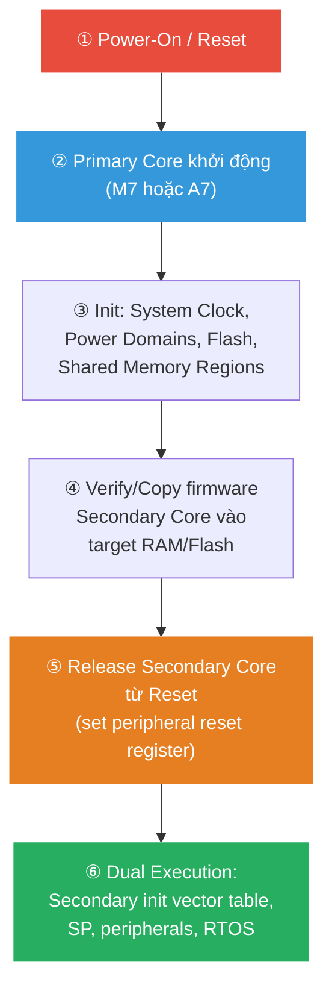

# <span style="color:#f1c40f">Chương 16: Hệ thống Đa Lõi và Đa Vi xử lý</span>
# <span style="color:#f1c40f">Multi-Processor and Multi-Core Systems</span>

> [!TIP]
> Dùng **Ctrl+F** và tìm `## 1.`, `## 2.`, `## 3.` để nhảy nhanh đến từng mục.

```
 1. Phân biệt Multi-Core vs Multi-Processor
 2. Hệ thống Multi-Core                — Heterogeneous vs Homogeneous
    ├─ 2.1 Heterogeneous               — Cortex-M0+ & M4, Cortex-A & M, 5 use cases
    └─ 2.2 Homogeneous                 — SMP, đa lõi giống nhau
 3. Hệ thống Multi-Processor           — Distributed, Parallel Dev, Reuse, High-Reliability
 4. Giao tiếp Liên Vi xử lý (IPC)     — Shared RAM, Mailbox, HSEM, OpenAMP, RPMsg
    ├─ 4.1 Hardware IPC                — HSEM, IPCC, Shared SRAM, Cache Coherency
    ├─ 4.2 Software IPC                — OpenAMP, RPMsg, UART Bridge
    └─ 4.3 Bảng 7 chuẩn giao tiếp     — CAN, Ethernet, I2C, LIN, Modbus, SPI, USB
 5. AMP vs SMP                         — Bảng so sánh, FreeRTOS considerations
 6. Quy trình Boot & Phân vùng Tài nguyên
 7. Chọn Multi-Core hay Multi-Processor?
 8. Tổng kết & Câu hỏi Ôn tập
```

> [!NOTE]
> Chương này **không có code listing** — tập trung vào kiến trúc hệ thống, patterns thiết kế, và tiêu chí lựa chọn.

---

## <span style="color:#e67e22">1. Phân biệt Multi-Core vs Multi-Processor</span>

```
┌─────────────────────────────────────────────────────────────────┐
│                        MULTI-CORE                                │
│  ┌───────────────────────────────────────────────────┐          │
│  │              Một chip IC duy nhất                  │          │
│  │  ┌─────────┐ ┌─────────┐ ┌─────────┐            │          │
│  │  │ Core 0  │ │ Core 1  │ │ Core N  │            │          │
│  │  │ (M4)    │ │ (M0+)   │ │ (...)   │            │          │
│  │  └────┬────┘ └────┬────┘ └────┬────┘            │          │
│  │       └───────────┼───────────┘                   │          │
│  │            Shared On-Chip SRAM                     │          │
│  └───────────────────────────────────────────────────┘          │
│  → Latency cực thấp, footprint nhỏ, ít modular                 │
└─────────────────────────────────────────────────────────────────┘

┌─────────────────────────────────────────────────────────────────┐
│                      MULTI-PROCESSOR                             │
│  ┌──────────┐    Bus     ┌──────────┐    Bus     ┌──────────┐  │
│  │  MCU #1  │◄──────────►│  MCU #2  │◄──────────►│  MCU #3  │  │
│  │ (Chip A) │ CAN/SPI/   │ (Chip B) │ Ethernet/  │ (Chip C) │  │
│  └──────────┘  UART      └──────────┘   I2C      └──────────┘  │
│  → Nhiều IC riêng biệt, cùng PCB hoặc phân tán                 │
│  → Latency cao hơn, modular cao, reuse tốt                     │
└─────────────────────────────────────────────────────────────────┘
```

| Tiêu chí | Multi-Core | Multi-Processor |
|:---|:---|:---|
| **Vật lý** | 1 chip IC, nhiều CPU core bên trong | Nhiều chip IC riêng biệt |
| **PCB footprint** | Cực gọn, tích hợp cao | Cần nhiều diện tích PCB + dây nối |
| **Latency liên lõi** | **Cực thấp** — shared SRAM + Mailbox on-chip | Cao hơn — qua bus serial/parallel bên ngoài |
| **Modular / Reuse** | Gắn với silicon cụ thể | ✅ Cao — subsystem tái sử dụng giữa các sản phẩm |

---

## <span style="color:#e67e22">2. Hệ thống Multi-Core — Exploring Multi-Core Systems</span>

### <span style="color:#1abc9c">2.1 Heterogeneous — Đa lõi Không đồng nhất</span>

**Heterogeneous** = 2+ lõi CPU **khác nhau** về kiến trúc hoặc cách truy cập tài nguyên hệ thống.

#### <span style="color:#3498db">Ví dụ phần cứng</span>

| Chip | Lõi | Đặc điểm |
|:---|:---|:---|
| **NXP LPC54100** | Cortex-M0+ + Cortex-M4 (150 MHz) | Peripheral giống nhau, nhưng instruction/data bus chỉ M4 có |
| **NXP i.MX8** | 2× Cortex-A72 + 4× A53 + 2× M4F + DSP + 2× GPU | Hệ thống cực phức tạp — từ AI đến real-time |
| **STM32H7 Dual** | Cortex-M7 (480 MHz) + Cortex-M4 (240 MHz) | M4 cho real-time, M7 cho DSP/GUI. IPC qua HSEM + Shared SRAM |
| **STM32MP1** | 2× Cortex-A7 (Linux SMP) + Cortex-M4 (FreeRTOS AMP) | MPU/MCU hybrid. IPC qua IPCC + OpenAMP + RPMsg |

#### <span style="color:#3498db">5 Use Cases chính của Heterogeneous</span>

##### ① Tách Real-Time khỏi General-Purpose

```
┌──────────────────┐         ┌──────────────────────────┐
│   Cortex-M4      │  IPC    │     Cortex-A / M7        │
│   (Real-Time)    │◄───────►│   (General-Purpose)      │
│                  │ Shared  │                          │
│  • Motor H-bridge│  SRAM   │  • GUI / Touchscreen     │
│  • Encoder pulse │  HSEM   │  • Web server / IoT      │
│  • PWM dead-time │  IPCC   │  • ML / Computer Vision  │
│  • ADC sampling  │         │  • File system / Network │
│  Deadline: µs    │         │  Deadline: ms ~ s        │
└──────────────────┘         └──────────────────────────┘
```

> [!IMPORTANT]
> **Tại sao tách?** Lõi chạy GPOS (Linux) **không thể đảm bảo deadline µs** vì scheduler non-deterministic, GC, page fault. Lõi MCU (FreeRTOS/bare-metal) giữ hard real-time.

##### ② Thiết kế Tiết kiệm Năng lượng (Power-Conscious)

* Lõi tiêu thụ thấp (M0+) luôn bật — xử lý sensor, IO nhẹ.
* Lõi mạnh (M4/A-series) **chỉ thức khi cần** tính toán nặng → tiết kiệm pin.

##### ③ Mở rộng Ứng dụng Legacy ("Facelift")

```
┌──────────────────────┐  Internal   ┌──────────────────────┐
│   Core 0             │    UART     │   Core 1             │
│   Legacy Bare-Metal  │◄──────────►│   RTOS (New)         │
│   (KHÔNG SỬA CODE!)  │  TX/RX     │                      │
│                      │            │  • IoT connectivity   │
│   Code cũ, đã       │            │  • GUI touchscreen    │
│   certified, ổn định │            │  • Web dashboard      │
└──────────────────────┘            └──────────────────────┘
```

> [!TIP]
> **Pattern "Don't Touch Legacy"**: Giữ nguyên firmware cũ đã verified trên 1 lõi. Thêm tính năng mới (IoT, GUI) trên lõi khác. 2 lõi giao tiếp qua UART/Shared Memory — **zero risk** cho code legacy.

##### ④ Hệ thống Hard Real-Time Đòi hỏi Cao

Ví dụ i.MX8: M4 cores xử lý sensor/actuator latency thấp → truyền data lên A72/A53 cho AI/Vision → kết quả trả về M4 để điều khiển.

##### ⑤ Không chỉ Embedded!

> [!NOTE]
> Heterogeneous architecture xuất hiện khắp nơi: **big.LITTLE** (ARM), **CPU+GPU** (desktop/mobile), **CPU+TPU** (Google Edge), **CPU+FPGA** (Xilinx Zynq). Nguyên tắc giống nhau — tách workload theo đặc thù xử lý.

---

### <span style="color:#1abc9c">2.2 Homogeneous — Đa lõi Đồng nhất</span>

**Homogeneous** = Nhiều lõi CPU **giống hệt nhau**, có thể hoán đổi vai trò.

* Ví dụ: Quad-core Cortex-A53, Dual Cortex-A7.
* Thường chạy **SMP** — 1 OS kernel quản lý tất cả lõi, task được schedule lên bất kỳ lõi nào.

---

## <span style="color:#e67e22">3. Hệ thống Multi-Processor — Exploring Multi-Processor Systems</span>

### <span style="color:#1abc9c">3.1 Bốn Lý do Dùng Multi-Processor</span>

#### <span style="color:#3498db">① Distributed Systems — Hệ phân tán</span>

```
┌────────┐         ┌────────┐         ┌────────┐
│ MCU #1 │  CAN    │ MCU #2 │  CAN    │ MCU #3 │
│ Sensor │◄──────►│ Motor  │◄──────►│ Master │
│ (gần   │  Bus   │ Driver │  Bus   │ Control│
│ nguồn) │        │ (gần   │        │        │
└────────┘        │ motor) │        └────────┘
                  └────────┘
```

> [!IMPORTANT]
> **Lý do chính**: Đặt MCU **ngay cạnh sensor/actuator** để:
> * **Số hóa tín hiệu analog ngay tại nguồn** → giảm dây dẫn dài chịu nhiễu.
> * Giảm **EMI phát xạ** từ dây analog dài.
> * Giảm điểm lỗi cơ học trong môi trường rung lắc.

#### <span style="color:#3498db">② Parallel Development — Phát triển Song song</span>

* Chia sản phẩm phức tạp thành **subsystem module** — mỗi module có MCU riêng.
* Các team phát triển **độc lập**, chỉ thống nhất **giao diện bus** (CAN message ID, SPI protocol, UART frame format).
* Giống microservice architecture trong phần mềm.

#### <span style="color:#3498db">③ Design Reuse — Tái sử dụng Thiết kế</span>

* Khi hết chân MCU (pin capacity limits) → thêm MCU phụ thay vì đổi sang MCU lớn hơn.
* Module đã thiết kế (ví dụ: CAN motor driver board) có thể **tái sử dụng** ở sản phẩm khác.

#### <span style="color:#3498db">④ High-Reliability Lockstep — Độ tin cậy Cao</span>

```
┌──────────┐     ┌──────────┐
│ MCU #1   │     │ MCU #2   │    So sánh output:
│ (Primary)│────►│(Redundant│───► Nếu khác nhau → Self-test → Reset
│ Code X   │     │ Code X)  │    Nếu giống nhau → Output hợp lệ
└──────────┘     └──────────┘
```

* 2 MCU chạy **cùng code**, so sánh output.
* Nếu kết quả khác nhau (do nhiễu EMI, cosmic ray, lỗi silicon) → **self-test & reset**.
* Dùng trong: automotive safety (ASIL-D), avionics, space systems.

---

## <span style="color:#e67e22">4. Giao tiếp Liên Vi xử lý — Inter-Processor Communication (IPC)</span>

### <span style="color:#1abc9c">4.1 Hardware IPC — Cơ chế Phần cứng</span>

#### <span style="color:#3498db">Shared SRAM + Hardware Mutex (HSEM)</span>

```
┌────────────────────────────────────────────────────────┐
│                    Shared SRAM                          │
│  ┌──────────────────────────────────────┐              │
│  │  Ring Buffer / Message Struct        │              │
│  │  [Header][Payload][CRC]              │              │
│  └──────────────────────────────────────┘              │
│          ▲                    ▲                         │
│          │ Write              │ Read                    │
│    ┌─────┴─────┐        ┌────┴──────┐                  │
│    │  Core A   │  HSEM  │  Core B   │                  │
│    │  (Writer) │◄──────►│  (Reader) │                  │
│    └───────────┘  Lock  └───────────┘                  │
└────────────────────────────────────────────────────────┘
```

| Thành phần | Chức năng |
|:---|:---|
| **HSEM (Hardware Semaphore)** | Atomic read-modify-write ở mức hardware — **không race condition** giữa các core |
| **Inter-Core Interrupt** | Core A ghi data xong → trigger interrupt sang Core B → Core B biết có data mới |
| **IPCC** | Hardware block chuyên dụng cung cấp signaling channels + interrupt lines giữa cores |

#### <span style="color:#3498db">Cache Coherency — Vấn đề Quan trọng</span>

> [!CAUTION]
> **Khi core có L1/L2 cache** (Cortex-A, Cortex-M7) chia sẻ memory với core **không cache** (M4, M0+):
> * Core M7 ghi data vào cache → Core M4 đọc SRAM → **thấy data cũ** (stale data)!
> * **Giải pháp**: Flush/Invalidate data cache trước khi giao tiếp, hoặc đánh dấu shared memory region là **Non-Cacheable** trong MPU config.

---

### <span style="color:#1abc9c">4.2 Software IPC — Framework Phần mềm</span>

#### <span style="color:#3498db">OpenAMP & RPMsg</span>

| Framework | Mô tả |
|:---|:---|
| **OpenAMP** | Framework chuẩn cho AMP — cung cấp lifecycle management, resource table, remoteproc |
| **RPMsg** | Messaging protocol dựa trên **virtio** — message queue qua shared memory + inter-core interrupt |

```
Cortex-A7 (Linux)                    Cortex-M4 (FreeRTOS)
┌──────────────┐                    ┌──────────────┐
│  Linux App   │     RPMsg          │  RTOS Task   │
│  (rpmsg_dev) │◄──────────────────►│  (endpoint)  │
│              │  Shared SRAM       │              │
│  remoteproc  │  + IPCC IRQ        │  OpenAMP lib │
└──────────────┘                    └──────────────┘
```

> [!NOTE]
> **STM32MP1** dùng OpenAMP/RPMsg làm IPC chính giữa Linux (Cortex-A7 SMP) và FreeRTOS (Cortex-M4 AMP). ST cung cấp sẵn middleware package trong STM32CubeMP1.

#### <span style="color:#3498db">UART Bridge — IPC đơn giản nhất</span>

Dùng UART nội bộ (internal) hoặc ngoại vi giữa 2 core/chip:
* Core 0 gửi ASCII/binary command → Core 1 parse và phản hồi.
* Phù hợp cho **Legacy Extension** pattern — core legacy đã có UART interface sẵn.

---

### <span style="color:#1abc9c">4.3 Bảng 7 Chuẩn Giao tiếp Liên Vi xử lý</span>

| Giao thức | Determinism | Throughput | Ưu điểm chính | Use Case |
|:---|:---|:---|:---|:---|
| **CAN** | ⭐ Cao (arbitration ưu tiên) | 8B/frame (Classic) | Robust, multi-master, automotive | Xe hơi, công nghiệp |
| **Ethernet** | ⚠️ Biến đổi (stack-dependent) | Rất cao (100Mbps–1Gbps+) | TCP/UDP, high-data | Gateway, HMI, IoT |
| **I²C** | ⚠️ Thấp (clock stretching) | Thấp (100kHz–3.4MHz) | Ít dây (2 wire), chip-to-chip | Sensor readout |
| **LIN** | ⭐ Cao (single master) | 8B/frame | Giá rẻ, up to 16 nodes | Automotive phụ trợ |
| **Modbus** | 🔸 Trung bình | Trung bình (RS-485/TCP) | Register-oriented, legacy | Công nghiệp, SCADA |
| **SPI** | ⭐⭐ Rất cao (master driven) | Cao (theo SPI clock) | Real-time nghiêm ngặt | ADC, DAC, FPGA |
| **USB** | ⭐ Cao (Interrupt EP) / ⚠️ (Bulk) | Cao (1KB/125µs interrupt) | Scheduling có sẵn, phổ biến | PC interface, debug |

> [!WARNING]
> **Đừng chọn bus theo throughput cao nhất!** Phải cân nhắc: **Determinism**, **latency/jitter**, **error detection**, **khoảng cách vật lý**, **noise immunity**, **số dây**, **protocol overhead**. Bus throughput cao (Ethernet) thường đổi bằng latency cao + protocol phức tạp.

---

## <span style="color:#e67e22">5. AMP vs SMP — Asymmetric vs Symmetric Multi-Processing</span>

### <span style="color:#1abc9c">5.1 Bảng So sánh</span>

| Thuộc tính | AMP (Asymmetric) | SMP (Symmetric) |
|:---|:---|:---|
| **Kiến trúc lõi** | Heterogeneous HOẶC Homogeneous | **Chỉ Homogeneous** (lõi giống nhau) |
| **Kernel / OS** | Nhiều OS instance độc lập (hoặc OS + Bare-Metal) | **1 OS kernel duy nhất** quản lý tất cả lõi |
| **Lập lịch Task** | Gán cứng task vào lõi cụ thể | Scheduler tự động phân task lên lõi nào rảnh |
| **Bộ nhớ** | Stack/Heap riêng biệt mỗi lõi; cần IPC cho shared RAM | Không gian nhớ thống nhất |
| **Determinism** | ✅ Cao — mỗi lõi kiểm soát riêng | ⚠️ Biến đổi — cross-core scheduling + mutex locking |
| **Firmware** | Binary riêng cho mỗi lõi | 1 binary duy nhất |

### <span style="color:#1abc9c">5.2 FreeRTOS trên Multi-Core</span>

#### <span style="color:#3498db">FreeRTOS + AMP (Phổ biến)</span>

* Mỗi lõi chạy **1 instance FreeRTOS độc lập** — vector table, memory map, stack, heap riêng.
* **Không tự động migrate task** giữa các lõi.
* Đồng bộ liên lõi: Hardware Mailbox, Shared Memory Queue, IPC protocol.

```
┌──────────────────────┐    ┌──────────────────────┐
│      Core 0 (M4)     │    │      Core 1 (M7)     │
│  ┌────────────────┐  │    │  ┌────────────────┐  │
│  │  FreeRTOS #1   │  │    │  │  FreeRTOS #2   │  │
│  │  ┌──────────┐  │  │    │  │  ┌──────────┐  │  │
│  │  │ Task A   │  │  │    │  │  │ Task X   │  │  │
│  │  │ Task B   │  │  │    │  │  │ Task Y   │  │  │
│  │  └──────────┘  │  │    │  │  └──────────┘  │  │
│  │  Own Heap/Stack│  │    │  │  Own Heap/Stack│  │
│  └────────────────┘  │    │  └────────────────┘  │
│  Private Flash/RAM   │    │  Private Flash/RAM   │
└──────────┬───────────┘    └───────────┬──────────┘
           │         Shared SRAM        │
           └───────────┬────────────────┘
                       │
                  HSEM / IPCC
```

#### <span style="color:#3498db">FreeRTOS + SMP (Nâng cao)</span>

* 1 FreeRTOS kernel quản lý nhiều lõi giống nhau (ví dụ: dual Cortex-M33).
* **Yêu cầu**:
  * FreeRTOS port SMP-capable.
  * Atomic assembly primitives (`LDREX`/`STREX`).
  * Kernel critical section phải lock **tất cả lõi** → cần fine-grained locking để tránh CPU contention.
  * **Task Affinity** nếu cần pin task vào lõi cụ thể.

---

## <span style="color:#e67e22">6. Quy trình Boot & Phân vùng Tài nguyên</span>

### <span style="color:#1abc9c">6.1 Phân vùng Tài nguyên (Resource Partitioning)</span>

```
┌──────────────────────────────────────────────────────────┐
│                        Flash                              │
│  ┌────────────────────┐  ┌────────────────────┐          │
│  │  Core 0 Firmware   │  │  Core 1 Firmware   │          │
│  │  (Sector 0–3)      │  │  (Sector 4–7)      │          │
│  └────────────────────┘  └────────────────────┘          │
├──────────────────────────────────────────────────────────┤
│                         RAM                               │
│  ┌──────────┐  ┌──────────┐  ┌───────────────────┐      │
│  │ Core 0   │  │ Core 1   │  │   Shared RAM      │      │
│  │ Private  │  │ Private  │  │   (IPC Buffers)   │      │
│  │ Stack    │  │ Stack    │  │   Ring Buffer     │      │
│  │ Heap     │  │ Heap     │  │   Message Struct  │      │
│  │ .bss     │  │ .bss     │  │                   │      │
│  └──────────┘  └──────────┘  └───────────────────┘      │
├──────────────────────────────────────────────────────────┤
│                     Peripherals                           │
│  Core 0 owns: Timer, PWM, ADC    │  Core 1 owns: ETH,   │
│               Encoder, GPIO      │    USB, Display, UART │
└──────────────────────────────────────────────────────────┘
```

### <span style="color:#1abc9c">6.2 Boot Sequence — Trình tự Khởi động</span>



> [!IMPORTANT]
> **Secondary Core bị giữ trong Reset** cho đến khi Primary Core hoàn tất:
> 1. Cấu hình clock và power domain.
> 2. Thiết lập shared memory regions.
> 3. Copy/verify firmware secondary vào RAM thực thi.
> 4. Mới release reset cho secondary core.
>
> Nếu secondary khởi động trước khi shared memory sẵn sàng → **undefined behavior**.

---

## <span style="color:#e67e22">7. Chọn Multi-Core hay Multi-Processor?</span>

### <span style="color:#1abc9c">7.1 Khi nào dùng Multi-Core MCU</span>

* ✅ Cần **latency liên lõi cực thấp** (shared SRAM + HSEM).
* ✅ Tách **hard real-time** (M4) khỏi **GUI/IoT** (M7/A-series) trên cùng 1 chip.
* ✅ Cần giữ **footprint PCB nhỏ** — 1 chip thay vì 2+ chip.
* ✅ **Power-conscious** — 1 lõi ngủ, 1 lõi thức.

### <span style="color:#1abc9c">7.2 Khi nào dùng Multi-Processor</span>

* ✅ Cần đặt MCU **gần sensor/actuator** vật lý → giảm EMI, tăng noise immunity.
* ✅ **Parallel team development** — mỗi team phát triển subsystem riêng.
* ✅ **Design reuse** — module board tái sử dụng giữa sản phẩm.
* ✅ **High-reliability lockstep** — 2 MCU chạy cùng code, so sánh output.
* ✅ Hết chân MCU (pin limits) → thêm MCU phụ thay vì đổi MCU lớn hơn.
* ✅ Mở rộng hệ thống legacy mà **không sửa firmware cũ**.

---

## <span style="color:#e67e22">8. Tổng kết & Câu hỏi Ôn tập</span>

### <span style="color:#1abc9c">8.1 Key Takeaways</span>

* **Multi-Core** = 1 chip, nhiều lõi, shared SRAM → latency thấp, footprint nhỏ.
* **Multi-Processor** = nhiều chip, bus ngoài → modular cao, reuse tốt, đặt gần sensor.
* **Heterogeneous** = lõi khác nhau (M0+/M4/M7/A7) → tách workload theo đặc thù (real-time vs GUI).
* **AMP** = mỗi lõi chạy OS/firmware riêng. **SMP** = 1 OS quản lý nhiều lõi giống nhau.
* **IPC Hardware**: HSEM (hardware mutex), IPCC (signaling channels), Shared SRAM, Inter-Core Interrupt.
* **IPC Software**: OpenAMP + RPMsg (chuẩn Linux ↔ RTOS), UART Bridge (đơn giản nhất).
* **Cache Coherency**: Shared memory giữa lõi có cache (M7) và lõi không cache (M4) cần flush/invalidate hoặc đánh dấu Non-Cacheable.
* **Boot**: Primary core khởi động trước, init shared resources, rồi mới release secondary core.
* **Chọn bus IPC**: ĐỪNG chọn theo throughput — cân nhắc determinism, latency, noise immunity, khoảng cách.

---

### <span style="color:#1abc9c">8.2 Câu hỏi Ôn tập Cuối Chương</span>

> [!NOTE]
> **4 câu hỏi từ sách**:

#### **Câu 1**: "Multi-core architecture và multi-processor architecture khác nhau thế nào?"
* **Đáp án**: **Multi-core** = 1 chip IC chứa nhiều CPU core chia sẻ bộ nhớ on-chip. **Multi-processor** = nhiều chip IC riêng biệt, cùng PCB hoặc phân tán, kết nối qua bus giao tiếp.

#### **Câu 2**: "Trong AMP, có thể dùng mix OS + bare-metal trên các core khác nhau?"
* **Đáp án: TRUE ✅**
* Trong AMP, mỗi lõi hoạt động **độc lập** — có thể chạy bare-metal trên 1 lõi và FreeRTOS (hoặc Linux) trên lõi khác.

#### **Câu 3**: "Khi chọn bus giao tiếp liên vi xử lý, luôn nên chọn bus có tốc độ truyền cao nhất?"
* **Đáp án: FALSE ❌**
* Phải cân nhắc **nhiều yếu tố**: determinism, latency, jitter, error detection, khoảng cách vật lý, noise immunity, số dây, độ phức tạp protocol. Throughput cao thường đánh đổi bằng latency cao + overhead lớn.

#### **Câu 4**: "Multi-processor nên tránh dùng vì thêm độ phức tạp?"
* **Đáp án: KHÔNG ❌**
* Mặc dù thêm complexity, multi-processor cung cấp lợi ích quan trọng: **localization sensor** (giảm EMI), **noise immunity**, **fault redundancy**, **subsystem reuse**, **parallel development**.

---

## <span style="color:#e67e22">9. Tài liệu Tham khảo</span>

* **NXP AN11609** — LPC5410x Dual Core Usage: `https://www.nxp.com/docs/en/data-sheet/LPC5410X.pdf`
* **Keil USB Concepts**: `https://www.keil.com/pack/doc/mw/USB/html/_u_s_b__concepts.html`
* **STM32H7 Dual-Core**: `https://www.st.com/en/microcontrollers-microprocessors/stm32h7-series.html`
* **STM32MP1 OpenAMP**: `https://wiki.st.com/stm32mpu/wiki/OpenAMP_overview`
