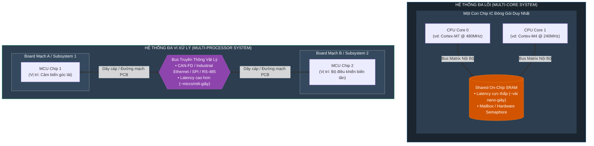
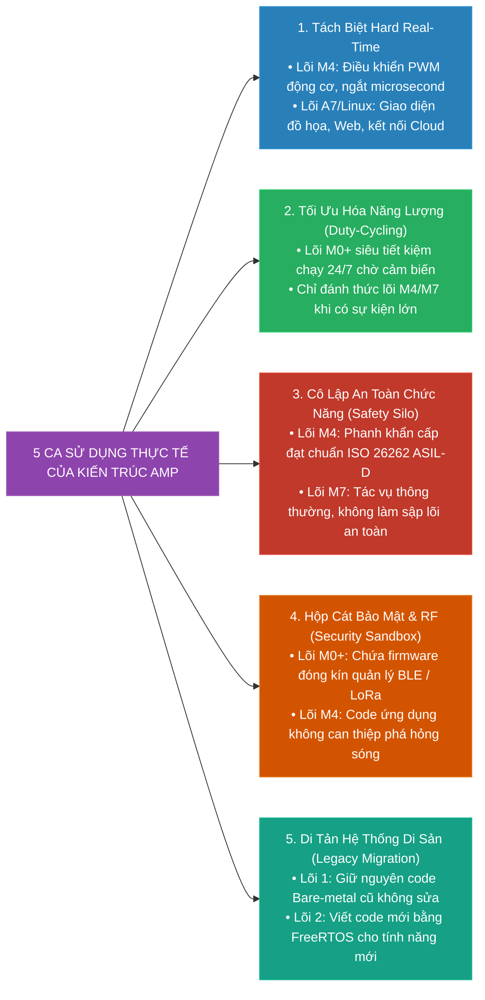
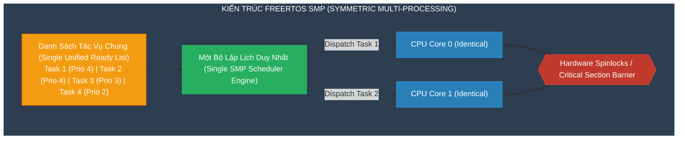
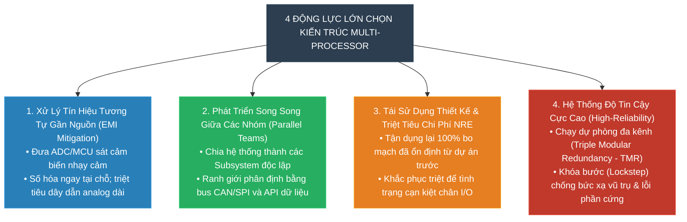
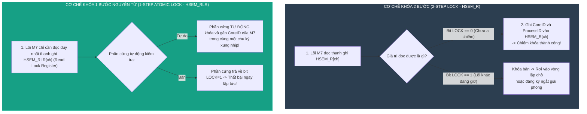
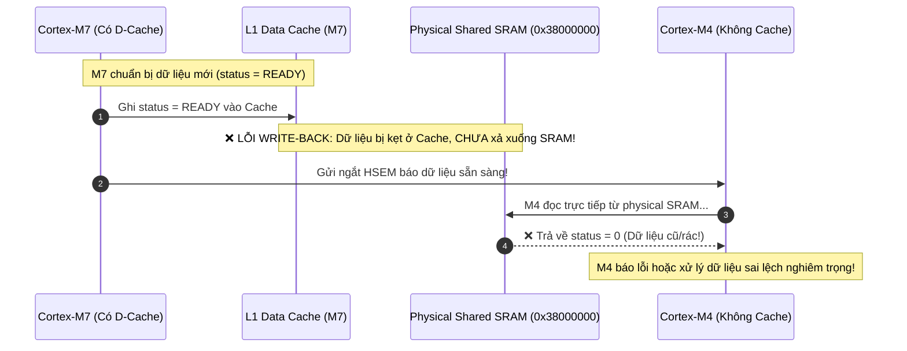
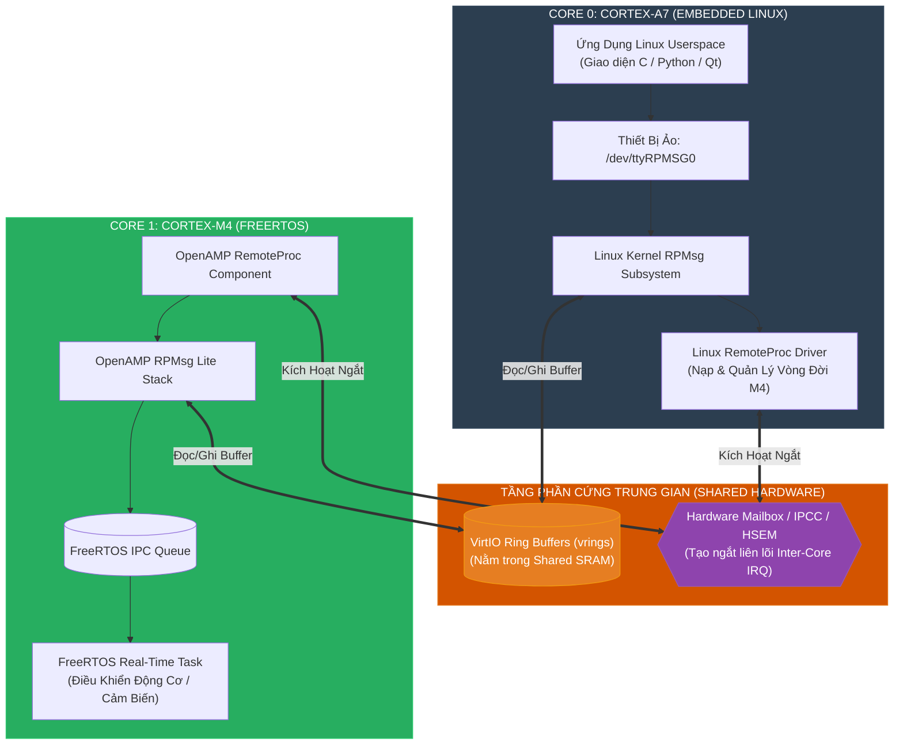
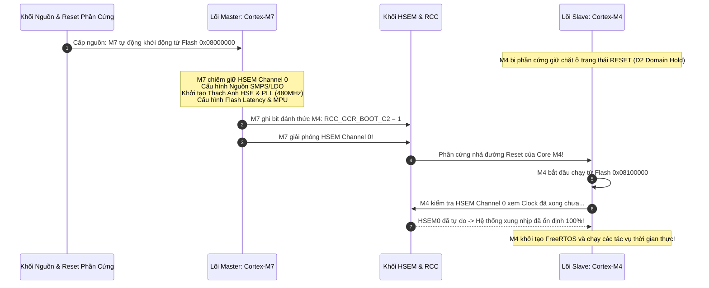
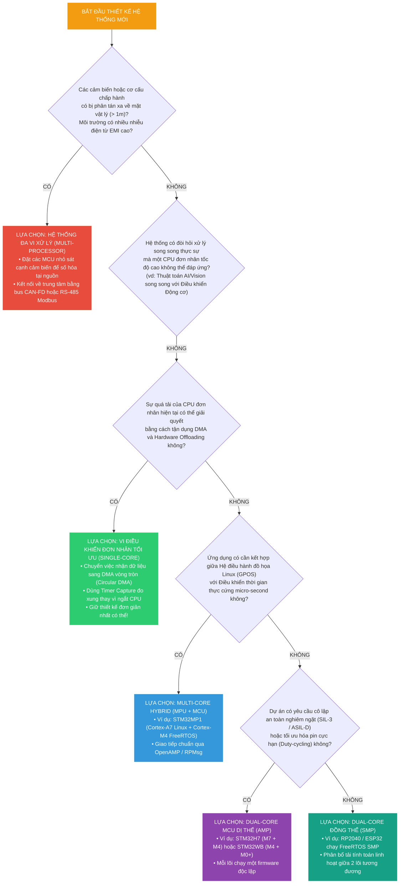
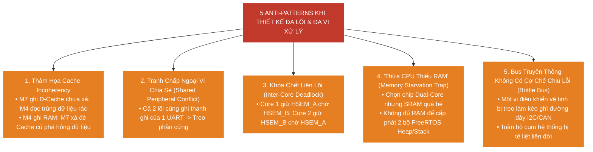

# <span style="color:#f1c40f">Chương 14: Hệ Thống Đa Lõi & Đa Vi Xử Lý (Multi-Processor and Multi-Core Systems)</span>

> **Tài liệu tham khảo chuyên sâu kết hợp:**
> - 📘 *Hands-On RTOS with Microcontrollers* – Brian Amos (Chapter 16: *Multi-Processor and Multi-Core Systems*, tr. 406–429).
> - 📙 *STMicroelectronics Architecture Manuals* (STM32H7 Dual-Core Cortex-M7/M4, STM32MP1 Dual-Core Cortex-A7/M4, STM32WB Cortex-M4/M0+).
> - 📗 *OpenAMP Framework & FreeRTOS SMP Specifications* (VirtIO, RPMsg, RemoteProc, Cache Coherency & Spinlocks).

---

```text
MỤC LỤC CHUYÊN SÂU (TABLE OF CONTENTS)
├── 1. Phân Biệt Nền Tảng: Multi-Core vs Multi-Processor vs Multi-Die (Chiplet)
│   ├── 1.1 Khái Niệm Cốt Lõi: Đa Lõi (Multi-Core) vs Đa Vi Xử Lý (Multi-Processor)
│   ├── 1.2 Bảng Đối Đầu 8 Tiêu Chí Phần Cứng: Multi-Core vs Multi-Processor
│   └── 1.3 Xu Hướng Đóng Gói Hiện Đại: Multi-Die, System-in-Package (SiP) & Chiplets
├── 2. Khám Phá Hệ Thống Multi-Core: Kiến Trúc Bất Đối Xứng (AMP) vs Đối Xứng (SMP)
│   ├── 2.1 Hệ Thống Đa Lõi Dị Thể (Heterogeneous Multi-Core): Bản Chất Asymmetric (AMP)
│   ├── 2.2 Ba Hình Mẫu Đa Lõi Tiêu Biểu Trong Công Nghiệp:
│   │   ├── 2.2.1 Dual MCU Cores: Cortex-M7 + Cortex-M4 (STM32H747/757) / M4 + M0+ (LPC54100, STM32WB)
│   │   ├── 2.2.2 MPU + MCU Hybrid: Cortex-A7 (Linux GPOS) + Cortex-M4 (FreeRTOS) (STM32MP1)
│   │   └── 2.2.3 Siêu Vi Xử Lý Tính Toán Cao: Cortex-A72/A53 + Dual M4F + DSP + Dual GPU (NXP i.MX8)
│   ├── 2.3 Năm Ca Sử Dụng Thực Tế (Industrial Use Cases) Của Kiến Trúc AMP:
│   │   ├── 2.3.1 Tách Biệt Hard Real-Time Khỏi Tác Vụ Tính Toán Chung / Giao Diện Người Dùng (GUI)
│   │   ├── 2.3.2 Tối Ưu Hóa Năng Lượng Cực Hạn (Ultra-Low Power Duty-Cycling)
│   │   ├── 2.3.3 Phân Vùng Chứng Nhận An Toàn Chức Năng (Safety Silo: IEC 61508 / ISO 26262)
│   │   ├── 2.3.4 Cô Lập Driver Mạng & Ngăn Xếp Không Dây (Security Sandbox / RF Isolation)
│   │   └── 2.3.5 Nâng Cấp Hệ Thống Di Sản Không Cần Đập Đi Xây Lại (Legacy Migration)
│   └── 2.4 Hệ Thống Đa Lõi Đồng Thể (Homogeneous Multi-Core): Bản Chất Symmetric (SMP)
│       ├── 2.4.1 Cơ Chế Điều Phối Đơn Kernel Của FreeRTOS SMP (Single Kernel Multi-Core)
│       └── 2.4.2 Đồng Bộ Hóa Đa Lõi Bằng Khóa Xoay Phần Cứng (Spinlocks)
├── 3. Khám Phá Hệ Thống Multi-Processor: Phân Tán & Phân Cụm (Distributed Systems)
│   ├── 3.1 Bốn Động Lực Lớn Khi Lựa Chọn Kiến Trúc Đa Vi Xử Lý:
│   │   ├── 3.1.1 Xử Lý Tín Hiệu Tương Tự Gần Nguồn & Triệt Tiêu Nhiễu Điện Từ (EMI Mitigation)
│   │   ├── 3.1.2 Phát Triển Phần Mềm Song Song Theo Module Độc Lập (Parallel Engineering Teams)
│   │   ├── 3.1.3 Tái Sử Dụng Khối Chức Năng (Subsystem Reuse) & Triệt Tiêu Chi Phí NRE
│   │   └── 3.1.4 Hệ Thống Độ Tin Cậy Cực Cao (High-Reliability, Triple Modular Redundancy - TMR & Lockstep)
│   └── 3.2 Những Đánh Đổi Kỹ Thuật Bắt Buộc (Latency, Custom Protocols, Pin Counts & BOM)
├── 4. Cơ Chế Giao Tiếp Liên Lõi & Liên Bộ Xử Lý (Inter-Processor Communication - IPC)
│   ├── 4.1 Phần Cứng Đồng Bộ Hóa On-Chip (Hardware IPC Mechanisms):
│   │   ├── 4.1.1 Khóa Semaphore Phần Cứng (Hardware Semaphores - HSEM): 2-Step Lock vs 1-Step Lock
│   │   ├── 4.1.2 Bộ Điều Khiển Liên Lạc Liên Bộ Xử Lý (IPCC) & Hộp Thư Ngắt Phần Cứng (Mailbox IRQ)
│   │   ├── 4.1.3 Vùng Nhớ Chia Sẻ On-Chip (Shared SRAM: D3 SRAM4, RAM_D2 & Linker Placement)
│   │   └── 4.1.4 Thách Thức Tính Nhất Quán Bộ Nhớ Đệm (Cache Coherency: D-Cache Clean & Invalidate)
│   ├── 4.2 Giao Thức Phần Mềm Chuẩn Công Nghiệp (Software IPC Frameworks):
│   │   ├── 4.2.1 Khung Làm Việc OpenAMP (Open Asymmetric Multi-Processing Framework)
│   │   ├── 4.2.2 Cấu Trúc Hàng Đợi Bộ Nhớ Ảo VirtIO (VirtIO Ring Buffers: Descriptors, Avail, Used)
│   │   ├── 4.2.3 Cơ Chế Gửi Thông Điệp RPMsg (Remote Processor Messaging Architecture)
│   │   └── 4.2.4 Cầu Nối Nối Tiếp (Serial Bridge Pattern: UART/SPI) Cho Hệ Thống Di Sản
│   └── 4.3 Bảng So Sánh Toàn Diện 7 Chuẩn Giao Tiếp Ngoại Vi (Inter-Processor Buses):
│       └── CAN/CAN-FD, Ethernet/TSN, I2C, LIN, Modbus, SPI (Slave Timing Constraint), USB
├── 5. Quy Trình Khởi Động (Boot Sequence) & Phân Chia Tài Nguyên Hệ Thống
│   ├── 5.1 Kịch Bản Khởi Động: Master-Slave Boot vs Khởi Động Độc Lập
│   ├── 5.2 Phân Quyền Ngoại Vi & Cô Lập Bus Matrix (Bus Master Access Control)
│   └── 5.3 Chia Sẻ Bộ Định Thời Xung Nhịp (Clock Generation & Reset Management)
├── 6. Triển Khai Thực Chiến: Mã Nguồn C Cấu Hình Dual-Core STM32H7 (Cortex-M7 & Cortex-M4)
│   ├── 6.1 Khởi Tạo HSEM & Đồng Bộ Khởi Động Giữa Core M7 và Core M4
│   ├── 6.2 Cấu Hình Vùng Nhớ Shared SRAM Không Cache (Non-Cacheable) Qua MPU
│   └── 6.3 Hàng Đợi Thông Điệp Vòng Tròn Không Khóa (Lock-Free Ring Buffer) Đa Lõi
├── 7. Ma Trận Quyết Định Kiến Trúc: Đơn Lõi vs Đa Lõi vs Đa Vi Xử Lý
│   ├── 7.1 Cây Quyết Định Lựa Chọn Kiến Trúc 5 Tầng (Architectural Decision Tree)
│   └── 7.2 Giải Pháp Thay Thế: DMA & Ngoại Vi Phần Cứng Chuyên Biệt (Hardware Offloading)
├── 8. Năm Sai Lầm Nghiêm Trọng (Anti-Patterns) Trong Thiết Kế Hệ Thống Đa Xử Lý
├── 9. Lời Giải Toàn Diện Toàn Bộ Câu Hỏi Đánh Giá Sách Brian Amos (Chapter 16 Assessments)
└── 10. Bảng Tổng Hợp Kiến Thức Cốt Lõi (Key Takeaways Summary Matrix)
```

---

## <span style="color:#e67e22">1. Phân Biệt Nền Tảng: Multi-Core vs Multi-Processor vs Multi-Die (Chiplet)</span>

Trong suốt các chương trước, toàn bộ tư duy thiết kế hệ thống nhúng của chúng ta xoay quanh việc khai thác **một vi điều khiển đơn nhân (Single-Core MCU)**. Tuy nhiên, khi đối mặt với các bài toán công nghiệp phức tạp, các giới hạn vật lý bắt đầu xuất hiện:
- Khối lượng thuật toán xử lý tín hiệu số (DSP/AI) vượt quá khả năng tính toán của một CPU đơn lẻ.
- Kích thước cơ khí của hệ thống phân tán rộng hàng chục mét khiến các đường dây mang tín hiệu tương tự analog nhạy cảm bị nhiễu điện từ (EMI) tàn phá.
- Tiêu chuẩn an toàn chức năng quốc tế (ISO 26262 Automotive ASIL-D, IEC 61508 SIL-3) cấm đưa các tác vụ giao diện giải trí (Infotainment) chạy chung nhân với tác vụ phanh khẩn cấp ABS / kiểm soát động cơ.

Để giải quyết những thách thức này, kỹ sư bắt buộc phải mở rộng kiến trúc sang **hệ thống đa lõi (Multi-Core)** hoặc **hệ thống đa vi xử lý (Multi-Processor)**.

---

### <span style="color:#1abc9c">1.1 Khái Niệm Cốt Lõi: Đa Lõi (Multi-Core) vs Đa Vi Xử Lý (Multi-Processor)</span>

Tác giả Brian Amos nhấn mạnh việc làm rõ ranh giới khái niệm ngay từ đầu:


```mermaid
graph TD
    subgraph MC ["HỆ THỐNG ĐA LÕI (MULTI-CORE SYSTEM)"]
        subgraph CHIP ["Một Con Chip IC Đóng Gói Duy Nhất"]
            Core1["CPU Core 0<br/>(vd: Cortex-M7 @ 480MHz)"]
            Core2["CPU Core 1<br/>(vd: Cortex-M4 @ 240MHz)"]
            SRAM_SHARED[("Shared On-Chip SRAM<br/>• Latency cực thấp (~vài nano-giây)<br/>• Mailbox / Hardware Semaphore")]
            Core1 <==>|Bus Matrix Nội Bộ| SRAM_SHARED
            Core2 <==>|Bus Matrix Nội Bộ| SRAM_SHARED
        end
    end

    subgraph MP ["HỆ THỐNG ĐA VI XỬ LÝ (MULTI-PROCESSOR SYSTEM)"]
        subgraph PCB1 ["Board Mạch A / Subsystem 1"]
            MCU1["MCU Chip 1<br/>(Vị trí: Cảm biến góc lái)"]
        end
        subgraph PCB2 ["Board Mạch B / Subsystem 2"]
            MCU2["MCU Chip 2<br/>(Vị trí: Bộ điều khiển biến tần)"]
        end
        BUS{{"Bus Truyền Thông Vật Lý<br/>• CAN-FD / Industrial Ethernet / SPI / RS-485<br/>• Latency cao hơn (~micro/mili-giây)"}}
        MCU1 <==>|Dây cáp / Đường mạch PCB| BUS
        BUS <==>|Dây cáp / Đường mạch PCB| MCU2
    end

    style CHIP fill:#2c3e50,stroke:#34495e,color:#fff
    style MC fill:#1a252f,stroke:#2980b9,color:#fff
    style MP fill:#2c3e50,stroke:#27ae60,color:#fff
    style PCB1 fill:#34495e,stroke:#95a5a6,color:#fff
    style PCB2 fill:#34495e,stroke:#95a5a6,color:#fff
    style SRAM_SHARED fill:#d35400,stroke:#e67e22,color:#fff
    style BUS fill:#8e44ad,stroke:#9b59b6,color:#fff
```

1. **Hệ Thống Đa Lõi (Multi-Core)**: 
   - Là một vi mạch tích hợp (Integrated Circuit - IC) duy nhất, bên trong chứa từ **hai CPU trở lên** được khắc trên cùng một phiến bán dẫn (Die silicon) hoặc đặt chung trong cùng một vỏ đóng gói (Package).
   - Các lõi chia sẻ với nhau một phần hoặc toàn bộ không gian tài nguyên trên chip: **Shared SRAM, Bus Matrix nội bộ, Khối đồng bộ phần cứng (Hardware Semaphores/Mailbox), và các khối ngoại vi (Timers, GPIO, DMA)**.
2. **Hệ Thống Đa Vi Xử Lý (Multi-Processor)**:
   - Là hệ thống sử dụng **nhiều con chip IC riêng biệt**. Các chip này có thể nằm trên cùng một bo mạch in (PCBA) hoặc đặt trên các bo mạch hoàn toàn khác nhau phân tán khắp cơ cấu máy móc.
   - Các vi xử lý hoàn toàn không chia sẻ bus nội bộ hay bộ nhớ SRAM chung; chúng bắt buộc phải giao tiếp thông qua **các giao thức truyền thông vật lý bên ngoài (CAN bus, SPI, UART, I2C, Ethernet, LIN, USB)**.

---

### <span style="color:#1abc9c">1.2 Bảng Đối Đầu 8 Tiêu Chí Phần Cứng: Multi-Core vs Multi-Processor</span>

| Tiêu Chí Kỹ Thuật | Hệ Thống Đa Lõi (Multi-Core) | Hệ Thống Đa Vi Xử Lý (Multi-Processor) |
|---|---|---|
| **Cấu trúc vật lý** | **1 con chip IC duy nhất**. | **Nhiều con chip IC độc lập** (cùng hoặc khác PCB). |
| **Diện tích bo mạch (PCB Footprint)** | **Cực kỳ nhỏ gọn**, tiết kiệm diện tích bo mạch tối đa. | Chiếm diện tích lớn hơn; cần thêm đường mạch, đầu nối (connectors) và dây cáp. |
| **Độ trễ truyền thông liên xử lý (IPC Latency)** | **Cực thấp (Vài nano-giây đến micro-giây)** nhờ đọc/ghi trực tiếp vào Shared SRAM và kích hoạt ngắt nội bộ. | **Trung bình đến cao (Vài chục micro-giây đến mili-giây)** do giới hạn tốc độ baud rate của bus nối tiếp vật lý. |
| **Băng thông dữ liệu (Throughput)** | **Rất cao (Hàng trăm MB/s đến GB/s)** qua Bus Matrix 32-bit/64-bit nội bộ. | **Giới hạn** theo băng thông chuẩn vật lý (CAN: 1 Mbps; SPI: ~50 Mbps; Ethernet: 100 Mbps). |
| **Khả năng chịu nhiễu EMI** | Tín hiệu chạy hoàn toàn bên trong chip silicon $\rightarrow$ **Miễn nhiễm 100% với nhiễu EMI môi trường ngoài**. | Dây cáp nối dài nhạy cảm với nhiễu môi trường công nghiệp $\rightarrow$ Đòi hỏi mạch lọc, biến áp cách ly quang hoặc vi sai. |
| **Độ phức tạp gỡ lỗi (Debugging)** | **Rất phức tạp**: Cần công cụ nạp/debug hỗ trợ đa lõi đồng thời (Multi-Core Debugging qua SWD/JTAG kép, Ozone/SystemView). | **Tương đối dễ**: Mỗi vi điều khiển có một cổng nạp/debug riêng biệt, có thể cắm 2 mạch ST-Link debug độc lập. |
| **Mức độ phụ thuộc linh kiện (Vendor Lock-In)** | **Rất cao**: Cấu trúc bộ nhớ chia sẻ và Mailbox của mỗi hãng chip (ST, NXP, TI) hoàn toàn khác nhau, cực khó thay thế. | **Rất thấp**: Mỗi cụm xử lý có thể dùng chip của một hãng khác nhau miễn là giao tiếp đúng chuẩn bus (CAN/Modbus). |
| **Khả năng module hóa & Tái sử dụng (Reuse)** | Thấp: Firmware 2 lõi thường gắn chặt cứng với sơ đồ phân bổ bộ nhớ của con chip đó. | **Rất cao**: Một bo mạch đọc cảm biến hoàn chỉnh có thể bê nguyên vẹn sang dự án khác mà không cần sửa code. |

---

### <span style="color:#1abc9c">1.3 Xu Hướng Đóng Gói Hiện Đại: Multi-Die, System-in-Package (SiP) & Chiplets</span>

Trong phân loại bán dẫn tiên tiến ngày nay, ranh giới giữa Multi-Core và Multi-Processor đôi khi bị thu hẹp nhờ công nghệ đóng gói:
- **Monolithic Multi-Core**: Tất cả các CPU core và SRAM được khắc trên cùng một miếng bánh bán dẫn (Silicon Die). Ví dụ: STM32H747.
- **System-in-Package (SiP) / Chiplet**: Bên trong vỏ chip IC gồm nhiều phiến silicon nhỏ khác nhau (ví dụ: 1 phiến MCU ARM Cortex-M + 1 phiến thu phát sóng vô tuyến RF LoRa/BLE + 1 phiến Flash nhớ), kết nối với nhau qua các đường vi kết nối (Wire bonds / Silicon Interposer). Về mặt vật lý ngoài đời, nó là 1 con chip duy nhất (Multi-Core), nhưng về mặt kiến trúc phần cứng bên trong, các nhân giao tiếp với nhau giống như một hệ thống Multi-Processor thu nhỏ!

---

## <span style="color:#e67e22">2. Khám Phá Hệ Thống Multi-Core: Kiến Trúc Bất Đối Xứng (AMP) vs Đối Xứng (SMP)</span>

Thế giới vi điều khiển đa lõi được chia thành hai nhánh kiến trúc điều phối hoàn toàn đối lập: **Xử lý Đa nhiệm Bất Đối Xứng (Asymmetric Multi-Processing - AMP)** và **Xử lý Đa nhiệm Đối Xứng (Symmetric Multi-Processing - SMP)**.

---

### <span style="color:#1abc9c">2.1 Hệ Thống Đa Lõi Dị Thể (Heterogeneous Multi-Core): Bản Chất Asymmetric (AMP)</span>

Một hệ thống được gọi là **Dị Thể (Heterogeneous)** khi các lõi xử lý bên trong con chip có sự khác biệt về:
- **Kiến trúc tập lệnh (ISA)**: Ví dụ lõi 64-bit Cortex-A kết hợp lõi 32-bit Cortex-M.
- **Khả năng phần cứng**: Ví dụ một lõi có bộ xử lý số thực FPU đôi (Double Precision), Cache L1/L2 và SIMD; trong khi lõi kia chỉ là vi xử lý số nguyên thu gọn tối giản năng lượng (Thumb-only, không FPU).
- **Cách thức truy cập bộ nhớ & ngoại vi**: Lõi A có quyền truy cập độc quyền bus ngoại vi tốc độ cao, lõi B chỉ truy cập được các bus ngoại vi công suất thấp.

Trong cấu hình **Asymmetric Multi-Processing (AMP)**:
> [!IMPORTANT]
> **Đặc Điểm Cốt Lõi Của Kiến Trúc AMP**:
> 1. Mỗi lõi CPU thực thi một **bản nhị phân Firmware hoàn toàn độc lập (Separate Firmware Binary Images)**. Không gian nạp mã Flash được phân vùng rõ ràng (Flash Sector A cho Core 1, Flash Sector B cho Core 2).
> 2. Mỗi lõi CPU chạy một **Hệ Điều Hành riêng biệt (Separate OS Instances)** hoặc một lõi chạy RTOS còn một lõi chạy Bare-metal.
> 3. Scheduler của RTOS trên Core 1 hoàn toàn không biết đến sự tồn tại của các Task trên Core 2. Không có cơ chế chuyển giao Task tự động giữa hai lõi.
> 4. Hai lõi phối hợp hoạt động với nhau thông qua **Vùng nhớ chia sẻ (Shared SRAM)** và các cơ chế truyền thông điệp (IPC).

---

### <span style="color:#1abc9c">2.2 Ba Hình Mẫu Đa Lõi Tiêu Biểu Trong Công Nghiệp</span>

Để giúp kỹ sư hình dung rõ ràng, Brian Amos và các tài liệu kiến trúc bán dẫn đưa ra 3 cấp độ phần cứng đa lõi dị thể:

#### 2.2.1 Cấp Độ 1: Dual MCU Cores (Cortex-M7 + Cortex-M4 hoặc Cortex-M4 + Cortex-M0+)
- **Ví dụ điển hình**: **STM32H747/757** (Cortex-M7 @ 480 MHz kèm DP-FPU & L1 Cache + Cortex-M4 @ 240 MHz kèm SP-FPU), hoặc dòng **NXP LPC54100** / **STM32WB55** (Cortex-M4 + Cortex-M0+).
- **Mô hình vận hành**:
  - Core M7 (hoặc M4) chạy FreeRTOS, đảm nhiệm các tác vụ tính toán nặng, mạng TCP/IP, thuật toán giải thuật thông minh.
  - Core M4 (hoặc M0+) chạy một bản FreeRTOS thứ hai hoặc chạy Bare-metal chuyên điều khiển góc động cơ, lấy mẫu ADC tần số cao hoặc quản lý giao thức mạng không dây BLE/Zigbee.

#### 2.2.2 Cấp Độ 2: MPU + MCU Hybrid (Cortex-A7 + Cortex-M4)
- **Ví dụ điển hình**: **STM32MP157** (Dual Cortex-A7 @ 800 MHz + Cortex-M4 @ 209 MHz), NXP i.MX7.
- **Mô hình vận hành**:
  - Lõi **Cortex-A7** có MMU, chạy hệ điều hành đa dụng hoàn chỉnh **Embedded Linux (Yocto/Debian)**: Quản lý màn hình cảm ứng điện dung, giao diện đồ họa Qt/Wayland, kết nối Cloud 4G/LTE/Wi-Fi, hệ thống Web Server nội bộ.
  - Lõi **Cortex-M4** không MMU, chạy **FreeRTOS**: Đảm nhiệm các vòng lặp điều khiển thời gian thực cứng (Hard Real-Time Control Loop), đảm bảo đáp ứng ngắt trong vòng vài micro-giây mà hệ điều hành Linux nặng nề không thể đáp ứng được!

#### 2.2.3 Cấp Độ 3: Siêu Vi Xử Lý Tính Toán Cao (High-End Heterogeneous SoCs)
- **Ví dụ điển hình**: **NXP i.MX8 Family**.
- **Cấu hình phần cứng đồ sộ**: Chứa tới $2\times$ Cortex-A72, $4\times$ Cortex-A53, $2\times$ Cortex-M4F, $1\times$ HiFi4 Audio DSP, và $2\times$ Vivante GPUs.
- **Ứng dụng**: Hệ thống hỗ trợ lái xe tự động (ADAS), thị giác máy tính (Computer Vision), xe tự hành AGV, thiết bị phân tích hình ảnh y tế cầm tay.

---

### <span style="color:#1abc9c">2.3 Năm Ca Sử Dụng Thực Tế (Industrial Use Cases) Của Kiến Trúc AMP</span>

Tại sao các nhà thiết kế hệ thống lại chọn kiến trúc đa lõi AMP thay vì dùng một CPU đơn nhân có tốc độ xung nhịp cực cao? Brian Amos chỉ ra 5 lý do kỹ thuật mang tính quyết định:


```mermaid
graph LR
    AMP["5 CA SỬ DỤNG THỰC TẾ CỦA KIẾN TRÚC AMP"]
    
    AMP --> UC1["1. Tách Biệt Hard Real-Time<br/>• Lõi M4: Điều khiển PWM động cơ, ngắt microsecond<br/>• Lõi A7/Linux: Giao diện đồ họa, Web, kết nối Cloud"]
    AMP --> UC2["2. Tối Ưu Hóa Năng Lượng (Duty-Cycling)<br/>• Lõi M0+ siêu tiết kiệm chạy 24/7 chờ cảm biến<br/>• Chỉ đánh thức lõi M4/M7 khi có sự kiện lớn"]
    AMP --> UC3["3. Cô Lập An Toàn Chức Năng (Safety Silo)<br/>• Lõi M4: Phanh khẩn cấp đạt chuẩn ISO 26262 ASIL-D<br/>• Lõi M7: Tác vụ thông thường, không làm sập lõi an toàn"]
    AMP --> UC4["4. Hộp Cát Bảo Mật & RF (Security Sandbox)<br/>• Lõi M0+: Chứa firmware đóng kín quản lý BLE / LoRa<br/>• Lõi M4: Code ứng dụng không can thiệp phá hỏng sóng"]
    AMP --> UC5["5. Di Tản Hệ Thống Di Sản (Legacy Migration)<br/>• Lõi 1: Giữ nguyên code Bare-metal cũ không sửa<br/>• Lõi 2: Viết code mới bằng FreeRTOS cho tính năng mới"]

    style AMP fill:#8e44ad,stroke:#9b59b6,color:#fff
    style UC1 fill:#2980b9,stroke:#3498db,color:#fff
    style UC2 fill:#27ae60,stroke:#2ecc71,color:#fff
    style UC3 fill:#c0392b,stroke:#e74c3c,color:#fff
    style UC4 fill:#d35400,stroke:#e67e22,color:#fff
    style UC5 fill:#16a085,stroke:#1abc9c,color:#fff
```

#### 2.3.1 Tách Biệt Hard Real-Time Khỏi Tác Vụ Tính Toán Chung & Giao Diện Người Dùng (GUI)
Một hệ điều hành tổng quát như Linux (trên Cortex-A) rất mạnh về đồ họa và đa phương tiện nhưng lại **phi tất định (Non-deterministic)**. Khi người dùng lướt màn hình cảm ứng hoặc cắm một thanh USB vào, nhân Linux có thể bị nghẽn I/O và tạm hoãn các tiến trình khác trong hàng chục mili-giây. Nếu thuật toán điều khiển cầu H của động cơ phản lực bước bị trễ vài chục mili-giây, động cơ sẽ mất bước hoặc bốc cháy!
- *Giải pháp*: Lõi Cortex-M đảm nhiệm toàn bộ phần cứng thời gian thực cứng (Hard Real-Time). Lõi Cortex-A lo phần giao diện người dùng. Sự cố giật lag ở giao diện đồ họa hoàn toàn không ảnh hưởng đến thuật toán thời gian thực của lõi MCU!

#### 2.3.2 Tối Ưu Hóa Năng Lượng Cực Hạn (Ultra-Low Power Duty-Cycling)
Trong các thiết bị cảm biến IoT chạy pin 10 năm:
- Cho CPU Cortex-M4 chạy liên tục sẽ làm cạn pin sau vài tuần.
- Với hệ thống kép (Cortex-M4 + Cortex-M0+): Toàn bộ vi điều khiển đưa vào chế độ Deep Sleep. Chỉ có lõi Cortex-M0+ tiêu thụ dòng điện vài micro-ampe ($\mu\text{A}$) thức dậy định kỳ để đọc cảm biến gia tốc hoặc chờ tín hiệu vô tuyến. Khi và chỉ khi phát hiện chấn động bất thường, lõi M0+ mới kích hoạt cấp nguồn cho lõi Cortex-M4 thức dậy để thực hiện các thuật toán FFT phức tạp.

#### 2.3.3 Phân Vùng Chứng Nhận An Toàn Chức Năng (Safety Silo)
Trong ngành y tế (IEC 62304) và ô tô (ISO 26262), chi phí kiểm thử và chứng nhận an toàn phần mềm là cực kỳ đắt đỏ (tính bằng hàng triệu USD cho từng dòng code):
- Nếu dồn toàn bộ mã nguồn hệ thống vào một nhân CPU đơn lẻ, **toàn bộ 100% mã nguồn** (kể cả tính năng phát nhạc MP3 hay vẽ đồ thị) đều phải trải qua quy trình chứng nhận an toàn ngặt nghèo nhất!
- Bằng cách phân tách: Tác vụ an toàn sinh mạng (Safety-Critical Task) được cô lập 100% trên Core 1 (chạy bản SafeRTOS đạt chuẩn SIL-3). Toàn bộ các tính năng tiện ích khác chạy trên Core 2. Doanh nghiệp chỉ phải trả tiền chứng nhận an toàn cho phần code nhỏ gọn trên Core 1.

#### 2.3.4 Cô Lập Driver Mạng & Ngăn Xếp Không Dây (Security Sandbox / RF Isolation)
Trên dòng chip như **STM32WB55** (Dual-core Wireless):
- Lõi **Cortex-M0+** được nhà sản xuất nạp sẵn một bản binary firmware RF đóng kín (Proprietary Binary Blob) chuyên xử lý giao thức không dây Bluetooth 5.0 và IEEE 802.15.4 (Zigbee/Thread).
- Lõi **Cortex-M4** là nơi kỹ sư viết mã ứng dụng.
- Dù mã nguồn của bạn trên Core M4 có bị lỗi tràn bộ nhớ hay dính lỗ hổng bảo mật, bạn cũng **không thể làm hỏng xung nhịp phát sóng RF** hoặc vi phạm các quy định kiểm định tần số vô tuyến quốc gia của FCC/CE!

#### 2.3.5 Nâng Cấp Hệ Thống Di Sản Không Cần Đập Đi Xây Lại (Legacy Migration)
Doanh nghiệp sở hữu một khối mã nguồn Bare-metal đã chạy ổn định 10 năm trên chip cũ. Nay thị trường đòi hỏi thiết bị phải có thêm tính năng kết nối mạng IoT, màn hình màu và mã hóa SSL:
- Việc viết lại toàn bộ mã nguồn cũ sang RTOS tiềm ẩn rủi ro phát sinh lỗi rất lớn.
- Bằng cách chọn vi điều khiển đa lõi: Lõi Cortex-M0+ chạy nguyên vẹn mã nguồn Bare-metal cũ; lõi Cortex-M4 mới chạy FreeRTOS đảm nhận toàn bộ tính năng hiện đại. Hai lõi giao tiếp với nhau bằng giao thức nối tiếp nội bộ.

---

### <span style="color:#1abc9c">2.4 Hệ Thống Đa Lõi Đồng Thể (Homogeneous Multi-Core): Bản Chất Symmetric (SMP)</span>

Khác với AMP, một hệ thống được gọi là **Đa Lõi Đồng Thể (Homogeneous Multi-Core)** khi tất cả các lõi CPU bên trong chip **hoàn toàn giống hệt nhau về kiến trúc và có quyền truy cập đối xứng vào không gian bộ nhớ RAM**.

Ví dụ tiêu biểu trong thế giới vi điều khiển:
- **Raspberry Pi RP2040**: $2\times$ nhân ARM Cortex-M0+ giống hệt nhau.
- **Espressif ESP32**: $2\times$ nhân Tensilica Xtensa LX6 32-bit giống hệt nhau.
- **ARM Cortex-M55 / M85 Dual-Core**: Hỗ trợ mở rộng đa lõi đối xứng.

#### 2.4.1 Cơ Chế Điều Phối Đơn Kernel Của FreeRTOS SMP (Single Kernel Multi-Core)
Trong kiến trúc **FreeRTOS SMP**:
- **Chỉ có DUY NHẤT MỘT phiên bản FreeRTOS Kernel chạy trên toàn bộ con chip**.
- Kernel duy trì một danh sách Ready List chung duy nhất.
- Tại mỗi chu kỳ SysTick hoặc sự kiện chuyển ngữ cảnh, bộ lập lịch Scheduler sẽ chọn ra **$N$ tác vụ có mức ưu tiên cao nhất** để nạp đồng thời vào **$N$ lõi CPU** ($N$ Tasks chạy song song thực sự trong cùng 1 chu kỳ clock!).
- Nếu một tác vụ trên Core 0 bị chặn (Blocked), Scheduler có thể tự động bốc một tác vụ Ready khác đưa vào Core 0, hoặc di chuyển một tác vụ từ Core 0 sang Core 1 (Task Affinity).


```mermaid
graph TD
    subgraph SMP_KERNEL ["KIẾN TRÚC FREERTOS SMP (SYMMETRIC MULTI-PROCESSING)"]
        READY_LIST["Danh Sách Tác Vụ Chung (Single Unified Ready List)<br/>Task 1 (Prio 4) | Task 2 (Prio 4) | Task 3 (Prio 3) | Task 4 (Prio 2)"]
        SCHEDULER["Một Bộ Lập Lịch Duy Nhất (Single SMP Scheduler Engine)"]
        
        READY_LIST --> SCHEDULER
        SCHEDULER -->|Dispatch Task 1| CORE0["CPU Core 0 (Identical)"]
        SCHEDULER -->|Dispatch Task 2| CORE1["CPU Core 1 (Identical)"]
        
        CORE0 <==> SPINLOCK{{"Hardware Spinlocks / Critical Section Barrier"}}
        CORE1 <==> SPINLOCK
    end

    style SMP_KERNEL fill:#2c3e50,stroke:#34495e,color:#fff
    style READY_LIST fill:#f39c12,stroke:#d35400,color:#fff
    style SCHEDULER fill:#27ae60,stroke:#2ecc71,color:#fff
    style CORE0 fill:#2980b9,stroke:#3498db,color:#fff
    style CORE1 fill:#2980b9,stroke:#3498db,color:#fff
    style SPINLOCK fill:#c0392b,stroke:#e74c3c,color:#fff
```

#### 2.4.2 Đồng Bộ Hóa Đa Lõi Bằng Khóa Xoay Phần Cứng (Spinlocks)
Trong hệ thống đơn nhân, Critical Section được thực hiện đơn giản bằng cách tắt ngắt cục bộ: `taskENTER_CRITICAL() -> cpsid i`.

Tuy nhiên, trong hệ thống SMP đa nhân:
- Tắt ngắt trên Core 0 **hoàn toàn không thể ngăn cản Core 1 đang chạy song song truy cập vào biến dùng chung!**
- Do đó, FreeRTOS SMP bắt buộc phải sử dụng cơ chế **Spinlock phần cứng (Hardware Spinlock)**:
  - Khi Core 0 muốn vào Critical Section, nó chiếm giữ một thanh ghi khóa phần cứng (bằng lệnh nguyên tử atomic `LDREX/STREX`).
  - Nếu Core 1 cũng muốn vào Critical Section lúc đó, nó sẽ rơi vào một vòng lặp xoay kiểm tra liên tục (**Spinning / Busy-wait**) cho đến khi Core 0 giải phóng khóa Spinlock!

---

## <span style="color:#e67e22">3. Khám Phá Hệ Thống Multi-Processor: Phân Tán & Phân Cụm (Distributed Systems)</span>

Trong khi hệ thống đa lõi (Multi-Core) tập trung giải quyết bài toán sức mạnh tính toán và phân tách logic trên một con chip duy nhất, thì **Hệ Thống Đa Vi Xử Lý (Multi-Processor Systems)** lại giải quyết các bài toán vật lý của thế giới thực: khoảng cách địa lý, nhiễu điện từ, quy mô tổ chức đội ngũ kỹ sư và độ tin cậy an toàn sinh mạng.

---

### <span style="color:#1abc9c">3.1 Bốn Động Lực Lớn Khi Lựa Chọn Kiến Trúc Đa Vi Xử Lý</span>

Brian Amos phân tích 4 lý do căn bản khiến các kiến trúc sư phần cứng và phần mềm quyết định sử dụng nhiều vi điều khiển riêng biệt trong một sản phẩm:


```mermaid
graph TD
    MP["4 ĐỘNG LỰC LỚN CHỌN KIẾN TRÚC MULTI-PROCESSOR"]
    
    MP --> D1["1. Xử Lý Tín Hiệu Tương Tự Gần Nguồn (EMI Mitigation)<br/>• Đưa ADC/MCU sát cảm biến nhạy cảm<br/>• Số hóa ngay tại chỗ; triệt tiêu dây dẫn analog dài"]
    MP --> D2["2. Phát Triển Song Song Giữa Các Nhóm (Parallel Teams)<br/>• Chia hệ thống thành các Subsystem độc lập<br/>• Ranh giới phân định bằng bus CAN/SPI và API dữ liệu"]
    MP --> D3["3. Tái Sử Dụng Thiết Kế & Triệt Tiêu Chi Phí NRE<br/>• Tận dụng lại 100% bo mạch đã ổn định từ dự án trước<br/>• Khắc phục triệt để tình trạng cạn kiệt chân I/O"]
    MP --> D4["4. Hệ Thống Độ Tin Cậy Cực Cao (High-Reliability)<br/>• Chạy dự phòng đa kênh (Triple Modular Redundancy - TMR)<br/>• Khóa bước (Lockstep) chống bức xạ vũ trụ & lỗi phần cứng"]

    style MP fill:#2c3e50,stroke:#34495e,color:#fff
    style D1 fill:#2980b9,stroke:#3498db,color:#fff
    style D2 fill:#27ae60,stroke:#2ecc71,color:#fff
    style D3 fill:#e67e22,stroke:#f39c12,color:#fff
    style D4 fill:#c0392b,stroke:#e74c3c,color:#fff
```

#### 3.1.1 Xử Lý Tín Hiệu Tương Tự Gần Nguồn & Triệt Tiêu Nhiễu Điện Từ (EMI Mitigation)
Trong các cỗ máy công nghiệp, robot hoặc xe ô tô, thế giới vật lý là một môi trường cực kỳ khắc nghiệt:
- Tín hiệu tương tự (Analog) từ các cảm biến nhiệt điện trở (Thermocouple), cầu biến dạng đo áp suất (Strain Gauge) hoặc điện áp cực nhỏ từ cảm biến pH có biên độ chỉ vài micro-volt đến mili-volt.
- Nếu bạn kéo dây dẫn analog dài hàng chục mét chạy dọc theo thân máy bay hay cánh tay robot (nơi có các động cơ servo công suất cao, cuộn cảm biến tần PWM đóng ngắt liên tục), **nhiễu cảm ứng điện từ (EMI) sẽ làm méo mó và phá hủy hoàn toàn độ chính xác của tín hiệu!**
- **Giải pháp Multi-Processor**: Đặt một vi điều khiển nhỏ giá rẻ (ví dụ STM32G0) ngay sát cạnh cảm biến. Vi điều khiển này khuếch đại, lọc số học và chuyển đổi ADC thành dữ liệu số (Digital) ngay tại chỗ. Tín hiệu số sau đó được truyền về bộ điều khiển trung tâm thông qua các chuẩn truyền thông vi sai chống nhiễu cực mạnh như **CAN bus hoặc RS-485 Modbus**.
- **Lợi ích cơ khí phụ trợ**: Giảm thiểu số lượng sợi dây dẫn từ hàng chục sợi xuống còn 2 sợi cáp xoắn (Twisted Pair) hoặc 4 sợi (nguồn + CAN). Trong môi trường chuyển động rung lắc liên tục, **càng ít dây dẫn thì nguy cơ đứt gãy mỏi cơ học càng thấp**, nâng cao độ bền cho hệ thống.

#### 3.1.2 Phát Triển Phần Mềm Song Song Theo Module Độc Lập (Parallel Engineering Teams)
Khi một dự án nhúng quy mô lớn có hàng chục kỹ sư tham gia:
- Nếu toàn bộ hệ thống dồn vào một vi điều khiển duy nhất, các nhóm kỹ sư (Nhóm Điều Khiển Động Cơ, Nhóm Giao Tiếp Người Dùng UI, Nhóm Mạng Không Dây) sẽ liên tục dẫm chân lên nhau khi merge code Git, tranh chấp ngắt NVIC, và xung đột tài nguyên Timer/DMA.
- Bằng cách phân chia thành hệ thống Multi-Processor:
  - *Nhóm A* phụ trách Subsystem Động cơ (trên MCU 1).
  - *Nhóm B* phụ trách Subsystem Đo lường & Cảm biến (trên MCU 2).
  - *Nhóm C* phụ trách Gateway trung tâm (trên MCU 3).
- Mỗi nhóm sở hữu một repository riêng, tự do viết Unit Test và kiểm thử độc lập trên phần cứng riêng biệt. Hợp đồng duy nhất giữa các nhóm là **Bản đặc tả định dạng gói tin trên Bus (ICD - Interface Control Document)**.

#### 3.1.3 Tái Sử Dụng Thiết Kế (Design Reuse) & Triệt Tiêu Chi Phí Kỹ Thuật Không Lặp Lại (Zero NRE)
Khi một vi điều khiển cạn kiệt chân I/O (Pin Exhausion):
- Kỹ sư có xu hướng tìm các chip mở rộng GPIO (I2C I/O Expander). Tuy nhiên, các chip này chỉ cung cấp tín hiệu số thô và làm tăng độ trễ truy cập bus.
- Thay vào đó, việc tách một cụm chức năng (ví dụ: module quản lý sạc pin BMS - Battery Management System) thành một bo mạch con sử dụng một MCU riêng biệt sẽ mang lại giá trị tái sử dụng khổng lồ.
- Module BMS này một khi đã được thiết kế và kiểm định hoàn hảo có thể được "thả" nguyên vẹn vào bất kỳ sản phẩm nào trong tương lai của công ty mà **hoàn toàn không tốn thêm chi phí nghiên cứu và phát triển kỹ thuật lặp lại (Non-Recurring Engineering - NRE Cost = 0)**.

#### 3.1.4 Hệ Thống Độ Tin Cậy Cực Cao (High-Reliability & Lockstep Systems)
Trong ngành hàng không vũ trụ (Avionics), thiết bị y tế sinh tồn (Ventilators, Pacemakers) và hệ thống lái tự động ô tô cấp độ cao:
- **Kiến trúc Khóa Bước (Lockstep Architecture)**: Hai hoặc ba vi xử lý giống hệt nhau cùng nạp một bản firmware, cùng nhận các tín hiệu đầu vào đồng thời và cùng chạy song song từng chu kỳ xung nhịp (Clock-by-clock). Một khối phần cứng so sánh (Comparator) liên tục đối chiếu kết quả đầu ra của các chip. Nếu một chip bị đột biến bit do bức xạ ion hóa từ hạt vũ trụ (Single-Event Upset - SEU), hệ thống sẽ lập tức cô lập chip lỗi và khởi động lại.
- **Dự Phòng Tam Trùng Bầu Phiếu (Triple Modular Redundancy - TMR)**: Ba vi điều khiển độc lập cùng tính toán một quyết định điều khiển. Kết quả cuối cùng được quyết định theo nguyên tắc đa số thắng thiểu số (2/3 bầu phiếu).

---

### <span style="color:#1abc9c">3.2 Những Đánh Đổi Kỹ Thuật Bắt Buộc Khi Chọn Multi-Processor</span>

Dù rất hấp dẫn, kiến trúc Đa Vi Xử Lý không phải là "viên đạn bạc". Nó đi kèm với những chi phí kỹ thuật nặng nề:
1. **Độ Trễ Truyền Thông Tăng Cao (Latency Penalty)**: Một lệnh truyền dữ liệu qua Shared RAM trong chip chỉ tốn $10\text{ ns}$, nhưng nếu truyền qua bus CAN ở tốc độ $500\text{ kbps}$ sẽ tốn tới $200\text{ }\mu\text{s} - 1\text{ ms}$.
2. **Chi Phí BOM (Bill of Materials) Tăng Vọt**: Cần thêm nhiều chip MCU, bộ dao động thạch anh riêng, IC nguồn LDO/Buck riêng cho từng chip, mạch bảo vệ ESD, đầu nối (Connectors) và dây cáp đắt tiền.
3. **Độ Phức Tạp Giao Thức (Protocol Complexity)**: Phải tự thiết kế hoặc triển khai các giao thức kiểm tra tính toàn vẹn (CRC, ACK/NACK, Heartbeat liveness check, Timeout recovery) để đối phó với việc đứt dây cáp hoặc rớt gói tin trên đường truyền.

---

## <span style="color:#e67e22">4. Cơ Chế Giao Tiếp Liên Lõi & Liên Bộ Xử Lý (Inter-Processor Communication - IPC)</span>

Để nhiều lõi CPU hoặc nhiều vi điều khiển có thể hợp tác nhịp nhàng, chúng cần các cơ chế giao tiếp liên xử lý (**Inter-Processor Communication - IPC**). Chúng ta phân loại thành hai nhóm: **Hardware IPC (trên cùng một chip Multi-Core)** và **Software IPC / External Bus (giữa các chip Multi-Processor)**.

---

### <span style="color:#1abc9c">4.1 Phần Cứng Đồng Bộ Hóa On-Chip (Hardware IPC Mechanisms)</span>

Trên các dòng vi điều khiển đa lõi hiện đại như **STM32H7 Dual-Core** (Cortex-M7 + Cortex-M4) hoặc **STM32MP1** (Cortex-A7 + Cortex-M4), nhà sản xuất tích hợp sẵn các khối ngoại vi silicon chuyên dụng để giải quyết bài toán đồng bộ hóa và chia sẻ dữ liệu với tốc độ ánh sáng.

#### 4.1.1 Khóa Semaphore Phần Cứng (Hardware Semaphores - HSEM)
Tương tự như Mutex phần mềm của FreeRTOS dùng để bảo vệ dữ liệu giữa các Task, khối ngoại vi **HSEM (Hardware Semaphore)** cung cấp các khóa tương hỗ cấp độ thanh ghi để bảo vệ tài nguyên dùng chung giữa các lõi CPU vật lý khác nhau.

Trên dòng **STM32H7**, khối HSEM cung cấp **32 kênh Semaphore độc lập (Channel 0 đến 31)** và hỗ trợ 2 cơ chế chiếm khóa:


```mermaid
flowchart TD
    subgraph TWO_STEP ["CƠ CHẾ KHÓA 2 BƯỚC (2-STEP LOCK - HSEM_R)"]
        A1["1. Lõi M7 đọc thanh ghi HSEM_R[ch]"] --> A2{"Giá trị đọc được là gì?"}
        A2 -- "Bit LOCK == 0 (Chưa ai chiếm)" --> A3["2. Ghi CoreID và ProcessID vào HSEM_R[ch]<br/>-> Chiếm khóa thành công!"]
        A2 -- "Bit LOCK == 1 (Lõi khác đang giữ)" --> A4["Khóa bận -> Rơi vào vòng lặp chờ<br/>hoặc đăng ký ngắt giải phóng"]
    end

    subgraph ONE_STEP ["CƠ CHẾ KHÓA 1 BƯỚC NGUYÊN TỬ (1-STEP ATOMIC LOCK - HSEM_RLR)"]
        B1["1. Lõi M7 chỉ cần đọc duy nhất thanh ghi HSEM_RLR[ch] (Read Lock Register)"] --> B2{"Phần cứng tự động kiểm tra:"}
        B2 -- "Tự do" --> B3["Phần cứng TỰ ĐỘNG khóa và gán CoreID của M7<br/>trong cùng một chu kỳ xung nhịp!"]
        B2 -- "Bận" --> B4["Phần cứng trả về bit LOCK=1 -> Thất bại ngay lập tức!"]
    end

    style TWO_STEP fill:#2c3e50,stroke:#34495e,color:#fff
    style ONE_STEP fill:#16a085,stroke:#1abc9c,color:#fff
```

> [!TIP]
> **Quy Tắc Vàng Khi Dùng HSEM**: Luôn ưu tiên sử dụng cơ chế **1-Step Lock thông qua thanh ghi `HSEM_RLR[ch]`**. Cơ chế này thực hiện việc kiểm tra và chiếm khóa hoàn toàn bằng mạch logic phần cứng chỉ trong **đúng 1 chu kỳ xung nhịp bus**, triệt tiêu 100% rủi ro Race Condition giữa hai lõi CPU!

#### 4.1.2 Bộ Điều Khiển Liên Lạc Liên Bộ Xử Lý (IPCC) & Hộp Thư Ngắt (Mailbox IRQ)
Trên các dòng STM32MP1 hoặc STM32WB, khối **IPCC (Inter-Processor Communication Controller)** cung cấp các kênh truyền thông tín hiệu 2 chiều (Simplex/Duplex) dựa trên ngắt:
- Khi Core A ghi xong dữ liệu vào bộ đệm Shared RAM, nó kích hoạt một bit cờ trên IPCC.
- Khối IPCC lập tức tạo một tín hiệu ngắt phần cứng (Hardware Interrupt) gửi thẳng vào bộ điều khiển NVIC của Core B.
- Core B thức dậy ngay lập tức từ chế độ ngủ, đọc dữ liệu trong Shared RAM và xóa cờ IPCC để báo hiệu cho Core A biết là đã xử lý xong.

#### 4.1.3 Vùng Nhớ Chia Sẻ On-Chip (Shared SRAM: D3 SRAM4 & Linker Placement)
Trong vi điều khiển đa lõi, các lõi CPU không thể dùng con trỏ trỏ vào vùng nhớ riêng của nhau (như DTCM của Cortex-M7 hay ITCM của Cortex-M4) vì bus nội bộ bị phân vùng.

Chúng bắt buộc phải giao tiếp thông qua **vùng nhớ RAM dùng chung (Shared SRAM)** nằm trên Bus Matrix chung mà cả hai CPU đều có quyền đọc/ghi. Ví dụ trên **STM32H747**:
- Domain D1: Chứa AXI-SRAM dành riêng cho Cortex-M7.
- Domain D2: Chứa AHB-SRAM1/SRAM2 dành riêng cho Cortex-M4.
- **Domain D3: Chứa SRAM4 (Kích thước 64 KB, dải địa chỉ `0x38000000` đến `0x3800FFFF`)** kết nối vào mạng bus chung của toàn chip. Cả Core M7 và Core M4 đều có thể đọc/ghi trực tiếp vào vùng này!

Để đặt dữ liệu vào vùng Shared RAM, kỹ sư phải can thiệp vào file cấu hình liên kết **Linker Script (`.ld`)**:

```c
/* =========================================================================
 * CẤU HÌNH LINKER SCRIPT ĐẶT BUFFER VÀO SHARED SRAM4 (STM32H7)
 * ========================================================================= */
MEMORY
{
    FLASH_M7   (rx)  : ORIGIN = 0x08000000, LENGTH = 1024K
    RAM_M7     (xrw) : ORIGIN = 0x20000000, LENGTH = 512K
    /* Vùng nhớ chia sẻ dùng chung cho cả Core M7 và Core M4 */
    SHARED_RAM (rw)  : ORIGIN = 0x38000000, LENGTH = 64K
}

SECTIONS
{
    /* Đặt các biến IPC vào section .shared_data */
    .shared_data (NOLOAD) :
    {
        . = ALIGN(4);
        *(.shared_data*)
        . = ALIGN(4);
    } > SHARED_RAM
}
```

Trong mã nguồn C của cả hai lõi, ta chỉ cần khai báo biến kèm thuộc tính:
```c
// Cả firmware Core M7 và Core M4 đều trỏ vào biến này tại đúng địa chỉ 0x38000000!
__attribute__((section(".shared_data"))) volatile SharedData_t g_sharedIpcBuffer;
```

---

#### 4.1.4 Thách Thức Tính Nhất Quán Bộ Nhớ Đệm (Cache Coherency: D-Cache Hazard)

Đây là cạm bẫy kỹ thuật kinh hoàng nhất khiến hàng loạt kỹ sư nhúng cao cấp phải "vò đầu bứt tai" khi chuyển sang vi điều khiển đa lõi hiệu năng cao (như STM32H7, i.MX RT):

> [!CAUTION]
> **Hiểm Họa Mất Tính Nhất Quán Bộ Nhớ Đệm (Cache Incoherency Disaster)**:
> - Lõi **Cortex-M7** sở hữu bộ nhớ đệm dữ liệu **L1 Data Cache (D-Cache)** tốc độ cực cao, hoạt động theo chính sách **Write-Back**.
> - Lõi **Cortex-M4** là lõi vi điều khiển tiêu chuẩn, **hoàn toàn không có D-Cache** mà đọc/ghi trực tiếp vào thanh ghi vật lý của SRAM.

Kịch bản lỗi phá hủy hệ thống diễn ra như sau:
1. **Core M7** ghi kết quả tính toán vào biến `g_sharedIpcBuffer.status = STATUS_READY`.
2. Do chính sách Write-Back, giá trị này **chỉ nằm trong thanh ghi Cache L1 của Core M7 mà CHƯA HỀ được xả xuống chip SRAM vật lý!**
3. Core M7 gửi tín hiệu HSEM báo cho Core M4: *"Tôi đã ghi xong dữ liệu"*.
4. **Core M4** đọc trực tiếp từ chip SRAM vật lý `0x38000000` $\rightarrow$ Nó đọc phải giá trị rác hoặc giá trị cũ từ kiếp trước!
5. Tệ hơn nữa: **Core M4** ghi một thông điệp phản hồi mới vào SRAM. Sau đó, khối Cache của **Core M7** bất ngờ tự động xả dữ liệu cũ (Eviction / Auto-flush) đè lên SRAM $\rightarrow$ **Xóa sạch dữ liệu mới mà Core M4 vừa ghi!**


```mermaid
sequenceDiagram
    autonumber
    participant M7 as Cortex-M7 (Có D-Cache)
    participant L1 as L1 Data Cache (M7)
    participant RAM as Physical Shared SRAM (0x38000000)
    participant M4 as Cortex-M4 (Không Cache)

    Note over M7,L1: M7 chuẩn bị dữ liệu mới (status = READY)
    M7->>L1: Ghi status = READY vào Cache
    Note over L1,RAM: ❌ LỖI WRITE-BACK: Dữ liệu bị kẹt ở Cache, CHƯA xả xuống SRAM!
    M7->>M4: Gửi ngắt HSEM báo dữ liệu sẵn sàng!
    M4->>RAM: M4 đọc trực tiếp từ physical SRAM...
    RAM-->>M4: ❌ Trả về status = 0 (Dữ liệu cũ/rác!)
    Note over M4: M4 báo lỗi hoặc xử lý dữ liệu sai lệch nghiêm trọng!
```

#### Hai Giải Pháp Kỹ Thuật Chuẩn Mực Của Senior Architect:

##### Giải Pháp 1: Quản Lý Cache Bằng Phần Mềm (Manual Cache Maintenance)
Mỗi khi ghi xong dữ liệu, Core M7 bắt buộc phải gọi lệnh xả D-Cache (Clean). Mỗi khi chuẩn bị đọc dữ liệu từ M4, Core M7 bắt buộc phải gọi lệnh xóa hiệu lực D-Cache (Invalidate):
```c
// 1. Phía Core M7 trước khi báo cho M4: Xả D-Cache xuống SRAM vật lý
SCB_CleanDCache_by_Addr((uint32_t*)&g_sharedIpcBuffer, sizeof(SharedData_t));

// 2. Phía Core M7 sau khi nhận ngắt từ M4: Xóa Cache cũ để buộc nạp từ SRAM
SCB_InvalidateDCache_by_Addr((uint32_t*)&g_sharedIpcBuffer, sizeof(SharedData_t));
```

##### Giải Pháp 2: Cấu Hình MPU Đặt Vùng Shared RAM Là "Non-Cacheable" (Khuyên Dùng)
Cách giải quyết triệt để và an toàn 100% nhất là dùng khối **MPU (Memory Protection Unit)** của Cortex-M7 để khai báo vùng địa chỉ `0x38000000 - 0x3800FFFF` thành vùng **Device Memory** hoặc **Normal Non-Cacheable Memory**. Khi đó, mọi lệnh ghi của Core M7 sẽ đi xuyên thẳng qua SRAM vật lý mà không lưu lại trên Cache, loại bỏ hoàn toàn mọi nguy cơ rủi ro đồng bộ!

---

### <span style="color:#1abc9c">4.2 Giao Thức Phần Mềm Chuẩn Công Nghiệp (Software IPC Frameworks)</span>

Nếu chỉ sử dụng Shared SRAM và HSEM ở mức thanh ghi thô, việc lập trình IPC sẽ rất dễ phát sinh lỗi và gắn chặt cứng vào phần cứng của một hãng chip cụ thể. Để chuẩn hóa giao tiếp liên lõi trong công nghiệp, liên minh Linaro và các hãng bán dẫn hàng đầu (ST, NXP, Xilinx, TI) đã phát triển và thống nhất sử dụng chuẩn **OpenAMP (Open Asymmetric Multi-Processing Framework)**.

#### 4.2.1 Khung Làm Việc OpenAMP (Open Asymmetric Multi-Processing)
OpenAMP cung cấp một ngăn xếp phần mềm mã nguồn mở chuẩn hóa, cho phép các hệ điều hành khác nhau (như **Linux chạy trên Cortex-A** và **FreeRTOS chạy trên Cortex-M**) nói chuyện với nhau một cách tự nhiên và liền mạch:


```mermaid
graph TD
    subgraph LINUX_SIDE ["CORE 0: CORTEX-A7 (EMBEDDED LINUX)"]
        AppLinux["Ứng Dụng Linux Userspace<br/>(Giao diện C / Python / Qt)"]
        DevRPMSG["Thiết Bị Ảo: /dev/ttyRPMSG0"]
        KernelRPMSG["Linux Kernel RPMsg Subsystem"]
        RemoteProc["Linux RemoteProc Driver<br/>(Nạp & Quản Lý Vòng Đời M4)"]
        
        AppLinux --> DevRPMSG
        DevRPMSG --> KernelRPMSG
        KernelRPMSG --> RemoteProc
    end

    subgraph HARDWARE_IPC ["TẦNG PHẦN CỨNG TRUNG GIAN (SHARED HARDWARE)"]
        VIRTIO_RINGS[("VirtIO Ring Buffers (vrings)<br/>(Nằm trong Shared SRAM)")]
        MAILBOX_HW{{"Hardware Mailbox / IPCC / HSEM<br/>(Tạo ngắt liên lõi Inter-Core IRQ)"}}
    end

    subgraph FREERTOS_SIDE ["CORE 1: CORTEX-M4 (FREERTOS)"]
        RemoteProc_M4["OpenAMP RemoteProc Component"]
        RPMsg_M4["OpenAMP RPMsg Lite Stack"]
        QueueFreeRTOS[("FreeRTOS IPC Queue")]
        TaskM4["FreeRTOS Real-Time Task<br/>(Điều Khiển Động Cơ / Cảm Biến)"]

        RemoteProc_M4 --> RPMsg_M4
        RPMsg_M4 --> QueueFreeRTOS
        QueueFreeRTOS --> TaskM4
    end

    KernelRPMSG <==>|Đọc/Ghi Buffer| VIRTIO_RINGS
    RPMsg_M4 <==>|Đọc/Ghi Buffer| VIRTIO_RINGS

    RemoteProc <==>|Kích Hoạt Ngắt| MAILBOX_HW
    RemoteProc_M4 <==>|Kích Hoạt Ngắt| MAILBOX_HW

    style LINUX_SIDE fill:#2c3e50,stroke:#34495e,color:#fff
    style FREERTOS_SIDE fill:#27ae60,stroke:#2ecc71,color:#fff
    style HARDWARE_IPC fill:#d35400,stroke:#e67e22,color:#fff
    style VIRTIO_RINGS fill:#e67e22,stroke:#f39c12,color:#fff
    style MAILBOX_HW fill:#8e44ad,stroke:#9b59b6,color:#fff
```

Ngăn xếp OpenAMP cấu thành từ 3 trụ cột kỹ thuật:
1. **RemoteProc (Remote Processor Lifecycle Management)**: 
   - Cho phép Lõi Chủ (Master - ví dụ Linux) kiểm soát toàn bộ vòng đời của Lõi Tớ (Remote - ví dụ FreeRTOS trên Cortex-M4): Nạp file nhị phân `firmware.elf` vào vùng nhớ của M4, cấu hình bảng dịch địa chỉ, nhả đường reset cho M4 chạy, tạm dừng, hoặc khởi động lại M4 khi bị treo.
2. **VirtIO (Virtual I/O Device Sharing)**: 
   - Cơ chế chia sẻ bộ nhớ tầng thấp dựa trên cấu trúc các vòng đệm tròn (**vrings**) nằm trong vùng nhớ Shared SRAM. 
   - Gồm 3 bảng dữ liệu:
     - *Descriptor Table*: Chứa địa chỉ con trỏ vật lý và độ dài của từng gói đệm dữ liệu.
     - *Available Ring*: Danh sách các bộ đệm mà bên gửi đã đổ đầy dữ liệu và sẵn sàng cho bên nhận đọc.
     - *Used Ring*: Danh sách các bộ đệm mà bên nhận đã đọc xong và trả lại cho bên gửi tái sử dụng.
3. **RPMsg (Remote Processor Messaging)**: 
   - Giao thức truyền thông điệp tầng cao hoạt động trên nền VirtIO. 
   - RPMsg tổ chức dữ liệu thành các **Kênh (Channels)** và **Cổng kết nối (Endpoints)** tương tự như mô hình Socket mạng UDP:
     - Phía Linux, kernel tạo ra một tệp thiết bị ảo `/dev/ttyRPMSG0`. Ứng dụng Linux chỉ cần mở tệp này bằng hàm `open()` và gửi nhận dữ liệu bằng `read()` / `write()`.
     - Phía FreeRTOS, mã nguồn nhận thông điệp thông qua một hàm callback hoặc đẩy thẳng vào một FreeRTOS Queue để tác vụ thời gian thực xử lý.

#### 4.2.2 Cầu Nối Nối Tiếp (Serial Bridge Pattern: UART/SPI) Cho Hệ Thống Di Sản
Trong thực tế, khi doanh nghiệp muốn kết hợp một vi điều khiển cũ chạy mã nguồn di sản (Legacy Code) với một vi điều khiển mới:
- Việc tích hợp OpenAMP hoặc viết driver HSEM đòi hỏi phải sửa đổi sâu vào kiến trúc phần mềm cũ.
- Brian Amos gợi ý một giải pháp thực dụng: **Serial Bridge Pattern**. Kỹ sư nối chéo 2 chân UART (TX $\leftrightarrow$ RX) hoặc SPI giữa hai vi điều khiển (hoặc giữa 2 core có ngoại vi UART riêng).
- Lõi mới coi lõi cũ như một thiết bị ngoại vi thông thường, truyền nhận các lệnh ASCII hoặc Modbus đơn giản. Giải pháp này hy sinh một phần tốc độ nhưng giữ cho mã nguồn cũ **hoàn toàn nguyên vẹn 100% không cần can thiệp**.

---

### <span style="color:#1abc9c">4.3 Bảng So Sánh Toàn Diện 7 Chuẩn Giao Tiếp Ngoại Vi (Inter-Processor Buses)</span>

Khi thiết kế hệ thống **Multi-Processor (nhiều chip rời)**, việc chọn đúng chuẩn bus giao tiếp quyết định sự thành bại của tính năng thời gian thực. Dưới đây là bảng phân tích đối chiếu chuyên sâu 7 chuẩn bus thông dụng nhất từ Brian Amos:

| Chuẩn Bus | Đặc Tính Vật Lý & Tốc Độ | Ưu Điểm Thời Gian Thực | Nhược Điểm & Thách Thức Kỹ Thuật | Ứng Dụng Điển Hình |
|---|---|---|---|---|
| **CAN / CAN-FD** | Cặp dây xoắn vi sai, $1\text{ Mbps}$ (CAN) đến $5 - 8\text{ Mbps}$ (CAN-FD). | **Trọng tài bus không phá hủy (Non-destructive Arbitration)** dựa trên Identifier; hỗ trợ ưu tiên thông điệp phần cứng tuyệt đối; tự động phát hiện lỗi và truyền lại. | Kích thước gói tin nhỏ ($8\text{ bytes}$ với CAN chuẩn, $64\text{ bytes}$ với CAN-FD); chi phí thêm IC CAN Transceiver ngoại vi. | Xương sống ô tô, xe tự hành AGV, thiết bị y tế, tự động hóa nhà máy. |
| **Industrial Ethernet (TSN/EtherCAT)** | Cáp mạng 4-8 lõi, $100\text{ Mbps} - 1\text{ Gbps}$. | **Băng thông cực lớn**; hỗ trợ đồng bộ thời gian chính xác cỡ nano-giây (IEEE 1588 PTP); độ trễ tất định cao với chuẩn Time-Sensitive Networking (TSN). | Đòi hỏi IC Ethernet PHY, biến áp cách ly từ tính (Magnetics), cổng RJ45/M12 cồng kềnh; ngăn xếp TCP/IP hoặc EtherCAT tiêu tốn nhiều RAM/Flash. | Cụm điều khiển robot đa trục, thị giác máy công nghiệp, hệ thống SCADA. |
| **I2C Bus** | 2 dây (SDA, SCL), $100\text{ kbps} - 1\text{ Mbps}$. | Đơn giản, chỉ tốn 2 chân GPIO; hỗ trợ đa Master trên cùng một bus. | **Phi tất định (Non-deterministic)**: Cơ chế giữ chân xung nhịp (Clock Stretching) của Slave có thể làm treo bus; dễ bị nhiễu trên đường dây dài $>30\text{ cm}$. | Giao tiếp cự ly ngắn trên cùng 1 PCB: đọc chip cảm biến, đồng hồ RTC, EEPROM. |
| **LIN Bus** | 1 dây đơn duy nhất, tối đa $20\text{ kbps}$. | **Chi phí cực rẻ**, chỉ 1 Master điều khiển tối đa 16 Slave; hoàn toàn tất định vì chỉ có 1 Master duy nhất phát xung nhịp. | Tốc độ rất chậm; khả năng chịu lỗi và chống nhiễu kém hơn CAN rất nhiều. | Các cụm điều khiển phụ trợ trên ô tô: cụm nút bấm vô lăng, cửa sổ điện, điều hòa. |
| **Modbus (RTU / TCP)** | Chạy trên lớp vật lý RS-485 vi sai hoặc Ethernet, $9600 - 115200\text{ bps}$. | Cực kỳ phổ biến trong công nghiệp; truyền xa tới $1200\text{ m}$; cấu trúc thanh ghi (Holding Registers) rất trực quan và dễ debug. | Giao thức Master-Poll-Slave cổ điển gây lãng phí băng thông; thời gian phản hồi phụ thuộc tần số thăm dò của Master. | Biến tần, đồng hồ đo điện năng, PLC công nghiệp, trạm quan trắc môi trường. |
| **SPI (Serial Peripheral Interface)** | 4 dây (SCK, MOSI, MISO, CS), tốc độ rất cao: $10 - 50\text{ Mbps}$. | **Rất tất định, truyền dữ liệu Full-Duplex cực nhanh**; phần cứng MCU hỗ trợ DMA chuyển dữ liệu không tốn CPU. | **Ràng buộc thời gian thực ngặt nghèo của Slave**: Vì xung nhịp do Master phát liên tục, chip Slave **bắt buộc phải có sẵn dữ liệu phản hồi trong vòng vài chục micro-giây**; nếu Slave xử lý chậm sẽ truyền ra dữ liệu rác! | Giao tiếp tốc độ cao giữa 2 MCU trên cùng một bo mạch PCB; truyền frame ảnh LCD, bộ đệm DSP. |
| **USB Bus** | 4 dây, Full-Speed ($12\text{ Mbps}$) hoặc High-Speed ($480\text{ Mbps}$). | Băng thông lớn; đầu nối chuẩn hóa; hỗ trợ cắm nóng (Hot-plug). | **Lớp Bulk không tất định**. Tuy nhiên, nếu sử dụng **Interrupt Endpoints**, USB cho phép Master thăm dò định kỳ cố định (Polling interval xuống tới $125\text{ }\mu\text{s}$ ở High-Speed). Cần stack USB phức tạp. | Giao tiếp vi điều khiển với máy tính chủ hoặc vi xử lý trung tâm Linux. |

---

## <span style="color:#e67e22">5. Quy Trình Khởi Động (Boot Sequence) & Phân Chia Tài Nguyên Hệ Thống</span>

Trong một vi điều khiển đa lõi (ví dụ STM32H7 Dual-Core), hai CPU không thể cùng lúc nhảy vào tranh giành nguồn xung nhịp PLL và cấu hình thanh ghi ngoại vi. Quy trình khởi động bắt buộc phải được điều phối có thứ bậc.

---

### <span style="color:#1abc9c">5.1 Kịch Bản Khởi Động: Master-Slave Boot</span>

Trong hầu hết các hệ thống công nghiệp, một lõi sẽ đóng vai trò là **Master (Chủ)** chịu trách nhiệm thiết lập nền tảng, sau đó mới "đánh thức" lõi **Slave (Tớ)**:


```mermaid
sequenceDiagram
    autonumber
    participant PWR as Khối Nguồn & Reset Phần Cứng
    participant M7 as Lõi Master: Cortex-M7
    participant HSEM as Khối HSEM & RCC
    participant M4 as Lõi Slave: Cortex-M4

    PWR->>M7: Cấp nguồn: M7 tự động khởi động từ Flash 0x08000000
    Note over M4: M4 bị phần cứng giữ chặt ở trạng thái RESET (D2 Domain Hold)
    Note over M7: M7 chiếm giữ HSEM Channel 0<br/>Cấu hình Nguồn SMPS/LDO<br/>Khởi tạo Thạch Anh HSE & PLL (480MHz)<br/>Cấu hình Flash Latency & MPU
    M7->>HSEM: M7 ghi bit đánh thức M4: RCC_GCR_BOOT_C2 = 1
    M7->>HSEM: M7 giải phóng HSEM Channel 0!
    HSEM->>M4: Phần cứng nhả đường Reset của Core M4!
    M4->>M4: M4 bắt đầu chạy từ Flash 0x08100000
    M4->>HSEM: M4 kiểm tra HSEM Channel 0 xem Clock đã xong chưa...
    HSEM-->>M4: HSEM0 đã tự do -> Hệ thống xung nhịp đã ổn định 100%!
    Note over M4: M4 khởi tạo FreeRTOS và chạy các tác vụ thời gian thực!
```

---

### <span style="color:#1abc9c">5.2 Phân Quyền Ngoại Vi & Cô Lập Bus Matrix</span>

Một nguyên tắc vàng trong kiến trúc đa lõi là: **Tuyệt đối không để hai lõi CPU cùng trực tiếp ghi vào thanh ghi của cùng một khối ngoại vi phần cứng!**
- Nếu Core M7 và Core M4 cùng cố gắng cấu hình thanh ghi ngắt hoặc tốc độ baud rate của `USART1`, trạng thái phần cứng sẽ rơi vào trạng thái bất định (Undefined State).
- **Quy tắc phân vùng tài nguyên (Resource Partitioning)**:
  - *Core M7 làm chủ độc quyền*: Khối Ethernet, USB OTG, FMC (SDRAM ngoài), Màn hình LTDC.
  - *Core M4 làm chủ độc quyền*: Bộ định thời động cơ `TIM1`/`TIM8`, bộ chuyển đổi `ADC1`/`ADC2`, cảm biến SPI.
  - Nếu Core M7 muốn đọc dữ liệu từ ADC, nó **không được phép đọc thanh ghi ADC**, mà phải gửi thông điệp IPC yêu cầu Core M4 gửi giá trị ADC qua Shared RAM!

---

## <span style="color:#e67e22">6. Triển Khai Thực Chiến: Mã Nguồn C Cấu Hình Dual-Core STM32H7 (Cortex-M7 & Cortex-M4)</span>

Dưới đây là bản triển khai mẫu chuẩn công nghiệp, chứng minh đầy đủ 3 cơ chế: Đồng bộ hóa khởi động qua HSEM, cấu hình Shared RAM không Cache qua MPU, và Hàng đợi truyền tin vòng tròn không khóa giữa Core M7 và Core M4.

---

### <span style="color:#1abc9c">6.1 Cấu Trúc Hàng Đợi Thông Điệp Vòng Tròn Trong Shared RAM</span>

Định nghĩa chung trong file tiêu đề dùng chung cho cả hai project firmware: `shared_ipc.h`:

```c
/* =========================================================================
 * FILE: shared_ipc.h (DÙNG CHUNG CHO CẢ FIRMWARE M7 VÀ M4)
 * ========================================================================= */
#ifndef SHARED_IPC_H_
#define SHARED_IPC_H_

#include <stdint.h>
#include <stdbool.h>

#define SHARED_RAM_ADDR      (0x38000000UL) // Vùng nhớ SRAM4 trên STM32H7
#define IPC_RING_BUFFER_SIZE (16)           // Sức chứa 16 gói tin
#define HSEM_IPC_CHANNEL     (1U)           // Kênh Semaphore bảo vệ Ring Buffer
#define HSEM_BOOT_CHANNEL    (0U)           // Kênh Semaphore đồng bộ khởi động

// Cấu trúc gói tin truyền thông điệp giữa 2 lõi
typedef struct {
    uint16_t cmdId;                         // Mã lệnh
    uint16_t dataLength;                    // Độ dài dữ liệu
    uint32_t payload[4];                    // Dữ liệu tham số (16 bytes)
} IpcMessage_t;

// Cấu trúc hàng đợi vòng tròn đặt trong Shared RAM
typedef struct {
    volatile uint32_t head;                 // Chỉ số ghi (Producer cập nhật)
    volatile uint32_t tail;                 // Chỉ số đọc (Consumer cập nhật)
    IpcMessage_t messages[IPC_RING_BUFFER_SIZE];
} IpcRingBuffer_t;

#endif /* SHARED_IPC_H_ */
```

---

### <span style="color:#1abc9c">6.2 Phía Lõi Master (Cortex-M7): Khởi Tạo, Cấu Hình MPU & Đẩy Dữ Liệu</span>

Mã nguồn thực thi trên nhân **Cortex-M7** (`main_cm7.c`):

```c
/* =========================================================================
 * FIRMWARE CORTEX-M7 (MASTER CORE)
 * ========================================================================= */
#include "stm32h7xx_hal.h"
#include "shared_ipc.h"

// Trỏ trực tiếp cấu trúc hàng đợi vào địa chỉ vật lý SRAM4
static IpcRingBuffer_t * const pIpcBuffer = (IpcRingBuffer_t *)SHARED_RAM_ADDR;

// 1. Cấu hình MPU đặt vùng Shared SRAM4 thành Normal Non-Cacheable
void MPU_Config_SharedRAM(void)
{
    MPU_Region_InitTypeDef MPU_InitStruct = {0};

    HAL_MPU_Disable();

    MPU_InitStruct.Enable           = MPU_REGION_ENABLE;
    MPU_InitStruct.Number           = MPU_REGION_NUMBER0;
    MPU_InitStruct.BaseAddress      = SHARED_RAM_ADDR;
    MPU_InitStruct.Size             = MPU_REGION_SIZE_64KB;
    MPU_InitStruct.SubRegionDisable = 0x00;
    MPU_InitStruct.TypeExtField     = MPU_TEX_LEVEL1; // Normal memory
    MPU_InitStruct.AccessPermission = MPU_REGION_FULL_ACCESS;
    MPU_InitStruct.DisableExec      = MPU_INSTRUCTION_ACCESS_DISABLE;
    MPU_InitStruct.IsShareable      = MPU_ACCESS_SHAREABLE;
    MPU_InitStruct.IsCacheable      = MPU_ACCESS_NOT_CACHEABLE; // ❌ TẮT CACHE!
    MPU_InitStruct.IsBufferable     = MPU_ACCESS_NOT_BUFFERABLE;

    HAL_MPU_ConfigRegion(&MPU_InitStruct);
    HAL_MPU_Enable(MPU_PRIVILEGED_DEFAULT);
}

// 2. Hàm đẩy thông điệp sang Core M4 sử dụng HSEM bảo vệ nguyên tử
bool M7_SendMessageToM4(const IpcMessage_t *pMsg)
{
    bool success = false;

    // Chiếm khóa HSEM bằng cơ chế 1-Step Lock (đọc thanh ghi RLR)
    if (HAL_HSEM_FastTake(HSEM_IPC_CHANNEL) == HAL_OK)
    {
        uint32_t nextHead = (pIpcBuffer->head + 1) % IPC_RING_BUFFER_SIZE;
        
        // Kiểm tra xem Ring Buffer có bị đầy hay không
        if (nextHead != pIpcBuffer->tail)
        {
            pIpcBuffer->messages[pIpcBuffer->head] = *pMsg;
            pIpcBuffer->head = nextHead;
            success = true;
        }

        // Nhả khóa HSEM (ghi CoreID của M7 = 3)
        HAL_HSEM_Release(HSEM_IPC_CHANNEL, 0);
    }

    return success;
}

int main(void)
{
    // Cấu hình MPU trước khi bật D-Cache
    MPU_Config_SharedRAM();
    SCB_EnableICache();
    SCB_EnableDCache();

    HAL_Init();
    SystemClock_Config(); // Cấu hình CPU lên 480 MHz

    // Khởi tạo phần cứng HSEM
    __HAL_RCC_HSEM_CLK_ENABLE();

    // Khởi tạo cấu trúc dữ liệu Ring Buffer trong Shared RAM
    pIpcBuffer->head = 0;
    pIpcBuffer->tail = 0;

    // Đánh thức Core M4 chạy
    HAL_RCCEx_EnableBootCore(RCC_BOOT_C2);

    // Vòng lặp chính M7
    while (1)
    {
        IpcMessage_t msg = {
            .cmdId = 0x0102,
            .dataLength = 4,
            .payload = {100, 200, 0, 0}
        };

        M7_SendMessageToM4(&msg);
        HAL_Delay(500);
    }
}
```

---

### <span style="color:#1abc9c">6.3 Phía Lõi Slave (Cortex-M4): Đồng Bộ Khởi Động & Đọc Dữ Liệu</span>

Mã nguồn thực thi trên nhân **Cortex-M4** (`main_cm4.c`):

```c
/* =========================================================================
 * FIRMWARE CORTEX-M4 (SLAVE CORE)
 * ========================================================================= */
#include "stm32h7xx_hal.h"
#include "shared_ipc.h"

static IpcRingBuffer_t * const pIpcBuffer = (IpcRingBuffer_t *)SHARED_RAM_ADDR;

// Hàm lấy dữ liệu ra khỏi hàng đợi Shared RAM
bool M4_ReceiveMessageFromM7(IpcMessage_t *pMsg)
{
    bool hasData = false;

    // Chiếm khóa HSEM bảo vệ Ring Buffer
    if (HAL_HSEM_FastTake(HSEM_IPC_CHANNEL) == HAL_OK)
    {
        // Kiểm tra xem hàng đợi có dữ liệu mới không
        if (pIpcBuffer->head != pIpcBuffer->tail)
        {
            *pMsg = pIpcBuffer->messages[pIpcBuffer->tail];
            pIpcBuffer->tail = (pIpcBuffer->tail + 1) % IPC_RING_BUFFER_SIZE;
            hasData = true;
        }

        // Nhả khóa HSEM
        HAL_HSEM_Release(HSEM_IPC_CHANNEL, 0);
    }

    return hasData;
}

int main(void)
{
    HAL_Init();

    // Bật clock HSEM trên Core M4
    __HAL_RCC_HSEM_CLK_ENABLE();

    // Vòng lặp tác vụ xử lý thời gian thực của Core M4
    while (1)
    {
        IpcMessage_t receivedMsg;
        if (M4_ReceiveMessageFromM7(&receivedMsg))
        {
            // Thực thi lệnh nhận được từ M7 với độ trễ cực thấp
            ExecuteMotorControl(receivedMsg.cmdId, receivedMsg.payload);
        }
        
        HAL_Delay(10);
    }
}
```

---

## <span style="color:#e67e22">7. Ma Trận Quyết Định Kiến Trúc: Đơn Lõi vs Đa Lõi vs Đa Vi Xử Lý</span>

Mỗi khi một nhà sản xuất chip tung ra một dòng vi điều khiển đa lõi mới với những thông số hấp dẫn, các kỹ sư thường rất hào hứng muốn đưa ngay vào thiết kế. Tuy nhiên, Brian Amos đưa ra một câu hỏi mang tính cảnh tỉnh: **"Bạn có thực sự cần một kiến trúc đa lõi / đa vi xử lý hay không? Nó sẽ giúp ích hay sẽ phá hỏng dự án của bạn về lâu dài?"**

---

### <span style="color:#1abc9c">7.1 Cây Quyết Định Lựa Chọn Kiến Trúc 5 Tầng (Architectural Decision Tree)</span>

Trước khi quyết định phức tạp hóa hệ thống bằng việc bổ sung thêm CPU, hãy đi qua cây quyết định sau:


```mermaid
flowchart TD
    Start["BẮT ĐẦU THIẾT KẾ HỆ THỐNG MỚI"] --> Q1{"Các cảm biến hoặc cơ cấu chấp hành<br/>có bị phân tán xa về mặt vật lý (> 1m)?<br/>Môi trường có nhiều nhiễu điện từ EMI cao?"}

    Q1 -- CÓ --> A1["LỰA CHỌN: HỆ THỐNG ĐA VI XỬ LÝ (MULTI-PROCESSOR)<br/>• Đặt các MCU nhỏ sát cạnh cảm biến để số hóa tại nguồn<br/>• Kết nối về trung tâm bằng bus CAN-FD hoặc RS-485 Modbus"]
    
    Q1 -- KHÔNG --> Q2{"Hệ thống có đòi hỏi xử lý song song thực sự<br/>mà một CPU đơn nhân tốc độ cao không thể đáp ứng?<br/>(vd: Thuật toán AI/Vision song song với Điều khiển Động cơ)"}

    Q2 -- KHÔNG --> Q3{"Sự quá tải của CPU đơn nhân hiện tại có thể giải quyết<br/>bằng cách tận dụng DMA và Hardware Offloading không?"}
    
    Q3 -- CÓ --> A2["LỰA CHỌN: VI ĐIỀU KHIỂN ĐƠN NHÂN TỐI ƯU (SINGLE-CORE)<br/>• Chuyển việc nhận dữ liệu sang DMA vòng tròn (Circular DMA)<br/>• Dùng Timer Capture đo xung thay vì ngắt CPU<br/>• Giữ thiết kế đơn giản nhất có thể!"]

    Q3 -- KHÔNG --> Q4{"Ứng dụng có cần kết hợp giữa Hệ điều hành đồ họa Linux (GPOS)<br/>với Điều khiển thời gian thực cứng micro-second không?"}

    Q4 -- CÓ --> A3["LỰA CHỌN: MULTI-CORE HYBRID (MPU + MCU)<br/>• Ví dụ: STM32MP1 (Cortex-A7 Linux + Cortex-M4 FreeRTOS)<br/>• Giao tiếp chuẩn qua OpenAMP / RPMsg"]

    Q4 -- KHÔNG --> Q5{"Dự án có yêu cầu cô lập an toàn nghiêm ngặt (SIL-3 / ASIL-D)<br/>hoặc tối ưu hóa pin cực hạn (Duty-cycling) không?"}

    Q5 -- CÓ --> A4["LỰA CHỌN: DUAL-CORE MCU DỊ THỂ (AMP)<br/>• Ví dụ: STM32H7 (M7 + M4) hoặc STM32WB (M4 + M0+)<br/>• Mỗi lõi chạy một firmware độc lập"]
    
    Q5 -- KHÔNG --> A5["LỰA CHỌN: DUAL-CORE ĐỒNG THỂ (SMP)<br/>• Ví dụ: RP2040 / ESP32 chạy FreeRTOS SMP<br/>• Phân bổ tải tính toán linh hoạt giữa 2 lõi tương đương"]

    style Start fill:#f39c12,color:#fff,stroke:none
    style A1 fill:#e74c3c,color:#fff,stroke:none
    style A2 fill:#2ecc71,color:#fff,stroke:none
    style A3 fill:#3498db,color:#fff,stroke:none
    style A4 fill:#8e44ad,color:#fff,stroke:none
    style A5 fill:#16a085,color:#fff,stroke:none
```

---

### <span style="color:#1abc9c">7.2 Giải Pháp Thay Thế: DMA & Ngoại Vi Phần Cứng Chuyên Biệt (Hardware Offloading)</span>

Rất nhiều kỹ sư nhúng vội vàng chuyển sang dùng chip đa lõi chỉ vì thấy CPU đơn nhân của mình bị "nghẽn mạng" (CPU 100% Load). Tuy nhiên, trong $80\%$ trường hợp, sự nghẽn mạng này bắt nguồn từ **thiết kế firmware yếu kém chứ không phải do thiếu CPU!**

Tác giả Brian Amos khuyến nghị 3 giải pháp thay thế đa lõi cần được rà soát trước tiên:
1. **Khai thác tối đa bộ điều khiển DMA (Direct Memory Access)**:
   - Thay vì để CPU nhảy vào phục vụ từng ngắt UART (Byte-by-byte interrupt) tiêu tốn hàng nghìn chu kỳ chuyển ngữ cảnh, hãy chuyển sang dùng **DMA Circular Buffer kết hợp ngắt IDLE Line**. CPU chỉ bị đánh thức đúng 1 lần khi có cả một chuỗi dữ liệu hoàn chỉnh.
2. **Tận dụng bộ định thời phần cứng nâng cao (Advanced Hardware Timers)**:
   - Thay vì dùng ngắt GPIO để đếm xung Encoder của động cơ, hãy bật chế độ **Quadrature Encoder Mode tích hợp sẵn trong Timer phần cứng** của STM32. Phần cứng tự động đếm chiều quay và số xung mà không tốn một chu kỳ CPU nào.
3. **Sử dụng các khối tăng tốc phần cứng (Hardware Accelerators)**:
   - Tận dụng khối tính toán CRC phần cứng, khối mã hóa AES/SHA phần cứng và bộ xử lý số học thực FPU để giải phóng hoàn toàn gánh nặng cho lõi xử lý trung tâm.

---

## <span style="color:#e67e22">8. Năm Sai Lầm Nghiêm Trọng (Anti-Patterns) Trong Thiết Kế Hệ Thống Đa Xử Lý</span>

Khi triển khai các hệ thống đa lõi và đa vi xử lý trong thực tế, các kỹ sư thường mắc phải 5 sai lầm kiến trúc sau:


```mermaid
graph TD
    AP["5 ANTI-PATTERNS KHI THIẾT KẾ ĐA LÕI & ĐA VI XỬ LÝ"]
    
    AP --> AP1["1. Thảm Họa Cache Incoherency<br/>• M7 ghi D-Cache chưa xả; M4 đọc trúng dữ liệu rác<br/>• M4 ghi RAM; M7 xả đè Cache cũ phá hỏng dữ liệu"]
    AP --> AP2["2. Tranh Chấp Ngoại Vi Chia Sẻ (Shared Peripheral Conflict)<br/>• Cả 2 lõi cùng ghi thanh ghi của 1 UART -> Treo phần cứng"]
    AP --> AP3["3. Khóa Chết Liên Lõi (Inter-Core Deadlock)<br/>• Core 1 giữ HSEM_A chờ HSEM_B; Core 2 giữ HSEM_B chờ HSEM_A"]
    AP --> AP4["4. 'Thừa CPU Thiếu RAM' (Memory Starvation Trap)<br/>• Chọn chip Dual-Core nhưng SRAM quá bé<br/>• Không đủ RAM để cấp phát 2 bộ FreeRTOS Heap/Stack"]
    AP --> AP5["5. Bus Truyền Thông Không Có Cơ Chế Chịu Lỗi (Brittle Bus)<br/>• Một vi điều khiển vệ tinh bị treo làm kéo ghì đường dây I2C/CAN<br/>• Toàn bộ cụm hệ thống bị tê liệt liên đới"]

    style AP fill:#c0392b,color:#fff,stroke:none
    style AP1 fill:#e67e22,color:#fff,stroke:none
    style AP2 fill:#e67e22,color:#fff,stroke:none
    style AP3 fill:#e67e22,color:#fff,stroke:none
    style AP4 fill:#e67e22,color:#fff,stroke:none
    style AP5 fill:#e67e22,color:#fff,stroke:none
```

### Chi Tiết Từng Anti-Pattern & Giải Pháp Khắc Phục:

1. **Anti-Pattern 1: Bỏ quên Cache Incoherency trên Lõi Cortex-M7**
   - *Hậu quả*: Dữ liệu trao đổi giữa M7 và M4 bị sai lệch ngẫu nhiên. Khi bật cờ tối ưu hóa `-O2` hoặc `-O3`, lỗi xuất hiện thường xuyên hơn khiến lập trình viên lầm tưởng là do lỗi phần cứng.
   - *Khắc phục*: Bắt buộc cấu hình MPU đặt toàn bộ vùng Shared SRAM thành **Normal Non-Cacheable** ngay từ hàm `main()` trước khi kích hoạt D-Cache.

2. **Anti-Pattern 2: Cả 2 lõi cùng truy cập trực tiếp vào cùng một ngoại vi (Peripheral Conflict)**
   - *Hậu quả*: Cả hai CPU cùng kích hoạt DMA hoặc ghi vào thanh ghi điều khiển của cùng một ngoại vi `SPI1`, gây ra xung đột bus và khóa chết thanh ghi (Bus Fault).
   - *Khắc phục*: Áp dụng triệt để nguyên tắc **Độc Quyền Sở Hữu (Single-Master Ownership)**. Mỗi ngoại vi chỉ thuộc về một lõi duy nhất quản lý. Lõi khác muốn dùng phải gửi lệnh yêu cầu qua IPC.

3. **Anti-Pattern 3: Khóa chết liên lõi (Inter-Core Deadlock qua HSEM)**
   - *Hậu quả*: Core M7 chiếm HSEM kênh 1 rồi chờ HSEM kênh 2. Cùng lúc đó Core M4 chiếm HSEM kênh 2 rồi chờ HSEM kênh 1. Cả hai lõi CPU rơi vào vòng lặp kiểm tra vô tận, toàn bộ hệ thống bị đóng băng.
   - *Khắc phục*: Quy định thứ tự chiếm khóa nghiêm ngặt: Luôn chiếm HSEM theo thứ tự chỉ số tăng dần (Kênh 1 trước, Kênh 2 sau). Luôn áp dụng cơ chế giới hạn thời gian chờ (Bounded Timeout) khi chiếm HSEM.

4. **Anti-Pattern 4: Chọn chip Đa Lõi nhưng bị cạn kiệt bộ nhớ SRAM**
   - *Hậu quả*: Kỹ sư chọn một chip Dual-core giá rẻ chỉ có $64\text{ KB}$ RAM. Khi chạy 2 bản FreeRTOS độc lập (mỗi bản ngốn ít nhất $15 - 20\text{ KB}$ RAM cho TCB, Idle Task, Timer Task và Heap), lượng RAM còn lại không đủ cho các tác vụ nghiệp vụ, dẫn đến lỗi tràn bộ nhớ ngay khi khởi động.
   - *Khắc phục*: Với hệ thống đa lõi AMP chạy RTOS trên cả 2 nhân, bộ nhớ SRAM khuyến nghị tối thiểu phải từ **$128\text{ KB}$ đến $512\text{ KB}$**.

5. **Anti-Pattern 5: Thiết kế Bus liên vi xử lý không có cơ chế cách ly lỗi (Brittle Bus Design)**
   - *Hậu quả*: Trong hệ thống Multi-Processor dùng bus I2C, một vi điều khiển cảm biến phụ bị sập nguồn kéo chân SDA xuống mức LOW (Clock Stretching vĩnh viễn), khiến vi điều khiển trung tâm bị treo cứng theo.
   - *Khắc phục*: Luôn sử dụng các chuẩn bus công nghiệp có khả năng cô lập lỗi tự động (như CAN bus với cơ chế Bus-Off tự động cô lập node hỏng, hoặc RS-485 có mạch bảo vệ ngắt bus).

---

## <span style="color:#e67e22">9. Lời Giải Toàn Diện Toàn Bộ Câu Hỏi Đánh Giá Sách Brian Amos (Chapter 16 Assessments)</span>

Dưới đây là lời giải chi tiết và phân tích sâu cho toàn bộ 4 câu hỏi chính thức trong phần đánh giá kiến thức của Chương 16 (Hands-On RTOS with Microcontrollers, Brian Amos, tr. 428 & 450):

### Câu Hỏi 1 (Brian Amos Ch16):
**Sự khác biệt cốt lõi giữa kiến trúc Đa Lõi (Multi-Core Architecture) và kiến trúc Đa Vi Xử Lý (Multi-Processor Architecture) là gì?**
> **Lời giải chi tiết:**
> - **Kiến trúc Đa Lõi (Multi-Core)**: Đề cập đến một **vi mạch tích hợp (con chip IC) duy nhất** chứa từ hai lõi xử lý (CPU Cores) trở lên bên trong cùng một đế silicon hoặc cùng một vỏ đóng gói. Các lõi này chia sẻ một phần hoặc toàn bộ không gian tài nguyên on-chip (như Bus Matrix nội bộ, Shared SRAM, và khối Semaphore phần cứng/Mailbox).
> - **Kiến trúc Đa Vi Xử Lý (Multi-Processor)**: Đề cập đến một hệ thống bao gồm **nhiều con chip IC độc lập riêng biệt** được liên kết với nhau. Các chip này có thể nằm trên cùng một bo mạch in (PCBA) hoặc nằm trên các bo mạch hoàn toàn khác nhau phân tán trong hệ thống cơ khí, và bắt buộc phải giao tiếp thông qua các đường truyền nối tiếp vật lý bên ngoài (như CAN, SPI, Ethernet, RS-485).

### Câu Hỏi 2 (Brian Amos Ch16):
**Một sự kết hợp giữa các hệ điều hành khác nhau và lập trình Bare-metal hoàn toàn có thể được sử dụng trong một kiến trúc Xử lý Đa nhiệm Bất Đối Xứng (AMP - Asymmetric Multi-Processing Architecture) hay không (True hay False)?**
> **Lời giải chi tiết:**
> **ĐÚNG (True)**. 
> 
> Trong kiến trúc AMP, các lõi xử lý được đối xử hoàn toàn độc lập và bất đối xứng. Không có yêu cầu nào bắt buộc các lõi phải chạy cùng một loại phần mềm. Kỹ sư có toàn quyền cấu hình:
> - Một lõi chạy **Bare-metal** (Super Loop + ISR) để tối ưu hóa năng lượng cực đại hoặc xử lý thời gian thực cứng, trong khi lõi kia chạy **FreeRTOS** để quản lý các tác vụ phức tạp.
> - Hoặc một lõi chạy **Embedded Linux (GPOS)** để hiển thị giao diện đồ họa Qt và kết nối mạng, trong khi lõi kia chạy **FreeRTOS** để điều khiển động cơ với độ trễ micro-giây.

### Câu Hỏi 3 (Brian Amos Ch16):
**Khi lựa chọn một bus giao tiếp liên vi xử lý (Inter-Processor Communication Bus), chuẩn bus có tốc độ truyền dữ liệu (Transfer Rate) cao nhất hiện có luôn luôn là lựa chọn tốt nhất (True hay False)?**
> **Lời giải chi tiết:**
> **SAI (False)**. 
> 
> Tốc độ truyền dữ liệu thô (Raw Bandwidth) chỉ là một trong rất nhiều tiêu chí kỹ thuật khi lựa chọn bus liên vi xử lý. Việc chọn chuẩn bus tối ưu phụ thuộc vào hàng loạt yếu tố thực tế của dự án:
> 1. **Tính tất định và Độ trễ (Determinism & Latency)**: Một bus có tốc độ cực cao như USB High-Speed ($480\text{ Mbps}$) nhưng dùng lớp Bulk Transfer sẽ hoàn toàn phi tất định. Trong khi đó, bus CAN chỉ có tốc độ $1\text{ Mbps}$ nhưng lại sở hữu cơ chế ưu tiên thông điệp phần cứng không phá hủy (Non-destructive Arbitration), đảm bảo thông điệp khẩn cấp luôn đến đích đúng hạn.
> 2. **Khả năng chịu nhiễu EMI & Môi trường vật lý**: Chuẩn Ethernet đòi hỏi dây dẫn và đầu nối cồng kềnh, không phù hợp với các cơ cấu chuyển động rung lắc mạnh; trong khi cáp xoắn vi sai CAN hoặc RS-485 chịu nhiễu tốt hơn rất nhiều.
> 3. **Chi phí linh kiện (BOM) & Độ phức tạp ngăn xếp phần mềm**: Bus SPI rất nhanh và rẻ nhưng áp đặt ràng buộc thời gian thực cực kỳ khắc nghiệt lên vi điều khiển Slave. Một chuẩn bus quá nhanh nhưng đòi hỏi ngăn xếp phần mềm phức tạp ngốn hết RAM của MCU sẽ là một lựa chọn tồi.

### Câu Hỏi 4 (Brian Amos Ch16):
**Có phải các giải pháp Đa Vi Xử Lý (Multi-Processor Solutions) nên luôn luôn bị né tránh bởi vì chúng làm tăng độ phức tạp của kiến trúc hệ thống hay không?**
> **Lời giải chi tiết:**
> **KHÔNG NÊN NÉ TRÁNH MỘT CÁCH MÁY MÓC (No)**.
> 
> Mặc dù giải pháp Đa Vi Xử Lý làm tăng độ phức tạp về mặt giao thức truyền thông và bổ sung thêm chip trên bo mạch, nhưng sự phức tạp này **cần phải được cân nhắc và đối chiếu một cách khách quan với những lợi ích chiến lược to lớn mà nó mang lại**:
> 1. **Khả năng tái sử dụng thiết kế (Subsystem Reuse)**: Khi một khối chức năng (như module điều khiển động cơ hay module sạc pin BMS) được đóng gói độc lập với MCU riêng, nó có thể được tái sử dụng nguyên vẹn trong hàng chục dự án tiếp theo của công ty mà không phát sinh thêm chi phí kỹ thuật nghiên cứu lặp lại (**Zero NRE Cost**).
> 2. **Phát triển song song (Parallel Development)**: Cho phép chia nhỏ dự án lớn cho nhiều nhóm kỹ sư làm việc song song độc lập, rút ngắn đáng kể thời gian đưa sản phẩm ra thị trường (Time-to-Market).
> 3. **Xử lý tín hiệu tại nguồn**: Đặt MCU sát cảm biến analog nhạy cảm giúp triệt tiêu hoàn toàn hiểm họa nhiễu điện từ (EMI) trên các đường dây kéo dài, mang lại độ tin cậy phần cứng vượt trội mà một MCU đơn nhân trung tâm không thể nào đạt được.

---

## <span style="color:#e67e22">10. Bảng Tổng Hợp Kiến Thức Cốt Lõi (Key Takeaways Summary Matrix)</span>

| Khái Niệm / Chủ Đề | Bản Chất Kỹ Thuật Cốt Lõi | Bài Học Thực Chiến Dành Cho Senior RTOS Architect |
|---|---|---|
| **Multi-Core vs Multi-Processor** | Multi-Core là 1 chip IC duy nhất chứa nhiều CPU; Multi-Processor là nhiều chip IC rời rạc. | Chọn Multi-Core khi cần xử lý song song tốc độ cao trong không gian nhỏ; chọn Multi-Processor khi hệ thống phân tán rộng hoặc cần tái sử dụng module. |
| **Kiến Trúc AMP (Bất Đối Xứng)** | Mỗi lõi chạy một firmware binary riêng và một OS riêng biệt (hoặc Bare-metal). | Mô hình chuẩn mực cho vi điều khiển: Tách riêng tác vụ Hard Real-Time sang Core phụ, dành Core chính cho tính năng cao cấp và kết nối. |
| **Kiến Trúc SMP (Đối Xứng)** | Một phiên bản Kernel RTOS duy nhất điều phối song song tất cả các lõi giống nhau. | Phù hợp với các chip đa nhân đồng thể (RP2040, ESP32); bảo vệ Critical Section đa lõi bằng Spinlock phần cứng thay vì chỉ tắt ngắt. |
| **Hardware Semaphore (HSEM)** | Khối ngoại vi silicon cung cấp 32 kênh khóa tương hỗ phần cứng trên STM32H7. | Luôn ưu tiên cơ chế khóa 1 bước nguyên tử (`HSEM_RLR`) chỉ mất 1 chu kỳ clock để triệt tiêu 100% rủi ro Race Condition giữa các lõi. |
| **Hiểm Họa Cache Incoherency** | Cortex-M7 có L1 D-Cache Write-Back khiến dữ liệu mới ghi bị kẹt lại, M4 đọc phải rác. | Bắt buộc cấu hình MPU đặt vùng Shared SRAM thành Normal Non-Cacheable ngay từ khi khởi động chip! |
| **Chuẩn OpenAMP & RPMsg** | Khung làm việc chuẩn hóa công nghiệp giao tiếp giữa Linux (Cortex-A) và FreeRTOS (Cortex-M). | Sử dụng VirtIO ring buffers trong Shared RAM và IPC Mailbox; ứng dụng Linux đọc/ghi qua socket ảo `/dev/ttyRPMSG0`. |
| **Độc Quyền Sở Hữu Ngoại Vi** | Mỗi khối ngoại vi phần cứng chỉ được phép do duy nhất một lõi CPU làm chủ. | Phân vùng tài nguyên rõ ràng ngay từ khâu thiết kế; không bao giờ để hai lõi cùng ghi vào thanh ghi của cùng một Timer hay UART. |
| **Quy Trình Khởi Động Thứ Bậc** | Lõi Master (M7) khởi động trước, cấu hình Clock/Nguồn, sau đó mới nhả Reset đánh thức M4. | Dùng HSEM Kênh 0 làm cờ khóa đồng bộ khởi động để đảm bảo M4 chỉ chạy khi hệ thống xung nhịp PLL đã hoàn toàn ổn định. |
| **Lựa Chọn Bus Giao Tiếp** | Không chọn bus dựa vào tốc độ tối đa; phải cân bằng giữa tính tất định, độ trễ và khả năng chống nhiễu. | CAN-FD là lựa chọn vàng cho độ tin cậy thời gian thực; SPI dành cho giao tiếp liên chip nội bo mạch cự ly ngắn; Modbus/Ethernet cho mạng công nghiệp. |
| **Giải Pháp Hardware Offloading** | Tận dụng DMA vòng tròn và Timer phần cứng chuyên biệt thay vì vội vã thêm core CPU. | Giữ hệ thống đơn giản nhất có thể; chỉ chuyển sang đa lõi khi các giải pháp tối ưu hóa đơn nhân đã chạm ngưỡng giới hạn vật lý! |
