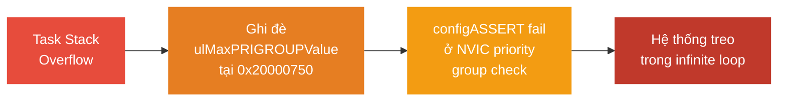

# <span style="color:#f1c40f">Chương 17: Mẹo Xử lý Sự cố & Bước Tiếp theo</span>
# <span style="color:#f1c40f">Troubleshooting Tips and Next Steps</span>

> [!TIP]
> Dùng **Ctrl+F** và tìm `## 1.`, `## 2.`, `## 3.` để nhảy nhanh đến từng mục.

```
 1. Mẹo Hữu ích                     — Thread analysis, memory monitoring, stack overflow
    ├─ 1.1 Dùng công cụ phân tích    — SystemView, Tracealyzer, Debugger Plugins
    ├─ 1.2 Giám sát bộ nhớ           — Stack sizing, heap hooks
    ├─ 1.3 Stack overflow checking    — Method 1 vs 2, High Water Mark
    └─ 1.4 Fix SystemView dropped    — 3 cách khắc phục khối đỏ
 2. configASSERT                     — Patterns, 3 trigger phổ biến, KHÔNG BAO GIỜ tắt
 3. Case Study: Debug Hung System    — Từng bước 4 giai đoạn, Data Breakpoint
    ├─ 3.1 Thu thập dữ liệu         — Ozone Attach, Call Stack
    ├─ 3.2 Data Breakpoint           — AIRCR register, ulMaxPRIGROUPValue
    ├─ 3.3 Tìm Root Cause            — Stack overflow ghi đè biến static
    └─ 3.4 Sửa lỗi & Phòng ngừa     — Tăng stack, bật hooks
 4. Run-Time Statistics Collection   — Raw data, CPU usage table
 5. Trace Hook Macros                — traceTASK_SWITCHED_IN/OUT
 6. Cẩn trọng với printf/sprintf     — printf-stdarg.c rủi ro stack
 7. 7 Triệu chứng Lỗi Phổ biến       — Bảng tra cứu nguyên nhân crash
 8. Bước Tiếp theo                   — Sách, TDD, tài nguyên học thêm
 9. Bảng Tham chiếu                  — Registers, Địa chỉ, Biến, Hàm
 10. Tổng kết & Câu hỏi Ôn tập      — Key Takeaways & 3 câu hỏi
 11. Tài liệu Tham khảo             — Nguồn tài nguyên
```

> [!NOTE]
> Chương này **không yêu cầu hardware/software** — tập trung vào phương pháp luận debug và kinh nghiệm thực chiến.

---

## <span style="color:#e67e22">1. Mẹo Hữu ích — Useful Tips</span>

### <span style="color:#1abc9c">1.1 Dùng Công cụ Phân tích Thread</span>

Chuyển từ bare-metal 8-bit sang 32-bit MCU (STM32F7) với RTOS → nhiều task tương tác phức tạp. **Không thể debug bằng mắt thường**.

| Công cụ | Vai trò |
|:---|:---|
| **SEGGER SystemView** | Visualize task execution timing, ISR interactions — dạng timeline |
| **SEGGER Ozone** | RTOS-aware debugger — xem trạng thái tất cả task đồng thời, call stack riêng từng task |

> [!NOTE]
> 📗 **Bổ sung từ: Mastering the FreeRTOS Kernel - Richard Barry**
> 
> **FreeRTOS+Trace (Percepio Tracealyzer)**:
> * Công cụ phân tích chi tiết với 20+ view liên kết với nhau: Task execution timeline, CPU load graph, Communication flow (queues/semaphores), Task statistics.
> * Cài đặt: Tích hợp trace recorder library, cấu hình `trcConfig.h`.
> * Hỗ trợ 2 chế độ ghi: **Snapshot** (dump RAM buffer khi cần) và **Streaming** (ghi liên tục qua J-Link, TCP, file).
>
> **FreeRTOS-Aware Debugger Plugins**:
> * Có sẵn cho IAR, Keil, Eclipse/GDB, Ozone.
> * Hiển thị: Active tasks, priorities, states, stack usage, queue contents.
> * Yêu cầu bật macro: `configUSE_TRACE_FACILITY = 1` và `configUSE_STATS_FORMATTING_FUNCTIONS = 1`.

---

### <span style="color:#1abc9c">1.2 Giám sát Bộ nhớ</span>

> [!IMPORTANT]
> **Khác biệt lớn nhất giữa bare-metal và RTOS**: Bare-metal super-loop dùng **1 stack duy nhất** — RAM còn thừa bao nhiêu dùng bấy nhiêu. FreeRTOS yêu cầu **mỗi Task phải khai báo stack size cụ thể** → sizing sai = crash.

**Phải luôn bật 2 hook này** (đã học chi tiết ở Chương 15):

```c
// ① Stack overflow — phát hiện task tràn stack
#define configCHECK_FOR_STACK_OVERFLOW  2
void vApplicationStackOverflowHook(TaskHandle_t xTask, char *pcTaskName);

// ② Malloc failed — phát hiện hết heap
#define configUSE_MALLOC_FAILED_HOOK    1
void vApplicationMallocFailedHook(void);
```

---

### <span style="color:#1abc9c">1.3 Stack Overflow Checking (Deep Dive)</span>

> [!NOTE]
> 📗 **Bổ sung từ: Mastering the FreeRTOS Kernel - Richard Barry**

* **Hardware MPU**: Phát hiện **tại đúng instruction** gây tràn → **khuyến nghị dùng** nếu MCU hỗ trợ (Cortex-M3/M4/M7).

#### <span style="color:#3498db">Phương pháp 1: SP Boundary Check (`configCHECK_FOR_STACK_OVERFLOW = 1`)</span>
* Tại mỗi lần context switch, kernel kiểm tra xem Stack Pointer có vượt qua giới hạn stack hay không.
* Ưu điểm: Nhanh, overhead cực thấp.
* Nhược điểm: Chỉ kiểm tra lúc context switch — nếu stack tràn rồi phục hồi trước khi switch, lỗi sẽ bị bỏ sót.

#### <span style="color:#3498db">Phương pháp 2: Pattern Check (`configCHECK_FOR_STACK_OVERFLOW = 2`)</span>
* Khởi tạo 20 byte cuối stack (5 words) với pattern `0xA5A5A5A5` lúc tạo task.
* Tại context switch, kiểm tra xem pattern còn nguyên vẹn không.
* Ưu điểm: Bắt được hầu hết các vụ tràn (ngay cả khi SP đã phục hồi).
* Nhược điểm: Vẫn có rủi ro tràn bỏ qua vùng 20 bytes (nhảy vọt); tốn CPU overhead hơn Method 1.

#### <span style="color:#3498db">Hàm Hook Cảnh Báo (Cần tự định nghĩa)</span>
```c
void vApplicationStackOverflowHook(TaskHandle_t xTask, char *pcTaskName) {
    // CẢNH BÁO: Stack đã bị tràn! Biến cục bộ KHÔNG đáng tin cậy!
    // Tham số được truyền qua thanh ghi, không qua stack
    (void)xTask;       // Handle task bị tràn
    (void)pcTaskName;  // Tên task bị tràn
    taskDISABLE_INTERRUPTS();
    for( ;; );  // Dừng hệ thống cho debugger
}
```

#### <span style="color:#3498db">Theo dõi qua `uxTaskGetStackHighWaterMark()`</span>
* Trả về **lượng stack nhỏ nhất chưa được dùng (tính bằng WORDS)** kể từ khi task chạy.
* Rất hiệu quả để right-size stack trong quá trình phát triển (Cấp nhiều ban đầu → đo HWM → giảm lại và chừa một ít margin an toàn).

---

### <span style="color:#1abc9c">1.4 Fix SystemView Dropped Data — Khối Đỏ trên Timeline</span>

**Cơ chế**: SystemView log event vào **RTT buffer** trên MCU → truyền qua debug hardware (SWD/J-Link) → PC. Nếu buffer đầy trước khi debugger kịp đọc → **mất gói** → khối đỏ.

#### <span style="color:#3498db">3 Cách Khắc phục</span>

| # | Giải pháp | Trade-off |
|:---|:---|:---|
| **①** | **Tăng RTT buffer size** trong `SEGGER_SYSVIEW_Conf.h` (dòng 132): | Tốn thêm RAM MCU |
| | `#define SEGGER_SYSVIEW_RTT_BUFFER_SIZE  4096` | |
| **②** | **Tăng tốc độ clock debugger** trong Target Interface settings | Cần hardware debugger tốt hơn |
| **③** | **Đóng live trace/watch windows** trong IDE/Ozone đang mở | Giảm traffic SWD bus |

---

## <span style="color:#e67e22">2. configASSERT — Macro Bẫy Lỗi</span>

### <span style="color:#1abc9c">2.1 Định nghĩa và Các Pattern Phổ biến</span>

> [!NOTE]
> 📗 **Bổ sung từ: Mastering the FreeRTOS Kernel - Richard Barry**

Có 2 pattern chính để thực thi macro này:

```c
// Pattern 1: Infinite loop (Đơn giản, an toàn)
#define configASSERT( x ) if( ( x ) == 0 ) { taskDISABLE_INTERRUPTS(); for( ;; ); }

// Pattern 2: Capture file/line cho debugging (Nâng cao)
// Cố ý gây breakpoint hardware ngay lập tức để giữ nguyên trạng thái
#define configASSERT( x ) if( ( x ) == 0 ) { \
    taskDISABLE_INTERRUPTS(); \
    __asm volatile("BKPT #0"); \
}
```

Khi điều kiện `x` sai → **tắt interrupt** + **dừng hệ thống** → debugger pause tại đây → xem Call Stack để biết lỗi gì.

### <span style="color:#1abc9c">2.2 Các Trigger Phổ biến nhất bị configASSERT Bẫy</span>

| # | Lỗi phổ biến bị bẫy bởi configASSERT | Giải thích |
|:---|:---|:---|
| **①** | Gọi hàm **non-`FromISR`** bên trong ISR | *Phổ biến nhất!* Ví dụ: Dùng `xQueueSend()` thay vì `xQueueSendFromISR()`. |
| **②** | ISR priority sai lệch | ISR có priority **vượt quá (tức là giá trị số nhỏ hơn)** `configMAX_SYSCALL_INTERRUPT_PRIORITY` lại đi gọi API của FreeRTOS. |
| **③** | Lỗi gom nhóm Priority (Grouping) | NVIC priority grouping **có sub-priority bits**. FreeRTOS yêu cầu 0 bit sub-priority. |
| **④** | Gọi Scheduler API sai thời điểm | API bị gọi khi chưa `vTaskStartScheduler()`. |
| **⑤** | Sai thao tác Mutex | Tác động (release) Mutex trên một task không sở hữu nó. |
| **⑥** | Sai tham số hàm API | Truyền tham số không hợp lệ vào các hàm API của kernel. |

> [!CAUTION]
> **KHÔNG BAO GIỜ tắt hoặc che configASSERT!**
> 
> Tắt assertion chỉ **giấu triệu chứng** — lỗi gốc vẫn còn và sẽ biểu hiện muộn hơn dưới dạng khó debug hơn gấp bội. FreeRTOS cung cấp **comment chi tiết và link tài liệu** quanh mỗi assertion point — **ĐỌC CHÚNG**.

---

## <span style="color:#e67e22">3. Case Study: Debug Hệ thống Bị Treo — Debugging a Hung System</span>

> [!IMPORTANT]
> Đây là **case study quan trọng nhất của sách** — minh họa quy trình debug RTOS thực tế từ triệu chứng → root cause → fix, sử dụng Data Breakpoint phần cứng.

### <span style="color:#1abc9c">3.1 Triệu chứng</span>

* Code biên dịch thành công, LED nháy bình thường.
* Kết nối SEGGER SystemView để trace → **vài event xuất hiện rồi hệ thống đóng băng**:
  * LED ngừng nháy.
  * SystemView trace dừng hoàn toàn.

---

### <span style="color:#1abc9c">3.2 Giai đoạn 1: Thu thập Dữ liệu — Collecting Data</span>

#### <span style="color:#3498db">Bước 1: Attach Ozone không reset MCU</span>

```
Ozone → Target → "Attach to Running Program"
→ Kết nối vào MCU đang chạy MÀ KHÔNG reset
→ Giữ nguyên trạng thái CPU tại thời điểm crash
```

#### <span style="color:#3498db">Bước 2: Pause và xem PC</span>

**Kết quả**: PC đang kẹt trong **vòng lặp vô hạn** bên trong `configASSERT` tại `port.c`.

#### <span style="color:#3498db">Bước 3: Phân tích Call Stack</span>

```
Call Stack (đọc từ dưới lên):
─────────────────────────────────
  SEGGER_SYSVIEW_RecordSystime()    ← SystemView ghi timestamp
    → _cbGetTime()                  ← Callback lấy thời gian
      → xTaskGetTickCountFromISR()  ← Hàm FreeRTOS lấy tick count
        → configASSERT()  ← ❌ FAIL TẠI ĐÂY (port.c, dòng ~760)
─────────────────────────────────
```

#### <span style="color:#3498db">Bước 4: Đọc Source Code quanh Assertion</span>

```c
// port.c, dòng ~760 — Comment chi tiết giải thích:
// "Ensure NVIC priority grouping is configured correctly.
//  Interrupt nesting requires 0 sub-priority bits."
configASSERT( ( portAIRCR_REG & portPRIORITY_GROUP_MASK ) <= ulMaxPRIGROUPValue );
```

* Hover biến `ulMaxPRIGROUPValue` → giá trị mong đợi là `1`.
* Nhưng assertion fail → giá trị thực tế đã bị **corrupted**.

---

### <span style="color:#1abc9c">3.3 Giai đoạn 2: Đào sâu — Data Breakpoint</span>

#### <span style="color:#3498db">Bước 5: Kiểm tra AIRCR Register trong Memory Viewer</span>

```
Ozone → Memory Viewer → Địa chỉ: 0xE000ED0C (AIRCR register)
→ Trường PRIGROUP (mask 0x00000700) = giá trị 3
→ Mong đợi: 0 (= NVIC_PRIORITYGROUP_4, 0 sub-priority bits)
```

#### <span style="color:#3498db">Bước 6: Data Breakpoint trên AIRCR</span>

```
Ozone → Debug → Data Breakpoints:
    Address: 0xE000ED0C
    Access:  Write
    Size:    4 bytes
```

* **Restart MCU** → Breakpoint hit ngay lập tức.
* PC trỏ vào `HAL_InitTick`, nhưng ghi thực sự xảy ra trong `HAL_NVIC_SetPriorityGrouping`.

#### <span style="color:#3498db">Bước 7: Kiểm tra HAL Source</span>

```c
// stm32f7xx_hal_cortex.c — Comment:
// @arg NVIC_PRIORITYGROUP_4: 4 bits for preemption priority
//                            0 bits for subpriority
// → FreeRTOS yêu cầu: NVIC_PRIORITYGROUP_4 (0 sub-priority bits)
```

> [!NOTE]
> Đến đây, `AIRCR` có vẻ được cấu hình **đúng** bởi HAL. Vậy tại sao `ulMaxPRIGROUPValue` sai? → Cần đào sâu thêm.

---

### <span style="color:#1abc9c">3.4 Giai đoạn 3: Tìm Root Cause — Stack Overflow</span>

#### <span style="color:#3498db">Bước 8: Kiểm tra biến static trong port.c</span>

```c
// port.c — Khai báo biến static:
#if( configASSERT_DEFINED == 1 )
    static uint8_t  ucMaxSysCallPriority = 0;    // ← Biến static
    static uint32_t ulMaxPRIGROUPValue   = 0;    // ← Biến static tại 0x20000750
#endif
```

#### <span style="color:#3498db">Bước 9: Data Breakpoint trên ulMaxPRIGROUPValue</span>

```
Ozone → Data Breakpoints:
    Address: 0x20000750   (địa chỉ RAM của ulMaxPRIGROUPValue)
    Access:  Write
    Size:    4 bytes
```

* **Restart MCU** → Breakpoint hit...
* **Anomaly phát hiện**: PC đang ở **`SEGGER_RTT.c`** — file này **KHÔNG CÓ QUYỀN** ghi vào biến static của `port.c`!

#### <span style="color:#3498db">Bước 10: Phân tích Stack Pointer</span>

```
┌─────────────────────────────────────────────────────────┐
│  Địa chỉ RAM:                                           │
│                                                          │
│  0x20000740  ← SP (Stack Pointer) hiện tại              │
│  0x20000744  │  Task stack data (đã tràn!)              │
│  0x20000748  │                                          │
│  0x2000074C  │                                          │
│  0x20000750  ← ulMaxPRIGROUPValue (biến static)  ❌     │
│              │  BỊ GHI ĐÈ bởi stack tràn!              │
│  0x20000754  ← ucMaxSysCallPriority                     │
│              │                                          │
└─────────────────────────────────────────────────────────┘

SP = 0x20000740 → Stack đã tràn QUÁ giới hạn
→ Ghi đè vào vùng nhớ biến static tại 0x20000750
→ ulMaxPRIGROUPValue bị corrupted
→ configASSERT fail ở kiểm tra priority grouping
```

#### <span style="color:#3498db">Chuỗi Lỗi Hoàn chỉnh (Fault Chain)</span>



> [!CAUTION]
> **Bài học cốt lõi**: Stack overflow **KHÔNG phải lúc nào cũng gây HardFault**. Trong case này, nó **âm thầm ghi đè biến static** ở vùng nhớ liền kề → gây `configASSERT` fail ở assertion **tưởng chừng không liên quan** (NVIC priority check) → cực kỳ khó debug nếu không có **Hardware Data Breakpoint**.

---

### <span style="color:#1abc9c">3.5 Giai đoạn 4: Sửa lỗi & Phòng ngừa</span>

#### <span style="color:#3498db">Nguyên nhân gốc</span>

* Stack task ban đầu: **128 words** (512 bytes).
* Thêm SEGGER SystemView logging → tăng nested function calls + local variables → **vượt 512 bytes**.

#### <span style="color:#3498db">Fix</span>

```c
// main.c — Tăng stack size:
#define TASK_STACK_SIZE  256   // Từ 128 words (512B) → 256 words (1024B = 1KB)
```

#### <span style="color:#3498db">Phòng ngừa — Không để lặp lại</span>

| Biện pháp | Cách thực hiện |
|:---|:---|
| **Stack Overflow Hook** | Bật `configCHECK_FOR_STACK_OVERFLOW 2` + triển khai `vApplicationStackOverflowHook` |
| **MPU Guard Region** | Đặt MPU region read-only phía dưới task stack → MemManage Fault ngay lập tức |
| **High Water Mark** | Gọi `uxTaskGetStackHighWaterMark()` định kỳ để giám sát margin |
| **Generous Sizing** | Luôn dự trữ **≥ 2× margin** so với worst-case measured |

---

## <span style="color:#e67e22">4. Run-Time Statistics Collection</span>

> [!NOTE]
> 📗 **Bổ sung từ: Mastering the FreeRTOS Kernel - Richard Barry**

Để thu thập số liệu chi tiết về thời gian chạy CPU của các task, bạn có thể cấu hình Run-Time Stats.

### <span style="color:#1abc9c">4.1 Yêu cầu Cài đặt</span>
* Bật các macro: `configGENERATE_RUN_TIME_STATS = 1` và `configUSE_STATS_FORMATTING_FUNCTIONS = 1`.
* Cần khai báo thêm 2 macro phụ thuộc timer phần cứng:
  * `portCONFIGURE_TIMER_FOR_RUN_TIME_STATS()`: Khởi tạo high-resolution timer.
  * `portGET_RUN_TIME_COUNTER_VALUE()`: Đọc giá trị timer.
* **Lưu ý quan trọng**: Timer này phải nhanh hơn tick interrupt từ **10-100 lần** (Ví dụ: Tick = 1ms thì stats timer cần >= 10kHz).

### <span style="color:#1abc9c">4.2 Lấy Dữ liệu Raw bằng `uxTaskGetSystemState()`</span>

```c
UBaseType_t uxTaskGetSystemState(
    TaskStatus_t * const pxTaskStatusArray,  // Mảng chứa kết quả
    const UBaseType_t uxArraySize,            // Kích thước mảng
    uint32_t * const pulTotalRunTime          // Tổng thời gian chạy
);
```

Mỗi phần tử trong mảng là cấu trúc `TaskStatus_t`:
```c
typedef struct xTASK_STATUS {
    TaskHandle_t xHandle;          // Handle của task
    const char *pcTaskName;         // Tên task
    UBaseType_t xTaskNumber;        // ID duy nhất
    eTaskState eCurrentState;       // Trạng thái: Running/Ready/Blocked/Suspended/Deleted
    UBaseType_t uxCurrentPriority;  // Priority hiện tại (có thể sau khi inheritance)
    UBaseType_t uxBasePriority;     // Priority gốc
    uint32_t ulRunTimeCounter;      // Tổng thời gian chạy (tính bằng stats timer)
    StackType_t *pxStackBase;       // Địa chỉ cuối stack
    uint16_t usStackHighWaterMark;  // Lượng stack chưa dùng tối thiểu (words)
} TaskStatus_t;
```

### <span style="color:#1abc9c">4.3 Formatted Output Functions</span>

Bạn có thể dễ dàng log ra console qua các hàm in text định dạng sẵn:

* `vTaskList(pcWriteBuffer)` — tạo bảng danh sách task:
  ```
  Name          State   Priority  Stack   Num
  IdleTask      R       0         120     1
  LedTask       B       2         340     2
  ```
  *(State codes: R=Ready, B=Blocked, S=Suspended, D=Deleted, X=Running)*

* `vTaskGetRunTimeStats(pcWriteBuffer)` — thống kê % CPU usage:
  ```
  Name          Abs Time      % Time
  IdleTask      87234         72%
  LedTask       15640         13%
  ```

---

## <span style="color:#e67e22">5. Trace Hook Macros</span>

> [!NOTE]
> 📗 **Bổ sung từ: Mastering the FreeRTOS Kernel - Richard Barry**

FreeRTOS Kernel cài cắm sẵn các macro rỗng tại các vị trí thực thi quan trọng. Người dùng (hoặc công cụ Trace) có thể tự định nghĩa (override) chúng để theo dõi các sự kiện.

**Một số Hook phổ biến:**
* `traceTASK_SWITCHED_IN()` / `traceTASK_SWITCHED_OUT()`: Khi context switch.
* `traceTASK_CREATE(pxNewTCB)` / `traceTASK_DELETE(pxTaskToDelete)`: Khi vòng đời task đổi.
* Theo dõi Queue:
  * `traceQUEUE_SEND(pxQueue)` / `traceQUEUE_RECEIVE(pxQueue)`
  * `traceQUEUE_SEND_FAILED(pxQueue)` / `traceQUEUE_RECEIVE_FAILED(pxQueue)`
  * `traceBLOCKING_ON_QUEUE_SEND(pxQueue)` / `traceBLOCKING_ON_QUEUE_RECEIVE(pxQueue)`
* `traceTASK_DELAY()` / `traceTASK_DELAY_UNTIL()`
* `traceTASK_PRIORITY_SET(pxTask, uxNewPriority)`
* `traceTASK_SUSPEND(pxTaskToSuspend)` / `traceTASK_RESUME(pxTaskToResume)`

---

## <span style="color:#e67e22">6. Cẩn trọng với `printf` / `sprintf` trong Embedded</span>

> [!WARNING]
> 📗 **Bổ sung từ: Mastering the FreeRTOS Kernel - Richard Barry**

* Hàm `printf` tiêu chuẩn ở nhiều toolchains **không thread-safe**.
* **Tiêu tốn stack cực lớn**: Việc gọi `printf` có thể ngốn hàng trăm byte stack ngay lập tức.
* Rủi ro tiền tàng: Tràn stack có thể chỉ xảy ra khi một chuỗi format dài / đặc biệt nào đó được in.
* **Giải pháp**: FreeRTOS cung cấp thư viện `printf-stdarg.c`
  * Thread-safe, cấu trúc siêu nhẹ.
  * Tốn rất ít stack khi gọi.
  * *Lưu ý*: Có thể không hỗ trợ toàn bộ các format specifiers (ví dụ có bản không hỗ trợ `%f`).

---

## <span style="color:#e67e22">7. Bảng 7 Triệu chứng Lỗi Phổ biến & Nguyên nhân</span>

> [!TIP]
> 📗 **Bổ sung từ: Mastering the FreeRTOS Kernel - Richard Barry**

| Triệu chứng (Symptom) | Nguyên nhân khả dĩ nhất (Likely Causes) |
|---|---|
| **1. Thêm một task đơn giản làm crash hệ thống** | Stack của task quá nhỏ, cạn kiệt Heap, malloc hook không được cài đặt đúng. |
| **2. Gọi API trong ISR gây crash** | Gọi hàm non-FromISR, ISR priority cao hơn mức trần cho phép. |
| **3. Hệ thống crash ngay khi startup** | Cấu hình NVIC priority grouping sai (có sub-priority bits), stack không đủ cho Idle task. |
| **4. Interrupt không bao giờ thực thi** | Priority được gán bằng 0 nhưng không shift vào các bit cao (tuỳ thuộc dòng MCU). |
| **5. Scheduler crash khi mới bắt đầu** | `configMINIMAL_STACK_SIZE` quá nhỏ, Heap khởi tạo quá nhỏ. |
| **6. Task không nhận được dữ liệu mong đợi** | Queue đầy, Timeout quá ngắn, bị Priority Inversion. |
| **7. Task dường như chạy ở sai mức Priority** | Priority Inheritance đang kích hoạt (do Mutex), Priority bị chặn âm thầm. |

---

## <span style="color:#e67e22">8. Bước Tiếp theo — Next Steps</span>

### <span style="color:#1abc9c">8.1 Thực hành</span>

* Chạy **tất cả code example** trong sách trên board STM32 thật.
* Tái tạo lại case study ở mục 3 — cố ý gây stack overflow, dùng Ozone + Data Breakpoint để debug.

### <span style="color:#1abc9c">8.2 Sách Đọc thêm</span>

| Sách / Tài nguyên | Tác giả | Nội dung |
|:---|:---|:---|
| **Mastering the FreeRTOS™ Real-Time Kernel** | **Richard Barry** (tác giả FreeRTOS) | Chi tiết API FreeRTOS + kernel operations nâng cao |

### <span style="color:#1abc9c">8.3 TDD & Best Practices cho Embedded</span>

| Tài nguyên | Mô tả |
|:---|:---|
| **James Grenning** (`blog.wingman-sw.com`) | TDD for Embedded C/C++ — tác giả sách *Test-Driven Development for Embedded C* |
| **Matt Chernosky** (`electronvector.com`) | Embedded unit testing practices |
| **Throw the Switch** (`throwtheswitch.org`) | Ceedling, Unity, CMock — embedded test frameworks |
| **Jack Ganssle** (`ganssle.com`) | Decades of embedded HW/SW engineering principles |

---

## <span style="color:#e67e22">9. Bảng Tham chiếu: Registers, Địa chỉ, Biến, Hàm</span>

| Tên | Loại | Mô tả |
|:---|:---|:---|
| `0xE000ED0C` | Địa chỉ | NVIC **AIRCR** (Application Interrupt and Reset Control Register) |
| `0x20000750` | Địa chỉ RAM | Biến static `ulMaxPRIGROUPValue` trong `port.c` — bị stack overflow ghi đè |
| `0x20000740` | Địa chỉ RAM | Stack Pointer (SP) khi data breakpoint hit — chứng minh stack tràn |
| `portAIRCR_REG` | Macro | FreeRTOS macro tham chiếu AIRCR register |
| `portPRIORITY_GROUP_MASK` | Macro | Bitmask trích xuất PRIGROUP field từ AIRCR (`0x00000700`) |
| `ulMaxPRIGROUPValue` | Biến static | Giá trị max priority group cho phép — mong đợi `1`, bị corrupted |
| `ucMaxSysCallPriority` | Biến static | Giới hạn max syscall priority — nằm liền kề trong RAM |
| `SEGGER_SYSVIEW_RTT_BUFFER_SIZE` | Config Macro | Kích thước RTT buffer — dòng 132 `SEGGER_SYSVIEW_Conf.h` |
| `NVIC_PRIORITYGROUP_4` | Define | 4 bit preemption, 0 bit sub-priority — **bắt buộc** cho FreeRTOS |
| `HAL_NVIC_SetPriorityGrouping` | Hàm HAL | Cấu hình NVIC priority grouping |
| `xTaskGetTickCountFromISR` | FreeRTOS API | Lấy tick count an toàn từ ISR context |
| `xPortStartScheduler` | FreeRTOS API | Khởi tạo hardware + start scheduler |

---

## <span style="color:#e67e22">10. Tổng kết & Câu hỏi Ôn tập</span>

### <span style="color:#1abc9c">10.1 Key Takeaways</span>

* **Stack overflow = nguyên nhân crash #1** trong RTOS — biểu hiện **ở nơi không liên quan**, rất khó trace nếu không có công cụ.
* **configASSERT = hàng rào bảo vệ** — KHÔNG BAO GIỜ tắt. Đọc comment quanh assertion để hiểu lỗi.
* **Ozone "Attach to Running"** = công cụ cứu cánh khi hệ thống treo — không reset MCU, giữ nguyên state.
* **Hardware Data Breakpoint** = vũ khí mạnh nhất khi nghi ngờ memory corruption — bắt đúng instruction gây ghi.
* **SystemView dropped data**: Tăng RTT buffer, tăng clock debugger, đóng live views.
* **Quy trình debug RTOS**: Attach → Pause → Xem PC → Call Stack → Source Comment → Data Breakpoint → Root Cause.

---

### <span style="color:#1abc9c">10.2 Câu hỏi Ôn tập Cuối Chương</span>

> [!NOTE]
> **3 câu hỏi từ sách**:

#### **Câu 1**: "Khi hệ thống crash sau khi thêm interrupt hoặc dùng RTOS primitive mới, cần làm gì?"
* **Đáp án**:
  1. Kết nối debugger.
  2. Tìm PC dừng ở đâu.
  3. Nếu ở `configASSERT` → đọc comment quanh assertion.
  4. Nếu fail trước scheduler → có thể đã tràn FreeRTOS heap.

#### **Câu 2**: "Nêu 1 nguyên nhân gây hành vi bất thường khi phát triển với RTOS"
* **Đáp án** (bất kỳ 1 trong 3):
  * **Task stack overflow**.
  * **ISR priority sai** (cao hơn `configMAX_SYSCALL_INTERRUPT_PRIORITY`).
  * **Heap size không đủ**.

#### **Câu 3**: "Hệ thống không có cổng serial hay giao tiếp nào exposed → không thể debug?"
* **Đáp án: FALSE ❌**
* **SEGGER SystemView** cung cấp cả `printf` output lẫn trace instrumentation qua giao diện **SWD debug** (J-Link / RTT) — **không cần serial port vật lý**.

---

## <span style="color:#e67e22">11. Tài liệu Tham khảo</span>

* **Richard Barry** — *Mastering the FreeRTOS Real-Time Kernel*
* **James Grenning** — `https://blog.wingman-sw.com`
* **Throw the Switch (Ceedling/Unity/CMock)** — `https://www.throwtheswitch.org/`
* **Jack Ganssle** — `https://www.ganssle.com/`
* **SEGGER SystemView** — `https://www.segger.com/products/development-tools/systemview/`
* **Source Code** (toàn bộ sách): `https://github.com/PacktPublishing/Hands-On-RTOS-with-Microcontrollers`
