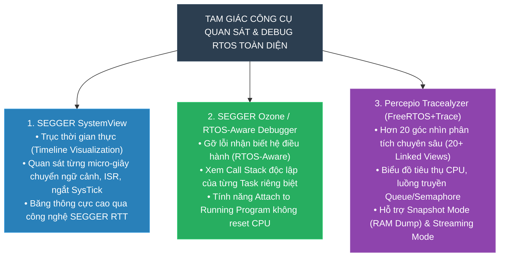
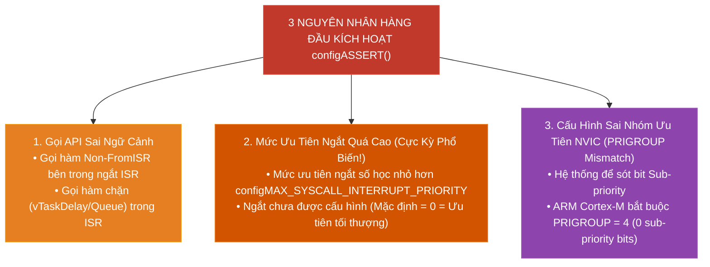
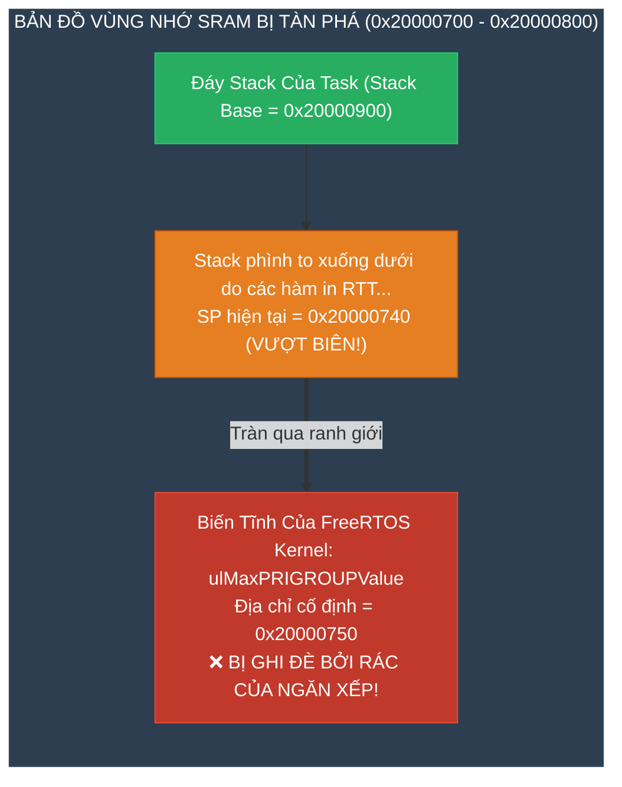

# <span style="color:#f1c40f">Chương 15: Xử Lý Sự Cố & Kỹ Thuật Gỡ Lỗi Chuyên Sâu (Troubleshooting, Developer Support & Advanced Debugging)</span>

> **Tài liệu tham khảo chuyên sâu kết hợp:**
> - 📘 *Hands-On RTOS with Microcontrollers* – Brian Amos (Chapter 17: *Troubleshooting Tips and Next Steps*, tr. 430–445).
> - 📗 *Mastering the FreeRTOS Real Time Kernel* – Richard Barry (Chapter 11: *Developer Support*, tr. 329–355 & Chapter 12: *Trouble Shooting*, tr. 356–369).
> - 📙 *ARM Cortex-M Hardware Debugging Architecture* (DWT Cycle Counter, ITM/SWO, Data Breakpoints, FPB & MPU Stack Protection).

---

```text
MỤC LỤC CHUYÊN SÂU (TABLE OF CONTENTS)
├── 1. Triết Lý & Phương Pháp Luận Gỡ Lỗi Hệ Thống Thời Gian Thực (Debugging Philosophy in RTOS)
│   ├── 1.1 Khủng Hoảng Gỡ Lỗi Khi Chuyển Từ Bare-Metal Sang Đa Nhiệm RTOS (Hiệu Ứng Heisenbug)
│   ├── 1.2 Tam Giác Công Cụ Quan Sát Toàn Diện: SEGGER SystemView vs Ozone vs Percepio Tracealyzer
│   ├── 1.3 Kỹ Thuật Giám Sát Không Xâm Lấn Qua Phần Cứng ARM Cortex-M (DWT & ITM/SWO)
│   └── 1.4 Khắc Phục Triệt Để Hiện Tượng Nghẽn Dữ Liệu SystemView (Fixing Dropped Red Blocks)
├── 2. Cơ Chế Bẫy Lỗi Tối Thượng: configASSERT() Trong FreeRTOS
│   ├── 2.1 Bản Chất Của configASSERT() Trong Mã Nguồn Kernel
│   ├── 2.2 Hai Mẫu Triển Khai Chuẩn Công Nghiệp (Debugger Trap vs Error Logging với __FILE__ & __LINE__)
│   ├── 2.3 Ba Nhóm Lỗi Nghiêm Trọng Được configASSERT() Chặn Cứng:
│   │   ├── 2.3.1 Lỗi Gọi API Sai Ngữ Cảnh (Non-FromISR Trong Ngắt & Ngược Lại)
│   │   ├── 2.3.2 Lỗi Mức Ưu Tiên Ngắt Vượt Ngưỡng configMAX_SYSCALL_INTERRUPT_PRIORITY
│   │   └── 2.3.3 Lỗi Phân Vùng Nhóm Ưu Tiên NVIC (Cortex-M Sub-Priority Bits != 0)
│   └── 2.4 Quy Tắc Bất Di Bất Dịch: Tuyệt Đối Không Che Giấu Hoặc Vô Hiệu Hóa Assertion
├── 3. Case Study Thực Chiến: Giải Phẫu Hệ Thống Bị Treo Bằng SEGGER Ozone (Brian Amos)
│   ├── 3.1 Tình Huống Sự Cố: Đèn LED Tắt Ngấm & SystemView Đóng Băng
│   ├── 3.2 Kỹ Thuật Kết Nối Không Xâm Hại (Ozone: Attach to Running Program)
│   ├── 3.3 Phân Tích Call Stack & Bẫy Assertion ulMaxPRIGROUPValue Trong port.c
│   ├── 3.4 Săn Lùng Nguyên Nhân Gốc (Root Cause) Bằng Điểm Dừng Dữ Liệu (Data Breakpoints)
│   └── 3.5 Phát Hiện Chấn Động: Tràn Stack Do Thư Viện In Ấn Ghi Đè Biến Tĩnh Của Kernel
├── 4. Giám Sát Bộ Nhớ & Phát Hiện Tràn Ngăn Xếp (Memory & Stack Monitoring)
│   ├── 4.1 Đo Lường Đỉnh Sử Dụng Stack: uxTaskGetStackHighWaterMark()
│   ├── 4.2 Cơ Chế Kiểm Tra Tràn Stack Khi Chuyển Ngữ Cảnh (Method 1 vs Method 2)
│   ├── 4.3 Xử Lý Bẫy Lỗi Tràn Ngăn Xếp: vApplicationStackOverflowHook()
│   ├── 4.4 Bẫy Lỗi Cạn Kiệt Bộ Nhớ Heap: vApplicationMallocFailedHook()
│   └── 4.5 Phòng Thủ Phần Cứng Bằng MPU (Hardware-Enforced Stack Protection)
├── 5. Thu Thập Thống Kê Thời Gian Chạy & Trace Hooks (Run-Time Stats & Trace Hooks)
│   ├── 5.1 Cấu Hình Bộ Định Thời Tốc Độ Cao Cho Thống Kê (configGENERATE_RUN_TIME_STATS)
│   ├── 5.2 Trích Xuất Dữ Liệu Hệ Thống Cấp Thấp: uxTaskGetSystemState() & TaskStatus_t
│   ├── 5.3 Báo Cáo Định Dạng Trực Quan: Bảng Trạng Thái vTaskList() & Tải CPU vTaskGetRunTimeStats()
│   └── 5.4 Mở Rộng Hệ Thống Bằng Các Macro Bắt Sự Kiện (Trace Hook Macros)
├── 6. Cạm Bẫy In Ấn Dữ Liệu printf() / sprintf() Trong Vi Điều Khiển
│   ├── 6.1 Nguy Cơ Nuốt Chửng Ngăn Xếp & Tính Bất Tái Nhập (Reentrancy Hazard)
│   └── 6.2 Giải Pháp Chuẩn Mực: printf-stdarg.c & Kỹ Thuật SEGGER RTT Real-Time Transfer
├── 7. Ma Trận Chẩn Đoán 7 Triệu Chứng Lỗi Phổ Biến Nhất (Top 7 RTOS Troubleshooting Matrix)
├── 8. Lộ Trình Nâng Cao Kỹ Năng Kỹ Sư RTOS (Next Steps & Embedded TDD)
│   ├── 8.1 Phát Triển Hướng Kiểm Thử Trong Nhúng (Embedded Test-Driven Development - TDD)
│   └── 8.2 Các Nguồn Tài Nguyên & Tác Giả Kinh Điển Cần Nghiên Cứu Tiếp Theo
├── 9. Lời Giải Toàn Diện Toàn Bộ Câu Hỏi Đánh Giá Sách Brian Amos (Chapter 17 Assessments)
└── 10. Bảng Tổng Hợp Kiến Thức Cốt Lõi (Key Takeaways Summary Matrix)
```

---

## <span style="color:#e67e22">1. Triết Lý & Phương Pháp Luận Gỡ Lỗi Hệ Thống Thời Gian Thực (Debugging Philosophy in RTOS)</span>

Khi phát triển phần mềm nhúng, sự chuyển dịch từ kiến trúc vòng lặp vô tận đơn giản (**Bare-metal Super-loop**) trên vi điều khiển 8-bit sang hệ thống đa nhiệm thời gian thực (**Multitasking RTOS**) trên nền ARM Cortex-M 32-bit là một bước nhảy vọt về độ phức tạp. 

Trong hệ thống RTOS, hàng chục tác vụ (Tasks) và trình phục vụ ngắt (ISRs) chia sẻ bộ nhớ, cạnh tranh tài nguyên và giành quyền chiếm dụng CPU liên tục. **Các phương pháp gỡ lỗi truyền thống như đặt cờ dò lỗi (flags) hoặc chèn lệnh in `printf()` để nhìn bằng mắt thường hoàn toàn bất lực!**

---

### <span style="color:#1abc9c">1.1 Khủng Hoảng Gỡ Lỗi Khi Chuyển Từ Bare-Metal Sang Đa Nhiệm RTOS (Hiệu Ứng Heisenbug)</span>

Trong hệ thống Bare-metal đơn luồng:
- Luồng thực thi diễn ra tuần tự từ trên xuống dưới. Nếu có biến bị sai giá trị, ta có thể đặt một lệnh `printf()` để in ra màn hình console và quan sát dòng lệnh chạy qua.

Trong hệ thống RTOS thời gian thực:
- Việc chèn một lệnh `printf()` tốn vài mili-giây sẽ làm **thay đổi toàn bộ trật tự lập lịch (Scheduling Order)** và **biến dạng quan hệ thời gian (Timing Relationship)** giữa các Task.
- **Hiệu ứng Heisenbug**: Một lỗi Race Condition hoặc Timing Violation bí ẩn bỗng nhiên "biến mất" khi bạn gắn thêm lệnh debug, nhưng ngay khi tháo bỏ lệnh debug ra để xuất xưởng sản phẩm thì lỗi lại xuất hiện trở lại và đánh sập thiết bị của khách hàng!

> [!CAUTION]
> **Quy Tắc Vàng Của Senior RTOS Architect**:
> Tuyệt đối không sử dụng các phương pháp gỡ lỗi xâm lấn (Invasive Debugging) làm chậm chu kỳ thực thi của hệ thống thời gian thực. Bắt buộc phải sử dụng các công cụ quan sát đồ họa chuyên dụng và cơ chế theo dõi phần cứng không xâm lấn (Non-intrusive Hardware Tracing).

---

### <span style="color:#1abc9c">1.2 Tam Giác Công Cụ Quan Sát Toàn Diện: SEGGER SystemView vs Ozone vs Percepio Tracealyzer</span>

Để nhìn thấu toàn bộ hành vi của hệ thống mà không làm sai lệch nhịp thời gian, các chuyên gia RTOS dựa vào "Tam giác công cụ" sau:


```mermaid
graph TD
    TOOLS["TAM GIÁC CÔNG CỤ QUAN SÁT & DEBUG RTOS TOÀN DIỆN"]
    
    TOOLS --> T1["1. SEGGER SystemView<br/>• Trục thời gian thực (Timeline Visualization)<br/>• Quan sát từng micro-giây chuyển ngữ cảnh, ISR, ngắt SysTick<br/>• Băng thông cực cao qua công nghệ SEGGER RTT"]
    TOOLS --> T2["2. SEGGER Ozone / RTOS-Aware Debugger<br/>• Gỡ lỗi nhận biết hệ điều hành (RTOS-Aware)<br/>• Xem Call Stack độc lập của từng Task riêng biệt<br/>• Tính năng Attach to Running Program không reset CPU"]
    TOOLS --> T3["3. Percepio Tracealyzer (FreeRTOS+Trace)<br/>• Hơn 20 góc nhìn phân tích chuyên sâu (20+ Linked Views)<br/>• Biểu đồ tiêu thụ CPU, luồng truyền Queue/Semaphore<br/>• Hỗ trợ Snapshot Mode (RAM Dump) & Streaming Mode"]

    style TOOLS fill:#2c3e50,stroke:#34495e,color:#fff
    style T1 fill:#2980b9,stroke:#3498db,color:#fff
    style T2 fill:#27ae60,stroke:#2ecc71,color:#fff
    style T3 fill:#8e44ad,stroke:#9b59b6,color:#fff
```

1. **SEGGER SystemView**:
   - Ghi lại mọi sự kiện chuyển ngữ cảnh (Task Switch), thời điểm ngắt (ISR Enter/Exit), các lệnh gọi API của RTOS và hiển thị trực quan trên một trục thời gian (Timeline) mượt mà.
   - Sử dụng công nghệ **Real-Time Transfer (RTT)** đọc trực tiếp bộ đệm RAM của chip qua giao tiếp SWD/JTAG với tốc độ hàng trăm kilobyte/giây mà không làm CPU bị đứng hình (Overhead nhỏ hơn $1\%$).
2. **SEGGER Ozone (RTOS-Aware Debugger)**:
   - Các trình debug thông thường chỉ biết duy nhất một con trỏ Stack Pointer (SP) của luồng hiện tại.
   - Trình debug **nhận biết RTOS (RTOS-Aware)** như Ozone có khả năng giải mã cấu trúc `TCB` của FreeRTOS, cho phép hiển thị đồng thời trạng thái của tất cả các tác vụ trong hệ thống (Running, Ready, Blocked, Suspended), mức sử dụng Stack của từng task và Call Stack riêng biệt của các tác vụ đang ngủ!
3. **Percepio Tracealyzer**:
   - Công cụ phân tích hệ thống cao cấp chính thức của FreeRTOS, cung cấp hơn 20 góc nhìn thống kê: Đồ thị phần trăm tải CPU theo thời gian thực, ma trận giao tiếp IPC giữa các tác vụ, biểu đồ thời gian đáp ứng (Response Time Jitter).

---

### <span style="color:#1abc9c">1.3 Kỹ Thuật Giám Sát Không Xâm Lấn Qua Phần Cứng ARM Cortex-M</span>

Bên trong các vi điều khiển ARM Cortex-M (Cortex-M3, M4, M7), ARM tích hợp sẵn các khối phần cứng gỡ lỗi chuyên biệt mà không phải kỹ sư nào cũng biết tận dụng:

#### 1. DWT (Data Watchpoint and Trace) Cycle Counter:
Khối DWT chứa một thanh ghi đếm chu kỳ 32-bit `DWT->CYCCNT` tự động tăng lên 1 sau mỗi chu kỳ xung nhịp CPU:
```c
/* =========================================================================
 * ĐO THỜI GIAN THỰC THI CHÍNH XÁC ĐẾN TỪNG CHU KỲ XUNG NHỊP (CLOCK CYCLE)
 * ========================================================================= */
void DWT_Init(void)
{
    CoreDebug->DEMCR |= CoreDebug_DEMCR_TRCENA_Msk; // Kích hoạt khối Trace
    DWT->CTRL |= DWT_CTRL_CYCCNTENA_Msk;           // Bật bộ đếm Cycle Counter
}

uint32_t start_cycles = DWT->CYCCNT;
Critical_Function_To_Benchmark();
uint32_t elapsed_cycles = DWT->CYCCNT - start_cycles;
// Trên CPU 216MHz: 216 chu kỳ = đúng 1.0 micro-giây!
```

#### 2. ITM (Instrumentation Trace Macrocell) & Chân SWO:
Cho phép đẩy dữ liệu in ấn ra máy tính qua chân tín hiệu đơn `SWO` (Serial Wire Output) bằng mạch logic phần cứng độc lập. Thao tác ghi dữ liệu vào thanh ghi `ITM->PORT[0]` chỉ tốn đúng **1 chu kỳ xung nhịp** (nhanh hơn lệnh `printf` qua UART hàng chục nghìn lần!).

---

### <span style="color:#1abc9c">1.4 Khắc Phục Triệt Để Hiện Tượng Nghẽn Dữ Liệu SystemView (Fixing Dropped Red Blocks)</span>

Khi hệ thống có mật độ ngắt quá dày đặc hoặc số lượng Task chuyển ngữ cảnh liên tục, trên giao diện của SEGGER SystemView đôi khi sẽ xuất hiện các **khối màu đỏ lớn (Red Dropped Packets)** báo hiệu dữ liệu sự kiện bị rơi rớt.

Tác giả Brian Amos chỉ ra 3 giải pháp khắc phục triệt để hiện tượng này:
1. **Tăng kích thước bộ đệm RTT trên vi điều khiển**: Mặc định bộ đệm RTT trong file `SEGGER_SYSVIEW_Conf.h` là tương đối nhỏ. Hãy tăng kích thước lên $2048$ hoặc $4096\text{ bytes}$:
   ```c
   #define SEGGER_SYSVIEW_RTT_BUFFER_SIZE  4096
   ```
   *(Lưu ý: Tăng buffer này sẽ tiêu tốn thêm RAM của ứng dụng)*.
2. **Tăng tốc độ xung nhịp của mạch nạp J-Link**: Trong phần cấu hình *Target Interface and Speed*, tăng tốc độ SWD từ mặc định $4000\text{ kHz}$ lên **$10000\text{ kHz} - 20000\text{ kHz}$** (nếu mạch nạp J-Link PRO/PLUS và chất lượng dây cáp cho phép).
3. **Đóng bớt các cửa sổ Trace trực tiếp khác**: Tắt các cửa sổ Live Watch, Live Expressions trong STM32CubeIDE hoặc Ozone để giải phóng băng thông truyền thông trên cổng kết nối J-Link.

---

## <span style="color:#e67e22">2. Cơ Chế Bẫy Lỗi Tối Thượng: configASSERT() Trong FreeRTOS</span>

Trong toàn bộ mã nguồn nhân FreeRTOS (`tasks.c`, `queue.c`, `timers.c`, `event_groups.c`, `port.c`), tác giả Richard Barry đã cài cắm hàng trăm lời gọi kiểm tra tính hợp lệ bằng macro: **`configASSERT()`**.

Đây chính là tuyến phòng thủ đầu tiên và quyền lực nhất giúp các kỹ sư phát hiện ra hơn $90\%$ các lỗi cấu hình ngắt và lỗi lập trình sai ngữ cảnh ngay tại thời điểm lỗi vừa chớm xuất hiện!

---

### <span style="color:#1abc9c">2.1 Bản Chất Của configASSERT() Trong Mã Nguồn Kernel</span>

Trong thư viện C chuẩn (`assert.h`), macro `assert(expression)` sẽ kiểm tra biểu thức điều kiện. Nếu biểu thức trả về `false` (bằng 0), chương trình sẽ gọi hàm xử lý lỗi.

Tuy nhiên, FreeRTOS **hoàn toàn không sử dụng thư viện `assert.h` chuẩn** vì những lý do kỹ thuật sau:
1. Nhiều trình biên dịch nhúng cổ điển (Embedded Cross-Compilers) không có sẵn thư viện `assert.h` hoặc việc bao gồm nó sẽ kéo theo các chuỗi ký tự cồng kềnh làm phình to bộ nhớ Flash.
2. Thư viện `assert.h` chuẩn thường gọi hàm `abort()` hoặc in ra luồng `stderr` – những thứ hoàn toàn không tồn tại trên một vi điều khiển bare-metal không có màn hình!

Do đó, FreeRTOS định nghĩa macro **`configASSERT( x )`**. Người dùng được toàn quyền quyết định cách xử lý khi một điều kiện bị vi phạm bên trong tệp cấu hình `FreeRTOSConfig.h`.

---

### <span style="color:#1abc9c">2.2 Hai Mẫu Triển Khai Chuẩn Công Nghiệp Của configASSERT()</span>

Richard Barry cung cấp 2 mẫu thiết kế `configASSERT()` chuẩn mực tùy thuộc vào môi trường vận hành:

#### Mẫu 1: Dành Cho Môi Trường Có Kết Nối Mạch Nạp Debugger (Listing 164)
Mục tiêu là **dừng ngay lập tức con trỏ chương trình (Program Counter - PC) đúng tại dòng lệnh phát sinh lỗi**, không cho CPU chạy tiếp dù chỉ một lệnh để kỹ sư có thể mở Call Stack ra kiểm tra:

```c
/* =========================================================================
 * MẪU 1: CẤU HÌNH configASSERT() DÀNH CHO GỠ LỖI VỚI DEBUGGER (J-LINK/ST-LINK)
 * ========================================================================= */
#define configASSERT( x )   if( ( x ) == 0 ) {          \
                                taskDISABLE_INTERRUPTS(); \
                                for( ;; );                \
                            }

// HOẶC TỐI ƯU HƠN: Dùng lệnh ngắt điểm dừng phần cứng (Software Breakpoint)
#define configASSERT( x )   if( ( x ) == 0 ) {          \
                                taskDISABLE_INTERRUPTS(); \
                                __asm volatile( "BKPT #0" ); \
                            }
```

*Cơ chế hoạt động*:
1. `taskDISABLE_INTERRUPTS()`: Tắt ngắt toàn cục ngay lập tức để ngắt SysTick dừng lại, ngăn không cho RTOS Scheduler tiếp tục chuyển ngữ cảnh sang Task khác.
2. `BKPT #0` (hoặc `for(;;)`): Kích hoạt điểm dừng phần cứng của CPU ARM Cortex-M. Trình debug (Ozone, STM32CubeIDE) sẽ lập tức tạm dừng chương trình và đánh dấu sáng chói dòng code vừa làm assert bị hỏng!

---

#### Mẫu 2: Dành Cho Thiết Bị Chạy Thực Tế Ngoài Hiện Trường (Field Logging - Listing 165)
Khi sản phẩm đang chạy thử nghiệm mà không cắm dây nạp debug, hệ thống cần **ghi lại chính xác tên tệp nguồn và số dòng xảy ra sự cố** vào bộ nhớ Flash hoặc EEPROM để kỹ sư đọc lại sau đó:

```c
/* =========================================================================
 * MẪU 2: CẤU HÌNH configASSERT() LƯU VẾT LỖI RA HỆ THỐNG GHI LOG
 * ========================================================================= */
// 1. Trong FreeRTOSConfig.h:
void vAssertCalled( const char *pcFile, uint32_t ulLine );
#define configASSERT( x )   if( ( x ) == 0 ) vAssertCalled( __FILE__, __LINE__ )

// 2. Trong file mã nguồn C (ví dụ main.c):
void vAssertCalled( const char *pcFile, uint32_t ulLine )
{
    // BẮT BUỘC tắt ngắt để hệ thống không tiếp tục vận hành sai lệch
    taskDISABLE_INTERRUPTS();
    
    // Ghi tên file và số dòng lỗi vào vùng nhớ Blackbox (EEPROM/Flash/FRAM)
    BlackBox_RecordCrash(pcFile, ulLine);
    
    // Phát tín hiệu đèn cảnh báo hoặc kích hoạt Watchdog Reset an toàn
    Fault_LED_On();
    
    for( ;; )
    {
        // Chờ kỹ sư cắm thiết bị đọc log
    }
}
```

---

### <span style="color:#1abc9c">2.3 Ba Nhóm Lỗi Nghiêm Trọng Được configASSERT() Chặn Cứng</span>

Trong thực tế, khi một dự án RTOS bị treo cứng trong vòng lặp `for(;;)` của `configASSERT()`, hơn $95\%$ khả năng là do hệ thống rơi vào một trong 3 nhóm lỗi kinh điển sau:


```mermaid
graph TD
    ASSERT["3 NGUYÊN NHÂN HÀNG ĐẦU KÍCH HOẠT configASSERT()"]
    
    ASSERT --> G1["1. Gọi API Sai Ngữ Cảnh<br/>• Gọi hàm Non-FromISR bên trong ngắt ISR<br/>• Gọi hàm chặn (vTaskDelay/Queue) trong ISR"]
    ASSERT --> G2["2. Mức Ưu Tiên Ngắt Quá Cao (Cực Kỳ Phổ Biến!)<br/>• Mức ưu tiên ngắt số học nhỏ hơn configMAX_SYSCALL_INTERRUPT_PRIORITY<br/>• Ngắt chưa được cấu hình (Mặc định = 0 = Ưu tiên tối thượng)"]
    ASSERT --> G3["3. Cấu Hình Sai Nhóm Ưu Tiên NVIC (PRIGROUP Mismatch)<br/>• Hệ thống để sót bit Sub-priority<br/>• ARM Cortex-M bắt buộc PRIGROUP = 4 (0 sub-priority bits)"]

    style ASSERT fill:#c0392b,stroke:#e74c3c,color:#fff
    style G1 fill:#e67e22,stroke:#f39c12,color:#fff
    style G2 fill:#d35400,stroke:#e67e22,color:#fff
    style G3 fill:#8e44ad,stroke:#9b59b6,color:#fff
```

#### 2.3.1 Lỗi Gọi API Sai Ngữ Cảnh
- Gọi một hàm không an toàn với ngắt (như `xQueueSend()`, `vTaskDelay()`) từ bên trong một trình phục vụ ngắt `EXTI0_IRQHandler()`.
- FreeRTOS sẽ kiểm tra thanh ghi kiểm soát chế độ CPU (kiểm tra xem CPU có đang ở *Handler Mode* hay không). Nếu phát hiện đang ở Handler Mode mà lại gọi API của Thread Mode, `configASSERT()` sẽ lập tức kích hoạt để ngăn chặn thảm họa hỏng danh sách sự kiện Ready/Blocked List!

#### 2.3.2 Lỗi Mức Ưu Tiên Ngắt Vượt Ngưỡng Cho Phép (The Max Syscall Priority Trap)
Trong ARM Cortex-M:
- **Số càng nhỏ thì ưu tiên càng cao** (Ưu tiên 0 là cao nhất).
- FreeRTOS chỉ cho phép các ngắt có mức ưu tiên **từ `configMAX_SYSCALL_INTERRUPT_PRIORITY` trở xuống** (tức là giá trị số lớn hơn hoặc bằng) được phép gọi các hàm FreeRTOS API (`*FromISR`).
- Nếu một ngắt UART có mức ưu tiên là **1** (cao hơn ngưỡng cho phép, ví dụ ngưỡng là **5**) mà dám gọi `xQueueSendFromISR()`, `configASSERT()` trong file `port.c` sẽ lập tức chặn đứng CPU!

#### 2.3.3 Lỗi Cấu Hình Nhóm Ưu Tiên NVIC (Priority Grouping Mismatch)
Thanh ghi `AIRCR` của ARM Cortex-M cho phép chia 4 bit ưu tiên ngắt thành **Preemption Priority** và **Sub-priority**.
- FreeRTOS yêu cầu **TOÀN BỘ các bit ưu tiên phải được dùng cho Preemption Priority và ZERO bit dành cho Sub-priority** (`NVIC_PRIORITYGROUP_4`).
- Nếu trong hàm khởi tạo phần cứng của ST HAL, ai đó vô tình gọi `HAL_NVIC_SetPriorityGrouping(NVIC_PRIORITYGROUP_2)` (chia 2 bit preemption, 2 bit subpriority), thì ngay khi Scheduler khởi động, lệnh sau trong `port.c` sẽ kích hoạt assert sập hệ thống:
  ```c
  configASSERT( ( portAIRCR_REG & portPRIORITY_GROUP_MASK ) <= ulMaxPRIGROUPValue );
  ```

---

### <span style="color:#1abc9c">2.4 Quy Tắc Bất Di Bất Dịch: Tuyệt Đối Không Che Giấu Hoặc Vô Hiệu Hóa Assertion</span>

> [!WARNING]
> **Lời Cảnh Báo Sống Còn Từ Brian Amos & Richard Barry**:
> Nhiều lập trình viên non kinh nghiệm khi thấy chương trình bị đứng ở `configASSERT()` thường có hành vi tai hại: **Comment bỏ macro `configASSERT()` trong `FreeRTOSConfig.h`** hoặc để macro này rỗng `#define configASSERT(x)`.
> 
> Hành động này hoàn toàn giống như việc: **Khi thấy đèn báo động cháy trong nhà kêu vang, thay vì đi dập lửa thì bạn lại cắt đứt dây còi báo động!** 
> 
> Bỏ `configASSERT()` không giải quyết được lỗi gốc. Nó chỉ khiến cho vùng nhớ kernel bị tàn phá trong im lặng, dẫn đến các lỗi sập hệ thống ngẫu nhiên (HardFault), hỏng con trỏ heap hoặc lỗi sai lệch dữ liệu cảm biến sau nhiều giờ chạy thử nghiệm mà không một debugger nào có thể cứu vãn được!

---

## <span style="color:#e67e22">3. Case Study Thực Chiến: Giải Phẫu Hệ Thống Bị Treo Bằng SEGGER Ozone (Brian Amos)</span>

Để chứng minh sức mạnh của phương pháp luận gỡ lỗi hiện đại, tác giả Brian Amos giới thiệu một Case Study thực chiến kinh điển trên vi điều khiển STM32F767ZI: **Một lỗi sập hệ thống bí hiểm bắt nguồn từ sự tương tác phức tạp giữa ngăn xếp tác vụ, thư viện in ấn RTT và cơ chế bảo vệ ngắt của kernel**.

---

### <span style="color:#1abc9c">3.1 Tình Huống Sự Cố: Đèn LED Tắt Ngấm & SystemView Đóng Băng</span>

Sau khi viết xong mã nguồn cho ứng dụng mẫu điều khiển nhấp nháy đèn LED và tích hợp thư viện SEGGER SystemView để quan sát timeline:
1. Đèn LED ban đầu chớp tắt bình thường.
2. Ngay khi kỹ sư bấm nút kết nối SystemView từ máy tính để thu thập dữ liệu trace, chỉ sau vài mili-giây, **toàn bộ đèn LED tắt ngấm, mạch không còn phản hồi bất kỳ lệnh nào, và giao diện SystemView đóng băng hoàn toàn!**

Nhiều kỹ sư khi gặp tình huống này sẽ lập tức đoán mò: *"Chắc do thư viện SystemView bị lỗi"* hoặc *"Chắc do cáp USB bị lỏng"*. Nhưng Brian Amos tiếp cận vấn đề theo phương pháp khoa học: **Thu thập dữ liệu thực tế tại hiện trường mà không phỏng đoán**.

---

### <span style="color:#1abc9c">3.2 Kỹ Thuật Kết Nối Không Xâm Hại (Ozone: Attach to Running Program)</span>

Nếu bạn bấm nút "Start Debugging" thông thường trong IDE, trình biên dịch sẽ reset lại vi điều khiển và nạp lại mã từ đầu $\rightarrow$ Hiện trường vụ tai nạn (trạng thái RAM và thanh ghi tại thời điểm crash) sẽ bị xóa sạch hoàn toàn!

Kỹ thuật chuẩn mực ở đây là sử dụng công cụ **SEGGER Ozone** với tính năng **`Attach to Running Program`**:
- Kết nối debugger vào vi điều khiển đang bị treo mà **hoàn toàn không kích hoạt tín hiệu Reset phần cứng**.
- Tạm dừng thực thi (Pause) để chụp lại toàn bộ bức tranh thanh ghi CPU và bộ nhớ RAM đúng tại khoảnh khắc hệ thống bị đứng.

---

### <span style="color:#1abc9c">3.3 Phân Tích Call Stack & Bẫy Assertion ulMaxPRIGROUPValue Trong port.c</span>

Ngay sau khi kết nối Ozone và tạm dừng vi điều khiển, debugger hiển thị:
- Con trỏ chương trình (PC) đang dừng bên trong vòng lặp vô tận `for(;;)` của một macro `configASSERT()`.
- Cửa sổ **Call Stack** chỉ ra chuỗi các hàm dẫn tới vụ sập:
  ```text
  SEGGER_SYSVIEW_RecordSystime()
      └── _cbGetTime()
              └── xTaskGetTickCountFromISR()
                      └── port.c: Line 760 -> configASSERT(...)
  ```
- Dòng lệnh assert gây ra lỗi trong file `port.c` là:
  ```c
  configASSERT( ( portAIRCR_REG & portPRIORITY_GROUP_MASK ) <= ulMaxPRIGROUPValue );
  ```
- Di chuột qua biến trên Ozone:
  - `portAIRCR_REG & portPRIORITY_GROUP_MASK` đọc được giá trị là **`3`**.
  - Biến ngưỡng cho phép `ulMaxPRIGROUPValue` lại có giá trị là **`1`**.
  - Biểu thức `3 <= 1` là **Sai (False)** $\rightarrow$ Kích hoạt `configASSERT()` dừng hệ thống!

---

### <span style="color:#1abc9c">3.4 Săn Lùng Nguyên Nhân Gốc Bằng Điểm Dừng Dữ Liệu (Data Breakpoints)</span>

Biến `ulMaxPRIGROUPValue` được định nghĩa trong file `port.c` là:
```c
static uint32_t ulMaxPRIGROUPValue = 0;
```
Tại sao biến này lại có giá trị kỳ quặc, và tại sao thanh ghi `AIRCR` lại đọc ra giá trị không mong muốn? 

Brian Amos sử dụng một tính năng phần cứng cực mạnh của ARM Cortex-M: **Data Watchpoint / Data Breakpoint**:
1. **Bước 1**: Đặt Data Write Breakpoint trên địa chỉ thanh ghi `AIRCR` (`0xE000ED0C`). Khởi động lại chip $\rightarrow$ Breakpoint bị dính ngay trong hàm `HAL_NVIC_SetPriorityGrouping(NVIC_PRIORITYGROUP_4)`. Hàm này đã ghi giá trị chuẩn mực `0b000` (0 subpriority bits) vào thanh ghi. Vậy thanh ghi không bị ai phá!
2. **Bước 2**: Đặt Data Write Breakpoint trực tiếp lên địa chỉ của biến tĩnh **`ulMaxPRIGROUPValue`** (nằm tại địa chỉ RAM `0x20000750`).
3. Khởi động lại hệ thống và quan sát thời điểm biến này bị ghi đè.

---

### <span style="color:#1abc9c">3.5 Phát Hiện Chấn Động: Tràn Stack Do Thư Viện In Ấn Ghi Đè Biến Tĩnh Của Kernel</span>

Điểm dừng dữ liệu bị kích hoạt bất ngờ:
- Con trỏ chương trình (PC) không nằm trong `port.c`, mà đang nằm sâu bên trong file **`SEGGER_RTT.c`**!
- Nhìn vào cửa sổ thanh ghi của CPU:
  - Địa chỉ biến tĩnh `ulMaxPRIGROUPValue` là **`0x20000750`**.
  - Con trỏ ngăn xếp hiện thời của tác vụ (**Stack Pointer - SP**) đang chỉ vào địa chỉ **`0x20000740`**!


```mermaid
graph TD
    subgraph RAM_MAP ["BẢN ĐỒ VÙNG NHỚ SRAM BỊ TÀN PHÁ (0x20000700 - 0x20000800)"]
        direction TB
        STACK_BASE["Đáy Stack Của Task (Stack Base = 0x20000900)"]
        STACK_GROW["Stack phình to xuống dưới do các hàm in RTT...<br/>SP hiện tại = 0x20000740 (VƯỢT BIÊN!)"]
        CORRUPTED["Biến Tĩnh Của FreeRTOS Kernel: ulMaxPRIGROUPValue<br/>Địa chỉ cố định = 0x20000750<br/>❌ BỊ GHI ĐÈ BỞI RÁC CỦA NGĂN XẾP!"]
        
        STACK_BASE --> STACK_GROW
        STACK_GROW ==>|Tràn qua ranh giới| CORRUPTED
    end

    style RAM_MAP fill:#2c3e50,stroke:#34495e,color:#fff
    style STACK_BASE fill:#27ae60,stroke:#2ecc71,color:#fff
    style STACK_GROW fill:#e67e22,stroke:#d35400,color:#fff
    style CORRUPTED fill:#c0392b,stroke:#e74c3c,color:#fff
```

> [!CAUTION]
> **THỦ PHẠM THỰC SỰ ĐƯỢC VẠCH TRẦN**:
> Tác vụ của người dùng ban đầu chỉ được cấp phát một ngăn xếp nhỏ: `128 words` ($512\text{ bytes}$).
> 
> Khi tích hợp thêm tính năng SystemView RTT, hàm in dữ liệu gọi lồng qua nhiều tầng hàm với các biến cục bộ và mảng định dạng chuỗi. Lượng biến cục bộ này đã **nuốt chửng toàn bộ $512\text{ bytes}$ Stack, vượt ra ngoài ranh giới ngăn xếp và ghi đè thẳng lên biến tĩnh `ulMaxPRIGROUPValue` của FreeRTOS nằm liền kề trong bộ nhớ!**
> 
> Khi một ngắt xảy ra sau đó, ngắt này gọi `xTaskGetTickCountFromISR()` và kích hoạt kiểm tra `configASSERT()`. Do biến ngưỡng đã bị rác ngăn xếp ghi đè thành một giá trị vô lý, assert lập tức kích hoạt và đánh sập hệ thống!

**Giải Pháp Xử Lý**:
- Tăng kích thước ngăn xếp của tác vụ từ `128 words` lên **`256 words` ($1024\text{ bytes}$)**.
- Bật cơ chế bẫy lỗi tràn Stack tự động của FreeRTOS (`configCHECK_FOR_STACK_OVERFLOW = 2`).
- Hệ thống hoạt động hoàn hảo, không còn bất kỳ hiện tượng treo cứng nào!

---

## <span style="color:#e67e22">4. Giám Sát Bộ Nhớ & Phát Hiện Tràn Ngăn Xếp (Memory & Stack Monitoring)</span>

Sự cố tràn ngăn xếp (Stack Overflow) là nguyên nhân hàng đầu gây ra các hành vi bất thường, làm sai lệch dữ liệu và gây lỗi HardFault bí ẩn trong các hệ thống RTOS. FreeRTOS cung cấp một bộ công cụ hoàn chỉnh để đo lường và phát hiện sớm hiện tượng này.

---

### <span style="color:#1abc9c">4.1 Đo Lường Đỉnh Sử Dụng Stack: uxTaskGetStackHighWaterMark()</span>

Trong suốt quá trình tác vụ thực thi, mức sử dụng ngăn xếp sẽ phình to khi gọi hàm lồng nhau và co lại khi hàm thoát ra. 

Hàm **`uxTaskGetStackHighWaterMark()`** trả về **lượng ngăn xếp dư thừa tối thiểu (tính theo Words)** chưa từng được chạm tới kể từ khi tác vụ bắt đầu chạy:

```c
/* =========================================================================
 * GIÁM SÁT MỨC DƯ THỪA NGĂN XẾP CỦA TÁC VỤ (STACK HIGH WATER MARK)
 * ========================================================================= */
void SensorTask(void *pvParameters)
{
    UBaseType_t uxHighWaterMark;

    // Kiểm tra mức dư thừa ban đầu
    uxHighWaterMark = uxTaskGetStackHighWaterMark(NULL); // NULL = tác vụ hiện tại

    while (1)
    {
        ProcessComplexSensorCalculations();

        // Đo lường lại sau các phép tính nặng nhất
        uxHighWaterMark = uxTaskGetStackHighWaterMark(NULL);

        // NẾU GIÁ TRỊ TIỆM CẬN VỀ 0: NGUY CƠ TRÀN STACK RẤT CAO!
        if (uxHighWaterMark < 20) // Còn dưới 20 words (80 bytes)
        {
            SEGGER_SYSVIEW_PrintfHost("CẢNH BÁO: SensorTask sắp hết Stack! Còn dư: %u words\n", 
                                      (unsigned int)uxHighWaterMark);
        }

        vTaskDelay(pdMS_TO_TICKS(100));
    }
}
```

---

### <span style="color:#1abc9c">4.2 Cơ Chế Kiểm Tra Tràn Stack Khi Chuyển Ngữ Cảnh (Method 1 vs Method 2)</span>

FreeRTOS tích hợp sẵn hai phương pháp kiểm tra tràn ngăn xếp phần mềm tại mỗi thời điểm chuyển ngữ cảnh (Context Switch), cấu hình qua macro `configCHECK_FOR_STACK_OVERFLOW` trong `FreeRTOSConfig.h`:

| Tiêu Chí Kỹ Thuật | Phương Pháp 1 (`= 1`) | Phương Pháp 2 (`= 2`) |
|---|---|---|
| **Cơ chế kiểm tra** | So sánh con trỏ ngăn xếp hiện tại (**Stack Pointer - SP**) với địa chỉ giới hạn cuối cùng của mảng Stack khi lưu ngữ cảnh tác vụ vào TCB. | Khi khởi tạo Task, FreeRTOS điền mẫu byte cố định **`0xA5`** vào toàn bộ ngăn xếp. Tại mỗi lần chuyển ngữ cảnh, kernel kiểm tra xem **20 bytes (5 words) cuối cùng** có bị thay đổi khác `0xA5` hay không. |
| **Tốc độ thực thi** | **Cực nhanh**, chỉ tốn một phép so sánh địa chỉ con trỏ đơn giản. | Tốn thêm vài chu kỳ CPU để kiểm tra 20 bytes mẫu bộ nhớ. |
| **Độ tin cậy bắt lỗi** | **Tương đối**: Có thể bỏ sót nếu một hàm cục bộ khai báo mảng lớn làm SP "nhảy cóc" qua ranh giới ghi đè vùng ngoài rồi SP co lại trước khi chuyển ngữ cảnh! | **Rất cao**: Bắt được hầu hết mọi trường hợp ghi đè dữ liệu xuống đáy ngăn xếp. |
| **Khuyến nghị** | Dùng trong giai đoạn phát hành cuối (Release) nếu cần tối ưu tốc độ. | **Bắt buộc sử dụng trong toàn bộ quá trình phát triển (Development & Testing)**. |

---

### <span style="color:#1abc9c">4.3 Xử Lý Bẫy Lỗi Tràn Ngăn Xếp: vApplicationStackOverflowHook()</span>

Khi một trong hai phương pháp trên phát hiện ngăn xếp bị tràn, FreeRTOS kernel sẽ lập tức gọi hàm callback: **`vApplicationStackOverflowHook()`**:

```c
/* =========================================================================
 * BẪY BẮT LỖI TRÀN NGĂN XẾP CỦA HỆ THỐNG
 * ========================================================================= */
void vApplicationStackOverflowHook(TaskHandle_t xTask, char *pcTaskName)
{
    // CẢNH BÁO CỰC HẠN: Ngăn xếp của tác vụ xTask đã bị phá hủy hoàn toàn!
    // Tuyệt đối KHÔNG khai báo biến cục bộ lớn hoặc gọi các hàm phức tạp ở đây!
    
    (void)xTask;
    
    // Tắt toàn bộ ngắt để cô lập hệ thống
    taskDISABLE_INTERRUPTS();

    // Bật đèn LED đỏ cảnh báo phần cứng
    Fault_LED_On();

    // Điểm dừng cho trình debug J-Link / Ozone
    __asm volatile("BKPT #0");

    for (;;);
}
```

---

### <span style="color:#1abc9c">4.4 Bẫy Lỗi Cạn Kiệt Bộ Nhớ Heap: vApplicationMallocFailedHook()</span>

Nếu ứng dụng có sử dụng cấp phát bộ nhớ động (`heap_1` đến `heap_5`) và hàm `pvPortMalloc()` thất bại do không còn đủ RAM trống hoặc bị phân mảnh:
- Trong `FreeRTOSConfig.h`, cấu hình:
  ```c
  #define configUSE_MALLOC_FAILED_HOOK    1
  ```
- Định nghĩa hàm xử lý:
  ```c
  void vApplicationMallocFailedHook(void)
  {
      taskDISABLE_INTERRUPTS();
      __asm volatile("BKPT #0"); // Dừng debugger ngay lập tức
      for (;;);
  }
  ```

---

### <span style="color:#1abc9c">4.5 Phòng Thủ Phần Cứng Bằng MPU (Hardware-Enforced Stack Protection)</span>

Cả Method 1 và Method 2 của FreeRTOS đều có một nhược điểm chung: **Chúng chỉ phát hiện tràn Stack TẠI THỜI ĐIỂM CHUYỂN NGỮ CẢNH (Context Switch)!** Nếu một tác vụ đang chạy bị tràn stack và ghi đè biến dữ liệu của hệ thống, lỗi sẽ không bị bắt cho đến khi hết Time Slice.

Với các dòng vi điều khiển có khối bảo vệ bộ nhớ **MPU (Memory Protection Unit)** và sử dụng bản port **FreeRTOS-MPU**:
- MPU tạo một vùng cấm (**Guard Region / No-Access Region**) ngay sát dưới đáy ngăn xếp của từng Task.
- Ngay khi con trỏ Stack Pointer vừa chạm vào ranh giới cấm, phần cứng CPU sẽ **ngay lập tức kích hoạt ngắt `MemManage_Handler` trong đúng 1 chu kỳ xung nhịp**, bảo vệ tuyệt đối dữ liệu của các tác vụ xung quanh!

---

## <span style="color:#e67e22">5. Thu Thập Thống Kê Thời Gian Chạy & Trace Hooks (Run-Time Stats & Trace Hooks)</span>

Bên cạnh các công cụ phần cứng đắt tiền, FreeRTOS tích hợp sẵn một cơ chế phần mềm cực kỳ mạnh mẽ để đo lường tải của CPU (**CPU Utilization Statistics**) và theo dõi luồng thực thi thông qua các điểm móc sự kiện (**Trace Hook Macros**).

---

### <span style="color:#1abc9c">5.1 Cấu Hình Bộ Định Thời Tốc Độ Cao Cho Thống Kê (configGENERATE_RUN_TIME_STATS)</span>

Để đo lường chính xác tỷ lệ phần trăm thời gian CPU dành cho từng tác vụ, FreeRTOS không thể dùng chính ngắt SysTick (vì độ phân giải $1\text{ ms}$ là quá thô). Kernel yêu cầu một **bộ định thời phần cứng độc lập có tốc độ nhanh hơn tần số SysTick từ 10 đến 100 lần** (ví dụ: nếu SysTick = $1\text{ kHz}$, timer thống kê phải chạy ở tần số từ **$20\text{ kHz}$ đến $100\text{ kHz}$**).

Trong `FreeRTOSConfig.h`, kỹ sư cấu hình:
```c
/* =========================================================================
 * CẤU HÌNH THU THẬP THỐNG KÊ THỜI GIAN CHẠY TRONG FreeRTOSConfig.h
 * ========================================================================= */
#define configGENERATE_RUN_TIME_STATS           1
#define configUSE_STATS_FORMATTING_FUNCTIONS    1

// Khai báo 2 macro điều khiển Timer thống kê (sử dụng TIM2 32-bit trên STM32)
extern void ConfigureTimerForRunTimeStats(void);
extern uint32_t GetRunTimeCounterValue(void);

#define portCONFIGURE_TIMER_FOR_RUN_TIME_STATS()   ConfigureTimerForRunTimeStats()
#define portGET_RUN_TIME_COUNTER_VALUE()           GetRunTimeCounterValue()
```

Mã nguồn khởi tạo bộ định thời trên STM32:
```c
/* =========================================================================
 * TRIỂN KHAI TIMER ĐỘ PHÂN GIẢI CAO (TIM2 CHẠY Ở TẦN SỐ 20 kHz = 50 micro-giây)
 * ========================================================================= */
void ConfigureTimerForRunTimeStats(void)
{
    // Cấu hình TIM2 làm bộ đếm tự do 32-bit tăng liên tục
    __HAL_RCC_TIM2_CLK_ENABLE();
    TIM2->PSC = (SystemCoreClock / 20000) - 1; // Prescaler tạo tần số 20 kHz
    TIM2->ARR = 0xFFFFFFFF;                   // Đếm cực đại 32-bit
    TIM2->CR1 |= TIM_CR1_CEN;                 // Bắt đầu đếm
}

uint32_t GetRunTimeCounterValue(void)
{
    return TIM2->CNT; // Đọc giá trị bộ đếm thời gian
}
```

---

### <span style="color:#1abc9c">5.2 Trích Xuất Dữ Liệu Cấp Thấp: uxTaskGetSystemState() & TaskStatus_t</span>

Khi cần lấy dữ liệu thống kê thô để gửi qua mạng hoặc hiển thị lên màn hình LCD:
```c
UBaseType_t uxTaskGetSystemState(
    TaskStatus_t * const pxTaskStatusArray,  // Mảng chứa thông tin trạng thái
    const UBaseType_t uxArraySize,            // Sức chứa mảng (số lượng task)
    uint32_t * const pulTotalRunTime          // Tổng thời gian chạy của toàn bộ hệ thống
);
```

Cấu trúc `TaskStatus_t` chứa toàn bộ giải phẫu của một tác vụ:
```c
typedef struct xTASK_STATUS {
    TaskHandle_t    xHandle;                // Handle định danh của Task
    const char      *pcTaskName;            // Tên Task
    UBaseType_t     xTaskNumber;            // ID số nguyên duy nhất
    eTaskState      eCurrentState;          // Trạng thái: Running, Ready, Blocked, Suspended
    UBaseType_t     uxCurrentPriority;      // Mức ưu tiên hiện tại (sau thừa kế ưu tiên)
    UBaseType_t     uxBasePriority;         // Mức ưu tiên danh định gốc
    uint32_t        ulRunTimeCounter;       // Tổng thời gian Task chiếm giữ CPU
    StackType_t     *pxStackBase;           // Địa chỉ đáy mảng Stack
    uint16_t        usStackHighWaterMark;   // Lượng Stack chưa từng dùng (tính theo Words)
} TaskStatus_t;
```

---

### <span style="color:#1abc9c">5.3 Báo Cáo Định Dạng Trực Quan: vTaskList() & vTaskGetRunTimeStats()</span>

FreeRTOS cung cấp 2 hàm tiện ích tự động biên dịch dữ liệu thô thành các bảng văn bản đẹp mắt:

#### 1. Bảng Trạng Thái Tác Vụ: `vTaskList()`
```c
char pcWriteBuffer[512];
vTaskList(pcWriteBuffer);
printf("%s\n", pcWriteBuffer);
```
*Kết quả xuất ra màn hình*:
```text
Task Name       State   Priority   StackLeft   TaskNumber
IdleTask        R       0          118         1
SensorTask      B       2          342         2
MotorTask       B       3          184         3
CommTask        S       1          210         4
```
*(Mã trạng thái: `R` = Ready, `B` = Blocked, `S` = Suspended, `D` = Deleted, `X` = Running)*.

#### 2. Bảng Phần Trăm Tải CPU: `vTaskGetRunTimeStats()`
```c
vTaskGetRunTimeStats(pcWriteBuffer);
printf("%s\n", pcWriteBuffer);
```
*Kết quả xuất ra màn hình*:
```text
Task Name       Abs Time (ticks)    % Time (CPU Load)
IdleTask        872410              72%
MotorTask       182105              15%
SensorTask      96540               8%
CommTask        60312               5%
```
*(Bảng này cho biết ngay lập tức tác vụ nào đang chiếm dụng CPU nhiều nhất!)*

---

### <span style="color:#1abc9c">5.4 Mở Rộng Hệ Thống Bằng Các Macro Bắt Sự Kiện (Trace Hook Macros)</span>

Bên trong lõi kernel, FreeRTOS để sẵn các macro rỗng tại các thời điểm then chốt. Kỹ sư có thể định nghĩa các macro này trong `FreeRTOSConfig.h` để tạo hệ thống giám sát tùy biến hoặc lật chân GPIO đo thời gian bằng máy hiện sóng (Oscilloscope):

| Macro Bắt Sự Kiện | Thời Điểm Kích Hoạt Trong Kernel | Ứng Dụng Thực Chiến |
|---|---|---|
| `traceTASK_SWITCHED_IN()` | Ngay khi một tác vụ được nạp vào CPU để chạy. | Đặt chân GPIO lên mức HIGH $\rightarrow$ Đo thời gian thực thi của Task bằng Oscilloscope! |
| `traceTASK_SWITCHED_OUT()` | Ngay khi một tác vụ bị đưa ra khỏi CPU. | Đặt chân GPIO xuống mức LOW. |
| `traceQUEUE_SEND(pxQueue)` | Một thông điệp được đẩy thành công vào Queue. | Đếm thông lượng hoặc kiểm tra tốc độ sản sinh gói tin. |
| `traceQUEUE_SEND_FAILED(pxQueue)` | Đẩy dữ liệu vào Queue thất bại do Queue đầy. | Bật cờ cảnh báo tắc nghẽn hàng đợi (Buffer Overflow). |
| `traceBLOCKING_ON_QUEUE_RECEIVE(pxQueue)` | Tác vụ rơi vào trạng thái Blocked vì Queue rỗng. | Giám sát các điểm nghẽn độ trễ của hệ thống. |

---

## <span style="color:#e67e22">6. Cạm Bẫy In Ấn Dữ Liệu printf() / sprintf() Trong Vi Điều Khiển</span>

Hàm in `printf()` là công cụ đầu tiên mà mọi lập trình viên nghĩ tới khi muốn debug. Tuy nhiên, trong hệ thống nhúng thời gian thực, **hàm `printf()` của thư viện C chuẩn là một "cơn ác mộng" tàn phá bộ nhớ!**

---

### <span style="color:#1abc9c">6.1 Nguy Cơ Nuốt Chửng Ngăn Xếp & Tính Bất Tái Nhập</span>

1. **Ngốn Ngăn Xếp Cực Lớn (Stack-Hungry)**:
   - Bản triển khai `printf` trong các thư viện C tiêu chuẩn (Newlib) được thiết kế cho hệ thống lớn. Để phân tích các định dạng số thực `%f`, `%e` và chuỗi phức tạp, hàm `printf` có thể **tiêu tốn từ $400\text{ bytes}$ đến hơn $1024\text{ bytes}$ bộ nhớ Stack trong một lời gọi duy nhất!**
   - Nếu tác vụ của bạn chỉ có ngăn xếp 512 bytes, việc gọi `printf("Value: %f\n", val)` sẽ lập tức kích hoạt tràn stack và làm sập chip!
2. **Không Tái Nhập (Non-Reentrant) & Tranh Chấp Dữ Liệu**:
   - Thư viện `printf` chuẩn thường sử dụng các bộ đệm tĩnh toàn cục bên trong (Static Buffers). Nếu Task A đang in dở dang mà bị Task B ưu tiên cao hơn chen ngang (Preempt) và Task B cũng gọi `printf()`, bộ đệm nội bộ sẽ bị phá hủy, dẫn đến chuỗi in ra bị xáo trộn hoặc làm treo hệ thống.

---

### <span style="color:#1abc9c">6.2 Giải Pháp Chuẩn Mực: printf-stdarg.c & SEGGER RTT</span>

Để in dữ liệu an toàn trong hệ thống RTOS, các chuyên gia áp dụng 2 giải pháp:
1. **Sử Dụng Bản Triển Khai Rút Gọn `printf-stdarg.c`**:
   - FreeRTOS cung cấp sẵn file mã nguồn mã mở `printf-stdarg.c`. Bản triển khai này:
     - Hoàn toàn **không dùng bộ nhớ động Heap**.
     - Tiêu tốn cực kỳ ít bộ nhớ ngăn xếp ($< 64\text{ bytes}$).
     - Bỏ qua các định dạng số thực dấu phẩy động phức tạp `%f` không cần thiết để tối ưu hóa tốc độ.
2. **Sử Dụng SEGGER RTT (Real-Time Transfer)**:
   - Sử dụng hàm **`SEGGER_SYSVIEW_PrintfHost()`** hoặc **`SEGGER_RTT_printf()`**.
   - Dữ liệu được ghi thẳng vào vòng đệm RAM nội bộ trong vài micro-giây, máy tính sẽ tự động đọc dữ liệu qua cổng nạp J-Link mà không làm tiêu hao chu kỳ CPU của vi điều khiển!

---

## <span style="color:#e67e22">7. Ma Trận Chẩn Đoán 7 Triệu Chứng Lỗi Phổ Biến Nhất (Top 7 RTOS Troubleshooting Matrix)</span>

Dưới đây là ma trận chẩn đoán sự cố tổng hợp từ **Richard Barry (Ch12)** và kinh nghiệm thực chiến công nghiệp:

| Triệu Chứng Sự Cố (Symptom) | Nguyên Nhân Cốt Lõi (Root Cause) | Quy Trình Chẩn Đoán & Khắc Phục Chuẩn Xác |
|---|---|---|
| **1. Thêm một Task đơn giản khiến toàn bộ hệ thống bị sập ngay khi boot.** | **Cạn kiệt bộ nhớ FreeRTOS Heap** hoặc kích thước Stack cấp cho Task quá lớn vượt quá `configTOTAL_HEAP_SIZE`. | 1. Bật `configUSE_MALLOC_FAILED_HOOK = 1`.<br/>2. Kiểm tra `xPortGetFreeHeapSize()` trước khi tạo Task.<br/>3. Tăng `configTOTAL_HEAP_SIZE` hoặc chuyển sang tạo Task tĩnh bằng `xTaskCreateStatic()`. |
| **2. Gọi FreeRTOS API trong ngắt khiến CPU rơi vào vòng lặp vô tận.** | **Mức ưu tiên ngắt NVIC quá cao** (giá trị số nhỏ hơn `configMAX_SYSCALL_INTERRUPT_PRIORITY`), hoặc gọi nhầm hàm Non-FromISR. | 1. Đọc Call Stack trên debugger để xem assert nào bị fail.<br/>2. Đảm bảo ngắt sử dụng `NVIC_SetPriority()` với giá trị $\ge$ `configMAX_SYSCALL_INTERRUPT_PRIORITY`.<br/>3. Kiểm tra tên hàm gọi trong ISR bắt buộc phải có đuôi `...FromISR`. |
| **3. Hệ thống bị crash / treo cứng TRƯỚC KHI gọi `vTaskStartScheduler()`.** | **Một ngắt ngoại vi kích hoạt sớm** và gọi API FreeRTOS trước khi các danh sách của Scheduler được khởi tạo xong. | 1. Chỉ bật ngắt ngoại vi (`HAL_UART_Receive_IT`, `HAL_TIM_Base_Start_IT`) **SAU KHI** đã tạo xong tất cả các Queue/Semaphore.<br/>2. Tốt nhất là bật ngắt bên trong một Task khởi tạo sau khi Scheduler đã chạy! |
| **4. Hệ thống rơi vào `HardFault_Handler` ngay tại thời điểm Scheduler vừa bắt đầu chạy.** | **Quên cài đặt 3 vector ngắt FreeRTOS** trong bảng vector bảng ngắt (`vPortSVCHandler`, `xPortPendSVHandler`, `xPortSysTickHandler`). | Trong `FreeRTOSConfig.h`, bắt buộc thêm 3 dòng map vector ngắt của FreeRTOS vào vector của CMSIS:<br/>`#define vPortSVCHandler SVC_Handler`<br/>`#define xPortPendSVHandler PendSV_Handler`<br/>`#define xPortSysTickHandler SysTick_Handler` |
| **5. Ngắt ngoại vi không bao giờ được kích hoạt dù cờ ngắt đã bật.** | **Mức ưu tiên ngắt được gán là 0** nhưng quên thực hiện phép dịch bit sang các bit có trọng số cao (MSB) của thanh ghi NVIC. | Trên ARM Cortex-M, NVIC chỉ triển khai các bit trên cùng (ví dụ 4 bit cao). Dùng hàm thư viện chuẩn `NVIC_SetPriority(IRQn, priority)` thay vì tự ghi trực tiếp vào thanh ghi IP! |
| **6. Task không nhận được thông điệp từ Queue dù Producer báo đã gửi.** | **Hàng đợi Queue bị đầy** và lệnh gửi `xQueueSend()` bị timeout do Producer đẩy quá nhanh so với tốc độ xử lý của Consumer. | 1. Luôn kiểm tra mã trả về của `xQueueSend()` xem có bằng `pdPASS` không.<br/>2. Tăng kích thước Queue hoặc nâng mức ưu tiên của Consumer Task để xử lý dữ liệu kịp thời. |
| **7. Tác vụ có mức ưu tiên cao bị treo đứng bí ẩn trong một thời gian dài.** | **Hiện tượng Nghịch đảo Ưu tiên (Priority Inversion)** hoặc Deadlock lồng nhau do sử dụng Binary Semaphore để bảo vệ dữ liệu. | 1. Thay thế toàn bộ Binary Semaphore bảo vệ tài nguyên bằng **Mutex** (để kích hoạt cơ chế Kế thừa Ưu tiên Priority Inheritance).<br/>2. Không bao giờ dùng `portMAX_DELAY` cho Mutex trên môi trường Production; luôn đặt Bounded Timeout! |

---

## <span style="color:#e67e22">8. Lộ Trình Nâng Cao Kỹ Năng Kỹ Sư RTOS (Next Steps & Embedded TDD)</span>

Sau khi đã hoàn thành 15 chương chuyên sâu của giáo trình, Brian Amos gợi ý lộ trình tiếp theo để nâng tầm từ một kỹ sư Firmware thông thường lên **Kiến trúc sư Phần mềm Nhúng Đẳng Cấp Cao (Senior / Principal Embedded Architect)**:

---

### <span style="color:#1abc9c">8.1 Phát Triển Hướng Kiểm Thử Trong Nhúng (Embedded Test-Driven Development - TDD)</span>

Lập trình nhúng truyền thống thường có quy trình luẩn quẩn: *Viết code $\rightarrow$ Nạp vào vi điều khiển $\rightarrow$ Dùng đồng hồ đo / oscilloscope kiểm tra $\rightarrow$ Lỗi thì sửa code $\rightarrow$ Nạp lại*. Quy trình này cực kỳ chậm chạp và tốn thời gian.

**Phương pháp luận TDD (Test-Driven Development)**:
- Chia tách logic nghiệp vụ độc lập 100% khỏi phần cứng (như đã học ở Chương 11 và 12).
- Viết các bài kiểm thử tự động (Unit Tests) trên máy tính cá nhân bằng các framework chuyên dụng:
  - **Unity / CMock / CException** (hệ sinh thái mã nguồn mở *ThrowTheSwitch.org*).
  - **CppUTest** hoặc **Google Test**.
- Biên dịch và chạy hàng nghìn test case tự động trên PC chỉ trong **vài giây** trước khi nạp vào mạch thật!

---

### <span style="color:#1abc9c">8.2 Các Nguồn Tài Nguyên & Tác Giả Kinh Điển Cần Nghiên Cứu Tiếp Theo</span>

1. **James Grenning**: Tác giả cuốn sách kinh điển *"Test-Driven Development for Embedded C"* (Website: [Wingman Software](https://blog.wingman-sw.com/)).
2. **Jack Ganssle**: Huyền thoại lập trình hệ thống nhúng với hơn 40 năm kinh nghiệm, tác giả cuốn *"The Firmware Handbook"* và hàng nghìn bài phân tích về độ trễ ngắt, nảy phím cơ học, và thiết kế watchdog an toàn (Website: [The Ganssle Group](http://www.ganssle.com/)).
3. **Matt Chernosky**: Chuyên gia về kiến trúc phần mềm nhúng mô-đun và kỹ thuật cô lập phần cứng (Website: [Electron Vector](http://www.electronvector.com/)).
4. **Miro Samek (Quantum Leaps)**: Nhà sáng lập framework State Machine thời gian thực QP/C, chuyên sâu về Active Object Pattern và kiến trúc hướng sự kiện (Event-Driven Architecture).

---

## <span style="color:#e67e22">9. Lời Giải Toàn Diện Toàn Bộ Câu Hỏi Đánh Giá Sách Brian Amos (Chapter 17 Assessments)</span>

Dưới đây là lời giải chi tiết và phân tích sâu cho toàn bộ 3 câu hỏi chính thức trong phần đánh giá kiến thức của Chương 17 (Hands-On RTOS with Microcontrollers, Brian Amos, tr. 445 & 450):

### Câu Hỏi 1 (Brian Amos Ch17):
**Khi hệ thống của bạn bị sập (crash) ngay sau khi bạn vừa bổ sung một trình phục vụ ngắt mới (ISR) hoặc sử dụng một cấu trúc đồng bộ mới của RTOS, bạn nên thực hiện các bước xử lý nào theo thứ tự?**
> **Lời giải chi tiết:**
> Quy trình 3 bước chuẩn mực của kỹ sư nhúng chuyên nghiệp:
> 1. **Kết nối Debugger ngay lập tức**: Cắm mạch nạp debug (J-Link / ST-Link) vào board mạch và sử dụng tính năng **Attach to Running Program** để giữ nguyên trạng thái RAM/thanh ghi mà không reset chip.
> 2. **Xác định chính xác vị trí CPU dừng lại**: Tạm dừng CPU và kiểm tra thanh ghi Program Counter (PC). Mở cửa sổ **Call Stack** để truy ngược chuỗi hàm dẫn tới điểm dừng.
> 3. **Phân tích lý do sập**:
>    - *Nếu CPU dừng trong `configASSERT()`*: Đọc kỹ các dòng chú thích (comments) nằm ngay phía trên dòng assert bị lỗi trong file mã nguồn kernel (FreeRTOS có tài liệu cực kỳ chi tiết giải thích rõ nguyên nhân ngắt sai priority hoặc gọi sai API FromISR).
>    - *Nếu CPU bị crash trước khi hàm `vTaskStartScheduler()` được gọi*: Rất có thể một ngắt ngoại vi đã kích hoạt quá sớm, hoặc bộ nhớ FreeRTOS Heap đã bị tràn ngay từ bước khởi tạo tác vụ.

### Câu Hỏi 2 (Brian Amos Ch17):
**Hãy nêu ít nhất một nguyên nhân phổ biến nhất gây ra các hành vi bất thường, ngẫu nhiên (gây ra bởi firmware) khi phát triển với hệ điều hành thời gian thực RTOS?**
> **Lời giải chi tiết:**
> Bất kỳ một trong 3 nguyên nhân kỹ thuật sau đều là đáp án chính xác tuyệt đối:
> 1. **Tràn ngăn xếp tác vụ (Task Stack Overflows)**: Ngăn xếp của một tác vụ bị thiếu bộ nhớ, ghi đè làm biến dạng các biến tĩnh, TCB hoặc ngăn xếp của tác vụ bên cạnh.
> 2. **Gán sai mức ưu tiên ngắt (Misprioritized ISRs)**: Ngắt có mức ưu tiên cao hơn `configMAX_SYSCALL_INTERRUPT_PRIORITY` nhưng vẫn cố tình gọi API FreeRTOS, phá hỏng tính toàn vẹn của Critical Section.
> 3. **Kích thước Heap không đủ (Inadequate Heap Size)**: Cấp phát bộ nhớ động bị thất bại âm thầm do cạn kiệt RAM hoặc phân mảnh bộ nhớ Heap.

### Câu Hỏi 3 (Brian Amos Ch17):
**Nếu vi điều khiển của bạn không có bất kỳ cổng giao tiếp nối tiếp nào được kéo ra ngoài (không có chân UART, USB hay màn hình), việc gỡ lỗi hệ thống RTOS sẽ là bất khả thi (True hay False)?**
> **Lời giải chi tiết:**
> **SAI (False)**. 
> 
> Trong thực tế, các công cụ phân tích hiện đại như **SEGGER SystemView** và **SEGGER Ozone** hoàn toàn không phụ thuộc vào cổng UART hay giao diện truyền thông nối tiếp của bo mạch. 
> 
> Chúng sử dụng trực tiếp các chân gỡ lỗi chuẩn **SWD (Serial Wire Debug: chân SWDIO, SWCLK, và tùy chọn SWO)** kết hợp với công nghệ **SEGGER Real-Time Transfer (RTT)** để truyền nhận dữ liệu trực tiếp từ các bộ đệm RAM nội bộ của vi điều khiển lên máy tính với tốc độ cực cao. Kỹ sư có thể in chuỗi (`SEGGER_SYSVIEW_PrintfHost`), theo dõi biến, vẽ biểu đồ thời gian thực và ghi nhận vết thực thi timeline của toàn bộ tác vụ mà không cần tốn một chân I/O ngoại vi nào!

---

## <span style="color:#e67e22">10. Bảng Tổng Hợp Kiến Thức Cốt Lõi (Key Takeaways Summary Matrix)</span>

| Khái Niệm / Công Cụ | Bản Chất Kỹ Thuật | Lời Khuyên Thực Chiến Dành Cho Senior RTOS Architect |
|---|---|---|
| **Hiệu Ứng Heisenbug** | Dùng `printf` hoặc debug xâm lấn làm sai lệch nhịp thời gian, khiến lỗi biến mất tạm thời. | Luôn ưu tiên dùng công cụ không xâm lấn: SEGGER SystemView, Ozone, DWT Cycle Counter và chân phần cứng ITM/SWO. |
| **`configASSERT()`** | Bẫy lỗi phần mềm chặn đứng CPU ngay tại thời điểm điều kiện tiên quyết bị vi phạm. | Luôn bật `configASSERT()` trong toàn bộ quá trình R&D; tuyệt đối không comment bỏ assert để che giấu lỗi! |
| **Bẫy Ngắt NVIC Cortex-M** | Mức ưu tiên ngắt gọi FreeRTOS bắt buộc phải $\ge$ `configMAX_SYSCALL_INTERRUPT_PRIORITY`. | Nhớ quy tắc số càng nhỏ ưu tiên càng cao; luôn cấu hình `NVIC_PRIORITYGROUP_4` (0 subpriority bits). |
| **Ozone "Attach to Running"** | Kết nối debugger vào chip đang treo mà không kích hoạt tín hiệu Reset phần cứng. | Giữ nguyên hiện trường vụ crash; dùng Call Stack và Data Breakpoint để truy tìm thủ phạm ghi đè bộ nhớ. |
| **Đo Lường Stack High Water Mark** | `uxTaskGetStackHighWaterMark()` đo lượng words stack tối thiểu chưa từng dùng tới. | Kiểm tra định kỳ trong quá trình phát triển; đảm bảo mỗi Task luôn có khoảng đệm an toàn tối thiểu từ $20 - 50\text{ words}$. |
| **Stack Overflow Method 2** | Kiểm tra 20 bytes mẫu `0xA5` tại đáy stack tại mỗi lần Context Switch. | Bắt buộc bật `configCHECK_FOR_STACK_OVERFLOW = 2` và cài đặt hàm bẫy `vApplicationStackOverflowHook()`. |
| **MPU Hardware Stack Guard** | Khối MPU tạo vùng cấm (`NO_ACCESS`) ngay dưới đáy Stack của Task. | Giải pháp tối thượng: Kích hoạt ngắt `MemManage_Handler` ngay trong 1 chu kỳ clock khi SP vừa chạm ranh giới. |
| **Run-Time Statistics** | Dùng Timer phần cứng độc lập nhanh hơn SysTick 10-100 lần để đo % tải CPU của Task. | Dùng `vTaskGetRunTimeStats()` để phát hiện ngay các tác vụ chiếm dụng quá nhiều CPU (CPU Hogs). |
| **Cạm Bẫy `printf` Chuẩn** | `printf` chuẩn C ngốn hàng trăm bytes stack và không đảm bảo Reentrant. | Thay thế bằng `printf-stdarg.c` thu gọn hoặc dùng công nghệ SEGGER RTT siêu tốc độ. |
| **Embedded TDD** | Phát triển hướng kiểm thử: Viết Unit Test tự động trên máy tính PC trước khi nạp mạch thật. | Tách rời mã nguồn nghiệp vụ khỏi phần cứng (HAL/Driver); dùng Unity/CMock để tăng tốc phát triển gấp 10 lần. |
