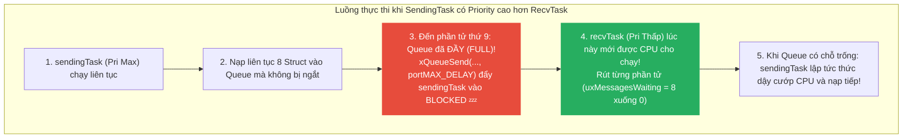
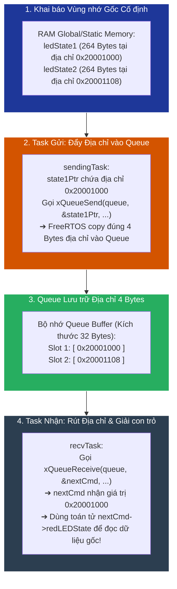
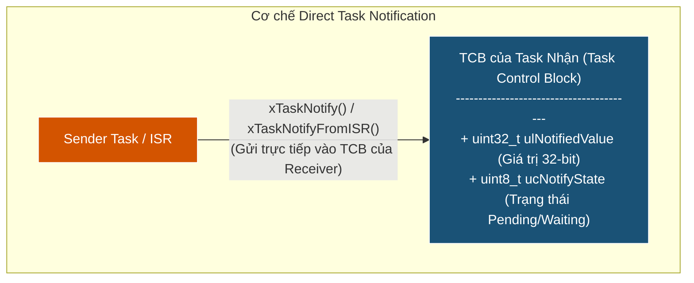

# <span style="color:#f1c40f">Chương 9: Truyền thông giữa các Task (Intertask Communication)</span>

---

## <span style="color:#e67e22">1. Truyền dữ liệu qua Queue bằng Giá trị — Passing Data through Queues by Value</span>

Trong các hệ thống nhúng thực tế, các Task không bao giờ chạy độc lập hoàn toàn mà luôn cần trao đổi dữ liệu với nhau. **Queue (Hàng đợi)** là một trong những cấu trúc dữ liệu cốt lõi và phổ biến nhất được FreeRTOS cung cấp để thực hiện truyền thông giữa các Task (Intertask Communication - IPC) một cách an toàn (thread-safe).

FreeRTOS Queue hoạt động theo nguyên tắc **FIFO (First-In, First-Out)** — dữ liệu nào vào trước sẽ được rút ra trước.

---

### <span style="color:#1abc9c">1.1 Truyền 1 Byte bằng Giá trị — Passing One Byte by Value</span>

Trong ví dụ đầu tiên, ta thiết lập một Queue chứa các giá trị **1 byte (`uint8_t`)** đại diện cho danh sách các câu lệnh điều khiển LED (`LED_CMDS`).

#### 1. Định nghĩa Enum trạng thái LED:
```c
typedef enum
{
    ALL_OFF   = 0,
    RED_ON    = 1,
    RED_OFF   = 2,
    BLUE_ON   = 3,
    BLUE_OFF  = 4,
    GREEN_ON  = 5,
    GREEN_OFF = 6,
    ALL_ON    = 7
} LED_CMDS;
```

#### 2. Khai báo Handle và Khởi tạo Queue:
```c
// Khai báo con trỏ Queue toàn cục (Handle)
static QueueHandle_t ledCmdQueue = NULL;

int main(void)
{
    HWInit();

    // Tạo Queue: Chứa tối đa 2 phần tử, mỗi phần tử kích thước 1 Byte (sizeof(uint8_t))
    ledCmdQueue = xQueueCreate(2, sizeof(uint8_t));
    assert_param(ledCmdQueue != NULL);

    // Tạo Task và khởi động Scheduler...
}
```

> [!NOTE]
> **CÚ PHÁP VÀ THAM SỐ CỦA HÀM `xQueueCreate()`:**
> ```c
> QueueHandle_t xQueueCreate( UBaseType_t uxQueueLength, UBaseType_t uxItemSize );
> ```
> - **`uxQueueLength`**: Số lượng phần tử tối đa mà Queue có thể chứa (ở ví dụ trên là `2`).
> - **`uxItemSize`**: Kích thước tính bằng Byte của **MỖI** phần tử (ở ví dụ trên là `sizeof(uint8_t)` = 1 byte).
> - **Giá trị trả về**: Con trỏ `QueueHandle_t` cấp phát từ FreeRTOS Heap, hoặc `NULL` nếu bộ nhớ Heap bị vắt cạn.

#### 3. Task Nhận Dữ liệu (`recvTask`):
```c
void recvTask( void* NotUsed )
{
    uint8_t nextCmd = 0;
    while(1)
    {
        // Chờ nhận 1 byte từ Queue. Nếu Queue rỗng, Task đi ngủ Blocked (portMAX_DELAY)
        if(xQueueReceive(ledCmdQueue, &nextCmd, portMAX_DELAY) == pdTRUE)
        {
            switch(nextCmd)
            {
                case ALL_OFF:
                    RedLed.Off(); GreenLed.Off(); BlueLed.Off();
                    break;
                case GREEN_ON:
                    GreenLed.On();
                    break;
                case GREEN_OFF:
                    GreenLed.Off();
                    break;
                case RED_ON:
                    RedLed.On();
                    break;
                case RED_OFF:
                    RedLed.Off();
                    break;
                case BLUE_ON:
                    BlueLed.On();
                    break;
                case BLUE_OFF:
                    BlueLed.Off();
                    break;
                case ALL_ON:
                    RedLed.On(); GreenLed.On(); BlueLed.On();
                    break;
            }
        }
    }
}
```

> [!NOTE]
> **CÚ PHÁP VÀ THAM SỐ CỦA HÀM `xQueueReceive()`:**
> ```c
> BaseType_t xQueueReceive( QueueHandle_t xQueue, void *pvBuffer, TickType_t xTicksToWait );
> ```
> - **`xQueue`**: Handle con trỏ Queue cần rút dữ liệu ra.
> - **`pvBuffer`**: Con trỏ trỏ tới vùng nhớ cục bộ để sao chép dữ liệu từ Queue vào (`&nextCmd`).
> - **`xTicksToWait`**: Thời gian chờ tối đa tính bằng RTOS Ticks nếu Queue đang **RỖNG** (`portMAX_DELAY` để chờ vô thời hạn).
> - **Giá trị trả về**: `pdTRUE` (hoặc `pdPASS`) nếu rút dữ liệu thành công; `pdFALSE` nếu bị Timeout hoặc Queue Handle không hợp lệ.

#### 4. Task Gửi Dữ liệu (`sendingTask`):
```c
void sendingTask( void* NotUsed )
{
    while(1)
    {
        for(int i = 0; i < 8; i++)
        {
            uint8_t ledCmd = (LED_CMDS) i;
            
            // Gửi 1 byte vào Queue. Nếu Queue đầy, chờ tối đa portMAX_DELAY
            xQueueSend(ledCmdQueue, &ledCmd, portMAX_DELAY);
            
            // Tạm dừng 200ms để LED chớp tắt kịp quan sát bằng mắt thường
            vTaskDelay(200 / portTICK_PERIOD_MS);
        }
    }
}
```

> [!NOTE]
> **CÚ PHÁP VÀ THAM SỐ CỦA HÀM `xQueueSend()`:**
> ```c
> BaseType_t xQueueSend( QueueHandle_t xQueue, const void *pvItemToQueue, TickType_t xTicksToWait );
> ```
> - **`xQueue`**: Handle con trỏ Queue cần gửi dữ liệu vào.
> - **`pvItemToQueue`**: Con trỏ trỏ tới dữ liệu nguồn cần sao chép vào Queue (`&ledCmd`).
> - **`xTicksToWait`**: Thời gian chờ tối đa tính bằng RTOS Ticks nếu Queue đang **ĐẦY** (`portMAX_DELAY` chờ đến khi có chỗ trống).
> - **Giá trị trả về**: `pdTRUE` (hoặc `pdPASS`) nếu gửi thành công; `errQUEUE_FULL` (hoặc `pdFALSE`) nếu Queue bị đầy quá thời gian Timeout.

> [!IMPORTANT]
> **Cơ chế Copy by Value (Sao chép theo Giá trị):**
> Khi gọi `xQueueSend(ledCmdQueue, &ledCmd, timeout)`, FreeRTOS sẽ **sao chép từng byte dữ liệu** từ địa chỉ `&ledCmd` vào bộ nhớ RAM nội bộ của Queue. 
> Sau khi hàm `xQueueSend()` trả về thành công, biến `ledCmd` **có thể bị thay đổi hoặc hủy bỏ** mà không ảnh hưởng đến dữ liệu đã lưu trong Queue!

---

### <span style="color:#1abc9c">1.2 Truyền Kiểu dữ liệu Phức hợp bằng Giá trị — Passing a Composite Data Type by Value</span>

Khi cần truyền đồng thời nhiều thông số (ví dụ: trạng thái của cả 3 LED và thời gian trễ kèm theo), ta có thể đóng gói vào một Cấu trúc C (`struct`).

#### 1. Định nghĩa `struct LedStates_t` (Sử dụng Bit-field):
```c
typedef struct
{
    uint8_t redLEDState   : 1; // Chiếm đúng 1 bit (0 hoặc 1)
    uint8_t blueLEDState  : 1; // Chiếm đúng 1 bit
    uint8_t greenLEDState : 1; // Chiếm đúng 1 bit
    uint32_t msDelayTime;      // Thời gian trễ duy trì trạng thái (ms)
} LedStates_t;
```

#### 2. Khai báo Queue chứa Struct:
```c
// Queue chứa tối đa 8 phần tử, mỗi phần tử có kích thước bằng sizeof(LedStates_t)
ledCmdQueue = xQueueCreate(8, sizeof(LedStates_t));
assert_param(ledCmdQueue != NULL);
```

#### 3. Task Nhận (`recvTask`) và Task Gửi (`sendingTask`):

```c
// Task Nhận: Đọc trọn vẹn cả Struct từ Queue
void recvTask( void* NotUsed )
{
    LedStates_t nextCmd;
    while(1)
    {
        if(xQueueReceive(ledCmdQueue, &nextCmd, portMAX_DELAY) == pdTRUE)
        {
            if(nextCmd.redLEDState == 1)   RedLed.On();   else RedLed.Off();
            if(nextCmd.blueLEDState == 1)  BlueLed.On();  else BlueLed.Off();
            if(nextCmd.greenLEDState == 1) GreenLed.On(); else GreenLed.Off();
            
            // Trì hoãn theo đúng tham số msDelayTime được gửi kèm trong struct!
            vTaskDelay(nextCmd.msDelayTime / portTICK_PERIOD_MS);
        }
    }
}

// Task Gửi: Đóng gói và đẩy nhiều Struct vào Queue
void sendingTask( void* NotUsed )
{
    LedStates_t nextStates;
    while(1)
    {
        // Lệnh 1: Bật cả 3 LED trong 100ms
        nextStates.redLEDState = 1; nextStates.greenLEDState = 1; nextStates.blueLEDState = 1;
        nextStates.msDelayTime = 100;
        xQueueSend(ledCmdQueue, &nextStates, portMAX_DELAY);

        // Lệnh 2: Tắt LED Xanh dương, giữ trong 1500ms
        nextStates.blueLEDState = 0;
        nextStates.msDelayTime = 1500;
        xQueueSend(ledCmdQueue, &nextStates, portMAX_DELAY);

        // Lệnh 3: Tắt LED Xanh lá, giữ trong 200ms
        nextStates.greenLEDState = 0;
        nextStates.msDelayTime = 200;
        xQueueSend(ledCmdQueue, &nextStates, portMAX_DELAY);

        // Lệnh 4: Tắt LED Đỏ
        nextStates.redLEDState = 0;
        xQueueSend(ledCmdQueue, &nextStates, portMAX_DELAY);
    }
}
```

---

### <span style="color:#1abc9c">1.3 Phân tích Tác động của Queue tới Thứ tự Thực thi & Độ ưu tiên (Understanding how queues affect execution)</span>

Để chứng minh dữ liệu được sao chép hoàn toàn vào bộ nhớ Queue, hãy xem xét thử nghiệm đảo ngược độ ưu tiên Task:

#### Cấu hình Độ ưu tiên:
- **`sendingTask`**: Đặt độ ưu tiên **CAO NHẤT** (`configMAX_PRIORITIES - 1`).
- **`recvTask`**: Đặt độ ưu tiên **THẤP** (`tskIDLE_PRIORITY + 1`).



> [!WARNING]
> **ĐÁNH GIÁ ĐỘ TRỄ (LATENCY TRADEOFF):**
> Đặt Queue quá sâu (ví dụ `8` phần tử) kết hợp với Task nhận có độ ưu tiên thấp sẽ tạo ra **Độ trễ lớn (Latency)** trong hệ thống. Các câu lệnh mới gửi vào Queue có thể phải xếp hàng chờ vài giây sau mới được `recvTask` thực thi!

> [!TIP]
> **Giải pháp Thiết kế Thực tế của Kỹ sư RTOS (Senior RTOS Design Patterns):**
> 1. **Ưu tiên `Priority(recvTask) > Priority(sendingTask)` (Phổ biến nhất)**: Dữ liệu vừa nạp vào Queue được rút ra ngay tức khắc ➔ **Độ trễ = 0**, Queue luôn rảnh ➔ Thu nhỏ Queue (1-2 phần tử) giúp **tiết kiệm RAM**.
> 2. **Dùng Queue ngắn (2-4 items) tạo Áp suất ngược (Backpressure)**: Nếu Task nhận xử lý chậm (thẻ SD, WiFi), Queue ngắn ép Task gửi phải đi ngủ `Blocked` chờ, tránh nạp dồn nợ lệnh.
> 3. **Chuyển sang Direct Task Notification**: Nếu chỉ cần tín hiệu/trạng thái mới nhất mà không cần xếp hàng các lệnh cũ.

---

## <span style="color:#e67e22">2. Truyền dữ liệu qua Queue bằng Tham chiếu — Passing Data through Queues by Reference</span>

### <span style="color:#1abc9c">2.1 Khi nào nên truyền bằng Tham chiếu? (When to pass by reference)</span>

Khi gói dữ liệu cần truyền có kích thước lớn (ví dụ: chứa mảng ký tự chuỗi, mảng buffer ảnh hoặc mảng cảm biến), việc **sao chép toàn bộ Struct (Pass by Value)** mỗi lần gọi `xQueueSend()` / `xQueueReceive()` sẽ gây ra **lãng phí CPU và RAM cực kỳ nghiêm trọng**.

#### Xét ví dụ Struct lớn chứa Chuỗi Ký tự (264 Bytes):

```c
#define MAX_MSG_LEN 256

typedef struct
{
    uint32_t redLEDState   : 1;
    uint32_t blueLEDState  : 1;
    uint32_t greenLEDState : 1;
    uint32_t msDelayTime;
    char message[MAX_MSG_LEN]; // Mảng 256 ký tự
} LedStates_t; // Tổng kích thước sau khi Compiler padding = 264 Bytes!
```

---

### <span style="color:#1abc9c">2.2 So sánh Truyền bằng Giá trị vs Truyền bằng Tham chiếu</span>

Thay vì copy 264 Bytes mỗi lần, ta tạo Queue chứa **Con trỏ (`LedStates_t*`)** — trên vi điều khiển 32-bit ARM Cortex-M, một con trỏ chỉ nặng **đúng 4 Bytes**!

| Tiêu chí so sánh | Truyền bằng Giá trị (Pass by Value) | Truyền bằng Tham chiếu (Pass by Reference) |
| :--- | :--- | :--- |
| **Khai báo Queue** | `xQueueCreate(8, sizeof(LedStates_t))` | `xQueueCreate(8, sizeof(LedStates_t*))` |
| **Kích thước bộ nhớ Queue** | **2,112 Bytes** ($264 \times 8$) | **32 Bytes** ($4 \times 8$) |
| **Dung lượng copy mỗi lần** | **264 Bytes** (Tốn nhiều chu kỳ clock CPU) | **4 Bytes** (Chỉ copy duy nhất 1 địa chỉ con trỏ) |
| **Bản gốc sau khi Send** | Có thể hủy/thay đổi ngay lập tức | **BẮT BUỘC** phải giữ nguyên vẹn trên RAM |
| **Độ phức tạp lập trình** | Đơn giản, an toàn | Cần quản lý vòng đời bộ nhớ và Quyền sở hữu |

---

### <span style="color:#1abc9c">2.3 Mã nguồn Thực tế Truyền Con trỏ — Real-World Code Passing Pointers</span>

```c
// 1. Tạo 2 biến tĩnh toàn cục nằm cố định trên RAM
static LedStates_t ledState1 = {
    1, 0, 0, 1000,
    "The quick brown fox jumped over the lazy dog. Red LED is ON."
};

static LedStates_t ledState2 = {
    0, 1, 0, 1000,
    "Another string log message. Blue LED is ON."
};

// 2. Task Ghi: Truyền ĐỊA CHỈ CON TRỎ vào Queue
void sendingTask( void* NotUsed )
{
    // Tạo biến con trỏ trỏ tới vùng nhớ tĩnh
    LedStates_t* state1Ptr = &ledState1;
    LedStates_t* state2Ptr = &ledState2;
    
    while(1)
    {
        // Truyền địa chỉ của con trỏ (&state1Ptr) vào Queue
        xQueueSend(ledCmdQueue, &state1Ptr, portMAX_DELAY);
        xQueueSend(ledCmdQueue, &state2Ptr, portMAX_DELAY);
        
        vTaskDelay(2000 / portTICK_PERIOD_MS);
    }
}

// 3. Task Đọc: Rút CON TRỎ ra từ Queue và giải con trỏ (Dereference `->`)
void recvTask( void* NotUsed )
{
    LedStates_t* nextCmd = NULL;
    while(1)
    {
        if(xQueueReceive(ledCmdQueue, &nextCmd, portMAX_DELAY) == pdTRUE)
        {
            // Sử dụng toán tử con trỏ -> để truy cập dữ liệu
            if(nextCmd->redLEDState == 1)  RedLed.On();  else RedLed.Off();
            if(nextCmd->blueLEDState == 1) BlueLed.On(); else BlueLed.Off();
            
            // In thông điệp chuỗi ra SEGGER SystemView
            SEGGER_SYSVIEW_PrintfHost(nextCmd->message);
        }
    }
}
```

#### Sơ đồ & Phân tích Quy trình Thực thi 4 Bước (Workflow Analysis):



#### Giải thích chi tiết từng bước:
1. **Bước 1 — Tạo vùng nhớ cố định**: Khai báo 2 biến `ledState1` và `ledState2` kiểu `static` hoặc `global` để đảm bảo vùng nhớ 264 Bytes nằm cố định trên RAM, không bị biến mất hay đè lấp khi hàm kết thúc.
2. **Bước 2 — Truyền địa chỉ con trỏ (`&state1Ptr`)**: 
   - `xQueueCreate(8, sizeof(LedStates_t*))` được cấu hình để chứa các **con trỏ 4 Bytes**.
   - Khi gọi `xQueueSend(ledCmdQueue, &state1Ptr, ...)`, ta truyền **địa chỉ của con trỏ `&state1Ptr`**. FreeRTOS sẽ sao chép đúng **4 Bytes địa chỉ RAM** (ví dụ `0x20001000`) vào ô nhớ của Queue mà **KHÔNG COPY 264 Bytes dữ liệu gốc**.
3. **Bước 3 — Queue lưu trữ 4 Bytes địa chỉ**: Mỗi slot trong Queue chỉ tiêu tốn 4 Bytes RAM để lưu địa chỉ con trỏ.
4. **Bước 4 — Rút địa chỉ và giải con trỏ (`->`)**:
   - `recvTask` truyền địa chỉ con trỏ nhận `&nextCmd`.
   - `xQueueReceive()` sao chép 4 Bytes địa chỉ `0x20001000` từ Queue vào biến con trỏ `nextCmd`.
   - `recvTask` sử dụng toán tử giải con trỏ `nextCmd->redLEDState` để truy cập trực tiếp vào vùng nhớ gốc 264 Bytes trên RAM.

---

### <span style="color:#1abc9c">2.4 Cạm bẫy & Quy tắc Vàng khi Truyền bằng Tham chiếu</span>

> [!CAUTION]
> **3 NGUYÊN TẮC VÀNG KHI TRUYỀN CON TRỎ QUA QUEUE:**
> 
> 1. **KHÔNG BAO GIỜ TRUYỀN CON TRỎ TRỎ TỚI BIẾN CỤC BỘ NẰM TRÊN STACK (Stack Variables)!**
>    - Nếu Task gửi tạo một struct cục bộ bên trong hàm rồi gửi con trỏ `&myLocalStruct` vào Queue, khi hàm đó kết thúc hoặc Task gửi bị Context Switch, vùng Stack đó sẽ bị ghi đè! Task nhận rút con trỏ ra đọc sẽ dính dữ liệu rác hoặc gây lỗi sập vi điều khiển (`HardFault`).
>    - **Giải pháp**: Vùng nhớ chứa dữ liệu gốc bắt buộc phải là biến **`global`**, biến **`static`**, hoặc cấp phát động bằng **`pvPortMalloc()`**.
> 
> 2. **CẢNH BÁO ÉP KIỂU `void*` CỦA FREERTOS:**
>    - Các hàm `xQueueSend` / `xQueueReceive` nhận tham số kiểu `void*`. Compiler sẽ **KHÔNG CẢNH BÁO** nếu bạn truyền nhầm địa chỉ của Struct thay vì địa chỉ của Con trỏ! Bạn phải tự quản lý chính xác kiểu dữ liệu.
> 
> 3. **QUYỀN SỞ HỮU DỮ LIỆU (DATA OWNERSHIP):**
>    - Khi truyền bằng Giá trị, Queue sở hữu bản sao dữ liệu.
>    - Khi truyền bằng Tham chiếu, Queue chỉ giữ địa chỉ. Bạn phải quy định rõ ràng: Task nào chịu trách nhiệm giải phóng bộ nhớ (`vPortFree()`) sau khi dùng xong nếu dữ liệu được cấp phát động!

---

## <span style="color:#e67e22">3. Thông báo Trực tiếp đến Task — Direct Task Notifications</span>

### <span style="color:#1abc9c">3.1 Khái niệm & Ưu điểm vượt trội của Direct Task Notifications</span>

Mặc dù Queue rất linh hoạt, nhưng trong nhiều trường hợp ta chỉ cần gửi một tín hiệu hoặc một giá trị đơn giản đến một Task cụ thể. FreeRTOS cung cấp cơ chế **Direct Task Notifications (Thông báo trực tiếp)** với hiệu năng vượt trội.



#### Ưu điểm so với Queue / Semaphore:
1. **Tốc độ nhanh hơn từ 25% đến 45%**: Không cần trải qua các thao tác quản lý cấu trúc hàng đợi phức tạp.
2. **Tiết kiệm 100% RAM Overhead**: Không cần gọi hàm tạo đối tượng RAM (`xQueueCreate` / `xSemaphoreCreate`). Giá trị 32-bit đã có sẵn bên trong **TCB (Task Control Block)** của mỗi Task!

#### Giới hạn:
- Chỉ gửi được cho **duy nhất 1 Task nhận chỉ định** (thông qua Task Handle).
- Ngắt ISR chỉ có thể gửi thông báo (`xTaskNotifyFromISR`), không thể nhận thông báo.
- Không có khả năng xếp hàng đợi nhiều phần tử (chỉ chứa duy nhất 1 giá trị 32-bit).

---

### <span style="color:#1abc9c">3.2 Truyền dữ liệu đơn giản bằng Task Notifications — Passing Simple Data Using Task Notifications</span>

Sử dụng giá trị 32-bit làm **Bitmask** để bật/tắt các LED:

```c
#include "FreeRTOS.h"
#include "task.h"

// Định nghĩa các Bitmask cho từng LED
#define RED_LED_MASK   0x0001
#define BLUE_LED_MASK  0x0002
#define GREEN_LED_MASK 0x0004

// Task Handle của Task Nhận
static TaskHandle_t recvTaskHandle = NULL;

// 1. Task Nhận Notification (`recvTask`):
void recvTask( void* NotUsed )
{
    while(1)
    {
        // Chờ nhận Notification. Hàm này vừa đọc vừa reset giá trị về 0 (pdTRUE)
        uint32_t notificationValue = ulTaskNotifyTake(pdTRUE, portMAX_DELAY);
        
        // Kiểm tra từng Bitmask
        if((notificationValue & RED_LED_MASK) != 0)   RedLed.On();   else RedLed.Off();
        if((notificationValue & BLUE_LED_MASK) != 0)  BlueLed.On();  else BlueLed.Off();
        if((notificationValue & GREEN_LED_MASK) != 0) GreenLed.On(); else GreenLed.Off();
    }
}

// 2. Task Gửi Notification (`sendingTask`):
void sendingTask( void* NotUsed )
{
    while(1)
    {
        // Gửi Notification trực tiếp đến recvTaskHandle kèm Bitmask RED_LED
        xTaskNotify(recvTaskHandle, RED_LED_MASK, eSetValueWithOverwrite);
        vTaskDelay(200 / portTICK_PERIOD_MS);

        // Gửi Notification kèm Bitmask GREEN_LED
        xTaskNotify(recvTaskHandle, GREEN_LED_MASK, eSetValueWithOverwrite);
        vTaskDelay(200 / portTICK_PERIOD_MS);
        
        // Gửi Notification kèm Bitmask BLUE_LED
        xTaskNotify(recvTaskHandle, BLUE_LED_MASK, eSetValueWithOverwrite);
        vTaskDelay(200 / portTICK_PERIOD_MS);
    }
}

int main(void)
{
    HWInit();

    // Tạo Task và lưu lại Handle của recvTask
    xTaskCreate(recvTask, "recvTask", 128, NULL, tskIDLE_PRIORITY + 2, &recvTaskHandle);
    assert_param(recvTaskHandle != NULL);

    xTaskCreate(sendingTask, "sendingTask", 128, NULL, tskIDLE_PRIORITY + 1, NULL);

    vTaskStartScheduler();
    while(1) {}
}
```

---

### <span style="color:#1abc9c">3.3 Các Chế độ Hoạt động của Task Notification (`eNotifyAction`)</span>

Khi gọi hàm `xTaskNotify(xTaskToNotify, ulValue, eAction)`, tham số `eAction` quyết định cách giá trị 32-bit được ghi vào TCB của Task nhận:

| Hằng số `eNotifyAction` | Hành vi xử lý giá trị 32-bit | Ứng dụng thực tế thay thế |
| :--- | :--- | :--- |
| `eNoAction` | Phát thông báo mà **không thay đổi** giá trị notification value. | Thay thế **Binary Semaphore** (Tốc độ cực nhanh). |
| `eSetBits` | Thực hiện phép **OR bitwise** (`ulNotifiedValue \|= ulValue`). | Truyền **Event Flags / Bitmasks** đa sự kiện. |
| `eIncrement` | Tự động **tăng giá trị lên 1** (`ulNotifiedValue++`). | Thay thế **Counting Semaphore**. |
| `eSetValueWithOverwrite` | **Ghi đè trực tiếp** giá trị mới kể cả khi giá trị cũ chưa được đọc. | Gửi lệnh mới nhất (Mailbox pattern). |
| `eSetValueWithoutOverwrite` | Chỉ ghi nếu giá trị cũ đã được đọc. Nếu chưa đọc, hàm trả về `pdFAIL`. | Tránh ghi đè dữ liệu chưa xử lý. |

---

### <span style="color:#1abc9c">3.4 Bảng so sánh Trực quan: Direct Task Notifications vs Queues vs Semaphores</span>

| Tiêu chí | Direct Task Notifications | FreeRTOS Queue | Binary / Counting Semaphore |
| :--- | :--- | :--- | :--- |
| **Bộ nhớ RAM tốn thêm** | **0 Bytes** (Tích hợp sẵn trong TCB) | Tốn bộ nhớ cấp phát RAM Queue | Tốn bộ nhớ cấp phát RAM Semaphore |
| **Tốc độ thực thi** | 🚀 **Nhanh nhất** (Hơn Queue 25-45%) | 🐢 Chậm hơn do copy & quản lý list | 🚗 Trung bình |
| **Sức chứa dữ liệu** | 1 giá trị 32-bit (`uint32_t`) | N phần tử (mọi kích thước Struct) | Chỉ đếm số lượng (0/1 hoặc Count) |
| **Số Task nhận** | Chỉ duy nhất **1 Task chỉ định** | **Nhiều Task** có thể chờ nhận | **Nhiều Task** có thể chờ nhận |
| **Gửi từ ngắt ISR** | ✅ Có (`xTaskNotifyFromISR`) | ✅ Có (`xQueueSendFromISR`) | ✅ Có (`xSemaphoreGiveFromISR`) |

---

## <span style="color:#e67e22">4. Tổng kết & Câu hỏi Ôn tập — Summary & Review Questions</span>

### <span style="color:#1abc9c">4.1 Bảng tổng hợp các API trong Chương 9</span>

| Hàm API FreeRTOS | Header | Mục đích sử dụng |
| :--- | :--- | :--- |
| `xQueueCreate(length, size)` | `queue.h` | Khởi tạo Queue trên FreeRTOS Heap. |
| `xQueueSend(queue, &item, ticks)` | `queue.h` | Gửi phần tử vào đuôi Queue (FIFO). |
| `xQueueReceive(queue, &buffer, ticks)` | `queue.h` | Rút phần tử khỏi đầu Queue. |
| `xTaskNotify(handle, value, action)` | `task.h` | Gửi Direct Task Notification kèm hành động `eNotifyAction`. |
| `ulTaskNotifyTake(clearOnExit, ticks)` | `task.h` | Nhận Notification kiểu Semaphore (đọc và giảm/clear value). |
| `xTaskNotifyWait(entry, exit, &val, ticks)`| `task.h` | Nhận Notification kiểu Bitmask hoặc giá trị đầy đủ. |

---

### <span style="color:#1abc9c">4.2 Đáp án Câu hỏi Ôn tập từ Sách (Review Questions & Answers)</span>

#### Câu 1: Các kiểu dữ liệu nào có thể được truyền vào Queue?
> **Đáp án:** **BẤT KỲ KIỂU DỮ LIỆU NÀO** (từ `uint8_t`, `int`, `float`, các cấu trúc `struct` phức tạp, cho đến các con trỏ `pointer`). Vì hàm Queue nhận tham số kiểu `void*` và kích thước byte cố định lúc tạo.

#### Câu 2: Chuyện gì xảy ra với Task khi nó cố thao tác trên Queue trong lúc chờ đợi?
> **Đáp án:** Task sẽ chuyển sang trạng thái **`BLOCKED` (Đi ngủ 💤)** và tiêu thụ **0% CPU** cho đến khi có dữ liệu trong Queue (nếu đọc) / có chỗ trống trong Queue (nếu gửi) hoặc cho đến khi hết thời gian Timeout.

#### Câu 3: Nêu một lưu ý quan trọng cần cân nhắc khi truyền dữ liệu qua Queue bằng Tham chiếu (Pass by Reference)?
> **Đáp án:** Dữ liệu gốc **KHÔNG ĐƯỢC NẰM TRÊN STACK** (không dùng biến cục bộ hàm). Vùng nhớ được trỏ đến phải tồn tại cố định trên RAM trong suốt quá trình xử lý (dùng biến `global`, `static`, hoặc cấp phát động `pvPortMalloc`). Đồng thời phải làm rõ Quyền sở hữu dữ liệu (Data Ownership) để free RAM đúng lúc.

#### Câu 4: Direct Task Notifications có thể thay thế hoàn toàn Queues: Đúng hay Sai?
> **Đáp án:** **FALSE (Sai)**. Direct Task Notifications chỉ có thể gửi đến **1 Task duy nhất**, chỉ chứa 1 giá trị 32-bit và không có khả năng đệm nhiều phần tử như Queue.

#### Câu 5: Direct Task Notifications có thể gửi dữ liệu thuộc bất kỳ kiểu nào: Đúng hay Sai?
> **Đáp án:** **FALSE (Sai)**. Direct Task Notifications bị giới hạn chỉ truyền duy nhất **1 giá trị số nguyên 32-bit (`uint32_t`)** (hoặc các Bitmask).

#### Câu 6: Những ưu điểm của Direct Task Notifications so với Queue là gì?
> **Đáp án:** 
> 1. **Tốc độ thực thi nhanh hơn từ 25% đến 45%**.
> 2. **Không tốn tài nguyên RAM overhead** (vì tận dụng giá trị sẵn có trong TCB của Task nhận).
> 3. Cung cấp các chế độ thao tác Bitwise (`eSetBits`), Tăng giá trị (`eIncrement`), hoặc Ghi đè (`eSetValueWithOverwrite`) rất linh hoạt.
