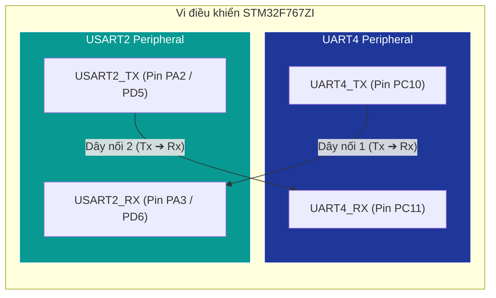
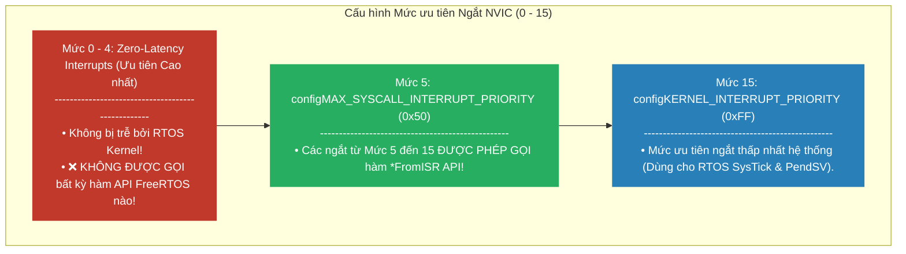
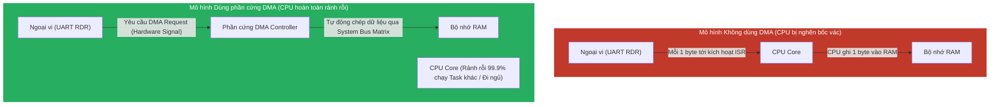
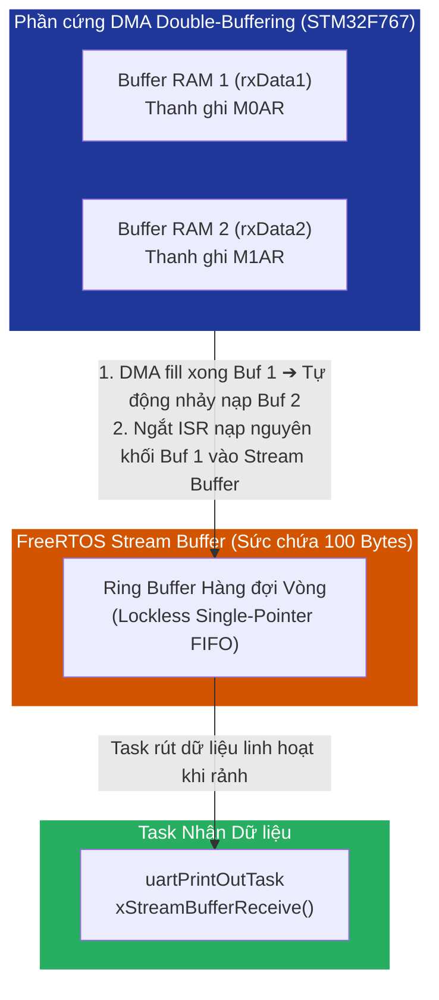
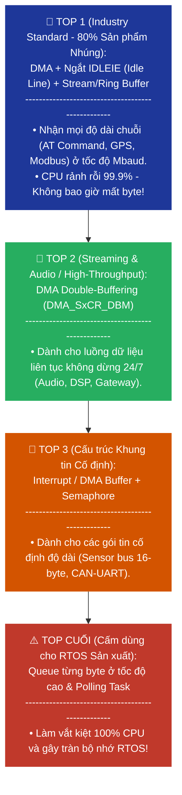

# <span style="color:#f1c40f">Chương 10: Trình điều khiển Ngoại vi và Trình xử lý Ngắt (Drivers and ISRs)</span>

---

## <span style="color:#e67e22">1. Giới thiệu về UART & Cấu hình Phần cứng — Introducing the UART & Hardware Setup</span>

Tương tác với các ngoại vi vi điều khiển (MCU peripherals) là một trong những nhiệm vụ quan trọng nhất của hệ thống nhúng. Trong chương này, chúng ta sẽ xây dựng các trình điều khiển (drivers) cho ngoại vi truyền thông phổ biến: **UART (Universal Asynchronous Receiver/Transmitter)**.

### <span style="color:#1abc9c">1.1 Khái niệm về UART</span>
* **UART (Universal Asynchronous Receiver/Transmitter)**: Là bộ truyền/nhận bất đồng bộ nối tiếp. Dữ liệu được truyền qua từng bit bằng cách biến đổi điện áp trên đường truyền theo một tần số xác định gọi là **Baud Rate**.
* **Đặc điểm "Bất đồng bộ" (Asynchronous)**: Không cần đường tín hiệu xung clock riêng biệt. Khung dữ liệu (Packet/Frame) được bao bọc bởi:
  - **Start bit**: Đánh dấu bắt đầu khung truyền.
  - **Data bits**: Thường là 8-bit dữ liệu.
  - **Parity bit** *(tùy chọn)*: Kiểm tra lỗi parity.
  - **Stop bit(s)**: Đánh dấu kết thúc khung truyền.
* **USART vs UART**: USART (Universal Synchronous/Asynchronous Receiver/Transmitter) hỗ trợ cả chế độ đồng bộ (có chân Clock) và bất đồng bộ.

---

### <span style="color:#1abc9c">1.2 Cấu hình Nối dây Phần cứng trên STM32 Nucleo-F767ZI</span>

Để quan sát luồng truyền nhận song phương, ta sẽ nối chéo 2 bộ UART có sẵn trên bo mạch Nucleo-F767ZI:



---

### <span style="color:#1abc9c">1.3 Quy trình 10 Bước Cấu hình Ngoại vi trên STM32 (10-Step Peripheral Initialization Setup)</span>

Dưới đây là **đầy đủ 10 bước chuẩn hóa** từ sách được áp dụng cho mọi ngoại vi kết nối với chân vi điều khiển STM32 (ví dụ `UART4`):

1. **Bước 1 — Định hướng cấu hình các đường GPIO (Configure GPIO lines)**: Mỗi chân GPIO có thể dùng chung cho nhiều ngoại vi khác nhau, cần cấu hình kết nối chân vi điều khiển tới ngoại vi mong muốn (ở đây là nối PC10 và PC11 với tín hiệu UART4).
2. **Bước 2 — Tra cứu Port và Bit tương ứng (Reference desired Port and Bit)**: Mở Datasheet vi điều khiển (ví dụ Datasheet STM32F767xx DoCID 029041), xác định Port C Bit 10 (`UART4_TX`) và Bit 11 (`UART4_RX`).
3. **Bước 3 — Tìm chức năng Alternate Function (Find Alternate Function)**: Tra bảng Alternate Function Mapping trong Datasheet để tìm chức năng UART4_Rx / UART4_Tx.
4. **Bước 4 — Xác định chỉ số Alternate Function (Find AF Number)**: Tra bảng được mã hiệu số AF tương ứng (ở đây là **`AF8`** cho Port C chân 10 và 11).
5. **Bước 5 — Thiết lập các thanh ghi GPIO (Set up GPIO Registers)**: Điền cấu trúc `GPIO_InitTypeDef` và gọi hàm `HAL_GPIO_Init()` để ghi thanh ghi phần cứng:
   ```c
   GPIO_InitTypeDef GPIO_InitStruct = {0};
   // PC10 = UART4_TX, PC11 = UART4_RX
   GPIO_InitStruct.Pin       = GPIO_PIN_10 | GPIO_PIN_11;
   GPIO_InitStruct.Mode      = GPIO_MODE_AF_PP; // Alternate Function Push-Pull
   GPIO_InitStruct.Pull      = GPIO_NOPULL;
   GPIO_InitStruct.Alternate = GPIO_AF8_UART4;  // Gán AF8
   HAL_GPIO_Init(GPIOC, &GPIO_InitStruct);
   ```
6. **Bước 6 — Bật Clock cho Ngoại vi (Enable Peripheral Clocks)**: Mặc định clock ngoại vi bị tắt để tiết kiệm năng lượng, phải bật clock bằng cách ghi thanh ghi RCC (Reset and Clock Control):
   ```c
   __UART4_CLK_ENABLE(); // Bật Peripheral Clock cho UART4
   ```
7. **Bước 7 — Cấu hình Ngắt NVIC (Configure Interrupts)**: Nếu dùng Driver dựa trên Ngắt, cấu hình mức ưu tiên ngắt và bật ngắt trong NVIC (`NVIC_SetPriority`, `NVIC_EnableIRQ`).
8. **Bước 8 — Cấu hình DMA (Configure DMA)**: Nếu dùng bộ truy cập bộ nhớ trực tiếp DMA, chọn Stream, Channel và khởi tạo `HAL_DMA_Init()`.
9. **Bước 9 — Cấu hình Thông số Ngoại vi UART (Configure Peripheral Parameters)**: Thiết lập Baud rate, Word length, Stop bits, Parity, Flow control bằng cấu trúc `UART_HandleTypeDef` và gọi `HAL_UART_Init()`:
   ```c
   UART_HandleTypeDef uartInitStruct = {0};
   uartInitStruct.Instance                    = UART4;
   uartInitStruct.Init.BaudRate               = 9600;
   uartInitStruct.Init.WordLength             = UART_WORDLENGTH_8B;
   uartInitStruct.Init.StopBits               = UART_STOPBITS_1;
   uartInitStruct.Init.Parity                 = UART_PARITY_NONE;
   uartInitStruct.Init.Mode                   = UART_MODE_TX_RX;
   uartInitStruct.Init.HwFlowCtl              = UART_HWCONTROL_NONE;
   uartInitStruct.Init.OverSampling           = UART_OVERSAMPLING_16;
   uartInitStruct.Init.OneBitSampling         = UART_ONE_BIT_SAMPLE_DISABLE;
   
   HAL_StatusTypeDef retVal = HAL_UART_Init(&uartInitStruct);
   assert_param(retVal == HAL_OK);
   ```
10. **Bước 10 — Cấu hình bổ sung trước khi Truyền (Mode-Specific Final Setup)**: Tùy thuộc vào phương pháp truyền chọn dùng (Polling, Interrupt hay DMA), tiến hành kích hoạt ngắt `RXNE` hoặc bật cờ `DMAR` ngay trước khi bắt đầu nhận dữ liệu.

---

## <span style="color:#e67e22">2. Driver UART bằng phương pháp Vòng lặp Chờ — Creating a Polled UART Driver</span>

### <span style="color:#1abc9c">2.1 Mã nguồn Minh họa Driver Polling</span>

Cách đơn giản nhất để nhận dữ liệu từ UART là đặt một vòng lặp `while` liên tục kiểm tra cờ **RXNE (Receive Data Register Not Empty)** trong thanh ghi trạng thái `ISR`.

#### 1. Task Nhận Dữ liệu theo cơ chế Polling (`polledUartReceive`):
```c
void polledUartReceive( void* NotUsed )
{
    uint8_t nextByte;
    // Khởi tạo USART2 với Baud rate 9600
    STM_UartInit(USART2, 9600, NULL, NULL);
    
    while(1)
    {
        // 🚀 Vòng lặp Polling: Chờ liên tục cho đến khi bit RXNE = 1
        while(!(USART2->ISR & USART_ISR_RXNE_Msk));
        
        // Đọc dữ liệu từ thanh ghi RDR (hành động này tự động xóa cờ RXNE)
        nextByte = USART2->RDR;
        
        // Đẩy 1 byte vào Queue
        xQueueSend(uart2_BytesReceived, &nextByte, 0);
    }
}
```

#### 2. Task Tiêu thụ & In Dữ liệu (`uartPrintOutTask`):
```c
void uartPrintOutTask( void* NotUsed)
{
    char nextByte;
    while(1)
    {
        // Đọc byte từ Queue và in ra SystemView
        xQueueReceive(uart2_BytesReceived, &nextByte, portMAX_DELAY);
        SEGGER_SYSVIEW_PrintfHost("%c", nextByte);
    }
}
```

---

### <span style="color:#1abc9c">2.2 Phân tích Hiệu năng & Giới hạn Toán học (Math & Performance Limits)</span>

> [!CAUTION]
> **KẾT QUẢ PHÂN TÍCH HỆ THỐNG TRÊN SEGGER SYSTEMVIEW:**
> - **Tiêu thụ CPU**: Driver Polling ngốn tới **>96% toàn bộ tài nguyên CPU** chỉ để ngồi chờ từng byte đến!
> - **Tần số gọi Queue**: 960 Hz (phù hợp với tốc độ 9600 baud = ~960 ký tự/giây).
> - **Giới hạn Toán học của Queue đối với Baud Rate**:
>   - Trên STM32F767 @ 216 MHz, tốc độ truyền USART2 tối đa có thể lên tới 27 Mbaud (3 triệu byte/giây).
>   - Mỗi thao tác `xQueueSend` tốn khoảng **7 µs**.
>   - Tốc độ xử lý Queue tối đa của hệ thống chỉ đạt khoảng $\approx 143,000$ phần tử/giây ($1 / 7\mu\text{s}$), kể cả khi CPU không làm gì khác!
>   - Do đó, việc đẩy từng byte của luồng UART tốc độ cao qua Queue thông thường sẽ làm **sập/nghẽn CPU lập tức**.
> - **Rủi ro mất dữ liệu (Overrun Error - `ORE`)**: Nếu một Task có độ ưu tiên cao hơn chạy tốn quá 2ms, ký tự mới đến sẽ ghi đè lên thanh ghi RDR làm mất dữ liệu!

---

### <span style="color:#1abc9c">2.3 Đánh giá Ưu/Nhược điểm & Trường hợp Sử dụng Polled Drivers</span>

| Ưu điểm | Nhược điểm | Trường hợp nên sử dụng Polled Driver |
| :--- | :--- | :--- |
| • Lập trình cực kỳ đơn giản.<br/>• Không cần cấu hình NVIC ngắt rắc rối. | • **Lãng phí khủng khiếp chu kỳ CPU** (>96%).<br/>• Bắt buộc Task phải ở Priority cao nhất.<br/>• Dễ bị mất dữ liệu nếu bị Task khác ngắt. | 1. **Khảo sát hệ thống ban đầu (Hardware Bring-up)**.<br/>2. **Sự kiện diễn ra cực nhanh (cỡ ns/µs)**: Polling nhanh hơn tạo cơ chế ngắt/đồng bộ phức tạp.<br/>3. **Truyền chuỗi ngắn (Polled TX)**: Gửi vài ký tự log ngắt quãng. |

---

## <span style="color:#e67e22">3. Phân biệt Task vs Trình xử lý Ngắt ISR — Differentiating between Tasks and ISRs</span>

### <span style="color:#1abc9c">3.1 So sánh Chi tiết: FreeRTOS Task vs Hardware ISR (Tasks vs ISRs Comparison)</span>

#### 1. Các Điểm Giống nhau (Similarities):
* **Thực thi song song**: Cả Task và ISR đều là các cơ chế giúp vi điều khiển thực thi mã giả lập song song (parallel execution).
* **Chạy khi có nhu cầu**: Cả hai chỉ chạy khi có sự kiện hoặc có nhu cầu xử lý (không chạy lãng phí).
* **Viết bằng C/C++**: Cả Task và ISR ngày nay đều được lập trình hoàn toàn bằng ngôn ngữ C/C++ (không cần phải viết bằng mã máy Assembly).

---

#### 2. Bảng So sánh 6 Điểm Khác biệt Cốt lõi (Differences):

| Tiêu chí So sánh | FreeRTOS Task | Hardware ISR (Interrupt Service Routine) |
| :--- | :--- | :--- |
| **1. Nguồn kích hoạt (Context Source)** | Do **FreeRTOS Kernel Scheduler** đưa vào thực thi dựa trên Độ ưu tiên Task. | Do **Phần cứng MCU (Hardware)** kích hoạt ngay lập tức khi có sự kiện ngoại vi. |
| **2. Thời gian thực thi & Vòng lặp** | Thường chạy vòng lặp vô tận `while(1)`, đi ngủ `Blocked` nhường CPU cho Task khác. | **BẮT BUỘC phải thoát cực nhanh** để không chiếm giữ CPU, tránh làm nhỡ các ngắt khác. |
| **3. Tham số đầu vào (Parameters)** | Có thể nhận tham số truyền vào (`void* pvParameters`) khi khởi tạo. | **KHÔNG BAO GIỜ** có tham số đầu vào (chỉ đọc trực tiếp các thanh ghi phần cứng). |
| **4. Quyền sử dụng API FreeRTOS** | Được gọi toàn bộ hàm API FreeRTOS và được phép đi ngủ chờ (`xTicksToWait`). | **Chỉ được gọi các hàm API dành riêng cho Ngắt `*FromISR`** (trả về ngay, cấm đi ngủ). Gọi sai hàm sẽ sập `configASSERT`. |
| **5. Phụ thuộc vào RTOS Kernel** | Bắt buộc phải chạy dưới sự quản lý của FreeRTOS Kernel. | **Có thể chạy độc lập 100% ngoài RTOS Kernel** (đối với các ngắt Zero-latency có ưu tiên cao). |
| **6. Bộ nhớ Stack sử dụng** | Mỗi Task được cấp phát **Một Bộ nhớ Stack riêng** (Private Dedicated Stack). | Tất cả các ISR dùng chung **Duy nhất 1 Bộ nhớ Stack Hệ thống** (System Main Stack `MSP`). |

---

### <span style="color:#1abc9c">3.2 Sử dụng FreeRTOS API từ Trình xử lý Ngắt — Using the FreeRTOS API from Interrupts</span>

Hầu hết các nguyên mẫu FreeRTOS (Queue, Semaphore, Task Notification) đều có phiên bản dành riêng cho Ngắt với hậu tố **`*FromISR`** (ví dụ: `xQueueSendFromISR`, `xSemaphoreGiveFromISR`). 

#### Các Quy tắc & Đặc điểm Cốt lõi khi gọi API từ Ngắt:

1. **Không bao giờ bị đi ngủ (`Non-blocking`)**: 
   - Các hàm `FromISR` **không có** tham số thời gian chờ `xTicksToWait`. Nếu gặp Queue đầy hoặc Semaphore đã bị lấy, hàm sẽ lập tức trả về lỗi (`errQUEUE_FULL` / `pdFAIL`) chứ không bao giờ chặn (Block) ngắt!
2. **Tham số bắt buộc `pxHigherPriorityTaskWoken`**:
   - Tất cả các hàm `FromISR` đều yêu cầu truyền một con trỏ `BaseType_t *pxHigherPriorityTaskWoken`.
   - Nếu việc thao tác API trong ngắt giải phóng/đánh thức một Task có **Độ ưu tiên cao hơn** Task đang bị ngắt, hàm sẽ đặt biến này thành `pdTRUE`.
   - Cuối hàm ngắt, lập trình viên gọi `portYIELD_FROM_ISR(xHigherPriorityTaskWoken)` để yêu cầu Scheduler thực hiện Context Switch ngay lập tức sau khi ngắt kết thúc.

3. **Cơ chế Phân vùng Mức ưu tiên Ngắt trong NVIC (`FreeRTOSConfig.h`)**:
   - Trong `main()`, ta gọi `NVIC_SetPriorityGrouping(0)` để dùng toàn bộ 4 bit của Cortex-M7 cho Preemption Priority (16 mức từ `0` đến `15`).
   - Trên ARM Cortex-M, **số nguyên nhỏ hơn nghĩa là mức ưu tiên phần cứng CAO HƠN**.



#### Chi tiết Phép Dịch Bit Thanh ghi NVIC trên Cortex-M:
- **`configMAX_SYSCALL_INTERRUPT_PRIORITY`**: Đặt mức `5`. Khi dịch sang 8-bit của thanh ghi Cortex-M (`5 << 4`), ta được giá trị `0x50` (hoặc `0x5F` tương đương 80/95 thập phân).
- **`configKERNEL_INTERRUPT_PRIORITY`**: Đặt mức thấp nhất `15`. Khi dịch trái (`15 << 4 | 0x0F`), ta được `0xFF` (hoặc `0xF0` tương đương 255/240 thập phân).

> [!CAUTION]
> **QUY TẮC VÀNG VỀ NGẮT TRONG FREERTOS:**
> Nếu một ngắt phần cứng NVIC có mức ưu tiên cao hơn `configMAX_SYSCALL_INTERRUPT_PRIORITY` (ví dụ mức 0, 1, 2, 3, 4) mà lỡ gọi bất kỳ hàm `*FromISR` nào, hệ thống sẽ lập tức **sập và kích hoạt `configASSERT()`**!

---

## <span style="color:#e67e22">4. Xây dựng Driver UART dựa trên Ngắt — Creating ISR-Based Drivers</span>

Trong lần cải tiến này, thay vì bắt một Task chạy lặp vô tận Polling các thanh ghi UART (ngốn >95% CPU), chúng ta cấu hình ngoại vi `USART2` và bộ điều khiển ngắt `NVIC` để phát sinh ngắt phần cứng mỗi khi có một byte mới được nhận về.

---

### <span style="color:#1abc9c">4.1 Driver dựa trên Ngắt dùng Queue — Queue-Based Driver</span>

Mô hình này cải tiến driver polling bằng cách dùng ngắt để tự động nạp từng byte vào Queue. Hệ thống gồm **4 thành phần chính**:

#### <span style="color:#3498db">1. Task Nhận và In Dữ liệu (`uartPrintOutTask`)</span>

* **Mục đích của Task**: Khởi tạo phần cứng bộ ngoại vi UART2, kích hoạt ngắt nhận, và đóng vai trò là **Task tiêu thụ (Consumer Task)** liên tục đứng chờ rút từng byte dữ liệu từ Queue `uart2_BytesReceived` để in ra màn hình SystemView Host. Khi Queue rỗng, Task tự động rơi vào trạng thái đi ngủ (`BLOCKED`) nhường toàn bộ 100% CPU cho các Task khác.

```c
void uartPrintOutTask( void* NotUsed)
{
    char nextByte;
    STM_UartInit(USART2, 9600, NULL, NULL); // Khởi tạo phần cứng USART2
    startReceiveInt();                      // Bắt đầu nhận ngắt
    while(1)
    {
        // Chờ nhận byte từ Queue và in ra SystemView
        xQueueReceive(uart2_BytesReceived, &nextByte, portMAX_DELAY);
        SEGGER_SYSVIEW_PrintfHost("%c", nextByte);
    }
}
```
* **Quy trình hoạt động từng bước của Task**:
  1. Gọi `STM_UartInit()` cấu hình phần cứng chân GPIO, RCC clock, baud rate 9600 cho `USART2`.
  2. Gọi `startReceiveInt()` để mở ngắt nhận dữ liệu `RXNE` trên ngoại vi và bộ điều khiển NVIC.
  3. Đi vào vòng lặp vô tận `while(1)`.
  4. Gọi `xQueueReceive(uart2_BytesReceived, &nextByte, portMAX_DELAY)`. Do Queue ban đầu đang rỗng, Task lập tức nhường CPU và rơi vào trạng thái `BLOCKED` (ngủ chờ dữ liệu không giới hạn thời gian).
  5. Khi ngắt ISR nạp 1 byte vào Queue, Task chuyển sang trạng thái `READY` ➔ được Scheduler cấp CPU sang `RUNNING`.
  6. Rút 1 byte vừa nhận khỏi Queue cất vào `nextByte` và gửi ra SystemView qua `SEGGER_SYSVIEW_PrintfHost()`.
  7. Quay lại đầu vòng lặp `while(1)` tiếp tục gọi `xQueueReceive()` và đi ngủ chờ byte kế tiếp.

#### <span style="color:#3498db">2. Hàm Kích hoạt Ngắt Nhận (`startReceiveInt`)</span>

* **Mục đích của Hàm**: Thiết lập cờ trạng thái `rxInProgress`, bật ngắt nhận `RXNE` và ngắt lỗi phần cứng trên ngoại vi `USART2`, đồng thời định cấu hình mức ưu tiên ngắt an toàn cho FreeRTOS (Priority = 6) và kích hoạt ngắt trong NVIC để CPU sẵn sàng phản ứng ngay khi có byte dữ liệu tới.

```c
static bool rxInProgress = false;

void startReceiveInt( void )
{
    rxInProgress = true;
    USART2->CR3 |= USART_CR3_EIE;                      // Bật ngắt lỗi (Error Interrupts)
    USART2->CR1 |= (USART_CR1_UE | USART_CR1_RXNEIE);  // Bật ngoại vi & ngắt RXNE (Rx Not Empty)
    NVIC_SetPriority(USART2_IRQn, 6);                  // Đặt mức ưu tiên ngắt NVIC = 6
    NVIC_EnableIRQ(USART2_IRQn);                       // Bật ngắt trong NVIC
}
```
* **Quy trình hoạt động từng bước của Hàm**:
  1. Gán cờ toàn cục `rxInProgress = true` thông báo hệ thống đang sẵn sàng xử lý dữ liệu ngắt.
  2. Bật ngắt lỗi phần cứng (`USART_CR3_EIE`) và ngắt nhận `RXNE` (`USART_CR1_RXNEIE`) trên thanh ghi điều khiển `USART2`.
  3. Gọi `NVIC_SetPriority(USART2_IRQn, 6)` đặt mức ưu tiên ngắt phần cứng trong NVIC bằng 6 (mức 6 > 5 Syscall, cho phép gọi an toàn các hàm API FreeRTOS `*FromISR`).
  4. Gọi `NVIC_EnableIRQ(USART2_IRQn)` cho phép bộ điều khiển NVIC chuyển hướng chương trình vào hàm ngắt `USART2_IRQHandler` khi phần cứng có sự kiện.

#### <span style="color:#3498db">3. Trình xử lý Ngắt phần cứng (`USART2_IRQHandler`)</span>

* **Mục đích của Trình xử lý Ngắt**: Phản ứng tức thì khi phần cứng báo cờ `RXNE = 1`, tự động đọc thanh ghi `RDR` để xóa cờ ngắt, đẩy byte vừa nhận vào Queue `uart2_BytesReceived` bằng API an toàn ngắt `xQueueSendFromISR()`, đồng thời yêu cầu Scheduler Context Switch chuyển sang `uartPrintOutTask` ngay khi ngắt thoát ra.

```c
void USART2_IRQHandler( void )
{
    portBASE_TYPE xHigherPriorityTaskWoken = pdFALSE;
    SEGGER_SYSVIEW_RecordEnterISR();
    
    if( USART2->ISR & USART_ISR_RXNE_Msk)
    {
        uint8_t tempVal = (uint8_t) USART2->RDR; // Đọc RDR tự động xóa cờ RXNE
        if(rxInProgress)
        {
            xQueueSendFromISR(uart2_BytesReceived, &tempVal, &xHigherPriorityTaskWoken);
        }
    }
    
    SEGGER_SYSVIEW_RecordExitISR();
    portYIELD_FROM_ISR(xHigherPriorityTaskWoken);
}
```
* **Quy trình hoạt động từng bước của Hàm Ngắt**:
  1. Vi điều khiển tự động tạm dừng công việc hiện tại và nhảy vào hàm này khi cờ ngắt `RXNE = 1`.
  2. Khởi tạo cờ `xHigherPriorityTaskWoken = pdFALSE`.
  3. Ghi vết bắt đầu ngắt cho SystemView qua `SEGGER_SYSVIEW_RecordEnterISR()`.
  4. Kiểm tra bit `RXNE` trong thanh ghi trạng thái `USART2->ISR`. Nếu bit này bằng 1:
     - Đọc dữ liệu từ thanh ghi `USART2->RDR` lưu vào `tempVal` (thao tác đọc thanh ghi này tự động xóa cờ `RXNE = 0`).
     - Nếu `rxInProgress == true`, nạp `tempVal` vào Queue bằng `xQueueSendFromISR(..., &xHigherPriorityTaskWoken)`.
  5. Nếu `xQueueSendFromISR` nạp dữ liệu vào Queue giúp đánh thức `uartPrintOutTask` (đang ngủ chờ Queue), API sẽ tự động đổi `xHigherPriorityTaskWoken = pdTRUE`.
  6. Ghi vết kết thúc ngắt cho SystemView qua `SEGGER_SYSVIEW_RecordExitISR()`.
  7. Gọi `portYIELD_FROM_ISR(xHigherPriorityTaskWoken)`. Nếu cờ bằng `pdTRUE`, macro này kích hoạt ngắt `PendSV`, ép Scheduler Context Switch sang `uartPrintOutTask` ngay khi ngắt thoát ra.

#### <span style="color:#3498db">4. Bộ phát Dữ liệu Mẫu Nền (`startUart4Traffic`)</span>

* **Mục đích của Hàm**: Tạo ra một bộ phát dữ liệu mẫu ngầm bằng phần cứng (kết hợp Oneshot Software Timer và Circular DMA truyền từ `UART4_TX` sang `USART2_RX`) để giả lập luồng tín hiệu đầu vào thực tế mà không tốn chu kỳ xử lý của CPU.

```c
// 1. Timer Callback phát dữ liệu sau 5 giây khởi động
static void startUart4Traffic( TimerHandle_t xTimer )
{
    SetupUart4ExternalSim(); // Kích hoạt DMA phát dữ liệu ngầm
}

// 2. Thiết lập DMA truyền tuần hoàn liên tục từ UART4_TX (PC10) sang USART2_RX (PA3)
void SetupUart4ExternalSim( void )
{
    static const char testMsg[] = "Hello FreeRTOS UART Driver!\r\n";
    
    // Cấu hình DMA1 Stream 4 cho UART4_TX chế độ Circular (Lặp vô tận)
    __HAL_RCC_DMA1_CLK_ENABLE();
    hdmaUart4Tx.Instance                 = DMA1_Stream4;
    hdmaUart4Tx.Init.Channel             = DMA_CHANNEL_4;
    hdmaUart4Tx.Init.Direction           = DMA_MEMORY_TO_PERIPH; // Từ RAM vào UART TDR
    hdmaUart4Tx.Init.MemInc              = DMA_MINC_ENABLE;      // Tăng chỉ số mảng RAM
    hdmaUart4Tx.Init.PeriphInc           = DMA_PINC_DISABLE;     // Giữ nguyên thanh ghi TDR
    hdmaUart4Tx.Init.Mode                = DMA_CIRCULAR;         // Chế độ lặp tuần hoàn tự động
    hdmaUart4Tx.Init.Priority            = DMA_PRIORITY_LOW;
    HAL_DMA_Init(&hdmaUart4Tx);
    
    // Kích hoạt DMA Transmit trên phần cứng UART4
    UART4->CR3 |= USART_CR3_DMAT;
    HAL_UART_Transmit_DMA(&huart4, (uint8_t*)testMsg, sizeof(testMsg) - 1);
}
```

* **Quy trình hoạt động**:
  1. Khởi tạo phần cứng `UART4_TX` ở Baud rate 9600.
  2. Khởi tạo một FreeRTOS Oneshot Software Timer bắn sau 5 giây kể từ khi bật máy.
  3. Khi hết 5 giây, timer callback `startUart4Traffic()` kích hoạt `SetupUart4ExternalSim()`.
  4. Phần cứng DMA tuần hoàn (Circular DMA) tự động đẩy chuỗi ký tự `testMsg` từ `UART4_TX` sang `USART2_RX` liên tục ngầm bên dưới mà không tốn tài nguyên chu kỳ CPU.

#### <span style="color:#3498db">5. Mẹo Liên kết Trình xử lý Ngắt (Tips for Linking ISRs)</span>
1. **Khớp chính xác tên hàm với File Startup Assembly**: Tên hàm ngắt phải trùng 100% với tên định nghĩa trong file `startup_stm32f767xx.s` (`USART2_IRQHandler` có chữ `S`, `UART4_IRQHandler` không có `S`).
2. **Bẫy vòng lặp vô tận `Default_Handler`**: Nếu gõ sai tên hàm ISR, Linker sẽ gán ngắt đó cho hàm `Default_Handler` (`while(1)`), làm hệ thống bị **treo cứng đơ** ngay khi ngắt xảy ra.
3. **Cấu hình Liên kết trong C++ (`extern "C"`)**: Khai báo `extern "C" void USART2_IRQHandler(void)` để tránh C++ Name Mangling.

#### <span style="color:#3498db">6. Quy trình Vận hành Toàn bộ Hệ thống Driver 4.1 (End-to-End System Workflow)</span>
1. **Khởi động**: Hệ thống chạy ➔ `uartPrintOutTask` khởi tạo phần cứng ➔ Gọi `startReceiveInt()` mở ngắt NVIC ➔ Gọi `xQueueReceive()` và rơi vào trạng thái `BLOCKED` (ngủ).
2. **Nhận Byte**: Tín hiệu serial đi vào chân RX ➔ Phần cứng bật `RXNE = 1` ➔ CPU tạm dừng công việc hiện tại, nhảy vào `USART2_IRQHandler()`.
3. **Xử lý ISR**: ISR đọc thanh ghi `RDR` (tự động xóa cờ `RXNE`) ➔ ISR nạp byte vào Queue qua `xQueueSendFromISR()` ➔ API đánh dấu `uartPrintOutTask` chuyển sang trạng thái `READY` và đặt `xHigherPriorityTaskWoken = pdTRUE`.
4. **Context Switch**: ISR gọi `portYIELD_FROM_ISR()` ➔ ISR kết thúc ➔ Scheduler Context Switch lập tức sang `uartPrintOutTask` (trở thành `RUNNING`).
5. **In Dữ liệu**: `uartPrintOutTask` rút byte khỏi Queue và in ra SystemView ➔ Quay lại gọi `xQueueReceive()` và tiếp tục đi ngủ (`BLOCKED`) chờ byte kế tiếp.

#### <span style="color:#3498db">7. Phân tích Hiệu năng (Performance Analysis)</span>
* **Tiêu thụ CPU của Ngắt ISR**: Chỉ chiếm khoảng **1.6% CPU** (so với >96% của Polling).
* **Tốc độ truyền**: Xử lý mượt mà 960 bytes/giây ở 9600 Baud.

---

### <span style="color:#1abc9c">4.2 Driver UART dùng Bộ đệm Buffer — Buffer-Based Driver</span>

Khi kích thước gói dữ liệu được biết trước (ví dụ 16 bytes cố định), thay vì đẩy từng byte vào Queue (lãng phí Context Switch), Task sẽ truyền một **Mảng Bộ đệm RAM (Buffer)** cho driver. ISR sẽ ghi trực tiếp từng byte vào Buffer và chỉ phát 1 Semaphore duy nhất khi gom đủ gói.

#### <span style="color:#3498db">1. Hàm Kích hoạt Nhận Khối Dữ liệu (`startReceiveInt`)</span>

* **Mục đích của Hàm**: Nhận địa chỉ mảng bộ đệm RAM (`Buffer`) và độ dài gói tin cần gom (`Len`) từ Task gọi, lưu vết con trỏ và reset biến đếm chỉ số (`rxItr = 0`), sau đó bật ngắt phần cứng NVIC để sẵn sàng gom dữ liệu trực tiếp vào bộ đệm RAM mà không qua Queue trung gian.

```c
static bool rxInProgress = false;
static uint_fast16_t rxLen = 0;
static uint8_t* rxBuff = NULL;
static uint_fast16_t rxItr = 0;

int32_t startReceiveInt( uint8_t* Buffer, uint_fast16_t Len )
{
    if(!rxInProgress && (Buffer != NULL))
    {
        rxInProgress = true;
        rxLen = Len;
        rxBuff = Buffer;
        rxItr = 0; // Reset con trỏ đếm vị trí bộ đệm
        USART2->CR3 |= USART_CR3_EIE;                      // Bật ngắt lỗi
        USART2->CR1 |= (USART_CR1_UE | USART_CR1_RXNEIE);  // Bật ngắt RXNE
        NVIC_SetPriority(USART2_IRQn, 6);
        NVIC_EnableIRQ(USART2_IRQn);
        return 0; // Khởi tạo thành công
    }
    return -1; // Đang có tiến trình nhận khác chạy
}
```
* **Quy trình hoạt động từng bước của Hàm**:
  1. Kiểm tra cờ `!rxInProgress` và con trỏ `Buffer != NULL`. Nếu hợp lệ, tiến hành thiết lập.
  2. Gán `rxInProgress = true`, lưu địa chỉ bộ đệm `rxBuff = Buffer`, độ dài cần nhận `rxLen = Len`, và reset chỉ số đếm `rxItr = 0`.
  3. Bật ngắt lỗi `USART_CR3_EIE` và ngắt nhận `USART_CR1_RXNEIE`.
  4. Đặt mức ưu tiên ngắt NVIC = 6 và bật ngắt `NVIC_EnableIRQ()`. Trả về `0` (thành công).

#### <span style="color:#3498db">2. Task Nhận Khối Dữ liệu (`uartPrintOutTask`)</span>

* **Mục đích của Task**: Khai báo mảng bộ đệm RAM cá nhân (`rxData[20]`), yêu cầu driver khởi tạo ngắt gom đủ gói 16 bytes (`expectedLen = 16`), sau đó chuyển sang trạng thái đi ngủ (`BLOCKED`) chờ Semaphore `rxDone` tối đa 100 ticks. Khi ngắt ISR gom đủ 16 bytes, Task tỉnh dậy để in nguyên khối gói tin ra màn hình (hoặc xử lý thông báo Timeout nếu quá hạn) mà không tốn công chuyển đổi ngữ cảnh từng byte một.

```c
void uartPrintOutTask( void* NotUsed)
{
    uint8_t rxData[20];
    uint8_t expectedLen = 16;
    memset((void*)rxData, 0, 20);
    STM_UartInit(USART2, 9600, NULL, NULL);
    
    while(1)
    {
        startReceiveInt(rxData, expectedLen); // Yêu cầu nhận 16 bytes
        
        // Chờ Semaphore tối đa 100 RTOS Ticks
        if(xSemaphoreTake(rxDone, 100) == pdPASS)
        {
            if(expectedLen == rxItr)
            {
                SEGGER_SYSVIEW_PrintfHost("received: ");
                SEGGER_SYSVIEW_Print((char*)rxData);
            }
            else
            {
                SEGGER_SYSVIEW_PrintfHost("expected %i bytes, received %i", expectedLen, rxItr);
            }
        }
        else
        {
            SEGGER_SYSVIEW_PrintfHost("Timeout receiving data!");
        }
    }
}
```
* **Quy trình hoạt động từng bước của Task**:
  1. Khai báo bộ đệm `rxData[20]` và thiết lập độ dài gói mong muốn `expectedLen = 16`.
  2. Gọi `STM_UartInit()` khởi tạo phần cứng `USART2`.
  3. Đi vào vòng lặp `while(1)`.
  4. Gọi `startReceiveInt(rxData, 16)` truyền địa chỉ mảng `rxData` và yêu cầu gom đủ 16 bytes.
  5. Gọi `xSemaphoreTake(rxDone, 100)`. Task ngay lập tức chuyển sang trạng thái `BLOCKED` (ngủ chờ tối đa 100 RTOS ticks).
  6. Trong lúc Task đi ngủ, phần cứng ngắt âm thầm ghi từng byte tới vào mảng `rxData`.
  7. Khi nhận đủ 16 bytes, ISR phát Semaphore `rxDone` ➔ Task tỉnh dậy (State `RUNNING`).
  8. Kiểm tra nếu `expectedLen == rxItr`, in nguyên khối 16 bytes ra SystemView.
  9. Nếu quá 100 ticks chưa nhận đủ 16 bytes, `xSemaphoreTake` trả về lỗi ➔ In thông báo Timeout.
  10. Lặp lại vòng lặp `while(1)` cho gói 16 bytes tiếp theo.

#### <span style="color:#3498db">3. Trình xử lý Ngắt Gom Dữ liệu vào Buffer (`USART2_IRQHandler`)</span>

* **Mục đích của Trình xử lý Ngắt**: Kiểm tra & xóa các cờ ngắt lỗi phần cứng (`ORE`, `NE`, `FE`, `PE`), gom trực tiếp từng byte nhận về từ `RDR` cất thẳng vào mảng RAM `rxBuff[rxItr++]`. Khi đã gom đủ số byte yêu cầu (`rxItr >= rxLen`), ngắt phát 1 Semaphore duy nhất (`rxDone`) để đánh thức Task nhận.

```c
void USART2_IRQHandler( void )
{
    portBASE_TYPE xHigherPriorityTaskWoken = pdFALSE;
    SEGGER_SYSVIEW_RecordEnterISR();
    
    // 1. Kiểm tra & Xóa cờ ngắt lỗi phần cứng (ORE, NE, FE, PE)
    if( USART2->ISR & ( USART_ISR_ORE_Msk | USART_ISR_NE_Msk | USART_ISR_FE_Msk | USART_ISR_PE_Msk ))
    {
        USART2->ICR |= (USART_ICR_FECF | USART_ICR_PECF | USART_ICR_NCF | USART_ICR_ORECF);
        if(rxInProgress)
        {
            rxInProgress = false;
            xSemaphoreGiveFromISR(rxDone, &xHigherPriorityTaskWoken); // Giải phóng Task khi gặp lỗi
        }
    }
    
    // 2. Gom dữ liệu byte khi RXNE = 1
    if( USART2->ISR & USART_ISR_RXNE_Msk)
    {
        uint8_t tempVal = (uint8_t) USART2->RDR;
        if(rxInProgress)
        {
            rxBuff[rxItr++] = tempVal; // Ghi trực tiếp vào mảng RAM
            
            // 3. Khi đã gom ĐỦ số byte yêu cầu (rxItr >= rxLen)
            if(rxItr >= rxLen)
            {
                rxInProgress = false;
                xSemaphoreGiveFromISR(rxDone, &xHigherPriorityTaskWoken); // Phát Semaphore hoàn thành
            }
        }
    }
    
    SEGGER_SYSVIEW_RecordExitISR();
    portYIELD_FROM_ISR(xHigherPriorityTaskWoken);
}
```
* **Quy trình hoạt động từng bước của Hàm Ngắt**:
  1. CPU dừng Task hiện tại nhảy vào ISR khi có ngắt phần cứng.
  2. **Xử lý ngắt lỗi phần cứng**: Đọc cờ `ORE`, `NE`, `FE`, `PE` trong `USART2->ISR`. Nếu phát hiện lỗi, xóa cờ bằng thanh ghi `USART2->ICR`, dọn `rxInProgress = false` và phát Semaphore `xSemaphoreGiveFromISR(rxDone)` để giải phóng Task tránh bị nghẽn đơ.
  3. **Gom dữ liệu byte**: Đọc bit `RXNE`. Nếu `RXNE = 1`, đọc `tempVal = USART2->RDR` (tự động xóa cờ `RXNE`).
  4. Ghi trực tiếp byte vào mảng RAM: `rxBuff[rxItr++] = tempVal`.
  5. Kiểm tra `if (rxItr >= rxLen)` (đã gom đủ 16 bytes):
     - Dọn cờ `rxInProgress = false` (ngừng nhận tiếp).
     - Gọi `xSemaphoreGiveFromISR(rxDone, &xHigherPriorityTaskWoken)` để phát Semaphore đánh thức `uartPrintOutTask`.
  6. Gọi `portYIELD_FROM_ISR(xHigherPriorityTaskWoken)` để kích hoạt Context Switch ngay khi thoát ngắt.

#### <span style="color:#3498db">4. Quy trình Vận hành Toàn bộ Hệ thống Driver 4.2 (End-to-End System Workflow)</span>
1. **Khởi động**: `uartPrintOutTask` gọi `startReceiveInt(rxData, 16)` ➔ Cấu hình con trỏ mảng `rxBuff` và `rxLen = 16` ➔ Task gọi `xSemaphoreTake(rxDone, 100)` và đi ngủ (`BLOCKED`).
2. **Gom Dữ liệu (Byte 1 ➔ Byte 15)**: Mỗi byte tới ➔ ISR kích hoạt, ghi thẳng vào `rxBuff[rxItr++]` ➔ Vì `rxItr < 16` nên ISR KHÔNG phát Semaphore, KHÔNG đổi Context ➔ ISR thoát, CPU tiếp tục chạy các Task khác.
3. **Hoàn thành Gói (Byte thứ 16)**: Byte thứ 16 tới ➔ ISR ghi vào `rxBuff[15]` ➔ Kiểm tra `rxItr == 16` ➔ ISR dọn `rxInProgress = false` và gọi `xSemaphoreGiveFromISR(rxDone)` ➔ `uartPrintOutTask` chuyển từ `BLOCKED` sang `READY` ➔ `portYIELD_FROM_ISR()` kích hoạt Context Switch.
4. **Xử lý Gói**: ISR kết thúc ➔ CPU chuyển sang `uartPrintOutTask` (State `RUNNING`) ➔ Task in nguyên khối 16 bytes ra màn hình ➔ Lặp lại gọi `startReceiveInt()` cho gói 16 bytes tiếp theo.

#### <span style="color:#3498db">5. Phân tích Hiệu năng (Performance Analysis)</span>
* **Tiêu thụ CPU của Ngắt ISR**: Giảm xuống chỉ còn **0.34%**!
* **Tiêu thụ CPU của Scheduler**: Chỉ tốn **0.06%**!
* **Tần số chạy Task**: Giảm từ 960 Hz xuống chỉ còn **60 Hz** (tiết kiệm Context Switch gấp 16 lần so với Queue từng byte).

---

## <span style="color:#e67e22">5. Driver dựa trên Bộ truy cập Bộ nhớ Trực tiếp — Creating DMA-Based Drivers</span>

### <span style="color:#1abc9c">5.1 Khái niệm & Cấu hình DMA trên STM32F767 — Understanding & Configuring DMA</span>

#### <span style="color:#3498db">1. DMA (Direct Memory Access) là gì?</span>
**DMA (Direct Memory Access - Bộ truy cập bộ nhớ trực tiếp)** là một vi xử lý phần cứng chuyên dụng độc lập đứng bên cạnh CPU. Nhiệm vụ duy nhất của DMA là **tự động bốc vác/di chuyển dữ liệu giữa Ngoại vi ➔ RAM, RAM ➔ Ngoại vi hoặc RAM ➔ RAM** thông qua Ma trận Bus hệ thống (System Bus Matrix) mà **KHÔNG CẦN BẤT KỲ SỰ THAM GIA NÀO CỦA CPU**!



#### <span style="color:#3498db">2. Tại sao phải dùng DMA thay vì Ngắt ISR thông thường?</span>
- **Hạn chế của Ngắt ISR**: Khi truyền dữ liệu tốc độ cực cao (ví dụ UART Baudrate 256,000bps, Audio I2S, Ethernet, Display SPI/LTDC), mỗi giây có tới hàng chục ngàn ngắt xảy ra. CPU bị nát vụn thời gian xử lý do Overhead cất/phục hồi thanh ghi (`Push/Pop Registers`) và Context Switch ➔ **Tiêu thụ >100% CPU làm sập hệ thống!**
- **Sức mạnh của DMA**: Khi dùng DMA, CPU chỉ cần phát lệnh *"Hãy chép 1000 byte từ UART2_RDR vào mảng `rxBuff` giúp tôi"*, sau đó CPU quay sang chạy các Task khác. DMA sẽ tự động âm thầm bốc đủ 1000 bytes vào RAM. Đến byte thứ 1000, phần cứng DMA mới phát **DUY NHẤT 1 NGẮT (Transfer Complete)** để báo cho CPU biết!

#### <span style="color:#3498db">3. Cấu trúc DMA trên Vi điều khiển STM32F767</span>
Trên vi điều khiển STM32F767, phần cứng DMA được chia thành:
* **2 Bộ điều khiển DMA (DMA1 & DMA2 Controller)**.
* **8 Streams (Dòng dữ liệu)** trên mỗi controller: Mỗi Stream đại diện cho một đường dẫn dữ liệu phần cứng độc lập. Tại một thời điểm, 1 Stream chỉ truyền dữ liệu giữa 2 điểm.
* **10 Channels (Kênh tín hiệu)** trên mỗi Stream: Dùng bộ MUX để chọn nguồn ngoại vi tương ứng.
* **Bảng Định tuyến MUX**: Theo Reference Manual (RM0410 Table 27), tín hiệu nhận `USART2_RX` được phần cứng gán cố định vào **DMA1 Controller ➔ Stream 5 ➔ Channel 4**.

#### <span style="color:#3498db">4. Các Chế độ Truyền của DMA (Transfer Modes)</span>
* **Chế độ Thường (DMA_NORMAL)**: DMA chép đủ số byte được cấp (`NDTR`) vào RAM ➔ Tự động ngắt ngưng truyền và bật cờ `TCIF` (Transfer Complete Flag). Muốn nhận đợt mới phải gọi hàm thiết lập lại.
* **Chế độ Tuần hoàn (DMA_CIRCULAR)**: Khi DMA chép đến byte cuối cùng của mảng RAM, con trỏ DMA **tự động quay ngược về đầu mảng RAM** và tiếp tục chép đè vòng lặp vô tận mà không dừng (rất thích hợp cho Ring Buffer, Audio Streaming).

#### <span style="color:#3498db">5. Cấu hình Mã nguồn C chuẩn cho DMA1 Stream 5 (`USART2_RX`)</span>
```c
void setupUSART2DMA( void )
{
    // 1. Bật clock cấp cho bộ điều khiển DMA1
    __HAL_RCC_DMA1_CLK_ENABLE();
    
    // 2. Cấu hình các thông số cho DMA1 Stream 5 Channel 4
    usart2DmaRx.Instance                 = DMA1_Stream5;         // Chọn Stream 5
    usart2DmaRx.Init.Channel             = DMA_CHANNEL_4;        // Chọn Channel 4 (USART2_RX)
    usart2DmaRx.Init.Direction           = DMA_PERIPH_TO_MEMORY; // Hướng truyền: Từ ngoại vi RDR ➔ RAM
    usart2DmaRx.Init.MemInc              = DMA_MINC_ENABLE;      // Tự động tăng địa chỉ mảng RAM sau mỗi byte
    usart2DmaRx.Init.PeriphInc           = DMA_PINC_DISABLE;     // Giữ nguyên địa chỉ thanh ghi RDR
    usart2DmaRx.Init.MemDataAlignment    = DMA_MDATAALIGN_BYTE;  // Kích thước mỗi lần đọc: 1 Byte
    usart2DmaRx.Init.PeriphDataAlignment = DMA_PDATAALIGN_BYTE;
    usart2DmaRx.Init.Mode                = DMA_NORMAL;           // Chế độ truyền 1 đợt cố định
    usart2DmaRx.Init.Priority            = DMA_PRIORITY_HIGH;    // Mức ưu tiên băng thông DMA cao
    
    HAL_DMA_Init(&usart2DmaRx);
    
    // 3. Bật cờ ngắt khi DMA chép xong toàn bộ bộ đệm (Transfer Complete Interrupt)
    DMA1_Stream5->CR |= DMA_SxCR_TCIE;
    
    // 4. Bật bit DMAR trên thanh ghi USART2_CR3 để UART tự động bắn tín hiệu DMA Request mỗi khi có byte tới
    USART2->CR3 |= USART_CR3_DMAR_Msk;
    
    // 5. Cấu hình mức ưu tiên ngắt DMA trong NVIC (Mức 6 an toàn cho FreeRTOS)
    NVIC_SetPriority(DMA1_Stream5_IRQn, 6);
    NVIC_EnableIRQ(DMA1_Stream5_IRQn);
}
```

---

### <span style="color:#1abc9c">5.2 Trình xử lý Ngắt DMA — DMA Interrupt Handler</span>

CPU chỉ bị ngắt **DUY NHẤT 1 LẦN** sau khi phần cứng DMA đã chép xong toàn bộ 16 bytes vào mảng RAM!

```c
void DMA1_Stream5_IRQHandler(void)
{
    portBASE_TYPE xHigherPriorityTaskWoken = pdFALSE;
    SEGGER_SYSVIEW_RecordEnterISR();
    
    // Kiểm tra cờ ngắt hoàn thành DMA (Transfer Complete Flag)
    if(rxInProgress && (DMA1->HISR & DMA_HISR_TCIF5))
    {
        rxInProgress = false;
        DMA1->HIFCR |= DMA_HIFCR_CTCIF5; // Xóa cờ ngắt DMA
        
        // Phát Semaphore báo cho Task đọc dữ liệu
        xSemaphoreGiveFromISR(rxDone, &xHigherPriorityTaskWoken);
    }
    
    SEGGER_SYSVIEW_RecordExitISR();
    portYIELD_FROM_ISR(xHigherPriorityTaskWoken);
}
```

---

### <span style="color:#1abc9c">5.3 So sánh Hiệu năng ở Tốc độ Cực cao (256,000 Baud)</span>

| Tiêu chí So sánh | Driver dùng Ngắt ISR từng Byte | Driver dùng Ngắt DMA toàn gói |
| :--- | :--- | :--- |
| **Tần số Ngắt CPU (9600 Baud)** | 960 Hz (Mỗi byte 1 ngắt) | **60 Hz** (16 bytes mới 1 ngắt) |
| **Mức tiêu thụ CPU (9600 Baud)** | 1.56% | **< 0.1%** |
| **Mức tiêu thụ CPU (256,000 Baud)** | 🔴 **> 100% CPU** (Gây mất dữ liệu, đứng hệ thống!) | 🟢 **Chỉ 11% CPU** (Idle Task rảnh tới ~89%) |

---

## <span style="color:#e67e22">6. FreeRTOS Stream Buffers (FreeRTOS 10+)</span>

#### <span style="color:#3498db">1. FreeRTOS Stream Buffer là gì?</span>
**Stream Buffer** (được giới thiệu từ FreeRTOS v10) là một cấu trúc dữ liệu hàng đợi vòng (Ring Buffer) tối ưu hóa đặc biệt dành riêng cho việc truyền dòng dữ liệu dạng chuỗi byte (Stream of bytes).

* **So sánh với FreeRTOS Queue**:
  - Queue đóng gói từng phần tử dữ liệu kèm theo Overhead Metadata (Header cấu trúc) ➔ Rất tốn bộ nhớ và chu kỳ CPU khi truyền chuỗi byte dài.
  - Stream Buffer lưu dữ liệu dạng **khối byte liên tiếp (Continuous bytes)** như mảng RAM thô ➔ Tốc độ tiệm cận với mảng RAM nhưng vẫn giữ đầy đủ tính năngRTOS (Task đi ngủ chờ dữ liệu và tự động tỉnh dậy khi có dữ liệu).
* **Đặc điểm & Giới hạn Lockless FIFO (Single-Writer Single-Reader)**:
  - Stream Buffer chỉ cho phép **duy nhất 1 Task Gửi (hoặc ISR) ➔ 1 Task Nhận** tại một thời điểm.
  - Nhờ giới hạn 1-đầu-vào 1-đầu-ra, FreeRTOS sử dụng thuật toán con trỏ không khóa (**Lockless Single-Pointer Algorithm**), giúp thao tác ghi/đọc cực nhanh mà không cần tốn tài nguyên Mutex hay Critical Section!

#### <span style="color:#3498db">2. Kỹ thuật Phần cứng DMA Double-Buffering (Bộ đệm kép)</span>
Khi truyền dữ liệu tốc độ cực cao, nếu chỉ dùng 1 bộ đệm RAM duy nhất: Trong lúc ngắt ISR mất vài microsecond đọc mảng RAM nạp vào Stream Buffer, nếu có byte mới từ chân RX tràn tới, phần cứng DMA sẽ bị đè dữ liệu hoặc sập cờ Overrun `ORE`.

Bộ điều khiển DMA của STM32F767 giải quyết bài toán này bằng **Chế độ Bộ đệm kép Phần cứng (`DMA_SxCR_DBM`)**:
* DMA quản lý 2 mảng RAM độc lập: `rxData1[16]` (trỏ bởi thanh ghi `M0AR`) và `rxData2[16]` (trỏ bởi thanh ghi `M1AR`).
* **Cơ chế đảo Bộ đệm tự động (Hardware Switch)**:
  1. DMA nạp dữ liệu vào `rxData1`.
  2. Ngay khi `rxData1` đầy 16 bytes, phần cứng DMA **TỰ ĐỘNG CHUYỂN CON TRỎ NGAY TỨC THÌ (0ns trễ)** sang nạp `rxData2`, đồng thời kích hoạt ngắt `DMA1_Stream5_IRQHandler()`.
  3. Trong hàm ngắt ISR, CPU an toàn đọc mảng `rxData1` nạp vào Stream Buffer (`xStreamBufferSendFromISR`), trong khi phần cứng DMA bên dưới vẫn âm thầm nạp byte mới vào `rxData2` mà **KHÔNG BỊ MẤT BẤT KỲ BYTE NÀO**!
  4. Khi `rxData2` đầy, DMA lại tự động bật cờ `CT` quay về nạp `rxData1`, ISR đẩy `rxData2` vào Stream Buffer.

#### <span style="color:#3498db">3. Sơ đồ Hoạt động Kết hợp DMA Double-Buffering & Stream Buffer</span>



---

### <span style="color:#1abc9c">6.2 Sử dụng API Stream Buffer — Using the stream buffer API</span>

#### 1. Cú pháp & Mục đích của API Stream Buffer
* **Khởi tạo (`xStreamBufferCreate`)**:
  ```c
  StreamBufferHandle_t xStreamBufferCreate( size_t xBufferSizeBytes, size_t xTriggerLevelBytes );
  ```
  - `xBufferSizeBytes`: Tổng kích thước bộ đệm vòng (ví dụ 100 Bytes).
  - `xTriggerLevelBytes`: Số lượng byte tối thiểu phải có sẵn trong Stream Buffer trước khi Task gọi `xStreamBufferReceive()` được đánh thức tỉnh dậy (ví dụ 2 Bytes).

* **Nhận dữ liệu (`xStreamBufferReceive`)**:
  ```c
  size_t xStreamBufferReceive( StreamBufferHandle_t xStreamBuffer, void *pvRxData, size_t xBufferLengthBytes, TickType_t xTicksToWait );
  ```
  - Chờ cho đến khi đủ số byte `xTriggerLevelBytes` được nạp vào Stream Buffer hoặc hết thời gian `xTicksToWait`.

#### 2. Mã nguồn Task Nhận (`uartPrintOutTask`):
```c
void uartPrintOutTask( void* NotUsed )
{
    static const uint8_t maxBytesReceived = 16;
    uint8_t rxBufferedData[maxBytesReceived];
    
    // Khởi tạo Stream Buffer: Sức chứa 100 bytes, Trigger Level = 2 bytes
    rxStream = xStreamBufferCreate( 100, 2 );
    assert_param( rxStream != NULL );
    
    while(1)
    {
        // Chờ nhận tối đa 16 bytes, block tối thiểu 2 bytes hoặc timeout 100 ticks
        uint8_t numBytes = xStreamBufferReceive( rxStream, rxBufferedData, maxBytesReceived, 100 );
        if( numBytes > 0 )
        {
            SEGGER_SYSVIEW_Print( (char*)rxBufferedData );
        }
    }
}
```

---

### <span style="color:#1abc9c">6.3 Cấu hình DMA Bộ đệm Kép — Setting up double-buffered DMA</span>

Thư viện STM32 HAL không hỗ trợ trực tiếp chế độ Double-Buffer (`HAL_DMA_Start` tự động tắt chế độ này). Do đó, sau khi gọi HAL, ta phải cấu hình thanh ghi trực tiếp:

```c
// 1. Cấu hình địa chỉ mảng RAM thứ 2 vào thanh ghi M1AR
DMA1_Stream5->M1AR = (uint32_t)rxData2;

// 2. Chạy HAL DMA Start với địa chỉ mảng RAM thứ 1 (rxData1)
if( HAL_DMA_Start(&usart2DmaRx, (uint32_t)&(USART2->RDR), (uint32_t)rxData1, RX_BUFF_LEN) != HAL_OK )
{
    return -1;
}

// 3. Tạm ngắt Stream để bật bit DBM (Double Buffer Mode) trực tiếp trên thanh ghi CR
__HAL_DMA_DISABLE(&usart2DmaRx);
DMA1_Stream5->CR |= DMA_SxCR_DBM; // Bật Double Buffer Mode
__HAL_DMA_ENABLE(&usart2DmaRx);
DMA1_Stream5->CR |= DMA_SxCR_EN;
```

---

### <span style="color:#1abc9c">6.4 Nạp Dữ liệu vào Stream Buffer trong Ngắt — Populating the stream buffer</span>

**Mục đích**: Hàm ngắt `DMA1_Stream5_IRQHandler` sẽ kiểm tra xem DMA đang nạp bộ đệm nào, từ đó lấy bộ đệm vừa đầy nạp nguyên khối vào FreeRTOS Stream Buffer qua `xStreamBufferSendFromISR()`.

```c
void DMA1_Stream5_IRQHandler( void )
{
    uint16_t numWritten = 0;
    uint8_t* currBuffPtr = NULL;
    portBASE_TYPE xHigherPriorityTaskWoken = pdFALSE;
    SEGGER_SYSVIEW_RecordEnterISR();
    
    // 1. Kiểm tra cờ ngắt hoàn thành DMA (TCIF5) và trạng thái rxInProgress
    if( rxInProgress && (DMA1->HISR & DMA_HISR_TCIF5) )
    {
        // 2. Đọc bit CT (Current Target) để xác định mảng RAM vừa đầy
        // Nếu CT = 1 ➔ DMA đang nạp rxData2 (M1AR), vậy rxData1 (M0AR) vừa đầy!
        if( DMA1_Stream5->CR & DMA_SxCR_CT )
            currBuffPtr = rxData1;
        else
            currBuffPtr = rxData2;
            
        // 3. Đẩy nguyên khối mảng RAM vào Stream Buffer từ trong ngắt ISR
        numWritten = xStreamBufferSendFromISR( rxStream, currBuffPtr, RX_BUFF_LEN, &xHigherPriorityTaskWoken );
        
        while( numWritten != RX_BUFF_LEN ); // Đảm bảo toàn bộ mảng đã được đẩy vào Stream
        
        // 4. Xóa cờ ngắt DMA
        DMA1->HIFCR |= DMA_HIFCR_CTCIF5;
    }
    
    SEGGER_SYSVIEW_RecordExitISR();
    portYIELD_FROM_ISR( xHigherPriorityTaskWoken );
}
```

---

## <span style="color:#e67e22">7. Mô hình Lựa chọn Driver & Thư viện Bên thứ 3 — Choosing a Driver Model & Vendor Libraries</span>

### <span style="color:#1abc9c">7.1 4 Câu hỏi Cốt lõi Lựa chọn Kiến trúc Driver (Key Decision Factors)</span>

#### <span style="color:#3498db">1. Mã nguồn cấp cao được thiết kế như thế nào? (How is calling code designed?)</span>
* **Xử lý từng byte (Byte-oriented)**: Nếu ứng dụng đọc dữ liệu chuỗi bất định từ bàn phím hoặc Terminal, **Queue-based Driver** hoặc **Stream Buffer** là lựa chọn tự nhiên nhất.
* **Xử lý theo khối/khung dữ liệu (Block/Frame-oriented)**: 
  - Giả sử ứng dụng cần nhận một struct dữ liệu `LedStates_t` (chứa các bit trạng thái LED và thời gian trễ 4 byte ➔ Đóng gói serialization thành 5 bytes).
  - Thay vì rút từng byte qua Queue rồi ghép lại, Driver dạng **Buffer-based** (nhận đúng 5 bytes mới báo Semaphore) hoặc **FreeRTOS Message Buffer** tỏ ra vượt trội.
  - **Khác biệt giữa Stream Buffer và Message Buffer**: Stream Buffer truyền luồng byte liên tục không phân định ranh giới gói tin (Trigger Level cố định). Trong khi đó, **Message Buffer** lưu giữ chính xác ranh giới của từng tin nhắn (Discrete message boundaries), cho phép mỗi lần gọi `xMessageBufferReceive()` rút ra đúng 1 gói tin hoàn chỉnh.

#### <span style="color:#3498db">2. Mức độ Trễ (Latency) chấp nhận được là bao nhiêu? (How much delay is acceptable?)</span>
* **Ưu thế của Buffer-based**: Cho phép cài đặt Task nhận ở mức ưu tiên cực cao (High Priority) mà **không gây ngốn CPU do Context Switch**. Task đi ngủ nguyên chu kỳ nhận và chỉ tỉnh dậy 1 lần duy nhất sau khi byte cuối cùng nạp xong.
* **Nguy cơ khi đưa logic nghiệp vụ vào ISR**: Tránh đưa Business Logic (xử lý ứng dụng cấp cao) trực tiếp vào trong hàm ngắt ISR. Điều này gây khó khăn cho việc Unit Test, làm mã nguồn phụ thuộc cứng vào phần cứng và tạo ra hàng chục ISR bị lặp lại logic.

#### <span style="color:#3498db">3. Tốc độ di chuyển dữ liệu nhanh đến mức nào? (How fast is data moving?)</span>
* Ở tốc độ 9,600 Baud: Mỗi byte tới cách nhau khoảng 1 ms.
* Ở tốc độ 115,200 Baud: Mỗi byte tới cách nhau chỉ **8.7 µs**! Hàm ngắt Queue tốn ~30 µs sẽ làm CPU nghẽn >100%. Lúc này bắt buộc phải dùng **DMA kết hợp Stream Buffer / Double-Buffering**.

#### <span style="color:#3498db">4. Bạn đang giao tiếp với loại thiết bị ngoại vi nào? (What type of device?)</span>
* **Thiết bị Bất đồng bộ (Asynchronous Devices - UART, USB Virtual COM, Network Stream)**: Tốc độ và thời điểm dữ liệu đến không cố định ➔ Phù hợp với Queue, Ring Buffer hoặc DMA Circular.
* **Thiết bị Đồng bộ (Synchronous Devices - SPI, I2C Master)**: Master chủ động phát xung Clock và biết chính xác số byte cần truyền/nhận ➔ Rất phù hợp với **Buffer-based Block Transfers**.

---

### <span style="color:#1abc9c">7.2 Tiêu chí Lựa chọn Phương pháp Driver</span>

#### <span style="color:#3498db">Khi nào nên dùng Queue-Based Drivers?</span>
- Khi ngoại vi/ứng dụng cần nhận dữ liệu có **độ dài không xác định trước**.
- Khi dữ liệu đến hoàn toàn bất đồng bộ không theo yêu cầu.
- Khi driver nhận dữ liệu từ nhiều nguồn khác nhau mà không làm nghẽn bên gọi.
- Khi tốc độ dữ liệu đủ chậm (thời gian giữa 2 ngắt > vài chục microsecond).

#### <span style="color:#3498db">Khi nào nên dùng Buffer-Based Drivers?</span>
- Khi cần bộ đệm RAM lớn để nhận khối dữ liệu khổng lồ cùng một lúc.
- Trong các giao thức truyền thông theo giao dịch (Transaction-based protocols) có độ dài gói dữ liệu được biết trước.

#### <span style="color:#3498db">Khi nào nên dùng Stream Buffers / Message Buffers?</span>
- Khi cần tốc độ cực nhanh tiệm cận mảng RAM thô nhưng vẫn muốn có giao diện hàng đợi API tiện lợi của RTOS.
- Khi kết hợp với DMA Circular / Double-Buffering để bắt trọn dòng dữ liệu liên tục 24/7 mà không tốn CPU.

---

### <span style="color:#1abc9c">7.3 Đánh giá Thư viện Bên thứ 3 (STM32 HAL) & Nguyên lý Liên kết Lỏng (Loose Coupling)</span>

#### <span style="color:#3498db">1. Vai trò của STM32 HAL (Hardware Abstraction Layer)</span>
* **Ưu điểm**: HAL xuất sắc trong việc **khởi tạo cấu hình ban đầu** (Clock, Pins, Baudrate), giúp tạo boilerplate code nhanh từ STM32CubeMX.
* **Hạn chế của Vendor Drivers (HAL)**:
  - Một số API mặc định dùng Polling thay vì Ngắt/DMA.
  - Hàm hook ngắt cứng nhắc, khó tùy biến.
  - Overhead cao do HAL phải giải quyết bài toán tổng quát cho hàng trăm dòng chip khác nhau.
  - Không hỗ trợ sẵn các cấu hình DMA nâng cao (như DMA Double-Buffering DBM).

#### <span style="color:#3498db">2. Khi nào nên tự viết Driver chốt thanh ghi trực tiếp (Bare-Metal Driver)?</span>
- Khi thư viện của hãng bị lỗi (buggy) hoặc chạy quá chậm.
- Khi hệ thống yêu cầu xử lý tốc độ tối đa (Real-time constraints).
- Khi cần các cấu hình đặc biệt/nâng cao mà HAL không hỗ trợ.
- Học tập và hiểu sâu cơ chế hoạt động thực sự của phần cứng.

#### <span style="color:#3498db">3. Nguyên lý Kiến trúc Liên kết Lỏng (Loose Coupling Architecture)</span>
Tách biệt hoàn toàn giữa **Tầng ứng dụng cấp cao (Application Logic)** và **Driver ngoại vi phần cứng (Hardware Driver)** thông qua một giao diện API chuẩn (Abstract Interface).

* **Lợi ích**: Khi thay đổi vi điều khiển (từ STM32 sang ESP32 hay NXP) hoặc thay đổi từ HAL sang Register-level Driver, tầng ứng dụng cấp cao hoàn toàn **KHÔNG CẦN VIẾT LẠI MÃ NGUỒN**, đồng thời cho phép thực hiện Unit Test dễ dàng trên máy tính (Host PC).

---

## <span style="color:#e67e22">8. Tổng kết & Đáp án Câu hỏi Ôn tập — Summary & Review Questions</span>

### <span style="color:#1abc9c">8.1 Bảng tổng hợp các API trong Chương 10</span>

| Hàm API FreeRTOS / CMSIS | Header | Mục đích sử dụng |
| :--- | :--- | :--- |
| `xQueueSendFromISR()` | `queue.h` | Gửi dữ liệu vào Queue từ trong ngắt ISR. |
| `xSemaphoreGiveFromISR()` | `semphr.h` | Phát Semaphore thông báo từ trong ngắt ISR. |
| `xTaskNotifyFromISR()` | `task.h` | Gửi Direct Task Notification từ trong ngắt ISR. |
| `portYIELD_FROM_ISR()` | `portmacro.h` | Ép Scheduler Context Switch ngay lập tức sau khi ngắt kết thúc. |
| `xStreamBufferCreate()` | `stream_buffer.h` | Khởi tạo Stream Buffer (tốc độ cao 1 Sender - 1 Receiver). |
| `xStreamBufferSendFromISR()` | `stream_buffer.h` | Đẩy dòng byte vào Stream Buffer từ trong ngắt ISR. |
| `NVIC_SetPriority(IRQn, prio)` | `core_cm7.h` | Cấu hình mức ưu tiên ngắt phần cứng trong NVIC. |

---

### <span style="color:#1abc9c">8.2 Đáp án Câu hỏi Ôn tập từ Sách (Review Questions & Answers)</span>

#### Câu 1: Loại driver nào phức tạp hơn khi viết và sử dụng?
> **Đáp án:** **Interrupt-driven** (Driver dựa trên Ngắt) phức tạp hơn nhiều so với Polled Driver vì cần cấu hình NVIC, quản lý đồng bộ Task và đảm bảo Thread-safety.

#### Câu 2: Trong FreeRTOS, có thể gọi BẤT KỲ hàm RTOS nào từ trong một ISR: Đúng hay Sai?
> **Đáp án:** **FALSE (Sai)**. Chỉ được phép gọi các hàm API dành riêng cho ngắt có hậu tố **`*FromISR`** (và ngắt đó phải có Priority thấp hơn `configMAX_SYSCALL_INTERRUPT_PRIORITY`).

#### Câu 3: Khi dùng RTOS, các ngắt phần cứng luôn liên tục tranh chấp thời gian CPU với Scheduler: Đúng hay Sai?
> **Đáp án:** **FALSE (Sai)**. Ngắt phần cứng (Hardware ISR) có mức ưu tiên vượt trội hơn Scheduler của RTOS và sẽ ngắt CPU ngay lập tức khi xảy ra sự kiện.

#### Câu 4: Kỹ thuật driver nào tốn ÍT tài nguyên CPU nhất khi truyền khối dữ liệu lớn ở tốc độ cao?
> **Đáp án:** **DMA (Direct Memory Access)**.

#### Câu 5: DMA là viết tắt của từ gì?
> **Đáp án:** **Direct Memory Access** (Bộ truy cập bộ nhớ trực tiếp).

#### Câu 6: Nêu một trường hợp mà việc dùng Raw Buffer-based Driver KHÔNG phải là ý tưởng tốt?
> **Đáp án:** Khi dữ liệu truyền đến có **độ dài bất ngờ, không cố định** (Unknown/Variable length) hoặc đến một cách bất đồng bộ không dự đoán trước được (nếu dữ liệu ngưng giữa chừng, DMA sẽ đứng chờ mãi không phát ngắt hoàn thành).

---

## <span style="color:#e67e22">9. Tổng hợp Các Phương pháp Driver UART trong RTOS — Architecture Synthesis & Senior Embedded Best Practices</span>

### <span style="color:#1abc9c">9.1 Chi tiết 6 Phương pháp Thiết kế Driver UART trong RTOS</span>

#### <span style="color:#3498db">1. Polled UART Driver (Driver dùng Vòng lặp Chờ Polling)</span>
* **Định nghĩa & Cơ chế**: Task dùng vòng lặp `while` liên tục đọc cờ `RXNE` trên thanh ghi UART để chờ byte mới.
* **Ưu điểm (Pros)**: Cực kỳ đơn giản, không cần ngắt NVIC hay RTOS primitives.
* **Nhược điểm (Cons)**: Ngốn **>95% CPU** vô ích, làm lãng phí điện năng và cạn kiệt tài nguyên RTOS.
* **Trường hợp Sử dụng Tối ưu**: Bootloader ban đầu, in Debug log ngắn khi chưa bật RTOS, vi điều khiển siêu nhỏ không RTOS.

#### <span style="color:#3498db">2. Interrupt-Driven Queue Driver (Driver Ngắt từng Byte nạp Queue)</span>
* **Định nghĩa & Cơ chế**: Ngắt `RXNE` nạp từng byte vào FreeRTOS Queue (`xQueueSendFromISR`). Task đọc từng byte từ Queue (`xQueueReceive`).
* **Ưu điểm (Pros)**: Linh hoạt cho dữ liệu độ dài bất kỳ, tự động đóng vai trò Ring Buffer.
* **Nhược điểm (Cons)**: Ngốn CPU khi tốc độ cao (>1.5% ở 9600 Baud, **>100% ở 256k Baud** do quá nhiều ngắt & Context Switch).
* **Trường hợp Sử dụng Tối ưu**: Terminal console, bàn phím, luồng byte đơn lẻ tốc độ thấp (<115.2 kbps).

#### <span style="color:#3498db">3. Interrupt-Driven Buffer Driver (Driver Ngắt nạp Bộ đệm RAM + Semaphore)</span>
* **Định nghĩa & Cơ chế**: Ngắt ISR ghi trực tiếp từng byte vào mảng RAM. Gom đủ $N$ bytes mới phát 1 Semaphore (`xSemaphoreGiveFromISR`) đánh thức Task.
* **Ưu điểm (Pros)**: Tiết kiệm CPU hơn Queue 5 lần (~0.34% CPU), giảm Context Switch gấp 16 lần.
* **Nhược điểm (Cons)**: Bắt buộc phải biết trước độ dài gói cố định. Nếu thiếu byte bên gửi, Task sẽ bị nghẽn (Timeout).
* **Trường hợp Sử dụng Tối ưu**: Các gói tin cảm biến/CAN định dạng cố định độ dài (Fixed-length frames).

#### <span style="color:#3498db">4. DMA Single-Buffer Driver (Driver DMA Bộ đệm Thường + Semaphore)</span>
* **Định nghĩa & Cơ chế**: Phần cứng DMA tự bốc dữ liệu từ `RDR` vào RAM. Đầy bộ đệm DMA mới ngắt CPU 1 lần phát Semaphore đánh thức Task.
* **Ưu điểm (Pros)**: CPU hoàn toàn rảnh rỗi (<0.1% CPU ở 9600 Baud, chỉ 11% CPU ở 256k Baud).
* **Nhược điểm (Cons)**: Không nhận được dữ liệu bất đồng bộ ngắn hơn kích thước bộ đệm RAM.
* **Trường hợp Sử dụng Tối ưu**: Nạp khối dữ liệu lớn (Block transfers), nạp Firmware OTA.

#### <span style="color:#3498db">5. DMA Double-Buffering + FreeRTOS Stream Buffer (Driver DMA Bộ đệm Kép + Lockless FIFO)</span>
* **Định nghĩa & Cơ chế**: DMA đảo 2 mảng `rxData1`/`rxData2` 24/7. ISR nạp mảng vào FreeRTOS Stream Buffer cho Task rút linh hoạt.
* **Ưu điểm (Pros)**: Nhận liên tục 24/7 ở tốc độ cực cao (256k Baud ➔ 27 MBaud) **KHÔNG BAO GIỜ MẤT BYTE**, tốc độ xử lý siêu nhanh.
* **Nhược điểm (Cons)**: Cấu hình thanh ghi DMA phức tạp, chỉ dành cho 1 Sender ➔ 1 Receiver.
* **Trường hợp Sử dụng Tối ưu**: Luồng dữ liệu truyền liên tục tốc độ cao (Audio/Voice Streaming, High-speed Gateway).

#### <span style="color:#3498db">6. DMA / ISR + Idle Line Detection (Driver DMA kết hợp Ngắt Đường truyền Rảnh `IDLEIE`)</span>
* **Định nghĩa & Cơ chế**: DMA chép ngầm vào RAM + Bật ngắt `IDLEIE`. Khi dữ liệu ngưng (>1 frame time), ngắt tính số byte qua thanh ghi đếm `NDTR` (`bytesReceived = RX_BUFF_LEN - NDTR`) và phát tín hiệu cho Task xử lý ngay lập tức!
* **Ưu điểm (Pros)**: **Chén thánh UART**: Nhận dữ liệu tốc độ cực cao + độ dài bất kỳ không cố định, không đơ Task.
* **Nhược điểm (Cons)**: Cần lập trình kết hợp cả DMA và UART Interrupt Controller.
* **Trường hợp Sử dụng Tối ưu**: Chuỗi AT Command (SIM 4G/Wi-Fi/Bluetooth), gói NMEA GPS, chuỗi JSON/Modbus độ dài thay đổi.

---

### <span style="color:#1abc9c">9.2 Tổng kết Xếp hạng & Best Practices từ Các Senior Embedded Engineers</span>

Trong các sản phẩm nhúng thương mại thực tế (Industrial, Automotive, Medical, IoT), các **Senior Embedded Engineers** lựa chọn kiến trúc driver theo thứ tự ưu tiên sau:



> [!TIP]
> **LỜI KHUYÊN TỪ SENIOR EMBEDDED ENGINEER:**
> 1. **Tuyệt đối không bao giờ dùng Queue để truyền nhận từng byte UART ở Baudrate > 115,200 bps** trong các dự án thực tế vì overhead ngắt và Context Switch sẽ đánh sập hệ thống RTOS.
> 2. **Với các ứng dụng giao tiếp Module Wi-Fi/4G/GPS (gửi chuỗi AT Command / JSON)**: Luôn ưu tiên dùng **DMA + Ngắt IDLE Line (`IDLEIE`)**. Đây là phương pháp tối ưu nhất cả về hiệu năng CPU lẫn tính linh hoạt xử lý chuỗi ký tự độ dài ngẫu nhiên!
