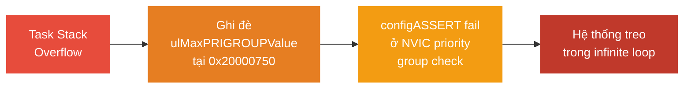

# <span style="color:#f1c40f">Chương 17: Mẹo Xử lý Sự cố & Bước Tiếp theo</span>
# <span style="color:#f1c40f">Troubleshooting Tips and Next Steps</span>

> [!TIP]
> Dùng **Ctrl+F** và tìm `## 1.`, `## 2.`, `## 3.` để nhảy nhanh đến từng mục.

```
 1. Mẹo Hữu ích                     — Thread analysis, memory monitoring, stack overflow
    ├─ 1.1 Dùng công cụ phân tích    — SystemView, Ozone, Tracealyzer
    ├─ 1.2 Giám sát bộ nhớ           — Stack sizing, heap hooks
    ├─ 1.3 Stack overflow checking    — MPU + software hooks
    └─ 1.4 Fix SystemView dropped    — 3 cách khắc phục khối đỏ
 2. configASSERT                     — Macro, 3 trigger phổ biến, KHÔNG BAO GIỜ tắt
 3. Case Study: Debug Hung System    — Từng bước 4 giai đoạn, Data Breakpoint
    ├─ 3.1 Thu thập dữ liệu         — Ozone Attach, Call Stack
    ├─ 3.2 Data Breakpoint           — AIRCR register, ulMaxPRIGROUPValue
    ├─ 3.3 Tìm Root Cause            — Stack overflow ghi đè biến static
    └─ 3.4 Sửa lỗi & Phòng ngừa     — Tăng stack, bật hooks
 4. Bước Tiếp theo                   — Sách, TDD, tài nguyên học thêm
 5. Câu hỏi Ôn tập                  — 3 câu hỏi
```

> [!NOTE]
> Chương này **không yêu cầu hardware/software** — tập trung vào phương pháp luận debug và kinh nghiệm thực chiến.

---

## <span style="color:#e67e22">1. Mẹo Hữu ích — Useful Tips</span>

### <span style="color:#1abc9c">1.1 Dùng Công cụ Phân tích Thread</span>

Chuyển từ bare-metal 8-bit sang 32-bit MCU (STM32F7) với RTOS → nhiều task tương tác phức tạp. **Không thể debug bằng mắt thường**.

| Công cụ | Vai trò |
|:---|:---|
| **SEGGER SystemView** | Visualize task execution timing, ISR interactions — dạng timeline |
| **Percepio Tracealyzer** | Alternative trace visualization — task state graph, signal flow |
| **SEGGER Ozone** | RTOS-aware debugger — xem trạng thái tất cả task đồng thời, call stack riêng từng task |

---

### <span style="color:#1abc9c">1.2 Giám sát Bộ nhớ</span>

> [!IMPORTANT]
> **Khác biệt lớn nhất giữa bare-metal và RTOS**: Bare-metal super-loop dùng **1 stack duy nhất** — RAM còn thừa bao nhiêu dùng bấy nhiêu. FreeRTOS yêu cầu **mỗi Task phải khai báo stack size cụ thể** → sizing sai = crash.

**Phải luôn bật 2 hook này** (đã học chi tiết ở Chương 15):

```c
// ① Stack overflow — phát hiện task tràn stack
#define configCHECK_FOR_STACK_OVERFLOW  2
void vApplicationStackOverflowHook(TaskHandle_t xTask, char *pcTaskName);

// ② Malloc failed — phát hiện hết heap
#define configUSE_MALLOC_FAILED_HOOK    1
void vApplicationMallocFailedHook(void);
```

---

### <span style="color:#1abc9c">1.3 Stack Overflow Checking</span>

* **Software hooks** (Method 1/2): Phát hiện khi context switch — có thể bỏ sót.
* **Hardware MPU**: Phát hiện **tại đúng instruction** gây tràn → **khuyến nghị dùng** nếu MCU hỗ trợ (Cortex-M3/M4/M7).

---

### <span style="color:#1abc9c">1.4 Fix SystemView Dropped Data — Khối Đỏ trên Timeline</span>

**Cơ chế**: SystemView log event vào **RTT buffer** trên MCU → truyền qua debug hardware (SWD/J-Link) → PC. Nếu buffer đầy trước khi debugger kịp đọc → **mất gói** → khối đỏ.

#### <span style="color:#3498db">3 Cách Khắc phục</span>

| # | Giải pháp | Trade-off |
|:---|:---|:---|
| **①** | **Tăng RTT buffer size** trong `SEGGER_SYSVIEW_Conf.h` (dòng 132): | Tốn thêm RAM MCU |
| | `#define SEGGER_SYSVIEW_RTT_BUFFER_SIZE  4096` | |
| **②** | **Tăng tốc độ clock debugger** trong Target Interface settings | Cần hardware debugger tốt hơn |
| **③** | **Đóng live trace/watch windows** trong IDE/Ozone đang mở | Giảm traffic SWD bus |

---

## <span style="color:#e67e22">2. configASSERT — Macro Bẫy Lỗi</span>

### <span style="color:#1abc9c">2.1 Định nghĩa</span>

```c
// FreeRTOSConfig.h
#define configASSERT( x )  if( ( x ) == 0 ) { taskDISABLE_INTERRUPTS(); for( ;; ); }
```

Khi điều kiện `x` sai → **tắt interrupt** + **vòng lặp vô hạn** → debugger pause tại đây → xem Call Stack để biết lỗi gì.

### <span style="color:#1abc9c">2.2 Ba Trigger Phổ biến nhất</span>

| # | Trigger | Nguyên nhân |
|:---|:---|:---|
| **①** | Gọi hàm **non-`FromISR`** bên trong ISR | Ví dụ: `xQueueSend()` thay vì `xQueueSendFromISR()` trong interrupt handler |
| **②** | ISR có priority **cao hơn** `configMAX_SYSCALL_INTERRUPT_PRIORITY` gọi FreeRTOS API | Priority số nhỏ = priority cao trên ARM → ISR quá ưu tiên, kernel không quản lý được |
| **③** | NVIC priority grouping **có sub-priority bits** | FreeRTOS yêu cầu `NVIC_PRIORITYGROUP_4` (4 bit preemption, 0 bit sub-priority) |

> [!CAUTION]
> **KHÔNG BAO GIỜ tắt hoặc che configASSERT!**
> 
> Tắt assertion chỉ **giấu triệu chứng** — lỗi gốc vẫn còn và sẽ biểu hiện muộn hơn dưới dạng khó debug hơn gấp bội. FreeRTOS cung cấp **comment chi tiết và link tài liệu** quanh mỗi assertion point — **ĐỌC CHÚNG**.

---

## <span style="color:#e67e22">3. Case Study: Debug Hệ thống Bị Treo — Debugging a Hung System</span>

> [!IMPORTANT]
> Đây là **case study quan trọng nhất của sách** — minh họa quy trình debug RTOS thực tế từ triệu chứng → root cause → fix, sử dụng Data Breakpoint phần cứng.

### <span style="color:#1abc9c">3.1 Triệu chứng</span>

* Code biên dịch thành công, LED nháy bình thường.
* Kết nối SEGGER SystemView để trace → **vài event xuất hiện rồi hệ thống đóng băng**:
  * LED ngừng nháy.
  * SystemView trace dừng hoàn toàn.

---

### <span style="color:#1abc9c">3.2 Giai đoạn 1: Thu thập Dữ liệu — Collecting Data</span>

#### <span style="color:#3498db">Bước 1: Attach Ozone không reset MCU</span>

```
Ozone → Target → "Attach to Running Program"
→ Kết nối vào MCU đang chạy MÀ KHÔNG reset
→ Giữ nguyên trạng thái CPU tại thời điểm crash
```

#### <span style="color:#3498db">Bước 2: Pause và xem PC</span>

**Kết quả**: PC đang kẹt trong **vòng lặp vô hạn** bên trong `configASSERT` tại `port.c`.

#### <span style="color:#3498db">Bước 3: Phân tích Call Stack</span>

```
Call Stack (đọc từ dưới lên):
─────────────────────────────────
  SEGGER_SYSVIEW_RecordSystime()    ← SystemView ghi timestamp
    → _cbGetTime()                  ← Callback lấy thời gian
      → xTaskGetTickCountFromISR()  ← Hàm FreeRTOS lấy tick count
        → configASSERT()  ← ❌ FAIL TẠI ĐÂY (port.c, dòng ~760)
─────────────────────────────────
```

#### <span style="color:#3498db">Bước 4: Đọc Source Code quanh Assertion</span>

```c
// port.c, dòng ~760 — Comment chi tiết giải thích:
// "Ensure NVIC priority grouping is configured correctly.
//  Interrupt nesting requires 0 sub-priority bits."
configASSERT( ( portAIRCR_REG & portPRIORITY_GROUP_MASK ) <= ulMaxPRIGROUPValue );
```

* Hover biến `ulMaxPRIGROUPValue` → giá trị mong đợi là `1`.
* Nhưng assertion fail → giá trị thực tế đã bị **corrupted**.

---

### <span style="color:#1abc9c">3.3 Giai đoạn 2: Đào sâu — Data Breakpoint</span>

#### <span style="color:#3498db">Bước 5: Kiểm tra AIRCR Register trong Memory Viewer</span>

```
Ozone → Memory Viewer → Địa chỉ: 0xE000ED0C (AIRCR register)
→ Trường PRIGROUP (mask 0x00000700) = giá trị 3
→ Mong đợi: 0 (= NVIC_PRIORITYGROUP_4, 0 sub-priority bits)
```

#### <span style="color:#3498db">Bước 6: Data Breakpoint trên AIRCR</span>

```
Ozone → Debug → Data Breakpoints:
    Address: 0xE000ED0C
    Access:  Write
    Size:    4 bytes
```

* **Restart MCU** → Breakpoint hit ngay lập tức.
* PC trỏ vào `HAL_InitTick`, nhưng ghi thực sự xảy ra trong `HAL_NVIC_SetPriorityGrouping`.

#### <span style="color:#3498db">Bước 7: Kiểm tra HAL Source</span>

```c
// stm32f7xx_hal_cortex.c — Comment:
// @arg NVIC_PRIORITYGROUP_4: 4 bits for preemption priority
//                            0 bits for subpriority
// → FreeRTOS yêu cầu: NVIC_PRIORITYGROUP_4 (0 sub-priority bits)
```

> [!NOTE]
> Đến đây, `AIRCR` có vẻ được cấu hình **đúng** bởi HAL. Vậy tại sao `ulMaxPRIGROUPValue` sai? → Cần đào sâu thêm.

---

### <span style="color:#1abc9c">3.4 Giai đoạn 3: Tìm Root Cause — Stack Overflow</span>

#### <span style="color:#3498db">Bước 8: Kiểm tra biến static trong port.c</span>

```c
// port.c — Khai báo biến static:
#if( configASSERT_DEFINED == 1 )
    static uint8_t  ucMaxSysCallPriority = 0;    // ← Biến static
    static uint32_t ulMaxPRIGROUPValue   = 0;    // ← Biến static tại 0x20000750
#endif
```

#### <span style="color:#3498db">Bước 9: Data Breakpoint trên ulMaxPRIGROUPValue</span>

```
Ozone → Data Breakpoints:
    Address: 0x20000750   (địa chỉ RAM của ulMaxPRIGROUPValue)
    Access:  Write
    Size:    4 bytes
```

* **Restart MCU** → Breakpoint hit...
* **Anomaly phát hiện**: PC đang ở **`SEGGER_RTT.c`** — file này **KHÔNG CÓ QUYỀN** ghi vào biến static của `port.c`!

#### <span style="color:#3498db">Bước 10: Phân tích Stack Pointer</span>

```
┌─────────────────────────────────────────────────────────┐
│  Địa chỉ RAM:                                           │
│                                                          │
│  0x20000740  ← SP (Stack Pointer) hiện tại              │
│  0x20000744  │  Task stack data (đã tràn!)              │
│  0x20000748  │                                          │
│  0x2000074C  │                                          │
│  0x20000750  ← ulMaxPRIGROUPValue (biến static)  ❌     │
│              │  BỊ GHI ĐÈ bởi stack tràn!              │
│  0x20000754  ← ucMaxSysCallPriority                     │
│              │                                          │
└─────────────────────────────────────────────────────────┘

SP = 0x20000740 → Stack đã tràn QUÁ giới hạn
→ Ghi đè vào vùng nhớ biến static tại 0x20000750
→ ulMaxPRIGROUPValue bị corrupted
→ configASSERT fail ở kiểm tra priority grouping
```

#### <span style="color:#3498db">Chuỗi Lỗi Hoàn chỉnh (Fault Chain)</span>



> [!CAUTION]
> **Bài học cốt lõi**: Stack overflow **KHÔNG phải lúc nào cũng gây HardFault**. Trong case này, nó **âm thầm ghi đè biến static** ở vùng nhớ liền kề → gây `configASSERT` fail ở assertion **tưởng chừng không liên quan** (NVIC priority check) → cực kỳ khó debug nếu không có **Hardware Data Breakpoint**.

---

### <span style="color:#1abc9c">3.5 Giai đoạn 4: Sửa lỗi & Phòng ngừa</span>

#### <span style="color:#3498db">Nguyên nhân gốc</span>

* Stack task ban đầu: **128 words** (512 bytes).
* Thêm SEGGER SystemView logging → tăng nested function calls + local variables → **vượt 512 bytes**.

#### <span style="color:#3498db">Fix</span>

```c
// main.c — Tăng stack size:
#define TASK_STACK_SIZE  256   // Từ 128 words (512B) → 256 words (1024B = 1KB)
```

#### <span style="color:#3498db">Phòng ngừa — Không để lặp lại</span>

| Biện pháp | Cách thực hiện |
|:---|:---|
| **Stack Overflow Hook** | Bật `configCHECK_FOR_STACK_OVERFLOW 2` + triển khai `vApplicationStackOverflowHook` |
| **MPU Guard Region** | Đặt MPU region read-only phía dưới task stack → MemManage Fault ngay lập tức |
| **High Water Mark** | Gọi `uxTaskGetStackHighWaterMark()` định kỳ để giám sát margin |
| **Generous Sizing** | Luôn dự trữ **≥ 2× margin** so với worst-case measured |

---

## <span style="color:#e67e22">4. Bước Tiếp theo — Next Steps</span>

### <span style="color:#1abc9c">4.1 Thực hành</span>

* Chạy **tất cả code example** trong sách trên board STM32 thật.
* Tái tạo lại case study ở mục 3 — cố ý gây stack overflow, dùng Ozone + Data Breakpoint để debug.

### <span style="color:#1abc9c">4.2 Sách Đọc thêm</span>

| Sách / Tài nguyên | Tác giả | Nội dung |
|:---|:---|:---|
| **Mastering the FreeRTOS™ Real-Time Kernel** | **Richard Barry** (tác giả FreeRTOS) | Chi tiết API FreeRTOS + kernel operations nâng cao |

### <span style="color:#1abc9c">4.3 TDD & Best Practices cho Embedded</span>

| Tài nguyên | Mô tả |
|:---|:---|
| **James Grenning** (`blog.wingman-sw.com`) | TDD for Embedded C/C++ — tác giả sách *Test-Driven Development for Embedded C* |
| **Matt Chernosky** (`electronvector.com`) | Embedded unit testing practices |
| **Throw the Switch** (`throwtheswitch.org`) | Ceedling, Unity, CMock — embedded test frameworks |
| **Jack Ganssle** (`ganssle.com`) | Decades of embedded HW/SW engineering principles |

---

## <span style="color:#e67e22">5. Bảng Tham chiếu: Registers, Địa chỉ, Biến, Hàm</span>

| Tên | Loại | Mô tả |
|:---|:---|:---|
| `0xE000ED0C` | Địa chỉ | NVIC **AIRCR** (Application Interrupt and Reset Control Register) |
| `0x20000750` | Địa chỉ RAM | Biến static `ulMaxPRIGROUPValue` trong `port.c` — bị stack overflow ghi đè |
| `0x20000740` | Địa chỉ RAM | Stack Pointer (SP) khi data breakpoint hit — chứng minh stack tràn |
| `portAIRCR_REG` | Macro | FreeRTOS macro tham chiếu AIRCR register |
| `portPRIORITY_GROUP_MASK` | Macro | Bitmask trích xuất PRIGROUP field từ AIRCR (`0x00000700`) |
| `ulMaxPRIGROUPValue` | Biến static | Giá trị max priority group cho phép — mong đợi `1`, bị corrupted |
| `ucMaxSysCallPriority` | Biến static | Giới hạn max syscall priority — nằm liền kề trong RAM |
| `SEGGER_SYSVIEW_RTT_BUFFER_SIZE` | Config Macro | Kích thước RTT buffer — dòng 132 `SEGGER_SYSVIEW_Conf.h` |
| `NVIC_PRIORITYGROUP_4` | Define | 4 bit preemption, 0 bit sub-priority — **bắt buộc** cho FreeRTOS |
| `HAL_NVIC_SetPriorityGrouping` | Hàm HAL | Cấu hình NVIC priority grouping |
| `xTaskGetTickCountFromISR` | FreeRTOS API | Lấy tick count an toàn từ ISR context |
| `xPortStartScheduler` | FreeRTOS API | Khởi tạo hardware + start scheduler |

---

## <span style="color:#e67e22">6. Tổng kết & Câu hỏi Ôn tập</span>

### <span style="color:#1abc9c">6.1 Key Takeaways</span>

* **Stack overflow = nguyên nhân crash #1** trong RTOS — biểu hiện **ở nơi không liên quan**, rất khó trace nếu không có công cụ.
* **configASSERT = hàng rào bảo vệ** — KHÔNG BAO GIỜ tắt. Đọc comment quanh assertion để hiểu lỗi.
* **Ozone "Attach to Running"** = công cụ cứu cánh khi hệ thống treo — không reset MCU, giữ nguyên state.
* **Hardware Data Breakpoint** = vũ khí mạnh nhất khi nghi ngờ memory corruption — bắt đúng instruction gây ghi.
* **SystemView dropped data**: Tăng RTT buffer, tăng clock debugger, đóng live views.
* **Quy trình debug RTOS**: Attach → Pause → Xem PC → Call Stack → Source Comment → Data Breakpoint → Root Cause.

---

### <span style="color:#1abc9c">6.2 Câu hỏi Ôn tập Cuối Chương</span>

> [!NOTE]
> **3 câu hỏi từ sách**:

#### **Câu 1**: "Khi hệ thống crash sau khi thêm interrupt hoặc dùng RTOS primitive mới, cần làm gì?"
* **Đáp án**:
  1. Kết nối debugger.
  2. Tìm PC dừng ở đâu.
  3. Nếu ở `configASSERT` → đọc comment quanh assertion.
  4. Nếu fail trước scheduler → có thể đã tràn FreeRTOS heap.

#### **Câu 2**: "Nêu 1 nguyên nhân gây hành vi bất thường khi phát triển với RTOS"
* **Đáp án** (bất kỳ 1 trong 3):
  * **Task stack overflow**.
  * **ISR priority sai** (cao hơn `configMAX_SYSCALL_INTERRUPT_PRIORITY`).
  * **Heap size không đủ**.

#### **Câu 3**: "Hệ thống không có cổng serial hay giao tiếp nào exposed → không thể debug?"
* **Đáp án: FALSE ❌**
* **SEGGER SystemView** cung cấp cả `printf` output lẫn trace instrumentation qua giao diện **SWD debug** (J-Link / RTT) — **không cần serial port vật lý**.

---

## <span style="color:#e67e22">7. Tài liệu Tham khảo</span>

* **Richard Barry** — *Mastering the FreeRTOS Real-Time Kernel*
* **James Grenning** — `https://blog.wingman-sw.com`
* **Throw the Switch (Ceedling/Unity/CMock)** — `https://www.throwtheswitch.org/`
* **Jack Ganssle** — `https://www.ganssle.com/`
* **SEGGER SystemView** — `https://www.segger.com/products/development-tools/systemview/`
* **Source Code** (toàn bộ sách): `https://github.com/PacktPublishing/Hands-On-RTOS-with-Microcontrollers`
